**Loading data**


```python
!pip install fuzzywuzzy
!pip install python-Levenshtein

```

    Requirement already satisfied: fuzzywuzzy in c:\users\iwont\anaconda3\lib\site-packages (0.18.0)
    Requirement already satisfied: python-Levenshtein in c:\users\iwont\anaconda3\lib\site-packages (0.25.1)
    Requirement already satisfied: Levenshtein==0.25.1 in c:\users\iwont\anaconda3\lib\site-packages (from python-Levenshtein) (0.25.1)
    Requirement already satisfied: rapidfuzz<4.0.0,>=3.8.0 in c:\users\iwont\anaconda3\lib\site-packages (from Levenshtein==0.25.1->python-Levenshtein) (3.9.4)
    


```python
import pandas as pd
import matplotlib.pyplot as plt
import seaborn as sns
from fuzzywuzzy import process
import re
from sklearn.feature_extraction.text import TfidfVectorizer
from sklearn.cluster import KMeans
from scipy.stats import linregress
import statsmodels.api as sm
from statsmodels.formula.api import ols
import folium
from folium.plugins import HeatMap
from geopy.geocoders import Nominatim
from prettytable import PrettyTable
from dateutil import parser
from geopy.distance import geodesic
import pandas as pd
import time
import numpy as np
from sklearn.model_selection import train_test_split
from sklearn.preprocessing import LabelEncoder, MinMaxScaler
from sklearn.ensemble import RandomForestClassifier, GradientBoostingClassifier, VotingClassifier
from sklearn.tree import DecisionTreeClassifier
import torch
import torch.nn as nn
import torch.optim as optim
from xgboost import XGBClassifier
from sklearn.metrics import confusion_matrix, roc_curve, auc, classification_report
import seaborn as sns
```


```python
books = pd.read_csv('data/books.csv')
checkouts = pd.read_csv('data/checkouts.csv')
customers = pd.read_csv('data/customers.csv')
libraries = pd.read_csv('data/libraries.csv')
```

**Data Cleaning**

1- Standardizing the wods using scikit-learn and clustering for extraction of similar words in Education, Gender, State, Occupation, and so on.


```python
def extract_keywords(column, num_clusters=4):
    vectorizer = TfidfVectorizer()
    X = vectorizer.fit_transform(column.dropna().astype(str))
    
    kmeans = KMeans(n_clusters=num_clusters, random_state=0)
    kmeans.fit(X)
    
    clusters = {}
    for i in range(num_clusters):
        cluster_center = kmeans.cluster_centers_[i]
        terms = vectorizer.get_feature_names_out()
        sorted_terms = [terms[ind] for ind in cluster_center.argsort()[-10:]]
        clusters[i] = sorted_terms
    return clusters
```

List of extracted standard words using scikit-learn


```python
standard_education = extract_keywords(customers['education'])
standard_gender = extract_keywords(customers['gender'], num_clusters=2)
standard_state = extract_keywords(customers['state'], num_clusters=3)
standard_occupation = extract_keywords(customers['occupation'], num_clusters=4)

print("Standard Education Keywords:", standard_education)
print("Standard Gender Keywords:", standard_gender)
print("Standard State Keywords:", standard_state)
print("Standard Occupation Keywords:", standard_occupation)

```

    Standard Education Keywords: {0: ['college', 'high', 'others', 'school', 'degree', 'graduate'], 1: ['college', 'degree', 'graduate', 'others', 'high', 'school'], 2: ['degree', 'graduate', 'high', 'others', 'school', 'college'], 3: ['college', 'degree', 'graduate', 'high', 'school', 'others']}
    Standard Gender Keywords: {0: ['female', 'male'], 1: ['male', 'female']}
    Standard State Keywords: {0: ['washington', 'oregon'], 1: ['oregon', 'washington'], 2: ['washington', 'oregon']}
    Standard Occupation Keywords: {0: ['health', 'others', 'tech', 'business', 'finance', 'blue', 'collar', 'admin', 'support', 'sales'], 1: ['blue', 'business', 'collar', 'education', 'finance', 'health', 'sales', 'support', 'tech', 'others'], 2: ['blue', 'business', 'collar', 'finance', 'others', 'sales', 'support', 'tech', 'education', 'health'], 3: ['blue', 'business', 'collar', 'education', 'finance', 'health', 'others', 'sales', 'support', 'tech']}
    

    C:\Users\iwont\anaconda3\Lib\site-packages\sklearn\base.py:1474: ConvergenceWarning: Number of distinct clusters (2) found smaller than n_clusters (3). Possibly due to duplicate points in X.
      return fit_method(estimator, *args, **kwargs)
    

Standardizing the words using fuzzy logic.


```python
#Function for Fuzzy matching method to map the values
def fuzzy_map_automated(column, standard_dict):
    standard_list_flat = [item for sublist in standard_dict.values() for item in sublist]
    mapped_values = column.apply(lambda x: process.extractOne(x, standard_list_flat)[0] if pd.notnull(x) else x)
    return mapped_values

customers['education'] = fuzzy_map_automated(customers['education'], standard_education)
customers['gender'] = fuzzy_map_automated(customers['gender'], standard_gender)
customers['state'] = fuzzy_map_automated(customers['state'], standard_state)
customers['occupation'] = fuzzy_map_automated(customers['occupation'], standard_occupation)

```

Manual standardization of words to improve previous methods. 


```python
standard_education = ['Graduate Degree', 'High School', 'College', 'Others']
standard_gender = ['Female', 'Male']
standard_state = ['Oregon', 'Washington']
standard_occupation = ['Admin & Support', 'Blue Collar','Business & Finance','Education & Health','Sales','Tech','Others']

def fuzzy_map(column, standard_list):
    mapped_values = column.apply(lambda x: process.extractOne(x, standard_list)[0] if pd.notnull(x) else x)
    return mapped_values
```


```python
# Applying the fuzzy method to unify columns and names
customers['education'] = fuzzy_map(customers['education'], standard_education)
customers['gender'] = fuzzy_map(customers['gender'], standard_gender)
customers['state'] = fuzzy_map(customers['state'], standard_state)
customers['occupation'] = fuzzy_map(customers['occupation'], standard_occupation)
```

Convert any NaN values to an empty string


```python
# Data cleaning and handling missing data
books.fillna('', inplace=True)
checkouts.fillna('', inplace=True)
customers.fillna('', inplace=True)
libraries.fillna('', inplace=True)
```


```python
checkouts.shape
```


    (2000, 5)


Convert date columns to datetime


```python
#Function to clean and unify date format
def clean_date(date_str):


    
#Remove unwanted characters and standardize separators
    clean_str = re.sub(r'[^0-9]', '-', date_str)
    return pd.to_datetime(clean_str, errors='coerce')
```


```python
checkouts['date_checkout'] = checkouts['date_checkout'].apply(clean_date)
checkouts['date_returned'] = checkouts['date_returned'].apply(clean_date)

```


```python
# Convert date columns to datetime
checkouts['date_checkout'] = pd.to_datetime(checkouts['date_checkout'], errors='coerce')
checkouts['date_returned'] = pd.to_datetime(checkouts['date_returned'], errors='coerce')

```


```python
checkouts['date_checkout'] 
```


    0      2019-01-28
    1      2018-05-29
    2      2018-11-23
    3      2018-01-15
    4      2018-12-31
              ...    
    1995   2018-07-19
    1996   2018-03-07
    1997   2018-06-17
    1998   2018-12-10
    1999   2018-10-10
    Name: date_checkout, Length: 2000, dtype: datetime64[ns]


```python
min(checkouts['date_checkout'] )
```


    Timestamp('1800-08-09 00:00:00')


```python
max(checkouts['date_checkout'] )
```


    Timestamp('2120-09-06 00:00:00')


```python
min(checkouts['date_returned'] )
```


    Timestamp('1800-04-28 00:00:00')


```python
max(checkouts['date_returned'] )
```


    Timestamp('2120-09-14 00:00:00')


```python
start_date = pd.to_datetime('2018-01-01')
end_date = pd.to_datetime('2019-12-30')

#Filtering the DataFrame to keep only rows where date_returned is greater than date_checkout and both dates are within the specified range
valid_checkouts = checkouts[(checkouts['date_returned'] > checkouts['date_checkout']) & 
                            (checkouts['date_checkout'] >= start_date) & 
                            (checkouts['date_returned'] <= end_date)]


```

Calculate late returns if the days late is more that 28 days


```python
min(valid_checkouts['date_checkout'] )
```


    Timestamp('2018-01-01 00:00:00')


```python
max(valid_checkouts['date_checkout'] )
```


    Timestamp('2018-12-31 00:00:00')


```python
min(valid_checkouts['date_returned'] )
```


    Timestamp('2018-01-08 00:00:00')


```python
max(valid_checkouts['date_returned'] )
```


    Timestamp('2019-05-21 00:00:00')


**Calcuate the late date**


```python
valid_checkouts['days_late'] = (valid_checkouts['date_returned'] - valid_checkouts['date_checkout']).dt.days - 28
valid_checkouts['late'] = valid_checkouts['days_late'] > 0

```

    C:\Users\iwont\AppData\Local\Temp\ipykernel_18264\1217986468.py:1: SettingWithCopyWarning: 
    A value is trying to be set on a copy of a slice from a DataFrame.
    Try using .loc[row_indexer,col_indexer] = value instead
    
    See the caveats in the documentation: https://pandas.pydata.org/pandas-docs/stable/user_guide/indexing.html#returning-a-view-versus-a-copy
      valid_checkouts['days_late'] = (valid_checkouts['date_returned'] - valid_checkouts['date_checkout']).dt.days - 28
    C:\Users\iwont\AppData\Local\Temp\ipykernel_18264\1217986468.py:2: SettingWithCopyWarning: 
    A value is trying to be set on a copy of a slice from a DataFrame.
    Try using .loc[row_indexer,col_indexer] = value instead
    
    See the caveats in the documentation: https://pandas.pydata.org/pandas-docs/stable/user_guide/indexing.html#returning-a-view-versus-a-copy
      valid_checkouts['late'] = valid_checkouts['days_late'] > 0
    


```python
valid_checkouts['late']
```


    1       False
    2        True
    3        True
    6       False
    8       False
            ...  
    1995    False
    1996    False
    1997    False
    1998    False
    1999    False
    Name: late, Length: 1451, dtype: bool


The shape of the matrix after cleaning and calculating the late.


```python
valid_checkouts.shape
```


    (1451, 7)


```python
valid_checkouts
```


<div>
<style scoped>
    .dataframe tbody tr th:only-of-type {
        vertical-align: middle;
    }

    .dataframe tbody tr th {
        vertical-align: top;
    }

    .dataframe thead th {
        text-align: right;
    }
</style>
<table border="1" class="dataframe">
  <thead>
    <tr style="text-align: right;">
      <th></th>
      <th>id</th>
      <th>patron_id</th>
      <th>library_id</th>
      <th>date_checkout</th>
      <th>date_returned</th>
      <th>days_late</th>
      <th>late</th>
    </tr>
  </thead>
  <tbody>
    <tr>
      <th>1</th>
      <td>HUX-y4oXl04C</td>
      <td>8d3f63e1deed89d7ba1bf6a4eb101373</td>
      <td>223-222@5xc-jxr-tgk</td>
      <td>2018-05-29</td>
      <td>2018-06-12</td>
      <td>-14</td>
      <td>False</td>
    </tr>
    <tr>
      <th>2</th>
      <td>TQpFnkku2poC</td>
      <td>4ae202f8de762591734705e0079d76df</td>
      <td>228-222@5xc-jtz-hwk</td>
      <td>2018-11-23</td>
      <td>2019-01-24</td>
      <td>34</td>
      <td>True</td>
    </tr>
    <tr>
      <th>3</th>
      <td>OQ6sDwAAQBAJ</td>
      <td>f9372de3c8ea501601aa3fb59ec0f524</td>
      <td>23v-222@5xc-jv7-v4v</td>
      <td>2018-01-15</td>
      <td>2018-04-25</td>
      <td>72</td>
      <td>True</td>
    </tr>
    <tr>
      <th>6</th>
      <td>CW-7tHAaVR0C</td>
      <td>dd9f34e9d65126a2b02003d8ac60aaa4</td>
      <td>22c-222@5xc-jwj-pvz</td>
      <td>2018-01-10</td>
      <td>2018-02-04</td>
      <td>-3</td>
      <td>False</td>
    </tr>
    <tr>
      <th>8</th>
      <td>t1e3BWziAc8C</td>
      <td>3b85b2c7b424618f533329018e9a11d5</td>
      <td>222-222@5xc-jv5-nt9</td>
      <td>2018-06-23</td>
      <td>2018-07-14</td>
      <td>-7</td>
      <td>False</td>
    </tr>
    <tr>
      <th>...</th>
      <td>...</td>
      <td>...</td>
      <td>...</td>
      <td>...</td>
      <td>...</td>
      <td>...</td>
      <td>...</td>
    </tr>
    <tr>
      <th>1995</th>
      <td>rNbuDwAAQBAJ</td>
      <td>91871955f3641857832766ac3f5a0b95</td>
      <td>222-222@5xc-jv5-nt9</td>
      <td>2018-07-19</td>
      <td>2018-08-12</td>
      <td>-4</td>
      <td>False</td>
    </tr>
    <tr>
      <th>1996</th>
      <td>rcrCAgAAQBAJ</td>
      <td>ad08956eb20efb746af650f906d439cf</td>
      <td>22d-222@5xc-kcy-8sq</td>
      <td>2018-03-07</td>
      <td>2018-03-13</td>
      <td>-22</td>
      <td>False</td>
    </tr>
    <tr>
      <th>1997</th>
      <td>F44fAQAAMAAJ</td>
      <td>026262cc3454149303074c4113b5f118</td>
      <td>226-222@5xc-jxj-7yv</td>
      <td>2018-06-17</td>
      <td>2018-06-27</td>
      <td>-18</td>
      <td>False</td>
    </tr>
    <tr>
      <th>1998</th>
      <td>Ci1HAQAAMAAJ</td>
      <td>08b29865e58e9b2aabff9684a703acf0</td>
      <td>223-222@5xc-jxr-tgk</td>
      <td>2018-12-10</td>
      <td>2018-12-29</td>
      <td>-9</td>
      <td>False</td>
    </tr>
    <tr>
      <th>1999</th>
      <td>TUAyAQAAMAAJ</td>
      <td>ac0bb7b22b4df999a0b1216ded727f8e</td>
      <td>228-222@5xc-jtz-hwk</td>
      <td>2018-10-10</td>
      <td>2018-11-01</td>
      <td>-6</td>
      <td>False</td>
    </tr>
  </tbody>
</table>
<p>1451 rows × 7 columns</p>
</div>


```python
#late returns rate
late_rate = valid_checkouts['late'].mean()
print(f"Rate of late returns: {late_rate * 100:.2f}%")
```

    Rate of late returns: 9.10%
    


```python
late_rate = valid_checkouts['late'].value_counts()

labels = ['Normal Return', 'Late Return'] if late_rate.index[0] == False else ['Late Return', 'Normal Return']

colors = sns.color_palette('pastel')


plt.figure(figsize=(10, 6))
plt.pie(late_rate.values, labels=labels, autopct='%1.1f%%', startangle=140, colors=colors,
        wedgeprops={'edgecolor': 'black', 'linewidth': 1.5})
plt.title('Return Status', fontsize=16, fontweight='bold')
plt.axis('equal')  


plt.legend(title='Return Status', title_fontsize='13', fontsize='11', loc='upper right')

plt.show()
```


    
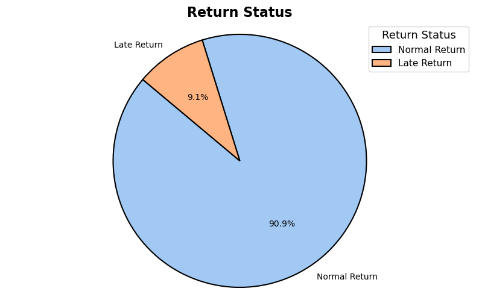
    


```python
valid_checkouts_old = valid_checkouts

# Merging process
valid_checkouts = valid_checkouts.merge(libraries, left_on='library_id', right_on='id', how='left')
valid_checkouts = valid_checkouts.merge(customers[['id', 'street_address','birth_date', 'gender', 'education', 'occupation']], left_on='patron_id', right_on='id', how='left')
valid_checkouts = valid_checkouts.merge(books[['id', 'categories', 'price', 'pages', 'publishedDate', 'publisher', 'authors']], left_on='id_x', right_on='id', how='left', suffixes=('_checkout', '_book'))

#Rename the merged street_address column to avoid confusion
valid_checkouts.rename(columns={'street_address': 'customer_street_address'}, inplace=True)
```


```python
valid_checkouts
```


<div>
<style scoped>
    .dataframe tbody tr th:only-of-type {
        vertical-align: middle;
    }

    .dataframe tbody tr th {
        vertical-align: top;
    }

    .dataframe thead th {
        text-align: right;
    }
</style>
<table border="1" class="dataframe">
  <thead>
    <tr style="text-align: right;">
      <th></th>
      <th>id_x</th>
      <th>patron_id</th>
      <th>library_id</th>
      <th>date_checkout</th>
      <th>date_returned</th>
      <th>days_late</th>
      <th>late</th>
      <th>id_y</th>
      <th>name</th>
      <th>street_address_x</th>
      <th>...</th>
      <th>gender</th>
      <th>education</th>
      <th>occupation</th>
      <th>id_book</th>
      <th>categories</th>
      <th>price</th>
      <th>pages</th>
      <th>publishedDate</th>
      <th>publisher</th>
      <th>authors</th>
    </tr>
  </thead>
  <tbody>
    <tr>
      <th>0</th>
      <td>HUX-y4oXl04C</td>
      <td>8d3f63e1deed89d7ba1bf6a4eb101373</td>
      <td>223-222@5xc-jxr-tgk</td>
      <td>2018-05-29</td>
      <td>2018-06-12</td>
      <td>-14</td>
      <td>False</td>
      <td>223-222@5xc-jxr-tgk</td>
      <td>MULTNOMAH County Library Woodstock</td>
      <td>6008 se 49TH AVE</td>
      <td>...</td>
      <td>Female</td>
      <td>Graduate Degree</td>
      <td>Tech</td>
      <td>HUX-y4oXl04C</td>
      <td></td>
      <td>416.99</td>
      <td>752</td>
      <td>2006-06-01</td>
      <td>Tata McGraw-Hill Education</td>
      <td>['Khan']</td>
    </tr>
    <tr>
      <th>1</th>
      <td>TQpFnkku2poC</td>
      <td>4ae202f8de762591734705e0079d76df</td>
      <td>228-222@5xc-jtz-hwk</td>
      <td>2018-11-23</td>
      <td>2019-01-24</td>
      <td>34</td>
      <td>True</td>
      <td>228-222@5xc-jtz-hwk</td>
      <td>Multnomah  County Library</td>
      <td>205 NE   Russell  St</td>
      <td>...</td>
      <td>Male</td>
      <td>Graduate Degree</td>
      <td>Education &amp; Health</td>
      <td>TQpFnkku2poC</td>
      <td>['Advertising']</td>
      <td>217.0</td>
      <td>790</td>
      <td>2004</td>
      <td>Atlantic Publishers &amp; Dist</td>
      <td>['C. L. Tyagi', 'Arun Kumar']</td>
    </tr>
    <tr>
      <th>2</th>
      <td>OQ6sDwAAQBAJ</td>
      <td>f9372de3c8ea501601aa3fb59ec0f524</td>
      <td>23v-222@5xc-jv7-v4v</td>
      <td>2018-01-15</td>
      <td>2018-04-25</td>
      <td>72</td>
      <td>True</td>
      <td>23v-222@5xc-jv7-v4v</td>
      <td>Multnomah County Library Northwest</td>
      <td>2300 NW Thurman  St</td>
      <td>...</td>
      <td>Male</td>
      <td>Graduate Degree</td>
      <td>Sales</td>
      <td>OQ6sDwAAQBAJ</td>
      <td>['Technology &amp; Engineering']</td>
      <td>190.5</td>
      <td>597</td>
      <td>2019-08-29</td>
      <td>Butterworth-Heinemann</td>
      <td>['Masaaki Okubo', 'Takuya Kuwahara']</td>
    </tr>
    <tr>
      <th>3</th>
      <td>CW-7tHAaVR0C</td>
      <td>dd9f34e9d65126a2b02003d8ac60aaa4</td>
      <td>22c-222@5xc-jwj-pvz</td>
      <td>2018-01-10</td>
      <td>2018-02-04</td>
      <td>-3</td>
      <td>False</td>
      <td>22c-222@5xc-jwj-pvz</td>
      <td>MULTNOMAH County Library KENTON</td>
      <td>8226 N DENVER Ave</td>
      <td>...</td>
      <td>Male</td>
      <td>Graduate Degree</td>
      <td>Education &amp; Health</td>
      <td>CW-7tHAaVR0C</td>
      <td>['Science']</td>
      <td>414.5</td>
      <td>561</td>
      <td>1997</td>
      <td>Oxford University Press on Demand</td>
      <td>['Pierre Goovaerts', 'Department of Civil and ...</td>
    </tr>
    <tr>
      <th>4</th>
      <td>t1e3BWziAc8C</td>
      <td>3b85b2c7b424618f533329018e9a11d5</td>
      <td>222-222@5xc-jv5-nt9</td>
      <td>2018-06-23</td>
      <td>2018-07-14</td>
      <td>-7</td>
      <td>False</td>
      <td>222-222@5xc-jv5-nt9</td>
      <td>Multnomah  County  Library  North Portland</td>
      <td>512    N Killingsworth St</td>
      <td>...</td>
      <td>Male</td>
      <td>High School</td>
      <td>Business &amp; Finance</td>
      <td>t1e3BWziAc8C</td>
      <td>['Conservation of natural resources']</td>
      <td>149.0</td>
      <td>530</td>
      <td>1994</td>
      <td></td>
      <td>['United States. National Park Service']</td>
    </tr>
    <tr>
      <th>...</th>
      <td>...</td>
      <td>...</td>
      <td>...</td>
      <td>...</td>
      <td>...</td>
      <td>...</td>
      <td>...</td>
      <td>...</td>
      <td>...</td>
      <td>...</td>
      <td>...</td>
      <td>...</td>
      <td>...</td>
      <td>...</td>
      <td>...</td>
      <td>...</td>
      <td>...</td>
      <td>...</td>
      <td>...</td>
      <td>...</td>
      <td>...</td>
    </tr>
    <tr>
      <th>1446</th>
      <td>rNbuDwAAQBAJ</td>
      <td>91871955f3641857832766ac3f5a0b95</td>
      <td>222-222@5xc-jv5-nt9</td>
      <td>2018-07-19</td>
      <td>2018-08-12</td>
      <td>-4</td>
      <td>False</td>
      <td>222-222@5xc-jv5-nt9</td>
      <td>Multnomah  County  Library  North Portland</td>
      <td>512    N Killingsworth St</td>
      <td>...</td>
      <td>Male</td>
      <td>Graduate Degree</td>
      <td>Education &amp; Health</td>
      <td>rNbuDwAAQBAJ</td>
      <td></td>
      <td>302.0</td>
      <td>668</td>
      <td>2021-01-08</td>
      <td></td>
      <td>['Wayland D. Hand']</td>
    </tr>
    <tr>
      <th>1447</th>
      <td>rcrCAgAAQBAJ</td>
      <td>ad08956eb20efb746af650f906d439cf</td>
      <td>22d-222@5xc-kcy-8sq</td>
      <td>2018-03-07</td>
      <td>2018-03-13</td>
      <td>-22</td>
      <td>False</td>
      <td>22d-222@5xc-kcy-8sq</td>
      <td>Multnomah County  Library   Sellwood  Moreland</td>
      <td>7860 SE 13th AVE</td>
      <td>...</td>
      <td>Female</td>
      <td>High School</td>
      <td>Education &amp; Health</td>
      <td>rcrCAgAAQBAJ</td>
      <td>['Science']</td>
      <td>506.99</td>
      <td>493</td>
      <td>2013-03-13</td>
      <td>Courier Corporation</td>
      <td>['J. P. Den Hartog']</td>
    </tr>
    <tr>
      <th>1448</th>
      <td>F44fAQAAMAAJ</td>
      <td>026262cc3454149303074c4113b5f118</td>
      <td>226-222@5xc-jxj-7yv</td>
      <td>2018-06-17</td>
      <td>2018-06-27</td>
      <td>-18</td>
      <td>False</td>
      <td>226-222@5xc-jxj-7yv</td>
      <td>Multnomah County Library Belmont</td>
      <td>1038 SE CESAR E CHAVEZ blvd</td>
      <td>...</td>
      <td>Female</td>
      <td>High School</td>
      <td>Education &amp; Health</td>
      <td>F44fAQAAMAAJ</td>
      <td>['Industries']</td>
      <td>371.0</td>
      <td>751</td>
      <td>1916</td>
      <td></td>
      <td></td>
    </tr>
    <tr>
      <th>1449</th>
      <td>Ci1HAQAAMAAJ</td>
      <td>08b29865e58e9b2aabff9684a703acf0</td>
      <td>223-222@5xc-jxr-tgk</td>
      <td>2018-12-10</td>
      <td>2018-12-29</td>
      <td>-9</td>
      <td>False</td>
      <td>223-222@5xc-jxr-tgk</td>
      <td>MULTNOMAH County Library Woodstock</td>
      <td>6008 se 49TH AVE</td>
      <td>...</td>
      <td>Male</td>
      <td>Graduate Degree</td>
      <td></td>
      <td>Ci1HAQAAMAAJ</td>
      <td>['Electric railroads']</td>
      <td>484.0</td>
      <td>635</td>
      <td>1909</td>
      <td></td>
      <td></td>
    </tr>
    <tr>
      <th>1450</th>
      <td>TUAyAQAAMAAJ</td>
      <td>ac0bb7b22b4df999a0b1216ded727f8e</td>
      <td>228-222@5xc-jtz-hwk</td>
      <td>2018-10-10</td>
      <td>2018-11-01</td>
      <td>-6</td>
      <td>False</td>
      <td>228-222@5xc-jtz-hwk</td>
      <td>Multnomah  County Library</td>
      <td>205 NE   Russell  St</td>
      <td>...</td>
      <td>Male</td>
      <td>Others</td>
      <td>Admin &amp; Support</td>
      <td>TUAyAQAAMAAJ</td>
      <td>['Medicine']</td>
      <td>267.99</td>
      <td>#507</td>
      <td>1921</td>
      <td></td>
      <td></td>
    </tr>
  </tbody>
</table>
<p>1451 rows × 26 columns</p>
</div>


```python
#Defining the clean_date function to extract the year
def clean_date(date_str):
    try:
        parsed_date = parser.parse(date_str, fuzzy=True)
        return parsed_date.year
    except (parser.ParserError, TypeError, ValueError):
        return None

valid_checkouts['publishedDate'] = valid_checkouts['publishedDate'].apply(clean_date).astype('Int64')

```


```python
valid_checkouts['birth_date'] = pd.to_datetime(valid_checkouts['birth_date'], errors='coerce')

```


```python
valid_checkouts = valid_checkouts[(valid_checkouts['birth_date'] > pd.to_datetime('1950-01-01'))&
                                   (valid_checkouts['birth_date'] < pd.to_datetime('2008-12-30'))]

```


```python
# Reference date for age calculation (checkout date)
def calculate_age(birth_date, ref_date):
    return ref_date.year - birth_date.year - ((ref_date.month, ref_date.day) < (birth_date.month, birth_date.day))

valid_checkouts['age'] = valid_checkouts.apply(lambda row: calculate_age(row['birth_date'], row['date_checkout']), axis=1)

```

    C:\Users\iwont\AppData\Local\Temp\ipykernel_18264\2379820412.py:5: SettingWithCopyWarning: 
    A value is trying to be set on a copy of a slice from a DataFrame.
    Try using .loc[row_indexer,col_indexer] = value instead
    
    See the caveats in the documentation: https://pandas.pydata.org/pandas-docs/stable/user_guide/indexing.html#returning-a-view-versus-a-copy
      valid_checkouts['age'] = valid_checkouts.apply(lambda row: calculate_age(row['birth_date'], row['date_checkout']), axis=1)
    


```python
# Adding age_group column based on age
def age_group(age):
    if age <= 17:
        return 'young'
    elif 18 <= age <= 25:
        return 'youth'
    elif 26 <= age <= 35:
        return 'adult'
    elif 36 <= age <= 45:
        return 'middle-aged'
    elif age> 45:
        return 'senior'

valid_checkouts['age_group'] = valid_checkouts['age'].apply(age_group)
```

    C:\Users\iwont\AppData\Local\Temp\ipykernel_18264\2192350308.py:14: SettingWithCopyWarning: 
    A value is trying to be set on a copy of a slice from a DataFrame.
    Try using .loc[row_indexer,col_indexer] = value instead
    
    See the caveats in the documentation: https://pandas.pydata.org/pandas-docs/stable/user_guide/indexing.html#returning-a-view-versus-a-copy
      valid_checkouts['age_group'] = valid_checkouts['age'].apply(age_group)
    


```python
valid_checkouts
```


<div>
<style scoped>
    .dataframe tbody tr th:only-of-type {
        vertical-align: middle;
    }

    .dataframe tbody tr th {
        vertical-align: top;
    }

    .dataframe thead th {
        text-align: right;
    }
</style>
<table border="1" class="dataframe">
  <thead>
    <tr style="text-align: right;">
      <th></th>
      <th>id_x</th>
      <th>patron_id</th>
      <th>library_id</th>
      <th>date_checkout</th>
      <th>date_returned</th>
      <th>days_late</th>
      <th>late</th>
      <th>id_y</th>
      <th>name</th>
      <th>street_address_x</th>
      <th>...</th>
      <th>occupation</th>
      <th>id_book</th>
      <th>categories</th>
      <th>price</th>
      <th>pages</th>
      <th>publishedDate</th>
      <th>publisher</th>
      <th>authors</th>
      <th>age</th>
      <th>age_group</th>
    </tr>
  </thead>
  <tbody>
    <tr>
      <th>0</th>
      <td>HUX-y4oXl04C</td>
      <td>8d3f63e1deed89d7ba1bf6a4eb101373</td>
      <td>223-222@5xc-jxr-tgk</td>
      <td>2018-05-29</td>
      <td>2018-06-12</td>
      <td>-14</td>
      <td>False</td>
      <td>223-222@5xc-jxr-tgk</td>
      <td>MULTNOMAH County Library Woodstock</td>
      <td>6008 se 49TH AVE</td>
      <td>...</td>
      <td>Tech</td>
      <td>HUX-y4oXl04C</td>
      <td></td>
      <td>416.99</td>
      <td>752</td>
      <td>2006</td>
      <td>Tata McGraw-Hill Education</td>
      <td>['Khan']</td>
      <td>53</td>
      <td>senior</td>
    </tr>
    <tr>
      <th>1</th>
      <td>TQpFnkku2poC</td>
      <td>4ae202f8de762591734705e0079d76df</td>
      <td>228-222@5xc-jtz-hwk</td>
      <td>2018-11-23</td>
      <td>2019-01-24</td>
      <td>34</td>
      <td>True</td>
      <td>228-222@5xc-jtz-hwk</td>
      <td>Multnomah  County Library</td>
      <td>205 NE   Russell  St</td>
      <td>...</td>
      <td>Education &amp; Health</td>
      <td>TQpFnkku2poC</td>
      <td>['Advertising']</td>
      <td>217.0</td>
      <td>790</td>
      <td>2004</td>
      <td>Atlantic Publishers &amp; Dist</td>
      <td>['C. L. Tyagi', 'Arun Kumar']</td>
      <td>55</td>
      <td>senior</td>
    </tr>
    <tr>
      <th>3</th>
      <td>CW-7tHAaVR0C</td>
      <td>dd9f34e9d65126a2b02003d8ac60aaa4</td>
      <td>22c-222@5xc-jwj-pvz</td>
      <td>2018-01-10</td>
      <td>2018-02-04</td>
      <td>-3</td>
      <td>False</td>
      <td>22c-222@5xc-jwj-pvz</td>
      <td>MULTNOMAH County Library KENTON</td>
      <td>8226 N DENVER Ave</td>
      <td>...</td>
      <td>Education &amp; Health</td>
      <td>CW-7tHAaVR0C</td>
      <td>['Science']</td>
      <td>414.5</td>
      <td>561</td>
      <td>1997</td>
      <td>Oxford University Press on Demand</td>
      <td>['Pierre Goovaerts', 'Department of Civil and ...</td>
      <td>33</td>
      <td>adult</td>
    </tr>
    <tr>
      <th>4</th>
      <td>t1e3BWziAc8C</td>
      <td>3b85b2c7b424618f533329018e9a11d5</td>
      <td>222-222@5xc-jv5-nt9</td>
      <td>2018-06-23</td>
      <td>2018-07-14</td>
      <td>-7</td>
      <td>False</td>
      <td>222-222@5xc-jv5-nt9</td>
      <td>Multnomah  County  Library  North Portland</td>
      <td>512    N Killingsworth St</td>
      <td>...</td>
      <td>Business &amp; Finance</td>
      <td>t1e3BWziAc8C</td>
      <td>['Conservation of natural resources']</td>
      <td>149.0</td>
      <td>530</td>
      <td>1994</td>
      <td></td>
      <td>['United States. National Park Service']</td>
      <td>41</td>
      <td>middle-aged</td>
    </tr>
    <tr>
      <th>5</th>
      <td>2mtCAAAAYAAJ</td>
      <td>365ab35282c5d61b319ff9cc3628e624</td>
      <td>228-222@5xc-jtz-hwk</td>
      <td>2018-08-07</td>
      <td>2018-08-25</td>
      <td>-10</td>
      <td>False</td>
      <td>228-222@5xc-jtz-hwk</td>
      <td>Multnomah  County Library</td>
      <td>205 NE   Russell  St</td>
      <td>...</td>
      <td>Tech</td>
      <td>2mtCAAAAYAAJ</td>
      <td>['Agricultural education']</td>
      <td>432.5</td>
      <td>684</td>
      <td>1924</td>
      <td></td>
      <td>['Edwin Ray Hoskins']</td>
      <td>50</td>
      <td>senior</td>
    </tr>
    <tr>
      <th>...</th>
      <td>...</td>
      <td>...</td>
      <td>...</td>
      <td>...</td>
      <td>...</td>
      <td>...</td>
      <td>...</td>
      <td>...</td>
      <td>...</td>
      <td>...</td>
      <td>...</td>
      <td>...</td>
      <td>...</td>
      <td>...</td>
      <td>...</td>
      <td>...</td>
      <td>...</td>
      <td>...</td>
      <td>...</td>
      <td>...</td>
      <td>...</td>
    </tr>
    <tr>
      <th>1442</th>
      <td>1_1OtAEACAAJ</td>
      <td>250a35a5fcef683b655097c5b8faae0c</td>
      <td>223-222@5xc-jxr-tgk</td>
      <td>2018-12-08</td>
      <td>2018-12-14</td>
      <td>-22</td>
      <td>False</td>
      <td>223-222@5xc-jxr-tgk</td>
      <td>MULTNOMAH County Library Woodstock</td>
      <td>6008 se 49TH AVE</td>
      <td>...</td>
      <td>Admin &amp; Support</td>
      <td>1_1OtAEACAAJ</td>
      <td></td>
      <td>204.0</td>
      <td>547</td>
      <td>2017</td>
      <td></td>
      <td>['Eugene Schwartz']</td>
      <td>48</td>
      <td>senior</td>
    </tr>
    <tr>
      <th>1443</th>
      <td>TH8SSrWcVQ4C</td>
      <td>6e58a20b8fe97c5f73815046be1c41df</td>
      <td>23v-222@5xc-jv7-v4v</td>
      <td>2018-08-16</td>
      <td>2018-09-05</td>
      <td>-8</td>
      <td>False</td>
      <td>23v-222@5xc-jv7-v4v</td>
      <td>Multnomah County Library Northwest</td>
      <td>2300 NW Thurman  St</td>
      <td>...</td>
      <td>Business &amp; Finance</td>
      <td>TH8SSrWcVQ4C</td>
      <td>['Advertising']</td>
      <td>400.99</td>
      <td>635</td>
      <td>1984</td>
      <td></td>
      <td></td>
      <td>29</td>
      <td>adult</td>
    </tr>
    <tr>
      <th>1447</th>
      <td>rcrCAgAAQBAJ</td>
      <td>ad08956eb20efb746af650f906d439cf</td>
      <td>22d-222@5xc-kcy-8sq</td>
      <td>2018-03-07</td>
      <td>2018-03-13</td>
      <td>-22</td>
      <td>False</td>
      <td>22d-222@5xc-kcy-8sq</td>
      <td>Multnomah County  Library   Sellwood  Moreland</td>
      <td>7860 SE 13th AVE</td>
      <td>...</td>
      <td>Education &amp; Health</td>
      <td>rcrCAgAAQBAJ</td>
      <td>['Science']</td>
      <td>506.99</td>
      <td>493</td>
      <td>2013</td>
      <td>Courier Corporation</td>
      <td>['J. P. Den Hartog']</td>
      <td>50</td>
      <td>senior</td>
    </tr>
    <tr>
      <th>1449</th>
      <td>Ci1HAQAAMAAJ</td>
      <td>08b29865e58e9b2aabff9684a703acf0</td>
      <td>223-222@5xc-jxr-tgk</td>
      <td>2018-12-10</td>
      <td>2018-12-29</td>
      <td>-9</td>
      <td>False</td>
      <td>223-222@5xc-jxr-tgk</td>
      <td>MULTNOMAH County Library Woodstock</td>
      <td>6008 se 49TH AVE</td>
      <td>...</td>
      <td></td>
      <td>Ci1HAQAAMAAJ</td>
      <td>['Electric railroads']</td>
      <td>484.0</td>
      <td>635</td>
      <td>1909</td>
      <td></td>
      <td></td>
      <td>38</td>
      <td>middle-aged</td>
    </tr>
    <tr>
      <th>1450</th>
      <td>TUAyAQAAMAAJ</td>
      <td>ac0bb7b22b4df999a0b1216ded727f8e</td>
      <td>228-222@5xc-jtz-hwk</td>
      <td>2018-10-10</td>
      <td>2018-11-01</td>
      <td>-6</td>
      <td>False</td>
      <td>228-222@5xc-jtz-hwk</td>
      <td>Multnomah  County Library</td>
      <td>205 NE   Russell  St</td>
      <td>...</td>
      <td>Admin &amp; Support</td>
      <td>TUAyAQAAMAAJ</td>
      <td>['Medicine']</td>
      <td>267.99</td>
      <td>#507</td>
      <td>1921</td>
      <td></td>
      <td></td>
      <td>55</td>
      <td>senior</td>
    </tr>
  </tbody>
</table>
<p>1218 rows × 28 columns</p>
</div>


Analayis of different factors for the case with late


```python
# Factors associated with late returns
late_by_library = valid_checkouts.groupby('library_id')['late'].mean()
late_by_education = valid_checkouts.groupby('education')['late'].mean()
late_by_gender = valid_checkouts.groupby('gender')['late'].mean()
late_by_categories = valid_checkouts.groupby('categories')['late'].mean()
late_by_pages = valid_checkouts.groupby('pages')['late'].mean()
late_by_price = valid_checkouts.groupby('price')['late'].mean()
late_by_age_group = valid_checkouts.groupby('age_group')['late'].mean()
late_by_occupation = valid_checkouts.groupby('occupation')['late'].mean()
late_by_publishedDate = valid_checkouts.groupby('publishedDate')['late'].mean()
late_by_publisher = valid_checkouts.groupby('publisher')['late'].mean()
late_by_authors = valid_checkouts.groupby('authors')['late'].mean()
late_by_authors_count = valid_checkouts.groupby('authors')['late'].sum()

```


```python
libraries.loc[libraries.id == late_by_library.index, 'name']
```


    14    Multnomah  County Library Albina
    Name: name, dtype: object


```python
# Aligning and filtering libraries.id and late_by_library.index
filtered_libraries = libraries[libraries.id.isin(late_by_library.index)]

# Correcting capitalization and spacing
filtered_libraries['name'] = filtered_libraries['name'].str.replace(r'\s+', ' ', regex=True).str.title()

# Handling identical names by appending numbers
name_counts = {}
new_names = []
for name in filtered_libraries['name']:
    if name in name_counts:
        name_counts[name] += 1
        new_name = f"{name} {name_counts[name]}"
    else:
        name_counts[name] = 1
        new_name = name
    new_names.append(new_name)

filtered_libraries['name'] = new_names


filtered_libraries['late_return_rate'] = late_by_library[filtered_libraries.id].values * 100
sorted_libraries = filtered_libraries.sort_values(by='late_return_rate', ascending=True)

sns.set_palette('pastel')

plt.figure(figsize=(12, 7))
sns.barplot(y=sorted_libraries['name'], x=sorted_libraries['late_return_rate'])
plt.title('Late Return Rate by Library', fontsize=16, fontweight='bold')
plt.ylabel('Library', fontsize=14)
plt.xlabel('Late Return Rate (%)', fontsize=14)
plt.xticks(rotation=0, fontsize=12)
plt.yticks(fontsize=12)

for index, value in enumerate(sorted_libraries['late_return_rate']):
    plt.text(value + 0.5, index, f'{value:.2f}%', va='center', ha='left', color='black', fontsize=12)

plt.grid(axis='x', linestyle='--', alpha=0.7)
plt.tight_layout()
plt.show()

```


    
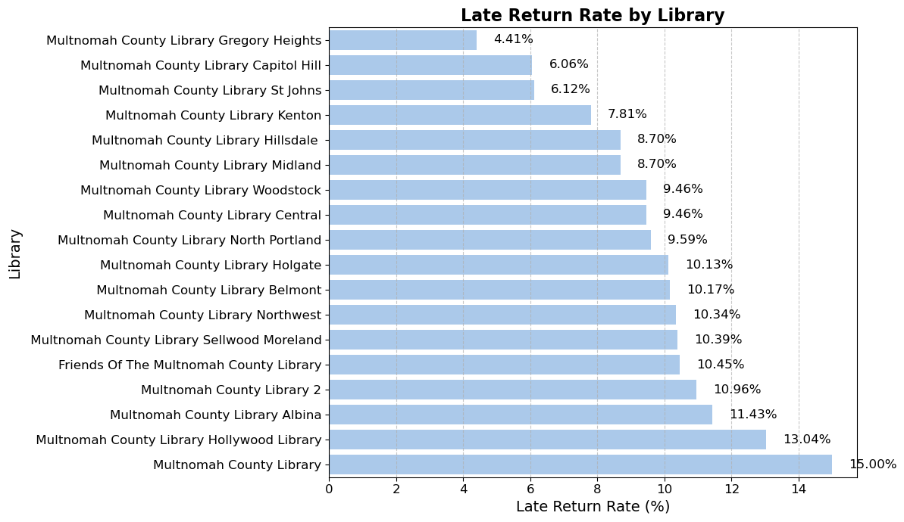
    


```python
late_by_education
```


    education
                       0.116667
    College            0.107266
    Graduate Degree    0.083650
    High School        0.087500
    Others             0.101399
    Name: late, dtype: float64


```python
# Replacing blank values in late_by_education with Unknown Education Level
late_by_education.index = late_by_education.index.to_series().replace('', 'Unknown Education Level')

late_by_education = late_by_education.reindex(late_by_education.index.to_list()[1:] + ['Unknown Education Level'])

colors = sns.color_palette('pastel')

plt.figure(figsize=(10, 6))
plt.pie(late_by_education.values, labels=None, autopct='%1.1f%%', startangle=140, colors=colors,
        wedgeprops={'edgecolor': 'black', 'linewidth': 1.5}, textprops={'fontsize': 12})
plt.title('Late Return Rate by Education Level', fontsize=16, fontweight='bold')
plt.axis('equal')

plt.legend(labels=late_by_education.index, title='Education Level', title_fontsize='13', fontsize='11', loc='upper left')

plt.show()

```


    
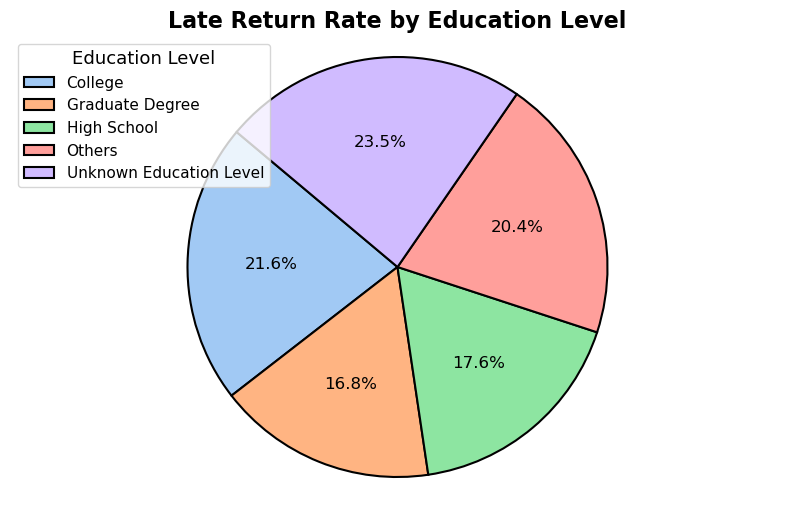
    


```python
#Replacing blank values with 'Unknown Gender'
late_by_gender.index = late_by_gender.index.to_series().replace('', 'Unknown Gender')

colors = sns.color_palette('pastel')

plt.figure(figsize=(10, 6))
plt.pie(late_by_gender.values, labels=None, autopct='%1.1f%%', startangle=140, colors=colors,
        wedgeprops={'edgecolor': 'black', 'linewidth': 1.5}, textprops={'fontsize': 12})
plt.title('Late Return Rate by Gender', fontsize=16, fontweight='bold')
plt.axis('equal')

plt.legend(labels=late_by_gender.index, title='Gender', title_fontsize='13', fontsize='11', loc='upper left')

plt.show()
```


    
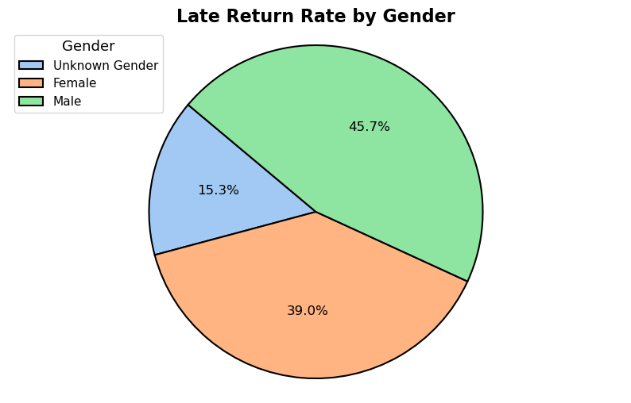
    


```python
#Replacing blank categories with 'Unknown Category'
late_by_categories.index = late_by_categories.index.to_series().replace('', 'Unknown Category')

#Combining all categories with zero return rate into 'Rest of the Categories'
zero_return_categories = late_by_categories[late_by_categories == 0].index
late_by_categories_combined = late_by_categories.copy()
late_by_categories_combined = late_by_categories_combined[late_by_categories_combined > 0]
late_by_categories_combined['Rest of the Categories'] = 0

# Sorting the categories
sorted_late_by_categories = late_by_categories_combined.sort_values()

sns.set_palette('pastel')

plt.figure(figsize=(12, 10))
sns.barplot(y=sorted_late_by_categories.index, x=sorted_late_by_categories.values * 100)
plt.title('Late Return Rate by Categories', fontsize=16, fontweight='bold')
plt.xlabel('Late Return Rate (%)', fontsize=14)
plt.ylabel('Categories', fontsize=14)
plt.xticks(rotation=0, fontsize=12)  # Adjust the x-axis text size
plt.yticks(fontsize=12)

for index, value in enumerate(sorted_late_by_categories.values * 100):
    plt.text(value + 0.5, index, f'{value:.2f}%', va='center', ha='left', color='black', fontsize=12)

plt.grid(axis='x', linestyle='--', alpha=0.7)
plt.tight_layout()
plt.show()

```


    
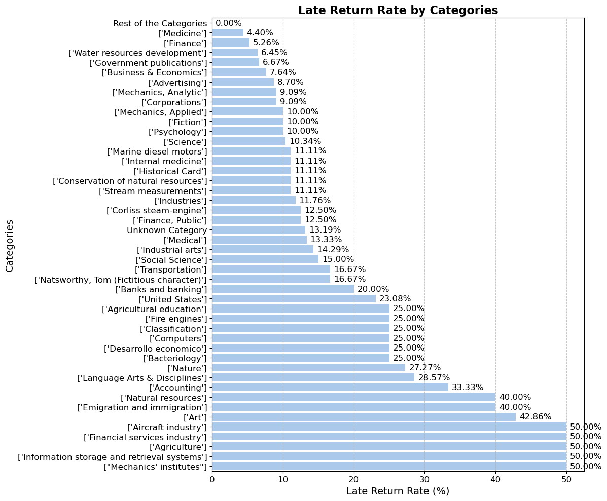
    


```python
# Replacing blank values to'Unknown Occupation'
late_by_occupation.index = late_by_occupation.index.to_series().replace('', 'Unknown Occupation')

#Combining zero return rate into 'Rest of the Occupations
zero_return_occupations = late_by_occupation[late_by_occupation == 0].index
late_by_occupation_combined = late_by_occupation.copy()
late_by_occupation_combined = late_by_occupation_combined[late_by_occupation_combined > 0]
late_by_occupation_combined['Rest of the Occupations'] = 0

sorted_late_by_occupation = late_by_occupation_combined.sort_values()

sns.set_palette('pastel')

plt.figure(figsize=(12, 3.5))
sns.barplot(y=sorted_late_by_occupation.index, x=sorted_late_by_occupation.values * 100)
plt.title('Late Return Rate by Occupations', fontsize=16, fontweight='bold')
plt.xlabel('Late Return Rate (%)', fontsize=14)
plt.ylabel('Occupations', fontsize=14)
plt.xticks(rotation=0, fontsize=12) 
plt.yticks(fontsize=12)

for index, value in enumerate(sorted_late_by_occupation.values * 100):
    plt.text(value + 0.5, index, f'{value:.2f}%', va='center', ha='left', color='black', fontsize=12)

plt.grid(axis='x', linestyle='--', alpha=0.7)
plt.tight_layout()
plt.show()

```


    
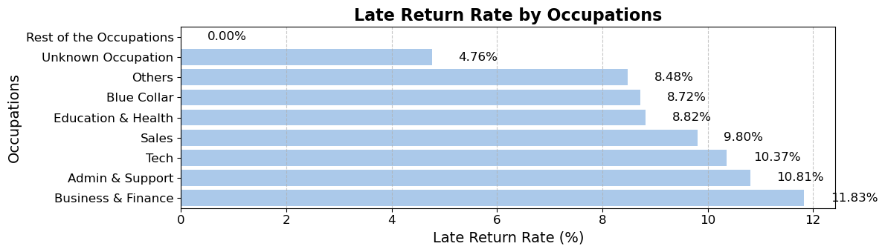
    


```python
#Replacing blank values with "Unknown Publisher'
late_by_publisher.index = late_by_publisher.index.to_series().replace('', 'Unknown Publisher')

# Combining zero return rate into 'Rest of the Publishers'
zero_return_publishers = late_by_publisher[late_by_publisher == 0].index
late_by_publisher_combined = late_by_publisher.copy()
late_by_publisher_combined = late_by_publisher_combined[late_by_publisher_combined > 0]
late_by_publisher_combined['Rest of the Publishers'] = 0

sorted_late_by_publisher = late_by_publisher_combined.sort_values()

sns.set_palette('pastel')

plt.figure(figsize=(12, 8.5))
sns.barplot(y=sorted_late_by_publisher.index, x=sorted_late_by_publisher.values * 100)
plt.title('Late Return Rate by Publishers', fontsize=16, fontweight='bold')
plt.xlabel('Late Return Rate (%)', fontsize=14)
plt.ylabel('Publishers', fontsize=14)
plt.xticks(rotation=0, fontsize=12) 
plt.yticks(fontsize=12)

for index, value in enumerate(sorted_late_by_publisher.values * 100):
    plt.text(value + 0.5, index, f'{value:.2f}%', va='center', ha='left', color='black', fontsize=12)

plt.grid(axis='x', linestyle='--', alpha=0.7)
plt.tight_layout()
plt.show()
```


    
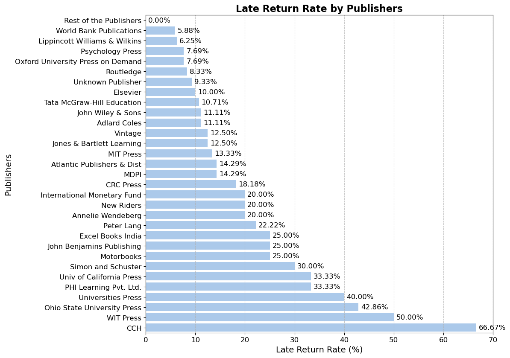
    


```python
# Calculating True values count in the 'late' column for each author
late_by_authors_count = valid_checkouts.groupby('authors')['late'].sum()

# Replacing blank values in late_by_authors_count
late_by_authors_count.index = late_by_authors_count.index.to_series().replace('', 'Unknown Author')

# Combinin g authors with a zero late book count
zero_late_authors = late_by_authors_count[late_by_authors_count == 0].index
late_by_authors_count_combined = late_by_authors_count.copy()
late_by_authors_count_combined = late_by_authors_count_combined[late_by_authors_count_combined > 0]
late_by_authors_count_combined['Rest of the Authors'] = zero_late_authors.size

# Truncating the names of the authors to the first 20 characters
late_by_authors_count_combined.index = late_by_authors_count_combined.index.str[:20]

# Handling identical names
name_counts = {}
new_names = []
for name in late_by_authors_count_combined.index:
    if name in name_counts:
        name_counts[name] += 1
        new_name = f"{name} {name_counts[name]}"
    else:
        name_counts[name] = 1
        new_name = name
    new_names.append(new_name)

late_by_authors_count_combined.index = new_names

sorted_late_by_authors_count = late_by_authors_count_combined.sort_values()

plt.figure(figsize=(10, 15))
sns.barplot(y=sorted_late_by_authors_count.index, x=sorted_late_by_authors_count.values)
plt.title('Number of Late Books by Authors')
plt.xlabel('Number of Late Books')
plt.ylabel('Authors')
plt.xticks(rotation=0, fontsize=7)  
plt.yticks(fontsize=7)

for index, value in enumerate(sorted_late_by_authors_count.values):
    plt.text(value + 0.1, index, f'{value}', va='center', ha='left', color='black', fontsize=7)

plt.show()
```


    
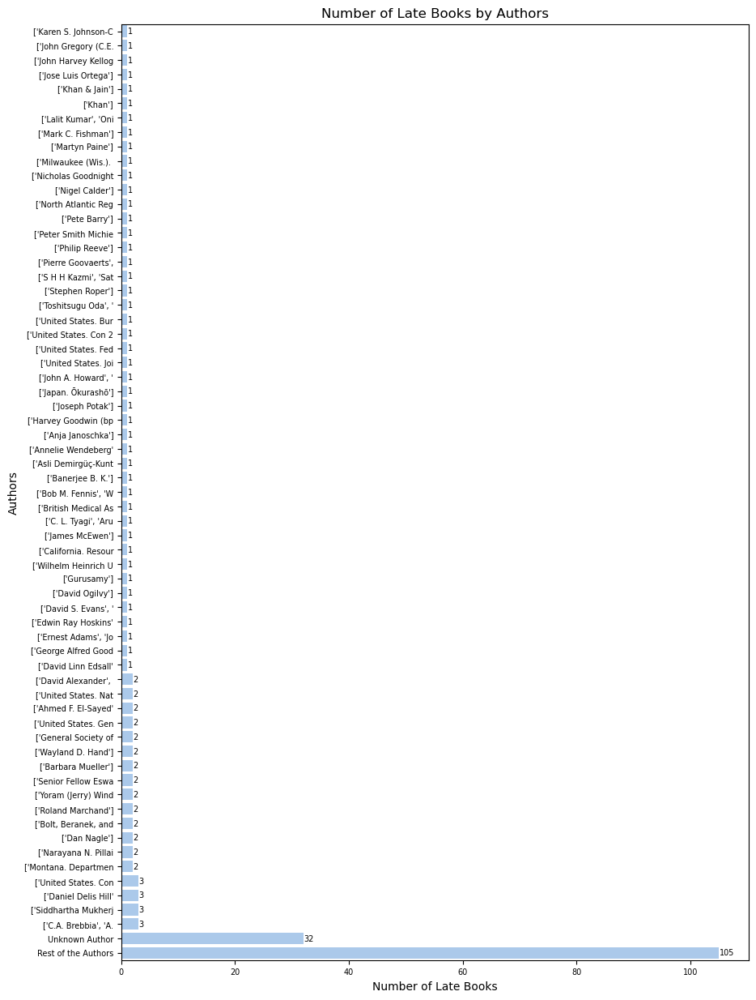
    


```python
late_by_age_group
```


    age_group
    adult          0.106280
    middle-aged    0.063415
    senior         0.109937
    young          0.101796
    youth          0.078313
    Name: late, dtype: float64


```python

age_group_order = ['Young', 'Youth', 'Adult', 'Middle-Aged', 'Senior']
late_by_age_group = late_by_age_group.reindex(age_group_order)

plt.figure(figsize=(10, 6))
plt.pie(late_by_age_group, labels=late_by_age_group.index, autopct='%1.1f%%', startangle=140)
plt.title('Late Return Rate by Age Group')
plt.show()


```


    ---------------------------------------------------------------------------

    ValueError                                Traceback (most recent call last)

    Cell In[49], line 5
          2 late_by_age_group = late_by_age_group.reindex(age_group_order)
          4 plt.figure(figsize=(10, 6))
    ----> 5 plt.pie(late_by_age_group, labels=late_by_age_group.index, autopct='%1.1f%%', startangle=140)
          6 plt.title('Late Return Rate by Age Group')
          7 plt.show()
    

    File ~\anaconda3\Lib\site-packages\matplotlib\pyplot.py:3558, in pie(x, explode, labels, colors, autopct, pctdistance, shadow, labeldistance, startangle, radius, counterclock, wedgeprops, textprops, center, frame, rotatelabels, normalize, hatch, data)
       3535 @_copy_docstring_and_deprecators(Axes.pie)
       3536 def pie(
       3537     x: ArrayLike,
       (...)
       3556     data=None,
       3557 ) -> tuple[list[Wedge], list[Text]] | tuple[list[Wedge], list[Text], list[Text]]:
    -> 3558     return gca().pie(
       3559         x,
       3560         explode=explode,
       3561         labels=labels,
       3562         colors=colors,
       3563         autopct=autopct,
       3564         pctdistance=pctdistance,
       3565         shadow=shadow,
       3566         labeldistance=labeldistance,
       3567         startangle=startangle,
       3568         radius=radius,
       3569         counterclock=counterclock,
       3570         wedgeprops=wedgeprops,
       3571         textprops=textprops,
       3572         center=center,
       3573         frame=frame,
       3574         rotatelabels=rotatelabels,
       3575         normalize=normalize,
       3576         hatch=hatch,
       3577         **({"data": data} if data is not None else {}),
       3578     )
    

    File ~\anaconda3\Lib\site-packages\matplotlib\__init__.py:1465, in _preprocess_data.<locals>.inner(ax, data, *args, **kwargs)
       1462 @functools.wraps(func)
       1463 def inner(ax, *args, data=None, **kwargs):
       1464     if data is None:
    -> 1465         return func(ax, *map(sanitize_sequence, args), **kwargs)
       1467     bound = new_sig.bind(ax, *args, **kwargs)
       1468     auto_label = (bound.arguments.get(label_namer)
       1469                   or bound.kwargs.get(label_namer))
    

    File ~\anaconda3\Lib\site-packages\matplotlib\axes\_axes.py:3276, in Axes.pie(self, x, explode, labels, colors, autopct, pctdistance, shadow, labeldistance, startangle, radius, counterclock, wedgeprops, textprops, center, frame, rotatelabels, normalize, hatch)
       3273 x += expl * math.cos(thetam)
       3274 y += expl * math.sin(thetam)
    -> 3276 w = mpatches.Wedge((x, y), radius, 360. * min(theta1, theta2),
       3277                    360. * max(theta1, theta2),
       3278                    facecolor=get_next_color(),
       3279                    hatch=next(hatch_cycle),
       3280                    clip_on=False,
       3281                    label=label)
       3282 w.set(**wedgeprops)
       3283 slices.append(w)
    

    File ~\anaconda3\Lib\site-packages\matplotlib\patches.py:1198, in Wedge.__init__(self, center, r, theta1, theta2, width, **kwargs)
       1196 self.theta1, self.theta2 = theta1, theta2
       1197 self._patch_transform = transforms.IdentityTransform()
    -> 1198 self._recompute_path()
    

    File ~\anaconda3\Lib\site-packages\matplotlib\patches.py:1210, in Wedge._recompute_path(self)
       1207     connector = Path.LINETO
       1209 # Form the outer ring
    -> 1210 arc = Path.arc(theta1, theta2)
       1212 if self.width is not None:
       1213     # Partial annulus needs to draw the outer ring
       1214     # followed by a reversed and scaled inner ring
       1215     v1 = arc.vertices
    

    File ~\anaconda3\Lib\site-packages\matplotlib\path.py:958, in Path.arc(cls, theta1, theta2, n, is_wedge)
        956 # number of curve segments to make
        957 if n is None:
    --> 958     n = int(2 ** np.ceil((eta2 - eta1) / halfpi))
        959 if n < 1:
        960     raise ValueError("n must be >= 1 or None")
    

    ValueError: cannot convert float NaN to integer


    posx and posy should be finite values
    posx and posy should be finite values
    posx and posy should be finite values
    posx and posy should be finite values
    


    ---------------------------------------------------------------------------

    ValueError                                Traceback (most recent call last)

    File ~\anaconda3\Lib\site-packages\IPython\core\formatters.py:343, in BaseFormatter.__call__(self, obj)
        341     pass
        342 else:
    --> 343     return printer(obj)
        344 # Finally look for special method names
        345 method = get_real_method(obj, self.print_method)
    

    File ~\anaconda3\Lib\site-packages\IPython\core\pylabtools.py:170, in print_figure(fig, fmt, bbox_inches, base64, **kwargs)
        167     from matplotlib.backend_bases import FigureCanvasBase
        168     FigureCanvasBase(fig)
    --> 170 fig.canvas.print_figure(bytes_io, **kw)
        171 data = bytes_io.getvalue()
        172 if fmt == 'svg':
    

    File ~\anaconda3\Lib\site-packages\matplotlib\backend_bases.py:2167, in FigureCanvasBase.print_figure(self, filename, dpi, facecolor, edgecolor, orientation, format, bbox_inches, pad_inches, bbox_extra_artists, backend, **kwargs)
       2165 if bbox_inches:
       2166     if bbox_inches == "tight":
    -> 2167         bbox_inches = self.figure.get_tightbbox(
       2168             renderer, bbox_extra_artists=bbox_extra_artists)
       2169         if (isinstance(layout_engine, ConstrainedLayoutEngine) and
       2170                 pad_inches == "layout"):
       2171             h_pad = layout_engine.get()["h_pad"]
    

    File ~\anaconda3\Lib\site-packages\matplotlib\_api\deprecation.py:454, in make_keyword_only.<locals>.wrapper(*args, **kwargs)
        448 if len(args) > name_idx:
        449     warn_deprecated(
        450         since, message="Passing the %(name)s %(obj_type)s "
        451         "positionally is deprecated since Matplotlib %(since)s; the "
        452         "parameter will become keyword-only %(removal)s.",
        453         name=name, obj_type=f"parameter of {func.__name__}()")
    --> 454 return func(*args, **kwargs)
    

    File ~\anaconda3\Lib\site-packages\matplotlib\figure.py:1774, in FigureBase.get_tightbbox(self, renderer, bbox_extra_artists)
       1771     artists = bbox_extra_artists
       1773 for a in artists:
    -> 1774     bbox = a.get_tightbbox(renderer)
       1775     if bbox is not None:
       1776         bb.append(bbox)
    

    File ~\anaconda3\Lib\site-packages\matplotlib\_api\deprecation.py:454, in make_keyword_only.<locals>.wrapper(*args, **kwargs)
        448 if len(args) > name_idx:
        449     warn_deprecated(
        450         since, message="Passing the %(name)s %(obj_type)s "
        451         "positionally is deprecated since Matplotlib %(since)s; the "
        452         "parameter will become keyword-only %(removal)s.",
        453         name=name, obj_type=f"parameter of {func.__name__}()")
    --> 454 return func(*args, **kwargs)
    

    File ~\anaconda3\Lib\site-packages\matplotlib\axes\_base.py:4418, in _AxesBase.get_tightbbox(self, renderer, call_axes_locator, bbox_extra_artists, for_layout_only)
       4415     bbox_artists = self.get_default_bbox_extra_artists()
       4417 for a in bbox_artists:
    -> 4418     bbox = a.get_tightbbox(renderer)
       4419     if (bbox is not None
       4420             and 0 < bbox.width < np.inf
       4421             and 0 < bbox.height < np.inf):
       4422         bb.append(bbox)
    

    File ~\anaconda3\Lib\site-packages\matplotlib\artist.py:366, in Artist.get_tightbbox(self, renderer)
        350 def get_tightbbox(self, renderer=None):
        351     """
        352     Like `.Artist.get_window_extent`, but includes any clipping.
        353 
       (...)
        364         Returns None if clipping results in no intersection.
        365     """
    --> 366     bbox = self.get_window_extent(renderer)
        367     if self.get_clip_on():
        368         clip_box = self.get_clip_box()
    

    File ~\anaconda3\Lib\site-packages\matplotlib\patches.py:601, in Patch.get_window_extent(self, renderer)
        600 def get_window_extent(self, renderer=None):
    --> 601     return self.get_path().get_extents(self.get_transform())
    

    File ~\anaconda3\Lib\site-packages\matplotlib\path.py:642, in Path.get_extents(self, transform, **kwargs)
        640         # as can the ends of the curve
        641         xys.append(curve([0, *dzeros, 1]))
    --> 642     xys = np.concatenate(xys)
        643 if len(xys):
        644     return Bbox([xys.min(axis=0), xys.max(axis=0)])
    

    ValueError: need at least one array to concatenate


    <Figure size 1000x600 with 1 Axes>


```python
age_group_order = ['young', 'youth', 'adult', 'middle-aged', 'senior']


late_by_age_gender = valid_checkouts[valid_checkouts['gender'].isin(['Female', 'Male'])].groupby(['age_group', 'gender'])['late'].mean().unstack().reindex(age_group_order)
late_by_age_group = valid_checkouts.groupby('age_group')['late'].mean().reindex(age_group_order)

plt.figure(figsize=(12, 6))
bar_plot = sns.barplot(x=late_by_age_group.index, y=late_by_age_group.values, palette='pastel')
bar_plot.set_label('')

colors = ['red', 'blue']
genders = ['Female', 'Male']
for idx, gender in enumerate(genders):
    gender_values = late_by_age_gender[gender].values
    sns.lineplot(x=late_by_age_gender.index, y=gender_values, marker='o', color=colors[idx], label=f'Late Return Rate - {gender}')

plt.title('Late Return Rate by Age Group and Gender', fontsize=16, fontweight='bold')
plt.xlabel('Age Group', fontsize=14)
plt.ylabel('Late Return Rate', fontsize=14)
plt.xticks(rotation=0, fontsize=12)
plt.yticks(fontsize=12)
plt.legend(fontsize=12, loc='lower left')
plt.grid(axis='y', linestyle='--', alpha=0.7)
plt.tight_layout()

plt.show()

```


```python
valid_checkouts['publishedDate']
```


    0       2006
    1       2004
    3       1997
    4       1994
    5       1924
            ... 
    1442    2017
    1443    1984
    1447    2013
    1449    1909
    1450    1921
    Name: publishedDate, Length: 1218, dtype: Int64


```python
#Calculating the mean days late by year
days_late_by_publishedDate = valid_checkouts.groupby('publishedDate')['days_late'].mean()

days_late_by_publishedDate = days_late_by_publishedDate.sort_index()

#linear regression
slope, intercept, r_value, p_value, std_err = linregress(days_late_by_publishedDate.index, days_late_by_publishedDate.values)

trend_line = slope * days_late_by_publishedDate.index + intercept

plt.figure(figsize=(10, 6))
sns.scatterplot(x=days_late_by_publishedDate.index, y=days_late_by_publishedDate.values, marker='o', facecolors='none', edgecolor='b', label='Data')
plt.plot(days_late_by_publishedDate.index, trend_line, color='red', label='Trend Line')

plt.text(0.05, 0.95, f'Slope: {slope:.4f}', transform=plt.gca().transAxes, fontsize=12, verticalalignment='top')
plt.text(0.05, 0.90, f'P-value: {p_value:.4e}', transform=plt.gca().transAxes, fontsize=12, verticalalignment='top')

plt.title('Mean Days Late by Year of Publication')
plt.xlabel('Year of Publication')
plt.ylabel('Mean Days Late')
plt.legend()
plt.grid(True)
plt.show()

```


    
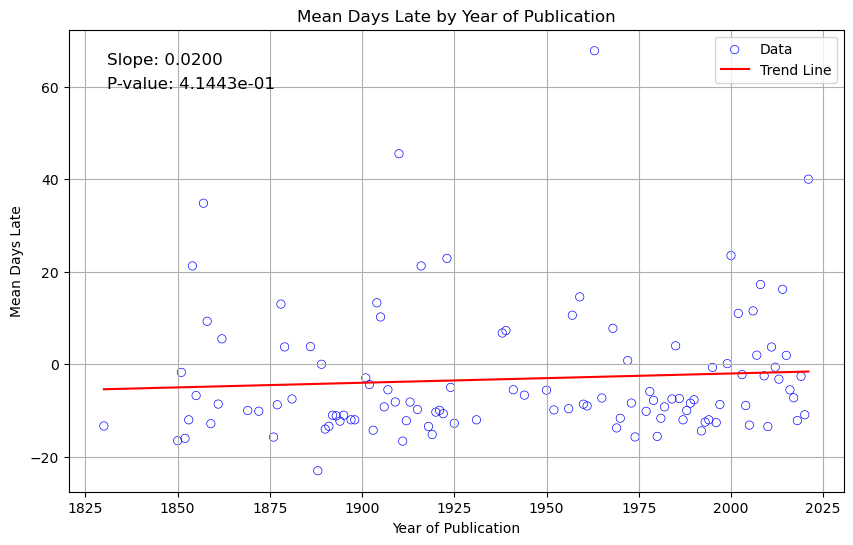
    


```python
# Cleaning numeric columns
def clean_numeric(value):
    clean_value = re.sub(r'[^0-9.]', '', str(value))
    return float(clean_value) if clean_value else None

valid_checkouts['price'] = valid_checkouts['price'].apply(clean_numeric)
valid_checkouts['pages'] = valid_checkouts['pages'].apply(clean_numeric)

```

    C:\Users\iwont\AppData\Local\Temp\ipykernel_18264\411149134.py:6: SettingWithCopyWarning: 
    A value is trying to be set on a copy of a slice from a DataFrame.
    Try using .loc[row_indexer,col_indexer] = value instead
    
    See the caveats in the documentation: https://pandas.pydata.org/pandas-docs/stable/user_guide/indexing.html#returning-a-view-versus-a-copy
      valid_checkouts['price'] = valid_checkouts['price'].apply(clean_numeric)
    C:\Users\iwont\AppData\Local\Temp\ipykernel_18264\411149134.py:7: SettingWithCopyWarning: 
    A value is trying to be set on a copy of a slice from a DataFrame.
    Try using .loc[row_indexer,col_indexer] = value instead
    
    See the caveats in the documentation: https://pandas.pydata.org/pandas-docs/stable/user_guide/indexing.html#returning-a-view-versus-a-copy
      valid_checkouts['pages'] = valid_checkouts['pages'].apply(clean_numeric)
    


```python
# correlation matrix
correlation_matrix = valid_checkouts[['price', 'pages', 'age', 'days_late']].corr()

table = PrettyTable()

table.field_names = [""] + list(correlation_matrix.columns)

for index, row in correlation_matrix.iterrows():
    table.add_row([index] + list(row))

print(table)

plt.figure(figsize=(8, 6))
sns.heatmap(correlation_matrix, annot=True, fmt=".2f", cmap='coolwarm', cbar=True, linewidths=0.5)
plt.title('Correlation Matrix')
plt.show()

```

    +-----------+-----------------------+----------------------+-----------------------+----------------------+
    |           |         price         |        pages         |          age          |      days_late       |
    +-----------+-----------------------+----------------------+-----------------------+----------------------+
    |   price   |          1.0          |  0.7394924782217739  | -0.029965754677136008 | 0.12087704673799822  |
    |   pages   |   0.7394924782217739  |         1.0          |  -0.07259683945168265 | 0.17450072122842958  |
    |    age    | -0.029965754677136008 | -0.07259683945168265 |          1.0          | 0.021005584666833315 |
    | days_late |  0.12087704673799822  | 0.17450072122842958  |  0.021005584666833315 |         1.0          |
    +-----------+-----------------------+----------------------+-----------------------+----------------------+
    


    
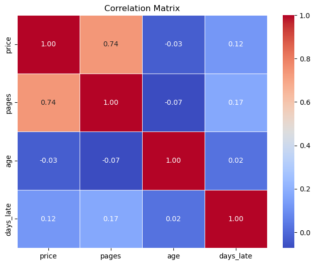
    


```python
# Filtering non-numeric columns
numeric_columns = valid_checkouts.select_dtypes(include=['number']).columns

# Set float format to avoid scientific notation
pd.options.display.float_format = '{:.3f}'.format

# ANOVA for numeric column vs age_group
anova_results = {}

for column in numeric_columns:
    subset_df = valid_checkouts[['age_group', column]].dropna()
    
    model = ols(f'{column} ~ C(age_group)', data=subset_df).fit()
    anova_table = sm.stats.anova_lm(model, typ=2)
    anova_results[column] = anova_table

for column, result in anova_results.items():
    print(f"ANOVA for {column}:\n{result}\n")

pd.reset_option('display.float_format')


```

    ANOVA for days_late:
                      sum_sq       df     F  PR(>F)
    C(age_group)    3079.448    4.000 0.815   0.515
    Residual     1145148.690 1213.000   NaN     NaN
    
    ANOVA for price:
                       sum_sq       df     F  PR(>F)
    C(age_group)   128273.830    4.000 1.232   0.295
    Residual     31252004.109 1201.000   NaN     NaN
    
    ANOVA for pages:
                       sum_sq       df     F  PR(>F)
    C(age_group)   260346.797    4.000 2.237   0.063
    Residual     35208922.212 1210.000   NaN     NaN
    
    ANOVA for publishedDate:
                      sum_sq       df     F  PR(>F)
    C(age_group)    6227.159    4.000 0.577   0.679
    Residual     3224537.261 1196.000   NaN     NaN
    
    ANOVA for age:
                     sum_sq       df        F  PR(>F)
    C(age_group) 321487.393    4.000 3867.659   0.000
    Residual      25206.732 1213.000      NaN     NaN
    
    


```python
libraries.loc[libraries.id == late_by_library.index, 'street_address']
```


    14    3605 NE 15th Ave
    Name: street_address, dtype: object


```python
libraries = libraries.set_index('id').join(late_by_library)

```


```python
# Geocode addresses to get latitude and longitude
geolocator = Nominatim(user_agent="library_map")
libraries['location'] = libraries['street_address'].apply(geolocator.geocode)
libraries['latitude'] = libraries['location'].apply(lambda loc: loc.latitude if loc else None)
libraries['longitude'] = libraries['location'].apply(lambda loc: loc.longitude if loc else None)

# Folium map
portland_coords = [45.523064, -122.676483]

m = folium.Map(location=portland_coords, zoom_start=11, width=800, height=600)

for idx, row in libraries.iterrows():
    if pd.notna(row['latitude']) and pd.notna(row['longitude']):
        folium.Circle(
            location=(row['latitude'], row['longitude']),
            radius=row['late'] * 3000, 
            popup=f"{row['name']} - Late Return Rate: {row['late']*100:.1f}%",
            color='black',
            fill=True,
            fill_color='gray'
        ).add_to(m)
        folium.Marker(
            location=(row['latitude'], row['longitude']),
            popup=f"{row['name']} - Late Return Rate: {row['late']*100:.1f}%",
            icon=folium.DivIcon(html=f"""<div style="font-size: 11pt; color : black">{row['late']*100:.1f}%</div>""")
        ).add_to(m)
m.save('library_late_return_rate_map.html')

m

```


<div style="width:100%;"><div style="position:relative;width:100%;height:0;padding-bottom:60%;"><span style="color:#565656">Make this Notebook Trusted to load map: File -> Trust Notebook</span><iframe srcdoc="&lt;!DOCTYPE html&gt;
&lt;html&gt;
&lt;head&gt;

    &lt;meta http-equiv=&quot;content-type&quot; content=&quot;text/html; charset=UTF-8&quot; /&gt;

        &lt;script&gt;
            L_NO_TOUCH = false;
            L_DISABLE_3D = false;
        &lt;/script&gt;

    &lt;style&gt;html, body {width: 100%;height: 100%;margin: 0;padding: 0;}&lt;/style&gt;
    &lt;style&gt;#map {position:absolute;top:0;bottom:0;right:0;left:0;}&lt;/style&gt;
    &lt;script src=&quot;https://cdn.jsdelivr.net/npm/leaflet@1.9.3/dist/leaflet.js&quot;&gt;&lt;/script&gt;
    &lt;script src=&quot;https://code.jquery.com/jquery-3.7.1.min.js&quot;&gt;&lt;/script&gt;
    &lt;script src=&quot;https://cdn.jsdelivr.net/npm/bootstrap@5.2.2/dist/js/bootstrap.bundle.min.js&quot;&gt;&lt;/script&gt;
    &lt;script src=&quot;https://cdnjs.cloudflare.com/ajax/libs/Leaflet.awesome-markers/2.0.2/leaflet.awesome-markers.js&quot;&gt;&lt;/script&gt;
    &lt;link rel=&quot;stylesheet&quot; href=&quot;https://cdn.jsdelivr.net/npm/leaflet@1.9.3/dist/leaflet.css&quot;/&gt;
    &lt;link rel=&quot;stylesheet&quot; href=&quot;https://cdn.jsdelivr.net/npm/bootstrap@5.2.2/dist/css/bootstrap.min.css&quot;/&gt;
    &lt;link rel=&quot;stylesheet&quot; href=&quot;https://netdna.bootstrapcdn.com/bootstrap/3.0.0/css/bootstrap-glyphicons.css&quot;/&gt;
    &lt;link rel=&quot;stylesheet&quot; href=&quot;https://cdn.jsdelivr.net/npm/@fortawesome/fontawesome-free@6.2.0/css/all.min.css&quot;/&gt;
    &lt;link rel=&quot;stylesheet&quot; href=&quot;https://cdnjs.cloudflare.com/ajax/libs/Leaflet.awesome-markers/2.0.2/leaflet.awesome-markers.css&quot;/&gt;
    &lt;link rel=&quot;stylesheet&quot; href=&quot;https://cdn.jsdelivr.net/gh/python-visualization/folium/folium/templates/leaflet.awesome.rotate.min.css&quot;/&gt;

            &lt;meta name=&quot;viewport&quot; content=&quot;width=device-width,
                initial-scale=1.0, maximum-scale=1.0, user-scalable=no&quot; /&gt;
            &lt;style&gt;
                #map_ac7af01840703dc0dc2a7c3d65a51c2a {
                    position: relative;
                    width: 800.0px;
                    height: 600.0px;
                    left: 0.0%;
                    top: 0.0%;
                }
                .leaflet-container { font-size: 1rem; }
            &lt;/style&gt;

&lt;/head&gt;
&lt;body&gt;


            &lt;div class=&quot;folium-map&quot; id=&quot;map_ac7af01840703dc0dc2a7c3d65a51c2a&quot; &gt;&lt;/div&gt;

&lt;/body&gt;
&lt;script&gt;


            var map_ac7af01840703dc0dc2a7c3d65a51c2a = L.map(
                &quot;map_ac7af01840703dc0dc2a7c3d65a51c2a&quot;,
                {
                    center: [45.523064, -122.676483],
                    crs: L.CRS.EPSG3857,
                    zoom: 11,
                    zoomControl: true,
                    preferCanvas: false,
                }
            );


            var tile_layer_27dd4286336e7dc1291fbd995772553d = L.tileLayer(
                &quot;https://tile.openstreetmap.org/{z}/{x}/{y}.png&quot;,
                {&quot;attribution&quot;: &quot;\u0026copy; \u003ca href=\&quot;https://www.openstreetmap.org/copyright\&quot;\u003eOpenStreetMap\u003c/a\u003e contributors&quot;, &quot;detectRetina&quot;: false, &quot;maxNativeZoom&quot;: 19, &quot;maxZoom&quot;: 19, &quot;minZoom&quot;: 0, &quot;noWrap&quot;: false, &quot;opacity&quot;: 1, &quot;subdomains&quot;: &quot;abc&quot;, &quot;tms&quot;: false}
            );


            tile_layer_27dd4286336e7dc1291fbd995772553d.addTo(map_ac7af01840703dc0dc2a7c3d65a51c2a);


            var circle_75590e6d2bc5f1153e2db2f021d7a41e = L.circle(
                [45.4480033, -122.72544922493631],
                {&quot;bubblingMouseEvents&quot;: true, &quot;color&quot;: &quot;black&quot;, &quot;dashArray&quot;: null, &quot;dashOffset&quot;: null, &quot;fill&quot;: true, &quot;fillColor&quot;: &quot;gray&quot;, &quot;fillOpacity&quot;: 0.2, &quot;fillRule&quot;: &quot;evenodd&quot;, &quot;lineCap&quot;: &quot;round&quot;, &quot;lineJoin&quot;: &quot;round&quot;, &quot;opacity&quot;: 1.0, &quot;radius&quot;: 181.8181818181818, &quot;stroke&quot;: true, &quot;weight&quot;: 3}
            ).addTo(map_ac7af01840703dc0dc2a7c3d65a51c2a);


        var popup_3d68511563c11d6f749c2f154ec3264b = L.popup({&quot;maxWidth&quot;: &quot;100%&quot;});


                var html_008c7ed6a0352c10b82376f23f89f402 = $(`&lt;div id=&quot;html_008c7ed6a0352c10b82376f23f89f402&quot; style=&quot;width: 100.0%; height: 100.0%;&quot;&gt;Multnomah   County   Library Capitol Hill - Late Return Rate: 6.1%&lt;/div&gt;`)[0];
                popup_3d68511563c11d6f749c2f154ec3264b.setContent(html_008c7ed6a0352c10b82376f23f89f402);


        circle_75590e6d2bc5f1153e2db2f021d7a41e.bindPopup(popup_3d68511563c11d6f749c2f154ec3264b)
        ;


            var marker_d150d2f6af31b87c118e11cadb3f45fb = L.marker(
                [45.4480033, -122.72544922493631],
                {}
            ).addTo(map_ac7af01840703dc0dc2a7c3d65a51c2a);


            var div_icon_23f1ce88d02acb0fbce62280015c4451 = L.divIcon({&quot;className&quot;: &quot;empty&quot;, &quot;html&quot;: &quot;\u003cdiv style=\&quot;font-size: 11pt; color : black\&quot;\u003e6.1%\u003c/div\u003e&quot;});
            marker_d150d2f6af31b87c118e11cadb3f45fb.setIcon(div_icon_23f1ce88d02acb0fbce62280015c4451);


        var popup_1521230a179de91470a7343d715ab9b1 = L.popup({&quot;maxWidth&quot;: &quot;100%&quot;});


                var html_7380ec223c3f6e42be9f075cd14785bd = $(`&lt;div id=&quot;html_7380ec223c3f6e42be9f075cd14785bd&quot; style=&quot;width: 100.0%; height: 100.0%;&quot;&gt;Multnomah   County   Library Capitol Hill - Late Return Rate: 6.1%&lt;/div&gt;`)[0];
                popup_1521230a179de91470a7343d715ab9b1.setContent(html_7380ec223c3f6e42be9f075cd14785bd);


        marker_d150d2f6af31b87c118e11cadb3f45fb.bindPopup(popup_1521230a179de91470a7343d715ab9b1)
        ;


            var circle_9b42cb476dae542c7e6627d328ca44d4 = L.circle(
                [45.535335950000004, -122.69914461431009],
                {&quot;bubblingMouseEvents&quot;: true, &quot;color&quot;: &quot;black&quot;, &quot;dashArray&quot;: null, &quot;dashOffset&quot;: null, &quot;fill&quot;: true, &quot;fillColor&quot;: &quot;gray&quot;, &quot;fillOpacity&quot;: 0.2, &quot;fillRule&quot;: &quot;evenodd&quot;, &quot;lineCap&quot;: &quot;round&quot;, &quot;lineJoin&quot;: &quot;round&quot;, &quot;opacity&quot;: 1.0, &quot;radius&quot;: 310.3448275862069, &quot;stroke&quot;: true, &quot;weight&quot;: 3}
            ).addTo(map_ac7af01840703dc0dc2a7c3d65a51c2a);


        var popup_7a1f9e5692363ddad8df8e1898df86fb = L.popup({&quot;maxWidth&quot;: &quot;100%&quot;});


                var html_845fca9b91693dd41dfacfd51cf48a88 = $(`&lt;div id=&quot;html_845fca9b91693dd41dfacfd51cf48a88&quot; style=&quot;width: 100.0%; height: 100.0%;&quot;&gt;Multnomah County Library Northwest - Late Return Rate: 10.3%&lt;/div&gt;`)[0];
                popup_7a1f9e5692363ddad8df8e1898df86fb.setContent(html_845fca9b91693dd41dfacfd51cf48a88);


        circle_9b42cb476dae542c7e6627d328ca44d4.bindPopup(popup_7a1f9e5692363ddad8df8e1898df86fb)
        ;


            var marker_80323cb7491ba4cda189fe441c76a46f = L.marker(
                [45.535335950000004, -122.69914461431009],
                {}
            ).addTo(map_ac7af01840703dc0dc2a7c3d65a51c2a);


            var div_icon_912a6682fa07f022fd60f8708a5fcf58 = L.divIcon({&quot;className&quot;: &quot;empty&quot;, &quot;html&quot;: &quot;\u003cdiv style=\&quot;font-size: 11pt; color : black\&quot;\u003e10.3%\u003c/div\u003e&quot;});
            marker_80323cb7491ba4cda189fe441c76a46f.setIcon(div_icon_912a6682fa07f022fd60f8708a5fcf58);


        var popup_255a642fa0a62b5e668a85f67f1a3b29 = L.popup({&quot;maxWidth&quot;: &quot;100%&quot;});


                var html_88d97d089938bfb29b3831b08bec6369 = $(`&lt;div id=&quot;html_88d97d089938bfb29b3831b08bec6369&quot; style=&quot;width: 100.0%; height: 100.0%;&quot;&gt;Multnomah County Library Northwest - Late Return Rate: 10.3%&lt;/div&gt;`)[0];
                popup_255a642fa0a62b5e668a85f67f1a3b29.setContent(html_88d97d089938bfb29b3831b08bec6369);


        marker_80323cb7491ba4cda189fe441c76a46f.bindPopup(popup_255a642fa0a62b5e668a85f67f1a3b29)
        ;


            var circle_b6a5f18a26b7f9d8bd2ec99da1877e6f = L.circle(
                [45.5900361, -122.75105275],
                {&quot;bubblingMouseEvents&quot;: true, &quot;color&quot;: &quot;black&quot;, &quot;dashArray&quot;: null, &quot;dashOffset&quot;: null, &quot;fill&quot;: true, &quot;fillColor&quot;: &quot;gray&quot;, &quot;fillOpacity&quot;: 0.2, &quot;fillRule&quot;: &quot;evenodd&quot;, &quot;lineCap&quot;: &quot;round&quot;, &quot;lineJoin&quot;: &quot;round&quot;, &quot;opacity&quot;: 1.0, &quot;radius&quot;: 183.6734693877551, &quot;stroke&quot;: true, &quot;weight&quot;: 3}
            ).addTo(map_ac7af01840703dc0dc2a7c3d65a51c2a);


        var popup_cc4c48f9b1e38c6f2d4e3ff7212a89e3 = L.popup({&quot;maxWidth&quot;: &quot;100%&quot;});


                var html_9d549bf84d1b27204b19ba9d778e4239 = $(`&lt;div id=&quot;html_9d549bf84d1b27204b19ba9d778e4239&quot; style=&quot;width: 100.0%; height: 100.0%;&quot;&gt;Multnomah County Library St Johns - Late Return Rate: 6.1%&lt;/div&gt;`)[0];
                popup_cc4c48f9b1e38c6f2d4e3ff7212a89e3.setContent(html_9d549bf84d1b27204b19ba9d778e4239);


        circle_b6a5f18a26b7f9d8bd2ec99da1877e6f.bindPopup(popup_cc4c48f9b1e38c6f2d4e3ff7212a89e3)
        ;


            var marker_883254afd445bc7d21303856623859ae = L.marker(
                [45.5900361, -122.75105275],
                {}
            ).addTo(map_ac7af01840703dc0dc2a7c3d65a51c2a);


            var div_icon_8dbe83aa72468500efd2b1764ac67490 = L.divIcon({&quot;className&quot;: &quot;empty&quot;, &quot;html&quot;: &quot;\u003cdiv style=\&quot;font-size: 11pt; color : black\&quot;\u003e6.1%\u003c/div\u003e&quot;});
            marker_883254afd445bc7d21303856623859ae.setIcon(div_icon_8dbe83aa72468500efd2b1764ac67490);


        var popup_830d778e1af6e9d092aa11f7feabc516 = L.popup({&quot;maxWidth&quot;: &quot;100%&quot;});


                var html_17d37d3f554818777433bdbb5285058c = $(`&lt;div id=&quot;html_17d37d3f554818777433bdbb5285058c&quot; style=&quot;width: 100.0%; height: 100.0%;&quot;&gt;Multnomah County Library St Johns - Late Return Rate: 6.1%&lt;/div&gt;`)[0];
                popup_830d778e1af6e9d092aa11f7feabc516.setContent(html_17d37d3f554818777433bdbb5285058c);


        marker_883254afd445bc7d21303856623859ae.bindPopup(popup_830d778e1af6e9d092aa11f7feabc516)
        ;


            var circle_ba41052ed5fef44eee25de6b83012217 = L.circle(
                [45.4798337, -122.69408653843303],
                {&quot;bubblingMouseEvents&quot;: true, &quot;color&quot;: &quot;black&quot;, &quot;dashArray&quot;: null, &quot;dashOffset&quot;: null, &quot;fill&quot;: true, &quot;fillColor&quot;: &quot;gray&quot;, &quot;fillOpacity&quot;: 0.2, &quot;fillRule&quot;: &quot;evenodd&quot;, &quot;lineCap&quot;: &quot;round&quot;, &quot;lineJoin&quot;: &quot;round&quot;, &quot;opacity&quot;: 1.0, &quot;radius&quot;: 260.8695652173913, &quot;stroke&quot;: true, &quot;weight&quot;: 3}
            ).addTo(map_ac7af01840703dc0dc2a7c3d65a51c2a);


        var popup_f722dcf4e09cc59b042063ef1920895d = L.popup({&quot;maxWidth&quot;: &quot;100%&quot;});


                var html_394ee8ca9fb1eaa40f845f22d55ede84 = $(`&lt;div id=&quot;html_394ee8ca9fb1eaa40f845f22d55ede84&quot; style=&quot;width: 100.0%; height: 100.0%;&quot;&gt;Multnomah   County Library Hillsdale  - Late Return Rate: 8.7%&lt;/div&gt;`)[0];
                popup_f722dcf4e09cc59b042063ef1920895d.setContent(html_394ee8ca9fb1eaa40f845f22d55ede84);


        circle_ba41052ed5fef44eee25de6b83012217.bindPopup(popup_f722dcf4e09cc59b042063ef1920895d)
        ;


            var marker_ff480279a01a046a1c746b8031aab0f5 = L.marker(
                [45.4798337, -122.69408653843303],
                {}
            ).addTo(map_ac7af01840703dc0dc2a7c3d65a51c2a);


            var div_icon_597c1448abb2ed310840529ba8eac5e0 = L.divIcon({&quot;className&quot;: &quot;empty&quot;, &quot;html&quot;: &quot;\u003cdiv style=\&quot;font-size: 11pt; color : black\&quot;\u003e8.7%\u003c/div\u003e&quot;});
            marker_ff480279a01a046a1c746b8031aab0f5.setIcon(div_icon_597c1448abb2ed310840529ba8eac5e0);


        var popup_19420ee1b790f2785de32add26e0900c = L.popup({&quot;maxWidth&quot;: &quot;100%&quot;});


                var html_35e8f60a444058a00a853d49ccce47b2 = $(`&lt;div id=&quot;html_35e8f60a444058a00a853d49ccce47b2&quot; style=&quot;width: 100.0%; height: 100.0%;&quot;&gt;Multnomah   County Library Hillsdale  - Late Return Rate: 8.7%&lt;/div&gt;`)[0];
                popup_19420ee1b790f2785de32add26e0900c.setContent(html_35e8f60a444058a00a853d49ccce47b2);


        marker_ff480279a01a046a1c746b8031aab0f5.bindPopup(popup_19420ee1b790f2785de32add26e0900c)
        ;


            var circle_9cf43e5a0fc4f9cfa4448e72591a9b4a = L.circle(
                [45.467631600000004, -122.65274600603117],
                {&quot;bubblingMouseEvents&quot;: true, &quot;color&quot;: &quot;black&quot;, &quot;dashArray&quot;: null, &quot;dashOffset&quot;: null, &quot;fill&quot;: true, &quot;fillColor&quot;: &quot;gray&quot;, &quot;fillOpacity&quot;: 0.2, &quot;fillRule&quot;: &quot;evenodd&quot;, &quot;lineCap&quot;: &quot;round&quot;, &quot;lineJoin&quot;: &quot;round&quot;, &quot;opacity&quot;: 1.0, &quot;radius&quot;: 311.6883116883117, &quot;stroke&quot;: true, &quot;weight&quot;: 3}
            ).addTo(map_ac7af01840703dc0dc2a7c3d65a51c2a);


        var popup_0d0205aec27e2608d57d78d0ac1d1e2c = L.popup({&quot;maxWidth&quot;: &quot;100%&quot;});


                var html_6ccc83535629a19039ee3f42d5a4b356 = $(`&lt;div id=&quot;html_6ccc83535629a19039ee3f42d5a4b356&quot; style=&quot;width: 100.0%; height: 100.0%;&quot;&gt; Multnomah County  Library   Sellwood  Moreland - Late Return Rate: 10.4%&lt;/div&gt;`)[0];
                popup_0d0205aec27e2608d57d78d0ac1d1e2c.setContent(html_6ccc83535629a19039ee3f42d5a4b356);


        circle_9cf43e5a0fc4f9cfa4448e72591a9b4a.bindPopup(popup_0d0205aec27e2608d57d78d0ac1d1e2c)
        ;


            var marker_67d22860737bf15c759d86e9afb2c486 = L.marker(
                [45.467631600000004, -122.65274600603117],
                {}
            ).addTo(map_ac7af01840703dc0dc2a7c3d65a51c2a);


            var div_icon_ca39922a4f0d979b00513f112a692616 = L.divIcon({&quot;className&quot;: &quot;empty&quot;, &quot;html&quot;: &quot;\u003cdiv style=\&quot;font-size: 11pt; color : black\&quot;\u003e10.4%\u003c/div\u003e&quot;});
            marker_67d22860737bf15c759d86e9afb2c486.setIcon(div_icon_ca39922a4f0d979b00513f112a692616);


        var popup_cc9be638873c2c4924b11c25ccb0d27f = L.popup({&quot;maxWidth&quot;: &quot;100%&quot;});


                var html_42769fcf3eeb410bf8557008a868e6d3 = $(`&lt;div id=&quot;html_42769fcf3eeb410bf8557008a868e6d3&quot; style=&quot;width: 100.0%; height: 100.0%;&quot;&gt; Multnomah County  Library   Sellwood  Moreland - Late Return Rate: 10.4%&lt;/div&gt;`)[0];
                popup_cc9be638873c2c4924b11c25ccb0d27f.setContent(html_42769fcf3eeb410bf8557008a868e6d3);


        marker_67d22860737bf15c759d86e9afb2c486.bindPopup(popup_cc9be638873c2c4924b11c25ccb0d27f)
        ;


            var circle_deb20df395fb22ed4cf56b1ffc127ef1 = L.circle(
                [45.47900505, -122.61210650846269],
                {&quot;bubblingMouseEvents&quot;: true, &quot;color&quot;: &quot;black&quot;, &quot;dashArray&quot;: null, &quot;dashOffset&quot;: null, &quot;fill&quot;: true, &quot;fillColor&quot;: &quot;gray&quot;, &quot;fillOpacity&quot;: 0.2, &quot;fillRule&quot;: &quot;evenodd&quot;, &quot;lineCap&quot;: &quot;round&quot;, &quot;lineJoin&quot;: &quot;round&quot;, &quot;opacity&quot;: 1.0, &quot;radius&quot;: 283.7837837837838, &quot;stroke&quot;: true, &quot;weight&quot;: 3}
            ).addTo(map_ac7af01840703dc0dc2a7c3d65a51c2a);


        var popup_92f59450eebba229a77911e4e7716064 = L.popup({&quot;maxWidth&quot;: &quot;100%&quot;});


                var html_04f9ef6651e96ec1c7561b5a577c22b0 = $(`&lt;div id=&quot;html_04f9ef6651e96ec1c7561b5a577c22b0&quot; style=&quot;width: 100.0%; height: 100.0%;&quot;&gt;MULTNOMAH County Library Woodstock - Late Return Rate: 9.5%&lt;/div&gt;`)[0];
                popup_92f59450eebba229a77911e4e7716064.setContent(html_04f9ef6651e96ec1c7561b5a577c22b0);


        circle_deb20df395fb22ed4cf56b1ffc127ef1.bindPopup(popup_92f59450eebba229a77911e4e7716064)
        ;


            var marker_6bbcd2b516bc119ffa83f785dca9a078 = L.marker(
                [45.47900505, -122.61210650846269],
                {}
            ).addTo(map_ac7af01840703dc0dc2a7c3d65a51c2a);


            var div_icon_70537bc4c7525dc1a7dcc7e16a4dfb50 = L.divIcon({&quot;className&quot;: &quot;empty&quot;, &quot;html&quot;: &quot;\u003cdiv style=\&quot;font-size: 11pt; color : black\&quot;\u003e9.5%\u003c/div\u003e&quot;});
            marker_6bbcd2b516bc119ffa83f785dca9a078.setIcon(div_icon_70537bc4c7525dc1a7dcc7e16a4dfb50);


        var popup_6b6c484f68951e9242d8a4a2fa4371bf = L.popup({&quot;maxWidth&quot;: &quot;100%&quot;});


                var html_93c76808a7bd54b34677c8937358a41c = $(`&lt;div id=&quot;html_93c76808a7bd54b34677c8937358a41c&quot; style=&quot;width: 100.0%; height: 100.0%;&quot;&gt;MULTNOMAH County Library Woodstock - Late Return Rate: 9.5%&lt;/div&gt;`)[0];
                popup_6b6c484f68951e9242d8a4a2fa4371bf.setContent(html_93c76808a7bd54b34677c8937358a41c);


        marker_6bbcd2b516bc119ffa83f785dca9a078.bindPopup(popup_6b6c484f68951e9242d8a4a2fa4371bf)
        ;


            var circle_9d6b2069cf754bd8395ab0c3a8301fd9 = L.circle(
                [45.519200749999996, -122.68320156112537],
                {&quot;bubblingMouseEvents&quot;: true, &quot;color&quot;: &quot;black&quot;, &quot;dashArray&quot;: null, &quot;dashOffset&quot;: null, &quot;fill&quot;: true, &quot;fillColor&quot;: &quot;gray&quot;, &quot;fillOpacity&quot;: 0.2, &quot;fillRule&quot;: &quot;evenodd&quot;, &quot;lineCap&quot;: &quot;round&quot;, &quot;lineJoin&quot;: &quot;round&quot;, &quot;opacity&quot;: 1.0, &quot;radius&quot;: 283.7837837837838, &quot;stroke&quot;: true, &quot;weight&quot;: 3}
            ).addTo(map_ac7af01840703dc0dc2a7c3d65a51c2a);


        var popup_722af4db832798ddd4dd6d99a95449f6 = L.popup({&quot;maxWidth&quot;: &quot;100%&quot;});


                var html_c875324c3df51073e074e553d6ff419e = $(`&lt;div id=&quot;html_c875324c3df51073e074e553d6ff419e&quot; style=&quot;width: 100.0%; height: 100.0%;&quot;&gt;Multnomah  County Library Central - Late Return Rate: 9.5%&lt;/div&gt;`)[0];
                popup_722af4db832798ddd4dd6d99a95449f6.setContent(html_c875324c3df51073e074e553d6ff419e);


        circle_9d6b2069cf754bd8395ab0c3a8301fd9.bindPopup(popup_722af4db832798ddd4dd6d99a95449f6)
        ;


            var marker_1522a44e7aa54c8ad6aa0f9677a239c4 = L.marker(
                [45.519200749999996, -122.68320156112537],
                {}
            ).addTo(map_ac7af01840703dc0dc2a7c3d65a51c2a);


            var div_icon_a3f93a4b75a028a06743cdab1d134e8b = L.divIcon({&quot;className&quot;: &quot;empty&quot;, &quot;html&quot;: &quot;\u003cdiv style=\&quot;font-size: 11pt; color : black\&quot;\u003e9.5%\u003c/div\u003e&quot;});
            marker_1522a44e7aa54c8ad6aa0f9677a239c4.setIcon(div_icon_a3f93a4b75a028a06743cdab1d134e8b);


        var popup_2b17140e50c07f6e7c4f174d3b6c993f = L.popup({&quot;maxWidth&quot;: &quot;100%&quot;});


                var html_ae9a2bbccdee5b2f9035a721b10359b1 = $(`&lt;div id=&quot;html_ae9a2bbccdee5b2f9035a721b10359b1&quot; style=&quot;width: 100.0%; height: 100.0%;&quot;&gt;Multnomah  County Library Central - Late Return Rate: 9.5%&lt;/div&gt;`)[0];
                popup_2b17140e50c07f6e7c4f174d3b6c993f.setContent(html_ae9a2bbccdee5b2f9035a721b10359b1);


        marker_1522a44e7aa54c8ad6aa0f9677a239c4.bindPopup(popup_2b17140e50c07f6e7c4f174d3b6c993f)
        ;


            var circle_810dd8907b8073dd60e02ac8b557df50 = L.circle(
                [25.4648872, -80.4846758],
                {&quot;bubblingMouseEvents&quot;: true, &quot;color&quot;: &quot;black&quot;, &quot;dashArray&quot;: null, &quot;dashOffset&quot;: null, &quot;fill&quot;: true, &quot;fillColor&quot;: &quot;gray&quot;, &quot;fillOpacity&quot;: 0.2, &quot;fillRule&quot;: &quot;evenodd&quot;, &quot;lineCap&quot;: &quot;round&quot;, &quot;lineJoin&quot;: &quot;round&quot;, &quot;opacity&quot;: 1.0, &quot;radius&quot;: 313.4328358208955, &quot;stroke&quot;: true, &quot;weight&quot;: 3}
            ).addTo(map_ac7af01840703dc0dc2a7c3d65a51c2a);


        var popup_463889af6301b902d4e434473a30f38a = L.popup({&quot;maxWidth&quot;: &quot;100%&quot;});


                var html_2070742eaeb79ee4b3a54084e238dd29 = $(`&lt;div id=&quot;html_2070742eaeb79ee4b3a54084e238dd29&quot; style=&quot;width: 100.0%; height: 100.0%;&quot;&gt;Friends OF the multnomah COUNTY Library - Late Return Rate: 10.4%&lt;/div&gt;`)[0];
                popup_463889af6301b902d4e434473a30f38a.setContent(html_2070742eaeb79ee4b3a54084e238dd29);


        circle_810dd8907b8073dd60e02ac8b557df50.bindPopup(popup_463889af6301b902d4e434473a30f38a)
        ;


            var marker_2847366ae03e9977f0a1b49d4049a162 = L.marker(
                [25.4648872, -80.4846758],
                {}
            ).addTo(map_ac7af01840703dc0dc2a7c3d65a51c2a);


            var div_icon_761a45f66f9cd3c0146d9892adfdb5f7 = L.divIcon({&quot;className&quot;: &quot;empty&quot;, &quot;html&quot;: &quot;\u003cdiv style=\&quot;font-size: 11pt; color : black\&quot;\u003e10.4%\u003c/div\u003e&quot;});
            marker_2847366ae03e9977f0a1b49d4049a162.setIcon(div_icon_761a45f66f9cd3c0146d9892adfdb5f7);


        var popup_546753d9e97eef57fbb52e806d49b5a8 = L.popup({&quot;maxWidth&quot;: &quot;100%&quot;});


                var html_f2e73afb4e4427015e1986af5a38a311 = $(`&lt;div id=&quot;html_f2e73afb4e4427015e1986af5a38a311&quot; style=&quot;width: 100.0%; height: 100.0%;&quot;&gt;Friends OF the multnomah COUNTY Library - Late Return Rate: 10.4%&lt;/div&gt;`)[0];
                popup_546753d9e97eef57fbb52e806d49b5a8.setContent(html_f2e73afb4e4427015e1986af5a38a311);


        marker_2847366ae03e9977f0a1b49d4049a162.bindPopup(popup_546753d9e97eef57fbb52e806d49b5a8)
        ;


            var circle_ff30832eedf490dab1ae5ca5f65509b7 = L.circle(
                [45.51526685, -122.62267551801278],
                {&quot;bubblingMouseEvents&quot;: true, &quot;color&quot;: &quot;black&quot;, &quot;dashArray&quot;: null, &quot;dashOffset&quot;: null, &quot;fill&quot;: true, &quot;fillColor&quot;: &quot;gray&quot;, &quot;fillOpacity&quot;: 0.2, &quot;fillRule&quot;: &quot;evenodd&quot;, &quot;lineCap&quot;: &quot;round&quot;, &quot;lineJoin&quot;: &quot;round&quot;, &quot;opacity&quot;: 1.0, &quot;radius&quot;: 305.08474576271186, &quot;stroke&quot;: true, &quot;weight&quot;: 3}
            ).addTo(map_ac7af01840703dc0dc2a7c3d65a51c2a);


        var popup_0356f1550050f136c2332e4d5c15e274 = L.popup({&quot;maxWidth&quot;: &quot;100%&quot;});


                var html_e29f009df83200e32ddb343fbea28d5f = $(`&lt;div id=&quot;html_e29f009df83200e32ddb343fbea28d5f&quot; style=&quot;width: 100.0%; height: 100.0%;&quot;&gt;  Multnomah County Library Belmont - Late Return Rate: 10.2%&lt;/div&gt;`)[0];
                popup_0356f1550050f136c2332e4d5c15e274.setContent(html_e29f009df83200e32ddb343fbea28d5f);


        circle_ff30832eedf490dab1ae5ca5f65509b7.bindPopup(popup_0356f1550050f136c2332e4d5c15e274)
        ;


            var marker_5a046a53542bdea2a911e2449f12a6fd = L.marker(
                [45.51526685, -122.62267551801278],
                {}
            ).addTo(map_ac7af01840703dc0dc2a7c3d65a51c2a);


            var div_icon_7f0ffd9b6c50e52ea6ea4b1b7de205e8 = L.divIcon({&quot;className&quot;: &quot;empty&quot;, &quot;html&quot;: &quot;\u003cdiv style=\&quot;font-size: 11pt; color : black\&quot;\u003e10.2%\u003c/div\u003e&quot;});
            marker_5a046a53542bdea2a911e2449f12a6fd.setIcon(div_icon_7f0ffd9b6c50e52ea6ea4b1b7de205e8);


        var popup_2f8b6907f7187a172e5da406cfc8e0b8 = L.popup({&quot;maxWidth&quot;: &quot;100%&quot;});


                var html_1640ea124f3fa5cacea3419bad546d70 = $(`&lt;div id=&quot;html_1640ea124f3fa5cacea3419bad546d70&quot; style=&quot;width: 100.0%; height: 100.0%;&quot;&gt;  Multnomah County Library Belmont - Late Return Rate: 10.2%&lt;/div&gt;`)[0];
                popup_2f8b6907f7187a172e5da406cfc8e0b8.setContent(html_1640ea124f3fa5cacea3419bad546d70);


        marker_5a046a53542bdea2a911e2449f12a6fd.bindPopup(popup_2f8b6907f7187a172e5da406cfc8e0b8)
        ;


            var circle_257347467d5b683cc552e81ba75b4398 = L.circle(
                [45.4905663, -122.58226892896187],
                {&quot;bubblingMouseEvents&quot;: true, &quot;color&quot;: &quot;black&quot;, &quot;dashArray&quot;: null, &quot;dashOffset&quot;: null, &quot;fill&quot;: true, &quot;fillColor&quot;: &quot;gray&quot;, &quot;fillOpacity&quot;: 0.2, &quot;fillRule&quot;: &quot;evenodd&quot;, &quot;lineCap&quot;: &quot;round&quot;, &quot;lineJoin&quot;: &quot;round&quot;, &quot;opacity&quot;: 1.0, &quot;radius&quot;: 303.79746835443035, &quot;stroke&quot;: true, &quot;weight&quot;: 3}
            ).addTo(map_ac7af01840703dc0dc2a7c3d65a51c2a);


        var popup_e5379005310529c2123f609f004a5550 = L.popup({&quot;maxWidth&quot;: &quot;100%&quot;});


                var html_395b347db7c8b010d680c9c230a9802f = $(`&lt;div id=&quot;html_395b347db7c8b010d680c9c230a9802f&quot; style=&quot;width: 100.0%; height: 100.0%;&quot;&gt;Multnomah County Library Holgate - Late Return Rate: 10.1%&lt;/div&gt;`)[0];
                popup_e5379005310529c2123f609f004a5550.setContent(html_395b347db7c8b010d680c9c230a9802f);


        circle_257347467d5b683cc552e81ba75b4398.bindPopup(popup_e5379005310529c2123f609f004a5550)
        ;


            var marker_70122ee9305c588839dc825bd869bc25 = L.marker(
                [45.4905663, -122.58226892896187],
                {}
            ).addTo(map_ac7af01840703dc0dc2a7c3d65a51c2a);


            var div_icon_936a816b84633f06c92dd2f4c1a6c1b1 = L.divIcon({&quot;className&quot;: &quot;empty&quot;, &quot;html&quot;: &quot;\u003cdiv style=\&quot;font-size: 11pt; color : black\&quot;\u003e10.1%\u003c/div\u003e&quot;});
            marker_70122ee9305c588839dc825bd869bc25.setIcon(div_icon_936a816b84633f06c92dd2f4c1a6c1b1);


        var popup_5900310ec5d5de424b97c47465e6e5a1 = L.popup({&quot;maxWidth&quot;: &quot;100%&quot;});


                var html_af93c5d416a3ae7e13f305368395e6d8 = $(`&lt;div id=&quot;html_af93c5d416a3ae7e13f305368395e6d8&quot; style=&quot;width: 100.0%; height: 100.0%;&quot;&gt;Multnomah County Library Holgate - Late Return Rate: 10.1%&lt;/div&gt;`)[0];
                popup_5900310ec5d5de424b97c47465e6e5a1.setContent(html_af93c5d416a3ae7e13f305368395e6d8);


        marker_70122ee9305c588839dc825bd869bc25.bindPopup(popup_5900310ec5d5de424b97c47465e6e5a1)
        ;


            var circle_15b7c1cf625fe6666e430eeb72873646 = L.circle(
                [45.5167299, -122.53847050319162],
                {&quot;bubblingMouseEvents&quot;: true, &quot;color&quot;: &quot;black&quot;, &quot;dashArray&quot;: null, &quot;dashOffset&quot;: null, &quot;fill&quot;: true, &quot;fillColor&quot;: &quot;gray&quot;, &quot;fillOpacity&quot;: 0.2, &quot;fillRule&quot;: &quot;evenodd&quot;, &quot;lineCap&quot;: &quot;round&quot;, &quot;lineJoin&quot;: &quot;round&quot;, &quot;opacity&quot;: 1.0, &quot;radius&quot;: 260.8695652173913, &quot;stroke&quot;: true, &quot;weight&quot;: 3}
            ).addTo(map_ac7af01840703dc0dc2a7c3d65a51c2a);


        var popup_4412857fe2ccaa69192f7f0fcb30a981 = L.popup({&quot;maxWidth&quot;: &quot;100%&quot;});


                var html_beaf4da2aa124b7b5a495aebf307fa7f = $(`&lt;div id=&quot;html_beaf4da2aa124b7b5a495aebf307fa7f&quot; style=&quot;width: 100.0%; height: 100.0%;&quot;&gt;MULTNOMAH County Library MIDLAND - Late Return Rate: 8.7%&lt;/div&gt;`)[0];
                popup_4412857fe2ccaa69192f7f0fcb30a981.setContent(html_beaf4da2aa124b7b5a495aebf307fa7f);


        circle_15b7c1cf625fe6666e430eeb72873646.bindPopup(popup_4412857fe2ccaa69192f7f0fcb30a981)
        ;


            var marker_7cd2ccd2a716a0d880d509e19dfb6776 = L.marker(
                [45.5167299, -122.53847050319162],
                {}
            ).addTo(map_ac7af01840703dc0dc2a7c3d65a51c2a);


            var div_icon_e7e73e07e24e5f2125ca28ac6d3b89b5 = L.divIcon({&quot;className&quot;: &quot;empty&quot;, &quot;html&quot;: &quot;\u003cdiv style=\&quot;font-size: 11pt; color : black\&quot;\u003e8.7%\u003c/div\u003e&quot;});
            marker_7cd2ccd2a716a0d880d509e19dfb6776.setIcon(div_icon_e7e73e07e24e5f2125ca28ac6d3b89b5);


        var popup_a0404585c66913cee142c64590c3aef0 = L.popup({&quot;maxWidth&quot;: &quot;100%&quot;});


                var html_f87891d12a5a46e3a71b36ad06d65168 = $(`&lt;div id=&quot;html_f87891d12a5a46e3a71b36ad06d65168&quot; style=&quot;width: 100.0%; height: 100.0%;&quot;&gt;MULTNOMAH County Library MIDLAND - Late Return Rate: 8.7%&lt;/div&gt;`)[0];
                popup_a0404585c66913cee142c64590c3aef0.setContent(html_f87891d12a5a46e3a71b36ad06d65168);


        marker_7cd2ccd2a716a0d880d509e19dfb6776.bindPopup(popup_a0404585c66913cee142c64590c3aef0)
        ;


            var circle_89713802e6f85c203d83fde8bebd0ea9 = L.circle(
                [45.5411809, -122.6635232],
                {&quot;bubblingMouseEvents&quot;: true, &quot;color&quot;: &quot;black&quot;, &quot;dashArray&quot;: null, &quot;dashOffset&quot;: null, &quot;fill&quot;: true, &quot;fillColor&quot;: &quot;gray&quot;, &quot;fillOpacity&quot;: 0.2, &quot;fillRule&quot;: &quot;evenodd&quot;, &quot;lineCap&quot;: &quot;round&quot;, &quot;lineJoin&quot;: &quot;round&quot;, &quot;opacity&quot;: 1.0, &quot;radius&quot;: 450.0, &quot;stroke&quot;: true, &quot;weight&quot;: 3}
            ).addTo(map_ac7af01840703dc0dc2a7c3d65a51c2a);


        var popup_af294e54a043833adef699d3a6a42194 = L.popup({&quot;maxWidth&quot;: &quot;100%&quot;});


                var html_142438c6438ec4f0e2ceaa09127ff532 = $(`&lt;div id=&quot;html_142438c6438ec4f0e2ceaa09127ff532&quot; style=&quot;width: 100.0%; height: 100.0%;&quot;&gt;Multnomah  County Library - Late Return Rate: 15.0%&lt;/div&gt;`)[0];
                popup_af294e54a043833adef699d3a6a42194.setContent(html_142438c6438ec4f0e2ceaa09127ff532);


        circle_89713802e6f85c203d83fde8bebd0ea9.bindPopup(popup_af294e54a043833adef699d3a6a42194)
        ;


            var marker_bd6c07e2e1793f7bf596b54eaaaad50c = L.marker(
                [45.5411809, -122.6635232],
                {}
            ).addTo(map_ac7af01840703dc0dc2a7c3d65a51c2a);


            var div_icon_841272342f7c9d61ba99be74b2e81dd3 = L.divIcon({&quot;className&quot;: &quot;empty&quot;, &quot;html&quot;: &quot;\u003cdiv style=\&quot;font-size: 11pt; color : black\&quot;\u003e15.0%\u003c/div\u003e&quot;});
            marker_bd6c07e2e1793f7bf596b54eaaaad50c.setIcon(div_icon_841272342f7c9d61ba99be74b2e81dd3);


        var popup_b7f5a18f1d5a575346de718a7744abe5 = L.popup({&quot;maxWidth&quot;: &quot;100%&quot;});


                var html_7fd86e1084acebe4fe58ac761635f321 = $(`&lt;div id=&quot;html_7fd86e1084acebe4fe58ac761635f321&quot; style=&quot;width: 100.0%; height: 100.0%;&quot;&gt;Multnomah  County Library - Late Return Rate: 15.0%&lt;/div&gt;`)[0];
                popup_b7f5a18f1d5a575346de718a7744abe5.setContent(html_7fd86e1084acebe4fe58ac761635f321);


        marker_bd6c07e2e1793f7bf596b54eaaaad50c.bindPopup(popup_b7f5a18f1d5a575346de718a7744abe5)
        ;


            var circle_d0e15a43c815bed2892ac57bee7894c5 = L.circle(
                [45.5416688, -122.66307839999999],
                {&quot;bubblingMouseEvents&quot;: true, &quot;color&quot;: &quot;black&quot;, &quot;dashArray&quot;: null, &quot;dashOffset&quot;: null, &quot;fill&quot;: true, &quot;fillColor&quot;: &quot;gray&quot;, &quot;fillOpacity&quot;: 0.2, &quot;fillRule&quot;: &quot;evenodd&quot;, &quot;lineCap&quot;: &quot;round&quot;, &quot;lineJoin&quot;: &quot;round&quot;, &quot;opacity&quot;: 1.0, &quot;radius&quot;: 328.7671232876712, &quot;stroke&quot;: true, &quot;weight&quot;: 3}
            ).addTo(map_ac7af01840703dc0dc2a7c3d65a51c2a);


        var popup_4ce42aec705e0a583f77ac23be0ed1ae = L.popup({&quot;maxWidth&quot;: &quot;100%&quot;});


                var html_31b02535705b1929fdff801a149fd7aa = $(`&lt;div id=&quot;html_31b02535705b1929fdff801a149fd7aa&quot; style=&quot;width: 100.0%; height: 100.0%;&quot;&gt;MULTNOMAH County Library - Late Return Rate: 11.0%&lt;/div&gt;`)[0];
                popup_4ce42aec705e0a583f77ac23be0ed1ae.setContent(html_31b02535705b1929fdff801a149fd7aa);


        circle_d0e15a43c815bed2892ac57bee7894c5.bindPopup(popup_4ce42aec705e0a583f77ac23be0ed1ae)
        ;


            var marker_cd0c4360e7b3b6448138ef3e595c1232 = L.marker(
                [45.5416688, -122.66307839999999],
                {}
            ).addTo(map_ac7af01840703dc0dc2a7c3d65a51c2a);


            var div_icon_9e0619eeac06c206ff9681322c6e5ade = L.divIcon({&quot;className&quot;: &quot;empty&quot;, &quot;html&quot;: &quot;\u003cdiv style=\&quot;font-size: 11pt; color : black\&quot;\u003e11.0%\u003c/div\u003e&quot;});
            marker_cd0c4360e7b3b6448138ef3e595c1232.setIcon(div_icon_9e0619eeac06c206ff9681322c6e5ade);


        var popup_ee5ab0a9ef6433496903023e3376f300 = L.popup({&quot;maxWidth&quot;: &quot;100%&quot;});


                var html_7ddb34e646d61dd12555692ea54ca3d8 = $(`&lt;div id=&quot;html_7ddb34e646d61dd12555692ea54ca3d8&quot; style=&quot;width: 100.0%; height: 100.0%;&quot;&gt;MULTNOMAH County Library - Late Return Rate: 11.0%&lt;/div&gt;`)[0];
                popup_ee5ab0a9ef6433496903023e3376f300.setContent(html_7ddb34e646d61dd12555692ea54ca3d8);


        marker_cd0c4360e7b3b6448138ef3e595c1232.bindPopup(popup_ee5ab0a9ef6433496903023e3376f300)
        ;


            var circle_def13562a7d75156cd9bc0842cceb3ef = L.circle(
                [45.562458750000005, -122.6715374934238],
                {&quot;bubblingMouseEvents&quot;: true, &quot;color&quot;: &quot;black&quot;, &quot;dashArray&quot;: null, &quot;dashOffset&quot;: null, &quot;fill&quot;: true, &quot;fillColor&quot;: &quot;gray&quot;, &quot;fillOpacity&quot;: 0.2, &quot;fillRule&quot;: &quot;evenodd&quot;, &quot;lineCap&quot;: &quot;round&quot;, &quot;lineJoin&quot;: &quot;round&quot;, &quot;opacity&quot;: 1.0, &quot;radius&quot;: 287.67123287671234, &quot;stroke&quot;: true, &quot;weight&quot;: 3}
            ).addTo(map_ac7af01840703dc0dc2a7c3d65a51c2a);


        var popup_6b8ee6199c507ababf48292696abd000 = L.popup({&quot;maxWidth&quot;: &quot;100%&quot;});


                var html_12145a43740fcef5ac6b134c2f4920e5 = $(`&lt;div id=&quot;html_12145a43740fcef5ac6b134c2f4920e5&quot; style=&quot;width: 100.0%; height: 100.0%;&quot;&gt;Multnomah  County  Library  North Portland - Late Return Rate: 9.6%&lt;/div&gt;`)[0];
                popup_6b8ee6199c507ababf48292696abd000.setContent(html_12145a43740fcef5ac6b134c2f4920e5);


        circle_def13562a7d75156cd9bc0842cceb3ef.bindPopup(popup_6b8ee6199c507ababf48292696abd000)
        ;


            var marker_c6a637e15b296f0560761f71c0a903ff = L.marker(
                [45.562458750000005, -122.6715374934238],
                {}
            ).addTo(map_ac7af01840703dc0dc2a7c3d65a51c2a);


            var div_icon_96b4c4d0047c82b567c52f9b98879e25 = L.divIcon({&quot;className&quot;: &quot;empty&quot;, &quot;html&quot;: &quot;\u003cdiv style=\&quot;font-size: 11pt; color : black\&quot;\u003e9.6%\u003c/div\u003e&quot;});
            marker_c6a637e15b296f0560761f71c0a903ff.setIcon(div_icon_96b4c4d0047c82b567c52f9b98879e25);


        var popup_15926d4feb0f956dc85a451d8678ee03 = L.popup({&quot;maxWidth&quot;: &quot;100%&quot;});


                var html_a4a23cf85f448aef9834a3ab0527ebca = $(`&lt;div id=&quot;html_a4a23cf85f448aef9834a3ab0527ebca&quot; style=&quot;width: 100.0%; height: 100.0%;&quot;&gt;Multnomah  County  Library  North Portland - Late Return Rate: 9.6%&lt;/div&gt;`)[0];
                popup_15926d4feb0f956dc85a451d8678ee03.setContent(html_a4a23cf85f448aef9834a3ab0527ebca);


        marker_c6a637e15b296f0560761f71c0a903ff.bindPopup(popup_15926d4feb0f956dc85a451d8678ee03)
        ;


            var circle_0dd3e19f0ee55fc22951713424ebfa5f = L.circle(
                [45.5493187, -122.65144959842345],
                {&quot;bubblingMouseEvents&quot;: true, &quot;color&quot;: &quot;black&quot;, &quot;dashArray&quot;: null, &quot;dashOffset&quot;: null, &quot;fill&quot;: true, &quot;fillColor&quot;: &quot;gray&quot;, &quot;fillOpacity&quot;: 0.2, &quot;fillRule&quot;: &quot;evenodd&quot;, &quot;lineCap&quot;: &quot;round&quot;, &quot;lineJoin&quot;: &quot;round&quot;, &quot;opacity&quot;: 1.0, &quot;radius&quot;: 342.85714285714283, &quot;stroke&quot;: true, &quot;weight&quot;: 3}
            ).addTo(map_ac7af01840703dc0dc2a7c3d65a51c2a);


        var popup_b4eba4c22904ddafb7c6cdafda49ec97 = L.popup({&quot;maxWidth&quot;: &quot;100%&quot;});


                var html_5c27f18bb18103ca35677bbf54a37b6d = $(`&lt;div id=&quot;html_5c27f18bb18103ca35677bbf54a37b6d&quot; style=&quot;width: 100.0%; height: 100.0%;&quot;&gt;Multnomah  County Library Albina - Late Return Rate: 11.4%&lt;/div&gt;`)[0];
                popup_b4eba4c22904ddafb7c6cdafda49ec97.setContent(html_5c27f18bb18103ca35677bbf54a37b6d);


        circle_0dd3e19f0ee55fc22951713424ebfa5f.bindPopup(popup_b4eba4c22904ddafb7c6cdafda49ec97)
        ;


            var marker_711795a0edb54888c20661d3b33ce482 = L.marker(
                [45.5493187, -122.65144959842345],
                {}
            ).addTo(map_ac7af01840703dc0dc2a7c3d65a51c2a);


            var div_icon_8e90a909b2f4bdd83118b79dfa181ec2 = L.divIcon({&quot;className&quot;: &quot;empty&quot;, &quot;html&quot;: &quot;\u003cdiv style=\&quot;font-size: 11pt; color : black\&quot;\u003e11.4%\u003c/div\u003e&quot;});
            marker_711795a0edb54888c20661d3b33ce482.setIcon(div_icon_8e90a909b2f4bdd83118b79dfa181ec2);


        var popup_ac5a7fb852bf2630a1a5d1d04b89213b = L.popup({&quot;maxWidth&quot;: &quot;100%&quot;});


                var html_4b27a4ce65d36b01ed3d61648e3facef = $(`&lt;div id=&quot;html_4b27a4ce65d36b01ed3d61648e3facef&quot; style=&quot;width: 100.0%; height: 100.0%;&quot;&gt;Multnomah  County Library Albina - Late Return Rate: 11.4%&lt;/div&gt;`)[0];
                popup_ac5a7fb852bf2630a1a5d1d04b89213b.setContent(html_4b27a4ce65d36b01ed3d61648e3facef);


        marker_711795a0edb54888c20661d3b33ce482.bindPopup(popup_ac5a7fb852bf2630a1a5d1d04b89213b)
        ;


            var circle_59dda9be65d3fc26135f70ae4dfb02f1 = L.circle(
                [45.537627, -122.6211734],
                {&quot;bubblingMouseEvents&quot;: true, &quot;color&quot;: &quot;black&quot;, &quot;dashArray&quot;: null, &quot;dashOffset&quot;: null, &quot;fill&quot;: true, &quot;fillColor&quot;: &quot;gray&quot;, &quot;fillOpacity&quot;: 0.2, &quot;fillRule&quot;: &quot;evenodd&quot;, &quot;lineCap&quot;: &quot;round&quot;, &quot;lineJoin&quot;: &quot;round&quot;, &quot;opacity&quot;: 1.0, &quot;radius&quot;: 391.30434782608694, &quot;stroke&quot;: true, &quot;weight&quot;: 3}
            ).addTo(map_ac7af01840703dc0dc2a7c3d65a51c2a);


        var popup_0318099886df092da0d824440b68f3de = L.popup({&quot;maxWidth&quot;: &quot;100%&quot;});


                var html_c064e207dfe83db09ca4b0195a03c995 = $(`&lt;div id=&quot;html_c064e207dfe83db09ca4b0195a03c995&quot; style=&quot;width: 100.0%; height: 100.0%;&quot;&gt; Multnomah  County  Library Hollywood Library - Late Return Rate: 13.0%&lt;/div&gt;`)[0];
                popup_0318099886df092da0d824440b68f3de.setContent(html_c064e207dfe83db09ca4b0195a03c995);


        circle_59dda9be65d3fc26135f70ae4dfb02f1.bindPopup(popup_0318099886df092da0d824440b68f3de)
        ;


            var marker_2a291c0a561412136cf66152702fe1e4 = L.marker(
                [45.537627, -122.6211734],
                {}
            ).addTo(map_ac7af01840703dc0dc2a7c3d65a51c2a);


            var div_icon_f539d4631df858e4539a0f9eda657f2a = L.divIcon({&quot;className&quot;: &quot;empty&quot;, &quot;html&quot;: &quot;\u003cdiv style=\&quot;font-size: 11pt; color : black\&quot;\u003e13.0%\u003c/div\u003e&quot;});
            marker_2a291c0a561412136cf66152702fe1e4.setIcon(div_icon_f539d4631df858e4539a0f9eda657f2a);


        var popup_66bdeeafd5d3a0c3e706b74d69942651 = L.popup({&quot;maxWidth&quot;: &quot;100%&quot;});


                var html_bcae9e56d36e233c523a85a40fa43e77 = $(`&lt;div id=&quot;html_bcae9e56d36e233c523a85a40fa43e77&quot; style=&quot;width: 100.0%; height: 100.0%;&quot;&gt; Multnomah  County  Library Hollywood Library - Late Return Rate: 13.0%&lt;/div&gt;`)[0];
                popup_66bdeeafd5d3a0c3e706b74d69942651.setContent(html_bcae9e56d36e233c523a85a40fa43e77);


        marker_2a291c0a561412136cf66152702fe1e4.bindPopup(popup_66bdeeafd5d3a0c3e706b74d69942651)
        ;


            var circle_4b6bb6e9caf3a0546d2bed1c9c8c317c = L.circle(
                [45.5828074, -122.6864628364672],
                {&quot;bubblingMouseEvents&quot;: true, &quot;color&quot;: &quot;black&quot;, &quot;dashArray&quot;: null, &quot;dashOffset&quot;: null, &quot;fill&quot;: true, &quot;fillColor&quot;: &quot;gray&quot;, &quot;fillOpacity&quot;: 0.2, &quot;fillRule&quot;: &quot;evenodd&quot;, &quot;lineCap&quot;: &quot;round&quot;, &quot;lineJoin&quot;: &quot;round&quot;, &quot;opacity&quot;: 1.0, &quot;radius&quot;: 234.375, &quot;stroke&quot;: true, &quot;weight&quot;: 3}
            ).addTo(map_ac7af01840703dc0dc2a7c3d65a51c2a);


        var popup_6521c752ced97a9606707ea94b3ebda6 = L.popup({&quot;maxWidth&quot;: &quot;100%&quot;});


                var html_25e42bf44512094305058b5a4a8c8fc9 = $(`&lt;div id=&quot;html_25e42bf44512094305058b5a4a8c8fc9&quot; style=&quot;width: 100.0%; height: 100.0%;&quot;&gt;MULTNOMAH County Library KENTON - Late Return Rate: 7.8%&lt;/div&gt;`)[0];
                popup_6521c752ced97a9606707ea94b3ebda6.setContent(html_25e42bf44512094305058b5a4a8c8fc9);


        circle_4b6bb6e9caf3a0546d2bed1c9c8c317c.bindPopup(popup_6521c752ced97a9606707ea94b3ebda6)
        ;


            var marker_0b2ae11036a66f9da70e80c63fa624fd = L.marker(
                [45.5828074, -122.6864628364672],
                {}
            ).addTo(map_ac7af01840703dc0dc2a7c3d65a51c2a);


            var div_icon_d53f051ee9eedc1fdc7174661b938b09 = L.divIcon({&quot;className&quot;: &quot;empty&quot;, &quot;html&quot;: &quot;\u003cdiv style=\&quot;font-size: 11pt; color : black\&quot;\u003e7.8%\u003c/div\u003e&quot;});
            marker_0b2ae11036a66f9da70e80c63fa624fd.setIcon(div_icon_d53f051ee9eedc1fdc7174661b938b09);


        var popup_16c3f3ee18cd30144563d576d7fe190c = L.popup({&quot;maxWidth&quot;: &quot;100%&quot;});


                var html_22eceaf8ed8a5298c68fc6ac29aa5ffc = $(`&lt;div id=&quot;html_22eceaf8ed8a5298c68fc6ac29aa5ffc&quot; style=&quot;width: 100.0%; height: 100.0%;&quot;&gt;MULTNOMAH County Library KENTON - Late Return Rate: 7.8%&lt;/div&gt;`)[0];
                popup_16c3f3ee18cd30144563d576d7fe190c.setContent(html_22eceaf8ed8a5298c68fc6ac29aa5ffc);


        marker_0b2ae11036a66f9da70e80c63fa624fd.bindPopup(popup_16c3f3ee18cd30144563d576d7fe190c)
        ;


            var circle_0e10622378213b3a5cd16624b87597df = L.circle(
                [45.55164885000001, -122.58132371570372],
                {&quot;bubblingMouseEvents&quot;: true, &quot;color&quot;: &quot;black&quot;, &quot;dashArray&quot;: null, &quot;dashOffset&quot;: null, &quot;fill&quot;: true, &quot;fillColor&quot;: &quot;gray&quot;, &quot;fillOpacity&quot;: 0.2, &quot;fillRule&quot;: &quot;evenodd&quot;, &quot;lineCap&quot;: &quot;round&quot;, &quot;lineJoin&quot;: &quot;round&quot;, &quot;opacity&quot;: 1.0, &quot;radius&quot;: 132.3529411764706, &quot;stroke&quot;: true, &quot;weight&quot;: 3}
            ).addTo(map_ac7af01840703dc0dc2a7c3d65a51c2a);


        var popup_c391c260d556a41e17cd3870c6b8f8e5 = L.popup({&quot;maxWidth&quot;: &quot;100%&quot;});


                var html_b5fe520eac0a2af093edb9323bfb509b = $(`&lt;div id=&quot;html_b5fe520eac0a2af093edb9323bfb509b&quot; style=&quot;width: 100.0%; height: 100.0%;&quot;&gt;Multnomah COUNTY library Gregory Heights - Late Return Rate: 4.4%&lt;/div&gt;`)[0];
                popup_c391c260d556a41e17cd3870c6b8f8e5.setContent(html_b5fe520eac0a2af093edb9323bfb509b);


        circle_0e10622378213b3a5cd16624b87597df.bindPopup(popup_c391c260d556a41e17cd3870c6b8f8e5)
        ;


            var marker_b141d28e30e436fe9ec9a02f3b307ff8 = L.marker(
                [45.55164885000001, -122.58132371570372],
                {}
            ).addTo(map_ac7af01840703dc0dc2a7c3d65a51c2a);


            var div_icon_03564d72a0963bd6c74a75d2634e5db5 = L.divIcon({&quot;className&quot;: &quot;empty&quot;, &quot;html&quot;: &quot;\u003cdiv style=\&quot;font-size: 11pt; color : black\&quot;\u003e4.4%\u003c/div\u003e&quot;});
            marker_b141d28e30e436fe9ec9a02f3b307ff8.setIcon(div_icon_03564d72a0963bd6c74a75d2634e5db5);


        var popup_dbb698f92750fb250ec8dac6583b334c = L.popup({&quot;maxWidth&quot;: &quot;100%&quot;});


                var html_1059a6343fd72ff1d865192acd4644f5 = $(`&lt;div id=&quot;html_1059a6343fd72ff1d865192acd4644f5&quot; style=&quot;width: 100.0%; height: 100.0%;&quot;&gt;Multnomah COUNTY library Gregory Heights - Late Return Rate: 4.4%&lt;/div&gt;`)[0];
                popup_dbb698f92750fb250ec8dac6583b334c.setContent(html_1059a6343fd72ff1d865192acd4644f5);


        marker_b141d28e30e436fe9ec9a02f3b307ff8.bindPopup(popup_dbb698f92750fb250ec8dac6583b334c)
        ;


            tile_layer_27dd4286336e7dc1291fbd995772553d.addTo(map_ac7af01840703dc0dc2a7c3d65a51c2a);

&lt;/script&gt;
&lt;/html&gt;" style="position:absolute;width:100%;height:100%;left:0;top:0;border:none !important;" allowfullscreen webkitallowfullscreen mozallowfullscreen></iframe></div></div>


```python
valid_checkouts.to_csv('checkouts_cleaned.csv', index=False)

```


```python
valid_checkouts
```


<div>
<style scoped>
    .dataframe tbody tr th:only-of-type {
        vertical-align: middle;
    }

    .dataframe tbody tr th {
        vertical-align: top;
    }

    .dataframe thead th {
        text-align: right;
    }
</style>
<table border="1" class="dataframe">
  <thead>
    <tr style="text-align: right;">
      <th></th>
      <th>id_x</th>
      <th>patron_id</th>
      <th>library_id</th>
      <th>date_checkout</th>
      <th>date_returned</th>
      <th>days_late</th>
      <th>late</th>
      <th>id_y</th>
      <th>name</th>
      <th>street_address_x</th>
      <th>...</th>
      <th>occupation</th>
      <th>id_book</th>
      <th>categories</th>
      <th>price</th>
      <th>pages</th>
      <th>publishedDate</th>
      <th>publisher</th>
      <th>authors</th>
      <th>age</th>
      <th>age_group</th>
    </tr>
  </thead>
  <tbody>
    <tr>
      <th>0</th>
      <td>HUX-y4oXl04C</td>
      <td>8d3f63e1deed89d7ba1bf6a4eb101373</td>
      <td>223-222@5xc-jxr-tgk</td>
      <td>2018-05-29</td>
      <td>2018-06-12</td>
      <td>-14</td>
      <td>False</td>
      <td>223-222@5xc-jxr-tgk</td>
      <td>MULTNOMAH County Library Woodstock</td>
      <td>6008 se 49TH AVE</td>
      <td>...</td>
      <td>Tech</td>
      <td>HUX-y4oXl04C</td>
      <td></td>
      <td>416.99</td>
      <td>752.0</td>
      <td>2006</td>
      <td>Tata McGraw-Hill Education</td>
      <td>['Khan']</td>
      <td>53</td>
      <td>senior</td>
    </tr>
    <tr>
      <th>1</th>
      <td>TQpFnkku2poC</td>
      <td>4ae202f8de762591734705e0079d76df</td>
      <td>228-222@5xc-jtz-hwk</td>
      <td>2018-11-23</td>
      <td>2019-01-24</td>
      <td>34</td>
      <td>True</td>
      <td>228-222@5xc-jtz-hwk</td>
      <td>Multnomah  County Library</td>
      <td>205 NE   Russell  St</td>
      <td>...</td>
      <td>Education &amp; Health</td>
      <td>TQpFnkku2poC</td>
      <td>['Advertising']</td>
      <td>217.00</td>
      <td>790.0</td>
      <td>2004</td>
      <td>Atlantic Publishers &amp; Dist</td>
      <td>['C. L. Tyagi', 'Arun Kumar']</td>
      <td>55</td>
      <td>senior</td>
    </tr>
    <tr>
      <th>3</th>
      <td>CW-7tHAaVR0C</td>
      <td>dd9f34e9d65126a2b02003d8ac60aaa4</td>
      <td>22c-222@5xc-jwj-pvz</td>
      <td>2018-01-10</td>
      <td>2018-02-04</td>
      <td>-3</td>
      <td>False</td>
      <td>22c-222@5xc-jwj-pvz</td>
      <td>MULTNOMAH County Library KENTON</td>
      <td>8226 N DENVER Ave</td>
      <td>...</td>
      <td>Education &amp; Health</td>
      <td>CW-7tHAaVR0C</td>
      <td>['Science']</td>
      <td>414.50</td>
      <td>561.0</td>
      <td>1997</td>
      <td>Oxford University Press on Demand</td>
      <td>['Pierre Goovaerts', 'Department of Civil and ...</td>
      <td>33</td>
      <td>adult</td>
    </tr>
    <tr>
      <th>4</th>
      <td>t1e3BWziAc8C</td>
      <td>3b85b2c7b424618f533329018e9a11d5</td>
      <td>222-222@5xc-jv5-nt9</td>
      <td>2018-06-23</td>
      <td>2018-07-14</td>
      <td>-7</td>
      <td>False</td>
      <td>222-222@5xc-jv5-nt9</td>
      <td>Multnomah  County  Library  North Portland</td>
      <td>512    N Killingsworth St</td>
      <td>...</td>
      <td>Business &amp; Finance</td>
      <td>t1e3BWziAc8C</td>
      <td>['Conservation of natural resources']</td>
      <td>149.00</td>
      <td>530.0</td>
      <td>1994</td>
      <td></td>
      <td>['United States. National Park Service']</td>
      <td>41</td>
      <td>middle-aged</td>
    </tr>
    <tr>
      <th>5</th>
      <td>2mtCAAAAYAAJ</td>
      <td>365ab35282c5d61b319ff9cc3628e624</td>
      <td>228-222@5xc-jtz-hwk</td>
      <td>2018-08-07</td>
      <td>2018-08-25</td>
      <td>-10</td>
      <td>False</td>
      <td>228-222@5xc-jtz-hwk</td>
      <td>Multnomah  County Library</td>
      <td>205 NE   Russell  St</td>
      <td>...</td>
      <td>Tech</td>
      <td>2mtCAAAAYAAJ</td>
      <td>['Agricultural education']</td>
      <td>432.50</td>
      <td>684.0</td>
      <td>1924</td>
      <td></td>
      <td>['Edwin Ray Hoskins']</td>
      <td>50</td>
      <td>senior</td>
    </tr>
    <tr>
      <th>...</th>
      <td>...</td>
      <td>...</td>
      <td>...</td>
      <td>...</td>
      <td>...</td>
      <td>...</td>
      <td>...</td>
      <td>...</td>
      <td>...</td>
      <td>...</td>
      <td>...</td>
      <td>...</td>
      <td>...</td>
      <td>...</td>
      <td>...</td>
      <td>...</td>
      <td>...</td>
      <td>...</td>
      <td>...</td>
      <td>...</td>
      <td>...</td>
    </tr>
    <tr>
      <th>1442</th>
      <td>1_1OtAEACAAJ</td>
      <td>250a35a5fcef683b655097c5b8faae0c</td>
      <td>223-222@5xc-jxr-tgk</td>
      <td>2018-12-08</td>
      <td>2018-12-14</td>
      <td>-22</td>
      <td>False</td>
      <td>223-222@5xc-jxr-tgk</td>
      <td>MULTNOMAH County Library Woodstock</td>
      <td>6008 se 49TH AVE</td>
      <td>...</td>
      <td>Admin &amp; Support</td>
      <td>1_1OtAEACAAJ</td>
      <td></td>
      <td>204.00</td>
      <td>547.0</td>
      <td>2017</td>
      <td></td>
      <td>['Eugene Schwartz']</td>
      <td>48</td>
      <td>senior</td>
    </tr>
    <tr>
      <th>1443</th>
      <td>TH8SSrWcVQ4C</td>
      <td>6e58a20b8fe97c5f73815046be1c41df</td>
      <td>23v-222@5xc-jv7-v4v</td>
      <td>2018-08-16</td>
      <td>2018-09-05</td>
      <td>-8</td>
      <td>False</td>
      <td>23v-222@5xc-jv7-v4v</td>
      <td>Multnomah County Library Northwest</td>
      <td>2300 NW Thurman  St</td>
      <td>...</td>
      <td>Business &amp; Finance</td>
      <td>TH8SSrWcVQ4C</td>
      <td>['Advertising']</td>
      <td>400.99</td>
      <td>635.0</td>
      <td>1984</td>
      <td></td>
      <td></td>
      <td>29</td>
      <td>adult</td>
    </tr>
    <tr>
      <th>1447</th>
      <td>rcrCAgAAQBAJ</td>
      <td>ad08956eb20efb746af650f906d439cf</td>
      <td>22d-222@5xc-kcy-8sq</td>
      <td>2018-03-07</td>
      <td>2018-03-13</td>
      <td>-22</td>
      <td>False</td>
      <td>22d-222@5xc-kcy-8sq</td>
      <td>Multnomah County  Library   Sellwood  Moreland</td>
      <td>7860 SE 13th AVE</td>
      <td>...</td>
      <td>Education &amp; Health</td>
      <td>rcrCAgAAQBAJ</td>
      <td>['Science']</td>
      <td>506.99</td>
      <td>493.0</td>
      <td>2013</td>
      <td>Courier Corporation</td>
      <td>['J. P. Den Hartog']</td>
      <td>50</td>
      <td>senior</td>
    </tr>
    <tr>
      <th>1449</th>
      <td>Ci1HAQAAMAAJ</td>
      <td>08b29865e58e9b2aabff9684a703acf0</td>
      <td>223-222@5xc-jxr-tgk</td>
      <td>2018-12-10</td>
      <td>2018-12-29</td>
      <td>-9</td>
      <td>False</td>
      <td>223-222@5xc-jxr-tgk</td>
      <td>MULTNOMAH County Library Woodstock</td>
      <td>6008 se 49TH AVE</td>
      <td>...</td>
      <td></td>
      <td>Ci1HAQAAMAAJ</td>
      <td>['Electric railroads']</td>
      <td>484.00</td>
      <td>635.0</td>
      <td>1909</td>
      <td></td>
      <td></td>
      <td>38</td>
      <td>middle-aged</td>
    </tr>
    <tr>
      <th>1450</th>
      <td>TUAyAQAAMAAJ</td>
      <td>ac0bb7b22b4df999a0b1216ded727f8e</td>
      <td>228-222@5xc-jtz-hwk</td>
      <td>2018-10-10</td>
      <td>2018-11-01</td>
      <td>-6</td>
      <td>False</td>
      <td>228-222@5xc-jtz-hwk</td>
      <td>Multnomah  County Library</td>
      <td>205 NE   Russell  St</td>
      <td>...</td>
      <td>Admin &amp; Support</td>
      <td>TUAyAQAAMAAJ</td>
      <td>['Medicine']</td>
      <td>267.99</td>
      <td>507.0</td>
      <td>1921</td>
      <td></td>
      <td></td>
      <td>55</td>
      <td>senior</td>
    </tr>
  </tbody>
</table>
<p>1218 rows × 28 columns</p>
</div>


```python
customers['street_address']
```


    0                44 NE Meikle Pl
    1            7511 SE Harrison St
    2                1404 SE Pine St
    3           12271 N Westshore Dr
    4            5321 NE Skyport Way
                      ...           
    1995    7331 NE Killingsworth St
    1996       1908 NW Harborside Dr
    1997             22 NE graham ST
    1998         7000 NE Airport Way
    1999             8993 SE 78th Pl
    Name: street_address, Length: 2000, dtype: object


```python
geolocator = Nominatim(user_agent="library_map")
libraries['location'] = libraries['street_address'].apply(geolocator.geocode)
libraries['latitude'] = libraries['location'].apply(lambda loc: loc.latitude if loc else None)
libraries['longitude'] = libraries['location'].apply(lambda loc: loc.longitude if loc else None)

```


```python
customer_latitudes = []
customer_longitudes = []
counter = 0

for address in customers['street_address']:
    try:
        if not pd.isnull(address):
            location = geolocator.geocode(address)
            if location:
                customer_latitudes.append(location.latitude)
                customer_longitudes.append(location.longitude)
            else:
                customer_latitudes.append(None)
                customer_longitudes.append(None)
        else:
            customer_latitudes.append(None)
            customer_longitudes.append(None)
        counter += 1
        #print(f"Processed {counter} out of {len(customers)} addresses")
        time.sleep(1)  
    except Exception as e:
       # print(f"Error processing address: {address} - {e}")
        customer_latitudes.append(None)
        customer_longitudes.append(None)
        counter += 1
        continue


```


```python
customers['longitude'] = customer_longitudes
customers['latitude'] = customer_latitudes
```


```python
customers
```


<div>
<style scoped>
    .dataframe tbody tr th:only-of-type {
        vertical-align: middle;
    }

    .dataframe tbody tr th {
        vertical-align: top;
    }

    .dataframe thead th {
        text-align: right;
    }
</style>
<table border="1" class="dataframe">
  <thead>
    <tr style="text-align: right;">
      <th></th>
      <th>id</th>
      <th>name</th>
      <th>street_address</th>
      <th>city</th>
      <th>state</th>
      <th>zipcode</th>
      <th>birth_date</th>
      <th>gender</th>
      <th>education</th>
      <th>occupation</th>
      <th>longitude</th>
      <th>latitude</th>
    </tr>
  </thead>
  <tbody>
    <tr>
      <th>0</th>
      <td>df83ec2d0d409395c0d8c2690cfa8b67</td>
      <td>Cynthia Barnfield</td>
      <td>44 NE Meikle Pl</td>
      <td>Portland</td>
      <td>Oregon</td>
      <td>97213.0</td>
      <td>2009-09-10</td>
      <td>Female</td>
      <td>High School</td>
      <td></td>
      <td>-122.618753</td>
      <td>45.523488</td>
    </tr>
    <tr>
      <th>1</th>
      <td>6aec7ab2ea0d67161dac39e5dcabd857</td>
      <td>Elizabeth Smith</td>
      <td>7511 SE Harrison St</td>
      <td>Portland</td>
      <td>Oregon</td>
      <td>97215.0</td>
      <td>1956-12-15</td>
      <td>Female</td>
      <td>College</td>
      <td>Blue Collar</td>
      <td>-122.586012</td>
      <td>45.509121</td>
    </tr>
    <tr>
      <th>2</th>
      <td>0c54340672f510fdb9d2f30595c1ab53</td>
      <td>Richard Pabla</td>
      <td>1404 SE Pine St</td>
      <td>Portland</td>
      <td>Oregon</td>
      <td>97214.0</td>
      <td>1960-12-18</td>
      <td>Male</td>
      <td>College</td>
      <td>Education &amp; Health</td>
      <td>-122.651411</td>
      <td>45.520595</td>
    </tr>
    <tr>
      <th>3</th>
      <td>f0d9ce833ddc1f73c1e0b55bdebf012e</td>
      <td>Charles Baker</td>
      <td>12271 N Westshore Dr</td>
      <td>Portland</td>
      <td>Oregon</td>
      <td>97217.0</td>
      <td>2105-07-19</td>
      <td>Male</td>
      <td>Graduate Degree</td>
      <td>Sales</td>
      <td>-88.484226</td>
      <td>43.045096</td>
    </tr>
    <tr>
      <th>4</th>
      <td>3720379163f6b46944db6c98c0485bfd</td>
      <td>Ronald Lydon</td>
      <td>5321 NE Skyport Way</td>
      <td></td>
      <td>Oregon</td>
      <td>97218.0</td>
      <td>1961-03-14</td>
      <td>Male</td>
      <td>Graduate Degree</td>
      <td>Blue Collar</td>
      <td>-122.607443</td>
      <td>45.575679</td>
    </tr>
    <tr>
      <th>...</th>
      <td>...</td>
      <td>...</td>
      <td>...</td>
      <td>...</td>
      <td>...</td>
      <td>...</td>
      <td>...</td>
      <td>...</td>
      <td>...</td>
      <td>...</td>
      <td>...</td>
      <td>...</td>
    </tr>
    <tr>
      <th>1995</th>
      <td>ae55f0b71b8b8e91945cd9a91b6e45ee</td>
      <td>JOE Roberts</td>
      <td>7331 NE Killingsworth St</td>
      <td>Portland</td>
      <td></td>
      <td>97218.0</td>
      <td>1955-05-23</td>
      <td>Male</td>
      <td>Others</td>
      <td>Business &amp; Finance</td>
      <td>-122.586996</td>
      <td>45.562911</td>
    </tr>
    <tr>
      <th>1996</th>
      <td>07fe407cc889ea21a8bdc04c305960b1</td>
      <td>Matthew Coniglio</td>
      <td>1908 NW Harborside Dr</td>
      <td>Vancouver</td>
      <td>Washington</td>
      <td>98660.0</td>
      <td>1975-11-10</td>
      <td>Male</td>
      <td>Others</td>
      <td>Business &amp; Finance</td>
      <td>-71.367655</td>
      <td>43.678076</td>
    </tr>
    <tr>
      <th>1997</th>
      <td>9a2194fcd4f0f326f0ca334450e16a93</td>
      <td>Earl Grier</td>
      <td>22 NE graham ST</td>
      <td>Portland</td>
      <td>Oregon</td>
      <td>97212.0</td>
      <td>2007-10-02</td>
      <td>Male</td>
      <td>Others</td>
      <td>Education &amp; Health</td>
      <td>-122.665937</td>
      <td>45.542662</td>
    </tr>
    <tr>
      <th>1998</th>
      <td>01a598a05c48fdd18461d6411f51a109</td>
      <td>Rogelio Richmann</td>
      <td>7000 NE Airport Way</td>
      <td>Portland</td>
      <td>Oregon</td>
      <td>97218.0</td>
      <td>2001-02-19</td>
      <td>Male</td>
      <td>College</td>
      <td>Business &amp; Finance</td>
      <td>-122.589212</td>
      <td>45.588835</td>
    </tr>
    <tr>
      <th>1999</th>
      <td>2d1d65505400e568a045c828c9ebe365</td>
      <td>Paul Groat</td>
      <td>8993 SE 78th Pl</td>
      <td>Portland</td>
      <td>Oregon</td>
      <td>97206.0</td>
      <td></td>
      <td>Male</td>
      <td>Others</td>
      <td>Sales</td>
      <td>-122.155502</td>
      <td>47.533586</td>
    </tr>
  </tbody>
</table>
<p>2000 rows × 12 columns</p>
</div>


```python
customers.to_csv('customers_map.csv', index=False)
```


```python
#valid_checkouts = valid_checkouts.iloc[:, :-25]
```


```python
#customer_latitudes and customer_longitudes

valid_checkouts = valid_checkouts.merge(customers[['id', 'latitude', 'longitude']], left_on='patron_id', right_on='id', how='left', suffixes=('', '_customer2'))

```


```python
valid_checkouts = valid_checkouts.merge(libraries, left_on='library_id', right_on='id', how='left',suffixes=('', '_lib2'))

```


```python
valid_checkouts
```


<div>
<style scoped>
    .dataframe tbody tr th:only-of-type {
        vertical-align: middle;
    }

    .dataframe tbody tr th {
        vertical-align: top;
    }

    .dataframe thead th {
        text-align: right;
    }
</style>
<table border="1" class="dataframe">
  <thead>
    <tr style="text-align: right;">
      <th></th>
      <th>id_x</th>
      <th>patron_id</th>
      <th>library_id</th>
      <th>date_checkout</th>
      <th>date_returned</th>
      <th>days_late</th>
      <th>late</th>
      <th>id_y</th>
      <th>name</th>
      <th>street_address_x</th>
      <th>...</th>
      <th>city_lib2</th>
      <th>region_lib2</th>
      <th>postal_code_lib2</th>
      <th>late_lib2</th>
      <th>location</th>
      <th>latitude_lib2</th>
      <th>longitude_lib2</th>
      <th>id_customer2</th>
      <th>latitude_customer2</th>
      <th>longitude_customer2</th>
    </tr>
  </thead>
  <tbody>
    <tr>
      <th>0</th>
      <td>HUX-y4oXl04C</td>
      <td>8d3f63e1deed89d7ba1bf6a4eb101373</td>
      <td>223-222@5xc-jxr-tgk</td>
      <td>2018-05-29</td>
      <td>2018-06-12</td>
      <td>-14</td>
      <td>False</td>
      <td>223-222@5xc-jxr-tgk</td>
      <td>MULTNOMAH County Library Woodstock</td>
      <td>6008 se 49TH AVE</td>
      <td>...</td>
      <td>Portland</td>
      <td>OR</td>
      <td>-97206</td>
      <td>0.094595</td>
      <td>(Woodstock Library, 6008, Southeast 49th Avenu...</td>
      <td>45.479005</td>
      <td>-122.612107</td>
      <td>8d3f63e1deed89d7ba1bf6a4eb101373</td>
      <td>35.184078</td>
      <td>-101.779521</td>
    </tr>
    <tr>
      <th>1</th>
      <td>TQpFnkku2poC</td>
      <td>4ae202f8de762591734705e0079d76df</td>
      <td>228-222@5xc-jtz-hwk</td>
      <td>2018-11-23</td>
      <td>2019-01-24</td>
      <td>34</td>
      <td>True</td>
      <td>228-222@5xc-jtz-hwk</td>
      <td>Multnomah  County Library</td>
      <td>205 NE   Russell  St</td>
      <td>...</td>
      <td></td>
      <td></td>
      <td>97212-</td>
      <td>0.150000</td>
      <td>(205, Northeast Russell Street, Albina, Eliot,...</td>
      <td>45.541181</td>
      <td>-122.663523</td>
      <td>4ae202f8de762591734705e0079d76df</td>
      <td>45.546892</td>
      <td>-122.636607</td>
    </tr>
    <tr>
      <th>2</th>
      <td>CW-7tHAaVR0C</td>
      <td>dd9f34e9d65126a2b02003d8ac60aaa4</td>
      <td>22c-222@5xc-jwj-pvz</td>
      <td>2018-01-10</td>
      <td>2018-02-04</td>
      <td>-3</td>
      <td>False</td>
      <td>22c-222@5xc-jwj-pvz</td>
      <td>MULTNOMAH County Library KENTON</td>
      <td>8226 N DENVER Ave</td>
      <td>...</td>
      <td>portland</td>
      <td>OR</td>
      <td>#97217</td>
      <td>0.078125</td>
      <td>(Kenton Library, 8226, North Denver Avenue, Ke...</td>
      <td>45.582807</td>
      <td>-122.686463</td>
      <td>dd9f34e9d65126a2b02003d8ac60aaa4</td>
      <td>45.570760</td>
      <td>-122.693231</td>
    </tr>
    <tr>
      <th>3</th>
      <td>t1e3BWziAc8C</td>
      <td>3b85b2c7b424618f533329018e9a11d5</td>
      <td>222-222@5xc-jv5-nt9</td>
      <td>2018-06-23</td>
      <td>2018-07-14</td>
      <td>-7</td>
      <td>False</td>
      <td>222-222@5xc-jv5-nt9</td>
      <td>Multnomah  County  Library  North Portland</td>
      <td>512    N Killingsworth St</td>
      <td>...</td>
      <td>Portland</td>
      <td>OR</td>
      <td>#97217</td>
      <td>0.095890</td>
      <td>(North Portland Library, 512, North Killingswo...</td>
      <td>45.562459</td>
      <td>-122.671537</td>
      <td>3b85b2c7b424618f533329018e9a11d5</td>
      <td>45.541438</td>
      <td>-122.630966</td>
    </tr>
    <tr>
      <th>4</th>
      <td>2mtCAAAAYAAJ</td>
      <td>365ab35282c5d61b319ff9cc3628e624</td>
      <td>228-222@5xc-jtz-hwk</td>
      <td>2018-08-07</td>
      <td>2018-08-25</td>
      <td>-10</td>
      <td>False</td>
      <td>228-222@5xc-jtz-hwk</td>
      <td>Multnomah  County Library</td>
      <td>205 NE   Russell  St</td>
      <td>...</td>
      <td></td>
      <td></td>
      <td>97212-</td>
      <td>0.150000</td>
      <td>(205, Northeast Russell Street, Albina, Eliot,...</td>
      <td>45.541181</td>
      <td>-122.663523</td>
      <td>365ab35282c5d61b319ff9cc3628e624</td>
      <td>45.497040</td>
      <td>-122.606563</td>
    </tr>
    <tr>
      <th>...</th>
      <td>...</td>
      <td>...</td>
      <td>...</td>
      <td>...</td>
      <td>...</td>
      <td>...</td>
      <td>...</td>
      <td>...</td>
      <td>...</td>
      <td>...</td>
      <td>...</td>
      <td>...</td>
      <td>...</td>
      <td>...</td>
      <td>...</td>
      <td>...</td>
      <td>...</td>
      <td>...</td>
      <td>...</td>
      <td>...</td>
      <td>...</td>
    </tr>
    <tr>
      <th>1213</th>
      <td>1_1OtAEACAAJ</td>
      <td>250a35a5fcef683b655097c5b8faae0c</td>
      <td>223-222@5xc-jxr-tgk</td>
      <td>2018-12-08</td>
      <td>2018-12-14</td>
      <td>-22</td>
      <td>False</td>
      <td>223-222@5xc-jxr-tgk</td>
      <td>MULTNOMAH County Library Woodstock</td>
      <td>6008 se 49TH AVE</td>
      <td>...</td>
      <td>Portland</td>
      <td>OR</td>
      <td>-97206</td>
      <td>0.094595</td>
      <td>(Woodstock Library, 6008, Southeast 49th Avenu...</td>
      <td>45.479005</td>
      <td>-122.612107</td>
      <td>250a35a5fcef683b655097c5b8faae0c</td>
      <td>45.380194</td>
      <td>-122.589433</td>
    </tr>
    <tr>
      <th>1214</th>
      <td>TH8SSrWcVQ4C</td>
      <td>6e58a20b8fe97c5f73815046be1c41df</td>
      <td>23v-222@5xc-jv7-v4v</td>
      <td>2018-08-16</td>
      <td>2018-09-05</td>
      <td>-8</td>
      <td>False</td>
      <td>23v-222@5xc-jv7-v4v</td>
      <td>Multnomah County Library Northwest</td>
      <td>2300 NW Thurman  St</td>
      <td>...</td>
      <td></td>
      <td>or</td>
      <td></td>
      <td>0.103448</td>
      <td>(Northwest Library, 2300, Northwest Thurman St...</td>
      <td>45.535336</td>
      <td>-122.699145</td>
      <td>6e58a20b8fe97c5f73815046be1c41df</td>
      <td>45.513264</td>
      <td>-122.769802</td>
    </tr>
    <tr>
      <th>1215</th>
      <td>rcrCAgAAQBAJ</td>
      <td>ad08956eb20efb746af650f906d439cf</td>
      <td>22d-222@5xc-kcy-8sq</td>
      <td>2018-03-07</td>
      <td>2018-03-13</td>
      <td>-22</td>
      <td>False</td>
      <td>22d-222@5xc-kcy-8sq</td>
      <td>Multnomah County  Library   Sellwood  Moreland</td>
      <td>7860 SE 13th AVE</td>
      <td>...</td>
      <td>Portland</td>
      <td>OR</td>
      <td>97202</td>
      <td>0.103896</td>
      <td>(Sellwood Moreland Library, 7860, Southeast 13...</td>
      <td>45.467632</td>
      <td>-122.652746</td>
      <td>ad08956eb20efb746af650f906d439cf</td>
      <td>45.415650</td>
      <td>-122.594283</td>
    </tr>
    <tr>
      <th>1216</th>
      <td>Ci1HAQAAMAAJ</td>
      <td>08b29865e58e9b2aabff9684a703acf0</td>
      <td>223-222@5xc-jxr-tgk</td>
      <td>2018-12-10</td>
      <td>2018-12-29</td>
      <td>-9</td>
      <td>False</td>
      <td>223-222@5xc-jxr-tgk</td>
      <td>MULTNOMAH County Library Woodstock</td>
      <td>6008 se 49TH AVE</td>
      <td>...</td>
      <td>Portland</td>
      <td>OR</td>
      <td>-97206</td>
      <td>0.094595</td>
      <td>(Woodstock Library, 6008, Southeast 49th Avenu...</td>
      <td>45.479005</td>
      <td>-122.612107</td>
      <td>08b29865e58e9b2aabff9684a703acf0</td>
      <td>45.498634</td>
      <td>-122.547181</td>
    </tr>
    <tr>
      <th>1217</th>
      <td>TUAyAQAAMAAJ</td>
      <td>ac0bb7b22b4df999a0b1216ded727f8e</td>
      <td>228-222@5xc-jtz-hwk</td>
      <td>2018-10-10</td>
      <td>2018-11-01</td>
      <td>-6</td>
      <td>False</td>
      <td>228-222@5xc-jtz-hwk</td>
      <td>Multnomah  County Library</td>
      <td>205 NE   Russell  St</td>
      <td>...</td>
      <td></td>
      <td></td>
      <td>97212-</td>
      <td>0.150000</td>
      <td>(205, Northeast Russell Street, Albina, Eliot,...</td>
      <td>45.541181</td>
      <td>-122.663523</td>
      <td>ac0bb7b22b4df999a0b1216ded727f8e</td>
      <td>44.833476</td>
      <td>-122.792309</td>
    </tr>
  </tbody>
</table>
<p>1218 rows × 43 columns</p>
</div>


```python
valid_checkouts.to_csv('valid_checkouts_map1.csv', index=False)
```


```python
valid_checkouts
```


<div>
<style scoped>
    .dataframe tbody tr th:only-of-type {
        vertical-align: middle;
    }

    .dataframe tbody tr th {
        vertical-align: top;
    }

    .dataframe thead th {
        text-align: right;
    }
</style>
<table border="1" class="dataframe">
  <thead>
    <tr style="text-align: right;">
      <th></th>
      <th>id_x</th>
      <th>patron_id</th>
      <th>library_id</th>
      <th>date_checkout</th>
      <th>date_returned</th>
      <th>days_late</th>
      <th>late</th>
      <th>id_y</th>
      <th>name</th>
      <th>street_address_x</th>
      <th>...</th>
      <th>city_lib2</th>
      <th>region_lib2</th>
      <th>postal_code_lib2</th>
      <th>late_lib2</th>
      <th>location</th>
      <th>latitude_lib2</th>
      <th>longitude_lib2</th>
      <th>id_customer2</th>
      <th>latitude_customer2</th>
      <th>longitude_customer2</th>
    </tr>
  </thead>
  <tbody>
    <tr>
      <th>0</th>
      <td>HUX-y4oXl04C</td>
      <td>8d3f63e1deed89d7ba1bf6a4eb101373</td>
      <td>223-222@5xc-jxr-tgk</td>
      <td>2018-05-29</td>
      <td>2018-06-12</td>
      <td>-14</td>
      <td>False</td>
      <td>223-222@5xc-jxr-tgk</td>
      <td>MULTNOMAH County Library Woodstock</td>
      <td>6008 se 49TH AVE</td>
      <td>...</td>
      <td>Portland</td>
      <td>OR</td>
      <td>-97206</td>
      <td>0.094595</td>
      <td>(Woodstock Library, 6008, Southeast 49th Avenu...</td>
      <td>45.479005</td>
      <td>-122.612107</td>
      <td>8d3f63e1deed89d7ba1bf6a4eb101373</td>
      <td>35.184078</td>
      <td>-101.779521</td>
    </tr>
    <tr>
      <th>1</th>
      <td>TQpFnkku2poC</td>
      <td>4ae202f8de762591734705e0079d76df</td>
      <td>228-222@5xc-jtz-hwk</td>
      <td>2018-11-23</td>
      <td>2019-01-24</td>
      <td>34</td>
      <td>True</td>
      <td>228-222@5xc-jtz-hwk</td>
      <td>Multnomah  County Library</td>
      <td>205 NE   Russell  St</td>
      <td>...</td>
      <td></td>
      <td></td>
      <td>97212-</td>
      <td>0.150000</td>
      <td>(205, Northeast Russell Street, Albina, Eliot,...</td>
      <td>45.541181</td>
      <td>-122.663523</td>
      <td>4ae202f8de762591734705e0079d76df</td>
      <td>45.546892</td>
      <td>-122.636607</td>
    </tr>
    <tr>
      <th>2</th>
      <td>CW-7tHAaVR0C</td>
      <td>dd9f34e9d65126a2b02003d8ac60aaa4</td>
      <td>22c-222@5xc-jwj-pvz</td>
      <td>2018-01-10</td>
      <td>2018-02-04</td>
      <td>-3</td>
      <td>False</td>
      <td>22c-222@5xc-jwj-pvz</td>
      <td>MULTNOMAH County Library KENTON</td>
      <td>8226 N DENVER Ave</td>
      <td>...</td>
      <td>portland</td>
      <td>OR</td>
      <td>#97217</td>
      <td>0.078125</td>
      <td>(Kenton Library, 8226, North Denver Avenue, Ke...</td>
      <td>45.582807</td>
      <td>-122.686463</td>
      <td>dd9f34e9d65126a2b02003d8ac60aaa4</td>
      <td>45.570760</td>
      <td>-122.693231</td>
    </tr>
    <tr>
      <th>3</th>
      <td>t1e3BWziAc8C</td>
      <td>3b85b2c7b424618f533329018e9a11d5</td>
      <td>222-222@5xc-jv5-nt9</td>
      <td>2018-06-23</td>
      <td>2018-07-14</td>
      <td>-7</td>
      <td>False</td>
      <td>222-222@5xc-jv5-nt9</td>
      <td>Multnomah  County  Library  North Portland</td>
      <td>512    N Killingsworth St</td>
      <td>...</td>
      <td>Portland</td>
      <td>OR</td>
      <td>#97217</td>
      <td>0.095890</td>
      <td>(North Portland Library, 512, North Killingswo...</td>
      <td>45.562459</td>
      <td>-122.671537</td>
      <td>3b85b2c7b424618f533329018e9a11d5</td>
      <td>45.541438</td>
      <td>-122.630966</td>
    </tr>
    <tr>
      <th>4</th>
      <td>2mtCAAAAYAAJ</td>
      <td>365ab35282c5d61b319ff9cc3628e624</td>
      <td>228-222@5xc-jtz-hwk</td>
      <td>2018-08-07</td>
      <td>2018-08-25</td>
      <td>-10</td>
      <td>False</td>
      <td>228-222@5xc-jtz-hwk</td>
      <td>Multnomah  County Library</td>
      <td>205 NE   Russell  St</td>
      <td>...</td>
      <td></td>
      <td></td>
      <td>97212-</td>
      <td>0.150000</td>
      <td>(205, Northeast Russell Street, Albina, Eliot,...</td>
      <td>45.541181</td>
      <td>-122.663523</td>
      <td>365ab35282c5d61b319ff9cc3628e624</td>
      <td>45.497040</td>
      <td>-122.606563</td>
    </tr>
    <tr>
      <th>...</th>
      <td>...</td>
      <td>...</td>
      <td>...</td>
      <td>...</td>
      <td>...</td>
      <td>...</td>
      <td>...</td>
      <td>...</td>
      <td>...</td>
      <td>...</td>
      <td>...</td>
      <td>...</td>
      <td>...</td>
      <td>...</td>
      <td>...</td>
      <td>...</td>
      <td>...</td>
      <td>...</td>
      <td>...</td>
      <td>...</td>
      <td>...</td>
    </tr>
    <tr>
      <th>1213</th>
      <td>1_1OtAEACAAJ</td>
      <td>250a35a5fcef683b655097c5b8faae0c</td>
      <td>223-222@5xc-jxr-tgk</td>
      <td>2018-12-08</td>
      <td>2018-12-14</td>
      <td>-22</td>
      <td>False</td>
      <td>223-222@5xc-jxr-tgk</td>
      <td>MULTNOMAH County Library Woodstock</td>
      <td>6008 se 49TH AVE</td>
      <td>...</td>
      <td>Portland</td>
      <td>OR</td>
      <td>-97206</td>
      <td>0.094595</td>
      <td>(Woodstock Library, 6008, Southeast 49th Avenu...</td>
      <td>45.479005</td>
      <td>-122.612107</td>
      <td>250a35a5fcef683b655097c5b8faae0c</td>
      <td>45.380194</td>
      <td>-122.589433</td>
    </tr>
    <tr>
      <th>1214</th>
      <td>TH8SSrWcVQ4C</td>
      <td>6e58a20b8fe97c5f73815046be1c41df</td>
      <td>23v-222@5xc-jv7-v4v</td>
      <td>2018-08-16</td>
      <td>2018-09-05</td>
      <td>-8</td>
      <td>False</td>
      <td>23v-222@5xc-jv7-v4v</td>
      <td>Multnomah County Library Northwest</td>
      <td>2300 NW Thurman  St</td>
      <td>...</td>
      <td></td>
      <td>or</td>
      <td></td>
      <td>0.103448</td>
      <td>(Northwest Library, 2300, Northwest Thurman St...</td>
      <td>45.535336</td>
      <td>-122.699145</td>
      <td>6e58a20b8fe97c5f73815046be1c41df</td>
      <td>45.513264</td>
      <td>-122.769802</td>
    </tr>
    <tr>
      <th>1215</th>
      <td>rcrCAgAAQBAJ</td>
      <td>ad08956eb20efb746af650f906d439cf</td>
      <td>22d-222@5xc-kcy-8sq</td>
      <td>2018-03-07</td>
      <td>2018-03-13</td>
      <td>-22</td>
      <td>False</td>
      <td>22d-222@5xc-kcy-8sq</td>
      <td>Multnomah County  Library   Sellwood  Moreland</td>
      <td>7860 SE 13th AVE</td>
      <td>...</td>
      <td>Portland</td>
      <td>OR</td>
      <td>97202</td>
      <td>0.103896</td>
      <td>(Sellwood Moreland Library, 7860, Southeast 13...</td>
      <td>45.467632</td>
      <td>-122.652746</td>
      <td>ad08956eb20efb746af650f906d439cf</td>
      <td>45.415650</td>
      <td>-122.594283</td>
    </tr>
    <tr>
      <th>1216</th>
      <td>Ci1HAQAAMAAJ</td>
      <td>08b29865e58e9b2aabff9684a703acf0</td>
      <td>223-222@5xc-jxr-tgk</td>
      <td>2018-12-10</td>
      <td>2018-12-29</td>
      <td>-9</td>
      <td>False</td>
      <td>223-222@5xc-jxr-tgk</td>
      <td>MULTNOMAH County Library Woodstock</td>
      <td>6008 se 49TH AVE</td>
      <td>...</td>
      <td>Portland</td>
      <td>OR</td>
      <td>-97206</td>
      <td>0.094595</td>
      <td>(Woodstock Library, 6008, Southeast 49th Avenu...</td>
      <td>45.479005</td>
      <td>-122.612107</td>
      <td>08b29865e58e9b2aabff9684a703acf0</td>
      <td>45.498634</td>
      <td>-122.547181</td>
    </tr>
    <tr>
      <th>1217</th>
      <td>TUAyAQAAMAAJ</td>
      <td>ac0bb7b22b4df999a0b1216ded727f8e</td>
      <td>228-222@5xc-jtz-hwk</td>
      <td>2018-10-10</td>
      <td>2018-11-01</td>
      <td>-6</td>
      <td>False</td>
      <td>228-222@5xc-jtz-hwk</td>
      <td>Multnomah  County Library</td>
      <td>205 NE   Russell  St</td>
      <td>...</td>
      <td></td>
      <td></td>
      <td>97212-</td>
      <td>0.150000</td>
      <td>(205, Northeast Russell Street, Albina, Eliot,...</td>
      <td>45.541181</td>
      <td>-122.663523</td>
      <td>ac0bb7b22b4df999a0b1216ded727f8e</td>
      <td>44.833476</td>
      <td>-122.792309</td>
    </tr>
  </tbody>
</table>
<p>1218 rows × 43 columns</p>
</div>


```python
valid_checkouts.dropna(subset=['latitude_lib2', 'longitude_lib2', 'latitude_customer2', 'longitude_customer2'], inplace=True)

# Define a function to calculate geodesic distance
def calculate_distance(row):
    lib_coords = (row['latitude_lib2'], row['longitude_lib2'])
    customer_coords = (row['latitude_customer2'], row['longitude_customer2'])
    return geodesic(lib_coords, customer_coords).kilometers

# Apply the function to each row
valid_checkouts['distance'] = valid_checkouts.apply(calculate_distance, axis=1)

print(valid_checkouts)
```

                  id_x                         patron_id           library_id  \
    0     HUX-y4oXl04C  8d3f63e1deed89d7ba1bf6a4eb101373  223-222@5xc-jxr-tgk   
    1     TQpFnkku2poC  4ae202f8de762591734705e0079d76df  228-222@5xc-jtz-hwk   
    2     CW-7tHAaVR0C  dd9f34e9d65126a2b02003d8ac60aaa4  22c-222@5xc-jwj-pvz   
    3     t1e3BWziAc8C  3b85b2c7b424618f533329018e9a11d5  222-222@5xc-jv5-nt9   
    4     2mtCAAAAYAAJ  365ab35282c5d61b319ff9cc3628e624  228-222@5xc-jtz-hwk   
    ...            ...                               ...                  ...   
    1213  1_1OtAEACAAJ  250a35a5fcef683b655097c5b8faae0c  223-222@5xc-jxr-tgk   
    1214  TH8SSrWcVQ4C  6e58a20b8fe97c5f73815046be1c41df  23v-222@5xc-jv7-v4v   
    1215  rcrCAgAAQBAJ  ad08956eb20efb746af650f906d439cf  22d-222@5xc-kcy-8sq   
    1216  Ci1HAQAAMAAJ  08b29865e58e9b2aabff9684a703acf0  223-222@5xc-jxr-tgk   
    1217  TUAyAQAAMAAJ  ac0bb7b22b4df999a0b1216ded727f8e  228-222@5xc-jtz-hwk   
    
         date_checkout date_returned  days_late   late                 id_y  \
    0       2018-05-29    2018-06-12        -14  False  223-222@5xc-jxr-tgk   
    1       2018-11-23    2019-01-24         34   True  228-222@5xc-jtz-hwk   
    2       2018-01-10    2018-02-04         -3  False  22c-222@5xc-jwj-pvz   
    3       2018-06-23    2018-07-14         -7  False  222-222@5xc-jv5-nt9   
    4       2018-08-07    2018-08-25        -10  False  228-222@5xc-jtz-hwk   
    ...            ...           ...        ...    ...                  ...   
    1213    2018-12-08    2018-12-14        -22  False  223-222@5xc-jxr-tgk   
    1214    2018-08-16    2018-09-05         -8  False  23v-222@5xc-jv7-v4v   
    1215    2018-03-07    2018-03-13        -22  False  22d-222@5xc-kcy-8sq   
    1216    2018-12-10    2018-12-29         -9  False  223-222@5xc-jxr-tgk   
    1217    2018-10-10    2018-11-01         -6  False  228-222@5xc-jtz-hwk   
    
                                                     name  \
    0                  MULTNOMAH County Library Woodstock   
    1                           Multnomah  County Library   
    2                     MULTNOMAH County Library KENTON   
    3          Multnomah  County  Library  North Portland   
    4                           Multnomah  County Library   
    ...                                               ...   
    1213               MULTNOMAH County Library Woodstock   
    1214               Multnomah County Library Northwest   
    1215   Multnomah County  Library   Sellwood  Moreland   
    1216               MULTNOMAH County Library Woodstock   
    1217                        Multnomah  County Library   
    
                    street_address_x  ... region_lib2 postal_code_lib2 late_lib2  \
    0               6008 se 49TH AVE  ...          OR           -97206  0.094595   
    1          205 NE   Russell  St   ...                       97212-  0.150000   
    2              8226 N DENVER Ave  ...          OR           #97217  0.078125   
    3     512    N Killingsworth St   ...         OR            #97217  0.095890   
    4          205 NE   Russell  St   ...                       97212-  0.150000   
    ...                          ...  ...         ...              ...       ...   
    1213            6008 se 49TH AVE  ...          OR           -97206  0.094595   
    1214         2300 NW Thurman  St  ...          or                   0.103448   
    1215            7860 SE 13th AVE  ...          OR            97202  0.103896   
    1216            6008 se 49TH AVE  ...          OR           -97206  0.094595   
    1217       205 NE   Russell  St   ...                       97212-  0.150000   
    
                                                   location latitude_lib2  \
    0     (Woodstock Library, 6008, Southeast 49th Avenu...     45.479005   
    1     (205, Northeast Russell Street, Albina, Eliot,...     45.541181   
    2     (Kenton Library, 8226, North Denver Avenue, Ke...     45.582807   
    3     (North Portland Library, 512, North Killingswo...     45.562459   
    4     (205, Northeast Russell Street, Albina, Eliot,...     45.541181   
    ...                                                 ...           ...   
    1213  (Woodstock Library, 6008, Southeast 49th Avenu...     45.479005   
    1214  (Northwest Library, 2300, Northwest Thurman St...     45.535336   
    1215  (Sellwood Moreland Library, 7860, Southeast 13...     45.467632   
    1216  (Woodstock Library, 6008, Southeast 49th Avenu...     45.479005   
    1217  (205, Northeast Russell Street, Albina, Eliot,...     45.541181   
    
         longitude_lib2                      id_customer2 latitude_customer2  \
    0       -122.612107  8d3f63e1deed89d7ba1bf6a4eb101373          35.184078   
    1       -122.663523  4ae202f8de762591734705e0079d76df          45.546892   
    2       -122.686463  dd9f34e9d65126a2b02003d8ac60aaa4          45.570760   
    3       -122.671537  3b85b2c7b424618f533329018e9a11d5          45.541438   
    4       -122.663523  365ab35282c5d61b319ff9cc3628e624          45.497040   
    ...             ...                               ...                ...   
    1213    -122.612107  250a35a5fcef683b655097c5b8faae0c          45.380194   
    1214    -122.699145  6e58a20b8fe97c5f73815046be1c41df          45.513264   
    1215    -122.652746  ad08956eb20efb746af650f906d439cf          45.415650   
    1216    -122.612107  08b29865e58e9b2aabff9684a703acf0          45.498634   
    1217    -122.663523  ac0bb7b22b4df999a0b1216ded727f8e          44.833476   
    
         longitude_customer2     distance  
    0            -101.779521  2097.528182  
    1            -122.636607     2.195835  
    2            -122.693231     1.439420  
    3            -122.630966     3.936357  
    4            -122.606563     6.623709  
    ...                  ...          ...  
    1213         -122.589433    11.124323  
    1214         -122.769802     6.040592  
    1215         -122.594283     7.368748  
    1216         -122.547181     5.524479  
    1217         -122.792309    79.299627  
    
    [1176 rows x 44 columns]
    


```python
correlation_matrix = valid_checkouts[['price', 'pages', 'age', 'days_late','distance']].corr()

table = PrettyTable()

table.field_names = [""] + list(correlation_matrix.columns)

for index, row in correlation_matrix.iterrows():
    table.add_row([index] + list(row))

print(table)

plt.figure(figsize=(8, 6))
sns.heatmap(correlation_matrix, annot=True, fmt=".2f", cmap='coolwarm', cbar=True, linewidths=0.5)
plt.title('Correlation Matrix')
plt.show()
```

    +-----------+-----------------------+-----------------------+----------------------+----------------------+-----------------------+
    |           |         price         |         pages         |         age          |      days_late       |        distance       |
    +-----------+-----------------------+-----------------------+----------------------+----------------------+-----------------------+
    |   price   |          1.0          |   0.7394523326994247  | -0.0263750303767715  | 0.11649601281325586  | -0.022574762775430128 |
    |   pages   |   0.7394523326994247  |          1.0          | -0.06595051794621334 | 0.17689358792349066  | -0.051881101384048535 |
    |    age    |  -0.0263750303767715  |  -0.06595051794621334 |         1.0          | 0.01787344732463344  |  0.013512383801023011 |
    | days_late |  0.11649601281325586  |  0.17689358792349066  | 0.01787344732463344  |         1.0          |  0.009698952795393645 |
    |  distance | -0.022574762775430128 | -0.051881101384048535 | 0.013512383801023011 | 0.009698952795393645 |          1.0          |
    +-----------+-----------------------+-----------------------+----------------------+----------------------+-----------------------+
    


    
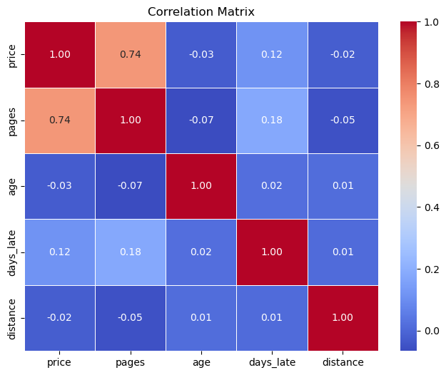
    


```python
late_by_distance = valid_checkouts.groupby('distance')['late'].mean()

```


```python
# Folium map
portland_coords = [45.523064, -122.676483]

m = folium.Map(location=portland_coords, zoom_start=11, width=800, height=600)

for idx, row in customers.iterrows():
    if pd.notna(row['latitude']) and pd.notna(row['longitude']):
        folium.Circle(
            location=(row['latitude'], row['longitude']),
            radius= 10,  
            #popup=f"{row['name']} - Late Return Rate: {row['late']*100:.1f}%",
            color='black',
            fill=True,
            fill_color='gray'
        ).add_to(m)
        folium.Marker(
            location=(row['latitude'], row['longitude']),
            #popup=f"{row['name']} - Late Return Rate: {row['late']*100:.1f}%",
            icon=folium.DivIcon(html=f"""<div style="font-size: 11pt; color : black"></div>""")
        ).add_to(m)

m.save('library_late_return_rate_map.html')

m

```


<div style="width:100%;"><div style="position:relative;width:100%;height:0;padding-bottom:60%;"><span style="color:#565656">Make this Notebook Trusted to load map: File -> Trust Notebook</span><iframe srcdoc="&lt;!DOCTYPE html&gt;
&lt;html&gt;
&lt;head&gt;

    &lt;meta http-equiv=&quot;content-type&quot; content=&quot;text/html; charset=UTF-8&quot; /&gt;

        &lt;script&gt;
            L_NO_TOUCH = false;
            L_DISABLE_3D = false;
        &lt;/script&gt;

    &lt;style&gt;html, body {width: 100%;height: 100%;margin: 0;padding: 0;}&lt;/style&gt;
    &lt;style&gt;#map {position:absolute;top:0;bottom:0;right:0;left:0;}&lt;/style&gt;
    &lt;script src=&quot;https://cdn.jsdelivr.net/npm/leaflet@1.9.3/dist/leaflet.js&quot;&gt;&lt;/script&gt;
    &lt;script src=&quot;https://code.jquery.com/jquery-3.7.1.min.js&quot;&gt;&lt;/script&gt;
    &lt;script src=&quot;https://cdn.jsdelivr.net/npm/bootstrap@5.2.2/dist/js/bootstrap.bundle.min.js&quot;&gt;&lt;/script&gt;
    &lt;script src=&quot;https://cdnjs.cloudflare.com/ajax/libs/Leaflet.awesome-markers/2.0.2/leaflet.awesome-markers.js&quot;&gt;&lt;/script&gt;
    &lt;link rel=&quot;stylesheet&quot; href=&quot;https://cdn.jsdelivr.net/npm/leaflet@1.9.3/dist/leaflet.css&quot;/&gt;
    &lt;link rel=&quot;stylesheet&quot; href=&quot;https://cdn.jsdelivr.net/npm/bootstrap@5.2.2/dist/css/bootstrap.min.css&quot;/&gt;
    &lt;link rel=&quot;stylesheet&quot; href=&quot;https://netdna.bootstrapcdn.com/bootstrap/3.0.0/css/bootstrap-glyphicons.css&quot;/&gt;
    &lt;link rel=&quot;stylesheet&quot; href=&quot;https://cdn.jsdelivr.net/npm/@fortawesome/fontawesome-free@6.2.0/css/all.min.css&quot;/&gt;
    &lt;link rel=&quot;stylesheet&quot; href=&quot;https://cdnjs.cloudflare.com/ajax/libs/Leaflet.awesome-markers/2.0.2/leaflet.awesome-markers.css&quot;/&gt;
    &lt;link rel=&quot;stylesheet&quot; href=&quot;https://cdn.jsdelivr.net/gh/python-visualization/folium/folium/templates/leaflet.awesome.rotate.min.css&quot;/&gt;

            &lt;meta name=&quot;viewport&quot; content=&quot;width=device-width,
                initial-scale=1.0, maximum-scale=1.0, user-scalable=no&quot; /&gt;
            &lt;style&gt;
                #map_a7d5ef5d73f085214523699aac16add9 {
                    position: relative;
                    width: 800.0px;
                    height: 600.0px;
                    left: 0.0%;
                    top: 0.0%;
                }
                .leaflet-container { font-size: 1rem; }
            &lt;/style&gt;

&lt;/head&gt;
&lt;body&gt;


            &lt;div class=&quot;folium-map&quot; id=&quot;map_a7d5ef5d73f085214523699aac16add9&quot; &gt;&lt;/div&gt;

&lt;/body&gt;
&lt;script&gt;


            var map_a7d5ef5d73f085214523699aac16add9 = L.map(
                &quot;map_a7d5ef5d73f085214523699aac16add9&quot;,
                {
                    center: [45.523064, -122.676483],
                    crs: L.CRS.EPSG3857,
                    zoom: 11,
                    zoomControl: true,
                    preferCanvas: false,
                }
            );


            var tile_layer_fcb2889f4eebda02803080a8dba5ce2a = L.tileLayer(
                &quot;https://tile.openstreetmap.org/{z}/{x}/{y}.png&quot;,
                {&quot;attribution&quot;: &quot;\u0026copy; \u003ca href=\&quot;https://www.openstreetmap.org/copyright\&quot;\u003eOpenStreetMap\u003c/a\u003e contributors&quot;, &quot;detectRetina&quot;: false, &quot;maxNativeZoom&quot;: 19, &quot;maxZoom&quot;: 19, &quot;minZoom&quot;: 0, &quot;noWrap&quot;: false, &quot;opacity&quot;: 1, &quot;subdomains&quot;: &quot;abc&quot;, &quot;tms&quot;: false}
            );


            tile_layer_fcb2889f4eebda02803080a8dba5ce2a.addTo(map_a7d5ef5d73f085214523699aac16add9);


            var circle_780131afaad1db6db7f75e2c53a0e27a = L.circle(
                [45.52348805, -122.61875283330345],
                {&quot;bubblingMouseEvents&quot;: true, &quot;color&quot;: &quot;black&quot;, &quot;dashArray&quot;: null, &quot;dashOffset&quot;: null, &quot;fill&quot;: true, &quot;fillColor&quot;: &quot;gray&quot;, &quot;fillOpacity&quot;: 0.2, &quot;fillRule&quot;: &quot;evenodd&quot;, &quot;lineCap&quot;: &quot;round&quot;, &quot;lineJoin&quot;: &quot;round&quot;, &quot;opacity&quot;: 1.0, &quot;radius&quot;: 10, &quot;stroke&quot;: true, &quot;weight&quot;: 3}
            ).addTo(map_a7d5ef5d73f085214523699aac16add9);


            var marker_b31efbe751a27c10833dbd829310062f = L.marker(
                [45.52348805, -122.61875283330345],
                {}
            ).addTo(map_a7d5ef5d73f085214523699aac16add9);


            var div_icon_2489a5bba7e9052b69d81f23f5c8f9b8 = L.divIcon({&quot;className&quot;: &quot;empty&quot;, &quot;html&quot;: &quot;\u003cdiv style=\&quot;font-size: 11pt; color : black\&quot;\u003e\u003c/div\u003e&quot;});
            marker_b31efbe751a27c10833dbd829310062f.setIcon(div_icon_2489a5bba7e9052b69d81f23f5c8f9b8);


            var circle_d4b151813381c01065daca05e81e68f5 = L.circle(
                [45.509121, -122.58601213138911],
                {&quot;bubblingMouseEvents&quot;: true, &quot;color&quot;: &quot;black&quot;, &quot;dashArray&quot;: null, &quot;dashOffset&quot;: null, &quot;fill&quot;: true, &quot;fillColor&quot;: &quot;gray&quot;, &quot;fillOpacity&quot;: 0.2, &quot;fillRule&quot;: &quot;evenodd&quot;, &quot;lineCap&quot;: &quot;round&quot;, &quot;lineJoin&quot;: &quot;round&quot;, &quot;opacity&quot;: 1.0, &quot;radius&quot;: 10, &quot;stroke&quot;: true, &quot;weight&quot;: 3}
            ).addTo(map_a7d5ef5d73f085214523699aac16add9);


            var marker_d76a44700ec744523a8d93fa76f6f99b = L.marker(
                [45.509121, -122.58601213138911],
                {}
            ).addTo(map_a7d5ef5d73f085214523699aac16add9);


            var div_icon_ded338f722d038785779e418c7a3b898 = L.divIcon({&quot;className&quot;: &quot;empty&quot;, &quot;html&quot;: &quot;\u003cdiv style=\&quot;font-size: 11pt; color : black\&quot;\u003e\u003c/div\u003e&quot;});
            marker_d76a44700ec744523a8d93fa76f6f99b.setIcon(div_icon_ded338f722d038785779e418c7a3b898);


            var circle_a78c87591bcbf193e71cd6917e9229c6 = L.circle(
                [45.52059455, -122.6514115],
                {&quot;bubblingMouseEvents&quot;: true, &quot;color&quot;: &quot;black&quot;, &quot;dashArray&quot;: null, &quot;dashOffset&quot;: null, &quot;fill&quot;: true, &quot;fillColor&quot;: &quot;gray&quot;, &quot;fillOpacity&quot;: 0.2, &quot;fillRule&quot;: &quot;evenodd&quot;, &quot;lineCap&quot;: &quot;round&quot;, &quot;lineJoin&quot;: &quot;round&quot;, &quot;opacity&quot;: 1.0, &quot;radius&quot;: 10, &quot;stroke&quot;: true, &quot;weight&quot;: 3}
            ).addTo(map_a7d5ef5d73f085214523699aac16add9);


            var marker_6c2370a3a696a2f795daf42b10ea137c = L.marker(
                [45.52059455, -122.6514115],
                {}
            ).addTo(map_a7d5ef5d73f085214523699aac16add9);


            var div_icon_b7f99eaf7650aa4a2bf31e7fca330e5f = L.divIcon({&quot;className&quot;: &quot;empty&quot;, &quot;html&quot;: &quot;\u003cdiv style=\&quot;font-size: 11pt; color : black\&quot;\u003e\u003c/div\u003e&quot;});
            marker_6c2370a3a696a2f795daf42b10ea137c.setIcon(div_icon_b7f99eaf7650aa4a2bf31e7fca330e5f);


            var circle_2cf45719f5add1c01a125980a9cad155 = L.circle(
                [43.045096, -88.484226],
                {&quot;bubblingMouseEvents&quot;: true, &quot;color&quot;: &quot;black&quot;, &quot;dashArray&quot;: null, &quot;dashOffset&quot;: null, &quot;fill&quot;: true, &quot;fillColor&quot;: &quot;gray&quot;, &quot;fillOpacity&quot;: 0.2, &quot;fillRule&quot;: &quot;evenodd&quot;, &quot;lineCap&quot;: &quot;round&quot;, &quot;lineJoin&quot;: &quot;round&quot;, &quot;opacity&quot;: 1.0, &quot;radius&quot;: 10, &quot;stroke&quot;: true, &quot;weight&quot;: 3}
            ).addTo(map_a7d5ef5d73f085214523699aac16add9);


            var marker_c5a6e69d9ac8d486a5312c0c0be90146 = L.marker(
                [43.045096, -88.484226],
                {}
            ).addTo(map_a7d5ef5d73f085214523699aac16add9);


            var div_icon_f7f44dd496514d341c603e82e4893874 = L.divIcon({&quot;className&quot;: &quot;empty&quot;, &quot;html&quot;: &quot;\u003cdiv style=\&quot;font-size: 11pt; color : black\&quot;\u003e\u003c/div\u003e&quot;});
            marker_c5a6e69d9ac8d486a5312c0c0be90146.setIcon(div_icon_f7f44dd496514d341c603e82e4893874);


            var circle_b7de0411612f102f884ed3736e8f7e3e = L.circle(
                [45.575679, -122.60744265916726],
                {&quot;bubblingMouseEvents&quot;: true, &quot;color&quot;: &quot;black&quot;, &quot;dashArray&quot;: null, &quot;dashOffset&quot;: null, &quot;fill&quot;: true, &quot;fillColor&quot;: &quot;gray&quot;, &quot;fillOpacity&quot;: 0.2, &quot;fillRule&quot;: &quot;evenodd&quot;, &quot;lineCap&quot;: &quot;round&quot;, &quot;lineJoin&quot;: &quot;round&quot;, &quot;opacity&quot;: 1.0, &quot;radius&quot;: 10, &quot;stroke&quot;: true, &quot;weight&quot;: 3}
            ).addTo(map_a7d5ef5d73f085214523699aac16add9);


            var marker_1e0f1c171af30995f5c70b77099ed0fa = L.marker(
                [45.575679, -122.60744265916726],
                {}
            ).addTo(map_a7d5ef5d73f085214523699aac16add9);


            var div_icon_fa48bc3ca0b59dea21cad359d27866b3 = L.divIcon({&quot;className&quot;: &quot;empty&quot;, &quot;html&quot;: &quot;\u003cdiv style=\&quot;font-size: 11pt; color : black\&quot;\u003e\u003c/div\u003e&quot;});
            marker_1e0f1c171af30995f5c70b77099ed0fa.setIcon(div_icon_fa48bc3ca0b59dea21cad359d27866b3);


            var circle_1125ffe845e82f3d3c29e2eb4ce6a109 = L.circle(
                [45.552608649999996, -122.59195176326156],
                {&quot;bubblingMouseEvents&quot;: true, &quot;color&quot;: &quot;black&quot;, &quot;dashArray&quot;: null, &quot;dashOffset&quot;: null, &quot;fill&quot;: true, &quot;fillColor&quot;: &quot;gray&quot;, &quot;fillOpacity&quot;: 0.2, &quot;fillRule&quot;: &quot;evenodd&quot;, &quot;lineCap&quot;: &quot;round&quot;, &quot;lineJoin&quot;: &quot;round&quot;, &quot;opacity&quot;: 1.0, &quot;radius&quot;: 10, &quot;stroke&quot;: true, &quot;weight&quot;: 3}
            ).addTo(map_a7d5ef5d73f085214523699aac16add9);


            var marker_fdb593e5db8dd869cd7824a5175d7ff3 = L.marker(
                [45.552608649999996, -122.59195176326156],
                {}
            ).addTo(map_a7d5ef5d73f085214523699aac16add9);


            var div_icon_d8cb21ec963e37a0836783897f41c68b = L.divIcon({&quot;className&quot;: &quot;empty&quot;, &quot;html&quot;: &quot;\u003cdiv style=\&quot;font-size: 11pt; color : black\&quot;\u003e\u003c/div\u003e&quot;});
            marker_fdb593e5db8dd869cd7824a5175d7ff3.setIcon(div_icon_d8cb21ec963e37a0836783897f41c68b);


            var circle_215f60e50d06887a0024e19cf6083805 = L.circle(
                [44.09830258389261, -93.0660368590604],
                {&quot;bubblingMouseEvents&quot;: true, &quot;color&quot;: &quot;black&quot;, &quot;dashArray&quot;: null, &quot;dashOffset&quot;: null, &quot;fill&quot;: true, &quot;fillColor&quot;: &quot;gray&quot;, &quot;fillOpacity&quot;: 0.2, &quot;fillRule&quot;: &quot;evenodd&quot;, &quot;lineCap&quot;: &quot;round&quot;, &quot;lineJoin&quot;: &quot;round&quot;, &quot;opacity&quot;: 1.0, &quot;radius&quot;: 10, &quot;stroke&quot;: true, &quot;weight&quot;: 3}
            ).addTo(map_a7d5ef5d73f085214523699aac16add9);


            var marker_e00718a59cca5811c48d9946e3124537 = L.marker(
                [44.09830258389261, -93.0660368590604],
                {}
            ).addTo(map_a7d5ef5d73f085214523699aac16add9);


            var div_icon_3a3911e077911c2217cefc4d176fd2d0 = L.divIcon({&quot;className&quot;: &quot;empty&quot;, &quot;html&quot;: &quot;\u003cdiv style=\&quot;font-size: 11pt; color : black\&quot;\u003e\u003c/div\u003e&quot;});
            marker_e00718a59cca5811c48d9946e3124537.setIcon(div_icon_3a3911e077911c2217cefc4d176fd2d0);


            var circle_aa210d7f0c7d0e15aaf73c96a63c6a69 = L.circle(
                [45.44005095, -122.55907129122821],
                {&quot;bubblingMouseEvents&quot;: true, &quot;color&quot;: &quot;black&quot;, &quot;dashArray&quot;: null, &quot;dashOffset&quot;: null, &quot;fill&quot;: true, &quot;fillColor&quot;: &quot;gray&quot;, &quot;fillOpacity&quot;: 0.2, &quot;fillRule&quot;: &quot;evenodd&quot;, &quot;lineCap&quot;: &quot;round&quot;, &quot;lineJoin&quot;: &quot;round&quot;, &quot;opacity&quot;: 1.0, &quot;radius&quot;: 10, &quot;stroke&quot;: true, &quot;weight&quot;: 3}
            ).addTo(map_a7d5ef5d73f085214523699aac16add9);


            var marker_17ee6eef28c1622fa4abfd42c2667b0a = L.marker(
                [45.44005095, -122.55907129122821],
                {}
            ).addTo(map_a7d5ef5d73f085214523699aac16add9);


            var div_icon_ee6fa29b59125b9a318d12a626468e68 = L.divIcon({&quot;className&quot;: &quot;empty&quot;, &quot;html&quot;: &quot;\u003cdiv style=\&quot;font-size: 11pt; color : black\&quot;\u003e\u003c/div\u003e&quot;});
            marker_17ee6eef28c1622fa4abfd42c2667b0a.setIcon(div_icon_ee6fa29b59125b9a318d12a626468e68);


            var circle_5638b9309e9395f5560257974ce90c8b = L.circle(
                [45.52519305, -122.68913499935377],
                {&quot;bubblingMouseEvents&quot;: true, &quot;color&quot;: &quot;black&quot;, &quot;dashArray&quot;: null, &quot;dashOffset&quot;: null, &quot;fill&quot;: true, &quot;fillColor&quot;: &quot;gray&quot;, &quot;fillOpacity&quot;: 0.2, &quot;fillRule&quot;: &quot;evenodd&quot;, &quot;lineCap&quot;: &quot;round&quot;, &quot;lineJoin&quot;: &quot;round&quot;, &quot;opacity&quot;: 1.0, &quot;radius&quot;: 10, &quot;stroke&quot;: true, &quot;weight&quot;: 3}
            ).addTo(map_a7d5ef5d73f085214523699aac16add9);


            var marker_ec97300d47d1f0c76f1b71d98c6a299f = L.marker(
                [45.52519305, -122.68913499935377],
                {}
            ).addTo(map_a7d5ef5d73f085214523699aac16add9);


            var div_icon_6dfd1b577e296641d5cbae81cd90790b = L.divIcon({&quot;className&quot;: &quot;empty&quot;, &quot;html&quot;: &quot;\u003cdiv style=\&quot;font-size: 11pt; color : black\&quot;\u003e\u003c/div\u003e&quot;});
            marker_ec97300d47d1f0c76f1b71d98c6a299f.setIcon(div_icon_6dfd1b577e296641d5cbae81cd90790b);


            var circle_d360330afc3e0e2eec4a326d4a831bb0 = L.circle(
                [45.51770715, -122.50510519074625],
                {&quot;bubblingMouseEvents&quot;: true, &quot;color&quot;: &quot;black&quot;, &quot;dashArray&quot;: null, &quot;dashOffset&quot;: null, &quot;fill&quot;: true, &quot;fillColor&quot;: &quot;gray&quot;, &quot;fillOpacity&quot;: 0.2, &quot;fillRule&quot;: &quot;evenodd&quot;, &quot;lineCap&quot;: &quot;round&quot;, &quot;lineJoin&quot;: &quot;round&quot;, &quot;opacity&quot;: 1.0, &quot;radius&quot;: 10, &quot;stroke&quot;: true, &quot;weight&quot;: 3}
            ).addTo(map_a7d5ef5d73f085214523699aac16add9);


            var marker_b8af5dc8f8c49e3017b5d6ec1a2527f2 = L.marker(
                [45.51770715, -122.50510519074625],
                {}
            ).addTo(map_a7d5ef5d73f085214523699aac16add9);


            var div_icon_9a230f58ba8a06cbe436c6eb0d6636f6 = L.divIcon({&quot;className&quot;: &quot;empty&quot;, &quot;html&quot;: &quot;\u003cdiv style=\&quot;font-size: 11pt; color : black\&quot;\u003e\u003c/div\u003e&quot;});
            marker_b8af5dc8f8c49e3017b5d6ec1a2527f2.setIcon(div_icon_9a230f58ba8a06cbe436c6eb0d6636f6);


            var circle_c853a0f0b84603b10a79be838a1cc56e = L.circle(
                [45.43438440851947, -122.69429886740981],
                {&quot;bubblingMouseEvents&quot;: true, &quot;color&quot;: &quot;black&quot;, &quot;dashArray&quot;: null, &quot;dashOffset&quot;: null, &quot;fill&quot;: true, &quot;fillColor&quot;: &quot;gray&quot;, &quot;fillOpacity&quot;: 0.2, &quot;fillRule&quot;: &quot;evenodd&quot;, &quot;lineCap&quot;: &quot;round&quot;, &quot;lineJoin&quot;: &quot;round&quot;, &quot;opacity&quot;: 1.0, &quot;radius&quot;: 10, &quot;stroke&quot;: true, &quot;weight&quot;: 3}
            ).addTo(map_a7d5ef5d73f085214523699aac16add9);


            var marker_47a30639ec79b6606bf1cd3127b1e773 = L.marker(
                [45.43438440851947, -122.69429886740981],
                {}
            ).addTo(map_a7d5ef5d73f085214523699aac16add9);


            var div_icon_8c2458809eb067a357198ca167ae5b18 = L.divIcon({&quot;className&quot;: &quot;empty&quot;, &quot;html&quot;: &quot;\u003cdiv style=\&quot;font-size: 11pt; color : black\&quot;\u003e\u003c/div\u003e&quot;});
            marker_47a30639ec79b6606bf1cd3127b1e773.setIcon(div_icon_8c2458809eb067a357198ca167ae5b18);


            var circle_3c723dcb6c2a46f70b615afa9c7b5420 = L.circle(
                [45.6361654601865, -122.56790307633159],
                {&quot;bubblingMouseEvents&quot;: true, &quot;color&quot;: &quot;black&quot;, &quot;dashArray&quot;: null, &quot;dashOffset&quot;: null, &quot;fill&quot;: true, &quot;fillColor&quot;: &quot;gray&quot;, &quot;fillOpacity&quot;: 0.2, &quot;fillRule&quot;: &quot;evenodd&quot;, &quot;lineCap&quot;: &quot;round&quot;, &quot;lineJoin&quot;: &quot;round&quot;, &quot;opacity&quot;: 1.0, &quot;radius&quot;: 10, &quot;stroke&quot;: true, &quot;weight&quot;: 3}
            ).addTo(map_a7d5ef5d73f085214523699aac16add9);


            var marker_9cd02b14cddc6dc589d604d0af21ec36 = L.marker(
                [45.6361654601865, -122.56790307633159],
                {}
            ).addTo(map_a7d5ef5d73f085214523699aac16add9);


            var div_icon_1125ec9e9a795725225d0ad52e62d70b = L.divIcon({&quot;className&quot;: &quot;empty&quot;, &quot;html&quot;: &quot;\u003cdiv style=\&quot;font-size: 11pt; color : black\&quot;\u003e\u003c/div\u003e&quot;});
            marker_9cd02b14cddc6dc589d604d0af21ec36.setIcon(div_icon_1125ec9e9a795725225d0ad52e62d70b);


            var circle_2e71e0ee83ea47cd3d4d4ca84c82d58a = L.circle(
                [25.67720712244898, -80.47047404081633],
                {&quot;bubblingMouseEvents&quot;: true, &quot;color&quot;: &quot;black&quot;, &quot;dashArray&quot;: null, &quot;dashOffset&quot;: null, &quot;fill&quot;: true, &quot;fillColor&quot;: &quot;gray&quot;, &quot;fillOpacity&quot;: 0.2, &quot;fillRule&quot;: &quot;evenodd&quot;, &quot;lineCap&quot;: &quot;round&quot;, &quot;lineJoin&quot;: &quot;round&quot;, &quot;opacity&quot;: 1.0, &quot;radius&quot;: 10, &quot;stroke&quot;: true, &quot;weight&quot;: 3}
            ).addTo(map_a7d5ef5d73f085214523699aac16add9);


            var marker_1323f0dba595c07ba21e7a390a6fac5e = L.marker(
                [25.67720712244898, -80.47047404081633],
                {}
            ).addTo(map_a7d5ef5d73f085214523699aac16add9);


            var div_icon_bd4898f53ff802a6936863b97de7fdbd = L.divIcon({&quot;className&quot;: &quot;empty&quot;, &quot;html&quot;: &quot;\u003cdiv style=\&quot;font-size: 11pt; color : black\&quot;\u003e\u003c/div\u003e&quot;});
            marker_1323f0dba595c07ba21e7a390a6fac5e.setIcon(div_icon_bd4898f53ff802a6936863b97de7fdbd);


            var circle_34c27e7fd58749f3e9a08426d1247e6d = L.circle(
                [45.50025875, -122.59197354323027],
                {&quot;bubblingMouseEvents&quot;: true, &quot;color&quot;: &quot;black&quot;, &quot;dashArray&quot;: null, &quot;dashOffset&quot;: null, &quot;fill&quot;: true, &quot;fillColor&quot;: &quot;gray&quot;, &quot;fillOpacity&quot;: 0.2, &quot;fillRule&quot;: &quot;evenodd&quot;, &quot;lineCap&quot;: &quot;round&quot;, &quot;lineJoin&quot;: &quot;round&quot;, &quot;opacity&quot;: 1.0, &quot;radius&quot;: 10, &quot;stroke&quot;: true, &quot;weight&quot;: 3}
            ).addTo(map_a7d5ef5d73f085214523699aac16add9);


            var marker_6e55605825a8ca56725f844f7f302212 = L.marker(
                [45.50025875, -122.59197354323027],
                {}
            ).addTo(map_a7d5ef5d73f085214523699aac16add9);


            var div_icon_2938b8774416a629160dd59994953c9a = L.divIcon({&quot;className&quot;: &quot;empty&quot;, &quot;html&quot;: &quot;\u003cdiv style=\&quot;font-size: 11pt; color : black\&quot;\u003e\u003c/div\u003e&quot;});
            marker_6e55605825a8ca56725f844f7f302212.setIcon(div_icon_2938b8774416a629160dd59994953c9a);


            var circle_90b129e6e6f9a81e79af30040bb61db3 = L.circle(
                [45.549017, -122.820548],
                {&quot;bubblingMouseEvents&quot;: true, &quot;color&quot;: &quot;black&quot;, &quot;dashArray&quot;: null, &quot;dashOffset&quot;: null, &quot;fill&quot;: true, &quot;fillColor&quot;: &quot;gray&quot;, &quot;fillOpacity&quot;: 0.2, &quot;fillRule&quot;: &quot;evenodd&quot;, &quot;lineCap&quot;: &quot;round&quot;, &quot;lineJoin&quot;: &quot;round&quot;, &quot;opacity&quot;: 1.0, &quot;radius&quot;: 10, &quot;stroke&quot;: true, &quot;weight&quot;: 3}
            ).addTo(map_a7d5ef5d73f085214523699aac16add9);


            var marker_04aabbee7bc35a6c9549447bef41ecb6 = L.marker(
                [45.549017, -122.820548],
                {}
            ).addTo(map_a7d5ef5d73f085214523699aac16add9);


            var div_icon_70391cb858f3706114c5609358db1069 = L.divIcon({&quot;className&quot;: &quot;empty&quot;, &quot;html&quot;: &quot;\u003cdiv style=\&quot;font-size: 11pt; color : black\&quot;\u003e\u003c/div\u003e&quot;});
            marker_04aabbee7bc35a6c9549447bef41ecb6.setIcon(div_icon_70391cb858f3706114c5609358db1069);


            var circle_90475ab721af251e2ee572db517e37bf = L.circle(
                [45.39773390221187, -122.74922189607665],
                {&quot;bubblingMouseEvents&quot;: true, &quot;color&quot;: &quot;black&quot;, &quot;dashArray&quot;: null, &quot;dashOffset&quot;: null, &quot;fill&quot;: true, &quot;fillColor&quot;: &quot;gray&quot;, &quot;fillOpacity&quot;: 0.2, &quot;fillRule&quot;: &quot;evenodd&quot;, &quot;lineCap&quot;: &quot;round&quot;, &quot;lineJoin&quot;: &quot;round&quot;, &quot;opacity&quot;: 1.0, &quot;radius&quot;: 10, &quot;stroke&quot;: true, &quot;weight&quot;: 3}
            ).addTo(map_a7d5ef5d73f085214523699aac16add9);


            var marker_7b6d871a1eba4d02a5ccb4fdefea8d42 = L.marker(
                [45.39773390221187, -122.74922189607665],
                {}
            ).addTo(map_a7d5ef5d73f085214523699aac16add9);


            var div_icon_8c9a41aa090aea4868ca4e53b3550b01 = L.divIcon({&quot;className&quot;: &quot;empty&quot;, &quot;html&quot;: &quot;\u003cdiv style=\&quot;font-size: 11pt; color : black\&quot;\u003e\u003c/div\u003e&quot;});
            marker_7b6d871a1eba4d02a5ccb4fdefea8d42.setIcon(div_icon_8c9a41aa090aea4868ca4e53b3550b01);


            var circle_39da3385e6389e993a89e468e5157de2 = L.circle(
                [45.5340221, -122.69170587733026],
                {&quot;bubblingMouseEvents&quot;: true, &quot;color&quot;: &quot;black&quot;, &quot;dashArray&quot;: null, &quot;dashOffset&quot;: null, &quot;fill&quot;: true, &quot;fillColor&quot;: &quot;gray&quot;, &quot;fillOpacity&quot;: 0.2, &quot;fillRule&quot;: &quot;evenodd&quot;, &quot;lineCap&quot;: &quot;round&quot;, &quot;lineJoin&quot;: &quot;round&quot;, &quot;opacity&quot;: 1.0, &quot;radius&quot;: 10, &quot;stroke&quot;: true, &quot;weight&quot;: 3}
            ).addTo(map_a7d5ef5d73f085214523699aac16add9);


            var marker_5465e2a722a35057416923c27fe7c511 = L.marker(
                [45.5340221, -122.69170587733026],
                {}
            ).addTo(map_a7d5ef5d73f085214523699aac16add9);


            var div_icon_c4004189335d6c112a748ff47e1b9a38 = L.divIcon({&quot;className&quot;: &quot;empty&quot;, &quot;html&quot;: &quot;\u003cdiv style=\&quot;font-size: 11pt; color : black\&quot;\u003e\u003c/div\u003e&quot;});
            marker_5465e2a722a35057416923c27fe7c511.setIcon(div_icon_c4004189335d6c112a748ff47e1b9a38);


            var circle_93472ece1d1f0e34e57cb3c9a07616df = L.circle(
                [45.53436875, -122.52138187470207],
                {&quot;bubblingMouseEvents&quot;: true, &quot;color&quot;: &quot;black&quot;, &quot;dashArray&quot;: null, &quot;dashOffset&quot;: null, &quot;fill&quot;: true, &quot;fillColor&quot;: &quot;gray&quot;, &quot;fillOpacity&quot;: 0.2, &quot;fillRule&quot;: &quot;evenodd&quot;, &quot;lineCap&quot;: &quot;round&quot;, &quot;lineJoin&quot;: &quot;round&quot;, &quot;opacity&quot;: 1.0, &quot;radius&quot;: 10, &quot;stroke&quot;: true, &quot;weight&quot;: 3}
            ).addTo(map_a7d5ef5d73f085214523699aac16add9);


            var marker_2bf43e2fe1e60522521a7bab8fd5a6a9 = L.marker(
                [45.53436875, -122.52138187470207],
                {}
            ).addTo(map_a7d5ef5d73f085214523699aac16add9);


            var div_icon_0aa742ccc81cb98ec159ce57e78b6b09 = L.divIcon({&quot;className&quot;: &quot;empty&quot;, &quot;html&quot;: &quot;\u003cdiv style=\&quot;font-size: 11pt; color : black\&quot;\u003e\u003c/div\u003e&quot;});
            marker_2bf43e2fe1e60522521a7bab8fd5a6a9.setIcon(div_icon_0aa742ccc81cb98ec159ce57e78b6b09);


            var circle_010658d6e1b6dfeab68f210f091c47f2 = L.circle(
                [45.5295448, -122.62829224095015],
                {&quot;bubblingMouseEvents&quot;: true, &quot;color&quot;: &quot;black&quot;, &quot;dashArray&quot;: null, &quot;dashOffset&quot;: null, &quot;fill&quot;: true, &quot;fillColor&quot;: &quot;gray&quot;, &quot;fillOpacity&quot;: 0.2, &quot;fillRule&quot;: &quot;evenodd&quot;, &quot;lineCap&quot;: &quot;round&quot;, &quot;lineJoin&quot;: &quot;round&quot;, &quot;opacity&quot;: 1.0, &quot;radius&quot;: 10, &quot;stroke&quot;: true, &quot;weight&quot;: 3}
            ).addTo(map_a7d5ef5d73f085214523699aac16add9);


            var marker_70c53f1eeb8a08525c3e3434153ddede = L.marker(
                [45.5295448, -122.62829224095015],
                {}
            ).addTo(map_a7d5ef5d73f085214523699aac16add9);


            var div_icon_4bdd349ff06300645747bbe5534af1b8 = L.divIcon({&quot;className&quot;: &quot;empty&quot;, &quot;html&quot;: &quot;\u003cdiv style=\&quot;font-size: 11pt; color : black\&quot;\u003e\u003c/div\u003e&quot;});
            marker_70c53f1eeb8a08525c3e3434153ddede.setIcon(div_icon_4bdd349ff06300645747bbe5534af1b8);


            var circle_4ed63deec741233a1eeffa38a2695bfe = L.circle(
                [41.8644991, -87.6140446],
                {&quot;bubblingMouseEvents&quot;: true, &quot;color&quot;: &quot;black&quot;, &quot;dashArray&quot;: null, &quot;dashOffset&quot;: null, &quot;fill&quot;: true, &quot;fillColor&quot;: &quot;gray&quot;, &quot;fillOpacity&quot;: 0.2, &quot;fillRule&quot;: &quot;evenodd&quot;, &quot;lineCap&quot;: &quot;round&quot;, &quot;lineJoin&quot;: &quot;round&quot;, &quot;opacity&quot;: 1.0, &quot;radius&quot;: 10, &quot;stroke&quot;: true, &quot;weight&quot;: 3}
            ).addTo(map_a7d5ef5d73f085214523699aac16add9);


            var marker_a3a2d2f4ef153ef0dc11b6a0634b42a5 = L.marker(
                [41.8644991, -87.6140446],
                {}
            ).addTo(map_a7d5ef5d73f085214523699aac16add9);


            var div_icon_22bf93875733f1d3868ff15f7b9acdfc = L.divIcon({&quot;className&quot;: &quot;empty&quot;, &quot;html&quot;: &quot;\u003cdiv style=\&quot;font-size: 11pt; color : black\&quot;\u003e\u003c/div\u003e&quot;});
            marker_a3a2d2f4ef153ef0dc11b6a0634b42a5.setIcon(div_icon_22bf93875733f1d3868ff15f7b9acdfc);


            var circle_257f2742abaff510b6894a5ba73aee97 = L.circle(
                [45.547171399999996, -122.57749141187648],
                {&quot;bubblingMouseEvents&quot;: true, &quot;color&quot;: &quot;black&quot;, &quot;dashArray&quot;: null, &quot;dashOffset&quot;: null, &quot;fill&quot;: true, &quot;fillColor&quot;: &quot;gray&quot;, &quot;fillOpacity&quot;: 0.2, &quot;fillRule&quot;: &quot;evenodd&quot;, &quot;lineCap&quot;: &quot;round&quot;, &quot;lineJoin&quot;: &quot;round&quot;, &quot;opacity&quot;: 1.0, &quot;radius&quot;: 10, &quot;stroke&quot;: true, &quot;weight&quot;: 3}
            ).addTo(map_a7d5ef5d73f085214523699aac16add9);


            var marker_ac097bc0f4170af6957f86d6530544fa = L.marker(
                [45.547171399999996, -122.57749141187648],
                {}
            ).addTo(map_a7d5ef5d73f085214523699aac16add9);


            var div_icon_cefb813af0a7524e618ed2e44b0f4a69 = L.divIcon({&quot;className&quot;: &quot;empty&quot;, &quot;html&quot;: &quot;\u003cdiv style=\&quot;font-size: 11pt; color : black\&quot;\u003e\u003c/div\u003e&quot;});
            marker_ac097bc0f4170af6957f86d6530544fa.setIcon(div_icon_cefb813af0a7524e618ed2e44b0f4a69);


            var circle_e65e54673fa2761e7c112f6c8b9470fe = L.circle(
                [45.59543205, -122.64648684295858],
                {&quot;bubblingMouseEvents&quot;: true, &quot;color&quot;: &quot;black&quot;, &quot;dashArray&quot;: null, &quot;dashOffset&quot;: null, &quot;fill&quot;: true, &quot;fillColor&quot;: &quot;gray&quot;, &quot;fillOpacity&quot;: 0.2, &quot;fillRule&quot;: &quot;evenodd&quot;, &quot;lineCap&quot;: &quot;round&quot;, &quot;lineJoin&quot;: &quot;round&quot;, &quot;opacity&quot;: 1.0, &quot;radius&quot;: 10, &quot;stroke&quot;: true, &quot;weight&quot;: 3}
            ).addTo(map_a7d5ef5d73f085214523699aac16add9);


            var marker_0d539ee371c03651120e3abce102ac28 = L.marker(
                [45.59543205, -122.64648684295858],
                {}
            ).addTo(map_a7d5ef5d73f085214523699aac16add9);


            var div_icon_4f6ac8a68801b7935179283b3db4c5dd = L.divIcon({&quot;className&quot;: &quot;empty&quot;, &quot;html&quot;: &quot;\u003cdiv style=\&quot;font-size: 11pt; color : black\&quot;\u003e\u003c/div\u003e&quot;});
            marker_0d539ee371c03651120e3abce102ac28.setIcon(div_icon_4f6ac8a68801b7935179283b3db4c5dd);


            var circle_f7bc81f5e957cd91a00867d0c6d65292 = L.circle(
                [45.47620278787879, -122.72852396969698],
                {&quot;bubblingMouseEvents&quot;: true, &quot;color&quot;: &quot;black&quot;, &quot;dashArray&quot;: null, &quot;dashOffset&quot;: null, &quot;fill&quot;: true, &quot;fillColor&quot;: &quot;gray&quot;, &quot;fillOpacity&quot;: 0.2, &quot;fillRule&quot;: &quot;evenodd&quot;, &quot;lineCap&quot;: &quot;round&quot;, &quot;lineJoin&quot;: &quot;round&quot;, &quot;opacity&quot;: 1.0, &quot;radius&quot;: 10, &quot;stroke&quot;: true, &quot;weight&quot;: 3}
            ).addTo(map_a7d5ef5d73f085214523699aac16add9);


            var marker_a66f3dcb6686a41c38f394251c5e84b9 = L.marker(
                [45.47620278787879, -122.72852396969698],
                {}
            ).addTo(map_a7d5ef5d73f085214523699aac16add9);


            var div_icon_c258e7d28ff9f60c2a2672d8c49933fa = L.divIcon({&quot;className&quot;: &quot;empty&quot;, &quot;html&quot;: &quot;\u003cdiv style=\&quot;font-size: 11pt; color : black\&quot;\u003e\u003c/div\u003e&quot;});
            marker_a66f3dcb6686a41c38f394251c5e84b9.setIcon(div_icon_c258e7d28ff9f60c2a2672d8c49933fa);


            var circle_ecf3ec18b363d899cdccd9dd7755f911 = L.circle(
                [45.5381903, -122.60863919603644],
                {&quot;bubblingMouseEvents&quot;: true, &quot;color&quot;: &quot;black&quot;, &quot;dashArray&quot;: null, &quot;dashOffset&quot;: null, &quot;fill&quot;: true, &quot;fillColor&quot;: &quot;gray&quot;, &quot;fillOpacity&quot;: 0.2, &quot;fillRule&quot;: &quot;evenodd&quot;, &quot;lineCap&quot;: &quot;round&quot;, &quot;lineJoin&quot;: &quot;round&quot;, &quot;opacity&quot;: 1.0, &quot;radius&quot;: 10, &quot;stroke&quot;: true, &quot;weight&quot;: 3}
            ).addTo(map_a7d5ef5d73f085214523699aac16add9);


            var marker_6d0e266a325daf5891985e069aed9757 = L.marker(
                [45.5381903, -122.60863919603644],
                {}
            ).addTo(map_a7d5ef5d73f085214523699aac16add9);


            var div_icon_750842b574bad9216ca6abcb17b3a623 = L.divIcon({&quot;className&quot;: &quot;empty&quot;, &quot;html&quot;: &quot;\u003cdiv style=\&quot;font-size: 11pt; color : black\&quot;\u003e\u003c/div\u003e&quot;});
            marker_6d0e266a325daf5891985e069aed9757.setIcon(div_icon_750842b574bad9216ca6abcb17b3a623);


            var circle_c6774c795f87c1ec4d3559793a9ca5a6 = L.circle(
                [45.4367883, -122.72639235],
                {&quot;bubblingMouseEvents&quot;: true, &quot;color&quot;: &quot;black&quot;, &quot;dashArray&quot;: null, &quot;dashOffset&quot;: null, &quot;fill&quot;: true, &quot;fillColor&quot;: &quot;gray&quot;, &quot;fillOpacity&quot;: 0.2, &quot;fillRule&quot;: &quot;evenodd&quot;, &quot;lineCap&quot;: &quot;round&quot;, &quot;lineJoin&quot;: &quot;round&quot;, &quot;opacity&quot;: 1.0, &quot;radius&quot;: 10, &quot;stroke&quot;: true, &quot;weight&quot;: 3}
            ).addTo(map_a7d5ef5d73f085214523699aac16add9);


            var marker_5ad424226a8582c14d295738ed5fa675 = L.marker(
                [45.4367883, -122.72639235],
                {}
            ).addTo(map_a7d5ef5d73f085214523699aac16add9);


            var div_icon_eb8b7c6f39bead6e2a765bcd325f9ffc = L.divIcon({&quot;className&quot;: &quot;empty&quot;, &quot;html&quot;: &quot;\u003cdiv style=\&quot;font-size: 11pt; color : black\&quot;\u003e\u003c/div\u003e&quot;});
            marker_5ad424226a8582c14d295738ed5fa675.setIcon(div_icon_eb8b7c6f39bead6e2a765bcd325f9ffc);


            var circle_6507c3d6fefbc6096466e8142562cd1b = L.circle(
                [45.533496, -122.6017972],
                {&quot;bubblingMouseEvents&quot;: true, &quot;color&quot;: &quot;black&quot;, &quot;dashArray&quot;: null, &quot;dashOffset&quot;: null, &quot;fill&quot;: true, &quot;fillColor&quot;: &quot;gray&quot;, &quot;fillOpacity&quot;: 0.2, &quot;fillRule&quot;: &quot;evenodd&quot;, &quot;lineCap&quot;: &quot;round&quot;, &quot;lineJoin&quot;: &quot;round&quot;, &quot;opacity&quot;: 1.0, &quot;radius&quot;: 10, &quot;stroke&quot;: true, &quot;weight&quot;: 3}
            ).addTo(map_a7d5ef5d73f085214523699aac16add9);


            var marker_23fde2d0efa459f71a7d42ff7c628b3c = L.marker(
                [45.533496, -122.6017972],
                {}
            ).addTo(map_a7d5ef5d73f085214523699aac16add9);


            var div_icon_4422ac50662b43bf1ba2b1726489fb6a = L.divIcon({&quot;className&quot;: &quot;empty&quot;, &quot;html&quot;: &quot;\u003cdiv style=\&quot;font-size: 11pt; color : black\&quot;\u003e\u003c/div\u003e&quot;});
            marker_23fde2d0efa459f71a7d42ff7c628b3c.setIcon(div_icon_4422ac50662b43bf1ba2b1726489fb6a);


            var circle_c4d78848467c80fbf8b65e06ec21206f = L.circle(
                [45.5090772, -122.57251209768991],
                {&quot;bubblingMouseEvents&quot;: true, &quot;color&quot;: &quot;black&quot;, &quot;dashArray&quot;: null, &quot;dashOffset&quot;: null, &quot;fill&quot;: true, &quot;fillColor&quot;: &quot;gray&quot;, &quot;fillOpacity&quot;: 0.2, &quot;fillRule&quot;: &quot;evenodd&quot;, &quot;lineCap&quot;: &quot;round&quot;, &quot;lineJoin&quot;: &quot;round&quot;, &quot;opacity&quot;: 1.0, &quot;radius&quot;: 10, &quot;stroke&quot;: true, &quot;weight&quot;: 3}
            ).addTo(map_a7d5ef5d73f085214523699aac16add9);


            var marker_cfdb24f408e8cc99127e3349d5f3bd13 = L.marker(
                [45.5090772, -122.57251209768991],
                {}
            ).addTo(map_a7d5ef5d73f085214523699aac16add9);


            var div_icon_8fa196223e7be107c4a6dc501bfa3300 = L.divIcon({&quot;className&quot;: &quot;empty&quot;, &quot;html&quot;: &quot;\u003cdiv style=\&quot;font-size: 11pt; color : black\&quot;\u003e\u003c/div\u003e&quot;});
            marker_cfdb24f408e8cc99127e3349d5f3bd13.setIcon(div_icon_8fa196223e7be107c4a6dc501bfa3300);


            var circle_9d2b8e9c1723f96eab567ebcd3b5d978 = L.circle(
                [45.5888353, -122.5892116],
                {&quot;bubblingMouseEvents&quot;: true, &quot;color&quot;: &quot;black&quot;, &quot;dashArray&quot;: null, &quot;dashOffset&quot;: null, &quot;fill&quot;: true, &quot;fillColor&quot;: &quot;gray&quot;, &quot;fillOpacity&quot;: 0.2, &quot;fillRule&quot;: &quot;evenodd&quot;, &quot;lineCap&quot;: &quot;round&quot;, &quot;lineJoin&quot;: &quot;round&quot;, &quot;opacity&quot;: 1.0, &quot;radius&quot;: 10, &quot;stroke&quot;: true, &quot;weight&quot;: 3}
            ).addTo(map_a7d5ef5d73f085214523699aac16add9);


            var marker_f961da3fc16f235bcb40fb9ff345544d = L.marker(
                [45.5888353, -122.5892116],
                {}
            ).addTo(map_a7d5ef5d73f085214523699aac16add9);


            var div_icon_4177cecc5d09725dd7dbcc5db5c8f084 = L.divIcon({&quot;className&quot;: &quot;empty&quot;, &quot;html&quot;: &quot;\u003cdiv style=\&quot;font-size: 11pt; color : black\&quot;\u003e\u003c/div\u003e&quot;});
            marker_f961da3fc16f235bcb40fb9ff345544d.setIcon(div_icon_4177cecc5d09725dd7dbcc5db5c8f084);


            var circle_70c71e66a67e3cba4613017578757d7b = L.circle(
                [45.37925265399542, -122.58002993448464],
                {&quot;bubblingMouseEvents&quot;: true, &quot;color&quot;: &quot;black&quot;, &quot;dashArray&quot;: null, &quot;dashOffset&quot;: null, &quot;fill&quot;: true, &quot;fillColor&quot;: &quot;gray&quot;, &quot;fillOpacity&quot;: 0.2, &quot;fillRule&quot;: &quot;evenodd&quot;, &quot;lineCap&quot;: &quot;round&quot;, &quot;lineJoin&quot;: &quot;round&quot;, &quot;opacity&quot;: 1.0, &quot;radius&quot;: 10, &quot;stroke&quot;: true, &quot;weight&quot;: 3}
            ).addTo(map_a7d5ef5d73f085214523699aac16add9);


            var marker_7cf0a55efcaf08ff26332724b4859c5d = L.marker(
                [45.37925265399542, -122.58002993448464],
                {}
            ).addTo(map_a7d5ef5d73f085214523699aac16add9);


            var div_icon_cdf9fd222505bda95c9ca4d128bba474 = L.divIcon({&quot;className&quot;: &quot;empty&quot;, &quot;html&quot;: &quot;\u003cdiv style=\&quot;font-size: 11pt; color : black\&quot;\u003e\u003c/div\u003e&quot;});
            marker_7cf0a55efcaf08ff26332724b4859c5d.setIcon(div_icon_cdf9fd222505bda95c9ca4d128bba474);


            var circle_b9ed4d9304d546b9d9085e458264c8e7 = L.circle(
                [45.4126757, -122.70106939706349],
                {&quot;bubblingMouseEvents&quot;: true, &quot;color&quot;: &quot;black&quot;, &quot;dashArray&quot;: null, &quot;dashOffset&quot;: null, &quot;fill&quot;: true, &quot;fillColor&quot;: &quot;gray&quot;, &quot;fillOpacity&quot;: 0.2, &quot;fillRule&quot;: &quot;evenodd&quot;, &quot;lineCap&quot;: &quot;round&quot;, &quot;lineJoin&quot;: &quot;round&quot;, &quot;opacity&quot;: 1.0, &quot;radius&quot;: 10, &quot;stroke&quot;: true, &quot;weight&quot;: 3}
            ).addTo(map_a7d5ef5d73f085214523699aac16add9);


            var marker_8bde1016db9e70ddfe66a39b088a4db3 = L.marker(
                [45.4126757, -122.70106939706349],
                {}
            ).addTo(map_a7d5ef5d73f085214523699aac16add9);


            var div_icon_8cb98aeb8122f58127994d404f547715 = L.divIcon({&quot;className&quot;: &quot;empty&quot;, &quot;html&quot;: &quot;\u003cdiv style=\&quot;font-size: 11pt; color : black\&quot;\u003e\u003c/div\u003e&quot;});
            marker_8bde1016db9e70ddfe66a39b088a4db3.setIcon(div_icon_8cb98aeb8122f58127994d404f547715);


            var circle_7840a55a9d77011fe9da447189eeb929 = L.circle(
                [45.56736128176107, -122.58817060029392],
                {&quot;bubblingMouseEvents&quot;: true, &quot;color&quot;: &quot;black&quot;, &quot;dashArray&quot;: null, &quot;dashOffset&quot;: null, &quot;fill&quot;: true, &quot;fillColor&quot;: &quot;gray&quot;, &quot;fillOpacity&quot;: 0.2, &quot;fillRule&quot;: &quot;evenodd&quot;, &quot;lineCap&quot;: &quot;round&quot;, &quot;lineJoin&quot;: &quot;round&quot;, &quot;opacity&quot;: 1.0, &quot;radius&quot;: 10, &quot;stroke&quot;: true, &quot;weight&quot;: 3}
            ).addTo(map_a7d5ef5d73f085214523699aac16add9);


            var marker_03ff7e7dd5155df021633e3ce3ece120 = L.marker(
                [45.56736128176107, -122.58817060029392],
                {}
            ).addTo(map_a7d5ef5d73f085214523699aac16add9);


            var div_icon_2f7522a17b4b8129d10a0f10a8370fe2 = L.divIcon({&quot;className&quot;: &quot;empty&quot;, &quot;html&quot;: &quot;\u003cdiv style=\&quot;font-size: 11pt; color : black\&quot;\u003e\u003c/div\u003e&quot;});
            marker_03ff7e7dd5155df021633e3ce3ece120.setIcon(div_icon_2f7522a17b4b8129d10a0f10a8370fe2);


            var circle_24cd5be702fe37b03660864b28cc8f33 = L.circle(
                [45.50030625, -122.65971672422728],
                {&quot;bubblingMouseEvents&quot;: true, &quot;color&quot;: &quot;black&quot;, &quot;dashArray&quot;: null, &quot;dashOffset&quot;: null, &quot;fill&quot;: true, &quot;fillColor&quot;: &quot;gray&quot;, &quot;fillOpacity&quot;: 0.2, &quot;fillRule&quot;: &quot;evenodd&quot;, &quot;lineCap&quot;: &quot;round&quot;, &quot;lineJoin&quot;: &quot;round&quot;, &quot;opacity&quot;: 1.0, &quot;radius&quot;: 10, &quot;stroke&quot;: true, &quot;weight&quot;: 3}
            ).addTo(map_a7d5ef5d73f085214523699aac16add9);


            var marker_8569cc68cd32cb9c9080349356a80fd2 = L.marker(
                [45.50030625, -122.65971672422728],
                {}
            ).addTo(map_a7d5ef5d73f085214523699aac16add9);


            var div_icon_f47e173e99d3c6d018a71f86cc532e86 = L.divIcon({&quot;className&quot;: &quot;empty&quot;, &quot;html&quot;: &quot;\u003cdiv style=\&quot;font-size: 11pt; color : black\&quot;\u003e\u003c/div\u003e&quot;});
            marker_8569cc68cd32cb9c9080349356a80fd2.setIcon(div_icon_f47e173e99d3c6d018a71f86cc532e86);


            var circle_a292ffba9676e72f775d071583775024 = L.circle(
                [45.50971025, -122.53241343684766],
                {&quot;bubblingMouseEvents&quot;: true, &quot;color&quot;: &quot;black&quot;, &quot;dashArray&quot;: null, &quot;dashOffset&quot;: null, &quot;fill&quot;: true, &quot;fillColor&quot;: &quot;gray&quot;, &quot;fillOpacity&quot;: 0.2, &quot;fillRule&quot;: &quot;evenodd&quot;, &quot;lineCap&quot;: &quot;round&quot;, &quot;lineJoin&quot;: &quot;round&quot;, &quot;opacity&quot;: 1.0, &quot;radius&quot;: 10, &quot;stroke&quot;: true, &quot;weight&quot;: 3}
            ).addTo(map_a7d5ef5d73f085214523699aac16add9);


            var marker_b6195f359a92edaee3b3e110abbc3751 = L.marker(
                [45.50971025, -122.53241343684766],
                {}
            ).addTo(map_a7d5ef5d73f085214523699aac16add9);


            var div_icon_f2a5efdae975bff222e0ba5b767ae824 = L.divIcon({&quot;className&quot;: &quot;empty&quot;, &quot;html&quot;: &quot;\u003cdiv style=\&quot;font-size: 11pt; color : black\&quot;\u003e\u003c/div\u003e&quot;});
            marker_b6195f359a92edaee3b3e110abbc3751.setIcon(div_icon_f2a5efdae975bff222e0ba5b767ae824);


            var circle_1821f6e5b108082f041f409e99611734 = L.circle(
                [45.5735018, -122.6279763],
                {&quot;bubblingMouseEvents&quot;: true, &quot;color&quot;: &quot;black&quot;, &quot;dashArray&quot;: null, &quot;dashOffset&quot;: null, &quot;fill&quot;: true, &quot;fillColor&quot;: &quot;gray&quot;, &quot;fillOpacity&quot;: 0.2, &quot;fillRule&quot;: &quot;evenodd&quot;, &quot;lineCap&quot;: &quot;round&quot;, &quot;lineJoin&quot;: &quot;round&quot;, &quot;opacity&quot;: 1.0, &quot;radius&quot;: 10, &quot;stroke&quot;: true, &quot;weight&quot;: 3}
            ).addTo(map_a7d5ef5d73f085214523699aac16add9);


            var marker_acb24db8300a21fdf7da8569d6ff3092 = L.marker(
                [45.5735018, -122.6279763],
                {}
            ).addTo(map_a7d5ef5d73f085214523699aac16add9);


            var div_icon_2690f5c103f2140bc41a6062e53c7115 = L.divIcon({&quot;className&quot;: &quot;empty&quot;, &quot;html&quot;: &quot;\u003cdiv style=\&quot;font-size: 11pt; color : black\&quot;\u003e\u003c/div\u003e&quot;});
            marker_acb24db8300a21fdf7da8569d6ff3092.setIcon(div_icon_2690f5c103f2140bc41a6062e53c7115);


            var circle_6db0a1e1bb79ccec5bde7f4b12601cc6 = L.circle(
                [45.502696900000004, -122.63230967359968],
                {&quot;bubblingMouseEvents&quot;: true, &quot;color&quot;: &quot;black&quot;, &quot;dashArray&quot;: null, &quot;dashOffset&quot;: null, &quot;fill&quot;: true, &quot;fillColor&quot;: &quot;gray&quot;, &quot;fillOpacity&quot;: 0.2, &quot;fillRule&quot;: &quot;evenodd&quot;, &quot;lineCap&quot;: &quot;round&quot;, &quot;lineJoin&quot;: &quot;round&quot;, &quot;opacity&quot;: 1.0, &quot;radius&quot;: 10, &quot;stroke&quot;: true, &quot;weight&quot;: 3}
            ).addTo(map_a7d5ef5d73f085214523699aac16add9);


            var marker_034b47ea14a52d2e3d229435a2f531b6 = L.marker(
                [45.502696900000004, -122.63230967359968],
                {}
            ).addTo(map_a7d5ef5d73f085214523699aac16add9);


            var div_icon_27b18a434bb701d818331ffd0baccd56 = L.divIcon({&quot;className&quot;: &quot;empty&quot;, &quot;html&quot;: &quot;\u003cdiv style=\&quot;font-size: 11pt; color : black\&quot;\u003e\u003c/div\u003e&quot;});
            marker_034b47ea14a52d2e3d229435a2f531b6.setIcon(div_icon_27b18a434bb701d818331ffd0baccd56);


            var circle_bfce21b3d4906c51f806162d6e3412a2 = L.circle(
                [45.527838, -122.64797892929293],
                {&quot;bubblingMouseEvents&quot;: true, &quot;color&quot;: &quot;black&quot;, &quot;dashArray&quot;: null, &quot;dashOffset&quot;: null, &quot;fill&quot;: true, &quot;fillColor&quot;: &quot;gray&quot;, &quot;fillOpacity&quot;: 0.2, &quot;fillRule&quot;: &quot;evenodd&quot;, &quot;lineCap&quot;: &quot;round&quot;, &quot;lineJoin&quot;: &quot;round&quot;, &quot;opacity&quot;: 1.0, &quot;radius&quot;: 10, &quot;stroke&quot;: true, &quot;weight&quot;: 3}
            ).addTo(map_a7d5ef5d73f085214523699aac16add9);


            var marker_518d4d88dcedba35fe0bf747d134f7e5 = L.marker(
                [45.527838, -122.64797892929293],
                {}
            ).addTo(map_a7d5ef5d73f085214523699aac16add9);


            var div_icon_e74c250b87cc1f6999a628840e6f87af = L.divIcon({&quot;className&quot;: &quot;empty&quot;, &quot;html&quot;: &quot;\u003cdiv style=\&quot;font-size: 11pt; color : black\&quot;\u003e\u003c/div\u003e&quot;});
            marker_518d4d88dcedba35fe0bf747d134f7e5.setIcon(div_icon_e74c250b87cc1f6999a628840e6f87af);


            var circle_c46a621a8c422a4fd0e4a69845436395 = L.circle(
                [45.56255615, -122.64601321340362],
                {&quot;bubblingMouseEvents&quot;: true, &quot;color&quot;: &quot;black&quot;, &quot;dashArray&quot;: null, &quot;dashOffset&quot;: null, &quot;fill&quot;: true, &quot;fillColor&quot;: &quot;gray&quot;, &quot;fillOpacity&quot;: 0.2, &quot;fillRule&quot;: &quot;evenodd&quot;, &quot;lineCap&quot;: &quot;round&quot;, &quot;lineJoin&quot;: &quot;round&quot;, &quot;opacity&quot;: 1.0, &quot;radius&quot;: 10, &quot;stroke&quot;: true, &quot;weight&quot;: 3}
            ).addTo(map_a7d5ef5d73f085214523699aac16add9);


            var marker_564a86e3b41b0548a0aaa51fae13d586 = L.marker(
                [45.56255615, -122.64601321340362],
                {}
            ).addTo(map_a7d5ef5d73f085214523699aac16add9);


            var div_icon_cbb58b27f3f3768ff57f84e3afd30417 = L.divIcon({&quot;className&quot;: &quot;empty&quot;, &quot;html&quot;: &quot;\u003cdiv style=\&quot;font-size: 11pt; color : black\&quot;\u003e\u003c/div\u003e&quot;});
            marker_564a86e3b41b0548a0aaa51fae13d586.setIcon(div_icon_cbb58b27f3f3768ff57f84e3afd30417);


            var circle_c142cd8b4aa0554c07160e5fc53c11ca = L.circle(
                [45.50792035, -122.63816270000001],
                {&quot;bubblingMouseEvents&quot;: true, &quot;color&quot;: &quot;black&quot;, &quot;dashArray&quot;: null, &quot;dashOffset&quot;: null, &quot;fill&quot;: true, &quot;fillColor&quot;: &quot;gray&quot;, &quot;fillOpacity&quot;: 0.2, &quot;fillRule&quot;: &quot;evenodd&quot;, &quot;lineCap&quot;: &quot;round&quot;, &quot;lineJoin&quot;: &quot;round&quot;, &quot;opacity&quot;: 1.0, &quot;radius&quot;: 10, &quot;stroke&quot;: true, &quot;weight&quot;: 3}
            ).addTo(map_a7d5ef5d73f085214523699aac16add9);


            var marker_06e5af0ce56899dc593ae1c7e0e44c0a = L.marker(
                [45.50792035, -122.63816270000001],
                {}
            ).addTo(map_a7d5ef5d73f085214523699aac16add9);


            var div_icon_0bac3caf27a521bad2ede1382cabf876 = L.divIcon({&quot;className&quot;: &quot;empty&quot;, &quot;html&quot;: &quot;\u003cdiv style=\&quot;font-size: 11pt; color : black\&quot;\u003e\u003c/div\u003e&quot;});
            marker_06e5af0ce56899dc593ae1c7e0e44c0a.setIcon(div_icon_0bac3caf27a521bad2ede1382cabf876);


            var circle_5329bfcc0a766d1f04025b9744d61a34 = L.circle(
                [45.541987525645276, -122.54421953757617],
                {&quot;bubblingMouseEvents&quot;: true, &quot;color&quot;: &quot;black&quot;, &quot;dashArray&quot;: null, &quot;dashOffset&quot;: null, &quot;fill&quot;: true, &quot;fillColor&quot;: &quot;gray&quot;, &quot;fillOpacity&quot;: 0.2, &quot;fillRule&quot;: &quot;evenodd&quot;, &quot;lineCap&quot;: &quot;round&quot;, &quot;lineJoin&quot;: &quot;round&quot;, &quot;opacity&quot;: 1.0, &quot;radius&quot;: 10, &quot;stroke&quot;: true, &quot;weight&quot;: 3}
            ).addTo(map_a7d5ef5d73f085214523699aac16add9);


            var marker_3e5b80f90f61d10eefe87af8061cc7bb = L.marker(
                [45.541987525645276, -122.54421953757617],
                {}
            ).addTo(map_a7d5ef5d73f085214523699aac16add9);


            var div_icon_27286b465d62a1759a239aab57919416 = L.divIcon({&quot;className&quot;: &quot;empty&quot;, &quot;html&quot;: &quot;\u003cdiv style=\&quot;font-size: 11pt; color : black\&quot;\u003e\u003c/div\u003e&quot;});
            marker_3e5b80f90f61d10eefe87af8061cc7bb.setIcon(div_icon_27286b465d62a1759a239aab57919416);


            var circle_58e3f6e7cd34f6c722b338369b3d5439 = L.circle(
                [45.39209669462116, -122.62152682112881],
                {&quot;bubblingMouseEvents&quot;: true, &quot;color&quot;: &quot;black&quot;, &quot;dashArray&quot;: null, &quot;dashOffset&quot;: null, &quot;fill&quot;: true, &quot;fillColor&quot;: &quot;gray&quot;, &quot;fillOpacity&quot;: 0.2, &quot;fillRule&quot;: &quot;evenodd&quot;, &quot;lineCap&quot;: &quot;round&quot;, &quot;lineJoin&quot;: &quot;round&quot;, &quot;opacity&quot;: 1.0, &quot;radius&quot;: 10, &quot;stroke&quot;: true, &quot;weight&quot;: 3}
            ).addTo(map_a7d5ef5d73f085214523699aac16add9);


            var marker_2012d309d0898c3d75f94ef540281361 = L.marker(
                [45.39209669462116, -122.62152682112881],
                {}
            ).addTo(map_a7d5ef5d73f085214523699aac16add9);


            var div_icon_e1b4c74d6afa8797e9efb07cc4c6c21d = L.divIcon({&quot;className&quot;: &quot;empty&quot;, &quot;html&quot;: &quot;\u003cdiv style=\&quot;font-size: 11pt; color : black\&quot;\u003e\u003c/div\u003e&quot;});
            marker_2012d309d0898c3d75f94ef540281361.setIcon(div_icon_e1b4c74d6afa8797e9efb07cc4c6c21d);


            var circle_7912458239a49c4a0388f0bad4464ae5 = L.circle(
                [45.5310295, -122.6700116],
                {&quot;bubblingMouseEvents&quot;: true, &quot;color&quot;: &quot;black&quot;, &quot;dashArray&quot;: null, &quot;dashOffset&quot;: null, &quot;fill&quot;: true, &quot;fillColor&quot;: &quot;gray&quot;, &quot;fillOpacity&quot;: 0.2, &quot;fillRule&quot;: &quot;evenodd&quot;, &quot;lineCap&quot;: &quot;round&quot;, &quot;lineJoin&quot;: &quot;round&quot;, &quot;opacity&quot;: 1.0, &quot;radius&quot;: 10, &quot;stroke&quot;: true, &quot;weight&quot;: 3}
            ).addTo(map_a7d5ef5d73f085214523699aac16add9);


            var marker_12f663e7959f6383f9d410161cab0227 = L.marker(
                [45.5310295, -122.6700116],
                {}
            ).addTo(map_a7d5ef5d73f085214523699aac16add9);


            var div_icon_cc6bb3ac9843c2b6e2528e1949fb6215 = L.divIcon({&quot;className&quot;: &quot;empty&quot;, &quot;html&quot;: &quot;\u003cdiv style=\&quot;font-size: 11pt; color : black\&quot;\u003e\u003c/div\u003e&quot;});
            marker_12f663e7959f6383f9d410161cab0227.setIcon(div_icon_cc6bb3ac9843c2b6e2528e1949fb6215);


            var circle_53159fc986d74ee95825d5c9b4a94020 = L.circle(
                [45.398364968521825, -122.67735779651142],
                {&quot;bubblingMouseEvents&quot;: true, &quot;color&quot;: &quot;black&quot;, &quot;dashArray&quot;: null, &quot;dashOffset&quot;: null, &quot;fill&quot;: true, &quot;fillColor&quot;: &quot;gray&quot;, &quot;fillOpacity&quot;: 0.2, &quot;fillRule&quot;: &quot;evenodd&quot;, &quot;lineCap&quot;: &quot;round&quot;, &quot;lineJoin&quot;: &quot;round&quot;, &quot;opacity&quot;: 1.0, &quot;radius&quot;: 10, &quot;stroke&quot;: true, &quot;weight&quot;: 3}
            ).addTo(map_a7d5ef5d73f085214523699aac16add9);


            var marker_79e961781c51267482d3e941f905c5a7 = L.marker(
                [45.398364968521825, -122.67735779651142],
                {}
            ).addTo(map_a7d5ef5d73f085214523699aac16add9);


            var div_icon_bcc913d3b2ce2a8c54f152a565d63f41 = L.divIcon({&quot;className&quot;: &quot;empty&quot;, &quot;html&quot;: &quot;\u003cdiv style=\&quot;font-size: 11pt; color : black\&quot;\u003e\u003c/div\u003e&quot;});
            marker_79e961781c51267482d3e941f905c5a7.setIcon(div_icon_bcc913d3b2ce2a8c54f152a565d63f41);


            var circle_73bdc7aeefa2dc1f5bec550c8c5045e0 = L.circle(
                [45.50673227819549, -122.56879040601504],
                {&quot;bubblingMouseEvents&quot;: true, &quot;color&quot;: &quot;black&quot;, &quot;dashArray&quot;: null, &quot;dashOffset&quot;: null, &quot;fill&quot;: true, &quot;fillColor&quot;: &quot;gray&quot;, &quot;fillOpacity&quot;: 0.2, &quot;fillRule&quot;: &quot;evenodd&quot;, &quot;lineCap&quot;: &quot;round&quot;, &quot;lineJoin&quot;: &quot;round&quot;, &quot;opacity&quot;: 1.0, &quot;radius&quot;: 10, &quot;stroke&quot;: true, &quot;weight&quot;: 3}
            ).addTo(map_a7d5ef5d73f085214523699aac16add9);


            var marker_3327e548b1372b04907d7b33f0240fe0 = L.marker(
                [45.50673227819549, -122.56879040601504],
                {}
            ).addTo(map_a7d5ef5d73f085214523699aac16add9);


            var div_icon_64574208c914018538cd76be2f83d925 = L.divIcon({&quot;className&quot;: &quot;empty&quot;, &quot;html&quot;: &quot;\u003cdiv style=\&quot;font-size: 11pt; color : black\&quot;\u003e\u003c/div\u003e&quot;});
            marker_3327e548b1372b04907d7b33f0240fe0.setIcon(div_icon_64574208c914018538cd76be2f83d925);


            var circle_d75ef0e8a902c554521ee7f50df964f8 = L.circle(
                [45.572087350119894, -122.65252778813291],
                {&quot;bubblingMouseEvents&quot;: true, &quot;color&quot;: &quot;black&quot;, &quot;dashArray&quot;: null, &quot;dashOffset&quot;: null, &quot;fill&quot;: true, &quot;fillColor&quot;: &quot;gray&quot;, &quot;fillOpacity&quot;: 0.2, &quot;fillRule&quot;: &quot;evenodd&quot;, &quot;lineCap&quot;: &quot;round&quot;, &quot;lineJoin&quot;: &quot;round&quot;, &quot;opacity&quot;: 1.0, &quot;radius&quot;: 10, &quot;stroke&quot;: true, &quot;weight&quot;: 3}
            ).addTo(map_a7d5ef5d73f085214523699aac16add9);


            var marker_0c6410348b99916b8d3ffb86fc704ab6 = L.marker(
                [45.572087350119894, -122.65252778813291],
                {}
            ).addTo(map_a7d5ef5d73f085214523699aac16add9);


            var div_icon_4982ccbf2c430866f5100f95b163ecc8 = L.divIcon({&quot;className&quot;: &quot;empty&quot;, &quot;html&quot;: &quot;\u003cdiv style=\&quot;font-size: 11pt; color : black\&quot;\u003e\u003c/div\u003e&quot;});
            marker_0c6410348b99916b8d3ffb86fc704ab6.setIcon(div_icon_4982ccbf2c430866f5100f95b163ecc8);


            var circle_268a5fd33f0bc4d14bf00f664bc7d5d8 = L.circle(
                [45.58630035, -122.70548826028053],
                {&quot;bubblingMouseEvents&quot;: true, &quot;color&quot;: &quot;black&quot;, &quot;dashArray&quot;: null, &quot;dashOffset&quot;: null, &quot;fill&quot;: true, &quot;fillColor&quot;: &quot;gray&quot;, &quot;fillOpacity&quot;: 0.2, &quot;fillRule&quot;: &quot;evenodd&quot;, &quot;lineCap&quot;: &quot;round&quot;, &quot;lineJoin&quot;: &quot;round&quot;, &quot;opacity&quot;: 1.0, &quot;radius&quot;: 10, &quot;stroke&quot;: true, &quot;weight&quot;: 3}
            ).addTo(map_a7d5ef5d73f085214523699aac16add9);


            var marker_de98410da8bd6740a4b70c4bdccc8852 = L.marker(
                [45.58630035, -122.70548826028053],
                {}
            ).addTo(map_a7d5ef5d73f085214523699aac16add9);


            var div_icon_90aa820d89857dc45b256815d100927b = L.divIcon({&quot;className&quot;: &quot;empty&quot;, &quot;html&quot;: &quot;\u003cdiv style=\&quot;font-size: 11pt; color : black\&quot;\u003e\u003c/div\u003e&quot;});
            marker_de98410da8bd6740a4b70c4bdccc8852.setIcon(div_icon_90aa820d89857dc45b256815d100927b);


            var circle_8c663ad07eb6e740012b35d5379ce877 = L.circle(
                [45.48935804081633, -122.62185753061225],
                {&quot;bubblingMouseEvents&quot;: true, &quot;color&quot;: &quot;black&quot;, &quot;dashArray&quot;: null, &quot;dashOffset&quot;: null, &quot;fill&quot;: true, &quot;fillColor&quot;: &quot;gray&quot;, &quot;fillOpacity&quot;: 0.2, &quot;fillRule&quot;: &quot;evenodd&quot;, &quot;lineCap&quot;: &quot;round&quot;, &quot;lineJoin&quot;: &quot;round&quot;, &quot;opacity&quot;: 1.0, &quot;radius&quot;: 10, &quot;stroke&quot;: true, &quot;weight&quot;: 3}
            ).addTo(map_a7d5ef5d73f085214523699aac16add9);


            var marker_8d0f4a1369f9db6d24e46e569436d380 = L.marker(
                [45.48935804081633, -122.62185753061225],
                {}
            ).addTo(map_a7d5ef5d73f085214523699aac16add9);


            var div_icon_71686557707318bc20a8c9c5ba2d45d1 = L.divIcon({&quot;className&quot;: &quot;empty&quot;, &quot;html&quot;: &quot;\u003cdiv style=\&quot;font-size: 11pt; color : black\&quot;\u003e\u003c/div\u003e&quot;});
            marker_8d0f4a1369f9db6d24e46e569436d380.setIcon(div_icon_71686557707318bc20a8c9c5ba2d45d1);


            var circle_61b7857cf691605529b48e1e5ff8e039 = L.circle(
                [45.5145008, -122.62035109754058],
                {&quot;bubblingMouseEvents&quot;: true, &quot;color&quot;: &quot;black&quot;, &quot;dashArray&quot;: null, &quot;dashOffset&quot;: null, &quot;fill&quot;: true, &quot;fillColor&quot;: &quot;gray&quot;, &quot;fillOpacity&quot;: 0.2, &quot;fillRule&quot;: &quot;evenodd&quot;, &quot;lineCap&quot;: &quot;round&quot;, &quot;lineJoin&quot;: &quot;round&quot;, &quot;opacity&quot;: 1.0, &quot;radius&quot;: 10, &quot;stroke&quot;: true, &quot;weight&quot;: 3}
            ).addTo(map_a7d5ef5d73f085214523699aac16add9);


            var marker_fb766a9c816213de503a865964fa25bd = L.marker(
                [45.5145008, -122.62035109754058],
                {}
            ).addTo(map_a7d5ef5d73f085214523699aac16add9);


            var div_icon_5b83dd0a89e96cef8fc37b044a7ceb28 = L.divIcon({&quot;className&quot;: &quot;empty&quot;, &quot;html&quot;: &quot;\u003cdiv style=\&quot;font-size: 11pt; color : black\&quot;\u003e\u003c/div\u003e&quot;});
            marker_fb766a9c816213de503a865964fa25bd.setIcon(div_icon_5b83dd0a89e96cef8fc37b044a7ceb28);


            var circle_90f846f4774e09992040d41cef7d0617 = L.circle(
                [45.51781905, -122.63257375],
                {&quot;bubblingMouseEvents&quot;: true, &quot;color&quot;: &quot;black&quot;, &quot;dashArray&quot;: null, &quot;dashOffset&quot;: null, &quot;fill&quot;: true, &quot;fillColor&quot;: &quot;gray&quot;, &quot;fillOpacity&quot;: 0.2, &quot;fillRule&quot;: &quot;evenodd&quot;, &quot;lineCap&quot;: &quot;round&quot;, &quot;lineJoin&quot;: &quot;round&quot;, &quot;opacity&quot;: 1.0, &quot;radius&quot;: 10, &quot;stroke&quot;: true, &quot;weight&quot;: 3}
            ).addTo(map_a7d5ef5d73f085214523699aac16add9);


            var marker_1ab1a207a230a7159a73d189280debf6 = L.marker(
                [45.51781905, -122.63257375],
                {}
            ).addTo(map_a7d5ef5d73f085214523699aac16add9);


            var div_icon_cc205441a888cccf8c310d75262f3ac8 = L.divIcon({&quot;className&quot;: &quot;empty&quot;, &quot;html&quot;: &quot;\u003cdiv style=\&quot;font-size: 11pt; color : black\&quot;\u003e\u003c/div\u003e&quot;});
            marker_1ab1a207a230a7159a73d189280debf6.setIcon(div_icon_cc205441a888cccf8c310d75262f3ac8);


            var circle_2ad162c0874f709d082a92a73cde9e36 = L.circle(
                [45.5519803, -122.6857955419758],
                {&quot;bubblingMouseEvents&quot;: true, &quot;color&quot;: &quot;black&quot;, &quot;dashArray&quot;: null, &quot;dashOffset&quot;: null, &quot;fill&quot;: true, &quot;fillColor&quot;: &quot;gray&quot;, &quot;fillOpacity&quot;: 0.2, &quot;fillRule&quot;: &quot;evenodd&quot;, &quot;lineCap&quot;: &quot;round&quot;, &quot;lineJoin&quot;: &quot;round&quot;, &quot;opacity&quot;: 1.0, &quot;radius&quot;: 10, &quot;stroke&quot;: true, &quot;weight&quot;: 3}
            ).addTo(map_a7d5ef5d73f085214523699aac16add9);


            var marker_83145fd91fef8d118cc0b0627b258f10 = L.marker(
                [45.5519803, -122.6857955419758],
                {}
            ).addTo(map_a7d5ef5d73f085214523699aac16add9);


            var div_icon_8040de597f911bfadd135f80687af317 = L.divIcon({&quot;className&quot;: &quot;empty&quot;, &quot;html&quot;: &quot;\u003cdiv style=\&quot;font-size: 11pt; color : black\&quot;\u003e\u003c/div\u003e&quot;});
            marker_83145fd91fef8d118cc0b0627b258f10.setIcon(div_icon_8040de597f911bfadd135f80687af317);


            var circle_44930d133ecf18d172e5982211a74a97 = L.circle(
                [45.54411985, -122.65608804985698],
                {&quot;bubblingMouseEvents&quot;: true, &quot;color&quot;: &quot;black&quot;, &quot;dashArray&quot;: null, &quot;dashOffset&quot;: null, &quot;fill&quot;: true, &quot;fillColor&quot;: &quot;gray&quot;, &quot;fillOpacity&quot;: 0.2, &quot;fillRule&quot;: &quot;evenodd&quot;, &quot;lineCap&quot;: &quot;round&quot;, &quot;lineJoin&quot;: &quot;round&quot;, &quot;opacity&quot;: 1.0, &quot;radius&quot;: 10, &quot;stroke&quot;: true, &quot;weight&quot;: 3}
            ).addTo(map_a7d5ef5d73f085214523699aac16add9);


            var marker_aaa378c2fba4568fae1ef250b8caf7b1 = L.marker(
                [45.54411985, -122.65608804985698],
                {}
            ).addTo(map_a7d5ef5d73f085214523699aac16add9);


            var div_icon_04471c061cbef2dfbd9110326c924993 = L.divIcon({&quot;className&quot;: &quot;empty&quot;, &quot;html&quot;: &quot;\u003cdiv style=\&quot;font-size: 11pt; color : black\&quot;\u003e\u003c/div\u003e&quot;});
            marker_aaa378c2fba4568fae1ef250b8caf7b1.setIcon(div_icon_04471c061cbef2dfbd9110326c924993);


            var circle_8d71a308496226c7cb8add10c097207c = L.circle(
                [45.53956314377771, -122.55393451268031],
                {&quot;bubblingMouseEvents&quot;: true, &quot;color&quot;: &quot;black&quot;, &quot;dashArray&quot;: null, &quot;dashOffset&quot;: null, &quot;fill&quot;: true, &quot;fillColor&quot;: &quot;gray&quot;, &quot;fillOpacity&quot;: 0.2, &quot;fillRule&quot;: &quot;evenodd&quot;, &quot;lineCap&quot;: &quot;round&quot;, &quot;lineJoin&quot;: &quot;round&quot;, &quot;opacity&quot;: 1.0, &quot;radius&quot;: 10, &quot;stroke&quot;: true, &quot;weight&quot;: 3}
            ).addTo(map_a7d5ef5d73f085214523699aac16add9);


            var marker_16d00de2e47fbfa6fe65b2a21b6c673b = L.marker(
                [45.53956314377771, -122.55393451268031],
                {}
            ).addTo(map_a7d5ef5d73f085214523699aac16add9);


            var div_icon_1ed53149f2d6ee9c1a2d654787a06328 = L.divIcon({&quot;className&quot;: &quot;empty&quot;, &quot;html&quot;: &quot;\u003cdiv style=\&quot;font-size: 11pt; color : black\&quot;\u003e\u003c/div\u003e&quot;});
            marker_16d00de2e47fbfa6fe65b2a21b6c673b.setIcon(div_icon_1ed53149f2d6ee9c1a2d654787a06328);


            var circle_5a4d785b08809aa0d0cf6b9f9f586dea = L.circle(
                [47.238394283672136, -93.55411168512464],
                {&quot;bubblingMouseEvents&quot;: true, &quot;color&quot;: &quot;black&quot;, &quot;dashArray&quot;: null, &quot;dashOffset&quot;: null, &quot;fill&quot;: true, &quot;fillColor&quot;: &quot;gray&quot;, &quot;fillOpacity&quot;: 0.2, &quot;fillRule&quot;: &quot;evenodd&quot;, &quot;lineCap&quot;: &quot;round&quot;, &quot;lineJoin&quot;: &quot;round&quot;, &quot;opacity&quot;: 1.0, &quot;radius&quot;: 10, &quot;stroke&quot;: true, &quot;weight&quot;: 3}
            ).addTo(map_a7d5ef5d73f085214523699aac16add9);


            var marker_c3d06d2c4ef57294a3e9db5136ca8154 = L.marker(
                [47.238394283672136, -93.55411168512464],
                {}
            ).addTo(map_a7d5ef5d73f085214523699aac16add9);


            var div_icon_f62062e5c96f7d4aa19a4ebd171b77be = L.divIcon({&quot;className&quot;: &quot;empty&quot;, &quot;html&quot;: &quot;\u003cdiv style=\&quot;font-size: 11pt; color : black\&quot;\u003e\u003c/div\u003e&quot;});
            marker_c3d06d2c4ef57294a3e9db5136ca8154.setIcon(div_icon_f62062e5c96f7d4aa19a4ebd171b77be);


            var circle_63cdada2adf5aaa43da736516a0b4cc8 = L.circle(
                [40.39816, -81.3355],
                {&quot;bubblingMouseEvents&quot;: true, &quot;color&quot;: &quot;black&quot;, &quot;dashArray&quot;: null, &quot;dashOffset&quot;: null, &quot;fill&quot;: true, &quot;fillColor&quot;: &quot;gray&quot;, &quot;fillOpacity&quot;: 0.2, &quot;fillRule&quot;: &quot;evenodd&quot;, &quot;lineCap&quot;: &quot;round&quot;, &quot;lineJoin&quot;: &quot;round&quot;, &quot;opacity&quot;: 1.0, &quot;radius&quot;: 10, &quot;stroke&quot;: true, &quot;weight&quot;: 3}
            ).addTo(map_a7d5ef5d73f085214523699aac16add9);


            var marker_e4754e25c25166c0b63270d970ba1525 = L.marker(
                [40.39816, -81.3355],
                {}
            ).addTo(map_a7d5ef5d73f085214523699aac16add9);


            var div_icon_c4400cba90ff01f758f40d28ea2c9576 = L.divIcon({&quot;className&quot;: &quot;empty&quot;, &quot;html&quot;: &quot;\u003cdiv style=\&quot;font-size: 11pt; color : black\&quot;\u003e\u003c/div\u003e&quot;});
            marker_e4754e25c25166c0b63270d970ba1525.setIcon(div_icon_c4400cba90ff01f758f40d28ea2c9576);


            var circle_d579c3bdf145240eb966093b05ef9db7 = L.circle(
                [45.579395, -122.670905],
                {&quot;bubblingMouseEvents&quot;: true, &quot;color&quot;: &quot;black&quot;, &quot;dashArray&quot;: null, &quot;dashOffset&quot;: null, &quot;fill&quot;: true, &quot;fillColor&quot;: &quot;gray&quot;, &quot;fillOpacity&quot;: 0.2, &quot;fillRule&quot;: &quot;evenodd&quot;, &quot;lineCap&quot;: &quot;round&quot;, &quot;lineJoin&quot;: &quot;round&quot;, &quot;opacity&quot;: 1.0, &quot;radius&quot;: 10, &quot;stroke&quot;: true, &quot;weight&quot;: 3}
            ).addTo(map_a7d5ef5d73f085214523699aac16add9);


            var marker_0c400ca8e7d3e531679121d127d1489c = L.marker(
                [45.579395, -122.670905],
                {}
            ).addTo(map_a7d5ef5d73f085214523699aac16add9);


            var div_icon_5f2db7941c5ffa92a9ec9a260f10b4ea = L.divIcon({&quot;className&quot;: &quot;empty&quot;, &quot;html&quot;: &quot;\u003cdiv style=\&quot;font-size: 11pt; color : black\&quot;\u003e\u003c/div\u003e&quot;});
            marker_0c400ca8e7d3e531679121d127d1489c.setIcon(div_icon_5f2db7941c5ffa92a9ec9a260f10b4ea);


            var circle_34e242f3b620d88740757f4a4279633a = L.circle(
                [45.463180971101146, -122.48741456616725],
                {&quot;bubblingMouseEvents&quot;: true, &quot;color&quot;: &quot;black&quot;, &quot;dashArray&quot;: null, &quot;dashOffset&quot;: null, &quot;fill&quot;: true, &quot;fillColor&quot;: &quot;gray&quot;, &quot;fillOpacity&quot;: 0.2, &quot;fillRule&quot;: &quot;evenodd&quot;, &quot;lineCap&quot;: &quot;round&quot;, &quot;lineJoin&quot;: &quot;round&quot;, &quot;opacity&quot;: 1.0, &quot;radius&quot;: 10, &quot;stroke&quot;: true, &quot;weight&quot;: 3}
            ).addTo(map_a7d5ef5d73f085214523699aac16add9);


            var marker_bf37bba7f267fb65e32b7ac4bd99428b = L.marker(
                [45.463180971101146, -122.48741456616725],
                {}
            ).addTo(map_a7d5ef5d73f085214523699aac16add9);


            var div_icon_1aecfa9e6a09ec6386e88c1f2f6a66e1 = L.divIcon({&quot;className&quot;: &quot;empty&quot;, &quot;html&quot;: &quot;\u003cdiv style=\&quot;font-size: 11pt; color : black\&quot;\u003e\u003c/div\u003e&quot;});
            marker_bf37bba7f267fb65e32b7ac4bd99428b.setIcon(div_icon_1aecfa9e6a09ec6386e88c1f2f6a66e1);


            var circle_0b091a6dd9f27cb150a823c30d35e643 = L.circle(
                [45.572642200000004, -122.71393358970779],
                {&quot;bubblingMouseEvents&quot;: true, &quot;color&quot;: &quot;black&quot;, &quot;dashArray&quot;: null, &quot;dashOffset&quot;: null, &quot;fill&quot;: true, &quot;fillColor&quot;: &quot;gray&quot;, &quot;fillOpacity&quot;: 0.2, &quot;fillRule&quot;: &quot;evenodd&quot;, &quot;lineCap&quot;: &quot;round&quot;, &quot;lineJoin&quot;: &quot;round&quot;, &quot;opacity&quot;: 1.0, &quot;radius&quot;: 10, &quot;stroke&quot;: true, &quot;weight&quot;: 3}
            ).addTo(map_a7d5ef5d73f085214523699aac16add9);


            var marker_f7b7ee158544ca4dbe8cc5ef430049f0 = L.marker(
                [45.572642200000004, -122.71393358970779],
                {}
            ).addTo(map_a7d5ef5d73f085214523699aac16add9);


            var div_icon_da8c9a3e81e42d5fc680aadfd0d63e86 = L.divIcon({&quot;className&quot;: &quot;empty&quot;, &quot;html&quot;: &quot;\u003cdiv style=\&quot;font-size: 11pt; color : black\&quot;\u003e\u003c/div\u003e&quot;});
            marker_f7b7ee158544ca4dbe8cc5ef430049f0.setIcon(div_icon_da8c9a3e81e42d5fc680aadfd0d63e86);


            var circle_8432d4b03f0a7042f0ca029c6f527a1a = L.circle(
                [45.5888353, -122.5892116],
                {&quot;bubblingMouseEvents&quot;: true, &quot;color&quot;: &quot;black&quot;, &quot;dashArray&quot;: null, &quot;dashOffset&quot;: null, &quot;fill&quot;: true, &quot;fillColor&quot;: &quot;gray&quot;, &quot;fillOpacity&quot;: 0.2, &quot;fillRule&quot;: &quot;evenodd&quot;, &quot;lineCap&quot;: &quot;round&quot;, &quot;lineJoin&quot;: &quot;round&quot;, &quot;opacity&quot;: 1.0, &quot;radius&quot;: 10, &quot;stroke&quot;: true, &quot;weight&quot;: 3}
            ).addTo(map_a7d5ef5d73f085214523699aac16add9);


            var marker_4c529318bf9f65697e7c63c0a4cda3c2 = L.marker(
                [45.5888353, -122.5892116],
                {}
            ).addTo(map_a7d5ef5d73f085214523699aac16add9);


            var div_icon_6af3f8a23e58736f7360b6404b3c63b4 = L.divIcon({&quot;className&quot;: &quot;empty&quot;, &quot;html&quot;: &quot;\u003cdiv style=\&quot;font-size: 11pt; color : black\&quot;\u003e\u003c/div\u003e&quot;});
            marker_4c529318bf9f65697e7c63c0a4cda3c2.setIcon(div_icon_6af3f8a23e58736f7360b6404b3c63b4);


            var circle_65b578b8cd056354072584c1ff3a73ab = L.circle(
                [45.4848509, -122.7470866],
                {&quot;bubblingMouseEvents&quot;: true, &quot;color&quot;: &quot;black&quot;, &quot;dashArray&quot;: null, &quot;dashOffset&quot;: null, &quot;fill&quot;: true, &quot;fillColor&quot;: &quot;gray&quot;, &quot;fillOpacity&quot;: 0.2, &quot;fillRule&quot;: &quot;evenodd&quot;, &quot;lineCap&quot;: &quot;round&quot;, &quot;lineJoin&quot;: &quot;round&quot;, &quot;opacity&quot;: 1.0, &quot;radius&quot;: 10, &quot;stroke&quot;: true, &quot;weight&quot;: 3}
            ).addTo(map_a7d5ef5d73f085214523699aac16add9);


            var marker_8a707755724545f3c64193f1243cbbdf = L.marker(
                [45.4848509, -122.7470866],
                {}
            ).addTo(map_a7d5ef5d73f085214523699aac16add9);


            var div_icon_291b1f4a9b14841696b9b8b21c5b1ac0 = L.divIcon({&quot;className&quot;: &quot;empty&quot;, &quot;html&quot;: &quot;\u003cdiv style=\&quot;font-size: 11pt; color : black\&quot;\u003e\u003c/div\u003e&quot;});
            marker_8a707755724545f3c64193f1243cbbdf.setIcon(div_icon_291b1f4a9b14841696b9b8b21c5b1ac0);


            var circle_139bd9e326e4ed482c2ab70bb3da8119 = L.circle(
                [45.522296, -122.63201244611848],
                {&quot;bubblingMouseEvents&quot;: true, &quot;color&quot;: &quot;black&quot;, &quot;dashArray&quot;: null, &quot;dashOffset&quot;: null, &quot;fill&quot;: true, &quot;fillColor&quot;: &quot;gray&quot;, &quot;fillOpacity&quot;: 0.2, &quot;fillRule&quot;: &quot;evenodd&quot;, &quot;lineCap&quot;: &quot;round&quot;, &quot;lineJoin&quot;: &quot;round&quot;, &quot;opacity&quot;: 1.0, &quot;radius&quot;: 10, &quot;stroke&quot;: true, &quot;weight&quot;: 3}
            ).addTo(map_a7d5ef5d73f085214523699aac16add9);


            var marker_8c5b281d093f4aa98f001571c6a4d4c3 = L.marker(
                [45.522296, -122.63201244611848],
                {}
            ).addTo(map_a7d5ef5d73f085214523699aac16add9);


            var div_icon_fa1cc629dd47964ffe6a0ca0c634291d = L.divIcon({&quot;className&quot;: &quot;empty&quot;, &quot;html&quot;: &quot;\u003cdiv style=\&quot;font-size: 11pt; color : black\&quot;\u003e\u003c/div\u003e&quot;});
            marker_8c5b281d093f4aa98f001571c6a4d4c3.setIcon(div_icon_fa1cc629dd47964ffe6a0ca0c634291d);


            var circle_70a30d3490fbe929e09f2946a111b6e4 = L.circle(
                [45.56009701007016, -122.61858670689216],
                {&quot;bubblingMouseEvents&quot;: true, &quot;color&quot;: &quot;black&quot;, &quot;dashArray&quot;: null, &quot;dashOffset&quot;: null, &quot;fill&quot;: true, &quot;fillColor&quot;: &quot;gray&quot;, &quot;fillOpacity&quot;: 0.2, &quot;fillRule&quot;: &quot;evenodd&quot;, &quot;lineCap&quot;: &quot;round&quot;, &quot;lineJoin&quot;: &quot;round&quot;, &quot;opacity&quot;: 1.0, &quot;radius&quot;: 10, &quot;stroke&quot;: true, &quot;weight&quot;: 3}
            ).addTo(map_a7d5ef5d73f085214523699aac16add9);


            var marker_3c8ec537d1b6e0eff8e38ee803716c3a = L.marker(
                [45.56009701007016, -122.61858670689216],
                {}
            ).addTo(map_a7d5ef5d73f085214523699aac16add9);


            var div_icon_eb18bd1fc207d0a9936e222be540ff40 = L.divIcon({&quot;className&quot;: &quot;empty&quot;, &quot;html&quot;: &quot;\u003cdiv style=\&quot;font-size: 11pt; color : black\&quot;\u003e\u003c/div\u003e&quot;});
            marker_3c8ec537d1b6e0eff8e38ee803716c3a.setIcon(div_icon_eb18bd1fc207d0a9936e222be540ff40);


            var circle_0bcc35d5d210cc4a7288af96bb800a80 = L.circle(
                [45.4744941, -122.64263464999999],
                {&quot;bubblingMouseEvents&quot;: true, &quot;color&quot;: &quot;black&quot;, &quot;dashArray&quot;: null, &quot;dashOffset&quot;: null, &quot;fill&quot;: true, &quot;fillColor&quot;: &quot;gray&quot;, &quot;fillOpacity&quot;: 0.2, &quot;fillRule&quot;: &quot;evenodd&quot;, &quot;lineCap&quot;: &quot;round&quot;, &quot;lineJoin&quot;: &quot;round&quot;, &quot;opacity&quot;: 1.0, &quot;radius&quot;: 10, &quot;stroke&quot;: true, &quot;weight&quot;: 3}
            ).addTo(map_a7d5ef5d73f085214523699aac16add9);


            var marker_356f4cf6a2f93013f60b8d390208eed2 = L.marker(
                [45.4744941, -122.64263464999999],
                {}
            ).addTo(map_a7d5ef5d73f085214523699aac16add9);


            var div_icon_aaca2fbea5de33edf29b81102cf4969e = L.divIcon({&quot;className&quot;: &quot;empty&quot;, &quot;html&quot;: &quot;\u003cdiv style=\&quot;font-size: 11pt; color : black\&quot;\u003e\u003c/div\u003e&quot;});
            marker_356f4cf6a2f93013f60b8d390208eed2.setIcon(div_icon_aaca2fbea5de33edf29b81102cf4969e);


            var circle_84c56dc57b544b1026e516a51d65f9b0 = L.circle(
                [45.48839855, -122.47595996573313],
                {&quot;bubblingMouseEvents&quot;: true, &quot;color&quot;: &quot;black&quot;, &quot;dashArray&quot;: null, &quot;dashOffset&quot;: null, &quot;fill&quot;: true, &quot;fillColor&quot;: &quot;gray&quot;, &quot;fillOpacity&quot;: 0.2, &quot;fillRule&quot;: &quot;evenodd&quot;, &quot;lineCap&quot;: &quot;round&quot;, &quot;lineJoin&quot;: &quot;round&quot;, &quot;opacity&quot;: 1.0, &quot;radius&quot;: 10, &quot;stroke&quot;: true, &quot;weight&quot;: 3}
            ).addTo(map_a7d5ef5d73f085214523699aac16add9);


            var marker_88aa99b88691297fe12b5ec1416c00e2 = L.marker(
                [45.48839855, -122.47595996573313],
                {}
            ).addTo(map_a7d5ef5d73f085214523699aac16add9);


            var div_icon_c4c8e8220c9578e97c89ff642cc9e29b = L.divIcon({&quot;className&quot;: &quot;empty&quot;, &quot;html&quot;: &quot;\u003cdiv style=\&quot;font-size: 11pt; color : black\&quot;\u003e\u003c/div\u003e&quot;});
            marker_88aa99b88691297fe12b5ec1416c00e2.setIcon(div_icon_c4c8e8220c9578e97c89ff642cc9e29b);


            var circle_fed1401c5594a23941208f54b353469d = L.circle(
                [45.5300116, -122.6596717],
                {&quot;bubblingMouseEvents&quot;: true, &quot;color&quot;: &quot;black&quot;, &quot;dashArray&quot;: null, &quot;dashOffset&quot;: null, &quot;fill&quot;: true, &quot;fillColor&quot;: &quot;gray&quot;, &quot;fillOpacity&quot;: 0.2, &quot;fillRule&quot;: &quot;evenodd&quot;, &quot;lineCap&quot;: &quot;round&quot;, &quot;lineJoin&quot;: &quot;round&quot;, &quot;opacity&quot;: 1.0, &quot;radius&quot;: 10, &quot;stroke&quot;: true, &quot;weight&quot;: 3}
            ).addTo(map_a7d5ef5d73f085214523699aac16add9);


            var marker_5f5911d593b242a6ef98cf2625fedbfa = L.marker(
                [45.5300116, -122.6596717],
                {}
            ).addTo(map_a7d5ef5d73f085214523699aac16add9);


            var div_icon_2d9e3448cf2346f3b611ea021389da3e = L.divIcon({&quot;className&quot;: &quot;empty&quot;, &quot;html&quot;: &quot;\u003cdiv style=\&quot;font-size: 11pt; color : black\&quot;\u003e\u003c/div\u003e&quot;});
            marker_5f5911d593b242a6ef98cf2625fedbfa.setIcon(div_icon_2d9e3448cf2346f3b611ea021389da3e);


            var circle_3afab8a1b08888427f7bf2126ff9736b = L.circle(
                [45.4273131, -122.67595239218227],
                {&quot;bubblingMouseEvents&quot;: true, &quot;color&quot;: &quot;black&quot;, &quot;dashArray&quot;: null, &quot;dashOffset&quot;: null, &quot;fill&quot;: true, &quot;fillColor&quot;: &quot;gray&quot;, &quot;fillOpacity&quot;: 0.2, &quot;fillRule&quot;: &quot;evenodd&quot;, &quot;lineCap&quot;: &quot;round&quot;, &quot;lineJoin&quot;: &quot;round&quot;, &quot;opacity&quot;: 1.0, &quot;radius&quot;: 10, &quot;stroke&quot;: true, &quot;weight&quot;: 3}
            ).addTo(map_a7d5ef5d73f085214523699aac16add9);


            var marker_b15e9c0222f48e7c6e7fb2485963c89f = L.marker(
                [45.4273131, -122.67595239218227],
                {}
            ).addTo(map_a7d5ef5d73f085214523699aac16add9);


            var div_icon_f06e3a39b3c91d6ee9164004c81343d8 = L.divIcon({&quot;className&quot;: &quot;empty&quot;, &quot;html&quot;: &quot;\u003cdiv style=\&quot;font-size: 11pt; color : black\&quot;\u003e\u003c/div\u003e&quot;});
            marker_b15e9c0222f48e7c6e7fb2485963c89f.setIcon(div_icon_f06e3a39b3c91d6ee9164004c81343d8);


            var circle_cf414f6b2d2493b7a27b1ed9f1465078 = L.circle(
                [45.560774, -122.6818134],
                {&quot;bubblingMouseEvents&quot;: true, &quot;color&quot;: &quot;black&quot;, &quot;dashArray&quot;: null, &quot;dashOffset&quot;: null, &quot;fill&quot;: true, &quot;fillColor&quot;: &quot;gray&quot;, &quot;fillOpacity&quot;: 0.2, &quot;fillRule&quot;: &quot;evenodd&quot;, &quot;lineCap&quot;: &quot;round&quot;, &quot;lineJoin&quot;: &quot;round&quot;, &quot;opacity&quot;: 1.0, &quot;radius&quot;: 10, &quot;stroke&quot;: true, &quot;weight&quot;: 3}
            ).addTo(map_a7d5ef5d73f085214523699aac16add9);


            var marker_af7469de9d9c43f07b541db92de8e357 = L.marker(
                [45.560774, -122.6818134],
                {}
            ).addTo(map_a7d5ef5d73f085214523699aac16add9);


            var div_icon_000e8e2f8ad6ef8a5294977081f50960 = L.divIcon({&quot;className&quot;: &quot;empty&quot;, &quot;html&quot;: &quot;\u003cdiv style=\&quot;font-size: 11pt; color : black\&quot;\u003e\u003c/div\u003e&quot;});
            marker_af7469de9d9c43f07b541db92de8e357.setIcon(div_icon_000e8e2f8ad6ef8a5294977081f50960);


            var circle_e5a7c86cd360ed5f3b0ca2c68d86a987 = L.circle(
                [45.495074450000004, -122.6166380374955],
                {&quot;bubblingMouseEvents&quot;: true, &quot;color&quot;: &quot;black&quot;, &quot;dashArray&quot;: null, &quot;dashOffset&quot;: null, &quot;fill&quot;: true, &quot;fillColor&quot;: &quot;gray&quot;, &quot;fillOpacity&quot;: 0.2, &quot;fillRule&quot;: &quot;evenodd&quot;, &quot;lineCap&quot;: &quot;round&quot;, &quot;lineJoin&quot;: &quot;round&quot;, &quot;opacity&quot;: 1.0, &quot;radius&quot;: 10, &quot;stroke&quot;: true, &quot;weight&quot;: 3}
            ).addTo(map_a7d5ef5d73f085214523699aac16add9);


            var marker_bbb3648cc976868f499bf19e9d8ebe0e = L.marker(
                [45.495074450000004, -122.6166380374955],
                {}
            ).addTo(map_a7d5ef5d73f085214523699aac16add9);


            var div_icon_1a5208cecb18dfb2d8942c8693ae8885 = L.divIcon({&quot;className&quot;: &quot;empty&quot;, &quot;html&quot;: &quot;\u003cdiv style=\&quot;font-size: 11pt; color : black\&quot;\u003e\u003c/div\u003e&quot;});
            marker_bbb3648cc976868f499bf19e9d8ebe0e.setIcon(div_icon_1a5208cecb18dfb2d8942c8693ae8885);


            var circle_d3defad4d47999a65c86c07371cf2a45 = L.circle(
                [45.541768270270275, -122.67732543243243],
                {&quot;bubblingMouseEvents&quot;: true, &quot;color&quot;: &quot;black&quot;, &quot;dashArray&quot;: null, &quot;dashOffset&quot;: null, &quot;fill&quot;: true, &quot;fillColor&quot;: &quot;gray&quot;, &quot;fillOpacity&quot;: 0.2, &quot;fillRule&quot;: &quot;evenodd&quot;, &quot;lineCap&quot;: &quot;round&quot;, &quot;lineJoin&quot;: &quot;round&quot;, &quot;opacity&quot;: 1.0, &quot;radius&quot;: 10, &quot;stroke&quot;: true, &quot;weight&quot;: 3}
            ).addTo(map_a7d5ef5d73f085214523699aac16add9);


            var marker_8272b591a1bb695e8594fd5f62213432 = L.marker(
                [45.541768270270275, -122.67732543243243],
                {}
            ).addTo(map_a7d5ef5d73f085214523699aac16add9);


            var div_icon_7bb8515272aebf2d2f05a383add34e72 = L.divIcon({&quot;className&quot;: &quot;empty&quot;, &quot;html&quot;: &quot;\u003cdiv style=\&quot;font-size: 11pt; color : black\&quot;\u003e\u003c/div\u003e&quot;});
            marker_8272b591a1bb695e8594fd5f62213432.setIcon(div_icon_7bb8515272aebf2d2f05a383add34e72);


            var circle_de38b0e3f1022950f92f57a52f50c282 = L.circle(
                [45.5888353, -122.5892116],
                {&quot;bubblingMouseEvents&quot;: true, &quot;color&quot;: &quot;black&quot;, &quot;dashArray&quot;: null, &quot;dashOffset&quot;: null, &quot;fill&quot;: true, &quot;fillColor&quot;: &quot;gray&quot;, &quot;fillOpacity&quot;: 0.2, &quot;fillRule&quot;: &quot;evenodd&quot;, &quot;lineCap&quot;: &quot;round&quot;, &quot;lineJoin&quot;: &quot;round&quot;, &quot;opacity&quot;: 1.0, &quot;radius&quot;: 10, &quot;stroke&quot;: true, &quot;weight&quot;: 3}
            ).addTo(map_a7d5ef5d73f085214523699aac16add9);


            var marker_1ec0e7d3b8580c3f1a023eae2fccc1dc = L.marker(
                [45.5888353, -122.5892116],
                {}
            ).addTo(map_a7d5ef5d73f085214523699aac16add9);


            var div_icon_ea92d0f34b72b69a74e0defda66f1b95 = L.divIcon({&quot;className&quot;: &quot;empty&quot;, &quot;html&quot;: &quot;\u003cdiv style=\&quot;font-size: 11pt; color : black\&quot;\u003e\u003c/div\u003e&quot;});
            marker_1ec0e7d3b8580c3f1a023eae2fccc1dc.setIcon(div_icon_ea92d0f34b72b69a74e0defda66f1b95);


            var circle_eae21459e96a32d98a31bfd181426543 = L.circle(
                [45.6344925, -122.5737585],
                {&quot;bubblingMouseEvents&quot;: true, &quot;color&quot;: &quot;black&quot;, &quot;dashArray&quot;: null, &quot;dashOffset&quot;: null, &quot;fill&quot;: true, &quot;fillColor&quot;: &quot;gray&quot;, &quot;fillOpacity&quot;: 0.2, &quot;fillRule&quot;: &quot;evenodd&quot;, &quot;lineCap&quot;: &quot;round&quot;, &quot;lineJoin&quot;: &quot;round&quot;, &quot;opacity&quot;: 1.0, &quot;radius&quot;: 10, &quot;stroke&quot;: true, &quot;weight&quot;: 3}
            ).addTo(map_a7d5ef5d73f085214523699aac16add9);


            var marker_9c8c28c87bf6f53cf650f8728d306ac7 = L.marker(
                [45.6344925, -122.5737585],
                {}
            ).addTo(map_a7d5ef5d73f085214523699aac16add9);


            var div_icon_7edb15627997d39dd1b1c7689f9679d7 = L.divIcon({&quot;className&quot;: &quot;empty&quot;, &quot;html&quot;: &quot;\u003cdiv style=\&quot;font-size: 11pt; color : black\&quot;\u003e\u003c/div\u003e&quot;});
            marker_9c8c28c87bf6f53cf650f8728d306ac7.setIcon(div_icon_7edb15627997d39dd1b1c7689f9679d7);


            var circle_1bdca42dcb77616abb3d19e79e129a6e = L.circle(
                [45.44045165, -122.71935007840139],
                {&quot;bubblingMouseEvents&quot;: true, &quot;color&quot;: &quot;black&quot;, &quot;dashArray&quot;: null, &quot;dashOffset&quot;: null, &quot;fill&quot;: true, &quot;fillColor&quot;: &quot;gray&quot;, &quot;fillOpacity&quot;: 0.2, &quot;fillRule&quot;: &quot;evenodd&quot;, &quot;lineCap&quot;: &quot;round&quot;, &quot;lineJoin&quot;: &quot;round&quot;, &quot;opacity&quot;: 1.0, &quot;radius&quot;: 10, &quot;stroke&quot;: true, &quot;weight&quot;: 3}
            ).addTo(map_a7d5ef5d73f085214523699aac16add9);


            var marker_02b222d666b9570665539ad548c87f40 = L.marker(
                [45.44045165, -122.71935007840139],
                {}
            ).addTo(map_a7d5ef5d73f085214523699aac16add9);


            var div_icon_0314bda457ba3c814eddbc2f092302cf = L.divIcon({&quot;className&quot;: &quot;empty&quot;, &quot;html&quot;: &quot;\u003cdiv style=\&quot;font-size: 11pt; color : black\&quot;\u003e\u003c/div\u003e&quot;});
            marker_02b222d666b9570665539ad548c87f40.setIcon(div_icon_0314bda457ba3c814eddbc2f092302cf);


            var circle_b259d19836583e0169bb4fc12242da74 = L.circle(
                [45.522127, -122.65940829166667],
                {&quot;bubblingMouseEvents&quot;: true, &quot;color&quot;: &quot;black&quot;, &quot;dashArray&quot;: null, &quot;dashOffset&quot;: null, &quot;fill&quot;: true, &quot;fillColor&quot;: &quot;gray&quot;, &quot;fillOpacity&quot;: 0.2, &quot;fillRule&quot;: &quot;evenodd&quot;, &quot;lineCap&quot;: &quot;round&quot;, &quot;lineJoin&quot;: &quot;round&quot;, &quot;opacity&quot;: 1.0, &quot;radius&quot;: 10, &quot;stroke&quot;: true, &quot;weight&quot;: 3}
            ).addTo(map_a7d5ef5d73f085214523699aac16add9);


            var marker_4e461864e4053c432ad98a24417eb498 = L.marker(
                [45.522127, -122.65940829166667],
                {}
            ).addTo(map_a7d5ef5d73f085214523699aac16add9);


            var div_icon_1c766778025307eae187de90de864a6c = L.divIcon({&quot;className&quot;: &quot;empty&quot;, &quot;html&quot;: &quot;\u003cdiv style=\&quot;font-size: 11pt; color : black\&quot;\u003e\u003c/div\u003e&quot;});
            marker_4e461864e4053c432ad98a24417eb498.setIcon(div_icon_1c766778025307eae187de90de864a6c);


            var circle_685bf0caabf909474606b4278be20b91 = L.circle(
                [45.52338829999999, -122.63229741579846],
                {&quot;bubblingMouseEvents&quot;: true, &quot;color&quot;: &quot;black&quot;, &quot;dashArray&quot;: null, &quot;dashOffset&quot;: null, &quot;fill&quot;: true, &quot;fillColor&quot;: &quot;gray&quot;, &quot;fillOpacity&quot;: 0.2, &quot;fillRule&quot;: &quot;evenodd&quot;, &quot;lineCap&quot;: &quot;round&quot;, &quot;lineJoin&quot;: &quot;round&quot;, &quot;opacity&quot;: 1.0, &quot;radius&quot;: 10, &quot;stroke&quot;: true, &quot;weight&quot;: 3}
            ).addTo(map_a7d5ef5d73f085214523699aac16add9);


            var marker_1c619ddb28d23cdb6d1d63db2d225c9e = L.marker(
                [45.52338829999999, -122.63229741579846],
                {}
            ).addTo(map_a7d5ef5d73f085214523699aac16add9);


            var div_icon_77d4ecd3bf2b63c2185b8024c191bd66 = L.divIcon({&quot;className&quot;: &quot;empty&quot;, &quot;html&quot;: &quot;\u003cdiv style=\&quot;font-size: 11pt; color : black\&quot;\u003e\u003c/div\u003e&quot;});
            marker_1c619ddb28d23cdb6d1d63db2d225c9e.setIcon(div_icon_77d4ecd3bf2b63c2185b8024c191bd66);


            var circle_678a3ee5312c10b31259db4ae9949ef5 = L.circle(
                [45.515570749999995, -122.60906980933053],
                {&quot;bubblingMouseEvents&quot;: true, &quot;color&quot;: &quot;black&quot;, &quot;dashArray&quot;: null, &quot;dashOffset&quot;: null, &quot;fill&quot;: true, &quot;fillColor&quot;: &quot;gray&quot;, &quot;fillOpacity&quot;: 0.2, &quot;fillRule&quot;: &quot;evenodd&quot;, &quot;lineCap&quot;: &quot;round&quot;, &quot;lineJoin&quot;: &quot;round&quot;, &quot;opacity&quot;: 1.0, &quot;radius&quot;: 10, &quot;stroke&quot;: true, &quot;weight&quot;: 3}
            ).addTo(map_a7d5ef5d73f085214523699aac16add9);


            var marker_cba5821271e87451fe4f656440f65bc6 = L.marker(
                [45.515570749999995, -122.60906980933053],
                {}
            ).addTo(map_a7d5ef5d73f085214523699aac16add9);


            var div_icon_3aaf8dede88e9b3ad76861840122e22a = L.divIcon({&quot;className&quot;: &quot;empty&quot;, &quot;html&quot;: &quot;\u003cdiv style=\&quot;font-size: 11pt; color : black\&quot;\u003e\u003c/div\u003e&quot;});
            marker_cba5821271e87451fe4f656440f65bc6.setIcon(div_icon_3aaf8dede88e9b3ad76861840122e22a);


            var circle_f3ef4ee7b782a46a24b11d5030548209 = L.circle(
                [45.574139042372884, -122.62050745338983],
                {&quot;bubblingMouseEvents&quot;: true, &quot;color&quot;: &quot;black&quot;, &quot;dashArray&quot;: null, &quot;dashOffset&quot;: null, &quot;fill&quot;: true, &quot;fillColor&quot;: &quot;gray&quot;, &quot;fillOpacity&quot;: 0.2, &quot;fillRule&quot;: &quot;evenodd&quot;, &quot;lineCap&quot;: &quot;round&quot;, &quot;lineJoin&quot;: &quot;round&quot;, &quot;opacity&quot;: 1.0, &quot;radius&quot;: 10, &quot;stroke&quot;: true, &quot;weight&quot;: 3}
            ).addTo(map_a7d5ef5d73f085214523699aac16add9);


            var marker_d04e5d6c57f3d7dc638776dbe71323c0 = L.marker(
                [45.574139042372884, -122.62050745338983],
                {}
            ).addTo(map_a7d5ef5d73f085214523699aac16add9);


            var div_icon_1e559148b127fe4133f05380e125b5b5 = L.divIcon({&quot;className&quot;: &quot;empty&quot;, &quot;html&quot;: &quot;\u003cdiv style=\&quot;font-size: 11pt; color : black\&quot;\u003e\u003c/div\u003e&quot;});
            marker_d04e5d6c57f3d7dc638776dbe71323c0.setIcon(div_icon_1e559148b127fe4133f05380e125b5b5);


            var circle_69526c41fc9da3712b9619392bda3cd1 = L.circle(
                [45.541903065445126, -122.58779895291825],
                {&quot;bubblingMouseEvents&quot;: true, &quot;color&quot;: &quot;black&quot;, &quot;dashArray&quot;: null, &quot;dashOffset&quot;: null, &quot;fill&quot;: true, &quot;fillColor&quot;: &quot;gray&quot;, &quot;fillOpacity&quot;: 0.2, &quot;fillRule&quot;: &quot;evenodd&quot;, &quot;lineCap&quot;: &quot;round&quot;, &quot;lineJoin&quot;: &quot;round&quot;, &quot;opacity&quot;: 1.0, &quot;radius&quot;: 10, &quot;stroke&quot;: true, &quot;weight&quot;: 3}
            ).addTo(map_a7d5ef5d73f085214523699aac16add9);


            var marker_d007ce567fcaea0cbbe924ed837b4d0b = L.marker(
                [45.541903065445126, -122.58779895291825],
                {}
            ).addTo(map_a7d5ef5d73f085214523699aac16add9);


            var div_icon_f43a65b2d502b37d24ea1aa2c5c14478 = L.divIcon({&quot;className&quot;: &quot;empty&quot;, &quot;html&quot;: &quot;\u003cdiv style=\&quot;font-size: 11pt; color : black\&quot;\u003e\u003c/div\u003e&quot;});
            marker_d007ce567fcaea0cbbe924ed837b4d0b.setIcon(div_icon_f43a65b2d502b37d24ea1aa2c5c14478);


            var circle_56d8926d2a596c361e094bd60d65d1c8 = L.circle(
                [45.462950750000005, -122.79437629024255],
                {&quot;bubblingMouseEvents&quot;: true, &quot;color&quot;: &quot;black&quot;, &quot;dashArray&quot;: null, &quot;dashOffset&quot;: null, &quot;fill&quot;: true, &quot;fillColor&quot;: &quot;gray&quot;, &quot;fillOpacity&quot;: 0.2, &quot;fillRule&quot;: &quot;evenodd&quot;, &quot;lineCap&quot;: &quot;round&quot;, &quot;lineJoin&quot;: &quot;round&quot;, &quot;opacity&quot;: 1.0, &quot;radius&quot;: 10, &quot;stroke&quot;: true, &quot;weight&quot;: 3}
            ).addTo(map_a7d5ef5d73f085214523699aac16add9);


            var marker_c9095cfff27b206561d48d5af8d03932 = L.marker(
                [45.462950750000005, -122.79437629024255],
                {}
            ).addTo(map_a7d5ef5d73f085214523699aac16add9);


            var div_icon_34c45d0ac929a43e7085443348da688b = L.divIcon({&quot;className&quot;: &quot;empty&quot;, &quot;html&quot;: &quot;\u003cdiv style=\&quot;font-size: 11pt; color : black\&quot;\u003e\u003c/div\u003e&quot;});
            marker_c9095cfff27b206561d48d5af8d03932.setIcon(div_icon_34c45d0ac929a43e7085443348da688b);


            var circle_b114e36ddb65bca2b4594d2a0cad09ec = L.circle(
                [45.48981166666667, -122.56274706060606],
                {&quot;bubblingMouseEvents&quot;: true, &quot;color&quot;: &quot;black&quot;, &quot;dashArray&quot;: null, &quot;dashOffset&quot;: null, &quot;fill&quot;: true, &quot;fillColor&quot;: &quot;gray&quot;, &quot;fillOpacity&quot;: 0.2, &quot;fillRule&quot;: &quot;evenodd&quot;, &quot;lineCap&quot;: &quot;round&quot;, &quot;lineJoin&quot;: &quot;round&quot;, &quot;opacity&quot;: 1.0, &quot;radius&quot;: 10, &quot;stroke&quot;: true, &quot;weight&quot;: 3}
            ).addTo(map_a7d5ef5d73f085214523699aac16add9);


            var marker_3b449e8e4f2f0488e92fd434329beb65 = L.marker(
                [45.48981166666667, -122.56274706060606],
                {}
            ).addTo(map_a7d5ef5d73f085214523699aac16add9);


            var div_icon_4cc32b2cae7e16427ca095bb3de4f6e8 = L.divIcon({&quot;className&quot;: &quot;empty&quot;, &quot;html&quot;: &quot;\u003cdiv style=\&quot;font-size: 11pt; color : black\&quot;\u003e\u003c/div\u003e&quot;});
            marker_3b449e8e4f2f0488e92fd434329beb65.setIcon(div_icon_4cc32b2cae7e16427ca095bb3de4f6e8);


            var circle_bdf713737d638942373887f809993e42 = L.circle(
                [45.566511500000004, -122.68715112970659],
                {&quot;bubblingMouseEvents&quot;: true, &quot;color&quot;: &quot;black&quot;, &quot;dashArray&quot;: null, &quot;dashOffset&quot;: null, &quot;fill&quot;: true, &quot;fillColor&quot;: &quot;gray&quot;, &quot;fillOpacity&quot;: 0.2, &quot;fillRule&quot;: &quot;evenodd&quot;, &quot;lineCap&quot;: &quot;round&quot;, &quot;lineJoin&quot;: &quot;round&quot;, &quot;opacity&quot;: 1.0, &quot;radius&quot;: 10, &quot;stroke&quot;: true, &quot;weight&quot;: 3}
            ).addTo(map_a7d5ef5d73f085214523699aac16add9);


            var marker_8df5682e02c9d64a431b3062b5af18db = L.marker(
                [45.566511500000004, -122.68715112970659],
                {}
            ).addTo(map_a7d5ef5d73f085214523699aac16add9);


            var div_icon_6469e13a744d7a4152ee53c05800f931 = L.divIcon({&quot;className&quot;: &quot;empty&quot;, &quot;html&quot;: &quot;\u003cdiv style=\&quot;font-size: 11pt; color : black\&quot;\u003e\u003c/div\u003e&quot;});
            marker_8df5682e02c9d64a431b3062b5af18db.setIcon(div_icon_6469e13a744d7a4152ee53c05800f931);


            var circle_bd857e60c21a5e2996a2829fbe776a09 = L.circle(
                [45.51465825, -122.5899835781075],
                {&quot;bubblingMouseEvents&quot;: true, &quot;color&quot;: &quot;black&quot;, &quot;dashArray&quot;: null, &quot;dashOffset&quot;: null, &quot;fill&quot;: true, &quot;fillColor&quot;: &quot;gray&quot;, &quot;fillOpacity&quot;: 0.2, &quot;fillRule&quot;: &quot;evenodd&quot;, &quot;lineCap&quot;: &quot;round&quot;, &quot;lineJoin&quot;: &quot;round&quot;, &quot;opacity&quot;: 1.0, &quot;radius&quot;: 10, &quot;stroke&quot;: true, &quot;weight&quot;: 3}
            ).addTo(map_a7d5ef5d73f085214523699aac16add9);


            var marker_6873b8454231e7609631a4691a0d3725 = L.marker(
                [45.51465825, -122.5899835781075],
                {}
            ).addTo(map_a7d5ef5d73f085214523699aac16add9);


            var div_icon_b630662a5e90a8d9955dabbc11295b6d = L.divIcon({&quot;className&quot;: &quot;empty&quot;, &quot;html&quot;: &quot;\u003cdiv style=\&quot;font-size: 11pt; color : black\&quot;\u003e\u003c/div\u003e&quot;});
            marker_6873b8454231e7609631a4691a0d3725.setIcon(div_icon_b630662a5e90a8d9955dabbc11295b6d);


            var circle_399b05277a2f6b73348dd740df78f3b2 = L.circle(
                [45.60438555, -122.70761669285417],
                {&quot;bubblingMouseEvents&quot;: true, &quot;color&quot;: &quot;black&quot;, &quot;dashArray&quot;: null, &quot;dashOffset&quot;: null, &quot;fill&quot;: true, &quot;fillColor&quot;: &quot;gray&quot;, &quot;fillOpacity&quot;: 0.2, &quot;fillRule&quot;: &quot;evenodd&quot;, &quot;lineCap&quot;: &quot;round&quot;, &quot;lineJoin&quot;: &quot;round&quot;, &quot;opacity&quot;: 1.0, &quot;radius&quot;: 10, &quot;stroke&quot;: true, &quot;weight&quot;: 3}
            ).addTo(map_a7d5ef5d73f085214523699aac16add9);


            var marker_4977fc164a988563312c618353e30e6a = L.marker(
                [45.60438555, -122.70761669285417],
                {}
            ).addTo(map_a7d5ef5d73f085214523699aac16add9);


            var div_icon_6d4f6eb5a6abf5267b1f4ca9e5a2803b = L.divIcon({&quot;className&quot;: &quot;empty&quot;, &quot;html&quot;: &quot;\u003cdiv style=\&quot;font-size: 11pt; color : black\&quot;\u003e\u003c/div\u003e&quot;});
            marker_4977fc164a988563312c618353e30e6a.setIcon(div_icon_6d4f6eb5a6abf5267b1f4ca9e5a2803b);


            var circle_58a62f44fb238e16a0b838b8ecbb55ff = L.circle(
                [45.620505, -122.766287],
                {&quot;bubblingMouseEvents&quot;: true, &quot;color&quot;: &quot;black&quot;, &quot;dashArray&quot;: null, &quot;dashOffset&quot;: null, &quot;fill&quot;: true, &quot;fillColor&quot;: &quot;gray&quot;, &quot;fillOpacity&quot;: 0.2, &quot;fillRule&quot;: &quot;evenodd&quot;, &quot;lineCap&quot;: &quot;round&quot;, &quot;lineJoin&quot;: &quot;round&quot;, &quot;opacity&quot;: 1.0, &quot;radius&quot;: 10, &quot;stroke&quot;: true, &quot;weight&quot;: 3}
            ).addTo(map_a7d5ef5d73f085214523699aac16add9);


            var marker_8456957a74928984e0240377e5b1afd3 = L.marker(
                [45.620505, -122.766287],
                {}
            ).addTo(map_a7d5ef5d73f085214523699aac16add9);


            var div_icon_6c7f4796fbba61cafdefdcf1e0a82fa1 = L.divIcon({&quot;className&quot;: &quot;empty&quot;, &quot;html&quot;: &quot;\u003cdiv style=\&quot;font-size: 11pt; color : black\&quot;\u003e\u003c/div\u003e&quot;});
            marker_8456957a74928984e0240377e5b1afd3.setIcon(div_icon_6c7f4796fbba61cafdefdcf1e0a82fa1);


            var circle_2cdecf2901ae6922a5cb2badf2c21cdf = L.circle(
                [45.55653165, -122.58610692515649],
                {&quot;bubblingMouseEvents&quot;: true, &quot;color&quot;: &quot;black&quot;, &quot;dashArray&quot;: null, &quot;dashOffset&quot;: null, &quot;fill&quot;: true, &quot;fillColor&quot;: &quot;gray&quot;, &quot;fillOpacity&quot;: 0.2, &quot;fillRule&quot;: &quot;evenodd&quot;, &quot;lineCap&quot;: &quot;round&quot;, &quot;lineJoin&quot;: &quot;round&quot;, &quot;opacity&quot;: 1.0, &quot;radius&quot;: 10, &quot;stroke&quot;: true, &quot;weight&quot;: 3}
            ).addTo(map_a7d5ef5d73f085214523699aac16add9);


            var marker_3b128b614d647e6811366d3ce208ae94 = L.marker(
                [45.55653165, -122.58610692515649],
                {}
            ).addTo(map_a7d5ef5d73f085214523699aac16add9);


            var div_icon_7b6001b9e1e2673c0e768168c1b6d830 = L.divIcon({&quot;className&quot;: &quot;empty&quot;, &quot;html&quot;: &quot;\u003cdiv style=\&quot;font-size: 11pt; color : black\&quot;\u003e\u003c/div\u003e&quot;});
            marker_3b128b614d647e6811366d3ce208ae94.setIcon(div_icon_7b6001b9e1e2673c0e768168c1b6d830);


            var circle_01e04d5214dd09623fb8a1a89cf538ca = L.circle(
                [45.54725685, -122.57413298352861],
                {&quot;bubblingMouseEvents&quot;: true, &quot;color&quot;: &quot;black&quot;, &quot;dashArray&quot;: null, &quot;dashOffset&quot;: null, &quot;fill&quot;: true, &quot;fillColor&quot;: &quot;gray&quot;, &quot;fillOpacity&quot;: 0.2, &quot;fillRule&quot;: &quot;evenodd&quot;, &quot;lineCap&quot;: &quot;round&quot;, &quot;lineJoin&quot;: &quot;round&quot;, &quot;opacity&quot;: 1.0, &quot;radius&quot;: 10, &quot;stroke&quot;: true, &quot;weight&quot;: 3}
            ).addTo(map_a7d5ef5d73f085214523699aac16add9);


            var marker_572151c9f6147c3e80188b2d139d1dad = L.marker(
                [45.54725685, -122.57413298352861],
                {}
            ).addTo(map_a7d5ef5d73f085214523699aac16add9);


            var div_icon_1645237bf6dfd54020af7768cd442999 = L.divIcon({&quot;className&quot;: &quot;empty&quot;, &quot;html&quot;: &quot;\u003cdiv style=\&quot;font-size: 11pt; color : black\&quot;\u003e\u003c/div\u003e&quot;});
            marker_572151c9f6147c3e80188b2d139d1dad.setIcon(div_icon_1645237bf6dfd54020af7768cd442999);


            var circle_576d249cd03329ab27c411a94a71332d = L.circle(
                [45.54743045, -122.6547703],
                {&quot;bubblingMouseEvents&quot;: true, &quot;color&quot;: &quot;black&quot;, &quot;dashArray&quot;: null, &quot;dashOffset&quot;: null, &quot;fill&quot;: true, &quot;fillColor&quot;: &quot;gray&quot;, &quot;fillOpacity&quot;: 0.2, &quot;fillRule&quot;: &quot;evenodd&quot;, &quot;lineCap&quot;: &quot;round&quot;, &quot;lineJoin&quot;: &quot;round&quot;, &quot;opacity&quot;: 1.0, &quot;radius&quot;: 10, &quot;stroke&quot;: true, &quot;weight&quot;: 3}
            ).addTo(map_a7d5ef5d73f085214523699aac16add9);


            var marker_a7172f9d12d014293978c6f47fd25ec2 = L.marker(
                [45.54743045, -122.6547703],
                {}
            ).addTo(map_a7d5ef5d73f085214523699aac16add9);


            var div_icon_ed8b84e641ec6ef5590720108797b4d9 = L.divIcon({&quot;className&quot;: &quot;empty&quot;, &quot;html&quot;: &quot;\u003cdiv style=\&quot;font-size: 11pt; color : black\&quot;\u003e\u003c/div\u003e&quot;});
            marker_a7172f9d12d014293978c6f47fd25ec2.setIcon(div_icon_ed8b84e641ec6ef5590720108797b4d9);


            var circle_7493e42612158d84b03e2fcf99fa2048 = L.circle(
                [45.48382395, -122.62577918033006],
                {&quot;bubblingMouseEvents&quot;: true, &quot;color&quot;: &quot;black&quot;, &quot;dashArray&quot;: null, &quot;dashOffset&quot;: null, &quot;fill&quot;: true, &quot;fillColor&quot;: &quot;gray&quot;, &quot;fillOpacity&quot;: 0.2, &quot;fillRule&quot;: &quot;evenodd&quot;, &quot;lineCap&quot;: &quot;round&quot;, &quot;lineJoin&quot;: &quot;round&quot;, &quot;opacity&quot;: 1.0, &quot;radius&quot;: 10, &quot;stroke&quot;: true, &quot;weight&quot;: 3}
            ).addTo(map_a7d5ef5d73f085214523699aac16add9);


            var marker_442cf647a58c8b1b76cfaf6a5a44ecef = L.marker(
                [45.48382395, -122.62577918033006],
                {}
            ).addTo(map_a7d5ef5d73f085214523699aac16add9);


            var div_icon_ba684812335742e7c179cf755df8060b = L.divIcon({&quot;className&quot;: &quot;empty&quot;, &quot;html&quot;: &quot;\u003cdiv style=\&quot;font-size: 11pt; color : black\&quot;\u003e\u003c/div\u003e&quot;});
            marker_442cf647a58c8b1b76cfaf6a5a44ecef.setIcon(div_icon_ba684812335742e7c179cf755df8060b);


            var circle_9b2e6933260fa00e27191361475b08fe = L.circle(
                [45.54372734083842, -122.75700714209006],
                {&quot;bubblingMouseEvents&quot;: true, &quot;color&quot;: &quot;black&quot;, &quot;dashArray&quot;: null, &quot;dashOffset&quot;: null, &quot;fill&quot;: true, &quot;fillColor&quot;: &quot;gray&quot;, &quot;fillOpacity&quot;: 0.2, &quot;fillRule&quot;: &quot;evenodd&quot;, &quot;lineCap&quot;: &quot;round&quot;, &quot;lineJoin&quot;: &quot;round&quot;, &quot;opacity&quot;: 1.0, &quot;radius&quot;: 10, &quot;stroke&quot;: true, &quot;weight&quot;: 3}
            ).addTo(map_a7d5ef5d73f085214523699aac16add9);


            var marker_907ca9b2625e08806582482ecda6bdd4 = L.marker(
                [45.54372734083842, -122.75700714209006],
                {}
            ).addTo(map_a7d5ef5d73f085214523699aac16add9);


            var div_icon_d68bd8021002cfe5306780ac33da85f7 = L.divIcon({&quot;className&quot;: &quot;empty&quot;, &quot;html&quot;: &quot;\u003cdiv style=\&quot;font-size: 11pt; color : black\&quot;\u003e\u003c/div\u003e&quot;});
            marker_907ca9b2625e08806582482ecda6bdd4.setIcon(div_icon_d68bd8021002cfe5306780ac33da85f7);


            var circle_8aa0e4da3bd45c0ecf297cf5396ff5a4 = L.circle(
                [45.5307703, -122.6555961],
                {&quot;bubblingMouseEvents&quot;: true, &quot;color&quot;: &quot;black&quot;, &quot;dashArray&quot;: null, &quot;dashOffset&quot;: null, &quot;fill&quot;: true, &quot;fillColor&quot;: &quot;gray&quot;, &quot;fillOpacity&quot;: 0.2, &quot;fillRule&quot;: &quot;evenodd&quot;, &quot;lineCap&quot;: &quot;round&quot;, &quot;lineJoin&quot;: &quot;round&quot;, &quot;opacity&quot;: 1.0, &quot;radius&quot;: 10, &quot;stroke&quot;: true, &quot;weight&quot;: 3}
            ).addTo(map_a7d5ef5d73f085214523699aac16add9);


            var marker_e26d8bdd1d6bd4a1fbe886b961d2c4df = L.marker(
                [45.5307703, -122.6555961],
                {}
            ).addTo(map_a7d5ef5d73f085214523699aac16add9);


            var div_icon_08f3d858ba68a64c75d5a674b847bfd5 = L.divIcon({&quot;className&quot;: &quot;empty&quot;, &quot;html&quot;: &quot;\u003cdiv style=\&quot;font-size: 11pt; color : black\&quot;\u003e\u003c/div\u003e&quot;});
            marker_e26d8bdd1d6bd4a1fbe886b961d2c4df.setIcon(div_icon_08f3d858ba68a64c75d5a674b847bfd5);


            var circle_1f741061e5d38a1999a64a3db0c4670a = L.circle(
                [45.56265078651742, -122.70548244312819],
                {&quot;bubblingMouseEvents&quot;: true, &quot;color&quot;: &quot;black&quot;, &quot;dashArray&quot;: null, &quot;dashOffset&quot;: null, &quot;fill&quot;: true, &quot;fillColor&quot;: &quot;gray&quot;, &quot;fillOpacity&quot;: 0.2, &quot;fillRule&quot;: &quot;evenodd&quot;, &quot;lineCap&quot;: &quot;round&quot;, &quot;lineJoin&quot;: &quot;round&quot;, &quot;opacity&quot;: 1.0, &quot;radius&quot;: 10, &quot;stroke&quot;: true, &quot;weight&quot;: 3}
            ).addTo(map_a7d5ef5d73f085214523699aac16add9);


            var marker_d85dfa3b2564f33c6210b74ae36d626f = L.marker(
                [45.56265078651742, -122.70548244312819],
                {}
            ).addTo(map_a7d5ef5d73f085214523699aac16add9);


            var div_icon_c944cc398502eabe686bba9b5b5ba7e4 = L.divIcon({&quot;className&quot;: &quot;empty&quot;, &quot;html&quot;: &quot;\u003cdiv style=\&quot;font-size: 11pt; color : black\&quot;\u003e\u003c/div\u003e&quot;});
            marker_d85dfa3b2564f33c6210b74ae36d626f.setIcon(div_icon_c944cc398502eabe686bba9b5b5ba7e4);


            var circle_ad3a4dcf772d24d85e8cda68ffa6a3f9 = L.circle(
                [45.48926952494596, -122.68075231115915],
                {&quot;bubblingMouseEvents&quot;: true, &quot;color&quot;: &quot;black&quot;, &quot;dashArray&quot;: null, &quot;dashOffset&quot;: null, &quot;fill&quot;: true, &quot;fillColor&quot;: &quot;gray&quot;, &quot;fillOpacity&quot;: 0.2, &quot;fillRule&quot;: &quot;evenodd&quot;, &quot;lineCap&quot;: &quot;round&quot;, &quot;lineJoin&quot;: &quot;round&quot;, &quot;opacity&quot;: 1.0, &quot;radius&quot;: 10, &quot;stroke&quot;: true, &quot;weight&quot;: 3}
            ).addTo(map_a7d5ef5d73f085214523699aac16add9);


            var marker_912c0286bdc14a7f6f527cb92efd4ef9 = L.marker(
                [45.48926952494596, -122.68075231115915],
                {}
            ).addTo(map_a7d5ef5d73f085214523699aac16add9);


            var div_icon_d468ae8fefd2d9eaa884f137b4dd8c0d = L.divIcon({&quot;className&quot;: &quot;empty&quot;, &quot;html&quot;: &quot;\u003cdiv style=\&quot;font-size: 11pt; color : black\&quot;\u003e\u003c/div\u003e&quot;});
            marker_912c0286bdc14a7f6f527cb92efd4ef9.setIcon(div_icon_d468ae8fefd2d9eaa884f137b4dd8c0d);


            var circle_68ac2c3a7106735d73ae67fe67ca5feb = L.circle(
                [45.51464365, -122.60222048421365],
                {&quot;bubblingMouseEvents&quot;: true, &quot;color&quot;: &quot;black&quot;, &quot;dashArray&quot;: null, &quot;dashOffset&quot;: null, &quot;fill&quot;: true, &quot;fillColor&quot;: &quot;gray&quot;, &quot;fillOpacity&quot;: 0.2, &quot;fillRule&quot;: &quot;evenodd&quot;, &quot;lineCap&quot;: &quot;round&quot;, &quot;lineJoin&quot;: &quot;round&quot;, &quot;opacity&quot;: 1.0, &quot;radius&quot;: 10, &quot;stroke&quot;: true, &quot;weight&quot;: 3}
            ).addTo(map_a7d5ef5d73f085214523699aac16add9);


            var marker_9bcea918a61137325bf8db0c09ad5eb1 = L.marker(
                [45.51464365, -122.60222048421365],
                {}
            ).addTo(map_a7d5ef5d73f085214523699aac16add9);


            var div_icon_f7404a2c578c5333569d36fc322cb086 = L.divIcon({&quot;className&quot;: &quot;empty&quot;, &quot;html&quot;: &quot;\u003cdiv style=\&quot;font-size: 11pt; color : black\&quot;\u003e\u003c/div\u003e&quot;});
            marker_9bcea918a61137325bf8db0c09ad5eb1.setIcon(div_icon_f7404a2c578c5333569d36fc322cb086);


            var circle_e2275eafe02f3713eb388273529573b7 = L.circle(
                [45.5483317, -122.56775511585802],
                {&quot;bubblingMouseEvents&quot;: true, &quot;color&quot;: &quot;black&quot;, &quot;dashArray&quot;: null, &quot;dashOffset&quot;: null, &quot;fill&quot;: true, &quot;fillColor&quot;: &quot;gray&quot;, &quot;fillOpacity&quot;: 0.2, &quot;fillRule&quot;: &quot;evenodd&quot;, &quot;lineCap&quot;: &quot;round&quot;, &quot;lineJoin&quot;: &quot;round&quot;, &quot;opacity&quot;: 1.0, &quot;radius&quot;: 10, &quot;stroke&quot;: true, &quot;weight&quot;: 3}
            ).addTo(map_a7d5ef5d73f085214523699aac16add9);


            var marker_6bd37c93cdb302f8a41e719f0ef2c280 = L.marker(
                [45.5483317, -122.56775511585802],
                {}
            ).addTo(map_a7d5ef5d73f085214523699aac16add9);


            var div_icon_4275c9a634f3ff5277420ab12ec0f3e0 = L.divIcon({&quot;className&quot;: &quot;empty&quot;, &quot;html&quot;: &quot;\u003cdiv style=\&quot;font-size: 11pt; color : black\&quot;\u003e\u003c/div\u003e&quot;});
            marker_6bd37c93cdb302f8a41e719f0ef2c280.setIcon(div_icon_4275c9a634f3ff5277420ab12ec0f3e0);


            var circle_db44fc55af699e33f9c1fdbe8b8d1068 = L.circle(
                [45.5257456, -122.70177029999999],
                {&quot;bubblingMouseEvents&quot;: true, &quot;color&quot;: &quot;black&quot;, &quot;dashArray&quot;: null, &quot;dashOffset&quot;: null, &quot;fill&quot;: true, &quot;fillColor&quot;: &quot;gray&quot;, &quot;fillOpacity&quot;: 0.2, &quot;fillRule&quot;: &quot;evenodd&quot;, &quot;lineCap&quot;: &quot;round&quot;, &quot;lineJoin&quot;: &quot;round&quot;, &quot;opacity&quot;: 1.0, &quot;radius&quot;: 10, &quot;stroke&quot;: true, &quot;weight&quot;: 3}
            ).addTo(map_a7d5ef5d73f085214523699aac16add9);


            var marker_2ec1f6b84dcd62d544b35c8614d0c815 = L.marker(
                [45.5257456, -122.70177029999999],
                {}
            ).addTo(map_a7d5ef5d73f085214523699aac16add9);


            var div_icon_a9a38489bd25bfebe2056be5256b4416 = L.divIcon({&quot;className&quot;: &quot;empty&quot;, &quot;html&quot;: &quot;\u003cdiv style=\&quot;font-size: 11pt; color : black\&quot;\u003e\u003c/div\u003e&quot;});
            marker_2ec1f6b84dcd62d544b35c8614d0c815.setIcon(div_icon_a9a38489bd25bfebe2056be5256b4416);


            var circle_2e38c2da88d646f1765ae1509a8ea00e = L.circle(
                [45.58418545, -122.72318057944346],
                {&quot;bubblingMouseEvents&quot;: true, &quot;color&quot;: &quot;black&quot;, &quot;dashArray&quot;: null, &quot;dashOffset&quot;: null, &quot;fill&quot;: true, &quot;fillColor&quot;: &quot;gray&quot;, &quot;fillOpacity&quot;: 0.2, &quot;fillRule&quot;: &quot;evenodd&quot;, &quot;lineCap&quot;: &quot;round&quot;, &quot;lineJoin&quot;: &quot;round&quot;, &quot;opacity&quot;: 1.0, &quot;radius&quot;: 10, &quot;stroke&quot;: true, &quot;weight&quot;: 3}
            ).addTo(map_a7d5ef5d73f085214523699aac16add9);


            var marker_cf452fb1675e5cad6e31360fa6359e30 = L.marker(
                [45.58418545, -122.72318057944346],
                {}
            ).addTo(map_a7d5ef5d73f085214523699aac16add9);


            var div_icon_b78926a5fbc6856ad4d22a8dd73a9a7c = L.divIcon({&quot;className&quot;: &quot;empty&quot;, &quot;html&quot;: &quot;\u003cdiv style=\&quot;font-size: 11pt; color : black\&quot;\u003e\u003c/div\u003e&quot;});
            marker_cf452fb1675e5cad6e31360fa6359e30.setIcon(div_icon_b78926a5fbc6856ad4d22a8dd73a9a7c);


            var circle_b37a6b043915801da74e0c80b72e13ce = L.circle(
                [45.557852564705094, -122.6994737720083],
                {&quot;bubblingMouseEvents&quot;: true, &quot;color&quot;: &quot;black&quot;, &quot;dashArray&quot;: null, &quot;dashOffset&quot;: null, &quot;fill&quot;: true, &quot;fillColor&quot;: &quot;gray&quot;, &quot;fillOpacity&quot;: 0.2, &quot;fillRule&quot;: &quot;evenodd&quot;, &quot;lineCap&quot;: &quot;round&quot;, &quot;lineJoin&quot;: &quot;round&quot;, &quot;opacity&quot;: 1.0, &quot;radius&quot;: 10, &quot;stroke&quot;: true, &quot;weight&quot;: 3}
            ).addTo(map_a7d5ef5d73f085214523699aac16add9);


            var marker_cf36dfdf852ddcafaabd76c3c0bdd182 = L.marker(
                [45.557852564705094, -122.6994737720083],
                {}
            ).addTo(map_a7d5ef5d73f085214523699aac16add9);


            var div_icon_d16e4d2f529116ada49773118583769e = L.divIcon({&quot;className&quot;: &quot;empty&quot;, &quot;html&quot;: &quot;\u003cdiv style=\&quot;font-size: 11pt; color : black\&quot;\u003e\u003c/div\u003e&quot;});
            marker_cf36dfdf852ddcafaabd76c3c0bdd182.setIcon(div_icon_d16e4d2f529116ada49773118583769e);


            var circle_e073d713c63eff2cc6ec006e7a26c99e = L.circle(
                [45.423750049999995, -122.7102110733639],
                {&quot;bubblingMouseEvents&quot;: true, &quot;color&quot;: &quot;black&quot;, &quot;dashArray&quot;: null, &quot;dashOffset&quot;: null, &quot;fill&quot;: true, &quot;fillColor&quot;: &quot;gray&quot;, &quot;fillOpacity&quot;: 0.2, &quot;fillRule&quot;: &quot;evenodd&quot;, &quot;lineCap&quot;: &quot;round&quot;, &quot;lineJoin&quot;: &quot;round&quot;, &quot;opacity&quot;: 1.0, &quot;radius&quot;: 10, &quot;stroke&quot;: true, &quot;weight&quot;: 3}
            ).addTo(map_a7d5ef5d73f085214523699aac16add9);


            var marker_aec898ff80e8a6084040433dba2e8f11 = L.marker(
                [45.423750049999995, -122.7102110733639],
                {}
            ).addTo(map_a7d5ef5d73f085214523699aac16add9);


            var div_icon_824afe0a37fcfd6198c53d387ec1642c = L.divIcon({&quot;className&quot;: &quot;empty&quot;, &quot;html&quot;: &quot;\u003cdiv style=\&quot;font-size: 11pt; color : black\&quot;\u003e\u003c/div\u003e&quot;});
            marker_aec898ff80e8a6084040433dba2e8f11.setIcon(div_icon_824afe0a37fcfd6198c53d387ec1642c);


            var circle_b62d565804621bb2381d8efc247c77e0 = L.circle(
                [45.4420949, -122.70896450625567],
                {&quot;bubblingMouseEvents&quot;: true, &quot;color&quot;: &quot;black&quot;, &quot;dashArray&quot;: null, &quot;dashOffset&quot;: null, &quot;fill&quot;: true, &quot;fillColor&quot;: &quot;gray&quot;, &quot;fillOpacity&quot;: 0.2, &quot;fillRule&quot;: &quot;evenodd&quot;, &quot;lineCap&quot;: &quot;round&quot;, &quot;lineJoin&quot;: &quot;round&quot;, &quot;opacity&quot;: 1.0, &quot;radius&quot;: 10, &quot;stroke&quot;: true, &quot;weight&quot;: 3}
            ).addTo(map_a7d5ef5d73f085214523699aac16add9);


            var marker_d69e7cddbde7930736174732bbee33ea = L.marker(
                [45.4420949, -122.70896450625567],
                {}
            ).addTo(map_a7d5ef5d73f085214523699aac16add9);


            var div_icon_05d90daac3ae4972010c2ce3fc333efa = L.divIcon({&quot;className&quot;: &quot;empty&quot;, &quot;html&quot;: &quot;\u003cdiv style=\&quot;font-size: 11pt; color : black\&quot;\u003e\u003c/div\u003e&quot;});
            marker_d69e7cddbde7930736174732bbee33ea.setIcon(div_icon_05d90daac3ae4972010c2ce3fc333efa);


            var circle_4729d245eafefc4eba4a9b5a01517eb1 = L.circle(
                [45.5912766, -122.66563175166445],
                {&quot;bubblingMouseEvents&quot;: true, &quot;color&quot;: &quot;black&quot;, &quot;dashArray&quot;: null, &quot;dashOffset&quot;: null, &quot;fill&quot;: true, &quot;fillColor&quot;: &quot;gray&quot;, &quot;fillOpacity&quot;: 0.2, &quot;fillRule&quot;: &quot;evenodd&quot;, &quot;lineCap&quot;: &quot;round&quot;, &quot;lineJoin&quot;: &quot;round&quot;, &quot;opacity&quot;: 1.0, &quot;radius&quot;: 10, &quot;stroke&quot;: true, &quot;weight&quot;: 3}
            ).addTo(map_a7d5ef5d73f085214523699aac16add9);


            var marker_9da0b98ff0125a2f7461bbc4a5521f55 = L.marker(
                [45.5912766, -122.66563175166445],
                {}
            ).addTo(map_a7d5ef5d73f085214523699aac16add9);


            var div_icon_c73d59c6fcb7a68980d3afd9e5c484ce = L.divIcon({&quot;className&quot;: &quot;empty&quot;, &quot;html&quot;: &quot;\u003cdiv style=\&quot;font-size: 11pt; color : black\&quot;\u003e\u003c/div\u003e&quot;});
            marker_9da0b98ff0125a2f7461bbc4a5521f55.setIcon(div_icon_c73d59c6fcb7a68980d3afd9e5c484ce);


            var circle_3d66539a38cc9ff5ee8fabdc9a1a2df8 = L.circle(
                [45.46579225, -122.72808024009825],
                {&quot;bubblingMouseEvents&quot;: true, &quot;color&quot;: &quot;black&quot;, &quot;dashArray&quot;: null, &quot;dashOffset&quot;: null, &quot;fill&quot;: true, &quot;fillColor&quot;: &quot;gray&quot;, &quot;fillOpacity&quot;: 0.2, &quot;fillRule&quot;: &quot;evenodd&quot;, &quot;lineCap&quot;: &quot;round&quot;, &quot;lineJoin&quot;: &quot;round&quot;, &quot;opacity&quot;: 1.0, &quot;radius&quot;: 10, &quot;stroke&quot;: true, &quot;weight&quot;: 3}
            ).addTo(map_a7d5ef5d73f085214523699aac16add9);


            var marker_52ce40f291a2b657e3d746dc6118558b = L.marker(
                [45.46579225, -122.72808024009825],
                {}
            ).addTo(map_a7d5ef5d73f085214523699aac16add9);


            var div_icon_43afce8924f2035a3d485bfc4f798a69 = L.divIcon({&quot;className&quot;: &quot;empty&quot;, &quot;html&quot;: &quot;\u003cdiv style=\&quot;font-size: 11pt; color : black\&quot;\u003e\u003c/div\u003e&quot;});
            marker_52ce40f291a2b657e3d746dc6118558b.setIcon(div_icon_43afce8924f2035a3d485bfc4f798a69);


            var circle_854314c9c18e22b7a71416d684038db9 = L.circle(
                [45.5189478, -122.59838733821219],
                {&quot;bubblingMouseEvents&quot;: true, &quot;color&quot;: &quot;black&quot;, &quot;dashArray&quot;: null, &quot;dashOffset&quot;: null, &quot;fill&quot;: true, &quot;fillColor&quot;: &quot;gray&quot;, &quot;fillOpacity&quot;: 0.2, &quot;fillRule&quot;: &quot;evenodd&quot;, &quot;lineCap&quot;: &quot;round&quot;, &quot;lineJoin&quot;: &quot;round&quot;, &quot;opacity&quot;: 1.0, &quot;radius&quot;: 10, &quot;stroke&quot;: true, &quot;weight&quot;: 3}
            ).addTo(map_a7d5ef5d73f085214523699aac16add9);


            var marker_5ba14c44a40a481ff30eb8738dddff64 = L.marker(
                [45.5189478, -122.59838733821219],
                {}
            ).addTo(map_a7d5ef5d73f085214523699aac16add9);


            var div_icon_288119e8b108c45e1d0458230332f83d = L.divIcon({&quot;className&quot;: &quot;empty&quot;, &quot;html&quot;: &quot;\u003cdiv style=\&quot;font-size: 11pt; color : black\&quot;\u003e\u003c/div\u003e&quot;});
            marker_5ba14c44a40a481ff30eb8738dddff64.setIcon(div_icon_288119e8b108c45e1d0458230332f83d);


            var circle_567bf07f3832e5ecc5465e03d583f745 = L.circle(
                [45.551123649999994, -122.63983598927165],
                {&quot;bubblingMouseEvents&quot;: true, &quot;color&quot;: &quot;black&quot;, &quot;dashArray&quot;: null, &quot;dashOffset&quot;: null, &quot;fill&quot;: true, &quot;fillColor&quot;: &quot;gray&quot;, &quot;fillOpacity&quot;: 0.2, &quot;fillRule&quot;: &quot;evenodd&quot;, &quot;lineCap&quot;: &quot;round&quot;, &quot;lineJoin&quot;: &quot;round&quot;, &quot;opacity&quot;: 1.0, &quot;radius&quot;: 10, &quot;stroke&quot;: true, &quot;weight&quot;: 3}
            ).addTo(map_a7d5ef5d73f085214523699aac16add9);


            var marker_7c937cca8249423d52ef5f394ddda51c = L.marker(
                [45.551123649999994, -122.63983598927165],
                {}
            ).addTo(map_a7d5ef5d73f085214523699aac16add9);


            var div_icon_2fb9f6319e487b19366430e27c62252e = L.divIcon({&quot;className&quot;: &quot;empty&quot;, &quot;html&quot;: &quot;\u003cdiv style=\&quot;font-size: 11pt; color : black\&quot;\u003e\u003c/div\u003e&quot;});
            marker_7c937cca8249423d52ef5f394ddda51c.setIcon(div_icon_2fb9f6319e487b19366430e27c62252e);


            var circle_059eb5a46c908be1cff762a738ed9f3f = L.circle(
                [45.56276475698862, -122.57386018050923],
                {&quot;bubblingMouseEvents&quot;: true, &quot;color&quot;: &quot;black&quot;, &quot;dashArray&quot;: null, &quot;dashOffset&quot;: null, &quot;fill&quot;: true, &quot;fillColor&quot;: &quot;gray&quot;, &quot;fillOpacity&quot;: 0.2, &quot;fillRule&quot;: &quot;evenodd&quot;, &quot;lineCap&quot;: &quot;round&quot;, &quot;lineJoin&quot;: &quot;round&quot;, &quot;opacity&quot;: 1.0, &quot;radius&quot;: 10, &quot;stroke&quot;: true, &quot;weight&quot;: 3}
            ).addTo(map_a7d5ef5d73f085214523699aac16add9);


            var marker_b3be7ab5a9d7d492b74d325c8474f95e = L.marker(
                [45.56276475698862, -122.57386018050923],
                {}
            ).addTo(map_a7d5ef5d73f085214523699aac16add9);


            var div_icon_ae04d982b2cc749e5f162129b67684ab = L.divIcon({&quot;className&quot;: &quot;empty&quot;, &quot;html&quot;: &quot;\u003cdiv style=\&quot;font-size: 11pt; color : black\&quot;\u003e\u003c/div\u003e&quot;});
            marker_b3be7ab5a9d7d492b74d325c8474f95e.setIcon(div_icon_ae04d982b2cc749e5f162129b67684ab);


            var circle_ffe6951389739ffd912ccb4498924ffe = L.circle(
                [45.5046154, -122.5604919],
                {&quot;bubblingMouseEvents&quot;: true, &quot;color&quot;: &quot;black&quot;, &quot;dashArray&quot;: null, &quot;dashOffset&quot;: null, &quot;fill&quot;: true, &quot;fillColor&quot;: &quot;gray&quot;, &quot;fillOpacity&quot;: 0.2, &quot;fillRule&quot;: &quot;evenodd&quot;, &quot;lineCap&quot;: &quot;round&quot;, &quot;lineJoin&quot;: &quot;round&quot;, &quot;opacity&quot;: 1.0, &quot;radius&quot;: 10, &quot;stroke&quot;: true, &quot;weight&quot;: 3}
            ).addTo(map_a7d5ef5d73f085214523699aac16add9);


            var marker_b087211a3984d674b9e0e1b80f841c14 = L.marker(
                [45.5046154, -122.5604919],
                {}
            ).addTo(map_a7d5ef5d73f085214523699aac16add9);


            var div_icon_2cb05801da4baec72180a1366788856c = L.divIcon({&quot;className&quot;: &quot;empty&quot;, &quot;html&quot;: &quot;\u003cdiv style=\&quot;font-size: 11pt; color : black\&quot;\u003e\u003c/div\u003e&quot;});
            marker_b087211a3984d674b9e0e1b80f841c14.setIcon(div_icon_2cb05801da4baec72180a1366788856c);


            var circle_e6b34d8684e0ab190a7dab652d0b9269 = L.circle(
                [45.50745543496168, -122.72768070491094],
                {&quot;bubblingMouseEvents&quot;: true, &quot;color&quot;: &quot;black&quot;, &quot;dashArray&quot;: null, &quot;dashOffset&quot;: null, &quot;fill&quot;: true, &quot;fillColor&quot;: &quot;gray&quot;, &quot;fillOpacity&quot;: 0.2, &quot;fillRule&quot;: &quot;evenodd&quot;, &quot;lineCap&quot;: &quot;round&quot;, &quot;lineJoin&quot;: &quot;round&quot;, &quot;opacity&quot;: 1.0, &quot;radius&quot;: 10, &quot;stroke&quot;: true, &quot;weight&quot;: 3}
            ).addTo(map_a7d5ef5d73f085214523699aac16add9);


            var marker_fe9a2b3d2c2fb2cc19b565aefc9aa266 = L.marker(
                [45.50745543496168, -122.72768070491094],
                {}
            ).addTo(map_a7d5ef5d73f085214523699aac16add9);


            var div_icon_eb25f3b94f358cf1f13a4d2ff25a64d8 = L.divIcon({&quot;className&quot;: &quot;empty&quot;, &quot;html&quot;: &quot;\u003cdiv style=\&quot;font-size: 11pt; color : black\&quot;\u003e\u003c/div\u003e&quot;});
            marker_fe9a2b3d2c2fb2cc19b565aefc9aa266.setIcon(div_icon_eb25f3b94f358cf1f13a4d2ff25a64d8);


            var circle_3148b07671035bdac1e818a53724ea36 = L.circle(
                [45.5706511, -122.6485443],
                {&quot;bubblingMouseEvents&quot;: true, &quot;color&quot;: &quot;black&quot;, &quot;dashArray&quot;: null, &quot;dashOffset&quot;: null, &quot;fill&quot;: true, &quot;fillColor&quot;: &quot;gray&quot;, &quot;fillOpacity&quot;: 0.2, &quot;fillRule&quot;: &quot;evenodd&quot;, &quot;lineCap&quot;: &quot;round&quot;, &quot;lineJoin&quot;: &quot;round&quot;, &quot;opacity&quot;: 1.0, &quot;radius&quot;: 10, &quot;stroke&quot;: true, &quot;weight&quot;: 3}
            ).addTo(map_a7d5ef5d73f085214523699aac16add9);


            var marker_58f5bf8cd3b08e5518a716ef6e7daa79 = L.marker(
                [45.5706511, -122.6485443],
                {}
            ).addTo(map_a7d5ef5d73f085214523699aac16add9);


            var div_icon_44f0b5d1ce87f37ffc7fcea43d6e1c7b = L.divIcon({&quot;className&quot;: &quot;empty&quot;, &quot;html&quot;: &quot;\u003cdiv style=\&quot;font-size: 11pt; color : black\&quot;\u003e\u003c/div\u003e&quot;});
            marker_58f5bf8cd3b08e5518a716ef6e7daa79.setIcon(div_icon_44f0b5d1ce87f37ffc7fcea43d6e1c7b);


            var circle_73d57d5ece26fc6e2bf183b337bb912e = L.circle(
                [45.5613874, -122.57101321739381],
                {&quot;bubblingMouseEvents&quot;: true, &quot;color&quot;: &quot;black&quot;, &quot;dashArray&quot;: null, &quot;dashOffset&quot;: null, &quot;fill&quot;: true, &quot;fillColor&quot;: &quot;gray&quot;, &quot;fillOpacity&quot;: 0.2, &quot;fillRule&quot;: &quot;evenodd&quot;, &quot;lineCap&quot;: &quot;round&quot;, &quot;lineJoin&quot;: &quot;round&quot;, &quot;opacity&quot;: 1.0, &quot;radius&quot;: 10, &quot;stroke&quot;: true, &quot;weight&quot;: 3}
            ).addTo(map_a7d5ef5d73f085214523699aac16add9);


            var marker_d2f69fb034595d746dca21875b454c19 = L.marker(
                [45.5613874, -122.57101321739381],
                {}
            ).addTo(map_a7d5ef5d73f085214523699aac16add9);


            var div_icon_3d7f0e7be26783f391d2e167a6c6d5da = L.divIcon({&quot;className&quot;: &quot;empty&quot;, &quot;html&quot;: &quot;\u003cdiv style=\&quot;font-size: 11pt; color : black\&quot;\u003e\u003c/div\u003e&quot;});
            marker_d2f69fb034595d746dca21875b454c19.setIcon(div_icon_3d7f0e7be26783f391d2e167a6c6d5da);


            var circle_073962c7ffc1467eff7e9da99710a790 = L.circle(
                [45.56988370380322, -122.53799563708179],
                {&quot;bubblingMouseEvents&quot;: true, &quot;color&quot;: &quot;black&quot;, &quot;dashArray&quot;: null, &quot;dashOffset&quot;: null, &quot;fill&quot;: true, &quot;fillColor&quot;: &quot;gray&quot;, &quot;fillOpacity&quot;: 0.2, &quot;fillRule&quot;: &quot;evenodd&quot;, &quot;lineCap&quot;: &quot;round&quot;, &quot;lineJoin&quot;: &quot;round&quot;, &quot;opacity&quot;: 1.0, &quot;radius&quot;: 10, &quot;stroke&quot;: true, &quot;weight&quot;: 3}
            ).addTo(map_a7d5ef5d73f085214523699aac16add9);


            var marker_ea410d2547dd4ad12958790397338b3a = L.marker(
                [45.56988370380322, -122.53799563708179],
                {}
            ).addTo(map_a7d5ef5d73f085214523699aac16add9);


            var div_icon_fddee5b15fc8aa248928308801d02628 = L.divIcon({&quot;className&quot;: &quot;empty&quot;, &quot;html&quot;: &quot;\u003cdiv style=\&quot;font-size: 11pt; color : black\&quot;\u003e\u003c/div\u003e&quot;});
            marker_ea410d2547dd4ad12958790397338b3a.setIcon(div_icon_fddee5b15fc8aa248928308801d02628);


            var circle_6021ab8fc8f2663ea4c6eb6e79ab1239 = L.circle(
                [45.57699029916158, -122.61103023483246],
                {&quot;bubblingMouseEvents&quot;: true, &quot;color&quot;: &quot;black&quot;, &quot;dashArray&quot;: null, &quot;dashOffset&quot;: null, &quot;fill&quot;: true, &quot;fillColor&quot;: &quot;gray&quot;, &quot;fillOpacity&quot;: 0.2, &quot;fillRule&quot;: &quot;evenodd&quot;, &quot;lineCap&quot;: &quot;round&quot;, &quot;lineJoin&quot;: &quot;round&quot;, &quot;opacity&quot;: 1.0, &quot;radius&quot;: 10, &quot;stroke&quot;: true, &quot;weight&quot;: 3}
            ).addTo(map_a7d5ef5d73f085214523699aac16add9);


            var marker_1860ab0da9daa263ba65871a8d4043cf = L.marker(
                [45.57699029916158, -122.61103023483246],
                {}
            ).addTo(map_a7d5ef5d73f085214523699aac16add9);


            var div_icon_c8a8dff04ea3700e9632c26418ea4bd3 = L.divIcon({&quot;className&quot;: &quot;empty&quot;, &quot;html&quot;: &quot;\u003cdiv style=\&quot;font-size: 11pt; color : black\&quot;\u003e\u003c/div\u003e&quot;});
            marker_1860ab0da9daa263ba65871a8d4043cf.setIcon(div_icon_c8a8dff04ea3700e9632c26418ea4bd3);


            var circle_4bf3a059fd4bf1cb7dad76cbda97c1f3 = L.circle(
                [45.492553799999996, -122.58606090443334],
                {&quot;bubblingMouseEvents&quot;: true, &quot;color&quot;: &quot;black&quot;, &quot;dashArray&quot;: null, &quot;dashOffset&quot;: null, &quot;fill&quot;: true, &quot;fillColor&quot;: &quot;gray&quot;, &quot;fillOpacity&quot;: 0.2, &quot;fillRule&quot;: &quot;evenodd&quot;, &quot;lineCap&quot;: &quot;round&quot;, &quot;lineJoin&quot;: &quot;round&quot;, &quot;opacity&quot;: 1.0, &quot;radius&quot;: 10, &quot;stroke&quot;: true, &quot;weight&quot;: 3}
            ).addTo(map_a7d5ef5d73f085214523699aac16add9);


            var marker_c5c4c7e66bfc120283dbd016b5071454 = L.marker(
                [45.492553799999996, -122.58606090443334],
                {}
            ).addTo(map_a7d5ef5d73f085214523699aac16add9);


            var div_icon_625e732d7c0c5d4944a2def3b95b1e27 = L.divIcon({&quot;className&quot;: &quot;empty&quot;, &quot;html&quot;: &quot;\u003cdiv style=\&quot;font-size: 11pt; color : black\&quot;\u003e\u003c/div\u003e&quot;});
            marker_c5c4c7e66bfc120283dbd016b5071454.setIcon(div_icon_625e732d7c0c5d4944a2def3b95b1e27);


            var circle_129f4379441726b345f39e1a8076b677 = L.circle(
                [45.509460399999995, -122.81754703800374],
                {&quot;bubblingMouseEvents&quot;: true, &quot;color&quot;: &quot;black&quot;, &quot;dashArray&quot;: null, &quot;dashOffset&quot;: null, &quot;fill&quot;: true, &quot;fillColor&quot;: &quot;gray&quot;, &quot;fillOpacity&quot;: 0.2, &quot;fillRule&quot;: &quot;evenodd&quot;, &quot;lineCap&quot;: &quot;round&quot;, &quot;lineJoin&quot;: &quot;round&quot;, &quot;opacity&quot;: 1.0, &quot;radius&quot;: 10, &quot;stroke&quot;: true, &quot;weight&quot;: 3}
            ).addTo(map_a7d5ef5d73f085214523699aac16add9);


            var marker_b6650fa7476f734d9ed43e45453b8d89 = L.marker(
                [45.509460399999995, -122.81754703800374],
                {}
            ).addTo(map_a7d5ef5d73f085214523699aac16add9);


            var div_icon_5b0a0408ef94ff8eb400b8ff76a80367 = L.divIcon({&quot;className&quot;: &quot;empty&quot;, &quot;html&quot;: &quot;\u003cdiv style=\&quot;font-size: 11pt; color : black\&quot;\u003e\u003c/div\u003e&quot;});
            marker_b6650fa7476f734d9ed43e45453b8d89.setIcon(div_icon_5b0a0408ef94ff8eb400b8ff76a80367);


            var circle_bf30574d45a9bcd73c6ea53b3e01df35 = L.circle(
                [45.5380397, -122.64917929115828],
                {&quot;bubblingMouseEvents&quot;: true, &quot;color&quot;: &quot;black&quot;, &quot;dashArray&quot;: null, &quot;dashOffset&quot;: null, &quot;fill&quot;: true, &quot;fillColor&quot;: &quot;gray&quot;, &quot;fillOpacity&quot;: 0.2, &quot;fillRule&quot;: &quot;evenodd&quot;, &quot;lineCap&quot;: &quot;round&quot;, &quot;lineJoin&quot;: &quot;round&quot;, &quot;opacity&quot;: 1.0, &quot;radius&quot;: 10, &quot;stroke&quot;: true, &quot;weight&quot;: 3}
            ).addTo(map_a7d5ef5d73f085214523699aac16add9);


            var marker_1721571b72e35e6ca3ed0e43b88154ab = L.marker(
                [45.5380397, -122.64917929115828],
                {}
            ).addTo(map_a7d5ef5d73f085214523699aac16add9);


            var div_icon_d8ce76f5e96aaadfd323cc818922d3f6 = L.divIcon({&quot;className&quot;: &quot;empty&quot;, &quot;html&quot;: &quot;\u003cdiv style=\&quot;font-size: 11pt; color : black\&quot;\u003e\u003c/div\u003e&quot;});
            marker_1721571b72e35e6ca3ed0e43b88154ab.setIcon(div_icon_d8ce76f5e96aaadfd323cc818922d3f6);


            var circle_4d76107f59a8d462688e25521f329d53 = L.circle(
                [48.02006820037315, -122.12019528975505],
                {&quot;bubblingMouseEvents&quot;: true, &quot;color&quot;: &quot;black&quot;, &quot;dashArray&quot;: null, &quot;dashOffset&quot;: null, &quot;fill&quot;: true, &quot;fillColor&quot;: &quot;gray&quot;, &quot;fillOpacity&quot;: 0.2, &quot;fillRule&quot;: &quot;evenodd&quot;, &quot;lineCap&quot;: &quot;round&quot;, &quot;lineJoin&quot;: &quot;round&quot;, &quot;opacity&quot;: 1.0, &quot;radius&quot;: 10, &quot;stroke&quot;: true, &quot;weight&quot;: 3}
            ).addTo(map_a7d5ef5d73f085214523699aac16add9);


            var marker_cec35b0d155e65f968221a6cd5c71745 = L.marker(
                [48.02006820037315, -122.12019528975505],
                {}
            ).addTo(map_a7d5ef5d73f085214523699aac16add9);


            var div_icon_5e0a71e1fd8049705259f045a3ed9cbb = L.divIcon({&quot;className&quot;: &quot;empty&quot;, &quot;html&quot;: &quot;\u003cdiv style=\&quot;font-size: 11pt; color : black\&quot;\u003e\u003c/div\u003e&quot;});
            marker_cec35b0d155e65f968221a6cd5c71745.setIcon(div_icon_5e0a71e1fd8049705259f045a3ed9cbb);


            var circle_3f788fd2a34b89b587f92eab9f93c3de = L.circle(
                [45.57350851405623, -122.61394126104418],
                {&quot;bubblingMouseEvents&quot;: true, &quot;color&quot;: &quot;black&quot;, &quot;dashArray&quot;: null, &quot;dashOffset&quot;: null, &quot;fill&quot;: true, &quot;fillColor&quot;: &quot;gray&quot;, &quot;fillOpacity&quot;: 0.2, &quot;fillRule&quot;: &quot;evenodd&quot;, &quot;lineCap&quot;: &quot;round&quot;, &quot;lineJoin&quot;: &quot;round&quot;, &quot;opacity&quot;: 1.0, &quot;radius&quot;: 10, &quot;stroke&quot;: true, &quot;weight&quot;: 3}
            ).addTo(map_a7d5ef5d73f085214523699aac16add9);


            var marker_761b95257da52e7c0a1adc4cd1508384 = L.marker(
                [45.57350851405623, -122.61394126104418],
                {}
            ).addTo(map_a7d5ef5d73f085214523699aac16add9);


            var div_icon_5336ae458879cda7e21aeb0812f9b1ec = L.divIcon({&quot;className&quot;: &quot;empty&quot;, &quot;html&quot;: &quot;\u003cdiv style=\&quot;font-size: 11pt; color : black\&quot;\u003e\u003c/div\u003e&quot;});
            marker_761b95257da52e7c0a1adc4cd1508384.setIcon(div_icon_5336ae458879cda7e21aeb0812f9b1ec);


            var circle_098e28cc856f49dcb051a36c71a8ed57 = L.circle(
                [45.49098835, -122.70668047877751],
                {&quot;bubblingMouseEvents&quot;: true, &quot;color&quot;: &quot;black&quot;, &quot;dashArray&quot;: null, &quot;dashOffset&quot;: null, &quot;fill&quot;: true, &quot;fillColor&quot;: &quot;gray&quot;, &quot;fillOpacity&quot;: 0.2, &quot;fillRule&quot;: &quot;evenodd&quot;, &quot;lineCap&quot;: &quot;round&quot;, &quot;lineJoin&quot;: &quot;round&quot;, &quot;opacity&quot;: 1.0, &quot;radius&quot;: 10, &quot;stroke&quot;: true, &quot;weight&quot;: 3}
            ).addTo(map_a7d5ef5d73f085214523699aac16add9);


            var marker_e1f1ac4574136872a0493f4fd7d6619e = L.marker(
                [45.49098835, -122.70668047877751],
                {}
            ).addTo(map_a7d5ef5d73f085214523699aac16add9);


            var div_icon_2ff2c392cafa31b8f76e37d4675f312e = L.divIcon({&quot;className&quot;: &quot;empty&quot;, &quot;html&quot;: &quot;\u003cdiv style=\&quot;font-size: 11pt; color : black\&quot;\u003e\u003c/div\u003e&quot;});
            marker_e1f1ac4574136872a0493f4fd7d6619e.setIcon(div_icon_2ff2c392cafa31b8f76e37d4675f312e);


            var circle_49ee43366b3e94da9de643309e4d844a = L.circle(
                [45.4993615, -122.6451412],
                {&quot;bubblingMouseEvents&quot;: true, &quot;color&quot;: &quot;black&quot;, &quot;dashArray&quot;: null, &quot;dashOffset&quot;: null, &quot;fill&quot;: true, &quot;fillColor&quot;: &quot;gray&quot;, &quot;fillOpacity&quot;: 0.2, &quot;fillRule&quot;: &quot;evenodd&quot;, &quot;lineCap&quot;: &quot;round&quot;, &quot;lineJoin&quot;: &quot;round&quot;, &quot;opacity&quot;: 1.0, &quot;radius&quot;: 10, &quot;stroke&quot;: true, &quot;weight&quot;: 3}
            ).addTo(map_a7d5ef5d73f085214523699aac16add9);


            var marker_41c314cb47304858e34a56b6ea1fb2d4 = L.marker(
                [45.4993615, -122.6451412],
                {}
            ).addTo(map_a7d5ef5d73f085214523699aac16add9);


            var div_icon_4024487665175f12fb2525e907c5ad43 = L.divIcon({&quot;className&quot;: &quot;empty&quot;, &quot;html&quot;: &quot;\u003cdiv style=\&quot;font-size: 11pt; color : black\&quot;\u003e\u003c/div\u003e&quot;});
            marker_41c314cb47304858e34a56b6ea1fb2d4.setIcon(div_icon_4024487665175f12fb2525e907c5ad43);


            var circle_f25634362c151ff29d7c874d1d762b28 = L.circle(
                [45.565855604026844, -122.69264062416107],
                {&quot;bubblingMouseEvents&quot;: true, &quot;color&quot;: &quot;black&quot;, &quot;dashArray&quot;: null, &quot;dashOffset&quot;: null, &quot;fill&quot;: true, &quot;fillColor&quot;: &quot;gray&quot;, &quot;fillOpacity&quot;: 0.2, &quot;fillRule&quot;: &quot;evenodd&quot;, &quot;lineCap&quot;: &quot;round&quot;, &quot;lineJoin&quot;: &quot;round&quot;, &quot;opacity&quot;: 1.0, &quot;radius&quot;: 10, &quot;stroke&quot;: true, &quot;weight&quot;: 3}
            ).addTo(map_a7d5ef5d73f085214523699aac16add9);


            var marker_310e6f51b3c233bc8af75d5e40846a3c = L.marker(
                [45.565855604026844, -122.69264062416107],
                {}
            ).addTo(map_a7d5ef5d73f085214523699aac16add9);


            var div_icon_6bed83d569cd67996e8e44c7722c4a78 = L.divIcon({&quot;className&quot;: &quot;empty&quot;, &quot;html&quot;: &quot;\u003cdiv style=\&quot;font-size: 11pt; color : black\&quot;\u003e\u003c/div\u003e&quot;});
            marker_310e6f51b3c233bc8af75d5e40846a3c.setIcon(div_icon_6bed83d569cd67996e8e44c7722c4a78);


            var circle_892c469feff7a8fa133d205ec539e057 = L.circle(
                [29.650312897625206, -82.36793715338895],
                {&quot;bubblingMouseEvents&quot;: true, &quot;color&quot;: &quot;black&quot;, &quot;dashArray&quot;: null, &quot;dashOffset&quot;: null, &quot;fill&quot;: true, &quot;fillColor&quot;: &quot;gray&quot;, &quot;fillOpacity&quot;: 0.2, &quot;fillRule&quot;: &quot;evenodd&quot;, &quot;lineCap&quot;: &quot;round&quot;, &quot;lineJoin&quot;: &quot;round&quot;, &quot;opacity&quot;: 1.0, &quot;radius&quot;: 10, &quot;stroke&quot;: true, &quot;weight&quot;: 3}
            ).addTo(map_a7d5ef5d73f085214523699aac16add9);


            var marker_52b7ab5830a69a89548e5f4340e7e1d0 = L.marker(
                [29.650312897625206, -82.36793715338895],
                {}
            ).addTo(map_a7d5ef5d73f085214523699aac16add9);


            var div_icon_ad14f3e2f9f18ba243a902e4481b6db8 = L.divIcon({&quot;className&quot;: &quot;empty&quot;, &quot;html&quot;: &quot;\u003cdiv style=\&quot;font-size: 11pt; color : black\&quot;\u003e\u003c/div\u003e&quot;});
            marker_52b7ab5830a69a89548e5f4340e7e1d0.setIcon(div_icon_ad14f3e2f9f18ba243a902e4481b6db8);


            var circle_fbb53b5ace3b7e2e37983ad72d6ac434 = L.circle(
                [45.62744977594353, -122.58376680382935],
                {&quot;bubblingMouseEvents&quot;: true, &quot;color&quot;: &quot;black&quot;, &quot;dashArray&quot;: null, &quot;dashOffset&quot;: null, &quot;fill&quot;: true, &quot;fillColor&quot;: &quot;gray&quot;, &quot;fillOpacity&quot;: 0.2, &quot;fillRule&quot;: &quot;evenodd&quot;, &quot;lineCap&quot;: &quot;round&quot;, &quot;lineJoin&quot;: &quot;round&quot;, &quot;opacity&quot;: 1.0, &quot;radius&quot;: 10, &quot;stroke&quot;: true, &quot;weight&quot;: 3}
            ).addTo(map_a7d5ef5d73f085214523699aac16add9);


            var marker_28fc3c5de51f85da0f0bc83f14dba05b = L.marker(
                [45.62744977594353, -122.58376680382935],
                {}
            ).addTo(map_a7d5ef5d73f085214523699aac16add9);


            var div_icon_02cfaee5591230bb9d728f5dd4353c6d = L.divIcon({&quot;className&quot;: &quot;empty&quot;, &quot;html&quot;: &quot;\u003cdiv style=\&quot;font-size: 11pt; color : black\&quot;\u003e\u003c/div\u003e&quot;});
            marker_28fc3c5de51f85da0f0bc83f14dba05b.setIcon(div_icon_02cfaee5591230bb9d728f5dd4353c6d);


            var circle_999e741c10b363e0eeb018f6206498d8 = L.circle(
                [45.56828395, -122.66716479583725],
                {&quot;bubblingMouseEvents&quot;: true, &quot;color&quot;: &quot;black&quot;, &quot;dashArray&quot;: null, &quot;dashOffset&quot;: null, &quot;fill&quot;: true, &quot;fillColor&quot;: &quot;gray&quot;, &quot;fillOpacity&quot;: 0.2, &quot;fillRule&quot;: &quot;evenodd&quot;, &quot;lineCap&quot;: &quot;round&quot;, &quot;lineJoin&quot;: &quot;round&quot;, &quot;opacity&quot;: 1.0, &quot;radius&quot;: 10, &quot;stroke&quot;: true, &quot;weight&quot;: 3}
            ).addTo(map_a7d5ef5d73f085214523699aac16add9);


            var marker_da63fb87ac6ac759f9320cda34f8f233 = L.marker(
                [45.56828395, -122.66716479583725],
                {}
            ).addTo(map_a7d5ef5d73f085214523699aac16add9);


            var div_icon_8351a27fccae4bc3e2952b99163bc07e = L.divIcon({&quot;className&quot;: &quot;empty&quot;, &quot;html&quot;: &quot;\u003cdiv style=\&quot;font-size: 11pt; color : black\&quot;\u003e\u003c/div\u003e&quot;});
            marker_da63fb87ac6ac759f9320cda34f8f233.setIcon(div_icon_8351a27fccae4bc3e2952b99163bc07e);


            var circle_fddab0c1997b0399261f02047f1fba46 = L.circle(
                [45.5063401, -122.67966843713923],
                {&quot;bubblingMouseEvents&quot;: true, &quot;color&quot;: &quot;black&quot;, &quot;dashArray&quot;: null, &quot;dashOffset&quot;: null, &quot;fill&quot;: true, &quot;fillColor&quot;: &quot;gray&quot;, &quot;fillOpacity&quot;: 0.2, &quot;fillRule&quot;: &quot;evenodd&quot;, &quot;lineCap&quot;: &quot;round&quot;, &quot;lineJoin&quot;: &quot;round&quot;, &quot;opacity&quot;: 1.0, &quot;radius&quot;: 10, &quot;stroke&quot;: true, &quot;weight&quot;: 3}
            ).addTo(map_a7d5ef5d73f085214523699aac16add9);


            var marker_ee15ccbe9ca86bb91dcd53c592dbedd0 = L.marker(
                [45.5063401, -122.67966843713923],
                {}
            ).addTo(map_a7d5ef5d73f085214523699aac16add9);


            var div_icon_d9041f588251bbacf6fe9a8eed11beaa = L.divIcon({&quot;className&quot;: &quot;empty&quot;, &quot;html&quot;: &quot;\u003cdiv style=\&quot;font-size: 11pt; color : black\&quot;\u003e\u003c/div\u003e&quot;});
            marker_ee15ccbe9ca86bb91dcd53c592dbedd0.setIcon(div_icon_d9041f588251bbacf6fe9a8eed11beaa);


            var circle_57249437e886e1696ba5abbf364f78ba = L.circle(
                [45.4701563, -122.53215652026316],
                {&quot;bubblingMouseEvents&quot;: true, &quot;color&quot;: &quot;black&quot;, &quot;dashArray&quot;: null, &quot;dashOffset&quot;: null, &quot;fill&quot;: true, &quot;fillColor&quot;: &quot;gray&quot;, &quot;fillOpacity&quot;: 0.2, &quot;fillRule&quot;: &quot;evenodd&quot;, &quot;lineCap&quot;: &quot;round&quot;, &quot;lineJoin&quot;: &quot;round&quot;, &quot;opacity&quot;: 1.0, &quot;radius&quot;: 10, &quot;stroke&quot;: true, &quot;weight&quot;: 3}
            ).addTo(map_a7d5ef5d73f085214523699aac16add9);


            var marker_3c8a9da5c3b52a56fd4e09a9ccd97c45 = L.marker(
                [45.4701563, -122.53215652026316],
                {}
            ).addTo(map_a7d5ef5d73f085214523699aac16add9);


            var div_icon_55955c11ab5cc0532d92708a2db2cdc2 = L.divIcon({&quot;className&quot;: &quot;empty&quot;, &quot;html&quot;: &quot;\u003cdiv style=\&quot;font-size: 11pt; color : black\&quot;\u003e\u003c/div\u003e&quot;});
            marker_3c8a9da5c3b52a56fd4e09a9ccd97c45.setIcon(div_icon_55955c11ab5cc0532d92708a2db2cdc2);


            var circle_2c4f44c4c8a748df1d050e0dfff3c9cf = L.circle(
                [45.49335355, -122.64912160158825],
                {&quot;bubblingMouseEvents&quot;: true, &quot;color&quot;: &quot;black&quot;, &quot;dashArray&quot;: null, &quot;dashOffset&quot;: null, &quot;fill&quot;: true, &quot;fillColor&quot;: &quot;gray&quot;, &quot;fillOpacity&quot;: 0.2, &quot;fillRule&quot;: &quot;evenodd&quot;, &quot;lineCap&quot;: &quot;round&quot;, &quot;lineJoin&quot;: &quot;round&quot;, &quot;opacity&quot;: 1.0, &quot;radius&quot;: 10, &quot;stroke&quot;: true, &quot;weight&quot;: 3}
            ).addTo(map_a7d5ef5d73f085214523699aac16add9);


            var marker_92374203b94bc31b3ecc59ad208cad1d = L.marker(
                [45.49335355, -122.64912160158825],
                {}
            ).addTo(map_a7d5ef5d73f085214523699aac16add9);


            var div_icon_a217728f1d972de9cfc98292ec865f54 = L.divIcon({&quot;className&quot;: &quot;empty&quot;, &quot;html&quot;: &quot;\u003cdiv style=\&quot;font-size: 11pt; color : black\&quot;\u003e\u003c/div\u003e&quot;});
            marker_92374203b94bc31b3ecc59ad208cad1d.setIcon(div_icon_a217728f1d972de9cfc98292ec865f54);


            var circle_336ebcbd42541e585f267ceb10ebaac1 = L.circle(
                [44.01738404347826, -93.18573417391305],
                {&quot;bubblingMouseEvents&quot;: true, &quot;color&quot;: &quot;black&quot;, &quot;dashArray&quot;: null, &quot;dashOffset&quot;: null, &quot;fill&quot;: true, &quot;fillColor&quot;: &quot;gray&quot;, &quot;fillOpacity&quot;: 0.2, &quot;fillRule&quot;: &quot;evenodd&quot;, &quot;lineCap&quot;: &quot;round&quot;, &quot;lineJoin&quot;: &quot;round&quot;, &quot;opacity&quot;: 1.0, &quot;radius&quot;: 10, &quot;stroke&quot;: true, &quot;weight&quot;: 3}
            ).addTo(map_a7d5ef5d73f085214523699aac16add9);


            var marker_d30e1b45a8474c8c3d96331f9c9e2506 = L.marker(
                [44.01738404347826, -93.18573417391305],
                {}
            ).addTo(map_a7d5ef5d73f085214523699aac16add9);


            var div_icon_d63d0d3ba3d6acc0e4480f9199836c97 = L.divIcon({&quot;className&quot;: &quot;empty&quot;, &quot;html&quot;: &quot;\u003cdiv style=\&quot;font-size: 11pt; color : black\&quot;\u003e\u003c/div\u003e&quot;});
            marker_d30e1b45a8474c8c3d96331f9c9e2506.setIcon(div_icon_d63d0d3ba3d6acc0e4480f9199836c97);


            var circle_024975481754de128aa89ac783ce9a8c = L.circle(
                [45.5969326, -122.6858111],
                {&quot;bubblingMouseEvents&quot;: true, &quot;color&quot;: &quot;black&quot;, &quot;dashArray&quot;: null, &quot;dashOffset&quot;: null, &quot;fill&quot;: true, &quot;fillColor&quot;: &quot;gray&quot;, &quot;fillOpacity&quot;: 0.2, &quot;fillRule&quot;: &quot;evenodd&quot;, &quot;lineCap&quot;: &quot;round&quot;, &quot;lineJoin&quot;: &quot;round&quot;, &quot;opacity&quot;: 1.0, &quot;radius&quot;: 10, &quot;stroke&quot;: true, &quot;weight&quot;: 3}
            ).addTo(map_a7d5ef5d73f085214523699aac16add9);


            var marker_04065bdf84d933fef01c1440879b277d = L.marker(
                [45.5969326, -122.6858111],
                {}
            ).addTo(map_a7d5ef5d73f085214523699aac16add9);


            var div_icon_b817dabb51d99d94426702c19c4a1d57 = L.divIcon({&quot;className&quot;: &quot;empty&quot;, &quot;html&quot;: &quot;\u003cdiv style=\&quot;font-size: 11pt; color : black\&quot;\u003e\u003c/div\u003e&quot;});
            marker_04065bdf84d933fef01c1440879b277d.setIcon(div_icon_b817dabb51d99d94426702c19c4a1d57);


            var circle_6667bead0fa063b9060a79fe5860e4cf = L.circle(
                [45.477472199999994, -122.79281155176056],
                {&quot;bubblingMouseEvents&quot;: true, &quot;color&quot;: &quot;black&quot;, &quot;dashArray&quot;: null, &quot;dashOffset&quot;: null, &quot;fill&quot;: true, &quot;fillColor&quot;: &quot;gray&quot;, &quot;fillOpacity&quot;: 0.2, &quot;fillRule&quot;: &quot;evenodd&quot;, &quot;lineCap&quot;: &quot;round&quot;, &quot;lineJoin&quot;: &quot;round&quot;, &quot;opacity&quot;: 1.0, &quot;radius&quot;: 10, &quot;stroke&quot;: true, &quot;weight&quot;: 3}
            ).addTo(map_a7d5ef5d73f085214523699aac16add9);


            var marker_5fbd84ce830e6ae4df6655da38e466e5 = L.marker(
                [45.477472199999994, -122.79281155176056],
                {}
            ).addTo(map_a7d5ef5d73f085214523699aac16add9);


            var div_icon_ef526d194e477dfaea1c0587f9f6628f = L.divIcon({&quot;className&quot;: &quot;empty&quot;, &quot;html&quot;: &quot;\u003cdiv style=\&quot;font-size: 11pt; color : black\&quot;\u003e\u003c/div\u003e&quot;});
            marker_5fbd84ce830e6ae4df6655da38e466e5.setIcon(div_icon_ef526d194e477dfaea1c0587f9f6628f);


            var circle_e710d53963bf42f81941a04aa8edb299 = L.circle(
                [45.524948632653064, -122.6339335510204],
                {&quot;bubblingMouseEvents&quot;: true, &quot;color&quot;: &quot;black&quot;, &quot;dashArray&quot;: null, &quot;dashOffset&quot;: null, &quot;fill&quot;: true, &quot;fillColor&quot;: &quot;gray&quot;, &quot;fillOpacity&quot;: 0.2, &quot;fillRule&quot;: &quot;evenodd&quot;, &quot;lineCap&quot;: &quot;round&quot;, &quot;lineJoin&quot;: &quot;round&quot;, &quot;opacity&quot;: 1.0, &quot;radius&quot;: 10, &quot;stroke&quot;: true, &quot;weight&quot;: 3}
            ).addTo(map_a7d5ef5d73f085214523699aac16add9);


            var marker_284c2643c85ce624d9f9dd44ccdf36c3 = L.marker(
                [45.524948632653064, -122.6339335510204],
                {}
            ).addTo(map_a7d5ef5d73f085214523699aac16add9);


            var div_icon_f0482237eb0f1e46795e499ebdb71973 = L.divIcon({&quot;className&quot;: &quot;empty&quot;, &quot;html&quot;: &quot;\u003cdiv style=\&quot;font-size: 11pt; color : black\&quot;\u003e\u003c/div\u003e&quot;});
            marker_284c2643c85ce624d9f9dd44ccdf36c3.setIcon(div_icon_f0482237eb0f1e46795e499ebdb71973);


            var circle_7d0528ccd9bcdd7b4521cb3ecc73ff23 = L.circle(
                [45.5010163, -122.63129382504842],
                {&quot;bubblingMouseEvents&quot;: true, &quot;color&quot;: &quot;black&quot;, &quot;dashArray&quot;: null, &quot;dashOffset&quot;: null, &quot;fill&quot;: true, &quot;fillColor&quot;: &quot;gray&quot;, &quot;fillOpacity&quot;: 0.2, &quot;fillRule&quot;: &quot;evenodd&quot;, &quot;lineCap&quot;: &quot;round&quot;, &quot;lineJoin&quot;: &quot;round&quot;, &quot;opacity&quot;: 1.0, &quot;radius&quot;: 10, &quot;stroke&quot;: true, &quot;weight&quot;: 3}
            ).addTo(map_a7d5ef5d73f085214523699aac16add9);


            var marker_24851d67cec03714737a05549d3c8606 = L.marker(
                [45.5010163, -122.63129382504842],
                {}
            ).addTo(map_a7d5ef5d73f085214523699aac16add9);


            var div_icon_2934a41f83eedd22c95c21807122cd3a = L.divIcon({&quot;className&quot;: &quot;empty&quot;, &quot;html&quot;: &quot;\u003cdiv style=\&quot;font-size: 11pt; color : black\&quot;\u003e\u003c/div\u003e&quot;});
            marker_24851d67cec03714737a05549d3c8606.setIcon(div_icon_2934a41f83eedd22c95c21807122cd3a);


            var circle_15f1301e5ad1822e7d19d53b3ad32197 = L.circle(
                [45.577349999999996, -122.68924464910454],
                {&quot;bubblingMouseEvents&quot;: true, &quot;color&quot;: &quot;black&quot;, &quot;dashArray&quot;: null, &quot;dashOffset&quot;: null, &quot;fill&quot;: true, &quot;fillColor&quot;: &quot;gray&quot;, &quot;fillOpacity&quot;: 0.2, &quot;fillRule&quot;: &quot;evenodd&quot;, &quot;lineCap&quot;: &quot;round&quot;, &quot;lineJoin&quot;: &quot;round&quot;, &quot;opacity&quot;: 1.0, &quot;radius&quot;: 10, &quot;stroke&quot;: true, &quot;weight&quot;: 3}
            ).addTo(map_a7d5ef5d73f085214523699aac16add9);


            var marker_9f9740cd60e2dd190d532f3c1760ed6f = L.marker(
                [45.577349999999996, -122.68924464910454],
                {}
            ).addTo(map_a7d5ef5d73f085214523699aac16add9);


            var div_icon_054d78daa842da1e671fb544c97baf16 = L.divIcon({&quot;className&quot;: &quot;empty&quot;, &quot;html&quot;: &quot;\u003cdiv style=\&quot;font-size: 11pt; color : black\&quot;\u003e\u003c/div\u003e&quot;});
            marker_9f9740cd60e2dd190d532f3c1760ed6f.setIcon(div_icon_054d78daa842da1e671fb544c97baf16);


            var circle_0bbad887baa5bd79142c150c9610d968 = L.circle(
                [45.48249845, -122.67307947596657],
                {&quot;bubblingMouseEvents&quot;: true, &quot;color&quot;: &quot;black&quot;, &quot;dashArray&quot;: null, &quot;dashOffset&quot;: null, &quot;fill&quot;: true, &quot;fillColor&quot;: &quot;gray&quot;, &quot;fillOpacity&quot;: 0.2, &quot;fillRule&quot;: &quot;evenodd&quot;, &quot;lineCap&quot;: &quot;round&quot;, &quot;lineJoin&quot;: &quot;round&quot;, &quot;opacity&quot;: 1.0, &quot;radius&quot;: 10, &quot;stroke&quot;: true, &quot;weight&quot;: 3}
            ).addTo(map_a7d5ef5d73f085214523699aac16add9);


            var marker_fb6e0868a6ed2e5ee9f27f8e7f1c4c99 = L.marker(
                [45.48249845, -122.67307947596657],
                {}
            ).addTo(map_a7d5ef5d73f085214523699aac16add9);


            var div_icon_2589d97755b43f3fc5bfd35f1666ce13 = L.divIcon({&quot;className&quot;: &quot;empty&quot;, &quot;html&quot;: &quot;\u003cdiv style=\&quot;font-size: 11pt; color : black\&quot;\u003e\u003c/div\u003e&quot;});
            marker_fb6e0868a6ed2e5ee9f27f8e7f1c4c99.setIcon(div_icon_2589d97755b43f3fc5bfd35f1666ce13);


            var circle_b0c21fed8d72fa5139c27a8d1b49d430 = L.circle(
                [45.5001491, -122.5695365],
                {&quot;bubblingMouseEvents&quot;: true, &quot;color&quot;: &quot;black&quot;, &quot;dashArray&quot;: null, &quot;dashOffset&quot;: null, &quot;fill&quot;: true, &quot;fillColor&quot;: &quot;gray&quot;, &quot;fillOpacity&quot;: 0.2, &quot;fillRule&quot;: &quot;evenodd&quot;, &quot;lineCap&quot;: &quot;round&quot;, &quot;lineJoin&quot;: &quot;round&quot;, &quot;opacity&quot;: 1.0, &quot;radius&quot;: 10, &quot;stroke&quot;: true, &quot;weight&quot;: 3}
            ).addTo(map_a7d5ef5d73f085214523699aac16add9);


            var marker_c01fa12734caaaf123d1c94d33f83033 = L.marker(
                [45.5001491, -122.5695365],
                {}
            ).addTo(map_a7d5ef5d73f085214523699aac16add9);


            var div_icon_a1c3db2e60bdc77f8c38dec455ad6b56 = L.divIcon({&quot;className&quot;: &quot;empty&quot;, &quot;html&quot;: &quot;\u003cdiv style=\&quot;font-size: 11pt; color : black\&quot;\u003e\u003c/div\u003e&quot;});
            marker_c01fa12734caaaf123d1c94d33f83033.setIcon(div_icon_a1c3db2e60bdc77f8c38dec455ad6b56);


            var circle_bfcb39309b230cc136433eee53b0121e = L.circle(
                [45.5493059, -122.61870565071627],
                {&quot;bubblingMouseEvents&quot;: true, &quot;color&quot;: &quot;black&quot;, &quot;dashArray&quot;: null, &quot;dashOffset&quot;: null, &quot;fill&quot;: true, &quot;fillColor&quot;: &quot;gray&quot;, &quot;fillOpacity&quot;: 0.2, &quot;fillRule&quot;: &quot;evenodd&quot;, &quot;lineCap&quot;: &quot;round&quot;, &quot;lineJoin&quot;: &quot;round&quot;, &quot;opacity&quot;: 1.0, &quot;radius&quot;: 10, &quot;stroke&quot;: true, &quot;weight&quot;: 3}
            ).addTo(map_a7d5ef5d73f085214523699aac16add9);


            var marker_327ced4a04356603c3ff8eae01ff8061 = L.marker(
                [45.5493059, -122.61870565071627],
                {}
            ).addTo(map_a7d5ef5d73f085214523699aac16add9);


            var div_icon_04d9b3018e1a7f6d841eaa1342f31d89 = L.divIcon({&quot;className&quot;: &quot;empty&quot;, &quot;html&quot;: &quot;\u003cdiv style=\&quot;font-size: 11pt; color : black\&quot;\u003e\u003c/div\u003e&quot;});
            marker_327ced4a04356603c3ff8eae01ff8061.setIcon(div_icon_04d9b3018e1a7f6d841eaa1342f31d89);


            var circle_8de0174bbb123c64ac1bfa7a733fc290 = L.circle(
                [45.494694499999994, -122.61683892513199],
                {&quot;bubblingMouseEvents&quot;: true, &quot;color&quot;: &quot;black&quot;, &quot;dashArray&quot;: null, &quot;dashOffset&quot;: null, &quot;fill&quot;: true, &quot;fillColor&quot;: &quot;gray&quot;, &quot;fillOpacity&quot;: 0.2, &quot;fillRule&quot;: &quot;evenodd&quot;, &quot;lineCap&quot;: &quot;round&quot;, &quot;lineJoin&quot;: &quot;round&quot;, &quot;opacity&quot;: 1.0, &quot;radius&quot;: 10, &quot;stroke&quot;: true, &quot;weight&quot;: 3}
            ).addTo(map_a7d5ef5d73f085214523699aac16add9);


            var marker_70316a2a2bf41345f98736039b2c77aa = L.marker(
                [45.494694499999994, -122.61683892513199],
                {}
            ).addTo(map_a7d5ef5d73f085214523699aac16add9);


            var div_icon_779374518e3fa405181c35ca530c729e = L.divIcon({&quot;className&quot;: &quot;empty&quot;, &quot;html&quot;: &quot;\u003cdiv style=\&quot;font-size: 11pt; color : black\&quot;\u003e\u003c/div\u003e&quot;});
            marker_70316a2a2bf41345f98736039b2c77aa.setIcon(div_icon_779374518e3fa405181c35ca530c729e);


            var circle_390d4fd5e122c8f726e36019c6a8e415 = L.circle(
                [45.53797497393834, -122.71032365677198],
                {&quot;bubblingMouseEvents&quot;: true, &quot;color&quot;: &quot;black&quot;, &quot;dashArray&quot;: null, &quot;dashOffset&quot;: null, &quot;fill&quot;: true, &quot;fillColor&quot;: &quot;gray&quot;, &quot;fillOpacity&quot;: 0.2, &quot;fillRule&quot;: &quot;evenodd&quot;, &quot;lineCap&quot;: &quot;round&quot;, &quot;lineJoin&quot;: &quot;round&quot;, &quot;opacity&quot;: 1.0, &quot;radius&quot;: 10, &quot;stroke&quot;: true, &quot;weight&quot;: 3}
            ).addTo(map_a7d5ef5d73f085214523699aac16add9);


            var marker_664fa1f4a6d14656debbfbdfb0981e61 = L.marker(
                [45.53797497393834, -122.71032365677198],
                {}
            ).addTo(map_a7d5ef5d73f085214523699aac16add9);


            var div_icon_4549608b83c33a10df0ec5c92633d211 = L.divIcon({&quot;className&quot;: &quot;empty&quot;, &quot;html&quot;: &quot;\u003cdiv style=\&quot;font-size: 11pt; color : black\&quot;\u003e\u003c/div\u003e&quot;});
            marker_664fa1f4a6d14656debbfbdfb0981e61.setIcon(div_icon_4549608b83c33a10df0ec5c92633d211);


            var circle_841fd41d37ce7e20d7203a742f3cc4bb = L.circle(
                [45.53402195, -122.64514663477551],
                {&quot;bubblingMouseEvents&quot;: true, &quot;color&quot;: &quot;black&quot;, &quot;dashArray&quot;: null, &quot;dashOffset&quot;: null, &quot;fill&quot;: true, &quot;fillColor&quot;: &quot;gray&quot;, &quot;fillOpacity&quot;: 0.2, &quot;fillRule&quot;: &quot;evenodd&quot;, &quot;lineCap&quot;: &quot;round&quot;, &quot;lineJoin&quot;: &quot;round&quot;, &quot;opacity&quot;: 1.0, &quot;radius&quot;: 10, &quot;stroke&quot;: true, &quot;weight&quot;: 3}
            ).addTo(map_a7d5ef5d73f085214523699aac16add9);


            var marker_55702cf3cd47ecb453c66f878e936618 = L.marker(
                [45.53402195, -122.64514663477551],
                {}
            ).addTo(map_a7d5ef5d73f085214523699aac16add9);


            var div_icon_dd46c2b036a0f28c01abed756fd5a786 = L.divIcon({&quot;className&quot;: &quot;empty&quot;, &quot;html&quot;: &quot;\u003cdiv style=\&quot;font-size: 11pt; color : black\&quot;\u003e\u003c/div\u003e&quot;});
            marker_55702cf3cd47ecb453c66f878e936618.setIcon(div_icon_dd46c2b036a0f28c01abed756fd5a786);


            var circle_efd825a41efa4155a704011fc054d3a7 = L.circle(
                [45.42671939393939, -122.62715882828283],
                {&quot;bubblingMouseEvents&quot;: true, &quot;color&quot;: &quot;black&quot;, &quot;dashArray&quot;: null, &quot;dashOffset&quot;: null, &quot;fill&quot;: true, &quot;fillColor&quot;: &quot;gray&quot;, &quot;fillOpacity&quot;: 0.2, &quot;fillRule&quot;: &quot;evenodd&quot;, &quot;lineCap&quot;: &quot;round&quot;, &quot;lineJoin&quot;: &quot;round&quot;, &quot;opacity&quot;: 1.0, &quot;radius&quot;: 10, &quot;stroke&quot;: true, &quot;weight&quot;: 3}
            ).addTo(map_a7d5ef5d73f085214523699aac16add9);


            var marker_e0265b2323298cbfa10decc95385440f = L.marker(
                [45.42671939393939, -122.62715882828283],
                {}
            ).addTo(map_a7d5ef5d73f085214523699aac16add9);


            var div_icon_e9779fc6aff7680a8d1ba7a793caae93 = L.divIcon({&quot;className&quot;: &quot;empty&quot;, &quot;html&quot;: &quot;\u003cdiv style=\&quot;font-size: 11pt; color : black\&quot;\u003e\u003c/div\u003e&quot;});
            marker_e0265b2323298cbfa10decc95385440f.setIcon(div_icon_e9779fc6aff7680a8d1ba7a793caae93);


            var circle_fe0043a74fb512a61095031ff7036059 = L.circle(
                [45.5092611, -122.68956379423076],
                {&quot;bubblingMouseEvents&quot;: true, &quot;color&quot;: &quot;black&quot;, &quot;dashArray&quot;: null, &quot;dashOffset&quot;: null, &quot;fill&quot;: true, &quot;fillColor&quot;: &quot;gray&quot;, &quot;fillOpacity&quot;: 0.2, &quot;fillRule&quot;: &quot;evenodd&quot;, &quot;lineCap&quot;: &quot;round&quot;, &quot;lineJoin&quot;: &quot;round&quot;, &quot;opacity&quot;: 1.0, &quot;radius&quot;: 10, &quot;stroke&quot;: true, &quot;weight&quot;: 3}
            ).addTo(map_a7d5ef5d73f085214523699aac16add9);


            var marker_5df8c7555077c796fa7144644b152482 = L.marker(
                [45.5092611, -122.68956379423076],
                {}
            ).addTo(map_a7d5ef5d73f085214523699aac16add9);


            var div_icon_cf31848699ad6e8e36188979e180f772 = L.divIcon({&quot;className&quot;: &quot;empty&quot;, &quot;html&quot;: &quot;\u003cdiv style=\&quot;font-size: 11pt; color : black\&quot;\u003e\u003c/div\u003e&quot;});
            marker_5df8c7555077c796fa7144644b152482.setIcon(div_icon_cf31848699ad6e8e36188979e180f772);


            var circle_db6c4562e4b7ef06ab99f571b8b24066 = L.circle(
                [45.51697675, -122.62328807494643],
                {&quot;bubblingMouseEvents&quot;: true, &quot;color&quot;: &quot;black&quot;, &quot;dashArray&quot;: null, &quot;dashOffset&quot;: null, &quot;fill&quot;: true, &quot;fillColor&quot;: &quot;gray&quot;, &quot;fillOpacity&quot;: 0.2, &quot;fillRule&quot;: &quot;evenodd&quot;, &quot;lineCap&quot;: &quot;round&quot;, &quot;lineJoin&quot;: &quot;round&quot;, &quot;opacity&quot;: 1.0, &quot;radius&quot;: 10, &quot;stroke&quot;: true, &quot;weight&quot;: 3}
            ).addTo(map_a7d5ef5d73f085214523699aac16add9);


            var marker_032b95fea484d3ee522f35396176c70f = L.marker(
                [45.51697675, -122.62328807494643],
                {}
            ).addTo(map_a7d5ef5d73f085214523699aac16add9);


            var div_icon_3dabdd4f13b8a16a9d56fe3bebe95ceb = L.divIcon({&quot;className&quot;: &quot;empty&quot;, &quot;html&quot;: &quot;\u003cdiv style=\&quot;font-size: 11pt; color : black\&quot;\u003e\u003c/div\u003e&quot;});
            marker_032b95fea484d3ee522f35396176c70f.setIcon(div_icon_3dabdd4f13b8a16a9d56fe3bebe95ceb);


            var circle_f3da190eb779268d8c7d0b4e241c5731 = L.circle(
                [45.59284008080808, -122.72483692929293],
                {&quot;bubblingMouseEvents&quot;: true, &quot;color&quot;: &quot;black&quot;, &quot;dashArray&quot;: null, &quot;dashOffset&quot;: null, &quot;fill&quot;: true, &quot;fillColor&quot;: &quot;gray&quot;, &quot;fillOpacity&quot;: 0.2, &quot;fillRule&quot;: &quot;evenodd&quot;, &quot;lineCap&quot;: &quot;round&quot;, &quot;lineJoin&quot;: &quot;round&quot;, &quot;opacity&quot;: 1.0, &quot;radius&quot;: 10, &quot;stroke&quot;: true, &quot;weight&quot;: 3}
            ).addTo(map_a7d5ef5d73f085214523699aac16add9);


            var marker_4ce0f940766ed8ed36b74953abe3fe0d = L.marker(
                [45.59284008080808, -122.72483692929293],
                {}
            ).addTo(map_a7d5ef5d73f085214523699aac16add9);


            var div_icon_838b4a9a67bcdd94af82c6e3576783ba = L.divIcon({&quot;className&quot;: &quot;empty&quot;, &quot;html&quot;: &quot;\u003cdiv style=\&quot;font-size: 11pt; color : black\&quot;\u003e\u003c/div\u003e&quot;});
            marker_4ce0f940766ed8ed36b74953abe3fe0d.setIcon(div_icon_838b4a9a67bcdd94af82c6e3576783ba);


            var circle_b499aa181c26ee79b7e068c0a4959ca5 = L.circle(
                [45.4468806, -122.58612914995999],
                {&quot;bubblingMouseEvents&quot;: true, &quot;color&quot;: &quot;black&quot;, &quot;dashArray&quot;: null, &quot;dashOffset&quot;: null, &quot;fill&quot;: true, &quot;fillColor&quot;: &quot;gray&quot;, &quot;fillOpacity&quot;: 0.2, &quot;fillRule&quot;: &quot;evenodd&quot;, &quot;lineCap&quot;: &quot;round&quot;, &quot;lineJoin&quot;: &quot;round&quot;, &quot;opacity&quot;: 1.0, &quot;radius&quot;: 10, &quot;stroke&quot;: true, &quot;weight&quot;: 3}
            ).addTo(map_a7d5ef5d73f085214523699aac16add9);


            var marker_612a7ee2b38ba1ebf90909faba45339d = L.marker(
                [45.4468806, -122.58612914995999],
                {}
            ).addTo(map_a7d5ef5d73f085214523699aac16add9);


            var div_icon_b2ef7c5bcaf88cc6297a5ecad0ec313c = L.divIcon({&quot;className&quot;: &quot;empty&quot;, &quot;html&quot;: &quot;\u003cdiv style=\&quot;font-size: 11pt; color : black\&quot;\u003e\u003c/div\u003e&quot;});
            marker_612a7ee2b38ba1ebf90909faba45339d.setIcon(div_icon_b2ef7c5bcaf88cc6297a5ecad0ec313c);


            var circle_f99d2642e4cbdf4cc333e7cf8ad661b5 = L.circle(
                [45.5564958, -122.7031995],
                {&quot;bubblingMouseEvents&quot;: true, &quot;color&quot;: &quot;black&quot;, &quot;dashArray&quot;: null, &quot;dashOffset&quot;: null, &quot;fill&quot;: true, &quot;fillColor&quot;: &quot;gray&quot;, &quot;fillOpacity&quot;: 0.2, &quot;fillRule&quot;: &quot;evenodd&quot;, &quot;lineCap&quot;: &quot;round&quot;, &quot;lineJoin&quot;: &quot;round&quot;, &quot;opacity&quot;: 1.0, &quot;radius&quot;: 10, &quot;stroke&quot;: true, &quot;weight&quot;: 3}
            ).addTo(map_a7d5ef5d73f085214523699aac16add9);


            var marker_db12f22802f6921c66fe049c367e217a = L.marker(
                [45.5564958, -122.7031995],
                {}
            ).addTo(map_a7d5ef5d73f085214523699aac16add9);


            var div_icon_38f12949068027b5755948d985351511 = L.divIcon({&quot;className&quot;: &quot;empty&quot;, &quot;html&quot;: &quot;\u003cdiv style=\&quot;font-size: 11pt; color : black\&quot;\u003e\u003c/div\u003e&quot;});
            marker_db12f22802f6921c66fe049c367e217a.setIcon(div_icon_38f12949068027b5755948d985351511);


            var circle_d2a3549c4f42235f1036839b12c73db3 = L.circle(
                [39.01706, -95.75942],
                {&quot;bubblingMouseEvents&quot;: true, &quot;color&quot;: &quot;black&quot;, &quot;dashArray&quot;: null, &quot;dashOffset&quot;: null, &quot;fill&quot;: true, &quot;fillColor&quot;: &quot;gray&quot;, &quot;fillOpacity&quot;: 0.2, &quot;fillRule&quot;: &quot;evenodd&quot;, &quot;lineCap&quot;: &quot;round&quot;, &quot;lineJoin&quot;: &quot;round&quot;, &quot;opacity&quot;: 1.0, &quot;radius&quot;: 10, &quot;stroke&quot;: true, &quot;weight&quot;: 3}
            ).addTo(map_a7d5ef5d73f085214523699aac16add9);


            var marker_60a0b62dd3a0d92a71f1c3fd6bf6e23d = L.marker(
                [39.01706, -95.75942],
                {}
            ).addTo(map_a7d5ef5d73f085214523699aac16add9);


            var div_icon_860bf837757e9fc54f5379b621838423 = L.divIcon({&quot;className&quot;: &quot;empty&quot;, &quot;html&quot;: &quot;\u003cdiv style=\&quot;font-size: 11pt; color : black\&quot;\u003e\u003c/div\u003e&quot;});
            marker_60a0b62dd3a0d92a71f1c3fd6bf6e23d.setIcon(div_icon_860bf837757e9fc54f5379b621838423);


            var circle_404a5a36b56d0837c8da529664782d64 = L.circle(
                [45.49127165455657, -122.67804055832973],
                {&quot;bubblingMouseEvents&quot;: true, &quot;color&quot;: &quot;black&quot;, &quot;dashArray&quot;: null, &quot;dashOffset&quot;: null, &quot;fill&quot;: true, &quot;fillColor&quot;: &quot;gray&quot;, &quot;fillOpacity&quot;: 0.2, &quot;fillRule&quot;: &quot;evenodd&quot;, &quot;lineCap&quot;: &quot;round&quot;, &quot;lineJoin&quot;: &quot;round&quot;, &quot;opacity&quot;: 1.0, &quot;radius&quot;: 10, &quot;stroke&quot;: true, &quot;weight&quot;: 3}
            ).addTo(map_a7d5ef5d73f085214523699aac16add9);


            var marker_c323e9270d5dbdd5a7f46d45b350950e = L.marker(
                [45.49127165455657, -122.67804055832973],
                {}
            ).addTo(map_a7d5ef5d73f085214523699aac16add9);


            var div_icon_00b5e4742e5c5f51e36e14deb107986e = L.divIcon({&quot;className&quot;: &quot;empty&quot;, &quot;html&quot;: &quot;\u003cdiv style=\&quot;font-size: 11pt; color : black\&quot;\u003e\u003c/div\u003e&quot;});
            marker_c323e9270d5dbdd5a7f46d45b350950e.setIcon(div_icon_00b5e4742e5c5f51e36e14deb107986e);


            var circle_06bd38ebb890805415d9e0ca94fa98aa = L.circle(
                [45.549682857142855, -122.58342557142856],
                {&quot;bubblingMouseEvents&quot;: true, &quot;color&quot;: &quot;black&quot;, &quot;dashArray&quot;: null, &quot;dashOffset&quot;: null, &quot;fill&quot;: true, &quot;fillColor&quot;: &quot;gray&quot;, &quot;fillOpacity&quot;: 0.2, &quot;fillRule&quot;: &quot;evenodd&quot;, &quot;lineCap&quot;: &quot;round&quot;, &quot;lineJoin&quot;: &quot;round&quot;, &quot;opacity&quot;: 1.0, &quot;radius&quot;: 10, &quot;stroke&quot;: true, &quot;weight&quot;: 3}
            ).addTo(map_a7d5ef5d73f085214523699aac16add9);


            var marker_fabb30a57b0c365e26954db5784f64c5 = L.marker(
                [45.549682857142855, -122.58342557142856],
                {}
            ).addTo(map_a7d5ef5d73f085214523699aac16add9);


            var div_icon_d7bfbe3bae4cd2405cc1cbcaf1ec9a88 = L.divIcon({&quot;className&quot;: &quot;empty&quot;, &quot;html&quot;: &quot;\u003cdiv style=\&quot;font-size: 11pt; color : black\&quot;\u003e\u003c/div\u003e&quot;});
            marker_fabb30a57b0c365e26954db5784f64c5.setIcon(div_icon_d7bfbe3bae4cd2405cc1cbcaf1ec9a88);


            var circle_57c031c131647630231edc7f241d13bf = L.circle(
                [45.46311609999999, -122.5896477],
                {&quot;bubblingMouseEvents&quot;: true, &quot;color&quot;: &quot;black&quot;, &quot;dashArray&quot;: null, &quot;dashOffset&quot;: null, &quot;fill&quot;: true, &quot;fillColor&quot;: &quot;gray&quot;, &quot;fillOpacity&quot;: 0.2, &quot;fillRule&quot;: &quot;evenodd&quot;, &quot;lineCap&quot;: &quot;round&quot;, &quot;lineJoin&quot;: &quot;round&quot;, &quot;opacity&quot;: 1.0, &quot;radius&quot;: 10, &quot;stroke&quot;: true, &quot;weight&quot;: 3}
            ).addTo(map_a7d5ef5d73f085214523699aac16add9);


            var marker_accca8ce4fcf9e05ee00ec822a63079a = L.marker(
                [45.46311609999999, -122.5896477],
                {}
            ).addTo(map_a7d5ef5d73f085214523699aac16add9);


            var div_icon_a882a3a5a7934c1b7190e339aba53ec5 = L.divIcon({&quot;className&quot;: &quot;empty&quot;, &quot;html&quot;: &quot;\u003cdiv style=\&quot;font-size: 11pt; color : black\&quot;\u003e\u003c/div\u003e&quot;});
            marker_accca8ce4fcf9e05ee00ec822a63079a.setIcon(div_icon_a882a3a5a7934c1b7190e339aba53ec5);


            var circle_4c7d8a20a313492c811e62406513bd26 = L.circle(
                [45.5942018, -122.75673108541926],
                {&quot;bubblingMouseEvents&quot;: true, &quot;color&quot;: &quot;black&quot;, &quot;dashArray&quot;: null, &quot;dashOffset&quot;: null, &quot;fill&quot;: true, &quot;fillColor&quot;: &quot;gray&quot;, &quot;fillOpacity&quot;: 0.2, &quot;fillRule&quot;: &quot;evenodd&quot;, &quot;lineCap&quot;: &quot;round&quot;, &quot;lineJoin&quot;: &quot;round&quot;, &quot;opacity&quot;: 1.0, &quot;radius&quot;: 10, &quot;stroke&quot;: true, &quot;weight&quot;: 3}
            ).addTo(map_a7d5ef5d73f085214523699aac16add9);


            var marker_cb5fba6236e988db80ec89e0d7ca97ac = L.marker(
                [45.5942018, -122.75673108541926],
                {}
            ).addTo(map_a7d5ef5d73f085214523699aac16add9);


            var div_icon_5cd7cb9e582f755ff43bdf7feae7f0ae = L.divIcon({&quot;className&quot;: &quot;empty&quot;, &quot;html&quot;: &quot;\u003cdiv style=\&quot;font-size: 11pt; color : black\&quot;\u003e\u003c/div\u003e&quot;});
            marker_cb5fba6236e988db80ec89e0d7ca97ac.setIcon(div_icon_5cd7cb9e582f755ff43bdf7feae7f0ae);


            var circle_4337ed9612c58ea8c7218f96cb8cf0c2 = L.circle(
                [45.54450766834171, -122.69948446231156],
                {&quot;bubblingMouseEvents&quot;: true, &quot;color&quot;: &quot;black&quot;, &quot;dashArray&quot;: null, &quot;dashOffset&quot;: null, &quot;fill&quot;: true, &quot;fillColor&quot;: &quot;gray&quot;, &quot;fillOpacity&quot;: 0.2, &quot;fillRule&quot;: &quot;evenodd&quot;, &quot;lineCap&quot;: &quot;round&quot;, &quot;lineJoin&quot;: &quot;round&quot;, &quot;opacity&quot;: 1.0, &quot;radius&quot;: 10, &quot;stroke&quot;: true, &quot;weight&quot;: 3}
            ).addTo(map_a7d5ef5d73f085214523699aac16add9);


            var marker_75fa9d49644c58ac02bb027a071d488d = L.marker(
                [45.54450766834171, -122.69948446231156],
                {}
            ).addTo(map_a7d5ef5d73f085214523699aac16add9);


            var div_icon_aa5b663a179fa77b99ea5310a9526e5b = L.divIcon({&quot;className&quot;: &quot;empty&quot;, &quot;html&quot;: &quot;\u003cdiv style=\&quot;font-size: 11pt; color : black\&quot;\u003e\u003c/div\u003e&quot;});
            marker_75fa9d49644c58ac02bb027a071d488d.setIcon(div_icon_aa5b663a179fa77b99ea5310a9526e5b);


            var circle_8ab87d1ea589a5846fe41b1a5a4a9411 = L.circle(
                [45.5536872, -122.68381353778626],
                {&quot;bubblingMouseEvents&quot;: true, &quot;color&quot;: &quot;black&quot;, &quot;dashArray&quot;: null, &quot;dashOffset&quot;: null, &quot;fill&quot;: true, &quot;fillColor&quot;: &quot;gray&quot;, &quot;fillOpacity&quot;: 0.2, &quot;fillRule&quot;: &quot;evenodd&quot;, &quot;lineCap&quot;: &quot;round&quot;, &quot;lineJoin&quot;: &quot;round&quot;, &quot;opacity&quot;: 1.0, &quot;radius&quot;: 10, &quot;stroke&quot;: true, &quot;weight&quot;: 3}
            ).addTo(map_a7d5ef5d73f085214523699aac16add9);


            var marker_63fd74cca923bd0a1b558a5a222694f6 = L.marker(
                [45.5536872, -122.68381353778626],
                {}
            ).addTo(map_a7d5ef5d73f085214523699aac16add9);


            var div_icon_37658259033029e4d6d0de2f03a14d4f = L.divIcon({&quot;className&quot;: &quot;empty&quot;, &quot;html&quot;: &quot;\u003cdiv style=\&quot;font-size: 11pt; color : black\&quot;\u003e\u003c/div\u003e&quot;});
            marker_63fd74cca923bd0a1b558a5a222694f6.setIcon(div_icon_37658259033029e4d6d0de2f03a14d4f);


            var circle_b44b1117c3b3d295a8c95b88ed66126d = L.circle(
                [45.53658972972973, -122.66542527027028],
                {&quot;bubblingMouseEvents&quot;: true, &quot;color&quot;: &quot;black&quot;, &quot;dashArray&quot;: null, &quot;dashOffset&quot;: null, &quot;fill&quot;: true, &quot;fillColor&quot;: &quot;gray&quot;, &quot;fillOpacity&quot;: 0.2, &quot;fillRule&quot;: &quot;evenodd&quot;, &quot;lineCap&quot;: &quot;round&quot;, &quot;lineJoin&quot;: &quot;round&quot;, &quot;opacity&quot;: 1.0, &quot;radius&quot;: 10, &quot;stroke&quot;: true, &quot;weight&quot;: 3}
            ).addTo(map_a7d5ef5d73f085214523699aac16add9);


            var marker_6068f1d6e11c26856a0161e3a404ac09 = L.marker(
                [45.53658972972973, -122.66542527027028],
                {}
            ).addTo(map_a7d5ef5d73f085214523699aac16add9);


            var div_icon_5158390f1e126c8a13b6e89dfe048f3d = L.divIcon({&quot;className&quot;: &quot;empty&quot;, &quot;html&quot;: &quot;\u003cdiv style=\&quot;font-size: 11pt; color : black\&quot;\u003e\u003c/div\u003e&quot;});
            marker_6068f1d6e11c26856a0161e3a404ac09.setIcon(div_icon_5158390f1e126c8a13b6e89dfe048f3d);


            var circle_1d8e1604af94d9f4036f3a8ba0de498d = L.circle(
                [45.4747686, -122.7995866],
                {&quot;bubblingMouseEvents&quot;: true, &quot;color&quot;: &quot;black&quot;, &quot;dashArray&quot;: null, &quot;dashOffset&quot;: null, &quot;fill&quot;: true, &quot;fillColor&quot;: &quot;gray&quot;, &quot;fillOpacity&quot;: 0.2, &quot;fillRule&quot;: &quot;evenodd&quot;, &quot;lineCap&quot;: &quot;round&quot;, &quot;lineJoin&quot;: &quot;round&quot;, &quot;opacity&quot;: 1.0, &quot;radius&quot;: 10, &quot;stroke&quot;: true, &quot;weight&quot;: 3}
            ).addTo(map_a7d5ef5d73f085214523699aac16add9);


            var marker_1d5911af74cdebfc8b4839c37dd36881 = L.marker(
                [45.4747686, -122.7995866],
                {}
            ).addTo(map_a7d5ef5d73f085214523699aac16add9);


            var div_icon_8a940799f9276dd263c715689dee967a = L.divIcon({&quot;className&quot;: &quot;empty&quot;, &quot;html&quot;: &quot;\u003cdiv style=\&quot;font-size: 11pt; color : black\&quot;\u003e\u003c/div\u003e&quot;});
            marker_1d5911af74cdebfc8b4839c37dd36881.setIcon(div_icon_8a940799f9276dd263c715689dee967a);


            var circle_babb639dbd7d21c2a5c84dba4bcbbc07 = L.circle(
                [45.5308823, -122.61345122070708],
                {&quot;bubblingMouseEvents&quot;: true, &quot;color&quot;: &quot;black&quot;, &quot;dashArray&quot;: null, &quot;dashOffset&quot;: null, &quot;fill&quot;: true, &quot;fillColor&quot;: &quot;gray&quot;, &quot;fillOpacity&quot;: 0.2, &quot;fillRule&quot;: &quot;evenodd&quot;, &quot;lineCap&quot;: &quot;round&quot;, &quot;lineJoin&quot;: &quot;round&quot;, &quot;opacity&quot;: 1.0, &quot;radius&quot;: 10, &quot;stroke&quot;: true, &quot;weight&quot;: 3}
            ).addTo(map_a7d5ef5d73f085214523699aac16add9);


            var marker_105a241056bec834ca74733490d3b1ac = L.marker(
                [45.5308823, -122.61345122070708],
                {}
            ).addTo(map_a7d5ef5d73f085214523699aac16add9);


            var div_icon_3b52424d1144ef753cc283be34c33c9d = L.divIcon({&quot;className&quot;: &quot;empty&quot;, &quot;html&quot;: &quot;\u003cdiv style=\&quot;font-size: 11pt; color : black\&quot;\u003e\u003c/div\u003e&quot;});
            marker_105a241056bec834ca74733490d3b1ac.setIcon(div_icon_3b52424d1144ef753cc283be34c33c9d);


            var circle_e3adca5f9d168c0b4b687687452dd2d8 = L.circle(
                [45.48001635, -122.74449147785383],
                {&quot;bubblingMouseEvents&quot;: true, &quot;color&quot;: &quot;black&quot;, &quot;dashArray&quot;: null, &quot;dashOffset&quot;: null, &quot;fill&quot;: true, &quot;fillColor&quot;: &quot;gray&quot;, &quot;fillOpacity&quot;: 0.2, &quot;fillRule&quot;: &quot;evenodd&quot;, &quot;lineCap&quot;: &quot;round&quot;, &quot;lineJoin&quot;: &quot;round&quot;, &quot;opacity&quot;: 1.0, &quot;radius&quot;: 10, &quot;stroke&quot;: true, &quot;weight&quot;: 3}
            ).addTo(map_a7d5ef5d73f085214523699aac16add9);


            var marker_fbdda49f1f7a201fbc6c263d893da570 = L.marker(
                [45.48001635, -122.74449147785383],
                {}
            ).addTo(map_a7d5ef5d73f085214523699aac16add9);


            var div_icon_5b1ef9370ae875b26a682e0bd517fb84 = L.divIcon({&quot;className&quot;: &quot;empty&quot;, &quot;html&quot;: &quot;\u003cdiv style=\&quot;font-size: 11pt; color : black\&quot;\u003e\u003c/div\u003e&quot;});
            marker_fbdda49f1f7a201fbc6c263d893da570.setIcon(div_icon_5b1ef9370ae875b26a682e0bd517fb84);


            var circle_32e29685ea274fb607b8c99fd524b052 = L.circle(
                [45.60710713548408, -122.68523875572683],
                {&quot;bubblingMouseEvents&quot;: true, &quot;color&quot;: &quot;black&quot;, &quot;dashArray&quot;: null, &quot;dashOffset&quot;: null, &quot;fill&quot;: true, &quot;fillColor&quot;: &quot;gray&quot;, &quot;fillOpacity&quot;: 0.2, &quot;fillRule&quot;: &quot;evenodd&quot;, &quot;lineCap&quot;: &quot;round&quot;, &quot;lineJoin&quot;: &quot;round&quot;, &quot;opacity&quot;: 1.0, &quot;radius&quot;: 10, &quot;stroke&quot;: true, &quot;weight&quot;: 3}
            ).addTo(map_a7d5ef5d73f085214523699aac16add9);


            var marker_b6fcbfb9f220e37b2ccff4800e93510e = L.marker(
                [45.60710713548408, -122.68523875572683],
                {}
            ).addTo(map_a7d5ef5d73f085214523699aac16add9);


            var div_icon_515acd9dc0aa63456a993377ee0c230e = L.divIcon({&quot;className&quot;: &quot;empty&quot;, &quot;html&quot;: &quot;\u003cdiv style=\&quot;font-size: 11pt; color : black\&quot;\u003e\u003c/div\u003e&quot;});
            marker_b6fcbfb9f220e37b2ccff4800e93510e.setIcon(div_icon_515acd9dc0aa63456a993377ee0c230e);


            var circle_f84ccb962b3474730a270bd8d092ff67 = L.circle(
                [45.5548757, -122.6704252],
                {&quot;bubblingMouseEvents&quot;: true, &quot;color&quot;: &quot;black&quot;, &quot;dashArray&quot;: null, &quot;dashOffset&quot;: null, &quot;fill&quot;: true, &quot;fillColor&quot;: &quot;gray&quot;, &quot;fillOpacity&quot;: 0.2, &quot;fillRule&quot;: &quot;evenodd&quot;, &quot;lineCap&quot;: &quot;round&quot;, &quot;lineJoin&quot;: &quot;round&quot;, &quot;opacity&quot;: 1.0, &quot;radius&quot;: 10, &quot;stroke&quot;: true, &quot;weight&quot;: 3}
            ).addTo(map_a7d5ef5d73f085214523699aac16add9);


            var marker_ee3d95840436054db7f1d9e021217b91 = L.marker(
                [45.5548757, -122.6704252],
                {}
            ).addTo(map_a7d5ef5d73f085214523699aac16add9);


            var div_icon_c01c88d6b6fcb9e41b0e205245327740 = L.divIcon({&quot;className&quot;: &quot;empty&quot;, &quot;html&quot;: &quot;\u003cdiv style=\&quot;font-size: 11pt; color : black\&quot;\u003e\u003c/div\u003e&quot;});
            marker_ee3d95840436054db7f1d9e021217b91.setIcon(div_icon_c01c88d6b6fcb9e41b0e205245327740);


            var circle_73d6fb6efcfa3416ad624b3943255aa7 = L.circle(
                [45.4364471, -122.624366357748],
                {&quot;bubblingMouseEvents&quot;: true, &quot;color&quot;: &quot;black&quot;, &quot;dashArray&quot;: null, &quot;dashOffset&quot;: null, &quot;fill&quot;: true, &quot;fillColor&quot;: &quot;gray&quot;, &quot;fillOpacity&quot;: 0.2, &quot;fillRule&quot;: &quot;evenodd&quot;, &quot;lineCap&quot;: &quot;round&quot;, &quot;lineJoin&quot;: &quot;round&quot;, &quot;opacity&quot;: 1.0, &quot;radius&quot;: 10, &quot;stroke&quot;: true, &quot;weight&quot;: 3}
            ).addTo(map_a7d5ef5d73f085214523699aac16add9);


            var marker_2c94e332835cb6700fc40b468e6cf306 = L.marker(
                [45.4364471, -122.624366357748],
                {}
            ).addTo(map_a7d5ef5d73f085214523699aac16add9);


            var div_icon_43945a54d81e43489792896904401bd2 = L.divIcon({&quot;className&quot;: &quot;empty&quot;, &quot;html&quot;: &quot;\u003cdiv style=\&quot;font-size: 11pt; color : black\&quot;\u003e\u003c/div\u003e&quot;});
            marker_2c94e332835cb6700fc40b468e6cf306.setIcon(div_icon_43945a54d81e43489792896904401bd2);


            var circle_b95caa4d81ff52c1a8d1436d63ff1e79 = L.circle(
                [45.34102722328942, -122.70027235697567],
                {&quot;bubblingMouseEvents&quot;: true, &quot;color&quot;: &quot;black&quot;, &quot;dashArray&quot;: null, &quot;dashOffset&quot;: null, &quot;fill&quot;: true, &quot;fillColor&quot;: &quot;gray&quot;, &quot;fillOpacity&quot;: 0.2, &quot;fillRule&quot;: &quot;evenodd&quot;, &quot;lineCap&quot;: &quot;round&quot;, &quot;lineJoin&quot;: &quot;round&quot;, &quot;opacity&quot;: 1.0, &quot;radius&quot;: 10, &quot;stroke&quot;: true, &quot;weight&quot;: 3}
            ).addTo(map_a7d5ef5d73f085214523699aac16add9);


            var marker_f79ae6031d0b4cc31e9e4bb8f9e125af = L.marker(
                [45.34102722328942, -122.70027235697567],
                {}
            ).addTo(map_a7d5ef5d73f085214523699aac16add9);


            var div_icon_799f6cfe595a499e34da9f22d6280b2c = L.divIcon({&quot;className&quot;: &quot;empty&quot;, &quot;html&quot;: &quot;\u003cdiv style=\&quot;font-size: 11pt; color : black\&quot;\u003e\u003c/div\u003e&quot;});
            marker_f79ae6031d0b4cc31e9e4bb8f9e125af.setIcon(div_icon_799f6cfe595a499e34da9f22d6280b2c);


            var circle_83037f93af0d1935b465edea99a8db9d = L.circle(
                [45.411493, -122.714974],
                {&quot;bubblingMouseEvents&quot;: true, &quot;color&quot;: &quot;black&quot;, &quot;dashArray&quot;: null, &quot;dashOffset&quot;: null, &quot;fill&quot;: true, &quot;fillColor&quot;: &quot;gray&quot;, &quot;fillOpacity&quot;: 0.2, &quot;fillRule&quot;: &quot;evenodd&quot;, &quot;lineCap&quot;: &quot;round&quot;, &quot;lineJoin&quot;: &quot;round&quot;, &quot;opacity&quot;: 1.0, &quot;radius&quot;: 10, &quot;stroke&quot;: true, &quot;weight&quot;: 3}
            ).addTo(map_a7d5ef5d73f085214523699aac16add9);


            var marker_5f3ce1d6c1f3b76fb4607687a1301559 = L.marker(
                [45.411493, -122.714974],
                {}
            ).addTo(map_a7d5ef5d73f085214523699aac16add9);


            var div_icon_2f43b43a649f74ae23510066f17eb91a = L.divIcon({&quot;className&quot;: &quot;empty&quot;, &quot;html&quot;: &quot;\u003cdiv style=\&quot;font-size: 11pt; color : black\&quot;\u003e\u003c/div\u003e&quot;});
            marker_5f3ce1d6c1f3b76fb4607687a1301559.setIcon(div_icon_2f43b43a649f74ae23510066f17eb91a);


            var circle_1bef96c9a45a4e28e4ceb4c07d244355 = L.circle(
                [45.5531732, -122.56429565562763],
                {&quot;bubblingMouseEvents&quot;: true, &quot;color&quot;: &quot;black&quot;, &quot;dashArray&quot;: null, &quot;dashOffset&quot;: null, &quot;fill&quot;: true, &quot;fillColor&quot;: &quot;gray&quot;, &quot;fillOpacity&quot;: 0.2, &quot;fillRule&quot;: &quot;evenodd&quot;, &quot;lineCap&quot;: &quot;round&quot;, &quot;lineJoin&quot;: &quot;round&quot;, &quot;opacity&quot;: 1.0, &quot;radius&quot;: 10, &quot;stroke&quot;: true, &quot;weight&quot;: 3}
            ).addTo(map_a7d5ef5d73f085214523699aac16add9);


            var marker_ec0daa323fdf3593e8b4694c249e8569 = L.marker(
                [45.5531732, -122.56429565562763],
                {}
            ).addTo(map_a7d5ef5d73f085214523699aac16add9);


            var div_icon_882c00a655df7a660d7ef469a22a78d3 = L.divIcon({&quot;className&quot;: &quot;empty&quot;, &quot;html&quot;: &quot;\u003cdiv style=\&quot;font-size: 11pt; color : black\&quot;\u003e\u003c/div\u003e&quot;});
            marker_ec0daa323fdf3593e8b4694c249e8569.setIcon(div_icon_882c00a655df7a660d7ef469a22a78d3);


            var circle_21ed298ef7ab554bfe53178dc5050ea2 = L.circle(
                [45.5121623, -122.7613740956367],
                {&quot;bubblingMouseEvents&quot;: true, &quot;color&quot;: &quot;black&quot;, &quot;dashArray&quot;: null, &quot;dashOffset&quot;: null, &quot;fill&quot;: true, &quot;fillColor&quot;: &quot;gray&quot;, &quot;fillOpacity&quot;: 0.2, &quot;fillRule&quot;: &quot;evenodd&quot;, &quot;lineCap&quot;: &quot;round&quot;, &quot;lineJoin&quot;: &quot;round&quot;, &quot;opacity&quot;: 1.0, &quot;radius&quot;: 10, &quot;stroke&quot;: true, &quot;weight&quot;: 3}
            ).addTo(map_a7d5ef5d73f085214523699aac16add9);


            var marker_99f813afcab69e28402433b56cccf331 = L.marker(
                [45.5121623, -122.7613740956367],
                {}
            ).addTo(map_a7d5ef5d73f085214523699aac16add9);


            var div_icon_b68efde188ffa7e5688a8e3c7102b69c = L.divIcon({&quot;className&quot;: &quot;empty&quot;, &quot;html&quot;: &quot;\u003cdiv style=\&quot;font-size: 11pt; color : black\&quot;\u003e\u003c/div\u003e&quot;});
            marker_99f813afcab69e28402433b56cccf331.setIcon(div_icon_b68efde188ffa7e5688a8e3c7102b69c);


            var circle_ddf1bc61f945fee79583e25e2b537b77 = L.circle(
                [45.5640237, -122.60507003548041],
                {&quot;bubblingMouseEvents&quot;: true, &quot;color&quot;: &quot;black&quot;, &quot;dashArray&quot;: null, &quot;dashOffset&quot;: null, &quot;fill&quot;: true, &quot;fillColor&quot;: &quot;gray&quot;, &quot;fillOpacity&quot;: 0.2, &quot;fillRule&quot;: &quot;evenodd&quot;, &quot;lineCap&quot;: &quot;round&quot;, &quot;lineJoin&quot;: &quot;round&quot;, &quot;opacity&quot;: 1.0, &quot;radius&quot;: 10, &quot;stroke&quot;: true, &quot;weight&quot;: 3}
            ).addTo(map_a7d5ef5d73f085214523699aac16add9);


            var marker_f4f7e8dc8038e9b3bc2e5bc0de34a517 = L.marker(
                [45.5640237, -122.60507003548041],
                {}
            ).addTo(map_a7d5ef5d73f085214523699aac16add9);


            var div_icon_b7f32ba149570443ee8841a7d21b41d1 = L.divIcon({&quot;className&quot;: &quot;empty&quot;, &quot;html&quot;: &quot;\u003cdiv style=\&quot;font-size: 11pt; color : black\&quot;\u003e\u003c/div\u003e&quot;});
            marker_f4f7e8dc8038e9b3bc2e5bc0de34a517.setIcon(div_icon_b7f32ba149570443ee8841a7d21b41d1);


            var circle_2d81e20e7ac13188d378a687400cf74c = L.circle(
                [45.484621149999995, -122.70973673462784],
                {&quot;bubblingMouseEvents&quot;: true, &quot;color&quot;: &quot;black&quot;, &quot;dashArray&quot;: null, &quot;dashOffset&quot;: null, &quot;fill&quot;: true, &quot;fillColor&quot;: &quot;gray&quot;, &quot;fillOpacity&quot;: 0.2, &quot;fillRule&quot;: &quot;evenodd&quot;, &quot;lineCap&quot;: &quot;round&quot;, &quot;lineJoin&quot;: &quot;round&quot;, &quot;opacity&quot;: 1.0, &quot;radius&quot;: 10, &quot;stroke&quot;: true, &quot;weight&quot;: 3}
            ).addTo(map_a7d5ef5d73f085214523699aac16add9);


            var marker_d08262bada45292eb62f4bb174f4d374 = L.marker(
                [45.484621149999995, -122.70973673462784],
                {}
            ).addTo(map_a7d5ef5d73f085214523699aac16add9);


            var div_icon_ceddde1c3dc8c07d22960e2333be7127 = L.divIcon({&quot;className&quot;: &quot;empty&quot;, &quot;html&quot;: &quot;\u003cdiv style=\&quot;font-size: 11pt; color : black\&quot;\u003e\u003c/div\u003e&quot;});
            marker_d08262bada45292eb62f4bb174f4d374.setIcon(div_icon_ceddde1c3dc8c07d22960e2333be7127);


            var circle_4de88b58c46989e3d4a4e75c430038bc = L.circle(
                [45.560845400000005, -122.56707884555408],
                {&quot;bubblingMouseEvents&quot;: true, &quot;color&quot;: &quot;black&quot;, &quot;dashArray&quot;: null, &quot;dashOffset&quot;: null, &quot;fill&quot;: true, &quot;fillColor&quot;: &quot;gray&quot;, &quot;fillOpacity&quot;: 0.2, &quot;fillRule&quot;: &quot;evenodd&quot;, &quot;lineCap&quot;: &quot;round&quot;, &quot;lineJoin&quot;: &quot;round&quot;, &quot;opacity&quot;: 1.0, &quot;radius&quot;: 10, &quot;stroke&quot;: true, &quot;weight&quot;: 3}
            ).addTo(map_a7d5ef5d73f085214523699aac16add9);


            var marker_d4a3e115753b4c6c99a45c6e18545fe8 = L.marker(
                [45.560845400000005, -122.56707884555408],
                {}
            ).addTo(map_a7d5ef5d73f085214523699aac16add9);


            var div_icon_cc093c9c243f99270f6630048e2209e0 = L.divIcon({&quot;className&quot;: &quot;empty&quot;, &quot;html&quot;: &quot;\u003cdiv style=\&quot;font-size: 11pt; color : black\&quot;\u003e\u003c/div\u003e&quot;});
            marker_d4a3e115753b4c6c99a45c6e18545fe8.setIcon(div_icon_cc093c9c243f99270f6630048e2209e0);


            var circle_88f0bfc7c1a6573363c356995c54b91d = L.circle(
                [45.5241183, -122.6829797],
                {&quot;bubblingMouseEvents&quot;: true, &quot;color&quot;: &quot;black&quot;, &quot;dashArray&quot;: null, &quot;dashOffset&quot;: null, &quot;fill&quot;: true, &quot;fillColor&quot;: &quot;gray&quot;, &quot;fillOpacity&quot;: 0.2, &quot;fillRule&quot;: &quot;evenodd&quot;, &quot;lineCap&quot;: &quot;round&quot;, &quot;lineJoin&quot;: &quot;round&quot;, &quot;opacity&quot;: 1.0, &quot;radius&quot;: 10, &quot;stroke&quot;: true, &quot;weight&quot;: 3}
            ).addTo(map_a7d5ef5d73f085214523699aac16add9);


            var marker_2545f67b553e5a8191a1d7cf5a1a8cbb = L.marker(
                [45.5241183, -122.6829797],
                {}
            ).addTo(map_a7d5ef5d73f085214523699aac16add9);


            var div_icon_4b4f6555846d1bab059cdcb697c8f284 = L.divIcon({&quot;className&quot;: &quot;empty&quot;, &quot;html&quot;: &quot;\u003cdiv style=\&quot;font-size: 11pt; color : black\&quot;\u003e\u003c/div\u003e&quot;});
            marker_2545f67b553e5a8191a1d7cf5a1a8cbb.setIcon(div_icon_4b4f6555846d1bab059cdcb697c8f284);


            var circle_b7fccab1b31a00b28c2a7df5cce579b5 = L.circle(
                [45.7320708, -122.7071408],
                {&quot;bubblingMouseEvents&quot;: true, &quot;color&quot;: &quot;black&quot;, &quot;dashArray&quot;: null, &quot;dashOffset&quot;: null, &quot;fill&quot;: true, &quot;fillColor&quot;: &quot;gray&quot;, &quot;fillOpacity&quot;: 0.2, &quot;fillRule&quot;: &quot;evenodd&quot;, &quot;lineCap&quot;: &quot;round&quot;, &quot;lineJoin&quot;: &quot;round&quot;, &quot;opacity&quot;: 1.0, &quot;radius&quot;: 10, &quot;stroke&quot;: true, &quot;weight&quot;: 3}
            ).addTo(map_a7d5ef5d73f085214523699aac16add9);


            var marker_3aceabea6ad2c56a70bbfbe8016a1164 = L.marker(
                [45.7320708, -122.7071408],
                {}
            ).addTo(map_a7d5ef5d73f085214523699aac16add9);


            var div_icon_1dbb7cdae13421050102b012ed2d27b7 = L.divIcon({&quot;className&quot;: &quot;empty&quot;, &quot;html&quot;: &quot;\u003cdiv style=\&quot;font-size: 11pt; color : black\&quot;\u003e\u003c/div\u003e&quot;});
            marker_3aceabea6ad2c56a70bbfbe8016a1164.setIcon(div_icon_1dbb7cdae13421050102b012ed2d27b7);


            var circle_a4129e13fc745e86eeefaa15597fb52f = L.circle(
                [45.56689121084204, -122.69948394363158],
                {&quot;bubblingMouseEvents&quot;: true, &quot;color&quot;: &quot;black&quot;, &quot;dashArray&quot;: null, &quot;dashOffset&quot;: null, &quot;fill&quot;: true, &quot;fillColor&quot;: &quot;gray&quot;, &quot;fillOpacity&quot;: 0.2, &quot;fillRule&quot;: &quot;evenodd&quot;, &quot;lineCap&quot;: &quot;round&quot;, &quot;lineJoin&quot;: &quot;round&quot;, &quot;opacity&quot;: 1.0, &quot;radius&quot;: 10, &quot;stroke&quot;: true, &quot;weight&quot;: 3}
            ).addTo(map_a7d5ef5d73f085214523699aac16add9);


            var marker_cfebac8cbd89115126b281820cd29d66 = L.marker(
                [45.56689121084204, -122.69948394363158],
                {}
            ).addTo(map_a7d5ef5d73f085214523699aac16add9);


            var div_icon_ec0e6fe6a6bacf4e43adf59e2cdc89f5 = L.divIcon({&quot;className&quot;: &quot;empty&quot;, &quot;html&quot;: &quot;\u003cdiv style=\&quot;font-size: 11pt; color : black\&quot;\u003e\u003c/div\u003e&quot;});
            marker_cfebac8cbd89115126b281820cd29d66.setIcon(div_icon_ec0e6fe6a6bacf4e43adf59e2cdc89f5);


            var circle_1a11a308cb15061f05ce3d7445d10e2a = L.circle(
                [45.54980555, -122.58808613027503],
                {&quot;bubblingMouseEvents&quot;: true, &quot;color&quot;: &quot;black&quot;, &quot;dashArray&quot;: null, &quot;dashOffset&quot;: null, &quot;fill&quot;: true, &quot;fillColor&quot;: &quot;gray&quot;, &quot;fillOpacity&quot;: 0.2, &quot;fillRule&quot;: &quot;evenodd&quot;, &quot;lineCap&quot;: &quot;round&quot;, &quot;lineJoin&quot;: &quot;round&quot;, &quot;opacity&quot;: 1.0, &quot;radius&quot;: 10, &quot;stroke&quot;: true, &quot;weight&quot;: 3}
            ).addTo(map_a7d5ef5d73f085214523699aac16add9);


            var marker_ee721b0ee3be3f0ac7b0e16aeb0049dc = L.marker(
                [45.54980555, -122.58808613027503],
                {}
            ).addTo(map_a7d5ef5d73f085214523699aac16add9);


            var div_icon_cc81625f6ece2a800af2ffa3eb252334 = L.divIcon({&quot;className&quot;: &quot;empty&quot;, &quot;html&quot;: &quot;\u003cdiv style=\&quot;font-size: 11pt; color : black\&quot;\u003e\u003c/div\u003e&quot;});
            marker_ee721b0ee3be3f0ac7b0e16aeb0049dc.setIcon(div_icon_cc81625f6ece2a800af2ffa3eb252334);


            var circle_f5389a10b0ec554c698e8f9de82d4f28 = L.circle(
                [45.5315798, -122.50611569975902],
                {&quot;bubblingMouseEvents&quot;: true, &quot;color&quot;: &quot;black&quot;, &quot;dashArray&quot;: null, &quot;dashOffset&quot;: null, &quot;fill&quot;: true, &quot;fillColor&quot;: &quot;gray&quot;, &quot;fillOpacity&quot;: 0.2, &quot;fillRule&quot;: &quot;evenodd&quot;, &quot;lineCap&quot;: &quot;round&quot;, &quot;lineJoin&quot;: &quot;round&quot;, &quot;opacity&quot;: 1.0, &quot;radius&quot;: 10, &quot;stroke&quot;: true, &quot;weight&quot;: 3}
            ).addTo(map_a7d5ef5d73f085214523699aac16add9);


            var marker_ac419e89440eeccb0f087b7abfa4805a = L.marker(
                [45.5315798, -122.50611569975902],
                {}
            ).addTo(map_a7d5ef5d73f085214523699aac16add9);


            var div_icon_74de95837daa13dd8b6523b53e9e57cb = L.divIcon({&quot;className&quot;: &quot;empty&quot;, &quot;html&quot;: &quot;\u003cdiv style=\&quot;font-size: 11pt; color : black\&quot;\u003e\u003c/div\u003e&quot;});
            marker_ac419e89440eeccb0f087b7abfa4805a.setIcon(div_icon_74de95837daa13dd8b6523b53e9e57cb);


            var circle_174dd20445bf3f05fd0ef42c5ffee7dc = L.circle(
                [45.538898599999996, -122.66802802228193],
                {&quot;bubblingMouseEvents&quot;: true, &quot;color&quot;: &quot;black&quot;, &quot;dashArray&quot;: null, &quot;dashOffset&quot;: null, &quot;fill&quot;: true, &quot;fillColor&quot;: &quot;gray&quot;, &quot;fillOpacity&quot;: 0.2, &quot;fillRule&quot;: &quot;evenodd&quot;, &quot;lineCap&quot;: &quot;round&quot;, &quot;lineJoin&quot;: &quot;round&quot;, &quot;opacity&quot;: 1.0, &quot;radius&quot;: 10, &quot;stroke&quot;: true, &quot;weight&quot;: 3}
            ).addTo(map_a7d5ef5d73f085214523699aac16add9);


            var marker_0e52f84e4861829712cc25df228dce3a = L.marker(
                [45.538898599999996, -122.66802802228193],
                {}
            ).addTo(map_a7d5ef5d73f085214523699aac16add9);


            var div_icon_29bec2b866e653bc7194bfd7a526cc30 = L.divIcon({&quot;className&quot;: &quot;empty&quot;, &quot;html&quot;: &quot;\u003cdiv style=\&quot;font-size: 11pt; color : black\&quot;\u003e\u003c/div\u003e&quot;});
            marker_0e52f84e4861829712cc25df228dce3a.setIcon(div_icon_29bec2b866e653bc7194bfd7a526cc30);


            var circle_8e16b964d01ef85a006d8cfa34086644 = L.circle(
                [45.530479299999996, -122.66526289728299],
                {&quot;bubblingMouseEvents&quot;: true, &quot;color&quot;: &quot;black&quot;, &quot;dashArray&quot;: null, &quot;dashOffset&quot;: null, &quot;fill&quot;: true, &quot;fillColor&quot;: &quot;gray&quot;, &quot;fillOpacity&quot;: 0.2, &quot;fillRule&quot;: &quot;evenodd&quot;, &quot;lineCap&quot;: &quot;round&quot;, &quot;lineJoin&quot;: &quot;round&quot;, &quot;opacity&quot;: 1.0, &quot;radius&quot;: 10, &quot;stroke&quot;: true, &quot;weight&quot;: 3}
            ).addTo(map_a7d5ef5d73f085214523699aac16add9);


            var marker_4ca07dc62e9c415190786ce123abdb88 = L.marker(
                [45.530479299999996, -122.66526289728299],
                {}
            ).addTo(map_a7d5ef5d73f085214523699aac16add9);


            var div_icon_5f5cbe38613dc95f6c6181eb3bf62ecb = L.divIcon({&quot;className&quot;: &quot;empty&quot;, &quot;html&quot;: &quot;\u003cdiv style=\&quot;font-size: 11pt; color : black\&quot;\u003e\u003c/div\u003e&quot;});
            marker_4ca07dc62e9c415190786ce123abdb88.setIcon(div_icon_5f5cbe38613dc95f6c6181eb3bf62ecb);


            var circle_efbbddf18e81f9c6790fc4bfeb416571 = L.circle(
                [45.473419449999994, -122.68274012677671],
                {&quot;bubblingMouseEvents&quot;: true, &quot;color&quot;: &quot;black&quot;, &quot;dashArray&quot;: null, &quot;dashOffset&quot;: null, &quot;fill&quot;: true, &quot;fillColor&quot;: &quot;gray&quot;, &quot;fillOpacity&quot;: 0.2, &quot;fillRule&quot;: &quot;evenodd&quot;, &quot;lineCap&quot;: &quot;round&quot;, &quot;lineJoin&quot;: &quot;round&quot;, &quot;opacity&quot;: 1.0, &quot;radius&quot;: 10, &quot;stroke&quot;: true, &quot;weight&quot;: 3}
            ).addTo(map_a7d5ef5d73f085214523699aac16add9);


            var marker_a3f0661843fd16a0a6640ae8372269c4 = L.marker(
                [45.473419449999994, -122.68274012677671],
                {}
            ).addTo(map_a7d5ef5d73f085214523699aac16add9);


            var div_icon_c23263bcd9713728b293d3c7e3489928 = L.divIcon({&quot;className&quot;: &quot;empty&quot;, &quot;html&quot;: &quot;\u003cdiv style=\&quot;font-size: 11pt; color : black\&quot;\u003e\u003c/div\u003e&quot;});
            marker_a3f0661843fd16a0a6640ae8372269c4.setIcon(div_icon_c23263bcd9713728b293d3c7e3489928);


            var circle_372b6f4fa41544211cf7d60e9c776626 = L.circle(
                [45.50126854423359, -122.65237409534234],
                {&quot;bubblingMouseEvents&quot;: true, &quot;color&quot;: &quot;black&quot;, &quot;dashArray&quot;: null, &quot;dashOffset&quot;: null, &quot;fill&quot;: true, &quot;fillColor&quot;: &quot;gray&quot;, &quot;fillOpacity&quot;: 0.2, &quot;fillRule&quot;: &quot;evenodd&quot;, &quot;lineCap&quot;: &quot;round&quot;, &quot;lineJoin&quot;: &quot;round&quot;, &quot;opacity&quot;: 1.0, &quot;radius&quot;: 10, &quot;stroke&quot;: true, &quot;weight&quot;: 3}
            ).addTo(map_a7d5ef5d73f085214523699aac16add9);


            var marker_684471144b388ee50af25b43ec2e6207 = L.marker(
                [45.50126854423359, -122.65237409534234],
                {}
            ).addTo(map_a7d5ef5d73f085214523699aac16add9);


            var div_icon_2332f2db601926ae570d90f8c3991552 = L.divIcon({&quot;className&quot;: &quot;empty&quot;, &quot;html&quot;: &quot;\u003cdiv style=\&quot;font-size: 11pt; color : black\&quot;\u003e\u003c/div\u003e&quot;});
            marker_684471144b388ee50af25b43ec2e6207.setIcon(div_icon_2332f2db601926ae570d90f8c3991552);


            var circle_0cde28f3e272c98ff3d0cbd23b2910e7 = L.circle(
                [45.45030451557095, -122.6388388547288],
                {&quot;bubblingMouseEvents&quot;: true, &quot;color&quot;: &quot;black&quot;, &quot;dashArray&quot;: null, &quot;dashOffset&quot;: null, &quot;fill&quot;: true, &quot;fillColor&quot;: &quot;gray&quot;, &quot;fillOpacity&quot;: 0.2, &quot;fillRule&quot;: &quot;evenodd&quot;, &quot;lineCap&quot;: &quot;round&quot;, &quot;lineJoin&quot;: &quot;round&quot;, &quot;opacity&quot;: 1.0, &quot;radius&quot;: 10, &quot;stroke&quot;: true, &quot;weight&quot;: 3}
            ).addTo(map_a7d5ef5d73f085214523699aac16add9);


            var marker_ec35f1d742d79f57dc63266c13ccf735 = L.marker(
                [45.45030451557095, -122.6388388547288],
                {}
            ).addTo(map_a7d5ef5d73f085214523699aac16add9);


            var div_icon_221c27ae201986277cc1ce5a4302cfd0 = L.divIcon({&quot;className&quot;: &quot;empty&quot;, &quot;html&quot;: &quot;\u003cdiv style=\&quot;font-size: 11pt; color : black\&quot;\u003e\u003c/div\u003e&quot;});
            marker_ec35f1d742d79f57dc63266c13ccf735.setIcon(div_icon_221c27ae201986277cc1ce5a4302cfd0);


            var circle_29d533250d33116ea296053c57032e14 = L.circle(
                [45.5553077, -122.65645190000001],
                {&quot;bubblingMouseEvents&quot;: true, &quot;color&quot;: &quot;black&quot;, &quot;dashArray&quot;: null, &quot;dashOffset&quot;: null, &quot;fill&quot;: true, &quot;fillColor&quot;: &quot;gray&quot;, &quot;fillOpacity&quot;: 0.2, &quot;fillRule&quot;: &quot;evenodd&quot;, &quot;lineCap&quot;: &quot;round&quot;, &quot;lineJoin&quot;: &quot;round&quot;, &quot;opacity&quot;: 1.0, &quot;radius&quot;: 10, &quot;stroke&quot;: true, &quot;weight&quot;: 3}
            ).addTo(map_a7d5ef5d73f085214523699aac16add9);


            var marker_246acd18d5775e165b5d1c9b5a29550c = L.marker(
                [45.5553077, -122.65645190000001],
                {}
            ).addTo(map_a7d5ef5d73f085214523699aac16add9);


            var div_icon_b6dd8313c7ed008485a2c44e61e57a8f = L.divIcon({&quot;className&quot;: &quot;empty&quot;, &quot;html&quot;: &quot;\u003cdiv style=\&quot;font-size: 11pt; color : black\&quot;\u003e\u003c/div\u003e&quot;});
            marker_246acd18d5775e165b5d1c9b5a29550c.setIcon(div_icon_b6dd8313c7ed008485a2c44e61e57a8f);


            var circle_834d95a2d99b702f677daf80da2c2a7d = L.circle(
                [45.4328528, -122.70909572755863],
                {&quot;bubblingMouseEvents&quot;: true, &quot;color&quot;: &quot;black&quot;, &quot;dashArray&quot;: null, &quot;dashOffset&quot;: null, &quot;fill&quot;: true, &quot;fillColor&quot;: &quot;gray&quot;, &quot;fillOpacity&quot;: 0.2, &quot;fillRule&quot;: &quot;evenodd&quot;, &quot;lineCap&quot;: &quot;round&quot;, &quot;lineJoin&quot;: &quot;round&quot;, &quot;opacity&quot;: 1.0, &quot;radius&quot;: 10, &quot;stroke&quot;: true, &quot;weight&quot;: 3}
            ).addTo(map_a7d5ef5d73f085214523699aac16add9);


            var marker_d645505f631ba7c3cf401b2658eaddf2 = L.marker(
                [45.4328528, -122.70909572755863],
                {}
            ).addTo(map_a7d5ef5d73f085214523699aac16add9);


            var div_icon_da174ce7a5bf24203a09b94c9723443a = L.divIcon({&quot;className&quot;: &quot;empty&quot;, &quot;html&quot;: &quot;\u003cdiv style=\&quot;font-size: 11pt; color : black\&quot;\u003e\u003c/div\u003e&quot;});
            marker_d645505f631ba7c3cf401b2658eaddf2.setIcon(div_icon_da174ce7a5bf24203a09b94c9723443a);


            var circle_6690edb3fbe529646e1921c0f3791f97 = L.circle(
                [45.492214950000005, -122.7159307791726],
                {&quot;bubblingMouseEvents&quot;: true, &quot;color&quot;: &quot;black&quot;, &quot;dashArray&quot;: null, &quot;dashOffset&quot;: null, &quot;fill&quot;: true, &quot;fillColor&quot;: &quot;gray&quot;, &quot;fillOpacity&quot;: 0.2, &quot;fillRule&quot;: &quot;evenodd&quot;, &quot;lineCap&quot;: &quot;round&quot;, &quot;lineJoin&quot;: &quot;round&quot;, &quot;opacity&quot;: 1.0, &quot;radius&quot;: 10, &quot;stroke&quot;: true, &quot;weight&quot;: 3}
            ).addTo(map_a7d5ef5d73f085214523699aac16add9);


            var marker_32358d68dce34dac27123e9c7459b71b = L.marker(
                [45.492214950000005, -122.7159307791726],
                {}
            ).addTo(map_a7d5ef5d73f085214523699aac16add9);


            var div_icon_b01fc16e90d2e724d8ac62b4150588d3 = L.divIcon({&quot;className&quot;: &quot;empty&quot;, &quot;html&quot;: &quot;\u003cdiv style=\&quot;font-size: 11pt; color : black\&quot;\u003e\u003c/div\u003e&quot;});
            marker_32358d68dce34dac27123e9c7459b71b.setIcon(div_icon_b01fc16e90d2e724d8ac62b4150588d3);


            var circle_89e5aea94f11e6a565c4e439a5a8cb22 = L.circle(
                [45.474732700000004, -122.76752363120622],
                {&quot;bubblingMouseEvents&quot;: true, &quot;color&quot;: &quot;black&quot;, &quot;dashArray&quot;: null, &quot;dashOffset&quot;: null, &quot;fill&quot;: true, &quot;fillColor&quot;: &quot;gray&quot;, &quot;fillOpacity&quot;: 0.2, &quot;fillRule&quot;: &quot;evenodd&quot;, &quot;lineCap&quot;: &quot;round&quot;, &quot;lineJoin&quot;: &quot;round&quot;, &quot;opacity&quot;: 1.0, &quot;radius&quot;: 10, &quot;stroke&quot;: true, &quot;weight&quot;: 3}
            ).addTo(map_a7d5ef5d73f085214523699aac16add9);


            var marker_d8a01d211140fd16b2e9d82b3078ad1d = L.marker(
                [45.474732700000004, -122.76752363120622],
                {}
            ).addTo(map_a7d5ef5d73f085214523699aac16add9);


            var div_icon_3b0308b5f91bd4cb8d129b3195273d8b = L.divIcon({&quot;className&quot;: &quot;empty&quot;, &quot;html&quot;: &quot;\u003cdiv style=\&quot;font-size: 11pt; color : black\&quot;\u003e\u003c/div\u003e&quot;});
            marker_d8a01d211140fd16b2e9d82b3078ad1d.setIcon(div_icon_3b0308b5f91bd4cb8d129b3195273d8b);


            var circle_a83067416dab14f5b2aa6c943b33e917 = L.circle(
                [45.55116676388659, -122.72420572193997],
                {&quot;bubblingMouseEvents&quot;: true, &quot;color&quot;: &quot;black&quot;, &quot;dashArray&quot;: null, &quot;dashOffset&quot;: null, &quot;fill&quot;: true, &quot;fillColor&quot;: &quot;gray&quot;, &quot;fillOpacity&quot;: 0.2, &quot;fillRule&quot;: &quot;evenodd&quot;, &quot;lineCap&quot;: &quot;round&quot;, &quot;lineJoin&quot;: &quot;round&quot;, &quot;opacity&quot;: 1.0, &quot;radius&quot;: 10, &quot;stroke&quot;: true, &quot;weight&quot;: 3}
            ).addTo(map_a7d5ef5d73f085214523699aac16add9);


            var marker_87f8063af3214e23ee23f7fa9102ecb5 = L.marker(
                [45.55116676388659, -122.72420572193997],
                {}
            ).addTo(map_a7d5ef5d73f085214523699aac16add9);


            var div_icon_3da68854883f07f5588b5bd9b3d3134c = L.divIcon({&quot;className&quot;: &quot;empty&quot;, &quot;html&quot;: &quot;\u003cdiv style=\&quot;font-size: 11pt; color : black\&quot;\u003e\u003c/div\u003e&quot;});
            marker_87f8063af3214e23ee23f7fa9102ecb5.setIcon(div_icon_3da68854883f07f5588b5bd9b3d3134c);


            var circle_8daf9f5457f2ac59057832ff211aa0c2 = L.circle(
                [45.46523456500741, -122.63648226507576],
                {&quot;bubblingMouseEvents&quot;: true, &quot;color&quot;: &quot;black&quot;, &quot;dashArray&quot;: null, &quot;dashOffset&quot;: null, &quot;fill&quot;: true, &quot;fillColor&quot;: &quot;gray&quot;, &quot;fillOpacity&quot;: 0.2, &quot;fillRule&quot;: &quot;evenodd&quot;, &quot;lineCap&quot;: &quot;round&quot;, &quot;lineJoin&quot;: &quot;round&quot;, &quot;opacity&quot;: 1.0, &quot;radius&quot;: 10, &quot;stroke&quot;: true, &quot;weight&quot;: 3}
            ).addTo(map_a7d5ef5d73f085214523699aac16add9);


            var marker_2db7c7d7b05b181d9efa7eb36352b817 = L.marker(
                [45.46523456500741, -122.63648226507576],
                {}
            ).addTo(map_a7d5ef5d73f085214523699aac16add9);


            var div_icon_cb77a346c87edab2ef0a2733aa3dad34 = L.divIcon({&quot;className&quot;: &quot;empty&quot;, &quot;html&quot;: &quot;\u003cdiv style=\&quot;font-size: 11pt; color : black\&quot;\u003e\u003c/div\u003e&quot;});
            marker_2db7c7d7b05b181d9efa7eb36352b817.setIcon(div_icon_cb77a346c87edab2ef0a2733aa3dad34);


            var circle_203f0632d626d2ef5d446f71bf1e7970 = L.circle(
                [45.535348549999995, -122.4992354805465],
                {&quot;bubblingMouseEvents&quot;: true, &quot;color&quot;: &quot;black&quot;, &quot;dashArray&quot;: null, &quot;dashOffset&quot;: null, &quot;fill&quot;: true, &quot;fillColor&quot;: &quot;gray&quot;, &quot;fillOpacity&quot;: 0.2, &quot;fillRule&quot;: &quot;evenodd&quot;, &quot;lineCap&quot;: &quot;round&quot;, &quot;lineJoin&quot;: &quot;round&quot;, &quot;opacity&quot;: 1.0, &quot;radius&quot;: 10, &quot;stroke&quot;: true, &quot;weight&quot;: 3}
            ).addTo(map_a7d5ef5d73f085214523699aac16add9);


            var marker_8557140afcf34b340919f76a8af5356a = L.marker(
                [45.535348549999995, -122.4992354805465],
                {}
            ).addTo(map_a7d5ef5d73f085214523699aac16add9);


            var div_icon_29f39bd457733694c78f68fc678408df = L.divIcon({&quot;className&quot;: &quot;empty&quot;, &quot;html&quot;: &quot;\u003cdiv style=\&quot;font-size: 11pt; color : black\&quot;\u003e\u003c/div\u003e&quot;});
            marker_8557140afcf34b340919f76a8af5356a.setIcon(div_icon_29f39bd457733694c78f68fc678408df);


            var circle_48e03c83d77cc41413a3a4e59eb9d480 = L.circle(
                [45.44334255, -122.81766476246685],
                {&quot;bubblingMouseEvents&quot;: true, &quot;color&quot;: &quot;black&quot;, &quot;dashArray&quot;: null, &quot;dashOffset&quot;: null, &quot;fill&quot;: true, &quot;fillColor&quot;: &quot;gray&quot;, &quot;fillOpacity&quot;: 0.2, &quot;fillRule&quot;: &quot;evenodd&quot;, &quot;lineCap&quot;: &quot;round&quot;, &quot;lineJoin&quot;: &quot;round&quot;, &quot;opacity&quot;: 1.0, &quot;radius&quot;: 10, &quot;stroke&quot;: true, &quot;weight&quot;: 3}
            ).addTo(map_a7d5ef5d73f085214523699aac16add9);


            var marker_d6972fca5624abb74e9b0e830434bfc2 = L.marker(
                [45.44334255, -122.81766476246685],
                {}
            ).addTo(map_a7d5ef5d73f085214523699aac16add9);


            var div_icon_8e3f7c8c6eee1ea43571b89dbd04c630 = L.divIcon({&quot;className&quot;: &quot;empty&quot;, &quot;html&quot;: &quot;\u003cdiv style=\&quot;font-size: 11pt; color : black\&quot;\u003e\u003c/div\u003e&quot;});
            marker_d6972fca5624abb74e9b0e830434bfc2.setIcon(div_icon_8e3f7c8c6eee1ea43571b89dbd04c630);


            var circle_e682e359a394f81f1464d3ee5bb30e22 = L.circle(
                [45.541645020134226, -122.57521048993289],
                {&quot;bubblingMouseEvents&quot;: true, &quot;color&quot;: &quot;black&quot;, &quot;dashArray&quot;: null, &quot;dashOffset&quot;: null, &quot;fill&quot;: true, &quot;fillColor&quot;: &quot;gray&quot;, &quot;fillOpacity&quot;: 0.2, &quot;fillRule&quot;: &quot;evenodd&quot;, &quot;lineCap&quot;: &quot;round&quot;, &quot;lineJoin&quot;: &quot;round&quot;, &quot;opacity&quot;: 1.0, &quot;radius&quot;: 10, &quot;stroke&quot;: true, &quot;weight&quot;: 3}
            ).addTo(map_a7d5ef5d73f085214523699aac16add9);


            var marker_7b6cdb81cc319e7cd81a10af3c17a9a5 = L.marker(
                [45.541645020134226, -122.57521048993289],
                {}
            ).addTo(map_a7d5ef5d73f085214523699aac16add9);


            var div_icon_62a81312d640ba0d57d52ccc3073a80c = L.divIcon({&quot;className&quot;: &quot;empty&quot;, &quot;html&quot;: &quot;\u003cdiv style=\&quot;font-size: 11pt; color : black\&quot;\u003e\u003c/div\u003e&quot;});
            marker_7b6cdb81cc319e7cd81a10af3c17a9a5.setIcon(div_icon_62a81312d640ba0d57d52ccc3073a80c);


            var circle_ef74623cdcf0faae1049976cd20e3d2f = L.circle(
                [45.40137095, -122.72651669999999],
                {&quot;bubblingMouseEvents&quot;: true, &quot;color&quot;: &quot;black&quot;, &quot;dashArray&quot;: null, &quot;dashOffset&quot;: null, &quot;fill&quot;: true, &quot;fillColor&quot;: &quot;gray&quot;, &quot;fillOpacity&quot;: 0.2, &quot;fillRule&quot;: &quot;evenodd&quot;, &quot;lineCap&quot;: &quot;round&quot;, &quot;lineJoin&quot;: &quot;round&quot;, &quot;opacity&quot;: 1.0, &quot;radius&quot;: 10, &quot;stroke&quot;: true, &quot;weight&quot;: 3}
            ).addTo(map_a7d5ef5d73f085214523699aac16add9);


            var marker_e5d80d9dc8252ef41fd421123d78d6eb = L.marker(
                [45.40137095, -122.72651669999999],
                {}
            ).addTo(map_a7d5ef5d73f085214523699aac16add9);


            var div_icon_206b12a63c58e4ef51f6a8d5615bb35d = L.divIcon({&quot;className&quot;: &quot;empty&quot;, &quot;html&quot;: &quot;\u003cdiv style=\&quot;font-size: 11pt; color : black\&quot;\u003e\u003c/div\u003e&quot;});
            marker_e5d80d9dc8252ef41fd421123d78d6eb.setIcon(div_icon_206b12a63c58e4ef51f6a8d5615bb35d);


            var circle_804a461130187f26cd5eb9aaac602873 = L.circle(
                [45.441594550000005, -122.73409158533943],
                {&quot;bubblingMouseEvents&quot;: true, &quot;color&quot;: &quot;black&quot;, &quot;dashArray&quot;: null, &quot;dashOffset&quot;: null, &quot;fill&quot;: true, &quot;fillColor&quot;: &quot;gray&quot;, &quot;fillOpacity&quot;: 0.2, &quot;fillRule&quot;: &quot;evenodd&quot;, &quot;lineCap&quot;: &quot;round&quot;, &quot;lineJoin&quot;: &quot;round&quot;, &quot;opacity&quot;: 1.0, &quot;radius&quot;: 10, &quot;stroke&quot;: true, &quot;weight&quot;: 3}
            ).addTo(map_a7d5ef5d73f085214523699aac16add9);


            var marker_89fa025553dbd4822f317d22c738dcf5 = L.marker(
                [45.441594550000005, -122.73409158533943],
                {}
            ).addTo(map_a7d5ef5d73f085214523699aac16add9);


            var div_icon_bded21397cfc904bbbac1d47fe84360e = L.divIcon({&quot;className&quot;: &quot;empty&quot;, &quot;html&quot;: &quot;\u003cdiv style=\&quot;font-size: 11pt; color : black\&quot;\u003e\u003c/div\u003e&quot;});
            marker_89fa025553dbd4822f317d22c738dcf5.setIcon(div_icon_bded21397cfc904bbbac1d47fe84360e);


            var circle_29e9bca1e3d31261a600e56ee992ec11 = L.circle(
                [45.54651440000001, -122.60531964852163],
                {&quot;bubblingMouseEvents&quot;: true, &quot;color&quot;: &quot;black&quot;, &quot;dashArray&quot;: null, &quot;dashOffset&quot;: null, &quot;fill&quot;: true, &quot;fillColor&quot;: &quot;gray&quot;, &quot;fillOpacity&quot;: 0.2, &quot;fillRule&quot;: &quot;evenodd&quot;, &quot;lineCap&quot;: &quot;round&quot;, &quot;lineJoin&quot;: &quot;round&quot;, &quot;opacity&quot;: 1.0, &quot;radius&quot;: 10, &quot;stroke&quot;: true, &quot;weight&quot;: 3}
            ).addTo(map_a7d5ef5d73f085214523699aac16add9);


            var marker_f30aa73013d5ddbb82fbebc2c7f1d1a0 = L.marker(
                [45.54651440000001, -122.60531964852163],
                {}
            ).addTo(map_a7d5ef5d73f085214523699aac16add9);


            var div_icon_585cf0ca22d0e3c080d5cfa05af4d861 = L.divIcon({&quot;className&quot;: &quot;empty&quot;, &quot;html&quot;: &quot;\u003cdiv style=\&quot;font-size: 11pt; color : black\&quot;\u003e\u003c/div\u003e&quot;});
            marker_f30aa73013d5ddbb82fbebc2c7f1d1a0.setIcon(div_icon_585cf0ca22d0e3c080d5cfa05af4d861);


            var circle_83d0282b87731ef84e98b3ac498db270 = L.circle(
                [45.5232667, -122.6129897],
                {&quot;bubblingMouseEvents&quot;: true, &quot;color&quot;: &quot;black&quot;, &quot;dashArray&quot;: null, &quot;dashOffset&quot;: null, &quot;fill&quot;: true, &quot;fillColor&quot;: &quot;gray&quot;, &quot;fillOpacity&quot;: 0.2, &quot;fillRule&quot;: &quot;evenodd&quot;, &quot;lineCap&quot;: &quot;round&quot;, &quot;lineJoin&quot;: &quot;round&quot;, &quot;opacity&quot;: 1.0, &quot;radius&quot;: 10, &quot;stroke&quot;: true, &quot;weight&quot;: 3}
            ).addTo(map_a7d5ef5d73f085214523699aac16add9);


            var marker_2b882bef52dc270050e76142a366385c = L.marker(
                [45.5232667, -122.6129897],
                {}
            ).addTo(map_a7d5ef5d73f085214523699aac16add9);


            var div_icon_a7fd40bbd06c5018363766d9c105386c = L.divIcon({&quot;className&quot;: &quot;empty&quot;, &quot;html&quot;: &quot;\u003cdiv style=\&quot;font-size: 11pt; color : black\&quot;\u003e\u003c/div\u003e&quot;});
            marker_2b882bef52dc270050e76142a366385c.setIcon(div_icon_a7fd40bbd06c5018363766d9c105386c);


            var circle_e1e4ca2c93b506b29f34d5231e3b5ddd = L.circle(
                [45.44128205, -122.67619521198347],
                {&quot;bubblingMouseEvents&quot;: true, &quot;color&quot;: &quot;black&quot;, &quot;dashArray&quot;: null, &quot;dashOffset&quot;: null, &quot;fill&quot;: true, &quot;fillColor&quot;: &quot;gray&quot;, &quot;fillOpacity&quot;: 0.2, &quot;fillRule&quot;: &quot;evenodd&quot;, &quot;lineCap&quot;: &quot;round&quot;, &quot;lineJoin&quot;: &quot;round&quot;, &quot;opacity&quot;: 1.0, &quot;radius&quot;: 10, &quot;stroke&quot;: true, &quot;weight&quot;: 3}
            ).addTo(map_a7d5ef5d73f085214523699aac16add9);


            var marker_a97e6f4e4390684d06b6c84132e8e00a = L.marker(
                [45.44128205, -122.67619521198347],
                {}
            ).addTo(map_a7d5ef5d73f085214523699aac16add9);


            var div_icon_0929c839a863a5b2705df6c4f2415013 = L.divIcon({&quot;className&quot;: &quot;empty&quot;, &quot;html&quot;: &quot;\u003cdiv style=\&quot;font-size: 11pt; color : black\&quot;\u003e\u003c/div\u003e&quot;});
            marker_a97e6f4e4390684d06b6c84132e8e00a.setIcon(div_icon_0929c839a863a5b2705df6c4f2415013);


            var circle_730d9dc3ae4554a61ef8eec6c7458e8e = L.circle(
                [45.389410724569274, -122.80128078189595],
                {&quot;bubblingMouseEvents&quot;: true, &quot;color&quot;: &quot;black&quot;, &quot;dashArray&quot;: null, &quot;dashOffset&quot;: null, &quot;fill&quot;: true, &quot;fillColor&quot;: &quot;gray&quot;, &quot;fillOpacity&quot;: 0.2, &quot;fillRule&quot;: &quot;evenodd&quot;, &quot;lineCap&quot;: &quot;round&quot;, &quot;lineJoin&quot;: &quot;round&quot;, &quot;opacity&quot;: 1.0, &quot;radius&quot;: 10, &quot;stroke&quot;: true, &quot;weight&quot;: 3}
            ).addTo(map_a7d5ef5d73f085214523699aac16add9);


            var marker_51f56c4c339bb7bc838913f977e966b5 = L.marker(
                [45.389410724569274, -122.80128078189595],
                {}
            ).addTo(map_a7d5ef5d73f085214523699aac16add9);


            var div_icon_cc1be6ecb7ca15a8ace66679c21a7892 = L.divIcon({&quot;className&quot;: &quot;empty&quot;, &quot;html&quot;: &quot;\u003cdiv style=\&quot;font-size: 11pt; color : black\&quot;\u003e\u003c/div\u003e&quot;});
            marker_51f56c4c339bb7bc838913f977e966b5.setIcon(div_icon_cc1be6ecb7ca15a8ace66679c21a7892);


            var circle_be43e2e6f0ad3e0dcaa7673c4e23ed22 = L.circle(
                [45.43005775, -122.61819104573601],
                {&quot;bubblingMouseEvents&quot;: true, &quot;color&quot;: &quot;black&quot;, &quot;dashArray&quot;: null, &quot;dashOffset&quot;: null, &quot;fill&quot;: true, &quot;fillColor&quot;: &quot;gray&quot;, &quot;fillOpacity&quot;: 0.2, &quot;fillRule&quot;: &quot;evenodd&quot;, &quot;lineCap&quot;: &quot;round&quot;, &quot;lineJoin&quot;: &quot;round&quot;, &quot;opacity&quot;: 1.0, &quot;radius&quot;: 10, &quot;stroke&quot;: true, &quot;weight&quot;: 3}
            ).addTo(map_a7d5ef5d73f085214523699aac16add9);


            var marker_3fda6e2808aabfa6a18bdc41ad6b73e6 = L.marker(
                [45.43005775, -122.61819104573601],
                {}
            ).addTo(map_a7d5ef5d73f085214523699aac16add9);


            var div_icon_76be59c441359876ce3fc1e9ca328f07 = L.divIcon({&quot;className&quot;: &quot;empty&quot;, &quot;html&quot;: &quot;\u003cdiv style=\&quot;font-size: 11pt; color : black\&quot;\u003e\u003c/div\u003e&quot;});
            marker_3fda6e2808aabfa6a18bdc41ad6b73e6.setIcon(div_icon_76be59c441359876ce3fc1e9ca328f07);


            var circle_af5cb4372341db8acd4a70b1c05daee6 = L.circle(
                [45.45961295, -122.65073561199422],
                {&quot;bubblingMouseEvents&quot;: true, &quot;color&quot;: &quot;black&quot;, &quot;dashArray&quot;: null, &quot;dashOffset&quot;: null, &quot;fill&quot;: true, &quot;fillColor&quot;: &quot;gray&quot;, &quot;fillOpacity&quot;: 0.2, &quot;fillRule&quot;: &quot;evenodd&quot;, &quot;lineCap&quot;: &quot;round&quot;, &quot;lineJoin&quot;: &quot;round&quot;, &quot;opacity&quot;: 1.0, &quot;radius&quot;: 10, &quot;stroke&quot;: true, &quot;weight&quot;: 3}
            ).addTo(map_a7d5ef5d73f085214523699aac16add9);


            var marker_5aeb81c0d8df8fd51a29f49486ed7102 = L.marker(
                [45.45961295, -122.65073561199422],
                {}
            ).addTo(map_a7d5ef5d73f085214523699aac16add9);


            var div_icon_1acb19b9b38121d869c52ea90261623b = L.divIcon({&quot;className&quot;: &quot;empty&quot;, &quot;html&quot;: &quot;\u003cdiv style=\&quot;font-size: 11pt; color : black\&quot;\u003e\u003c/div\u003e&quot;});
            marker_5aeb81c0d8df8fd51a29f49486ed7102.setIcon(div_icon_1acb19b9b38121d869c52ea90261623b);


            var circle_e239749bcbbcf044a4b613460ee27ce8 = L.circle(
                [45.56298746337534, -122.71243177368197],
                {&quot;bubblingMouseEvents&quot;: true, &quot;color&quot;: &quot;black&quot;, &quot;dashArray&quot;: null, &quot;dashOffset&quot;: null, &quot;fill&quot;: true, &quot;fillColor&quot;: &quot;gray&quot;, &quot;fillOpacity&quot;: 0.2, &quot;fillRule&quot;: &quot;evenodd&quot;, &quot;lineCap&quot;: &quot;round&quot;, &quot;lineJoin&quot;: &quot;round&quot;, &quot;opacity&quot;: 1.0, &quot;radius&quot;: 10, &quot;stroke&quot;: true, &quot;weight&quot;: 3}
            ).addTo(map_a7d5ef5d73f085214523699aac16add9);


            var marker_4b6973c273cfca148363224a0102b67c = L.marker(
                [45.56298746337534, -122.71243177368197],
                {}
            ).addTo(map_a7d5ef5d73f085214523699aac16add9);


            var div_icon_6ce542b054557c31ae4d3b08fb25778c = L.divIcon({&quot;className&quot;: &quot;empty&quot;, &quot;html&quot;: &quot;\u003cdiv style=\&quot;font-size: 11pt; color : black\&quot;\u003e\u003c/div\u003e&quot;});
            marker_4b6973c273cfca148363224a0102b67c.setIcon(div_icon_6ce542b054557c31ae4d3b08fb25778c);


            var circle_f2b4910d3c580d8b8073892dccd77be8 = L.circle(
                [45.42301448606408, -122.58534585342753],
                {&quot;bubblingMouseEvents&quot;: true, &quot;color&quot;: &quot;black&quot;, &quot;dashArray&quot;: null, &quot;dashOffset&quot;: null, &quot;fill&quot;: true, &quot;fillColor&quot;: &quot;gray&quot;, &quot;fillOpacity&quot;: 0.2, &quot;fillRule&quot;: &quot;evenodd&quot;, &quot;lineCap&quot;: &quot;round&quot;, &quot;lineJoin&quot;: &quot;round&quot;, &quot;opacity&quot;: 1.0, &quot;radius&quot;: 10, &quot;stroke&quot;: true, &quot;weight&quot;: 3}
            ).addTo(map_a7d5ef5d73f085214523699aac16add9);


            var marker_20957ac3425b49d399855196be880b8b = L.marker(
                [45.42301448606408, -122.58534585342753],
                {}
            ).addTo(map_a7d5ef5d73f085214523699aac16add9);


            var div_icon_deb1a6cbde05b54133b1d9475b0e2fb7 = L.divIcon({&quot;className&quot;: &quot;empty&quot;, &quot;html&quot;: &quot;\u003cdiv style=\&quot;font-size: 11pt; color : black\&quot;\u003e\u003c/div\u003e&quot;});
            marker_20957ac3425b49d399855196be880b8b.setIcon(div_icon_deb1a6cbde05b54133b1d9475b0e2fb7);


            var circle_3a2df400b61a70e2d7021e258a8117f6 = L.circle(
                [45.552876749999996, -122.64237749827791],
                {&quot;bubblingMouseEvents&quot;: true, &quot;color&quot;: &quot;black&quot;, &quot;dashArray&quot;: null, &quot;dashOffset&quot;: null, &quot;fill&quot;: true, &quot;fillColor&quot;: &quot;gray&quot;, &quot;fillOpacity&quot;: 0.2, &quot;fillRule&quot;: &quot;evenodd&quot;, &quot;lineCap&quot;: &quot;round&quot;, &quot;lineJoin&quot;: &quot;round&quot;, &quot;opacity&quot;: 1.0, &quot;radius&quot;: 10, &quot;stroke&quot;: true, &quot;weight&quot;: 3}
            ).addTo(map_a7d5ef5d73f085214523699aac16add9);


            var marker_00fa594f9d8f1ec79cc3e5dba9c77513 = L.marker(
                [45.552876749999996, -122.64237749827791],
                {}
            ).addTo(map_a7d5ef5d73f085214523699aac16add9);


            var div_icon_1e0ef7c66cda07ed56974a688226ae45 = L.divIcon({&quot;className&quot;: &quot;empty&quot;, &quot;html&quot;: &quot;\u003cdiv style=\&quot;font-size: 11pt; color : black\&quot;\u003e\u003c/div\u003e&quot;});
            marker_00fa594f9d8f1ec79cc3e5dba9c77513.setIcon(div_icon_1e0ef7c66cda07ed56974a688226ae45);


            var circle_f6e54513e900a7ac9c20a9b7927977ac = L.circle(
                [45.50089935, -122.53723677475227],
                {&quot;bubblingMouseEvents&quot;: true, &quot;color&quot;: &quot;black&quot;, &quot;dashArray&quot;: null, &quot;dashOffset&quot;: null, &quot;fill&quot;: true, &quot;fillColor&quot;: &quot;gray&quot;, &quot;fillOpacity&quot;: 0.2, &quot;fillRule&quot;: &quot;evenodd&quot;, &quot;lineCap&quot;: &quot;round&quot;, &quot;lineJoin&quot;: &quot;round&quot;, &quot;opacity&quot;: 1.0, &quot;radius&quot;: 10, &quot;stroke&quot;: true, &quot;weight&quot;: 3}
            ).addTo(map_a7d5ef5d73f085214523699aac16add9);


            var marker_c880c1ff953e3c1028f3666bbd31733f = L.marker(
                [45.50089935, -122.53723677475227],
                {}
            ).addTo(map_a7d5ef5d73f085214523699aac16add9);


            var div_icon_db4a5b7021a97e75b8744a52738001b0 = L.divIcon({&quot;className&quot;: &quot;empty&quot;, &quot;html&quot;: &quot;\u003cdiv style=\&quot;font-size: 11pt; color : black\&quot;\u003e\u003c/div\u003e&quot;});
            marker_c880c1ff953e3c1028f3666bbd31733f.setIcon(div_icon_db4a5b7021a97e75b8744a52738001b0);


            var circle_5ee9f0aa42b6a179e66240ce8d331094 = L.circle(
                [45.444752449999996, -122.65753864999999],
                {&quot;bubblingMouseEvents&quot;: true, &quot;color&quot;: &quot;black&quot;, &quot;dashArray&quot;: null, &quot;dashOffset&quot;: null, &quot;fill&quot;: true, &quot;fillColor&quot;: &quot;gray&quot;, &quot;fillOpacity&quot;: 0.2, &quot;fillRule&quot;: &quot;evenodd&quot;, &quot;lineCap&quot;: &quot;round&quot;, &quot;lineJoin&quot;: &quot;round&quot;, &quot;opacity&quot;: 1.0, &quot;radius&quot;: 10, &quot;stroke&quot;: true, &quot;weight&quot;: 3}
            ).addTo(map_a7d5ef5d73f085214523699aac16add9);


            var marker_ed87aed9a5678759b3dc6a3f760de801 = L.marker(
                [45.444752449999996, -122.65753864999999],
                {}
            ).addTo(map_a7d5ef5d73f085214523699aac16add9);


            var div_icon_25e59b4dea5e16510022d42b3f03ff49 = L.divIcon({&quot;className&quot;: &quot;empty&quot;, &quot;html&quot;: &quot;\u003cdiv style=\&quot;font-size: 11pt; color : black\&quot;\u003e\u003c/div\u003e&quot;});
            marker_ed87aed9a5678759b3dc6a3f760de801.setIcon(div_icon_25e59b4dea5e16510022d42b3f03ff49);


            var circle_0d920389841bcc3c7fc1dcd5cdc05f28 = L.circle(
                [45.53756559999999, -122.63163269659763],
                {&quot;bubblingMouseEvents&quot;: true, &quot;color&quot;: &quot;black&quot;, &quot;dashArray&quot;: null, &quot;dashOffset&quot;: null, &quot;fill&quot;: true, &quot;fillColor&quot;: &quot;gray&quot;, &quot;fillOpacity&quot;: 0.2, &quot;fillRule&quot;: &quot;evenodd&quot;, &quot;lineCap&quot;: &quot;round&quot;, &quot;lineJoin&quot;: &quot;round&quot;, &quot;opacity&quot;: 1.0, &quot;radius&quot;: 10, &quot;stroke&quot;: true, &quot;weight&quot;: 3}
            ).addTo(map_a7d5ef5d73f085214523699aac16add9);


            var marker_b220781e03a7b1f5f12b9bbb382c5942 = L.marker(
                [45.53756559999999, -122.63163269659763],
                {}
            ).addTo(map_a7d5ef5d73f085214523699aac16add9);


            var div_icon_9155d550adc7096e7b98fb8a32612304 = L.divIcon({&quot;className&quot;: &quot;empty&quot;, &quot;html&quot;: &quot;\u003cdiv style=\&quot;font-size: 11pt; color : black\&quot;\u003e\u003c/div\u003e&quot;});
            marker_b220781e03a7b1f5f12b9bbb382c5942.setIcon(div_icon_9155d550adc7096e7b98fb8a32612304);


            var circle_578089c4258855760cba17bc17845e54 = L.circle(
                [45.54083195, -122.6674956],
                {&quot;bubblingMouseEvents&quot;: true, &quot;color&quot;: &quot;black&quot;, &quot;dashArray&quot;: null, &quot;dashOffset&quot;: null, &quot;fill&quot;: true, &quot;fillColor&quot;: &quot;gray&quot;, &quot;fillOpacity&quot;: 0.2, &quot;fillRule&quot;: &quot;evenodd&quot;, &quot;lineCap&quot;: &quot;round&quot;, &quot;lineJoin&quot;: &quot;round&quot;, &quot;opacity&quot;: 1.0, &quot;radius&quot;: 10, &quot;stroke&quot;: true, &quot;weight&quot;: 3}
            ).addTo(map_a7d5ef5d73f085214523699aac16add9);


            var marker_662f86fe89713f188c3852f06c8d89b6 = L.marker(
                [45.54083195, -122.6674956],
                {}
            ).addTo(map_a7d5ef5d73f085214523699aac16add9);


            var div_icon_c42dc68573a86d51c69a01b823787009 = L.divIcon({&quot;className&quot;: &quot;empty&quot;, &quot;html&quot;: &quot;\u003cdiv style=\&quot;font-size: 11pt; color : black\&quot;\u003e\u003c/div\u003e&quot;});
            marker_662f86fe89713f188c3852f06c8d89b6.setIcon(div_icon_c42dc68573a86d51c69a01b823787009);


            var circle_814bd4c3da865540b42b6ae1d5778730 = L.circle(
                [45.538567549999996, -122.7205848657359],
                {&quot;bubblingMouseEvents&quot;: true, &quot;color&quot;: &quot;black&quot;, &quot;dashArray&quot;: null, &quot;dashOffset&quot;: null, &quot;fill&quot;: true, &quot;fillColor&quot;: &quot;gray&quot;, &quot;fillOpacity&quot;: 0.2, &quot;fillRule&quot;: &quot;evenodd&quot;, &quot;lineCap&quot;: &quot;round&quot;, &quot;lineJoin&quot;: &quot;round&quot;, &quot;opacity&quot;: 1.0, &quot;radius&quot;: 10, &quot;stroke&quot;: true, &quot;weight&quot;: 3}
            ).addTo(map_a7d5ef5d73f085214523699aac16add9);


            var marker_614535cff57bdf5414bef954b8419d14 = L.marker(
                [45.538567549999996, -122.7205848657359],
                {}
            ).addTo(map_a7d5ef5d73f085214523699aac16add9);


            var div_icon_6701ff565f2ddfa49e9e26c9f7b659da = L.divIcon({&quot;className&quot;: &quot;empty&quot;, &quot;html&quot;: &quot;\u003cdiv style=\&quot;font-size: 11pt; color : black\&quot;\u003e\u003c/div\u003e&quot;});
            marker_614535cff57bdf5414bef954b8419d14.setIcon(div_icon_6701ff565f2ddfa49e9e26c9f7b659da);


            var circle_be6e376e8d43eeb77f58ad0aff71d60f = L.circle(
                [45.4579583, -122.61031555],
                {&quot;bubblingMouseEvents&quot;: true, &quot;color&quot;: &quot;black&quot;, &quot;dashArray&quot;: null, &quot;dashOffset&quot;: null, &quot;fill&quot;: true, &quot;fillColor&quot;: &quot;gray&quot;, &quot;fillOpacity&quot;: 0.2, &quot;fillRule&quot;: &quot;evenodd&quot;, &quot;lineCap&quot;: &quot;round&quot;, &quot;lineJoin&quot;: &quot;round&quot;, &quot;opacity&quot;: 1.0, &quot;radius&quot;: 10, &quot;stroke&quot;: true, &quot;weight&quot;: 3}
            ).addTo(map_a7d5ef5d73f085214523699aac16add9);


            var marker_f40c132408114ee780100009e124f248 = L.marker(
                [45.4579583, -122.61031555],
                {}
            ).addTo(map_a7d5ef5d73f085214523699aac16add9);


            var div_icon_ed3ae39a87e939f745dc78c7e80cc052 = L.divIcon({&quot;className&quot;: &quot;empty&quot;, &quot;html&quot;: &quot;\u003cdiv style=\&quot;font-size: 11pt; color : black\&quot;\u003e\u003c/div\u003e&quot;});
            marker_f40c132408114ee780100009e124f248.setIcon(div_icon_ed3ae39a87e939f745dc78c7e80cc052);


            var circle_f9be8a9ff0cda43a673254ffec355f8f = L.circle(
                [45.4767031976853, -122.70180931726175],
                {&quot;bubblingMouseEvents&quot;: true, &quot;color&quot;: &quot;black&quot;, &quot;dashArray&quot;: null, &quot;dashOffset&quot;: null, &quot;fill&quot;: true, &quot;fillColor&quot;: &quot;gray&quot;, &quot;fillOpacity&quot;: 0.2, &quot;fillRule&quot;: &quot;evenodd&quot;, &quot;lineCap&quot;: &quot;round&quot;, &quot;lineJoin&quot;: &quot;round&quot;, &quot;opacity&quot;: 1.0, &quot;radius&quot;: 10, &quot;stroke&quot;: true, &quot;weight&quot;: 3}
            ).addTo(map_a7d5ef5d73f085214523699aac16add9);


            var marker_eab50d7c53cb52a1fc18f8879c128c2f = L.marker(
                [45.4767031976853, -122.70180931726175],
                {}
            ).addTo(map_a7d5ef5d73f085214523699aac16add9);


            var div_icon_c9e3b4615a91bdb6570f490316cdf495 = L.divIcon({&quot;className&quot;: &quot;empty&quot;, &quot;html&quot;: &quot;\u003cdiv style=\&quot;font-size: 11pt; color : black\&quot;\u003e\u003c/div\u003e&quot;});
            marker_eab50d7c53cb52a1fc18f8879c128c2f.setIcon(div_icon_c9e3b4615a91bdb6570f490316cdf495);


            var circle_3938145778d60e69ed755f0c1d26850d = L.circle(
                [45.54347041891892, -122.6773502972973],
                {&quot;bubblingMouseEvents&quot;: true, &quot;color&quot;: &quot;black&quot;, &quot;dashArray&quot;: null, &quot;dashOffset&quot;: null, &quot;fill&quot;: true, &quot;fillColor&quot;: &quot;gray&quot;, &quot;fillOpacity&quot;: 0.2, &quot;fillRule&quot;: &quot;evenodd&quot;, &quot;lineCap&quot;: &quot;round&quot;, &quot;lineJoin&quot;: &quot;round&quot;, &quot;opacity&quot;: 1.0, &quot;radius&quot;: 10, &quot;stroke&quot;: true, &quot;weight&quot;: 3}
            ).addTo(map_a7d5ef5d73f085214523699aac16add9);


            var marker_8462a7798585efc27a50db52fc3036f9 = L.marker(
                [45.54347041891892, -122.6773502972973],
                {}
            ).addTo(map_a7d5ef5d73f085214523699aac16add9);


            var div_icon_36b9de93855f99f25edee1262e0b777e = L.divIcon({&quot;className&quot;: &quot;empty&quot;, &quot;html&quot;: &quot;\u003cdiv style=\&quot;font-size: 11pt; color : black\&quot;\u003e\u003c/div\u003e&quot;});
            marker_8462a7798585efc27a50db52fc3036f9.setIcon(div_icon_36b9de93855f99f25edee1262e0b777e);


            var circle_e65c5b2b561e28406852466f017799f9 = L.circle(
                [45.5888353, -122.5892116],
                {&quot;bubblingMouseEvents&quot;: true, &quot;color&quot;: &quot;black&quot;, &quot;dashArray&quot;: null, &quot;dashOffset&quot;: null, &quot;fill&quot;: true, &quot;fillColor&quot;: &quot;gray&quot;, &quot;fillOpacity&quot;: 0.2, &quot;fillRule&quot;: &quot;evenodd&quot;, &quot;lineCap&quot;: &quot;round&quot;, &quot;lineJoin&quot;: &quot;round&quot;, &quot;opacity&quot;: 1.0, &quot;radius&quot;: 10, &quot;stroke&quot;: true, &quot;weight&quot;: 3}
            ).addTo(map_a7d5ef5d73f085214523699aac16add9);


            var marker_74adefc351c0bce310ed3fe457f082b0 = L.marker(
                [45.5888353, -122.5892116],
                {}
            ).addTo(map_a7d5ef5d73f085214523699aac16add9);


            var div_icon_6c2bd7d29e3120f91a38406544689c22 = L.divIcon({&quot;className&quot;: &quot;empty&quot;, &quot;html&quot;: &quot;\u003cdiv style=\&quot;font-size: 11pt; color : black\&quot;\u003e\u003c/div\u003e&quot;});
            marker_74adefc351c0bce310ed3fe457f082b0.setIcon(div_icon_6c2bd7d29e3120f91a38406544689c22);


            var circle_c92c800c0891e5ec652ab637463f3fa0 = L.circle(
                [45.61776525641025, -122.68920682051282],
                {&quot;bubblingMouseEvents&quot;: true, &quot;color&quot;: &quot;black&quot;, &quot;dashArray&quot;: null, &quot;dashOffset&quot;: null, &quot;fill&quot;: true, &quot;fillColor&quot;: &quot;gray&quot;, &quot;fillOpacity&quot;: 0.2, &quot;fillRule&quot;: &quot;evenodd&quot;, &quot;lineCap&quot;: &quot;round&quot;, &quot;lineJoin&quot;: &quot;round&quot;, &quot;opacity&quot;: 1.0, &quot;radius&quot;: 10, &quot;stroke&quot;: true, &quot;weight&quot;: 3}
            ).addTo(map_a7d5ef5d73f085214523699aac16add9);


            var marker_42264394568a78a50a2813f9294206e0 = L.marker(
                [45.61776525641025, -122.68920682051282],
                {}
            ).addTo(map_a7d5ef5d73f085214523699aac16add9);


            var div_icon_4eb8e7986328f01cde790f75979997f5 = L.divIcon({&quot;className&quot;: &quot;empty&quot;, &quot;html&quot;: &quot;\u003cdiv style=\&quot;font-size: 11pt; color : black\&quot;\u003e\u003c/div\u003e&quot;});
            marker_42264394568a78a50a2813f9294206e0.setIcon(div_icon_4eb8e7986328f01cde790f75979997f5);


            var circle_3336a3f27deab420b68cef77a9a65166 = L.circle(
                [45.59303039505814, -122.73048453899615],
                {&quot;bubblingMouseEvents&quot;: true, &quot;color&quot;: &quot;black&quot;, &quot;dashArray&quot;: null, &quot;dashOffset&quot;: null, &quot;fill&quot;: true, &quot;fillColor&quot;: &quot;gray&quot;, &quot;fillOpacity&quot;: 0.2, &quot;fillRule&quot;: &quot;evenodd&quot;, &quot;lineCap&quot;: &quot;round&quot;, &quot;lineJoin&quot;: &quot;round&quot;, &quot;opacity&quot;: 1.0, &quot;radius&quot;: 10, &quot;stroke&quot;: true, &quot;weight&quot;: 3}
            ).addTo(map_a7d5ef5d73f085214523699aac16add9);


            var marker_4817cf0e66c5e38bee10e26fec1031c1 = L.marker(
                [45.59303039505814, -122.73048453899615],
                {}
            ).addTo(map_a7d5ef5d73f085214523699aac16add9);


            var div_icon_34d27ff29cf13b01d4ed5790a05a6e88 = L.divIcon({&quot;className&quot;: &quot;empty&quot;, &quot;html&quot;: &quot;\u003cdiv style=\&quot;font-size: 11pt; color : black\&quot;\u003e\u003c/div\u003e&quot;});
            marker_4817cf0e66c5e38bee10e26fec1031c1.setIcon(div_icon_34d27ff29cf13b01d4ed5790a05a6e88);


            var circle_08e870bfc7d0da09b83d522e4ac9f7dd = L.circle(
                [45.44275675, -122.58287536012756],
                {&quot;bubblingMouseEvents&quot;: true, &quot;color&quot;: &quot;black&quot;, &quot;dashArray&quot;: null, &quot;dashOffset&quot;: null, &quot;fill&quot;: true, &quot;fillColor&quot;: &quot;gray&quot;, &quot;fillOpacity&quot;: 0.2, &quot;fillRule&quot;: &quot;evenodd&quot;, &quot;lineCap&quot;: &quot;round&quot;, &quot;lineJoin&quot;: &quot;round&quot;, &quot;opacity&quot;: 1.0, &quot;radius&quot;: 10, &quot;stroke&quot;: true, &quot;weight&quot;: 3}
            ).addTo(map_a7d5ef5d73f085214523699aac16add9);


            var marker_c57c3205901cff8c72d9c1f69c217833 = L.marker(
                [45.44275675, -122.58287536012756],
                {}
            ).addTo(map_a7d5ef5d73f085214523699aac16add9);


            var div_icon_acdaebb76d6bbd13d5b862c18e518445 = L.divIcon({&quot;className&quot;: &quot;empty&quot;, &quot;html&quot;: &quot;\u003cdiv style=\&quot;font-size: 11pt; color : black\&quot;\u003e\u003c/div\u003e&quot;});
            marker_c57c3205901cff8c72d9c1f69c217833.setIcon(div_icon_acdaebb76d6bbd13d5b862c18e518445);


            var circle_52759c3801723479355ee81d050b0eae = L.circle(
                [45.48178808163265, -122.56847548979592],
                {&quot;bubblingMouseEvents&quot;: true, &quot;color&quot;: &quot;black&quot;, &quot;dashArray&quot;: null, &quot;dashOffset&quot;: null, &quot;fill&quot;: true, &quot;fillColor&quot;: &quot;gray&quot;, &quot;fillOpacity&quot;: 0.2, &quot;fillRule&quot;: &quot;evenodd&quot;, &quot;lineCap&quot;: &quot;round&quot;, &quot;lineJoin&quot;: &quot;round&quot;, &quot;opacity&quot;: 1.0, &quot;radius&quot;: 10, &quot;stroke&quot;: true, &quot;weight&quot;: 3}
            ).addTo(map_a7d5ef5d73f085214523699aac16add9);


            var marker_a61a8b89a9d2b7c0bba2bc95fc909e01 = L.marker(
                [45.48178808163265, -122.56847548979592],
                {}
            ).addTo(map_a7d5ef5d73f085214523699aac16add9);


            var div_icon_536ed86a2816315aa054060094298e2f = L.divIcon({&quot;className&quot;: &quot;empty&quot;, &quot;html&quot;: &quot;\u003cdiv style=\&quot;font-size: 11pt; color : black\&quot;\u003e\u003c/div\u003e&quot;});
            marker_a61a8b89a9d2b7c0bba2bc95fc909e01.setIcon(div_icon_536ed86a2816315aa054060094298e2f);


            var circle_7aea0f272f03c005b1206b48216f8101 = L.circle(
                [45.51659152777778, -122.66003319444445],
                {&quot;bubblingMouseEvents&quot;: true, &quot;color&quot;: &quot;black&quot;, &quot;dashArray&quot;: null, &quot;dashOffset&quot;: null, &quot;fill&quot;: true, &quot;fillColor&quot;: &quot;gray&quot;, &quot;fillOpacity&quot;: 0.2, &quot;fillRule&quot;: &quot;evenodd&quot;, &quot;lineCap&quot;: &quot;round&quot;, &quot;lineJoin&quot;: &quot;round&quot;, &quot;opacity&quot;: 1.0, &quot;radius&quot;: 10, &quot;stroke&quot;: true, &quot;weight&quot;: 3}
            ).addTo(map_a7d5ef5d73f085214523699aac16add9);


            var marker_aacb2a2375d267d0462e74fde8b8b201 = L.marker(
                [45.51659152777778, -122.66003319444445],
                {}
            ).addTo(map_a7d5ef5d73f085214523699aac16add9);


            var div_icon_7d993d061afd6c228af1fba5d3c89217 = L.divIcon({&quot;className&quot;: &quot;empty&quot;, &quot;html&quot;: &quot;\u003cdiv style=\&quot;font-size: 11pt; color : black\&quot;\u003e\u003c/div\u003e&quot;});
            marker_aacb2a2375d267d0462e74fde8b8b201.setIcon(div_icon_7d993d061afd6c228af1fba5d3c89217);


            var circle_71ed6da00e537e1b03589fe23f5b424b = L.circle(
                [45.61735397508711, -122.6507417632787],
                {&quot;bubblingMouseEvents&quot;: true, &quot;color&quot;: &quot;black&quot;, &quot;dashArray&quot;: null, &quot;dashOffset&quot;: null, &quot;fill&quot;: true, &quot;fillColor&quot;: &quot;gray&quot;, &quot;fillOpacity&quot;: 0.2, &quot;fillRule&quot;: &quot;evenodd&quot;, &quot;lineCap&quot;: &quot;round&quot;, &quot;lineJoin&quot;: &quot;round&quot;, &quot;opacity&quot;: 1.0, &quot;radius&quot;: 10, &quot;stroke&quot;: true, &quot;weight&quot;: 3}
            ).addTo(map_a7d5ef5d73f085214523699aac16add9);


            var marker_881583ff9c6e7b6bb98111f1e4902dc8 = L.marker(
                [45.61735397508711, -122.6507417632787],
                {}
            ).addTo(map_a7d5ef5d73f085214523699aac16add9);


            var div_icon_0f6ed86211893f090447138c13595be3 = L.divIcon({&quot;className&quot;: &quot;empty&quot;, &quot;html&quot;: &quot;\u003cdiv style=\&quot;font-size: 11pt; color : black\&quot;\u003e\u003c/div\u003e&quot;});
            marker_881583ff9c6e7b6bb98111f1e4902dc8.setIcon(div_icon_0f6ed86211893f090447138c13595be3);


            var circle_916b22d55e19d7a1e0201f627d6ba7d4 = L.circle(
                [45.45890180000001, -122.7137417],
                {&quot;bubblingMouseEvents&quot;: true, &quot;color&quot;: &quot;black&quot;, &quot;dashArray&quot;: null, &quot;dashOffset&quot;: null, &quot;fill&quot;: true, &quot;fillColor&quot;: &quot;gray&quot;, &quot;fillOpacity&quot;: 0.2, &quot;fillRule&quot;: &quot;evenodd&quot;, &quot;lineCap&quot;: &quot;round&quot;, &quot;lineJoin&quot;: &quot;round&quot;, &quot;opacity&quot;: 1.0, &quot;radius&quot;: 10, &quot;stroke&quot;: true, &quot;weight&quot;: 3}
            ).addTo(map_a7d5ef5d73f085214523699aac16add9);


            var marker_e8bd7f4f95da0ab79a0f4630ec809b1d = L.marker(
                [45.45890180000001, -122.7137417],
                {}
            ).addTo(map_a7d5ef5d73f085214523699aac16add9);


            var div_icon_000f164e019cb0305ff1f8b092dd1c7d = L.divIcon({&quot;className&quot;: &quot;empty&quot;, &quot;html&quot;: &quot;\u003cdiv style=\&quot;font-size: 11pt; color : black\&quot;\u003e\u003c/div\u003e&quot;});
            marker_e8bd7f4f95da0ab79a0f4630ec809b1d.setIcon(div_icon_000f164e019cb0305ff1f8b092dd1c7d);


            var circle_a7fda659eb088bfaf6fb29ba5fd92fc0 = L.circle(
                [45.5495746, -122.7083288],
                {&quot;bubblingMouseEvents&quot;: true, &quot;color&quot;: &quot;black&quot;, &quot;dashArray&quot;: null, &quot;dashOffset&quot;: null, &quot;fill&quot;: true, &quot;fillColor&quot;: &quot;gray&quot;, &quot;fillOpacity&quot;: 0.2, &quot;fillRule&quot;: &quot;evenodd&quot;, &quot;lineCap&quot;: &quot;round&quot;, &quot;lineJoin&quot;: &quot;round&quot;, &quot;opacity&quot;: 1.0, &quot;radius&quot;: 10, &quot;stroke&quot;: true, &quot;weight&quot;: 3}
            ).addTo(map_a7d5ef5d73f085214523699aac16add9);


            var marker_1820d2606dd7d9721df99816cffbf521 = L.marker(
                [45.5495746, -122.7083288],
                {}
            ).addTo(map_a7d5ef5d73f085214523699aac16add9);


            var div_icon_e6dcd9ea7e748d893be553dfd8659e37 = L.divIcon({&quot;className&quot;: &quot;empty&quot;, &quot;html&quot;: &quot;\u003cdiv style=\&quot;font-size: 11pt; color : black\&quot;\u003e\u003c/div\u003e&quot;});
            marker_1820d2606dd7d9721df99816cffbf521.setIcon(div_icon_e6dcd9ea7e748d893be553dfd8659e37);


            var circle_50e55e7186917d0445b3cd3535af753b = L.circle(
                [45.453652950000006, -122.71151520280272],
                {&quot;bubblingMouseEvents&quot;: true, &quot;color&quot;: &quot;black&quot;, &quot;dashArray&quot;: null, &quot;dashOffset&quot;: null, &quot;fill&quot;: true, &quot;fillColor&quot;: &quot;gray&quot;, &quot;fillOpacity&quot;: 0.2, &quot;fillRule&quot;: &quot;evenodd&quot;, &quot;lineCap&quot;: &quot;round&quot;, &quot;lineJoin&quot;: &quot;round&quot;, &quot;opacity&quot;: 1.0, &quot;radius&quot;: 10, &quot;stroke&quot;: true, &quot;weight&quot;: 3}
            ).addTo(map_a7d5ef5d73f085214523699aac16add9);


            var marker_72b889d9292a7fb97d0ff6b7dd5d28b3 = L.marker(
                [45.453652950000006, -122.71151520280272],
                {}
            ).addTo(map_a7d5ef5d73f085214523699aac16add9);


            var div_icon_2aad109c1038f3c563db03cf11e8c1ee = L.divIcon({&quot;className&quot;: &quot;empty&quot;, &quot;html&quot;: &quot;\u003cdiv style=\&quot;font-size: 11pt; color : black\&quot;\u003e\u003c/div\u003e&quot;});
            marker_72b889d9292a7fb97d0ff6b7dd5d28b3.setIcon(div_icon_2aad109c1038f3c563db03cf11e8c1ee);


            var circle_0da8913c690c1833dfeee8e149833d27 = L.circle(
                [45.5377595, -122.53948142496448],
                {&quot;bubblingMouseEvents&quot;: true, &quot;color&quot;: &quot;black&quot;, &quot;dashArray&quot;: null, &quot;dashOffset&quot;: null, &quot;fill&quot;: true, &quot;fillColor&quot;: &quot;gray&quot;, &quot;fillOpacity&quot;: 0.2, &quot;fillRule&quot;: &quot;evenodd&quot;, &quot;lineCap&quot;: &quot;round&quot;, &quot;lineJoin&quot;: &quot;round&quot;, &quot;opacity&quot;: 1.0, &quot;radius&quot;: 10, &quot;stroke&quot;: true, &quot;weight&quot;: 3}
            ).addTo(map_a7d5ef5d73f085214523699aac16add9);


            var marker_25c8ae593821650c8084ad5e2ccfedf5 = L.marker(
                [45.5377595, -122.53948142496448],
                {}
            ).addTo(map_a7d5ef5d73f085214523699aac16add9);


            var div_icon_aa6fa3d581b1bf0d5bff031a0955ae37 = L.divIcon({&quot;className&quot;: &quot;empty&quot;, &quot;html&quot;: &quot;\u003cdiv style=\&quot;font-size: 11pt; color : black\&quot;\u003e\u003c/div\u003e&quot;});
            marker_25c8ae593821650c8084ad5e2ccfedf5.setIcon(div_icon_aa6fa3d581b1bf0d5bff031a0955ae37);


            var circle_114dbab8df916f497486fbce04ba45d4 = L.circle(
                [45.440817550000006, -122.68474168655031],
                {&quot;bubblingMouseEvents&quot;: true, &quot;color&quot;: &quot;black&quot;, &quot;dashArray&quot;: null, &quot;dashOffset&quot;: null, &quot;fill&quot;: true, &quot;fillColor&quot;: &quot;gray&quot;, &quot;fillOpacity&quot;: 0.2, &quot;fillRule&quot;: &quot;evenodd&quot;, &quot;lineCap&quot;: &quot;round&quot;, &quot;lineJoin&quot;: &quot;round&quot;, &quot;opacity&quot;: 1.0, &quot;radius&quot;: 10, &quot;stroke&quot;: true, &quot;weight&quot;: 3}
            ).addTo(map_a7d5ef5d73f085214523699aac16add9);


            var marker_770bf86447fc124d238ba7f1cf66eb73 = L.marker(
                [45.440817550000006, -122.68474168655031],
                {}
            ).addTo(map_a7d5ef5d73f085214523699aac16add9);


            var div_icon_827dc173de5c24a990a609f8631e83fe = L.divIcon({&quot;className&quot;: &quot;empty&quot;, &quot;html&quot;: &quot;\u003cdiv style=\&quot;font-size: 11pt; color : black\&quot;\u003e\u003c/div\u003e&quot;});
            marker_770bf86447fc124d238ba7f1cf66eb73.setIcon(div_icon_827dc173de5c24a990a609f8631e83fe);


            var circle_a2f2d66ffccaa6f4a65a4aae261147c9 = L.circle(
                [45.5407248, -122.64663585145163],
                {&quot;bubblingMouseEvents&quot;: true, &quot;color&quot;: &quot;black&quot;, &quot;dashArray&quot;: null, &quot;dashOffset&quot;: null, &quot;fill&quot;: true, &quot;fillColor&quot;: &quot;gray&quot;, &quot;fillOpacity&quot;: 0.2, &quot;fillRule&quot;: &quot;evenodd&quot;, &quot;lineCap&quot;: &quot;round&quot;, &quot;lineJoin&quot;: &quot;round&quot;, &quot;opacity&quot;: 1.0, &quot;radius&quot;: 10, &quot;stroke&quot;: true, &quot;weight&quot;: 3}
            ).addTo(map_a7d5ef5d73f085214523699aac16add9);


            var marker_cadf5dce449a3669aaa59b34c4b1beaa = L.marker(
                [45.5407248, -122.64663585145163],
                {}
            ).addTo(map_a7d5ef5d73f085214523699aac16add9);


            var div_icon_5a1196cf540944192271cf1efede8895 = L.divIcon({&quot;className&quot;: &quot;empty&quot;, &quot;html&quot;: &quot;\u003cdiv style=\&quot;font-size: 11pt; color : black\&quot;\u003e\u003c/div\u003e&quot;});
            marker_cadf5dce449a3669aaa59b34c4b1beaa.setIcon(div_icon_5a1196cf540944192271cf1efede8895);


            var circle_2516d9515f179d3d45a57c04b31571fb = L.circle(
                [45.53241, -122.636681],
                {&quot;bubblingMouseEvents&quot;: true, &quot;color&quot;: &quot;black&quot;, &quot;dashArray&quot;: null, &quot;dashOffset&quot;: null, &quot;fill&quot;: true, &quot;fillColor&quot;: &quot;gray&quot;, &quot;fillOpacity&quot;: 0.2, &quot;fillRule&quot;: &quot;evenodd&quot;, &quot;lineCap&quot;: &quot;round&quot;, &quot;lineJoin&quot;: &quot;round&quot;, &quot;opacity&quot;: 1.0, &quot;radius&quot;: 10, &quot;stroke&quot;: true, &quot;weight&quot;: 3}
            ).addTo(map_a7d5ef5d73f085214523699aac16add9);


            var marker_d87e3c9e61f3dc7872d8365042d8f191 = L.marker(
                [45.53241, -122.636681],
                {}
            ).addTo(map_a7d5ef5d73f085214523699aac16add9);


            var div_icon_2719c261e1ae84feacaf6828b7ec7814 = L.divIcon({&quot;className&quot;: &quot;empty&quot;, &quot;html&quot;: &quot;\u003cdiv style=\&quot;font-size: 11pt; color : black\&quot;\u003e\u003c/div\u003e&quot;});
            marker_d87e3c9e61f3dc7872d8365042d8f191.setIcon(div_icon_2719c261e1ae84feacaf6828b7ec7814);


            var circle_c2ba48819a14058a7af6720db9cb6288 = L.circle(
                [45.56363375, -122.6241976074468],
                {&quot;bubblingMouseEvents&quot;: true, &quot;color&quot;: &quot;black&quot;, &quot;dashArray&quot;: null, &quot;dashOffset&quot;: null, &quot;fill&quot;: true, &quot;fillColor&quot;: &quot;gray&quot;, &quot;fillOpacity&quot;: 0.2, &quot;fillRule&quot;: &quot;evenodd&quot;, &quot;lineCap&quot;: &quot;round&quot;, &quot;lineJoin&quot;: &quot;round&quot;, &quot;opacity&quot;: 1.0, &quot;radius&quot;: 10, &quot;stroke&quot;: true, &quot;weight&quot;: 3}
            ).addTo(map_a7d5ef5d73f085214523699aac16add9);


            var marker_839d08851b16744795de2fba98b5cfc0 = L.marker(
                [45.56363375, -122.6241976074468],
                {}
            ).addTo(map_a7d5ef5d73f085214523699aac16add9);


            var div_icon_4474c417d2d8dd65c842685ac95537d5 = L.divIcon({&quot;className&quot;: &quot;empty&quot;, &quot;html&quot;: &quot;\u003cdiv style=\&quot;font-size: 11pt; color : black\&quot;\u003e\u003c/div\u003e&quot;});
            marker_839d08851b16744795de2fba98b5cfc0.setIcon(div_icon_4474c417d2d8dd65c842685ac95537d5);


            var circle_103d3d6ea698199ad6bfd55f759df863 = L.circle(
                [45.504521350000005, -122.65529678964441],
                {&quot;bubblingMouseEvents&quot;: true, &quot;color&quot;: &quot;black&quot;, &quot;dashArray&quot;: null, &quot;dashOffset&quot;: null, &quot;fill&quot;: true, &quot;fillColor&quot;: &quot;gray&quot;, &quot;fillOpacity&quot;: 0.2, &quot;fillRule&quot;: &quot;evenodd&quot;, &quot;lineCap&quot;: &quot;round&quot;, &quot;lineJoin&quot;: &quot;round&quot;, &quot;opacity&quot;: 1.0, &quot;radius&quot;: 10, &quot;stroke&quot;: true, &quot;weight&quot;: 3}
            ).addTo(map_a7d5ef5d73f085214523699aac16add9);


            var marker_62162319cc366700a4be46e665a491ec = L.marker(
                [45.504521350000005, -122.65529678964441],
                {}
            ).addTo(map_a7d5ef5d73f085214523699aac16add9);


            var div_icon_20282bf137da462557733355723e04da = L.divIcon({&quot;className&quot;: &quot;empty&quot;, &quot;html&quot;: &quot;\u003cdiv style=\&quot;font-size: 11pt; color : black\&quot;\u003e\u003c/div\u003e&quot;});
            marker_62162319cc366700a4be46e665a491ec.setIcon(div_icon_20282bf137da462557733355723e04da);


            var circle_f570f5d242e1bef8481011511d32a079 = L.circle(
                [45.4746648, -122.58474195312371],
                {&quot;bubblingMouseEvents&quot;: true, &quot;color&quot;: &quot;black&quot;, &quot;dashArray&quot;: null, &quot;dashOffset&quot;: null, &quot;fill&quot;: true, &quot;fillColor&quot;: &quot;gray&quot;, &quot;fillOpacity&quot;: 0.2, &quot;fillRule&quot;: &quot;evenodd&quot;, &quot;lineCap&quot;: &quot;round&quot;, &quot;lineJoin&quot;: &quot;round&quot;, &quot;opacity&quot;: 1.0, &quot;radius&quot;: 10, &quot;stroke&quot;: true, &quot;weight&quot;: 3}
            ).addTo(map_a7d5ef5d73f085214523699aac16add9);


            var marker_d8993f0e6e5531197359405eac5f6144 = L.marker(
                [45.4746648, -122.58474195312371],
                {}
            ).addTo(map_a7d5ef5d73f085214523699aac16add9);


            var div_icon_81e99390fc64fa90c25965226694d048 = L.divIcon({&quot;className&quot;: &quot;empty&quot;, &quot;html&quot;: &quot;\u003cdiv style=\&quot;font-size: 11pt; color : black\&quot;\u003e\u003c/div\u003e&quot;});
            marker_d8993f0e6e5531197359405eac5f6144.setIcon(div_icon_81e99390fc64fa90c25965226694d048);


            var circle_941dbf57e676f188a0d2fc132fbe7514 = L.circle(
                [45.475950112244895, -122.69389401020408],
                {&quot;bubblingMouseEvents&quot;: true, &quot;color&quot;: &quot;black&quot;, &quot;dashArray&quot;: null, &quot;dashOffset&quot;: null, &quot;fill&quot;: true, &quot;fillColor&quot;: &quot;gray&quot;, &quot;fillOpacity&quot;: 0.2, &quot;fillRule&quot;: &quot;evenodd&quot;, &quot;lineCap&quot;: &quot;round&quot;, &quot;lineJoin&quot;: &quot;round&quot;, &quot;opacity&quot;: 1.0, &quot;radius&quot;: 10, &quot;stroke&quot;: true, &quot;weight&quot;: 3}
            ).addTo(map_a7d5ef5d73f085214523699aac16add9);


            var marker_eb32cfed375f81f9e37b3df4ecf93e36 = L.marker(
                [45.475950112244895, -122.69389401020408],
                {}
            ).addTo(map_a7d5ef5d73f085214523699aac16add9);


            var div_icon_efaffcd8152a31fe76ab73675231dee6 = L.divIcon({&quot;className&quot;: &quot;empty&quot;, &quot;html&quot;: &quot;\u003cdiv style=\&quot;font-size: 11pt; color : black\&quot;\u003e\u003c/div\u003e&quot;});
            marker_eb32cfed375f81f9e37b3df4ecf93e36.setIcon(div_icon_efaffcd8152a31fe76ab73675231dee6);


            var circle_21145fab6d94cd52f6cf163136210163 = L.circle(
                [45.539700550000006, -122.54213631260154],
                {&quot;bubblingMouseEvents&quot;: true, &quot;color&quot;: &quot;black&quot;, &quot;dashArray&quot;: null, &quot;dashOffset&quot;: null, &quot;fill&quot;: true, &quot;fillColor&quot;: &quot;gray&quot;, &quot;fillOpacity&quot;: 0.2, &quot;fillRule&quot;: &quot;evenodd&quot;, &quot;lineCap&quot;: &quot;round&quot;, &quot;lineJoin&quot;: &quot;round&quot;, &quot;opacity&quot;: 1.0, &quot;radius&quot;: 10, &quot;stroke&quot;: true, &quot;weight&quot;: 3}
            ).addTo(map_a7d5ef5d73f085214523699aac16add9);


            var marker_9b4ea328ea53a790098613596bf37228 = L.marker(
                [45.539700550000006, -122.54213631260154],
                {}
            ).addTo(map_a7d5ef5d73f085214523699aac16add9);


            var div_icon_b97bcfa79f55cf4bf2e8b38966a78cf0 = L.divIcon({&quot;className&quot;: &quot;empty&quot;, &quot;html&quot;: &quot;\u003cdiv style=\&quot;font-size: 11pt; color : black\&quot;\u003e\u003c/div\u003e&quot;});
            marker_9b4ea328ea53a790098613596bf37228.setIcon(div_icon_b97bcfa79f55cf4bf2e8b38966a78cf0);


            var circle_1d8f2a9bd689d93df6981f4a48bfb5df = L.circle(
                [45.543403, -122.50760659413146],
                {&quot;bubblingMouseEvents&quot;: true, &quot;color&quot;: &quot;black&quot;, &quot;dashArray&quot;: null, &quot;dashOffset&quot;: null, &quot;fill&quot;: true, &quot;fillColor&quot;: &quot;gray&quot;, &quot;fillOpacity&quot;: 0.2, &quot;fillRule&quot;: &quot;evenodd&quot;, &quot;lineCap&quot;: &quot;round&quot;, &quot;lineJoin&quot;: &quot;round&quot;, &quot;opacity&quot;: 1.0, &quot;radius&quot;: 10, &quot;stroke&quot;: true, &quot;weight&quot;: 3}
            ).addTo(map_a7d5ef5d73f085214523699aac16add9);


            var marker_7fb704bdf577b265aa1cdbe131ed745f = L.marker(
                [45.543403, -122.50760659413146],
                {}
            ).addTo(map_a7d5ef5d73f085214523699aac16add9);


            var div_icon_63002a7c2bb8797c8ef9e79617ee66b8 = L.divIcon({&quot;className&quot;: &quot;empty&quot;, &quot;html&quot;: &quot;\u003cdiv style=\&quot;font-size: 11pt; color : black\&quot;\u003e\u003c/div\u003e&quot;});
            marker_7fb704bdf577b265aa1cdbe131ed745f.setIcon(div_icon_63002a7c2bb8797c8ef9e79617ee66b8);


            var circle_54f8c669c10afdf0ec3de25d6be30e93 = L.circle(
                [45.5122821, -122.53323273161459],
                {&quot;bubblingMouseEvents&quot;: true, &quot;color&quot;: &quot;black&quot;, &quot;dashArray&quot;: null, &quot;dashOffset&quot;: null, &quot;fill&quot;: true, &quot;fillColor&quot;: &quot;gray&quot;, &quot;fillOpacity&quot;: 0.2, &quot;fillRule&quot;: &quot;evenodd&quot;, &quot;lineCap&quot;: &quot;round&quot;, &quot;lineJoin&quot;: &quot;round&quot;, &quot;opacity&quot;: 1.0, &quot;radius&quot;: 10, &quot;stroke&quot;: true, &quot;weight&quot;: 3}
            ).addTo(map_a7d5ef5d73f085214523699aac16add9);


            var marker_230ba3173b5483d7e1af6c772bd821bd = L.marker(
                [45.5122821, -122.53323273161459],
                {}
            ).addTo(map_a7d5ef5d73f085214523699aac16add9);


            var div_icon_b0c54a1d7cfa077c8c2224290164081a = L.divIcon({&quot;className&quot;: &quot;empty&quot;, &quot;html&quot;: &quot;\u003cdiv style=\&quot;font-size: 11pt; color : black\&quot;\u003e\u003c/div\u003e&quot;});
            marker_230ba3173b5483d7e1af6c772bd821bd.setIcon(div_icon_b0c54a1d7cfa077c8c2224290164081a);


            var circle_17719e068cc5cc06d0cdd7a3cd0f81a7 = L.circle(
                [45.534864020408165, -122.60007046938776],
                {&quot;bubblingMouseEvents&quot;: true, &quot;color&quot;: &quot;black&quot;, &quot;dashArray&quot;: null, &quot;dashOffset&quot;: null, &quot;fill&quot;: true, &quot;fillColor&quot;: &quot;gray&quot;, &quot;fillOpacity&quot;: 0.2, &quot;fillRule&quot;: &quot;evenodd&quot;, &quot;lineCap&quot;: &quot;round&quot;, &quot;lineJoin&quot;: &quot;round&quot;, &quot;opacity&quot;: 1.0, &quot;radius&quot;: 10, &quot;stroke&quot;: true, &quot;weight&quot;: 3}
            ).addTo(map_a7d5ef5d73f085214523699aac16add9);


            var marker_847b6716aedea0a686a29267c534c766 = L.marker(
                [45.534864020408165, -122.60007046938776],
                {}
            ).addTo(map_a7d5ef5d73f085214523699aac16add9);


            var div_icon_82b9cf695a5613da992968ad64a57356 = L.divIcon({&quot;className&quot;: &quot;empty&quot;, &quot;html&quot;: &quot;\u003cdiv style=\&quot;font-size: 11pt; color : black\&quot;\u003e\u003c/div\u003e&quot;});
            marker_847b6716aedea0a686a29267c534c766.setIcon(div_icon_82b9cf695a5613da992968ad64a57356);


            var circle_9732934d33957efd8870ecfb26c6a017 = L.circle(
                [29.496465, -82.87222068367348],
                {&quot;bubblingMouseEvents&quot;: true, &quot;color&quot;: &quot;black&quot;, &quot;dashArray&quot;: null, &quot;dashOffset&quot;: null, &quot;fill&quot;: true, &quot;fillColor&quot;: &quot;gray&quot;, &quot;fillOpacity&quot;: 0.2, &quot;fillRule&quot;: &quot;evenodd&quot;, &quot;lineCap&quot;: &quot;round&quot;, &quot;lineJoin&quot;: &quot;round&quot;, &quot;opacity&quot;: 1.0, &quot;radius&quot;: 10, &quot;stroke&quot;: true, &quot;weight&quot;: 3}
            ).addTo(map_a7d5ef5d73f085214523699aac16add9);


            var marker_9dc81932a76ec159e1e6f04ad7b7b5c4 = L.marker(
                [29.496465, -82.87222068367348],
                {}
            ).addTo(map_a7d5ef5d73f085214523699aac16add9);


            var div_icon_e849fc05e2cda9fa6f2d84b635f5e02f = L.divIcon({&quot;className&quot;: &quot;empty&quot;, &quot;html&quot;: &quot;\u003cdiv style=\&quot;font-size: 11pt; color : black\&quot;\u003e\u003c/div\u003e&quot;});
            marker_9dc81932a76ec159e1e6f04ad7b7b5c4.setIcon(div_icon_e849fc05e2cda9fa6f2d84b635f5e02f);


            var circle_dc5c079001764d28eb79f17ce9a21f0b = L.circle(
                [45.5446285, -122.58506075],
                {&quot;bubblingMouseEvents&quot;: true, &quot;color&quot;: &quot;black&quot;, &quot;dashArray&quot;: null, &quot;dashOffset&quot;: null, &quot;fill&quot;: true, &quot;fillColor&quot;: &quot;gray&quot;, &quot;fillOpacity&quot;: 0.2, &quot;fillRule&quot;: &quot;evenodd&quot;, &quot;lineCap&quot;: &quot;round&quot;, &quot;lineJoin&quot;: &quot;round&quot;, &quot;opacity&quot;: 1.0, &quot;radius&quot;: 10, &quot;stroke&quot;: true, &quot;weight&quot;: 3}
            ).addTo(map_a7d5ef5d73f085214523699aac16add9);


            var marker_46f87051805989305f8734443dd6194c = L.marker(
                [45.5446285, -122.58506075],
                {}
            ).addTo(map_a7d5ef5d73f085214523699aac16add9);


            var div_icon_a35cfeb2d0b158599fc06e45e8f2057d = L.divIcon({&quot;className&quot;: &quot;empty&quot;, &quot;html&quot;: &quot;\u003cdiv style=\&quot;font-size: 11pt; color : black\&quot;\u003e\u003c/div\u003e&quot;});
            marker_46f87051805989305f8734443dd6194c.setIcon(div_icon_a35cfeb2d0b158599fc06e45e8f2057d);


            var circle_e5b217feb07f4a536a80041d6fd5bbb5 = L.circle(
                [45.541384300000004, -122.67305665073394],
                {&quot;bubblingMouseEvents&quot;: true, &quot;color&quot;: &quot;black&quot;, &quot;dashArray&quot;: null, &quot;dashOffset&quot;: null, &quot;fill&quot;: true, &quot;fillColor&quot;: &quot;gray&quot;, &quot;fillOpacity&quot;: 0.2, &quot;fillRule&quot;: &quot;evenodd&quot;, &quot;lineCap&quot;: &quot;round&quot;, &quot;lineJoin&quot;: &quot;round&quot;, &quot;opacity&quot;: 1.0, &quot;radius&quot;: 10, &quot;stroke&quot;: true, &quot;weight&quot;: 3}
            ).addTo(map_a7d5ef5d73f085214523699aac16add9);


            var marker_3c459f8408a939ef0ce80dccd2ad57da = L.marker(
                [45.541384300000004, -122.67305665073394],
                {}
            ).addTo(map_a7d5ef5d73f085214523699aac16add9);


            var div_icon_a1bd9568be926acc4c125cdeb652ce3c = L.divIcon({&quot;className&quot;: &quot;empty&quot;, &quot;html&quot;: &quot;\u003cdiv style=\&quot;font-size: 11pt; color : black\&quot;\u003e\u003c/div\u003e&quot;});
            marker_3c459f8408a939ef0ce80dccd2ad57da.setIcon(div_icon_a1bd9568be926acc4c125cdeb652ce3c);


            var circle_55416cd98466c4cef4129a38fdbe4df9 = L.circle(
                [45.4652143, -122.6454724757264],
                {&quot;bubblingMouseEvents&quot;: true, &quot;color&quot;: &quot;black&quot;, &quot;dashArray&quot;: null, &quot;dashOffset&quot;: null, &quot;fill&quot;: true, &quot;fillColor&quot;: &quot;gray&quot;, &quot;fillOpacity&quot;: 0.2, &quot;fillRule&quot;: &quot;evenodd&quot;, &quot;lineCap&quot;: &quot;round&quot;, &quot;lineJoin&quot;: &quot;round&quot;, &quot;opacity&quot;: 1.0, &quot;radius&quot;: 10, &quot;stroke&quot;: true, &quot;weight&quot;: 3}
            ).addTo(map_a7d5ef5d73f085214523699aac16add9);


            var marker_21d79b92fb94721c1fd4875b183decaf = L.marker(
                [45.4652143, -122.6454724757264],
                {}
            ).addTo(map_a7d5ef5d73f085214523699aac16add9);


            var div_icon_0d18227c5d72a2b60ce253160a1fad18 = L.divIcon({&quot;className&quot;: &quot;empty&quot;, &quot;html&quot;: &quot;\u003cdiv style=\&quot;font-size: 11pt; color : black\&quot;\u003e\u003c/div\u003e&quot;});
            marker_21d79b92fb94721c1fd4875b183decaf.setIcon(div_icon_0d18227c5d72a2b60ce253160a1fad18);


            var circle_9cf877a9b7902a724c0ca01639636e52 = L.circle(
                [45.613741, -122.681156],
                {&quot;bubblingMouseEvents&quot;: true, &quot;color&quot;: &quot;black&quot;, &quot;dashArray&quot;: null, &quot;dashOffset&quot;: null, &quot;fill&quot;: true, &quot;fillColor&quot;: &quot;gray&quot;, &quot;fillOpacity&quot;: 0.2, &quot;fillRule&quot;: &quot;evenodd&quot;, &quot;lineCap&quot;: &quot;round&quot;, &quot;lineJoin&quot;: &quot;round&quot;, &quot;opacity&quot;: 1.0, &quot;radius&quot;: 10, &quot;stroke&quot;: true, &quot;weight&quot;: 3}
            ).addTo(map_a7d5ef5d73f085214523699aac16add9);


            var marker_c5621155ec9a496e3cdd435f16c9122f = L.marker(
                [45.613741, -122.681156],
                {}
            ).addTo(map_a7d5ef5d73f085214523699aac16add9);


            var div_icon_05cc24da444fc9d9e01fc3d1174c42d6 = L.divIcon({&quot;className&quot;: &quot;empty&quot;, &quot;html&quot;: &quot;\u003cdiv style=\&quot;font-size: 11pt; color : black\&quot;\u003e\u003c/div\u003e&quot;});
            marker_c5621155ec9a496e3cdd435f16c9122f.setIcon(div_icon_05cc24da444fc9d9e01fc3d1174c42d6);


            var circle_4459de7eb6f5a72c047a60fb6f81d50b = L.circle(
                [45.54445595, -122.643423675001],
                {&quot;bubblingMouseEvents&quot;: true, &quot;color&quot;: &quot;black&quot;, &quot;dashArray&quot;: null, &quot;dashOffset&quot;: null, &quot;fill&quot;: true, &quot;fillColor&quot;: &quot;gray&quot;, &quot;fillOpacity&quot;: 0.2, &quot;fillRule&quot;: &quot;evenodd&quot;, &quot;lineCap&quot;: &quot;round&quot;, &quot;lineJoin&quot;: &quot;round&quot;, &quot;opacity&quot;: 1.0, &quot;radius&quot;: 10, &quot;stroke&quot;: true, &quot;weight&quot;: 3}
            ).addTo(map_a7d5ef5d73f085214523699aac16add9);


            var marker_6bb0f61c4c2cf68c5d333636743ff645 = L.marker(
                [45.54445595, -122.643423675001],
                {}
            ).addTo(map_a7d5ef5d73f085214523699aac16add9);


            var div_icon_35872586f827ca1846e4da9c5ee9f6a5 = L.divIcon({&quot;className&quot;: &quot;empty&quot;, &quot;html&quot;: &quot;\u003cdiv style=\&quot;font-size: 11pt; color : black\&quot;\u003e\u003c/div\u003e&quot;});
            marker_6bb0f61c4c2cf68c5d333636743ff645.setIcon(div_icon_35872586f827ca1846e4da9c5ee9f6a5);


            var circle_088e36519c9355b3dd41a9f88a2b6930 = L.circle(
                [45.4876604, -122.60460569518568],
                {&quot;bubblingMouseEvents&quot;: true, &quot;color&quot;: &quot;black&quot;, &quot;dashArray&quot;: null, &quot;dashOffset&quot;: null, &quot;fill&quot;: true, &quot;fillColor&quot;: &quot;gray&quot;, &quot;fillOpacity&quot;: 0.2, &quot;fillRule&quot;: &quot;evenodd&quot;, &quot;lineCap&quot;: &quot;round&quot;, &quot;lineJoin&quot;: &quot;round&quot;, &quot;opacity&quot;: 1.0, &quot;radius&quot;: 10, &quot;stroke&quot;: true, &quot;weight&quot;: 3}
            ).addTo(map_a7d5ef5d73f085214523699aac16add9);


            var marker_a53377171af8137437df817952f4add9 = L.marker(
                [45.4876604, -122.60460569518568],
                {}
            ).addTo(map_a7d5ef5d73f085214523699aac16add9);


            var div_icon_ba7d6abc594e933dc2de0d7b4c84d0a3 = L.divIcon({&quot;className&quot;: &quot;empty&quot;, &quot;html&quot;: &quot;\u003cdiv style=\&quot;font-size: 11pt; color : black\&quot;\u003e\u003c/div\u003e&quot;});
            marker_a53377171af8137437df817952f4add9.setIcon(div_icon_ba7d6abc594e933dc2de0d7b4c84d0a3);


            var circle_737072514a3c64eb25e564da2eaa867e = L.circle(
                [45.46663975, -122.768327527],
                {&quot;bubblingMouseEvents&quot;: true, &quot;color&quot;: &quot;black&quot;, &quot;dashArray&quot;: null, &quot;dashOffset&quot;: null, &quot;fill&quot;: true, &quot;fillColor&quot;: &quot;gray&quot;, &quot;fillOpacity&quot;: 0.2, &quot;fillRule&quot;: &quot;evenodd&quot;, &quot;lineCap&quot;: &quot;round&quot;, &quot;lineJoin&quot;: &quot;round&quot;, &quot;opacity&quot;: 1.0, &quot;radius&quot;: 10, &quot;stroke&quot;: true, &quot;weight&quot;: 3}
            ).addTo(map_a7d5ef5d73f085214523699aac16add9);


            var marker_1341f20281b4c69dba76c08b29dc3aef = L.marker(
                [45.46663975, -122.768327527],
                {}
            ).addTo(map_a7d5ef5d73f085214523699aac16add9);


            var div_icon_b4bc8649b3218327096ff1dc8ca7c432 = L.divIcon({&quot;className&quot;: &quot;empty&quot;, &quot;html&quot;: &quot;\u003cdiv style=\&quot;font-size: 11pt; color : black\&quot;\u003e\u003c/div\u003e&quot;});
            marker_1341f20281b4c69dba76c08b29dc3aef.setIcon(div_icon_b4bc8649b3218327096ff1dc8ca7c432);


            var circle_4d49c23a45671a820437d702f859262a = L.circle(
                [45.5574524, -122.69802038441563],
                {&quot;bubblingMouseEvents&quot;: true, &quot;color&quot;: &quot;black&quot;, &quot;dashArray&quot;: null, &quot;dashOffset&quot;: null, &quot;fill&quot;: true, &quot;fillColor&quot;: &quot;gray&quot;, &quot;fillOpacity&quot;: 0.2, &quot;fillRule&quot;: &quot;evenodd&quot;, &quot;lineCap&quot;: &quot;round&quot;, &quot;lineJoin&quot;: &quot;round&quot;, &quot;opacity&quot;: 1.0, &quot;radius&quot;: 10, &quot;stroke&quot;: true, &quot;weight&quot;: 3}
            ).addTo(map_a7d5ef5d73f085214523699aac16add9);


            var marker_19f95ffa036147bd095e27026b7a88cd = L.marker(
                [45.5574524, -122.69802038441563],
                {}
            ).addTo(map_a7d5ef5d73f085214523699aac16add9);


            var div_icon_f4baf34d2f30a96b4d4c0788d8f579a9 = L.divIcon({&quot;className&quot;: &quot;empty&quot;, &quot;html&quot;: &quot;\u003cdiv style=\&quot;font-size: 11pt; color : black\&quot;\u003e\u003c/div\u003e&quot;});
            marker_19f95ffa036147bd095e27026b7a88cd.setIcon(div_icon_f4baf34d2f30a96b4d4c0788d8f579a9);


            var circle_e1dd39de6a6684ba01beb8c272bf2f90 = L.circle(
                [45.51110867676768, -122.63363426262626],
                {&quot;bubblingMouseEvents&quot;: true, &quot;color&quot;: &quot;black&quot;, &quot;dashArray&quot;: null, &quot;dashOffset&quot;: null, &quot;fill&quot;: true, &quot;fillColor&quot;: &quot;gray&quot;, &quot;fillOpacity&quot;: 0.2, &quot;fillRule&quot;: &quot;evenodd&quot;, &quot;lineCap&quot;: &quot;round&quot;, &quot;lineJoin&quot;: &quot;round&quot;, &quot;opacity&quot;: 1.0, &quot;radius&quot;: 10, &quot;stroke&quot;: true, &quot;weight&quot;: 3}
            ).addTo(map_a7d5ef5d73f085214523699aac16add9);


            var marker_f4f48abc26932b924ffcdb8b742d1dcf = L.marker(
                [45.51110867676768, -122.63363426262626],
                {}
            ).addTo(map_a7d5ef5d73f085214523699aac16add9);


            var div_icon_e0e184d65f409404f92fec4f9fb5f03e = L.divIcon({&quot;className&quot;: &quot;empty&quot;, &quot;html&quot;: &quot;\u003cdiv style=\&quot;font-size: 11pt; color : black\&quot;\u003e\u003c/div\u003e&quot;});
            marker_f4f48abc26932b924ffcdb8b742d1dcf.setIcon(div_icon_e0e184d65f409404f92fec4f9fb5f03e);


            var circle_debb5fd5cbd0c53de36f2b9afada83d9 = L.circle(
                [45.53067905, -122.6205769286068],
                {&quot;bubblingMouseEvents&quot;: true, &quot;color&quot;: &quot;black&quot;, &quot;dashArray&quot;: null, &quot;dashOffset&quot;: null, &quot;fill&quot;: true, &quot;fillColor&quot;: &quot;gray&quot;, &quot;fillOpacity&quot;: 0.2, &quot;fillRule&quot;: &quot;evenodd&quot;, &quot;lineCap&quot;: &quot;round&quot;, &quot;lineJoin&quot;: &quot;round&quot;, &quot;opacity&quot;: 1.0, &quot;radius&quot;: 10, &quot;stroke&quot;: true, &quot;weight&quot;: 3}
            ).addTo(map_a7d5ef5d73f085214523699aac16add9);


            var marker_71f572988a507452b11b832d708070b8 = L.marker(
                [45.53067905, -122.6205769286068],
                {}
            ).addTo(map_a7d5ef5d73f085214523699aac16add9);


            var div_icon_59a4cb0fd107b696c698170d3530cba1 = L.divIcon({&quot;className&quot;: &quot;empty&quot;, &quot;html&quot;: &quot;\u003cdiv style=\&quot;font-size: 11pt; color : black\&quot;\u003e\u003c/div\u003e&quot;});
            marker_71f572988a507452b11b832d708070b8.setIcon(div_icon_59a4cb0fd107b696c698170d3530cba1);


            var circle_953f65d01c4bf71913e41b8a758cfc6a = L.circle(
                [45.5721352244898, -122.66787648979593],
                {&quot;bubblingMouseEvents&quot;: true, &quot;color&quot;: &quot;black&quot;, &quot;dashArray&quot;: null, &quot;dashOffset&quot;: null, &quot;fill&quot;: true, &quot;fillColor&quot;: &quot;gray&quot;, &quot;fillOpacity&quot;: 0.2, &quot;fillRule&quot;: &quot;evenodd&quot;, &quot;lineCap&quot;: &quot;round&quot;, &quot;lineJoin&quot;: &quot;round&quot;, &quot;opacity&quot;: 1.0, &quot;radius&quot;: 10, &quot;stroke&quot;: true, &quot;weight&quot;: 3}
            ).addTo(map_a7d5ef5d73f085214523699aac16add9);


            var marker_5b655cc614d53911e55cdb6bf5fba33e = L.marker(
                [45.5721352244898, -122.66787648979593],
                {}
            ).addTo(map_a7d5ef5d73f085214523699aac16add9);


            var div_icon_eb4de2a001ec901fc6ea8e33d123437c = L.divIcon({&quot;className&quot;: &quot;empty&quot;, &quot;html&quot;: &quot;\u003cdiv style=\&quot;font-size: 11pt; color : black\&quot;\u003e\u003c/div\u003e&quot;});
            marker_5b655cc614d53911e55cdb6bf5fba33e.setIcon(div_icon_eb4de2a001ec901fc6ea8e33d123437c);


            var circle_fe2621736853f0eed5cb4319fa7881be = L.circle(
                [45.5067259, -122.6507737],
                {&quot;bubblingMouseEvents&quot;: true, &quot;color&quot;: &quot;black&quot;, &quot;dashArray&quot;: null, &quot;dashOffset&quot;: null, &quot;fill&quot;: true, &quot;fillColor&quot;: &quot;gray&quot;, &quot;fillOpacity&quot;: 0.2, &quot;fillRule&quot;: &quot;evenodd&quot;, &quot;lineCap&quot;: &quot;round&quot;, &quot;lineJoin&quot;: &quot;round&quot;, &quot;opacity&quot;: 1.0, &quot;radius&quot;: 10, &quot;stroke&quot;: true, &quot;weight&quot;: 3}
            ).addTo(map_a7d5ef5d73f085214523699aac16add9);


            var marker_52a0f03b4986b283277742438048267f = L.marker(
                [45.5067259, -122.6507737],
                {}
            ).addTo(map_a7d5ef5d73f085214523699aac16add9);


            var div_icon_ca8eef26a48b1ef45698709fa04d405b = L.divIcon({&quot;className&quot;: &quot;empty&quot;, &quot;html&quot;: &quot;\u003cdiv style=\&quot;font-size: 11pt; color : black\&quot;\u003e\u003c/div\u003e&quot;});
            marker_52a0f03b4986b283277742438048267f.setIcon(div_icon_ca8eef26a48b1ef45698709fa04d405b);


            var circle_811783b61873f75439759edee2444d14 = L.circle(
                [25.793619125, -80.225241625],
                {&quot;bubblingMouseEvents&quot;: true, &quot;color&quot;: &quot;black&quot;, &quot;dashArray&quot;: null, &quot;dashOffset&quot;: null, &quot;fill&quot;: true, &quot;fillColor&quot;: &quot;gray&quot;, &quot;fillOpacity&quot;: 0.2, &quot;fillRule&quot;: &quot;evenodd&quot;, &quot;lineCap&quot;: &quot;round&quot;, &quot;lineJoin&quot;: &quot;round&quot;, &quot;opacity&quot;: 1.0, &quot;radius&quot;: 10, &quot;stroke&quot;: true, &quot;weight&quot;: 3}
            ).addTo(map_a7d5ef5d73f085214523699aac16add9);


            var marker_44ff76ce1da44ec9c02b93525b97a783 = L.marker(
                [25.793619125, -80.225241625],
                {}
            ).addTo(map_a7d5ef5d73f085214523699aac16add9);


            var div_icon_3b9a4ae858b9b45e02dbb95746b2208b = L.divIcon({&quot;className&quot;: &quot;empty&quot;, &quot;html&quot;: &quot;\u003cdiv style=\&quot;font-size: 11pt; color : black\&quot;\u003e\u003c/div\u003e&quot;});
            marker_44ff76ce1da44ec9c02b93525b97a783.setIcon(div_icon_3b9a4ae858b9b45e02dbb95746b2208b);


            var circle_9e10b54dc64a52577a66ffd30e26254f = L.circle(
                [45.538486649999996, -122.54463425272061],
                {&quot;bubblingMouseEvents&quot;: true, &quot;color&quot;: &quot;black&quot;, &quot;dashArray&quot;: null, &quot;dashOffset&quot;: null, &quot;fill&quot;: true, &quot;fillColor&quot;: &quot;gray&quot;, &quot;fillOpacity&quot;: 0.2, &quot;fillRule&quot;: &quot;evenodd&quot;, &quot;lineCap&quot;: &quot;round&quot;, &quot;lineJoin&quot;: &quot;round&quot;, &quot;opacity&quot;: 1.0, &quot;radius&quot;: 10, &quot;stroke&quot;: true, &quot;weight&quot;: 3}
            ).addTo(map_a7d5ef5d73f085214523699aac16add9);


            var marker_54bb6bd043f44bdc630f3ccaa11abfe1 = L.marker(
                [45.538486649999996, -122.54463425272061],
                {}
            ).addTo(map_a7d5ef5d73f085214523699aac16add9);


            var div_icon_b56637d18284aa6a8e3156aefead379c = L.divIcon({&quot;className&quot;: &quot;empty&quot;, &quot;html&quot;: &quot;\u003cdiv style=\&quot;font-size: 11pt; color : black\&quot;\u003e\u003c/div\u003e&quot;});
            marker_54bb6bd043f44bdc630f3ccaa11abfe1.setIcon(div_icon_b56637d18284aa6a8e3156aefead379c);


            var circle_b3b3328c9b31a7fc0302372a3e54536e = L.circle(
                [45.513432550000005, -122.69333618633958],
                {&quot;bubblingMouseEvents&quot;: true, &quot;color&quot;: &quot;black&quot;, &quot;dashArray&quot;: null, &quot;dashOffset&quot;: null, &quot;fill&quot;: true, &quot;fillColor&quot;: &quot;gray&quot;, &quot;fillOpacity&quot;: 0.2, &quot;fillRule&quot;: &quot;evenodd&quot;, &quot;lineCap&quot;: &quot;round&quot;, &quot;lineJoin&quot;: &quot;round&quot;, &quot;opacity&quot;: 1.0, &quot;radius&quot;: 10, &quot;stroke&quot;: true, &quot;weight&quot;: 3}
            ).addTo(map_a7d5ef5d73f085214523699aac16add9);


            var marker_e4dfebfe6e1a10fafcff79c0cd2ab255 = L.marker(
                [45.513432550000005, -122.69333618633958],
                {}
            ).addTo(map_a7d5ef5d73f085214523699aac16add9);


            var div_icon_c741b1f7deaee6398aa0d207b46687d4 = L.divIcon({&quot;className&quot;: &quot;empty&quot;, &quot;html&quot;: &quot;\u003cdiv style=\&quot;font-size: 11pt; color : black\&quot;\u003e\u003c/div\u003e&quot;});
            marker_e4dfebfe6e1a10fafcff79c0cd2ab255.setIcon(div_icon_c741b1f7deaee6398aa0d207b46687d4);


            var circle_1b0d2b4fd474feac48aa7930c4191002 = L.circle(
                [45.5559565, -122.604742],
                {&quot;bubblingMouseEvents&quot;: true, &quot;color&quot;: &quot;black&quot;, &quot;dashArray&quot;: null, &quot;dashOffset&quot;: null, &quot;fill&quot;: true, &quot;fillColor&quot;: &quot;gray&quot;, &quot;fillOpacity&quot;: 0.2, &quot;fillRule&quot;: &quot;evenodd&quot;, &quot;lineCap&quot;: &quot;round&quot;, &quot;lineJoin&quot;: &quot;round&quot;, &quot;opacity&quot;: 1.0, &quot;radius&quot;: 10, &quot;stroke&quot;: true, &quot;weight&quot;: 3}
            ).addTo(map_a7d5ef5d73f085214523699aac16add9);


            var marker_264030c2c2a104e5100340197b51e671 = L.marker(
                [45.5559565, -122.604742],
                {}
            ).addTo(map_a7d5ef5d73f085214523699aac16add9);


            var div_icon_d5127425f97c2f951d7fb5f58b4f94b5 = L.divIcon({&quot;className&quot;: &quot;empty&quot;, &quot;html&quot;: &quot;\u003cdiv style=\&quot;font-size: 11pt; color : black\&quot;\u003e\u003c/div\u003e&quot;});
            marker_264030c2c2a104e5100340197b51e671.setIcon(div_icon_d5127425f97c2f951d7fb5f58b4f94b5);


            var circle_bad99e60c24cf83c00e4e930e0550c07 = L.circle(
                [45.5540761, -122.60771322488729],
                {&quot;bubblingMouseEvents&quot;: true, &quot;color&quot;: &quot;black&quot;, &quot;dashArray&quot;: null, &quot;dashOffset&quot;: null, &quot;fill&quot;: true, &quot;fillColor&quot;: &quot;gray&quot;, &quot;fillOpacity&quot;: 0.2, &quot;fillRule&quot;: &quot;evenodd&quot;, &quot;lineCap&quot;: &quot;round&quot;, &quot;lineJoin&quot;: &quot;round&quot;, &quot;opacity&quot;: 1.0, &quot;radius&quot;: 10, &quot;stroke&quot;: true, &quot;weight&quot;: 3}
            ).addTo(map_a7d5ef5d73f085214523699aac16add9);


            var marker_c48cfb4eebc151cf34b1af16d6e765c9 = L.marker(
                [45.5540761, -122.60771322488729],
                {}
            ).addTo(map_a7d5ef5d73f085214523699aac16add9);


            var div_icon_3314c30b25b35011412fd5485ddacaac = L.divIcon({&quot;className&quot;: &quot;empty&quot;, &quot;html&quot;: &quot;\u003cdiv style=\&quot;font-size: 11pt; color : black\&quot;\u003e\u003c/div\u003e&quot;});
            marker_c48cfb4eebc151cf34b1af16d6e765c9.setIcon(div_icon_3314c30b25b35011412fd5485ddacaac);


            var circle_f765473f91182c4ed3840eac49db9e2a = L.circle(
                [45.48801949832776, -122.52844269899666],
                {&quot;bubblingMouseEvents&quot;: true, &quot;color&quot;: &quot;black&quot;, &quot;dashArray&quot;: null, &quot;dashOffset&quot;: null, &quot;fill&quot;: true, &quot;fillColor&quot;: &quot;gray&quot;, &quot;fillOpacity&quot;: 0.2, &quot;fillRule&quot;: &quot;evenodd&quot;, &quot;lineCap&quot;: &quot;round&quot;, &quot;lineJoin&quot;: &quot;round&quot;, &quot;opacity&quot;: 1.0, &quot;radius&quot;: 10, &quot;stroke&quot;: true, &quot;weight&quot;: 3}
            ).addTo(map_a7d5ef5d73f085214523699aac16add9);


            var marker_59f6dfd27e7e72f73b6da48332d4bab7 = L.marker(
                [45.48801949832776, -122.52844269899666],
                {}
            ).addTo(map_a7d5ef5d73f085214523699aac16add9);


            var div_icon_dc14fc6146986aefb0e9b947f6815d79 = L.divIcon({&quot;className&quot;: &quot;empty&quot;, &quot;html&quot;: &quot;\u003cdiv style=\&quot;font-size: 11pt; color : black\&quot;\u003e\u003c/div\u003e&quot;});
            marker_59f6dfd27e7e72f73b6da48332d4bab7.setIcon(div_icon_dc14fc6146986aefb0e9b947f6815d79);


            var circle_69b6f2f080e6a7033de93120d1c4ae33 = L.circle(
                [45.5401429, -122.65828057522043],
                {&quot;bubblingMouseEvents&quot;: true, &quot;color&quot;: &quot;black&quot;, &quot;dashArray&quot;: null, &quot;dashOffset&quot;: null, &quot;fill&quot;: true, &quot;fillColor&quot;: &quot;gray&quot;, &quot;fillOpacity&quot;: 0.2, &quot;fillRule&quot;: &quot;evenodd&quot;, &quot;lineCap&quot;: &quot;round&quot;, &quot;lineJoin&quot;: &quot;round&quot;, &quot;opacity&quot;: 1.0, &quot;radius&quot;: 10, &quot;stroke&quot;: true, &quot;weight&quot;: 3}
            ).addTo(map_a7d5ef5d73f085214523699aac16add9);


            var marker_d38916711c544eaff7d7a1c8981cd304 = L.marker(
                [45.5401429, -122.65828057522043],
                {}
            ).addTo(map_a7d5ef5d73f085214523699aac16add9);


            var div_icon_fd847bbef065839cfe0930bab27b0f3a = L.divIcon({&quot;className&quot;: &quot;empty&quot;, &quot;html&quot;: &quot;\u003cdiv style=\&quot;font-size: 11pt; color : black\&quot;\u003e\u003c/div\u003e&quot;});
            marker_d38916711c544eaff7d7a1c8981cd304.setIcon(div_icon_fd847bbef065839cfe0930bab27b0f3a);


            var circle_de3b9a48c37ff25f4c49cc155fd85ce1 = L.circle(
                [45.454553849999996, -122.70169353363275],
                {&quot;bubblingMouseEvents&quot;: true, &quot;color&quot;: &quot;black&quot;, &quot;dashArray&quot;: null, &quot;dashOffset&quot;: null, &quot;fill&quot;: true, &quot;fillColor&quot;: &quot;gray&quot;, &quot;fillOpacity&quot;: 0.2, &quot;fillRule&quot;: &quot;evenodd&quot;, &quot;lineCap&quot;: &quot;round&quot;, &quot;lineJoin&quot;: &quot;round&quot;, &quot;opacity&quot;: 1.0, &quot;radius&quot;: 10, &quot;stroke&quot;: true, &quot;weight&quot;: 3}
            ).addTo(map_a7d5ef5d73f085214523699aac16add9);


            var marker_d9d1dcb9f00250b4475392febea2243d = L.marker(
                [45.454553849999996, -122.70169353363275],
                {}
            ).addTo(map_a7d5ef5d73f085214523699aac16add9);


            var div_icon_23887c42214db4189a3c3ebe76bbae59 = L.divIcon({&quot;className&quot;: &quot;empty&quot;, &quot;html&quot;: &quot;\u003cdiv style=\&quot;font-size: 11pt; color : black\&quot;\u003e\u003c/div\u003e&quot;});
            marker_d9d1dcb9f00250b4475392febea2243d.setIcon(div_icon_23887c42214db4189a3c3ebe76bbae59);


            var circle_50295b5af8ee0f360ec494f8b4fcc1f0 = L.circle(
                [45.386573799999994, -122.73581343862614],
                {&quot;bubblingMouseEvents&quot;: true, &quot;color&quot;: &quot;black&quot;, &quot;dashArray&quot;: null, &quot;dashOffset&quot;: null, &quot;fill&quot;: true, &quot;fillColor&quot;: &quot;gray&quot;, &quot;fillOpacity&quot;: 0.2, &quot;fillRule&quot;: &quot;evenodd&quot;, &quot;lineCap&quot;: &quot;round&quot;, &quot;lineJoin&quot;: &quot;round&quot;, &quot;opacity&quot;: 1.0, &quot;radius&quot;: 10, &quot;stroke&quot;: true, &quot;weight&quot;: 3}
            ).addTo(map_a7d5ef5d73f085214523699aac16add9);


            var marker_950d23f801ea607bbe48060618c6aebd = L.marker(
                [45.386573799999994, -122.73581343862614],
                {}
            ).addTo(map_a7d5ef5d73f085214523699aac16add9);


            var div_icon_88c431f8b8a8aead1c9211a793957755 = L.divIcon({&quot;className&quot;: &quot;empty&quot;, &quot;html&quot;: &quot;\u003cdiv style=\&quot;font-size: 11pt; color : black\&quot;\u003e\u003c/div\u003e&quot;});
            marker_950d23f801ea607bbe48060618c6aebd.setIcon(div_icon_88c431f8b8a8aead1c9211a793957755);


            var circle_3d879619463a73bbdafb7771ae012276 = L.circle(
                [45.44250745, -122.59116705408715],
                {&quot;bubblingMouseEvents&quot;: true, &quot;color&quot;: &quot;black&quot;, &quot;dashArray&quot;: null, &quot;dashOffset&quot;: null, &quot;fill&quot;: true, &quot;fillColor&quot;: &quot;gray&quot;, &quot;fillOpacity&quot;: 0.2, &quot;fillRule&quot;: &quot;evenodd&quot;, &quot;lineCap&quot;: &quot;round&quot;, &quot;lineJoin&quot;: &quot;round&quot;, &quot;opacity&quot;: 1.0, &quot;radius&quot;: 10, &quot;stroke&quot;: true, &quot;weight&quot;: 3}
            ).addTo(map_a7d5ef5d73f085214523699aac16add9);


            var marker_dfebf3aacee3d2052ff5d01a0b4b11ce = L.marker(
                [45.44250745, -122.59116705408715],
                {}
            ).addTo(map_a7d5ef5d73f085214523699aac16add9);


            var div_icon_0e7d4ca4aca8618e14d5a62b55e2f6b0 = L.divIcon({&quot;className&quot;: &quot;empty&quot;, &quot;html&quot;: &quot;\u003cdiv style=\&quot;font-size: 11pt; color : black\&quot;\u003e\u003c/div\u003e&quot;});
            marker_dfebf3aacee3d2052ff5d01a0b4b11ce.setIcon(div_icon_0e7d4ca4aca8618e14d5a62b55e2f6b0);


            var circle_beaf61e6f9957d68fafc14aef7b1616c = L.circle(
                [45.5389062, -122.57652404142718],
                {&quot;bubblingMouseEvents&quot;: true, &quot;color&quot;: &quot;black&quot;, &quot;dashArray&quot;: null, &quot;dashOffset&quot;: null, &quot;fill&quot;: true, &quot;fillColor&quot;: &quot;gray&quot;, &quot;fillOpacity&quot;: 0.2, &quot;fillRule&quot;: &quot;evenodd&quot;, &quot;lineCap&quot;: &quot;round&quot;, &quot;lineJoin&quot;: &quot;round&quot;, &quot;opacity&quot;: 1.0, &quot;radius&quot;: 10, &quot;stroke&quot;: true, &quot;weight&quot;: 3}
            ).addTo(map_a7d5ef5d73f085214523699aac16add9);


            var marker_b86b523a8f06590b2dca9a62e55a8c35 = L.marker(
                [45.5389062, -122.57652404142718],
                {}
            ).addTo(map_a7d5ef5d73f085214523699aac16add9);


            var div_icon_7e465693801a16ed03cb18107c472df8 = L.divIcon({&quot;className&quot;: &quot;empty&quot;, &quot;html&quot;: &quot;\u003cdiv style=\&quot;font-size: 11pt; color : black\&quot;\u003e\u003c/div\u003e&quot;});
            marker_b86b523a8f06590b2dca9a62e55a8c35.setIcon(div_icon_7e465693801a16ed03cb18107c472df8);


            var circle_b08107c9050d5292693fa9d2d60d8759 = L.circle(
                [45.544329653061226, -122.59892838775511],
                {&quot;bubblingMouseEvents&quot;: true, &quot;color&quot;: &quot;black&quot;, &quot;dashArray&quot;: null, &quot;dashOffset&quot;: null, &quot;fill&quot;: true, &quot;fillColor&quot;: &quot;gray&quot;, &quot;fillOpacity&quot;: 0.2, &quot;fillRule&quot;: &quot;evenodd&quot;, &quot;lineCap&quot;: &quot;round&quot;, &quot;lineJoin&quot;: &quot;round&quot;, &quot;opacity&quot;: 1.0, &quot;radius&quot;: 10, &quot;stroke&quot;: true, &quot;weight&quot;: 3}
            ).addTo(map_a7d5ef5d73f085214523699aac16add9);


            var marker_587726848a296b54ddc9a395e20bb9e4 = L.marker(
                [45.544329653061226, -122.59892838775511],
                {}
            ).addTo(map_a7d5ef5d73f085214523699aac16add9);


            var div_icon_6e5ea42a71c48f4d1bc4dc4fc9f9b7bf = L.divIcon({&quot;className&quot;: &quot;empty&quot;, &quot;html&quot;: &quot;\u003cdiv style=\&quot;font-size: 11pt; color : black\&quot;\u003e\u003c/div\u003e&quot;});
            marker_587726848a296b54ddc9a395e20bb9e4.setIcon(div_icon_6e5ea42a71c48f4d1bc4dc4fc9f9b7bf);


            var circle_bfbfa2dc08ba8a8f4771f6babe307913 = L.circle(
                [45.56480569696969, -122.62052986868687],
                {&quot;bubblingMouseEvents&quot;: true, &quot;color&quot;: &quot;black&quot;, &quot;dashArray&quot;: null, &quot;dashOffset&quot;: null, &quot;fill&quot;: true, &quot;fillColor&quot;: &quot;gray&quot;, &quot;fillOpacity&quot;: 0.2, &quot;fillRule&quot;: &quot;evenodd&quot;, &quot;lineCap&quot;: &quot;round&quot;, &quot;lineJoin&quot;: &quot;round&quot;, &quot;opacity&quot;: 1.0, &quot;radius&quot;: 10, &quot;stroke&quot;: true, &quot;weight&quot;: 3}
            ).addTo(map_a7d5ef5d73f085214523699aac16add9);


            var marker_bb8b71b5c50e3ddbbad7b75c9e3223b2 = L.marker(
                [45.56480569696969, -122.62052986868687],
                {}
            ).addTo(map_a7d5ef5d73f085214523699aac16add9);


            var div_icon_e50d48b0d387ccffa3a4eb0844a4765c = L.divIcon({&quot;className&quot;: &quot;empty&quot;, &quot;html&quot;: &quot;\u003cdiv style=\&quot;font-size: 11pt; color : black\&quot;\u003e\u003c/div\u003e&quot;});
            marker_bb8b71b5c50e3ddbbad7b75c9e3223b2.setIcon(div_icon_e50d48b0d387ccffa3a4eb0844a4765c);


            var circle_4e4db28d8b23ccf1c8672226f09f9836 = L.circle(
                [45.513095327347926, -122.72626321207773],
                {&quot;bubblingMouseEvents&quot;: true, &quot;color&quot;: &quot;black&quot;, &quot;dashArray&quot;: null, &quot;dashOffset&quot;: null, &quot;fill&quot;: true, &quot;fillColor&quot;: &quot;gray&quot;, &quot;fillOpacity&quot;: 0.2, &quot;fillRule&quot;: &quot;evenodd&quot;, &quot;lineCap&quot;: &quot;round&quot;, &quot;lineJoin&quot;: &quot;round&quot;, &quot;opacity&quot;: 1.0, &quot;radius&quot;: 10, &quot;stroke&quot;: true, &quot;weight&quot;: 3}
            ).addTo(map_a7d5ef5d73f085214523699aac16add9);


            var marker_636a897214f673cdd3e30ab137509e9d = L.marker(
                [45.513095327347926, -122.72626321207773],
                {}
            ).addTo(map_a7d5ef5d73f085214523699aac16add9);


            var div_icon_67897c9518e2d2187b76714cc9030f01 = L.divIcon({&quot;className&quot;: &quot;empty&quot;, &quot;html&quot;: &quot;\u003cdiv style=\&quot;font-size: 11pt; color : black\&quot;\u003e\u003c/div\u003e&quot;});
            marker_636a897214f673cdd3e30ab137509e9d.setIcon(div_icon_67897c9518e2d2187b76714cc9030f01);


            var circle_8391051addfbc19b331258723c485f30 = L.circle(
                [45.56091525, -122.66247686335109],
                {&quot;bubblingMouseEvents&quot;: true, &quot;color&quot;: &quot;black&quot;, &quot;dashArray&quot;: null, &quot;dashOffset&quot;: null, &quot;fill&quot;: true, &quot;fillColor&quot;: &quot;gray&quot;, &quot;fillOpacity&quot;: 0.2, &quot;fillRule&quot;: &quot;evenodd&quot;, &quot;lineCap&quot;: &quot;round&quot;, &quot;lineJoin&quot;: &quot;round&quot;, &quot;opacity&quot;: 1.0, &quot;radius&quot;: 10, &quot;stroke&quot;: true, &quot;weight&quot;: 3}
            ).addTo(map_a7d5ef5d73f085214523699aac16add9);


            var marker_c54e5b497da75caa5633b8e9530504b3 = L.marker(
                [45.56091525, -122.66247686335109],
                {}
            ).addTo(map_a7d5ef5d73f085214523699aac16add9);


            var div_icon_90796daad5129b53c139bb1c86800e78 = L.divIcon({&quot;className&quot;: &quot;empty&quot;, &quot;html&quot;: &quot;\u003cdiv style=\&quot;font-size: 11pt; color : black\&quot;\u003e\u003c/div\u003e&quot;});
            marker_c54e5b497da75caa5633b8e9530504b3.setIcon(div_icon_90796daad5129b53c139bb1c86800e78);


            var circle_a8b189435478784ccab06b4b35a02d6d = L.circle(
                [45.50937043654333, -122.57878983662344],
                {&quot;bubblingMouseEvents&quot;: true, &quot;color&quot;: &quot;black&quot;, &quot;dashArray&quot;: null, &quot;dashOffset&quot;: null, &quot;fill&quot;: true, &quot;fillColor&quot;: &quot;gray&quot;, &quot;fillOpacity&quot;: 0.2, &quot;fillRule&quot;: &quot;evenodd&quot;, &quot;lineCap&quot;: &quot;round&quot;, &quot;lineJoin&quot;: &quot;round&quot;, &quot;opacity&quot;: 1.0, &quot;radius&quot;: 10, &quot;stroke&quot;: true, &quot;weight&quot;: 3}
            ).addTo(map_a7d5ef5d73f085214523699aac16add9);


            var marker_ec02090e1e0b73a741f81457e7db55e3 = L.marker(
                [45.50937043654333, -122.57878983662344],
                {}
            ).addTo(map_a7d5ef5d73f085214523699aac16add9);


            var div_icon_3bd1898e75321348f28f99aa185ea2c1 = L.divIcon({&quot;className&quot;: &quot;empty&quot;, &quot;html&quot;: &quot;\u003cdiv style=\&quot;font-size: 11pt; color : black\&quot;\u003e\u003c/div\u003e&quot;});
            marker_ec02090e1e0b73a741f81457e7db55e3.setIcon(div_icon_3bd1898e75321348f28f99aa185ea2c1);


            var circle_acd0e5a9bc89cb6ebd2e56526b087090 = L.circle(
                [45.57270425, -122.59643399056604],
                {&quot;bubblingMouseEvents&quot;: true, &quot;color&quot;: &quot;black&quot;, &quot;dashArray&quot;: null, &quot;dashOffset&quot;: null, &quot;fill&quot;: true, &quot;fillColor&quot;: &quot;gray&quot;, &quot;fillOpacity&quot;: 0.2, &quot;fillRule&quot;: &quot;evenodd&quot;, &quot;lineCap&quot;: &quot;round&quot;, &quot;lineJoin&quot;: &quot;round&quot;, &quot;opacity&quot;: 1.0, &quot;radius&quot;: 10, &quot;stroke&quot;: true, &quot;weight&quot;: 3}
            ).addTo(map_a7d5ef5d73f085214523699aac16add9);


            var marker_5ea93b30ec295b83b77593296aedc069 = L.marker(
                [45.57270425, -122.59643399056604],
                {}
            ).addTo(map_a7d5ef5d73f085214523699aac16add9);


            var div_icon_2ae6d018bbd749371cc9107c93062dc8 = L.divIcon({&quot;className&quot;: &quot;empty&quot;, &quot;html&quot;: &quot;\u003cdiv style=\&quot;font-size: 11pt; color : black\&quot;\u003e\u003c/div\u003e&quot;});
            marker_5ea93b30ec295b83b77593296aedc069.setIcon(div_icon_2ae6d018bbd749371cc9107c93062dc8);


            var circle_6d6092d18746b4973648af743bdd7824 = L.circle(
                [45.53375395918367, -122.59710102040816],
                {&quot;bubblingMouseEvents&quot;: true, &quot;color&quot;: &quot;black&quot;, &quot;dashArray&quot;: null, &quot;dashOffset&quot;: null, &quot;fill&quot;: true, &quot;fillColor&quot;: &quot;gray&quot;, &quot;fillOpacity&quot;: 0.2, &quot;fillRule&quot;: &quot;evenodd&quot;, &quot;lineCap&quot;: &quot;round&quot;, &quot;lineJoin&quot;: &quot;round&quot;, &quot;opacity&quot;: 1.0, &quot;radius&quot;: 10, &quot;stroke&quot;: true, &quot;weight&quot;: 3}
            ).addTo(map_a7d5ef5d73f085214523699aac16add9);


            var marker_723e732c17ee52909a7a56f273dfbd68 = L.marker(
                [45.53375395918367, -122.59710102040816],
                {}
            ).addTo(map_a7d5ef5d73f085214523699aac16add9);


            var div_icon_0fd06e5f8379726ca6aebb60f37d728e = L.divIcon({&quot;className&quot;: &quot;empty&quot;, &quot;html&quot;: &quot;\u003cdiv style=\&quot;font-size: 11pt; color : black\&quot;\u003e\u003c/div\u003e&quot;});
            marker_723e732c17ee52909a7a56f273dfbd68.setIcon(div_icon_0fd06e5f8379726ca6aebb60f37d728e);


            var circle_8032b5307830004a95c4105dbdbff168 = L.circle(
                [45.5273089, -122.62551219191985],
                {&quot;bubblingMouseEvents&quot;: true, &quot;color&quot;: &quot;black&quot;, &quot;dashArray&quot;: null, &quot;dashOffset&quot;: null, &quot;fill&quot;: true, &quot;fillColor&quot;: &quot;gray&quot;, &quot;fillOpacity&quot;: 0.2, &quot;fillRule&quot;: &quot;evenodd&quot;, &quot;lineCap&quot;: &quot;round&quot;, &quot;lineJoin&quot;: &quot;round&quot;, &quot;opacity&quot;: 1.0, &quot;radius&quot;: 10, &quot;stroke&quot;: true, &quot;weight&quot;: 3}
            ).addTo(map_a7d5ef5d73f085214523699aac16add9);


            var marker_af0f971f17975f5c08a1d8e6c021baca = L.marker(
                [45.5273089, -122.62551219191985],
                {}
            ).addTo(map_a7d5ef5d73f085214523699aac16add9);


            var div_icon_0d39e0795641a6290260d550d7951ae4 = L.divIcon({&quot;className&quot;: &quot;empty&quot;, &quot;html&quot;: &quot;\u003cdiv style=\&quot;font-size: 11pt; color : black\&quot;\u003e\u003c/div\u003e&quot;});
            marker_af0f971f17975f5c08a1d8e6c021baca.setIcon(div_icon_0d39e0795641a6290260d550d7951ae4);


            var circle_c316a6a16a134f2b2f844a6bc6ea2099 = L.circle(
                [45.4439871, -122.62350700820548],
                {&quot;bubblingMouseEvents&quot;: true, &quot;color&quot;: &quot;black&quot;, &quot;dashArray&quot;: null, &quot;dashOffset&quot;: null, &quot;fill&quot;: true, &quot;fillColor&quot;: &quot;gray&quot;, &quot;fillOpacity&quot;: 0.2, &quot;fillRule&quot;: &quot;evenodd&quot;, &quot;lineCap&quot;: &quot;round&quot;, &quot;lineJoin&quot;: &quot;round&quot;, &quot;opacity&quot;: 1.0, &quot;radius&quot;: 10, &quot;stroke&quot;: true, &quot;weight&quot;: 3}
            ).addTo(map_a7d5ef5d73f085214523699aac16add9);


            var marker_8bbf8bdc1e376df771be2ab0331c2c0a = L.marker(
                [45.4439871, -122.62350700820548],
                {}
            ).addTo(map_a7d5ef5d73f085214523699aac16add9);


            var div_icon_50ea140ec582de6029356b1371cf0a88 = L.divIcon({&quot;className&quot;: &quot;empty&quot;, &quot;html&quot;: &quot;\u003cdiv style=\&quot;font-size: 11pt; color : black\&quot;\u003e\u003c/div\u003e&quot;});
            marker_8bbf8bdc1e376df771be2ab0331c2c0a.setIcon(div_icon_50ea140ec582de6029356b1371cf0a88);


            var circle_06d306cfe4f547783cd458a576ca6dc6 = L.circle(
                [45.56257263636364, -122.68285990909091],
                {&quot;bubblingMouseEvents&quot;: true, &quot;color&quot;: &quot;black&quot;, &quot;dashArray&quot;: null, &quot;dashOffset&quot;: null, &quot;fill&quot;: true, &quot;fillColor&quot;: &quot;gray&quot;, &quot;fillOpacity&quot;: 0.2, &quot;fillRule&quot;: &quot;evenodd&quot;, &quot;lineCap&quot;: &quot;round&quot;, &quot;lineJoin&quot;: &quot;round&quot;, &quot;opacity&quot;: 1.0, &quot;radius&quot;: 10, &quot;stroke&quot;: true, &quot;weight&quot;: 3}
            ).addTo(map_a7d5ef5d73f085214523699aac16add9);


            var marker_7768eed72967bd737fdd6f2f978f8aea = L.marker(
                [45.56257263636364, -122.68285990909091],
                {}
            ).addTo(map_a7d5ef5d73f085214523699aac16add9);


            var div_icon_880ec545c99e13caf9bca89ea9e3afad = L.divIcon({&quot;className&quot;: &quot;empty&quot;, &quot;html&quot;: &quot;\u003cdiv style=\&quot;font-size: 11pt; color : black\&quot;\u003e\u003c/div\u003e&quot;});
            marker_7768eed72967bd737fdd6f2f978f8aea.setIcon(div_icon_880ec545c99e13caf9bca89ea9e3afad);


            var circle_b2e7f9b83aff1958857e8a3c013c8f71 = L.circle(
                [45.51856825, -122.77738520566018],
                {&quot;bubblingMouseEvents&quot;: true, &quot;color&quot;: &quot;black&quot;, &quot;dashArray&quot;: null, &quot;dashOffset&quot;: null, &quot;fill&quot;: true, &quot;fillColor&quot;: &quot;gray&quot;, &quot;fillOpacity&quot;: 0.2, &quot;fillRule&quot;: &quot;evenodd&quot;, &quot;lineCap&quot;: &quot;round&quot;, &quot;lineJoin&quot;: &quot;round&quot;, &quot;opacity&quot;: 1.0, &quot;radius&quot;: 10, &quot;stroke&quot;: true, &quot;weight&quot;: 3}
            ).addTo(map_a7d5ef5d73f085214523699aac16add9);


            var marker_78fe7b3da626d92d45c8a35464248590 = L.marker(
                [45.51856825, -122.77738520566018],
                {}
            ).addTo(map_a7d5ef5d73f085214523699aac16add9);


            var div_icon_2e33f943c39f73a7a0482546691ff725 = L.divIcon({&quot;className&quot;: &quot;empty&quot;, &quot;html&quot;: &quot;\u003cdiv style=\&quot;font-size: 11pt; color : black\&quot;\u003e\u003c/div\u003e&quot;});
            marker_78fe7b3da626d92d45c8a35464248590.setIcon(div_icon_2e33f943c39f73a7a0482546691ff725);


            var circle_f9e15b54b1e753f15e3137de626c3cd3 = L.circle(
                [45.56415655, -122.6171862875604],
                {&quot;bubblingMouseEvents&quot;: true, &quot;color&quot;: &quot;black&quot;, &quot;dashArray&quot;: null, &quot;dashOffset&quot;: null, &quot;fill&quot;: true, &quot;fillColor&quot;: &quot;gray&quot;, &quot;fillOpacity&quot;: 0.2, &quot;fillRule&quot;: &quot;evenodd&quot;, &quot;lineCap&quot;: &quot;round&quot;, &quot;lineJoin&quot;: &quot;round&quot;, &quot;opacity&quot;: 1.0, &quot;radius&quot;: 10, &quot;stroke&quot;: true, &quot;weight&quot;: 3}
            ).addTo(map_a7d5ef5d73f085214523699aac16add9);


            var marker_6a3047df9726f1458339a29b5d4f3a17 = L.marker(
                [45.56415655, -122.6171862875604],
                {}
            ).addTo(map_a7d5ef5d73f085214523699aac16add9);


            var div_icon_d94ba4e2a063ac40c5b8f90f72112d41 = L.divIcon({&quot;className&quot;: &quot;empty&quot;, &quot;html&quot;: &quot;\u003cdiv style=\&quot;font-size: 11pt; color : black\&quot;\u003e\u003c/div\u003e&quot;});
            marker_6a3047df9726f1458339a29b5d4f3a17.setIcon(div_icon_d94ba4e2a063ac40c5b8f90f72112d41);


            var circle_8bfda2cf004d15d4e692be93c3519c37 = L.circle(
                [45.4287006, -122.64349007513812],
                {&quot;bubblingMouseEvents&quot;: true, &quot;color&quot;: &quot;black&quot;, &quot;dashArray&quot;: null, &quot;dashOffset&quot;: null, &quot;fill&quot;: true, &quot;fillColor&quot;: &quot;gray&quot;, &quot;fillOpacity&quot;: 0.2, &quot;fillRule&quot;: &quot;evenodd&quot;, &quot;lineCap&quot;: &quot;round&quot;, &quot;lineJoin&quot;: &quot;round&quot;, &quot;opacity&quot;: 1.0, &quot;radius&quot;: 10, &quot;stroke&quot;: true, &quot;weight&quot;: 3}
            ).addTo(map_a7d5ef5d73f085214523699aac16add9);


            var marker_42c07662e87cadae51ba77f007f72591 = L.marker(
                [45.4287006, -122.64349007513812],
                {}
            ).addTo(map_a7d5ef5d73f085214523699aac16add9);


            var div_icon_343e78731d6e6da9073c6d6413e6aa79 = L.divIcon({&quot;className&quot;: &quot;empty&quot;, &quot;html&quot;: &quot;\u003cdiv style=\&quot;font-size: 11pt; color : black\&quot;\u003e\u003c/div\u003e&quot;});
            marker_42c07662e87cadae51ba77f007f72591.setIcon(div_icon_343e78731d6e6da9073c6d6413e6aa79);


            var circle_be2c5d41619253f172cefc0c669a5bc7 = L.circle(
                [45.5289317, -122.62934902909647],
                {&quot;bubblingMouseEvents&quot;: true, &quot;color&quot;: &quot;black&quot;, &quot;dashArray&quot;: null, &quot;dashOffset&quot;: null, &quot;fill&quot;: true, &quot;fillColor&quot;: &quot;gray&quot;, &quot;fillOpacity&quot;: 0.2, &quot;fillRule&quot;: &quot;evenodd&quot;, &quot;lineCap&quot;: &quot;round&quot;, &quot;lineJoin&quot;: &quot;round&quot;, &quot;opacity&quot;: 1.0, &quot;radius&quot;: 10, &quot;stroke&quot;: true, &quot;weight&quot;: 3}
            ).addTo(map_a7d5ef5d73f085214523699aac16add9);


            var marker_2a7baef0025aabef59a73a6ab92b6868 = L.marker(
                [45.5289317, -122.62934902909647],
                {}
            ).addTo(map_a7d5ef5d73f085214523699aac16add9);


            var div_icon_cff30fd2cdd21971a658db8518560751 = L.divIcon({&quot;className&quot;: &quot;empty&quot;, &quot;html&quot;: &quot;\u003cdiv style=\&quot;font-size: 11pt; color : black\&quot;\u003e\u003c/div\u003e&quot;});
            marker_2a7baef0025aabef59a73a6ab92b6868.setIcon(div_icon_cff30fd2cdd21971a658db8518560751);


            var circle_a4df10701af197e0fbeff1632eb672f0 = L.circle(
                [45.47322045, -122.67470898580416],
                {&quot;bubblingMouseEvents&quot;: true, &quot;color&quot;: &quot;black&quot;, &quot;dashArray&quot;: null, &quot;dashOffset&quot;: null, &quot;fill&quot;: true, &quot;fillColor&quot;: &quot;gray&quot;, &quot;fillOpacity&quot;: 0.2, &quot;fillRule&quot;: &quot;evenodd&quot;, &quot;lineCap&quot;: &quot;round&quot;, &quot;lineJoin&quot;: &quot;round&quot;, &quot;opacity&quot;: 1.0, &quot;radius&quot;: 10, &quot;stroke&quot;: true, &quot;weight&quot;: 3}
            ).addTo(map_a7d5ef5d73f085214523699aac16add9);


            var marker_43c6d440970a860cb0b8f1621adcd351 = L.marker(
                [45.47322045, -122.67470898580416],
                {}
            ).addTo(map_a7d5ef5d73f085214523699aac16add9);


            var div_icon_0803d9d60234c7fb30c23880788f9e85 = L.divIcon({&quot;className&quot;: &quot;empty&quot;, &quot;html&quot;: &quot;\u003cdiv style=\&quot;font-size: 11pt; color : black\&quot;\u003e\u003c/div\u003e&quot;});
            marker_43c6d440970a860cb0b8f1621adcd351.setIcon(div_icon_0803d9d60234c7fb30c23880788f9e85);


            var circle_bf369b01e4c8046ea52d4858ef43bf62 = L.circle(
                [45.4711676, -122.5849155751385],
                {&quot;bubblingMouseEvents&quot;: true, &quot;color&quot;: &quot;black&quot;, &quot;dashArray&quot;: null, &quot;dashOffset&quot;: null, &quot;fill&quot;: true, &quot;fillColor&quot;: &quot;gray&quot;, &quot;fillOpacity&quot;: 0.2, &quot;fillRule&quot;: &quot;evenodd&quot;, &quot;lineCap&quot;: &quot;round&quot;, &quot;lineJoin&quot;: &quot;round&quot;, &quot;opacity&quot;: 1.0, &quot;radius&quot;: 10, &quot;stroke&quot;: true, &quot;weight&quot;: 3}
            ).addTo(map_a7d5ef5d73f085214523699aac16add9);


            var marker_1e33e0288680f8749834062009a3b611 = L.marker(
                [45.4711676, -122.5849155751385],
                {}
            ).addTo(map_a7d5ef5d73f085214523699aac16add9);


            var div_icon_336dceaf4c1a90213378502ce7b00fe7 = L.divIcon({&quot;className&quot;: &quot;empty&quot;, &quot;html&quot;: &quot;\u003cdiv style=\&quot;font-size: 11pt; color : black\&quot;\u003e\u003c/div\u003e&quot;});
            marker_1e33e0288680f8749834062009a3b611.setIcon(div_icon_336dceaf4c1a90213378502ce7b00fe7);


            var circle_108472c987b487326d07b7a2857b44bc = L.circle(
                [45.552983999999995, -122.55819344663479],
                {&quot;bubblingMouseEvents&quot;: true, &quot;color&quot;: &quot;black&quot;, &quot;dashArray&quot;: null, &quot;dashOffset&quot;: null, &quot;fill&quot;: true, &quot;fillColor&quot;: &quot;gray&quot;, &quot;fillOpacity&quot;: 0.2, &quot;fillRule&quot;: &quot;evenodd&quot;, &quot;lineCap&quot;: &quot;round&quot;, &quot;lineJoin&quot;: &quot;round&quot;, &quot;opacity&quot;: 1.0, &quot;radius&quot;: 10, &quot;stroke&quot;: true, &quot;weight&quot;: 3}
            ).addTo(map_a7d5ef5d73f085214523699aac16add9);


            var marker_795cb79032fe626979b62f3ffeb4b2a4 = L.marker(
                [45.552983999999995, -122.55819344663479],
                {}
            ).addTo(map_a7d5ef5d73f085214523699aac16add9);


            var div_icon_ec770f7d57e35e7df1448088c747f8b9 = L.divIcon({&quot;className&quot;: &quot;empty&quot;, &quot;html&quot;: &quot;\u003cdiv style=\&quot;font-size: 11pt; color : black\&quot;\u003e\u003c/div\u003e&quot;});
            marker_795cb79032fe626979b62f3ffeb4b2a4.setIcon(div_icon_ec770f7d57e35e7df1448088c747f8b9);


            var circle_4b639c37a9db08f237cf5db88c2f8cd1 = L.circle(
                [45.5888353, -122.5892116],
                {&quot;bubblingMouseEvents&quot;: true, &quot;color&quot;: &quot;black&quot;, &quot;dashArray&quot;: null, &quot;dashOffset&quot;: null, &quot;fill&quot;: true, &quot;fillColor&quot;: &quot;gray&quot;, &quot;fillOpacity&quot;: 0.2, &quot;fillRule&quot;: &quot;evenodd&quot;, &quot;lineCap&quot;: &quot;round&quot;, &quot;lineJoin&quot;: &quot;round&quot;, &quot;opacity&quot;: 1.0, &quot;radius&quot;: 10, &quot;stroke&quot;: true, &quot;weight&quot;: 3}
            ).addTo(map_a7d5ef5d73f085214523699aac16add9);


            var marker_ca632f8e9833401c6181109886c55b8d = L.marker(
                [45.5888353, -122.5892116],
                {}
            ).addTo(map_a7d5ef5d73f085214523699aac16add9);


            var div_icon_73752dfae496f5a96f139368c1561f51 = L.divIcon({&quot;className&quot;: &quot;empty&quot;, &quot;html&quot;: &quot;\u003cdiv style=\&quot;font-size: 11pt; color : black\&quot;\u003e\u003c/div\u003e&quot;});
            marker_ca632f8e9833401c6181109886c55b8d.setIcon(div_icon_73752dfae496f5a96f139368c1561f51);


            var circle_7aca5415f7666b7523f70d3cad2a0b7c = L.circle(
                [45.546754199999995, -122.52694806805295],
                {&quot;bubblingMouseEvents&quot;: true, &quot;color&quot;: &quot;black&quot;, &quot;dashArray&quot;: null, &quot;dashOffset&quot;: null, &quot;fill&quot;: true, &quot;fillColor&quot;: &quot;gray&quot;, &quot;fillOpacity&quot;: 0.2, &quot;fillRule&quot;: &quot;evenodd&quot;, &quot;lineCap&quot;: &quot;round&quot;, &quot;lineJoin&quot;: &quot;round&quot;, &quot;opacity&quot;: 1.0, &quot;radius&quot;: 10, &quot;stroke&quot;: true, &quot;weight&quot;: 3}
            ).addTo(map_a7d5ef5d73f085214523699aac16add9);


            var marker_1b09546cc59a1eddc7fc4864f898878f = L.marker(
                [45.546754199999995, -122.52694806805295],
                {}
            ).addTo(map_a7d5ef5d73f085214523699aac16add9);


            var div_icon_19f0e01b55e3d92129d9d827f5e52248 = L.divIcon({&quot;className&quot;: &quot;empty&quot;, &quot;html&quot;: &quot;\u003cdiv style=\&quot;font-size: 11pt; color : black\&quot;\u003e\u003c/div\u003e&quot;});
            marker_1b09546cc59a1eddc7fc4864f898878f.setIcon(div_icon_19f0e01b55e3d92129d9d827f5e52248);


            var circle_0bc94a64e7a8e192e7ef5912e4ed7d14 = L.circle(
                [45.573773789473684, -122.72294868421052],
                {&quot;bubblingMouseEvents&quot;: true, &quot;color&quot;: &quot;black&quot;, &quot;dashArray&quot;: null, &quot;dashOffset&quot;: null, &quot;fill&quot;: true, &quot;fillColor&quot;: &quot;gray&quot;, &quot;fillOpacity&quot;: 0.2, &quot;fillRule&quot;: &quot;evenodd&quot;, &quot;lineCap&quot;: &quot;round&quot;, &quot;lineJoin&quot;: &quot;round&quot;, &quot;opacity&quot;: 1.0, &quot;radius&quot;: 10, &quot;stroke&quot;: true, &quot;weight&quot;: 3}
            ).addTo(map_a7d5ef5d73f085214523699aac16add9);


            var marker_3fcc3c341d082c0bf3565fdeac568e46 = L.marker(
                [45.573773789473684, -122.72294868421052],
                {}
            ).addTo(map_a7d5ef5d73f085214523699aac16add9);


            var div_icon_18b9d88e90d20aacb0af05d6c2b84561 = L.divIcon({&quot;className&quot;: &quot;empty&quot;, &quot;html&quot;: &quot;\u003cdiv style=\&quot;font-size: 11pt; color : black\&quot;\u003e\u003c/div\u003e&quot;});
            marker_3fcc3c341d082c0bf3565fdeac568e46.setIcon(div_icon_18b9d88e90d20aacb0af05d6c2b84561);


            var circle_d71707bae5b434f16de22041fafb63fb = L.circle(
                [45.58105097986577, -122.70907747651007],
                {&quot;bubblingMouseEvents&quot;: true, &quot;color&quot;: &quot;black&quot;, &quot;dashArray&quot;: null, &quot;dashOffset&quot;: null, &quot;fill&quot;: true, &quot;fillColor&quot;: &quot;gray&quot;, &quot;fillOpacity&quot;: 0.2, &quot;fillRule&quot;: &quot;evenodd&quot;, &quot;lineCap&quot;: &quot;round&quot;, &quot;lineJoin&quot;: &quot;round&quot;, &quot;opacity&quot;: 1.0, &quot;radius&quot;: 10, &quot;stroke&quot;: true, &quot;weight&quot;: 3}
            ).addTo(map_a7d5ef5d73f085214523699aac16add9);


            var marker_f238e5f193c756d0f614f812aa4295ab = L.marker(
                [45.58105097986577, -122.70907747651007],
                {}
            ).addTo(map_a7d5ef5d73f085214523699aac16add9);


            var div_icon_e49265a0f6e9aeea18744eb708490cc3 = L.divIcon({&quot;className&quot;: &quot;empty&quot;, &quot;html&quot;: &quot;\u003cdiv style=\&quot;font-size: 11pt; color : black\&quot;\u003e\u003c/div\u003e&quot;});
            marker_f238e5f193c756d0f614f812aa4295ab.setIcon(div_icon_e49265a0f6e9aeea18744eb708490cc3);


            var circle_39ad9cdd20f241182fc4360864d8ea25 = L.circle(
                [45.46109885714286, -122.58329328571428],
                {&quot;bubblingMouseEvents&quot;: true, &quot;color&quot;: &quot;black&quot;, &quot;dashArray&quot;: null, &quot;dashOffset&quot;: null, &quot;fill&quot;: true, &quot;fillColor&quot;: &quot;gray&quot;, &quot;fillOpacity&quot;: 0.2, &quot;fillRule&quot;: &quot;evenodd&quot;, &quot;lineCap&quot;: &quot;round&quot;, &quot;lineJoin&quot;: &quot;round&quot;, &quot;opacity&quot;: 1.0, &quot;radius&quot;: 10, &quot;stroke&quot;: true, &quot;weight&quot;: 3}
            ).addTo(map_a7d5ef5d73f085214523699aac16add9);


            var marker_5e6437c077185711f5473b25ca747fa3 = L.marker(
                [45.46109885714286, -122.58329328571428],
                {}
            ).addTo(map_a7d5ef5d73f085214523699aac16add9);


            var div_icon_a2735aaec2dbbdf09ca05ee12b4b54f6 = L.divIcon({&quot;className&quot;: &quot;empty&quot;, &quot;html&quot;: &quot;\u003cdiv style=\&quot;font-size: 11pt; color : black\&quot;\u003e\u003c/div\u003e&quot;});
            marker_5e6437c077185711f5473b25ca747fa3.setIcon(div_icon_a2735aaec2dbbdf09ca05ee12b4b54f6);


            var circle_c74a6387e539b5343459d38b84e19f30 = L.circle(
                [45.5888353, -122.5892116],
                {&quot;bubblingMouseEvents&quot;: true, &quot;color&quot;: &quot;black&quot;, &quot;dashArray&quot;: null, &quot;dashOffset&quot;: null, &quot;fill&quot;: true, &quot;fillColor&quot;: &quot;gray&quot;, &quot;fillOpacity&quot;: 0.2, &quot;fillRule&quot;: &quot;evenodd&quot;, &quot;lineCap&quot;: &quot;round&quot;, &quot;lineJoin&quot;: &quot;round&quot;, &quot;opacity&quot;: 1.0, &quot;radius&quot;: 10, &quot;stroke&quot;: true, &quot;weight&quot;: 3}
            ).addTo(map_a7d5ef5d73f085214523699aac16add9);


            var marker_6b43e3c0544c275d527ec05d02363da6 = L.marker(
                [45.5888353, -122.5892116],
                {}
            ).addTo(map_a7d5ef5d73f085214523699aac16add9);


            var div_icon_ade92757e464d426f818f592aaf01025 = L.divIcon({&quot;className&quot;: &quot;empty&quot;, &quot;html&quot;: &quot;\u003cdiv style=\&quot;font-size: 11pt; color : black\&quot;\u003e\u003c/div\u003e&quot;});
            marker_6b43e3c0544c275d527ec05d02363da6.setIcon(div_icon_ade92757e464d426f818f592aaf01025);


            var circle_3cb7e2be575686c672f03e71ac666de8 = L.circle(
                [45.539998, -122.61269583911871],
                {&quot;bubblingMouseEvents&quot;: true, &quot;color&quot;: &quot;black&quot;, &quot;dashArray&quot;: null, &quot;dashOffset&quot;: null, &quot;fill&quot;: true, &quot;fillColor&quot;: &quot;gray&quot;, &quot;fillOpacity&quot;: 0.2, &quot;fillRule&quot;: &quot;evenodd&quot;, &quot;lineCap&quot;: &quot;round&quot;, &quot;lineJoin&quot;: &quot;round&quot;, &quot;opacity&quot;: 1.0, &quot;radius&quot;: 10, &quot;stroke&quot;: true, &quot;weight&quot;: 3}
            ).addTo(map_a7d5ef5d73f085214523699aac16add9);


            var marker_6b2c1d2316aba888a4ff6f679af1bea5 = L.marker(
                [45.539998, -122.61269583911871],
                {}
            ).addTo(map_a7d5ef5d73f085214523699aac16add9);


            var div_icon_56da83a229359f4960ab297d748e8ec4 = L.divIcon({&quot;className&quot;: &quot;empty&quot;, &quot;html&quot;: &quot;\u003cdiv style=\&quot;font-size: 11pt; color : black\&quot;\u003e\u003c/div\u003e&quot;});
            marker_6b2c1d2316aba888a4ff6f679af1bea5.setIcon(div_icon_56da83a229359f4960ab297d748e8ec4);


            var circle_35df393070968509ac40594ae8fd1548 = L.circle(
                [45.524496416666665, -122.67117183333333],
                {&quot;bubblingMouseEvents&quot;: true, &quot;color&quot;: &quot;black&quot;, &quot;dashArray&quot;: null, &quot;dashOffset&quot;: null, &quot;fill&quot;: true, &quot;fillColor&quot;: &quot;gray&quot;, &quot;fillOpacity&quot;: 0.2, &quot;fillRule&quot;: &quot;evenodd&quot;, &quot;lineCap&quot;: &quot;round&quot;, &quot;lineJoin&quot;: &quot;round&quot;, &quot;opacity&quot;: 1.0, &quot;radius&quot;: 10, &quot;stroke&quot;: true, &quot;weight&quot;: 3}
            ).addTo(map_a7d5ef5d73f085214523699aac16add9);


            var marker_724fd14f10a4365aab4852b21c3d6172 = L.marker(
                [45.524496416666665, -122.67117183333333],
                {}
            ).addTo(map_a7d5ef5d73f085214523699aac16add9);


            var div_icon_5b67d1fd15a01fdec30d751377e4ed89 = L.divIcon({&quot;className&quot;: &quot;empty&quot;, &quot;html&quot;: &quot;\u003cdiv style=\&quot;font-size: 11pt; color : black\&quot;\u003e\u003c/div\u003e&quot;});
            marker_724fd14f10a4365aab4852b21c3d6172.setIcon(div_icon_5b67d1fd15a01fdec30d751377e4ed89);


            var circle_7d2b279f03a90b771a5b7d0ac7eec5c4 = L.circle(
                [45.47673895, -122.74382265046461],
                {&quot;bubblingMouseEvents&quot;: true, &quot;color&quot;: &quot;black&quot;, &quot;dashArray&quot;: null, &quot;dashOffset&quot;: null, &quot;fill&quot;: true, &quot;fillColor&quot;: &quot;gray&quot;, &quot;fillOpacity&quot;: 0.2, &quot;fillRule&quot;: &quot;evenodd&quot;, &quot;lineCap&quot;: &quot;round&quot;, &quot;lineJoin&quot;: &quot;round&quot;, &quot;opacity&quot;: 1.0, &quot;radius&quot;: 10, &quot;stroke&quot;: true, &quot;weight&quot;: 3}
            ).addTo(map_a7d5ef5d73f085214523699aac16add9);


            var marker_a5e40ff13e3e2f6c95f9ffd77f874f7d = L.marker(
                [45.47673895, -122.74382265046461],
                {}
            ).addTo(map_a7d5ef5d73f085214523699aac16add9);


            var div_icon_95d4e0e668b23e5aa1819852009157bc = L.divIcon({&quot;className&quot;: &quot;empty&quot;, &quot;html&quot;: &quot;\u003cdiv style=\&quot;font-size: 11pt; color : black\&quot;\u003e\u003c/div\u003e&quot;});
            marker_a5e40ff13e3e2f6c95f9ffd77f874f7d.setIcon(div_icon_95d4e0e668b23e5aa1819852009157bc);


            var circle_3b5ba2bb7ae2ccee1e48eecf8c09c3fb = L.circle(
                [45.53028105, -122.48124889933746],
                {&quot;bubblingMouseEvents&quot;: true, &quot;color&quot;: &quot;black&quot;, &quot;dashArray&quot;: null, &quot;dashOffset&quot;: null, &quot;fill&quot;: true, &quot;fillColor&quot;: &quot;gray&quot;, &quot;fillOpacity&quot;: 0.2, &quot;fillRule&quot;: &quot;evenodd&quot;, &quot;lineCap&quot;: &quot;round&quot;, &quot;lineJoin&quot;: &quot;round&quot;, &quot;opacity&quot;: 1.0, &quot;radius&quot;: 10, &quot;stroke&quot;: true, &quot;weight&quot;: 3}
            ).addTo(map_a7d5ef5d73f085214523699aac16add9);


            var marker_b8c0de932ec48de3911c5d70ebdedc47 = L.marker(
                [45.53028105, -122.48124889933746],
                {}
            ).addTo(map_a7d5ef5d73f085214523699aac16add9);


            var div_icon_af13f272b6eb92eb2884051185a72352 = L.divIcon({&quot;className&quot;: &quot;empty&quot;, &quot;html&quot;: &quot;\u003cdiv style=\&quot;font-size: 11pt; color : black\&quot;\u003e\u003c/div\u003e&quot;});
            marker_b8c0de932ec48de3911c5d70ebdedc47.setIcon(div_icon_af13f272b6eb92eb2884051185a72352);


            var circle_d4485e5022cfa877f2e6b2969f7252e3 = L.circle(
                [45.579395, -122.67116132653062],
                {&quot;bubblingMouseEvents&quot;: true, &quot;color&quot;: &quot;black&quot;, &quot;dashArray&quot;: null, &quot;dashOffset&quot;: null, &quot;fill&quot;: true, &quot;fillColor&quot;: &quot;gray&quot;, &quot;fillOpacity&quot;: 0.2, &quot;fillRule&quot;: &quot;evenodd&quot;, &quot;lineCap&quot;: &quot;round&quot;, &quot;lineJoin&quot;: &quot;round&quot;, &quot;opacity&quot;: 1.0, &quot;radius&quot;: 10, &quot;stroke&quot;: true, &quot;weight&quot;: 3}
            ).addTo(map_a7d5ef5d73f085214523699aac16add9);


            var marker_3a71abad6d1fc4d8101accd33a04c5cd = L.marker(
                [45.579395, -122.67116132653062],
                {}
            ).addTo(map_a7d5ef5d73f085214523699aac16add9);


            var div_icon_f8e5236ccb4b03e47d2b93023f267a03 = L.divIcon({&quot;className&quot;: &quot;empty&quot;, &quot;html&quot;: &quot;\u003cdiv style=\&quot;font-size: 11pt; color : black\&quot;\u003e\u003c/div\u003e&quot;});
            marker_3a71abad6d1fc4d8101accd33a04c5cd.setIcon(div_icon_f8e5236ccb4b03e47d2b93023f267a03);


            var circle_6c56694846b00a93e64b3478e80ce4f6 = L.circle(
                [45.4358145, -122.54154671507493],
                {&quot;bubblingMouseEvents&quot;: true, &quot;color&quot;: &quot;black&quot;, &quot;dashArray&quot;: null, &quot;dashOffset&quot;: null, &quot;fill&quot;: true, &quot;fillColor&quot;: &quot;gray&quot;, &quot;fillOpacity&quot;: 0.2, &quot;fillRule&quot;: &quot;evenodd&quot;, &quot;lineCap&quot;: &quot;round&quot;, &quot;lineJoin&quot;: &quot;round&quot;, &quot;opacity&quot;: 1.0, &quot;radius&quot;: 10, &quot;stroke&quot;: true, &quot;weight&quot;: 3}
            ).addTo(map_a7d5ef5d73f085214523699aac16add9);


            var marker_1a9c0c2c69b8a2c444d16112e887f738 = L.marker(
                [45.4358145, -122.54154671507493],
                {}
            ).addTo(map_a7d5ef5d73f085214523699aac16add9);


            var div_icon_dc757856201a7f2fb36e3dfb80d1036b = L.divIcon({&quot;className&quot;: &quot;empty&quot;, &quot;html&quot;: &quot;\u003cdiv style=\&quot;font-size: 11pt; color : black\&quot;\u003e\u003c/div\u003e&quot;});
            marker_1a9c0c2c69b8a2c444d16112e887f738.setIcon(div_icon_dc757856201a7f2fb36e3dfb80d1036b);


            var circle_c8d4dd505f884d0c68e159d1ab041a53 = L.circle(
                [45.447170650000004, -122.5682170891446],
                {&quot;bubblingMouseEvents&quot;: true, &quot;color&quot;: &quot;black&quot;, &quot;dashArray&quot;: null, &quot;dashOffset&quot;: null, &quot;fill&quot;: true, &quot;fillColor&quot;: &quot;gray&quot;, &quot;fillOpacity&quot;: 0.2, &quot;fillRule&quot;: &quot;evenodd&quot;, &quot;lineCap&quot;: &quot;round&quot;, &quot;lineJoin&quot;: &quot;round&quot;, &quot;opacity&quot;: 1.0, &quot;radius&quot;: 10, &quot;stroke&quot;: true, &quot;weight&quot;: 3}
            ).addTo(map_a7d5ef5d73f085214523699aac16add9);


            var marker_e639d9777220b4ced6fd2197a2fb78c3 = L.marker(
                [45.447170650000004, -122.5682170891446],
                {}
            ).addTo(map_a7d5ef5d73f085214523699aac16add9);


            var div_icon_8b65af91e6a3b6764aba156edde236bd = L.divIcon({&quot;className&quot;: &quot;empty&quot;, &quot;html&quot;: &quot;\u003cdiv style=\&quot;font-size: 11pt; color : black\&quot;\u003e\u003c/div\u003e&quot;});
            marker_e639d9777220b4ced6fd2197a2fb78c3.setIcon(div_icon_8b65af91e6a3b6764aba156edde236bd);


            var circle_45e5559c84ed36900ffa1dba399ccc89 = L.circle(
                [45.51464365, -122.60222048421365],
                {&quot;bubblingMouseEvents&quot;: true, &quot;color&quot;: &quot;black&quot;, &quot;dashArray&quot;: null, &quot;dashOffset&quot;: null, &quot;fill&quot;: true, &quot;fillColor&quot;: &quot;gray&quot;, &quot;fillOpacity&quot;: 0.2, &quot;fillRule&quot;: &quot;evenodd&quot;, &quot;lineCap&quot;: &quot;round&quot;, &quot;lineJoin&quot;: &quot;round&quot;, &quot;opacity&quot;: 1.0, &quot;radius&quot;: 10, &quot;stroke&quot;: true, &quot;weight&quot;: 3}
            ).addTo(map_a7d5ef5d73f085214523699aac16add9);


            var marker_1bfdd8d36132be19a7efaf584e1a38a1 = L.marker(
                [45.51464365, -122.60222048421365],
                {}
            ).addTo(map_a7d5ef5d73f085214523699aac16add9);


            var div_icon_2cbd6373a684b3fc3b06e21a07b79a4a = L.divIcon({&quot;className&quot;: &quot;empty&quot;, &quot;html&quot;: &quot;\u003cdiv style=\&quot;font-size: 11pt; color : black\&quot;\u003e\u003c/div\u003e&quot;});
            marker_1bfdd8d36132be19a7efaf584e1a38a1.setIcon(div_icon_2cbd6373a684b3fc3b06e21a07b79a4a);


            var circle_4fe8d4ad6dfdcf255577834c235e4689 = L.circle(
                [45.5120775, -122.54309344819201],
                {&quot;bubblingMouseEvents&quot;: true, &quot;color&quot;: &quot;black&quot;, &quot;dashArray&quot;: null, &quot;dashOffset&quot;: null, &quot;fill&quot;: true, &quot;fillColor&quot;: &quot;gray&quot;, &quot;fillOpacity&quot;: 0.2, &quot;fillRule&quot;: &quot;evenodd&quot;, &quot;lineCap&quot;: &quot;round&quot;, &quot;lineJoin&quot;: &quot;round&quot;, &quot;opacity&quot;: 1.0, &quot;radius&quot;: 10, &quot;stroke&quot;: true, &quot;weight&quot;: 3}
            ).addTo(map_a7d5ef5d73f085214523699aac16add9);


            var marker_7569df5fc1f30816714dd98894dbcece = L.marker(
                [45.5120775, -122.54309344819201],
                {}
            ).addTo(map_a7d5ef5d73f085214523699aac16add9);


            var div_icon_8ccbfd08f9f18827870b017bf9bc0c31 = L.divIcon({&quot;className&quot;: &quot;empty&quot;, &quot;html&quot;: &quot;\u003cdiv style=\&quot;font-size: 11pt; color : black\&quot;\u003e\u003c/div\u003e&quot;});
            marker_7569df5fc1f30816714dd98894dbcece.setIcon(div_icon_8ccbfd08f9f18827870b017bf9bc0c31);


            var circle_9928f9c7be08b3098a663ed8a4b944d3 = L.circle(
                [45.60086940806855, -122.65410358091756],
                {&quot;bubblingMouseEvents&quot;: true, &quot;color&quot;: &quot;black&quot;, &quot;dashArray&quot;: null, &quot;dashOffset&quot;: null, &quot;fill&quot;: true, &quot;fillColor&quot;: &quot;gray&quot;, &quot;fillOpacity&quot;: 0.2, &quot;fillRule&quot;: &quot;evenodd&quot;, &quot;lineCap&quot;: &quot;round&quot;, &quot;lineJoin&quot;: &quot;round&quot;, &quot;opacity&quot;: 1.0, &quot;radius&quot;: 10, &quot;stroke&quot;: true, &quot;weight&quot;: 3}
            ).addTo(map_a7d5ef5d73f085214523699aac16add9);


            var marker_85edc2e119a5e0b24c43924ca45e52a1 = L.marker(
                [45.60086940806855, -122.65410358091756],
                {}
            ).addTo(map_a7d5ef5d73f085214523699aac16add9);


            var div_icon_611d4b91d3cd9d1d871946f8e7d00611 = L.divIcon({&quot;className&quot;: &quot;empty&quot;, &quot;html&quot;: &quot;\u003cdiv style=\&quot;font-size: 11pt; color : black\&quot;\u003e\u003c/div\u003e&quot;});
            marker_85edc2e119a5e0b24c43924ca45e52a1.setIcon(div_icon_611d4b91d3cd9d1d871946f8e7d00611);


            var circle_93816a7b6aadd5b6376cf1c23b09a142 = L.circle(
                [45.533386756756755, -122.7325927027027],
                {&quot;bubblingMouseEvents&quot;: true, &quot;color&quot;: &quot;black&quot;, &quot;dashArray&quot;: null, &quot;dashOffset&quot;: null, &quot;fill&quot;: true, &quot;fillColor&quot;: &quot;gray&quot;, &quot;fillOpacity&quot;: 0.2, &quot;fillRule&quot;: &quot;evenodd&quot;, &quot;lineCap&quot;: &quot;round&quot;, &quot;lineJoin&quot;: &quot;round&quot;, &quot;opacity&quot;: 1.0, &quot;radius&quot;: 10, &quot;stroke&quot;: true, &quot;weight&quot;: 3}
            ).addTo(map_a7d5ef5d73f085214523699aac16add9);


            var marker_ae44fc344543d6f0ea40da733351abdb = L.marker(
                [45.533386756756755, -122.7325927027027],
                {}
            ).addTo(map_a7d5ef5d73f085214523699aac16add9);


            var div_icon_5313dc05e55a0bde1783caf13c7dba06 = L.divIcon({&quot;className&quot;: &quot;empty&quot;, &quot;html&quot;: &quot;\u003cdiv style=\&quot;font-size: 11pt; color : black\&quot;\u003e\u003c/div\u003e&quot;});
            marker_ae44fc344543d6f0ea40da733351abdb.setIcon(div_icon_5313dc05e55a0bde1783caf13c7dba06);


            var circle_5c11d331e8c25c929008ab827d5af552 = L.circle(
                [45.508840750000005, -122.63557771082283],
                {&quot;bubblingMouseEvents&quot;: true, &quot;color&quot;: &quot;black&quot;, &quot;dashArray&quot;: null, &quot;dashOffset&quot;: null, &quot;fill&quot;: true, &quot;fillColor&quot;: &quot;gray&quot;, &quot;fillOpacity&quot;: 0.2, &quot;fillRule&quot;: &quot;evenodd&quot;, &quot;lineCap&quot;: &quot;round&quot;, &quot;lineJoin&quot;: &quot;round&quot;, &quot;opacity&quot;: 1.0, &quot;radius&quot;: 10, &quot;stroke&quot;: true, &quot;weight&quot;: 3}
            ).addTo(map_a7d5ef5d73f085214523699aac16add9);


            var marker_caf8674a8c14fe7c9e4334a32aa52fce = L.marker(
                [45.508840750000005, -122.63557771082283],
                {}
            ).addTo(map_a7d5ef5d73f085214523699aac16add9);


            var div_icon_07163cff605ff196599c942cdcc3883d = L.divIcon({&quot;className&quot;: &quot;empty&quot;, &quot;html&quot;: &quot;\u003cdiv style=\&quot;font-size: 11pt; color : black\&quot;\u003e\u003c/div\u003e&quot;});
            marker_caf8674a8c14fe7c9e4334a32aa52fce.setIcon(div_icon_07163cff605ff196599c942cdcc3883d);


            var circle_033972ab4a922c9034fd824e0678d4a5 = L.circle(
                [45.4883286, -122.70726914046855],
                {&quot;bubblingMouseEvents&quot;: true, &quot;color&quot;: &quot;black&quot;, &quot;dashArray&quot;: null, &quot;dashOffset&quot;: null, &quot;fill&quot;: true, &quot;fillColor&quot;: &quot;gray&quot;, &quot;fillOpacity&quot;: 0.2, &quot;fillRule&quot;: &quot;evenodd&quot;, &quot;lineCap&quot;: &quot;round&quot;, &quot;lineJoin&quot;: &quot;round&quot;, &quot;opacity&quot;: 1.0, &quot;radius&quot;: 10, &quot;stroke&quot;: true, &quot;weight&quot;: 3}
            ).addTo(map_a7d5ef5d73f085214523699aac16add9);


            var marker_bbbb87773262bbb67f3f40f020d4eb2f = L.marker(
                [45.4883286, -122.70726914046855],
                {}
            ).addTo(map_a7d5ef5d73f085214523699aac16add9);


            var div_icon_d7e052adbcdfba267305ba6e738ef62a = L.divIcon({&quot;className&quot;: &quot;empty&quot;, &quot;html&quot;: &quot;\u003cdiv style=\&quot;font-size: 11pt; color : black\&quot;\u003e\u003c/div\u003e&quot;});
            marker_bbbb87773262bbb67f3f40f020d4eb2f.setIcon(div_icon_d7e052adbcdfba267305ba6e738ef62a);


            var circle_95ffe5a3fca9dfa7e545603ab159c461 = L.circle(
                [45.552270449999995, -122.6630902],
                {&quot;bubblingMouseEvents&quot;: true, &quot;color&quot;: &quot;black&quot;, &quot;dashArray&quot;: null, &quot;dashOffset&quot;: null, &quot;fill&quot;: true, &quot;fillColor&quot;: &quot;gray&quot;, &quot;fillOpacity&quot;: 0.2, &quot;fillRule&quot;: &quot;evenodd&quot;, &quot;lineCap&quot;: &quot;round&quot;, &quot;lineJoin&quot;: &quot;round&quot;, &quot;opacity&quot;: 1.0, &quot;radius&quot;: 10, &quot;stroke&quot;: true, &quot;weight&quot;: 3}
            ).addTo(map_a7d5ef5d73f085214523699aac16add9);


            var marker_837dde241f96643e92576a0f5743064d = L.marker(
                [45.552270449999995, -122.6630902],
                {}
            ).addTo(map_a7d5ef5d73f085214523699aac16add9);


            var div_icon_21bf0ce95b97bdc392c2cb854b8d831f = L.divIcon({&quot;className&quot;: &quot;empty&quot;, &quot;html&quot;: &quot;\u003cdiv style=\&quot;font-size: 11pt; color : black\&quot;\u003e\u003c/div\u003e&quot;});
            marker_837dde241f96643e92576a0f5743064d.setIcon(div_icon_21bf0ce95b97bdc392c2cb854b8d831f);


            var circle_b5612161ff40c2d70a99703816dad175 = L.circle(
                [45.51051855, -122.62836414779147],
                {&quot;bubblingMouseEvents&quot;: true, &quot;color&quot;: &quot;black&quot;, &quot;dashArray&quot;: null, &quot;dashOffset&quot;: null, &quot;fill&quot;: true, &quot;fillColor&quot;: &quot;gray&quot;, &quot;fillOpacity&quot;: 0.2, &quot;fillRule&quot;: &quot;evenodd&quot;, &quot;lineCap&quot;: &quot;round&quot;, &quot;lineJoin&quot;: &quot;round&quot;, &quot;opacity&quot;: 1.0, &quot;radius&quot;: 10, &quot;stroke&quot;: true, &quot;weight&quot;: 3}
            ).addTo(map_a7d5ef5d73f085214523699aac16add9);


            var marker_6b660a0a0f2d9f3dbdbedeaa88e2e984 = L.marker(
                [45.51051855, -122.62836414779147],
                {}
            ).addTo(map_a7d5ef5d73f085214523699aac16add9);


            var div_icon_b575c61d2665b6bb3ce9b12cce3e5d41 = L.divIcon({&quot;className&quot;: &quot;empty&quot;, &quot;html&quot;: &quot;\u003cdiv style=\&quot;font-size: 11pt; color : black\&quot;\u003e\u003c/div\u003e&quot;});
            marker_6b660a0a0f2d9f3dbdbedeaa88e2e984.setIcon(div_icon_b575c61d2665b6bb3ce9b12cce3e5d41);


            var circle_9eba829692f44f26cb989ac52e79b58a = L.circle(
                [45.46051515, -122.75292821324237],
                {&quot;bubblingMouseEvents&quot;: true, &quot;color&quot;: &quot;black&quot;, &quot;dashArray&quot;: null, &quot;dashOffset&quot;: null, &quot;fill&quot;: true, &quot;fillColor&quot;: &quot;gray&quot;, &quot;fillOpacity&quot;: 0.2, &quot;fillRule&quot;: &quot;evenodd&quot;, &quot;lineCap&quot;: &quot;round&quot;, &quot;lineJoin&quot;: &quot;round&quot;, &quot;opacity&quot;: 1.0, &quot;radius&quot;: 10, &quot;stroke&quot;: true, &quot;weight&quot;: 3}
            ).addTo(map_a7d5ef5d73f085214523699aac16add9);


            var marker_8da8462bf1f6dd91fa49ae8ef824ca25 = L.marker(
                [45.46051515, -122.75292821324237],
                {}
            ).addTo(map_a7d5ef5d73f085214523699aac16add9);


            var div_icon_4a5c74f883604fe41fce3beffc79430a = L.divIcon({&quot;className&quot;: &quot;empty&quot;, &quot;html&quot;: &quot;\u003cdiv style=\&quot;font-size: 11pt; color : black\&quot;\u003e\u003c/div\u003e&quot;});
            marker_8da8462bf1f6dd91fa49ae8ef824ca25.setIcon(div_icon_4a5c74f883604fe41fce3beffc79430a);


            var circle_dd5ed663b7f4ef74008ee0fe7801cf32 = L.circle(
                [45.4660248, -122.72626894840255],
                {&quot;bubblingMouseEvents&quot;: true, &quot;color&quot;: &quot;black&quot;, &quot;dashArray&quot;: null, &quot;dashOffset&quot;: null, &quot;fill&quot;: true, &quot;fillColor&quot;: &quot;gray&quot;, &quot;fillOpacity&quot;: 0.2, &quot;fillRule&quot;: &quot;evenodd&quot;, &quot;lineCap&quot;: &quot;round&quot;, &quot;lineJoin&quot;: &quot;round&quot;, &quot;opacity&quot;: 1.0, &quot;radius&quot;: 10, &quot;stroke&quot;: true, &quot;weight&quot;: 3}
            ).addTo(map_a7d5ef5d73f085214523699aac16add9);


            var marker_a266ebfeda600a6e90d0cde221bfd54e = L.marker(
                [45.4660248, -122.72626894840255],
                {}
            ).addTo(map_a7d5ef5d73f085214523699aac16add9);


            var div_icon_91b2cbc0fc036f59c194ce7962431dd1 = L.divIcon({&quot;className&quot;: &quot;empty&quot;, &quot;html&quot;: &quot;\u003cdiv style=\&quot;font-size: 11pt; color : black\&quot;\u003e\u003c/div\u003e&quot;});
            marker_a266ebfeda600a6e90d0cde221bfd54e.setIcon(div_icon_91b2cbc0fc036f59c194ce7962431dd1);


            var circle_7a569d756f725713f93cac07ad1437f4 = L.circle(
                [45.49948675, -122.72180239852581],
                {&quot;bubblingMouseEvents&quot;: true, &quot;color&quot;: &quot;black&quot;, &quot;dashArray&quot;: null, &quot;dashOffset&quot;: null, &quot;fill&quot;: true, &quot;fillColor&quot;: &quot;gray&quot;, &quot;fillOpacity&quot;: 0.2, &quot;fillRule&quot;: &quot;evenodd&quot;, &quot;lineCap&quot;: &quot;round&quot;, &quot;lineJoin&quot;: &quot;round&quot;, &quot;opacity&quot;: 1.0, &quot;radius&quot;: 10, &quot;stroke&quot;: true, &quot;weight&quot;: 3}
            ).addTo(map_a7d5ef5d73f085214523699aac16add9);


            var marker_7505aeb3a5ad50b0ce1e1c452acd9375 = L.marker(
                [45.49948675, -122.72180239852581],
                {}
            ).addTo(map_a7d5ef5d73f085214523699aac16add9);


            var div_icon_2915a655e80f24ba1320132c95909445 = L.divIcon({&quot;className&quot;: &quot;empty&quot;, &quot;html&quot;: &quot;\u003cdiv style=\&quot;font-size: 11pt; color : black\&quot;\u003e\u003c/div\u003e&quot;});
            marker_7505aeb3a5ad50b0ce1e1c452acd9375.setIcon(div_icon_2915a655e80f24ba1320132c95909445);


            var circle_cc98fadc971001fc9a4db713fca40bb2 = L.circle(
                [45.482061349999995, -122.69345005117381],
                {&quot;bubblingMouseEvents&quot;: true, &quot;color&quot;: &quot;black&quot;, &quot;dashArray&quot;: null, &quot;dashOffset&quot;: null, &quot;fill&quot;: true, &quot;fillColor&quot;: &quot;gray&quot;, &quot;fillOpacity&quot;: 0.2, &quot;fillRule&quot;: &quot;evenodd&quot;, &quot;lineCap&quot;: &quot;round&quot;, &quot;lineJoin&quot;: &quot;round&quot;, &quot;opacity&quot;: 1.0, &quot;radius&quot;: 10, &quot;stroke&quot;: true, &quot;weight&quot;: 3}
            ).addTo(map_a7d5ef5d73f085214523699aac16add9);


            var marker_1395c17fbe48e9a90493414f3a3d0054 = L.marker(
                [45.482061349999995, -122.69345005117381],
                {}
            ).addTo(map_a7d5ef5d73f085214523699aac16add9);


            var div_icon_dacda04af3d94a185ca0c5b253fe43c9 = L.divIcon({&quot;className&quot;: &quot;empty&quot;, &quot;html&quot;: &quot;\u003cdiv style=\&quot;font-size: 11pt; color : black\&quot;\u003e\u003c/div\u003e&quot;});
            marker_1395c17fbe48e9a90493414f3a3d0054.setIcon(div_icon_dacda04af3d94a185ca0c5b253fe43c9);


            var circle_9e54d57a6874d6a708e50c2188ea10c7 = L.circle(
                [45.5788077, -122.67031935330675],
                {&quot;bubblingMouseEvents&quot;: true, &quot;color&quot;: &quot;black&quot;, &quot;dashArray&quot;: null, &quot;dashOffset&quot;: null, &quot;fill&quot;: true, &quot;fillColor&quot;: &quot;gray&quot;, &quot;fillOpacity&quot;: 0.2, &quot;fillRule&quot;: &quot;evenodd&quot;, &quot;lineCap&quot;: &quot;round&quot;, &quot;lineJoin&quot;: &quot;round&quot;, &quot;opacity&quot;: 1.0, &quot;radius&quot;: 10, &quot;stroke&quot;: true, &quot;weight&quot;: 3}
            ).addTo(map_a7d5ef5d73f085214523699aac16add9);


            var marker_0af89faa4f4af7bf39e331403b065e59 = L.marker(
                [45.5788077, -122.67031935330675],
                {}
            ).addTo(map_a7d5ef5d73f085214523699aac16add9);


            var div_icon_f8ef9c37ba3ac73d8bdc00e5ee12c1ed = L.divIcon({&quot;className&quot;: &quot;empty&quot;, &quot;html&quot;: &quot;\u003cdiv style=\&quot;font-size: 11pt; color : black\&quot;\u003e\u003c/div\u003e&quot;});
            marker_0af89faa4f4af7bf39e331403b065e59.setIcon(div_icon_f8ef9c37ba3ac73d8bdc00e5ee12c1ed);


            var circle_d78bd9ebe214070484c08b93ece4ba66 = L.circle(
                [45.55577724489796, -122.60455061224489],
                {&quot;bubblingMouseEvents&quot;: true, &quot;color&quot;: &quot;black&quot;, &quot;dashArray&quot;: null, &quot;dashOffset&quot;: null, &quot;fill&quot;: true, &quot;fillColor&quot;: &quot;gray&quot;, &quot;fillOpacity&quot;: 0.2, &quot;fillRule&quot;: &quot;evenodd&quot;, &quot;lineCap&quot;: &quot;round&quot;, &quot;lineJoin&quot;: &quot;round&quot;, &quot;opacity&quot;: 1.0, &quot;radius&quot;: 10, &quot;stroke&quot;: true, &quot;weight&quot;: 3}
            ).addTo(map_a7d5ef5d73f085214523699aac16add9);


            var marker_6887805e5d65c8b225ec4b6f2de361aa = L.marker(
                [45.55577724489796, -122.60455061224489],
                {}
            ).addTo(map_a7d5ef5d73f085214523699aac16add9);


            var div_icon_3ffa1a16b82ff0b6d2ee8ca225e1dc44 = L.divIcon({&quot;className&quot;: &quot;empty&quot;, &quot;html&quot;: &quot;\u003cdiv style=\&quot;font-size: 11pt; color : black\&quot;\u003e\u003c/div\u003e&quot;});
            marker_6887805e5d65c8b225ec4b6f2de361aa.setIcon(div_icon_3ffa1a16b82ff0b6d2ee8ca225e1dc44);


            var circle_4d7add42940ffff0621f18d156df7fc9 = L.circle(
                [45.4819817, -122.69217944730748],
                {&quot;bubblingMouseEvents&quot;: true, &quot;color&quot;: &quot;black&quot;, &quot;dashArray&quot;: null, &quot;dashOffset&quot;: null, &quot;fill&quot;: true, &quot;fillColor&quot;: &quot;gray&quot;, &quot;fillOpacity&quot;: 0.2, &quot;fillRule&quot;: &quot;evenodd&quot;, &quot;lineCap&quot;: &quot;round&quot;, &quot;lineJoin&quot;: &quot;round&quot;, &quot;opacity&quot;: 1.0, &quot;radius&quot;: 10, &quot;stroke&quot;: true, &quot;weight&quot;: 3}
            ).addTo(map_a7d5ef5d73f085214523699aac16add9);


            var marker_73ad6529a609c753a91027c995e46bf5 = L.marker(
                [45.4819817, -122.69217944730748],
                {}
            ).addTo(map_a7d5ef5d73f085214523699aac16add9);


            var div_icon_4e5aad375c552b92e9850b71e59cfdc0 = L.divIcon({&quot;className&quot;: &quot;empty&quot;, &quot;html&quot;: &quot;\u003cdiv style=\&quot;font-size: 11pt; color : black\&quot;\u003e\u003c/div\u003e&quot;});
            marker_73ad6529a609c753a91027c995e46bf5.setIcon(div_icon_4e5aad375c552b92e9850b71e59cfdc0);


            var circle_ade60067ebc83f53e5edcb44fb5f42a8 = L.circle(
                [45.5200838, -122.6722017],
                {&quot;bubblingMouseEvents&quot;: true, &quot;color&quot;: &quot;black&quot;, &quot;dashArray&quot;: null, &quot;dashOffset&quot;: null, &quot;fill&quot;: true, &quot;fillColor&quot;: &quot;gray&quot;, &quot;fillOpacity&quot;: 0.2, &quot;fillRule&quot;: &quot;evenodd&quot;, &quot;lineCap&quot;: &quot;round&quot;, &quot;lineJoin&quot;: &quot;round&quot;, &quot;opacity&quot;: 1.0, &quot;radius&quot;: 10, &quot;stroke&quot;: true, &quot;weight&quot;: 3}
            ).addTo(map_a7d5ef5d73f085214523699aac16add9);


            var marker_02e5a2a6815c491d447813d5d734333b = L.marker(
                [45.5200838, -122.6722017],
                {}
            ).addTo(map_a7d5ef5d73f085214523699aac16add9);


            var div_icon_a007f9ccb3ed526de9f72a0aaf2258e4 = L.divIcon({&quot;className&quot;: &quot;empty&quot;, &quot;html&quot;: &quot;\u003cdiv style=\&quot;font-size: 11pt; color : black\&quot;\u003e\u003c/div\u003e&quot;});
            marker_02e5a2a6815c491d447813d5d734333b.setIcon(div_icon_a007f9ccb3ed526de9f72a0aaf2258e4);


            var circle_a3d44555a608ec3cf2eecfd5c1d7f7cd = L.circle(
                [45.37747872700388, -122.580426],
                {&quot;bubblingMouseEvents&quot;: true, &quot;color&quot;: &quot;black&quot;, &quot;dashArray&quot;: null, &quot;dashOffset&quot;: null, &quot;fill&quot;: true, &quot;fillColor&quot;: &quot;gray&quot;, &quot;fillOpacity&quot;: 0.2, &quot;fillRule&quot;: &quot;evenodd&quot;, &quot;lineCap&quot;: &quot;round&quot;, &quot;lineJoin&quot;: &quot;round&quot;, &quot;opacity&quot;: 1.0, &quot;radius&quot;: 10, &quot;stroke&quot;: true, &quot;weight&quot;: 3}
            ).addTo(map_a7d5ef5d73f085214523699aac16add9);


            var marker_1508ec91627d2563f96e7e44877d1d1b = L.marker(
                [45.37747872700388, -122.580426],
                {}
            ).addTo(map_a7d5ef5d73f085214523699aac16add9);


            var div_icon_d8c038af91e9c1051aa9a4743c200724 = L.divIcon({&quot;className&quot;: &quot;empty&quot;, &quot;html&quot;: &quot;\u003cdiv style=\&quot;font-size: 11pt; color : black\&quot;\u003e\u003c/div\u003e&quot;});
            marker_1508ec91627d2563f96e7e44877d1d1b.setIcon(div_icon_d8c038af91e9c1051aa9a4743c200724);


            var circle_c69fe030da7a219d42be29b936e73234 = L.circle(
                [45.497001, -122.60150646159741],
                {&quot;bubblingMouseEvents&quot;: true, &quot;color&quot;: &quot;black&quot;, &quot;dashArray&quot;: null, &quot;dashOffset&quot;: null, &quot;fill&quot;: true, &quot;fillColor&quot;: &quot;gray&quot;, &quot;fillOpacity&quot;: 0.2, &quot;fillRule&quot;: &quot;evenodd&quot;, &quot;lineCap&quot;: &quot;round&quot;, &quot;lineJoin&quot;: &quot;round&quot;, &quot;opacity&quot;: 1.0, &quot;radius&quot;: 10, &quot;stroke&quot;: true, &quot;weight&quot;: 3}
            ).addTo(map_a7d5ef5d73f085214523699aac16add9);


            var marker_e7a3e1de4f8c16ec6f8af7ecafa9f4af = L.marker(
                [45.497001, -122.60150646159741],
                {}
            ).addTo(map_a7d5ef5d73f085214523699aac16add9);


            var div_icon_09dfae2b1712d59ead819f899360eff8 = L.divIcon({&quot;className&quot;: &quot;empty&quot;, &quot;html&quot;: &quot;\u003cdiv style=\&quot;font-size: 11pt; color : black\&quot;\u003e\u003c/div\u003e&quot;});
            marker_e7a3e1de4f8c16ec6f8af7ecafa9f4af.setIcon(div_icon_09dfae2b1712d59ead819f899360eff8);


            var circle_8f2b07dc4fa37a1369744cff7bdb64ca = L.circle(
                [45.492137400000004, -122.61837189811615],
                {&quot;bubblingMouseEvents&quot;: true, &quot;color&quot;: &quot;black&quot;, &quot;dashArray&quot;: null, &quot;dashOffset&quot;: null, &quot;fill&quot;: true, &quot;fillColor&quot;: &quot;gray&quot;, &quot;fillOpacity&quot;: 0.2, &quot;fillRule&quot;: &quot;evenodd&quot;, &quot;lineCap&quot;: &quot;round&quot;, &quot;lineJoin&quot;: &quot;round&quot;, &quot;opacity&quot;: 1.0, &quot;radius&quot;: 10, &quot;stroke&quot;: true, &quot;weight&quot;: 3}
            ).addTo(map_a7d5ef5d73f085214523699aac16add9);


            var marker_3f613c3a4bca6770982edfbe35734603 = L.marker(
                [45.492137400000004, -122.61837189811615],
                {}
            ).addTo(map_a7d5ef5d73f085214523699aac16add9);


            var div_icon_b450fbd39d94f9e53700896c591be64e = L.divIcon({&quot;className&quot;: &quot;empty&quot;, &quot;html&quot;: &quot;\u003cdiv style=\&quot;font-size: 11pt; color : black\&quot;\u003e\u003c/div\u003e&quot;});
            marker_3f613c3a4bca6770982edfbe35734603.setIcon(div_icon_b450fbd39d94f9e53700896c591be64e);


            var circle_2cf18953a2d79c1efcf27a007f443fcc = L.circle(
                [45.48256739999999, -122.59799600486076],
                {&quot;bubblingMouseEvents&quot;: true, &quot;color&quot;: &quot;black&quot;, &quot;dashArray&quot;: null, &quot;dashOffset&quot;: null, &quot;fill&quot;: true, &quot;fillColor&quot;: &quot;gray&quot;, &quot;fillOpacity&quot;: 0.2, &quot;fillRule&quot;: &quot;evenodd&quot;, &quot;lineCap&quot;: &quot;round&quot;, &quot;lineJoin&quot;: &quot;round&quot;, &quot;opacity&quot;: 1.0, &quot;radius&quot;: 10, &quot;stroke&quot;: true, &quot;weight&quot;: 3}
            ).addTo(map_a7d5ef5d73f085214523699aac16add9);


            var marker_0552fdba56cc2f06a4a3c7c2824e0d32 = L.marker(
                [45.48256739999999, -122.59799600486076],
                {}
            ).addTo(map_a7d5ef5d73f085214523699aac16add9);


            var div_icon_16fed759ba2859dea529922cbdeeb53c = L.divIcon({&quot;className&quot;: &quot;empty&quot;, &quot;html&quot;: &quot;\u003cdiv style=\&quot;font-size: 11pt; color : black\&quot;\u003e\u003c/div\u003e&quot;});
            marker_0552fdba56cc2f06a4a3c7c2824e0d32.setIcon(div_icon_16fed759ba2859dea529922cbdeeb53c);


            var circle_e7834cb435e551ab4ad1a47f2cbc64b9 = L.circle(
                [45.518008737373734, -122.54945858585859],
                {&quot;bubblingMouseEvents&quot;: true, &quot;color&quot;: &quot;black&quot;, &quot;dashArray&quot;: null, &quot;dashOffset&quot;: null, &quot;fill&quot;: true, &quot;fillColor&quot;: &quot;gray&quot;, &quot;fillOpacity&quot;: 0.2, &quot;fillRule&quot;: &quot;evenodd&quot;, &quot;lineCap&quot;: &quot;round&quot;, &quot;lineJoin&quot;: &quot;round&quot;, &quot;opacity&quot;: 1.0, &quot;radius&quot;: 10, &quot;stroke&quot;: true, &quot;weight&quot;: 3}
            ).addTo(map_a7d5ef5d73f085214523699aac16add9);


            var marker_d183e28f460cc2bee38860a799d9d6c8 = L.marker(
                [45.518008737373734, -122.54945858585859],
                {}
            ).addTo(map_a7d5ef5d73f085214523699aac16add9);


            var div_icon_a57942fdcc68f7c336083923ed942729 = L.divIcon({&quot;className&quot;: &quot;empty&quot;, &quot;html&quot;: &quot;\u003cdiv style=\&quot;font-size: 11pt; color : black\&quot;\u003e\u003c/div\u003e&quot;});
            marker_d183e28f460cc2bee38860a799d9d6c8.setIcon(div_icon_a57942fdcc68f7c336083923ed942729);


            var circle_425b6bdcfe28264bd602fc5e9bf44ceb = L.circle(
                [45.5416733, -122.62628802490059],
                {&quot;bubblingMouseEvents&quot;: true, &quot;color&quot;: &quot;black&quot;, &quot;dashArray&quot;: null, &quot;dashOffset&quot;: null, &quot;fill&quot;: true, &quot;fillColor&quot;: &quot;gray&quot;, &quot;fillOpacity&quot;: 0.2, &quot;fillRule&quot;: &quot;evenodd&quot;, &quot;lineCap&quot;: &quot;round&quot;, &quot;lineJoin&quot;: &quot;round&quot;, &quot;opacity&quot;: 1.0, &quot;radius&quot;: 10, &quot;stroke&quot;: true, &quot;weight&quot;: 3}
            ).addTo(map_a7d5ef5d73f085214523699aac16add9);


            var marker_56e81b394fc46200e573298f8ad93e55 = L.marker(
                [45.5416733, -122.62628802490059],
                {}
            ).addTo(map_a7d5ef5d73f085214523699aac16add9);


            var div_icon_d3a430d7047cccd17a5044e0e56ffa83 = L.divIcon({&quot;className&quot;: &quot;empty&quot;, &quot;html&quot;: &quot;\u003cdiv style=\&quot;font-size: 11pt; color : black\&quot;\u003e\u003c/div\u003e&quot;});
            marker_56e81b394fc46200e573298f8ad93e55.setIcon(div_icon_d3a430d7047cccd17a5044e0e56ffa83);


            var circle_e614593c0fe266ba0eeacecc6ba4f57f = L.circle(
                [45.478314049999994, -122.64457868137369],
                {&quot;bubblingMouseEvents&quot;: true, &quot;color&quot;: &quot;black&quot;, &quot;dashArray&quot;: null, &quot;dashOffset&quot;: null, &quot;fill&quot;: true, &quot;fillColor&quot;: &quot;gray&quot;, &quot;fillOpacity&quot;: 0.2, &quot;fillRule&quot;: &quot;evenodd&quot;, &quot;lineCap&quot;: &quot;round&quot;, &quot;lineJoin&quot;: &quot;round&quot;, &quot;opacity&quot;: 1.0, &quot;radius&quot;: 10, &quot;stroke&quot;: true, &quot;weight&quot;: 3}
            ).addTo(map_a7d5ef5d73f085214523699aac16add9);


            var marker_8f982da23182db8fd6fc35aca91e5507 = L.marker(
                [45.478314049999994, -122.64457868137369],
                {}
            ).addTo(map_a7d5ef5d73f085214523699aac16add9);


            var div_icon_6ad102d8bc90bcd7266d3d0095043fc5 = L.divIcon({&quot;className&quot;: &quot;empty&quot;, &quot;html&quot;: &quot;\u003cdiv style=\&quot;font-size: 11pt; color : black\&quot;\u003e\u003c/div\u003e&quot;});
            marker_8f982da23182db8fd6fc35aca91e5507.setIcon(div_icon_6ad102d8bc90bcd7266d3d0095043fc5);


            var circle_0c816f246b7b5a09a629195513ce809f = L.circle(
                [45.53342415, -122.58645126232167],
                {&quot;bubblingMouseEvents&quot;: true, &quot;color&quot;: &quot;black&quot;, &quot;dashArray&quot;: null, &quot;dashOffset&quot;: null, &quot;fill&quot;: true, &quot;fillColor&quot;: &quot;gray&quot;, &quot;fillOpacity&quot;: 0.2, &quot;fillRule&quot;: &quot;evenodd&quot;, &quot;lineCap&quot;: &quot;round&quot;, &quot;lineJoin&quot;: &quot;round&quot;, &quot;opacity&quot;: 1.0, &quot;radius&quot;: 10, &quot;stroke&quot;: true, &quot;weight&quot;: 3}
            ).addTo(map_a7d5ef5d73f085214523699aac16add9);


            var marker_84d98c07fb2d14095add8b4b3f89a0e9 = L.marker(
                [45.53342415, -122.58645126232167],
                {}
            ).addTo(map_a7d5ef5d73f085214523699aac16add9);


            var div_icon_dd2e33863793f76292ceded17f88bbb9 = L.divIcon({&quot;className&quot;: &quot;empty&quot;, &quot;html&quot;: &quot;\u003cdiv style=\&quot;font-size: 11pt; color : black\&quot;\u003e\u003c/div\u003e&quot;});
            marker_84d98c07fb2d14095add8b4b3f89a0e9.setIcon(div_icon_dd2e33863793f76292ceded17f88bbb9);


            var circle_2948a927ae68bc28eddb96c5b9299229 = L.circle(
                [45.594875599999995, -122.82821642182174],
                {&quot;bubblingMouseEvents&quot;: true, &quot;color&quot;: &quot;black&quot;, &quot;dashArray&quot;: null, &quot;dashOffset&quot;: null, &quot;fill&quot;: true, &quot;fillColor&quot;: &quot;gray&quot;, &quot;fillOpacity&quot;: 0.2, &quot;fillRule&quot;: &quot;evenodd&quot;, &quot;lineCap&quot;: &quot;round&quot;, &quot;lineJoin&quot;: &quot;round&quot;, &quot;opacity&quot;: 1.0, &quot;radius&quot;: 10, &quot;stroke&quot;: true, &quot;weight&quot;: 3}
            ).addTo(map_a7d5ef5d73f085214523699aac16add9);


            var marker_9ceb75419310ac0f1f8901eefcaae5b1 = L.marker(
                [45.594875599999995, -122.82821642182174],
                {}
            ).addTo(map_a7d5ef5d73f085214523699aac16add9);


            var div_icon_053d0c7787a7c1d5f13ecce8b97ea19c = L.divIcon({&quot;className&quot;: &quot;empty&quot;, &quot;html&quot;: &quot;\u003cdiv style=\&quot;font-size: 11pt; color : black\&quot;\u003e\u003c/div\u003e&quot;});
            marker_9ceb75419310ac0f1f8901eefcaae5b1.setIcon(div_icon_053d0c7787a7c1d5f13ecce8b97ea19c);


            var circle_9214f61774688864179d6032391700eb = L.circle(
                [45.52666685, -122.60147704063127],
                {&quot;bubblingMouseEvents&quot;: true, &quot;color&quot;: &quot;black&quot;, &quot;dashArray&quot;: null, &quot;dashOffset&quot;: null, &quot;fill&quot;: true, &quot;fillColor&quot;: &quot;gray&quot;, &quot;fillOpacity&quot;: 0.2, &quot;fillRule&quot;: &quot;evenodd&quot;, &quot;lineCap&quot;: &quot;round&quot;, &quot;lineJoin&quot;: &quot;round&quot;, &quot;opacity&quot;: 1.0, &quot;radius&quot;: 10, &quot;stroke&quot;: true, &quot;weight&quot;: 3}
            ).addTo(map_a7d5ef5d73f085214523699aac16add9);


            var marker_1666c0945f32bde385fb7455240bcff4 = L.marker(
                [45.52666685, -122.60147704063127],
                {}
            ).addTo(map_a7d5ef5d73f085214523699aac16add9);


            var div_icon_a806b5c0c1d0cd1ee72ff01ba9952742 = L.divIcon({&quot;className&quot;: &quot;empty&quot;, &quot;html&quot;: &quot;\u003cdiv style=\&quot;font-size: 11pt; color : black\&quot;\u003e\u003c/div\u003e&quot;});
            marker_1666c0945f32bde385fb7455240bcff4.setIcon(div_icon_a806b5c0c1d0cd1ee72ff01ba9952742);


            var circle_8a58a30aaf060e05059dbbac1cd81749 = L.circle(
                [45.557, -122.64753152517648],
                {&quot;bubblingMouseEvents&quot;: true, &quot;color&quot;: &quot;black&quot;, &quot;dashArray&quot;: null, &quot;dashOffset&quot;: null, &quot;fill&quot;: true, &quot;fillColor&quot;: &quot;gray&quot;, &quot;fillOpacity&quot;: 0.2, &quot;fillRule&quot;: &quot;evenodd&quot;, &quot;lineCap&quot;: &quot;round&quot;, &quot;lineJoin&quot;: &quot;round&quot;, &quot;opacity&quot;: 1.0, &quot;radius&quot;: 10, &quot;stroke&quot;: true, &quot;weight&quot;: 3}
            ).addTo(map_a7d5ef5d73f085214523699aac16add9);


            var marker_f2e5939e1c69623884d5a405a307e06b = L.marker(
                [45.557, -122.64753152517648],
                {}
            ).addTo(map_a7d5ef5d73f085214523699aac16add9);


            var div_icon_8bbb4ce9951cd8031e68ad74d08b6d89 = L.divIcon({&quot;className&quot;: &quot;empty&quot;, &quot;html&quot;: &quot;\u003cdiv style=\&quot;font-size: 11pt; color : black\&quot;\u003e\u003c/div\u003e&quot;});
            marker_f2e5939e1c69623884d5a405a307e06b.setIcon(div_icon_8bbb4ce9951cd8031e68ad74d08b6d89);


            var circle_df2d688a4c6c1edcab24897be62f56b7 = L.circle(
                [45.39995777648683, -122.77896913934033],
                {&quot;bubblingMouseEvents&quot;: true, &quot;color&quot;: &quot;black&quot;, &quot;dashArray&quot;: null, &quot;dashOffset&quot;: null, &quot;fill&quot;: true, &quot;fillColor&quot;: &quot;gray&quot;, &quot;fillOpacity&quot;: 0.2, &quot;fillRule&quot;: &quot;evenodd&quot;, &quot;lineCap&quot;: &quot;round&quot;, &quot;lineJoin&quot;: &quot;round&quot;, &quot;opacity&quot;: 1.0, &quot;radius&quot;: 10, &quot;stroke&quot;: true, &quot;weight&quot;: 3}
            ).addTo(map_a7d5ef5d73f085214523699aac16add9);


            var marker_255933e7ccdcd43005d5a801b478560d = L.marker(
                [45.39995777648683, -122.77896913934033],
                {}
            ).addTo(map_a7d5ef5d73f085214523699aac16add9);


            var div_icon_0d5ee85b27b97d0aab493c832456a7a5 = L.divIcon({&quot;className&quot;: &quot;empty&quot;, &quot;html&quot;: &quot;\u003cdiv style=\&quot;font-size: 11pt; color : black\&quot;\u003e\u003c/div\u003e&quot;});
            marker_255933e7ccdcd43005d5a801b478560d.setIcon(div_icon_0d5ee85b27b97d0aab493c832456a7a5);


            var circle_6026b3c7fdd9d67c8d45299d10549ea6 = L.circle(
                [38.89035297859159, -94.37395542085677],
                {&quot;bubblingMouseEvents&quot;: true, &quot;color&quot;: &quot;black&quot;, &quot;dashArray&quot;: null, &quot;dashOffset&quot;: null, &quot;fill&quot;: true, &quot;fillColor&quot;: &quot;gray&quot;, &quot;fillOpacity&quot;: 0.2, &quot;fillRule&quot;: &quot;evenodd&quot;, &quot;lineCap&quot;: &quot;round&quot;, &quot;lineJoin&quot;: &quot;round&quot;, &quot;opacity&quot;: 1.0, &quot;radius&quot;: 10, &quot;stroke&quot;: true, &quot;weight&quot;: 3}
            ).addTo(map_a7d5ef5d73f085214523699aac16add9);


            var marker_3502b6c43a4a787afdeeab9357e45cbc = L.marker(
                [38.89035297859159, -94.37395542085677],
                {}
            ).addTo(map_a7d5ef5d73f085214523699aac16add9);


            var div_icon_ac8f8f37f2e51ee6864fae3bc9522f0e = L.divIcon({&quot;className&quot;: &quot;empty&quot;, &quot;html&quot;: &quot;\u003cdiv style=\&quot;font-size: 11pt; color : black\&quot;\u003e\u003c/div\u003e&quot;});
            marker_3502b6c43a4a787afdeeab9357e45cbc.setIcon(div_icon_ac8f8f37f2e51ee6864fae3bc9522f0e);


            var circle_c5d2b9dc96f667c25ac89c8ad8445c08 = L.circle(
                [45.555945300000005, -122.57205095148876],
                {&quot;bubblingMouseEvents&quot;: true, &quot;color&quot;: &quot;black&quot;, &quot;dashArray&quot;: null, &quot;dashOffset&quot;: null, &quot;fill&quot;: true, &quot;fillColor&quot;: &quot;gray&quot;, &quot;fillOpacity&quot;: 0.2, &quot;fillRule&quot;: &quot;evenodd&quot;, &quot;lineCap&quot;: &quot;round&quot;, &quot;lineJoin&quot;: &quot;round&quot;, &quot;opacity&quot;: 1.0, &quot;radius&quot;: 10, &quot;stroke&quot;: true, &quot;weight&quot;: 3}
            ).addTo(map_a7d5ef5d73f085214523699aac16add9);


            var marker_a5f5f1940eadc287cf62772e3e59d004 = L.marker(
                [45.555945300000005, -122.57205095148876],
                {}
            ).addTo(map_a7d5ef5d73f085214523699aac16add9);


            var div_icon_058abd8a7f047a9029dfb66744f82e1f = L.divIcon({&quot;className&quot;: &quot;empty&quot;, &quot;html&quot;: &quot;\u003cdiv style=\&quot;font-size: 11pt; color : black\&quot;\u003e\u003c/div\u003e&quot;});
            marker_a5f5f1940eadc287cf62772e3e59d004.setIcon(div_icon_058abd8a7f047a9029dfb66744f82e1f);


            var circle_3e1b01c099edf124594720190cd31ea5 = L.circle(
                [45.415650150000005, -122.5942832583574],
                {&quot;bubblingMouseEvents&quot;: true, &quot;color&quot;: &quot;black&quot;, &quot;dashArray&quot;: null, &quot;dashOffset&quot;: null, &quot;fill&quot;: true, &quot;fillColor&quot;: &quot;gray&quot;, &quot;fillOpacity&quot;: 0.2, &quot;fillRule&quot;: &quot;evenodd&quot;, &quot;lineCap&quot;: &quot;round&quot;, &quot;lineJoin&quot;: &quot;round&quot;, &quot;opacity&quot;: 1.0, &quot;radius&quot;: 10, &quot;stroke&quot;: true, &quot;weight&quot;: 3}
            ).addTo(map_a7d5ef5d73f085214523699aac16add9);


            var marker_9e05545f93390bdc2e06282d5a638c60 = L.marker(
                [45.415650150000005, -122.5942832583574],
                {}
            ).addTo(map_a7d5ef5d73f085214523699aac16add9);


            var div_icon_0b3b6e96bc910c77486b451ba884a63a = L.divIcon({&quot;className&quot;: &quot;empty&quot;, &quot;html&quot;: &quot;\u003cdiv style=\&quot;font-size: 11pt; color : black\&quot;\u003e\u003c/div\u003e&quot;});
            marker_9e05545f93390bdc2e06282d5a638c60.setIcon(div_icon_0b3b6e96bc910c77486b451ba884a63a);


            var circle_4e392619c6e8f14b02461808733074ab = L.circle(
                [45.57556195128403, -122.75037059876117],
                {&quot;bubblingMouseEvents&quot;: true, &quot;color&quot;: &quot;black&quot;, &quot;dashArray&quot;: null, &quot;dashOffset&quot;: null, &quot;fill&quot;: true, &quot;fillColor&quot;: &quot;gray&quot;, &quot;fillOpacity&quot;: 0.2, &quot;fillRule&quot;: &quot;evenodd&quot;, &quot;lineCap&quot;: &quot;round&quot;, &quot;lineJoin&quot;: &quot;round&quot;, &quot;opacity&quot;: 1.0, &quot;radius&quot;: 10, &quot;stroke&quot;: true, &quot;weight&quot;: 3}
            ).addTo(map_a7d5ef5d73f085214523699aac16add9);


            var marker_7a8b508123b31fdbd740a705a3c50840 = L.marker(
                [45.57556195128403, -122.75037059876117],
                {}
            ).addTo(map_a7d5ef5d73f085214523699aac16add9);


            var div_icon_3656be5c994cc752e59786afcdb238c4 = L.divIcon({&quot;className&quot;: &quot;empty&quot;, &quot;html&quot;: &quot;\u003cdiv style=\&quot;font-size: 11pt; color : black\&quot;\u003e\u003c/div\u003e&quot;});
            marker_7a8b508123b31fdbd740a705a3c50840.setIcon(div_icon_3656be5c994cc752e59786afcdb238c4);


            var circle_43bb8ac942f67689b0e7cfe1cde0e0cf = L.circle(
                [45.4317128, -122.6240453],
                {&quot;bubblingMouseEvents&quot;: true, &quot;color&quot;: &quot;black&quot;, &quot;dashArray&quot;: null, &quot;dashOffset&quot;: null, &quot;fill&quot;: true, &quot;fillColor&quot;: &quot;gray&quot;, &quot;fillOpacity&quot;: 0.2, &quot;fillRule&quot;: &quot;evenodd&quot;, &quot;lineCap&quot;: &quot;round&quot;, &quot;lineJoin&quot;: &quot;round&quot;, &quot;opacity&quot;: 1.0, &quot;radius&quot;: 10, &quot;stroke&quot;: true, &quot;weight&quot;: 3}
            ).addTo(map_a7d5ef5d73f085214523699aac16add9);


            var marker_4dd1020a7be8e1c457d0dc33cb7415c8 = L.marker(
                [45.4317128, -122.6240453],
                {}
            ).addTo(map_a7d5ef5d73f085214523699aac16add9);


            var div_icon_b276cb9b5755cfdb34ea1232f8aa1cc5 = L.divIcon({&quot;className&quot;: &quot;empty&quot;, &quot;html&quot;: &quot;\u003cdiv style=\&quot;font-size: 11pt; color : black\&quot;\u003e\u003c/div\u003e&quot;});
            marker_4dd1020a7be8e1c457d0dc33cb7415c8.setIcon(div_icon_b276cb9b5755cfdb34ea1232f8aa1cc5);


            var circle_644af0859d1660e37bccfa46a8b7eaed = L.circle(
                [45.5252262, -122.6542735],
                {&quot;bubblingMouseEvents&quot;: true, &quot;color&quot;: &quot;black&quot;, &quot;dashArray&quot;: null, &quot;dashOffset&quot;: null, &quot;fill&quot;: true, &quot;fillColor&quot;: &quot;gray&quot;, &quot;fillOpacity&quot;: 0.2, &quot;fillRule&quot;: &quot;evenodd&quot;, &quot;lineCap&quot;: &quot;round&quot;, &quot;lineJoin&quot;: &quot;round&quot;, &quot;opacity&quot;: 1.0, &quot;radius&quot;: 10, &quot;stroke&quot;: true, &quot;weight&quot;: 3}
            ).addTo(map_a7d5ef5d73f085214523699aac16add9);


            var marker_5b31b2a76bc452932ce09aa6393b8f2b = L.marker(
                [45.5252262, -122.6542735],
                {}
            ).addTo(map_a7d5ef5d73f085214523699aac16add9);


            var div_icon_dd88e707592aa125e30ec82a02c0e3dd = L.divIcon({&quot;className&quot;: &quot;empty&quot;, &quot;html&quot;: &quot;\u003cdiv style=\&quot;font-size: 11pt; color : black\&quot;\u003e\u003c/div\u003e&quot;});
            marker_5b31b2a76bc452932ce09aa6393b8f2b.setIcon(div_icon_dd88e707592aa125e30ec82a02c0e3dd);


            var circle_f40938563bb06e64380d623f934d3272 = L.circle(
                [45.540713836734696, -122.54270404081633],
                {&quot;bubblingMouseEvents&quot;: true, &quot;color&quot;: &quot;black&quot;, &quot;dashArray&quot;: null, &quot;dashOffset&quot;: null, &quot;fill&quot;: true, &quot;fillColor&quot;: &quot;gray&quot;, &quot;fillOpacity&quot;: 0.2, &quot;fillRule&quot;: &quot;evenodd&quot;, &quot;lineCap&quot;: &quot;round&quot;, &quot;lineJoin&quot;: &quot;round&quot;, &quot;opacity&quot;: 1.0, &quot;radius&quot;: 10, &quot;stroke&quot;: true, &quot;weight&quot;: 3}
            ).addTo(map_a7d5ef5d73f085214523699aac16add9);


            var marker_d7a5dcf9050a9fa1913ad311f15f4c90 = L.marker(
                [45.540713836734696, -122.54270404081633],
                {}
            ).addTo(map_a7d5ef5d73f085214523699aac16add9);


            var div_icon_63527f3027704773436fcffd0671b969 = L.divIcon({&quot;className&quot;: &quot;empty&quot;, &quot;html&quot;: &quot;\u003cdiv style=\&quot;font-size: 11pt; color : black\&quot;\u003e\u003c/div\u003e&quot;});
            marker_d7a5dcf9050a9fa1913ad311f15f4c90.setIcon(div_icon_63527f3027704773436fcffd0671b969);


            var circle_cabe686f768e6464fd62c0d55176764b = L.circle(
                [45.476751, -122.67231477510144],
                {&quot;bubblingMouseEvents&quot;: true, &quot;color&quot;: &quot;black&quot;, &quot;dashArray&quot;: null, &quot;dashOffset&quot;: null, &quot;fill&quot;: true, &quot;fillColor&quot;: &quot;gray&quot;, &quot;fillOpacity&quot;: 0.2, &quot;fillRule&quot;: &quot;evenodd&quot;, &quot;lineCap&quot;: &quot;round&quot;, &quot;lineJoin&quot;: &quot;round&quot;, &quot;opacity&quot;: 1.0, &quot;radius&quot;: 10, &quot;stroke&quot;: true, &quot;weight&quot;: 3}
            ).addTo(map_a7d5ef5d73f085214523699aac16add9);


            var marker_20b6f99cb95bbb792b9150db7f4feabd = L.marker(
                [45.476751, -122.67231477510144],
                {}
            ).addTo(map_a7d5ef5d73f085214523699aac16add9);


            var div_icon_2ef3739e930b811a97a2052266bf7d26 = L.divIcon({&quot;className&quot;: &quot;empty&quot;, &quot;html&quot;: &quot;\u003cdiv style=\&quot;font-size: 11pt; color : black\&quot;\u003e\u003c/div\u003e&quot;});
            marker_20b6f99cb95bbb792b9150db7f4feabd.setIcon(div_icon_2ef3739e930b811a97a2052266bf7d26);


            var circle_2525ed1f87823bd98f6582a886b5ea1d = L.circle(
                [45.44491018181819, -122.73969524242425],
                {&quot;bubblingMouseEvents&quot;: true, &quot;color&quot;: &quot;black&quot;, &quot;dashArray&quot;: null, &quot;dashOffset&quot;: null, &quot;fill&quot;: true, &quot;fillColor&quot;: &quot;gray&quot;, &quot;fillOpacity&quot;: 0.2, &quot;fillRule&quot;: &quot;evenodd&quot;, &quot;lineCap&quot;: &quot;round&quot;, &quot;lineJoin&quot;: &quot;round&quot;, &quot;opacity&quot;: 1.0, &quot;radius&quot;: 10, &quot;stroke&quot;: true, &quot;weight&quot;: 3}
            ).addTo(map_a7d5ef5d73f085214523699aac16add9);


            var marker_027c675ab73ad10170690dca3de97705 = L.marker(
                [45.44491018181819, -122.73969524242425],
                {}
            ).addTo(map_a7d5ef5d73f085214523699aac16add9);


            var div_icon_d294046a044684ef60ea35757ce51175 = L.divIcon({&quot;className&quot;: &quot;empty&quot;, &quot;html&quot;: &quot;\u003cdiv style=\&quot;font-size: 11pt; color : black\&quot;\u003e\u003c/div\u003e&quot;});
            marker_027c675ab73ad10170690dca3de97705.setIcon(div_icon_d294046a044684ef60ea35757ce51175);


            var circle_8fa4eb28bab1f5bf709cb6b4e725672c = L.circle(
                [45.5238191, -122.63090282510936],
                {&quot;bubblingMouseEvents&quot;: true, &quot;color&quot;: &quot;black&quot;, &quot;dashArray&quot;: null, &quot;dashOffset&quot;: null, &quot;fill&quot;: true, &quot;fillColor&quot;: &quot;gray&quot;, &quot;fillOpacity&quot;: 0.2, &quot;fillRule&quot;: &quot;evenodd&quot;, &quot;lineCap&quot;: &quot;round&quot;, &quot;lineJoin&quot;: &quot;round&quot;, &quot;opacity&quot;: 1.0, &quot;radius&quot;: 10, &quot;stroke&quot;: true, &quot;weight&quot;: 3}
            ).addTo(map_a7d5ef5d73f085214523699aac16add9);


            var marker_295eace20f1cf78acf311c1db9774b2b = L.marker(
                [45.5238191, -122.63090282510936],
                {}
            ).addTo(map_a7d5ef5d73f085214523699aac16add9);


            var div_icon_d2defa3a4531ffb34703e1e402844e22 = L.divIcon({&quot;className&quot;: &quot;empty&quot;, &quot;html&quot;: &quot;\u003cdiv style=\&quot;font-size: 11pt; color : black\&quot;\u003e\u003c/div\u003e&quot;});
            marker_295eace20f1cf78acf311c1db9774b2b.setIcon(div_icon_d2defa3a4531ffb34703e1e402844e22);


            var circle_76f0855b7a869a87f0560a17fdd0c9d2 = L.circle(
                [45.4963676969697, -122.57310003030304],
                {&quot;bubblingMouseEvents&quot;: true, &quot;color&quot;: &quot;black&quot;, &quot;dashArray&quot;: null, &quot;dashOffset&quot;: null, &quot;fill&quot;: true, &quot;fillColor&quot;: &quot;gray&quot;, &quot;fillOpacity&quot;: 0.2, &quot;fillRule&quot;: &quot;evenodd&quot;, &quot;lineCap&quot;: &quot;round&quot;, &quot;lineJoin&quot;: &quot;round&quot;, &quot;opacity&quot;: 1.0, &quot;radius&quot;: 10, &quot;stroke&quot;: true, &quot;weight&quot;: 3}
            ).addTo(map_a7d5ef5d73f085214523699aac16add9);


            var marker_6e47e302de70571d6aba7d42895529b3 = L.marker(
                [45.4963676969697, -122.57310003030304],
                {}
            ).addTo(map_a7d5ef5d73f085214523699aac16add9);


            var div_icon_c5cca29335f3b749602092b9ecf01303 = L.divIcon({&quot;className&quot;: &quot;empty&quot;, &quot;html&quot;: &quot;\u003cdiv style=\&quot;font-size: 11pt; color : black\&quot;\u003e\u003c/div\u003e&quot;});
            marker_6e47e302de70571d6aba7d42895529b3.setIcon(div_icon_c5cca29335f3b749602092b9ecf01303);


            var circle_c53b236f8a0ab50ae53525ba906de8c7 = L.circle(
                [45.583490850000004, -122.69507222500012],
                {&quot;bubblingMouseEvents&quot;: true, &quot;color&quot;: &quot;black&quot;, &quot;dashArray&quot;: null, &quot;dashOffset&quot;: null, &quot;fill&quot;: true, &quot;fillColor&quot;: &quot;gray&quot;, &quot;fillOpacity&quot;: 0.2, &quot;fillRule&quot;: &quot;evenodd&quot;, &quot;lineCap&quot;: &quot;round&quot;, &quot;lineJoin&quot;: &quot;round&quot;, &quot;opacity&quot;: 1.0, &quot;radius&quot;: 10, &quot;stroke&quot;: true, &quot;weight&quot;: 3}
            ).addTo(map_a7d5ef5d73f085214523699aac16add9);


            var marker_ad0a1aaa071f5e390cb0f01bb311ccf2 = L.marker(
                [45.583490850000004, -122.69507222500012],
                {}
            ).addTo(map_a7d5ef5d73f085214523699aac16add9);


            var div_icon_7073744126b6a558258c08ac2f5d4d52 = L.divIcon({&quot;className&quot;: &quot;empty&quot;, &quot;html&quot;: &quot;\u003cdiv style=\&quot;font-size: 11pt; color : black\&quot;\u003e\u003c/div\u003e&quot;});
            marker_ad0a1aaa071f5e390cb0f01bb311ccf2.setIcon(div_icon_7073744126b6a558258c08ac2f5d4d52);


            var circle_78e8a621d6d593651eeccb2b1384dffd = L.circle(
                [45.464997249999996, -122.5163521399665],
                {&quot;bubblingMouseEvents&quot;: true, &quot;color&quot;: &quot;black&quot;, &quot;dashArray&quot;: null, &quot;dashOffset&quot;: null, &quot;fill&quot;: true, &quot;fillColor&quot;: &quot;gray&quot;, &quot;fillOpacity&quot;: 0.2, &quot;fillRule&quot;: &quot;evenodd&quot;, &quot;lineCap&quot;: &quot;round&quot;, &quot;lineJoin&quot;: &quot;round&quot;, &quot;opacity&quot;: 1.0, &quot;radius&quot;: 10, &quot;stroke&quot;: true, &quot;weight&quot;: 3}
            ).addTo(map_a7d5ef5d73f085214523699aac16add9);


            var marker_fa420c1fd23085a44269d81b1639bacc = L.marker(
                [45.464997249999996, -122.5163521399665],
                {}
            ).addTo(map_a7d5ef5d73f085214523699aac16add9);


            var div_icon_8d95e13b45c9a876d92503fad20fd97c = L.divIcon({&quot;className&quot;: &quot;empty&quot;, &quot;html&quot;: &quot;\u003cdiv style=\&quot;font-size: 11pt; color : black\&quot;\u003e\u003c/div\u003e&quot;});
            marker_fa420c1fd23085a44269d81b1639bacc.setIcon(div_icon_8d95e13b45c9a876d92503fad20fd97c);


            var circle_8d75e3655f9d9812ec345c519bd04189 = L.circle(
                [45.5460988, -122.5785489],
                {&quot;bubblingMouseEvents&quot;: true, &quot;color&quot;: &quot;black&quot;, &quot;dashArray&quot;: null, &quot;dashOffset&quot;: null, &quot;fill&quot;: true, &quot;fillColor&quot;: &quot;gray&quot;, &quot;fillOpacity&quot;: 0.2, &quot;fillRule&quot;: &quot;evenodd&quot;, &quot;lineCap&quot;: &quot;round&quot;, &quot;lineJoin&quot;: &quot;round&quot;, &quot;opacity&quot;: 1.0, &quot;radius&quot;: 10, &quot;stroke&quot;: true, &quot;weight&quot;: 3}
            ).addTo(map_a7d5ef5d73f085214523699aac16add9);


            var marker_73cad872ddd493fc7a432e9f79f9e6f9 = L.marker(
                [45.5460988, -122.5785489],
                {}
            ).addTo(map_a7d5ef5d73f085214523699aac16add9);


            var div_icon_00bf9c79df3c3a80f49ebb006b0be04a = L.divIcon({&quot;className&quot;: &quot;empty&quot;, &quot;html&quot;: &quot;\u003cdiv style=\&quot;font-size: 11pt; color : black\&quot;\u003e\u003c/div\u003e&quot;});
            marker_73cad872ddd493fc7a432e9f79f9e6f9.setIcon(div_icon_00bf9c79df3c3a80f49ebb006b0be04a);


            var circle_084475250316dcad3a88480dacabaaa2 = L.circle(
                [45.623899434343436, -122.77691566666667],
                {&quot;bubblingMouseEvents&quot;: true, &quot;color&quot;: &quot;black&quot;, &quot;dashArray&quot;: null, &quot;dashOffset&quot;: null, &quot;fill&quot;: true, &quot;fillColor&quot;: &quot;gray&quot;, &quot;fillOpacity&quot;: 0.2, &quot;fillRule&quot;: &quot;evenodd&quot;, &quot;lineCap&quot;: &quot;round&quot;, &quot;lineJoin&quot;: &quot;round&quot;, &quot;opacity&quot;: 1.0, &quot;radius&quot;: 10, &quot;stroke&quot;: true, &quot;weight&quot;: 3}
            ).addTo(map_a7d5ef5d73f085214523699aac16add9);


            var marker_a20de8fcf81dd0c5a6e7e9f6d7525a54 = L.marker(
                [45.623899434343436, -122.77691566666667],
                {}
            ).addTo(map_a7d5ef5d73f085214523699aac16add9);


            var div_icon_dd0b1605b244cc5a37917d73edaaa48f = L.divIcon({&quot;className&quot;: &quot;empty&quot;, &quot;html&quot;: &quot;\u003cdiv style=\&quot;font-size: 11pt; color : black\&quot;\u003e\u003c/div\u003e&quot;});
            marker_a20de8fcf81dd0c5a6e7e9f6d7525a54.setIcon(div_icon_dd0b1605b244cc5a37917d73edaaa48f);


            var circle_14b1bb849a42af192a6eb9b2e6cd9a29 = L.circle(
                [45.55665585, -122.6381227],
                {&quot;bubblingMouseEvents&quot;: true, &quot;color&quot;: &quot;black&quot;, &quot;dashArray&quot;: null, &quot;dashOffset&quot;: null, &quot;fill&quot;: true, &quot;fillColor&quot;: &quot;gray&quot;, &quot;fillOpacity&quot;: 0.2, &quot;fillRule&quot;: &quot;evenodd&quot;, &quot;lineCap&quot;: &quot;round&quot;, &quot;lineJoin&quot;: &quot;round&quot;, &quot;opacity&quot;: 1.0, &quot;radius&quot;: 10, &quot;stroke&quot;: true, &quot;weight&quot;: 3}
            ).addTo(map_a7d5ef5d73f085214523699aac16add9);


            var marker_1333baacff80fa301e13f06d5aaba08e = L.marker(
                [45.55665585, -122.6381227],
                {}
            ).addTo(map_a7d5ef5d73f085214523699aac16add9);


            var div_icon_3ada45ab8782c5692994ce0e168dddc8 = L.divIcon({&quot;className&quot;: &quot;empty&quot;, &quot;html&quot;: &quot;\u003cdiv style=\&quot;font-size: 11pt; color : black\&quot;\u003e\u003c/div\u003e&quot;});
            marker_1333baacff80fa301e13f06d5aaba08e.setIcon(div_icon_3ada45ab8782c5692994ce0e168dddc8);


            var circle_70ecb61f2282f4b12fbfaed349108d34 = L.circle(
                [45.54033915, -122.5512446502066],
                {&quot;bubblingMouseEvents&quot;: true, &quot;color&quot;: &quot;black&quot;, &quot;dashArray&quot;: null, &quot;dashOffset&quot;: null, &quot;fill&quot;: true, &quot;fillColor&quot;: &quot;gray&quot;, &quot;fillOpacity&quot;: 0.2, &quot;fillRule&quot;: &quot;evenodd&quot;, &quot;lineCap&quot;: &quot;round&quot;, &quot;lineJoin&quot;: &quot;round&quot;, &quot;opacity&quot;: 1.0, &quot;radius&quot;: 10, &quot;stroke&quot;: true, &quot;weight&quot;: 3}
            ).addTo(map_a7d5ef5d73f085214523699aac16add9);


            var marker_b77123fcf9a6167186615afbae8658f9 = L.marker(
                [45.54033915, -122.5512446502066],
                {}
            ).addTo(map_a7d5ef5d73f085214523699aac16add9);


            var div_icon_17c3bbf7dc418c0df753f95bf1d7abd8 = L.divIcon({&quot;className&quot;: &quot;empty&quot;, &quot;html&quot;: &quot;\u003cdiv style=\&quot;font-size: 11pt; color : black\&quot;\u003e\u003c/div\u003e&quot;});
            marker_b77123fcf9a6167186615afbae8658f9.setIcon(div_icon_17c3bbf7dc418c0df753f95bf1d7abd8);


            var circle_74174ff8af927e3fe2e2ef78b55f3507 = L.circle(
                [45.526538, -122.63275928571429],
                {&quot;bubblingMouseEvents&quot;: true, &quot;color&quot;: &quot;black&quot;, &quot;dashArray&quot;: null, &quot;dashOffset&quot;: null, &quot;fill&quot;: true, &quot;fillColor&quot;: &quot;gray&quot;, &quot;fillOpacity&quot;: 0.2, &quot;fillRule&quot;: &quot;evenodd&quot;, &quot;lineCap&quot;: &quot;round&quot;, &quot;lineJoin&quot;: &quot;round&quot;, &quot;opacity&quot;: 1.0, &quot;radius&quot;: 10, &quot;stroke&quot;: true, &quot;weight&quot;: 3}
            ).addTo(map_a7d5ef5d73f085214523699aac16add9);


            var marker_4502511d5814cb6189b8bfe6f643af6e = L.marker(
                [45.526538, -122.63275928571429],
                {}
            ).addTo(map_a7d5ef5d73f085214523699aac16add9);


            var div_icon_f16c8ee629ceb8893564ae044c390d51 = L.divIcon({&quot;className&quot;: &quot;empty&quot;, &quot;html&quot;: &quot;\u003cdiv style=\&quot;font-size: 11pt; color : black\&quot;\u003e\u003c/div\u003e&quot;});
            marker_4502511d5814cb6189b8bfe6f643af6e.setIcon(div_icon_f16c8ee629ceb8893564ae044c390d51);


            var circle_66649ea9a6bc86fe60a7cde0f0198614 = L.circle(
                [45.480583949999996, -122.6024024426537],
                {&quot;bubblingMouseEvents&quot;: true, &quot;color&quot;: &quot;black&quot;, &quot;dashArray&quot;: null, &quot;dashOffset&quot;: null, &quot;fill&quot;: true, &quot;fillColor&quot;: &quot;gray&quot;, &quot;fillOpacity&quot;: 0.2, &quot;fillRule&quot;: &quot;evenodd&quot;, &quot;lineCap&quot;: &quot;round&quot;, &quot;lineJoin&quot;: &quot;round&quot;, &quot;opacity&quot;: 1.0, &quot;radius&quot;: 10, &quot;stroke&quot;: true, &quot;weight&quot;: 3}
            ).addTo(map_a7d5ef5d73f085214523699aac16add9);


            var marker_73a6ffa80408cf4ea1277b9e049133ff = L.marker(
                [45.480583949999996, -122.6024024426537],
                {}
            ).addTo(map_a7d5ef5d73f085214523699aac16add9);


            var div_icon_eef7fcf82b5a074a6f91439ad79bbfd8 = L.divIcon({&quot;className&quot;: &quot;empty&quot;, &quot;html&quot;: &quot;\u003cdiv style=\&quot;font-size: 11pt; color : black\&quot;\u003e\u003c/div\u003e&quot;});
            marker_73a6ffa80408cf4ea1277b9e049133ff.setIcon(div_icon_eef7fcf82b5a074a6f91439ad79bbfd8);


            var circle_dd0259209f6e8226a094ac5090417473 = L.circle(
                [45.5821754, -122.67191215022353],
                {&quot;bubblingMouseEvents&quot;: true, &quot;color&quot;: &quot;black&quot;, &quot;dashArray&quot;: null, &quot;dashOffset&quot;: null, &quot;fill&quot;: true, &quot;fillColor&quot;: &quot;gray&quot;, &quot;fillOpacity&quot;: 0.2, &quot;fillRule&quot;: &quot;evenodd&quot;, &quot;lineCap&quot;: &quot;round&quot;, &quot;lineJoin&quot;: &quot;round&quot;, &quot;opacity&quot;: 1.0, &quot;radius&quot;: 10, &quot;stroke&quot;: true, &quot;weight&quot;: 3}
            ).addTo(map_a7d5ef5d73f085214523699aac16add9);


            var marker_9bc56749ccbb49171dab64cfc1f3e38c = L.marker(
                [45.5821754, -122.67191215022353],
                {}
            ).addTo(map_a7d5ef5d73f085214523699aac16add9);


            var div_icon_e3ff7d144ed59bcc114f4ffe30eed68f = L.divIcon({&quot;className&quot;: &quot;empty&quot;, &quot;html&quot;: &quot;\u003cdiv style=\&quot;font-size: 11pt; color : black\&quot;\u003e\u003c/div\u003e&quot;});
            marker_9bc56749ccbb49171dab64cfc1f3e38c.setIcon(div_icon_e3ff7d144ed59bcc114f4ffe30eed68f);


            var circle_6a0b12df6ec8e075b644aed8a31e269e = L.circle(
                [45.50595651813472, -122.66330986010362],
                {&quot;bubblingMouseEvents&quot;: true, &quot;color&quot;: &quot;black&quot;, &quot;dashArray&quot;: null, &quot;dashOffset&quot;: null, &quot;fill&quot;: true, &quot;fillColor&quot;: &quot;gray&quot;, &quot;fillOpacity&quot;: 0.2, &quot;fillRule&quot;: &quot;evenodd&quot;, &quot;lineCap&quot;: &quot;round&quot;, &quot;lineJoin&quot;: &quot;round&quot;, &quot;opacity&quot;: 1.0, &quot;radius&quot;: 10, &quot;stroke&quot;: true, &quot;weight&quot;: 3}
            ).addTo(map_a7d5ef5d73f085214523699aac16add9);


            var marker_d92b1ab3d360e98ab9112b51b7b0bd97 = L.marker(
                [45.50595651813472, -122.66330986010362],
                {}
            ).addTo(map_a7d5ef5d73f085214523699aac16add9);


            var div_icon_0803e6175bff16a842148ea4906d0f8f = L.divIcon({&quot;className&quot;: &quot;empty&quot;, &quot;html&quot;: &quot;\u003cdiv style=\&quot;font-size: 11pt; color : black\&quot;\u003e\u003c/div\u003e&quot;});
            marker_d92b1ab3d360e98ab9112b51b7b0bd97.setIcon(div_icon_0803e6175bff16a842148ea4906d0f8f);


            var circle_b342ff8768bde7365b5ed6c4b70bfd06 = L.circle(
                [45.479923850000006, -122.51770371436714],
                {&quot;bubblingMouseEvents&quot;: true, &quot;color&quot;: &quot;black&quot;, &quot;dashArray&quot;: null, &quot;dashOffset&quot;: null, &quot;fill&quot;: true, &quot;fillColor&quot;: &quot;gray&quot;, &quot;fillOpacity&quot;: 0.2, &quot;fillRule&quot;: &quot;evenodd&quot;, &quot;lineCap&quot;: &quot;round&quot;, &quot;lineJoin&quot;: &quot;round&quot;, &quot;opacity&quot;: 1.0, &quot;radius&quot;: 10, &quot;stroke&quot;: true, &quot;weight&quot;: 3}
            ).addTo(map_a7d5ef5d73f085214523699aac16add9);


            var marker_b14879021ea785494be854feebe9028b = L.marker(
                [45.479923850000006, -122.51770371436714],
                {}
            ).addTo(map_a7d5ef5d73f085214523699aac16add9);


            var div_icon_e3b3b7e1c4054bcb9e268ab70692e78f = L.divIcon({&quot;className&quot;: &quot;empty&quot;, &quot;html&quot;: &quot;\u003cdiv style=\&quot;font-size: 11pt; color : black\&quot;\u003e\u003c/div\u003e&quot;});
            marker_b14879021ea785494be854feebe9028b.setIcon(div_icon_e3b3b7e1c4054bcb9e268ab70692e78f);


            var circle_3d0ae6fa1bf6c38a0bdb983c329ede18 = L.circle(
                [45.54132387755102, -122.62636391836735],
                {&quot;bubblingMouseEvents&quot;: true, &quot;color&quot;: &quot;black&quot;, &quot;dashArray&quot;: null, &quot;dashOffset&quot;: null, &quot;fill&quot;: true, &quot;fillColor&quot;: &quot;gray&quot;, &quot;fillOpacity&quot;: 0.2, &quot;fillRule&quot;: &quot;evenodd&quot;, &quot;lineCap&quot;: &quot;round&quot;, &quot;lineJoin&quot;: &quot;round&quot;, &quot;opacity&quot;: 1.0, &quot;radius&quot;: 10, &quot;stroke&quot;: true, &quot;weight&quot;: 3}
            ).addTo(map_a7d5ef5d73f085214523699aac16add9);


            var marker_dcb8b1a78d049965bd8eda61f40feded = L.marker(
                [45.54132387755102, -122.62636391836735],
                {}
            ).addTo(map_a7d5ef5d73f085214523699aac16add9);


            var div_icon_13ba456023fb70182125ac1c9438bf84 = L.divIcon({&quot;className&quot;: &quot;empty&quot;, &quot;html&quot;: &quot;\u003cdiv style=\&quot;font-size: 11pt; color : black\&quot;\u003e\u003c/div\u003e&quot;});
            marker_dcb8b1a78d049965bd8eda61f40feded.setIcon(div_icon_13ba456023fb70182125ac1c9438bf84);


            var circle_97deb1055832bc6be8b4f6343c0ecb3a = L.circle(
                [45.50297885, -122.70240836684417],
                {&quot;bubblingMouseEvents&quot;: true, &quot;color&quot;: &quot;black&quot;, &quot;dashArray&quot;: null, &quot;dashOffset&quot;: null, &quot;fill&quot;: true, &quot;fillColor&quot;: &quot;gray&quot;, &quot;fillOpacity&quot;: 0.2, &quot;fillRule&quot;: &quot;evenodd&quot;, &quot;lineCap&quot;: &quot;round&quot;, &quot;lineJoin&quot;: &quot;round&quot;, &quot;opacity&quot;: 1.0, &quot;radius&quot;: 10, &quot;stroke&quot;: true, &quot;weight&quot;: 3}
            ).addTo(map_a7d5ef5d73f085214523699aac16add9);


            var marker_a9944a07efe044d81db77b4265552b2f = L.marker(
                [45.50297885, -122.70240836684417],
                {}
            ).addTo(map_a7d5ef5d73f085214523699aac16add9);


            var div_icon_ba9ca6132ed04e328ccaabb48b6f4780 = L.divIcon({&quot;className&quot;: &quot;empty&quot;, &quot;html&quot;: &quot;\u003cdiv style=\&quot;font-size: 11pt; color : black\&quot;\u003e\u003c/div\u003e&quot;});
            marker_a9944a07efe044d81db77b4265552b2f.setIcon(div_icon_ba9ca6132ed04e328ccaabb48b6f4780);


            var circle_d998317f94a2d0a4a4e4e13a4196055d = L.circle(
                [45.50828883673469, -122.62039785714286],
                {&quot;bubblingMouseEvents&quot;: true, &quot;color&quot;: &quot;black&quot;, &quot;dashArray&quot;: null, &quot;dashOffset&quot;: null, &quot;fill&quot;: true, &quot;fillColor&quot;: &quot;gray&quot;, &quot;fillOpacity&quot;: 0.2, &quot;fillRule&quot;: &quot;evenodd&quot;, &quot;lineCap&quot;: &quot;round&quot;, &quot;lineJoin&quot;: &quot;round&quot;, &quot;opacity&quot;: 1.0, &quot;radius&quot;: 10, &quot;stroke&quot;: true, &quot;weight&quot;: 3}
            ).addTo(map_a7d5ef5d73f085214523699aac16add9);


            var marker_d8e4a4306f5d9daabfd404505e8fbe77 = L.marker(
                [45.50828883673469, -122.62039785714286],
                {}
            ).addTo(map_a7d5ef5d73f085214523699aac16add9);


            var div_icon_9a425406e27bd89151490ab8d5092973 = L.divIcon({&quot;className&quot;: &quot;empty&quot;, &quot;html&quot;: &quot;\u003cdiv style=\&quot;font-size: 11pt; color : black\&quot;\u003e\u003c/div\u003e&quot;});
            marker_d8e4a4306f5d9daabfd404505e8fbe77.setIcon(div_icon_9a425406e27bd89151490ab8d5092973);


            var circle_d178e55a61e37509a50b55f0c868d825 = L.circle(
                [45.481120450000006, -122.5931502],
                {&quot;bubblingMouseEvents&quot;: true, &quot;color&quot;: &quot;black&quot;, &quot;dashArray&quot;: null, &quot;dashOffset&quot;: null, &quot;fill&quot;: true, &quot;fillColor&quot;: &quot;gray&quot;, &quot;fillOpacity&quot;: 0.2, &quot;fillRule&quot;: &quot;evenodd&quot;, &quot;lineCap&quot;: &quot;round&quot;, &quot;lineJoin&quot;: &quot;round&quot;, &quot;opacity&quot;: 1.0, &quot;radius&quot;: 10, &quot;stroke&quot;: true, &quot;weight&quot;: 3}
            ).addTo(map_a7d5ef5d73f085214523699aac16add9);


            var marker_56b082a68663535e102904d936dc9d8a = L.marker(
                [45.481120450000006, -122.5931502],
                {}
            ).addTo(map_a7d5ef5d73f085214523699aac16add9);


            var div_icon_54bff1fc8ce49171b76fed7a25017624 = L.divIcon({&quot;className&quot;: &quot;empty&quot;, &quot;html&quot;: &quot;\u003cdiv style=\&quot;font-size: 11pt; color : black\&quot;\u003e\u003c/div\u003e&quot;});
            marker_56b082a68663535e102904d936dc9d8a.setIcon(div_icon_54bff1fc8ce49171b76fed7a25017624);


            var circle_67069a092d71bd58aaaca7eb1926b4ff = L.circle(
                [45.452954734693876, -122.69952775510204],
                {&quot;bubblingMouseEvents&quot;: true, &quot;color&quot;: &quot;black&quot;, &quot;dashArray&quot;: null, &quot;dashOffset&quot;: null, &quot;fill&quot;: true, &quot;fillColor&quot;: &quot;gray&quot;, &quot;fillOpacity&quot;: 0.2, &quot;fillRule&quot;: &quot;evenodd&quot;, &quot;lineCap&quot;: &quot;round&quot;, &quot;lineJoin&quot;: &quot;round&quot;, &quot;opacity&quot;: 1.0, &quot;radius&quot;: 10, &quot;stroke&quot;: true, &quot;weight&quot;: 3}
            ).addTo(map_a7d5ef5d73f085214523699aac16add9);


            var marker_0e8c2fddd6cc5c13c617a51d374c829a = L.marker(
                [45.452954734693876, -122.69952775510204],
                {}
            ).addTo(map_a7d5ef5d73f085214523699aac16add9);


            var div_icon_154b6074b304ac7294a4b31b18e55b9a = L.divIcon({&quot;className&quot;: &quot;empty&quot;, &quot;html&quot;: &quot;\u003cdiv style=\&quot;font-size: 11pt; color : black\&quot;\u003e\u003c/div\u003e&quot;});
            marker_0e8c2fddd6cc5c13c617a51d374c829a.setIcon(div_icon_154b6074b304ac7294a4b31b18e55b9a);


            var circle_ff7698b431531badc013ee544885bc6c = L.circle(
                [45.486938699999996, -122.69411542646658],
                {&quot;bubblingMouseEvents&quot;: true, &quot;color&quot;: &quot;black&quot;, &quot;dashArray&quot;: null, &quot;dashOffset&quot;: null, &quot;fill&quot;: true, &quot;fillColor&quot;: &quot;gray&quot;, &quot;fillOpacity&quot;: 0.2, &quot;fillRule&quot;: &quot;evenodd&quot;, &quot;lineCap&quot;: &quot;round&quot;, &quot;lineJoin&quot;: &quot;round&quot;, &quot;opacity&quot;: 1.0, &quot;radius&quot;: 10, &quot;stroke&quot;: true, &quot;weight&quot;: 3}
            ).addTo(map_a7d5ef5d73f085214523699aac16add9);


            var marker_f88b42cedf929b1484b57f4a689a1446 = L.marker(
                [45.486938699999996, -122.69411542646658],
                {}
            ).addTo(map_a7d5ef5d73f085214523699aac16add9);


            var div_icon_9dbccf3d1b971e6b808b115c71dae1d6 = L.divIcon({&quot;className&quot;: &quot;empty&quot;, &quot;html&quot;: &quot;\u003cdiv style=\&quot;font-size: 11pt; color : black\&quot;\u003e\u003c/div\u003e&quot;});
            marker_f88b42cedf929b1484b57f4a689a1446.setIcon(div_icon_9dbccf3d1b971e6b808b115c71dae1d6);


            var circle_93142064f777448cb92dba2f1a1bb00c = L.circle(
                [45.41795355, -122.62307406141524],
                {&quot;bubblingMouseEvents&quot;: true, &quot;color&quot;: &quot;black&quot;, &quot;dashArray&quot;: null, &quot;dashOffset&quot;: null, &quot;fill&quot;: true, &quot;fillColor&quot;: &quot;gray&quot;, &quot;fillOpacity&quot;: 0.2, &quot;fillRule&quot;: &quot;evenodd&quot;, &quot;lineCap&quot;: &quot;round&quot;, &quot;lineJoin&quot;: &quot;round&quot;, &quot;opacity&quot;: 1.0, &quot;radius&quot;: 10, &quot;stroke&quot;: true, &quot;weight&quot;: 3}
            ).addTo(map_a7d5ef5d73f085214523699aac16add9);


            var marker_61ae519933ac4a0b90a9771067aa33a8 = L.marker(
                [45.41795355, -122.62307406141524],
                {}
            ).addTo(map_a7d5ef5d73f085214523699aac16add9);


            var div_icon_e89d0b9c66c7c4e6980c58caab7d08a8 = L.divIcon({&quot;className&quot;: &quot;empty&quot;, &quot;html&quot;: &quot;\u003cdiv style=\&quot;font-size: 11pt; color : black\&quot;\u003e\u003c/div\u003e&quot;});
            marker_61ae519933ac4a0b90a9771067aa33a8.setIcon(div_icon_e89d0b9c66c7c4e6980c58caab7d08a8);


            var circle_e4b5003fcaa683179e29cf1faa67f1f2 = L.circle(
                [45.626162816326534, -122.58861259183674],
                {&quot;bubblingMouseEvents&quot;: true, &quot;color&quot;: &quot;black&quot;, &quot;dashArray&quot;: null, &quot;dashOffset&quot;: null, &quot;fill&quot;: true, &quot;fillColor&quot;: &quot;gray&quot;, &quot;fillOpacity&quot;: 0.2, &quot;fillRule&quot;: &quot;evenodd&quot;, &quot;lineCap&quot;: &quot;round&quot;, &quot;lineJoin&quot;: &quot;round&quot;, &quot;opacity&quot;: 1.0, &quot;radius&quot;: 10, &quot;stroke&quot;: true, &quot;weight&quot;: 3}
            ).addTo(map_a7d5ef5d73f085214523699aac16add9);


            var marker_660254569f34e094edddf22b31bca6f1 = L.marker(
                [45.626162816326534, -122.58861259183674],
                {}
            ).addTo(map_a7d5ef5d73f085214523699aac16add9);


            var div_icon_125d5cd2ffb87dc856dd9456f21cecd8 = L.divIcon({&quot;className&quot;: &quot;empty&quot;, &quot;html&quot;: &quot;\u003cdiv style=\&quot;font-size: 11pt; color : black\&quot;\u003e\u003c/div\u003e&quot;});
            marker_660254569f34e094edddf22b31bca6f1.setIcon(div_icon_125d5cd2ffb87dc856dd9456f21cecd8);


            var circle_0f14f666ab73ce2eb6c729c0a8a87ff4 = L.circle(
                [45.57967375, -122.69326264663724],
                {&quot;bubblingMouseEvents&quot;: true, &quot;color&quot;: &quot;black&quot;, &quot;dashArray&quot;: null, &quot;dashOffset&quot;: null, &quot;fill&quot;: true, &quot;fillColor&quot;: &quot;gray&quot;, &quot;fillOpacity&quot;: 0.2, &quot;fillRule&quot;: &quot;evenodd&quot;, &quot;lineCap&quot;: &quot;round&quot;, &quot;lineJoin&quot;: &quot;round&quot;, &quot;opacity&quot;: 1.0, &quot;radius&quot;: 10, &quot;stroke&quot;: true, &quot;weight&quot;: 3}
            ).addTo(map_a7d5ef5d73f085214523699aac16add9);


            var marker_21468830cb61ff768109d301cb72f49b = L.marker(
                [45.57967375, -122.69326264663724],
                {}
            ).addTo(map_a7d5ef5d73f085214523699aac16add9);


            var div_icon_63b9613ac792ddf6d9266e378e9c6093 = L.divIcon({&quot;className&quot;: &quot;empty&quot;, &quot;html&quot;: &quot;\u003cdiv style=\&quot;font-size: 11pt; color : black\&quot;\u003e\u003c/div\u003e&quot;});
            marker_21468830cb61ff768109d301cb72f49b.setIcon(div_icon_63b9613ac792ddf6d9266e378e9c6093);


            var circle_cc35a3f122724ab99f8fbf2191ddf973 = L.circle(
                [45.5219151, -122.57630200015244],
                {&quot;bubblingMouseEvents&quot;: true, &quot;color&quot;: &quot;black&quot;, &quot;dashArray&quot;: null, &quot;dashOffset&quot;: null, &quot;fill&quot;: true, &quot;fillColor&quot;: &quot;gray&quot;, &quot;fillOpacity&quot;: 0.2, &quot;fillRule&quot;: &quot;evenodd&quot;, &quot;lineCap&quot;: &quot;round&quot;, &quot;lineJoin&quot;: &quot;round&quot;, &quot;opacity&quot;: 1.0, &quot;radius&quot;: 10, &quot;stroke&quot;: true, &quot;weight&quot;: 3}
            ).addTo(map_a7d5ef5d73f085214523699aac16add9);


            var marker_b1b0d0a02605f269deabb30597680fd4 = L.marker(
                [45.5219151, -122.57630200015244],
                {}
            ).addTo(map_a7d5ef5d73f085214523699aac16add9);


            var div_icon_c7d308de6835d03344576bea725830f4 = L.divIcon({&quot;className&quot;: &quot;empty&quot;, &quot;html&quot;: &quot;\u003cdiv style=\&quot;font-size: 11pt; color : black\&quot;\u003e\u003c/div\u003e&quot;});
            marker_b1b0d0a02605f269deabb30597680fd4.setIcon(div_icon_c7d308de6835d03344576bea725830f4);


            var circle_e5509494d393a7ed245077b296226f0b = L.circle(
                [45.64334355, -122.70400231395183],
                {&quot;bubblingMouseEvents&quot;: true, &quot;color&quot;: &quot;black&quot;, &quot;dashArray&quot;: null, &quot;dashOffset&quot;: null, &quot;fill&quot;: true, &quot;fillColor&quot;: &quot;gray&quot;, &quot;fillOpacity&quot;: 0.2, &quot;fillRule&quot;: &quot;evenodd&quot;, &quot;lineCap&quot;: &quot;round&quot;, &quot;lineJoin&quot;: &quot;round&quot;, &quot;opacity&quot;: 1.0, &quot;radius&quot;: 10, &quot;stroke&quot;: true, &quot;weight&quot;: 3}
            ).addTo(map_a7d5ef5d73f085214523699aac16add9);


            var marker_5cf4f71dcbcf928d936f748b67cbab8a = L.marker(
                [45.64334355, -122.70400231395183],
                {}
            ).addTo(map_a7d5ef5d73f085214523699aac16add9);


            var div_icon_f879cdbba3f71a1c142bef65c184a790 = L.divIcon({&quot;className&quot;: &quot;empty&quot;, &quot;html&quot;: &quot;\u003cdiv style=\&quot;font-size: 11pt; color : black\&quot;\u003e\u003c/div\u003e&quot;});
            marker_5cf4f71dcbcf928d936f748b67cbab8a.setIcon(div_icon_f879cdbba3f71a1c142bef65c184a790);


            var circle_545a247920371aca69111d3f36f15883 = L.circle(
                [45.5631338, -122.65590485709072],
                {&quot;bubblingMouseEvents&quot;: true, &quot;color&quot;: &quot;black&quot;, &quot;dashArray&quot;: null, &quot;dashOffset&quot;: null, &quot;fill&quot;: true, &quot;fillColor&quot;: &quot;gray&quot;, &quot;fillOpacity&quot;: 0.2, &quot;fillRule&quot;: &quot;evenodd&quot;, &quot;lineCap&quot;: &quot;round&quot;, &quot;lineJoin&quot;: &quot;round&quot;, &quot;opacity&quot;: 1.0, &quot;radius&quot;: 10, &quot;stroke&quot;: true, &quot;weight&quot;: 3}
            ).addTo(map_a7d5ef5d73f085214523699aac16add9);


            var marker_57deac48b33200d9a049681617bd9ddc = L.marker(
                [45.5631338, -122.65590485709072],
                {}
            ).addTo(map_a7d5ef5d73f085214523699aac16add9);


            var div_icon_bc22d0b727be4fb796c757f2049a52a4 = L.divIcon({&quot;className&quot;: &quot;empty&quot;, &quot;html&quot;: &quot;\u003cdiv style=\&quot;font-size: 11pt; color : black\&quot;\u003e\u003c/div\u003e&quot;});
            marker_57deac48b33200d9a049681617bd9ddc.setIcon(div_icon_bc22d0b727be4fb796c757f2049a52a4);


            var circle_a81ea2c731679840f22390d7474bd63b = L.circle(
                [45.5352195, -122.55518033868],
                {&quot;bubblingMouseEvents&quot;: true, &quot;color&quot;: &quot;black&quot;, &quot;dashArray&quot;: null, &quot;dashOffset&quot;: null, &quot;fill&quot;: true, &quot;fillColor&quot;: &quot;gray&quot;, &quot;fillOpacity&quot;: 0.2, &quot;fillRule&quot;: &quot;evenodd&quot;, &quot;lineCap&quot;: &quot;round&quot;, &quot;lineJoin&quot;: &quot;round&quot;, &quot;opacity&quot;: 1.0, &quot;radius&quot;: 10, &quot;stroke&quot;: true, &quot;weight&quot;: 3}
            ).addTo(map_a7d5ef5d73f085214523699aac16add9);


            var marker_45dd3a7f542eb16d939bcf52d5f29c3a = L.marker(
                [45.5352195, -122.55518033868],
                {}
            ).addTo(map_a7d5ef5d73f085214523699aac16add9);


            var div_icon_57741f7a34cad7bbce45d915b18d0ba0 = L.divIcon({&quot;className&quot;: &quot;empty&quot;, &quot;html&quot;: &quot;\u003cdiv style=\&quot;font-size: 11pt; color : black\&quot;\u003e\u003c/div\u003e&quot;});
            marker_45dd3a7f542eb16d939bcf52d5f29c3a.setIcon(div_icon_57741f7a34cad7bbce45d915b18d0ba0);


            var circle_7bde3bbf70622e31217bdf5f0831a0c5 = L.circle(
                [45.583896, -122.68800635353534],
                {&quot;bubblingMouseEvents&quot;: true, &quot;color&quot;: &quot;black&quot;, &quot;dashArray&quot;: null, &quot;dashOffset&quot;: null, &quot;fill&quot;: true, &quot;fillColor&quot;: &quot;gray&quot;, &quot;fillOpacity&quot;: 0.2, &quot;fillRule&quot;: &quot;evenodd&quot;, &quot;lineCap&quot;: &quot;round&quot;, &quot;lineJoin&quot;: &quot;round&quot;, &quot;opacity&quot;: 1.0, &quot;radius&quot;: 10, &quot;stroke&quot;: true, &quot;weight&quot;: 3}
            ).addTo(map_a7d5ef5d73f085214523699aac16add9);


            var marker_ffd935b9ad27e0cd600ffe032b02ac78 = L.marker(
                [45.583896, -122.68800635353534],
                {}
            ).addTo(map_a7d5ef5d73f085214523699aac16add9);


            var div_icon_f1acecc03d10bf78213f54b70e84a995 = L.divIcon({&quot;className&quot;: &quot;empty&quot;, &quot;html&quot;: &quot;\u003cdiv style=\&quot;font-size: 11pt; color : black\&quot;\u003e\u003c/div\u003e&quot;});
            marker_ffd935b9ad27e0cd600ffe032b02ac78.setIcon(div_icon_f1acecc03d10bf78213f54b70e84a995);


            var circle_281284cd94c4ce67011f3dbdcc87a85d = L.circle(
                [45.42152721776849, -122.74927638292232],
                {&quot;bubblingMouseEvents&quot;: true, &quot;color&quot;: &quot;black&quot;, &quot;dashArray&quot;: null, &quot;dashOffset&quot;: null, &quot;fill&quot;: true, &quot;fillColor&quot;: &quot;gray&quot;, &quot;fillOpacity&quot;: 0.2, &quot;fillRule&quot;: &quot;evenodd&quot;, &quot;lineCap&quot;: &quot;round&quot;, &quot;lineJoin&quot;: &quot;round&quot;, &quot;opacity&quot;: 1.0, &quot;radius&quot;: 10, &quot;stroke&quot;: true, &quot;weight&quot;: 3}
            ).addTo(map_a7d5ef5d73f085214523699aac16add9);


            var marker_c8da78ffee5e9c1820db063bb29d0d0e = L.marker(
                [45.42152721776849, -122.74927638292232],
                {}
            ).addTo(map_a7d5ef5d73f085214523699aac16add9);


            var div_icon_2899f06a71a0b8a95544a28682652038 = L.divIcon({&quot;className&quot;: &quot;empty&quot;, &quot;html&quot;: &quot;\u003cdiv style=\&quot;font-size: 11pt; color : black\&quot;\u003e\u003c/div\u003e&quot;});
            marker_c8da78ffee5e9c1820db063bb29d0d0e.setIcon(div_icon_2899f06a71a0b8a95544a28682652038);


            var circle_a37859c9ee5bd738bd41fc217765378e = L.circle(
                [45.541768270270275, -122.67732543243243],
                {&quot;bubblingMouseEvents&quot;: true, &quot;color&quot;: &quot;black&quot;, &quot;dashArray&quot;: null, &quot;dashOffset&quot;: null, &quot;fill&quot;: true, &quot;fillColor&quot;: &quot;gray&quot;, &quot;fillOpacity&quot;: 0.2, &quot;fillRule&quot;: &quot;evenodd&quot;, &quot;lineCap&quot;: &quot;round&quot;, &quot;lineJoin&quot;: &quot;round&quot;, &quot;opacity&quot;: 1.0, &quot;radius&quot;: 10, &quot;stroke&quot;: true, &quot;weight&quot;: 3}
            ).addTo(map_a7d5ef5d73f085214523699aac16add9);


            var marker_6efb55ac72c15fc23c0cf9bb63f216a7 = L.marker(
                [45.541768270270275, -122.67732543243243],
                {}
            ).addTo(map_a7d5ef5d73f085214523699aac16add9);


            var div_icon_e9e4e8cd2f1c4014abb07d9f40937d08 = L.divIcon({&quot;className&quot;: &quot;empty&quot;, &quot;html&quot;: &quot;\u003cdiv style=\&quot;font-size: 11pt; color : black\&quot;\u003e\u003c/div\u003e&quot;});
            marker_6efb55ac72c15fc23c0cf9bb63f216a7.setIcon(div_icon_e9e4e8cd2f1c4014abb07d9f40937d08);


            var circle_b84d6141fd0b6ff266e33ad2614e6f09 = L.circle(
                [29.671983458112894, -82.34074360243017],
                {&quot;bubblingMouseEvents&quot;: true, &quot;color&quot;: &quot;black&quot;, &quot;dashArray&quot;: null, &quot;dashOffset&quot;: null, &quot;fill&quot;: true, &quot;fillColor&quot;: &quot;gray&quot;, &quot;fillOpacity&quot;: 0.2, &quot;fillRule&quot;: &quot;evenodd&quot;, &quot;lineCap&quot;: &quot;round&quot;, &quot;lineJoin&quot;: &quot;round&quot;, &quot;opacity&quot;: 1.0, &quot;radius&quot;: 10, &quot;stroke&quot;: true, &quot;weight&quot;: 3}
            ).addTo(map_a7d5ef5d73f085214523699aac16add9);


            var marker_35a1ba1c6bdcaabb2256e7029ab72a6e = L.marker(
                [29.671983458112894, -82.34074360243017],
                {}
            ).addTo(map_a7d5ef5d73f085214523699aac16add9);


            var div_icon_fca29def55fd9a0ce8afa4aa2aac15fd = L.divIcon({&quot;className&quot;: &quot;empty&quot;, &quot;html&quot;: &quot;\u003cdiv style=\&quot;font-size: 11pt; color : black\&quot;\u003e\u003c/div\u003e&quot;});
            marker_35a1ba1c6bdcaabb2256e7029ab72a6e.setIcon(div_icon_fca29def55fd9a0ce8afa4aa2aac15fd);


            var circle_ccc6978154d8751a7f5a0f768994ada4 = L.circle(
                [45.5935231, -122.65404238714561],
                {&quot;bubblingMouseEvents&quot;: true, &quot;color&quot;: &quot;black&quot;, &quot;dashArray&quot;: null, &quot;dashOffset&quot;: null, &quot;fill&quot;: true, &quot;fillColor&quot;: &quot;gray&quot;, &quot;fillOpacity&quot;: 0.2, &quot;fillRule&quot;: &quot;evenodd&quot;, &quot;lineCap&quot;: &quot;round&quot;, &quot;lineJoin&quot;: &quot;round&quot;, &quot;opacity&quot;: 1.0, &quot;radius&quot;: 10, &quot;stroke&quot;: true, &quot;weight&quot;: 3}
            ).addTo(map_a7d5ef5d73f085214523699aac16add9);


            var marker_0c95f4ef49caee4281b0e50e9d649a56 = L.marker(
                [45.5935231, -122.65404238714561],
                {}
            ).addTo(map_a7d5ef5d73f085214523699aac16add9);


            var div_icon_71bb55b77f932ad7653649dbf5603dfe = L.divIcon({&quot;className&quot;: &quot;empty&quot;, &quot;html&quot;: &quot;\u003cdiv style=\&quot;font-size: 11pt; color : black\&quot;\u003e\u003c/div\u003e&quot;});
            marker_0c95f4ef49caee4281b0e50e9d649a56.setIcon(div_icon_71bb55b77f932ad7653649dbf5603dfe);


            var circle_87ee7948c878477e1dedecf8c756ba8a = L.circle(
                [45.5680349826087, -122.74452973913043],
                {&quot;bubblingMouseEvents&quot;: true, &quot;color&quot;: &quot;black&quot;, &quot;dashArray&quot;: null, &quot;dashOffset&quot;: null, &quot;fill&quot;: true, &quot;fillColor&quot;: &quot;gray&quot;, &quot;fillOpacity&quot;: 0.2, &quot;fillRule&quot;: &quot;evenodd&quot;, &quot;lineCap&quot;: &quot;round&quot;, &quot;lineJoin&quot;: &quot;round&quot;, &quot;opacity&quot;: 1.0, &quot;radius&quot;: 10, &quot;stroke&quot;: true, &quot;weight&quot;: 3}
            ).addTo(map_a7d5ef5d73f085214523699aac16add9);


            var marker_a2e63dfc5d69c81468b451e65d76963a = L.marker(
                [45.5680349826087, -122.74452973913043],
                {}
            ).addTo(map_a7d5ef5d73f085214523699aac16add9);


            var div_icon_9dbf4eb1d5d849ab482910463b0c03d4 = L.divIcon({&quot;className&quot;: &quot;empty&quot;, &quot;html&quot;: &quot;\u003cdiv style=\&quot;font-size: 11pt; color : black\&quot;\u003e\u003c/div\u003e&quot;});
            marker_a2e63dfc5d69c81468b451e65d76963a.setIcon(div_icon_9dbf4eb1d5d849ab482910463b0c03d4);


            var circle_110044e67c10d3f9ca2b6f6a53588a3e = L.circle(
                [45.56528175, -122.67422171962309],
                {&quot;bubblingMouseEvents&quot;: true, &quot;color&quot;: &quot;black&quot;, &quot;dashArray&quot;: null, &quot;dashOffset&quot;: null, &quot;fill&quot;: true, &quot;fillColor&quot;: &quot;gray&quot;, &quot;fillOpacity&quot;: 0.2, &quot;fillRule&quot;: &quot;evenodd&quot;, &quot;lineCap&quot;: &quot;round&quot;, &quot;lineJoin&quot;: &quot;round&quot;, &quot;opacity&quot;: 1.0, &quot;radius&quot;: 10, &quot;stroke&quot;: true, &quot;weight&quot;: 3}
            ).addTo(map_a7d5ef5d73f085214523699aac16add9);


            var marker_8100f3c2c1ab310eefd991870e62e55d = L.marker(
                [45.56528175, -122.67422171962309],
                {}
            ).addTo(map_a7d5ef5d73f085214523699aac16add9);


            var div_icon_645863250659ecf401a47b331dfc60b1 = L.divIcon({&quot;className&quot;: &quot;empty&quot;, &quot;html&quot;: &quot;\u003cdiv style=\&quot;font-size: 11pt; color : black\&quot;\u003e\u003c/div\u003e&quot;});
            marker_8100f3c2c1ab310eefd991870e62e55d.setIcon(div_icon_645863250659ecf401a47b331dfc60b1);


            var circle_bc91bf6ee0102b4bde60ab398af95731 = L.circle(
                [45.5367749573471, -122.718917648677],
                {&quot;bubblingMouseEvents&quot;: true, &quot;color&quot;: &quot;black&quot;, &quot;dashArray&quot;: null, &quot;dashOffset&quot;: null, &quot;fill&quot;: true, &quot;fillColor&quot;: &quot;gray&quot;, &quot;fillOpacity&quot;: 0.2, &quot;fillRule&quot;: &quot;evenodd&quot;, &quot;lineCap&quot;: &quot;round&quot;, &quot;lineJoin&quot;: &quot;round&quot;, &quot;opacity&quot;: 1.0, &quot;radius&quot;: 10, &quot;stroke&quot;: true, &quot;weight&quot;: 3}
            ).addTo(map_a7d5ef5d73f085214523699aac16add9);


            var marker_cf2117b5de53d5e9c9be0cd7f4f06369 = L.marker(
                [45.5367749573471, -122.718917648677],
                {}
            ).addTo(map_a7d5ef5d73f085214523699aac16add9);


            var div_icon_2d8048591af10a06ea30fe3b5a9243e8 = L.divIcon({&quot;className&quot;: &quot;empty&quot;, &quot;html&quot;: &quot;\u003cdiv style=\&quot;font-size: 11pt; color : black\&quot;\u003e\u003c/div\u003e&quot;});
            marker_cf2117b5de53d5e9c9be0cd7f4f06369.setIcon(div_icon_2d8048591af10a06ea30fe3b5a9243e8);


            var circle_718a373d5ab9ee72febaec90940d8187 = L.circle(
                [45.52452115, -122.63387759983897],
                {&quot;bubblingMouseEvents&quot;: true, &quot;color&quot;: &quot;black&quot;, &quot;dashArray&quot;: null, &quot;dashOffset&quot;: null, &quot;fill&quot;: true, &quot;fillColor&quot;: &quot;gray&quot;, &quot;fillOpacity&quot;: 0.2, &quot;fillRule&quot;: &quot;evenodd&quot;, &quot;lineCap&quot;: &quot;round&quot;, &quot;lineJoin&quot;: &quot;round&quot;, &quot;opacity&quot;: 1.0, &quot;radius&quot;: 10, &quot;stroke&quot;: true, &quot;weight&quot;: 3}
            ).addTo(map_a7d5ef5d73f085214523699aac16add9);


            var marker_fca0b9fdabb89d7cd73bd6b1ad1ce4d6 = L.marker(
                [45.52452115, -122.63387759983897],
                {}
            ).addTo(map_a7d5ef5d73f085214523699aac16add9);


            var div_icon_499a1c83cf7ba536f9776b44cd8213e7 = L.divIcon({&quot;className&quot;: &quot;empty&quot;, &quot;html&quot;: &quot;\u003cdiv style=\&quot;font-size: 11pt; color : black\&quot;\u003e\u003c/div\u003e&quot;});
            marker_fca0b9fdabb89d7cd73bd6b1ad1ce4d6.setIcon(div_icon_499a1c83cf7ba536f9776b44cd8213e7);


            var circle_1b157711c1bc0182d82aeb6847644291 = L.circle(
                [45.51041185, -122.69678950455841],
                {&quot;bubblingMouseEvents&quot;: true, &quot;color&quot;: &quot;black&quot;, &quot;dashArray&quot;: null, &quot;dashOffset&quot;: null, &quot;fill&quot;: true, &quot;fillColor&quot;: &quot;gray&quot;, &quot;fillOpacity&quot;: 0.2, &quot;fillRule&quot;: &quot;evenodd&quot;, &quot;lineCap&quot;: &quot;round&quot;, &quot;lineJoin&quot;: &quot;round&quot;, &quot;opacity&quot;: 1.0, &quot;radius&quot;: 10, &quot;stroke&quot;: true, &quot;weight&quot;: 3}
            ).addTo(map_a7d5ef5d73f085214523699aac16add9);


            var marker_79f06c0ed2f79381c7d4f931e644f833 = L.marker(
                [45.51041185, -122.69678950455841],
                {}
            ).addTo(map_a7d5ef5d73f085214523699aac16add9);


            var div_icon_25e3aa6b14b3ab6a137c53a3c7ed0d82 = L.divIcon({&quot;className&quot;: &quot;empty&quot;, &quot;html&quot;: &quot;\u003cdiv style=\&quot;font-size: 11pt; color : black\&quot;\u003e\u003c/div\u003e&quot;});
            marker_79f06c0ed2f79381c7d4f931e644f833.setIcon(div_icon_25e3aa6b14b3ab6a137c53a3c7ed0d82);


            var circle_cf7280406d7d455e427ff0f32f9f5a84 = L.circle(
                [45.462309399999995, -122.75415229468192],
                {&quot;bubblingMouseEvents&quot;: true, &quot;color&quot;: &quot;black&quot;, &quot;dashArray&quot;: null, &quot;dashOffset&quot;: null, &quot;fill&quot;: true, &quot;fillColor&quot;: &quot;gray&quot;, &quot;fillOpacity&quot;: 0.2, &quot;fillRule&quot;: &quot;evenodd&quot;, &quot;lineCap&quot;: &quot;round&quot;, &quot;lineJoin&quot;: &quot;round&quot;, &quot;opacity&quot;: 1.0, &quot;radius&quot;: 10, &quot;stroke&quot;: true, &quot;weight&quot;: 3}
            ).addTo(map_a7d5ef5d73f085214523699aac16add9);


            var marker_3a1bd886c2743070c24f55097dac5c7e = L.marker(
                [45.462309399999995, -122.75415229468192],
                {}
            ).addTo(map_a7d5ef5d73f085214523699aac16add9);


            var div_icon_82683880306f8ad3cbd463a12cb3f7b3 = L.divIcon({&quot;className&quot;: &quot;empty&quot;, &quot;html&quot;: &quot;\u003cdiv style=\&quot;font-size: 11pt; color : black\&quot;\u003e\u003c/div\u003e&quot;});
            marker_3a1bd886c2743070c24f55097dac5c7e.setIcon(div_icon_82683880306f8ad3cbd463a12cb3f7b3);


            var circle_13d6fa22859ffaa44b1a1d05abc0ee08 = L.circle(
                [45.522283357142854, -122.69026842857143],
                {&quot;bubblingMouseEvents&quot;: true, &quot;color&quot;: &quot;black&quot;, &quot;dashArray&quot;: null, &quot;dashOffset&quot;: null, &quot;fill&quot;: true, &quot;fillColor&quot;: &quot;gray&quot;, &quot;fillOpacity&quot;: 0.2, &quot;fillRule&quot;: &quot;evenodd&quot;, &quot;lineCap&quot;: &quot;round&quot;, &quot;lineJoin&quot;: &quot;round&quot;, &quot;opacity&quot;: 1.0, &quot;radius&quot;: 10, &quot;stroke&quot;: true, &quot;weight&quot;: 3}
            ).addTo(map_a7d5ef5d73f085214523699aac16add9);


            var marker_c2824bea075839976c4eff086374228d = L.marker(
                [45.522283357142854, -122.69026842857143],
                {}
            ).addTo(map_a7d5ef5d73f085214523699aac16add9);


            var div_icon_b1efa56f4b4e644450e8dd00c2056745 = L.divIcon({&quot;className&quot;: &quot;empty&quot;, &quot;html&quot;: &quot;\u003cdiv style=\&quot;font-size: 11pt; color : black\&quot;\u003e\u003c/div\u003e&quot;});
            marker_c2824bea075839976c4eff086374228d.setIcon(div_icon_b1efa56f4b4e644450e8dd00c2056745);


            var circle_e4f097c6ead086b9a179bc281aacd551 = L.circle(
                [45.4698193, -122.61475074040133],
                {&quot;bubblingMouseEvents&quot;: true, &quot;color&quot;: &quot;black&quot;, &quot;dashArray&quot;: null, &quot;dashOffset&quot;: null, &quot;fill&quot;: true, &quot;fillColor&quot;: &quot;gray&quot;, &quot;fillOpacity&quot;: 0.2, &quot;fillRule&quot;: &quot;evenodd&quot;, &quot;lineCap&quot;: &quot;round&quot;, &quot;lineJoin&quot;: &quot;round&quot;, &quot;opacity&quot;: 1.0, &quot;radius&quot;: 10, &quot;stroke&quot;: true, &quot;weight&quot;: 3}
            ).addTo(map_a7d5ef5d73f085214523699aac16add9);


            var marker_577189436d11121f94ba02020581dc89 = L.marker(
                [45.4698193, -122.61475074040133],
                {}
            ).addTo(map_a7d5ef5d73f085214523699aac16add9);


            var div_icon_653a6c2c82757588bcb94db191c34e4f = L.divIcon({&quot;className&quot;: &quot;empty&quot;, &quot;html&quot;: &quot;\u003cdiv style=\&quot;font-size: 11pt; color : black\&quot;\u003e\u003c/div\u003e&quot;});
            marker_577189436d11121f94ba02020581dc89.setIcon(div_icon_653a6c2c82757588bcb94db191c34e4f);


            var circle_a256ee8ec189f337d2dd9e4cb1767965 = L.circle(
                [45.5722009, -122.82785176881909],
                {&quot;bubblingMouseEvents&quot;: true, &quot;color&quot;: &quot;black&quot;, &quot;dashArray&quot;: null, &quot;dashOffset&quot;: null, &quot;fill&quot;: true, &quot;fillColor&quot;: &quot;gray&quot;, &quot;fillOpacity&quot;: 0.2, &quot;fillRule&quot;: &quot;evenodd&quot;, &quot;lineCap&quot;: &quot;round&quot;, &quot;lineJoin&quot;: &quot;round&quot;, &quot;opacity&quot;: 1.0, &quot;radius&quot;: 10, &quot;stroke&quot;: true, &quot;weight&quot;: 3}
            ).addTo(map_a7d5ef5d73f085214523699aac16add9);


            var marker_eaa794ceaf01961044f8cec5fabc8b39 = L.marker(
                [45.5722009, -122.82785176881909],
                {}
            ).addTo(map_a7d5ef5d73f085214523699aac16add9);


            var div_icon_19babe6d16fe75b40bf7a4f103eeb1fd = L.divIcon({&quot;className&quot;: &quot;empty&quot;, &quot;html&quot;: &quot;\u003cdiv style=\&quot;font-size: 11pt; color : black\&quot;\u003e\u003c/div\u003e&quot;});
            marker_eaa794ceaf01961044f8cec5fabc8b39.setIcon(div_icon_19babe6d16fe75b40bf7a4f103eeb1fd);


            var circle_c829dfad5c727f6cd8c23fd1beae2b50 = L.circle(
                [45.545940070707076, -122.70914665656565],
                {&quot;bubblingMouseEvents&quot;: true, &quot;color&quot;: &quot;black&quot;, &quot;dashArray&quot;: null, &quot;dashOffset&quot;: null, &quot;fill&quot;: true, &quot;fillColor&quot;: &quot;gray&quot;, &quot;fillOpacity&quot;: 0.2, &quot;fillRule&quot;: &quot;evenodd&quot;, &quot;lineCap&quot;: &quot;round&quot;, &quot;lineJoin&quot;: &quot;round&quot;, &quot;opacity&quot;: 1.0, &quot;radius&quot;: 10, &quot;stroke&quot;: true, &quot;weight&quot;: 3}
            ).addTo(map_a7d5ef5d73f085214523699aac16add9);


            var marker_0731e205f66b1730295fbd2e50dc52e1 = L.marker(
                [45.545940070707076, -122.70914665656565],
                {}
            ).addTo(map_a7d5ef5d73f085214523699aac16add9);


            var div_icon_749e95155ef40b0cc7b9f9b6f719b034 = L.divIcon({&quot;className&quot;: &quot;empty&quot;, &quot;html&quot;: &quot;\u003cdiv style=\&quot;font-size: 11pt; color : black\&quot;\u003e\u003c/div\u003e&quot;});
            marker_0731e205f66b1730295fbd2e50dc52e1.setIcon(div_icon_749e95155ef40b0cc7b9f9b6f719b034);


            var circle_c40eee6879d6c5a46746834c181766af = L.circle(
                [45.4718029, -122.64325245300132],
                {&quot;bubblingMouseEvents&quot;: true, &quot;color&quot;: &quot;black&quot;, &quot;dashArray&quot;: null, &quot;dashOffset&quot;: null, &quot;fill&quot;: true, &quot;fillColor&quot;: &quot;gray&quot;, &quot;fillOpacity&quot;: 0.2, &quot;fillRule&quot;: &quot;evenodd&quot;, &quot;lineCap&quot;: &quot;round&quot;, &quot;lineJoin&quot;: &quot;round&quot;, &quot;opacity&quot;: 1.0, &quot;radius&quot;: 10, &quot;stroke&quot;: true, &quot;weight&quot;: 3}
            ).addTo(map_a7d5ef5d73f085214523699aac16add9);


            var marker_c04ca00ec5a26dd555dbdd839045cb15 = L.marker(
                [45.4718029, -122.64325245300132],
                {}
            ).addTo(map_a7d5ef5d73f085214523699aac16add9);


            var div_icon_b83af583157fdecc0094ef6846540ebd = L.divIcon({&quot;className&quot;: &quot;empty&quot;, &quot;html&quot;: &quot;\u003cdiv style=\&quot;font-size: 11pt; color : black\&quot;\u003e\u003c/div\u003e&quot;});
            marker_c04ca00ec5a26dd555dbdd839045cb15.setIcon(div_icon_b83af583157fdecc0094ef6846540ebd);


            var circle_3d790b41cbabe07b0eb1ee3d3a494558 = L.circle(
                [45.493670050000006, -122.5817867942508],
                {&quot;bubblingMouseEvents&quot;: true, &quot;color&quot;: &quot;black&quot;, &quot;dashArray&quot;: null, &quot;dashOffset&quot;: null, &quot;fill&quot;: true, &quot;fillColor&quot;: &quot;gray&quot;, &quot;fillOpacity&quot;: 0.2, &quot;fillRule&quot;: &quot;evenodd&quot;, &quot;lineCap&quot;: &quot;round&quot;, &quot;lineJoin&quot;: &quot;round&quot;, &quot;opacity&quot;: 1.0, &quot;radius&quot;: 10, &quot;stroke&quot;: true, &quot;weight&quot;: 3}
            ).addTo(map_a7d5ef5d73f085214523699aac16add9);


            var marker_89aa1e45863823e09751b6a870b0f942 = L.marker(
                [45.493670050000006, -122.5817867942508],
                {}
            ).addTo(map_a7d5ef5d73f085214523699aac16add9);


            var div_icon_71abcb78bd160c9b2b6348b828fceba7 = L.divIcon({&quot;className&quot;: &quot;empty&quot;, &quot;html&quot;: &quot;\u003cdiv style=\&quot;font-size: 11pt; color : black\&quot;\u003e\u003c/div\u003e&quot;});
            marker_89aa1e45863823e09751b6a870b0f942.setIcon(div_icon_71abcb78bd160c9b2b6348b828fceba7);


            var circle_0ed203cb9cdb0a2b47b942f574fb0bef = L.circle(
                [45.540581, -122.70264399999999],
                {&quot;bubblingMouseEvents&quot;: true, &quot;color&quot;: &quot;black&quot;, &quot;dashArray&quot;: null, &quot;dashOffset&quot;: null, &quot;fill&quot;: true, &quot;fillColor&quot;: &quot;gray&quot;, &quot;fillOpacity&quot;: 0.2, &quot;fillRule&quot;: &quot;evenodd&quot;, &quot;lineCap&quot;: &quot;round&quot;, &quot;lineJoin&quot;: &quot;round&quot;, &quot;opacity&quot;: 1.0, &quot;radius&quot;: 10, &quot;stroke&quot;: true, &quot;weight&quot;: 3}
            ).addTo(map_a7d5ef5d73f085214523699aac16add9);


            var marker_c252820e33041a184243f44337c7d251 = L.marker(
                [45.540581, -122.70264399999999],
                {}
            ).addTo(map_a7d5ef5d73f085214523699aac16add9);


            var div_icon_cb0bfc84bd36d9962bc4226907b2286f = L.divIcon({&quot;className&quot;: &quot;empty&quot;, &quot;html&quot;: &quot;\u003cdiv style=\&quot;font-size: 11pt; color : black\&quot;\u003e\u003c/div\u003e&quot;});
            marker_c252820e33041a184243f44337c7d251.setIcon(div_icon_cb0bfc84bd36d9962bc4226907b2286f);


            var circle_be34f5e55d38b6ebf4cd4ad2ddd54eda = L.circle(
                [45.55101705, -122.68334173901734],
                {&quot;bubblingMouseEvents&quot;: true, &quot;color&quot;: &quot;black&quot;, &quot;dashArray&quot;: null, &quot;dashOffset&quot;: null, &quot;fill&quot;: true, &quot;fillColor&quot;: &quot;gray&quot;, &quot;fillOpacity&quot;: 0.2, &quot;fillRule&quot;: &quot;evenodd&quot;, &quot;lineCap&quot;: &quot;round&quot;, &quot;lineJoin&quot;: &quot;round&quot;, &quot;opacity&quot;: 1.0, &quot;radius&quot;: 10, &quot;stroke&quot;: true, &quot;weight&quot;: 3}
            ).addTo(map_a7d5ef5d73f085214523699aac16add9);


            var marker_d2913ec71fa611432ac97da39422e309 = L.marker(
                [45.55101705, -122.68334173901734],
                {}
            ).addTo(map_a7d5ef5d73f085214523699aac16add9);


            var div_icon_37b41290995c85caafbb44b6efa8ed1c = L.divIcon({&quot;className&quot;: &quot;empty&quot;, &quot;html&quot;: &quot;\u003cdiv style=\&quot;font-size: 11pt; color : black\&quot;\u003e\u003c/div\u003e&quot;});
            marker_d2913ec71fa611432ac97da39422e309.setIcon(div_icon_37b41290995c85caafbb44b6efa8ed1c);


            var circle_4e65744b479686d195db513d5e1bad63 = L.circle(
                [45.3816524, -122.71558100460393],
                {&quot;bubblingMouseEvents&quot;: true, &quot;color&quot;: &quot;black&quot;, &quot;dashArray&quot;: null, &quot;dashOffset&quot;: null, &quot;fill&quot;: true, &quot;fillColor&quot;: &quot;gray&quot;, &quot;fillOpacity&quot;: 0.2, &quot;fillRule&quot;: &quot;evenodd&quot;, &quot;lineCap&quot;: &quot;round&quot;, &quot;lineJoin&quot;: &quot;round&quot;, &quot;opacity&quot;: 1.0, &quot;radius&quot;: 10, &quot;stroke&quot;: true, &quot;weight&quot;: 3}
            ).addTo(map_a7d5ef5d73f085214523699aac16add9);


            var marker_edeeeadf71d5c81b59b820eb39644f1d = L.marker(
                [45.3816524, -122.71558100460393],
                {}
            ).addTo(map_a7d5ef5d73f085214523699aac16add9);


            var div_icon_c12d6f63c3c54c38efcccc88af685fa6 = L.divIcon({&quot;className&quot;: &quot;empty&quot;, &quot;html&quot;: &quot;\u003cdiv style=\&quot;font-size: 11pt; color : black\&quot;\u003e\u003c/div\u003e&quot;});
            marker_edeeeadf71d5c81b59b820eb39644f1d.setIcon(div_icon_c12d6f63c3c54c38efcccc88af685fa6);


            var circle_655914c1e4f8b0148a5d874cd4296224 = L.circle(
                [45.52446775, -122.70919707324296],
                {&quot;bubblingMouseEvents&quot;: true, &quot;color&quot;: &quot;black&quot;, &quot;dashArray&quot;: null, &quot;dashOffset&quot;: null, &quot;fill&quot;: true, &quot;fillColor&quot;: &quot;gray&quot;, &quot;fillOpacity&quot;: 0.2, &quot;fillRule&quot;: &quot;evenodd&quot;, &quot;lineCap&quot;: &quot;round&quot;, &quot;lineJoin&quot;: &quot;round&quot;, &quot;opacity&quot;: 1.0, &quot;radius&quot;: 10, &quot;stroke&quot;: true, &quot;weight&quot;: 3}
            ).addTo(map_a7d5ef5d73f085214523699aac16add9);


            var marker_a9096976039598fa8ccd8b946d03e64e = L.marker(
                [45.52446775, -122.70919707324296],
                {}
            ).addTo(map_a7d5ef5d73f085214523699aac16add9);


            var div_icon_c1a673d48eb98d15049380df7c4d82e1 = L.divIcon({&quot;className&quot;: &quot;empty&quot;, &quot;html&quot;: &quot;\u003cdiv style=\&quot;font-size: 11pt; color : black\&quot;\u003e\u003c/div\u003e&quot;});
            marker_a9096976039598fa8ccd8b946d03e64e.setIcon(div_icon_c1a673d48eb98d15049380df7c4d82e1);


            var circle_1577025dd3825d962397fc9642d73db9 = L.circle(
                [45.5216411, -122.61700588643467],
                {&quot;bubblingMouseEvents&quot;: true, &quot;color&quot;: &quot;black&quot;, &quot;dashArray&quot;: null, &quot;dashOffset&quot;: null, &quot;fill&quot;: true, &quot;fillColor&quot;: &quot;gray&quot;, &quot;fillOpacity&quot;: 0.2, &quot;fillRule&quot;: &quot;evenodd&quot;, &quot;lineCap&quot;: &quot;round&quot;, &quot;lineJoin&quot;: &quot;round&quot;, &quot;opacity&quot;: 1.0, &quot;radius&quot;: 10, &quot;stroke&quot;: true, &quot;weight&quot;: 3}
            ).addTo(map_a7d5ef5d73f085214523699aac16add9);


            var marker_7350cd23642a59fd439d95684c4d61a8 = L.marker(
                [45.5216411, -122.61700588643467],
                {}
            ).addTo(map_a7d5ef5d73f085214523699aac16add9);


            var div_icon_0c42b489ebde43a6e60116df49545445 = L.divIcon({&quot;className&quot;: &quot;empty&quot;, &quot;html&quot;: &quot;\u003cdiv style=\&quot;font-size: 11pt; color : black\&quot;\u003e\u003c/div\u003e&quot;});
            marker_7350cd23642a59fd439d95684c4d61a8.setIcon(div_icon_0c42b489ebde43a6e60116df49545445);


            var circle_7435d5ca7a14ee0b258230f6794ee6bc = L.circle(
                [45.43494590478914, -122.46363624817654],
                {&quot;bubblingMouseEvents&quot;: true, &quot;color&quot;: &quot;black&quot;, &quot;dashArray&quot;: null, &quot;dashOffset&quot;: null, &quot;fill&quot;: true, &quot;fillColor&quot;: &quot;gray&quot;, &quot;fillOpacity&quot;: 0.2, &quot;fillRule&quot;: &quot;evenodd&quot;, &quot;lineCap&quot;: &quot;round&quot;, &quot;lineJoin&quot;: &quot;round&quot;, &quot;opacity&quot;: 1.0, &quot;radius&quot;: 10, &quot;stroke&quot;: true, &quot;weight&quot;: 3}
            ).addTo(map_a7d5ef5d73f085214523699aac16add9);


            var marker_dbe34c7ee2c42eaadc9445cd799c89f4 = L.marker(
                [45.43494590478914, -122.46363624817654],
                {}
            ).addTo(map_a7d5ef5d73f085214523699aac16add9);


            var div_icon_b1a366a5cd898df47a42dcdb53e1b140 = L.divIcon({&quot;className&quot;: &quot;empty&quot;, &quot;html&quot;: &quot;\u003cdiv style=\&quot;font-size: 11pt; color : black\&quot;\u003e\u003c/div\u003e&quot;});
            marker_dbe34c7ee2c42eaadc9445cd799c89f4.setIcon(div_icon_b1a366a5cd898df47a42dcdb53e1b140);


            var circle_577bf736b7f77af83027546c779a55a0 = L.circle(
                [45.43680055, -122.79958162515523],
                {&quot;bubblingMouseEvents&quot;: true, &quot;color&quot;: &quot;black&quot;, &quot;dashArray&quot;: null, &quot;dashOffset&quot;: null, &quot;fill&quot;: true, &quot;fillColor&quot;: &quot;gray&quot;, &quot;fillOpacity&quot;: 0.2, &quot;fillRule&quot;: &quot;evenodd&quot;, &quot;lineCap&quot;: &quot;round&quot;, &quot;lineJoin&quot;: &quot;round&quot;, &quot;opacity&quot;: 1.0, &quot;radius&quot;: 10, &quot;stroke&quot;: true, &quot;weight&quot;: 3}
            ).addTo(map_a7d5ef5d73f085214523699aac16add9);


            var marker_9ec135857ca0b73043bd0b614c670bfa = L.marker(
                [45.43680055, -122.79958162515523],
                {}
            ).addTo(map_a7d5ef5d73f085214523699aac16add9);


            var div_icon_d48f706409b9ac314864469e91426e56 = L.divIcon({&quot;className&quot;: &quot;empty&quot;, &quot;html&quot;: &quot;\u003cdiv style=\&quot;font-size: 11pt; color : black\&quot;\u003e\u003c/div\u003e&quot;});
            marker_9ec135857ca0b73043bd0b614c670bfa.setIcon(div_icon_d48f706409b9ac314864469e91426e56);


            var circle_40e1994dc527d06033be999bc233bbaa = L.circle(
                [45.519971, -122.68420465],
                {&quot;bubblingMouseEvents&quot;: true, &quot;color&quot;: &quot;black&quot;, &quot;dashArray&quot;: null, &quot;dashOffset&quot;: null, &quot;fill&quot;: true, &quot;fillColor&quot;: &quot;gray&quot;, &quot;fillOpacity&quot;: 0.2, &quot;fillRule&quot;: &quot;evenodd&quot;, &quot;lineCap&quot;: &quot;round&quot;, &quot;lineJoin&quot;: &quot;round&quot;, &quot;opacity&quot;: 1.0, &quot;radius&quot;: 10, &quot;stroke&quot;: true, &quot;weight&quot;: 3}
            ).addTo(map_a7d5ef5d73f085214523699aac16add9);


            var marker_4506988e8deb1b00661922cf2d2da347 = L.marker(
                [45.519971, -122.68420465],
                {}
            ).addTo(map_a7d5ef5d73f085214523699aac16add9);


            var div_icon_684736cd67c7a90962aa55629f6d807b = L.divIcon({&quot;className&quot;: &quot;empty&quot;, &quot;html&quot;: &quot;\u003cdiv style=\&quot;font-size: 11pt; color : black\&quot;\u003e\u003c/div\u003e&quot;});
            marker_4506988e8deb1b00661922cf2d2da347.setIcon(div_icon_684736cd67c7a90962aa55629f6d807b);


            var circle_5ac3733a90ab84fad0ffcbfe8cabfac2 = L.circle(
                [45.572157700000005, -122.64104509142336],
                {&quot;bubblingMouseEvents&quot;: true, &quot;color&quot;: &quot;black&quot;, &quot;dashArray&quot;: null, &quot;dashOffset&quot;: null, &quot;fill&quot;: true, &quot;fillColor&quot;: &quot;gray&quot;, &quot;fillOpacity&quot;: 0.2, &quot;fillRule&quot;: &quot;evenodd&quot;, &quot;lineCap&quot;: &quot;round&quot;, &quot;lineJoin&quot;: &quot;round&quot;, &quot;opacity&quot;: 1.0, &quot;radius&quot;: 10, &quot;stroke&quot;: true, &quot;weight&quot;: 3}
            ).addTo(map_a7d5ef5d73f085214523699aac16add9);


            var marker_a7e2d7d5ce779dfc0438b8330e30a650 = L.marker(
                [45.572157700000005, -122.64104509142336],
                {}
            ).addTo(map_a7d5ef5d73f085214523699aac16add9);


            var div_icon_7d0ffb3361de9bc32a6f9d2754993636 = L.divIcon({&quot;className&quot;: &quot;empty&quot;, &quot;html&quot;: &quot;\u003cdiv style=\&quot;font-size: 11pt; color : black\&quot;\u003e\u003c/div\u003e&quot;});
            marker_a7e2d7d5ce779dfc0438b8330e30a650.setIcon(div_icon_7d0ffb3361de9bc32a6f9d2754993636);


            var circle_995272616a3376b0ae2f02d375575f1a = L.circle(
                [45.513908650000005, -122.69910666155403],
                {&quot;bubblingMouseEvents&quot;: true, &quot;color&quot;: &quot;black&quot;, &quot;dashArray&quot;: null, &quot;dashOffset&quot;: null, &quot;fill&quot;: true, &quot;fillColor&quot;: &quot;gray&quot;, &quot;fillOpacity&quot;: 0.2, &quot;fillRule&quot;: &quot;evenodd&quot;, &quot;lineCap&quot;: &quot;round&quot;, &quot;lineJoin&quot;: &quot;round&quot;, &quot;opacity&quot;: 1.0, &quot;radius&quot;: 10, &quot;stroke&quot;: true, &quot;weight&quot;: 3}
            ).addTo(map_a7d5ef5d73f085214523699aac16add9);


            var marker_e552d5ead53262c06719090159f44953 = L.marker(
                [45.513908650000005, -122.69910666155403],
                {}
            ).addTo(map_a7d5ef5d73f085214523699aac16add9);


            var div_icon_32043467505a504f190bb434e8a6eeca = L.divIcon({&quot;className&quot;: &quot;empty&quot;, &quot;html&quot;: &quot;\u003cdiv style=\&quot;font-size: 11pt; color : black\&quot;\u003e\u003c/div\u003e&quot;});
            marker_e552d5ead53262c06719090159f44953.setIcon(div_icon_32043467505a504f190bb434e8a6eeca);


            var circle_07dfbfaf317868895a821373467ec9f3 = L.circle(
                [45.5692223, -122.65462205],
                {&quot;bubblingMouseEvents&quot;: true, &quot;color&quot;: &quot;black&quot;, &quot;dashArray&quot;: null, &quot;dashOffset&quot;: null, &quot;fill&quot;: true, &quot;fillColor&quot;: &quot;gray&quot;, &quot;fillOpacity&quot;: 0.2, &quot;fillRule&quot;: &quot;evenodd&quot;, &quot;lineCap&quot;: &quot;round&quot;, &quot;lineJoin&quot;: &quot;round&quot;, &quot;opacity&quot;: 1.0, &quot;radius&quot;: 10, &quot;stroke&quot;: true, &quot;weight&quot;: 3}
            ).addTo(map_a7d5ef5d73f085214523699aac16add9);


            var marker_58ebca6c487b79696102c074cb7ffcda = L.marker(
                [45.5692223, -122.65462205],
                {}
            ).addTo(map_a7d5ef5d73f085214523699aac16add9);


            var div_icon_116cad1b528ae6a8e3e13bd903d99893 = L.divIcon({&quot;className&quot;: &quot;empty&quot;, &quot;html&quot;: &quot;\u003cdiv style=\&quot;font-size: 11pt; color : black\&quot;\u003e\u003c/div\u003e&quot;});
            marker_58ebca6c487b79696102c074cb7ffcda.setIcon(div_icon_116cad1b528ae6a8e3e13bd903d99893);


            var circle_d36956df5ba8c94948056b66e7501289 = L.circle(
                [45.58840254545454, -122.73819418181817],
                {&quot;bubblingMouseEvents&quot;: true, &quot;color&quot;: &quot;black&quot;, &quot;dashArray&quot;: null, &quot;dashOffset&quot;: null, &quot;fill&quot;: true, &quot;fillColor&quot;: &quot;gray&quot;, &quot;fillOpacity&quot;: 0.2, &quot;fillRule&quot;: &quot;evenodd&quot;, &quot;lineCap&quot;: &quot;round&quot;, &quot;lineJoin&quot;: &quot;round&quot;, &quot;opacity&quot;: 1.0, &quot;radius&quot;: 10, &quot;stroke&quot;: true, &quot;weight&quot;: 3}
            ).addTo(map_a7d5ef5d73f085214523699aac16add9);


            var marker_b90ccde795b03c6a819d73090f478167 = L.marker(
                [45.58840254545454, -122.73819418181817],
                {}
            ).addTo(map_a7d5ef5d73f085214523699aac16add9);


            var div_icon_7a33b6f5022421571d85083d04b0b50c = L.divIcon({&quot;className&quot;: &quot;empty&quot;, &quot;html&quot;: &quot;\u003cdiv style=\&quot;font-size: 11pt; color : black\&quot;\u003e\u003c/div\u003e&quot;});
            marker_b90ccde795b03c6a819d73090f478167.setIcon(div_icon_7a33b6f5022421571d85083d04b0b50c);


            var circle_a5a05f203963666085cd1e48c3260d3e = L.circle(
                [45.46537485, -122.70292238438245],
                {&quot;bubblingMouseEvents&quot;: true, &quot;color&quot;: &quot;black&quot;, &quot;dashArray&quot;: null, &quot;dashOffset&quot;: null, &quot;fill&quot;: true, &quot;fillColor&quot;: &quot;gray&quot;, &quot;fillOpacity&quot;: 0.2, &quot;fillRule&quot;: &quot;evenodd&quot;, &quot;lineCap&quot;: &quot;round&quot;, &quot;lineJoin&quot;: &quot;round&quot;, &quot;opacity&quot;: 1.0, &quot;radius&quot;: 10, &quot;stroke&quot;: true, &quot;weight&quot;: 3}
            ).addTo(map_a7d5ef5d73f085214523699aac16add9);


            var marker_25d856543deb2ebed5d4d015e154e934 = L.marker(
                [45.46537485, -122.70292238438245],
                {}
            ).addTo(map_a7d5ef5d73f085214523699aac16add9);


            var div_icon_c127954e5a748437ad2b2e190d8a2f77 = L.divIcon({&quot;className&quot;: &quot;empty&quot;, &quot;html&quot;: &quot;\u003cdiv style=\&quot;font-size: 11pt; color : black\&quot;\u003e\u003c/div\u003e&quot;});
            marker_25d856543deb2ebed5d4d015e154e934.setIcon(div_icon_c127954e5a748437ad2b2e190d8a2f77);


            var circle_b6815ee7dc23823bc5c7d5dabfbf31cd = L.circle(
                [45.57361764821072, -122.58247488033129],
                {&quot;bubblingMouseEvents&quot;: true, &quot;color&quot;: &quot;black&quot;, &quot;dashArray&quot;: null, &quot;dashOffset&quot;: null, &quot;fill&quot;: true, &quot;fillColor&quot;: &quot;gray&quot;, &quot;fillOpacity&quot;: 0.2, &quot;fillRule&quot;: &quot;evenodd&quot;, &quot;lineCap&quot;: &quot;round&quot;, &quot;lineJoin&quot;: &quot;round&quot;, &quot;opacity&quot;: 1.0, &quot;radius&quot;: 10, &quot;stroke&quot;: true, &quot;weight&quot;: 3}
            ).addTo(map_a7d5ef5d73f085214523699aac16add9);


            var marker_a0dcdd2a6f3c17de12aa1a82f44007b1 = L.marker(
                [45.57361764821072, -122.58247488033129],
                {}
            ).addTo(map_a7d5ef5d73f085214523699aac16add9);


            var div_icon_3f85277ef089f669b6654a5d9911c83d = L.divIcon({&quot;className&quot;: &quot;empty&quot;, &quot;html&quot;: &quot;\u003cdiv style=\&quot;font-size: 11pt; color : black\&quot;\u003e\u003c/div\u003e&quot;});
            marker_a0dcdd2a6f3c17de12aa1a82f44007b1.setIcon(div_icon_3f85277ef089f669b6654a5d9911c83d);


            var circle_639f657afe1f902ea5ce7c720ecf42e1 = L.circle(
                [27.2899143, -80.376825],
                {&quot;bubblingMouseEvents&quot;: true, &quot;color&quot;: &quot;black&quot;, &quot;dashArray&quot;: null, &quot;dashOffset&quot;: null, &quot;fill&quot;: true, &quot;fillColor&quot;: &quot;gray&quot;, &quot;fillOpacity&quot;: 0.2, &quot;fillRule&quot;: &quot;evenodd&quot;, &quot;lineCap&quot;: &quot;round&quot;, &quot;lineJoin&quot;: &quot;round&quot;, &quot;opacity&quot;: 1.0, &quot;radius&quot;: 10, &quot;stroke&quot;: true, &quot;weight&quot;: 3}
            ).addTo(map_a7d5ef5d73f085214523699aac16add9);


            var marker_7b0f97e901f4d911d857ae620fe2ea3f = L.marker(
                [27.2899143, -80.376825],
                {}
            ).addTo(map_a7d5ef5d73f085214523699aac16add9);


            var div_icon_14c04c035c947b58e718355e27270a5f = L.divIcon({&quot;className&quot;: &quot;empty&quot;, &quot;html&quot;: &quot;\u003cdiv style=\&quot;font-size: 11pt; color : black\&quot;\u003e\u003c/div\u003e&quot;});
            marker_7b0f97e901f4d911d857ae620fe2ea3f.setIcon(div_icon_14c04c035c947b58e718355e27270a5f);


            var circle_4f511e6a16607dc1b78ef40aac317a14 = L.circle(
                [45.472250599999995, -122.6265148],
                {&quot;bubblingMouseEvents&quot;: true, &quot;color&quot;: &quot;black&quot;, &quot;dashArray&quot;: null, &quot;dashOffset&quot;: null, &quot;fill&quot;: true, &quot;fillColor&quot;: &quot;gray&quot;, &quot;fillOpacity&quot;: 0.2, &quot;fillRule&quot;: &quot;evenodd&quot;, &quot;lineCap&quot;: &quot;round&quot;, &quot;lineJoin&quot;: &quot;round&quot;, &quot;opacity&quot;: 1.0, &quot;radius&quot;: 10, &quot;stroke&quot;: true, &quot;weight&quot;: 3}
            ).addTo(map_a7d5ef5d73f085214523699aac16add9);


            var marker_b40089c4b9b0aa6cd6e91c89861deb6f = L.marker(
                [45.472250599999995, -122.6265148],
                {}
            ).addTo(map_a7d5ef5d73f085214523699aac16add9);


            var div_icon_f500139f6c176d3845d05be806fb65c7 = L.divIcon({&quot;className&quot;: &quot;empty&quot;, &quot;html&quot;: &quot;\u003cdiv style=\&quot;font-size: 11pt; color : black\&quot;\u003e\u003c/div\u003e&quot;});
            marker_b40089c4b9b0aa6cd6e91c89861deb6f.setIcon(div_icon_f500139f6c176d3845d05be806fb65c7);


            var circle_85ed034993c7d20017f936d2fcc9e903 = L.circle(
                [45.4739284, -122.71263475],
                {&quot;bubblingMouseEvents&quot;: true, &quot;color&quot;: &quot;black&quot;, &quot;dashArray&quot;: null, &quot;dashOffset&quot;: null, &quot;fill&quot;: true, &quot;fillColor&quot;: &quot;gray&quot;, &quot;fillOpacity&quot;: 0.2, &quot;fillRule&quot;: &quot;evenodd&quot;, &quot;lineCap&quot;: &quot;round&quot;, &quot;lineJoin&quot;: &quot;round&quot;, &quot;opacity&quot;: 1.0, &quot;radius&quot;: 10, &quot;stroke&quot;: true, &quot;weight&quot;: 3}
            ).addTo(map_a7d5ef5d73f085214523699aac16add9);


            var marker_92bfdf4811d04d649d39344653213fc3 = L.marker(
                [45.4739284, -122.71263475],
                {}
            ).addTo(map_a7d5ef5d73f085214523699aac16add9);


            var div_icon_cff36b26d70af771cbb43eb23b76308d = L.divIcon({&quot;className&quot;: &quot;empty&quot;, &quot;html&quot;: &quot;\u003cdiv style=\&quot;font-size: 11pt; color : black\&quot;\u003e\u003c/div\u003e&quot;});
            marker_92bfdf4811d04d649d39344653213fc3.setIcon(div_icon_cff36b26d70af771cbb43eb23b76308d);


            var circle_ec7dad562812cc53c25f0b1ed5757974 = L.circle(
                [45.5098267, -122.6609789],
                {&quot;bubblingMouseEvents&quot;: true, &quot;color&quot;: &quot;black&quot;, &quot;dashArray&quot;: null, &quot;dashOffset&quot;: null, &quot;fill&quot;: true, &quot;fillColor&quot;: &quot;gray&quot;, &quot;fillOpacity&quot;: 0.2, &quot;fillRule&quot;: &quot;evenodd&quot;, &quot;lineCap&quot;: &quot;round&quot;, &quot;lineJoin&quot;: &quot;round&quot;, &quot;opacity&quot;: 1.0, &quot;radius&quot;: 10, &quot;stroke&quot;: true, &quot;weight&quot;: 3}
            ).addTo(map_a7d5ef5d73f085214523699aac16add9);


            var marker_addb63fd4901516e5d6c16e3aca25e23 = L.marker(
                [45.5098267, -122.6609789],
                {}
            ).addTo(map_a7d5ef5d73f085214523699aac16add9);


            var div_icon_cbc935694390537ed7af6c5f5b360aa7 = L.divIcon({&quot;className&quot;: &quot;empty&quot;, &quot;html&quot;: &quot;\u003cdiv style=\&quot;font-size: 11pt; color : black\&quot;\u003e\u003c/div\u003e&quot;});
            marker_addb63fd4901516e5d6c16e3aca25e23.setIcon(div_icon_cbc935694390537ed7af6c5f5b360aa7);


            var circle_94035694c4fdf4cc1b9fd7be3207cf22 = L.circle(
                [45.508679718163975, -122.66518907396734],
                {&quot;bubblingMouseEvents&quot;: true, &quot;color&quot;: &quot;black&quot;, &quot;dashArray&quot;: null, &quot;dashOffset&quot;: null, &quot;fill&quot;: true, &quot;fillColor&quot;: &quot;gray&quot;, &quot;fillOpacity&quot;: 0.2, &quot;fillRule&quot;: &quot;evenodd&quot;, &quot;lineCap&quot;: &quot;round&quot;, &quot;lineJoin&quot;: &quot;round&quot;, &quot;opacity&quot;: 1.0, &quot;radius&quot;: 10, &quot;stroke&quot;: true, &quot;weight&quot;: 3}
            ).addTo(map_a7d5ef5d73f085214523699aac16add9);


            var marker_bdbf2eaa7e6b83a0dace1813249be88b = L.marker(
                [45.508679718163975, -122.66518907396734],
                {}
            ).addTo(map_a7d5ef5d73f085214523699aac16add9);


            var div_icon_11ab6d14cf020927ad25303cd4cd0461 = L.divIcon({&quot;className&quot;: &quot;empty&quot;, &quot;html&quot;: &quot;\u003cdiv style=\&quot;font-size: 11pt; color : black\&quot;\u003e\u003c/div\u003e&quot;});
            marker_bdbf2eaa7e6b83a0dace1813249be88b.setIcon(div_icon_11ab6d14cf020927ad25303cd4cd0461);


            var circle_05c7663fadb346462f7d286c61267e43 = L.circle(
                [45.53664793877551, -122.66682495918367],
                {&quot;bubblingMouseEvents&quot;: true, &quot;color&quot;: &quot;black&quot;, &quot;dashArray&quot;: null, &quot;dashOffset&quot;: null, &quot;fill&quot;: true, &quot;fillColor&quot;: &quot;gray&quot;, &quot;fillOpacity&quot;: 0.2, &quot;fillRule&quot;: &quot;evenodd&quot;, &quot;lineCap&quot;: &quot;round&quot;, &quot;lineJoin&quot;: &quot;round&quot;, &quot;opacity&quot;: 1.0, &quot;radius&quot;: 10, &quot;stroke&quot;: true, &quot;weight&quot;: 3}
            ).addTo(map_a7d5ef5d73f085214523699aac16add9);


            var marker_2ddbf62730cad4178041335fe04f502d = L.marker(
                [45.53664793877551, -122.66682495918367],
                {}
            ).addTo(map_a7d5ef5d73f085214523699aac16add9);


            var div_icon_c9c34f7ae06d752b6ce3c4bf0e071cdb = L.divIcon({&quot;className&quot;: &quot;empty&quot;, &quot;html&quot;: &quot;\u003cdiv style=\&quot;font-size: 11pt; color : black\&quot;\u003e\u003c/div\u003e&quot;});
            marker_2ddbf62730cad4178041335fe04f502d.setIcon(div_icon_c9c34f7ae06d752b6ce3c4bf0e071cdb);


            var circle_504f85a333a35bb4ebe2bcc05237b574 = L.circle(
                [45.51985095, -122.71407120912286],
                {&quot;bubblingMouseEvents&quot;: true, &quot;color&quot;: &quot;black&quot;, &quot;dashArray&quot;: null, &quot;dashOffset&quot;: null, &quot;fill&quot;: true, &quot;fillColor&quot;: &quot;gray&quot;, &quot;fillOpacity&quot;: 0.2, &quot;fillRule&quot;: &quot;evenodd&quot;, &quot;lineCap&quot;: &quot;round&quot;, &quot;lineJoin&quot;: &quot;round&quot;, &quot;opacity&quot;: 1.0, &quot;radius&quot;: 10, &quot;stroke&quot;: true, &quot;weight&quot;: 3}
            ).addTo(map_a7d5ef5d73f085214523699aac16add9);


            var marker_537b78dbf21f4092c45c09fb10fc2503 = L.marker(
                [45.51985095, -122.71407120912286],
                {}
            ).addTo(map_a7d5ef5d73f085214523699aac16add9);


            var div_icon_f30e0d5ec9509b707ade91a756099bc3 = L.divIcon({&quot;className&quot;: &quot;empty&quot;, &quot;html&quot;: &quot;\u003cdiv style=\&quot;font-size: 11pt; color : black\&quot;\u003e\u003c/div\u003e&quot;});
            marker_537b78dbf21f4092c45c09fb10fc2503.setIcon(div_icon_f30e0d5ec9509b707ade91a756099bc3);


            var circle_4b229a68705b23fbb504fda55a1da6f0 = L.circle(
                [45.505106795908254, -122.74132195788768],
                {&quot;bubblingMouseEvents&quot;: true, &quot;color&quot;: &quot;black&quot;, &quot;dashArray&quot;: null, &quot;dashOffset&quot;: null, &quot;fill&quot;: true, &quot;fillColor&quot;: &quot;gray&quot;, &quot;fillOpacity&quot;: 0.2, &quot;fillRule&quot;: &quot;evenodd&quot;, &quot;lineCap&quot;: &quot;round&quot;, &quot;lineJoin&quot;: &quot;round&quot;, &quot;opacity&quot;: 1.0, &quot;radius&quot;: 10, &quot;stroke&quot;: true, &quot;weight&quot;: 3}
            ).addTo(map_a7d5ef5d73f085214523699aac16add9);


            var marker_475b02b6810b4992bbe7333765866c0c = L.marker(
                [45.505106795908254, -122.74132195788768],
                {}
            ).addTo(map_a7d5ef5d73f085214523699aac16add9);


            var div_icon_d2aea4d419724809804a900ff57a71d2 = L.divIcon({&quot;className&quot;: &quot;empty&quot;, &quot;html&quot;: &quot;\u003cdiv style=\&quot;font-size: 11pt; color : black\&quot;\u003e\u003c/div\u003e&quot;});
            marker_475b02b6810b4992bbe7333765866c0c.setIcon(div_icon_d2aea4d419724809804a900ff57a71d2);


            var circle_3e2a467ad05fbc02177275929d9fd74d = L.circle(
                [45.583354, -122.70625710427701],
                {&quot;bubblingMouseEvents&quot;: true, &quot;color&quot;: &quot;black&quot;, &quot;dashArray&quot;: null, &quot;dashOffset&quot;: null, &quot;fill&quot;: true, &quot;fillColor&quot;: &quot;gray&quot;, &quot;fillOpacity&quot;: 0.2, &quot;fillRule&quot;: &quot;evenodd&quot;, &quot;lineCap&quot;: &quot;round&quot;, &quot;lineJoin&quot;: &quot;round&quot;, &quot;opacity&quot;: 1.0, &quot;radius&quot;: 10, &quot;stroke&quot;: true, &quot;weight&quot;: 3}
            ).addTo(map_a7d5ef5d73f085214523699aac16add9);


            var marker_5e92124650dde1b32f6b27ef5b27f098 = L.marker(
                [45.583354, -122.70625710427701],
                {}
            ).addTo(map_a7d5ef5d73f085214523699aac16add9);


            var div_icon_f56651b6ddcb6bc64e5cfa8d4a714a7d = L.divIcon({&quot;className&quot;: &quot;empty&quot;, &quot;html&quot;: &quot;\u003cdiv style=\&quot;font-size: 11pt; color : black\&quot;\u003e\u003c/div\u003e&quot;});
            marker_5e92124650dde1b32f6b27ef5b27f098.setIcon(div_icon_f56651b6ddcb6bc64e5cfa8d4a714a7d);


            var circle_042aa588b30b533f07aeb1e4d8a54e8d = L.circle(
                [45.5888353, -122.5892116],
                {&quot;bubblingMouseEvents&quot;: true, &quot;color&quot;: &quot;black&quot;, &quot;dashArray&quot;: null, &quot;dashOffset&quot;: null, &quot;fill&quot;: true, &quot;fillColor&quot;: &quot;gray&quot;, &quot;fillOpacity&quot;: 0.2, &quot;fillRule&quot;: &quot;evenodd&quot;, &quot;lineCap&quot;: &quot;round&quot;, &quot;lineJoin&quot;: &quot;round&quot;, &quot;opacity&quot;: 1.0, &quot;radius&quot;: 10, &quot;stroke&quot;: true, &quot;weight&quot;: 3}
            ).addTo(map_a7d5ef5d73f085214523699aac16add9);


            var marker_6c52abd431562a6b9f6ea1e55009bd1c = L.marker(
                [45.5888353, -122.5892116],
                {}
            ).addTo(map_a7d5ef5d73f085214523699aac16add9);


            var div_icon_fc4487dbc01d81f8e8272c99c1ce8164 = L.divIcon({&quot;className&quot;: &quot;empty&quot;, &quot;html&quot;: &quot;\u003cdiv style=\&quot;font-size: 11pt; color : black\&quot;\u003e\u003c/div\u003e&quot;});
            marker_6c52abd431562a6b9f6ea1e55009bd1c.setIcon(div_icon_fc4487dbc01d81f8e8272c99c1ce8164);


            var circle_ca74a16495c426a7d8198c3bf19ea5da = L.circle(
                [45.4816174, -122.6089681730146],
                {&quot;bubblingMouseEvents&quot;: true, &quot;color&quot;: &quot;black&quot;, &quot;dashArray&quot;: null, &quot;dashOffset&quot;: null, &quot;fill&quot;: true, &quot;fillColor&quot;: &quot;gray&quot;, &quot;fillOpacity&quot;: 0.2, &quot;fillRule&quot;: &quot;evenodd&quot;, &quot;lineCap&quot;: &quot;round&quot;, &quot;lineJoin&quot;: &quot;round&quot;, &quot;opacity&quot;: 1.0, &quot;radius&quot;: 10, &quot;stroke&quot;: true, &quot;weight&quot;: 3}
            ).addTo(map_a7d5ef5d73f085214523699aac16add9);


            var marker_6e159c8e59b4ca02f7ac6dbda35e4585 = L.marker(
                [45.4816174, -122.6089681730146],
                {}
            ).addTo(map_a7d5ef5d73f085214523699aac16add9);


            var div_icon_39f8da31a46c417c322b6f28b86b59a5 = L.divIcon({&quot;className&quot;: &quot;empty&quot;, &quot;html&quot;: &quot;\u003cdiv style=\&quot;font-size: 11pt; color : black\&quot;\u003e\u003c/div\u003e&quot;});
            marker_6e159c8e59b4ca02f7ac6dbda35e4585.setIcon(div_icon_39f8da31a46c417c322b6f28b86b59a5);


            var circle_f0e13e74aa0af48dbb9cfe74b1b4f45c = L.circle(
                [45.58644334285091, -122.68952897177445],
                {&quot;bubblingMouseEvents&quot;: true, &quot;color&quot;: &quot;black&quot;, &quot;dashArray&quot;: null, &quot;dashOffset&quot;: null, &quot;fill&quot;: true, &quot;fillColor&quot;: &quot;gray&quot;, &quot;fillOpacity&quot;: 0.2, &quot;fillRule&quot;: &quot;evenodd&quot;, &quot;lineCap&quot;: &quot;round&quot;, &quot;lineJoin&quot;: &quot;round&quot;, &quot;opacity&quot;: 1.0, &quot;radius&quot;: 10, &quot;stroke&quot;: true, &quot;weight&quot;: 3}
            ).addTo(map_a7d5ef5d73f085214523699aac16add9);


            var marker_1dbbdf2325134ba3270c8d0418a614e4 = L.marker(
                [45.58644334285091, -122.68952897177445],
                {}
            ).addTo(map_a7d5ef5d73f085214523699aac16add9);


            var div_icon_86db4ea659b552fad9246528d7a23ed1 = L.divIcon({&quot;className&quot;: &quot;empty&quot;, &quot;html&quot;: &quot;\u003cdiv style=\&quot;font-size: 11pt; color : black\&quot;\u003e\u003c/div\u003e&quot;});
            marker_1dbbdf2325134ba3270c8d0418a614e4.setIcon(div_icon_86db4ea659b552fad9246528d7a23ed1);


            var circle_c09c6caf1e3d22a664ed677736305f98 = L.circle(
                [45.495954850000004, -122.65613385],
                {&quot;bubblingMouseEvents&quot;: true, &quot;color&quot;: &quot;black&quot;, &quot;dashArray&quot;: null, &quot;dashOffset&quot;: null, &quot;fill&quot;: true, &quot;fillColor&quot;: &quot;gray&quot;, &quot;fillOpacity&quot;: 0.2, &quot;fillRule&quot;: &quot;evenodd&quot;, &quot;lineCap&quot;: &quot;round&quot;, &quot;lineJoin&quot;: &quot;round&quot;, &quot;opacity&quot;: 1.0, &quot;radius&quot;: 10, &quot;stroke&quot;: true, &quot;weight&quot;: 3}
            ).addTo(map_a7d5ef5d73f085214523699aac16add9);


            var marker_31511985e72cd6f463fc4148c626f379 = L.marker(
                [45.495954850000004, -122.65613385],
                {}
            ).addTo(map_a7d5ef5d73f085214523699aac16add9);


            var div_icon_8106ae7402869886b67c3e0ba83212d7 = L.divIcon({&quot;className&quot;: &quot;empty&quot;, &quot;html&quot;: &quot;\u003cdiv style=\&quot;font-size: 11pt; color : black\&quot;\u003e\u003c/div\u003e&quot;});
            marker_31511985e72cd6f463fc4148c626f379.setIcon(div_icon_8106ae7402869886b67c3e0ba83212d7);


            var circle_3b95cd3e8bcfd050fd98d2c803cd34ec = L.circle(
                [45.64462, -122.643558],
                {&quot;bubblingMouseEvents&quot;: true, &quot;color&quot;: &quot;black&quot;, &quot;dashArray&quot;: null, &quot;dashOffset&quot;: null, &quot;fill&quot;: true, &quot;fillColor&quot;: &quot;gray&quot;, &quot;fillOpacity&quot;: 0.2, &quot;fillRule&quot;: &quot;evenodd&quot;, &quot;lineCap&quot;: &quot;round&quot;, &quot;lineJoin&quot;: &quot;round&quot;, &quot;opacity&quot;: 1.0, &quot;radius&quot;: 10, &quot;stroke&quot;: true, &quot;weight&quot;: 3}
            ).addTo(map_a7d5ef5d73f085214523699aac16add9);


            var marker_39901e50493c091b1dda773393b68d6c = L.marker(
                [45.64462, -122.643558],
                {}
            ).addTo(map_a7d5ef5d73f085214523699aac16add9);


            var div_icon_a09d68e2e2004e7e2bdc0ae081a018c1 = L.divIcon({&quot;className&quot;: &quot;empty&quot;, &quot;html&quot;: &quot;\u003cdiv style=\&quot;font-size: 11pt; color : black\&quot;\u003e\u003c/div\u003e&quot;});
            marker_39901e50493c091b1dda773393b68d6c.setIcon(div_icon_a09d68e2e2004e7e2bdc0ae081a018c1);


            var circle_116be8b24eeeee3e2fc2c4ae4cbc1263 = L.circle(
                [45.49304865, -122.51795195],
                {&quot;bubblingMouseEvents&quot;: true, &quot;color&quot;: &quot;black&quot;, &quot;dashArray&quot;: null, &quot;dashOffset&quot;: null, &quot;fill&quot;: true, &quot;fillColor&quot;: &quot;gray&quot;, &quot;fillOpacity&quot;: 0.2, &quot;fillRule&quot;: &quot;evenodd&quot;, &quot;lineCap&quot;: &quot;round&quot;, &quot;lineJoin&quot;: &quot;round&quot;, &quot;opacity&quot;: 1.0, &quot;radius&quot;: 10, &quot;stroke&quot;: true, &quot;weight&quot;: 3}
            ).addTo(map_a7d5ef5d73f085214523699aac16add9);


            var marker_067d20153646b05e894af3e0ba6a8d93 = L.marker(
                [45.49304865, -122.51795195],
                {}
            ).addTo(map_a7d5ef5d73f085214523699aac16add9);


            var div_icon_57268b8dcb7d03c8e45ac4e5f0c847c3 = L.divIcon({&quot;className&quot;: &quot;empty&quot;, &quot;html&quot;: &quot;\u003cdiv style=\&quot;font-size: 11pt; color : black\&quot;\u003e\u003c/div\u003e&quot;});
            marker_067d20153646b05e894af3e0ba6a8d93.setIcon(div_icon_57268b8dcb7d03c8e45ac4e5f0c847c3);


            var circle_2f3b3ebd3aa6868146446c739629a6db = L.circle(
                [45.51731225, -122.61322507241994],
                {&quot;bubblingMouseEvents&quot;: true, &quot;color&quot;: &quot;black&quot;, &quot;dashArray&quot;: null, &quot;dashOffset&quot;: null, &quot;fill&quot;: true, &quot;fillColor&quot;: &quot;gray&quot;, &quot;fillOpacity&quot;: 0.2, &quot;fillRule&quot;: &quot;evenodd&quot;, &quot;lineCap&quot;: &quot;round&quot;, &quot;lineJoin&quot;: &quot;round&quot;, &quot;opacity&quot;: 1.0, &quot;radius&quot;: 10, &quot;stroke&quot;: true, &quot;weight&quot;: 3}
            ).addTo(map_a7d5ef5d73f085214523699aac16add9);


            var marker_199784fd8510aedc07991ffbb6262eef = L.marker(
                [45.51731225, -122.61322507241994],
                {}
            ).addTo(map_a7d5ef5d73f085214523699aac16add9);


            var div_icon_eb34fbcf3e13c674ab64043252857fa4 = L.divIcon({&quot;className&quot;: &quot;empty&quot;, &quot;html&quot;: &quot;\u003cdiv style=\&quot;font-size: 11pt; color : black\&quot;\u003e\u003c/div\u003e&quot;});
            marker_199784fd8510aedc07991ffbb6262eef.setIcon(div_icon_eb34fbcf3e13c674ab64043252857fa4);


            var circle_74dc9ce99351104bf62d70fcb1d50769 = L.circle(
                [45.4536834, -122.55726890548326],
                {&quot;bubblingMouseEvents&quot;: true, &quot;color&quot;: &quot;black&quot;, &quot;dashArray&quot;: null, &quot;dashOffset&quot;: null, &quot;fill&quot;: true, &quot;fillColor&quot;: &quot;gray&quot;, &quot;fillOpacity&quot;: 0.2, &quot;fillRule&quot;: &quot;evenodd&quot;, &quot;lineCap&quot;: &quot;round&quot;, &quot;lineJoin&quot;: &quot;round&quot;, &quot;opacity&quot;: 1.0, &quot;radius&quot;: 10, &quot;stroke&quot;: true, &quot;weight&quot;: 3}
            ).addTo(map_a7d5ef5d73f085214523699aac16add9);


            var marker_2bf4c97f95316bc0f419ac6efd6b2945 = L.marker(
                [45.4536834, -122.55726890548326],
                {}
            ).addTo(map_a7d5ef5d73f085214523699aac16add9);


            var div_icon_1e050bff4139fd6f916eada96ee61775 = L.divIcon({&quot;className&quot;: &quot;empty&quot;, &quot;html&quot;: &quot;\u003cdiv style=\&quot;font-size: 11pt; color : black\&quot;\u003e\u003c/div\u003e&quot;});
            marker_2bf4c97f95316bc0f419ac6efd6b2945.setIcon(div_icon_1e050bff4139fd6f916eada96ee61775);


            var circle_7267548b7a269a7d047ae04830a4a97f = L.circle(
                [45.46103785, -122.64075142494804],
                {&quot;bubblingMouseEvents&quot;: true, &quot;color&quot;: &quot;black&quot;, &quot;dashArray&quot;: null, &quot;dashOffset&quot;: null, &quot;fill&quot;: true, &quot;fillColor&quot;: &quot;gray&quot;, &quot;fillOpacity&quot;: 0.2, &quot;fillRule&quot;: &quot;evenodd&quot;, &quot;lineCap&quot;: &quot;round&quot;, &quot;lineJoin&quot;: &quot;round&quot;, &quot;opacity&quot;: 1.0, &quot;radius&quot;: 10, &quot;stroke&quot;: true, &quot;weight&quot;: 3}
            ).addTo(map_a7d5ef5d73f085214523699aac16add9);


            var marker_992449c1bb2202ca08939f6b52b26d76 = L.marker(
                [45.46103785, -122.64075142494804],
                {}
            ).addTo(map_a7d5ef5d73f085214523699aac16add9);


            var div_icon_c93e1daf526ef6c051745cc5d5463e16 = L.divIcon({&quot;className&quot;: &quot;empty&quot;, &quot;html&quot;: &quot;\u003cdiv style=\&quot;font-size: 11pt; color : black\&quot;\u003e\u003c/div\u003e&quot;});
            marker_992449c1bb2202ca08939f6b52b26d76.setIcon(div_icon_c93e1daf526ef6c051745cc5d5463e16);


            var circle_b9b5c8d6c91c76d4136c27caaf3b77d6 = L.circle(
                [40.7680793, -77.6149816],
                {&quot;bubblingMouseEvents&quot;: true, &quot;color&quot;: &quot;black&quot;, &quot;dashArray&quot;: null, &quot;dashOffset&quot;: null, &quot;fill&quot;: true, &quot;fillColor&quot;: &quot;gray&quot;, &quot;fillOpacity&quot;: 0.2, &quot;fillRule&quot;: &quot;evenodd&quot;, &quot;lineCap&quot;: &quot;round&quot;, &quot;lineJoin&quot;: &quot;round&quot;, &quot;opacity&quot;: 1.0, &quot;radius&quot;: 10, &quot;stroke&quot;: true, &quot;weight&quot;: 3}
            ).addTo(map_a7d5ef5d73f085214523699aac16add9);


            var marker_e39554363d8079100c9cb4ec457a8de1 = L.marker(
                [40.7680793, -77.6149816],
                {}
            ).addTo(map_a7d5ef5d73f085214523699aac16add9);


            var div_icon_e1045469620254a5b278b2535e147e1c = L.divIcon({&quot;className&quot;: &quot;empty&quot;, &quot;html&quot;: &quot;\u003cdiv style=\&quot;font-size: 11pt; color : black\&quot;\u003e\u003c/div\u003e&quot;});
            marker_e39554363d8079100c9cb4ec457a8de1.setIcon(div_icon_e1045469620254a5b278b2535e147e1c);


            var circle_6020da68799fc84f9d6ffa8ad87cdbfd = L.circle(
                [45.556963, -122.667026],
                {&quot;bubblingMouseEvents&quot;: true, &quot;color&quot;: &quot;black&quot;, &quot;dashArray&quot;: null, &quot;dashOffset&quot;: null, &quot;fill&quot;: true, &quot;fillColor&quot;: &quot;gray&quot;, &quot;fillOpacity&quot;: 0.2, &quot;fillRule&quot;: &quot;evenodd&quot;, &quot;lineCap&quot;: &quot;round&quot;, &quot;lineJoin&quot;: &quot;round&quot;, &quot;opacity&quot;: 1.0, &quot;radius&quot;: 10, &quot;stroke&quot;: true, &quot;weight&quot;: 3}
            ).addTo(map_a7d5ef5d73f085214523699aac16add9);


            var marker_6ec744b12b74667dc2fae676d3d020fb = L.marker(
                [45.556963, -122.667026],
                {}
            ).addTo(map_a7d5ef5d73f085214523699aac16add9);


            var div_icon_054d553a459e2e2a3089bd2c9b64fe30 = L.divIcon({&quot;className&quot;: &quot;empty&quot;, &quot;html&quot;: &quot;\u003cdiv style=\&quot;font-size: 11pt; color : black\&quot;\u003e\u003c/div\u003e&quot;});
            marker_6ec744b12b74667dc2fae676d3d020fb.setIcon(div_icon_054d553a459e2e2a3089bd2c9b64fe30);


            var circle_e15c0c3b2252ef92584c219c6e6f3ed3 = L.circle(
                [45.4992888, -122.63487722490106],
                {&quot;bubblingMouseEvents&quot;: true, &quot;color&quot;: &quot;black&quot;, &quot;dashArray&quot;: null, &quot;dashOffset&quot;: null, &quot;fill&quot;: true, &quot;fillColor&quot;: &quot;gray&quot;, &quot;fillOpacity&quot;: 0.2, &quot;fillRule&quot;: &quot;evenodd&quot;, &quot;lineCap&quot;: &quot;round&quot;, &quot;lineJoin&quot;: &quot;round&quot;, &quot;opacity&quot;: 1.0, &quot;radius&quot;: 10, &quot;stroke&quot;: true, &quot;weight&quot;: 3}
            ).addTo(map_a7d5ef5d73f085214523699aac16add9);


            var marker_aa81340e0f90db6822204ca53db506b7 = L.marker(
                [45.4992888, -122.63487722490106],
                {}
            ).addTo(map_a7d5ef5d73f085214523699aac16add9);


            var div_icon_1a28cb610d5e249db0731511110c6cce = L.divIcon({&quot;className&quot;: &quot;empty&quot;, &quot;html&quot;: &quot;\u003cdiv style=\&quot;font-size: 11pt; color : black\&quot;\u003e\u003c/div\u003e&quot;});
            marker_aa81340e0f90db6822204ca53db506b7.setIcon(div_icon_1a28cb610d5e249db0731511110c6cce);


            var circle_0ef0e1603449eb7e23a161c44ac09496 = L.circle(
                [45.09404862806704, -123.39989959572029],
                {&quot;bubblingMouseEvents&quot;: true, &quot;color&quot;: &quot;black&quot;, &quot;dashArray&quot;: null, &quot;dashOffset&quot;: null, &quot;fill&quot;: true, &quot;fillColor&quot;: &quot;gray&quot;, &quot;fillOpacity&quot;: 0.2, &quot;fillRule&quot;: &quot;evenodd&quot;, &quot;lineCap&quot;: &quot;round&quot;, &quot;lineJoin&quot;: &quot;round&quot;, &quot;opacity&quot;: 1.0, &quot;radius&quot;: 10, &quot;stroke&quot;: true, &quot;weight&quot;: 3}
            ).addTo(map_a7d5ef5d73f085214523699aac16add9);


            var marker_863661c54d9f38ca2e0d1a5f571c9313 = L.marker(
                [45.09404862806704, -123.39989959572029],
                {}
            ).addTo(map_a7d5ef5d73f085214523699aac16add9);


            var div_icon_babb556b275da1441382233844f66b45 = L.divIcon({&quot;className&quot;: &quot;empty&quot;, &quot;html&quot;: &quot;\u003cdiv style=\&quot;font-size: 11pt; color : black\&quot;\u003e\u003c/div\u003e&quot;});
            marker_863661c54d9f38ca2e0d1a5f571c9313.setIcon(div_icon_babb556b275da1441382233844f66b45);


            var circle_67fa37f24d1b99a843aba5950435de1d = L.circle(
                [45.46030175, -122.6959435918835],
                {&quot;bubblingMouseEvents&quot;: true, &quot;color&quot;: &quot;black&quot;, &quot;dashArray&quot;: null, &quot;dashOffset&quot;: null, &quot;fill&quot;: true, &quot;fillColor&quot;: &quot;gray&quot;, &quot;fillOpacity&quot;: 0.2, &quot;fillRule&quot;: &quot;evenodd&quot;, &quot;lineCap&quot;: &quot;round&quot;, &quot;lineJoin&quot;: &quot;round&quot;, &quot;opacity&quot;: 1.0, &quot;radius&quot;: 10, &quot;stroke&quot;: true, &quot;weight&quot;: 3}
            ).addTo(map_a7d5ef5d73f085214523699aac16add9);


            var marker_1ee676fc61b2f1ae3a5a2ecaed647bd4 = L.marker(
                [45.46030175, -122.6959435918835],
                {}
            ).addTo(map_a7d5ef5d73f085214523699aac16add9);


            var div_icon_713ce713f9124a103480dde304a076f0 = L.divIcon({&quot;className&quot;: &quot;empty&quot;, &quot;html&quot;: &quot;\u003cdiv style=\&quot;font-size: 11pt; color : black\&quot;\u003e\u003c/div\u003e&quot;});
            marker_1ee676fc61b2f1ae3a5a2ecaed647bd4.setIcon(div_icon_713ce713f9124a103480dde304a076f0);


            var circle_6bcbee895c604e845d45f896d3145a2e = L.circle(
                [45.5163287, -122.654936],
                {&quot;bubblingMouseEvents&quot;: true, &quot;color&quot;: &quot;black&quot;, &quot;dashArray&quot;: null, &quot;dashOffset&quot;: null, &quot;fill&quot;: true, &quot;fillColor&quot;: &quot;gray&quot;, &quot;fillOpacity&quot;: 0.2, &quot;fillRule&quot;: &quot;evenodd&quot;, &quot;lineCap&quot;: &quot;round&quot;, &quot;lineJoin&quot;: &quot;round&quot;, &quot;opacity&quot;: 1.0, &quot;radius&quot;: 10, &quot;stroke&quot;: true, &quot;weight&quot;: 3}
            ).addTo(map_a7d5ef5d73f085214523699aac16add9);


            var marker_8c780ecff27aec13eb2b692acc5baafa = L.marker(
                [45.5163287, -122.654936],
                {}
            ).addTo(map_a7d5ef5d73f085214523699aac16add9);


            var div_icon_35ea55853d829a4cda6d8a134378107a = L.divIcon({&quot;className&quot;: &quot;empty&quot;, &quot;html&quot;: &quot;\u003cdiv style=\&quot;font-size: 11pt; color : black\&quot;\u003e\u003c/div\u003e&quot;});
            marker_8c780ecff27aec13eb2b692acc5baafa.setIcon(div_icon_35ea55853d829a4cda6d8a134378107a);


            var circle_7dd35201f85a33619eff00657ed626f0 = L.circle(
                [45.475825399919934, -122.55972018617474],
                {&quot;bubblingMouseEvents&quot;: true, &quot;color&quot;: &quot;black&quot;, &quot;dashArray&quot;: null, &quot;dashOffset&quot;: null, &quot;fill&quot;: true, &quot;fillColor&quot;: &quot;gray&quot;, &quot;fillOpacity&quot;: 0.2, &quot;fillRule&quot;: &quot;evenodd&quot;, &quot;lineCap&quot;: &quot;round&quot;, &quot;lineJoin&quot;: &quot;round&quot;, &quot;opacity&quot;: 1.0, &quot;radius&quot;: 10, &quot;stroke&quot;: true, &quot;weight&quot;: 3}
            ).addTo(map_a7d5ef5d73f085214523699aac16add9);


            var marker_11d669b8d29423abe2083888b16ed8a1 = L.marker(
                [45.475825399919934, -122.55972018617474],
                {}
            ).addTo(map_a7d5ef5d73f085214523699aac16add9);


            var div_icon_c9f91276384ef7574a3989d04488c00c = L.divIcon({&quot;className&quot;: &quot;empty&quot;, &quot;html&quot;: &quot;\u003cdiv style=\&quot;font-size: 11pt; color : black\&quot;\u003e\u003c/div\u003e&quot;});
            marker_11d669b8d29423abe2083888b16ed8a1.setIcon(div_icon_c9f91276384ef7574a3989d04488c00c);


            var circle_3b5dece1bfae4010989646f283c323c8 = L.circle(
                [45.47709379310345, -122.6409424137931],
                {&quot;bubblingMouseEvents&quot;: true, &quot;color&quot;: &quot;black&quot;, &quot;dashArray&quot;: null, &quot;dashOffset&quot;: null, &quot;fill&quot;: true, &quot;fillColor&quot;: &quot;gray&quot;, &quot;fillOpacity&quot;: 0.2, &quot;fillRule&quot;: &quot;evenodd&quot;, &quot;lineCap&quot;: &quot;round&quot;, &quot;lineJoin&quot;: &quot;round&quot;, &quot;opacity&quot;: 1.0, &quot;radius&quot;: 10, &quot;stroke&quot;: true, &quot;weight&quot;: 3}
            ).addTo(map_a7d5ef5d73f085214523699aac16add9);


            var marker_c351e3f6ccbb7ce7fbf88d16846f2bf2 = L.marker(
                [45.47709379310345, -122.6409424137931],
                {}
            ).addTo(map_a7d5ef5d73f085214523699aac16add9);


            var div_icon_080fde5984056f7ea1a8b8b30235a04c = L.divIcon({&quot;className&quot;: &quot;empty&quot;, &quot;html&quot;: &quot;\u003cdiv style=\&quot;font-size: 11pt; color : black\&quot;\u003e\u003c/div\u003e&quot;});
            marker_c351e3f6ccbb7ce7fbf88d16846f2bf2.setIcon(div_icon_080fde5984056f7ea1a8b8b30235a04c);


            var circle_f29982b7d419f0dd039daf108cf07fa0 = L.circle(
                [45.56916270707071, -122.62772394949495],
                {&quot;bubblingMouseEvents&quot;: true, &quot;color&quot;: &quot;black&quot;, &quot;dashArray&quot;: null, &quot;dashOffset&quot;: null, &quot;fill&quot;: true, &quot;fillColor&quot;: &quot;gray&quot;, &quot;fillOpacity&quot;: 0.2, &quot;fillRule&quot;: &quot;evenodd&quot;, &quot;lineCap&quot;: &quot;round&quot;, &quot;lineJoin&quot;: &quot;round&quot;, &quot;opacity&quot;: 1.0, &quot;radius&quot;: 10, &quot;stroke&quot;: true, &quot;weight&quot;: 3}
            ).addTo(map_a7d5ef5d73f085214523699aac16add9);


            var marker_8f8f049bf08221237ea030db8e32a164 = L.marker(
                [45.56916270707071, -122.62772394949495],
                {}
            ).addTo(map_a7d5ef5d73f085214523699aac16add9);


            var div_icon_f3f9dd3a74038408dda910a48f84dcc5 = L.divIcon({&quot;className&quot;: &quot;empty&quot;, &quot;html&quot;: &quot;\u003cdiv style=\&quot;font-size: 11pt; color : black\&quot;\u003e\u003c/div\u003e&quot;});
            marker_8f8f049bf08221237ea030db8e32a164.setIcon(div_icon_f3f9dd3a74038408dda910a48f84dcc5);


            var circle_47c92b324bf5aef92d63fe164f906d8d = L.circle(
                [45.5256406, -122.8053137],
                {&quot;bubblingMouseEvents&quot;: true, &quot;color&quot;: &quot;black&quot;, &quot;dashArray&quot;: null, &quot;dashOffset&quot;: null, &quot;fill&quot;: true, &quot;fillColor&quot;: &quot;gray&quot;, &quot;fillOpacity&quot;: 0.2, &quot;fillRule&quot;: &quot;evenodd&quot;, &quot;lineCap&quot;: &quot;round&quot;, &quot;lineJoin&quot;: &quot;round&quot;, &quot;opacity&quot;: 1.0, &quot;radius&quot;: 10, &quot;stroke&quot;: true, &quot;weight&quot;: 3}
            ).addTo(map_a7d5ef5d73f085214523699aac16add9);


            var marker_af23ba1ee09a0122d80804ffc96267d2 = L.marker(
                [45.5256406, -122.8053137],
                {}
            ).addTo(map_a7d5ef5d73f085214523699aac16add9);


            var div_icon_679154f484ff55ceaa80dd844e1b6c20 = L.divIcon({&quot;className&quot;: &quot;empty&quot;, &quot;html&quot;: &quot;\u003cdiv style=\&quot;font-size: 11pt; color : black\&quot;\u003e\u003c/div\u003e&quot;});
            marker_af23ba1ee09a0122d80804ffc96267d2.setIcon(div_icon_679154f484ff55ceaa80dd844e1b6c20);


            var circle_8b61aeb93e5b7e122b44c32c2067d82f = L.circle(
                [45.58829393763048, -122.77793251597198],
                {&quot;bubblingMouseEvents&quot;: true, &quot;color&quot;: &quot;black&quot;, &quot;dashArray&quot;: null, &quot;dashOffset&quot;: null, &quot;fill&quot;: true, &quot;fillColor&quot;: &quot;gray&quot;, &quot;fillOpacity&quot;: 0.2, &quot;fillRule&quot;: &quot;evenodd&quot;, &quot;lineCap&quot;: &quot;round&quot;, &quot;lineJoin&quot;: &quot;round&quot;, &quot;opacity&quot;: 1.0, &quot;radius&quot;: 10, &quot;stroke&quot;: true, &quot;weight&quot;: 3}
            ).addTo(map_a7d5ef5d73f085214523699aac16add9);


            var marker_6c4942eb38108cc8ab2f08f420529ae8 = L.marker(
                [45.58829393763048, -122.77793251597198],
                {}
            ).addTo(map_a7d5ef5d73f085214523699aac16add9);


            var div_icon_6b1b57899194daddd8b232f1aea57a20 = L.divIcon({&quot;className&quot;: &quot;empty&quot;, &quot;html&quot;: &quot;\u003cdiv style=\&quot;font-size: 11pt; color : black\&quot;\u003e\u003c/div\u003e&quot;});
            marker_6c4942eb38108cc8ab2f08f420529ae8.setIcon(div_icon_6b1b57899194daddd8b232f1aea57a20);


            var circle_fd67f23d7af06cc4dc96bf7e2e67fb0d = L.circle(
                [45.53417815, -122.61426517709185],
                {&quot;bubblingMouseEvents&quot;: true, &quot;color&quot;: &quot;black&quot;, &quot;dashArray&quot;: null, &quot;dashOffset&quot;: null, &quot;fill&quot;: true, &quot;fillColor&quot;: &quot;gray&quot;, &quot;fillOpacity&quot;: 0.2, &quot;fillRule&quot;: &quot;evenodd&quot;, &quot;lineCap&quot;: &quot;round&quot;, &quot;lineJoin&quot;: &quot;round&quot;, &quot;opacity&quot;: 1.0, &quot;radius&quot;: 10, &quot;stroke&quot;: true, &quot;weight&quot;: 3}
            ).addTo(map_a7d5ef5d73f085214523699aac16add9);


            var marker_29e68910c0375a91966369c2ec633a17 = L.marker(
                [45.53417815, -122.61426517709185],
                {}
            ).addTo(map_a7d5ef5d73f085214523699aac16add9);


            var div_icon_a814238e1e290d7d031cee3248735e8f = L.divIcon({&quot;className&quot;: &quot;empty&quot;, &quot;html&quot;: &quot;\u003cdiv style=\&quot;font-size: 11pt; color : black\&quot;\u003e\u003c/div\u003e&quot;});
            marker_29e68910c0375a91966369c2ec633a17.setIcon(div_icon_a814238e1e290d7d031cee3248735e8f);


            var circle_263020fd826439a6d8e2806d9bc20afc = L.circle(
                [45.5184238, -122.6312436],
                {&quot;bubblingMouseEvents&quot;: true, &quot;color&quot;: &quot;black&quot;, &quot;dashArray&quot;: null, &quot;dashOffset&quot;: null, &quot;fill&quot;: true, &quot;fillColor&quot;: &quot;gray&quot;, &quot;fillOpacity&quot;: 0.2, &quot;fillRule&quot;: &quot;evenodd&quot;, &quot;lineCap&quot;: &quot;round&quot;, &quot;lineJoin&quot;: &quot;round&quot;, &quot;opacity&quot;: 1.0, &quot;radius&quot;: 10, &quot;stroke&quot;: true, &quot;weight&quot;: 3}
            ).addTo(map_a7d5ef5d73f085214523699aac16add9);


            var marker_5b1c821fe5628c9767677869ff6f02e9 = L.marker(
                [45.5184238, -122.6312436],
                {}
            ).addTo(map_a7d5ef5d73f085214523699aac16add9);


            var div_icon_c1169cb96f5c0e235ed5aa524ceced1d = L.divIcon({&quot;className&quot;: &quot;empty&quot;, &quot;html&quot;: &quot;\u003cdiv style=\&quot;font-size: 11pt; color : black\&quot;\u003e\u003c/div\u003e&quot;});
            marker_5b1c821fe5628c9767677869ff6f02e9.setIcon(div_icon_c1169cb96f5c0e235ed5aa524ceced1d);


            var circle_2388dac55988a238b4f5cfcf66491c40 = L.circle(
                [45.508589, -122.72652644568265],
                {&quot;bubblingMouseEvents&quot;: true, &quot;color&quot;: &quot;black&quot;, &quot;dashArray&quot;: null, &quot;dashOffset&quot;: null, &quot;fill&quot;: true, &quot;fillColor&quot;: &quot;gray&quot;, &quot;fillOpacity&quot;: 0.2, &quot;fillRule&quot;: &quot;evenodd&quot;, &quot;lineCap&quot;: &quot;round&quot;, &quot;lineJoin&quot;: &quot;round&quot;, &quot;opacity&quot;: 1.0, &quot;radius&quot;: 10, &quot;stroke&quot;: true, &quot;weight&quot;: 3}
            ).addTo(map_a7d5ef5d73f085214523699aac16add9);


            var marker_8dbeb8f4fce29fdd8760e74208bcb480 = L.marker(
                [45.508589, -122.72652644568265],
                {}
            ).addTo(map_a7d5ef5d73f085214523699aac16add9);


            var div_icon_ee726562559b7dc0cc1919828c119a9b = L.divIcon({&quot;className&quot;: &quot;empty&quot;, &quot;html&quot;: &quot;\u003cdiv style=\&quot;font-size: 11pt; color : black\&quot;\u003e\u003c/div\u003e&quot;});
            marker_8dbeb8f4fce29fdd8760e74208bcb480.setIcon(div_icon_ee726562559b7dc0cc1919828c119a9b);


            var circle_5244c9e141cc02bfcf91785f49f4ced1 = L.circle(
                [45.51205005, -122.58098145168663],
                {&quot;bubblingMouseEvents&quot;: true, &quot;color&quot;: &quot;black&quot;, &quot;dashArray&quot;: null, &quot;dashOffset&quot;: null, &quot;fill&quot;: true, &quot;fillColor&quot;: &quot;gray&quot;, &quot;fillOpacity&quot;: 0.2, &quot;fillRule&quot;: &quot;evenodd&quot;, &quot;lineCap&quot;: &quot;round&quot;, &quot;lineJoin&quot;: &quot;round&quot;, &quot;opacity&quot;: 1.0, &quot;radius&quot;: 10, &quot;stroke&quot;: true, &quot;weight&quot;: 3}
            ).addTo(map_a7d5ef5d73f085214523699aac16add9);


            var marker_3bd735317ccf7bcd8d3994367c01ddf5 = L.marker(
                [45.51205005, -122.58098145168663],
                {}
            ).addTo(map_a7d5ef5d73f085214523699aac16add9);


            var div_icon_77e0f9a5b60b6d630f2f4803d44f4b5d = L.divIcon({&quot;className&quot;: &quot;empty&quot;, &quot;html&quot;: &quot;\u003cdiv style=\&quot;font-size: 11pt; color : black\&quot;\u003e\u003c/div\u003e&quot;});
            marker_3bd735317ccf7bcd8d3994367c01ddf5.setIcon(div_icon_77e0f9a5b60b6d630f2f4803d44f4b5d);


            var circle_e1937278fcc4f73fa13f8d706e7dc8f2 = L.circle(
                [45.4044315, -122.79011153216405],
                {&quot;bubblingMouseEvents&quot;: true, &quot;color&quot;: &quot;black&quot;, &quot;dashArray&quot;: null, &quot;dashOffset&quot;: null, &quot;fill&quot;: true, &quot;fillColor&quot;: &quot;gray&quot;, &quot;fillOpacity&quot;: 0.2, &quot;fillRule&quot;: &quot;evenodd&quot;, &quot;lineCap&quot;: &quot;round&quot;, &quot;lineJoin&quot;: &quot;round&quot;, &quot;opacity&quot;: 1.0, &quot;radius&quot;: 10, &quot;stroke&quot;: true, &quot;weight&quot;: 3}
            ).addTo(map_a7d5ef5d73f085214523699aac16add9);


            var marker_b752198049a2889f0c2e173a589ea7d7 = L.marker(
                [45.4044315, -122.79011153216405],
                {}
            ).addTo(map_a7d5ef5d73f085214523699aac16add9);


            var div_icon_9472e2792e4a614f518d38b5f418787e = L.divIcon({&quot;className&quot;: &quot;empty&quot;, &quot;html&quot;: &quot;\u003cdiv style=\&quot;font-size: 11pt; color : black\&quot;\u003e\u003c/div\u003e&quot;});
            marker_b752198049a2889f0c2e173a589ea7d7.setIcon(div_icon_9472e2792e4a614f518d38b5f418787e);


            var circle_98a6ec06288c152106cfaa36e9635786 = L.circle(
                [45.45974595, -122.62229790143337],
                {&quot;bubblingMouseEvents&quot;: true, &quot;color&quot;: &quot;black&quot;, &quot;dashArray&quot;: null, &quot;dashOffset&quot;: null, &quot;fill&quot;: true, &quot;fillColor&quot;: &quot;gray&quot;, &quot;fillOpacity&quot;: 0.2, &quot;fillRule&quot;: &quot;evenodd&quot;, &quot;lineCap&quot;: &quot;round&quot;, &quot;lineJoin&quot;: &quot;round&quot;, &quot;opacity&quot;: 1.0, &quot;radius&quot;: 10, &quot;stroke&quot;: true, &quot;weight&quot;: 3}
            ).addTo(map_a7d5ef5d73f085214523699aac16add9);


            var marker_f148862bed4a9d86fb9db29ce781929f = L.marker(
                [45.45974595, -122.62229790143337],
                {}
            ).addTo(map_a7d5ef5d73f085214523699aac16add9);


            var div_icon_b4fe18d85a56a9c91fd15b8615bbb1a5 = L.divIcon({&quot;className&quot;: &quot;empty&quot;, &quot;html&quot;: &quot;\u003cdiv style=\&quot;font-size: 11pt; color : black\&quot;\u003e\u003c/div\u003e&quot;});
            marker_f148862bed4a9d86fb9db29ce781929f.setIcon(div_icon_b4fe18d85a56a9c91fd15b8615bbb1a5);


            var circle_322aca2f99be086d7a7e42528963948e = L.circle(
                [45.58346808090127, -122.6330450654665],
                {&quot;bubblingMouseEvents&quot;: true, &quot;color&quot;: &quot;black&quot;, &quot;dashArray&quot;: null, &quot;dashOffset&quot;: null, &quot;fill&quot;: true, &quot;fillColor&quot;: &quot;gray&quot;, &quot;fillOpacity&quot;: 0.2, &quot;fillRule&quot;: &quot;evenodd&quot;, &quot;lineCap&quot;: &quot;round&quot;, &quot;lineJoin&quot;: &quot;round&quot;, &quot;opacity&quot;: 1.0, &quot;radius&quot;: 10, &quot;stroke&quot;: true, &quot;weight&quot;: 3}
            ).addTo(map_a7d5ef5d73f085214523699aac16add9);


            var marker_81ef35b169785a1eb8d70f0b11372b38 = L.marker(
                [45.58346808090127, -122.6330450654665],
                {}
            ).addTo(map_a7d5ef5d73f085214523699aac16add9);


            var div_icon_69ef7ebce4bfd21c511f9100290ad086 = L.divIcon({&quot;className&quot;: &quot;empty&quot;, &quot;html&quot;: &quot;\u003cdiv style=\&quot;font-size: 11pt; color : black\&quot;\u003e\u003c/div\u003e&quot;});
            marker_81ef35b169785a1eb8d70f0b11372b38.setIcon(div_icon_69ef7ebce4bfd21c511f9100290ad086);


            var circle_dda755ad7d1d5f9b1c1e9ebe41873220 = L.circle(
                [45.6614555, -122.68761046852163],
                {&quot;bubblingMouseEvents&quot;: true, &quot;color&quot;: &quot;black&quot;, &quot;dashArray&quot;: null, &quot;dashOffset&quot;: null, &quot;fill&quot;: true, &quot;fillColor&quot;: &quot;gray&quot;, &quot;fillOpacity&quot;: 0.2, &quot;fillRule&quot;: &quot;evenodd&quot;, &quot;lineCap&quot;: &quot;round&quot;, &quot;lineJoin&quot;: &quot;round&quot;, &quot;opacity&quot;: 1.0, &quot;radius&quot;: 10, &quot;stroke&quot;: true, &quot;weight&quot;: 3}
            ).addTo(map_a7d5ef5d73f085214523699aac16add9);


            var marker_3ebc6bd555147d12361e6bc492237302 = L.marker(
                [45.6614555, -122.68761046852163],
                {}
            ).addTo(map_a7d5ef5d73f085214523699aac16add9);


            var div_icon_2bb520d10e83cad9c143b6070d7f099d = L.divIcon({&quot;className&quot;: &quot;empty&quot;, &quot;html&quot;: &quot;\u003cdiv style=\&quot;font-size: 11pt; color : black\&quot;\u003e\u003c/div\u003e&quot;});
            marker_3ebc6bd555147d12361e6bc492237302.setIcon(div_icon_2bb520d10e83cad9c143b6070d7f099d);


            var circle_6b596570101d4e858523dffb136087a8 = L.circle(
                [45.49603845, -122.54504254912445],
                {&quot;bubblingMouseEvents&quot;: true, &quot;color&quot;: &quot;black&quot;, &quot;dashArray&quot;: null, &quot;dashOffset&quot;: null, &quot;fill&quot;: true, &quot;fillColor&quot;: &quot;gray&quot;, &quot;fillOpacity&quot;: 0.2, &quot;fillRule&quot;: &quot;evenodd&quot;, &quot;lineCap&quot;: &quot;round&quot;, &quot;lineJoin&quot;: &quot;round&quot;, &quot;opacity&quot;: 1.0, &quot;radius&quot;: 10, &quot;stroke&quot;: true, &quot;weight&quot;: 3}
            ).addTo(map_a7d5ef5d73f085214523699aac16add9);


            var marker_4ebe0407d553cdc88c1745aac9982d81 = L.marker(
                [45.49603845, -122.54504254912445],
                {}
            ).addTo(map_a7d5ef5d73f085214523699aac16add9);


            var div_icon_b84632c1d6a00606f0a123a899612ee5 = L.divIcon({&quot;className&quot;: &quot;empty&quot;, &quot;html&quot;: &quot;\u003cdiv style=\&quot;font-size: 11pt; color : black\&quot;\u003e\u003c/div\u003e&quot;});
            marker_4ebe0407d553cdc88c1745aac9982d81.setIcon(div_icon_b84632c1d6a00606f0a123a899612ee5);


            var circle_3c3c95a590f9304e55e3daa57e92ec78 = L.circle(
                [45.55154, -122.505964],
                {&quot;bubblingMouseEvents&quot;: true, &quot;color&quot;: &quot;black&quot;, &quot;dashArray&quot;: null, &quot;dashOffset&quot;: null, &quot;fill&quot;: true, &quot;fillColor&quot;: &quot;gray&quot;, &quot;fillOpacity&quot;: 0.2, &quot;fillRule&quot;: &quot;evenodd&quot;, &quot;lineCap&quot;: &quot;round&quot;, &quot;lineJoin&quot;: &quot;round&quot;, &quot;opacity&quot;: 1.0, &quot;radius&quot;: 10, &quot;stroke&quot;: true, &quot;weight&quot;: 3}
            ).addTo(map_a7d5ef5d73f085214523699aac16add9);


            var marker_d63dc57e2c77d62ad02590991bc2fa20 = L.marker(
                [45.55154, -122.505964],
                {}
            ).addTo(map_a7d5ef5d73f085214523699aac16add9);


            var div_icon_6fe0a343ed60102175007645dd84e459 = L.divIcon({&quot;className&quot;: &quot;empty&quot;, &quot;html&quot;: &quot;\u003cdiv style=\&quot;font-size: 11pt; color : black\&quot;\u003e\u003c/div\u003e&quot;});
            marker_d63dc57e2c77d62ad02590991bc2fa20.setIcon(div_icon_6fe0a343ed60102175007645dd84e459);


            var circle_be7eb637e6c74b29243e4407cd8dede2 = L.circle(
                [45.4166963, -122.57665600443548],
                {&quot;bubblingMouseEvents&quot;: true, &quot;color&quot;: &quot;black&quot;, &quot;dashArray&quot;: null, &quot;dashOffset&quot;: null, &quot;fill&quot;: true, &quot;fillColor&quot;: &quot;gray&quot;, &quot;fillOpacity&quot;: 0.2, &quot;fillRule&quot;: &quot;evenodd&quot;, &quot;lineCap&quot;: &quot;round&quot;, &quot;lineJoin&quot;: &quot;round&quot;, &quot;opacity&quot;: 1.0, &quot;radius&quot;: 10, &quot;stroke&quot;: true, &quot;weight&quot;: 3}
            ).addTo(map_a7d5ef5d73f085214523699aac16add9);


            var marker_1f720583578fecc29056634e72589e44 = L.marker(
                [45.4166963, -122.57665600443548],
                {}
            ).addTo(map_a7d5ef5d73f085214523699aac16add9);


            var div_icon_5e25a2beebcfaea86ac3f4ff7821fbf4 = L.divIcon({&quot;className&quot;: &quot;empty&quot;, &quot;html&quot;: &quot;\u003cdiv style=\&quot;font-size: 11pt; color : black\&quot;\u003e\u003c/div\u003e&quot;});
            marker_1f720583578fecc29056634e72589e44.setIcon(div_icon_5e25a2beebcfaea86ac3f4ff7821fbf4);


            var circle_0e5703fca2c541431b98295fa5df910f = L.circle(
                [45.47208405000001, -122.61531044983235],
                {&quot;bubblingMouseEvents&quot;: true, &quot;color&quot;: &quot;black&quot;, &quot;dashArray&quot;: null, &quot;dashOffset&quot;: null, &quot;fill&quot;: true, &quot;fillColor&quot;: &quot;gray&quot;, &quot;fillOpacity&quot;: 0.2, &quot;fillRule&quot;: &quot;evenodd&quot;, &quot;lineCap&quot;: &quot;round&quot;, &quot;lineJoin&quot;: &quot;round&quot;, &quot;opacity&quot;: 1.0, &quot;radius&quot;: 10, &quot;stroke&quot;: true, &quot;weight&quot;: 3}
            ).addTo(map_a7d5ef5d73f085214523699aac16add9);


            var marker_09943a643263c02b5a6b1127b2705a9b = L.marker(
                [45.47208405000001, -122.61531044983235],
                {}
            ).addTo(map_a7d5ef5d73f085214523699aac16add9);


            var div_icon_d2eeb30871d806537b18864bfcf7c3b5 = L.divIcon({&quot;className&quot;: &quot;empty&quot;, &quot;html&quot;: &quot;\u003cdiv style=\&quot;font-size: 11pt; color : black\&quot;\u003e\u003c/div\u003e&quot;});
            marker_09943a643263c02b5a6b1127b2705a9b.setIcon(div_icon_d2eeb30871d806537b18864bfcf7c3b5);


            var circle_866a16eb24ed3efa27fff462fefe1109 = L.circle(
                [45.53361255, -122.66443240000001],
                {&quot;bubblingMouseEvents&quot;: true, &quot;color&quot;: &quot;black&quot;, &quot;dashArray&quot;: null, &quot;dashOffset&quot;: null, &quot;fill&quot;: true, &quot;fillColor&quot;: &quot;gray&quot;, &quot;fillOpacity&quot;: 0.2, &quot;fillRule&quot;: &quot;evenodd&quot;, &quot;lineCap&quot;: &quot;round&quot;, &quot;lineJoin&quot;: &quot;round&quot;, &quot;opacity&quot;: 1.0, &quot;radius&quot;: 10, &quot;stroke&quot;: true, &quot;weight&quot;: 3}
            ).addTo(map_a7d5ef5d73f085214523699aac16add9);


            var marker_769e640a0245ed10f30b287f08f74d5a = L.marker(
                [45.53361255, -122.66443240000001],
                {}
            ).addTo(map_a7d5ef5d73f085214523699aac16add9);


            var div_icon_37f5eba7393ec4a7f12850718b47c086 = L.divIcon({&quot;className&quot;: &quot;empty&quot;, &quot;html&quot;: &quot;\u003cdiv style=\&quot;font-size: 11pt; color : black\&quot;\u003e\u003c/div\u003e&quot;});
            marker_769e640a0245ed10f30b287f08f74d5a.setIcon(div_icon_37f5eba7393ec4a7f12850718b47c086);


            var circle_a0e8356ac6b93cecb72bec9f8c2d0cc6 = L.circle(
                [45.43599725, -122.7835004144047],
                {&quot;bubblingMouseEvents&quot;: true, &quot;color&quot;: &quot;black&quot;, &quot;dashArray&quot;: null, &quot;dashOffset&quot;: null, &quot;fill&quot;: true, &quot;fillColor&quot;: &quot;gray&quot;, &quot;fillOpacity&quot;: 0.2, &quot;fillRule&quot;: &quot;evenodd&quot;, &quot;lineCap&quot;: &quot;round&quot;, &quot;lineJoin&quot;: &quot;round&quot;, &quot;opacity&quot;: 1.0, &quot;radius&quot;: 10, &quot;stroke&quot;: true, &quot;weight&quot;: 3}
            ).addTo(map_a7d5ef5d73f085214523699aac16add9);


            var marker_e29d4b5138d820f9be87013536250ef3 = L.marker(
                [45.43599725, -122.7835004144047],
                {}
            ).addTo(map_a7d5ef5d73f085214523699aac16add9);


            var div_icon_913f743311895556a96e2ab146e3e3c2 = L.divIcon({&quot;className&quot;: &quot;empty&quot;, &quot;html&quot;: &quot;\u003cdiv style=\&quot;font-size: 11pt; color : black\&quot;\u003e\u003c/div\u003e&quot;});
            marker_e29d4b5138d820f9be87013536250ef3.setIcon(div_icon_913f743311895556a96e2ab146e3e3c2);


            var circle_5a40e2db55f5080f3e88274eb3f07686 = L.circle(
                [45.49235427128297, -122.73950827128297],
                {&quot;bubblingMouseEvents&quot;: true, &quot;color&quot;: &quot;black&quot;, &quot;dashArray&quot;: null, &quot;dashOffset&quot;: null, &quot;fill&quot;: true, &quot;fillColor&quot;: &quot;gray&quot;, &quot;fillOpacity&quot;: 0.2, &quot;fillRule&quot;: &quot;evenodd&quot;, &quot;lineCap&quot;: &quot;round&quot;, &quot;lineJoin&quot;: &quot;round&quot;, &quot;opacity&quot;: 1.0, &quot;radius&quot;: 10, &quot;stroke&quot;: true, &quot;weight&quot;: 3}
            ).addTo(map_a7d5ef5d73f085214523699aac16add9);


            var marker_6bc2be81d00dc6ccea6219686b08bd56 = L.marker(
                [45.49235427128297, -122.73950827128297],
                {}
            ).addTo(map_a7d5ef5d73f085214523699aac16add9);


            var div_icon_fead9224e63e3a9dfce25adbc025c3a2 = L.divIcon({&quot;className&quot;: &quot;empty&quot;, &quot;html&quot;: &quot;\u003cdiv style=\&quot;font-size: 11pt; color : black\&quot;\u003e\u003c/div\u003e&quot;});
            marker_6bc2be81d00dc6ccea6219686b08bd56.setIcon(div_icon_fead9224e63e3a9dfce25adbc025c3a2);


            var circle_315f9e39e747ed602ca3296568762b8b = L.circle(
                [45.4965781, -122.70568872267097],
                {&quot;bubblingMouseEvents&quot;: true, &quot;color&quot;: &quot;black&quot;, &quot;dashArray&quot;: null, &quot;dashOffset&quot;: null, &quot;fill&quot;: true, &quot;fillColor&quot;: &quot;gray&quot;, &quot;fillOpacity&quot;: 0.2, &quot;fillRule&quot;: &quot;evenodd&quot;, &quot;lineCap&quot;: &quot;round&quot;, &quot;lineJoin&quot;: &quot;round&quot;, &quot;opacity&quot;: 1.0, &quot;radius&quot;: 10, &quot;stroke&quot;: true, &quot;weight&quot;: 3}
            ).addTo(map_a7d5ef5d73f085214523699aac16add9);


            var marker_ddc649df275e8bef5fa3923421691052 = L.marker(
                [45.4965781, -122.70568872267097],
                {}
            ).addTo(map_a7d5ef5d73f085214523699aac16add9);


            var div_icon_139166cfbe986df55a298be31aace6af = L.divIcon({&quot;className&quot;: &quot;empty&quot;, &quot;html&quot;: &quot;\u003cdiv style=\&quot;font-size: 11pt; color : black\&quot;\u003e\u003c/div\u003e&quot;});
            marker_ddc649df275e8bef5fa3923421691052.setIcon(div_icon_139166cfbe986df55a298be31aace6af);


            var circle_eca4e737dfc109210148fabc7816b445 = L.circle(
                [45.46938725, -122.63007559623975],
                {&quot;bubblingMouseEvents&quot;: true, &quot;color&quot;: &quot;black&quot;, &quot;dashArray&quot;: null, &quot;dashOffset&quot;: null, &quot;fill&quot;: true, &quot;fillColor&quot;: &quot;gray&quot;, &quot;fillOpacity&quot;: 0.2, &quot;fillRule&quot;: &quot;evenodd&quot;, &quot;lineCap&quot;: &quot;round&quot;, &quot;lineJoin&quot;: &quot;round&quot;, &quot;opacity&quot;: 1.0, &quot;radius&quot;: 10, &quot;stroke&quot;: true, &quot;weight&quot;: 3}
            ).addTo(map_a7d5ef5d73f085214523699aac16add9);


            var marker_46525b39f05e1848fb68ae070112d9a9 = L.marker(
                [45.46938725, -122.63007559623975],
                {}
            ).addTo(map_a7d5ef5d73f085214523699aac16add9);


            var div_icon_08a50b60d50b01a46ca840c014b7e69e = L.divIcon({&quot;className&quot;: &quot;empty&quot;, &quot;html&quot;: &quot;\u003cdiv style=\&quot;font-size: 11pt; color : black\&quot;\u003e\u003c/div\u003e&quot;});
            marker_46525b39f05e1848fb68ae070112d9a9.setIcon(div_icon_08a50b60d50b01a46ca840c014b7e69e);


            var circle_5c5ba244fed22a8b397312e009adc77b = L.circle(
                [45.6094619, -122.83047240401095],
                {&quot;bubblingMouseEvents&quot;: true, &quot;color&quot;: &quot;black&quot;, &quot;dashArray&quot;: null, &quot;dashOffset&quot;: null, &quot;fill&quot;: true, &quot;fillColor&quot;: &quot;gray&quot;, &quot;fillOpacity&quot;: 0.2, &quot;fillRule&quot;: &quot;evenodd&quot;, &quot;lineCap&quot;: &quot;round&quot;, &quot;lineJoin&quot;: &quot;round&quot;, &quot;opacity&quot;: 1.0, &quot;radius&quot;: 10, &quot;stroke&quot;: true, &quot;weight&quot;: 3}
            ).addTo(map_a7d5ef5d73f085214523699aac16add9);


            var marker_acf8e2a67629a7db9d0f657a17b31e4b = L.marker(
                [45.6094619, -122.83047240401095],
                {}
            ).addTo(map_a7d5ef5d73f085214523699aac16add9);


            var div_icon_daf0c3d78574e03221e02b6205547ed0 = L.divIcon({&quot;className&quot;: &quot;empty&quot;, &quot;html&quot;: &quot;\u003cdiv style=\&quot;font-size: 11pt; color : black\&quot;\u003e\u003c/div\u003e&quot;});
            marker_acf8e2a67629a7db9d0f657a17b31e4b.setIcon(div_icon_daf0c3d78574e03221e02b6205547ed0);


            var circle_1ef7bc8d2051ccb6d58c25fbe1c88286 = L.circle(
                [45.52250465, -122.63662572484209],
                {&quot;bubblingMouseEvents&quot;: true, &quot;color&quot;: &quot;black&quot;, &quot;dashArray&quot;: null, &quot;dashOffset&quot;: null, &quot;fill&quot;: true, &quot;fillColor&quot;: &quot;gray&quot;, &quot;fillOpacity&quot;: 0.2, &quot;fillRule&quot;: &quot;evenodd&quot;, &quot;lineCap&quot;: &quot;round&quot;, &quot;lineJoin&quot;: &quot;round&quot;, &quot;opacity&quot;: 1.0, &quot;radius&quot;: 10, &quot;stroke&quot;: true, &quot;weight&quot;: 3}
            ).addTo(map_a7d5ef5d73f085214523699aac16add9);


            var marker_8fc252170f4a9d9d227ea6ea5037950c = L.marker(
                [45.52250465, -122.63662572484209],
                {}
            ).addTo(map_a7d5ef5d73f085214523699aac16add9);


            var div_icon_32d06d0e51affc63fbe62d564d403c39 = L.divIcon({&quot;className&quot;: &quot;empty&quot;, &quot;html&quot;: &quot;\u003cdiv style=\&quot;font-size: 11pt; color : black\&quot;\u003e\u003c/div\u003e&quot;});
            marker_8fc252170f4a9d9d227ea6ea5037950c.setIcon(div_icon_32d06d0e51affc63fbe62d564d403c39);


            var circle_b4b18c43c2a36c1af93e2e853a057ff9 = L.circle(
                [45.522430643535245, -122.62502022752247],
                {&quot;bubblingMouseEvents&quot;: true, &quot;color&quot;: &quot;black&quot;, &quot;dashArray&quot;: null, &quot;dashOffset&quot;: null, &quot;fill&quot;: true, &quot;fillColor&quot;: &quot;gray&quot;, &quot;fillOpacity&quot;: 0.2, &quot;fillRule&quot;: &quot;evenodd&quot;, &quot;lineCap&quot;: &quot;round&quot;, &quot;lineJoin&quot;: &quot;round&quot;, &quot;opacity&quot;: 1.0, &quot;radius&quot;: 10, &quot;stroke&quot;: true, &quot;weight&quot;: 3}
            ).addTo(map_a7d5ef5d73f085214523699aac16add9);


            var marker_76337ac13f36dc6846f0af746b70eb99 = L.marker(
                [45.522430643535245, -122.62502022752247],
                {}
            ).addTo(map_a7d5ef5d73f085214523699aac16add9);


            var div_icon_f9fd734e9eac012081ece5ab093f143a = L.divIcon({&quot;className&quot;: &quot;empty&quot;, &quot;html&quot;: &quot;\u003cdiv style=\&quot;font-size: 11pt; color : black\&quot;\u003e\u003c/div\u003e&quot;});
            marker_76337ac13f36dc6846f0af746b70eb99.setIcon(div_icon_f9fd734e9eac012081ece5ab093f143a);


            var circle_df5f4f639fca6228b0831f3371189a74 = L.circle(
                [48.021956599999996, -122.1199560429331],
                {&quot;bubblingMouseEvents&quot;: true, &quot;color&quot;: &quot;black&quot;, &quot;dashArray&quot;: null, &quot;dashOffset&quot;: null, &quot;fill&quot;: true, &quot;fillColor&quot;: &quot;gray&quot;, &quot;fillOpacity&quot;: 0.2, &quot;fillRule&quot;: &quot;evenodd&quot;, &quot;lineCap&quot;: &quot;round&quot;, &quot;lineJoin&quot;: &quot;round&quot;, &quot;opacity&quot;: 1.0, &quot;radius&quot;: 10, &quot;stroke&quot;: true, &quot;weight&quot;: 3}
            ).addTo(map_a7d5ef5d73f085214523699aac16add9);


            var marker_7fe2ac7b0f9a9008b0138de76fa6c03c = L.marker(
                [48.021956599999996, -122.1199560429331],
                {}
            ).addTo(map_a7d5ef5d73f085214523699aac16add9);


            var div_icon_0048739cc65ea97a8068b22fb72e76af = L.divIcon({&quot;className&quot;: &quot;empty&quot;, &quot;html&quot;: &quot;\u003cdiv style=\&quot;font-size: 11pt; color : black\&quot;\u003e\u003c/div\u003e&quot;});
            marker_7fe2ac7b0f9a9008b0138de76fa6c03c.setIcon(div_icon_0048739cc65ea97a8068b22fb72e76af);


            var circle_dd6c577f4aa723373135d49f0815a77a = L.circle(
                [45.47221195, -122.62754830015132],
                {&quot;bubblingMouseEvents&quot;: true, &quot;color&quot;: &quot;black&quot;, &quot;dashArray&quot;: null, &quot;dashOffset&quot;: null, &quot;fill&quot;: true, &quot;fillColor&quot;: &quot;gray&quot;, &quot;fillOpacity&quot;: 0.2, &quot;fillRule&quot;: &quot;evenodd&quot;, &quot;lineCap&quot;: &quot;round&quot;, &quot;lineJoin&quot;: &quot;round&quot;, &quot;opacity&quot;: 1.0, &quot;radius&quot;: 10, &quot;stroke&quot;: true, &quot;weight&quot;: 3}
            ).addTo(map_a7d5ef5d73f085214523699aac16add9);


            var marker_59a6b3b62a9989381f0bdfffa7eeec2f = L.marker(
                [45.47221195, -122.62754830015132],
                {}
            ).addTo(map_a7d5ef5d73f085214523699aac16add9);


            var div_icon_4cb4861efae5045546693e5cad281557 = L.divIcon({&quot;className&quot;: &quot;empty&quot;, &quot;html&quot;: &quot;\u003cdiv style=\&quot;font-size: 11pt; color : black\&quot;\u003e\u003c/div\u003e&quot;});
            marker_59a6b3b62a9989381f0bdfffa7eeec2f.setIcon(div_icon_4cb4861efae5045546693e5cad281557);


            var circle_e8fdcb31b5575f1517f713bb3519c357 = L.circle(
                [29.22881980067815, -82.11555172177363],
                {&quot;bubblingMouseEvents&quot;: true, &quot;color&quot;: &quot;black&quot;, &quot;dashArray&quot;: null, &quot;dashOffset&quot;: null, &quot;fill&quot;: true, &quot;fillColor&quot;: &quot;gray&quot;, &quot;fillOpacity&quot;: 0.2, &quot;fillRule&quot;: &quot;evenodd&quot;, &quot;lineCap&quot;: &quot;round&quot;, &quot;lineJoin&quot;: &quot;round&quot;, &quot;opacity&quot;: 1.0, &quot;radius&quot;: 10, &quot;stroke&quot;: true, &quot;weight&quot;: 3}
            ).addTo(map_a7d5ef5d73f085214523699aac16add9);


            var marker_e8863d7c5a2c783eb2387c84ca8c9233 = L.marker(
                [29.22881980067815, -82.11555172177363],
                {}
            ).addTo(map_a7d5ef5d73f085214523699aac16add9);


            var div_icon_b6a266fbe06c2c2805653d804a4ce392 = L.divIcon({&quot;className&quot;: &quot;empty&quot;, &quot;html&quot;: &quot;\u003cdiv style=\&quot;font-size: 11pt; color : black\&quot;\u003e\u003c/div\u003e&quot;});
            marker_e8863d7c5a2c783eb2387c84ca8c9233.setIcon(div_icon_b6a266fbe06c2c2805653d804a4ce392);


            var circle_649c92f67638d6a4dc83d388726fa763 = L.circle(
                [45.50711343387692, -122.73837258440959],
                {&quot;bubblingMouseEvents&quot;: true, &quot;color&quot;: &quot;black&quot;, &quot;dashArray&quot;: null, &quot;dashOffset&quot;: null, &quot;fill&quot;: true, &quot;fillColor&quot;: &quot;gray&quot;, &quot;fillOpacity&quot;: 0.2, &quot;fillRule&quot;: &quot;evenodd&quot;, &quot;lineCap&quot;: &quot;round&quot;, &quot;lineJoin&quot;: &quot;round&quot;, &quot;opacity&quot;: 1.0, &quot;radius&quot;: 10, &quot;stroke&quot;: true, &quot;weight&quot;: 3}
            ).addTo(map_a7d5ef5d73f085214523699aac16add9);


            var marker_61d3ec696c30e2770ba7d23d95801937 = L.marker(
                [45.50711343387692, -122.73837258440959],
                {}
            ).addTo(map_a7d5ef5d73f085214523699aac16add9);


            var div_icon_398e794d20ea4abedb4e6092a8b0ee7a = L.divIcon({&quot;className&quot;: &quot;empty&quot;, &quot;html&quot;: &quot;\u003cdiv style=\&quot;font-size: 11pt; color : black\&quot;\u003e\u003c/div\u003e&quot;});
            marker_61d3ec696c30e2770ba7d23d95801937.setIcon(div_icon_398e794d20ea4abedb4e6092a8b0ee7a);


            var circle_c77f86a49b8642ed4dfd7a0024260e18 = L.circle(
                [29.687803893138604, -82.67385244974474],
                {&quot;bubblingMouseEvents&quot;: true, &quot;color&quot;: &quot;black&quot;, &quot;dashArray&quot;: null, &quot;dashOffset&quot;: null, &quot;fill&quot;: true, &quot;fillColor&quot;: &quot;gray&quot;, &quot;fillOpacity&quot;: 0.2, &quot;fillRule&quot;: &quot;evenodd&quot;, &quot;lineCap&quot;: &quot;round&quot;, &quot;lineJoin&quot;: &quot;round&quot;, &quot;opacity&quot;: 1.0, &quot;radius&quot;: 10, &quot;stroke&quot;: true, &quot;weight&quot;: 3}
            ).addTo(map_a7d5ef5d73f085214523699aac16add9);


            var marker_99e6365236de351ff14c01a3d70c344a = L.marker(
                [29.687803893138604, -82.67385244974474],
                {}
            ).addTo(map_a7d5ef5d73f085214523699aac16add9);


            var div_icon_21d4a920be565694c0c02d635e1b6c0b = L.divIcon({&quot;className&quot;: &quot;empty&quot;, &quot;html&quot;: &quot;\u003cdiv style=\&quot;font-size: 11pt; color : black\&quot;\u003e\u003c/div\u003e&quot;});
            marker_99e6365236de351ff14c01a3d70c344a.setIcon(div_icon_21d4a920be565694c0c02d635e1b6c0b);


            var circle_4bdd7487ccb6f29501a2624b7693afb6 = L.circle(
                [45.45381977777778, -122.64048425252525],
                {&quot;bubblingMouseEvents&quot;: true, &quot;color&quot;: &quot;black&quot;, &quot;dashArray&quot;: null, &quot;dashOffset&quot;: null, &quot;fill&quot;: true, &quot;fillColor&quot;: &quot;gray&quot;, &quot;fillOpacity&quot;: 0.2, &quot;fillRule&quot;: &quot;evenodd&quot;, &quot;lineCap&quot;: &quot;round&quot;, &quot;lineJoin&quot;: &quot;round&quot;, &quot;opacity&quot;: 1.0, &quot;radius&quot;: 10, &quot;stroke&quot;: true, &quot;weight&quot;: 3}
            ).addTo(map_a7d5ef5d73f085214523699aac16add9);


            var marker_872e7452d41bae926260b9831383e10e = L.marker(
                [45.45381977777778, -122.64048425252525],
                {}
            ).addTo(map_a7d5ef5d73f085214523699aac16add9);


            var div_icon_cf5b26eb6b30ec5162026e8740db3c1c = L.divIcon({&quot;className&quot;: &quot;empty&quot;, &quot;html&quot;: &quot;\u003cdiv style=\&quot;font-size: 11pt; color : black\&quot;\u003e\u003c/div\u003e&quot;});
            marker_872e7452d41bae926260b9831383e10e.setIcon(div_icon_cf5b26eb6b30ec5162026e8740db3c1c);


            var circle_18639d039afe85cd19ad346a6f73b447 = L.circle(
                [45.559258, -122.5071722],
                {&quot;bubblingMouseEvents&quot;: true, &quot;color&quot;: &quot;black&quot;, &quot;dashArray&quot;: null, &quot;dashOffset&quot;: null, &quot;fill&quot;: true, &quot;fillColor&quot;: &quot;gray&quot;, &quot;fillOpacity&quot;: 0.2, &quot;fillRule&quot;: &quot;evenodd&quot;, &quot;lineCap&quot;: &quot;round&quot;, &quot;lineJoin&quot;: &quot;round&quot;, &quot;opacity&quot;: 1.0, &quot;radius&quot;: 10, &quot;stroke&quot;: true, &quot;weight&quot;: 3}
            ).addTo(map_a7d5ef5d73f085214523699aac16add9);


            var marker_565e1173a2ef01bcd20b2996f0bd1fad = L.marker(
                [45.559258, -122.5071722],
                {}
            ).addTo(map_a7d5ef5d73f085214523699aac16add9);


            var div_icon_308a669039269d180afca6e968c5402c = L.divIcon({&quot;className&quot;: &quot;empty&quot;, &quot;html&quot;: &quot;\u003cdiv style=\&quot;font-size: 11pt; color : black\&quot;\u003e\u003c/div\u003e&quot;});
            marker_565e1173a2ef01bcd20b2996f0bd1fad.setIcon(div_icon_308a669039269d180afca6e968c5402c);


            var circle_8bb336ca256daa31d56d33c8475eaacd = L.circle(
                [45.4827916, -122.68406497370846],
                {&quot;bubblingMouseEvents&quot;: true, &quot;color&quot;: &quot;black&quot;, &quot;dashArray&quot;: null, &quot;dashOffset&quot;: null, &quot;fill&quot;: true, &quot;fillColor&quot;: &quot;gray&quot;, &quot;fillOpacity&quot;: 0.2, &quot;fillRule&quot;: &quot;evenodd&quot;, &quot;lineCap&quot;: &quot;round&quot;, &quot;lineJoin&quot;: &quot;round&quot;, &quot;opacity&quot;: 1.0, &quot;radius&quot;: 10, &quot;stroke&quot;: true, &quot;weight&quot;: 3}
            ).addTo(map_a7d5ef5d73f085214523699aac16add9);


            var marker_d41d35b2ffaefa2801d033462bc28c84 = L.marker(
                [45.4827916, -122.68406497370846],
                {}
            ).addTo(map_a7d5ef5d73f085214523699aac16add9);


            var div_icon_2d6b93a7d4d3f6084529b95344cf81d7 = L.divIcon({&quot;className&quot;: &quot;empty&quot;, &quot;html&quot;: &quot;\u003cdiv style=\&quot;font-size: 11pt; color : black\&quot;\u003e\u003c/div\u003e&quot;});
            marker_d41d35b2ffaefa2801d033462bc28c84.setIcon(div_icon_2d6b93a7d4d3f6084529b95344cf81d7);


            var circle_028fd489ddee7f6a01c06df15d214a66 = L.circle(
                [29.210178785336762, -82.08680095165474],
                {&quot;bubblingMouseEvents&quot;: true, &quot;color&quot;: &quot;black&quot;, &quot;dashArray&quot;: null, &quot;dashOffset&quot;: null, &quot;fill&quot;: true, &quot;fillColor&quot;: &quot;gray&quot;, &quot;fillOpacity&quot;: 0.2, &quot;fillRule&quot;: &quot;evenodd&quot;, &quot;lineCap&quot;: &quot;round&quot;, &quot;lineJoin&quot;: &quot;round&quot;, &quot;opacity&quot;: 1.0, &quot;radius&quot;: 10, &quot;stroke&quot;: true, &quot;weight&quot;: 3}
            ).addTo(map_a7d5ef5d73f085214523699aac16add9);


            var marker_d115643ca2a6bc29ae74fd274cfe2371 = L.marker(
                [29.210178785336762, -82.08680095165474],
                {}
            ).addTo(map_a7d5ef5d73f085214523699aac16add9);


            var div_icon_74fe9105ce73daaf8eac8f0458207ca6 = L.divIcon({&quot;className&quot;: &quot;empty&quot;, &quot;html&quot;: &quot;\u003cdiv style=\&quot;font-size: 11pt; color : black\&quot;\u003e\u003c/div\u003e&quot;});
            marker_d115643ca2a6bc29ae74fd274cfe2371.setIcon(div_icon_74fe9105ce73daaf8eac8f0458207ca6);


            var circle_a69c7022ed8fde53445269bf584e889d = L.circle(
                [45.5535081, -122.62385387411274],
                {&quot;bubblingMouseEvents&quot;: true, &quot;color&quot;: &quot;black&quot;, &quot;dashArray&quot;: null, &quot;dashOffset&quot;: null, &quot;fill&quot;: true, &quot;fillColor&quot;: &quot;gray&quot;, &quot;fillOpacity&quot;: 0.2, &quot;fillRule&quot;: &quot;evenodd&quot;, &quot;lineCap&quot;: &quot;round&quot;, &quot;lineJoin&quot;: &quot;round&quot;, &quot;opacity&quot;: 1.0, &quot;radius&quot;: 10, &quot;stroke&quot;: true, &quot;weight&quot;: 3}
            ).addTo(map_a7d5ef5d73f085214523699aac16add9);


            var marker_fed70b27b69fc6c9bb9b31b731a2a5ef = L.marker(
                [45.5535081, -122.62385387411274],
                {}
            ).addTo(map_a7d5ef5d73f085214523699aac16add9);


            var div_icon_be730d8a616f52bca93fcc0de28d8455 = L.divIcon({&quot;className&quot;: &quot;empty&quot;, &quot;html&quot;: &quot;\u003cdiv style=\&quot;font-size: 11pt; color : black\&quot;\u003e\u003c/div\u003e&quot;});
            marker_fed70b27b69fc6c9bb9b31b731a2a5ef.setIcon(div_icon_be730d8a616f52bca93fcc0de28d8455);


            var circle_fcea164a57159c26eeb1d4505e4719c8 = L.circle(
                [45.5430199, -122.6674261],
                {&quot;bubblingMouseEvents&quot;: true, &quot;color&quot;: &quot;black&quot;, &quot;dashArray&quot;: null, &quot;dashOffset&quot;: null, &quot;fill&quot;: true, &quot;fillColor&quot;: &quot;gray&quot;, &quot;fillOpacity&quot;: 0.2, &quot;fillRule&quot;: &quot;evenodd&quot;, &quot;lineCap&quot;: &quot;round&quot;, &quot;lineJoin&quot;: &quot;round&quot;, &quot;opacity&quot;: 1.0, &quot;radius&quot;: 10, &quot;stroke&quot;: true, &quot;weight&quot;: 3}
            ).addTo(map_a7d5ef5d73f085214523699aac16add9);


            var marker_c877aafef144ea4c4acd6ef246763381 = L.marker(
                [45.5430199, -122.6674261],
                {}
            ).addTo(map_a7d5ef5d73f085214523699aac16add9);


            var div_icon_68907e8dfd74f9b53f102a471081330b = L.divIcon({&quot;className&quot;: &quot;empty&quot;, &quot;html&quot;: &quot;\u003cdiv style=\&quot;font-size: 11pt; color : black\&quot;\u003e\u003c/div\u003e&quot;});
            marker_c877aafef144ea4c4acd6ef246763381.setIcon(div_icon_68907e8dfd74f9b53f102a471081330b);


            var circle_ae06584f70c92be451ddc7ec51c6c1f5 = L.circle(
                [45.5396587, -122.6942969],
                {&quot;bubblingMouseEvents&quot;: true, &quot;color&quot;: &quot;black&quot;, &quot;dashArray&quot;: null, &quot;dashOffset&quot;: null, &quot;fill&quot;: true, &quot;fillColor&quot;: &quot;gray&quot;, &quot;fillOpacity&quot;: 0.2, &quot;fillRule&quot;: &quot;evenodd&quot;, &quot;lineCap&quot;: &quot;round&quot;, &quot;lineJoin&quot;: &quot;round&quot;, &quot;opacity&quot;: 1.0, &quot;radius&quot;: 10, &quot;stroke&quot;: true, &quot;weight&quot;: 3}
            ).addTo(map_a7d5ef5d73f085214523699aac16add9);


            var marker_c15c09da88a28ecd2c0d2e0794b11ca1 = L.marker(
                [45.5396587, -122.6942969],
                {}
            ).addTo(map_a7d5ef5d73f085214523699aac16add9);


            var div_icon_9b01f092d9c62d608bbffa62e3d32a87 = L.divIcon({&quot;className&quot;: &quot;empty&quot;, &quot;html&quot;: &quot;\u003cdiv style=\&quot;font-size: 11pt; color : black\&quot;\u003e\u003c/div\u003e&quot;});
            marker_c15c09da88a28ecd2c0d2e0794b11ca1.setIcon(div_icon_9b01f092d9c62d608bbffa62e3d32a87);


            var circle_d45336b08db0e35d7276fbe1857f1186 = L.circle(
                [45.5329704, -122.7081153],
                {&quot;bubblingMouseEvents&quot;: true, &quot;color&quot;: &quot;black&quot;, &quot;dashArray&quot;: null, &quot;dashOffset&quot;: null, &quot;fill&quot;: true, &quot;fillColor&quot;: &quot;gray&quot;, &quot;fillOpacity&quot;: 0.2, &quot;fillRule&quot;: &quot;evenodd&quot;, &quot;lineCap&quot;: &quot;round&quot;, &quot;lineJoin&quot;: &quot;round&quot;, &quot;opacity&quot;: 1.0, &quot;radius&quot;: 10, &quot;stroke&quot;: true, &quot;weight&quot;: 3}
            ).addTo(map_a7d5ef5d73f085214523699aac16add9);


            var marker_1ab770142696c703da9abf9912810ebe = L.marker(
                [45.5329704, -122.7081153],
                {}
            ).addTo(map_a7d5ef5d73f085214523699aac16add9);


            var div_icon_eb10d7238a54d39dd3ee78b8c37f1259 = L.divIcon({&quot;className&quot;: &quot;empty&quot;, &quot;html&quot;: &quot;\u003cdiv style=\&quot;font-size: 11pt; color : black\&quot;\u003e\u003c/div\u003e&quot;});
            marker_1ab770142696c703da9abf9912810ebe.setIcon(div_icon_eb10d7238a54d39dd3ee78b8c37f1259);


            var circle_71ce20fb7ce4c671fba5abfd339dba15 = L.circle(
                [45.541780548939094, -122.74042538319016],
                {&quot;bubblingMouseEvents&quot;: true, &quot;color&quot;: &quot;black&quot;, &quot;dashArray&quot;: null, &quot;dashOffset&quot;: null, &quot;fill&quot;: true, &quot;fillColor&quot;: &quot;gray&quot;, &quot;fillOpacity&quot;: 0.2, &quot;fillRule&quot;: &quot;evenodd&quot;, &quot;lineCap&quot;: &quot;round&quot;, &quot;lineJoin&quot;: &quot;round&quot;, &quot;opacity&quot;: 1.0, &quot;radius&quot;: 10, &quot;stroke&quot;: true, &quot;weight&quot;: 3}
            ).addTo(map_a7d5ef5d73f085214523699aac16add9);


            var marker_a68f15effec5d394a7921da63d0ee274 = L.marker(
                [45.541780548939094, -122.74042538319016],
                {}
            ).addTo(map_a7d5ef5d73f085214523699aac16add9);


            var div_icon_167d29af05bb54340a4b0612114f6288 = L.divIcon({&quot;className&quot;: &quot;empty&quot;, &quot;html&quot;: &quot;\u003cdiv style=\&quot;font-size: 11pt; color : black\&quot;\u003e\u003c/div\u003e&quot;});
            marker_a68f15effec5d394a7921da63d0ee274.setIcon(div_icon_167d29af05bb54340a4b0612114f6288);


            var circle_1506dab1c79609901a0168d77f34d282 = L.circle(
                [45.47850675, -122.67285410151823],
                {&quot;bubblingMouseEvents&quot;: true, &quot;color&quot;: &quot;black&quot;, &quot;dashArray&quot;: null, &quot;dashOffset&quot;: null, &quot;fill&quot;: true, &quot;fillColor&quot;: &quot;gray&quot;, &quot;fillOpacity&quot;: 0.2, &quot;fillRule&quot;: &quot;evenodd&quot;, &quot;lineCap&quot;: &quot;round&quot;, &quot;lineJoin&quot;: &quot;round&quot;, &quot;opacity&quot;: 1.0, &quot;radius&quot;: 10, &quot;stroke&quot;: true, &quot;weight&quot;: 3}
            ).addTo(map_a7d5ef5d73f085214523699aac16add9);


            var marker_697c7d26861451e2ddc6f0801be4954a = L.marker(
                [45.47850675, -122.67285410151823],
                {}
            ).addTo(map_a7d5ef5d73f085214523699aac16add9);


            var div_icon_c2e77bebb308efcf8d8e5630b424b1af = L.divIcon({&quot;className&quot;: &quot;empty&quot;, &quot;html&quot;: &quot;\u003cdiv style=\&quot;font-size: 11pt; color : black\&quot;\u003e\u003c/div\u003e&quot;});
            marker_697c7d26861451e2ddc6f0801be4954a.setIcon(div_icon_c2e77bebb308efcf8d8e5630b424b1af);


            var circle_f89cd9eb4f2fe3beb52254509dd9748d = L.circle(
                [45.48562615, -122.67753362253441],
                {&quot;bubblingMouseEvents&quot;: true, &quot;color&quot;: &quot;black&quot;, &quot;dashArray&quot;: null, &quot;dashOffset&quot;: null, &quot;fill&quot;: true, &quot;fillColor&quot;: &quot;gray&quot;, &quot;fillOpacity&quot;: 0.2, &quot;fillRule&quot;: &quot;evenodd&quot;, &quot;lineCap&quot;: &quot;round&quot;, &quot;lineJoin&quot;: &quot;round&quot;, &quot;opacity&quot;: 1.0, &quot;radius&quot;: 10, &quot;stroke&quot;: true, &quot;weight&quot;: 3}
            ).addTo(map_a7d5ef5d73f085214523699aac16add9);


            var marker_86cabcad8822c40b90096dcaa0982952 = L.marker(
                [45.48562615, -122.67753362253441],
                {}
            ).addTo(map_a7d5ef5d73f085214523699aac16add9);


            var div_icon_158579445e2a00d51e255fed7b2015e6 = L.divIcon({&quot;className&quot;: &quot;empty&quot;, &quot;html&quot;: &quot;\u003cdiv style=\&quot;font-size: 11pt; color : black\&quot;\u003e\u003c/div\u003e&quot;});
            marker_86cabcad8822c40b90096dcaa0982952.setIcon(div_icon_158579445e2a00d51e255fed7b2015e6);


            var circle_7e33c551387c29ff3743f965ead665c6 = L.circle(
                [45.500852949999995, -122.65374412264305],
                {&quot;bubblingMouseEvents&quot;: true, &quot;color&quot;: &quot;black&quot;, &quot;dashArray&quot;: null, &quot;dashOffset&quot;: null, &quot;fill&quot;: true, &quot;fillColor&quot;: &quot;gray&quot;, &quot;fillOpacity&quot;: 0.2, &quot;fillRule&quot;: &quot;evenodd&quot;, &quot;lineCap&quot;: &quot;round&quot;, &quot;lineJoin&quot;: &quot;round&quot;, &quot;opacity&quot;: 1.0, &quot;radius&quot;: 10, &quot;stroke&quot;: true, &quot;weight&quot;: 3}
            ).addTo(map_a7d5ef5d73f085214523699aac16add9);


            var marker_3ac804be935476ceb6ec5437bd0f14ce = L.marker(
                [45.500852949999995, -122.65374412264305],
                {}
            ).addTo(map_a7d5ef5d73f085214523699aac16add9);


            var div_icon_666cc1379a4a0d38e51e491736a32b75 = L.divIcon({&quot;className&quot;: &quot;empty&quot;, &quot;html&quot;: &quot;\u003cdiv style=\&quot;font-size: 11pt; color : black\&quot;\u003e\u003c/div\u003e&quot;});
            marker_3ac804be935476ceb6ec5437bd0f14ce.setIcon(div_icon_666cc1379a4a0d38e51e491736a32b75);


            var circle_c98a03400626468a71d4c7ba959bc508 = L.circle(
                [45.54310985, -122.653802],
                {&quot;bubblingMouseEvents&quot;: true, &quot;color&quot;: &quot;black&quot;, &quot;dashArray&quot;: null, &quot;dashOffset&quot;: null, &quot;fill&quot;: true, &quot;fillColor&quot;: &quot;gray&quot;, &quot;fillOpacity&quot;: 0.2, &quot;fillRule&quot;: &quot;evenodd&quot;, &quot;lineCap&quot;: &quot;round&quot;, &quot;lineJoin&quot;: &quot;round&quot;, &quot;opacity&quot;: 1.0, &quot;radius&quot;: 10, &quot;stroke&quot;: true, &quot;weight&quot;: 3}
            ).addTo(map_a7d5ef5d73f085214523699aac16add9);


            var marker_72a4ca8ef288196847e536cdd2b793b3 = L.marker(
                [45.54310985, -122.653802],
                {}
            ).addTo(map_a7d5ef5d73f085214523699aac16add9);


            var div_icon_875d0d5bd5f2c5fef3c7d0ea2e72843d = L.divIcon({&quot;className&quot;: &quot;empty&quot;, &quot;html&quot;: &quot;\u003cdiv style=\&quot;font-size: 11pt; color : black\&quot;\u003e\u003c/div\u003e&quot;});
            marker_72a4ca8ef288196847e536cdd2b793b3.setIcon(div_icon_875d0d5bd5f2c5fef3c7d0ea2e72843d);


            var circle_687f4dc9c08bac6cf7d3cb982c690bd1 = L.circle(
                [45.52591635, -122.72051396630111],
                {&quot;bubblingMouseEvents&quot;: true, &quot;color&quot;: &quot;black&quot;, &quot;dashArray&quot;: null, &quot;dashOffset&quot;: null, &quot;fill&quot;: true, &quot;fillColor&quot;: &quot;gray&quot;, &quot;fillOpacity&quot;: 0.2, &quot;fillRule&quot;: &quot;evenodd&quot;, &quot;lineCap&quot;: &quot;round&quot;, &quot;lineJoin&quot;: &quot;round&quot;, &quot;opacity&quot;: 1.0, &quot;radius&quot;: 10, &quot;stroke&quot;: true, &quot;weight&quot;: 3}
            ).addTo(map_a7d5ef5d73f085214523699aac16add9);


            var marker_f4c8255973216ceac052f26aec07e0cc = L.marker(
                [45.52591635, -122.72051396630111],
                {}
            ).addTo(map_a7d5ef5d73f085214523699aac16add9);


            var div_icon_f4cacc68cbe681b9374b836962be446e = L.divIcon({&quot;className&quot;: &quot;empty&quot;, &quot;html&quot;: &quot;\u003cdiv style=\&quot;font-size: 11pt; color : black\&quot;\u003e\u003c/div\u003e&quot;});
            marker_f4c8255973216ceac052f26aec07e0cc.setIcon(div_icon_f4cacc68cbe681b9374b836962be446e);


            var circle_f4dfa9a0609e655ae8b9e3d5525e5ac0 = L.circle(
                [45.471060550000004, -122.55154751776783],
                {&quot;bubblingMouseEvents&quot;: true, &quot;color&quot;: &quot;black&quot;, &quot;dashArray&quot;: null, &quot;dashOffset&quot;: null, &quot;fill&quot;: true, &quot;fillColor&quot;: &quot;gray&quot;, &quot;fillOpacity&quot;: 0.2, &quot;fillRule&quot;: &quot;evenodd&quot;, &quot;lineCap&quot;: &quot;round&quot;, &quot;lineJoin&quot;: &quot;round&quot;, &quot;opacity&quot;: 1.0, &quot;radius&quot;: 10, &quot;stroke&quot;: true, &quot;weight&quot;: 3}
            ).addTo(map_a7d5ef5d73f085214523699aac16add9);


            var marker_3b39bbe6faf611d063c9174f737c902b = L.marker(
                [45.471060550000004, -122.55154751776783],
                {}
            ).addTo(map_a7d5ef5d73f085214523699aac16add9);


            var div_icon_33ede354af444e218bce42769b54ef48 = L.divIcon({&quot;className&quot;: &quot;empty&quot;, &quot;html&quot;: &quot;\u003cdiv style=\&quot;font-size: 11pt; color : black\&quot;\u003e\u003c/div\u003e&quot;});
            marker_3b39bbe6faf611d063c9174f737c902b.setIcon(div_icon_33ede354af444e218bce42769b54ef48);


            var circle_a5510d1aa309da30c65b810c3446c0a6 = L.circle(
                [45.5035229, -122.65729079473556],
                {&quot;bubblingMouseEvents&quot;: true, &quot;color&quot;: &quot;black&quot;, &quot;dashArray&quot;: null, &quot;dashOffset&quot;: null, &quot;fill&quot;: true, &quot;fillColor&quot;: &quot;gray&quot;, &quot;fillOpacity&quot;: 0.2, &quot;fillRule&quot;: &quot;evenodd&quot;, &quot;lineCap&quot;: &quot;round&quot;, &quot;lineJoin&quot;: &quot;round&quot;, &quot;opacity&quot;: 1.0, &quot;radius&quot;: 10, &quot;stroke&quot;: true, &quot;weight&quot;: 3}
            ).addTo(map_a7d5ef5d73f085214523699aac16add9);


            var marker_3c4b2b85cf5197842cf348e474198302 = L.marker(
                [45.5035229, -122.65729079473556],
                {}
            ).addTo(map_a7d5ef5d73f085214523699aac16add9);


            var div_icon_b0fbf410ba7924511b6ded7e34f68705 = L.divIcon({&quot;className&quot;: &quot;empty&quot;, &quot;html&quot;: &quot;\u003cdiv style=\&quot;font-size: 11pt; color : black\&quot;\u003e\u003c/div\u003e&quot;});
            marker_3c4b2b85cf5197842cf348e474198302.setIcon(div_icon_b0fbf410ba7924511b6ded7e34f68705);


            var circle_31f23a0c7fdc92ab69a57b7b4577cf89 = L.circle(
                [45.5258251, -122.58615464919052],
                {&quot;bubblingMouseEvents&quot;: true, &quot;color&quot;: &quot;black&quot;, &quot;dashArray&quot;: null, &quot;dashOffset&quot;: null, &quot;fill&quot;: true, &quot;fillColor&quot;: &quot;gray&quot;, &quot;fillOpacity&quot;: 0.2, &quot;fillRule&quot;: &quot;evenodd&quot;, &quot;lineCap&quot;: &quot;round&quot;, &quot;lineJoin&quot;: &quot;round&quot;, &quot;opacity&quot;: 1.0, &quot;radius&quot;: 10, &quot;stroke&quot;: true, &quot;weight&quot;: 3}
            ).addTo(map_a7d5ef5d73f085214523699aac16add9);


            var marker_adedea76c54f8a57dcd6093ee6703e72 = L.marker(
                [45.5258251, -122.58615464919052],
                {}
            ).addTo(map_a7d5ef5d73f085214523699aac16add9);


            var div_icon_9f97c1d24d392520f13c36f3db78a646 = L.divIcon({&quot;className&quot;: &quot;empty&quot;, &quot;html&quot;: &quot;\u003cdiv style=\&quot;font-size: 11pt; color : black\&quot;\u003e\u003c/div\u003e&quot;});
            marker_adedea76c54f8a57dcd6093ee6703e72.setIcon(div_icon_9f97c1d24d392520f13c36f3db78a646);


            var circle_bc67ff840444b2cb2e5f203967eada7e = L.circle(
                [45.553941449999996, -122.64906690000001],
                {&quot;bubblingMouseEvents&quot;: true, &quot;color&quot;: &quot;black&quot;, &quot;dashArray&quot;: null, &quot;dashOffset&quot;: null, &quot;fill&quot;: true, &quot;fillColor&quot;: &quot;gray&quot;, &quot;fillOpacity&quot;: 0.2, &quot;fillRule&quot;: &quot;evenodd&quot;, &quot;lineCap&quot;: &quot;round&quot;, &quot;lineJoin&quot;: &quot;round&quot;, &quot;opacity&quot;: 1.0, &quot;radius&quot;: 10, &quot;stroke&quot;: true, &quot;weight&quot;: 3}
            ).addTo(map_a7d5ef5d73f085214523699aac16add9);


            var marker_668a13b5cfcc9a4fec444c30fde7ff0a = L.marker(
                [45.553941449999996, -122.64906690000001],
                {}
            ).addTo(map_a7d5ef5d73f085214523699aac16add9);


            var div_icon_7052dea744c1a759f59081ed68f9f65f = L.divIcon({&quot;className&quot;: &quot;empty&quot;, &quot;html&quot;: &quot;\u003cdiv style=\&quot;font-size: 11pt; color : black\&quot;\u003e\u003c/div\u003e&quot;});
            marker_668a13b5cfcc9a4fec444c30fde7ff0a.setIcon(div_icon_7052dea744c1a759f59081ed68f9f65f);


            var circle_9299592c4016a7dfed15249c77e61720 = L.circle(
                [45.50345215, -122.67670763248492],
                {&quot;bubblingMouseEvents&quot;: true, &quot;color&quot;: &quot;black&quot;, &quot;dashArray&quot;: null, &quot;dashOffset&quot;: null, &quot;fill&quot;: true, &quot;fillColor&quot;: &quot;gray&quot;, &quot;fillOpacity&quot;: 0.2, &quot;fillRule&quot;: &quot;evenodd&quot;, &quot;lineCap&quot;: &quot;round&quot;, &quot;lineJoin&quot;: &quot;round&quot;, &quot;opacity&quot;: 1.0, &quot;radius&quot;: 10, &quot;stroke&quot;: true, &quot;weight&quot;: 3}
            ).addTo(map_a7d5ef5d73f085214523699aac16add9);


            var marker_bd1e371caa7da54bf027c60062dac146 = L.marker(
                [45.50345215, -122.67670763248492],
                {}
            ).addTo(map_a7d5ef5d73f085214523699aac16add9);


            var div_icon_82ec58bb096b8a2958bcf63214911c82 = L.divIcon({&quot;className&quot;: &quot;empty&quot;, &quot;html&quot;: &quot;\u003cdiv style=\&quot;font-size: 11pt; color : black\&quot;\u003e\u003c/div\u003e&quot;});
            marker_bd1e371caa7da54bf027c60062dac146.setIcon(div_icon_82ec58bb096b8a2958bcf63214911c82);


            var circle_3716337774f587c6c5d5cb740cd7b940 = L.circle(
                [45.5888353, -122.5892116],
                {&quot;bubblingMouseEvents&quot;: true, &quot;color&quot;: &quot;black&quot;, &quot;dashArray&quot;: null, &quot;dashOffset&quot;: null, &quot;fill&quot;: true, &quot;fillColor&quot;: &quot;gray&quot;, &quot;fillOpacity&quot;: 0.2, &quot;fillRule&quot;: &quot;evenodd&quot;, &quot;lineCap&quot;: &quot;round&quot;, &quot;lineJoin&quot;: &quot;round&quot;, &quot;opacity&quot;: 1.0, &quot;radius&quot;: 10, &quot;stroke&quot;: true, &quot;weight&quot;: 3}
            ).addTo(map_a7d5ef5d73f085214523699aac16add9);


            var marker_c2c2d0fa826f5a1ee1b8c30e25cfe4ca = L.marker(
                [45.5888353, -122.5892116],
                {}
            ).addTo(map_a7d5ef5d73f085214523699aac16add9);


            var div_icon_55d852d43b524312627c2a3d4d61b9b5 = L.divIcon({&quot;className&quot;: &quot;empty&quot;, &quot;html&quot;: &quot;\u003cdiv style=\&quot;font-size: 11pt; color : black\&quot;\u003e\u003c/div\u003e&quot;});
            marker_c2c2d0fa826f5a1ee1b8c30e25cfe4ca.setIcon(div_icon_55d852d43b524312627c2a3d4d61b9b5);


            var circle_1bc8be26d81b4c69e3d73b8b3240cd42 = L.circle(
                [45.51587235, -122.67971853304027],
                {&quot;bubblingMouseEvents&quot;: true, &quot;color&quot;: &quot;black&quot;, &quot;dashArray&quot;: null, &quot;dashOffset&quot;: null, &quot;fill&quot;: true, &quot;fillColor&quot;: &quot;gray&quot;, &quot;fillOpacity&quot;: 0.2, &quot;fillRule&quot;: &quot;evenodd&quot;, &quot;lineCap&quot;: &quot;round&quot;, &quot;lineJoin&quot;: &quot;round&quot;, &quot;opacity&quot;: 1.0, &quot;radius&quot;: 10, &quot;stroke&quot;: true, &quot;weight&quot;: 3}
            ).addTo(map_a7d5ef5d73f085214523699aac16add9);


            var marker_9b0ab87609fe3ec9f46f3a5dfbcc8195 = L.marker(
                [45.51587235, -122.67971853304027],
                {}
            ).addTo(map_a7d5ef5d73f085214523699aac16add9);


            var div_icon_bfb381ceef4755e62b049d737a36c9c7 = L.divIcon({&quot;className&quot;: &quot;empty&quot;, &quot;html&quot;: &quot;\u003cdiv style=\&quot;font-size: 11pt; color : black\&quot;\u003e\u003c/div\u003e&quot;});
            marker_9b0ab87609fe3ec9f46f3a5dfbcc8195.setIcon(div_icon_bfb381ceef4755e62b049d737a36c9c7);


            var circle_46ebd7afd32c96b535f76044aa156a02 = L.circle(
                [45.53820485, -122.62166845401836],
                {&quot;bubblingMouseEvents&quot;: true, &quot;color&quot;: &quot;black&quot;, &quot;dashArray&quot;: null, &quot;dashOffset&quot;: null, &quot;fill&quot;: true, &quot;fillColor&quot;: &quot;gray&quot;, &quot;fillOpacity&quot;: 0.2, &quot;fillRule&quot;: &quot;evenodd&quot;, &quot;lineCap&quot;: &quot;round&quot;, &quot;lineJoin&quot;: &quot;round&quot;, &quot;opacity&quot;: 1.0, &quot;radius&quot;: 10, &quot;stroke&quot;: true, &quot;weight&quot;: 3}
            ).addTo(map_a7d5ef5d73f085214523699aac16add9);


            var marker_f87fa90b2d2287ad52e3275e6de400b9 = L.marker(
                [45.53820485, -122.62166845401836],
                {}
            ).addTo(map_a7d5ef5d73f085214523699aac16add9);


            var div_icon_572b7dbd4b38dc9a212cd5dc6a9227fe = L.divIcon({&quot;className&quot;: &quot;empty&quot;, &quot;html&quot;: &quot;\u003cdiv style=\&quot;font-size: 11pt; color : black\&quot;\u003e\u003c/div\u003e&quot;});
            marker_f87fa90b2d2287ad52e3275e6de400b9.setIcon(div_icon_572b7dbd4b38dc9a212cd5dc6a9227fe);


            var circle_94f5b200fda74dd6cdd4d5b6ffdb17d0 = L.circle(
                [45.46335645, -122.71263502548882],
                {&quot;bubblingMouseEvents&quot;: true, &quot;color&quot;: &quot;black&quot;, &quot;dashArray&quot;: null, &quot;dashOffset&quot;: null, &quot;fill&quot;: true, &quot;fillColor&quot;: &quot;gray&quot;, &quot;fillOpacity&quot;: 0.2, &quot;fillRule&quot;: &quot;evenodd&quot;, &quot;lineCap&quot;: &quot;round&quot;, &quot;lineJoin&quot;: &quot;round&quot;, &quot;opacity&quot;: 1.0, &quot;radius&quot;: 10, &quot;stroke&quot;: true, &quot;weight&quot;: 3}
            ).addTo(map_a7d5ef5d73f085214523699aac16add9);


            var marker_0ee0b7e4091f0101e689b540e5296365 = L.marker(
                [45.46335645, -122.71263502548882],
                {}
            ).addTo(map_a7d5ef5d73f085214523699aac16add9);


            var div_icon_545e54942f13770b076156ae75ecbc5b = L.divIcon({&quot;className&quot;: &quot;empty&quot;, &quot;html&quot;: &quot;\u003cdiv style=\&quot;font-size: 11pt; color : black\&quot;\u003e\u003c/div\u003e&quot;});
            marker_0ee0b7e4091f0101e689b540e5296365.setIcon(div_icon_545e54942f13770b076156ae75ecbc5b);


            var circle_fc551de06531501979591ca43d4bee2f = L.circle(
                [46.42628768121613, -117.05810818023794],
                {&quot;bubblingMouseEvents&quot;: true, &quot;color&quot;: &quot;black&quot;, &quot;dashArray&quot;: null, &quot;dashOffset&quot;: null, &quot;fill&quot;: true, &quot;fillColor&quot;: &quot;gray&quot;, &quot;fillOpacity&quot;: 0.2, &quot;fillRule&quot;: &quot;evenodd&quot;, &quot;lineCap&quot;: &quot;round&quot;, &quot;lineJoin&quot;: &quot;round&quot;, &quot;opacity&quot;: 1.0, &quot;radius&quot;: 10, &quot;stroke&quot;: true, &quot;weight&quot;: 3}
            ).addTo(map_a7d5ef5d73f085214523699aac16add9);


            var marker_374f1437e53082dd21426c8a6647804a = L.marker(
                [46.42628768121613, -117.05810818023794],
                {}
            ).addTo(map_a7d5ef5d73f085214523699aac16add9);


            var div_icon_f7bc1b91f3136545763a249a494fddbc = L.divIcon({&quot;className&quot;: &quot;empty&quot;, &quot;html&quot;: &quot;\u003cdiv style=\&quot;font-size: 11pt; color : black\&quot;\u003e\u003c/div\u003e&quot;});
            marker_374f1437e53082dd21426c8a6647804a.setIcon(div_icon_f7bc1b91f3136545763a249a494fddbc);


            var circle_849d77d5d94687d8786efab94b59c9f8 = L.circle(
                [29.16271257142857, -82.1083230612245],
                {&quot;bubblingMouseEvents&quot;: true, &quot;color&quot;: &quot;black&quot;, &quot;dashArray&quot;: null, &quot;dashOffset&quot;: null, &quot;fill&quot;: true, &quot;fillColor&quot;: &quot;gray&quot;, &quot;fillOpacity&quot;: 0.2, &quot;fillRule&quot;: &quot;evenodd&quot;, &quot;lineCap&quot;: &quot;round&quot;, &quot;lineJoin&quot;: &quot;round&quot;, &quot;opacity&quot;: 1.0, &quot;radius&quot;: 10, &quot;stroke&quot;: true, &quot;weight&quot;: 3}
            ).addTo(map_a7d5ef5d73f085214523699aac16add9);


            var marker_3f43503f29771a8c197ee9415efdedb8 = L.marker(
                [29.16271257142857, -82.1083230612245],
                {}
            ).addTo(map_a7d5ef5d73f085214523699aac16add9);


            var div_icon_4961c4b56e893263094c58fa49331b60 = L.divIcon({&quot;className&quot;: &quot;empty&quot;, &quot;html&quot;: &quot;\u003cdiv style=\&quot;font-size: 11pt; color : black\&quot;\u003e\u003c/div\u003e&quot;});
            marker_3f43503f29771a8c197ee9415efdedb8.setIcon(div_icon_4961c4b56e893263094c58fa49331b60);


            var circle_87554ed78f5ccfc15516c6ef7933bd8c = L.circle(
                [45.55197479591837, -122.65797181632652],
                {&quot;bubblingMouseEvents&quot;: true, &quot;color&quot;: &quot;black&quot;, &quot;dashArray&quot;: null, &quot;dashOffset&quot;: null, &quot;fill&quot;: true, &quot;fillColor&quot;: &quot;gray&quot;, &quot;fillOpacity&quot;: 0.2, &quot;fillRule&quot;: &quot;evenodd&quot;, &quot;lineCap&quot;: &quot;round&quot;, &quot;lineJoin&quot;: &quot;round&quot;, &quot;opacity&quot;: 1.0, &quot;radius&quot;: 10, &quot;stroke&quot;: true, &quot;weight&quot;: 3}
            ).addTo(map_a7d5ef5d73f085214523699aac16add9);


            var marker_c64eae5cfb1362856b5aa26de8e1a3b2 = L.marker(
                [45.55197479591837, -122.65797181632652],
                {}
            ).addTo(map_a7d5ef5d73f085214523699aac16add9);


            var div_icon_b36b07fe91e24cdfa5bba8dbe4c02274 = L.divIcon({&quot;className&quot;: &quot;empty&quot;, &quot;html&quot;: &quot;\u003cdiv style=\&quot;font-size: 11pt; color : black\&quot;\u003e\u003c/div\u003e&quot;});
            marker_c64eae5cfb1362856b5aa26de8e1a3b2.setIcon(div_icon_b36b07fe91e24cdfa5bba8dbe4c02274);


            var circle_338bdfc4abad0c10d56fa49fe03f367e = L.circle(
                [45.520312000000004, -122.57827363828125],
                {&quot;bubblingMouseEvents&quot;: true, &quot;color&quot;: &quot;black&quot;, &quot;dashArray&quot;: null, &quot;dashOffset&quot;: null, &quot;fill&quot;: true, &quot;fillColor&quot;: &quot;gray&quot;, &quot;fillOpacity&quot;: 0.2, &quot;fillRule&quot;: &quot;evenodd&quot;, &quot;lineCap&quot;: &quot;round&quot;, &quot;lineJoin&quot;: &quot;round&quot;, &quot;opacity&quot;: 1.0, &quot;radius&quot;: 10, &quot;stroke&quot;: true, &quot;weight&quot;: 3}
            ).addTo(map_a7d5ef5d73f085214523699aac16add9);


            var marker_67e19eb40687d03fb64f374d39c3aa75 = L.marker(
                [45.520312000000004, -122.57827363828125],
                {}
            ).addTo(map_a7d5ef5d73f085214523699aac16add9);


            var div_icon_48a6033dfaa4f7f34a8fe61af92352bf = L.divIcon({&quot;className&quot;: &quot;empty&quot;, &quot;html&quot;: &quot;\u003cdiv style=\&quot;font-size: 11pt; color : black\&quot;\u003e\u003c/div\u003e&quot;});
            marker_67e19eb40687d03fb64f374d39c3aa75.setIcon(div_icon_48a6033dfaa4f7f34a8fe61af92352bf);


            var circle_58b0c053a2b49c741b1d1b722a4b3e26 = L.circle(
                [45.5285567, -122.6819766],
                {&quot;bubblingMouseEvents&quot;: true, &quot;color&quot;: &quot;black&quot;, &quot;dashArray&quot;: null, &quot;dashOffset&quot;: null, &quot;fill&quot;: true, &quot;fillColor&quot;: &quot;gray&quot;, &quot;fillOpacity&quot;: 0.2, &quot;fillRule&quot;: &quot;evenodd&quot;, &quot;lineCap&quot;: &quot;round&quot;, &quot;lineJoin&quot;: &quot;round&quot;, &quot;opacity&quot;: 1.0, &quot;radius&quot;: 10, &quot;stroke&quot;: true, &quot;weight&quot;: 3}
            ).addTo(map_a7d5ef5d73f085214523699aac16add9);


            var marker_69618ec9935f77900c38c7d24d4c82fa = L.marker(
                [45.5285567, -122.6819766],
                {}
            ).addTo(map_a7d5ef5d73f085214523699aac16add9);


            var div_icon_2672232fff1a3fe4c3ac96b522beccf8 = L.divIcon({&quot;className&quot;: &quot;empty&quot;, &quot;html&quot;: &quot;\u003cdiv style=\&quot;font-size: 11pt; color : black\&quot;\u003e\u003c/div\u003e&quot;});
            marker_69618ec9935f77900c38c7d24d4c82fa.setIcon(div_icon_2672232fff1a3fe4c3ac96b522beccf8);


            var circle_c1588a5fa0303052268220db696660f5 = L.circle(
                [39.737046625, -75.54723862499999],
                {&quot;bubblingMouseEvents&quot;: true, &quot;color&quot;: &quot;black&quot;, &quot;dashArray&quot;: null, &quot;dashOffset&quot;: null, &quot;fill&quot;: true, &quot;fillColor&quot;: &quot;gray&quot;, &quot;fillOpacity&quot;: 0.2, &quot;fillRule&quot;: &quot;evenodd&quot;, &quot;lineCap&quot;: &quot;round&quot;, &quot;lineJoin&quot;: &quot;round&quot;, &quot;opacity&quot;: 1.0, &quot;radius&quot;: 10, &quot;stroke&quot;: true, &quot;weight&quot;: 3}
            ).addTo(map_a7d5ef5d73f085214523699aac16add9);


            var marker_4ecc5194c210f37d7c129642b85629cd = L.marker(
                [39.737046625, -75.54723862499999],
                {}
            ).addTo(map_a7d5ef5d73f085214523699aac16add9);


            var div_icon_bec7a25c3edc901333bd00f65d8a5744 = L.divIcon({&quot;className&quot;: &quot;empty&quot;, &quot;html&quot;: &quot;\u003cdiv style=\&quot;font-size: 11pt; color : black\&quot;\u003e\u003c/div\u003e&quot;});
            marker_4ecc5194c210f37d7c129642b85629cd.setIcon(div_icon_bec7a25c3edc901333bd00f65d8a5744);


            var circle_ea3220c5b67e05376d9b775fb2a74128 = L.circle(
                [45.40704737869703, -122.78321930259723],
                {&quot;bubblingMouseEvents&quot;: true, &quot;color&quot;: &quot;black&quot;, &quot;dashArray&quot;: null, &quot;dashOffset&quot;: null, &quot;fill&quot;: true, &quot;fillColor&quot;: &quot;gray&quot;, &quot;fillOpacity&quot;: 0.2, &quot;fillRule&quot;: &quot;evenodd&quot;, &quot;lineCap&quot;: &quot;round&quot;, &quot;lineJoin&quot;: &quot;round&quot;, &quot;opacity&quot;: 1.0, &quot;radius&quot;: 10, &quot;stroke&quot;: true, &quot;weight&quot;: 3}
            ).addTo(map_a7d5ef5d73f085214523699aac16add9);


            var marker_301055d0c78891fcd59d4428157332c9 = L.marker(
                [45.40704737869703, -122.78321930259723],
                {}
            ).addTo(map_a7d5ef5d73f085214523699aac16add9);


            var div_icon_c3b5ddaafe8ceac23bf00008aa64fb2a = L.divIcon({&quot;className&quot;: &quot;empty&quot;, &quot;html&quot;: &quot;\u003cdiv style=\&quot;font-size: 11pt; color : black\&quot;\u003e\u003c/div\u003e&quot;});
            marker_301055d0c78891fcd59d4428157332c9.setIcon(div_icon_c3b5ddaafe8ceac23bf00008aa64fb2a);


            var circle_fe4e0da51da0978c1c0f3989544f3daa = L.circle(
                [45.55879830000001, -122.59695380200105],
                {&quot;bubblingMouseEvents&quot;: true, &quot;color&quot;: &quot;black&quot;, &quot;dashArray&quot;: null, &quot;dashOffset&quot;: null, &quot;fill&quot;: true, &quot;fillColor&quot;: &quot;gray&quot;, &quot;fillOpacity&quot;: 0.2, &quot;fillRule&quot;: &quot;evenodd&quot;, &quot;lineCap&quot;: &quot;round&quot;, &quot;lineJoin&quot;: &quot;round&quot;, &quot;opacity&quot;: 1.0, &quot;radius&quot;: 10, &quot;stroke&quot;: true, &quot;weight&quot;: 3}
            ).addTo(map_a7d5ef5d73f085214523699aac16add9);


            var marker_26134bb8bdc3c07a77248af57a34a32e = L.marker(
                [45.55879830000001, -122.59695380200105],
                {}
            ).addTo(map_a7d5ef5d73f085214523699aac16add9);


            var div_icon_e80d2b1e4a70444f2c028d10ae409249 = L.divIcon({&quot;className&quot;: &quot;empty&quot;, &quot;html&quot;: &quot;\u003cdiv style=\&quot;font-size: 11pt; color : black\&quot;\u003e\u003c/div\u003e&quot;});
            marker_26134bb8bdc3c07a77248af57a34a32e.setIcon(div_icon_e80d2b1e4a70444f2c028d10ae409249);


            var circle_639c989d4b391d2e94900ee1d6e14fc1 = L.circle(
                [45.56907325, -122.69377061847732],
                {&quot;bubblingMouseEvents&quot;: true, &quot;color&quot;: &quot;black&quot;, &quot;dashArray&quot;: null, &quot;dashOffset&quot;: null, &quot;fill&quot;: true, &quot;fillColor&quot;: &quot;gray&quot;, &quot;fillOpacity&quot;: 0.2, &quot;fillRule&quot;: &quot;evenodd&quot;, &quot;lineCap&quot;: &quot;round&quot;, &quot;lineJoin&quot;: &quot;round&quot;, &quot;opacity&quot;: 1.0, &quot;radius&quot;: 10, &quot;stroke&quot;: true, &quot;weight&quot;: 3}
            ).addTo(map_a7d5ef5d73f085214523699aac16add9);


            var marker_aee288db6d1648ab215dbc387d0494fd = L.marker(
                [45.56907325, -122.69377061847732],
                {}
            ).addTo(map_a7d5ef5d73f085214523699aac16add9);


            var div_icon_ed602b5e5c2df7a03acebc3e43c311fc = L.divIcon({&quot;className&quot;: &quot;empty&quot;, &quot;html&quot;: &quot;\u003cdiv style=\&quot;font-size: 11pt; color : black\&quot;\u003e\u003c/div\u003e&quot;});
            marker_aee288db6d1648ab215dbc387d0494fd.setIcon(div_icon_ed602b5e5c2df7a03acebc3e43c311fc);


            var circle_724d1821d0e1e68e4b73dbae7027a2b4 = L.circle(
                [45.55681757412667, -122.73170863626815],
                {&quot;bubblingMouseEvents&quot;: true, &quot;color&quot;: &quot;black&quot;, &quot;dashArray&quot;: null, &quot;dashOffset&quot;: null, &quot;fill&quot;: true, &quot;fillColor&quot;: &quot;gray&quot;, &quot;fillOpacity&quot;: 0.2, &quot;fillRule&quot;: &quot;evenodd&quot;, &quot;lineCap&quot;: &quot;round&quot;, &quot;lineJoin&quot;: &quot;round&quot;, &quot;opacity&quot;: 1.0, &quot;radius&quot;: 10, &quot;stroke&quot;: true, &quot;weight&quot;: 3}
            ).addTo(map_a7d5ef5d73f085214523699aac16add9);


            var marker_84c75f287749cf1f3735b1db14a25474 = L.marker(
                [45.55681757412667, -122.73170863626815],
                {}
            ).addTo(map_a7d5ef5d73f085214523699aac16add9);


            var div_icon_a9fe81a5067ae7377d1d606ac38ae674 = L.divIcon({&quot;className&quot;: &quot;empty&quot;, &quot;html&quot;: &quot;\u003cdiv style=\&quot;font-size: 11pt; color : black\&quot;\u003e\u003c/div\u003e&quot;});
            marker_84c75f287749cf1f3735b1db14a25474.setIcon(div_icon_a9fe81a5067ae7377d1d606ac38ae674);


            var circle_bc9226f02b2843121f37e08d9c33c28d = L.circle(
                [45.58360926530612, -122.75326173469388],
                {&quot;bubblingMouseEvents&quot;: true, &quot;color&quot;: &quot;black&quot;, &quot;dashArray&quot;: null, &quot;dashOffset&quot;: null, &quot;fill&quot;: true, &quot;fillColor&quot;: &quot;gray&quot;, &quot;fillOpacity&quot;: 0.2, &quot;fillRule&quot;: &quot;evenodd&quot;, &quot;lineCap&quot;: &quot;round&quot;, &quot;lineJoin&quot;: &quot;round&quot;, &quot;opacity&quot;: 1.0, &quot;radius&quot;: 10, &quot;stroke&quot;: true, &quot;weight&quot;: 3}
            ).addTo(map_a7d5ef5d73f085214523699aac16add9);


            var marker_8e86c23503d323b7f4a6cb150f4b9668 = L.marker(
                [45.58360926530612, -122.75326173469388],
                {}
            ).addTo(map_a7d5ef5d73f085214523699aac16add9);


            var div_icon_520d094de2f3221e6a476697bd7368bf = L.divIcon({&quot;className&quot;: &quot;empty&quot;, &quot;html&quot;: &quot;\u003cdiv style=\&quot;font-size: 11pt; color : black\&quot;\u003e\u003c/div\u003e&quot;});
            marker_8e86c23503d323b7f4a6cb150f4b9668.setIcon(div_icon_520d094de2f3221e6a476697bd7368bf);


            var circle_23d34662592492ed2237d4b71d057568 = L.circle(
                [45.549756099999996, -122.57241756321127],
                {&quot;bubblingMouseEvents&quot;: true, &quot;color&quot;: &quot;black&quot;, &quot;dashArray&quot;: null, &quot;dashOffset&quot;: null, &quot;fill&quot;: true, &quot;fillColor&quot;: &quot;gray&quot;, &quot;fillOpacity&quot;: 0.2, &quot;fillRule&quot;: &quot;evenodd&quot;, &quot;lineCap&quot;: &quot;round&quot;, &quot;lineJoin&quot;: &quot;round&quot;, &quot;opacity&quot;: 1.0, &quot;radius&quot;: 10, &quot;stroke&quot;: true, &quot;weight&quot;: 3}
            ).addTo(map_a7d5ef5d73f085214523699aac16add9);


            var marker_18441063dc090ba09e9950d21bd75984 = L.marker(
                [45.549756099999996, -122.57241756321127],
                {}
            ).addTo(map_a7d5ef5d73f085214523699aac16add9);


            var div_icon_d9b70e99fdb4b84c7a3c9e920b326bdd = L.divIcon({&quot;className&quot;: &quot;empty&quot;, &quot;html&quot;: &quot;\u003cdiv style=\&quot;font-size: 11pt; color : black\&quot;\u003e\u003c/div\u003e&quot;});
            marker_18441063dc090ba09e9950d21bd75984.setIcon(div_icon_d9b70e99fdb4b84c7a3c9e920b326bdd);


            var circle_45301df5b25fe49656230561e0b93e19 = L.circle(
                [45.5084854, -122.56984589247266],
                {&quot;bubblingMouseEvents&quot;: true, &quot;color&quot;: &quot;black&quot;, &quot;dashArray&quot;: null, &quot;dashOffset&quot;: null, &quot;fill&quot;: true, &quot;fillColor&quot;: &quot;gray&quot;, &quot;fillOpacity&quot;: 0.2, &quot;fillRule&quot;: &quot;evenodd&quot;, &quot;lineCap&quot;: &quot;round&quot;, &quot;lineJoin&quot;: &quot;round&quot;, &quot;opacity&quot;: 1.0, &quot;radius&quot;: 10, &quot;stroke&quot;: true, &quot;weight&quot;: 3}
            ).addTo(map_a7d5ef5d73f085214523699aac16add9);


            var marker_a5abcf0ed1426c74fedc39b40cb08c7d = L.marker(
                [45.5084854, -122.56984589247266],
                {}
            ).addTo(map_a7d5ef5d73f085214523699aac16add9);


            var div_icon_c7a6ba6a9e459c4b44c7e5c1ffe4f825 = L.divIcon({&quot;className&quot;: &quot;empty&quot;, &quot;html&quot;: &quot;\u003cdiv style=\&quot;font-size: 11pt; color : black\&quot;\u003e\u003c/div\u003e&quot;});
            marker_a5abcf0ed1426c74fedc39b40cb08c7d.setIcon(div_icon_c7a6ba6a9e459c4b44c7e5c1ffe4f825);


            var circle_c52d4cfa4a18a14e217fed6fe74913a6 = L.circle(
                [45.462878599999996, -122.63457069856383],
                {&quot;bubblingMouseEvents&quot;: true, &quot;color&quot;: &quot;black&quot;, &quot;dashArray&quot;: null, &quot;dashOffset&quot;: null, &quot;fill&quot;: true, &quot;fillColor&quot;: &quot;gray&quot;, &quot;fillOpacity&quot;: 0.2, &quot;fillRule&quot;: &quot;evenodd&quot;, &quot;lineCap&quot;: &quot;round&quot;, &quot;lineJoin&quot;: &quot;round&quot;, &quot;opacity&quot;: 1.0, &quot;radius&quot;: 10, &quot;stroke&quot;: true, &quot;weight&quot;: 3}
            ).addTo(map_a7d5ef5d73f085214523699aac16add9);


            var marker_d0b43cf82aa45e055e285b409e71df3a = L.marker(
                [45.462878599999996, -122.63457069856383],
                {}
            ).addTo(map_a7d5ef5d73f085214523699aac16add9);


            var div_icon_6c079cc2917b4bc6e12fd29a6dc14a6f = L.divIcon({&quot;className&quot;: &quot;empty&quot;, &quot;html&quot;: &quot;\u003cdiv style=\&quot;font-size: 11pt; color : black\&quot;\u003e\u003c/div\u003e&quot;});
            marker_d0b43cf82aa45e055e285b409e71df3a.setIcon(div_icon_6c079cc2917b4bc6e12fd29a6dc14a6f);


            var circle_d34469a075fed2d2f59faf51bc5e5b0c = L.circle(
                [45.483833149999995, -122.61577145000001],
                {&quot;bubblingMouseEvents&quot;: true, &quot;color&quot;: &quot;black&quot;, &quot;dashArray&quot;: null, &quot;dashOffset&quot;: null, &quot;fill&quot;: true, &quot;fillColor&quot;: &quot;gray&quot;, &quot;fillOpacity&quot;: 0.2, &quot;fillRule&quot;: &quot;evenodd&quot;, &quot;lineCap&quot;: &quot;round&quot;, &quot;lineJoin&quot;: &quot;round&quot;, &quot;opacity&quot;: 1.0, &quot;radius&quot;: 10, &quot;stroke&quot;: true, &quot;weight&quot;: 3}
            ).addTo(map_a7d5ef5d73f085214523699aac16add9);


            var marker_c78ae1ad8f3d457d6fd5248f7d65ae1b = L.marker(
                [45.483833149999995, -122.61577145000001],
                {}
            ).addTo(map_a7d5ef5d73f085214523699aac16add9);


            var div_icon_7f82ca9a2c2dd61496e94da807a8b1f7 = L.divIcon({&quot;className&quot;: &quot;empty&quot;, &quot;html&quot;: &quot;\u003cdiv style=\&quot;font-size: 11pt; color : black\&quot;\u003e\u003c/div\u003e&quot;});
            marker_c78ae1ad8f3d457d6fd5248f7d65ae1b.setIcon(div_icon_7f82ca9a2c2dd61496e94da807a8b1f7);


            var circle_71502362fd8038d0c0b8ce87ec8d7db5 = L.circle(
                [45.443460849999994, -122.73270229411622],
                {&quot;bubblingMouseEvents&quot;: true, &quot;color&quot;: &quot;black&quot;, &quot;dashArray&quot;: null, &quot;dashOffset&quot;: null, &quot;fill&quot;: true, &quot;fillColor&quot;: &quot;gray&quot;, &quot;fillOpacity&quot;: 0.2, &quot;fillRule&quot;: &quot;evenodd&quot;, &quot;lineCap&quot;: &quot;round&quot;, &quot;lineJoin&quot;: &quot;round&quot;, &quot;opacity&quot;: 1.0, &quot;radius&quot;: 10, &quot;stroke&quot;: true, &quot;weight&quot;: 3}
            ).addTo(map_a7d5ef5d73f085214523699aac16add9);


            var marker_d6bf00c08b8ad65ba54839750148abc8 = L.marker(
                [45.443460849999994, -122.73270229411622],
                {}
            ).addTo(map_a7d5ef5d73f085214523699aac16add9);


            var div_icon_702af45be1c3c7b288d5c614b331f841 = L.divIcon({&quot;className&quot;: &quot;empty&quot;, &quot;html&quot;: &quot;\u003cdiv style=\&quot;font-size: 11pt; color : black\&quot;\u003e\u003c/div\u003e&quot;});
            marker_d6bf00c08b8ad65ba54839750148abc8.setIcon(div_icon_702af45be1c3c7b288d5c614b331f841);


            var circle_bb0a87266316992219304d8d72f2c066 = L.circle(
                [45.55144236734694, -122.60256828571428],
                {&quot;bubblingMouseEvents&quot;: true, &quot;color&quot;: &quot;black&quot;, &quot;dashArray&quot;: null, &quot;dashOffset&quot;: null, &quot;fill&quot;: true, &quot;fillColor&quot;: &quot;gray&quot;, &quot;fillOpacity&quot;: 0.2, &quot;fillRule&quot;: &quot;evenodd&quot;, &quot;lineCap&quot;: &quot;round&quot;, &quot;lineJoin&quot;: &quot;round&quot;, &quot;opacity&quot;: 1.0, &quot;radius&quot;: 10, &quot;stroke&quot;: true, &quot;weight&quot;: 3}
            ).addTo(map_a7d5ef5d73f085214523699aac16add9);


            var marker_20cb05cfd63788e47578d2a5d1e768e6 = L.marker(
                [45.55144236734694, -122.60256828571428],
                {}
            ).addTo(map_a7d5ef5d73f085214523699aac16add9);


            var div_icon_86bb17891a7662c4e43519f9cdda7d33 = L.divIcon({&quot;className&quot;: &quot;empty&quot;, &quot;html&quot;: &quot;\u003cdiv style=\&quot;font-size: 11pt; color : black\&quot;\u003e\u003c/div\u003e&quot;});
            marker_20cb05cfd63788e47578d2a5d1e768e6.setIcon(div_icon_86bb17891a7662c4e43519f9cdda7d33);


            var circle_d905c1c692f49d7ce062df7029cac6b6 = L.circle(
                [45.569016634882274, -122.76405269685436],
                {&quot;bubblingMouseEvents&quot;: true, &quot;color&quot;: &quot;black&quot;, &quot;dashArray&quot;: null, &quot;dashOffset&quot;: null, &quot;fill&quot;: true, &quot;fillColor&quot;: &quot;gray&quot;, &quot;fillOpacity&quot;: 0.2, &quot;fillRule&quot;: &quot;evenodd&quot;, &quot;lineCap&quot;: &quot;round&quot;, &quot;lineJoin&quot;: &quot;round&quot;, &quot;opacity&quot;: 1.0, &quot;radius&quot;: 10, &quot;stroke&quot;: true, &quot;weight&quot;: 3}
            ).addTo(map_a7d5ef5d73f085214523699aac16add9);


            var marker_245156399a5d7e8863205918e6591edf = L.marker(
                [45.569016634882274, -122.76405269685436],
                {}
            ).addTo(map_a7d5ef5d73f085214523699aac16add9);


            var div_icon_2e9162fd4564ddc1e21aeaae3ef38126 = L.divIcon({&quot;className&quot;: &quot;empty&quot;, &quot;html&quot;: &quot;\u003cdiv style=\&quot;font-size: 11pt; color : black\&quot;\u003e\u003c/div\u003e&quot;});
            marker_245156399a5d7e8863205918e6591edf.setIcon(div_icon_2e9162fd4564ddc1e21aeaae3ef38126);


            var circle_ea6bef1c58f902fcd596a664621cb2f1 = L.circle(
                [45.500284449999995, -122.53651170443781],
                {&quot;bubblingMouseEvents&quot;: true, &quot;color&quot;: &quot;black&quot;, &quot;dashArray&quot;: null, &quot;dashOffset&quot;: null, &quot;fill&quot;: true, &quot;fillColor&quot;: &quot;gray&quot;, &quot;fillOpacity&quot;: 0.2, &quot;fillRule&quot;: &quot;evenodd&quot;, &quot;lineCap&quot;: &quot;round&quot;, &quot;lineJoin&quot;: &quot;round&quot;, &quot;opacity&quot;: 1.0, &quot;radius&quot;: 10, &quot;stroke&quot;: true, &quot;weight&quot;: 3}
            ).addTo(map_a7d5ef5d73f085214523699aac16add9);


            var marker_faa6b1579e14357884f921d6b0fc02a3 = L.marker(
                [45.500284449999995, -122.53651170443781],
                {}
            ).addTo(map_a7d5ef5d73f085214523699aac16add9);


            var div_icon_44707ef00e49d1677eb9c1374b66035c = L.divIcon({&quot;className&quot;: &quot;empty&quot;, &quot;html&quot;: &quot;\u003cdiv style=\&quot;font-size: 11pt; color : black\&quot;\u003e\u003c/div\u003e&quot;});
            marker_faa6b1579e14357884f921d6b0fc02a3.setIcon(div_icon_44707ef00e49d1677eb9c1374b66035c);


            var circle_b7de02081e7bb1408c7eef75dff91ad1 = L.circle(
                [45.4588006977238, -122.64071574194007],
                {&quot;bubblingMouseEvents&quot;: true, &quot;color&quot;: &quot;black&quot;, &quot;dashArray&quot;: null, &quot;dashOffset&quot;: null, &quot;fill&quot;: true, &quot;fillColor&quot;: &quot;gray&quot;, &quot;fillOpacity&quot;: 0.2, &quot;fillRule&quot;: &quot;evenodd&quot;, &quot;lineCap&quot;: &quot;round&quot;, &quot;lineJoin&quot;: &quot;round&quot;, &quot;opacity&quot;: 1.0, &quot;radius&quot;: 10, &quot;stroke&quot;: true, &quot;weight&quot;: 3}
            ).addTo(map_a7d5ef5d73f085214523699aac16add9);


            var marker_49d99708cb083eb8d488534b96d6b82e = L.marker(
                [45.4588006977238, -122.64071574194007],
                {}
            ).addTo(map_a7d5ef5d73f085214523699aac16add9);


            var div_icon_934c6f84805160e509f3793177937b9b = L.divIcon({&quot;className&quot;: &quot;empty&quot;, &quot;html&quot;: &quot;\u003cdiv style=\&quot;font-size: 11pt; color : black\&quot;\u003e\u003c/div\u003e&quot;});
            marker_49d99708cb083eb8d488534b96d6b82e.setIcon(div_icon_934c6f84805160e509f3793177937b9b);


            var circle_4c332302b78960e117e512cbd9882a60 = L.circle(
                [45.589021200000005, -122.6996361444227],
                {&quot;bubblingMouseEvents&quot;: true, &quot;color&quot;: &quot;black&quot;, &quot;dashArray&quot;: null, &quot;dashOffset&quot;: null, &quot;fill&quot;: true, &quot;fillColor&quot;: &quot;gray&quot;, &quot;fillOpacity&quot;: 0.2, &quot;fillRule&quot;: &quot;evenodd&quot;, &quot;lineCap&quot;: &quot;round&quot;, &quot;lineJoin&quot;: &quot;round&quot;, &quot;opacity&quot;: 1.0, &quot;radius&quot;: 10, &quot;stroke&quot;: true, &quot;weight&quot;: 3}
            ).addTo(map_a7d5ef5d73f085214523699aac16add9);


            var marker_6200cc2f9c238f802d2abdd89c1ca27f = L.marker(
                [45.589021200000005, -122.6996361444227],
                {}
            ).addTo(map_a7d5ef5d73f085214523699aac16add9);


            var div_icon_ad63656420b333197f9774d0dba5328c = L.divIcon({&quot;className&quot;: &quot;empty&quot;, &quot;html&quot;: &quot;\u003cdiv style=\&quot;font-size: 11pt; color : black\&quot;\u003e\u003c/div\u003e&quot;});
            marker_6200cc2f9c238f802d2abdd89c1ca27f.setIcon(div_icon_ad63656420b333197f9774d0dba5328c);


            var circle_cdc2ee43e5457a68b4b3e527e4738e2c = L.circle(
                [45.49447215, -122.58140505039293],
                {&quot;bubblingMouseEvents&quot;: true, &quot;color&quot;: &quot;black&quot;, &quot;dashArray&quot;: null, &quot;dashOffset&quot;: null, &quot;fill&quot;: true, &quot;fillColor&quot;: &quot;gray&quot;, &quot;fillOpacity&quot;: 0.2, &quot;fillRule&quot;: &quot;evenodd&quot;, &quot;lineCap&quot;: &quot;round&quot;, &quot;lineJoin&quot;: &quot;round&quot;, &quot;opacity&quot;: 1.0, &quot;radius&quot;: 10, &quot;stroke&quot;: true, &quot;weight&quot;: 3}
            ).addTo(map_a7d5ef5d73f085214523699aac16add9);


            var marker_e73e7e12731619d3180da13c5bff40fb = L.marker(
                [45.49447215, -122.58140505039293],
                {}
            ).addTo(map_a7d5ef5d73f085214523699aac16add9);


            var div_icon_afeec4541aaba087728d4a8888b0bbd2 = L.divIcon({&quot;className&quot;: &quot;empty&quot;, &quot;html&quot;: &quot;\u003cdiv style=\&quot;font-size: 11pt; color : black\&quot;\u003e\u003c/div\u003e&quot;});
            marker_e73e7e12731619d3180da13c5bff40fb.setIcon(div_icon_afeec4541aaba087728d4a8888b0bbd2);


            var circle_9e94e76a81ed22b3aba147dae8ceed6d = L.circle(
                [45.49014805, -122.56277434082031],
                {&quot;bubblingMouseEvents&quot;: true, &quot;color&quot;: &quot;black&quot;, &quot;dashArray&quot;: null, &quot;dashOffset&quot;: null, &quot;fill&quot;: true, &quot;fillColor&quot;: &quot;gray&quot;, &quot;fillOpacity&quot;: 0.2, &quot;fillRule&quot;: &quot;evenodd&quot;, &quot;lineCap&quot;: &quot;round&quot;, &quot;lineJoin&quot;: &quot;round&quot;, &quot;opacity&quot;: 1.0, &quot;radius&quot;: 10, &quot;stroke&quot;: true, &quot;weight&quot;: 3}
            ).addTo(map_a7d5ef5d73f085214523699aac16add9);


            var marker_60f10eef1c615c738247cf1ed896ea20 = L.marker(
                [45.49014805, -122.56277434082031],
                {}
            ).addTo(map_a7d5ef5d73f085214523699aac16add9);


            var div_icon_98c0ba5405fa20f57ac569208065b3ab = L.divIcon({&quot;className&quot;: &quot;empty&quot;, &quot;html&quot;: &quot;\u003cdiv style=\&quot;font-size: 11pt; color : black\&quot;\u003e\u003c/div\u003e&quot;});
            marker_60f10eef1c615c738247cf1ed896ea20.setIcon(div_icon_98c0ba5405fa20f57ac569208065b3ab);


            var circle_ee0caa6bc797536dd200b73100907a14 = L.circle(
                [45.5055636, -122.7022952],
                {&quot;bubblingMouseEvents&quot;: true, &quot;color&quot;: &quot;black&quot;, &quot;dashArray&quot;: null, &quot;dashOffset&quot;: null, &quot;fill&quot;: true, &quot;fillColor&quot;: &quot;gray&quot;, &quot;fillOpacity&quot;: 0.2, &quot;fillRule&quot;: &quot;evenodd&quot;, &quot;lineCap&quot;: &quot;round&quot;, &quot;lineJoin&quot;: &quot;round&quot;, &quot;opacity&quot;: 1.0, &quot;radius&quot;: 10, &quot;stroke&quot;: true, &quot;weight&quot;: 3}
            ).addTo(map_a7d5ef5d73f085214523699aac16add9);


            var marker_fe197a402a1cc86169d48cf382f493f8 = L.marker(
                [45.5055636, -122.7022952],
                {}
            ).addTo(map_a7d5ef5d73f085214523699aac16add9);


            var div_icon_e17a98d68e6a387f9d2a702da4067b15 = L.divIcon({&quot;className&quot;: &quot;empty&quot;, &quot;html&quot;: &quot;\u003cdiv style=\&quot;font-size: 11pt; color : black\&quot;\u003e\u003c/div\u003e&quot;});
            marker_fe197a402a1cc86169d48cf382f493f8.setIcon(div_icon_e17a98d68e6a387f9d2a702da4067b15);


            var circle_d9191e5e67c023061f9dfbe3bd0cd845 = L.circle(
                [45.44495185, -122.64497482527236],
                {&quot;bubblingMouseEvents&quot;: true, &quot;color&quot;: &quot;black&quot;, &quot;dashArray&quot;: null, &quot;dashOffset&quot;: null, &quot;fill&quot;: true, &quot;fillColor&quot;: &quot;gray&quot;, &quot;fillOpacity&quot;: 0.2, &quot;fillRule&quot;: &quot;evenodd&quot;, &quot;lineCap&quot;: &quot;round&quot;, &quot;lineJoin&quot;: &quot;round&quot;, &quot;opacity&quot;: 1.0, &quot;radius&quot;: 10, &quot;stroke&quot;: true, &quot;weight&quot;: 3}
            ).addTo(map_a7d5ef5d73f085214523699aac16add9);


            var marker_c09ef28045067606af29045eafe7b097 = L.marker(
                [45.44495185, -122.64497482527236],
                {}
            ).addTo(map_a7d5ef5d73f085214523699aac16add9);


            var div_icon_5d2355772cd8685fa9295f6454d665b6 = L.divIcon({&quot;className&quot;: &quot;empty&quot;, &quot;html&quot;: &quot;\u003cdiv style=\&quot;font-size: 11pt; color : black\&quot;\u003e\u003c/div\u003e&quot;});
            marker_c09ef28045067606af29045eafe7b097.setIcon(div_icon_5d2355772cd8685fa9295f6454d665b6);


            var circle_b56fe2e56384e59446015ba81d3e70eb = L.circle(
                [45.614474033632476, -122.61502141491235],
                {&quot;bubblingMouseEvents&quot;: true, &quot;color&quot;: &quot;black&quot;, &quot;dashArray&quot;: null, &quot;dashOffset&quot;: null, &quot;fill&quot;: true, &quot;fillColor&quot;: &quot;gray&quot;, &quot;fillOpacity&quot;: 0.2, &quot;fillRule&quot;: &quot;evenodd&quot;, &quot;lineCap&quot;: &quot;round&quot;, &quot;lineJoin&quot;: &quot;round&quot;, &quot;opacity&quot;: 1.0, &quot;radius&quot;: 10, &quot;stroke&quot;: true, &quot;weight&quot;: 3}
            ).addTo(map_a7d5ef5d73f085214523699aac16add9);


            var marker_32b3e67c171f04c9f45852daf1400982 = L.marker(
                [45.614474033632476, -122.61502141491235],
                {}
            ).addTo(map_a7d5ef5d73f085214523699aac16add9);


            var div_icon_6980370fcdf9ca38137633cc6f28f903 = L.divIcon({&quot;className&quot;: &quot;empty&quot;, &quot;html&quot;: &quot;\u003cdiv style=\&quot;font-size: 11pt; color : black\&quot;\u003e\u003c/div\u003e&quot;});
            marker_32b3e67c171f04c9f45852daf1400982.setIcon(div_icon_6980370fcdf9ca38137633cc6f28f903);


            var circle_ee8ed9a84a8ad0b1e3b4af1d862582f6 = L.circle(
                [45.605822, -122.5685547],
                {&quot;bubblingMouseEvents&quot;: true, &quot;color&quot;: &quot;black&quot;, &quot;dashArray&quot;: null, &quot;dashOffset&quot;: null, &quot;fill&quot;: true, &quot;fillColor&quot;: &quot;gray&quot;, &quot;fillOpacity&quot;: 0.2, &quot;fillRule&quot;: &quot;evenodd&quot;, &quot;lineCap&quot;: &quot;round&quot;, &quot;lineJoin&quot;: &quot;round&quot;, &quot;opacity&quot;: 1.0, &quot;radius&quot;: 10, &quot;stroke&quot;: true, &quot;weight&quot;: 3}
            ).addTo(map_a7d5ef5d73f085214523699aac16add9);


            var marker_d47ed097b4381a15f9083f238597c57e = L.marker(
                [45.605822, -122.5685547],
                {}
            ).addTo(map_a7d5ef5d73f085214523699aac16add9);


            var div_icon_05af0e45c5a47be252126b84fd047617 = L.divIcon({&quot;className&quot;: &quot;empty&quot;, &quot;html&quot;: &quot;\u003cdiv style=\&quot;font-size: 11pt; color : black\&quot;\u003e\u003c/div\u003e&quot;});
            marker_d47ed097b4381a15f9083f238597c57e.setIcon(div_icon_05af0e45c5a47be252126b84fd047617);


            var circle_22e87e834ecb09102e51e5b0650f7c59 = L.circle(
                [45.5888353, -122.5892116],
                {&quot;bubblingMouseEvents&quot;: true, &quot;color&quot;: &quot;black&quot;, &quot;dashArray&quot;: null, &quot;dashOffset&quot;: null, &quot;fill&quot;: true, &quot;fillColor&quot;: &quot;gray&quot;, &quot;fillOpacity&quot;: 0.2, &quot;fillRule&quot;: &quot;evenodd&quot;, &quot;lineCap&quot;: &quot;round&quot;, &quot;lineJoin&quot;: &quot;round&quot;, &quot;opacity&quot;: 1.0, &quot;radius&quot;: 10, &quot;stroke&quot;: true, &quot;weight&quot;: 3}
            ).addTo(map_a7d5ef5d73f085214523699aac16add9);


            var marker_a8b81ec3cd507b122d3fb8ad8f63b130 = L.marker(
                [45.5888353, -122.5892116],
                {}
            ).addTo(map_a7d5ef5d73f085214523699aac16add9);


            var div_icon_f6e6bf1ba9d7cc5b1d8f9ec5fdda0530 = L.divIcon({&quot;className&quot;: &quot;empty&quot;, &quot;html&quot;: &quot;\u003cdiv style=\&quot;font-size: 11pt; color : black\&quot;\u003e\u003c/div\u003e&quot;});
            marker_a8b81ec3cd507b122d3fb8ad8f63b130.setIcon(div_icon_f6e6bf1ba9d7cc5b1d8f9ec5fdda0530);


            var circle_3fe9cf310694042c62df0d3409b2bdc1 = L.circle(
                [45.55566675, -122.62693285232844],
                {&quot;bubblingMouseEvents&quot;: true, &quot;color&quot;: &quot;black&quot;, &quot;dashArray&quot;: null, &quot;dashOffset&quot;: null, &quot;fill&quot;: true, &quot;fillColor&quot;: &quot;gray&quot;, &quot;fillOpacity&quot;: 0.2, &quot;fillRule&quot;: &quot;evenodd&quot;, &quot;lineCap&quot;: &quot;round&quot;, &quot;lineJoin&quot;: &quot;round&quot;, &quot;opacity&quot;: 1.0, &quot;radius&quot;: 10, &quot;stroke&quot;: true, &quot;weight&quot;: 3}
            ).addTo(map_a7d5ef5d73f085214523699aac16add9);


            var marker_7d283339bc1ef2fd17dc768c723f5c7f = L.marker(
                [45.55566675, -122.62693285232844],
                {}
            ).addTo(map_a7d5ef5d73f085214523699aac16add9);


            var div_icon_4ee5905536f13fb2f728ecc4716d73fc = L.divIcon({&quot;className&quot;: &quot;empty&quot;, &quot;html&quot;: &quot;\u003cdiv style=\&quot;font-size: 11pt; color : black\&quot;\u003e\u003c/div\u003e&quot;});
            marker_7d283339bc1ef2fd17dc768c723f5c7f.setIcon(div_icon_4ee5905536f13fb2f728ecc4716d73fc);


            var circle_8570f62d225c20cf4410cd01c7c81b82 = L.circle(
                [45.51326415, -122.76980185523139],
                {&quot;bubblingMouseEvents&quot;: true, &quot;color&quot;: &quot;black&quot;, &quot;dashArray&quot;: null, &quot;dashOffset&quot;: null, &quot;fill&quot;: true, &quot;fillColor&quot;: &quot;gray&quot;, &quot;fillOpacity&quot;: 0.2, &quot;fillRule&quot;: &quot;evenodd&quot;, &quot;lineCap&quot;: &quot;round&quot;, &quot;lineJoin&quot;: &quot;round&quot;, &quot;opacity&quot;: 1.0, &quot;radius&quot;: 10, &quot;stroke&quot;: true, &quot;weight&quot;: 3}
            ).addTo(map_a7d5ef5d73f085214523699aac16add9);


            var marker_7c527aff182a627bc21f5a8b474cd528 = L.marker(
                [45.51326415, -122.76980185523139],
                {}
            ).addTo(map_a7d5ef5d73f085214523699aac16add9);


            var div_icon_67adc89f2cc9e1cc00241d0aba129b20 = L.divIcon({&quot;className&quot;: &quot;empty&quot;, &quot;html&quot;: &quot;\u003cdiv style=\&quot;font-size: 11pt; color : black\&quot;\u003e\u003c/div\u003e&quot;});
            marker_7c527aff182a627bc21f5a8b474cd528.setIcon(div_icon_67adc89f2cc9e1cc00241d0aba129b20);


            var circle_684b91e16126d21102ba366072e5ead5 = L.circle(
                [45.5649002, -122.63197264870973],
                {&quot;bubblingMouseEvents&quot;: true, &quot;color&quot;: &quot;black&quot;, &quot;dashArray&quot;: null, &quot;dashOffset&quot;: null, &quot;fill&quot;: true, &quot;fillColor&quot;: &quot;gray&quot;, &quot;fillOpacity&quot;: 0.2, &quot;fillRule&quot;: &quot;evenodd&quot;, &quot;lineCap&quot;: &quot;round&quot;, &quot;lineJoin&quot;: &quot;round&quot;, &quot;opacity&quot;: 1.0, &quot;radius&quot;: 10, &quot;stroke&quot;: true, &quot;weight&quot;: 3}
            ).addTo(map_a7d5ef5d73f085214523699aac16add9);


            var marker_b008e64c4c25e0d71966f1a254982bec = L.marker(
                [45.5649002, -122.63197264870973],
                {}
            ).addTo(map_a7d5ef5d73f085214523699aac16add9);


            var div_icon_cadd5f51af774bc18d8adc3e38aa4d4f = L.divIcon({&quot;className&quot;: &quot;empty&quot;, &quot;html&quot;: &quot;\u003cdiv style=\&quot;font-size: 11pt; color : black\&quot;\u003e\u003c/div\u003e&quot;});
            marker_b008e64c4c25e0d71966f1a254982bec.setIcon(div_icon_cadd5f51af774bc18d8adc3e38aa4d4f);


            var circle_9dea294641ae9521fedb2a5daafa0796 = L.circle(
                [45.4832617, -122.62701915052544],
                {&quot;bubblingMouseEvents&quot;: true, &quot;color&quot;: &quot;black&quot;, &quot;dashArray&quot;: null, &quot;dashOffset&quot;: null, &quot;fill&quot;: true, &quot;fillColor&quot;: &quot;gray&quot;, &quot;fillOpacity&quot;: 0.2, &quot;fillRule&quot;: &quot;evenodd&quot;, &quot;lineCap&quot;: &quot;round&quot;, &quot;lineJoin&quot;: &quot;round&quot;, &quot;opacity&quot;: 1.0, &quot;radius&quot;: 10, &quot;stroke&quot;: true, &quot;weight&quot;: 3}
            ).addTo(map_a7d5ef5d73f085214523699aac16add9);


            var marker_3eb213f74584ea109919aa19a2f9908d = L.marker(
                [45.4832617, -122.62701915052544],
                {}
            ).addTo(map_a7d5ef5d73f085214523699aac16add9);


            var div_icon_5316ba4a4c2c91718d9984272547a559 = L.divIcon({&quot;className&quot;: &quot;empty&quot;, &quot;html&quot;: &quot;\u003cdiv style=\&quot;font-size: 11pt; color : black\&quot;\u003e\u003c/div\u003e&quot;});
            marker_3eb213f74584ea109919aa19a2f9908d.setIcon(div_icon_5316ba4a4c2c91718d9984272547a559);


            var circle_30acd434f82b8baa179849345150d6ee = L.circle(
                [45.536415272727275, -122.6916769090909],
                {&quot;bubblingMouseEvents&quot;: true, &quot;color&quot;: &quot;black&quot;, &quot;dashArray&quot;: null, &quot;dashOffset&quot;: null, &quot;fill&quot;: true, &quot;fillColor&quot;: &quot;gray&quot;, &quot;fillOpacity&quot;: 0.2, &quot;fillRule&quot;: &quot;evenodd&quot;, &quot;lineCap&quot;: &quot;round&quot;, &quot;lineJoin&quot;: &quot;round&quot;, &quot;opacity&quot;: 1.0, &quot;radius&quot;: 10, &quot;stroke&quot;: true, &quot;weight&quot;: 3}
            ).addTo(map_a7d5ef5d73f085214523699aac16add9);


            var marker_08098675a611931cb62f731e642f650c = L.marker(
                [45.536415272727275, -122.6916769090909],
                {}
            ).addTo(map_a7d5ef5d73f085214523699aac16add9);


            var div_icon_5e86999a5102c2698cee99332f71fa62 = L.divIcon({&quot;className&quot;: &quot;empty&quot;, &quot;html&quot;: &quot;\u003cdiv style=\&quot;font-size: 11pt; color : black\&quot;\u003e\u003c/div\u003e&quot;});
            marker_08098675a611931cb62f731e642f650c.setIcon(div_icon_5e86999a5102c2698cee99332f71fa62);


            var circle_e243a85366a5005e726c0924e92a3ffc = L.circle(
                [45.52499002040816, -122.60955740816327],
                {&quot;bubblingMouseEvents&quot;: true, &quot;color&quot;: &quot;black&quot;, &quot;dashArray&quot;: null, &quot;dashOffset&quot;: null, &quot;fill&quot;: true, &quot;fillColor&quot;: &quot;gray&quot;, &quot;fillOpacity&quot;: 0.2, &quot;fillRule&quot;: &quot;evenodd&quot;, &quot;lineCap&quot;: &quot;round&quot;, &quot;lineJoin&quot;: &quot;round&quot;, &quot;opacity&quot;: 1.0, &quot;radius&quot;: 10, &quot;stroke&quot;: true, &quot;weight&quot;: 3}
            ).addTo(map_a7d5ef5d73f085214523699aac16add9);


            var marker_17ddde77b1450df3bbb75a4c480dd295 = L.marker(
                [45.52499002040816, -122.60955740816327],
                {}
            ).addTo(map_a7d5ef5d73f085214523699aac16add9);


            var div_icon_e33cb5053649dd6f76ff8a7696dcf7e6 = L.divIcon({&quot;className&quot;: &quot;empty&quot;, &quot;html&quot;: &quot;\u003cdiv style=\&quot;font-size: 11pt; color : black\&quot;\u003e\u003c/div\u003e&quot;});
            marker_17ddde77b1450df3bbb75a4c480dd295.setIcon(div_icon_e33cb5053649dd6f76ff8a7696dcf7e6);


            var circle_cc2d5966549af375af753f5361760461 = L.circle(
                [36.38816287755102, -100.79950675510204],
                {&quot;bubblingMouseEvents&quot;: true, &quot;color&quot;: &quot;black&quot;, &quot;dashArray&quot;: null, &quot;dashOffset&quot;: null, &quot;fill&quot;: true, &quot;fillColor&quot;: &quot;gray&quot;, &quot;fillOpacity&quot;: 0.2, &quot;fillRule&quot;: &quot;evenodd&quot;, &quot;lineCap&quot;: &quot;round&quot;, &quot;lineJoin&quot;: &quot;round&quot;, &quot;opacity&quot;: 1.0, &quot;radius&quot;: 10, &quot;stroke&quot;: true, &quot;weight&quot;: 3}
            ).addTo(map_a7d5ef5d73f085214523699aac16add9);


            var marker_ee1630932b3bacc009772023969ec8a7 = L.marker(
                [36.38816287755102, -100.79950675510204],
                {}
            ).addTo(map_a7d5ef5d73f085214523699aac16add9);


            var div_icon_78765c43b65bc13186d7144aef1fcc88 = L.divIcon({&quot;className&quot;: &quot;empty&quot;, &quot;html&quot;: &quot;\u003cdiv style=\&quot;font-size: 11pt; color : black\&quot;\u003e\u003c/div\u003e&quot;});
            marker_ee1630932b3bacc009772023969ec8a7.setIcon(div_icon_78765c43b65bc13186d7144aef1fcc88);


            var circle_abdaeac83f4e89f5b5df6a9b4cb11921 = L.circle(
                [45.56958495, -122.63145269533764],
                {&quot;bubblingMouseEvents&quot;: true, &quot;color&quot;: &quot;black&quot;, &quot;dashArray&quot;: null, &quot;dashOffset&quot;: null, &quot;fill&quot;: true, &quot;fillColor&quot;: &quot;gray&quot;, &quot;fillOpacity&quot;: 0.2, &quot;fillRule&quot;: &quot;evenodd&quot;, &quot;lineCap&quot;: &quot;round&quot;, &quot;lineJoin&quot;: &quot;round&quot;, &quot;opacity&quot;: 1.0, &quot;radius&quot;: 10, &quot;stroke&quot;: true, &quot;weight&quot;: 3}
            ).addTo(map_a7d5ef5d73f085214523699aac16add9);


            var marker_d5deae70246d978bcf7fc59bde894592 = L.marker(
                [45.56958495, -122.63145269533764],
                {}
            ).addTo(map_a7d5ef5d73f085214523699aac16add9);


            var div_icon_b944e26b4dd8473671b8201aa25c2b00 = L.divIcon({&quot;className&quot;: &quot;empty&quot;, &quot;html&quot;: &quot;\u003cdiv style=\&quot;font-size: 11pt; color : black\&quot;\u003e\u003c/div\u003e&quot;});
            marker_d5deae70246d978bcf7fc59bde894592.setIcon(div_icon_b944e26b4dd8473671b8201aa25c2b00);


            var circle_71338c204179dac23bccec2806b4ec09 = L.circle(
                [45.4882671, -122.71198671179198],
                {&quot;bubblingMouseEvents&quot;: true, &quot;color&quot;: &quot;black&quot;, &quot;dashArray&quot;: null, &quot;dashOffset&quot;: null, &quot;fill&quot;: true, &quot;fillColor&quot;: &quot;gray&quot;, &quot;fillOpacity&quot;: 0.2, &quot;fillRule&quot;: &quot;evenodd&quot;, &quot;lineCap&quot;: &quot;round&quot;, &quot;lineJoin&quot;: &quot;round&quot;, &quot;opacity&quot;: 1.0, &quot;radius&quot;: 10, &quot;stroke&quot;: true, &quot;weight&quot;: 3}
            ).addTo(map_a7d5ef5d73f085214523699aac16add9);


            var marker_2ce1295589566ee7eab8db9d8e0a509c = L.marker(
                [45.4882671, -122.71198671179198],
                {}
            ).addTo(map_a7d5ef5d73f085214523699aac16add9);


            var div_icon_be645e6fa7d7a2bdfaba93a4d7fc59a9 = L.divIcon({&quot;className&quot;: &quot;empty&quot;, &quot;html&quot;: &quot;\u003cdiv style=\&quot;font-size: 11pt; color : black\&quot;\u003e\u003c/div\u003e&quot;});
            marker_2ce1295589566ee7eab8db9d8e0a509c.setIcon(div_icon_be645e6fa7d7a2bdfaba93a4d7fc59a9);


            var circle_29545c28b471646d1a7a9ec4dc9cb4a6 = L.circle(
                [45.42356682476039, -122.64822186066282],
                {&quot;bubblingMouseEvents&quot;: true, &quot;color&quot;: &quot;black&quot;, &quot;dashArray&quot;: null, &quot;dashOffset&quot;: null, &quot;fill&quot;: true, &quot;fillColor&quot;: &quot;gray&quot;, &quot;fillOpacity&quot;: 0.2, &quot;fillRule&quot;: &quot;evenodd&quot;, &quot;lineCap&quot;: &quot;round&quot;, &quot;lineJoin&quot;: &quot;round&quot;, &quot;opacity&quot;: 1.0, &quot;radius&quot;: 10, &quot;stroke&quot;: true, &quot;weight&quot;: 3}
            ).addTo(map_a7d5ef5d73f085214523699aac16add9);


            var marker_121f65289253cb23321e0c59c1ad593e = L.marker(
                [45.42356682476039, -122.64822186066282],
                {}
            ).addTo(map_a7d5ef5d73f085214523699aac16add9);


            var div_icon_995981180eeaea30a66fdda29f6ac5d8 = L.divIcon({&quot;className&quot;: &quot;empty&quot;, &quot;html&quot;: &quot;\u003cdiv style=\&quot;font-size: 11pt; color : black\&quot;\u003e\u003c/div\u003e&quot;});
            marker_121f65289253cb23321e0c59c1ad593e.setIcon(div_icon_995981180eeaea30a66fdda29f6ac5d8);


            var circle_0162d35c3924fa32070fd3946b915d82 = L.circle(
                [25.755053224489796, -80.22002036734695],
                {&quot;bubblingMouseEvents&quot;: true, &quot;color&quot;: &quot;black&quot;, &quot;dashArray&quot;: null, &quot;dashOffset&quot;: null, &quot;fill&quot;: true, &quot;fillColor&quot;: &quot;gray&quot;, &quot;fillOpacity&quot;: 0.2, &quot;fillRule&quot;: &quot;evenodd&quot;, &quot;lineCap&quot;: &quot;round&quot;, &quot;lineJoin&quot;: &quot;round&quot;, &quot;opacity&quot;: 1.0, &quot;radius&quot;: 10, &quot;stroke&quot;: true, &quot;weight&quot;: 3}
            ).addTo(map_a7d5ef5d73f085214523699aac16add9);


            var marker_22dfc5c9ecbd5c283cb1c16fd745457a = L.marker(
                [25.755053224489796, -80.22002036734695],
                {}
            ).addTo(map_a7d5ef5d73f085214523699aac16add9);


            var div_icon_ce14c826f35a00d8d296fd2dad8f789c = L.divIcon({&quot;className&quot;: &quot;empty&quot;, &quot;html&quot;: &quot;\u003cdiv style=\&quot;font-size: 11pt; color : black\&quot;\u003e\u003c/div\u003e&quot;});
            marker_22dfc5c9ecbd5c283cb1c16fd745457a.setIcon(div_icon_ce14c826f35a00d8d296fd2dad8f789c);


            var circle_0890be6ff82111ba87ad205303bea35c = L.circle(
                [45.59627725, -122.75449918800773],
                {&quot;bubblingMouseEvents&quot;: true, &quot;color&quot;: &quot;black&quot;, &quot;dashArray&quot;: null, &quot;dashOffset&quot;: null, &quot;fill&quot;: true, &quot;fillColor&quot;: &quot;gray&quot;, &quot;fillOpacity&quot;: 0.2, &quot;fillRule&quot;: &quot;evenodd&quot;, &quot;lineCap&quot;: &quot;round&quot;, &quot;lineJoin&quot;: &quot;round&quot;, &quot;opacity&quot;: 1.0, &quot;radius&quot;: 10, &quot;stroke&quot;: true, &quot;weight&quot;: 3}
            ).addTo(map_a7d5ef5d73f085214523699aac16add9);


            var marker_13eeabe848dc1720e5c9055fca93cb9f = L.marker(
                [45.59627725, -122.75449918800773],
                {}
            ).addTo(map_a7d5ef5d73f085214523699aac16add9);


            var div_icon_255bdec3b79e2c2ec561a918b231475a = L.divIcon({&quot;className&quot;: &quot;empty&quot;, &quot;html&quot;: &quot;\u003cdiv style=\&quot;font-size: 11pt; color : black\&quot;\u003e\u003c/div\u003e&quot;});
            marker_13eeabe848dc1720e5c9055fca93cb9f.setIcon(div_icon_255bdec3b79e2c2ec561a918b231475a);


            var circle_b2e7f2f5bfaa41debed1d5866fa383f3 = L.circle(
                [45.4762403, -122.5804029],
                {&quot;bubblingMouseEvents&quot;: true, &quot;color&quot;: &quot;black&quot;, &quot;dashArray&quot;: null, &quot;dashOffset&quot;: null, &quot;fill&quot;: true, &quot;fillColor&quot;: &quot;gray&quot;, &quot;fillOpacity&quot;: 0.2, &quot;fillRule&quot;: &quot;evenodd&quot;, &quot;lineCap&quot;: &quot;round&quot;, &quot;lineJoin&quot;: &quot;round&quot;, &quot;opacity&quot;: 1.0, &quot;radius&quot;: 10, &quot;stroke&quot;: true, &quot;weight&quot;: 3}
            ).addTo(map_a7d5ef5d73f085214523699aac16add9);


            var marker_4c723f4e7109a2721584ae2e0c6cbfe9 = L.marker(
                [45.4762403, -122.5804029],
                {}
            ).addTo(map_a7d5ef5d73f085214523699aac16add9);


            var div_icon_68b13eaec33c33c2d2bb2d4b06cc9570 = L.divIcon({&quot;className&quot;: &quot;empty&quot;, &quot;html&quot;: &quot;\u003cdiv style=\&quot;font-size: 11pt; color : black\&quot;\u003e\u003c/div\u003e&quot;});
            marker_4c723f4e7109a2721584ae2e0c6cbfe9.setIcon(div_icon_68b13eaec33c33c2d2bb2d4b06cc9570);


            var circle_e99b44f6553524ed75d546152d2ced6b = L.circle(
                [45.5014458, -122.6123695],
                {&quot;bubblingMouseEvents&quot;: true, &quot;color&quot;: &quot;black&quot;, &quot;dashArray&quot;: null, &quot;dashOffset&quot;: null, &quot;fill&quot;: true, &quot;fillColor&quot;: &quot;gray&quot;, &quot;fillOpacity&quot;: 0.2, &quot;fillRule&quot;: &quot;evenodd&quot;, &quot;lineCap&quot;: &quot;round&quot;, &quot;lineJoin&quot;: &quot;round&quot;, &quot;opacity&quot;: 1.0, &quot;radius&quot;: 10, &quot;stroke&quot;: true, &quot;weight&quot;: 3}
            ).addTo(map_a7d5ef5d73f085214523699aac16add9);


            var marker_3c2110f6a00bac06dcd96a19ac8bc303 = L.marker(
                [45.5014458, -122.6123695],
                {}
            ).addTo(map_a7d5ef5d73f085214523699aac16add9);


            var div_icon_a6c75596531d67c4b2716bd30662cae4 = L.divIcon({&quot;className&quot;: &quot;empty&quot;, &quot;html&quot;: &quot;\u003cdiv style=\&quot;font-size: 11pt; color : black\&quot;\u003e\u003c/div\u003e&quot;});
            marker_3c2110f6a00bac06dcd96a19ac8bc303.setIcon(div_icon_a6c75596531d67c4b2716bd30662cae4);


            var circle_6614c183dafc8281a0cc5047522311ed = L.circle(
                [45.50112335, -122.55986694414796],
                {&quot;bubblingMouseEvents&quot;: true, &quot;color&quot;: &quot;black&quot;, &quot;dashArray&quot;: null, &quot;dashOffset&quot;: null, &quot;fill&quot;: true, &quot;fillColor&quot;: &quot;gray&quot;, &quot;fillOpacity&quot;: 0.2, &quot;fillRule&quot;: &quot;evenodd&quot;, &quot;lineCap&quot;: &quot;round&quot;, &quot;lineJoin&quot;: &quot;round&quot;, &quot;opacity&quot;: 1.0, &quot;radius&quot;: 10, &quot;stroke&quot;: true, &quot;weight&quot;: 3}
            ).addTo(map_a7d5ef5d73f085214523699aac16add9);


            var marker_88e722dab24f00258067ea26b89ad633 = L.marker(
                [45.50112335, -122.55986694414796],
                {}
            ).addTo(map_a7d5ef5d73f085214523699aac16add9);


            var div_icon_73a713747ee7fe469ac952ec0e793e9e = L.divIcon({&quot;className&quot;: &quot;empty&quot;, &quot;html&quot;: &quot;\u003cdiv style=\&quot;font-size: 11pt; color : black\&quot;\u003e\u003c/div\u003e&quot;});
            marker_88e722dab24f00258067ea26b89ad633.setIcon(div_icon_73a713747ee7fe469ac952ec0e793e9e);


            var circle_536562f8be9bb9d4c3aab0a782343181 = L.circle(
                [45.56729159060403, -122.67502434563758],
                {&quot;bubblingMouseEvents&quot;: true, &quot;color&quot;: &quot;black&quot;, &quot;dashArray&quot;: null, &quot;dashOffset&quot;: null, &quot;fill&quot;: true, &quot;fillColor&quot;: &quot;gray&quot;, &quot;fillOpacity&quot;: 0.2, &quot;fillRule&quot;: &quot;evenodd&quot;, &quot;lineCap&quot;: &quot;round&quot;, &quot;lineJoin&quot;: &quot;round&quot;, &quot;opacity&quot;: 1.0, &quot;radius&quot;: 10, &quot;stroke&quot;: true, &quot;weight&quot;: 3}
            ).addTo(map_a7d5ef5d73f085214523699aac16add9);


            var marker_cd3f13af7d4b743cdd836135ad93173d = L.marker(
                [45.56729159060403, -122.67502434563758],
                {}
            ).addTo(map_a7d5ef5d73f085214523699aac16add9);


            var div_icon_ff0f7286970f2297450eb52d7d4cfae5 = L.divIcon({&quot;className&quot;: &quot;empty&quot;, &quot;html&quot;: &quot;\u003cdiv style=\&quot;font-size: 11pt; color : black\&quot;\u003e\u003c/div\u003e&quot;});
            marker_cd3f13af7d4b743cdd836135ad93173d.setIcon(div_icon_ff0f7286970f2297450eb52d7d4cfae5);


            var circle_d2899b116ed88e4544b7c9422568916b = L.circle(
                [45.584888139152675, -122.81386225699852],
                {&quot;bubblingMouseEvents&quot;: true, &quot;color&quot;: &quot;black&quot;, &quot;dashArray&quot;: null, &quot;dashOffset&quot;: null, &quot;fill&quot;: true, &quot;fillColor&quot;: &quot;gray&quot;, &quot;fillOpacity&quot;: 0.2, &quot;fillRule&quot;: &quot;evenodd&quot;, &quot;lineCap&quot;: &quot;round&quot;, &quot;lineJoin&quot;: &quot;round&quot;, &quot;opacity&quot;: 1.0, &quot;radius&quot;: 10, &quot;stroke&quot;: true, &quot;weight&quot;: 3}
            ).addTo(map_a7d5ef5d73f085214523699aac16add9);


            var marker_f948466c23ec431ac87e6eb8f3480a65 = L.marker(
                [45.584888139152675, -122.81386225699852],
                {}
            ).addTo(map_a7d5ef5d73f085214523699aac16add9);


            var div_icon_8565585925412d9f27a01ca4dff08c23 = L.divIcon({&quot;className&quot;: &quot;empty&quot;, &quot;html&quot;: &quot;\u003cdiv style=\&quot;font-size: 11pt; color : black\&quot;\u003e\u003c/div\u003e&quot;});
            marker_f948466c23ec431ac87e6eb8f3480a65.setIcon(div_icon_8565585925412d9f27a01ca4dff08c23);


            var circle_cb5f90989c8f3e628deb5e676697712b = L.circle(
                [45.58114224489796, -122.68193826530613],
                {&quot;bubblingMouseEvents&quot;: true, &quot;color&quot;: &quot;black&quot;, &quot;dashArray&quot;: null, &quot;dashOffset&quot;: null, &quot;fill&quot;: true, &quot;fillColor&quot;: &quot;gray&quot;, &quot;fillOpacity&quot;: 0.2, &quot;fillRule&quot;: &quot;evenodd&quot;, &quot;lineCap&quot;: &quot;round&quot;, &quot;lineJoin&quot;: &quot;round&quot;, &quot;opacity&quot;: 1.0, &quot;radius&quot;: 10, &quot;stroke&quot;: true, &quot;weight&quot;: 3}
            ).addTo(map_a7d5ef5d73f085214523699aac16add9);


            var marker_bc45ab6645ef82ea24f02074efeab455 = L.marker(
                [45.58114224489796, -122.68193826530613],
                {}
            ).addTo(map_a7d5ef5d73f085214523699aac16add9);


            var div_icon_a0a2c8909eb90da00e0bd36a9a9b1cd5 = L.divIcon({&quot;className&quot;: &quot;empty&quot;, &quot;html&quot;: &quot;\u003cdiv style=\&quot;font-size: 11pt; color : black\&quot;\u003e\u003c/div\u003e&quot;});
            marker_bc45ab6645ef82ea24f02074efeab455.setIcon(div_icon_a0a2c8909eb90da00e0bd36a9a9b1cd5);


            var circle_5303c62f71cfd2414654fcbb2774552e = L.circle(
                [45.5608949, -122.64900079983488],
                {&quot;bubblingMouseEvents&quot;: true, &quot;color&quot;: &quot;black&quot;, &quot;dashArray&quot;: null, &quot;dashOffset&quot;: null, &quot;fill&quot;: true, &quot;fillColor&quot;: &quot;gray&quot;, &quot;fillOpacity&quot;: 0.2, &quot;fillRule&quot;: &quot;evenodd&quot;, &quot;lineCap&quot;: &quot;round&quot;, &quot;lineJoin&quot;: &quot;round&quot;, &quot;opacity&quot;: 1.0, &quot;radius&quot;: 10, &quot;stroke&quot;: true, &quot;weight&quot;: 3}
            ).addTo(map_a7d5ef5d73f085214523699aac16add9);


            var marker_50421103f5d7afc584878e20bd3b348c = L.marker(
                [45.5608949, -122.64900079983488],
                {}
            ).addTo(map_a7d5ef5d73f085214523699aac16add9);


            var div_icon_447ef657bf562936883a3ed4ec7689a3 = L.divIcon({&quot;className&quot;: &quot;empty&quot;, &quot;html&quot;: &quot;\u003cdiv style=\&quot;font-size: 11pt; color : black\&quot;\u003e\u003c/div\u003e&quot;});
            marker_50421103f5d7afc584878e20bd3b348c.setIcon(div_icon_447ef657bf562936883a3ed4ec7689a3);


            var circle_bb70751a96d60cc2e4f8ca134f296e9a = L.circle(
                [45.5549009, -122.68374154229977],
                {&quot;bubblingMouseEvents&quot;: true, &quot;color&quot;: &quot;black&quot;, &quot;dashArray&quot;: null, &quot;dashOffset&quot;: null, &quot;fill&quot;: true, &quot;fillColor&quot;: &quot;gray&quot;, &quot;fillOpacity&quot;: 0.2, &quot;fillRule&quot;: &quot;evenodd&quot;, &quot;lineCap&quot;: &quot;round&quot;, &quot;lineJoin&quot;: &quot;round&quot;, &quot;opacity&quot;: 1.0, &quot;radius&quot;: 10, &quot;stroke&quot;: true, &quot;weight&quot;: 3}
            ).addTo(map_a7d5ef5d73f085214523699aac16add9);


            var marker_3f7f8d25fc279eac226eb1fd964162ec = L.marker(
                [45.5549009, -122.68374154229977],
                {}
            ).addTo(map_a7d5ef5d73f085214523699aac16add9);


            var div_icon_9597c00529a62e8bc12c0b46bb61e8f9 = L.divIcon({&quot;className&quot;: &quot;empty&quot;, &quot;html&quot;: &quot;\u003cdiv style=\&quot;font-size: 11pt; color : black\&quot;\u003e\u003c/div\u003e&quot;});
            marker_3f7f8d25fc279eac226eb1fd964162ec.setIcon(div_icon_9597c00529a62e8bc12c0b46bb61e8f9);


            var circle_3c405fe1d5e2884f84bc3eeb366a3173 = L.circle(
                [45.497284382185406, -122.70669378080576],
                {&quot;bubblingMouseEvents&quot;: true, &quot;color&quot;: &quot;black&quot;, &quot;dashArray&quot;: null, &quot;dashOffset&quot;: null, &quot;fill&quot;: true, &quot;fillColor&quot;: &quot;gray&quot;, &quot;fillOpacity&quot;: 0.2, &quot;fillRule&quot;: &quot;evenodd&quot;, &quot;lineCap&quot;: &quot;round&quot;, &quot;lineJoin&quot;: &quot;round&quot;, &quot;opacity&quot;: 1.0, &quot;radius&quot;: 10, &quot;stroke&quot;: true, &quot;weight&quot;: 3}
            ).addTo(map_a7d5ef5d73f085214523699aac16add9);


            var marker_dcfb95ea6b7fb949361d54867501cfd6 = L.marker(
                [45.497284382185406, -122.70669378080576],
                {}
            ).addTo(map_a7d5ef5d73f085214523699aac16add9);


            var div_icon_966847ac14c646537fd080f6f55469e5 = L.divIcon({&quot;className&quot;: &quot;empty&quot;, &quot;html&quot;: &quot;\u003cdiv style=\&quot;font-size: 11pt; color : black\&quot;\u003e\u003c/div\u003e&quot;});
            marker_dcfb95ea6b7fb949361d54867501cfd6.setIcon(div_icon_966847ac14c646537fd080f6f55469e5);


            var circle_84bbc91ea914af5e4b63fc8ebb543591 = L.circle(
                [45.515842212121214, -122.67331578787879],
                {&quot;bubblingMouseEvents&quot;: true, &quot;color&quot;: &quot;black&quot;, &quot;dashArray&quot;: null, &quot;dashOffset&quot;: null, &quot;fill&quot;: true, &quot;fillColor&quot;: &quot;gray&quot;, &quot;fillOpacity&quot;: 0.2, &quot;fillRule&quot;: &quot;evenodd&quot;, &quot;lineCap&quot;: &quot;round&quot;, &quot;lineJoin&quot;: &quot;round&quot;, &quot;opacity&quot;: 1.0, &quot;radius&quot;: 10, &quot;stroke&quot;: true, &quot;weight&quot;: 3}
            ).addTo(map_a7d5ef5d73f085214523699aac16add9);


            var marker_f76ea79a06b442eb1f7b810278946bf5 = L.marker(
                [45.515842212121214, -122.67331578787879],
                {}
            ).addTo(map_a7d5ef5d73f085214523699aac16add9);


            var div_icon_47a760a29d81772cda5a325140be083a = L.divIcon({&quot;className&quot;: &quot;empty&quot;, &quot;html&quot;: &quot;\u003cdiv style=\&quot;font-size: 11pt; color : black\&quot;\u003e\u003c/div\u003e&quot;});
            marker_f76ea79a06b442eb1f7b810278946bf5.setIcon(div_icon_47a760a29d81772cda5a325140be083a);


            var circle_a2ccd4d36360086c809d0f36a87f52c6 = L.circle(
                [45.630410999999995, -122.6294594520884],
                {&quot;bubblingMouseEvents&quot;: true, &quot;color&quot;: &quot;black&quot;, &quot;dashArray&quot;: null, &quot;dashOffset&quot;: null, &quot;fill&quot;: true, &quot;fillColor&quot;: &quot;gray&quot;, &quot;fillOpacity&quot;: 0.2, &quot;fillRule&quot;: &quot;evenodd&quot;, &quot;lineCap&quot;: &quot;round&quot;, &quot;lineJoin&quot;: &quot;round&quot;, &quot;opacity&quot;: 1.0, &quot;radius&quot;: 10, &quot;stroke&quot;: true, &quot;weight&quot;: 3}
            ).addTo(map_a7d5ef5d73f085214523699aac16add9);


            var marker_68b2274bb96d424c694f80f53c07c417 = L.marker(
                [45.630410999999995, -122.6294594520884],
                {}
            ).addTo(map_a7d5ef5d73f085214523699aac16add9);


            var div_icon_f5fb05c4842d1ba086acdd3592d0f135 = L.divIcon({&quot;className&quot;: &quot;empty&quot;, &quot;html&quot;: &quot;\u003cdiv style=\&quot;font-size: 11pt; color : black\&quot;\u003e\u003c/div\u003e&quot;});
            marker_68b2274bb96d424c694f80f53c07c417.setIcon(div_icon_f5fb05c4842d1ba086acdd3592d0f135);


            var circle_fffb8bc4509d38e60cdf1ebc08bddf6b = L.circle(
                [45.48801864214047, -122.52796858528428],
                {&quot;bubblingMouseEvents&quot;: true, &quot;color&quot;: &quot;black&quot;, &quot;dashArray&quot;: null, &quot;dashOffset&quot;: null, &quot;fill&quot;: true, &quot;fillColor&quot;: &quot;gray&quot;, &quot;fillOpacity&quot;: 0.2, &quot;fillRule&quot;: &quot;evenodd&quot;, &quot;lineCap&quot;: &quot;round&quot;, &quot;lineJoin&quot;: &quot;round&quot;, &quot;opacity&quot;: 1.0, &quot;radius&quot;: 10, &quot;stroke&quot;: true, &quot;weight&quot;: 3}
            ).addTo(map_a7d5ef5d73f085214523699aac16add9);


            var marker_3c478db8d0f7315846e0c1dc56e9e5ee = L.marker(
                [45.48801864214047, -122.52796858528428],
                {}
            ).addTo(map_a7d5ef5d73f085214523699aac16add9);


            var div_icon_7868c5f49b539f1e0c3398360f7511b7 = L.divIcon({&quot;className&quot;: &quot;empty&quot;, &quot;html&quot;: &quot;\u003cdiv style=\&quot;font-size: 11pt; color : black\&quot;\u003e\u003c/div\u003e&quot;});
            marker_3c478db8d0f7315846e0c1dc56e9e5ee.setIcon(div_icon_7868c5f49b539f1e0c3398360f7511b7);


            var circle_e3805e4679f9b245002a5a98348acea3 = L.circle(
                [45.51747172371211, -122.69826242057805],
                {&quot;bubblingMouseEvents&quot;: true, &quot;color&quot;: &quot;black&quot;, &quot;dashArray&quot;: null, &quot;dashOffset&quot;: null, &quot;fill&quot;: true, &quot;fillColor&quot;: &quot;gray&quot;, &quot;fillOpacity&quot;: 0.2, &quot;fillRule&quot;: &quot;evenodd&quot;, &quot;lineCap&quot;: &quot;round&quot;, &quot;lineJoin&quot;: &quot;round&quot;, &quot;opacity&quot;: 1.0, &quot;radius&quot;: 10, &quot;stroke&quot;: true, &quot;weight&quot;: 3}
            ).addTo(map_a7d5ef5d73f085214523699aac16add9);


            var marker_a36e05e580a0f995c815e7e31d14cb68 = L.marker(
                [45.51747172371211, -122.69826242057805],
                {}
            ).addTo(map_a7d5ef5d73f085214523699aac16add9);


            var div_icon_204e40447f0dfb1bd73eb37831130390 = L.divIcon({&quot;className&quot;: &quot;empty&quot;, &quot;html&quot;: &quot;\u003cdiv style=\&quot;font-size: 11pt; color : black\&quot;\u003e\u003c/div\u003e&quot;});
            marker_a36e05e580a0f995c815e7e31d14cb68.setIcon(div_icon_204e40447f0dfb1bd73eb37831130390);


            var circle_0c1a0552030230ed70e420b5a90c3bb1 = L.circle(
                [45.4966397, -122.71509982307302],
                {&quot;bubblingMouseEvents&quot;: true, &quot;color&quot;: &quot;black&quot;, &quot;dashArray&quot;: null, &quot;dashOffset&quot;: null, &quot;fill&quot;: true, &quot;fillColor&quot;: &quot;gray&quot;, &quot;fillOpacity&quot;: 0.2, &quot;fillRule&quot;: &quot;evenodd&quot;, &quot;lineCap&quot;: &quot;round&quot;, &quot;lineJoin&quot;: &quot;round&quot;, &quot;opacity&quot;: 1.0, &quot;radius&quot;: 10, &quot;stroke&quot;: true, &quot;weight&quot;: 3}
            ).addTo(map_a7d5ef5d73f085214523699aac16add9);


            var marker_21b80cd9ddb26775b94c8764717b7741 = L.marker(
                [45.4966397, -122.71509982307302],
                {}
            ).addTo(map_a7d5ef5d73f085214523699aac16add9);


            var div_icon_e10366577cca0f821ec320088fe6a635 = L.divIcon({&quot;className&quot;: &quot;empty&quot;, &quot;html&quot;: &quot;\u003cdiv style=\&quot;font-size: 11pt; color : black\&quot;\u003e\u003c/div\u003e&quot;});
            marker_21b80cd9ddb26775b94c8764717b7741.setIcon(div_icon_e10366577cca0f821ec320088fe6a635);


            var circle_c05944016c6d27c08bd0053dea114fce = L.circle(
                [45.54110882789406, -122.73900057157655],
                {&quot;bubblingMouseEvents&quot;: true, &quot;color&quot;: &quot;black&quot;, &quot;dashArray&quot;: null, &quot;dashOffset&quot;: null, &quot;fill&quot;: true, &quot;fillColor&quot;: &quot;gray&quot;, &quot;fillOpacity&quot;: 0.2, &quot;fillRule&quot;: &quot;evenodd&quot;, &quot;lineCap&quot;: &quot;round&quot;, &quot;lineJoin&quot;: &quot;round&quot;, &quot;opacity&quot;: 1.0, &quot;radius&quot;: 10, &quot;stroke&quot;: true, &quot;weight&quot;: 3}
            ).addTo(map_a7d5ef5d73f085214523699aac16add9);


            var marker_9672009fc6f67995ed4a4f51082f4cb2 = L.marker(
                [45.54110882789406, -122.73900057157655],
                {}
            ).addTo(map_a7d5ef5d73f085214523699aac16add9);


            var div_icon_594750b070fc3c6f3c54bb0b00dfb773 = L.divIcon({&quot;className&quot;: &quot;empty&quot;, &quot;html&quot;: &quot;\u003cdiv style=\&quot;font-size: 11pt; color : black\&quot;\u003e\u003c/div\u003e&quot;});
            marker_9672009fc6f67995ed4a4f51082f4cb2.setIcon(div_icon_594750b070fc3c6f3c54bb0b00dfb773);


            var circle_cff2d650e68620583a208c331c10b3c0 = L.circle(
                [40.19638635, -88.3993603349351],
                {&quot;bubblingMouseEvents&quot;: true, &quot;color&quot;: &quot;black&quot;, &quot;dashArray&quot;: null, &quot;dashOffset&quot;: null, &quot;fill&quot;: true, &quot;fillColor&quot;: &quot;gray&quot;, &quot;fillOpacity&quot;: 0.2, &quot;fillRule&quot;: &quot;evenodd&quot;, &quot;lineCap&quot;: &quot;round&quot;, &quot;lineJoin&quot;: &quot;round&quot;, &quot;opacity&quot;: 1.0, &quot;radius&quot;: 10, &quot;stroke&quot;: true, &quot;weight&quot;: 3}
            ).addTo(map_a7d5ef5d73f085214523699aac16add9);


            var marker_2b24ac8671de868d77e2b3e4bc7e9401 = L.marker(
                [40.19638635, -88.3993603349351],
                {}
            ).addTo(map_a7d5ef5d73f085214523699aac16add9);


            var div_icon_fb58f3f30495c8c4b4156f17e045adee = L.divIcon({&quot;className&quot;: &quot;empty&quot;, &quot;html&quot;: &quot;\u003cdiv style=\&quot;font-size: 11pt; color : black\&quot;\u003e\u003c/div\u003e&quot;});
            marker_2b24ac8671de868d77e2b3e4bc7e9401.setIcon(div_icon_fb58f3f30495c8c4b4156f17e045adee);


            var circle_34da1f96be140945a32cce9e990de564 = L.circle(
                [45.43788865, -122.53375530162424],
                {&quot;bubblingMouseEvents&quot;: true, &quot;color&quot;: &quot;black&quot;, &quot;dashArray&quot;: null, &quot;dashOffset&quot;: null, &quot;fill&quot;: true, &quot;fillColor&quot;: &quot;gray&quot;, &quot;fillOpacity&quot;: 0.2, &quot;fillRule&quot;: &quot;evenodd&quot;, &quot;lineCap&quot;: &quot;round&quot;, &quot;lineJoin&quot;: &quot;round&quot;, &quot;opacity&quot;: 1.0, &quot;radius&quot;: 10, &quot;stroke&quot;: true, &quot;weight&quot;: 3}
            ).addTo(map_a7d5ef5d73f085214523699aac16add9);


            var marker_8d16e0d35aa6a697c92cf78c66c4fa9b = L.marker(
                [45.43788865, -122.53375530162424],
                {}
            ).addTo(map_a7d5ef5d73f085214523699aac16add9);


            var div_icon_83fc7fb120715cd6a9573a5f845654ad = L.divIcon({&quot;className&quot;: &quot;empty&quot;, &quot;html&quot;: &quot;\u003cdiv style=\&quot;font-size: 11pt; color : black\&quot;\u003e\u003c/div\u003e&quot;});
            marker_8d16e0d35aa6a697c92cf78c66c4fa9b.setIcon(div_icon_83fc7fb120715cd6a9573a5f845654ad);


            var circle_5bdca3523ff1f35ea8c66622fc13d088 = L.circle(
                [45.50547657575758, -122.64425621212122],
                {&quot;bubblingMouseEvents&quot;: true, &quot;color&quot;: &quot;black&quot;, &quot;dashArray&quot;: null, &quot;dashOffset&quot;: null, &quot;fill&quot;: true, &quot;fillColor&quot;: &quot;gray&quot;, &quot;fillOpacity&quot;: 0.2, &quot;fillRule&quot;: &quot;evenodd&quot;, &quot;lineCap&quot;: &quot;round&quot;, &quot;lineJoin&quot;: &quot;round&quot;, &quot;opacity&quot;: 1.0, &quot;radius&quot;: 10, &quot;stroke&quot;: true, &quot;weight&quot;: 3}
            ).addTo(map_a7d5ef5d73f085214523699aac16add9);


            var marker_493d488f1d55930a328944f0861fd067 = L.marker(
                [45.50547657575758, -122.64425621212122],
                {}
            ).addTo(map_a7d5ef5d73f085214523699aac16add9);


            var div_icon_b803e8bafbac815f67b10b1ec1cec21d = L.divIcon({&quot;className&quot;: &quot;empty&quot;, &quot;html&quot;: &quot;\u003cdiv style=\&quot;font-size: 11pt; color : black\&quot;\u003e\u003c/div\u003e&quot;});
            marker_493d488f1d55930a328944f0861fd067.setIcon(div_icon_b803e8bafbac815f67b10b1ec1cec21d);


            var circle_18f189fc2d0bc10180b70eaf0b727de8 = L.circle(
                [45.41777905, -122.5509929168141],
                {&quot;bubblingMouseEvents&quot;: true, &quot;color&quot;: &quot;black&quot;, &quot;dashArray&quot;: null, &quot;dashOffset&quot;: null, &quot;fill&quot;: true, &quot;fillColor&quot;: &quot;gray&quot;, &quot;fillOpacity&quot;: 0.2, &quot;fillRule&quot;: &quot;evenodd&quot;, &quot;lineCap&quot;: &quot;round&quot;, &quot;lineJoin&quot;: &quot;round&quot;, &quot;opacity&quot;: 1.0, &quot;radius&quot;: 10, &quot;stroke&quot;: true, &quot;weight&quot;: 3}
            ).addTo(map_a7d5ef5d73f085214523699aac16add9);


            var marker_b8f2bea614939f2a7f1c2bde5f501196 = L.marker(
                [45.41777905, -122.5509929168141],
                {}
            ).addTo(map_a7d5ef5d73f085214523699aac16add9);


            var div_icon_f67c0617f3a0e7a364667e743392b672 = L.divIcon({&quot;className&quot;: &quot;empty&quot;, &quot;html&quot;: &quot;\u003cdiv style=\&quot;font-size: 11pt; color : black\&quot;\u003e\u003c/div\u003e&quot;});
            marker_b8f2bea614939f2a7f1c2bde5f501196.setIcon(div_icon_f67c0617f3a0e7a364667e743392b672);


            var circle_0ee73ecfd2ecd7a441c48a57b6296da8 = L.circle(
                [45.4822789, -122.60240974999999],
                {&quot;bubblingMouseEvents&quot;: true, &quot;color&quot;: &quot;black&quot;, &quot;dashArray&quot;: null, &quot;dashOffset&quot;: null, &quot;fill&quot;: true, &quot;fillColor&quot;: &quot;gray&quot;, &quot;fillOpacity&quot;: 0.2, &quot;fillRule&quot;: &quot;evenodd&quot;, &quot;lineCap&quot;: &quot;round&quot;, &quot;lineJoin&quot;: &quot;round&quot;, &quot;opacity&quot;: 1.0, &quot;radius&quot;: 10, &quot;stroke&quot;: true, &quot;weight&quot;: 3}
            ).addTo(map_a7d5ef5d73f085214523699aac16add9);


            var marker_344d4cd6a2c930d984a0c827573ad852 = L.marker(
                [45.4822789, -122.60240974999999],
                {}
            ).addTo(map_a7d5ef5d73f085214523699aac16add9);


            var div_icon_c8548263bc4739a23de0c6975b96e024 = L.divIcon({&quot;className&quot;: &quot;empty&quot;, &quot;html&quot;: &quot;\u003cdiv style=\&quot;font-size: 11pt; color : black\&quot;\u003e\u003c/div\u003e&quot;});
            marker_344d4cd6a2c930d984a0c827573ad852.setIcon(div_icon_c8548263bc4739a23de0c6975b96e024);


            var circle_bf1779f1f72383217f4deeaa51de653d = L.circle(
                [45.4960393, -122.59999499813333],
                {&quot;bubblingMouseEvents&quot;: true, &quot;color&quot;: &quot;black&quot;, &quot;dashArray&quot;: null, &quot;dashOffset&quot;: null, &quot;fill&quot;: true, &quot;fillColor&quot;: &quot;gray&quot;, &quot;fillOpacity&quot;: 0.2, &quot;fillRule&quot;: &quot;evenodd&quot;, &quot;lineCap&quot;: &quot;round&quot;, &quot;lineJoin&quot;: &quot;round&quot;, &quot;opacity&quot;: 1.0, &quot;radius&quot;: 10, &quot;stroke&quot;: true, &quot;weight&quot;: 3}
            ).addTo(map_a7d5ef5d73f085214523699aac16add9);


            var marker_8b4161c541764ab04c4c67ce75a0bb9f = L.marker(
                [45.4960393, -122.59999499813333],
                {}
            ).addTo(map_a7d5ef5d73f085214523699aac16add9);


            var div_icon_7b3e824af00290a9521b160b8ef74740 = L.divIcon({&quot;className&quot;: &quot;empty&quot;, &quot;html&quot;: &quot;\u003cdiv style=\&quot;font-size: 11pt; color : black\&quot;\u003e\u003c/div\u003e&quot;});
            marker_8b4161c541764ab04c4c67ce75a0bb9f.setIcon(div_icon_7b3e824af00290a9521b160b8ef74740);


            var circle_d46c2eaa3749544473305e8898400982 = L.circle(
                [45.58104937295187, -122.80602385539643],
                {&quot;bubblingMouseEvents&quot;: true, &quot;color&quot;: &quot;black&quot;, &quot;dashArray&quot;: null, &quot;dashOffset&quot;: null, &quot;fill&quot;: true, &quot;fillColor&quot;: &quot;gray&quot;, &quot;fillOpacity&quot;: 0.2, &quot;fillRule&quot;: &quot;evenodd&quot;, &quot;lineCap&quot;: &quot;round&quot;, &quot;lineJoin&quot;: &quot;round&quot;, &quot;opacity&quot;: 1.0, &quot;radius&quot;: 10, &quot;stroke&quot;: true, &quot;weight&quot;: 3}
            ).addTo(map_a7d5ef5d73f085214523699aac16add9);


            var marker_18aa319c8be545ac8790ad55d652a218 = L.marker(
                [45.58104937295187, -122.80602385539643],
                {}
            ).addTo(map_a7d5ef5d73f085214523699aac16add9);


            var div_icon_49c5a60470e2daa6269f4894f8471299 = L.divIcon({&quot;className&quot;: &quot;empty&quot;, &quot;html&quot;: &quot;\u003cdiv style=\&quot;font-size: 11pt; color : black\&quot;\u003e\u003c/div\u003e&quot;});
            marker_18aa319c8be545ac8790ad55d652a218.setIcon(div_icon_49c5a60470e2daa6269f4894f8471299);


            var circle_873951a2b71cb7f932c2980614c679b9 = L.circle(
                [45.529717653061226, -122.69772738775511],
                {&quot;bubblingMouseEvents&quot;: true, &quot;color&quot;: &quot;black&quot;, &quot;dashArray&quot;: null, &quot;dashOffset&quot;: null, &quot;fill&quot;: true, &quot;fillColor&quot;: &quot;gray&quot;, &quot;fillOpacity&quot;: 0.2, &quot;fillRule&quot;: &quot;evenodd&quot;, &quot;lineCap&quot;: &quot;round&quot;, &quot;lineJoin&quot;: &quot;round&quot;, &quot;opacity&quot;: 1.0, &quot;radius&quot;: 10, &quot;stroke&quot;: true, &quot;weight&quot;: 3}
            ).addTo(map_a7d5ef5d73f085214523699aac16add9);


            var marker_e0d5e33cea9bac393b7ff23ad7a16ecd = L.marker(
                [45.529717653061226, -122.69772738775511],
                {}
            ).addTo(map_a7d5ef5d73f085214523699aac16add9);


            var div_icon_d10298db4d31652ab09fca257b31483c = L.divIcon({&quot;className&quot;: &quot;empty&quot;, &quot;html&quot;: &quot;\u003cdiv style=\&quot;font-size: 11pt; color : black\&quot;\u003e\u003c/div\u003e&quot;});
            marker_e0d5e33cea9bac393b7ff23ad7a16ecd.setIcon(div_icon_d10298db4d31652ab09fca257b31483c);


            var circle_298f58dec8ece7c096aa481ece026760 = L.circle(
                [45.52423118398854, -122.53474318215208],
                {&quot;bubblingMouseEvents&quot;: true, &quot;color&quot;: &quot;black&quot;, &quot;dashArray&quot;: null, &quot;dashOffset&quot;: null, &quot;fill&quot;: true, &quot;fillColor&quot;: &quot;gray&quot;, &quot;fillOpacity&quot;: 0.2, &quot;fillRule&quot;: &quot;evenodd&quot;, &quot;lineCap&quot;: &quot;round&quot;, &quot;lineJoin&quot;: &quot;round&quot;, &quot;opacity&quot;: 1.0, &quot;radius&quot;: 10, &quot;stroke&quot;: true, &quot;weight&quot;: 3}
            ).addTo(map_a7d5ef5d73f085214523699aac16add9);


            var marker_1732ea9202805133657950f9c99c5b22 = L.marker(
                [45.52423118398854, -122.53474318215208],
                {}
            ).addTo(map_a7d5ef5d73f085214523699aac16add9);


            var div_icon_35d914107d612208cf30ecb45574f93d = L.divIcon({&quot;className&quot;: &quot;empty&quot;, &quot;html&quot;: &quot;\u003cdiv style=\&quot;font-size: 11pt; color : black\&quot;\u003e\u003c/div\u003e&quot;});
            marker_1732ea9202805133657950f9c99c5b22.setIcon(div_icon_35d914107d612208cf30ecb45574f93d);


            var circle_9ac2b1bc526849d673275b49276bb913 = L.circle(
                [45.4315723, -122.53445641085064],
                {&quot;bubblingMouseEvents&quot;: true, &quot;color&quot;: &quot;black&quot;, &quot;dashArray&quot;: null, &quot;dashOffset&quot;: null, &quot;fill&quot;: true, &quot;fillColor&quot;: &quot;gray&quot;, &quot;fillOpacity&quot;: 0.2, &quot;fillRule&quot;: &quot;evenodd&quot;, &quot;lineCap&quot;: &quot;round&quot;, &quot;lineJoin&quot;: &quot;round&quot;, &quot;opacity&quot;: 1.0, &quot;radius&quot;: 10, &quot;stroke&quot;: true, &quot;weight&quot;: 3}
            ).addTo(map_a7d5ef5d73f085214523699aac16add9);


            var marker_5ef3648846c8daf4e58fe7c7816a0a00 = L.marker(
                [45.4315723, -122.53445641085064],
                {}
            ).addTo(map_a7d5ef5d73f085214523699aac16add9);


            var div_icon_bdac177c5efaeaeef681cbb7c2585d91 = L.divIcon({&quot;className&quot;: &quot;empty&quot;, &quot;html&quot;: &quot;\u003cdiv style=\&quot;font-size: 11pt; color : black\&quot;\u003e\u003c/div\u003e&quot;});
            marker_5ef3648846c8daf4e58fe7c7816a0a00.setIcon(div_icon_bdac177c5efaeaeef681cbb7c2585d91);


            var circle_98ac328134dcefa80b736368c8c722db = L.circle(
                [45.485588899999996, -122.58747145],
                {&quot;bubblingMouseEvents&quot;: true, &quot;color&quot;: &quot;black&quot;, &quot;dashArray&quot;: null, &quot;dashOffset&quot;: null, &quot;fill&quot;: true, &quot;fillColor&quot;: &quot;gray&quot;, &quot;fillOpacity&quot;: 0.2, &quot;fillRule&quot;: &quot;evenodd&quot;, &quot;lineCap&quot;: &quot;round&quot;, &quot;lineJoin&quot;: &quot;round&quot;, &quot;opacity&quot;: 1.0, &quot;radius&quot;: 10, &quot;stroke&quot;: true, &quot;weight&quot;: 3}
            ).addTo(map_a7d5ef5d73f085214523699aac16add9);


            var marker_431eb88d56c4cbcfb96e35aee0d45f92 = L.marker(
                [45.485588899999996, -122.58747145],
                {}
            ).addTo(map_a7d5ef5d73f085214523699aac16add9);


            var div_icon_3127878e877780f87ab74da40a37858e = L.divIcon({&quot;className&quot;: &quot;empty&quot;, &quot;html&quot;: &quot;\u003cdiv style=\&quot;font-size: 11pt; color : black\&quot;\u003e\u003c/div\u003e&quot;});
            marker_431eb88d56c4cbcfb96e35aee0d45f92.setIcon(div_icon_3127878e877780f87ab74da40a37858e);


            var circle_55eb33bf29d1279290f963f3ba11ca77 = L.circle(
                [45.4794012, -122.70974045],
                {&quot;bubblingMouseEvents&quot;: true, &quot;color&quot;: &quot;black&quot;, &quot;dashArray&quot;: null, &quot;dashOffset&quot;: null, &quot;fill&quot;: true, &quot;fillColor&quot;: &quot;gray&quot;, &quot;fillOpacity&quot;: 0.2, &quot;fillRule&quot;: &quot;evenodd&quot;, &quot;lineCap&quot;: &quot;round&quot;, &quot;lineJoin&quot;: &quot;round&quot;, &quot;opacity&quot;: 1.0, &quot;radius&quot;: 10, &quot;stroke&quot;: true, &quot;weight&quot;: 3}
            ).addTo(map_a7d5ef5d73f085214523699aac16add9);


            var marker_2e273d2b3020e67e28bc2e25b38a1deb = L.marker(
                [45.4794012, -122.70974045],
                {}
            ).addTo(map_a7d5ef5d73f085214523699aac16add9);


            var div_icon_db2b5bc1b4ed1092931300bedac8bfd8 = L.divIcon({&quot;className&quot;: &quot;empty&quot;, &quot;html&quot;: &quot;\u003cdiv style=\&quot;font-size: 11pt; color : black\&quot;\u003e\u003c/div\u003e&quot;});
            marker_2e273d2b3020e67e28bc2e25b38a1deb.setIcon(div_icon_db2b5bc1b4ed1092931300bedac8bfd8);


            var circle_d6d26ebbeed9ae248ec401a30eb87a9c = L.circle(
                [45.588272931236915, -122.67484018969488],
                {&quot;bubblingMouseEvents&quot;: true, &quot;color&quot;: &quot;black&quot;, &quot;dashArray&quot;: null, &quot;dashOffset&quot;: null, &quot;fill&quot;: true, &quot;fillColor&quot;: &quot;gray&quot;, &quot;fillOpacity&quot;: 0.2, &quot;fillRule&quot;: &quot;evenodd&quot;, &quot;lineCap&quot;: &quot;round&quot;, &quot;lineJoin&quot;: &quot;round&quot;, &quot;opacity&quot;: 1.0, &quot;radius&quot;: 10, &quot;stroke&quot;: true, &quot;weight&quot;: 3}
            ).addTo(map_a7d5ef5d73f085214523699aac16add9);


            var marker_e8b1875521243451828e1ffb05411c11 = L.marker(
                [45.588272931236915, -122.67484018969488],
                {}
            ).addTo(map_a7d5ef5d73f085214523699aac16add9);


            var div_icon_4caa822b939ee91ddcba7b41494b0c72 = L.divIcon({&quot;className&quot;: &quot;empty&quot;, &quot;html&quot;: &quot;\u003cdiv style=\&quot;font-size: 11pt; color : black\&quot;\u003e\u003c/div\u003e&quot;});
            marker_e8b1875521243451828e1ffb05411c11.setIcon(div_icon_4caa822b939ee91ddcba7b41494b0c72);


            var circle_a21081bff7609e880eed70efb6ec758e = L.circle(
                [45.5250803, -122.47442733864654],
                {&quot;bubblingMouseEvents&quot;: true, &quot;color&quot;: &quot;black&quot;, &quot;dashArray&quot;: null, &quot;dashOffset&quot;: null, &quot;fill&quot;: true, &quot;fillColor&quot;: &quot;gray&quot;, &quot;fillOpacity&quot;: 0.2, &quot;fillRule&quot;: &quot;evenodd&quot;, &quot;lineCap&quot;: &quot;round&quot;, &quot;lineJoin&quot;: &quot;round&quot;, &quot;opacity&quot;: 1.0, &quot;radius&quot;: 10, &quot;stroke&quot;: true, &quot;weight&quot;: 3}
            ).addTo(map_a7d5ef5d73f085214523699aac16add9);


            var marker_72a91f1baaf3c51f6d6f315f2f7f6aef = L.marker(
                [45.5250803, -122.47442733864654],
                {}
            ).addTo(map_a7d5ef5d73f085214523699aac16add9);


            var div_icon_29607d9c50deb9b127150cf13df8879e = L.divIcon({&quot;className&quot;: &quot;empty&quot;, &quot;html&quot;: &quot;\u003cdiv style=\&quot;font-size: 11pt; color : black\&quot;\u003e\u003c/div\u003e&quot;});
            marker_72a91f1baaf3c51f6d6f315f2f7f6aef.setIcon(div_icon_29607d9c50deb9b127150cf13df8879e);


            var circle_7039120e1da135abc319b97f48effc46 = L.circle(
                [45.53143955947818, -122.43452857878266],
                {&quot;bubblingMouseEvents&quot;: true, &quot;color&quot;: &quot;black&quot;, &quot;dashArray&quot;: null, &quot;dashOffset&quot;: null, &quot;fill&quot;: true, &quot;fillColor&quot;: &quot;gray&quot;, &quot;fillOpacity&quot;: 0.2, &quot;fillRule&quot;: &quot;evenodd&quot;, &quot;lineCap&quot;: &quot;round&quot;, &quot;lineJoin&quot;: &quot;round&quot;, &quot;opacity&quot;: 1.0, &quot;radius&quot;: 10, &quot;stroke&quot;: true, &quot;weight&quot;: 3}
            ).addTo(map_a7d5ef5d73f085214523699aac16add9);


            var marker_f13176ee09ad45b68c8e964a6dbe3357 = L.marker(
                [45.53143955947818, -122.43452857878266],
                {}
            ).addTo(map_a7d5ef5d73f085214523699aac16add9);


            var div_icon_a4ea6363d1fbc6c2615d246d0323cdd2 = L.divIcon({&quot;className&quot;: &quot;empty&quot;, &quot;html&quot;: &quot;\u003cdiv style=\&quot;font-size: 11pt; color : black\&quot;\u003e\u003c/div\u003e&quot;});
            marker_f13176ee09ad45b68c8e964a6dbe3357.setIcon(div_icon_a4ea6363d1fbc6c2615d246d0323cdd2);


            var circle_1f8fe390766fb2a4412e434cce5d67dd = L.circle(
                [45.51793495, -122.6959036],
                {&quot;bubblingMouseEvents&quot;: true, &quot;color&quot;: &quot;black&quot;, &quot;dashArray&quot;: null, &quot;dashOffset&quot;: null, &quot;fill&quot;: true, &quot;fillColor&quot;: &quot;gray&quot;, &quot;fillOpacity&quot;: 0.2, &quot;fillRule&quot;: &quot;evenodd&quot;, &quot;lineCap&quot;: &quot;round&quot;, &quot;lineJoin&quot;: &quot;round&quot;, &quot;opacity&quot;: 1.0, &quot;radius&quot;: 10, &quot;stroke&quot;: true, &quot;weight&quot;: 3}
            ).addTo(map_a7d5ef5d73f085214523699aac16add9);


            var marker_d5da9bffb74aff5d9249e92b9ea9bc2e = L.marker(
                [45.51793495, -122.6959036],
                {}
            ).addTo(map_a7d5ef5d73f085214523699aac16add9);


            var div_icon_4051179d06020f4e8c7eb081fd4b0203 = L.divIcon({&quot;className&quot;: &quot;empty&quot;, &quot;html&quot;: &quot;\u003cdiv style=\&quot;font-size: 11pt; color : black\&quot;\u003e\u003c/div\u003e&quot;});
            marker_d5da9bffb74aff5d9249e92b9ea9bc2e.setIcon(div_icon_4051179d06020f4e8c7eb081fd4b0203);


            var circle_2a4754b11249e89861c2458bc91d0d7c = L.circle(
                [28.5961858, -82.0686996],
                {&quot;bubblingMouseEvents&quot;: true, &quot;color&quot;: &quot;black&quot;, &quot;dashArray&quot;: null, &quot;dashOffset&quot;: null, &quot;fill&quot;: true, &quot;fillColor&quot;: &quot;gray&quot;, &quot;fillOpacity&quot;: 0.2, &quot;fillRule&quot;: &quot;evenodd&quot;, &quot;lineCap&quot;: &quot;round&quot;, &quot;lineJoin&quot;: &quot;round&quot;, &quot;opacity&quot;: 1.0, &quot;radius&quot;: 10, &quot;stroke&quot;: true, &quot;weight&quot;: 3}
            ).addTo(map_a7d5ef5d73f085214523699aac16add9);


            var marker_2199f9a05a3e68091265b1b0ace3f022 = L.marker(
                [28.5961858, -82.0686996],
                {}
            ).addTo(map_a7d5ef5d73f085214523699aac16add9);


            var div_icon_389474ee4c7c41978872165949d6b18d = L.divIcon({&quot;className&quot;: &quot;empty&quot;, &quot;html&quot;: &quot;\u003cdiv style=\&quot;font-size: 11pt; color : black\&quot;\u003e\u003c/div\u003e&quot;});
            marker_2199f9a05a3e68091265b1b0ace3f022.setIcon(div_icon_389474ee4c7c41978872165949d6b18d);


            var circle_b8643fd6d0c7d06cb24812df1b0a9f2c = L.circle(
                [45.5449804, -122.58010438378841],
                {&quot;bubblingMouseEvents&quot;: true, &quot;color&quot;: &quot;black&quot;, &quot;dashArray&quot;: null, &quot;dashOffset&quot;: null, &quot;fill&quot;: true, &quot;fillColor&quot;: &quot;gray&quot;, &quot;fillOpacity&quot;: 0.2, &quot;fillRule&quot;: &quot;evenodd&quot;, &quot;lineCap&quot;: &quot;round&quot;, &quot;lineJoin&quot;: &quot;round&quot;, &quot;opacity&quot;: 1.0, &quot;radius&quot;: 10, &quot;stroke&quot;: true, &quot;weight&quot;: 3}
            ).addTo(map_a7d5ef5d73f085214523699aac16add9);


            var marker_6d84adba07080aab283edc96fe5b95c8 = L.marker(
                [45.5449804, -122.58010438378841],
                {}
            ).addTo(map_a7d5ef5d73f085214523699aac16add9);


            var div_icon_bb9b1239e637d9cf62b009d6b64694af = L.divIcon({&quot;className&quot;: &quot;empty&quot;, &quot;html&quot;: &quot;\u003cdiv style=\&quot;font-size: 11pt; color : black\&quot;\u003e\u003c/div\u003e&quot;});
            marker_6d84adba07080aab283edc96fe5b95c8.setIcon(div_icon_bb9b1239e637d9cf62b009d6b64694af);


            var circle_0cdd035310d9bce820aa967153874c2c = L.circle(
                [45.5927835, -122.6809443],
                {&quot;bubblingMouseEvents&quot;: true, &quot;color&quot;: &quot;black&quot;, &quot;dashArray&quot;: null, &quot;dashOffset&quot;: null, &quot;fill&quot;: true, &quot;fillColor&quot;: &quot;gray&quot;, &quot;fillOpacity&quot;: 0.2, &quot;fillRule&quot;: &quot;evenodd&quot;, &quot;lineCap&quot;: &quot;round&quot;, &quot;lineJoin&quot;: &quot;round&quot;, &quot;opacity&quot;: 1.0, &quot;radius&quot;: 10, &quot;stroke&quot;: true, &quot;weight&quot;: 3}
            ).addTo(map_a7d5ef5d73f085214523699aac16add9);


            var marker_0ccffb91d1943cd24064d20d3283c0d1 = L.marker(
                [45.5927835, -122.6809443],
                {}
            ).addTo(map_a7d5ef5d73f085214523699aac16add9);


            var div_icon_4986aa2f3c47ca6e2995c5b00adfc5f3 = L.divIcon({&quot;className&quot;: &quot;empty&quot;, &quot;html&quot;: &quot;\u003cdiv style=\&quot;font-size: 11pt; color : black\&quot;\u003e\u003c/div\u003e&quot;});
            marker_0ccffb91d1943cd24064d20d3283c0d1.setIcon(div_icon_4986aa2f3c47ca6e2995c5b00adfc5f3);


            var circle_ba800c36c6bb08f79e7dae903ef3b2cf = L.circle(
                [45.5223723, -122.6279047921423],
                {&quot;bubblingMouseEvents&quot;: true, &quot;color&quot;: &quot;black&quot;, &quot;dashArray&quot;: null, &quot;dashOffset&quot;: null, &quot;fill&quot;: true, &quot;fillColor&quot;: &quot;gray&quot;, &quot;fillOpacity&quot;: 0.2, &quot;fillRule&quot;: &quot;evenodd&quot;, &quot;lineCap&quot;: &quot;round&quot;, &quot;lineJoin&quot;: &quot;round&quot;, &quot;opacity&quot;: 1.0, &quot;radius&quot;: 10, &quot;stroke&quot;: true, &quot;weight&quot;: 3}
            ).addTo(map_a7d5ef5d73f085214523699aac16add9);


            var marker_5d3ac80f44a05706c2d05eb8d6c18daa = L.marker(
                [45.5223723, -122.6279047921423],
                {}
            ).addTo(map_a7d5ef5d73f085214523699aac16add9);


            var div_icon_99198347bd1abd333247b34a6ccb6012 = L.divIcon({&quot;className&quot;: &quot;empty&quot;, &quot;html&quot;: &quot;\u003cdiv style=\&quot;font-size: 11pt; color : black\&quot;\u003e\u003c/div\u003e&quot;});
            marker_5d3ac80f44a05706c2d05eb8d6c18daa.setIcon(div_icon_99198347bd1abd333247b34a6ccb6012);


            var circle_1f5e6fc5adc3d1c77d4d8acc8d27778d = L.circle(
                [45.5415877, -122.67081975952229],
                {&quot;bubblingMouseEvents&quot;: true, &quot;color&quot;: &quot;black&quot;, &quot;dashArray&quot;: null, &quot;dashOffset&quot;: null, &quot;fill&quot;: true, &quot;fillColor&quot;: &quot;gray&quot;, &quot;fillOpacity&quot;: 0.2, &quot;fillRule&quot;: &quot;evenodd&quot;, &quot;lineCap&quot;: &quot;round&quot;, &quot;lineJoin&quot;: &quot;round&quot;, &quot;opacity&quot;: 1.0, &quot;radius&quot;: 10, &quot;stroke&quot;: true, &quot;weight&quot;: 3}
            ).addTo(map_a7d5ef5d73f085214523699aac16add9);


            var marker_3e5461773b0be44f561600df6ed795c1 = L.marker(
                [45.5415877, -122.67081975952229],
                {}
            ).addTo(map_a7d5ef5d73f085214523699aac16add9);


            var div_icon_f562357be3f292995fcc20af8b8c6803 = L.divIcon({&quot;className&quot;: &quot;empty&quot;, &quot;html&quot;: &quot;\u003cdiv style=\&quot;font-size: 11pt; color : black\&quot;\u003e\u003c/div\u003e&quot;});
            marker_3e5461773b0be44f561600df6ed795c1.setIcon(div_icon_f562357be3f292995fcc20af8b8c6803);


            var circle_1b657e7cfce60d0f5f793a1de26d5738 = L.circle(
                [45.56926285, -122.60687585360404],
                {&quot;bubblingMouseEvents&quot;: true, &quot;color&quot;: &quot;black&quot;, &quot;dashArray&quot;: null, &quot;dashOffset&quot;: null, &quot;fill&quot;: true, &quot;fillColor&quot;: &quot;gray&quot;, &quot;fillOpacity&quot;: 0.2, &quot;fillRule&quot;: &quot;evenodd&quot;, &quot;lineCap&quot;: &quot;round&quot;, &quot;lineJoin&quot;: &quot;round&quot;, &quot;opacity&quot;: 1.0, &quot;radius&quot;: 10, &quot;stroke&quot;: true, &quot;weight&quot;: 3}
            ).addTo(map_a7d5ef5d73f085214523699aac16add9);


            var marker_feafb39a6b9f569a665dd48d14dfb905 = L.marker(
                [45.56926285, -122.60687585360404],
                {}
            ).addTo(map_a7d5ef5d73f085214523699aac16add9);


            var div_icon_54dfb201fe7a41c580e4cbb612cefe4d = L.divIcon({&quot;className&quot;: &quot;empty&quot;, &quot;html&quot;: &quot;\u003cdiv style=\&quot;font-size: 11pt; color : black\&quot;\u003e\u003c/div\u003e&quot;});
            marker_feafb39a6b9f569a665dd48d14dfb905.setIcon(div_icon_54dfb201fe7a41c580e4cbb612cefe4d);


            var circle_8e48373b76a500e622bd96cc57843d33 = L.circle(
                [45.604352, -122.6939587],
                {&quot;bubblingMouseEvents&quot;: true, &quot;color&quot;: &quot;black&quot;, &quot;dashArray&quot;: null, &quot;dashOffset&quot;: null, &quot;fill&quot;: true, &quot;fillColor&quot;: &quot;gray&quot;, &quot;fillOpacity&quot;: 0.2, &quot;fillRule&quot;: &quot;evenodd&quot;, &quot;lineCap&quot;: &quot;round&quot;, &quot;lineJoin&quot;: &quot;round&quot;, &quot;opacity&quot;: 1.0, &quot;radius&quot;: 10, &quot;stroke&quot;: true, &quot;weight&quot;: 3}
            ).addTo(map_a7d5ef5d73f085214523699aac16add9);


            var marker_aa5c1ed0d9c85328763183e8e9063cec = L.marker(
                [45.604352, -122.6939587],
                {}
            ).addTo(map_a7d5ef5d73f085214523699aac16add9);


            var div_icon_85c74b01c0a5e5c9ea7e4f3094a8ec57 = L.divIcon({&quot;className&quot;: &quot;empty&quot;, &quot;html&quot;: &quot;\u003cdiv style=\&quot;font-size: 11pt; color : black\&quot;\u003e\u003c/div\u003e&quot;});
            marker_aa5c1ed0d9c85328763183e8e9063cec.setIcon(div_icon_85c74b01c0a5e5c9ea7e4f3094a8ec57);


            var circle_99da80f8d2a8d42cb6370f6228c76c85 = L.circle(
                [45.510997450000005, -122.63726685],
                {&quot;bubblingMouseEvents&quot;: true, &quot;color&quot;: &quot;black&quot;, &quot;dashArray&quot;: null, &quot;dashOffset&quot;: null, &quot;fill&quot;: true, &quot;fillColor&quot;: &quot;gray&quot;, &quot;fillOpacity&quot;: 0.2, &quot;fillRule&quot;: &quot;evenodd&quot;, &quot;lineCap&quot;: &quot;round&quot;, &quot;lineJoin&quot;: &quot;round&quot;, &quot;opacity&quot;: 1.0, &quot;radius&quot;: 10, &quot;stroke&quot;: true, &quot;weight&quot;: 3}
            ).addTo(map_a7d5ef5d73f085214523699aac16add9);


            var marker_18920972c9b4215ecfa1040a4eb3d39b = L.marker(
                [45.510997450000005, -122.63726685],
                {}
            ).addTo(map_a7d5ef5d73f085214523699aac16add9);


            var div_icon_bfb08e69f21c1bb4a83699efb60127b0 = L.divIcon({&quot;className&quot;: &quot;empty&quot;, &quot;html&quot;: &quot;\u003cdiv style=\&quot;font-size: 11pt; color : black\&quot;\u003e\u003c/div\u003e&quot;});
            marker_18920972c9b4215ecfa1040a4eb3d39b.setIcon(div_icon_bfb08e69f21c1bb4a83699efb60127b0);


            var circle_2d2786bcf8cfc9abc009628d85a203c1 = L.circle(
                [45.49946461774922, -122.6988903591129],
                {&quot;bubblingMouseEvents&quot;: true, &quot;color&quot;: &quot;black&quot;, &quot;dashArray&quot;: null, &quot;dashOffset&quot;: null, &quot;fill&quot;: true, &quot;fillColor&quot;: &quot;gray&quot;, &quot;fillOpacity&quot;: 0.2, &quot;fillRule&quot;: &quot;evenodd&quot;, &quot;lineCap&quot;: &quot;round&quot;, &quot;lineJoin&quot;: &quot;round&quot;, &quot;opacity&quot;: 1.0, &quot;radius&quot;: 10, &quot;stroke&quot;: true, &quot;weight&quot;: 3}
            ).addTo(map_a7d5ef5d73f085214523699aac16add9);


            var marker_b12bcb54f1a402fd88691c09143feb2b = L.marker(
                [45.49946461774922, -122.6988903591129],
                {}
            ).addTo(map_a7d5ef5d73f085214523699aac16add9);


            var div_icon_9166e7261648fe011989716f25aa3080 = L.divIcon({&quot;className&quot;: &quot;empty&quot;, &quot;html&quot;: &quot;\u003cdiv style=\&quot;font-size: 11pt; color : black\&quot;\u003e\u003c/div\u003e&quot;});
            marker_b12bcb54f1a402fd88691c09143feb2b.setIcon(div_icon_9166e7261648fe011989716f25aa3080);


            var circle_868436bdedea8e7cac869c4e537e8bb9 = L.circle(
                [45.52798188888889, -122.65738388888889],
                {&quot;bubblingMouseEvents&quot;: true, &quot;color&quot;: &quot;black&quot;, &quot;dashArray&quot;: null, &quot;dashOffset&quot;: null, &quot;fill&quot;: true, &quot;fillColor&quot;: &quot;gray&quot;, &quot;fillOpacity&quot;: 0.2, &quot;fillRule&quot;: &quot;evenodd&quot;, &quot;lineCap&quot;: &quot;round&quot;, &quot;lineJoin&quot;: &quot;round&quot;, &quot;opacity&quot;: 1.0, &quot;radius&quot;: 10, &quot;stroke&quot;: true, &quot;weight&quot;: 3}
            ).addTo(map_a7d5ef5d73f085214523699aac16add9);


            var marker_28a779bb8df5f09a80c061aa68a233e8 = L.marker(
                [45.52798188888889, -122.65738388888889],
                {}
            ).addTo(map_a7d5ef5d73f085214523699aac16add9);


            var div_icon_d7c3a98ee6447af78e0bd37dd0e4a8e4 = L.divIcon({&quot;className&quot;: &quot;empty&quot;, &quot;html&quot;: &quot;\u003cdiv style=\&quot;font-size: 11pt; color : black\&quot;\u003e\u003c/div\u003e&quot;});
            marker_28a779bb8df5f09a80c061aa68a233e8.setIcon(div_icon_d7c3a98ee6447af78e0bd37dd0e4a8e4);


            var circle_13b24ca7c4abbadc38fb06c7d71a0150 = L.circle(
                [45.52995635560206, -122.71448380576491],
                {&quot;bubblingMouseEvents&quot;: true, &quot;color&quot;: &quot;black&quot;, &quot;dashArray&quot;: null, &quot;dashOffset&quot;: null, &quot;fill&quot;: true, &quot;fillColor&quot;: &quot;gray&quot;, &quot;fillOpacity&quot;: 0.2, &quot;fillRule&quot;: &quot;evenodd&quot;, &quot;lineCap&quot;: &quot;round&quot;, &quot;lineJoin&quot;: &quot;round&quot;, &quot;opacity&quot;: 1.0, &quot;radius&quot;: 10, &quot;stroke&quot;: true, &quot;weight&quot;: 3}
            ).addTo(map_a7d5ef5d73f085214523699aac16add9);


            var marker_8b850abbb66fbed9c98e995e8d12957d = L.marker(
                [45.52995635560206, -122.71448380576491],
                {}
            ).addTo(map_a7d5ef5d73f085214523699aac16add9);


            var div_icon_2e57195f8de66cc13bc58f48024b1af3 = L.divIcon({&quot;className&quot;: &quot;empty&quot;, &quot;html&quot;: &quot;\u003cdiv style=\&quot;font-size: 11pt; color : black\&quot;\u003e\u003c/div\u003e&quot;});
            marker_8b850abbb66fbed9c98e995e8d12957d.setIcon(div_icon_2e57195f8de66cc13bc58f48024b1af3);


            var circle_adb313cef5e5f2bc19c3e39a80a14e44 = L.circle(
                [45.452295899999996, -122.71822852753112],
                {&quot;bubblingMouseEvents&quot;: true, &quot;color&quot;: &quot;black&quot;, &quot;dashArray&quot;: null, &quot;dashOffset&quot;: null, &quot;fill&quot;: true, &quot;fillColor&quot;: &quot;gray&quot;, &quot;fillOpacity&quot;: 0.2, &quot;fillRule&quot;: &quot;evenodd&quot;, &quot;lineCap&quot;: &quot;round&quot;, &quot;lineJoin&quot;: &quot;round&quot;, &quot;opacity&quot;: 1.0, &quot;radius&quot;: 10, &quot;stroke&quot;: true, &quot;weight&quot;: 3}
            ).addTo(map_a7d5ef5d73f085214523699aac16add9);


            var marker_98b2686cd88dce1ae3f45b4ecbf60c65 = L.marker(
                [45.452295899999996, -122.71822852753112],
                {}
            ).addTo(map_a7d5ef5d73f085214523699aac16add9);


            var div_icon_2c42bba3bcfe21cffbe600dc6df0dbc7 = L.divIcon({&quot;className&quot;: &quot;empty&quot;, &quot;html&quot;: &quot;\u003cdiv style=\&quot;font-size: 11pt; color : black\&quot;\u003e\u003c/div\u003e&quot;});
            marker_98b2686cd88dce1ae3f45b4ecbf60c65.setIcon(div_icon_2c42bba3bcfe21cffbe600dc6df0dbc7);


            var circle_a98690a1a539708410a0613197794c17 = L.circle(
                [45.4445583, -122.61560584337013],
                {&quot;bubblingMouseEvents&quot;: true, &quot;color&quot;: &quot;black&quot;, &quot;dashArray&quot;: null, &quot;dashOffset&quot;: null, &quot;fill&quot;: true, &quot;fillColor&quot;: &quot;gray&quot;, &quot;fillOpacity&quot;: 0.2, &quot;fillRule&quot;: &quot;evenodd&quot;, &quot;lineCap&quot;: &quot;round&quot;, &quot;lineJoin&quot;: &quot;round&quot;, &quot;opacity&quot;: 1.0, &quot;radius&quot;: 10, &quot;stroke&quot;: true, &quot;weight&quot;: 3}
            ).addTo(map_a7d5ef5d73f085214523699aac16add9);


            var marker_ed31a9fb2d3c1a15ca434aabec3c5fef = L.marker(
                [45.4445583, -122.61560584337013],
                {}
            ).addTo(map_a7d5ef5d73f085214523699aac16add9);


            var div_icon_2701a34e59470d67b04de7ab08e31769 = L.divIcon({&quot;className&quot;: &quot;empty&quot;, &quot;html&quot;: &quot;\u003cdiv style=\&quot;font-size: 11pt; color : black\&quot;\u003e\u003c/div\u003e&quot;});
            marker_ed31a9fb2d3c1a15ca434aabec3c5fef.setIcon(div_icon_2701a34e59470d67b04de7ab08e31769);


            var circle_ef83d82e27b754a2750f0fad62f093c1 = L.circle(
                [45.569003115072846, -122.69974572558124],
                {&quot;bubblingMouseEvents&quot;: true, &quot;color&quot;: &quot;black&quot;, &quot;dashArray&quot;: null, &quot;dashOffset&quot;: null, &quot;fill&quot;: true, &quot;fillColor&quot;: &quot;gray&quot;, &quot;fillOpacity&quot;: 0.2, &quot;fillRule&quot;: &quot;evenodd&quot;, &quot;lineCap&quot;: &quot;round&quot;, &quot;lineJoin&quot;: &quot;round&quot;, &quot;opacity&quot;: 1.0, &quot;radius&quot;: 10, &quot;stroke&quot;: true, &quot;weight&quot;: 3}
            ).addTo(map_a7d5ef5d73f085214523699aac16add9);


            var marker_96568b3e434f9af2d967187ba452a793 = L.marker(
                [45.569003115072846, -122.69974572558124],
                {}
            ).addTo(map_a7d5ef5d73f085214523699aac16add9);


            var div_icon_ff11fe567db08b4e21aa6b984444815c = L.divIcon({&quot;className&quot;: &quot;empty&quot;, &quot;html&quot;: &quot;\u003cdiv style=\&quot;font-size: 11pt; color : black\&quot;\u003e\u003c/div\u003e&quot;});
            marker_96568b3e434f9af2d967187ba452a793.setIcon(div_icon_ff11fe567db08b4e21aa6b984444815c);


            var circle_98cee16c1471411d62d30aff6b34f057 = L.circle(
                [45.54385398778161, -122.56901811068778],
                {&quot;bubblingMouseEvents&quot;: true, &quot;color&quot;: &quot;black&quot;, &quot;dashArray&quot;: null, &quot;dashOffset&quot;: null, &quot;fill&quot;: true, &quot;fillColor&quot;: &quot;gray&quot;, &quot;fillOpacity&quot;: 0.2, &quot;fillRule&quot;: &quot;evenodd&quot;, &quot;lineCap&quot;: &quot;round&quot;, &quot;lineJoin&quot;: &quot;round&quot;, &quot;opacity&quot;: 1.0, &quot;radius&quot;: 10, &quot;stroke&quot;: true, &quot;weight&quot;: 3}
            ).addTo(map_a7d5ef5d73f085214523699aac16add9);


            var marker_adba6c6be05d7def304ffa98cd46fc87 = L.marker(
                [45.54385398778161, -122.56901811068778],
                {}
            ).addTo(map_a7d5ef5d73f085214523699aac16add9);


            var div_icon_069ea2198455a28ee3c8841dcc4a9c5b = L.divIcon({&quot;className&quot;: &quot;empty&quot;, &quot;html&quot;: &quot;\u003cdiv style=\&quot;font-size: 11pt; color : black\&quot;\u003e\u003c/div\u003e&quot;});
            marker_adba6c6be05d7def304ffa98cd46fc87.setIcon(div_icon_069ea2198455a28ee3c8841dcc4a9c5b);


            var circle_462b2350b5d0bdb67a68db6548503664 = L.circle(
                [45.56673107079043, -122.70987400205186],
                {&quot;bubblingMouseEvents&quot;: true, &quot;color&quot;: &quot;black&quot;, &quot;dashArray&quot;: null, &quot;dashOffset&quot;: null, &quot;fill&quot;: true, &quot;fillColor&quot;: &quot;gray&quot;, &quot;fillOpacity&quot;: 0.2, &quot;fillRule&quot;: &quot;evenodd&quot;, &quot;lineCap&quot;: &quot;round&quot;, &quot;lineJoin&quot;: &quot;round&quot;, &quot;opacity&quot;: 1.0, &quot;radius&quot;: 10, &quot;stroke&quot;: true, &quot;weight&quot;: 3}
            ).addTo(map_a7d5ef5d73f085214523699aac16add9);


            var marker_4ed841410f33d7d28cc76c98f4f09d8f = L.marker(
                [45.56673107079043, -122.70987400205186],
                {}
            ).addTo(map_a7d5ef5d73f085214523699aac16add9);


            var div_icon_7eb7fccbb8a47f1771574bb458ab5015 = L.divIcon({&quot;className&quot;: &quot;empty&quot;, &quot;html&quot;: &quot;\u003cdiv style=\&quot;font-size: 11pt; color : black\&quot;\u003e\u003c/div\u003e&quot;});
            marker_4ed841410f33d7d28cc76c98f4f09d8f.setIcon(div_icon_7eb7fccbb8a47f1771574bb458ab5015);


            var circle_c1eadbbc2b79a84c01b6496f527bedbf = L.circle(
                [45.483833149999995, -122.61577145000001],
                {&quot;bubblingMouseEvents&quot;: true, &quot;color&quot;: &quot;black&quot;, &quot;dashArray&quot;: null, &quot;dashOffset&quot;: null, &quot;fill&quot;: true, &quot;fillColor&quot;: &quot;gray&quot;, &quot;fillOpacity&quot;: 0.2, &quot;fillRule&quot;: &quot;evenodd&quot;, &quot;lineCap&quot;: &quot;round&quot;, &quot;lineJoin&quot;: &quot;round&quot;, &quot;opacity&quot;: 1.0, &quot;radius&quot;: 10, &quot;stroke&quot;: true, &quot;weight&quot;: 3}
            ).addTo(map_a7d5ef5d73f085214523699aac16add9);


            var marker_0c8aff23000240e03dcea44562efa9ea = L.marker(
                [45.483833149999995, -122.61577145000001],
                {}
            ).addTo(map_a7d5ef5d73f085214523699aac16add9);


            var div_icon_deaaa44df1591d74ce71805a3e24be22 = L.divIcon({&quot;className&quot;: &quot;empty&quot;, &quot;html&quot;: &quot;\u003cdiv style=\&quot;font-size: 11pt; color : black\&quot;\u003e\u003c/div\u003e&quot;});
            marker_0c8aff23000240e03dcea44562efa9ea.setIcon(div_icon_deaaa44df1591d74ce71805a3e24be22);


            var circle_b5195cb3f88e3cb8528baf7bd7931c8d = L.circle(
                [45.530066000000005, -122.71474395],
                {&quot;bubblingMouseEvents&quot;: true, &quot;color&quot;: &quot;black&quot;, &quot;dashArray&quot;: null, &quot;dashOffset&quot;: null, &quot;fill&quot;: true, &quot;fillColor&quot;: &quot;gray&quot;, &quot;fillOpacity&quot;: 0.2, &quot;fillRule&quot;: &quot;evenodd&quot;, &quot;lineCap&quot;: &quot;round&quot;, &quot;lineJoin&quot;: &quot;round&quot;, &quot;opacity&quot;: 1.0, &quot;radius&quot;: 10, &quot;stroke&quot;: true, &quot;weight&quot;: 3}
            ).addTo(map_a7d5ef5d73f085214523699aac16add9);


            var marker_3179ae5ce399898b68ee821750a1e554 = L.marker(
                [45.530066000000005, -122.71474395],
                {}
            ).addTo(map_a7d5ef5d73f085214523699aac16add9);


            var div_icon_623726d18f6f7ec107564da3cf56be2a = L.divIcon({&quot;className&quot;: &quot;empty&quot;, &quot;html&quot;: &quot;\u003cdiv style=\&quot;font-size: 11pt; color : black\&quot;\u003e\u003c/div\u003e&quot;});
            marker_3179ae5ce399898b68ee821750a1e554.setIcon(div_icon_623726d18f6f7ec107564da3cf56be2a);


            var circle_d52eac590e6d883ac1aa4c1171f47acb = L.circle(
                [29.663856740894705, -82.3356650974387],
                {&quot;bubblingMouseEvents&quot;: true, &quot;color&quot;: &quot;black&quot;, &quot;dashArray&quot;: null, &quot;dashOffset&quot;: null, &quot;fill&quot;: true, &quot;fillColor&quot;: &quot;gray&quot;, &quot;fillOpacity&quot;: 0.2, &quot;fillRule&quot;: &quot;evenodd&quot;, &quot;lineCap&quot;: &quot;round&quot;, &quot;lineJoin&quot;: &quot;round&quot;, &quot;opacity&quot;: 1.0, &quot;radius&quot;: 10, &quot;stroke&quot;: true, &quot;weight&quot;: 3}
            ).addTo(map_a7d5ef5d73f085214523699aac16add9);


            var marker_b5ef5ab9f5b91be80e6d8b149ecbd31a = L.marker(
                [29.663856740894705, -82.3356650974387],
                {}
            ).addTo(map_a7d5ef5d73f085214523699aac16add9);


            var div_icon_027c9120d8eb589f53222ed3e12c1d5e = L.divIcon({&quot;className&quot;: &quot;empty&quot;, &quot;html&quot;: &quot;\u003cdiv style=\&quot;font-size: 11pt; color : black\&quot;\u003e\u003c/div\u003e&quot;});
            marker_b5ef5ab9f5b91be80e6d8b149ecbd31a.setIcon(div_icon_027c9120d8eb589f53222ed3e12c1d5e);


            var circle_a03bb644f81e64042b83a79a8ccf980d = L.circle(
                [45.433863, -122.53478649269663],
                {&quot;bubblingMouseEvents&quot;: true, &quot;color&quot;: &quot;black&quot;, &quot;dashArray&quot;: null, &quot;dashOffset&quot;: null, &quot;fill&quot;: true, &quot;fillColor&quot;: &quot;gray&quot;, &quot;fillOpacity&quot;: 0.2, &quot;fillRule&quot;: &quot;evenodd&quot;, &quot;lineCap&quot;: &quot;round&quot;, &quot;lineJoin&quot;: &quot;round&quot;, &quot;opacity&quot;: 1.0, &quot;radius&quot;: 10, &quot;stroke&quot;: true, &quot;weight&quot;: 3}
            ).addTo(map_a7d5ef5d73f085214523699aac16add9);


            var marker_144f94aa899097e8540d14bc0930c79b = L.marker(
                [45.433863, -122.53478649269663],
                {}
            ).addTo(map_a7d5ef5d73f085214523699aac16add9);


            var div_icon_045dff1c3fb89708db01e5399262d339 = L.divIcon({&quot;className&quot;: &quot;empty&quot;, &quot;html&quot;: &quot;\u003cdiv style=\&quot;font-size: 11pt; color : black\&quot;\u003e\u003c/div\u003e&quot;});
            marker_144f94aa899097e8540d14bc0930c79b.setIcon(div_icon_045dff1c3fb89708db01e5399262d339);


            var circle_3fd936ab7e318f2f0a54b84992a294f0 = L.circle(
                [45.44835155, -122.68373839760915],
                {&quot;bubblingMouseEvents&quot;: true, &quot;color&quot;: &quot;black&quot;, &quot;dashArray&quot;: null, &quot;dashOffset&quot;: null, &quot;fill&quot;: true, &quot;fillColor&quot;: &quot;gray&quot;, &quot;fillOpacity&quot;: 0.2, &quot;fillRule&quot;: &quot;evenodd&quot;, &quot;lineCap&quot;: &quot;round&quot;, &quot;lineJoin&quot;: &quot;round&quot;, &quot;opacity&quot;: 1.0, &quot;radius&quot;: 10, &quot;stroke&quot;: true, &quot;weight&quot;: 3}
            ).addTo(map_a7d5ef5d73f085214523699aac16add9);


            var marker_d078acffb809d030d21e3a72e7840163 = L.marker(
                [45.44835155, -122.68373839760915],
                {}
            ).addTo(map_a7d5ef5d73f085214523699aac16add9);


            var div_icon_a42ad1efd9c8e005ad4f5ace676cec52 = L.divIcon({&quot;className&quot;: &quot;empty&quot;, &quot;html&quot;: &quot;\u003cdiv style=\&quot;font-size: 11pt; color : black\&quot;\u003e\u003c/div\u003e&quot;});
            marker_d078acffb809d030d21e3a72e7840163.setIcon(div_icon_a42ad1efd9c8e005ad4f5ace676cec52);


            var circle_acbeacdf65cd71c5a1bf859e76ff2664 = L.circle(
                [45.44678205447151, -122.64636484639148],
                {&quot;bubblingMouseEvents&quot;: true, &quot;color&quot;: &quot;black&quot;, &quot;dashArray&quot;: null, &quot;dashOffset&quot;: null, &quot;fill&quot;: true, &quot;fillColor&quot;: &quot;gray&quot;, &quot;fillOpacity&quot;: 0.2, &quot;fillRule&quot;: &quot;evenodd&quot;, &quot;lineCap&quot;: &quot;round&quot;, &quot;lineJoin&quot;: &quot;round&quot;, &quot;opacity&quot;: 1.0, &quot;radius&quot;: 10, &quot;stroke&quot;: true, &quot;weight&quot;: 3}
            ).addTo(map_a7d5ef5d73f085214523699aac16add9);


            var marker_ebd277555e8ac5d88781d401d26baab6 = L.marker(
                [45.44678205447151, -122.64636484639148],
                {}
            ).addTo(map_a7d5ef5d73f085214523699aac16add9);


            var div_icon_f8be1c37659755681accaedf6361cb81 = L.divIcon({&quot;className&quot;: &quot;empty&quot;, &quot;html&quot;: &quot;\u003cdiv style=\&quot;font-size: 11pt; color : black\&quot;\u003e\u003c/div\u003e&quot;});
            marker_ebd277555e8ac5d88781d401d26baab6.setIcon(div_icon_f8be1c37659755681accaedf6361cb81);


            var circle_d98294eac703e005b572d29cd0788d8a = L.circle(
                [45.49425845454546, -122.61448548484849],
                {&quot;bubblingMouseEvents&quot;: true, &quot;color&quot;: &quot;black&quot;, &quot;dashArray&quot;: null, &quot;dashOffset&quot;: null, &quot;fill&quot;: true, &quot;fillColor&quot;: &quot;gray&quot;, &quot;fillOpacity&quot;: 0.2, &quot;fillRule&quot;: &quot;evenodd&quot;, &quot;lineCap&quot;: &quot;round&quot;, &quot;lineJoin&quot;: &quot;round&quot;, &quot;opacity&quot;: 1.0, &quot;radius&quot;: 10, &quot;stroke&quot;: true, &quot;weight&quot;: 3}
            ).addTo(map_a7d5ef5d73f085214523699aac16add9);


            var marker_bdd31e44f8d035661e1ad8fbe63eefaa = L.marker(
                [45.49425845454546, -122.61448548484849],
                {}
            ).addTo(map_a7d5ef5d73f085214523699aac16add9);


            var div_icon_2237fffa83b9b9c0729cc355f89147a2 = L.divIcon({&quot;className&quot;: &quot;empty&quot;, &quot;html&quot;: &quot;\u003cdiv style=\&quot;font-size: 11pt; color : black\&quot;\u003e\u003c/div\u003e&quot;});
            marker_bdd31e44f8d035661e1ad8fbe63eefaa.setIcon(div_icon_2237fffa83b9b9c0729cc355f89147a2);


            var circle_51827c5dcb8dfd9df7d2f092d6af29f1 = L.circle(
                [45.373535935172015, -122.77494713431099],
                {&quot;bubblingMouseEvents&quot;: true, &quot;color&quot;: &quot;black&quot;, &quot;dashArray&quot;: null, &quot;dashOffset&quot;: null, &quot;fill&quot;: true, &quot;fillColor&quot;: &quot;gray&quot;, &quot;fillOpacity&quot;: 0.2, &quot;fillRule&quot;: &quot;evenodd&quot;, &quot;lineCap&quot;: &quot;round&quot;, &quot;lineJoin&quot;: &quot;round&quot;, &quot;opacity&quot;: 1.0, &quot;radius&quot;: 10, &quot;stroke&quot;: true, &quot;weight&quot;: 3}
            ).addTo(map_a7d5ef5d73f085214523699aac16add9);


            var marker_0690bf2871197a2b8eb710b03bb90c6b = L.marker(
                [45.373535935172015, -122.77494713431099],
                {}
            ).addTo(map_a7d5ef5d73f085214523699aac16add9);


            var div_icon_38b45800faec0bd640703ae29c6da7e5 = L.divIcon({&quot;className&quot;: &quot;empty&quot;, &quot;html&quot;: &quot;\u003cdiv style=\&quot;font-size: 11pt; color : black\&quot;\u003e\u003c/div\u003e&quot;});
            marker_0690bf2871197a2b8eb710b03bb90c6b.setIcon(div_icon_38b45800faec0bd640703ae29c6da7e5);


            var circle_45870d030eee91a2286283c64390100e = L.circle(
                [45.54653869148936, -122.66807744680851],
                {&quot;bubblingMouseEvents&quot;: true, &quot;color&quot;: &quot;black&quot;, &quot;dashArray&quot;: null, &quot;dashOffset&quot;: null, &quot;fill&quot;: true, &quot;fillColor&quot;: &quot;gray&quot;, &quot;fillOpacity&quot;: 0.2, &quot;fillRule&quot;: &quot;evenodd&quot;, &quot;lineCap&quot;: &quot;round&quot;, &quot;lineJoin&quot;: &quot;round&quot;, &quot;opacity&quot;: 1.0, &quot;radius&quot;: 10, &quot;stroke&quot;: true, &quot;weight&quot;: 3}
            ).addTo(map_a7d5ef5d73f085214523699aac16add9);


            var marker_ce383361babb482f7eee168b5408ddc5 = L.marker(
                [45.54653869148936, -122.66807744680851],
                {}
            ).addTo(map_a7d5ef5d73f085214523699aac16add9);


            var div_icon_95377c0827aab58a35581bc9218cad14 = L.divIcon({&quot;className&quot;: &quot;empty&quot;, &quot;html&quot;: &quot;\u003cdiv style=\&quot;font-size: 11pt; color : black\&quot;\u003e\u003c/div\u003e&quot;});
            marker_ce383361babb482f7eee168b5408ddc5.setIcon(div_icon_95377c0827aab58a35581bc9218cad14);


            var circle_eee2bcedec42f6fec7ffb0723be64c80 = L.circle(
                [45.524794150000005, -122.70830445695931],
                {&quot;bubblingMouseEvents&quot;: true, &quot;color&quot;: &quot;black&quot;, &quot;dashArray&quot;: null, &quot;dashOffset&quot;: null, &quot;fill&quot;: true, &quot;fillColor&quot;: &quot;gray&quot;, &quot;fillOpacity&quot;: 0.2, &quot;fillRule&quot;: &quot;evenodd&quot;, &quot;lineCap&quot;: &quot;round&quot;, &quot;lineJoin&quot;: &quot;round&quot;, &quot;opacity&quot;: 1.0, &quot;radius&quot;: 10, &quot;stroke&quot;: true, &quot;weight&quot;: 3}
            ).addTo(map_a7d5ef5d73f085214523699aac16add9);


            var marker_75202abe17939e74280a98212bfbd6c9 = L.marker(
                [45.524794150000005, -122.70830445695931],
                {}
            ).addTo(map_a7d5ef5d73f085214523699aac16add9);


            var div_icon_7b51813ffee77d60345a7b0d3ee0c34e = L.divIcon({&quot;className&quot;: &quot;empty&quot;, &quot;html&quot;: &quot;\u003cdiv style=\&quot;font-size: 11pt; color : black\&quot;\u003e\u003c/div\u003e&quot;});
            marker_75202abe17939e74280a98212bfbd6c9.setIcon(div_icon_7b51813ffee77d60345a7b0d3ee0c34e);


            var circle_e609ab335f192f85aae7d405a738061f = L.circle(
                [45.54183315, -122.6226626787703],
                {&quot;bubblingMouseEvents&quot;: true, &quot;color&quot;: &quot;black&quot;, &quot;dashArray&quot;: null, &quot;dashOffset&quot;: null, &quot;fill&quot;: true, &quot;fillColor&quot;: &quot;gray&quot;, &quot;fillOpacity&quot;: 0.2, &quot;fillRule&quot;: &quot;evenodd&quot;, &quot;lineCap&quot;: &quot;round&quot;, &quot;lineJoin&quot;: &quot;round&quot;, &quot;opacity&quot;: 1.0, &quot;radius&quot;: 10, &quot;stroke&quot;: true, &quot;weight&quot;: 3}
            ).addTo(map_a7d5ef5d73f085214523699aac16add9);


            var marker_82b4bb608a7bc7ae313d81914e30536e = L.marker(
                [45.54183315, -122.6226626787703],
                {}
            ).addTo(map_a7d5ef5d73f085214523699aac16add9);


            var div_icon_0d144579dcd982f2b6d1661e1e39e65f = L.divIcon({&quot;className&quot;: &quot;empty&quot;, &quot;html&quot;: &quot;\u003cdiv style=\&quot;font-size: 11pt; color : black\&quot;\u003e\u003c/div\u003e&quot;});
            marker_82b4bb608a7bc7ae313d81914e30536e.setIcon(div_icon_0d144579dcd982f2b6d1661e1e39e65f);


            var circle_6047b15f130e42d0252983a0fb24a335 = L.circle(
                [45.499218400000004, -122.67826762571217],
                {&quot;bubblingMouseEvents&quot;: true, &quot;color&quot;: &quot;black&quot;, &quot;dashArray&quot;: null, &quot;dashOffset&quot;: null, &quot;fill&quot;: true, &quot;fillColor&quot;: &quot;gray&quot;, &quot;fillOpacity&quot;: 0.2, &quot;fillRule&quot;: &quot;evenodd&quot;, &quot;lineCap&quot;: &quot;round&quot;, &quot;lineJoin&quot;: &quot;round&quot;, &quot;opacity&quot;: 1.0, &quot;radius&quot;: 10, &quot;stroke&quot;: true, &quot;weight&quot;: 3}
            ).addTo(map_a7d5ef5d73f085214523699aac16add9);


            var marker_c59f3b36301de40024a8cd8db0e47db0 = L.marker(
                [45.499218400000004, -122.67826762571217],
                {}
            ).addTo(map_a7d5ef5d73f085214523699aac16add9);


            var div_icon_d3e9bd02915ae2b86599e185db516b0f = L.divIcon({&quot;className&quot;: &quot;empty&quot;, &quot;html&quot;: &quot;\u003cdiv style=\&quot;font-size: 11pt; color : black\&quot;\u003e\u003c/div\u003e&quot;});
            marker_c59f3b36301de40024a8cd8db0e47db0.setIcon(div_icon_d3e9bd02915ae2b86599e185db516b0f);


            var circle_5b5e21e236bd571f88a90578023dcdf7 = L.circle(
                [45.91645133142881, -122.76042488939547],
                {&quot;bubblingMouseEvents&quot;: true, &quot;color&quot;: &quot;black&quot;, &quot;dashArray&quot;: null, &quot;dashOffset&quot;: null, &quot;fill&quot;: true, &quot;fillColor&quot;: &quot;gray&quot;, &quot;fillOpacity&quot;: 0.2, &quot;fillRule&quot;: &quot;evenodd&quot;, &quot;lineCap&quot;: &quot;round&quot;, &quot;lineJoin&quot;: &quot;round&quot;, &quot;opacity&quot;: 1.0, &quot;radius&quot;: 10, &quot;stroke&quot;: true, &quot;weight&quot;: 3}
            ).addTo(map_a7d5ef5d73f085214523699aac16add9);


            var marker_9f5b60a113b77af6a3139a397cc7e5f4 = L.marker(
                [45.91645133142881, -122.76042488939547],
                {}
            ).addTo(map_a7d5ef5d73f085214523699aac16add9);


            var div_icon_82ef03e94e8bbabba23cb63e84b6fbd2 = L.divIcon({&quot;className&quot;: &quot;empty&quot;, &quot;html&quot;: &quot;\u003cdiv style=\&quot;font-size: 11pt; color : black\&quot;\u003e\u003c/div\u003e&quot;});
            marker_9f5b60a113b77af6a3139a397cc7e5f4.setIcon(div_icon_82ef03e94e8bbabba23cb63e84b6fbd2);


            var circle_03ef64f5a8d8ea215585ede2477302df = L.circle(
                [45.5233333, -122.612252],
                {&quot;bubblingMouseEvents&quot;: true, &quot;color&quot;: &quot;black&quot;, &quot;dashArray&quot;: null, &quot;dashOffset&quot;: null, &quot;fill&quot;: true, &quot;fillColor&quot;: &quot;gray&quot;, &quot;fillOpacity&quot;: 0.2, &quot;fillRule&quot;: &quot;evenodd&quot;, &quot;lineCap&quot;: &quot;round&quot;, &quot;lineJoin&quot;: &quot;round&quot;, &quot;opacity&quot;: 1.0, &quot;radius&quot;: 10, &quot;stroke&quot;: true, &quot;weight&quot;: 3}
            ).addTo(map_a7d5ef5d73f085214523699aac16add9);


            var marker_8732bed5511438471217ad8c0ea9c163 = L.marker(
                [45.5233333, -122.612252],
                {}
            ).addTo(map_a7d5ef5d73f085214523699aac16add9);


            var div_icon_314157376beb4a0d27e91fc7380c0004 = L.divIcon({&quot;className&quot;: &quot;empty&quot;, &quot;html&quot;: &quot;\u003cdiv style=\&quot;font-size: 11pt; color : black\&quot;\u003e\u003c/div\u003e&quot;});
            marker_8732bed5511438471217ad8c0ea9c163.setIcon(div_icon_314157376beb4a0d27e91fc7380c0004);


            var circle_41f60cd32df9395cc9b292a60054a4d0 = L.circle(
                [45.48459365, -122.70002009475542],
                {&quot;bubblingMouseEvents&quot;: true, &quot;color&quot;: &quot;black&quot;, &quot;dashArray&quot;: null, &quot;dashOffset&quot;: null, &quot;fill&quot;: true, &quot;fillColor&quot;: &quot;gray&quot;, &quot;fillOpacity&quot;: 0.2, &quot;fillRule&quot;: &quot;evenodd&quot;, &quot;lineCap&quot;: &quot;round&quot;, &quot;lineJoin&quot;: &quot;round&quot;, &quot;opacity&quot;: 1.0, &quot;radius&quot;: 10, &quot;stroke&quot;: true, &quot;weight&quot;: 3}
            ).addTo(map_a7d5ef5d73f085214523699aac16add9);


            var marker_1e33d0e9fe7f4fd80d0a2e310d0ed62c = L.marker(
                [45.48459365, -122.70002009475542],
                {}
            ).addTo(map_a7d5ef5d73f085214523699aac16add9);


            var div_icon_5b4aa1526f5711d4cbc53da8d89cda1c = L.divIcon({&quot;className&quot;: &quot;empty&quot;, &quot;html&quot;: &quot;\u003cdiv style=\&quot;font-size: 11pt; color : black\&quot;\u003e\u003c/div\u003e&quot;});
            marker_1e33d0e9fe7f4fd80d0a2e310d0ed62c.setIcon(div_icon_5b4aa1526f5711d4cbc53da8d89cda1c);


            var circle_9d28ff4d3e96c6e75946be95e0ebc052 = L.circle(
                [45.5372603, -122.62779662683202],
                {&quot;bubblingMouseEvents&quot;: true, &quot;color&quot;: &quot;black&quot;, &quot;dashArray&quot;: null, &quot;dashOffset&quot;: null, &quot;fill&quot;: true, &quot;fillColor&quot;: &quot;gray&quot;, &quot;fillOpacity&quot;: 0.2, &quot;fillRule&quot;: &quot;evenodd&quot;, &quot;lineCap&quot;: &quot;round&quot;, &quot;lineJoin&quot;: &quot;round&quot;, &quot;opacity&quot;: 1.0, &quot;radius&quot;: 10, &quot;stroke&quot;: true, &quot;weight&quot;: 3}
            ).addTo(map_a7d5ef5d73f085214523699aac16add9);


            var marker_594af9baedfaeb9713490fa312133156 = L.marker(
                [45.5372603, -122.62779662683202],
                {}
            ).addTo(map_a7d5ef5d73f085214523699aac16add9);


            var div_icon_c0463d89620f72eb07996671a07493ee = L.divIcon({&quot;className&quot;: &quot;empty&quot;, &quot;html&quot;: &quot;\u003cdiv style=\&quot;font-size: 11pt; color : black\&quot;\u003e\u003c/div\u003e&quot;});
            marker_594af9baedfaeb9713490fa312133156.setIcon(div_icon_c0463d89620f72eb07996671a07493ee);


            var circle_b77307b793907092fdf30cce40fc9e73 = L.circle(
                [45.421268859060405, -122.59046985234899],
                {&quot;bubblingMouseEvents&quot;: true, &quot;color&quot;: &quot;black&quot;, &quot;dashArray&quot;: null, &quot;dashOffset&quot;: null, &quot;fill&quot;: true, &quot;fillColor&quot;: &quot;gray&quot;, &quot;fillOpacity&quot;: 0.2, &quot;fillRule&quot;: &quot;evenodd&quot;, &quot;lineCap&quot;: &quot;round&quot;, &quot;lineJoin&quot;: &quot;round&quot;, &quot;opacity&quot;: 1.0, &quot;radius&quot;: 10, &quot;stroke&quot;: true, &quot;weight&quot;: 3}
            ).addTo(map_a7d5ef5d73f085214523699aac16add9);


            var marker_bfbd60de21b3ef4a4bb6060376df617b = L.marker(
                [45.421268859060405, -122.59046985234899],
                {}
            ).addTo(map_a7d5ef5d73f085214523699aac16add9);


            var div_icon_ecdea9c2360ac51529f512954cbf8b60 = L.divIcon({&quot;className&quot;: &quot;empty&quot;, &quot;html&quot;: &quot;\u003cdiv style=\&quot;font-size: 11pt; color : black\&quot;\u003e\u003c/div\u003e&quot;});
            marker_bfbd60de21b3ef4a4bb6060376df617b.setIcon(div_icon_ecdea9c2360ac51529f512954cbf8b60);


            var circle_5bf87962c7c01790a6dac9f432d45f90 = L.circle(
                [45.3983563, -122.6143563],
                {&quot;bubblingMouseEvents&quot;: true, &quot;color&quot;: &quot;black&quot;, &quot;dashArray&quot;: null, &quot;dashOffset&quot;: null, &quot;fill&quot;: true, &quot;fillColor&quot;: &quot;gray&quot;, &quot;fillOpacity&quot;: 0.2, &quot;fillRule&quot;: &quot;evenodd&quot;, &quot;lineCap&quot;: &quot;round&quot;, &quot;lineJoin&quot;: &quot;round&quot;, &quot;opacity&quot;: 1.0, &quot;radius&quot;: 10, &quot;stroke&quot;: true, &quot;weight&quot;: 3}
            ).addTo(map_a7d5ef5d73f085214523699aac16add9);


            var marker_296a54fe9199bb9d873ef5a9356b53c1 = L.marker(
                [45.3983563, -122.6143563],
                {}
            ).addTo(map_a7d5ef5d73f085214523699aac16add9);


            var div_icon_d7245c83a7140e5aa95a7f511f243cda = L.divIcon({&quot;className&quot;: &quot;empty&quot;, &quot;html&quot;: &quot;\u003cdiv style=\&quot;font-size: 11pt; color : black\&quot;\u003e\u003c/div\u003e&quot;});
            marker_296a54fe9199bb9d873ef5a9356b53c1.setIcon(div_icon_d7245c83a7140e5aa95a7f511f243cda);


            var circle_1e54d69da9620e1388d72f6c2c020ffc = L.circle(
                [26.35437135, -80.08933462754743],
                {&quot;bubblingMouseEvents&quot;: true, &quot;color&quot;: &quot;black&quot;, &quot;dashArray&quot;: null, &quot;dashOffset&quot;: null, &quot;fill&quot;: true, &quot;fillColor&quot;: &quot;gray&quot;, &quot;fillOpacity&quot;: 0.2, &quot;fillRule&quot;: &quot;evenodd&quot;, &quot;lineCap&quot;: &quot;round&quot;, &quot;lineJoin&quot;: &quot;round&quot;, &quot;opacity&quot;: 1.0, &quot;radius&quot;: 10, &quot;stroke&quot;: true, &quot;weight&quot;: 3}
            ).addTo(map_a7d5ef5d73f085214523699aac16add9);


            var marker_fb13794f2eb93c89e2889310d239c943 = L.marker(
                [26.35437135, -80.08933462754743],
                {}
            ).addTo(map_a7d5ef5d73f085214523699aac16add9);


            var div_icon_a301a213265acebf02469fbcc9a5ca2b = L.divIcon({&quot;className&quot;: &quot;empty&quot;, &quot;html&quot;: &quot;\u003cdiv style=\&quot;font-size: 11pt; color : black\&quot;\u003e\u003c/div\u003e&quot;});
            marker_fb13794f2eb93c89e2889310d239c943.setIcon(div_icon_a301a213265acebf02469fbcc9a5ca2b);


            var circle_a1ffec78e4ea9da30f0db5b717cb3ebb = L.circle(
                [33.56129855930188, -97.84698588697744],
                {&quot;bubblingMouseEvents&quot;: true, &quot;color&quot;: &quot;black&quot;, &quot;dashArray&quot;: null, &quot;dashOffset&quot;: null, &quot;fill&quot;: true, &quot;fillColor&quot;: &quot;gray&quot;, &quot;fillOpacity&quot;: 0.2, &quot;fillRule&quot;: &quot;evenodd&quot;, &quot;lineCap&quot;: &quot;round&quot;, &quot;lineJoin&quot;: &quot;round&quot;, &quot;opacity&quot;: 1.0, &quot;radius&quot;: 10, &quot;stroke&quot;: true, &quot;weight&quot;: 3}
            ).addTo(map_a7d5ef5d73f085214523699aac16add9);


            var marker_0efc7fb5073a936d07af923a98f25092 = L.marker(
                [33.56129855930188, -97.84698588697744],
                {}
            ).addTo(map_a7d5ef5d73f085214523699aac16add9);


            var div_icon_9101476bff082f417bc27c1b2fb9aa3c = L.divIcon({&quot;className&quot;: &quot;empty&quot;, &quot;html&quot;: &quot;\u003cdiv style=\&quot;font-size: 11pt; color : black\&quot;\u003e\u003c/div\u003e&quot;});
            marker_0efc7fb5073a936d07af923a98f25092.setIcon(div_icon_9101476bff082f417bc27c1b2fb9aa3c);


            var circle_25b578dc7257625b13d73a09eace9a66 = L.circle(
                [45.54446455, -122.62533782527984],
                {&quot;bubblingMouseEvents&quot;: true, &quot;color&quot;: &quot;black&quot;, &quot;dashArray&quot;: null, &quot;dashOffset&quot;: null, &quot;fill&quot;: true, &quot;fillColor&quot;: &quot;gray&quot;, &quot;fillOpacity&quot;: 0.2, &quot;fillRule&quot;: &quot;evenodd&quot;, &quot;lineCap&quot;: &quot;round&quot;, &quot;lineJoin&quot;: &quot;round&quot;, &quot;opacity&quot;: 1.0, &quot;radius&quot;: 10, &quot;stroke&quot;: true, &quot;weight&quot;: 3}
            ).addTo(map_a7d5ef5d73f085214523699aac16add9);


            var marker_5f04a8e7f75a66186b81cd26f98fa7d6 = L.marker(
                [45.54446455, -122.62533782527984],
                {}
            ).addTo(map_a7d5ef5d73f085214523699aac16add9);


            var div_icon_38e1b45d39b6e78380c40220b5a41ddb = L.divIcon({&quot;className&quot;: &quot;empty&quot;, &quot;html&quot;: &quot;\u003cdiv style=\&quot;font-size: 11pt; color : black\&quot;\u003e\u003c/div\u003e&quot;});
            marker_5f04a8e7f75a66186b81cd26f98fa7d6.setIcon(div_icon_38e1b45d39b6e78380c40220b5a41ddb);


            var circle_5b5c4036c03fdac135cf5d61126c5f48 = L.circle(
                [44.48449069970199, -93.41296064588548],
                {&quot;bubblingMouseEvents&quot;: true, &quot;color&quot;: &quot;black&quot;, &quot;dashArray&quot;: null, &quot;dashOffset&quot;: null, &quot;fill&quot;: true, &quot;fillColor&quot;: &quot;gray&quot;, &quot;fillOpacity&quot;: 0.2, &quot;fillRule&quot;: &quot;evenodd&quot;, &quot;lineCap&quot;: &quot;round&quot;, &quot;lineJoin&quot;: &quot;round&quot;, &quot;opacity&quot;: 1.0, &quot;radius&quot;: 10, &quot;stroke&quot;: true, &quot;weight&quot;: 3}
            ).addTo(map_a7d5ef5d73f085214523699aac16add9);


            var marker_0649da54d9f74673e94f8123625930d7 = L.marker(
                [44.48449069970199, -93.41296064588548],
                {}
            ).addTo(map_a7d5ef5d73f085214523699aac16add9);


            var div_icon_9333830af807180b33ef6924e0b76793 = L.divIcon({&quot;className&quot;: &quot;empty&quot;, &quot;html&quot;: &quot;\u003cdiv style=\&quot;font-size: 11pt; color : black\&quot;\u003e\u003c/div\u003e&quot;});
            marker_0649da54d9f74673e94f8123625930d7.setIcon(div_icon_9333830af807180b33ef6924e0b76793);


            var circle_48877c16410ddfadb7f1122605cfa410 = L.circle(
                [45.5292048, -122.71483371228649],
                {&quot;bubblingMouseEvents&quot;: true, &quot;color&quot;: &quot;black&quot;, &quot;dashArray&quot;: null, &quot;dashOffset&quot;: null, &quot;fill&quot;: true, &quot;fillColor&quot;: &quot;gray&quot;, &quot;fillOpacity&quot;: 0.2, &quot;fillRule&quot;: &quot;evenodd&quot;, &quot;lineCap&quot;: &quot;round&quot;, &quot;lineJoin&quot;: &quot;round&quot;, &quot;opacity&quot;: 1.0, &quot;radius&quot;: 10, &quot;stroke&quot;: true, &quot;weight&quot;: 3}
            ).addTo(map_a7d5ef5d73f085214523699aac16add9);


            var marker_952ef77bfe1202125eb3cb275006746f = L.marker(
                [45.5292048, -122.71483371228649],
                {}
            ).addTo(map_a7d5ef5d73f085214523699aac16add9);


            var div_icon_1ec9f2f0799952a0f04ca66231ac6897 = L.divIcon({&quot;className&quot;: &quot;empty&quot;, &quot;html&quot;: &quot;\u003cdiv style=\&quot;font-size: 11pt; color : black\&quot;\u003e\u003c/div\u003e&quot;});
            marker_952ef77bfe1202125eb3cb275006746f.setIcon(div_icon_1ec9f2f0799952a0f04ca66231ac6897);


            var circle_56f284bdc5cd3e9d3c8f384fd95e9501 = L.circle(
                [45.5926811, -122.6900259],
                {&quot;bubblingMouseEvents&quot;: true, &quot;color&quot;: &quot;black&quot;, &quot;dashArray&quot;: null, &quot;dashOffset&quot;: null, &quot;fill&quot;: true, &quot;fillColor&quot;: &quot;gray&quot;, &quot;fillOpacity&quot;: 0.2, &quot;fillRule&quot;: &quot;evenodd&quot;, &quot;lineCap&quot;: &quot;round&quot;, &quot;lineJoin&quot;: &quot;round&quot;, &quot;opacity&quot;: 1.0, &quot;radius&quot;: 10, &quot;stroke&quot;: true, &quot;weight&quot;: 3}
            ).addTo(map_a7d5ef5d73f085214523699aac16add9);


            var marker_50a1732f6576726120f96182dbd9a785 = L.marker(
                [45.5926811, -122.6900259],
                {}
            ).addTo(map_a7d5ef5d73f085214523699aac16add9);


            var div_icon_48bd958564a557f6cd1e8cd7627d2e00 = L.divIcon({&quot;className&quot;: &quot;empty&quot;, &quot;html&quot;: &quot;\u003cdiv style=\&quot;font-size: 11pt; color : black\&quot;\u003e\u003c/div\u003e&quot;});
            marker_50a1732f6576726120f96182dbd9a785.setIcon(div_icon_48bd958564a557f6cd1e8cd7627d2e00);


            var circle_c31f3a3e98b545576b4c14466ba615df = L.circle(
                [45.538489, -122.63517229060265],
                {&quot;bubblingMouseEvents&quot;: true, &quot;color&quot;: &quot;black&quot;, &quot;dashArray&quot;: null, &quot;dashOffset&quot;: null, &quot;fill&quot;: true, &quot;fillColor&quot;: &quot;gray&quot;, &quot;fillOpacity&quot;: 0.2, &quot;fillRule&quot;: &quot;evenodd&quot;, &quot;lineCap&quot;: &quot;round&quot;, &quot;lineJoin&quot;: &quot;round&quot;, &quot;opacity&quot;: 1.0, &quot;radius&quot;: 10, &quot;stroke&quot;: true, &quot;weight&quot;: 3}
            ).addTo(map_a7d5ef5d73f085214523699aac16add9);


            var marker_74671f033cb2f8c12675d2c3edde25d5 = L.marker(
                [45.538489, -122.63517229060265],
                {}
            ).addTo(map_a7d5ef5d73f085214523699aac16add9);


            var div_icon_1d3d1142e53458f75f90287364a195bf = L.divIcon({&quot;className&quot;: &quot;empty&quot;, &quot;html&quot;: &quot;\u003cdiv style=\&quot;font-size: 11pt; color : black\&quot;\u003e\u003c/div\u003e&quot;});
            marker_74671f033cb2f8c12675d2c3edde25d5.setIcon(div_icon_1d3d1142e53458f75f90287364a195bf);


            var circle_1f4937782635395699f12108eb58e67a = L.circle(
                [45.5413761, -122.64970215229192],
                {&quot;bubblingMouseEvents&quot;: true, &quot;color&quot;: &quot;black&quot;, &quot;dashArray&quot;: null, &quot;dashOffset&quot;: null, &quot;fill&quot;: true, &quot;fillColor&quot;: &quot;gray&quot;, &quot;fillOpacity&quot;: 0.2, &quot;fillRule&quot;: &quot;evenodd&quot;, &quot;lineCap&quot;: &quot;round&quot;, &quot;lineJoin&quot;: &quot;round&quot;, &quot;opacity&quot;: 1.0, &quot;radius&quot;: 10, &quot;stroke&quot;: true, &quot;weight&quot;: 3}
            ).addTo(map_a7d5ef5d73f085214523699aac16add9);


            var marker_06262cd69e69e8860a6794524c471479 = L.marker(
                [45.5413761, -122.64970215229192],
                {}
            ).addTo(map_a7d5ef5d73f085214523699aac16add9);


            var div_icon_5897b4ddd575384190937266f32aacf4 = L.divIcon({&quot;className&quot;: &quot;empty&quot;, &quot;html&quot;: &quot;\u003cdiv style=\&quot;font-size: 11pt; color : black\&quot;\u003e\u003c/div\u003e&quot;});
            marker_06262cd69e69e8860a6794524c471479.setIcon(div_icon_5897b4ddd575384190937266f32aacf4);


            var circle_668afb74a643a0272d0f5a8c001c7842 = L.circle(
                [45.437846820054915, -122.51228822994202],
                {&quot;bubblingMouseEvents&quot;: true, &quot;color&quot;: &quot;black&quot;, &quot;dashArray&quot;: null, &quot;dashOffset&quot;: null, &quot;fill&quot;: true, &quot;fillColor&quot;: &quot;gray&quot;, &quot;fillOpacity&quot;: 0.2, &quot;fillRule&quot;: &quot;evenodd&quot;, &quot;lineCap&quot;: &quot;round&quot;, &quot;lineJoin&quot;: &quot;round&quot;, &quot;opacity&quot;: 1.0, &quot;radius&quot;: 10, &quot;stroke&quot;: true, &quot;weight&quot;: 3}
            ).addTo(map_a7d5ef5d73f085214523699aac16add9);


            var marker_577b52caaef3ce6f8d8075b3e2f8e780 = L.marker(
                [45.437846820054915, -122.51228822994202],
                {}
            ).addTo(map_a7d5ef5d73f085214523699aac16add9);


            var div_icon_1ae13b48a0961728b7a4baa4e96ae1e4 = L.divIcon({&quot;className&quot;: &quot;empty&quot;, &quot;html&quot;: &quot;\u003cdiv style=\&quot;font-size: 11pt; color : black\&quot;\u003e\u003c/div\u003e&quot;});
            marker_577b52caaef3ce6f8d8075b3e2f8e780.setIcon(div_icon_1ae13b48a0961728b7a4baa4e96ae1e4);


            var circle_283b605cb5c74cafba079601367bebf8 = L.circle(
                [45.50214655, -122.64104405],
                {&quot;bubblingMouseEvents&quot;: true, &quot;color&quot;: &quot;black&quot;, &quot;dashArray&quot;: null, &quot;dashOffset&quot;: null, &quot;fill&quot;: true, &quot;fillColor&quot;: &quot;gray&quot;, &quot;fillOpacity&quot;: 0.2, &quot;fillRule&quot;: &quot;evenodd&quot;, &quot;lineCap&quot;: &quot;round&quot;, &quot;lineJoin&quot;: &quot;round&quot;, &quot;opacity&quot;: 1.0, &quot;radius&quot;: 10, &quot;stroke&quot;: true, &quot;weight&quot;: 3}
            ).addTo(map_a7d5ef5d73f085214523699aac16add9);


            var marker_5265091678c2b7afe52316648d18782e = L.marker(
                [45.50214655, -122.64104405],
                {}
            ).addTo(map_a7d5ef5d73f085214523699aac16add9);


            var div_icon_2f41382743e9c6feba8bb1ebda01f557 = L.divIcon({&quot;className&quot;: &quot;empty&quot;, &quot;html&quot;: &quot;\u003cdiv style=\&quot;font-size: 11pt; color : black\&quot;\u003e\u003c/div\u003e&quot;});
            marker_5265091678c2b7afe52316648d18782e.setIcon(div_icon_2f41382743e9c6feba8bb1ebda01f557);


            var circle_2ef37720993d06cbbe632b2f487f71f9 = L.circle(
                [45.5926811, -122.6900259],
                {&quot;bubblingMouseEvents&quot;: true, &quot;color&quot;: &quot;black&quot;, &quot;dashArray&quot;: null, &quot;dashOffset&quot;: null, &quot;fill&quot;: true, &quot;fillColor&quot;: &quot;gray&quot;, &quot;fillOpacity&quot;: 0.2, &quot;fillRule&quot;: &quot;evenodd&quot;, &quot;lineCap&quot;: &quot;round&quot;, &quot;lineJoin&quot;: &quot;round&quot;, &quot;opacity&quot;: 1.0, &quot;radius&quot;: 10, &quot;stroke&quot;: true, &quot;weight&quot;: 3}
            ).addTo(map_a7d5ef5d73f085214523699aac16add9);


            var marker_9cb313101fb4a4d72a263660c929cf12 = L.marker(
                [45.5926811, -122.6900259],
                {}
            ).addTo(map_a7d5ef5d73f085214523699aac16add9);


            var div_icon_7dbabd02697dbe751b69c27b52ba80ed = L.divIcon({&quot;className&quot;: &quot;empty&quot;, &quot;html&quot;: &quot;\u003cdiv style=\&quot;font-size: 11pt; color : black\&quot;\u003e\u003c/div\u003e&quot;});
            marker_9cb313101fb4a4d72a263660c929cf12.setIcon(div_icon_7dbabd02697dbe751b69c27b52ba80ed);


            var circle_582ad97a10f1a6ac6f3ce69c79a1fb71 = L.circle(
                [45.515075800000005, -122.76120377861879],
                {&quot;bubblingMouseEvents&quot;: true, &quot;color&quot;: &quot;black&quot;, &quot;dashArray&quot;: null, &quot;dashOffset&quot;: null, &quot;fill&quot;: true, &quot;fillColor&quot;: &quot;gray&quot;, &quot;fillOpacity&quot;: 0.2, &quot;fillRule&quot;: &quot;evenodd&quot;, &quot;lineCap&quot;: &quot;round&quot;, &quot;lineJoin&quot;: &quot;round&quot;, &quot;opacity&quot;: 1.0, &quot;radius&quot;: 10, &quot;stroke&quot;: true, &quot;weight&quot;: 3}
            ).addTo(map_a7d5ef5d73f085214523699aac16add9);


            var marker_3ab02439d7f8549a672e19fda408e6cf = L.marker(
                [45.515075800000005, -122.76120377861879],
                {}
            ).addTo(map_a7d5ef5d73f085214523699aac16add9);


            var div_icon_0ba2bcbd01ddbc554dbf347895ca7657 = L.divIcon({&quot;className&quot;: &quot;empty&quot;, &quot;html&quot;: &quot;\u003cdiv style=\&quot;font-size: 11pt; color : black\&quot;\u003e\u003c/div\u003e&quot;});
            marker_3ab02439d7f8549a672e19fda408e6cf.setIcon(div_icon_0ba2bcbd01ddbc554dbf347895ca7657);


            var circle_c38efc666e5509fac9a82cc1c3297200 = L.circle(
                [45.47296115, -122.74219628931635],
                {&quot;bubblingMouseEvents&quot;: true, &quot;color&quot;: &quot;black&quot;, &quot;dashArray&quot;: null, &quot;dashOffset&quot;: null, &quot;fill&quot;: true, &quot;fillColor&quot;: &quot;gray&quot;, &quot;fillOpacity&quot;: 0.2, &quot;fillRule&quot;: &quot;evenodd&quot;, &quot;lineCap&quot;: &quot;round&quot;, &quot;lineJoin&quot;: &quot;round&quot;, &quot;opacity&quot;: 1.0, &quot;radius&quot;: 10, &quot;stroke&quot;: true, &quot;weight&quot;: 3}
            ).addTo(map_a7d5ef5d73f085214523699aac16add9);


            var marker_cf538b8f0b6fef8ec191212ad871ca84 = L.marker(
                [45.47296115, -122.74219628931635],
                {}
            ).addTo(map_a7d5ef5d73f085214523699aac16add9);


            var div_icon_8d5bd36994aab4075400185a40fb5430 = L.divIcon({&quot;className&quot;: &quot;empty&quot;, &quot;html&quot;: &quot;\u003cdiv style=\&quot;font-size: 11pt; color : black\&quot;\u003e\u003c/div\u003e&quot;});
            marker_cf538b8f0b6fef8ec191212ad871ca84.setIcon(div_icon_8d5bd36994aab4075400185a40fb5430);


            var circle_bdbcd8fb9560a12a135e475daea5e114 = L.circle(
                [45.536025300000006, -122.69562819923732],
                {&quot;bubblingMouseEvents&quot;: true, &quot;color&quot;: &quot;black&quot;, &quot;dashArray&quot;: null, &quot;dashOffset&quot;: null, &quot;fill&quot;: true, &quot;fillColor&quot;: &quot;gray&quot;, &quot;fillOpacity&quot;: 0.2, &quot;fillRule&quot;: &quot;evenodd&quot;, &quot;lineCap&quot;: &quot;round&quot;, &quot;lineJoin&quot;: &quot;round&quot;, &quot;opacity&quot;: 1.0, &quot;radius&quot;: 10, &quot;stroke&quot;: true, &quot;weight&quot;: 3}
            ).addTo(map_a7d5ef5d73f085214523699aac16add9);


            var marker_212aae4e310185a9ae7a2ccc00564bbb = L.marker(
                [45.536025300000006, -122.69562819923732],
                {}
            ).addTo(map_a7d5ef5d73f085214523699aac16add9);


            var div_icon_8a726f8287bbd8ef21bbb7ea48badd44 = L.divIcon({&quot;className&quot;: &quot;empty&quot;, &quot;html&quot;: &quot;\u003cdiv style=\&quot;font-size: 11pt; color : black\&quot;\u003e\u003c/div\u003e&quot;});
            marker_212aae4e310185a9ae7a2ccc00564bbb.setIcon(div_icon_8a726f8287bbd8ef21bbb7ea48badd44);


            var circle_b21b0b7bc672f1fda95ac9671c14bc62 = L.circle(
                [45.551796350000004, -122.66083345],
                {&quot;bubblingMouseEvents&quot;: true, &quot;color&quot;: &quot;black&quot;, &quot;dashArray&quot;: null, &quot;dashOffset&quot;: null, &quot;fill&quot;: true, &quot;fillColor&quot;: &quot;gray&quot;, &quot;fillOpacity&quot;: 0.2, &quot;fillRule&quot;: &quot;evenodd&quot;, &quot;lineCap&quot;: &quot;round&quot;, &quot;lineJoin&quot;: &quot;round&quot;, &quot;opacity&quot;: 1.0, &quot;radius&quot;: 10, &quot;stroke&quot;: true, &quot;weight&quot;: 3}
            ).addTo(map_a7d5ef5d73f085214523699aac16add9);


            var marker_4a4c6c3546f2b3d4e5cf9d0f1d605f5c = L.marker(
                [45.551796350000004, -122.66083345],
                {}
            ).addTo(map_a7d5ef5d73f085214523699aac16add9);


            var div_icon_e1c77bd641aee38ddb81be0599751c1c = L.divIcon({&quot;className&quot;: &quot;empty&quot;, &quot;html&quot;: &quot;\u003cdiv style=\&quot;font-size: 11pt; color : black\&quot;\u003e\u003c/div\u003e&quot;});
            marker_4a4c6c3546f2b3d4e5cf9d0f1d605f5c.setIcon(div_icon_e1c77bd641aee38ddb81be0599751c1c);


            var circle_875c18262053756979681ce94b3bb3e9 = L.circle(
                [45.655827650000006, -122.59540762475402],
                {&quot;bubblingMouseEvents&quot;: true, &quot;color&quot;: &quot;black&quot;, &quot;dashArray&quot;: null, &quot;dashOffset&quot;: null, &quot;fill&quot;: true, &quot;fillColor&quot;: &quot;gray&quot;, &quot;fillOpacity&quot;: 0.2, &quot;fillRule&quot;: &quot;evenodd&quot;, &quot;lineCap&quot;: &quot;round&quot;, &quot;lineJoin&quot;: &quot;round&quot;, &quot;opacity&quot;: 1.0, &quot;radius&quot;: 10, &quot;stroke&quot;: true, &quot;weight&quot;: 3}
            ).addTo(map_a7d5ef5d73f085214523699aac16add9);


            var marker_9a05796948b3d62775ecd85d606a2c36 = L.marker(
                [45.655827650000006, -122.59540762475402],
                {}
            ).addTo(map_a7d5ef5d73f085214523699aac16add9);


            var div_icon_86dc068bbf6f7edee9bc2a303862fd44 = L.divIcon({&quot;className&quot;: &quot;empty&quot;, &quot;html&quot;: &quot;\u003cdiv style=\&quot;font-size: 11pt; color : black\&quot;\u003e\u003c/div\u003e&quot;});
            marker_9a05796948b3d62775ecd85d606a2c36.setIcon(div_icon_86dc068bbf6f7edee9bc2a303862fd44);


            var circle_4adf4d827262b3c175a2ea4c68a8d081 = L.circle(
                [45.4868527, -122.62440667515276],
                {&quot;bubblingMouseEvents&quot;: true, &quot;color&quot;: &quot;black&quot;, &quot;dashArray&quot;: null, &quot;dashOffset&quot;: null, &quot;fill&quot;: true, &quot;fillColor&quot;: &quot;gray&quot;, &quot;fillOpacity&quot;: 0.2, &quot;fillRule&quot;: &quot;evenodd&quot;, &quot;lineCap&quot;: &quot;round&quot;, &quot;lineJoin&quot;: &quot;round&quot;, &quot;opacity&quot;: 1.0, &quot;radius&quot;: 10, &quot;stroke&quot;: true, &quot;weight&quot;: 3}
            ).addTo(map_a7d5ef5d73f085214523699aac16add9);


            var marker_0cd4cfc65be728429e6dc6e2691414a2 = L.marker(
                [45.4868527, -122.62440667515276],
                {}
            ).addTo(map_a7d5ef5d73f085214523699aac16add9);


            var div_icon_048b39928f02684b3a10663638ffff91 = L.divIcon({&quot;className&quot;: &quot;empty&quot;, &quot;html&quot;: &quot;\u003cdiv style=\&quot;font-size: 11pt; color : black\&quot;\u003e\u003c/div\u003e&quot;});
            marker_0cd4cfc65be728429e6dc6e2691414a2.setIcon(div_icon_048b39928f02684b3a10663638ffff91);


            var circle_b0bd98be0a7f1ac8fd1e02a438be4f94 = L.circle(
                [45.582373789473685, -122.66546015789474],
                {&quot;bubblingMouseEvents&quot;: true, &quot;color&quot;: &quot;black&quot;, &quot;dashArray&quot;: null, &quot;dashOffset&quot;: null, &quot;fill&quot;: true, &quot;fillColor&quot;: &quot;gray&quot;, &quot;fillOpacity&quot;: 0.2, &quot;fillRule&quot;: &quot;evenodd&quot;, &quot;lineCap&quot;: &quot;round&quot;, &quot;lineJoin&quot;: &quot;round&quot;, &quot;opacity&quot;: 1.0, &quot;radius&quot;: 10, &quot;stroke&quot;: true, &quot;weight&quot;: 3}
            ).addTo(map_a7d5ef5d73f085214523699aac16add9);


            var marker_aaa2308581e21f4ffb621cb4ee8bffb9 = L.marker(
                [45.582373789473685, -122.66546015789474],
                {}
            ).addTo(map_a7d5ef5d73f085214523699aac16add9);


            var div_icon_3f265a720da902a594fb4d565d062a6f = L.divIcon({&quot;className&quot;: &quot;empty&quot;, &quot;html&quot;: &quot;\u003cdiv style=\&quot;font-size: 11pt; color : black\&quot;\u003e\u003c/div\u003e&quot;});
            marker_aaa2308581e21f4ffb621cb4ee8bffb9.setIcon(div_icon_3f265a720da902a594fb4d565d062a6f);


            var circle_ad06a617a0b0171b6b40a5f6ba90fa33 = L.circle(
                [45.47983835, -122.69187984999999],
                {&quot;bubblingMouseEvents&quot;: true, &quot;color&quot;: &quot;black&quot;, &quot;dashArray&quot;: null, &quot;dashOffset&quot;: null, &quot;fill&quot;: true, &quot;fillColor&quot;: &quot;gray&quot;, &quot;fillOpacity&quot;: 0.2, &quot;fillRule&quot;: &quot;evenodd&quot;, &quot;lineCap&quot;: &quot;round&quot;, &quot;lineJoin&quot;: &quot;round&quot;, &quot;opacity&quot;: 1.0, &quot;radius&quot;: 10, &quot;stroke&quot;: true, &quot;weight&quot;: 3}
            ).addTo(map_a7d5ef5d73f085214523699aac16add9);


            var marker_bcdb917907073a31620c1c65f491e169 = L.marker(
                [45.47983835, -122.69187984999999],
                {}
            ).addTo(map_a7d5ef5d73f085214523699aac16add9);


            var div_icon_3e088df75bfb228ca10bada42dd7796e = L.divIcon({&quot;className&quot;: &quot;empty&quot;, &quot;html&quot;: &quot;\u003cdiv style=\&quot;font-size: 11pt; color : black\&quot;\u003e\u003c/div\u003e&quot;});
            marker_bcdb917907073a31620c1c65f491e169.setIcon(div_icon_3e088df75bfb228ca10bada42dd7796e);


            var circle_8ba8b05851cfe43eb509e4fc638195c1 = L.circle(
                [45.47729135, -122.76276334664948],
                {&quot;bubblingMouseEvents&quot;: true, &quot;color&quot;: &quot;black&quot;, &quot;dashArray&quot;: null, &quot;dashOffset&quot;: null, &quot;fill&quot;: true, &quot;fillColor&quot;: &quot;gray&quot;, &quot;fillOpacity&quot;: 0.2, &quot;fillRule&quot;: &quot;evenodd&quot;, &quot;lineCap&quot;: &quot;round&quot;, &quot;lineJoin&quot;: &quot;round&quot;, &quot;opacity&quot;: 1.0, &quot;radius&quot;: 10, &quot;stroke&quot;: true, &quot;weight&quot;: 3}
            ).addTo(map_a7d5ef5d73f085214523699aac16add9);


            var marker_c20c36c9cb9f3f9ccc4a1a1d0c0589bd = L.marker(
                [45.47729135, -122.76276334664948],
                {}
            ).addTo(map_a7d5ef5d73f085214523699aac16add9);


            var div_icon_ca6dbd3738f969feb5dc8b8e46391df0 = L.divIcon({&quot;className&quot;: &quot;empty&quot;, &quot;html&quot;: &quot;\u003cdiv style=\&quot;font-size: 11pt; color : black\&quot;\u003e\u003c/div\u003e&quot;});
            marker_c20c36c9cb9f3f9ccc4a1a1d0c0589bd.setIcon(div_icon_ca6dbd3738f969feb5dc8b8e46391df0);


            var circle_9f097e0a1c0fa95f6110bdd30a9e2da4 = L.circle(
                [45.49645665, -122.6869370090962],
                {&quot;bubblingMouseEvents&quot;: true, &quot;color&quot;: &quot;black&quot;, &quot;dashArray&quot;: null, &quot;dashOffset&quot;: null, &quot;fill&quot;: true, &quot;fillColor&quot;: &quot;gray&quot;, &quot;fillOpacity&quot;: 0.2, &quot;fillRule&quot;: &quot;evenodd&quot;, &quot;lineCap&quot;: &quot;round&quot;, &quot;lineJoin&quot;: &quot;round&quot;, &quot;opacity&quot;: 1.0, &quot;radius&quot;: 10, &quot;stroke&quot;: true, &quot;weight&quot;: 3}
            ).addTo(map_a7d5ef5d73f085214523699aac16add9);


            var marker_763d425bd57a7ab47947effe1e1c7d29 = L.marker(
                [45.49645665, -122.6869370090962],
                {}
            ).addTo(map_a7d5ef5d73f085214523699aac16add9);


            var div_icon_9b2f76ffa48e93be8dc347d7224ca985 = L.divIcon({&quot;className&quot;: &quot;empty&quot;, &quot;html&quot;: &quot;\u003cdiv style=\&quot;font-size: 11pt; color : black\&quot;\u003e\u003c/div\u003e&quot;});
            marker_763d425bd57a7ab47947effe1e1c7d29.setIcon(div_icon_9b2f76ffa48e93be8dc347d7224ca985);


            var circle_93fec7b38c22eacb12ffd2c827c9913d = L.circle(
                [45.511429, -122.6523155],
                {&quot;bubblingMouseEvents&quot;: true, &quot;color&quot;: &quot;black&quot;, &quot;dashArray&quot;: null, &quot;dashOffset&quot;: null, &quot;fill&quot;: true, &quot;fillColor&quot;: &quot;gray&quot;, &quot;fillOpacity&quot;: 0.2, &quot;fillRule&quot;: &quot;evenodd&quot;, &quot;lineCap&quot;: &quot;round&quot;, &quot;lineJoin&quot;: &quot;round&quot;, &quot;opacity&quot;: 1.0, &quot;radius&quot;: 10, &quot;stroke&quot;: true, &quot;weight&quot;: 3}
            ).addTo(map_a7d5ef5d73f085214523699aac16add9);


            var marker_ca0917d17d37d5291c6d59a50661a096 = L.marker(
                [45.511429, -122.6523155],
                {}
            ).addTo(map_a7d5ef5d73f085214523699aac16add9);


            var div_icon_edc2ba6231bc210d7a2b6d439f6d492e = L.divIcon({&quot;className&quot;: &quot;empty&quot;, &quot;html&quot;: &quot;\u003cdiv style=\&quot;font-size: 11pt; color : black\&quot;\u003e\u003c/div\u003e&quot;});
            marker_ca0917d17d37d5291c6d59a50661a096.setIcon(div_icon_edc2ba6231bc210d7a2b6d439f6d492e);


            var circle_475dd963aab03d00e4d274c3e0be18d3 = L.circle(
                [45.5469257, -122.66471875],
                {&quot;bubblingMouseEvents&quot;: true, &quot;color&quot;: &quot;black&quot;, &quot;dashArray&quot;: null, &quot;dashOffset&quot;: null, &quot;fill&quot;: true, &quot;fillColor&quot;: &quot;gray&quot;, &quot;fillOpacity&quot;: 0.2, &quot;fillRule&quot;: &quot;evenodd&quot;, &quot;lineCap&quot;: &quot;round&quot;, &quot;lineJoin&quot;: &quot;round&quot;, &quot;opacity&quot;: 1.0, &quot;radius&quot;: 10, &quot;stroke&quot;: true, &quot;weight&quot;: 3}
            ).addTo(map_a7d5ef5d73f085214523699aac16add9);


            var marker_43dda90f2db1ea276a8535f88c99b6d9 = L.marker(
                [45.5469257, -122.66471875],
                {}
            ).addTo(map_a7d5ef5d73f085214523699aac16add9);


            var div_icon_d007df163e73f0381584dcdc9c2be447 = L.divIcon({&quot;className&quot;: &quot;empty&quot;, &quot;html&quot;: &quot;\u003cdiv style=\&quot;font-size: 11pt; color : black\&quot;\u003e\u003c/div\u003e&quot;});
            marker_43dda90f2db1ea276a8535f88c99b6d9.setIcon(div_icon_d007df163e73f0381584dcdc9c2be447);


            var circle_1cbf6daa67ad0141e9788789da73e9f6 = L.circle(
                [45.579395, -122.670905],
                {&quot;bubblingMouseEvents&quot;: true, &quot;color&quot;: &quot;black&quot;, &quot;dashArray&quot;: null, &quot;dashOffset&quot;: null, &quot;fill&quot;: true, &quot;fillColor&quot;: &quot;gray&quot;, &quot;fillOpacity&quot;: 0.2, &quot;fillRule&quot;: &quot;evenodd&quot;, &quot;lineCap&quot;: &quot;round&quot;, &quot;lineJoin&quot;: &quot;round&quot;, &quot;opacity&quot;: 1.0, &quot;radius&quot;: 10, &quot;stroke&quot;: true, &quot;weight&quot;: 3}
            ).addTo(map_a7d5ef5d73f085214523699aac16add9);


            var marker_730960b906c048d63626818dad43189d = L.marker(
                [45.579395, -122.670905],
                {}
            ).addTo(map_a7d5ef5d73f085214523699aac16add9);


            var div_icon_cf452941daafcb9431bf014f655ecd97 = L.divIcon({&quot;className&quot;: &quot;empty&quot;, &quot;html&quot;: &quot;\u003cdiv style=\&quot;font-size: 11pt; color : black\&quot;\u003e\u003c/div\u003e&quot;});
            marker_730960b906c048d63626818dad43189d.setIcon(div_icon_cf452941daafcb9431bf014f655ecd97);


            var circle_a43d27177919b9919fa611641f110c08 = L.circle(
                [45.58267063636364, -122.57613458585858],
                {&quot;bubblingMouseEvents&quot;: true, &quot;color&quot;: &quot;black&quot;, &quot;dashArray&quot;: null, &quot;dashOffset&quot;: null, &quot;fill&quot;: true, &quot;fillColor&quot;: &quot;gray&quot;, &quot;fillOpacity&quot;: 0.2, &quot;fillRule&quot;: &quot;evenodd&quot;, &quot;lineCap&quot;: &quot;round&quot;, &quot;lineJoin&quot;: &quot;round&quot;, &quot;opacity&quot;: 1.0, &quot;radius&quot;: 10, &quot;stroke&quot;: true, &quot;weight&quot;: 3}
            ).addTo(map_a7d5ef5d73f085214523699aac16add9);


            var marker_250ad73cd7fe0da43926f5425e7afa3a = L.marker(
                [45.58267063636364, -122.57613458585858],
                {}
            ).addTo(map_a7d5ef5d73f085214523699aac16add9);


            var div_icon_1a352c1417df9ef6ce6e54349211ff11 = L.divIcon({&quot;className&quot;: &quot;empty&quot;, &quot;html&quot;: &quot;\u003cdiv style=\&quot;font-size: 11pt; color : black\&quot;\u003e\u003c/div\u003e&quot;});
            marker_250ad73cd7fe0da43926f5425e7afa3a.setIcon(div_icon_1a352c1417df9ef6ce6e54349211ff11);


            var circle_d1469508b839596cfdf122af4cc25443 = L.circle(
                [45.51904221414579, -122.73918404056927],
                {&quot;bubblingMouseEvents&quot;: true, &quot;color&quot;: &quot;black&quot;, &quot;dashArray&quot;: null, &quot;dashOffset&quot;: null, &quot;fill&quot;: true, &quot;fillColor&quot;: &quot;gray&quot;, &quot;fillOpacity&quot;: 0.2, &quot;fillRule&quot;: &quot;evenodd&quot;, &quot;lineCap&quot;: &quot;round&quot;, &quot;lineJoin&quot;: &quot;round&quot;, &quot;opacity&quot;: 1.0, &quot;radius&quot;: 10, &quot;stroke&quot;: true, &quot;weight&quot;: 3}
            ).addTo(map_a7d5ef5d73f085214523699aac16add9);


            var marker_8270f4a7af1a3a832d50855cd2e0b5ef = L.marker(
                [45.51904221414579, -122.73918404056927],
                {}
            ).addTo(map_a7d5ef5d73f085214523699aac16add9);


            var div_icon_3b44945c8196be9fe00af749946283a0 = L.divIcon({&quot;className&quot;: &quot;empty&quot;, &quot;html&quot;: &quot;\u003cdiv style=\&quot;font-size: 11pt; color : black\&quot;\u003e\u003c/div\u003e&quot;});
            marker_8270f4a7af1a3a832d50855cd2e0b5ef.setIcon(div_icon_3b44945c8196be9fe00af749946283a0);


            var circle_37d0bb899f21ee0f68cf63e9a3842710 = L.circle(
                [45.55744525, -122.6371847],
                {&quot;bubblingMouseEvents&quot;: true, &quot;color&quot;: &quot;black&quot;, &quot;dashArray&quot;: null, &quot;dashOffset&quot;: null, &quot;fill&quot;: true, &quot;fillColor&quot;: &quot;gray&quot;, &quot;fillOpacity&quot;: 0.2, &quot;fillRule&quot;: &quot;evenodd&quot;, &quot;lineCap&quot;: &quot;round&quot;, &quot;lineJoin&quot;: &quot;round&quot;, &quot;opacity&quot;: 1.0, &quot;radius&quot;: 10, &quot;stroke&quot;: true, &quot;weight&quot;: 3}
            ).addTo(map_a7d5ef5d73f085214523699aac16add9);


            var marker_7fa4ad803dc3f718278064596b1010d6 = L.marker(
                [45.55744525, -122.6371847],
                {}
            ).addTo(map_a7d5ef5d73f085214523699aac16add9);


            var div_icon_b3f03a1f8ea1b6af9904d9a774652cf5 = L.divIcon({&quot;className&quot;: &quot;empty&quot;, &quot;html&quot;: &quot;\u003cdiv style=\&quot;font-size: 11pt; color : black\&quot;\u003e\u003c/div\u003e&quot;});
            marker_7fa4ad803dc3f718278064596b1010d6.setIcon(div_icon_b3f03a1f8ea1b6af9904d9a774652cf5);


            var circle_e81ea7c72434b827fa70ff405a081eb7 = L.circle(
                [45.62851392689439, -122.58852711936616],
                {&quot;bubblingMouseEvents&quot;: true, &quot;color&quot;: &quot;black&quot;, &quot;dashArray&quot;: null, &quot;dashOffset&quot;: null, &quot;fill&quot;: true, &quot;fillColor&quot;: &quot;gray&quot;, &quot;fillOpacity&quot;: 0.2, &quot;fillRule&quot;: &quot;evenodd&quot;, &quot;lineCap&quot;: &quot;round&quot;, &quot;lineJoin&quot;: &quot;round&quot;, &quot;opacity&quot;: 1.0, &quot;radius&quot;: 10, &quot;stroke&quot;: true, &quot;weight&quot;: 3}
            ).addTo(map_a7d5ef5d73f085214523699aac16add9);


            var marker_fd7220ecd9743c28313275833d7276dd = L.marker(
                [45.62851392689439, -122.58852711936616],
                {}
            ).addTo(map_a7d5ef5d73f085214523699aac16add9);


            var div_icon_021e2ae921de0bc718550aacbd3a8c5d = L.divIcon({&quot;className&quot;: &quot;empty&quot;, &quot;html&quot;: &quot;\u003cdiv style=\&quot;font-size: 11pt; color : black\&quot;\u003e\u003c/div\u003e&quot;});
            marker_fd7220ecd9743c28313275833d7276dd.setIcon(div_icon_021e2ae921de0bc718550aacbd3a8c5d);


            var circle_eb2c7e9b9a8481ec6ec99b0121900a61 = L.circle(
                [45.42620709633027, -122.606593146789],
                {&quot;bubblingMouseEvents&quot;: true, &quot;color&quot;: &quot;black&quot;, &quot;dashArray&quot;: null, &quot;dashOffset&quot;: null, &quot;fill&quot;: true, &quot;fillColor&quot;: &quot;gray&quot;, &quot;fillOpacity&quot;: 0.2, &quot;fillRule&quot;: &quot;evenodd&quot;, &quot;lineCap&quot;: &quot;round&quot;, &quot;lineJoin&quot;: &quot;round&quot;, &quot;opacity&quot;: 1.0, &quot;radius&quot;: 10, &quot;stroke&quot;: true, &quot;weight&quot;: 3}
            ).addTo(map_a7d5ef5d73f085214523699aac16add9);


            var marker_536a1368d201516f275cfc52efc3f1ae = L.marker(
                [45.42620709633027, -122.606593146789],
                {}
            ).addTo(map_a7d5ef5d73f085214523699aac16add9);


            var div_icon_4c4d32dc77d7cb4017c3566599b4e169 = L.divIcon({&quot;className&quot;: &quot;empty&quot;, &quot;html&quot;: &quot;\u003cdiv style=\&quot;font-size: 11pt; color : black\&quot;\u003e\u003c/div\u003e&quot;});
            marker_536a1368d201516f275cfc52efc3f1ae.setIcon(div_icon_4c4d32dc77d7cb4017c3566599b4e169);


            var circle_021f617c3acf2070e4aac8d8b1e84c0d = L.circle(
                [45.49422110679729, -122.6854380291299],
                {&quot;bubblingMouseEvents&quot;: true, &quot;color&quot;: &quot;black&quot;, &quot;dashArray&quot;: null, &quot;dashOffset&quot;: null, &quot;fill&quot;: true, &quot;fillColor&quot;: &quot;gray&quot;, &quot;fillOpacity&quot;: 0.2, &quot;fillRule&quot;: &quot;evenodd&quot;, &quot;lineCap&quot;: &quot;round&quot;, &quot;lineJoin&quot;: &quot;round&quot;, &quot;opacity&quot;: 1.0, &quot;radius&quot;: 10, &quot;stroke&quot;: true, &quot;weight&quot;: 3}
            ).addTo(map_a7d5ef5d73f085214523699aac16add9);


            var marker_a8c9a2fb652cf09e9c2317eda1aa5864 = L.marker(
                [45.49422110679729, -122.6854380291299],
                {}
            ).addTo(map_a7d5ef5d73f085214523699aac16add9);


            var div_icon_cb95be5ec283bbb73fb9caea5105377f = L.divIcon({&quot;className&quot;: &quot;empty&quot;, &quot;html&quot;: &quot;\u003cdiv style=\&quot;font-size: 11pt; color : black\&quot;\u003e\u003c/div\u003e&quot;});
            marker_a8c9a2fb652cf09e9c2317eda1aa5864.setIcon(div_icon_cb95be5ec283bbb73fb9caea5105377f);


            var circle_40861b5e85f084e9deef50c0b906c6b4 = L.circle(
                [45.506936350000004, -122.55669050268293],
                {&quot;bubblingMouseEvents&quot;: true, &quot;color&quot;: &quot;black&quot;, &quot;dashArray&quot;: null, &quot;dashOffset&quot;: null, &quot;fill&quot;: true, &quot;fillColor&quot;: &quot;gray&quot;, &quot;fillOpacity&quot;: 0.2, &quot;fillRule&quot;: &quot;evenodd&quot;, &quot;lineCap&quot;: &quot;round&quot;, &quot;lineJoin&quot;: &quot;round&quot;, &quot;opacity&quot;: 1.0, &quot;radius&quot;: 10, &quot;stroke&quot;: true, &quot;weight&quot;: 3}
            ).addTo(map_a7d5ef5d73f085214523699aac16add9);


            var marker_7493d07059b34c5258b7f81f4037128b = L.marker(
                [45.506936350000004, -122.55669050268293],
                {}
            ).addTo(map_a7d5ef5d73f085214523699aac16add9);


            var div_icon_99b68ad2364cb550a36fc4c8f452d59d = L.divIcon({&quot;className&quot;: &quot;empty&quot;, &quot;html&quot;: &quot;\u003cdiv style=\&quot;font-size: 11pt; color : black\&quot;\u003e\u003c/div\u003e&quot;});
            marker_7493d07059b34c5258b7f81f4037128b.setIcon(div_icon_99b68ad2364cb550a36fc4c8f452d59d);


            var circle_bdb66f27c4be074059ea49747ea64b2c = L.circle(
                [45.3860703, -122.7959918],
                {&quot;bubblingMouseEvents&quot;: true, &quot;color&quot;: &quot;black&quot;, &quot;dashArray&quot;: null, &quot;dashOffset&quot;: null, &quot;fill&quot;: true, &quot;fillColor&quot;: &quot;gray&quot;, &quot;fillOpacity&quot;: 0.2, &quot;fillRule&quot;: &quot;evenodd&quot;, &quot;lineCap&quot;: &quot;round&quot;, &quot;lineJoin&quot;: &quot;round&quot;, &quot;opacity&quot;: 1.0, &quot;radius&quot;: 10, &quot;stroke&quot;: true, &quot;weight&quot;: 3}
            ).addTo(map_a7d5ef5d73f085214523699aac16add9);


            var marker_f7d1aad409d8bc54d6e850cb73e62c45 = L.marker(
                [45.3860703, -122.7959918],
                {}
            ).addTo(map_a7d5ef5d73f085214523699aac16add9);


            var div_icon_eef4e864ab1c552c19af4ac47d3d296a = L.divIcon({&quot;className&quot;: &quot;empty&quot;, &quot;html&quot;: &quot;\u003cdiv style=\&quot;font-size: 11pt; color : black\&quot;\u003e\u003c/div\u003e&quot;});
            marker_f7d1aad409d8bc54d6e850cb73e62c45.setIcon(div_icon_eef4e864ab1c552c19af4ac47d3d296a);


            var circle_361eb7b3e0369a42bf2c1c972907d355 = L.circle(
                [45.5144928, -122.6832057],
                {&quot;bubblingMouseEvents&quot;: true, &quot;color&quot;: &quot;black&quot;, &quot;dashArray&quot;: null, &quot;dashOffset&quot;: null, &quot;fill&quot;: true, &quot;fillColor&quot;: &quot;gray&quot;, &quot;fillOpacity&quot;: 0.2, &quot;fillRule&quot;: &quot;evenodd&quot;, &quot;lineCap&quot;: &quot;round&quot;, &quot;lineJoin&quot;: &quot;round&quot;, &quot;opacity&quot;: 1.0, &quot;radius&quot;: 10, &quot;stroke&quot;: true, &quot;weight&quot;: 3}
            ).addTo(map_a7d5ef5d73f085214523699aac16add9);


            var marker_0ecd68e56239e2c9e04eb657aa407eaa = L.marker(
                [45.5144928, -122.6832057],
                {}
            ).addTo(map_a7d5ef5d73f085214523699aac16add9);


            var div_icon_31be71d34d9ceff91eecc1f2c2e0ae69 = L.divIcon({&quot;className&quot;: &quot;empty&quot;, &quot;html&quot;: &quot;\u003cdiv style=\&quot;font-size: 11pt; color : black\&quot;\u003e\u003c/div\u003e&quot;});
            marker_0ecd68e56239e2c9e04eb657aa407eaa.setIcon(div_icon_31be71d34d9ceff91eecc1f2c2e0ae69);


            var circle_251bcf10fc42c307fd9e429f13d8bad5 = L.circle(
                [45.50640435, -122.5455552501868],
                {&quot;bubblingMouseEvents&quot;: true, &quot;color&quot;: &quot;black&quot;, &quot;dashArray&quot;: null, &quot;dashOffset&quot;: null, &quot;fill&quot;: true, &quot;fillColor&quot;: &quot;gray&quot;, &quot;fillOpacity&quot;: 0.2, &quot;fillRule&quot;: &quot;evenodd&quot;, &quot;lineCap&quot;: &quot;round&quot;, &quot;lineJoin&quot;: &quot;round&quot;, &quot;opacity&quot;: 1.0, &quot;radius&quot;: 10, &quot;stroke&quot;: true, &quot;weight&quot;: 3}
            ).addTo(map_a7d5ef5d73f085214523699aac16add9);


            var marker_14d5ceb7e48c020df8c90a24965a1d9e = L.marker(
                [45.50640435, -122.5455552501868],
                {}
            ).addTo(map_a7d5ef5d73f085214523699aac16add9);


            var div_icon_de9e7bf8375610e3b8f760bd1fd59c85 = L.divIcon({&quot;className&quot;: &quot;empty&quot;, &quot;html&quot;: &quot;\u003cdiv style=\&quot;font-size: 11pt; color : black\&quot;\u003e\u003c/div\u003e&quot;});
            marker_14d5ceb7e48c020df8c90a24965a1d9e.setIcon(div_icon_de9e7bf8375610e3b8f760bd1fd59c85);


            var circle_8af6fb02eceda313fe1b4ee337b82359 = L.circle(
                [45.52393515, -122.61702598398512],
                {&quot;bubblingMouseEvents&quot;: true, &quot;color&quot;: &quot;black&quot;, &quot;dashArray&quot;: null, &quot;dashOffset&quot;: null, &quot;fill&quot;: true, &quot;fillColor&quot;: &quot;gray&quot;, &quot;fillOpacity&quot;: 0.2, &quot;fillRule&quot;: &quot;evenodd&quot;, &quot;lineCap&quot;: &quot;round&quot;, &quot;lineJoin&quot;: &quot;round&quot;, &quot;opacity&quot;: 1.0, &quot;radius&quot;: 10, &quot;stroke&quot;: true, &quot;weight&quot;: 3}
            ).addTo(map_a7d5ef5d73f085214523699aac16add9);


            var marker_d38ac88418262a8b813780b4abde08fb = L.marker(
                [45.52393515, -122.61702598398512],
                {}
            ).addTo(map_a7d5ef5d73f085214523699aac16add9);


            var div_icon_37df79db32acaa95d266eb29a06a8170 = L.divIcon({&quot;className&quot;: &quot;empty&quot;, &quot;html&quot;: &quot;\u003cdiv style=\&quot;font-size: 11pt; color : black\&quot;\u003e\u003c/div\u003e&quot;});
            marker_d38ac88418262a8b813780b4abde08fb.setIcon(div_icon_37df79db32acaa95d266eb29a06a8170);


            var circle_d5ea729673b805712bb083fc5d05fb10 = L.circle(
                [45.558829349999996, -122.62526655033194],
                {&quot;bubblingMouseEvents&quot;: true, &quot;color&quot;: &quot;black&quot;, &quot;dashArray&quot;: null, &quot;dashOffset&quot;: null, &quot;fill&quot;: true, &quot;fillColor&quot;: &quot;gray&quot;, &quot;fillOpacity&quot;: 0.2, &quot;fillRule&quot;: &quot;evenodd&quot;, &quot;lineCap&quot;: &quot;round&quot;, &quot;lineJoin&quot;: &quot;round&quot;, &quot;opacity&quot;: 1.0, &quot;radius&quot;: 10, &quot;stroke&quot;: true, &quot;weight&quot;: 3}
            ).addTo(map_a7d5ef5d73f085214523699aac16add9);


            var marker_235feec215af262a504d4a339f9a89ae = L.marker(
                [45.558829349999996, -122.62526655033194],
                {}
            ).addTo(map_a7d5ef5d73f085214523699aac16add9);


            var div_icon_1993a00af17daf8260b06ed84301adf6 = L.divIcon({&quot;className&quot;: &quot;empty&quot;, &quot;html&quot;: &quot;\u003cdiv style=\&quot;font-size: 11pt; color : black\&quot;\u003e\u003c/div\u003e&quot;});
            marker_235feec215af262a504d4a339f9a89ae.setIcon(div_icon_1993a00af17daf8260b06ed84301adf6);


            var circle_d891b2b8437cb9e558ec954bf9f099e2 = L.circle(
                [45.50891115, -122.70409338911574],
                {&quot;bubblingMouseEvents&quot;: true, &quot;color&quot;: &quot;black&quot;, &quot;dashArray&quot;: null, &quot;dashOffset&quot;: null, &quot;fill&quot;: true, &quot;fillColor&quot;: &quot;gray&quot;, &quot;fillOpacity&quot;: 0.2, &quot;fillRule&quot;: &quot;evenodd&quot;, &quot;lineCap&quot;: &quot;round&quot;, &quot;lineJoin&quot;: &quot;round&quot;, &quot;opacity&quot;: 1.0, &quot;radius&quot;: 10, &quot;stroke&quot;: true, &quot;weight&quot;: 3}
            ).addTo(map_a7d5ef5d73f085214523699aac16add9);


            var marker_3bec2b00d651f7bf0825fe7f99f28628 = L.marker(
                [45.50891115, -122.70409338911574],
                {}
            ).addTo(map_a7d5ef5d73f085214523699aac16add9);


            var div_icon_8b760b0d729bb25284ee4e4ab0d028cc = L.divIcon({&quot;className&quot;: &quot;empty&quot;, &quot;html&quot;: &quot;\u003cdiv style=\&quot;font-size: 11pt; color : black\&quot;\u003e\u003c/div\u003e&quot;});
            marker_3bec2b00d651f7bf0825fe7f99f28628.setIcon(div_icon_8b760b0d729bb25284ee4e4ab0d028cc);


            var circle_3b2af61ffee85b4c9f96eea1971b85fa = L.circle(
                [45.432079543739036, -122.592666750291],
                {&quot;bubblingMouseEvents&quot;: true, &quot;color&quot;: &quot;black&quot;, &quot;dashArray&quot;: null, &quot;dashOffset&quot;: null, &quot;fill&quot;: true, &quot;fillColor&quot;: &quot;gray&quot;, &quot;fillOpacity&quot;: 0.2, &quot;fillRule&quot;: &quot;evenodd&quot;, &quot;lineCap&quot;: &quot;round&quot;, &quot;lineJoin&quot;: &quot;round&quot;, &quot;opacity&quot;: 1.0, &quot;radius&quot;: 10, &quot;stroke&quot;: true, &quot;weight&quot;: 3}
            ).addTo(map_a7d5ef5d73f085214523699aac16add9);


            var marker_dfdfa0026c9aaa80e7eeea1a798d8e8a = L.marker(
                [45.432079543739036, -122.592666750291],
                {}
            ).addTo(map_a7d5ef5d73f085214523699aac16add9);


            var div_icon_0d9a1915cba11d2dcaec3d4bfcabf8e4 = L.divIcon({&quot;className&quot;: &quot;empty&quot;, &quot;html&quot;: &quot;\u003cdiv style=\&quot;font-size: 11pt; color : black\&quot;\u003e\u003c/div\u003e&quot;});
            marker_dfdfa0026c9aaa80e7eeea1a798d8e8a.setIcon(div_icon_0d9a1915cba11d2dcaec3d4bfcabf8e4);


            var circle_1b71617a32985cd618794868dcae3884 = L.circle(
                [45.4589721, -122.77499369424658],
                {&quot;bubblingMouseEvents&quot;: true, &quot;color&quot;: &quot;black&quot;, &quot;dashArray&quot;: null, &quot;dashOffset&quot;: null, &quot;fill&quot;: true, &quot;fillColor&quot;: &quot;gray&quot;, &quot;fillOpacity&quot;: 0.2, &quot;fillRule&quot;: &quot;evenodd&quot;, &quot;lineCap&quot;: &quot;round&quot;, &quot;lineJoin&quot;: &quot;round&quot;, &quot;opacity&quot;: 1.0, &quot;radius&quot;: 10, &quot;stroke&quot;: true, &quot;weight&quot;: 3}
            ).addTo(map_a7d5ef5d73f085214523699aac16add9);


            var marker_e9ff40af65e8f2b222c964d7bcda1bcc = L.marker(
                [45.4589721, -122.77499369424658],
                {}
            ).addTo(map_a7d5ef5d73f085214523699aac16add9);


            var div_icon_f4ef795326c906ff4b052507d53d8d4a = L.divIcon({&quot;className&quot;: &quot;empty&quot;, &quot;html&quot;: &quot;\u003cdiv style=\&quot;font-size: 11pt; color : black\&quot;\u003e\u003c/div\u003e&quot;});
            marker_e9ff40af65e8f2b222c964d7bcda1bcc.setIcon(div_icon_f4ef795326c906ff4b052507d53d8d4a);


            var circle_91ca72fbbc471ed6f2028edf7972e3ed = L.circle(
                [45.5331877, -122.60649243358289],
                {&quot;bubblingMouseEvents&quot;: true, &quot;color&quot;: &quot;black&quot;, &quot;dashArray&quot;: null, &quot;dashOffset&quot;: null, &quot;fill&quot;: true, &quot;fillColor&quot;: &quot;gray&quot;, &quot;fillOpacity&quot;: 0.2, &quot;fillRule&quot;: &quot;evenodd&quot;, &quot;lineCap&quot;: &quot;round&quot;, &quot;lineJoin&quot;: &quot;round&quot;, &quot;opacity&quot;: 1.0, &quot;radius&quot;: 10, &quot;stroke&quot;: true, &quot;weight&quot;: 3}
            ).addTo(map_a7d5ef5d73f085214523699aac16add9);


            var marker_3510fdffc3dc5dc1203efce554f6a7d2 = L.marker(
                [45.5331877, -122.60649243358289],
                {}
            ).addTo(map_a7d5ef5d73f085214523699aac16add9);


            var div_icon_fc08b5becc37326f9d30edb0306c6498 = L.divIcon({&quot;className&quot;: &quot;empty&quot;, &quot;html&quot;: &quot;\u003cdiv style=\&quot;font-size: 11pt; color : black\&quot;\u003e\u003c/div\u003e&quot;});
            marker_3510fdffc3dc5dc1203efce554f6a7d2.setIcon(div_icon_fc08b5becc37326f9d30edb0306c6498);


            var circle_41937a26afbdf3b6b76ce5a44b13f695 = L.circle(
                [45.588231449999995, -122.70069056073919],
                {&quot;bubblingMouseEvents&quot;: true, &quot;color&quot;: &quot;black&quot;, &quot;dashArray&quot;: null, &quot;dashOffset&quot;: null, &quot;fill&quot;: true, &quot;fillColor&quot;: &quot;gray&quot;, &quot;fillOpacity&quot;: 0.2, &quot;fillRule&quot;: &quot;evenodd&quot;, &quot;lineCap&quot;: &quot;round&quot;, &quot;lineJoin&quot;: &quot;round&quot;, &quot;opacity&quot;: 1.0, &quot;radius&quot;: 10, &quot;stroke&quot;: true, &quot;weight&quot;: 3}
            ).addTo(map_a7d5ef5d73f085214523699aac16add9);


            var marker_7ccd1580bd087bc65d10dd4b44ea70f6 = L.marker(
                [45.588231449999995, -122.70069056073919],
                {}
            ).addTo(map_a7d5ef5d73f085214523699aac16add9);


            var div_icon_5bcaab2fe42367958c52ae0e74dd9049 = L.divIcon({&quot;className&quot;: &quot;empty&quot;, &quot;html&quot;: &quot;\u003cdiv style=\&quot;font-size: 11pt; color : black\&quot;\u003e\u003c/div\u003e&quot;});
            marker_7ccd1580bd087bc65d10dd4b44ea70f6.setIcon(div_icon_5bcaab2fe42367958c52ae0e74dd9049);


            var circle_1ad02beeaec54244f756b598a618f456 = L.circle(
                [45.20414957966531, -94.94316453072987],
                {&quot;bubblingMouseEvents&quot;: true, &quot;color&quot;: &quot;black&quot;, &quot;dashArray&quot;: null, &quot;dashOffset&quot;: null, &quot;fill&quot;: true, &quot;fillColor&quot;: &quot;gray&quot;, &quot;fillOpacity&quot;: 0.2, &quot;fillRule&quot;: &quot;evenodd&quot;, &quot;lineCap&quot;: &quot;round&quot;, &quot;lineJoin&quot;: &quot;round&quot;, &quot;opacity&quot;: 1.0, &quot;radius&quot;: 10, &quot;stroke&quot;: true, &quot;weight&quot;: 3}
            ).addTo(map_a7d5ef5d73f085214523699aac16add9);


            var marker_ed2e69e6973fa10a4b6830b9631397d8 = L.marker(
                [45.20414957966531, -94.94316453072987],
                {}
            ).addTo(map_a7d5ef5d73f085214523699aac16add9);


            var div_icon_446a45292738f767527a3196522273fd = L.divIcon({&quot;className&quot;: &quot;empty&quot;, &quot;html&quot;: &quot;\u003cdiv style=\&quot;font-size: 11pt; color : black\&quot;\u003e\u003c/div\u003e&quot;});
            marker_ed2e69e6973fa10a4b6830b9631397d8.setIcon(div_icon_446a45292738f767527a3196522273fd);


            var circle_18cbfb684ac22a297e47a53ec86a6a02 = L.circle(
                [45.54418295, -122.58366450675717],
                {&quot;bubblingMouseEvents&quot;: true, &quot;color&quot;: &quot;black&quot;, &quot;dashArray&quot;: null, &quot;dashOffset&quot;: null, &quot;fill&quot;: true, &quot;fillColor&quot;: &quot;gray&quot;, &quot;fillOpacity&quot;: 0.2, &quot;fillRule&quot;: &quot;evenodd&quot;, &quot;lineCap&quot;: &quot;round&quot;, &quot;lineJoin&quot;: &quot;round&quot;, &quot;opacity&quot;: 1.0, &quot;radius&quot;: 10, &quot;stroke&quot;: true, &quot;weight&quot;: 3}
            ).addTo(map_a7d5ef5d73f085214523699aac16add9);


            var marker_275d6ba7d8e0a9fa668631b9eb328127 = L.marker(
                [45.54418295, -122.58366450675717],
                {}
            ).addTo(map_a7d5ef5d73f085214523699aac16add9);


            var div_icon_dbd2fb9071879a8fd2be52d8ee7a7b53 = L.divIcon({&quot;className&quot;: &quot;empty&quot;, &quot;html&quot;: &quot;\u003cdiv style=\&quot;font-size: 11pt; color : black\&quot;\u003e\u003c/div\u003e&quot;});
            marker_275d6ba7d8e0a9fa668631b9eb328127.setIcon(div_icon_dbd2fb9071879a8fd2be52d8ee7a7b53);


            var circle_eb045d7a8f2a0fd779733f9a35fa7530 = L.circle(
                [45.574125, -122.69726969987293],
                {&quot;bubblingMouseEvents&quot;: true, &quot;color&quot;: &quot;black&quot;, &quot;dashArray&quot;: null, &quot;dashOffset&quot;: null, &quot;fill&quot;: true, &quot;fillColor&quot;: &quot;gray&quot;, &quot;fillOpacity&quot;: 0.2, &quot;fillRule&quot;: &quot;evenodd&quot;, &quot;lineCap&quot;: &quot;round&quot;, &quot;lineJoin&quot;: &quot;round&quot;, &quot;opacity&quot;: 1.0, &quot;radius&quot;: 10, &quot;stroke&quot;: true, &quot;weight&quot;: 3}
            ).addTo(map_a7d5ef5d73f085214523699aac16add9);


            var marker_3368504a04bafdabfcb6a0842fe094ad = L.marker(
                [45.574125, -122.69726969987293],
                {}
            ).addTo(map_a7d5ef5d73f085214523699aac16add9);


            var div_icon_e3a01ebf997784e41a93b589682eaba5 = L.divIcon({&quot;className&quot;: &quot;empty&quot;, &quot;html&quot;: &quot;\u003cdiv style=\&quot;font-size: 11pt; color : black\&quot;\u003e\u003c/div\u003e&quot;});
            marker_3368504a04bafdabfcb6a0842fe094ad.setIcon(div_icon_e3a01ebf997784e41a93b589682eaba5);


            var circle_3030cc494d923d2d4703905b6dfda39d = L.circle(
                [45.66101295, -122.62245416842134],
                {&quot;bubblingMouseEvents&quot;: true, &quot;color&quot;: &quot;black&quot;, &quot;dashArray&quot;: null, &quot;dashOffset&quot;: null, &quot;fill&quot;: true, &quot;fillColor&quot;: &quot;gray&quot;, &quot;fillOpacity&quot;: 0.2, &quot;fillRule&quot;: &quot;evenodd&quot;, &quot;lineCap&quot;: &quot;round&quot;, &quot;lineJoin&quot;: &quot;round&quot;, &quot;opacity&quot;: 1.0, &quot;radius&quot;: 10, &quot;stroke&quot;: true, &quot;weight&quot;: 3}
            ).addTo(map_a7d5ef5d73f085214523699aac16add9);


            var marker_aac6cc628e98c47085c24e55e61acf9d = L.marker(
                [45.66101295, -122.62245416842134],
                {}
            ).addTo(map_a7d5ef5d73f085214523699aac16add9);


            var div_icon_760216af79bb85e8f4b0ceb36fe845db = L.divIcon({&quot;className&quot;: &quot;empty&quot;, &quot;html&quot;: &quot;\u003cdiv style=\&quot;font-size: 11pt; color : black\&quot;\u003e\u003c/div\u003e&quot;});
            marker_aac6cc628e98c47085c24e55e61acf9d.setIcon(div_icon_760216af79bb85e8f4b0ceb36fe845db);


            var circle_be6743ca2d5eac77f9e247b786c40c2e = L.circle(
                [47.566405, -122.37640457142857],
                {&quot;bubblingMouseEvents&quot;: true, &quot;color&quot;: &quot;black&quot;, &quot;dashArray&quot;: null, &quot;dashOffset&quot;: null, &quot;fill&quot;: true, &quot;fillColor&quot;: &quot;gray&quot;, &quot;fillOpacity&quot;: 0.2, &quot;fillRule&quot;: &quot;evenodd&quot;, &quot;lineCap&quot;: &quot;round&quot;, &quot;lineJoin&quot;: &quot;round&quot;, &quot;opacity&quot;: 1.0, &quot;radius&quot;: 10, &quot;stroke&quot;: true, &quot;weight&quot;: 3}
            ).addTo(map_a7d5ef5d73f085214523699aac16add9);


            var marker_dfcbc61e49bdd6ff3185c92e39dab094 = L.marker(
                [47.566405, -122.37640457142857],
                {}
            ).addTo(map_a7d5ef5d73f085214523699aac16add9);


            var div_icon_8e91d36f226a2a4eee408c2d3416b52b = L.divIcon({&quot;className&quot;: &quot;empty&quot;, &quot;html&quot;: &quot;\u003cdiv style=\&quot;font-size: 11pt; color : black\&quot;\u003e\u003c/div\u003e&quot;});
            marker_dfcbc61e49bdd6ff3185c92e39dab094.setIcon(div_icon_8e91d36f226a2a4eee408c2d3416b52b);


            var circle_233976dffe511fbe2be82c0da9a8568a = L.circle(
                [45.55688195, -122.63717179237675],
                {&quot;bubblingMouseEvents&quot;: true, &quot;color&quot;: &quot;black&quot;, &quot;dashArray&quot;: null, &quot;dashOffset&quot;: null, &quot;fill&quot;: true, &quot;fillColor&quot;: &quot;gray&quot;, &quot;fillOpacity&quot;: 0.2, &quot;fillRule&quot;: &quot;evenodd&quot;, &quot;lineCap&quot;: &quot;round&quot;, &quot;lineJoin&quot;: &quot;round&quot;, &quot;opacity&quot;: 1.0, &quot;radius&quot;: 10, &quot;stroke&quot;: true, &quot;weight&quot;: 3}
            ).addTo(map_a7d5ef5d73f085214523699aac16add9);


            var marker_c1db083ea7ef7212ab65d0cae23a50bb = L.marker(
                [45.55688195, -122.63717179237675],
                {}
            ).addTo(map_a7d5ef5d73f085214523699aac16add9);


            var div_icon_f73e077939280e1b9dfc9531766f99df = L.divIcon({&quot;className&quot;: &quot;empty&quot;, &quot;html&quot;: &quot;\u003cdiv style=\&quot;font-size: 11pt; color : black\&quot;\u003e\u003c/div\u003e&quot;});
            marker_c1db083ea7ef7212ab65d0cae23a50bb.setIcon(div_icon_f73e077939280e1b9dfc9531766f99df);


            var circle_7a112e18c79a48c3de2a0e85ad9b494f = L.circle(
                [45.5603407, -122.60822422694362],
                {&quot;bubblingMouseEvents&quot;: true, &quot;color&quot;: &quot;black&quot;, &quot;dashArray&quot;: null, &quot;dashOffset&quot;: null, &quot;fill&quot;: true, &quot;fillColor&quot;: &quot;gray&quot;, &quot;fillOpacity&quot;: 0.2, &quot;fillRule&quot;: &quot;evenodd&quot;, &quot;lineCap&quot;: &quot;round&quot;, &quot;lineJoin&quot;: &quot;round&quot;, &quot;opacity&quot;: 1.0, &quot;radius&quot;: 10, &quot;stroke&quot;: true, &quot;weight&quot;: 3}
            ).addTo(map_a7d5ef5d73f085214523699aac16add9);


            var marker_624cb5b03e25d193abae0d186697123c = L.marker(
                [45.5603407, -122.60822422694362],
                {}
            ).addTo(map_a7d5ef5d73f085214523699aac16add9);


            var div_icon_c27348c940e05e2653f88134062230af = L.divIcon({&quot;className&quot;: &quot;empty&quot;, &quot;html&quot;: &quot;\u003cdiv style=\&quot;font-size: 11pt; color : black\&quot;\u003e\u003c/div\u003e&quot;});
            marker_624cb5b03e25d193abae0d186697123c.setIcon(div_icon_c27348c940e05e2653f88134062230af);


            var circle_7c6279d1ce7218b3f47a50bcfe997cce = L.circle(
                [45.5671093, -122.5917529],
                {&quot;bubblingMouseEvents&quot;: true, &quot;color&quot;: &quot;black&quot;, &quot;dashArray&quot;: null, &quot;dashOffset&quot;: null, &quot;fill&quot;: true, &quot;fillColor&quot;: &quot;gray&quot;, &quot;fillOpacity&quot;: 0.2, &quot;fillRule&quot;: &quot;evenodd&quot;, &quot;lineCap&quot;: &quot;round&quot;, &quot;lineJoin&quot;: &quot;round&quot;, &quot;opacity&quot;: 1.0, &quot;radius&quot;: 10, &quot;stroke&quot;: true, &quot;weight&quot;: 3}
            ).addTo(map_a7d5ef5d73f085214523699aac16add9);


            var marker_52331cafb20ec78f3957a1b48ca3844e = L.marker(
                [45.5671093, -122.5917529],
                {}
            ).addTo(map_a7d5ef5d73f085214523699aac16add9);


            var div_icon_e2c7c395ad814e58ab834798d74d785e = L.divIcon({&quot;className&quot;: &quot;empty&quot;, &quot;html&quot;: &quot;\u003cdiv style=\&quot;font-size: 11pt; color : black\&quot;\u003e\u003c/div\u003e&quot;});
            marker_52331cafb20ec78f3957a1b48ca3844e.setIcon(div_icon_e2c7c395ad814e58ab834798d74d785e);


            var circle_98c4b153428a4a25f771227b03d7cca5 = L.circle(
                [45.49616916684991, -122.65879441728424],
                {&quot;bubblingMouseEvents&quot;: true, &quot;color&quot;: &quot;black&quot;, &quot;dashArray&quot;: null, &quot;dashOffset&quot;: null, &quot;fill&quot;: true, &quot;fillColor&quot;: &quot;gray&quot;, &quot;fillOpacity&quot;: 0.2, &quot;fillRule&quot;: &quot;evenodd&quot;, &quot;lineCap&quot;: &quot;round&quot;, &quot;lineJoin&quot;: &quot;round&quot;, &quot;opacity&quot;: 1.0, &quot;radius&quot;: 10, &quot;stroke&quot;: true, &quot;weight&quot;: 3}
            ).addTo(map_a7d5ef5d73f085214523699aac16add9);


            var marker_e18dfec60c5cd0283d1928f3921c58ac = L.marker(
                [45.49616916684991, -122.65879441728424],
                {}
            ).addTo(map_a7d5ef5d73f085214523699aac16add9);


            var div_icon_d5c6401ea00ec8bac64c6f4e3bb92980 = L.divIcon({&quot;className&quot;: &quot;empty&quot;, &quot;html&quot;: &quot;\u003cdiv style=\&quot;font-size: 11pt; color : black\&quot;\u003e\u003c/div\u003e&quot;});
            marker_e18dfec60c5cd0283d1928f3921c58ac.setIcon(div_icon_d5c6401ea00ec8bac64c6f4e3bb92980);


            var circle_f203659ce438dbcbd95faed73d9becf1 = L.circle(
                [45.54659455, -122.66470592521172],
                {&quot;bubblingMouseEvents&quot;: true, &quot;color&quot;: &quot;black&quot;, &quot;dashArray&quot;: null, &quot;dashOffset&quot;: null, &quot;fill&quot;: true, &quot;fillColor&quot;: &quot;gray&quot;, &quot;fillOpacity&quot;: 0.2, &quot;fillRule&quot;: &quot;evenodd&quot;, &quot;lineCap&quot;: &quot;round&quot;, &quot;lineJoin&quot;: &quot;round&quot;, &quot;opacity&quot;: 1.0, &quot;radius&quot;: 10, &quot;stroke&quot;: true, &quot;weight&quot;: 3}
            ).addTo(map_a7d5ef5d73f085214523699aac16add9);


            var marker_32d51a7bcfc8bc797702d741e68a7c5e = L.marker(
                [45.54659455, -122.66470592521172],
                {}
            ).addTo(map_a7d5ef5d73f085214523699aac16add9);


            var div_icon_79eac1e2c41e37da4acf316acad4a689 = L.divIcon({&quot;className&quot;: &quot;empty&quot;, &quot;html&quot;: &quot;\u003cdiv style=\&quot;font-size: 11pt; color : black\&quot;\u003e\u003c/div\u003e&quot;});
            marker_32d51a7bcfc8bc797702d741e68a7c5e.setIcon(div_icon_79eac1e2c41e37da4acf316acad4a689);


            var circle_5ce1d24ff3289664f49b858bbfac5d56 = L.circle(
                [45.460205775510204, -122.73545830612245],
                {&quot;bubblingMouseEvents&quot;: true, &quot;color&quot;: &quot;black&quot;, &quot;dashArray&quot;: null, &quot;dashOffset&quot;: null, &quot;fill&quot;: true, &quot;fillColor&quot;: &quot;gray&quot;, &quot;fillOpacity&quot;: 0.2, &quot;fillRule&quot;: &quot;evenodd&quot;, &quot;lineCap&quot;: &quot;round&quot;, &quot;lineJoin&quot;: &quot;round&quot;, &quot;opacity&quot;: 1.0, &quot;radius&quot;: 10, &quot;stroke&quot;: true, &quot;weight&quot;: 3}
            ).addTo(map_a7d5ef5d73f085214523699aac16add9);


            var marker_2e31c0f7dabc9bc339655e1f5daffd86 = L.marker(
                [45.460205775510204, -122.73545830612245],
                {}
            ).addTo(map_a7d5ef5d73f085214523699aac16add9);


            var div_icon_5f14c245b2f688a20e99de46c05420bc = L.divIcon({&quot;className&quot;: &quot;empty&quot;, &quot;html&quot;: &quot;\u003cdiv style=\&quot;font-size: 11pt; color : black\&quot;\u003e\u003c/div\u003e&quot;});
            marker_2e31c0f7dabc9bc339655e1f5daffd86.setIcon(div_icon_5f14c245b2f688a20e99de46c05420bc);


            var circle_a6a3a05f27511177027f828bacfc10a5 = L.circle(
                [45.5471484, -122.52052213896994],
                {&quot;bubblingMouseEvents&quot;: true, &quot;color&quot;: &quot;black&quot;, &quot;dashArray&quot;: null, &quot;dashOffset&quot;: null, &quot;fill&quot;: true, &quot;fillColor&quot;: &quot;gray&quot;, &quot;fillOpacity&quot;: 0.2, &quot;fillRule&quot;: &quot;evenodd&quot;, &quot;lineCap&quot;: &quot;round&quot;, &quot;lineJoin&quot;: &quot;round&quot;, &quot;opacity&quot;: 1.0, &quot;radius&quot;: 10, &quot;stroke&quot;: true, &quot;weight&quot;: 3}
            ).addTo(map_a7d5ef5d73f085214523699aac16add9);


            var marker_fb468869080d2a536e609ca3a7d7a60e = L.marker(
                [45.5471484, -122.52052213896994],
                {}
            ).addTo(map_a7d5ef5d73f085214523699aac16add9);


            var div_icon_db511156c6cb3c8e7b07c7e60c59b742 = L.divIcon({&quot;className&quot;: &quot;empty&quot;, &quot;html&quot;: &quot;\u003cdiv style=\&quot;font-size: 11pt; color : black\&quot;\u003e\u003c/div\u003e&quot;});
            marker_fb468869080d2a536e609ca3a7d7a60e.setIcon(div_icon_db511156c6cb3c8e7b07c7e60c59b742);


            var circle_e2a08f5db29c5c667b8bb22c9f2de0a6 = L.circle(
                [45.4915543, -122.6771317],
                {&quot;bubblingMouseEvents&quot;: true, &quot;color&quot;: &quot;black&quot;, &quot;dashArray&quot;: null, &quot;dashOffset&quot;: null, &quot;fill&quot;: true, &quot;fillColor&quot;: &quot;gray&quot;, &quot;fillOpacity&quot;: 0.2, &quot;fillRule&quot;: &quot;evenodd&quot;, &quot;lineCap&quot;: &quot;round&quot;, &quot;lineJoin&quot;: &quot;round&quot;, &quot;opacity&quot;: 1.0, &quot;radius&quot;: 10, &quot;stroke&quot;: true, &quot;weight&quot;: 3}
            ).addTo(map_a7d5ef5d73f085214523699aac16add9);


            var marker_dbf94456fe5f8170e88ae7f61b8ffe51 = L.marker(
                [45.4915543, -122.6771317],
                {}
            ).addTo(map_a7d5ef5d73f085214523699aac16add9);


            var div_icon_a7d07db9d31f72598526efda10b3e2c5 = L.divIcon({&quot;className&quot;: &quot;empty&quot;, &quot;html&quot;: &quot;\u003cdiv style=\&quot;font-size: 11pt; color : black\&quot;\u003e\u003c/div\u003e&quot;});
            marker_dbf94456fe5f8170e88ae7f61b8ffe51.setIcon(div_icon_a7d07db9d31f72598526efda10b3e2c5);


            var circle_3e748be2e9e3abfd851f88b1bc74cad5 = L.circle(
                [45.4624760839684, -122.62651854120418],
                {&quot;bubblingMouseEvents&quot;: true, &quot;color&quot;: &quot;black&quot;, &quot;dashArray&quot;: null, &quot;dashOffset&quot;: null, &quot;fill&quot;: true, &quot;fillColor&quot;: &quot;gray&quot;, &quot;fillOpacity&quot;: 0.2, &quot;fillRule&quot;: &quot;evenodd&quot;, &quot;lineCap&quot;: &quot;round&quot;, &quot;lineJoin&quot;: &quot;round&quot;, &quot;opacity&quot;: 1.0, &quot;radius&quot;: 10, &quot;stroke&quot;: true, &quot;weight&quot;: 3}
            ).addTo(map_a7d5ef5d73f085214523699aac16add9);


            var marker_4f746e091604ee8b756fedd5e25e06be = L.marker(
                [45.4624760839684, -122.62651854120418],
                {}
            ).addTo(map_a7d5ef5d73f085214523699aac16add9);


            var div_icon_fdd575e39b5dfd279ed7e09eedd5d62b = L.divIcon({&quot;className&quot;: &quot;empty&quot;, &quot;html&quot;: &quot;\u003cdiv style=\&quot;font-size: 11pt; color : black\&quot;\u003e\u003c/div\u003e&quot;});
            marker_4f746e091604ee8b756fedd5e25e06be.setIcon(div_icon_fdd575e39b5dfd279ed7e09eedd5d62b);


            var circle_38b848a3da35c3d3694b505d976bf821 = L.circle(
                [45.53142295, -122.61225610570568],
                {&quot;bubblingMouseEvents&quot;: true, &quot;color&quot;: &quot;black&quot;, &quot;dashArray&quot;: null, &quot;dashOffset&quot;: null, &quot;fill&quot;: true, &quot;fillColor&quot;: &quot;gray&quot;, &quot;fillOpacity&quot;: 0.2, &quot;fillRule&quot;: &quot;evenodd&quot;, &quot;lineCap&quot;: &quot;round&quot;, &quot;lineJoin&quot;: &quot;round&quot;, &quot;opacity&quot;: 1.0, &quot;radius&quot;: 10, &quot;stroke&quot;: true, &quot;weight&quot;: 3}
            ).addTo(map_a7d5ef5d73f085214523699aac16add9);


            var marker_a67a3f6cd65439aec805e8ff7e531cab = L.marker(
                [45.53142295, -122.61225610570568],
                {}
            ).addTo(map_a7d5ef5d73f085214523699aac16add9);


            var div_icon_2555f2483a5a7a967a7d29999bda83ac = L.divIcon({&quot;className&quot;: &quot;empty&quot;, &quot;html&quot;: &quot;\u003cdiv style=\&quot;font-size: 11pt; color : black\&quot;\u003e\u003c/div\u003e&quot;});
            marker_a67a3f6cd65439aec805e8ff7e531cab.setIcon(div_icon_2555f2483a5a7a967a7d29999bda83ac);


            var circle_be48bd4b28a132dfa39da02068e412a1 = L.circle(
                [45.49405573469388, -122.64995720408163],
                {&quot;bubblingMouseEvents&quot;: true, &quot;color&quot;: &quot;black&quot;, &quot;dashArray&quot;: null, &quot;dashOffset&quot;: null, &quot;fill&quot;: true, &quot;fillColor&quot;: &quot;gray&quot;, &quot;fillOpacity&quot;: 0.2, &quot;fillRule&quot;: &quot;evenodd&quot;, &quot;lineCap&quot;: &quot;round&quot;, &quot;lineJoin&quot;: &quot;round&quot;, &quot;opacity&quot;: 1.0, &quot;radius&quot;: 10, &quot;stroke&quot;: true, &quot;weight&quot;: 3}
            ).addTo(map_a7d5ef5d73f085214523699aac16add9);


            var marker_165921ec0adbe8d21c168b251c703894 = L.marker(
                [45.49405573469388, -122.64995720408163],
                {}
            ).addTo(map_a7d5ef5d73f085214523699aac16add9);


            var div_icon_f9f2104add3f26404d1faa8701d9e5b7 = L.divIcon({&quot;className&quot;: &quot;empty&quot;, &quot;html&quot;: &quot;\u003cdiv style=\&quot;font-size: 11pt; color : black\&quot;\u003e\u003c/div\u003e&quot;});
            marker_165921ec0adbe8d21c168b251c703894.setIcon(div_icon_f9f2104add3f26404d1faa8701d9e5b7);


            var circle_b914da511eb28ab055a2379ae4004722 = L.circle(
                [45.57510755394904, -122.57494225004606],
                {&quot;bubblingMouseEvents&quot;: true, &quot;color&quot;: &quot;black&quot;, &quot;dashArray&quot;: null, &quot;dashOffset&quot;: null, &quot;fill&quot;: true, &quot;fillColor&quot;: &quot;gray&quot;, &quot;fillOpacity&quot;: 0.2, &quot;fillRule&quot;: &quot;evenodd&quot;, &quot;lineCap&quot;: &quot;round&quot;, &quot;lineJoin&quot;: &quot;round&quot;, &quot;opacity&quot;: 1.0, &quot;radius&quot;: 10, &quot;stroke&quot;: true, &quot;weight&quot;: 3}
            ).addTo(map_a7d5ef5d73f085214523699aac16add9);


            var marker_4c21e09270148c4e595ba0cb1aef65dc = L.marker(
                [45.57510755394904, -122.57494225004606],
                {}
            ).addTo(map_a7d5ef5d73f085214523699aac16add9);


            var div_icon_2b41324d05100ee3d71b66f727cb8f3e = L.divIcon({&quot;className&quot;: &quot;empty&quot;, &quot;html&quot;: &quot;\u003cdiv style=\&quot;font-size: 11pt; color : black\&quot;\u003e\u003c/div\u003e&quot;});
            marker_4c21e09270148c4e595ba0cb1aef65dc.setIcon(div_icon_2b41324d05100ee3d71b66f727cb8f3e);


            var circle_5ee671698c6bfedd5444392448b0f98e = L.circle(
                [45.585792, -122.734022],
                {&quot;bubblingMouseEvents&quot;: true, &quot;color&quot;: &quot;black&quot;, &quot;dashArray&quot;: null, &quot;dashOffset&quot;: null, &quot;fill&quot;: true, &quot;fillColor&quot;: &quot;gray&quot;, &quot;fillOpacity&quot;: 0.2, &quot;fillRule&quot;: &quot;evenodd&quot;, &quot;lineCap&quot;: &quot;round&quot;, &quot;lineJoin&quot;: &quot;round&quot;, &quot;opacity&quot;: 1.0, &quot;radius&quot;: 10, &quot;stroke&quot;: true, &quot;weight&quot;: 3}
            ).addTo(map_a7d5ef5d73f085214523699aac16add9);


            var marker_fc998d6bd27b9d3337c3ef0119f3dd8e = L.marker(
                [45.585792, -122.734022],
                {}
            ).addTo(map_a7d5ef5d73f085214523699aac16add9);


            var div_icon_9a0eb3ed270540b9b6a6b6c62d5036e4 = L.divIcon({&quot;className&quot;: &quot;empty&quot;, &quot;html&quot;: &quot;\u003cdiv style=\&quot;font-size: 11pt; color : black\&quot;\u003e\u003c/div\u003e&quot;});
            marker_fc998d6bd27b9d3337c3ef0119f3dd8e.setIcon(div_icon_9a0eb3ed270540b9b6a6b6c62d5036e4);


            var circle_f14bf6049897b10659dd7646a8f92e13 = L.circle(
                [45.55729269387755, -122.66682740816327],
                {&quot;bubblingMouseEvents&quot;: true, &quot;color&quot;: &quot;black&quot;, &quot;dashArray&quot;: null, &quot;dashOffset&quot;: null, &quot;fill&quot;: true, &quot;fillColor&quot;: &quot;gray&quot;, &quot;fillOpacity&quot;: 0.2, &quot;fillRule&quot;: &quot;evenodd&quot;, &quot;lineCap&quot;: &quot;round&quot;, &quot;lineJoin&quot;: &quot;round&quot;, &quot;opacity&quot;: 1.0, &quot;radius&quot;: 10, &quot;stroke&quot;: true, &quot;weight&quot;: 3}
            ).addTo(map_a7d5ef5d73f085214523699aac16add9);


            var marker_d442332ab030f5a4ff98f172b64fa146 = L.marker(
                [45.55729269387755, -122.66682740816327],
                {}
            ).addTo(map_a7d5ef5d73f085214523699aac16add9);


            var div_icon_a72adf02c68e055eb0d9ca97b4873953 = L.divIcon({&quot;className&quot;: &quot;empty&quot;, &quot;html&quot;: &quot;\u003cdiv style=\&quot;font-size: 11pt; color : black\&quot;\u003e\u003c/div\u003e&quot;});
            marker_d442332ab030f5a4ff98f172b64fa146.setIcon(div_icon_a72adf02c68e055eb0d9ca97b4873953);


            var circle_112262f303c10862c830810d07097f27 = L.circle(
                [45.50285397979798, -122.6540210909091],
                {&quot;bubblingMouseEvents&quot;: true, &quot;color&quot;: &quot;black&quot;, &quot;dashArray&quot;: null, &quot;dashOffset&quot;: null, &quot;fill&quot;: true, &quot;fillColor&quot;: &quot;gray&quot;, &quot;fillOpacity&quot;: 0.2, &quot;fillRule&quot;: &quot;evenodd&quot;, &quot;lineCap&quot;: &quot;round&quot;, &quot;lineJoin&quot;: &quot;round&quot;, &quot;opacity&quot;: 1.0, &quot;radius&quot;: 10, &quot;stroke&quot;: true, &quot;weight&quot;: 3}
            ).addTo(map_a7d5ef5d73f085214523699aac16add9);


            var marker_0d9b4e14bd5ef8d3fe41859cd80baee4 = L.marker(
                [45.50285397979798, -122.6540210909091],
                {}
            ).addTo(map_a7d5ef5d73f085214523699aac16add9);


            var div_icon_cf2524aca741819f1e6abbb7195ca6d4 = L.divIcon({&quot;className&quot;: &quot;empty&quot;, &quot;html&quot;: &quot;\u003cdiv style=\&quot;font-size: 11pt; color : black\&quot;\u003e\u003c/div\u003e&quot;});
            marker_0d9b4e14bd5ef8d3fe41859cd80baee4.setIcon(div_icon_cf2524aca741819f1e6abbb7195ca6d4);


            var circle_f49e0191ea77edd5e3584ecad215c721 = L.circle(
                [45.60367091491362, -122.68164243976966],
                {&quot;bubblingMouseEvents&quot;: true, &quot;color&quot;: &quot;black&quot;, &quot;dashArray&quot;: null, &quot;dashOffset&quot;: null, &quot;fill&quot;: true, &quot;fillColor&quot;: &quot;gray&quot;, &quot;fillOpacity&quot;: 0.2, &quot;fillRule&quot;: &quot;evenodd&quot;, &quot;lineCap&quot;: &quot;round&quot;, &quot;lineJoin&quot;: &quot;round&quot;, &quot;opacity&quot;: 1.0, &quot;radius&quot;: 10, &quot;stroke&quot;: true, &quot;weight&quot;: 3}
            ).addTo(map_a7d5ef5d73f085214523699aac16add9);


            var marker_5854cbf3e667cd104edf46f94185f8cd = L.marker(
                [45.60367091491362, -122.68164243976966],
                {}
            ).addTo(map_a7d5ef5d73f085214523699aac16add9);


            var div_icon_1d160e67243cdcdadac917c43e99f02f = L.divIcon({&quot;className&quot;: &quot;empty&quot;, &quot;html&quot;: &quot;\u003cdiv style=\&quot;font-size: 11pt; color : black\&quot;\u003e\u003c/div\u003e&quot;});
            marker_5854cbf3e667cd104edf46f94185f8cd.setIcon(div_icon_1d160e67243cdcdadac917c43e99f02f);


            var circle_6fd8197bb107e603916e7d468cfe9a52 = L.circle(
                [45.555379925170065, -122.6027010340136],
                {&quot;bubblingMouseEvents&quot;: true, &quot;color&quot;: &quot;black&quot;, &quot;dashArray&quot;: null, &quot;dashOffset&quot;: null, &quot;fill&quot;: true, &quot;fillColor&quot;: &quot;gray&quot;, &quot;fillOpacity&quot;: 0.2, &quot;fillRule&quot;: &quot;evenodd&quot;, &quot;lineCap&quot;: &quot;round&quot;, &quot;lineJoin&quot;: &quot;round&quot;, &quot;opacity&quot;: 1.0, &quot;radius&quot;: 10, &quot;stroke&quot;: true, &quot;weight&quot;: 3}
            ).addTo(map_a7d5ef5d73f085214523699aac16add9);


            var marker_eff7aefd7d2de1634bb34a4c97c6ea9b = L.marker(
                [45.555379925170065, -122.6027010340136],
                {}
            ).addTo(map_a7d5ef5d73f085214523699aac16add9);


            var div_icon_fd52b68e76c6309116bb5f7d3814c4e4 = L.divIcon({&quot;className&quot;: &quot;empty&quot;, &quot;html&quot;: &quot;\u003cdiv style=\&quot;font-size: 11pt; color : black\&quot;\u003e\u003c/div\u003e&quot;});
            marker_eff7aefd7d2de1634bb34a4c97c6ea9b.setIcon(div_icon_fd52b68e76c6309116bb5f7d3814c4e4);


            var circle_00557e7c2a3089614d5352f6897ea18e = L.circle(
                [45.559907333333335, -122.59714183333332],
                {&quot;bubblingMouseEvents&quot;: true, &quot;color&quot;: &quot;black&quot;, &quot;dashArray&quot;: null, &quot;dashOffset&quot;: null, &quot;fill&quot;: true, &quot;fillColor&quot;: &quot;gray&quot;, &quot;fillOpacity&quot;: 0.2, &quot;fillRule&quot;: &quot;evenodd&quot;, &quot;lineCap&quot;: &quot;round&quot;, &quot;lineJoin&quot;: &quot;round&quot;, &quot;opacity&quot;: 1.0, &quot;radius&quot;: 10, &quot;stroke&quot;: true, &quot;weight&quot;: 3}
            ).addTo(map_a7d5ef5d73f085214523699aac16add9);


            var marker_24e48fc6cf0e1c7b97c1c9c515a326ec = L.marker(
                [45.559907333333335, -122.59714183333332],
                {}
            ).addTo(map_a7d5ef5d73f085214523699aac16add9);


            var div_icon_752e7bf130a40115fd68d54e47bd59ee = L.divIcon({&quot;className&quot;: &quot;empty&quot;, &quot;html&quot;: &quot;\u003cdiv style=\&quot;font-size: 11pt; color : black\&quot;\u003e\u003c/div\u003e&quot;});
            marker_24e48fc6cf0e1c7b97c1c9c515a326ec.setIcon(div_icon_752e7bf130a40115fd68d54e47bd59ee);


            var circle_8b82e0742a54ae60b12fc1ca54b8d90b = L.circle(
                [45.53171785, -122.62527362493182],
                {&quot;bubblingMouseEvents&quot;: true, &quot;color&quot;: &quot;black&quot;, &quot;dashArray&quot;: null, &quot;dashOffset&quot;: null, &quot;fill&quot;: true, &quot;fillColor&quot;: &quot;gray&quot;, &quot;fillOpacity&quot;: 0.2, &quot;fillRule&quot;: &quot;evenodd&quot;, &quot;lineCap&quot;: &quot;round&quot;, &quot;lineJoin&quot;: &quot;round&quot;, &quot;opacity&quot;: 1.0, &quot;radius&quot;: 10, &quot;stroke&quot;: true, &quot;weight&quot;: 3}
            ).addTo(map_a7d5ef5d73f085214523699aac16add9);


            var marker_13381076798bb59a97c77ec65e6224d9 = L.marker(
                [45.53171785, -122.62527362493182],
                {}
            ).addTo(map_a7d5ef5d73f085214523699aac16add9);


            var div_icon_b1922ffddb51c49250583a874c3a3fc1 = L.divIcon({&quot;className&quot;: &quot;empty&quot;, &quot;html&quot;: &quot;\u003cdiv style=\&quot;font-size: 11pt; color : black\&quot;\u003e\u003c/div\u003e&quot;});
            marker_13381076798bb59a97c77ec65e6224d9.setIcon(div_icon_b1922ffddb51c49250583a874c3a3fc1);


            var circle_09819afa740d38ae73f21b0f8bfe4ec8 = L.circle(
                [45.5003947, -122.67048817079748],
                {&quot;bubblingMouseEvents&quot;: true, &quot;color&quot;: &quot;black&quot;, &quot;dashArray&quot;: null, &quot;dashOffset&quot;: null, &quot;fill&quot;: true, &quot;fillColor&quot;: &quot;gray&quot;, &quot;fillOpacity&quot;: 0.2, &quot;fillRule&quot;: &quot;evenodd&quot;, &quot;lineCap&quot;: &quot;round&quot;, &quot;lineJoin&quot;: &quot;round&quot;, &quot;opacity&quot;: 1.0, &quot;radius&quot;: 10, &quot;stroke&quot;: true, &quot;weight&quot;: 3}
            ).addTo(map_a7d5ef5d73f085214523699aac16add9);


            var marker_504ef6ee94cbf70b0f73cd4716e23930 = L.marker(
                [45.5003947, -122.67048817079748],
                {}
            ).addTo(map_a7d5ef5d73f085214523699aac16add9);


            var div_icon_aa3947417ec9c3ebe57fe23e9acc9829 = L.divIcon({&quot;className&quot;: &quot;empty&quot;, &quot;html&quot;: &quot;\u003cdiv style=\&quot;font-size: 11pt; color : black\&quot;\u003e\u003c/div\u003e&quot;});
            marker_504ef6ee94cbf70b0f73cd4716e23930.setIcon(div_icon_aa3947417ec9c3ebe57fe23e9acc9829);


            var circle_4dfd902370d729358de4ac8c91b0e4b4 = L.circle(
                [45.45126, -122.7182001],
                {&quot;bubblingMouseEvents&quot;: true, &quot;color&quot;: &quot;black&quot;, &quot;dashArray&quot;: null, &quot;dashOffset&quot;: null, &quot;fill&quot;: true, &quot;fillColor&quot;: &quot;gray&quot;, &quot;fillOpacity&quot;: 0.2, &quot;fillRule&quot;: &quot;evenodd&quot;, &quot;lineCap&quot;: &quot;round&quot;, &quot;lineJoin&quot;: &quot;round&quot;, &quot;opacity&quot;: 1.0, &quot;radius&quot;: 10, &quot;stroke&quot;: true, &quot;weight&quot;: 3}
            ).addTo(map_a7d5ef5d73f085214523699aac16add9);


            var marker_114758dd43639a36f428bdcbdb268cee = L.marker(
                [45.45126, -122.7182001],
                {}
            ).addTo(map_a7d5ef5d73f085214523699aac16add9);


            var div_icon_0bb9971b7f7bc9fa3b3df41277c74932 = L.divIcon({&quot;className&quot;: &quot;empty&quot;, &quot;html&quot;: &quot;\u003cdiv style=\&quot;font-size: 11pt; color : black\&quot;\u003e\u003c/div\u003e&quot;});
            marker_114758dd43639a36f428bdcbdb268cee.setIcon(div_icon_0bb9971b7f7bc9fa3b3df41277c74932);


            var circle_27eb6f4d78308c8becfd6a6e56f7aa8e = L.circle(
                [45.5340057, -122.56709382853998],
                {&quot;bubblingMouseEvents&quot;: true, &quot;color&quot;: &quot;black&quot;, &quot;dashArray&quot;: null, &quot;dashOffset&quot;: null, &quot;fill&quot;: true, &quot;fillColor&quot;: &quot;gray&quot;, &quot;fillOpacity&quot;: 0.2, &quot;fillRule&quot;: &quot;evenodd&quot;, &quot;lineCap&quot;: &quot;round&quot;, &quot;lineJoin&quot;: &quot;round&quot;, &quot;opacity&quot;: 1.0, &quot;radius&quot;: 10, &quot;stroke&quot;: true, &quot;weight&quot;: 3}
            ).addTo(map_a7d5ef5d73f085214523699aac16add9);


            var marker_2ae4650120fff8d14aa0acf2c1066d86 = L.marker(
                [45.5340057, -122.56709382853998],
                {}
            ).addTo(map_a7d5ef5d73f085214523699aac16add9);


            var div_icon_40f98016308e460e8c886ce947edf6c6 = L.divIcon({&quot;className&quot;: &quot;empty&quot;, &quot;html&quot;: &quot;\u003cdiv style=\&quot;font-size: 11pt; color : black\&quot;\u003e\u003c/div\u003e&quot;});
            marker_2ae4650120fff8d14aa0acf2c1066d86.setIcon(div_icon_40f98016308e460e8c886ce947edf6c6);


            var circle_7d920b76ba64032616ea098758e09cdb = L.circle(
                [45.4408316, -122.61168977044926],
                {&quot;bubblingMouseEvents&quot;: true, &quot;color&quot;: &quot;black&quot;, &quot;dashArray&quot;: null, &quot;dashOffset&quot;: null, &quot;fill&quot;: true, &quot;fillColor&quot;: &quot;gray&quot;, &quot;fillOpacity&quot;: 0.2, &quot;fillRule&quot;: &quot;evenodd&quot;, &quot;lineCap&quot;: &quot;round&quot;, &quot;lineJoin&quot;: &quot;round&quot;, &quot;opacity&quot;: 1.0, &quot;radius&quot;: 10, &quot;stroke&quot;: true, &quot;weight&quot;: 3}
            ).addTo(map_a7d5ef5d73f085214523699aac16add9);


            var marker_0c5656247ea342138f370d779a129aa4 = L.marker(
                [45.4408316, -122.61168977044926],
                {}
            ).addTo(map_a7d5ef5d73f085214523699aac16add9);


            var div_icon_c5ffcfd5e25788da9a1ee89cb8aea4ee = L.divIcon({&quot;className&quot;: &quot;empty&quot;, &quot;html&quot;: &quot;\u003cdiv style=\&quot;font-size: 11pt; color : black\&quot;\u003e\u003c/div\u003e&quot;});
            marker_0c5656247ea342138f370d779a129aa4.setIcon(div_icon_c5ffcfd5e25788da9a1ee89cb8aea4ee);


            var circle_ce21a14604907216fb0b632b6bb1c082 = L.circle(
                [45.535915, -122.6638531],
                {&quot;bubblingMouseEvents&quot;: true, &quot;color&quot;: &quot;black&quot;, &quot;dashArray&quot;: null, &quot;dashOffset&quot;: null, &quot;fill&quot;: true, &quot;fillColor&quot;: &quot;gray&quot;, &quot;fillOpacity&quot;: 0.2, &quot;fillRule&quot;: &quot;evenodd&quot;, &quot;lineCap&quot;: &quot;round&quot;, &quot;lineJoin&quot;: &quot;round&quot;, &quot;opacity&quot;: 1.0, &quot;radius&quot;: 10, &quot;stroke&quot;: true, &quot;weight&quot;: 3}
            ).addTo(map_a7d5ef5d73f085214523699aac16add9);


            var marker_a683e02f52d4a67b24379e6bdef8a507 = L.marker(
                [45.535915, -122.6638531],
                {}
            ).addTo(map_a7d5ef5d73f085214523699aac16add9);


            var div_icon_f4eb12a098bfb62648050611c5e79bf2 = L.divIcon({&quot;className&quot;: &quot;empty&quot;, &quot;html&quot;: &quot;\u003cdiv style=\&quot;font-size: 11pt; color : black\&quot;\u003e\u003c/div\u003e&quot;});
            marker_a683e02f52d4a67b24379e6bdef8a507.setIcon(div_icon_f4eb12a098bfb62648050611c5e79bf2);


            var circle_2e131f097fa6197943e49847913e43f6 = L.circle(
                [45.4716616, -122.62457079999999],
                {&quot;bubblingMouseEvents&quot;: true, &quot;color&quot;: &quot;black&quot;, &quot;dashArray&quot;: null, &quot;dashOffset&quot;: null, &quot;fill&quot;: true, &quot;fillColor&quot;: &quot;gray&quot;, &quot;fillOpacity&quot;: 0.2, &quot;fillRule&quot;: &quot;evenodd&quot;, &quot;lineCap&quot;: &quot;round&quot;, &quot;lineJoin&quot;: &quot;round&quot;, &quot;opacity&quot;: 1.0, &quot;radius&quot;: 10, &quot;stroke&quot;: true, &quot;weight&quot;: 3}
            ).addTo(map_a7d5ef5d73f085214523699aac16add9);


            var marker_8f3b5570cfb74806cc94d0d10c22e8e3 = L.marker(
                [45.4716616, -122.62457079999999],
                {}
            ).addTo(map_a7d5ef5d73f085214523699aac16add9);


            var div_icon_7cfeed075ce56dc935ae88b0dbcddafb = L.divIcon({&quot;className&quot;: &quot;empty&quot;, &quot;html&quot;: &quot;\u003cdiv style=\&quot;font-size: 11pt; color : black\&quot;\u003e\u003c/div\u003e&quot;});
            marker_8f3b5570cfb74806cc94d0d10c22e8e3.setIcon(div_icon_7cfeed075ce56dc935ae88b0dbcddafb);


            var circle_3cf8d67014092e1494eb337bf29688d2 = L.circle(
                [45.6020075, -122.6770993192771],
                {&quot;bubblingMouseEvents&quot;: true, &quot;color&quot;: &quot;black&quot;, &quot;dashArray&quot;: null, &quot;dashOffset&quot;: null, &quot;fill&quot;: true, &quot;fillColor&quot;: &quot;gray&quot;, &quot;fillOpacity&quot;: 0.2, &quot;fillRule&quot;: &quot;evenodd&quot;, &quot;lineCap&quot;: &quot;round&quot;, &quot;lineJoin&quot;: &quot;round&quot;, &quot;opacity&quot;: 1.0, &quot;radius&quot;: 10, &quot;stroke&quot;: true, &quot;weight&quot;: 3}
            ).addTo(map_a7d5ef5d73f085214523699aac16add9);


            var marker_a6f6bc5bb5a729a5741aa750288fde6c = L.marker(
                [45.6020075, -122.6770993192771],
                {}
            ).addTo(map_a7d5ef5d73f085214523699aac16add9);


            var div_icon_930349c69f8979975093bb10891a1033 = L.divIcon({&quot;className&quot;: &quot;empty&quot;, &quot;html&quot;: &quot;\u003cdiv style=\&quot;font-size: 11pt; color : black\&quot;\u003e\u003c/div\u003e&quot;});
            marker_a6f6bc5bb5a729a5741aa750288fde6c.setIcon(div_icon_930349c69f8979975093bb10891a1033);


            var circle_46a50847f41c158dfeec97de6461a7cd = L.circle(
                [40.1973786, -88.3982209],
                {&quot;bubblingMouseEvents&quot;: true, &quot;color&quot;: &quot;black&quot;, &quot;dashArray&quot;: null, &quot;dashOffset&quot;: null, &quot;fill&quot;: true, &quot;fillColor&quot;: &quot;gray&quot;, &quot;fillOpacity&quot;: 0.2, &quot;fillRule&quot;: &quot;evenodd&quot;, &quot;lineCap&quot;: &quot;round&quot;, &quot;lineJoin&quot;: &quot;round&quot;, &quot;opacity&quot;: 1.0, &quot;radius&quot;: 10, &quot;stroke&quot;: true, &quot;weight&quot;: 3}
            ).addTo(map_a7d5ef5d73f085214523699aac16add9);


            var marker_da364d1871d40e7e6beef770fdd22907 = L.marker(
                [40.1973786, -88.3982209],
                {}
            ).addTo(map_a7d5ef5d73f085214523699aac16add9);


            var div_icon_ffa3520618afd71c5c1741f9a904d87b = L.divIcon({&quot;className&quot;: &quot;empty&quot;, &quot;html&quot;: &quot;\u003cdiv style=\&quot;font-size: 11pt; color : black\&quot;\u003e\u003c/div\u003e&quot;});
            marker_da364d1871d40e7e6beef770fdd22907.setIcon(div_icon_ffa3520618afd71c5c1741f9a904d87b);


            var circle_264d40646c48659d2b332640f6e0b088 = L.circle(
                [45.5500222, -122.67315995],
                {&quot;bubblingMouseEvents&quot;: true, &quot;color&quot;: &quot;black&quot;, &quot;dashArray&quot;: null, &quot;dashOffset&quot;: null, &quot;fill&quot;: true, &quot;fillColor&quot;: &quot;gray&quot;, &quot;fillOpacity&quot;: 0.2, &quot;fillRule&quot;: &quot;evenodd&quot;, &quot;lineCap&quot;: &quot;round&quot;, &quot;lineJoin&quot;: &quot;round&quot;, &quot;opacity&quot;: 1.0, &quot;radius&quot;: 10, &quot;stroke&quot;: true, &quot;weight&quot;: 3}
            ).addTo(map_a7d5ef5d73f085214523699aac16add9);


            var marker_1a383b893916e9bf4ce9c02d8fc8d5dc = L.marker(
                [45.5500222, -122.67315995],
                {}
            ).addTo(map_a7d5ef5d73f085214523699aac16add9);


            var div_icon_c9c09b59a74bedc4417361d96a8907ef = L.divIcon({&quot;className&quot;: &quot;empty&quot;, &quot;html&quot;: &quot;\u003cdiv style=\&quot;font-size: 11pt; color : black\&quot;\u003e\u003c/div\u003e&quot;});
            marker_1a383b893916e9bf4ce9c02d8fc8d5dc.setIcon(div_icon_c9c09b59a74bedc4417361d96a8907ef);


            var circle_1ab2476fa5a745b9780942a33865992a = L.circle(
                [45.4191816, -122.44964985167651],
                {&quot;bubblingMouseEvents&quot;: true, &quot;color&quot;: &quot;black&quot;, &quot;dashArray&quot;: null, &quot;dashOffset&quot;: null, &quot;fill&quot;: true, &quot;fillColor&quot;: &quot;gray&quot;, &quot;fillOpacity&quot;: 0.2, &quot;fillRule&quot;: &quot;evenodd&quot;, &quot;lineCap&quot;: &quot;round&quot;, &quot;lineJoin&quot;: &quot;round&quot;, &quot;opacity&quot;: 1.0, &quot;radius&quot;: 10, &quot;stroke&quot;: true, &quot;weight&quot;: 3}
            ).addTo(map_a7d5ef5d73f085214523699aac16add9);


            var marker_db6ea7b81d3c89ef13237d77ef501d5a = L.marker(
                [45.4191816, -122.44964985167651],
                {}
            ).addTo(map_a7d5ef5d73f085214523699aac16add9);


            var div_icon_a70695d9eb6dab88e46fcc35265b5d3c = L.divIcon({&quot;className&quot;: &quot;empty&quot;, &quot;html&quot;: &quot;\u003cdiv style=\&quot;font-size: 11pt; color : black\&quot;\u003e\u003c/div\u003e&quot;});
            marker_db6ea7b81d3c89ef13237d77ef501d5a.setIcon(div_icon_a70695d9eb6dab88e46fcc35265b5d3c);


            var circle_95480e5913b63342b019df4190b47a7f = L.circle(
                [45.51676455, -122.592809563364],
                {&quot;bubblingMouseEvents&quot;: true, &quot;color&quot;: &quot;black&quot;, &quot;dashArray&quot;: null, &quot;dashOffset&quot;: null, &quot;fill&quot;: true, &quot;fillColor&quot;: &quot;gray&quot;, &quot;fillOpacity&quot;: 0.2, &quot;fillRule&quot;: &quot;evenodd&quot;, &quot;lineCap&quot;: &quot;round&quot;, &quot;lineJoin&quot;: &quot;round&quot;, &quot;opacity&quot;: 1.0, &quot;radius&quot;: 10, &quot;stroke&quot;: true, &quot;weight&quot;: 3}
            ).addTo(map_a7d5ef5d73f085214523699aac16add9);


            var marker_289664219e8192874d8855fc23f6c5c6 = L.marker(
                [45.51676455, -122.592809563364],
                {}
            ).addTo(map_a7d5ef5d73f085214523699aac16add9);


            var div_icon_493594cb9d22e8dc78ba1f6cb0eacffa = L.divIcon({&quot;className&quot;: &quot;empty&quot;, &quot;html&quot;: &quot;\u003cdiv style=\&quot;font-size: 11pt; color : black\&quot;\u003e\u003c/div\u003e&quot;});
            marker_289664219e8192874d8855fc23f6c5c6.setIcon(div_icon_493594cb9d22e8dc78ba1f6cb0eacffa);


            var circle_97d12814fe5c3465ed3c2bea07840fba = L.circle(
                [45.51352795, -122.73967682405913],
                {&quot;bubblingMouseEvents&quot;: true, &quot;color&quot;: &quot;black&quot;, &quot;dashArray&quot;: null, &quot;dashOffset&quot;: null, &quot;fill&quot;: true, &quot;fillColor&quot;: &quot;gray&quot;, &quot;fillOpacity&quot;: 0.2, &quot;fillRule&quot;: &quot;evenodd&quot;, &quot;lineCap&quot;: &quot;round&quot;, &quot;lineJoin&quot;: &quot;round&quot;, &quot;opacity&quot;: 1.0, &quot;radius&quot;: 10, &quot;stroke&quot;: true, &quot;weight&quot;: 3}
            ).addTo(map_a7d5ef5d73f085214523699aac16add9);


            var marker_cba8be32b4782cdd139216b4b4af026c = L.marker(
                [45.51352795, -122.73967682405913],
                {}
            ).addTo(map_a7d5ef5d73f085214523699aac16add9);


            var div_icon_9a64f7ca7b0ebf3d058ce347750ddb0d = L.divIcon({&quot;className&quot;: &quot;empty&quot;, &quot;html&quot;: &quot;\u003cdiv style=\&quot;font-size: 11pt; color : black\&quot;\u003e\u003c/div\u003e&quot;});
            marker_cba8be32b4782cdd139216b4b4af026c.setIcon(div_icon_9a64f7ca7b0ebf3d058ce347750ddb0d);


            var circle_9f52bd065ace00cda692883901a12771 = L.circle(
                [45.540170200000006, -122.4810706504663],
                {&quot;bubblingMouseEvents&quot;: true, &quot;color&quot;: &quot;black&quot;, &quot;dashArray&quot;: null, &quot;dashOffset&quot;: null, &quot;fill&quot;: true, &quot;fillColor&quot;: &quot;gray&quot;, &quot;fillOpacity&quot;: 0.2, &quot;fillRule&quot;: &quot;evenodd&quot;, &quot;lineCap&quot;: &quot;round&quot;, &quot;lineJoin&quot;: &quot;round&quot;, &quot;opacity&quot;: 1.0, &quot;radius&quot;: 10, &quot;stroke&quot;: true, &quot;weight&quot;: 3}
            ).addTo(map_a7d5ef5d73f085214523699aac16add9);


            var marker_d644d2a9c4a13fe68e241b0a592c0772 = L.marker(
                [45.540170200000006, -122.4810706504663],
                {}
            ).addTo(map_a7d5ef5d73f085214523699aac16add9);


            var div_icon_16c14234a743a9642e35089552b73380 = L.divIcon({&quot;className&quot;: &quot;empty&quot;, &quot;html&quot;: &quot;\u003cdiv style=\&quot;font-size: 11pt; color : black\&quot;\u003e\u003c/div\u003e&quot;});
            marker_d644d2a9c4a13fe68e241b0a592c0772.setIcon(div_icon_16c14234a743a9642e35089552b73380);


            var circle_218ff61035f6ae341aba8ff3854b3498 = L.circle(
                [45.542250100000004, -122.54369630574368],
                {&quot;bubblingMouseEvents&quot;: true, &quot;color&quot;: &quot;black&quot;, &quot;dashArray&quot;: null, &quot;dashOffset&quot;: null, &quot;fill&quot;: true, &quot;fillColor&quot;: &quot;gray&quot;, &quot;fillOpacity&quot;: 0.2, &quot;fillRule&quot;: &quot;evenodd&quot;, &quot;lineCap&quot;: &quot;round&quot;, &quot;lineJoin&quot;: &quot;round&quot;, &quot;opacity&quot;: 1.0, &quot;radius&quot;: 10, &quot;stroke&quot;: true, &quot;weight&quot;: 3}
            ).addTo(map_a7d5ef5d73f085214523699aac16add9);


            var marker_b661850763a76269076f98fb0a9089b8 = L.marker(
                [45.542250100000004, -122.54369630574368],
                {}
            ).addTo(map_a7d5ef5d73f085214523699aac16add9);


            var div_icon_70d2ba9c4fae81ecf363555e6a7d2421 = L.divIcon({&quot;className&quot;: &quot;empty&quot;, &quot;html&quot;: &quot;\u003cdiv style=\&quot;font-size: 11pt; color : black\&quot;\u003e\u003c/div\u003e&quot;});
            marker_b661850763a76269076f98fb0a9089b8.setIcon(div_icon_70d2ba9c4fae81ecf363555e6a7d2421);


            var circle_6a31238e1df4575ebad02830f5630607 = L.circle(
                [45.57503808012642, -122.71526522208055],
                {&quot;bubblingMouseEvents&quot;: true, &quot;color&quot;: &quot;black&quot;, &quot;dashArray&quot;: null, &quot;dashOffset&quot;: null, &quot;fill&quot;: true, &quot;fillColor&quot;: &quot;gray&quot;, &quot;fillOpacity&quot;: 0.2, &quot;fillRule&quot;: &quot;evenodd&quot;, &quot;lineCap&quot;: &quot;round&quot;, &quot;lineJoin&quot;: &quot;round&quot;, &quot;opacity&quot;: 1.0, &quot;radius&quot;: 10, &quot;stroke&quot;: true, &quot;weight&quot;: 3}
            ).addTo(map_a7d5ef5d73f085214523699aac16add9);


            var marker_f7c7dd9508cb20563e472b9cb62bbadb = L.marker(
                [45.57503808012642, -122.71526522208055],
                {}
            ).addTo(map_a7d5ef5d73f085214523699aac16add9);


            var div_icon_120ded8e856233b244e6fc527e5a2e74 = L.divIcon({&quot;className&quot;: &quot;empty&quot;, &quot;html&quot;: &quot;\u003cdiv style=\&quot;font-size: 11pt; color : black\&quot;\u003e\u003c/div\u003e&quot;});
            marker_f7c7dd9508cb20563e472b9cb62bbadb.setIcon(div_icon_120ded8e856233b244e6fc527e5a2e74);


            var circle_fdf6475696c427c29805e05ab0b8d7b6 = L.circle(
                [45.66718133785404, -122.6625195377992],
                {&quot;bubblingMouseEvents&quot;: true, &quot;color&quot;: &quot;black&quot;, &quot;dashArray&quot;: null, &quot;dashOffset&quot;: null, &quot;fill&quot;: true, &quot;fillColor&quot;: &quot;gray&quot;, &quot;fillOpacity&quot;: 0.2, &quot;fillRule&quot;: &quot;evenodd&quot;, &quot;lineCap&quot;: &quot;round&quot;, &quot;lineJoin&quot;: &quot;round&quot;, &quot;opacity&quot;: 1.0, &quot;radius&quot;: 10, &quot;stroke&quot;: true, &quot;weight&quot;: 3}
            ).addTo(map_a7d5ef5d73f085214523699aac16add9);


            var marker_5122fda4dae87f04d1a1dea93929081d = L.marker(
                [45.66718133785404, -122.6625195377992],
                {}
            ).addTo(map_a7d5ef5d73f085214523699aac16add9);


            var div_icon_f7f0c40d1f88676defef48f44517794d = L.divIcon({&quot;className&quot;: &quot;empty&quot;, &quot;html&quot;: &quot;\u003cdiv style=\&quot;font-size: 11pt; color : black\&quot;\u003e\u003c/div\u003e&quot;});
            marker_5122fda4dae87f04d1a1dea93929081d.setIcon(div_icon_f7f0c40d1f88676defef48f44517794d);


            var circle_365280ff3829748e06469c83b5d94371 = L.circle(
                [45.557975049999996, -122.70445546787153],
                {&quot;bubblingMouseEvents&quot;: true, &quot;color&quot;: &quot;black&quot;, &quot;dashArray&quot;: null, &quot;dashOffset&quot;: null, &quot;fill&quot;: true, &quot;fillColor&quot;: &quot;gray&quot;, &quot;fillOpacity&quot;: 0.2, &quot;fillRule&quot;: &quot;evenodd&quot;, &quot;lineCap&quot;: &quot;round&quot;, &quot;lineJoin&quot;: &quot;round&quot;, &quot;opacity&quot;: 1.0, &quot;radius&quot;: 10, &quot;stroke&quot;: true, &quot;weight&quot;: 3}
            ).addTo(map_a7d5ef5d73f085214523699aac16add9);


            var marker_00538a4dc8cee465400cb2cb3b740d27 = L.marker(
                [45.557975049999996, -122.70445546787153],
                {}
            ).addTo(map_a7d5ef5d73f085214523699aac16add9);


            var div_icon_a1d537691afbafdb80c366df4a79dc77 = L.divIcon({&quot;className&quot;: &quot;empty&quot;, &quot;html&quot;: &quot;\u003cdiv style=\&quot;font-size: 11pt; color : black\&quot;\u003e\u003c/div\u003e&quot;});
            marker_00538a4dc8cee465400cb2cb3b740d27.setIcon(div_icon_a1d537691afbafdb80c366df4a79dc77);


            var circle_07878be616c3ed2a77225898e617c504 = L.circle(
                [45.46414247387268, -122.63259559425818],
                {&quot;bubblingMouseEvents&quot;: true, &quot;color&quot;: &quot;black&quot;, &quot;dashArray&quot;: null, &quot;dashOffset&quot;: null, &quot;fill&quot;: true, &quot;fillColor&quot;: &quot;gray&quot;, &quot;fillOpacity&quot;: 0.2, &quot;fillRule&quot;: &quot;evenodd&quot;, &quot;lineCap&quot;: &quot;round&quot;, &quot;lineJoin&quot;: &quot;round&quot;, &quot;opacity&quot;: 1.0, &quot;radius&quot;: 10, &quot;stroke&quot;: true, &quot;weight&quot;: 3}
            ).addTo(map_a7d5ef5d73f085214523699aac16add9);


            var marker_19814ddf93067d63ffeee351fe5256e3 = L.marker(
                [45.46414247387268, -122.63259559425818],
                {}
            ).addTo(map_a7d5ef5d73f085214523699aac16add9);


            var div_icon_be05d38016d454bb59c5161e8be8fe59 = L.divIcon({&quot;className&quot;: &quot;empty&quot;, &quot;html&quot;: &quot;\u003cdiv style=\&quot;font-size: 11pt; color : black\&quot;\u003e\u003c/div\u003e&quot;});
            marker_19814ddf93067d63ffeee351fe5256e3.setIcon(div_icon_be05d38016d454bb59c5161e8be8fe59);


            var circle_d5cf87599bcbb022401ed3a1c58ff0e5 = L.circle(
                [45.4551783, -122.6442782],
                {&quot;bubblingMouseEvents&quot;: true, &quot;color&quot;: &quot;black&quot;, &quot;dashArray&quot;: null, &quot;dashOffset&quot;: null, &quot;fill&quot;: true, &quot;fillColor&quot;: &quot;gray&quot;, &quot;fillOpacity&quot;: 0.2, &quot;fillRule&quot;: &quot;evenodd&quot;, &quot;lineCap&quot;: &quot;round&quot;, &quot;lineJoin&quot;: &quot;round&quot;, &quot;opacity&quot;: 1.0, &quot;radius&quot;: 10, &quot;stroke&quot;: true, &quot;weight&quot;: 3}
            ).addTo(map_a7d5ef5d73f085214523699aac16add9);


            var marker_b7a74c2bf184dfd32405f0c1cdb1a862 = L.marker(
                [45.4551783, -122.6442782],
                {}
            ).addTo(map_a7d5ef5d73f085214523699aac16add9);


            var div_icon_618f56e79757104a377b9700f95225f8 = L.divIcon({&quot;className&quot;: &quot;empty&quot;, &quot;html&quot;: &quot;\u003cdiv style=\&quot;font-size: 11pt; color : black\&quot;\u003e\u003c/div\u003e&quot;});
            marker_b7a74c2bf184dfd32405f0c1cdb1a862.setIcon(div_icon_618f56e79757104a377b9700f95225f8);


            var circle_b9cd3137fc3935791760292f95ef5a41 = L.circle(
                [45.54978322227374, -122.68554723420401],
                {&quot;bubblingMouseEvents&quot;: true, &quot;color&quot;: &quot;black&quot;, &quot;dashArray&quot;: null, &quot;dashOffset&quot;: null, &quot;fill&quot;: true, &quot;fillColor&quot;: &quot;gray&quot;, &quot;fillOpacity&quot;: 0.2, &quot;fillRule&quot;: &quot;evenodd&quot;, &quot;lineCap&quot;: &quot;round&quot;, &quot;lineJoin&quot;: &quot;round&quot;, &quot;opacity&quot;: 1.0, &quot;radius&quot;: 10, &quot;stroke&quot;: true, &quot;weight&quot;: 3}
            ).addTo(map_a7d5ef5d73f085214523699aac16add9);


            var marker_a44efb0d72cdd35792d59c0d3c751f4d = L.marker(
                [45.54978322227374, -122.68554723420401],
                {}
            ).addTo(map_a7d5ef5d73f085214523699aac16add9);


            var div_icon_c2a07ac266da72ad3833e857d9dd2405 = L.divIcon({&quot;className&quot;: &quot;empty&quot;, &quot;html&quot;: &quot;\u003cdiv style=\&quot;font-size: 11pt; color : black\&quot;\u003e\u003c/div\u003e&quot;});
            marker_a44efb0d72cdd35792d59c0d3c751f4d.setIcon(div_icon_c2a07ac266da72ad3833e857d9dd2405);


            var circle_368543d2f9112e17dbd35dfd7e885780 = L.circle(
                [45.522619, -122.46239912499999],
                {&quot;bubblingMouseEvents&quot;: true, &quot;color&quot;: &quot;black&quot;, &quot;dashArray&quot;: null, &quot;dashOffset&quot;: null, &quot;fill&quot;: true, &quot;fillColor&quot;: &quot;gray&quot;, &quot;fillOpacity&quot;: 0.2, &quot;fillRule&quot;: &quot;evenodd&quot;, &quot;lineCap&quot;: &quot;round&quot;, &quot;lineJoin&quot;: &quot;round&quot;, &quot;opacity&quot;: 1.0, &quot;radius&quot;: 10, &quot;stroke&quot;: true, &quot;weight&quot;: 3}
            ).addTo(map_a7d5ef5d73f085214523699aac16add9);


            var marker_b02340995d72807238bceec6c755987e = L.marker(
                [45.522619, -122.46239912499999],
                {}
            ).addTo(map_a7d5ef5d73f085214523699aac16add9);


            var div_icon_d2db43b22cda1093bcc10c2eff26ab5c = L.divIcon({&quot;className&quot;: &quot;empty&quot;, &quot;html&quot;: &quot;\u003cdiv style=\&quot;font-size: 11pt; color : black\&quot;\u003e\u003c/div\u003e&quot;});
            marker_b02340995d72807238bceec6c755987e.setIcon(div_icon_d2db43b22cda1093bcc10c2eff26ab5c);


            var circle_043fc8c104e07ed6f892f2f55c365a00 = L.circle(
                [45.524866200000005, -122.63084543199761],
                {&quot;bubblingMouseEvents&quot;: true, &quot;color&quot;: &quot;black&quot;, &quot;dashArray&quot;: null, &quot;dashOffset&quot;: null, &quot;fill&quot;: true, &quot;fillColor&quot;: &quot;gray&quot;, &quot;fillOpacity&quot;: 0.2, &quot;fillRule&quot;: &quot;evenodd&quot;, &quot;lineCap&quot;: &quot;round&quot;, &quot;lineJoin&quot;: &quot;round&quot;, &quot;opacity&quot;: 1.0, &quot;radius&quot;: 10, &quot;stroke&quot;: true, &quot;weight&quot;: 3}
            ).addTo(map_a7d5ef5d73f085214523699aac16add9);


            var marker_87e26a051ff22794fdabcfe2e2d20071 = L.marker(
                [45.524866200000005, -122.63084543199761],
                {}
            ).addTo(map_a7d5ef5d73f085214523699aac16add9);


            var div_icon_fd3a1c6a5b63dcfe437241f7d981d5d7 = L.divIcon({&quot;className&quot;: &quot;empty&quot;, &quot;html&quot;: &quot;\u003cdiv style=\&quot;font-size: 11pt; color : black\&quot;\u003e\u003c/div\u003e&quot;});
            marker_87e26a051ff22794fdabcfe2e2d20071.setIcon(div_icon_fd3a1c6a5b63dcfe437241f7d981d5d7);


            var circle_2b9ce364dd19504e71cecb00675952e3 = L.circle(
                [45.492840900000004, -122.70091937382459],
                {&quot;bubblingMouseEvents&quot;: true, &quot;color&quot;: &quot;black&quot;, &quot;dashArray&quot;: null, &quot;dashOffset&quot;: null, &quot;fill&quot;: true, &quot;fillColor&quot;: &quot;gray&quot;, &quot;fillOpacity&quot;: 0.2, &quot;fillRule&quot;: &quot;evenodd&quot;, &quot;lineCap&quot;: &quot;round&quot;, &quot;lineJoin&quot;: &quot;round&quot;, &quot;opacity&quot;: 1.0, &quot;radius&quot;: 10, &quot;stroke&quot;: true, &quot;weight&quot;: 3}
            ).addTo(map_a7d5ef5d73f085214523699aac16add9);


            var marker_c99b13b29d95de3c3e61d0aa919132bb = L.marker(
                [45.492840900000004, -122.70091937382459],
                {}
            ).addTo(map_a7d5ef5d73f085214523699aac16add9);


            var div_icon_35f63d43a8c32cc44aa474bdcf070b94 = L.divIcon({&quot;className&quot;: &quot;empty&quot;, &quot;html&quot;: &quot;\u003cdiv style=\&quot;font-size: 11pt; color : black\&quot;\u003e\u003c/div\u003e&quot;});
            marker_c99b13b29d95de3c3e61d0aa919132bb.setIcon(div_icon_35f63d43a8c32cc44aa474bdcf070b94);


            var circle_1e609c984c7a50aa0d7acfde3c81baa4 = L.circle(
                [45.52578645, -122.69559785],
                {&quot;bubblingMouseEvents&quot;: true, &quot;color&quot;: &quot;black&quot;, &quot;dashArray&quot;: null, &quot;dashOffset&quot;: null, &quot;fill&quot;: true, &quot;fillColor&quot;: &quot;gray&quot;, &quot;fillOpacity&quot;: 0.2, &quot;fillRule&quot;: &quot;evenodd&quot;, &quot;lineCap&quot;: &quot;round&quot;, &quot;lineJoin&quot;: &quot;round&quot;, &quot;opacity&quot;: 1.0, &quot;radius&quot;: 10, &quot;stroke&quot;: true, &quot;weight&quot;: 3}
            ).addTo(map_a7d5ef5d73f085214523699aac16add9);


            var marker_3f2bc9286241ca973687e19d353e5cce = L.marker(
                [45.52578645, -122.69559785],
                {}
            ).addTo(map_a7d5ef5d73f085214523699aac16add9);


            var div_icon_74348f4c7093cadc0982227d087ad0ca = L.divIcon({&quot;className&quot;: &quot;empty&quot;, &quot;html&quot;: &quot;\u003cdiv style=\&quot;font-size: 11pt; color : black\&quot;\u003e\u003c/div\u003e&quot;});
            marker_3f2bc9286241ca973687e19d353e5cce.setIcon(div_icon_74348f4c7093cadc0982227d087ad0ca);


            var circle_933866d23174eaec4bd456a2297bbad7 = L.circle(
                [45.54412995, -122.57120611982177],
                {&quot;bubblingMouseEvents&quot;: true, &quot;color&quot;: &quot;black&quot;, &quot;dashArray&quot;: null, &quot;dashOffset&quot;: null, &quot;fill&quot;: true, &quot;fillColor&quot;: &quot;gray&quot;, &quot;fillOpacity&quot;: 0.2, &quot;fillRule&quot;: &quot;evenodd&quot;, &quot;lineCap&quot;: &quot;round&quot;, &quot;lineJoin&quot;: &quot;round&quot;, &quot;opacity&quot;: 1.0, &quot;radius&quot;: 10, &quot;stroke&quot;: true, &quot;weight&quot;: 3}
            ).addTo(map_a7d5ef5d73f085214523699aac16add9);


            var marker_409823edc8dbeeb1c48ffcac37fdc2fb = L.marker(
                [45.54412995, -122.57120611982177],
                {}
            ).addTo(map_a7d5ef5d73f085214523699aac16add9);


            var div_icon_f54796c01c800f80c35b2c1937f0c343 = L.divIcon({&quot;className&quot;: &quot;empty&quot;, &quot;html&quot;: &quot;\u003cdiv style=\&quot;font-size: 11pt; color : black\&quot;\u003e\u003c/div\u003e&quot;});
            marker_409823edc8dbeeb1c48ffcac37fdc2fb.setIcon(div_icon_f54796c01c800f80c35b2c1937f0c343);


            var circle_8e6e28e1aab429f1797ed7608e189244 = L.circle(
                [45.5203763, -122.77316692940414],
                {&quot;bubblingMouseEvents&quot;: true, &quot;color&quot;: &quot;black&quot;, &quot;dashArray&quot;: null, &quot;dashOffset&quot;: null, &quot;fill&quot;: true, &quot;fillColor&quot;: &quot;gray&quot;, &quot;fillOpacity&quot;: 0.2, &quot;fillRule&quot;: &quot;evenodd&quot;, &quot;lineCap&quot;: &quot;round&quot;, &quot;lineJoin&quot;: &quot;round&quot;, &quot;opacity&quot;: 1.0, &quot;radius&quot;: 10, &quot;stroke&quot;: true, &quot;weight&quot;: 3}
            ).addTo(map_a7d5ef5d73f085214523699aac16add9);


            var marker_63c067a877b2d4d6f54728637301b3d3 = L.marker(
                [45.5203763, -122.77316692940414],
                {}
            ).addTo(map_a7d5ef5d73f085214523699aac16add9);


            var div_icon_850f78aed973393ef0c5db9cc31f3664 = L.divIcon({&quot;className&quot;: &quot;empty&quot;, &quot;html&quot;: &quot;\u003cdiv style=\&quot;font-size: 11pt; color : black\&quot;\u003e\u003c/div\u003e&quot;});
            marker_63c067a877b2d4d6f54728637301b3d3.setIcon(div_icon_850f78aed973393ef0c5db9cc31f3664);


            var circle_687348c907e2df54fb28b810598f7041 = L.circle(
                [45.558183, -122.66715225],
                {&quot;bubblingMouseEvents&quot;: true, &quot;color&quot;: &quot;black&quot;, &quot;dashArray&quot;: null, &quot;dashOffset&quot;: null, &quot;fill&quot;: true, &quot;fillColor&quot;: &quot;gray&quot;, &quot;fillOpacity&quot;: 0.2, &quot;fillRule&quot;: &quot;evenodd&quot;, &quot;lineCap&quot;: &quot;round&quot;, &quot;lineJoin&quot;: &quot;round&quot;, &quot;opacity&quot;: 1.0, &quot;radius&quot;: 10, &quot;stroke&quot;: true, &quot;weight&quot;: 3}
            ).addTo(map_a7d5ef5d73f085214523699aac16add9);


            var marker_6d8db842b234de29e007c47deaa4c662 = L.marker(
                [45.558183, -122.66715225],
                {}
            ).addTo(map_a7d5ef5d73f085214523699aac16add9);


            var div_icon_8a4f82451d2cbc090603a4a804f66018 = L.divIcon({&quot;className&quot;: &quot;empty&quot;, &quot;html&quot;: &quot;\u003cdiv style=\&quot;font-size: 11pt; color : black\&quot;\u003e\u003c/div\u003e&quot;});
            marker_6d8db842b234de29e007c47deaa4c662.setIcon(div_icon_8a4f82451d2cbc090603a4a804f66018);


            var circle_324cb6fbf44096d89cacbd64f71ca32f = L.circle(
                [45.55902035, -122.58172031227218],
                {&quot;bubblingMouseEvents&quot;: true, &quot;color&quot;: &quot;black&quot;, &quot;dashArray&quot;: null, &quot;dashOffset&quot;: null, &quot;fill&quot;: true, &quot;fillColor&quot;: &quot;gray&quot;, &quot;fillOpacity&quot;: 0.2, &quot;fillRule&quot;: &quot;evenodd&quot;, &quot;lineCap&quot;: &quot;round&quot;, &quot;lineJoin&quot;: &quot;round&quot;, &quot;opacity&quot;: 1.0, &quot;radius&quot;: 10, &quot;stroke&quot;: true, &quot;weight&quot;: 3}
            ).addTo(map_a7d5ef5d73f085214523699aac16add9);


            var marker_02b3295b77ffb76bfb6a2c20021d29b1 = L.marker(
                [45.55902035, -122.58172031227218],
                {}
            ).addTo(map_a7d5ef5d73f085214523699aac16add9);


            var div_icon_281b7a3cdae899e2dad57f72d4557918 = L.divIcon({&quot;className&quot;: &quot;empty&quot;, &quot;html&quot;: &quot;\u003cdiv style=\&quot;font-size: 11pt; color : black\&quot;\u003e\u003c/div\u003e&quot;});
            marker_02b3295b77ffb76bfb6a2c20021d29b1.setIcon(div_icon_281b7a3cdae899e2dad57f72d4557918);


            var circle_e43a62528b6624aa35f2ab54fa8c438c = L.circle(
                [45.54181405, -122.57329323898193],
                {&quot;bubblingMouseEvents&quot;: true, &quot;color&quot;: &quot;black&quot;, &quot;dashArray&quot;: null, &quot;dashOffset&quot;: null, &quot;fill&quot;: true, &quot;fillColor&quot;: &quot;gray&quot;, &quot;fillOpacity&quot;: 0.2, &quot;fillRule&quot;: &quot;evenodd&quot;, &quot;lineCap&quot;: &quot;round&quot;, &quot;lineJoin&quot;: &quot;round&quot;, &quot;opacity&quot;: 1.0, &quot;radius&quot;: 10, &quot;stroke&quot;: true, &quot;weight&quot;: 3}
            ).addTo(map_a7d5ef5d73f085214523699aac16add9);


            var marker_f7ec7cb4d1662e1f45c4333e9f8780e6 = L.marker(
                [45.54181405, -122.57329323898193],
                {}
            ).addTo(map_a7d5ef5d73f085214523699aac16add9);


            var div_icon_d227988f63d8539fe4354b0ce8c6e70b = L.divIcon({&quot;className&quot;: &quot;empty&quot;, &quot;html&quot;: &quot;\u003cdiv style=\&quot;font-size: 11pt; color : black\&quot;\u003e\u003c/div\u003e&quot;});
            marker_f7ec7cb4d1662e1f45c4333e9f8780e6.setIcon(div_icon_d227988f63d8539fe4354b0ce8c6e70b);


            var circle_1f7329d9d6ddb9bcf141b578711980c8 = L.circle(
                [45.524728499999995, -122.63750754769664],
                {&quot;bubblingMouseEvents&quot;: true, &quot;color&quot;: &quot;black&quot;, &quot;dashArray&quot;: null, &quot;dashOffset&quot;: null, &quot;fill&quot;: true, &quot;fillColor&quot;: &quot;gray&quot;, &quot;fillOpacity&quot;: 0.2, &quot;fillRule&quot;: &quot;evenodd&quot;, &quot;lineCap&quot;: &quot;round&quot;, &quot;lineJoin&quot;: &quot;round&quot;, &quot;opacity&quot;: 1.0, &quot;radius&quot;: 10, &quot;stroke&quot;: true, &quot;weight&quot;: 3}
            ).addTo(map_a7d5ef5d73f085214523699aac16add9);


            var marker_798893d3cafd4745060db3ae4fb794bd = L.marker(
                [45.524728499999995, -122.63750754769664],
                {}
            ).addTo(map_a7d5ef5d73f085214523699aac16add9);


            var div_icon_372234de23703dbbe5e7ce867621da23 = L.divIcon({&quot;className&quot;: &quot;empty&quot;, &quot;html&quot;: &quot;\u003cdiv style=\&quot;font-size: 11pt; color : black\&quot;\u003e\u003c/div\u003e&quot;});
            marker_798893d3cafd4745060db3ae4fb794bd.setIcon(div_icon_372234de23703dbbe5e7ce867621da23);


            var circle_c4cd6953d6176dd3162efe7a93f7f7f2 = L.circle(
                [45.49749655, -122.74739239662586],
                {&quot;bubblingMouseEvents&quot;: true, &quot;color&quot;: &quot;black&quot;, &quot;dashArray&quot;: null, &quot;dashOffset&quot;: null, &quot;fill&quot;: true, &quot;fillColor&quot;: &quot;gray&quot;, &quot;fillOpacity&quot;: 0.2, &quot;fillRule&quot;: &quot;evenodd&quot;, &quot;lineCap&quot;: &quot;round&quot;, &quot;lineJoin&quot;: &quot;round&quot;, &quot;opacity&quot;: 1.0, &quot;radius&quot;: 10, &quot;stroke&quot;: true, &quot;weight&quot;: 3}
            ).addTo(map_a7d5ef5d73f085214523699aac16add9);


            var marker_d5949394eda2ef8fb66f1e2367bbe6b4 = L.marker(
                [45.49749655, -122.74739239662586],
                {}
            ).addTo(map_a7d5ef5d73f085214523699aac16add9);


            var div_icon_21f5ab28c999ce649202c313044c66aa = L.divIcon({&quot;className&quot;: &quot;empty&quot;, &quot;html&quot;: &quot;\u003cdiv style=\&quot;font-size: 11pt; color : black\&quot;\u003e\u003c/div\u003e&quot;});
            marker_d5949394eda2ef8fb66f1e2367bbe6b4.setIcon(div_icon_21f5ab28c999ce649202c313044c66aa);


            var circle_3e98ad79c7a7764c5ee8e63e0b8907fc = L.circle(
                [45.58816706060606, -122.70056176767676],
                {&quot;bubblingMouseEvents&quot;: true, &quot;color&quot;: &quot;black&quot;, &quot;dashArray&quot;: null, &quot;dashOffset&quot;: null, &quot;fill&quot;: true, &quot;fillColor&quot;: &quot;gray&quot;, &quot;fillOpacity&quot;: 0.2, &quot;fillRule&quot;: &quot;evenodd&quot;, &quot;lineCap&quot;: &quot;round&quot;, &quot;lineJoin&quot;: &quot;round&quot;, &quot;opacity&quot;: 1.0, &quot;radius&quot;: 10, &quot;stroke&quot;: true, &quot;weight&quot;: 3}
            ).addTo(map_a7d5ef5d73f085214523699aac16add9);


            var marker_34c7fa4af470d5d16c5f45acc24bc9b8 = L.marker(
                [45.58816706060606, -122.70056176767676],
                {}
            ).addTo(map_a7d5ef5d73f085214523699aac16add9);


            var div_icon_d4eafce24f9de6dc2b33a780c1e593ab = L.divIcon({&quot;className&quot;: &quot;empty&quot;, &quot;html&quot;: &quot;\u003cdiv style=\&quot;font-size: 11pt; color : black\&quot;\u003e\u003c/div\u003e&quot;});
            marker_34c7fa4af470d5d16c5f45acc24bc9b8.setIcon(div_icon_d4eafce24f9de6dc2b33a780c1e593ab);


            var circle_708b82001864fafab298ebc39da393a4 = L.circle(
                [45.4448611, -122.5857390501734],
                {&quot;bubblingMouseEvents&quot;: true, &quot;color&quot;: &quot;black&quot;, &quot;dashArray&quot;: null, &quot;dashOffset&quot;: null, &quot;fill&quot;: true, &quot;fillColor&quot;: &quot;gray&quot;, &quot;fillOpacity&quot;: 0.2, &quot;fillRule&quot;: &quot;evenodd&quot;, &quot;lineCap&quot;: &quot;round&quot;, &quot;lineJoin&quot;: &quot;round&quot;, &quot;opacity&quot;: 1.0, &quot;radius&quot;: 10, &quot;stroke&quot;: true, &quot;weight&quot;: 3}
            ).addTo(map_a7d5ef5d73f085214523699aac16add9);


            var marker_32e196c270098675bf476d21285637f8 = L.marker(
                [45.4448611, -122.5857390501734],
                {}
            ).addTo(map_a7d5ef5d73f085214523699aac16add9);


            var div_icon_01ad0248bd1735e8a59a62a344a72875 = L.divIcon({&quot;className&quot;: &quot;empty&quot;, &quot;html&quot;: &quot;\u003cdiv style=\&quot;font-size: 11pt; color : black\&quot;\u003e\u003c/div\u003e&quot;});
            marker_32e196c270098675bf476d21285637f8.setIcon(div_icon_01ad0248bd1735e8a59a62a344a72875);


            var circle_9e33aa05cd82ae48d26dc0a1027113bc = L.circle(
                [45.557554100000004, -122.67676202487127],
                {&quot;bubblingMouseEvents&quot;: true, &quot;color&quot;: &quot;black&quot;, &quot;dashArray&quot;: null, &quot;dashOffset&quot;: null, &quot;fill&quot;: true, &quot;fillColor&quot;: &quot;gray&quot;, &quot;fillOpacity&quot;: 0.2, &quot;fillRule&quot;: &quot;evenodd&quot;, &quot;lineCap&quot;: &quot;round&quot;, &quot;lineJoin&quot;: &quot;round&quot;, &quot;opacity&quot;: 1.0, &quot;radius&quot;: 10, &quot;stroke&quot;: true, &quot;weight&quot;: 3}
            ).addTo(map_a7d5ef5d73f085214523699aac16add9);


            var marker_7ddd8a8ed8c725a5873d79cb7d7e995a = L.marker(
                [45.557554100000004, -122.67676202487127],
                {}
            ).addTo(map_a7d5ef5d73f085214523699aac16add9);


            var div_icon_1ca36ce482d287c40caa98059e69a164 = L.divIcon({&quot;className&quot;: &quot;empty&quot;, &quot;html&quot;: &quot;\u003cdiv style=\&quot;font-size: 11pt; color : black\&quot;\u003e\u003c/div\u003e&quot;});
            marker_7ddd8a8ed8c725a5873d79cb7d7e995a.setIcon(div_icon_1ca36ce482d287c40caa98059e69a164);


            var circle_b9017001da1097f6c48ea1cf2103fcc9 = L.circle(
                [45.42120645, -122.7121174625168],
                {&quot;bubblingMouseEvents&quot;: true, &quot;color&quot;: &quot;black&quot;, &quot;dashArray&quot;: null, &quot;dashOffset&quot;: null, &quot;fill&quot;: true, &quot;fillColor&quot;: &quot;gray&quot;, &quot;fillOpacity&quot;: 0.2, &quot;fillRule&quot;: &quot;evenodd&quot;, &quot;lineCap&quot;: &quot;round&quot;, &quot;lineJoin&quot;: &quot;round&quot;, &quot;opacity&quot;: 1.0, &quot;radius&quot;: 10, &quot;stroke&quot;: true, &quot;weight&quot;: 3}
            ).addTo(map_a7d5ef5d73f085214523699aac16add9);


            var marker_65671f373cf764a9df54dca66752180a = L.marker(
                [45.42120645, -122.7121174625168],
                {}
            ).addTo(map_a7d5ef5d73f085214523699aac16add9);


            var div_icon_6da08e1200c5e97079b8ebf4755bab3b = L.divIcon({&quot;className&quot;: &quot;empty&quot;, &quot;html&quot;: &quot;\u003cdiv style=\&quot;font-size: 11pt; color : black\&quot;\u003e\u003c/div\u003e&quot;});
            marker_65671f373cf764a9df54dca66752180a.setIcon(div_icon_6da08e1200c5e97079b8ebf4755bab3b);


            var circle_3cb98c60ee069fad781f966a94fb89cc = L.circle(
                [45.48594695, -122.67753805089235],
                {&quot;bubblingMouseEvents&quot;: true, &quot;color&quot;: &quot;black&quot;, &quot;dashArray&quot;: null, &quot;dashOffset&quot;: null, &quot;fill&quot;: true, &quot;fillColor&quot;: &quot;gray&quot;, &quot;fillOpacity&quot;: 0.2, &quot;fillRule&quot;: &quot;evenodd&quot;, &quot;lineCap&quot;: &quot;round&quot;, &quot;lineJoin&quot;: &quot;round&quot;, &quot;opacity&quot;: 1.0, &quot;radius&quot;: 10, &quot;stroke&quot;: true, &quot;weight&quot;: 3}
            ).addTo(map_a7d5ef5d73f085214523699aac16add9);


            var marker_efe9eaab03a1fa57527f892d2a57b20f = L.marker(
                [45.48594695, -122.67753805089235],
                {}
            ).addTo(map_a7d5ef5d73f085214523699aac16add9);


            var div_icon_b65ee37322cfe93b504144c1ccdf05fe = L.divIcon({&quot;className&quot;: &quot;empty&quot;, &quot;html&quot;: &quot;\u003cdiv style=\&quot;font-size: 11pt; color : black\&quot;\u003e\u003c/div\u003e&quot;});
            marker_efe9eaab03a1fa57527f892d2a57b20f.setIcon(div_icon_b65ee37322cfe93b504144c1ccdf05fe);


            var circle_fccb26bf8e1218cbc98561ff3b15fde3 = L.circle(
                [45.55395385, -122.50972207699903],
                {&quot;bubblingMouseEvents&quot;: true, &quot;color&quot;: &quot;black&quot;, &quot;dashArray&quot;: null, &quot;dashOffset&quot;: null, &quot;fill&quot;: true, &quot;fillColor&quot;: &quot;gray&quot;, &quot;fillOpacity&quot;: 0.2, &quot;fillRule&quot;: &quot;evenodd&quot;, &quot;lineCap&quot;: &quot;round&quot;, &quot;lineJoin&quot;: &quot;round&quot;, &quot;opacity&quot;: 1.0, &quot;radius&quot;: 10, &quot;stroke&quot;: true, &quot;weight&quot;: 3}
            ).addTo(map_a7d5ef5d73f085214523699aac16add9);


            var marker_5756fef57e6e3294d95013145ed98cff = L.marker(
                [45.55395385, -122.50972207699903],
                {}
            ).addTo(map_a7d5ef5d73f085214523699aac16add9);


            var div_icon_d2ccb2ee81068923a1aa2f1ad8d0a001 = L.divIcon({&quot;className&quot;: &quot;empty&quot;, &quot;html&quot;: &quot;\u003cdiv style=\&quot;font-size: 11pt; color : black\&quot;\u003e\u003c/div\u003e&quot;});
            marker_5756fef57e6e3294d95013145ed98cff.setIcon(div_icon_d2ccb2ee81068923a1aa2f1ad8d0a001);


            var circle_96548d879124faed79163e010c80087c = L.circle(
                [29.174392978789072, -82.074278],
                {&quot;bubblingMouseEvents&quot;: true, &quot;color&quot;: &quot;black&quot;, &quot;dashArray&quot;: null, &quot;dashOffset&quot;: null, &quot;fill&quot;: true, &quot;fillColor&quot;: &quot;gray&quot;, &quot;fillOpacity&quot;: 0.2, &quot;fillRule&quot;: &quot;evenodd&quot;, &quot;lineCap&quot;: &quot;round&quot;, &quot;lineJoin&quot;: &quot;round&quot;, &quot;opacity&quot;: 1.0, &quot;radius&quot;: 10, &quot;stroke&quot;: true, &quot;weight&quot;: 3}
            ).addTo(map_a7d5ef5d73f085214523699aac16add9);


            var marker_c88385e2be65e95f57fe84d7df2ad361 = L.marker(
                [29.174392978789072, -82.074278],
                {}
            ).addTo(map_a7d5ef5d73f085214523699aac16add9);


            var div_icon_03ac997664b110e718e7cfd212137127 = L.divIcon({&quot;className&quot;: &quot;empty&quot;, &quot;html&quot;: &quot;\u003cdiv style=\&quot;font-size: 11pt; color : black\&quot;\u003e\u003c/div\u003e&quot;});
            marker_c88385e2be65e95f57fe84d7df2ad361.setIcon(div_icon_03ac997664b110e718e7cfd212137127);


            var circle_01b0cd81c6264dedf4a5f14f247fccdb = L.circle(
                [45.58360926530612, -122.75326173469388],
                {&quot;bubblingMouseEvents&quot;: true, &quot;color&quot;: &quot;black&quot;, &quot;dashArray&quot;: null, &quot;dashOffset&quot;: null, &quot;fill&quot;: true, &quot;fillColor&quot;: &quot;gray&quot;, &quot;fillOpacity&quot;: 0.2, &quot;fillRule&quot;: &quot;evenodd&quot;, &quot;lineCap&quot;: &quot;round&quot;, &quot;lineJoin&quot;: &quot;round&quot;, &quot;opacity&quot;: 1.0, &quot;radius&quot;: 10, &quot;stroke&quot;: true, &quot;weight&quot;: 3}
            ).addTo(map_a7d5ef5d73f085214523699aac16add9);


            var marker_2a940958ead08e711740ecc0581fdef2 = L.marker(
                [45.58360926530612, -122.75326173469388],
                {}
            ).addTo(map_a7d5ef5d73f085214523699aac16add9);


            var div_icon_694238ee75e8b7fb96fd3e722326c400 = L.divIcon({&quot;className&quot;: &quot;empty&quot;, &quot;html&quot;: &quot;\u003cdiv style=\&quot;font-size: 11pt; color : black\&quot;\u003e\u003c/div\u003e&quot;});
            marker_2a940958ead08e711740ecc0581fdef2.setIcon(div_icon_694238ee75e8b7fb96fd3e722326c400);


            var circle_ed7810b1da0c82d0fe46620589f6f3bf = L.circle(
                [45.521575150000004, -122.61938117485718],
                {&quot;bubblingMouseEvents&quot;: true, &quot;color&quot;: &quot;black&quot;, &quot;dashArray&quot;: null, &quot;dashOffset&quot;: null, &quot;fill&quot;: true, &quot;fillColor&quot;: &quot;gray&quot;, &quot;fillOpacity&quot;: 0.2, &quot;fillRule&quot;: &quot;evenodd&quot;, &quot;lineCap&quot;: &quot;round&quot;, &quot;lineJoin&quot;: &quot;round&quot;, &quot;opacity&quot;: 1.0, &quot;radius&quot;: 10, &quot;stroke&quot;: true, &quot;weight&quot;: 3}
            ).addTo(map_a7d5ef5d73f085214523699aac16add9);


            var marker_7cba9eb88671ea0b46c551434155813a = L.marker(
                [45.521575150000004, -122.61938117485718],
                {}
            ).addTo(map_a7d5ef5d73f085214523699aac16add9);


            var div_icon_345fe8416fb8a64a42809bd5a000783c = L.divIcon({&quot;className&quot;: &quot;empty&quot;, &quot;html&quot;: &quot;\u003cdiv style=\&quot;font-size: 11pt; color : black\&quot;\u003e\u003c/div\u003e&quot;});
            marker_7cba9eb88671ea0b46c551434155813a.setIcon(div_icon_345fe8416fb8a64a42809bd5a000783c);


            var circle_ac0db9f271a56d22a86da43bd346e6d9 = L.circle(
                [45.53948965, -122.56945054179292],
                {&quot;bubblingMouseEvents&quot;: true, &quot;color&quot;: &quot;black&quot;, &quot;dashArray&quot;: null, &quot;dashOffset&quot;: null, &quot;fill&quot;: true, &quot;fillColor&quot;: &quot;gray&quot;, &quot;fillOpacity&quot;: 0.2, &quot;fillRule&quot;: &quot;evenodd&quot;, &quot;lineCap&quot;: &quot;round&quot;, &quot;lineJoin&quot;: &quot;round&quot;, &quot;opacity&quot;: 1.0, &quot;radius&quot;: 10, &quot;stroke&quot;: true, &quot;weight&quot;: 3}
            ).addTo(map_a7d5ef5d73f085214523699aac16add9);


            var marker_b08ac4d4b6fad7faa649f44852bc68b6 = L.marker(
                [45.53948965, -122.56945054179292],
                {}
            ).addTo(map_a7d5ef5d73f085214523699aac16add9);


            var div_icon_41e67736e8eaa9eab841d643c2aa58c9 = L.divIcon({&quot;className&quot;: &quot;empty&quot;, &quot;html&quot;: &quot;\u003cdiv style=\&quot;font-size: 11pt; color : black\&quot;\u003e\u003c/div\u003e&quot;});
            marker_b08ac4d4b6fad7faa649f44852bc68b6.setIcon(div_icon_41e67736e8eaa9eab841d643c2aa58c9);


            var circle_57283ef49e8c7aae707ba4e8eadf2b53 = L.circle(
                [45.5888353, -122.5892116],
                {&quot;bubblingMouseEvents&quot;: true, &quot;color&quot;: &quot;black&quot;, &quot;dashArray&quot;: null, &quot;dashOffset&quot;: null, &quot;fill&quot;: true, &quot;fillColor&quot;: &quot;gray&quot;, &quot;fillOpacity&quot;: 0.2, &quot;fillRule&quot;: &quot;evenodd&quot;, &quot;lineCap&quot;: &quot;round&quot;, &quot;lineJoin&quot;: &quot;round&quot;, &quot;opacity&quot;: 1.0, &quot;radius&quot;: 10, &quot;stroke&quot;: true, &quot;weight&quot;: 3}
            ).addTo(map_a7d5ef5d73f085214523699aac16add9);


            var marker_a4b5695fa67c911198d0ab753ae2538c = L.marker(
                [45.5888353, -122.5892116],
                {}
            ).addTo(map_a7d5ef5d73f085214523699aac16add9);


            var div_icon_9513e1a38f25a9c747f3cdc6e08bf899 = L.divIcon({&quot;className&quot;: &quot;empty&quot;, &quot;html&quot;: &quot;\u003cdiv style=\&quot;font-size: 11pt; color : black\&quot;\u003e\u003c/div\u003e&quot;});
            marker_a4b5695fa67c911198d0ab753ae2538c.setIcon(div_icon_9513e1a38f25a9c747f3cdc6e08bf899);


            var circle_90357d119cf9ca6dacda62b89758f5df = L.circle(
                [45.49920495, -122.7437032572905],
                {&quot;bubblingMouseEvents&quot;: true, &quot;color&quot;: &quot;black&quot;, &quot;dashArray&quot;: null, &quot;dashOffset&quot;: null, &quot;fill&quot;: true, &quot;fillColor&quot;: &quot;gray&quot;, &quot;fillOpacity&quot;: 0.2, &quot;fillRule&quot;: &quot;evenodd&quot;, &quot;lineCap&quot;: &quot;round&quot;, &quot;lineJoin&quot;: &quot;round&quot;, &quot;opacity&quot;: 1.0, &quot;radius&quot;: 10, &quot;stroke&quot;: true, &quot;weight&quot;: 3}
            ).addTo(map_a7d5ef5d73f085214523699aac16add9);


            var marker_08a45261114def7b26ea65a0cfcf11f0 = L.marker(
                [45.49920495, -122.7437032572905],
                {}
            ).addTo(map_a7d5ef5d73f085214523699aac16add9);


            var div_icon_3f3c9e805711d056d48943b18bace16b = L.divIcon({&quot;className&quot;: &quot;empty&quot;, &quot;html&quot;: &quot;\u003cdiv style=\&quot;font-size: 11pt; color : black\&quot;\u003e\u003c/div\u003e&quot;});
            marker_08a45261114def7b26ea65a0cfcf11f0.setIcon(div_icon_3f3c9e805711d056d48943b18bace16b);


            var circle_0f82807561b4a314734e0e12deb3c6f7 = L.circle(
                [45.541768270270275, -122.67732543243243],
                {&quot;bubblingMouseEvents&quot;: true, &quot;color&quot;: &quot;black&quot;, &quot;dashArray&quot;: null, &quot;dashOffset&quot;: null, &quot;fill&quot;: true, &quot;fillColor&quot;: &quot;gray&quot;, &quot;fillOpacity&quot;: 0.2, &quot;fillRule&quot;: &quot;evenodd&quot;, &quot;lineCap&quot;: &quot;round&quot;, &quot;lineJoin&quot;: &quot;round&quot;, &quot;opacity&quot;: 1.0, &quot;radius&quot;: 10, &quot;stroke&quot;: true, &quot;weight&quot;: 3}
            ).addTo(map_a7d5ef5d73f085214523699aac16add9);


            var marker_4933270700185fe9b87c6cd19da3004e = L.marker(
                [45.541768270270275, -122.67732543243243],
                {}
            ).addTo(map_a7d5ef5d73f085214523699aac16add9);


            var div_icon_61738dc264be06c9991abcb2b378b320 = L.divIcon({&quot;className&quot;: &quot;empty&quot;, &quot;html&quot;: &quot;\u003cdiv style=\&quot;font-size: 11pt; color : black\&quot;\u003e\u003c/div\u003e&quot;});
            marker_4933270700185fe9b87c6cd19da3004e.setIcon(div_icon_61738dc264be06c9991abcb2b378b320);


            var circle_2a85fd3ccbddc66aefef009876fed49c = L.circle(
                [45.5141075, -122.63268575000001],
                {&quot;bubblingMouseEvents&quot;: true, &quot;color&quot;: &quot;black&quot;, &quot;dashArray&quot;: null, &quot;dashOffset&quot;: null, &quot;fill&quot;: true, &quot;fillColor&quot;: &quot;gray&quot;, &quot;fillOpacity&quot;: 0.2, &quot;fillRule&quot;: &quot;evenodd&quot;, &quot;lineCap&quot;: &quot;round&quot;, &quot;lineJoin&quot;: &quot;round&quot;, &quot;opacity&quot;: 1.0, &quot;radius&quot;: 10, &quot;stroke&quot;: true, &quot;weight&quot;: 3}
            ).addTo(map_a7d5ef5d73f085214523699aac16add9);


            var marker_86df1a555fa869c961fb04f4339def9f = L.marker(
                [45.5141075, -122.63268575000001],
                {}
            ).addTo(map_a7d5ef5d73f085214523699aac16add9);


            var div_icon_c52eeba3e7bd9a17350cab77173fd9de = L.divIcon({&quot;className&quot;: &quot;empty&quot;, &quot;html&quot;: &quot;\u003cdiv style=\&quot;font-size: 11pt; color : black\&quot;\u003e\u003c/div\u003e&quot;});
            marker_86df1a555fa869c961fb04f4339def9f.setIcon(div_icon_c52eeba3e7bd9a17350cab77173fd9de);


            var circle_3b000a0d51db3d45f4f8d6d35fddea69 = L.circle(
                [45.6089345, -122.7092144],
                {&quot;bubblingMouseEvents&quot;: true, &quot;color&quot;: &quot;black&quot;, &quot;dashArray&quot;: null, &quot;dashOffset&quot;: null, &quot;fill&quot;: true, &quot;fillColor&quot;: &quot;gray&quot;, &quot;fillOpacity&quot;: 0.2, &quot;fillRule&quot;: &quot;evenodd&quot;, &quot;lineCap&quot;: &quot;round&quot;, &quot;lineJoin&quot;: &quot;round&quot;, &quot;opacity&quot;: 1.0, &quot;radius&quot;: 10, &quot;stroke&quot;: true, &quot;weight&quot;: 3}
            ).addTo(map_a7d5ef5d73f085214523699aac16add9);


            var marker_8f2367e4aaf0c11749a955b7e056cc03 = L.marker(
                [45.6089345, -122.7092144],
                {}
            ).addTo(map_a7d5ef5d73f085214523699aac16add9);


            var div_icon_5b47a202cc9568d37006557c1a0d312a = L.divIcon({&quot;className&quot;: &quot;empty&quot;, &quot;html&quot;: &quot;\u003cdiv style=\&quot;font-size: 11pt; color : black\&quot;\u003e\u003c/div\u003e&quot;});
            marker_8f2367e4aaf0c11749a955b7e056cc03.setIcon(div_icon_5b47a202cc9568d37006557c1a0d312a);


            var circle_c28e015220491b8a823e72ba9095d691 = L.circle(
                [45.501129750000004, -122.6976431119653],
                {&quot;bubblingMouseEvents&quot;: true, &quot;color&quot;: &quot;black&quot;, &quot;dashArray&quot;: null, &quot;dashOffset&quot;: null, &quot;fill&quot;: true, &quot;fillColor&quot;: &quot;gray&quot;, &quot;fillOpacity&quot;: 0.2, &quot;fillRule&quot;: &quot;evenodd&quot;, &quot;lineCap&quot;: &quot;round&quot;, &quot;lineJoin&quot;: &quot;round&quot;, &quot;opacity&quot;: 1.0, &quot;radius&quot;: 10, &quot;stroke&quot;: true, &quot;weight&quot;: 3}
            ).addTo(map_a7d5ef5d73f085214523699aac16add9);


            var marker_93747ac78619dcf327e907b3b8188ae0 = L.marker(
                [45.501129750000004, -122.6976431119653],
                {}
            ).addTo(map_a7d5ef5d73f085214523699aac16add9);


            var div_icon_502a5505c8a54e7d8f703afecfda227c = L.divIcon({&quot;className&quot;: &quot;empty&quot;, &quot;html&quot;: &quot;\u003cdiv style=\&quot;font-size: 11pt; color : black\&quot;\u003e\u003c/div\u003e&quot;});
            marker_93747ac78619dcf327e907b3b8188ae0.setIcon(div_icon_502a5505c8a54e7d8f703afecfda227c);


            var circle_08705d185fc131bc954987ea9deacc94 = L.circle(
                [45.454171675, -122.719276025],
                {&quot;bubblingMouseEvents&quot;: true, &quot;color&quot;: &quot;black&quot;, &quot;dashArray&quot;: null, &quot;dashOffset&quot;: null, &quot;fill&quot;: true, &quot;fillColor&quot;: &quot;gray&quot;, &quot;fillOpacity&quot;: 0.2, &quot;fillRule&quot;: &quot;evenodd&quot;, &quot;lineCap&quot;: &quot;round&quot;, &quot;lineJoin&quot;: &quot;round&quot;, &quot;opacity&quot;: 1.0, &quot;radius&quot;: 10, &quot;stroke&quot;: true, &quot;weight&quot;: 3}
            ).addTo(map_a7d5ef5d73f085214523699aac16add9);


            var marker_143dbecb0a821b07338488d64e6b63e9 = L.marker(
                [45.454171675, -122.719276025],
                {}
            ).addTo(map_a7d5ef5d73f085214523699aac16add9);


            var div_icon_6641138af0956eef8b609677e3d6ae22 = L.divIcon({&quot;className&quot;: &quot;empty&quot;, &quot;html&quot;: &quot;\u003cdiv style=\&quot;font-size: 11pt; color : black\&quot;\u003e\u003c/div\u003e&quot;});
            marker_143dbecb0a821b07338488d64e6b63e9.setIcon(div_icon_6641138af0956eef8b609677e3d6ae22);


            var circle_f7dd2aaa02bcf6e059de6a5ed7169ca6 = L.circle(
                [45.541768270270275, -122.67732543243243],
                {&quot;bubblingMouseEvents&quot;: true, &quot;color&quot;: &quot;black&quot;, &quot;dashArray&quot;: null, &quot;dashOffset&quot;: null, &quot;fill&quot;: true, &quot;fillColor&quot;: &quot;gray&quot;, &quot;fillOpacity&quot;: 0.2, &quot;fillRule&quot;: &quot;evenodd&quot;, &quot;lineCap&quot;: &quot;round&quot;, &quot;lineJoin&quot;: &quot;round&quot;, &quot;opacity&quot;: 1.0, &quot;radius&quot;: 10, &quot;stroke&quot;: true, &quot;weight&quot;: 3}
            ).addTo(map_a7d5ef5d73f085214523699aac16add9);


            var marker_fad5ec8b284ccd3d6221194707c12ffc = L.marker(
                [45.541768270270275, -122.67732543243243],
                {}
            ).addTo(map_a7d5ef5d73f085214523699aac16add9);


            var div_icon_d2a693a96b4fda3c4bf4fdf306f2a033 = L.divIcon({&quot;className&quot;: &quot;empty&quot;, &quot;html&quot;: &quot;\u003cdiv style=\&quot;font-size: 11pt; color : black\&quot;\u003e\u003c/div\u003e&quot;});
            marker_fad5ec8b284ccd3d6221194707c12ffc.setIcon(div_icon_d2a693a96b4fda3c4bf4fdf306f2a033);


            var circle_99c931392572171ac3a004f64e3ce9e6 = L.circle(
                [29.671964428571428, -82.33122714285714],
                {&quot;bubblingMouseEvents&quot;: true, &quot;color&quot;: &quot;black&quot;, &quot;dashArray&quot;: null, &quot;dashOffset&quot;: null, &quot;fill&quot;: true, &quot;fillColor&quot;: &quot;gray&quot;, &quot;fillOpacity&quot;: 0.2, &quot;fillRule&quot;: &quot;evenodd&quot;, &quot;lineCap&quot;: &quot;round&quot;, &quot;lineJoin&quot;: &quot;round&quot;, &quot;opacity&quot;: 1.0, &quot;radius&quot;: 10, &quot;stroke&quot;: true, &quot;weight&quot;: 3}
            ).addTo(map_a7d5ef5d73f085214523699aac16add9);


            var marker_38bead10ec742ee6479cf1fe721a8a9e = L.marker(
                [29.671964428571428, -82.33122714285714],
                {}
            ).addTo(map_a7d5ef5d73f085214523699aac16add9);


            var div_icon_c4018c538ef6090755b6e6bee8d26dd1 = L.divIcon({&quot;className&quot;: &quot;empty&quot;, &quot;html&quot;: &quot;\u003cdiv style=\&quot;font-size: 11pt; color : black\&quot;\u003e\u003c/div\u003e&quot;});
            marker_38bead10ec742ee6479cf1fe721a8a9e.setIcon(div_icon_c4018c538ef6090755b6e6bee8d26dd1);


            var circle_4e3d6ea7b566269bc90d8a60312d0575 = L.circle(
                [45.528052, -122.6983281],
                {&quot;bubblingMouseEvents&quot;: true, &quot;color&quot;: &quot;black&quot;, &quot;dashArray&quot;: null, &quot;dashOffset&quot;: null, &quot;fill&quot;: true, &quot;fillColor&quot;: &quot;gray&quot;, &quot;fillOpacity&quot;: 0.2, &quot;fillRule&quot;: &quot;evenodd&quot;, &quot;lineCap&quot;: &quot;round&quot;, &quot;lineJoin&quot;: &quot;round&quot;, &quot;opacity&quot;: 1.0, &quot;radius&quot;: 10, &quot;stroke&quot;: true, &quot;weight&quot;: 3}
            ).addTo(map_a7d5ef5d73f085214523699aac16add9);


            var marker_933fa43d95c4c1a287aacd759f1ce7be = L.marker(
                [45.528052, -122.6983281],
                {}
            ).addTo(map_a7d5ef5d73f085214523699aac16add9);


            var div_icon_36d92698e048050848a643e6f0e756f7 = L.divIcon({&quot;className&quot;: &quot;empty&quot;, &quot;html&quot;: &quot;\u003cdiv style=\&quot;font-size: 11pt; color : black\&quot;\u003e\u003c/div\u003e&quot;});
            marker_933fa43d95c4c1a287aacd759f1ce7be.setIcon(div_icon_36d92698e048050848a643e6f0e756f7);


            var circle_4c3bd0e4ec34d3887d91340b7959b913 = L.circle(
                [45.541768270270275, -122.67732543243243],
                {&quot;bubblingMouseEvents&quot;: true, &quot;color&quot;: &quot;black&quot;, &quot;dashArray&quot;: null, &quot;dashOffset&quot;: null, &quot;fill&quot;: true, &quot;fillColor&quot;: &quot;gray&quot;, &quot;fillOpacity&quot;: 0.2, &quot;fillRule&quot;: &quot;evenodd&quot;, &quot;lineCap&quot;: &quot;round&quot;, &quot;lineJoin&quot;: &quot;round&quot;, &quot;opacity&quot;: 1.0, &quot;radius&quot;: 10, &quot;stroke&quot;: true, &quot;weight&quot;: 3}
            ).addTo(map_a7d5ef5d73f085214523699aac16add9);


            var marker_22199d79227d728ee2a28c86c0dd8ecb = L.marker(
                [45.541768270270275, -122.67732543243243],
                {}
            ).addTo(map_a7d5ef5d73f085214523699aac16add9);


            var div_icon_9746a9b0e09d82fbfff328d19590bc75 = L.divIcon({&quot;className&quot;: &quot;empty&quot;, &quot;html&quot;: &quot;\u003cdiv style=\&quot;font-size: 11pt; color : black\&quot;\u003e\u003c/div\u003e&quot;});
            marker_22199d79227d728ee2a28c86c0dd8ecb.setIcon(div_icon_9746a9b0e09d82fbfff328d19590bc75);


            var circle_d23d7eb5713bd97957de8cdd2a98ad52 = L.circle(
                [45.55578775, -122.67040109999999],
                {&quot;bubblingMouseEvents&quot;: true, &quot;color&quot;: &quot;black&quot;, &quot;dashArray&quot;: null, &quot;dashOffset&quot;: null, &quot;fill&quot;: true, &quot;fillColor&quot;: &quot;gray&quot;, &quot;fillOpacity&quot;: 0.2, &quot;fillRule&quot;: &quot;evenodd&quot;, &quot;lineCap&quot;: &quot;round&quot;, &quot;lineJoin&quot;: &quot;round&quot;, &quot;opacity&quot;: 1.0, &quot;radius&quot;: 10, &quot;stroke&quot;: true, &quot;weight&quot;: 3}
            ).addTo(map_a7d5ef5d73f085214523699aac16add9);


            var marker_046f3536d6b67573d8edd895d5261bba = L.marker(
                [45.55578775, -122.67040109999999],
                {}
            ).addTo(map_a7d5ef5d73f085214523699aac16add9);


            var div_icon_8faee5216f12a69daf24a86684348612 = L.divIcon({&quot;className&quot;: &quot;empty&quot;, &quot;html&quot;: &quot;\u003cdiv style=\&quot;font-size: 11pt; color : black\&quot;\u003e\u003c/div\u003e&quot;});
            marker_046f3536d6b67573d8edd895d5261bba.setIcon(div_icon_8faee5216f12a69daf24a86684348612);


            var circle_fed8c3434dab97829e7891122c291b8e = L.circle(
                [45.524894849999995, -122.702251825],
                {&quot;bubblingMouseEvents&quot;: true, &quot;color&quot;: &quot;black&quot;, &quot;dashArray&quot;: null, &quot;dashOffset&quot;: null, &quot;fill&quot;: true, &quot;fillColor&quot;: &quot;gray&quot;, &quot;fillOpacity&quot;: 0.2, &quot;fillRule&quot;: &quot;evenodd&quot;, &quot;lineCap&quot;: &quot;round&quot;, &quot;lineJoin&quot;: &quot;round&quot;, &quot;opacity&quot;: 1.0, &quot;radius&quot;: 10, &quot;stroke&quot;: true, &quot;weight&quot;: 3}
            ).addTo(map_a7d5ef5d73f085214523699aac16add9);


            var marker_b39f06b0cb60eaff4d4b893b3dbcd978 = L.marker(
                [45.524894849999995, -122.702251825],
                {}
            ).addTo(map_a7d5ef5d73f085214523699aac16add9);


            var div_icon_ea2446365c014e1854ac024a5c8cf268 = L.divIcon({&quot;className&quot;: &quot;empty&quot;, &quot;html&quot;: &quot;\u003cdiv style=\&quot;font-size: 11pt; color : black\&quot;\u003e\u003c/div\u003e&quot;});
            marker_b39f06b0cb60eaff4d4b893b3dbcd978.setIcon(div_icon_ea2446365c014e1854ac024a5c8cf268);


            var circle_7a25a300d50a838c5042c582174210ef = L.circle(
                [45.5594986122449, -122.67285012244898],
                {&quot;bubblingMouseEvents&quot;: true, &quot;color&quot;: &quot;black&quot;, &quot;dashArray&quot;: null, &quot;dashOffset&quot;: null, &quot;fill&quot;: true, &quot;fillColor&quot;: &quot;gray&quot;, &quot;fillOpacity&quot;: 0.2, &quot;fillRule&quot;: &quot;evenodd&quot;, &quot;lineCap&quot;: &quot;round&quot;, &quot;lineJoin&quot;: &quot;round&quot;, &quot;opacity&quot;: 1.0, &quot;radius&quot;: 10, &quot;stroke&quot;: true, &quot;weight&quot;: 3}
            ).addTo(map_a7d5ef5d73f085214523699aac16add9);


            var marker_e2862edf1790ab3a30c82e11ef9ac95e = L.marker(
                [45.5594986122449, -122.67285012244898],
                {}
            ).addTo(map_a7d5ef5d73f085214523699aac16add9);


            var div_icon_c1b95aa58147168653ed130219bc86f1 = L.divIcon({&quot;className&quot;: &quot;empty&quot;, &quot;html&quot;: &quot;\u003cdiv style=\&quot;font-size: 11pt; color : black\&quot;\u003e\u003c/div\u003e&quot;});
            marker_e2862edf1790ab3a30c82e11ef9ac95e.setIcon(div_icon_c1b95aa58147168653ed130219bc86f1);


            var circle_4515d874846ebed9e4882ea4329efc53 = L.circle(
                [45.4727869, -122.63274440864436],
                {&quot;bubblingMouseEvents&quot;: true, &quot;color&quot;: &quot;black&quot;, &quot;dashArray&quot;: null, &quot;dashOffset&quot;: null, &quot;fill&quot;: true, &quot;fillColor&quot;: &quot;gray&quot;, &quot;fillOpacity&quot;: 0.2, &quot;fillRule&quot;: &quot;evenodd&quot;, &quot;lineCap&quot;: &quot;round&quot;, &quot;lineJoin&quot;: &quot;round&quot;, &quot;opacity&quot;: 1.0, &quot;radius&quot;: 10, &quot;stroke&quot;: true, &quot;weight&quot;: 3}
            ).addTo(map_a7d5ef5d73f085214523699aac16add9);


            var marker_62204712cdb2039af6774fc24105fa9c = L.marker(
                [45.4727869, -122.63274440864436],
                {}
            ).addTo(map_a7d5ef5d73f085214523699aac16add9);


            var div_icon_b6cd79c538811cbe04d9e52b821df4f7 = L.divIcon({&quot;className&quot;: &quot;empty&quot;, &quot;html&quot;: &quot;\u003cdiv style=\&quot;font-size: 11pt; color : black\&quot;\u003e\u003c/div\u003e&quot;});
            marker_62204712cdb2039af6774fc24105fa9c.setIcon(div_icon_b6cd79c538811cbe04d9e52b821df4f7);


            var circle_046f4a8c42cbe1521d823ec582bad928 = L.circle(
                [45.53437555102041, -122.63413751020408],
                {&quot;bubblingMouseEvents&quot;: true, &quot;color&quot;: &quot;black&quot;, &quot;dashArray&quot;: null, &quot;dashOffset&quot;: null, &quot;fill&quot;: true, &quot;fillColor&quot;: &quot;gray&quot;, &quot;fillOpacity&quot;: 0.2, &quot;fillRule&quot;: &quot;evenodd&quot;, &quot;lineCap&quot;: &quot;round&quot;, &quot;lineJoin&quot;: &quot;round&quot;, &quot;opacity&quot;: 1.0, &quot;radius&quot;: 10, &quot;stroke&quot;: true, &quot;weight&quot;: 3}
            ).addTo(map_a7d5ef5d73f085214523699aac16add9);


            var marker_5ed97a1e1d15f587626ce79192843c07 = L.marker(
                [45.53437555102041, -122.63413751020408],
                {}
            ).addTo(map_a7d5ef5d73f085214523699aac16add9);


            var div_icon_d2906f9a128c55e95c0b9d471bca096c = L.divIcon({&quot;className&quot;: &quot;empty&quot;, &quot;html&quot;: &quot;\u003cdiv style=\&quot;font-size: 11pt; color : black\&quot;\u003e\u003c/div\u003e&quot;});
            marker_5ed97a1e1d15f587626ce79192843c07.setIcon(div_icon_d2906f9a128c55e95c0b9d471bca096c);


            var circle_947e3f501544a88cec14f7501b3d25f5 = L.circle(
                [45.4473014, -122.6000558],
                {&quot;bubblingMouseEvents&quot;: true, &quot;color&quot;: &quot;black&quot;, &quot;dashArray&quot;: null, &quot;dashOffset&quot;: null, &quot;fill&quot;: true, &quot;fillColor&quot;: &quot;gray&quot;, &quot;fillOpacity&quot;: 0.2, &quot;fillRule&quot;: &quot;evenodd&quot;, &quot;lineCap&quot;: &quot;round&quot;, &quot;lineJoin&quot;: &quot;round&quot;, &quot;opacity&quot;: 1.0, &quot;radius&quot;: 10, &quot;stroke&quot;: true, &quot;weight&quot;: 3}
            ).addTo(map_a7d5ef5d73f085214523699aac16add9);


            var marker_122a2ab7f48b38d4e56070a2c8fd1dcf = L.marker(
                [45.4473014, -122.6000558],
                {}
            ).addTo(map_a7d5ef5d73f085214523699aac16add9);


            var div_icon_7fef9051343913c5b53a0e3e05457d66 = L.divIcon({&quot;className&quot;: &quot;empty&quot;, &quot;html&quot;: &quot;\u003cdiv style=\&quot;font-size: 11pt; color : black\&quot;\u003e\u003c/div\u003e&quot;});
            marker_122a2ab7f48b38d4e56070a2c8fd1dcf.setIcon(div_icon_7fef9051343913c5b53a0e3e05457d66);


            var circle_3f2b1190ee17d870abdb82ffece8ed1b = L.circle(
                [45.508536909547736, -122.5982355879397],
                {&quot;bubblingMouseEvents&quot;: true, &quot;color&quot;: &quot;black&quot;, &quot;dashArray&quot;: null, &quot;dashOffset&quot;: null, &quot;fill&quot;: true, &quot;fillColor&quot;: &quot;gray&quot;, &quot;fillOpacity&quot;: 0.2, &quot;fillRule&quot;: &quot;evenodd&quot;, &quot;lineCap&quot;: &quot;round&quot;, &quot;lineJoin&quot;: &quot;round&quot;, &quot;opacity&quot;: 1.0, &quot;radius&quot;: 10, &quot;stroke&quot;: true, &quot;weight&quot;: 3}
            ).addTo(map_a7d5ef5d73f085214523699aac16add9);


            var marker_bbb620d5a1fba564427805941f2c2395 = L.marker(
                [45.508536909547736, -122.5982355879397],
                {}
            ).addTo(map_a7d5ef5d73f085214523699aac16add9);


            var div_icon_2a88219d29a2ddf4e0570347615321e2 = L.divIcon({&quot;className&quot;: &quot;empty&quot;, &quot;html&quot;: &quot;\u003cdiv style=\&quot;font-size: 11pt; color : black\&quot;\u003e\u003c/div\u003e&quot;});
            marker_bbb620d5a1fba564427805941f2c2395.setIcon(div_icon_2a88219d29a2ddf4e0570347615321e2);


            var circle_b576075dbb4c328fc79814f477f90ad0 = L.circle(
                [45.5070923, -122.60735150413245],
                {&quot;bubblingMouseEvents&quot;: true, &quot;color&quot;: &quot;black&quot;, &quot;dashArray&quot;: null, &quot;dashOffset&quot;: null, &quot;fill&quot;: true, &quot;fillColor&quot;: &quot;gray&quot;, &quot;fillOpacity&quot;: 0.2, &quot;fillRule&quot;: &quot;evenodd&quot;, &quot;lineCap&quot;: &quot;round&quot;, &quot;lineJoin&quot;: &quot;round&quot;, &quot;opacity&quot;: 1.0, &quot;radius&quot;: 10, &quot;stroke&quot;: true, &quot;weight&quot;: 3}
            ).addTo(map_a7d5ef5d73f085214523699aac16add9);


            var marker_8ea6043416e2ff6757ce8b3c4315b62a = L.marker(
                [45.5070923, -122.60735150413245],
                {}
            ).addTo(map_a7d5ef5d73f085214523699aac16add9);


            var div_icon_163a3cee375850e0a74540a11e1ac3d3 = L.divIcon({&quot;className&quot;: &quot;empty&quot;, &quot;html&quot;: &quot;\u003cdiv style=\&quot;font-size: 11pt; color : black\&quot;\u003e\u003c/div\u003e&quot;});
            marker_8ea6043416e2ff6757ce8b3c4315b62a.setIcon(div_icon_163a3cee375850e0a74540a11e1ac3d3);


            var circle_a9c7a4b8eada85946b74a80e0a8b4eb2 = L.circle(
                [45.4884127, -122.57385869981898],
                {&quot;bubblingMouseEvents&quot;: true, &quot;color&quot;: &quot;black&quot;, &quot;dashArray&quot;: null, &quot;dashOffset&quot;: null, &quot;fill&quot;: true, &quot;fillColor&quot;: &quot;gray&quot;, &quot;fillOpacity&quot;: 0.2, &quot;fillRule&quot;: &quot;evenodd&quot;, &quot;lineCap&quot;: &quot;round&quot;, &quot;lineJoin&quot;: &quot;round&quot;, &quot;opacity&quot;: 1.0, &quot;radius&quot;: 10, &quot;stroke&quot;: true, &quot;weight&quot;: 3}
            ).addTo(map_a7d5ef5d73f085214523699aac16add9);


            var marker_cb5d3f1c78d95a8746819636bcbbd288 = L.marker(
                [45.4884127, -122.57385869981898],
                {}
            ).addTo(map_a7d5ef5d73f085214523699aac16add9);


            var div_icon_3c2c0495c9c70298fc11f09956702e47 = L.divIcon({&quot;className&quot;: &quot;empty&quot;, &quot;html&quot;: &quot;\u003cdiv style=\&quot;font-size: 11pt; color : black\&quot;\u003e\u003c/div\u003e&quot;});
            marker_cb5d3f1c78d95a8746819636bcbbd288.setIcon(div_icon_3c2c0495c9c70298fc11f09956702e47);


            var circle_848e89495d6dba5fd6f15ceb3f7b7a62 = L.circle(
                [45.47859905, -122.6466398],
                {&quot;bubblingMouseEvents&quot;: true, &quot;color&quot;: &quot;black&quot;, &quot;dashArray&quot;: null, &quot;dashOffset&quot;: null, &quot;fill&quot;: true, &quot;fillColor&quot;: &quot;gray&quot;, &quot;fillOpacity&quot;: 0.2, &quot;fillRule&quot;: &quot;evenodd&quot;, &quot;lineCap&quot;: &quot;round&quot;, &quot;lineJoin&quot;: &quot;round&quot;, &quot;opacity&quot;: 1.0, &quot;radius&quot;: 10, &quot;stroke&quot;: true, &quot;weight&quot;: 3}
            ).addTo(map_a7d5ef5d73f085214523699aac16add9);


            var marker_f67189dfe0f5724cb2a0dec54cc85b69 = L.marker(
                [45.47859905, -122.6466398],
                {}
            ).addTo(map_a7d5ef5d73f085214523699aac16add9);


            var div_icon_2ba557dadd99324369e4ec7f3f1bb6ad = L.divIcon({&quot;className&quot;: &quot;empty&quot;, &quot;html&quot;: &quot;\u003cdiv style=\&quot;font-size: 11pt; color : black\&quot;\u003e\u003c/div\u003e&quot;});
            marker_f67189dfe0f5724cb2a0dec54cc85b69.setIcon(div_icon_2ba557dadd99324369e4ec7f3f1bb6ad);


            var circle_246c43e75daf9f32535ca7c3478ac720 = L.circle(
                [45.544170170802936, -122.67745282875335],
                {&quot;bubblingMouseEvents&quot;: true, &quot;color&quot;: &quot;black&quot;, &quot;dashArray&quot;: null, &quot;dashOffset&quot;: null, &quot;fill&quot;: true, &quot;fillColor&quot;: &quot;gray&quot;, &quot;fillOpacity&quot;: 0.2, &quot;fillRule&quot;: &quot;evenodd&quot;, &quot;lineCap&quot;: &quot;round&quot;, &quot;lineJoin&quot;: &quot;round&quot;, &quot;opacity&quot;: 1.0, &quot;radius&quot;: 10, &quot;stroke&quot;: true, &quot;weight&quot;: 3}
            ).addTo(map_a7d5ef5d73f085214523699aac16add9);


            var marker_c95f8e84ce8d9295ee20dc7541d291f6 = L.marker(
                [45.544170170802936, -122.67745282875335],
                {}
            ).addTo(map_a7d5ef5d73f085214523699aac16add9);


            var div_icon_e25540c757d2bc3d2914efb9c3797691 = L.divIcon({&quot;className&quot;: &quot;empty&quot;, &quot;html&quot;: &quot;\u003cdiv style=\&quot;font-size: 11pt; color : black\&quot;\u003e\u003c/div\u003e&quot;});
            marker_c95f8e84ce8d9295ee20dc7541d291f6.setIcon(div_icon_e25540c757d2bc3d2914efb9c3797691);


            var circle_a3cd39ac3287cf4e4d49fd5985d393dd = L.circle(
                [45.532381, -122.57325930116278],
                {&quot;bubblingMouseEvents&quot;: true, &quot;color&quot;: &quot;black&quot;, &quot;dashArray&quot;: null, &quot;dashOffset&quot;: null, &quot;fill&quot;: true, &quot;fillColor&quot;: &quot;gray&quot;, &quot;fillOpacity&quot;: 0.2, &quot;fillRule&quot;: &quot;evenodd&quot;, &quot;lineCap&quot;: &quot;round&quot;, &quot;lineJoin&quot;: &quot;round&quot;, &quot;opacity&quot;: 1.0, &quot;radius&quot;: 10, &quot;stroke&quot;: true, &quot;weight&quot;: 3}
            ).addTo(map_a7d5ef5d73f085214523699aac16add9);


            var marker_dde71f0c48829a2bf2f7f091d9530cd4 = L.marker(
                [45.532381, -122.57325930116278],
                {}
            ).addTo(map_a7d5ef5d73f085214523699aac16add9);


            var div_icon_1444668510e25c9d725452dcbbcb26e5 = L.divIcon({&quot;className&quot;: &quot;empty&quot;, &quot;html&quot;: &quot;\u003cdiv style=\&quot;font-size: 11pt; color : black\&quot;\u003e\u003c/div\u003e&quot;});
            marker_dde71f0c48829a2bf2f7f091d9530cd4.setIcon(div_icon_1444668510e25c9d725452dcbbcb26e5);


            var circle_884f689b11215f30e9aaa5e31c734616 = L.circle(
                [45.449806248279195, -122.64444630696421],
                {&quot;bubblingMouseEvents&quot;: true, &quot;color&quot;: &quot;black&quot;, &quot;dashArray&quot;: null, &quot;dashOffset&quot;: null, &quot;fill&quot;: true, &quot;fillColor&quot;: &quot;gray&quot;, &quot;fillOpacity&quot;: 0.2, &quot;fillRule&quot;: &quot;evenodd&quot;, &quot;lineCap&quot;: &quot;round&quot;, &quot;lineJoin&quot;: &quot;round&quot;, &quot;opacity&quot;: 1.0, &quot;radius&quot;: 10, &quot;stroke&quot;: true, &quot;weight&quot;: 3}
            ).addTo(map_a7d5ef5d73f085214523699aac16add9);


            var marker_46c14b3742dcc5d1732f22c0fec1a003 = L.marker(
                [45.449806248279195, -122.64444630696421],
                {}
            ).addTo(map_a7d5ef5d73f085214523699aac16add9);


            var div_icon_0511f8e1a5c8cd1ec31babdb7a5a205c = L.divIcon({&quot;className&quot;: &quot;empty&quot;, &quot;html&quot;: &quot;\u003cdiv style=\&quot;font-size: 11pt; color : black\&quot;\u003e\u003c/div\u003e&quot;});
            marker_46c14b3742dcc5d1732f22c0fec1a003.setIcon(div_icon_0511f8e1a5c8cd1ec31babdb7a5a205c);


            var circle_82b21d752bd4b2ec56e24098d2e35655 = L.circle(
                [45.502734000000004, -122.76235969933077],
                {&quot;bubblingMouseEvents&quot;: true, &quot;color&quot;: &quot;black&quot;, &quot;dashArray&quot;: null, &quot;dashOffset&quot;: null, &quot;fill&quot;: true, &quot;fillColor&quot;: &quot;gray&quot;, &quot;fillOpacity&quot;: 0.2, &quot;fillRule&quot;: &quot;evenodd&quot;, &quot;lineCap&quot;: &quot;round&quot;, &quot;lineJoin&quot;: &quot;round&quot;, &quot;opacity&quot;: 1.0, &quot;radius&quot;: 10, &quot;stroke&quot;: true, &quot;weight&quot;: 3}
            ).addTo(map_a7d5ef5d73f085214523699aac16add9);


            var marker_1ad98f1086b85e0b0eec9888adc9e162 = L.marker(
                [45.502734000000004, -122.76235969933077],
                {}
            ).addTo(map_a7d5ef5d73f085214523699aac16add9);


            var div_icon_9769cb5e80bac10341b9826c66bc9d9e = L.divIcon({&quot;className&quot;: &quot;empty&quot;, &quot;html&quot;: &quot;\u003cdiv style=\&quot;font-size: 11pt; color : black\&quot;\u003e\u003c/div\u003e&quot;});
            marker_1ad98f1086b85e0b0eec9888adc9e162.setIcon(div_icon_9769cb5e80bac10341b9826c66bc9d9e);


            var circle_3f4f81b14148a7a8a506705325a98bb4 = L.circle(
                [45.505310699999995, -122.64335550564309],
                {&quot;bubblingMouseEvents&quot;: true, &quot;color&quot;: &quot;black&quot;, &quot;dashArray&quot;: null, &quot;dashOffset&quot;: null, &quot;fill&quot;: true, &quot;fillColor&quot;: &quot;gray&quot;, &quot;fillOpacity&quot;: 0.2, &quot;fillRule&quot;: &quot;evenodd&quot;, &quot;lineCap&quot;: &quot;round&quot;, &quot;lineJoin&quot;: &quot;round&quot;, &quot;opacity&quot;: 1.0, &quot;radius&quot;: 10, &quot;stroke&quot;: true, &quot;weight&quot;: 3}
            ).addTo(map_a7d5ef5d73f085214523699aac16add9);


            var marker_b783f900481f916c1af0871e4f325651 = L.marker(
                [45.505310699999995, -122.64335550564309],
                {}
            ).addTo(map_a7d5ef5d73f085214523699aac16add9);


            var div_icon_93fd3d9ba3b344ee37883817442a85e2 = L.divIcon({&quot;className&quot;: &quot;empty&quot;, &quot;html&quot;: &quot;\u003cdiv style=\&quot;font-size: 11pt; color : black\&quot;\u003e\u003c/div\u003e&quot;});
            marker_b783f900481f916c1af0871e4f325651.setIcon(div_icon_93fd3d9ba3b344ee37883817442a85e2);


            var circle_42c731e792800aa556a63b1ba209fd04 = L.circle(
                [45.436099999999996, -122.73372488954539],
                {&quot;bubblingMouseEvents&quot;: true, &quot;color&quot;: &quot;black&quot;, &quot;dashArray&quot;: null, &quot;dashOffset&quot;: null, &quot;fill&quot;: true, &quot;fillColor&quot;: &quot;gray&quot;, &quot;fillOpacity&quot;: 0.2, &quot;fillRule&quot;: &quot;evenodd&quot;, &quot;lineCap&quot;: &quot;round&quot;, &quot;lineJoin&quot;: &quot;round&quot;, &quot;opacity&quot;: 1.0, &quot;radius&quot;: 10, &quot;stroke&quot;: true, &quot;weight&quot;: 3}
            ).addTo(map_a7d5ef5d73f085214523699aac16add9);


            var marker_4236c07ff37ecf6aa45bd1c437789d1d = L.marker(
                [45.436099999999996, -122.73372488954539],
                {}
            ).addTo(map_a7d5ef5d73f085214523699aac16add9);


            var div_icon_6e19b741e33cbb645c4ed31d1a38b85d = L.divIcon({&quot;className&quot;: &quot;empty&quot;, &quot;html&quot;: &quot;\u003cdiv style=\&quot;font-size: 11pt; color : black\&quot;\u003e\u003c/div\u003e&quot;});
            marker_4236c07ff37ecf6aa45bd1c437789d1d.setIcon(div_icon_6e19b741e33cbb645c4ed31d1a38b85d);


            var circle_104caf0ef5fab41d6237d903e58bcba5 = L.circle(
                [45.56534377777778, -122.64891682828282],
                {&quot;bubblingMouseEvents&quot;: true, &quot;color&quot;: &quot;black&quot;, &quot;dashArray&quot;: null, &quot;dashOffset&quot;: null, &quot;fill&quot;: true, &quot;fillColor&quot;: &quot;gray&quot;, &quot;fillOpacity&quot;: 0.2, &quot;fillRule&quot;: &quot;evenodd&quot;, &quot;lineCap&quot;: &quot;round&quot;, &quot;lineJoin&quot;: &quot;round&quot;, &quot;opacity&quot;: 1.0, &quot;radius&quot;: 10, &quot;stroke&quot;: true, &quot;weight&quot;: 3}
            ).addTo(map_a7d5ef5d73f085214523699aac16add9);


            var marker_e85ff5f1396b8743905f4b6836a1fd18 = L.marker(
                [45.56534377777778, -122.64891682828282],
                {}
            ).addTo(map_a7d5ef5d73f085214523699aac16add9);


            var div_icon_b2fbde3a88a71e556a4dfbfa8f892ca8 = L.divIcon({&quot;className&quot;: &quot;empty&quot;, &quot;html&quot;: &quot;\u003cdiv style=\&quot;font-size: 11pt; color : black\&quot;\u003e\u003c/div\u003e&quot;});
            marker_e85ff5f1396b8743905f4b6836a1fd18.setIcon(div_icon_b2fbde3a88a71e556a4dfbfa8f892ca8);


            var circle_5e17f536bc31ede3190f8e5956b3253e = L.circle(
                [45.58426755, -122.69252399999999],
                {&quot;bubblingMouseEvents&quot;: true, &quot;color&quot;: &quot;black&quot;, &quot;dashArray&quot;: null, &quot;dashOffset&quot;: null, &quot;fill&quot;: true, &quot;fillColor&quot;: &quot;gray&quot;, &quot;fillOpacity&quot;: 0.2, &quot;fillRule&quot;: &quot;evenodd&quot;, &quot;lineCap&quot;: &quot;round&quot;, &quot;lineJoin&quot;: &quot;round&quot;, &quot;opacity&quot;: 1.0, &quot;radius&quot;: 10, &quot;stroke&quot;: true, &quot;weight&quot;: 3}
            ).addTo(map_a7d5ef5d73f085214523699aac16add9);


            var marker_6cb85fe4dceb23e0c079b6ba6d812569 = L.marker(
                [45.58426755, -122.69252399999999],
                {}
            ).addTo(map_a7d5ef5d73f085214523699aac16add9);


            var div_icon_c13b864d29d6363a17cca3f69e3a2af0 = L.divIcon({&quot;className&quot;: &quot;empty&quot;, &quot;html&quot;: &quot;\u003cdiv style=\&quot;font-size: 11pt; color : black\&quot;\u003e\u003c/div\u003e&quot;});
            marker_6cb85fe4dceb23e0c079b6ba6d812569.setIcon(div_icon_c13b864d29d6363a17cca3f69e3a2af0);


            var circle_d352d1c4ff1f865f89722779f408366b = L.circle(
                [45.5738817, -122.66361885246904],
                {&quot;bubblingMouseEvents&quot;: true, &quot;color&quot;: &quot;black&quot;, &quot;dashArray&quot;: null, &quot;dashOffset&quot;: null, &quot;fill&quot;: true, &quot;fillColor&quot;: &quot;gray&quot;, &quot;fillOpacity&quot;: 0.2, &quot;fillRule&quot;: &quot;evenodd&quot;, &quot;lineCap&quot;: &quot;round&quot;, &quot;lineJoin&quot;: &quot;round&quot;, &quot;opacity&quot;: 1.0, &quot;radius&quot;: 10, &quot;stroke&quot;: true, &quot;weight&quot;: 3}
            ).addTo(map_a7d5ef5d73f085214523699aac16add9);


            var marker_cf834205d57432fa31e1585d32b0558a = L.marker(
                [45.5738817, -122.66361885246904],
                {}
            ).addTo(map_a7d5ef5d73f085214523699aac16add9);


            var div_icon_22d526c8dfb86b870f2d6edc2d6eba33 = L.divIcon({&quot;className&quot;: &quot;empty&quot;, &quot;html&quot;: &quot;\u003cdiv style=\&quot;font-size: 11pt; color : black\&quot;\u003e\u003c/div\u003e&quot;});
            marker_cf834205d57432fa31e1585d32b0558a.setIcon(div_icon_22d526c8dfb86b870f2d6edc2d6eba33);


            var circle_1bd0f15ef5e1d3debb3d5a46d2a758f0 = L.circle(
                [45.476906750000005, -122.52680539583334],
                {&quot;bubblingMouseEvents&quot;: true, &quot;color&quot;: &quot;black&quot;, &quot;dashArray&quot;: null, &quot;dashOffset&quot;: null, &quot;fill&quot;: true, &quot;fillColor&quot;: &quot;gray&quot;, &quot;fillOpacity&quot;: 0.2, &quot;fillRule&quot;: &quot;evenodd&quot;, &quot;lineCap&quot;: &quot;round&quot;, &quot;lineJoin&quot;: &quot;round&quot;, &quot;opacity&quot;: 1.0, &quot;radius&quot;: 10, &quot;stroke&quot;: true, &quot;weight&quot;: 3}
            ).addTo(map_a7d5ef5d73f085214523699aac16add9);


            var marker_c601a254744d926c4091a65c0c8a1c08 = L.marker(
                [45.476906750000005, -122.52680539583334],
                {}
            ).addTo(map_a7d5ef5d73f085214523699aac16add9);


            var div_icon_0902ed01bb4041c396bb6135602c39cb = L.divIcon({&quot;className&quot;: &quot;empty&quot;, &quot;html&quot;: &quot;\u003cdiv style=\&quot;font-size: 11pt; color : black\&quot;\u003e\u003c/div\u003e&quot;});
            marker_c601a254744d926c4091a65c0c8a1c08.setIcon(div_icon_0902ed01bb4041c396bb6135602c39cb);


            var circle_cd19b24d55b87407fa987d2e13bc0608 = L.circle(
                [45.546892299999996, -122.63660695],
                {&quot;bubblingMouseEvents&quot;: true, &quot;color&quot;: &quot;black&quot;, &quot;dashArray&quot;: null, &quot;dashOffset&quot;: null, &quot;fill&quot;: true, &quot;fillColor&quot;: &quot;gray&quot;, &quot;fillOpacity&quot;: 0.2, &quot;fillRule&quot;: &quot;evenodd&quot;, &quot;lineCap&quot;: &quot;round&quot;, &quot;lineJoin&quot;: &quot;round&quot;, &quot;opacity&quot;: 1.0, &quot;radius&quot;: 10, &quot;stroke&quot;: true, &quot;weight&quot;: 3}
            ).addTo(map_a7d5ef5d73f085214523699aac16add9);


            var marker_9d683a02e987f45b6ccab12085c7e0d9 = L.marker(
                [45.546892299999996, -122.63660695],
                {}
            ).addTo(map_a7d5ef5d73f085214523699aac16add9);


            var div_icon_531a1213f3e9ebb5f334dad49fe6b55e = L.divIcon({&quot;className&quot;: &quot;empty&quot;, &quot;html&quot;: &quot;\u003cdiv style=\&quot;font-size: 11pt; color : black\&quot;\u003e\u003c/div\u003e&quot;});
            marker_9d683a02e987f45b6ccab12085c7e0d9.setIcon(div_icon_531a1213f3e9ebb5f334dad49fe6b55e);


            var circle_1f9a1f9db76ccdb9a82aad214198e3bd = L.circle(
                [45.486292500000005, -122.62287499982487],
                {&quot;bubblingMouseEvents&quot;: true, &quot;color&quot;: &quot;black&quot;, &quot;dashArray&quot;: null, &quot;dashOffset&quot;: null, &quot;fill&quot;: true, &quot;fillColor&quot;: &quot;gray&quot;, &quot;fillOpacity&quot;: 0.2, &quot;fillRule&quot;: &quot;evenodd&quot;, &quot;lineCap&quot;: &quot;round&quot;, &quot;lineJoin&quot;: &quot;round&quot;, &quot;opacity&quot;: 1.0, &quot;radius&quot;: 10, &quot;stroke&quot;: true, &quot;weight&quot;: 3}
            ).addTo(map_a7d5ef5d73f085214523699aac16add9);


            var marker_73392bde148438bc1bed695661f2b246 = L.marker(
                [45.486292500000005, -122.62287499982487],
                {}
            ).addTo(map_a7d5ef5d73f085214523699aac16add9);


            var div_icon_5af46619e132e623de08996ab1823f46 = L.divIcon({&quot;className&quot;: &quot;empty&quot;, &quot;html&quot;: &quot;\u003cdiv style=\&quot;font-size: 11pt; color : black\&quot;\u003e\u003c/div\u003e&quot;});
            marker_73392bde148438bc1bed695661f2b246.setIcon(div_icon_5af46619e132e623de08996ab1823f46);


            var circle_c128f10c04a5886bf8673c4a6a00db70 = L.circle(
                [45.5950508, -122.74263064780959],
                {&quot;bubblingMouseEvents&quot;: true, &quot;color&quot;: &quot;black&quot;, &quot;dashArray&quot;: null, &quot;dashOffset&quot;: null, &quot;fill&quot;: true, &quot;fillColor&quot;: &quot;gray&quot;, &quot;fillOpacity&quot;: 0.2, &quot;fillRule&quot;: &quot;evenodd&quot;, &quot;lineCap&quot;: &quot;round&quot;, &quot;lineJoin&quot;: &quot;round&quot;, &quot;opacity&quot;: 1.0, &quot;radius&quot;: 10, &quot;stroke&quot;: true, &quot;weight&quot;: 3}
            ).addTo(map_a7d5ef5d73f085214523699aac16add9);


            var marker_87ff02f2833e5fb7af4f2bcdbaf56e9a = L.marker(
                [45.5950508, -122.74263064780959],
                {}
            ).addTo(map_a7d5ef5d73f085214523699aac16add9);


            var div_icon_5daa5efcedcc09653e06d2da2e445492 = L.divIcon({&quot;className&quot;: &quot;empty&quot;, &quot;html&quot;: &quot;\u003cdiv style=\&quot;font-size: 11pt; color : black\&quot;\u003e\u003c/div\u003e&quot;});
            marker_87ff02f2833e5fb7af4f2bcdbaf56e9a.setIcon(div_icon_5daa5efcedcc09653e06d2da2e445492);


            var circle_ea46edf7e1c725f6266de491b7ad3c35 = L.circle(
                [45.4940357, -122.51778166971391],
                {&quot;bubblingMouseEvents&quot;: true, &quot;color&quot;: &quot;black&quot;, &quot;dashArray&quot;: null, &quot;dashOffset&quot;: null, &quot;fill&quot;: true, &quot;fillColor&quot;: &quot;gray&quot;, &quot;fillOpacity&quot;: 0.2, &quot;fillRule&quot;: &quot;evenodd&quot;, &quot;lineCap&quot;: &quot;round&quot;, &quot;lineJoin&quot;: &quot;round&quot;, &quot;opacity&quot;: 1.0, &quot;radius&quot;: 10, &quot;stroke&quot;: true, &quot;weight&quot;: 3}
            ).addTo(map_a7d5ef5d73f085214523699aac16add9);


            var marker_52d514d9813238f648a595d6930593b9 = L.marker(
                [45.4940357, -122.51778166971391],
                {}
            ).addTo(map_a7d5ef5d73f085214523699aac16add9);


            var div_icon_a495cbabaf702cc7bd6f14bc24c91060 = L.divIcon({&quot;className&quot;: &quot;empty&quot;, &quot;html&quot;: &quot;\u003cdiv style=\&quot;font-size: 11pt; color : black\&quot;\u003e\u003c/div\u003e&quot;});
            marker_52d514d9813238f648a595d6930593b9.setIcon(div_icon_a495cbabaf702cc7bd6f14bc24c91060);


            var circle_a3eece0b79b52e6dc9db325597d355f4 = L.circle(
                [45.60680945, -122.39669861974272],
                {&quot;bubblingMouseEvents&quot;: true, &quot;color&quot;: &quot;black&quot;, &quot;dashArray&quot;: null, &quot;dashOffset&quot;: null, &quot;fill&quot;: true, &quot;fillColor&quot;: &quot;gray&quot;, &quot;fillOpacity&quot;: 0.2, &quot;fillRule&quot;: &quot;evenodd&quot;, &quot;lineCap&quot;: &quot;round&quot;, &quot;lineJoin&quot;: &quot;round&quot;, &quot;opacity&quot;: 1.0, &quot;radius&quot;: 10, &quot;stroke&quot;: true, &quot;weight&quot;: 3}
            ).addTo(map_a7d5ef5d73f085214523699aac16add9);


            var marker_db8e3faf56e7852c027b3dabba9abbe7 = L.marker(
                [45.60680945, -122.39669861974272],
                {}
            ).addTo(map_a7d5ef5d73f085214523699aac16add9);


            var div_icon_a6f6579e77ed7ef75e45cfcb60eb7d19 = L.divIcon({&quot;className&quot;: &quot;empty&quot;, &quot;html&quot;: &quot;\u003cdiv style=\&quot;font-size: 11pt; color : black\&quot;\u003e\u003c/div\u003e&quot;});
            marker_db8e3faf56e7852c027b3dabba9abbe7.setIcon(div_icon_a6f6579e77ed7ef75e45cfcb60eb7d19);


            var circle_b38a3cb349bcb8e9c87e4fbec7a8b5a2 = L.circle(
                [45.58756484848485, -122.7414326060606],
                {&quot;bubblingMouseEvents&quot;: true, &quot;color&quot;: &quot;black&quot;, &quot;dashArray&quot;: null, &quot;dashOffset&quot;: null, &quot;fill&quot;: true, &quot;fillColor&quot;: &quot;gray&quot;, &quot;fillOpacity&quot;: 0.2, &quot;fillRule&quot;: &quot;evenodd&quot;, &quot;lineCap&quot;: &quot;round&quot;, &quot;lineJoin&quot;: &quot;round&quot;, &quot;opacity&quot;: 1.0, &quot;radius&quot;: 10, &quot;stroke&quot;: true, &quot;weight&quot;: 3}
            ).addTo(map_a7d5ef5d73f085214523699aac16add9);


            var marker_65e7ce08d69b267fad424330871dcdc1 = L.marker(
                [45.58756484848485, -122.7414326060606],
                {}
            ).addTo(map_a7d5ef5d73f085214523699aac16add9);


            var div_icon_01612e2c4c854776ab4669b2601b42ff = L.divIcon({&quot;className&quot;: &quot;empty&quot;, &quot;html&quot;: &quot;\u003cdiv style=\&quot;font-size: 11pt; color : black\&quot;\u003e\u003c/div\u003e&quot;});
            marker_65e7ce08d69b267fad424330871dcdc1.setIcon(div_icon_01612e2c4c854776ab4669b2601b42ff);


            var circle_6e9f4ae86546d6cf98f67a3f474302c2 = L.circle(
                [45.4931726122449, -122.62251908163265],
                {&quot;bubblingMouseEvents&quot;: true, &quot;color&quot;: &quot;black&quot;, &quot;dashArray&quot;: null, &quot;dashOffset&quot;: null, &quot;fill&quot;: true, &quot;fillColor&quot;: &quot;gray&quot;, &quot;fillOpacity&quot;: 0.2, &quot;fillRule&quot;: &quot;evenodd&quot;, &quot;lineCap&quot;: &quot;round&quot;, &quot;lineJoin&quot;: &quot;round&quot;, &quot;opacity&quot;: 1.0, &quot;radius&quot;: 10, &quot;stroke&quot;: true, &quot;weight&quot;: 3}
            ).addTo(map_a7d5ef5d73f085214523699aac16add9);


            var marker_6aeac0ca97a708d7684913711d9407c5 = L.marker(
                [45.4931726122449, -122.62251908163265],
                {}
            ).addTo(map_a7d5ef5d73f085214523699aac16add9);


            var div_icon_50087bc81e0910eee7bdc3cf6a88849f = L.divIcon({&quot;className&quot;: &quot;empty&quot;, &quot;html&quot;: &quot;\u003cdiv style=\&quot;font-size: 11pt; color : black\&quot;\u003e\u003c/div\u003e&quot;});
            marker_6aeac0ca97a708d7684913711d9407c5.setIcon(div_icon_50087bc81e0910eee7bdc3cf6a88849f);


            var circle_2b174e39e6cda058875bc6fe8c4b7a03 = L.circle(
                [45.501392800000005, -122.75415217125467],
                {&quot;bubblingMouseEvents&quot;: true, &quot;color&quot;: &quot;black&quot;, &quot;dashArray&quot;: null, &quot;dashOffset&quot;: null, &quot;fill&quot;: true, &quot;fillColor&quot;: &quot;gray&quot;, &quot;fillOpacity&quot;: 0.2, &quot;fillRule&quot;: &quot;evenodd&quot;, &quot;lineCap&quot;: &quot;round&quot;, &quot;lineJoin&quot;: &quot;round&quot;, &quot;opacity&quot;: 1.0, &quot;radius&quot;: 10, &quot;stroke&quot;: true, &quot;weight&quot;: 3}
            ).addTo(map_a7d5ef5d73f085214523699aac16add9);


            var marker_eb9d8865da11709ab459700e39295e30 = L.marker(
                [45.501392800000005, -122.75415217125467],
                {}
            ).addTo(map_a7d5ef5d73f085214523699aac16add9);


            var div_icon_18e95a9660751f60ad92c40ed3db926f = L.divIcon({&quot;className&quot;: &quot;empty&quot;, &quot;html&quot;: &quot;\u003cdiv style=\&quot;font-size: 11pt; color : black\&quot;\u003e\u003c/div\u003e&quot;});
            marker_eb9d8865da11709ab459700e39295e30.setIcon(div_icon_18e95a9660751f60ad92c40ed3db926f);


            var circle_df0a1810a3f9f63f278aa9d111ffb9cd = L.circle(
                [45.52047535, -122.45545110545454],
                {&quot;bubblingMouseEvents&quot;: true, &quot;color&quot;: &quot;black&quot;, &quot;dashArray&quot;: null, &quot;dashOffset&quot;: null, &quot;fill&quot;: true, &quot;fillColor&quot;: &quot;gray&quot;, &quot;fillOpacity&quot;: 0.2, &quot;fillRule&quot;: &quot;evenodd&quot;, &quot;lineCap&quot;: &quot;round&quot;, &quot;lineJoin&quot;: &quot;round&quot;, &quot;opacity&quot;: 1.0, &quot;radius&quot;: 10, &quot;stroke&quot;: true, &quot;weight&quot;: 3}
            ).addTo(map_a7d5ef5d73f085214523699aac16add9);


            var marker_654d1b4cf7c85d4f531a5aee7d806b48 = L.marker(
                [45.52047535, -122.45545110545454],
                {}
            ).addTo(map_a7d5ef5d73f085214523699aac16add9);


            var div_icon_6610207c78ba6ce5076cd79f54072783 = L.divIcon({&quot;className&quot;: &quot;empty&quot;, &quot;html&quot;: &quot;\u003cdiv style=\&quot;font-size: 11pt; color : black\&quot;\u003e\u003c/div\u003e&quot;});
            marker_654d1b4cf7c85d4f531a5aee7d806b48.setIcon(div_icon_6610207c78ba6ce5076cd79f54072783);


            var circle_89af28b0ca8e3916ea15bceadd5849d8 = L.circle(
                [45.556331150000005, -122.625055247591],
                {&quot;bubblingMouseEvents&quot;: true, &quot;color&quot;: &quot;black&quot;, &quot;dashArray&quot;: null, &quot;dashOffset&quot;: null, &quot;fill&quot;: true, &quot;fillColor&quot;: &quot;gray&quot;, &quot;fillOpacity&quot;: 0.2, &quot;fillRule&quot;: &quot;evenodd&quot;, &quot;lineCap&quot;: &quot;round&quot;, &quot;lineJoin&quot;: &quot;round&quot;, &quot;opacity&quot;: 1.0, &quot;radius&quot;: 10, &quot;stroke&quot;: true, &quot;weight&quot;: 3}
            ).addTo(map_a7d5ef5d73f085214523699aac16add9);


            var marker_5b230d50e8083da7fe277c97dc0b6854 = L.marker(
                [45.556331150000005, -122.625055247591],
                {}
            ).addTo(map_a7d5ef5d73f085214523699aac16add9);


            var div_icon_bf17193753f861c5cd6690875b9f9595 = L.divIcon({&quot;className&quot;: &quot;empty&quot;, &quot;html&quot;: &quot;\u003cdiv style=\&quot;font-size: 11pt; color : black\&quot;\u003e\u003c/div\u003e&quot;});
            marker_5b230d50e8083da7fe277c97dc0b6854.setIcon(div_icon_bf17193753f861c5cd6690875b9f9595);


            var circle_ba445a42ade857fe7496aecf27f6d2d3 = L.circle(
                [45.60438555, -122.70761669285417],
                {&quot;bubblingMouseEvents&quot;: true, &quot;color&quot;: &quot;black&quot;, &quot;dashArray&quot;: null, &quot;dashOffset&quot;: null, &quot;fill&quot;: true, &quot;fillColor&quot;: &quot;gray&quot;, &quot;fillOpacity&quot;: 0.2, &quot;fillRule&quot;: &quot;evenodd&quot;, &quot;lineCap&quot;: &quot;round&quot;, &quot;lineJoin&quot;: &quot;round&quot;, &quot;opacity&quot;: 1.0, &quot;radius&quot;: 10, &quot;stroke&quot;: true, &quot;weight&quot;: 3}
            ).addTo(map_a7d5ef5d73f085214523699aac16add9);


            var marker_e16c8d02ac8f8343f115c84adf2869bf = L.marker(
                [45.60438555, -122.70761669285417],
                {}
            ).addTo(map_a7d5ef5d73f085214523699aac16add9);


            var div_icon_4bf06b21da74318bc9c7a781f450136f = L.divIcon({&quot;className&quot;: &quot;empty&quot;, &quot;html&quot;: &quot;\u003cdiv style=\&quot;font-size: 11pt; color : black\&quot;\u003e\u003c/div\u003e&quot;});
            marker_e16c8d02ac8f8343f115c84adf2869bf.setIcon(div_icon_4bf06b21da74318bc9c7a781f450136f);


            var circle_7c867f048d6a83b3b3195617ac539dab = L.circle(
                [45.59553435, -122.75980663709018],
                {&quot;bubblingMouseEvents&quot;: true, &quot;color&quot;: &quot;black&quot;, &quot;dashArray&quot;: null, &quot;dashOffset&quot;: null, &quot;fill&quot;: true, &quot;fillColor&quot;: &quot;gray&quot;, &quot;fillOpacity&quot;: 0.2, &quot;fillRule&quot;: &quot;evenodd&quot;, &quot;lineCap&quot;: &quot;round&quot;, &quot;lineJoin&quot;: &quot;round&quot;, &quot;opacity&quot;: 1.0, &quot;radius&quot;: 10, &quot;stroke&quot;: true, &quot;weight&quot;: 3}
            ).addTo(map_a7d5ef5d73f085214523699aac16add9);


            var marker_63ee1c5812634729d11b0f508668a8dc = L.marker(
                [45.59553435, -122.75980663709018],
                {}
            ).addTo(map_a7d5ef5d73f085214523699aac16add9);


            var div_icon_917b4d3ab01f1224d8ad20eba46a1623 = L.divIcon({&quot;className&quot;: &quot;empty&quot;, &quot;html&quot;: &quot;\u003cdiv style=\&quot;font-size: 11pt; color : black\&quot;\u003e\u003c/div\u003e&quot;});
            marker_63ee1c5812634729d11b0f508668a8dc.setIcon(div_icon_917b4d3ab01f1224d8ad20eba46a1623);


            var circle_8b68f699c6c700adcf2d959162ca84bd = L.circle(
                [45.5466614, -122.5911689],
                {&quot;bubblingMouseEvents&quot;: true, &quot;color&quot;: &quot;black&quot;, &quot;dashArray&quot;: null, &quot;dashOffset&quot;: null, &quot;fill&quot;: true, &quot;fillColor&quot;: &quot;gray&quot;, &quot;fillOpacity&quot;: 0.2, &quot;fillRule&quot;: &quot;evenodd&quot;, &quot;lineCap&quot;: &quot;round&quot;, &quot;lineJoin&quot;: &quot;round&quot;, &quot;opacity&quot;: 1.0, &quot;radius&quot;: 10, &quot;stroke&quot;: true, &quot;weight&quot;: 3}
            ).addTo(map_a7d5ef5d73f085214523699aac16add9);


            var marker_d57b9214a73652c6fb55651580cf76a6 = L.marker(
                [45.5466614, -122.5911689],
                {}
            ).addTo(map_a7d5ef5d73f085214523699aac16add9);


            var div_icon_1e9434ca964156e34560fadaaee74ab4 = L.divIcon({&quot;className&quot;: &quot;empty&quot;, &quot;html&quot;: &quot;\u003cdiv style=\&quot;font-size: 11pt; color : black\&quot;\u003e\u003c/div\u003e&quot;});
            marker_d57b9214a73652c6fb55651580cf76a6.setIcon(div_icon_1e9434ca964156e34560fadaaee74ab4);


            var circle_d7eac8f3b7dd0abd6c63819ab86bb0c7 = L.circle(
                [45.49442497315436, -122.59541402013423],
                {&quot;bubblingMouseEvents&quot;: true, &quot;color&quot;: &quot;black&quot;, &quot;dashArray&quot;: null, &quot;dashOffset&quot;: null, &quot;fill&quot;: true, &quot;fillColor&quot;: &quot;gray&quot;, &quot;fillOpacity&quot;: 0.2, &quot;fillRule&quot;: &quot;evenodd&quot;, &quot;lineCap&quot;: &quot;round&quot;, &quot;lineJoin&quot;: &quot;round&quot;, &quot;opacity&quot;: 1.0, &quot;radius&quot;: 10, &quot;stroke&quot;: true, &quot;weight&quot;: 3}
            ).addTo(map_a7d5ef5d73f085214523699aac16add9);


            var marker_9c46aa88df9201e4169ef00c16c8ffa3 = L.marker(
                [45.49442497315436, -122.59541402013423],
                {}
            ).addTo(map_a7d5ef5d73f085214523699aac16add9);


            var div_icon_9a07e32cbf11dc32059fd481ff284c6e = L.divIcon({&quot;className&quot;: &quot;empty&quot;, &quot;html&quot;: &quot;\u003cdiv style=\&quot;font-size: 11pt; color : black\&quot;\u003e\u003c/div\u003e&quot;});
            marker_9c46aa88df9201e4169ef00c16c8ffa3.setIcon(div_icon_9a07e32cbf11dc32059fd481ff284c6e);


            var circle_e0dc742627180f029e6aab73d07198d9 = L.circle(
                [45.520890550000004, -122.5439433292556],
                {&quot;bubblingMouseEvents&quot;: true, &quot;color&quot;: &quot;black&quot;, &quot;dashArray&quot;: null, &quot;dashOffset&quot;: null, &quot;fill&quot;: true, &quot;fillColor&quot;: &quot;gray&quot;, &quot;fillOpacity&quot;: 0.2, &quot;fillRule&quot;: &quot;evenodd&quot;, &quot;lineCap&quot;: &quot;round&quot;, &quot;lineJoin&quot;: &quot;round&quot;, &quot;opacity&quot;: 1.0, &quot;radius&quot;: 10, &quot;stroke&quot;: true, &quot;weight&quot;: 3}
            ).addTo(map_a7d5ef5d73f085214523699aac16add9);


            var marker_0ab8e17c05f658cb9fa5c048f5264b8a = L.marker(
                [45.520890550000004, -122.5439433292556],
                {}
            ).addTo(map_a7d5ef5d73f085214523699aac16add9);


            var div_icon_d0f693c209ae3040cf1e2d2712d6add6 = L.divIcon({&quot;className&quot;: &quot;empty&quot;, &quot;html&quot;: &quot;\u003cdiv style=\&quot;font-size: 11pt; color : black\&quot;\u003e\u003c/div\u003e&quot;});
            marker_0ab8e17c05f658cb9fa5c048f5264b8a.setIcon(div_icon_d0f693c209ae3040cf1e2d2712d6add6);


            var circle_fe60b36e1528bd9385adc08079b46687 = L.circle(
                [45.448092200000005, -122.728231566435],
                {&quot;bubblingMouseEvents&quot;: true, &quot;color&quot;: &quot;black&quot;, &quot;dashArray&quot;: null, &quot;dashOffset&quot;: null, &quot;fill&quot;: true, &quot;fillColor&quot;: &quot;gray&quot;, &quot;fillOpacity&quot;: 0.2, &quot;fillRule&quot;: &quot;evenodd&quot;, &quot;lineCap&quot;: &quot;round&quot;, &quot;lineJoin&quot;: &quot;round&quot;, &quot;opacity&quot;: 1.0, &quot;radius&quot;: 10, &quot;stroke&quot;: true, &quot;weight&quot;: 3}
            ).addTo(map_a7d5ef5d73f085214523699aac16add9);


            var marker_79eab706502cde640c00aab21439d909 = L.marker(
                [45.448092200000005, -122.728231566435],
                {}
            ).addTo(map_a7d5ef5d73f085214523699aac16add9);


            var div_icon_ea43ccdb8680e0da11dbebfefc7ce734 = L.divIcon({&quot;className&quot;: &quot;empty&quot;, &quot;html&quot;: &quot;\u003cdiv style=\&quot;font-size: 11pt; color : black\&quot;\u003e\u003c/div\u003e&quot;});
            marker_79eab706502cde640c00aab21439d909.setIcon(div_icon_ea43ccdb8680e0da11dbebfefc7ce734);


            var circle_b78c05323be4240a5ef1fc8a9c7e62ac = L.circle(
                [45.558285, -122.66437412509882],
                {&quot;bubblingMouseEvents&quot;: true, &quot;color&quot;: &quot;black&quot;, &quot;dashArray&quot;: null, &quot;dashOffset&quot;: null, &quot;fill&quot;: true, &quot;fillColor&quot;: &quot;gray&quot;, &quot;fillOpacity&quot;: 0.2, &quot;fillRule&quot;: &quot;evenodd&quot;, &quot;lineCap&quot;: &quot;round&quot;, &quot;lineJoin&quot;: &quot;round&quot;, &quot;opacity&quot;: 1.0, &quot;radius&quot;: 10, &quot;stroke&quot;: true, &quot;weight&quot;: 3}
            ).addTo(map_a7d5ef5d73f085214523699aac16add9);


            var marker_fdfab982bb71519f2851eb8d54a7c736 = L.marker(
                [45.558285, -122.66437412509882],
                {}
            ).addTo(map_a7d5ef5d73f085214523699aac16add9);


            var div_icon_ddc869d61e5fc248d17652ae776dbccb = L.divIcon({&quot;className&quot;: &quot;empty&quot;, &quot;html&quot;: &quot;\u003cdiv style=\&quot;font-size: 11pt; color : black\&quot;\u003e\u003c/div\u003e&quot;});
            marker_fdfab982bb71519f2851eb8d54a7c736.setIcon(div_icon_ddc869d61e5fc248d17652ae776dbccb);


            var circle_7eaaa4e88f1d4783c26a4384ed9fa72e = L.circle(
                [45.54470145, -122.6314115001515],
                {&quot;bubblingMouseEvents&quot;: true, &quot;color&quot;: &quot;black&quot;, &quot;dashArray&quot;: null, &quot;dashOffset&quot;: null, &quot;fill&quot;: true, &quot;fillColor&quot;: &quot;gray&quot;, &quot;fillOpacity&quot;: 0.2, &quot;fillRule&quot;: &quot;evenodd&quot;, &quot;lineCap&quot;: &quot;round&quot;, &quot;lineJoin&quot;: &quot;round&quot;, &quot;opacity&quot;: 1.0, &quot;radius&quot;: 10, &quot;stroke&quot;: true, &quot;weight&quot;: 3}
            ).addTo(map_a7d5ef5d73f085214523699aac16add9);


            var marker_dfc9df4493caecf0a425f53994be4ebd = L.marker(
                [45.54470145, -122.6314115001515],
                {}
            ).addTo(map_a7d5ef5d73f085214523699aac16add9);


            var div_icon_3813ab80aed9d826189edfc55796d4c2 = L.divIcon({&quot;className&quot;: &quot;empty&quot;, &quot;html&quot;: &quot;\u003cdiv style=\&quot;font-size: 11pt; color : black\&quot;\u003e\u003c/div\u003e&quot;});
            marker_dfc9df4493caecf0a425f53994be4ebd.setIcon(div_icon_3813ab80aed9d826189edfc55796d4c2);


            var circle_eb2a61ad28bef18c661d9b27e6ac7ed6 = L.circle(
                [32.715426781232644, -97.473984645216],
                {&quot;bubblingMouseEvents&quot;: true, &quot;color&quot;: &quot;black&quot;, &quot;dashArray&quot;: null, &quot;dashOffset&quot;: null, &quot;fill&quot;: true, &quot;fillColor&quot;: &quot;gray&quot;, &quot;fillOpacity&quot;: 0.2, &quot;fillRule&quot;: &quot;evenodd&quot;, &quot;lineCap&quot;: &quot;round&quot;, &quot;lineJoin&quot;: &quot;round&quot;, &quot;opacity&quot;: 1.0, &quot;radius&quot;: 10, &quot;stroke&quot;: true, &quot;weight&quot;: 3}
            ).addTo(map_a7d5ef5d73f085214523699aac16add9);


            var marker_fff5b10d8d1f3ca90265b333a51628e4 = L.marker(
                [32.715426781232644, -97.473984645216],
                {}
            ).addTo(map_a7d5ef5d73f085214523699aac16add9);


            var div_icon_8b2e17ae9b94e7d7494ca2c5508ff73e = L.divIcon({&quot;className&quot;: &quot;empty&quot;, &quot;html&quot;: &quot;\u003cdiv style=\&quot;font-size: 11pt; color : black\&quot;\u003e\u003c/div\u003e&quot;});
            marker_fff5b10d8d1f3ca90265b333a51628e4.setIcon(div_icon_8b2e17ae9b94e7d7494ca2c5508ff73e);


            var circle_36fd50c90e7701be42b599e792c89d5d = L.circle(
                [45.56942001342282, -122.6747594362416],
                {&quot;bubblingMouseEvents&quot;: true, &quot;color&quot;: &quot;black&quot;, &quot;dashArray&quot;: null, &quot;dashOffset&quot;: null, &quot;fill&quot;: true, &quot;fillColor&quot;: &quot;gray&quot;, &quot;fillOpacity&quot;: 0.2, &quot;fillRule&quot;: &quot;evenodd&quot;, &quot;lineCap&quot;: &quot;round&quot;, &quot;lineJoin&quot;: &quot;round&quot;, &quot;opacity&quot;: 1.0, &quot;radius&quot;: 10, &quot;stroke&quot;: true, &quot;weight&quot;: 3}
            ).addTo(map_a7d5ef5d73f085214523699aac16add9);


            var marker_906302472989ba7de80a1e00119406c3 = L.marker(
                [45.56942001342282, -122.6747594362416],
                {}
            ).addTo(map_a7d5ef5d73f085214523699aac16add9);


            var div_icon_6806233f2d520169c161ff0f8a9d5108 = L.divIcon({&quot;className&quot;: &quot;empty&quot;, &quot;html&quot;: &quot;\u003cdiv style=\&quot;font-size: 11pt; color : black\&quot;\u003e\u003c/div\u003e&quot;});
            marker_906302472989ba7de80a1e00119406c3.setIcon(div_icon_6806233f2d520169c161ff0f8a9d5108);


            var circle_730e941a30f348b170becc495e7f7b99 = L.circle(
                [44.00267768964071, -93.26591216271385],
                {&quot;bubblingMouseEvents&quot;: true, &quot;color&quot;: &quot;black&quot;, &quot;dashArray&quot;: null, &quot;dashOffset&quot;: null, &quot;fill&quot;: true, &quot;fillColor&quot;: &quot;gray&quot;, &quot;fillOpacity&quot;: 0.2, &quot;fillRule&quot;: &quot;evenodd&quot;, &quot;lineCap&quot;: &quot;round&quot;, &quot;lineJoin&quot;: &quot;round&quot;, &quot;opacity&quot;: 1.0, &quot;radius&quot;: 10, &quot;stroke&quot;: true, &quot;weight&quot;: 3}
            ).addTo(map_a7d5ef5d73f085214523699aac16add9);


            var marker_1c29ef1e855b8fac1442ad49c15e9d8e = L.marker(
                [44.00267768964071, -93.26591216271385],
                {}
            ).addTo(map_a7d5ef5d73f085214523699aac16add9);


            var div_icon_cf50f3c2cfe7800f8dfe8b492e5b60be = L.divIcon({&quot;className&quot;: &quot;empty&quot;, &quot;html&quot;: &quot;\u003cdiv style=\&quot;font-size: 11pt; color : black\&quot;\u003e\u003c/div\u003e&quot;});
            marker_1c29ef1e855b8fac1442ad49c15e9d8e.setIcon(div_icon_cf50f3c2cfe7800f8dfe8b492e5b60be);


            var circle_1bcda5a15f5cfbf00939b8f5ad3f6945 = L.circle(
                [45.52957882780841, -122.62820243570033],
                {&quot;bubblingMouseEvents&quot;: true, &quot;color&quot;: &quot;black&quot;, &quot;dashArray&quot;: null, &quot;dashOffset&quot;: null, &quot;fill&quot;: true, &quot;fillColor&quot;: &quot;gray&quot;, &quot;fillOpacity&quot;: 0.2, &quot;fillRule&quot;: &quot;evenodd&quot;, &quot;lineCap&quot;: &quot;round&quot;, &quot;lineJoin&quot;: &quot;round&quot;, &quot;opacity&quot;: 1.0, &quot;radius&quot;: 10, &quot;stroke&quot;: true, &quot;weight&quot;: 3}
            ).addTo(map_a7d5ef5d73f085214523699aac16add9);


            var marker_aa4b1600fb9797f69be014138e9ce3f4 = L.marker(
                [45.52957882780841, -122.62820243570033],
                {}
            ).addTo(map_a7d5ef5d73f085214523699aac16add9);


            var div_icon_2edbbe6dd91520bc51b8f96d91e1ec54 = L.divIcon({&quot;className&quot;: &quot;empty&quot;, &quot;html&quot;: &quot;\u003cdiv style=\&quot;font-size: 11pt; color : black\&quot;\u003e\u003c/div\u003e&quot;});
            marker_aa4b1600fb9797f69be014138e9ce3f4.setIcon(div_icon_2edbbe6dd91520bc51b8f96d91e1ec54);


            var circle_595bc4458c3225c444c9b2f71fbd6720 = L.circle(
                [45.4290631, -122.64033948950546],
                {&quot;bubblingMouseEvents&quot;: true, &quot;color&quot;: &quot;black&quot;, &quot;dashArray&quot;: null, &quot;dashOffset&quot;: null, &quot;fill&quot;: true, &quot;fillColor&quot;: &quot;gray&quot;, &quot;fillOpacity&quot;: 0.2, &quot;fillRule&quot;: &quot;evenodd&quot;, &quot;lineCap&quot;: &quot;round&quot;, &quot;lineJoin&quot;: &quot;round&quot;, &quot;opacity&quot;: 1.0, &quot;radius&quot;: 10, &quot;stroke&quot;: true, &quot;weight&quot;: 3}
            ).addTo(map_a7d5ef5d73f085214523699aac16add9);


            var marker_a51d23b3038c8a95190198bf36ef15de = L.marker(
                [45.4290631, -122.64033948950546],
                {}
            ).addTo(map_a7d5ef5d73f085214523699aac16add9);


            var div_icon_26d028b1977d85229e62d5953bcdda25 = L.divIcon({&quot;className&quot;: &quot;empty&quot;, &quot;html&quot;: &quot;\u003cdiv style=\&quot;font-size: 11pt; color : black\&quot;\u003e\u003c/div\u003e&quot;});
            marker_a51d23b3038c8a95190198bf36ef15de.setIcon(div_icon_26d028b1977d85229e62d5953bcdda25);


            var circle_a800f735e10f475dfa4b8a68dc60d29c = L.circle(
                [45.58805435, -122.70111005123937],
                {&quot;bubblingMouseEvents&quot;: true, &quot;color&quot;: &quot;black&quot;, &quot;dashArray&quot;: null, &quot;dashOffset&quot;: null, &quot;fill&quot;: true, &quot;fillColor&quot;: &quot;gray&quot;, &quot;fillOpacity&quot;: 0.2, &quot;fillRule&quot;: &quot;evenodd&quot;, &quot;lineCap&quot;: &quot;round&quot;, &quot;lineJoin&quot;: &quot;round&quot;, &quot;opacity&quot;: 1.0, &quot;radius&quot;: 10, &quot;stroke&quot;: true, &quot;weight&quot;: 3}
            ).addTo(map_a7d5ef5d73f085214523699aac16add9);


            var marker_480e00ade4624516e0c12d16c7fafad0 = L.marker(
                [45.58805435, -122.70111005123937],
                {}
            ).addTo(map_a7d5ef5d73f085214523699aac16add9);


            var div_icon_3fde070321bcbb894decf160dd2b56e0 = L.divIcon({&quot;className&quot;: &quot;empty&quot;, &quot;html&quot;: &quot;\u003cdiv style=\&quot;font-size: 11pt; color : black\&quot;\u003e\u003c/div\u003e&quot;});
            marker_480e00ade4624516e0c12d16c7fafad0.setIcon(div_icon_3fde070321bcbb894decf160dd2b56e0);


            var circle_5658d8af897d17654553c7232502561d = L.circle(
                [45.4135829, -122.7419142],
                {&quot;bubblingMouseEvents&quot;: true, &quot;color&quot;: &quot;black&quot;, &quot;dashArray&quot;: null, &quot;dashOffset&quot;: null, &quot;fill&quot;: true, &quot;fillColor&quot;: &quot;gray&quot;, &quot;fillOpacity&quot;: 0.2, &quot;fillRule&quot;: &quot;evenodd&quot;, &quot;lineCap&quot;: &quot;round&quot;, &quot;lineJoin&quot;: &quot;round&quot;, &quot;opacity&quot;: 1.0, &quot;radius&quot;: 10, &quot;stroke&quot;: true, &quot;weight&quot;: 3}
            ).addTo(map_a7d5ef5d73f085214523699aac16add9);


            var marker_b5cc0cfd455c8ee0891988e14a4e1ef2 = L.marker(
                [45.4135829, -122.7419142],
                {}
            ).addTo(map_a7d5ef5d73f085214523699aac16add9);


            var div_icon_599e5ac4b5cb0e888e9cc97a01b5aa3e = L.divIcon({&quot;className&quot;: &quot;empty&quot;, &quot;html&quot;: &quot;\u003cdiv style=\&quot;font-size: 11pt; color : black\&quot;\u003e\u003c/div\u003e&quot;});
            marker_b5cc0cfd455c8ee0891988e14a4e1ef2.setIcon(div_icon_599e5ac4b5cb0e888e9cc97a01b5aa3e);


            var circle_ad7330fc59e7badc6c96a2e1e2a2060c = L.circle(
                [29.19980134673367, -82.099129],
                {&quot;bubblingMouseEvents&quot;: true, &quot;color&quot;: &quot;black&quot;, &quot;dashArray&quot;: null, &quot;dashOffset&quot;: null, &quot;fill&quot;: true, &quot;fillColor&quot;: &quot;gray&quot;, &quot;fillOpacity&quot;: 0.2, &quot;fillRule&quot;: &quot;evenodd&quot;, &quot;lineCap&quot;: &quot;round&quot;, &quot;lineJoin&quot;: &quot;round&quot;, &quot;opacity&quot;: 1.0, &quot;radius&quot;: 10, &quot;stroke&quot;: true, &quot;weight&quot;: 3}
            ).addTo(map_a7d5ef5d73f085214523699aac16add9);


            var marker_4a45f06886f0ec6cb673c23d159f836a = L.marker(
                [29.19980134673367, -82.099129],
                {}
            ).addTo(map_a7d5ef5d73f085214523699aac16add9);


            var div_icon_b1abf4924a2a68a653111df0c8d56a9e = L.divIcon({&quot;className&quot;: &quot;empty&quot;, &quot;html&quot;: &quot;\u003cdiv style=\&quot;font-size: 11pt; color : black\&quot;\u003e\u003c/div\u003e&quot;});
            marker_4a45f06886f0ec6cb673c23d159f836a.setIcon(div_icon_b1abf4924a2a68a653111df0c8d56a9e);


            var circle_35c18cd2ff0f2745648ca818d894b8f6 = L.circle(
                [45.4890997, -122.63684417492273],
                {&quot;bubblingMouseEvents&quot;: true, &quot;color&quot;: &quot;black&quot;, &quot;dashArray&quot;: null, &quot;dashOffset&quot;: null, &quot;fill&quot;: true, &quot;fillColor&quot;: &quot;gray&quot;, &quot;fillOpacity&quot;: 0.2, &quot;fillRule&quot;: &quot;evenodd&quot;, &quot;lineCap&quot;: &quot;round&quot;, &quot;lineJoin&quot;: &quot;round&quot;, &quot;opacity&quot;: 1.0, &quot;radius&quot;: 10, &quot;stroke&quot;: true, &quot;weight&quot;: 3}
            ).addTo(map_a7d5ef5d73f085214523699aac16add9);


            var marker_18e05dcfe8fc92ff62268296ac88a7f7 = L.marker(
                [45.4890997, -122.63684417492273],
                {}
            ).addTo(map_a7d5ef5d73f085214523699aac16add9);


            var div_icon_057f99eeb8f39a47080c67621fc48329 = L.divIcon({&quot;className&quot;: &quot;empty&quot;, &quot;html&quot;: &quot;\u003cdiv style=\&quot;font-size: 11pt; color : black\&quot;\u003e\u003c/div\u003e&quot;});
            marker_18e05dcfe8fc92ff62268296ac88a7f7.setIcon(div_icon_057f99eeb8f39a47080c67621fc48329);


            var circle_5d039a44924f06ec27e117b83e8ff8d8 = L.circle(
                [45.5888353, -122.5892116],
                {&quot;bubblingMouseEvents&quot;: true, &quot;color&quot;: &quot;black&quot;, &quot;dashArray&quot;: null, &quot;dashOffset&quot;: null, &quot;fill&quot;: true, &quot;fillColor&quot;: &quot;gray&quot;, &quot;fillOpacity&quot;: 0.2, &quot;fillRule&quot;: &quot;evenodd&quot;, &quot;lineCap&quot;: &quot;round&quot;, &quot;lineJoin&quot;: &quot;round&quot;, &quot;opacity&quot;: 1.0, &quot;radius&quot;: 10, &quot;stroke&quot;: true, &quot;weight&quot;: 3}
            ).addTo(map_a7d5ef5d73f085214523699aac16add9);


            var marker_192b106b2428fdc7e9eb83f388cb9975 = L.marker(
                [45.5888353, -122.5892116],
                {}
            ).addTo(map_a7d5ef5d73f085214523699aac16add9);


            var div_icon_6f00c31919165ad9d88d6aae250ee7ae = L.divIcon({&quot;className&quot;: &quot;empty&quot;, &quot;html&quot;: &quot;\u003cdiv style=\&quot;font-size: 11pt; color : black\&quot;\u003e\u003c/div\u003e&quot;});
            marker_192b106b2428fdc7e9eb83f388cb9975.setIcon(div_icon_6f00c31919165ad9d88d6aae250ee7ae);


            var circle_ad58f71c29b738d27df829d70786b135 = L.circle(
                [45.51587235, -122.67971853304027],
                {&quot;bubblingMouseEvents&quot;: true, &quot;color&quot;: &quot;black&quot;, &quot;dashArray&quot;: null, &quot;dashOffset&quot;: null, &quot;fill&quot;: true, &quot;fillColor&quot;: &quot;gray&quot;, &quot;fillOpacity&quot;: 0.2, &quot;fillRule&quot;: &quot;evenodd&quot;, &quot;lineCap&quot;: &quot;round&quot;, &quot;lineJoin&quot;: &quot;round&quot;, &quot;opacity&quot;: 1.0, &quot;radius&quot;: 10, &quot;stroke&quot;: true, &quot;weight&quot;: 3}
            ).addTo(map_a7d5ef5d73f085214523699aac16add9);


            var marker_d73cfced8433e3d1790a5aae35d7d2b9 = L.marker(
                [45.51587235, -122.67971853304027],
                {}
            ).addTo(map_a7d5ef5d73f085214523699aac16add9);


            var div_icon_a325baf97207e7068241092c39d90d76 = L.divIcon({&quot;className&quot;: &quot;empty&quot;, &quot;html&quot;: &quot;\u003cdiv style=\&quot;font-size: 11pt; color : black\&quot;\u003e\u003c/div\u003e&quot;});
            marker_d73cfced8433e3d1790a5aae35d7d2b9.setIcon(div_icon_a325baf97207e7068241092c39d90d76);


            var circle_40f8fa9a4530fcd315b21ff7dba1afd8 = L.circle(
                [45.50822005, -122.60784177293957],
                {&quot;bubblingMouseEvents&quot;: true, &quot;color&quot;: &quot;black&quot;, &quot;dashArray&quot;: null, &quot;dashOffset&quot;: null, &quot;fill&quot;: true, &quot;fillColor&quot;: &quot;gray&quot;, &quot;fillOpacity&quot;: 0.2, &quot;fillRule&quot;: &quot;evenodd&quot;, &quot;lineCap&quot;: &quot;round&quot;, &quot;lineJoin&quot;: &quot;round&quot;, &quot;opacity&quot;: 1.0, &quot;radius&quot;: 10, &quot;stroke&quot;: true, &quot;weight&quot;: 3}
            ).addTo(map_a7d5ef5d73f085214523699aac16add9);


            var marker_04f8035de25f8cc87a18540aa514deaa = L.marker(
                [45.50822005, -122.60784177293957],
                {}
            ).addTo(map_a7d5ef5d73f085214523699aac16add9);


            var div_icon_2671f8135a9f21964232392304c071a6 = L.divIcon({&quot;className&quot;: &quot;empty&quot;, &quot;html&quot;: &quot;\u003cdiv style=\&quot;font-size: 11pt; color : black\&quot;\u003e\u003c/div\u003e&quot;});
            marker_04f8035de25f8cc87a18540aa514deaa.setIcon(div_icon_2671f8135a9f21964232392304c071a6);


            var circle_150aa928120993a6df560d865b8a7cdb = L.circle(
                [45.514853349999996, -122.646639],
                {&quot;bubblingMouseEvents&quot;: true, &quot;color&quot;: &quot;black&quot;, &quot;dashArray&quot;: null, &quot;dashOffset&quot;: null, &quot;fill&quot;: true, &quot;fillColor&quot;: &quot;gray&quot;, &quot;fillOpacity&quot;: 0.2, &quot;fillRule&quot;: &quot;evenodd&quot;, &quot;lineCap&quot;: &quot;round&quot;, &quot;lineJoin&quot;: &quot;round&quot;, &quot;opacity&quot;: 1.0, &quot;radius&quot;: 10, &quot;stroke&quot;: true, &quot;weight&quot;: 3}
            ).addTo(map_a7d5ef5d73f085214523699aac16add9);


            var marker_73509956e584c2b4634e2bc9a39c84f9 = L.marker(
                [45.514853349999996, -122.646639],
                {}
            ).addTo(map_a7d5ef5d73f085214523699aac16add9);


            var div_icon_5a183e81252bf73cab4f76efd48b7fc6 = L.divIcon({&quot;className&quot;: &quot;empty&quot;, &quot;html&quot;: &quot;\u003cdiv style=\&quot;font-size: 11pt; color : black\&quot;\u003e\u003c/div\u003e&quot;});
            marker_73509956e584c2b4634e2bc9a39c84f9.setIcon(div_icon_5a183e81252bf73cab4f76efd48b7fc6);


            var circle_96294b0d4508911a4de9d86f01fd9294 = L.circle(
                [44.998846126832326, -93.2203334489458],
                {&quot;bubblingMouseEvents&quot;: true, &quot;color&quot;: &quot;black&quot;, &quot;dashArray&quot;: null, &quot;dashOffset&quot;: null, &quot;fill&quot;: true, &quot;fillColor&quot;: &quot;gray&quot;, &quot;fillOpacity&quot;: 0.2, &quot;fillRule&quot;: &quot;evenodd&quot;, &quot;lineCap&quot;: &quot;round&quot;, &quot;lineJoin&quot;: &quot;round&quot;, &quot;opacity&quot;: 1.0, &quot;radius&quot;: 10, &quot;stroke&quot;: true, &quot;weight&quot;: 3}
            ).addTo(map_a7d5ef5d73f085214523699aac16add9);


            var marker_75ed27f624144a30ff0ca52ca03fdef2 = L.marker(
                [44.998846126832326, -93.2203334489458],
                {}
            ).addTo(map_a7d5ef5d73f085214523699aac16add9);


            var div_icon_55963c5047f0019c7d4302a5f8e327ea = L.divIcon({&quot;className&quot;: &quot;empty&quot;, &quot;html&quot;: &quot;\u003cdiv style=\&quot;font-size: 11pt; color : black\&quot;\u003e\u003c/div\u003e&quot;});
            marker_75ed27f624144a30ff0ca52ca03fdef2.setIcon(div_icon_55963c5047f0019c7d4302a5f8e327ea);


            var circle_af548f5d6ce2e06b3f31b86d31d0bd12 = L.circle(
                [45.45578393969849, -122.58914579899498],
                {&quot;bubblingMouseEvents&quot;: true, &quot;color&quot;: &quot;black&quot;, &quot;dashArray&quot;: null, &quot;dashOffset&quot;: null, &quot;fill&quot;: true, &quot;fillColor&quot;: &quot;gray&quot;, &quot;fillOpacity&quot;: 0.2, &quot;fillRule&quot;: &quot;evenodd&quot;, &quot;lineCap&quot;: &quot;round&quot;, &quot;lineJoin&quot;: &quot;round&quot;, &quot;opacity&quot;: 1.0, &quot;radius&quot;: 10, &quot;stroke&quot;: true, &quot;weight&quot;: 3}
            ).addTo(map_a7d5ef5d73f085214523699aac16add9);


            var marker_2bc3f9b8f1047ecd65064c4d3265faab = L.marker(
                [45.45578393969849, -122.58914579899498],
                {}
            ).addTo(map_a7d5ef5d73f085214523699aac16add9);


            var div_icon_7eeb158854ee160f43606c82f0763629 = L.divIcon({&quot;className&quot;: &quot;empty&quot;, &quot;html&quot;: &quot;\u003cdiv style=\&quot;font-size: 11pt; color : black\&quot;\u003e\u003c/div\u003e&quot;});
            marker_2bc3f9b8f1047ecd65064c4d3265faab.setIcon(div_icon_7eeb158854ee160f43606c82f0763629);


            var circle_416737b37fee3db90d90373f47d1b0a7 = L.circle(
                [40.838029, -74.135799],
                {&quot;bubblingMouseEvents&quot;: true, &quot;color&quot;: &quot;black&quot;, &quot;dashArray&quot;: null, &quot;dashOffset&quot;: null, &quot;fill&quot;: true, &quot;fillColor&quot;: &quot;gray&quot;, &quot;fillOpacity&quot;: 0.2, &quot;fillRule&quot;: &quot;evenodd&quot;, &quot;lineCap&quot;: &quot;round&quot;, &quot;lineJoin&quot;: &quot;round&quot;, &quot;opacity&quot;: 1.0, &quot;radius&quot;: 10, &quot;stroke&quot;: true, &quot;weight&quot;: 3}
            ).addTo(map_a7d5ef5d73f085214523699aac16add9);


            var marker_2d252c526703552e7962726eaa7ad3e2 = L.marker(
                [40.838029, -74.135799],
                {}
            ).addTo(map_a7d5ef5d73f085214523699aac16add9);


            var div_icon_c790f4285136a2628671ffea4e4c083a = L.divIcon({&quot;className&quot;: &quot;empty&quot;, &quot;html&quot;: &quot;\u003cdiv style=\&quot;font-size: 11pt; color : black\&quot;\u003e\u003c/div\u003e&quot;});
            marker_2d252c526703552e7962726eaa7ad3e2.setIcon(div_icon_c790f4285136a2628671ffea4e4c083a);


            var circle_a21c842add3834903a3b3a78a67c17d9 = L.circle(
                [45.527838, -122.64797892929293],
                {&quot;bubblingMouseEvents&quot;: true, &quot;color&quot;: &quot;black&quot;, &quot;dashArray&quot;: null, &quot;dashOffset&quot;: null, &quot;fill&quot;: true, &quot;fillColor&quot;: &quot;gray&quot;, &quot;fillOpacity&quot;: 0.2, &quot;fillRule&quot;: &quot;evenodd&quot;, &quot;lineCap&quot;: &quot;round&quot;, &quot;lineJoin&quot;: &quot;round&quot;, &quot;opacity&quot;: 1.0, &quot;radius&quot;: 10, &quot;stroke&quot;: true, &quot;weight&quot;: 3}
            ).addTo(map_a7d5ef5d73f085214523699aac16add9);


            var marker_1e165cc3f83813b6881bb33da0c9e9b4 = L.marker(
                [45.527838, -122.64797892929293],
                {}
            ).addTo(map_a7d5ef5d73f085214523699aac16add9);


            var div_icon_902dff1be9d66394d73288f43f6a73a8 = L.divIcon({&quot;className&quot;: &quot;empty&quot;, &quot;html&quot;: &quot;\u003cdiv style=\&quot;font-size: 11pt; color : black\&quot;\u003e\u003c/div\u003e&quot;});
            marker_1e165cc3f83813b6881bb33da0c9e9b4.setIcon(div_icon_902dff1be9d66394d73288f43f6a73a8);


            var circle_45ceddd9ea48384b16a75c15b1deeeed = L.circle(
                [45.65732342767906, -122.65322238892551],
                {&quot;bubblingMouseEvents&quot;: true, &quot;color&quot;: &quot;black&quot;, &quot;dashArray&quot;: null, &quot;dashOffset&quot;: null, &quot;fill&quot;: true, &quot;fillColor&quot;: &quot;gray&quot;, &quot;fillOpacity&quot;: 0.2, &quot;fillRule&quot;: &quot;evenodd&quot;, &quot;lineCap&quot;: &quot;round&quot;, &quot;lineJoin&quot;: &quot;round&quot;, &quot;opacity&quot;: 1.0, &quot;radius&quot;: 10, &quot;stroke&quot;: true, &quot;weight&quot;: 3}
            ).addTo(map_a7d5ef5d73f085214523699aac16add9);


            var marker_6c5e72e3ad04bbfeab8f84e88c91f76f = L.marker(
                [45.65732342767906, -122.65322238892551],
                {}
            ).addTo(map_a7d5ef5d73f085214523699aac16add9);


            var div_icon_b4a0e5740915bffa7df5c372dd42ba13 = L.divIcon({&quot;className&quot;: &quot;empty&quot;, &quot;html&quot;: &quot;\u003cdiv style=\&quot;font-size: 11pt; color : black\&quot;\u003e\u003c/div\u003e&quot;});
            marker_6c5e72e3ad04bbfeab8f84e88c91f76f.setIcon(div_icon_b4a0e5740915bffa7df5c372dd42ba13);


            var circle_cee09f48f45ea7b46381be4b0756bf36 = L.circle(
                [45.518248, -122.560131],
                {&quot;bubblingMouseEvents&quot;: true, &quot;color&quot;: &quot;black&quot;, &quot;dashArray&quot;: null, &quot;dashOffset&quot;: null, &quot;fill&quot;: true, &quot;fillColor&quot;: &quot;gray&quot;, &quot;fillOpacity&quot;: 0.2, &quot;fillRule&quot;: &quot;evenodd&quot;, &quot;lineCap&quot;: &quot;round&quot;, &quot;lineJoin&quot;: &quot;round&quot;, &quot;opacity&quot;: 1.0, &quot;radius&quot;: 10, &quot;stroke&quot;: true, &quot;weight&quot;: 3}
            ).addTo(map_a7d5ef5d73f085214523699aac16add9);


            var marker_7ec3fa3ade4c71c2bcff452ab72e8cfa = L.marker(
                [45.518248, -122.560131],
                {}
            ).addTo(map_a7d5ef5d73f085214523699aac16add9);


            var div_icon_93c26e2aa4788bf26a28210389533c9c = L.divIcon({&quot;className&quot;: &quot;empty&quot;, &quot;html&quot;: &quot;\u003cdiv style=\&quot;font-size: 11pt; color : black\&quot;\u003e\u003c/div\u003e&quot;});
            marker_7ec3fa3ade4c71c2bcff452ab72e8cfa.setIcon(div_icon_93c26e2aa4788bf26a28210389533c9c);


            var circle_f0f12d7dc869b7ff61ce96cd0c0e5254 = L.circle(
                [45.47020015, -122.62896285063913],
                {&quot;bubblingMouseEvents&quot;: true, &quot;color&quot;: &quot;black&quot;, &quot;dashArray&quot;: null, &quot;dashOffset&quot;: null, &quot;fill&quot;: true, &quot;fillColor&quot;: &quot;gray&quot;, &quot;fillOpacity&quot;: 0.2, &quot;fillRule&quot;: &quot;evenodd&quot;, &quot;lineCap&quot;: &quot;round&quot;, &quot;lineJoin&quot;: &quot;round&quot;, &quot;opacity&quot;: 1.0, &quot;radius&quot;: 10, &quot;stroke&quot;: true, &quot;weight&quot;: 3}
            ).addTo(map_a7d5ef5d73f085214523699aac16add9);


            var marker_32331a91fe39c1a0ef34abc7fc926f2a = L.marker(
                [45.47020015, -122.62896285063913],
                {}
            ).addTo(map_a7d5ef5d73f085214523699aac16add9);


            var div_icon_33f978b6ec93ea64d4e0f470ddbfb721 = L.divIcon({&quot;className&quot;: &quot;empty&quot;, &quot;html&quot;: &quot;\u003cdiv style=\&quot;font-size: 11pt; color : black\&quot;\u003e\u003c/div\u003e&quot;});
            marker_32331a91fe39c1a0ef34abc7fc926f2a.setIcon(div_icon_33f978b6ec93ea64d4e0f470ddbfb721);


            var circle_b32951f992563c2341c2f5d487cf375e = L.circle(
                [45.48737615, -122.75041506979036],
                {&quot;bubblingMouseEvents&quot;: true, &quot;color&quot;: &quot;black&quot;, &quot;dashArray&quot;: null, &quot;dashOffset&quot;: null, &quot;fill&quot;: true, &quot;fillColor&quot;: &quot;gray&quot;, &quot;fillOpacity&quot;: 0.2, &quot;fillRule&quot;: &quot;evenodd&quot;, &quot;lineCap&quot;: &quot;round&quot;, &quot;lineJoin&quot;: &quot;round&quot;, &quot;opacity&quot;: 1.0, &quot;radius&quot;: 10, &quot;stroke&quot;: true, &quot;weight&quot;: 3}
            ).addTo(map_a7d5ef5d73f085214523699aac16add9);


            var marker_6f820c8acc6b22d824c405ac6ff28917 = L.marker(
                [45.48737615, -122.75041506979036],
                {}
            ).addTo(map_a7d5ef5d73f085214523699aac16add9);


            var div_icon_4ab6b552a6011d7a14385cd38091fb5e = L.divIcon({&quot;className&quot;: &quot;empty&quot;, &quot;html&quot;: &quot;\u003cdiv style=\&quot;font-size: 11pt; color : black\&quot;\u003e\u003c/div\u003e&quot;});
            marker_6f820c8acc6b22d824c405ac6ff28917.setIcon(div_icon_4ab6b552a6011d7a14385cd38091fb5e);


            var circle_ae469335a6d6d80b69b876b89999a898 = L.circle(
                [45.5653693, -122.6773551],
                {&quot;bubblingMouseEvents&quot;: true, &quot;color&quot;: &quot;black&quot;, &quot;dashArray&quot;: null, &quot;dashOffset&quot;: null, &quot;fill&quot;: true, &quot;fillColor&quot;: &quot;gray&quot;, &quot;fillOpacity&quot;: 0.2, &quot;fillRule&quot;: &quot;evenodd&quot;, &quot;lineCap&quot;: &quot;round&quot;, &quot;lineJoin&quot;: &quot;round&quot;, &quot;opacity&quot;: 1.0, &quot;radius&quot;: 10, &quot;stroke&quot;: true, &quot;weight&quot;: 3}
            ).addTo(map_a7d5ef5d73f085214523699aac16add9);


            var marker_2ad351c54d72ef5b0ef4a22175ee3396 = L.marker(
                [45.5653693, -122.6773551],
                {}
            ).addTo(map_a7d5ef5d73f085214523699aac16add9);


            var div_icon_2849f7bbb3c089f891b836ec85d13538 = L.divIcon({&quot;className&quot;: &quot;empty&quot;, &quot;html&quot;: &quot;\u003cdiv style=\&quot;font-size: 11pt; color : black\&quot;\u003e\u003c/div\u003e&quot;});
            marker_2ad351c54d72ef5b0ef4a22175ee3396.setIcon(div_icon_2849f7bbb3c089f891b836ec85d13538);


            var circle_d350c98f6a78522ca46597fa2bf8ecd1 = L.circle(
                [45.444331500000004, -122.59263859572539],
                {&quot;bubblingMouseEvents&quot;: true, &quot;color&quot;: &quot;black&quot;, &quot;dashArray&quot;: null, &quot;dashOffset&quot;: null, &quot;fill&quot;: true, &quot;fillColor&quot;: &quot;gray&quot;, &quot;fillOpacity&quot;: 0.2, &quot;fillRule&quot;: &quot;evenodd&quot;, &quot;lineCap&quot;: &quot;round&quot;, &quot;lineJoin&quot;: &quot;round&quot;, &quot;opacity&quot;: 1.0, &quot;radius&quot;: 10, &quot;stroke&quot;: true, &quot;weight&quot;: 3}
            ).addTo(map_a7d5ef5d73f085214523699aac16add9);


            var marker_3fc2b1d4118bdce9992c43d02baf5179 = L.marker(
                [45.444331500000004, -122.59263859572539],
                {}
            ).addTo(map_a7d5ef5d73f085214523699aac16add9);


            var div_icon_73ca5d45e2099a8a862af64a5cdcf1da = L.divIcon({&quot;className&quot;: &quot;empty&quot;, &quot;html&quot;: &quot;\u003cdiv style=\&quot;font-size: 11pt; color : black\&quot;\u003e\u003c/div\u003e&quot;});
            marker_3fc2b1d4118bdce9992c43d02baf5179.setIcon(div_icon_73ca5d45e2099a8a862af64a5cdcf1da);


            var circle_7809f6af43a2d35aafcee01c51deb6fe = L.circle(
                [45.640870750000005, -122.57883654493355],
                {&quot;bubblingMouseEvents&quot;: true, &quot;color&quot;: &quot;black&quot;, &quot;dashArray&quot;: null, &quot;dashOffset&quot;: null, &quot;fill&quot;: true, &quot;fillColor&quot;: &quot;gray&quot;, &quot;fillOpacity&quot;: 0.2, &quot;fillRule&quot;: &quot;evenodd&quot;, &quot;lineCap&quot;: &quot;round&quot;, &quot;lineJoin&quot;: &quot;round&quot;, &quot;opacity&quot;: 1.0, &quot;radius&quot;: 10, &quot;stroke&quot;: true, &quot;weight&quot;: 3}
            ).addTo(map_a7d5ef5d73f085214523699aac16add9);


            var marker_3ac9a90956496802846f33819ccfc0a2 = L.marker(
                [45.640870750000005, -122.57883654493355],
                {}
            ).addTo(map_a7d5ef5d73f085214523699aac16add9);


            var div_icon_157e894122f273dfb44cba09fdba73af = L.divIcon({&quot;className&quot;: &quot;empty&quot;, &quot;html&quot;: &quot;\u003cdiv style=\&quot;font-size: 11pt; color : black\&quot;\u003e\u003c/div\u003e&quot;});
            marker_3ac9a90956496802846f33819ccfc0a2.setIcon(div_icon_157e894122f273dfb44cba09fdba73af);


            var circle_2b88559a4ba058a9962d78e9d205904c = L.circle(
                [45.55038075, -122.59656283918602],
                {&quot;bubblingMouseEvents&quot;: true, &quot;color&quot;: &quot;black&quot;, &quot;dashArray&quot;: null, &quot;dashOffset&quot;: null, &quot;fill&quot;: true, &quot;fillColor&quot;: &quot;gray&quot;, &quot;fillOpacity&quot;: 0.2, &quot;fillRule&quot;: &quot;evenodd&quot;, &quot;lineCap&quot;: &quot;round&quot;, &quot;lineJoin&quot;: &quot;round&quot;, &quot;opacity&quot;: 1.0, &quot;radius&quot;: 10, &quot;stroke&quot;: true, &quot;weight&quot;: 3}
            ).addTo(map_a7d5ef5d73f085214523699aac16add9);


            var marker_deb5d4e0be7a4add32aaf3985620bb1c = L.marker(
                [45.55038075, -122.59656283918602],
                {}
            ).addTo(map_a7d5ef5d73f085214523699aac16add9);


            var div_icon_00914eef95afbeb4414d59e6dac24ad8 = L.divIcon({&quot;className&quot;: &quot;empty&quot;, &quot;html&quot;: &quot;\u003cdiv style=\&quot;font-size: 11pt; color : black\&quot;\u003e\u003c/div\u003e&quot;});
            marker_deb5d4e0be7a4add32aaf3985620bb1c.setIcon(div_icon_00914eef95afbeb4414d59e6dac24ad8);


            var circle_920002794bc63da4e47c590b3b867296 = L.circle(
                [45.50817055, -122.61533976533813],
                {&quot;bubblingMouseEvents&quot;: true, &quot;color&quot;: &quot;black&quot;, &quot;dashArray&quot;: null, &quot;dashOffset&quot;: null, &quot;fill&quot;: true, &quot;fillColor&quot;: &quot;gray&quot;, &quot;fillOpacity&quot;: 0.2, &quot;fillRule&quot;: &quot;evenodd&quot;, &quot;lineCap&quot;: &quot;round&quot;, &quot;lineJoin&quot;: &quot;round&quot;, &quot;opacity&quot;: 1.0, &quot;radius&quot;: 10, &quot;stroke&quot;: true, &quot;weight&quot;: 3}
            ).addTo(map_a7d5ef5d73f085214523699aac16add9);


            var marker_f823f6e20a9dd511ac9573883f581505 = L.marker(
                [45.50817055, -122.61533976533813],
                {}
            ).addTo(map_a7d5ef5d73f085214523699aac16add9);


            var div_icon_7ae6d3ad1f88d97641e1569c341eb36e = L.divIcon({&quot;className&quot;: &quot;empty&quot;, &quot;html&quot;: &quot;\u003cdiv style=\&quot;font-size: 11pt; color : black\&quot;\u003e\u003c/div\u003e&quot;});
            marker_f823f6e20a9dd511ac9573883f581505.setIcon(div_icon_7ae6d3ad1f88d97641e1569c341eb36e);


            var circle_a19cecd942c5854c6f6451bafb7cec50 = L.circle(
                [45.555763799999994, -122.60622491087332],
                {&quot;bubblingMouseEvents&quot;: true, &quot;color&quot;: &quot;black&quot;, &quot;dashArray&quot;: null, &quot;dashOffset&quot;: null, &quot;fill&quot;: true, &quot;fillColor&quot;: &quot;gray&quot;, &quot;fillOpacity&quot;: 0.2, &quot;fillRule&quot;: &quot;evenodd&quot;, &quot;lineCap&quot;: &quot;round&quot;, &quot;lineJoin&quot;: &quot;round&quot;, &quot;opacity&quot;: 1.0, &quot;radius&quot;: 10, &quot;stroke&quot;: true, &quot;weight&quot;: 3}
            ).addTo(map_a7d5ef5d73f085214523699aac16add9);


            var marker_6fc2fce8b64d4e2c7519b51f4c8a5160 = L.marker(
                [45.555763799999994, -122.60622491087332],
                {}
            ).addTo(map_a7d5ef5d73f085214523699aac16add9);


            var div_icon_556a8cdf6fee2f71241cc1802326fea1 = L.divIcon({&quot;className&quot;: &quot;empty&quot;, &quot;html&quot;: &quot;\u003cdiv style=\&quot;font-size: 11pt; color : black\&quot;\u003e\u003c/div\u003e&quot;});
            marker_6fc2fce8b64d4e2c7519b51f4c8a5160.setIcon(div_icon_556a8cdf6fee2f71241cc1802326fea1);


            var circle_d8c85fadb2878055def3b0db039cd4e0 = L.circle(
                [45.57282945, -122.68925128617838],
                {&quot;bubblingMouseEvents&quot;: true, &quot;color&quot;: &quot;black&quot;, &quot;dashArray&quot;: null, &quot;dashOffset&quot;: null, &quot;fill&quot;: true, &quot;fillColor&quot;: &quot;gray&quot;, &quot;fillOpacity&quot;: 0.2, &quot;fillRule&quot;: &quot;evenodd&quot;, &quot;lineCap&quot;: &quot;round&quot;, &quot;lineJoin&quot;: &quot;round&quot;, &quot;opacity&quot;: 1.0, &quot;radius&quot;: 10, &quot;stroke&quot;: true, &quot;weight&quot;: 3}
            ).addTo(map_a7d5ef5d73f085214523699aac16add9);


            var marker_c71cc2e71970f654fde52d889b528064 = L.marker(
                [45.57282945, -122.68925128617838],
                {}
            ).addTo(map_a7d5ef5d73f085214523699aac16add9);


            var div_icon_15e42735df6cf8c0bbcf24e32973868b = L.divIcon({&quot;className&quot;: &quot;empty&quot;, &quot;html&quot;: &quot;\u003cdiv style=\&quot;font-size: 11pt; color : black\&quot;\u003e\u003c/div\u003e&quot;});
            marker_c71cc2e71970f654fde52d889b528064.setIcon(div_icon_15e42735df6cf8c0bbcf24e32973868b);


            var circle_1e08f438ddf96ac85e25a558a95f686f = L.circle(
                [45.544864000000004, -122.58464176867935],
                {&quot;bubblingMouseEvents&quot;: true, &quot;color&quot;: &quot;black&quot;, &quot;dashArray&quot;: null, &quot;dashOffset&quot;: null, &quot;fill&quot;: true, &quot;fillColor&quot;: &quot;gray&quot;, &quot;fillOpacity&quot;: 0.2, &quot;fillRule&quot;: &quot;evenodd&quot;, &quot;lineCap&quot;: &quot;round&quot;, &quot;lineJoin&quot;: &quot;round&quot;, &quot;opacity&quot;: 1.0, &quot;radius&quot;: 10, &quot;stroke&quot;: true, &quot;weight&quot;: 3}
            ).addTo(map_a7d5ef5d73f085214523699aac16add9);


            var marker_397229e33980751f6920beccbf44f082 = L.marker(
                [45.544864000000004, -122.58464176867935],
                {}
            ).addTo(map_a7d5ef5d73f085214523699aac16add9);


            var div_icon_53df8c8ddfcd9c37e11485755d8d0ce2 = L.divIcon({&quot;className&quot;: &quot;empty&quot;, &quot;html&quot;: &quot;\u003cdiv style=\&quot;font-size: 11pt; color : black\&quot;\u003e\u003c/div\u003e&quot;});
            marker_397229e33980751f6920beccbf44f082.setIcon(div_icon_53df8c8ddfcd9c37e11485755d8d0ce2);


            var circle_facc22162327159d5d01ddfb7ad78265 = L.circle(
                [45.52509285, -122.69610135414845],
                {&quot;bubblingMouseEvents&quot;: true, &quot;color&quot;: &quot;black&quot;, &quot;dashArray&quot;: null, &quot;dashOffset&quot;: null, &quot;fill&quot;: true, &quot;fillColor&quot;: &quot;gray&quot;, &quot;fillOpacity&quot;: 0.2, &quot;fillRule&quot;: &quot;evenodd&quot;, &quot;lineCap&quot;: &quot;round&quot;, &quot;lineJoin&quot;: &quot;round&quot;, &quot;opacity&quot;: 1.0, &quot;radius&quot;: 10, &quot;stroke&quot;: true, &quot;weight&quot;: 3}
            ).addTo(map_a7d5ef5d73f085214523699aac16add9);


            var marker_96788bb495686508123f398401bb1dde = L.marker(
                [45.52509285, -122.69610135414845],
                {}
            ).addTo(map_a7d5ef5d73f085214523699aac16add9);


            var div_icon_66186f885b1cd974f120782e848eb565 = L.divIcon({&quot;className&quot;: &quot;empty&quot;, &quot;html&quot;: &quot;\u003cdiv style=\&quot;font-size: 11pt; color : black\&quot;\u003e\u003c/div\u003e&quot;});
            marker_96788bb495686508123f398401bb1dde.setIcon(div_icon_66186f885b1cd974f120782e848eb565);


            var circle_001fc6f0a293df9ac7326b0b1ab60edd = L.circle(
                [45.5759325, -122.6482624],
                {&quot;bubblingMouseEvents&quot;: true, &quot;color&quot;: &quot;black&quot;, &quot;dashArray&quot;: null, &quot;dashOffset&quot;: null, &quot;fill&quot;: true, &quot;fillColor&quot;: &quot;gray&quot;, &quot;fillOpacity&quot;: 0.2, &quot;fillRule&quot;: &quot;evenodd&quot;, &quot;lineCap&quot;: &quot;round&quot;, &quot;lineJoin&quot;: &quot;round&quot;, &quot;opacity&quot;: 1.0, &quot;radius&quot;: 10, &quot;stroke&quot;: true, &quot;weight&quot;: 3}
            ).addTo(map_a7d5ef5d73f085214523699aac16add9);


            var marker_2dfaf5844aa649f8024b5934cee883c8 = L.marker(
                [45.5759325, -122.6482624],
                {}
            ).addTo(map_a7d5ef5d73f085214523699aac16add9);


            var div_icon_881bc30cac649e9a7ec1e9debab709fd = L.divIcon({&quot;className&quot;: &quot;empty&quot;, &quot;html&quot;: &quot;\u003cdiv style=\&quot;font-size: 11pt; color : black\&quot;\u003e\u003c/div\u003e&quot;});
            marker_2dfaf5844aa649f8024b5934cee883c8.setIcon(div_icon_881bc30cac649e9a7ec1e9debab709fd);


            var circle_2bd4efc9227e5bccc3f2b8f8c817c4cc = L.circle(
                [45.5571088, -122.66432380355947],
                {&quot;bubblingMouseEvents&quot;: true, &quot;color&quot;: &quot;black&quot;, &quot;dashArray&quot;: null, &quot;dashOffset&quot;: null, &quot;fill&quot;: true, &quot;fillColor&quot;: &quot;gray&quot;, &quot;fillOpacity&quot;: 0.2, &quot;fillRule&quot;: &quot;evenodd&quot;, &quot;lineCap&quot;: &quot;round&quot;, &quot;lineJoin&quot;: &quot;round&quot;, &quot;opacity&quot;: 1.0, &quot;radius&quot;: 10, &quot;stroke&quot;: true, &quot;weight&quot;: 3}
            ).addTo(map_a7d5ef5d73f085214523699aac16add9);


            var marker_0c61aaf5acc1edddfe21a1f40ad60860 = L.marker(
                [45.5571088, -122.66432380355947],
                {}
            ).addTo(map_a7d5ef5d73f085214523699aac16add9);


            var div_icon_43a427ccb3f5e6b0494f096d9611d572 = L.divIcon({&quot;className&quot;: &quot;empty&quot;, &quot;html&quot;: &quot;\u003cdiv style=\&quot;font-size: 11pt; color : black\&quot;\u003e\u003c/div\u003e&quot;});
            marker_0c61aaf5acc1edddfe21a1f40ad60860.setIcon(div_icon_43a427ccb3f5e6b0494f096d9611d572);


            var circle_06bd5d0800b857a63bda08a708feea3f = L.circle(
                [45.4574754, -122.84924507422858],
                {&quot;bubblingMouseEvents&quot;: true, &quot;color&quot;: &quot;black&quot;, &quot;dashArray&quot;: null, &quot;dashOffset&quot;: null, &quot;fill&quot;: true, &quot;fillColor&quot;: &quot;gray&quot;, &quot;fillOpacity&quot;: 0.2, &quot;fillRule&quot;: &quot;evenodd&quot;, &quot;lineCap&quot;: &quot;round&quot;, &quot;lineJoin&quot;: &quot;round&quot;, &quot;opacity&quot;: 1.0, &quot;radius&quot;: 10, &quot;stroke&quot;: true, &quot;weight&quot;: 3}
            ).addTo(map_a7d5ef5d73f085214523699aac16add9);


            var marker_01edf8ea14429f62fe5fcb3e6d6021e5 = L.marker(
                [45.4574754, -122.84924507422858],
                {}
            ).addTo(map_a7d5ef5d73f085214523699aac16add9);


            var div_icon_7d402d92aa7640ab072596aee3a816e8 = L.divIcon({&quot;className&quot;: &quot;empty&quot;, &quot;html&quot;: &quot;\u003cdiv style=\&quot;font-size: 11pt; color : black\&quot;\u003e\u003c/div\u003e&quot;});
            marker_01edf8ea14429f62fe5fcb3e6d6021e5.setIcon(div_icon_7d402d92aa7640ab072596aee3a816e8);


            var circle_a2626dff966452636bd0ef7fe851c085 = L.circle(
                [45.47325165, -122.62593826182832],
                {&quot;bubblingMouseEvents&quot;: true, &quot;color&quot;: &quot;black&quot;, &quot;dashArray&quot;: null, &quot;dashOffset&quot;: null, &quot;fill&quot;: true, &quot;fillColor&quot;: &quot;gray&quot;, &quot;fillOpacity&quot;: 0.2, &quot;fillRule&quot;: &quot;evenodd&quot;, &quot;lineCap&quot;: &quot;round&quot;, &quot;lineJoin&quot;: &quot;round&quot;, &quot;opacity&quot;: 1.0, &quot;radius&quot;: 10, &quot;stroke&quot;: true, &quot;weight&quot;: 3}
            ).addTo(map_a7d5ef5d73f085214523699aac16add9);


            var marker_624173911744409bcbc20b5fb8139dcc = L.marker(
                [45.47325165, -122.62593826182832],
                {}
            ).addTo(map_a7d5ef5d73f085214523699aac16add9);


            var div_icon_87ed14f1020994193af36500eb2ea326 = L.divIcon({&quot;className&quot;: &quot;empty&quot;, &quot;html&quot;: &quot;\u003cdiv style=\&quot;font-size: 11pt; color : black\&quot;\u003e\u003c/div\u003e&quot;});
            marker_624173911744409bcbc20b5fb8139dcc.setIcon(div_icon_87ed14f1020994193af36500eb2ea326);


            var circle_a085b2b9f414d6de7d6abf55743ebcfd = L.circle(
                [45.5630394040404, -122.58724953535354],
                {&quot;bubblingMouseEvents&quot;: true, &quot;color&quot;: &quot;black&quot;, &quot;dashArray&quot;: null, &quot;dashOffset&quot;: null, &quot;fill&quot;: true, &quot;fillColor&quot;: &quot;gray&quot;, &quot;fillOpacity&quot;: 0.2, &quot;fillRule&quot;: &quot;evenodd&quot;, &quot;lineCap&quot;: &quot;round&quot;, &quot;lineJoin&quot;: &quot;round&quot;, &quot;opacity&quot;: 1.0, &quot;radius&quot;: 10, &quot;stroke&quot;: true, &quot;weight&quot;: 3}
            ).addTo(map_a7d5ef5d73f085214523699aac16add9);


            var marker_256327dd591965b20d0e26ba072bee85 = L.marker(
                [45.5630394040404, -122.58724953535354],
                {}
            ).addTo(map_a7d5ef5d73f085214523699aac16add9);


            var div_icon_9dcd3d67c2f122de9aa4216cd469486f = L.divIcon({&quot;className&quot;: &quot;empty&quot;, &quot;html&quot;: &quot;\u003cdiv style=\&quot;font-size: 11pt; color : black\&quot;\u003e\u003c/div\u003e&quot;});
            marker_256327dd591965b20d0e26ba072bee85.setIcon(div_icon_9dcd3d67c2f122de9aa4216cd469486f);


            var circle_a9899fd2dedd8c050a1af9c9078d7e50 = L.circle(
                [45.42593844817176, -122.72674630929403],
                {&quot;bubblingMouseEvents&quot;: true, &quot;color&quot;: &quot;black&quot;, &quot;dashArray&quot;: null, &quot;dashOffset&quot;: null, &quot;fill&quot;: true, &quot;fillColor&quot;: &quot;gray&quot;, &quot;fillOpacity&quot;: 0.2, &quot;fillRule&quot;: &quot;evenodd&quot;, &quot;lineCap&quot;: &quot;round&quot;, &quot;lineJoin&quot;: &quot;round&quot;, &quot;opacity&quot;: 1.0, &quot;radius&quot;: 10, &quot;stroke&quot;: true, &quot;weight&quot;: 3}
            ).addTo(map_a7d5ef5d73f085214523699aac16add9);


            var marker_cab6bc78efb27a4afbd721ad42bc42d6 = L.marker(
                [45.42593844817176, -122.72674630929403],
                {}
            ).addTo(map_a7d5ef5d73f085214523699aac16add9);


            var div_icon_734db4a827666f44bc676d78779ada29 = L.divIcon({&quot;className&quot;: &quot;empty&quot;, &quot;html&quot;: &quot;\u003cdiv style=\&quot;font-size: 11pt; color : black\&quot;\u003e\u003c/div\u003e&quot;});
            marker_cab6bc78efb27a4afbd721ad42bc42d6.setIcon(div_icon_734db4a827666f44bc676d78779ada29);


            var circle_77b03c17fb8b4f34384759f2418ed9b8 = L.circle(
                [45.49633907142857, -122.67062892857143],
                {&quot;bubblingMouseEvents&quot;: true, &quot;color&quot;: &quot;black&quot;, &quot;dashArray&quot;: null, &quot;dashOffset&quot;: null, &quot;fill&quot;: true, &quot;fillColor&quot;: &quot;gray&quot;, &quot;fillOpacity&quot;: 0.2, &quot;fillRule&quot;: &quot;evenodd&quot;, &quot;lineCap&quot;: &quot;round&quot;, &quot;lineJoin&quot;: &quot;round&quot;, &quot;opacity&quot;: 1.0, &quot;radius&quot;: 10, &quot;stroke&quot;: true, &quot;weight&quot;: 3}
            ).addTo(map_a7d5ef5d73f085214523699aac16add9);


            var marker_926f9eea595e9454c1e6869b9c32e5c9 = L.marker(
                [45.49633907142857, -122.67062892857143],
                {}
            ).addTo(map_a7d5ef5d73f085214523699aac16add9);


            var div_icon_fcb46cc6178c7a4f1848370341cca661 = L.divIcon({&quot;className&quot;: &quot;empty&quot;, &quot;html&quot;: &quot;\u003cdiv style=\&quot;font-size: 11pt; color : black\&quot;\u003e\u003c/div\u003e&quot;});
            marker_926f9eea595e9454c1e6869b9c32e5c9.setIcon(div_icon_fcb46cc6178c7a4f1848370341cca661);


            var circle_3692622df018e31248edc15ca8611088 = L.circle(
                [45.541689, -122.62266545],
                {&quot;bubblingMouseEvents&quot;: true, &quot;color&quot;: &quot;black&quot;, &quot;dashArray&quot;: null, &quot;dashOffset&quot;: null, &quot;fill&quot;: true, &quot;fillColor&quot;: &quot;gray&quot;, &quot;fillOpacity&quot;: 0.2, &quot;fillRule&quot;: &quot;evenodd&quot;, &quot;lineCap&quot;: &quot;round&quot;, &quot;lineJoin&quot;: &quot;round&quot;, &quot;opacity&quot;: 1.0, &quot;radius&quot;: 10, &quot;stroke&quot;: true, &quot;weight&quot;: 3}
            ).addTo(map_a7d5ef5d73f085214523699aac16add9);


            var marker_c495baa7d7cd0f05e3ab72ccc8aeb5b8 = L.marker(
                [45.541689, -122.62266545],
                {}
            ).addTo(map_a7d5ef5d73f085214523699aac16add9);


            var div_icon_5e66b7d032e06706577ae97956e30932 = L.divIcon({&quot;className&quot;: &quot;empty&quot;, &quot;html&quot;: &quot;\u003cdiv style=\&quot;font-size: 11pt; color : black\&quot;\u003e\u003c/div\u003e&quot;});
            marker_c495baa7d7cd0f05e3ab72ccc8aeb5b8.setIcon(div_icon_5e66b7d032e06706577ae97956e30932);


            var circle_57c2b1ce4dbac3e7f8df5ebcfca15965 = L.circle(
                [45.432017450000004, -122.74283206432087],
                {&quot;bubblingMouseEvents&quot;: true, &quot;color&quot;: &quot;black&quot;, &quot;dashArray&quot;: null, &quot;dashOffset&quot;: null, &quot;fill&quot;: true, &quot;fillColor&quot;: &quot;gray&quot;, &quot;fillOpacity&quot;: 0.2, &quot;fillRule&quot;: &quot;evenodd&quot;, &quot;lineCap&quot;: &quot;round&quot;, &quot;lineJoin&quot;: &quot;round&quot;, &quot;opacity&quot;: 1.0, &quot;radius&quot;: 10, &quot;stroke&quot;: true, &quot;weight&quot;: 3}
            ).addTo(map_a7d5ef5d73f085214523699aac16add9);


            var marker_369f92ce78ea14bcc648765a4a83eaa6 = L.marker(
                [45.432017450000004, -122.74283206432087],
                {}
            ).addTo(map_a7d5ef5d73f085214523699aac16add9);


            var div_icon_8e2e4241cdc51b444bd8e79523ecaee1 = L.divIcon({&quot;className&quot;: &quot;empty&quot;, &quot;html&quot;: &quot;\u003cdiv style=\&quot;font-size: 11pt; color : black\&quot;\u003e\u003c/div\u003e&quot;});
            marker_369f92ce78ea14bcc648765a4a83eaa6.setIcon(div_icon_8e2e4241cdc51b444bd8e79523ecaee1);


            var circle_6bcb97899bf4c440f463150725e63d74 = L.circle(
                [45.48977755, -122.62033046656896],
                {&quot;bubblingMouseEvents&quot;: true, &quot;color&quot;: &quot;black&quot;, &quot;dashArray&quot;: null, &quot;dashOffset&quot;: null, &quot;fill&quot;: true, &quot;fillColor&quot;: &quot;gray&quot;, &quot;fillOpacity&quot;: 0.2, &quot;fillRule&quot;: &quot;evenodd&quot;, &quot;lineCap&quot;: &quot;round&quot;, &quot;lineJoin&quot;: &quot;round&quot;, &quot;opacity&quot;: 1.0, &quot;radius&quot;: 10, &quot;stroke&quot;: true, &quot;weight&quot;: 3}
            ).addTo(map_a7d5ef5d73f085214523699aac16add9);


            var marker_0f8d17bc3f2c662e795302ccc64b92e6 = L.marker(
                [45.48977755, -122.62033046656896],
                {}
            ).addTo(map_a7d5ef5d73f085214523699aac16add9);


            var div_icon_d6ac14f613c08fbf226a41ffa249913f = L.divIcon({&quot;className&quot;: &quot;empty&quot;, &quot;html&quot;: &quot;\u003cdiv style=\&quot;font-size: 11pt; color : black\&quot;\u003e\u003c/div\u003e&quot;});
            marker_0f8d17bc3f2c662e795302ccc64b92e6.setIcon(div_icon_d6ac14f613c08fbf226a41ffa249913f);


            var circle_dc29e2eaca2f97620d8991acbd95ffa6 = L.circle(
                [45.50934075, -122.63503654983185],
                {&quot;bubblingMouseEvents&quot;: true, &quot;color&quot;: &quot;black&quot;, &quot;dashArray&quot;: null, &quot;dashOffset&quot;: null, &quot;fill&quot;: true, &quot;fillColor&quot;: &quot;gray&quot;, &quot;fillOpacity&quot;: 0.2, &quot;fillRule&quot;: &quot;evenodd&quot;, &quot;lineCap&quot;: &quot;round&quot;, &quot;lineJoin&quot;: &quot;round&quot;, &quot;opacity&quot;: 1.0, &quot;radius&quot;: 10, &quot;stroke&quot;: true, &quot;weight&quot;: 3}
            ).addTo(map_a7d5ef5d73f085214523699aac16add9);


            var marker_86597219b7ea573c5b47525fdb80868a = L.marker(
                [45.50934075, -122.63503654983185],
                {}
            ).addTo(map_a7d5ef5d73f085214523699aac16add9);


            var div_icon_83679a2aa995863e7c4008b1a4b9b412 = L.divIcon({&quot;className&quot;: &quot;empty&quot;, &quot;html&quot;: &quot;\u003cdiv style=\&quot;font-size: 11pt; color : black\&quot;\u003e\u003c/div\u003e&quot;});
            marker_86597219b7ea573c5b47525fdb80868a.setIcon(div_icon_83679a2aa995863e7c4008b1a4b9b412);


            var circle_6b239ab15ce2b30942dc3690323b147b = L.circle(
                [45.4868401, -122.7813813],
                {&quot;bubblingMouseEvents&quot;: true, &quot;color&quot;: &quot;black&quot;, &quot;dashArray&quot;: null, &quot;dashOffset&quot;: null, &quot;fill&quot;: true, &quot;fillColor&quot;: &quot;gray&quot;, &quot;fillOpacity&quot;: 0.2, &quot;fillRule&quot;: &quot;evenodd&quot;, &quot;lineCap&quot;: &quot;round&quot;, &quot;lineJoin&quot;: &quot;round&quot;, &quot;opacity&quot;: 1.0, &quot;radius&quot;: 10, &quot;stroke&quot;: true, &quot;weight&quot;: 3}
            ).addTo(map_a7d5ef5d73f085214523699aac16add9);


            var marker_9681439243113b9333be5e2f31a28686 = L.marker(
                [45.4868401, -122.7813813],
                {}
            ).addTo(map_a7d5ef5d73f085214523699aac16add9);


            var div_icon_0a00a722b0182113d35b1dc24df93227 = L.divIcon({&quot;className&quot;: &quot;empty&quot;, &quot;html&quot;: &quot;\u003cdiv style=\&quot;font-size: 11pt; color : black\&quot;\u003e\u003c/div\u003e&quot;});
            marker_9681439243113b9333be5e2f31a28686.setIcon(div_icon_0a00a722b0182113d35b1dc24df93227);


            var circle_52de7690ca7574b6fc7808729c761917 = L.circle(
                [45.537988, -122.64463765456942],
                {&quot;bubblingMouseEvents&quot;: true, &quot;color&quot;: &quot;black&quot;, &quot;dashArray&quot;: null, &quot;dashOffset&quot;: null, &quot;fill&quot;: true, &quot;fillColor&quot;: &quot;gray&quot;, &quot;fillOpacity&quot;: 0.2, &quot;fillRule&quot;: &quot;evenodd&quot;, &quot;lineCap&quot;: &quot;round&quot;, &quot;lineJoin&quot;: &quot;round&quot;, &quot;opacity&quot;: 1.0, &quot;radius&quot;: 10, &quot;stroke&quot;: true, &quot;weight&quot;: 3}
            ).addTo(map_a7d5ef5d73f085214523699aac16add9);


            var marker_43c499cbbb5f64376059b4abc1e194d6 = L.marker(
                [45.537988, -122.64463765456942],
                {}
            ).addTo(map_a7d5ef5d73f085214523699aac16add9);


            var div_icon_5126eddc271d286716c4beabfd950e8e = L.divIcon({&quot;className&quot;: &quot;empty&quot;, &quot;html&quot;: &quot;\u003cdiv style=\&quot;font-size: 11pt; color : black\&quot;\u003e\u003c/div\u003e&quot;});
            marker_43c499cbbb5f64376059b4abc1e194d6.setIcon(div_icon_5126eddc271d286716c4beabfd950e8e);


            var circle_5326646b0a9a526825a5d577cb695c4e = L.circle(
                [45.5446764, -122.60274144387756],
                {&quot;bubblingMouseEvents&quot;: true, &quot;color&quot;: &quot;black&quot;, &quot;dashArray&quot;: null, &quot;dashOffset&quot;: null, &quot;fill&quot;: true, &quot;fillColor&quot;: &quot;gray&quot;, &quot;fillOpacity&quot;: 0.2, &quot;fillRule&quot;: &quot;evenodd&quot;, &quot;lineCap&quot;: &quot;round&quot;, &quot;lineJoin&quot;: &quot;round&quot;, &quot;opacity&quot;: 1.0, &quot;radius&quot;: 10, &quot;stroke&quot;: true, &quot;weight&quot;: 3}
            ).addTo(map_a7d5ef5d73f085214523699aac16add9);


            var marker_a0ed5c16693ba37a6e1fd4efc11f5c7f = L.marker(
                [45.5446764, -122.60274144387756],
                {}
            ).addTo(map_a7d5ef5d73f085214523699aac16add9);


            var div_icon_4dd808d5da8300d3839716a52df674bb = L.divIcon({&quot;className&quot;: &quot;empty&quot;, &quot;html&quot;: &quot;\u003cdiv style=\&quot;font-size: 11pt; color : black\&quot;\u003e\u003c/div\u003e&quot;});
            marker_a0ed5c16693ba37a6e1fd4efc11f5c7f.setIcon(div_icon_4dd808d5da8300d3839716a52df674bb);


            var circle_be1b66e9f11f8d4c66be990db43d3c79 = L.circle(
                [45.498244549999995, -122.61813943948499],
                {&quot;bubblingMouseEvents&quot;: true, &quot;color&quot;: &quot;black&quot;, &quot;dashArray&quot;: null, &quot;dashOffset&quot;: null, &quot;fill&quot;: true, &quot;fillColor&quot;: &quot;gray&quot;, &quot;fillOpacity&quot;: 0.2, &quot;fillRule&quot;: &quot;evenodd&quot;, &quot;lineCap&quot;: &quot;round&quot;, &quot;lineJoin&quot;: &quot;round&quot;, &quot;opacity&quot;: 1.0, &quot;radius&quot;: 10, &quot;stroke&quot;: true, &quot;weight&quot;: 3}
            ).addTo(map_a7d5ef5d73f085214523699aac16add9);


            var marker_5ba952ea0699a19ffe004fd2425b68d4 = L.marker(
                [45.498244549999995, -122.61813943948499],
                {}
            ).addTo(map_a7d5ef5d73f085214523699aac16add9);


            var div_icon_a301a996fa85fd16faddf9bde92d1942 = L.divIcon({&quot;className&quot;: &quot;empty&quot;, &quot;html&quot;: &quot;\u003cdiv style=\&quot;font-size: 11pt; color : black\&quot;\u003e\u003c/div\u003e&quot;});
            marker_5ba952ea0699a19ffe004fd2425b68d4.setIcon(div_icon_a301a996fa85fd16faddf9bde92d1942);


            var circle_b7e932ad7ef9078e43438f2a108e6503 = L.circle(
                [45.403006000000005, -122.78192100962158],
                {&quot;bubblingMouseEvents&quot;: true, &quot;color&quot;: &quot;black&quot;, &quot;dashArray&quot;: null, &quot;dashOffset&quot;: null, &quot;fill&quot;: true, &quot;fillColor&quot;: &quot;gray&quot;, &quot;fillOpacity&quot;: 0.2, &quot;fillRule&quot;: &quot;evenodd&quot;, &quot;lineCap&quot;: &quot;round&quot;, &quot;lineJoin&quot;: &quot;round&quot;, &quot;opacity&quot;: 1.0, &quot;radius&quot;: 10, &quot;stroke&quot;: true, &quot;weight&quot;: 3}
            ).addTo(map_a7d5ef5d73f085214523699aac16add9);


            var marker_6d292f990647c86c42389276e6c00acd = L.marker(
                [45.403006000000005, -122.78192100962158],
                {}
            ).addTo(map_a7d5ef5d73f085214523699aac16add9);


            var div_icon_e30f43271a26ab38cdbf1631c6d22d56 = L.divIcon({&quot;className&quot;: &quot;empty&quot;, &quot;html&quot;: &quot;\u003cdiv style=\&quot;font-size: 11pt; color : black\&quot;\u003e\u003c/div\u003e&quot;});
            marker_6d292f990647c86c42389276e6c00acd.setIcon(div_icon_e30f43271a26ab38cdbf1631c6d22d56);


            var circle_59d30ea8e19f75c3bdb5180e81489e4d = L.circle(
                [45.622641083821335, -122.61111294918481],
                {&quot;bubblingMouseEvents&quot;: true, &quot;color&quot;: &quot;black&quot;, &quot;dashArray&quot;: null, &quot;dashOffset&quot;: null, &quot;fill&quot;: true, &quot;fillColor&quot;: &quot;gray&quot;, &quot;fillOpacity&quot;: 0.2, &quot;fillRule&quot;: &quot;evenodd&quot;, &quot;lineCap&quot;: &quot;round&quot;, &quot;lineJoin&quot;: &quot;round&quot;, &quot;opacity&quot;: 1.0, &quot;radius&quot;: 10, &quot;stroke&quot;: true, &quot;weight&quot;: 3}
            ).addTo(map_a7d5ef5d73f085214523699aac16add9);


            var marker_d2a43fe5a87e25a2f05798c80939eb05 = L.marker(
                [45.622641083821335, -122.61111294918481],
                {}
            ).addTo(map_a7d5ef5d73f085214523699aac16add9);


            var div_icon_8e6d5f2a17b4097258f5e9e5f0cc2b02 = L.divIcon({&quot;className&quot;: &quot;empty&quot;, &quot;html&quot;: &quot;\u003cdiv style=\&quot;font-size: 11pt; color : black\&quot;\u003e\u003c/div\u003e&quot;});
            marker_d2a43fe5a87e25a2f05798c80939eb05.setIcon(div_icon_8e6d5f2a17b4097258f5e9e5f0cc2b02);


            var circle_ab444e5e679124402d4e6e095da13f19 = L.circle(
                [45.369316232874304, -122.76552824360446],
                {&quot;bubblingMouseEvents&quot;: true, &quot;color&quot;: &quot;black&quot;, &quot;dashArray&quot;: null, &quot;dashOffset&quot;: null, &quot;fill&quot;: true, &quot;fillColor&quot;: &quot;gray&quot;, &quot;fillOpacity&quot;: 0.2, &quot;fillRule&quot;: &quot;evenodd&quot;, &quot;lineCap&quot;: &quot;round&quot;, &quot;lineJoin&quot;: &quot;round&quot;, &quot;opacity&quot;: 1.0, &quot;radius&quot;: 10, &quot;stroke&quot;: true, &quot;weight&quot;: 3}
            ).addTo(map_a7d5ef5d73f085214523699aac16add9);


            var marker_cf7d0ef81a7a37f8fe0ef784ec85942d = L.marker(
                [45.369316232874304, -122.76552824360446],
                {}
            ).addTo(map_a7d5ef5d73f085214523699aac16add9);


            var div_icon_ebe5bc56fd4e640870e899560789b080 = L.divIcon({&quot;className&quot;: &quot;empty&quot;, &quot;html&quot;: &quot;\u003cdiv style=\&quot;font-size: 11pt; color : black\&quot;\u003e\u003c/div\u003e&quot;});
            marker_cf7d0ef81a7a37f8fe0ef784ec85942d.setIcon(div_icon_ebe5bc56fd4e640870e899560789b080);


            var circle_e44086a3c2f9b10c9be62b1653510e12 = L.circle(
                [45.54356975510204, -122.65324179591836],
                {&quot;bubblingMouseEvents&quot;: true, &quot;color&quot;: &quot;black&quot;, &quot;dashArray&quot;: null, &quot;dashOffset&quot;: null, &quot;fill&quot;: true, &quot;fillColor&quot;: &quot;gray&quot;, &quot;fillOpacity&quot;: 0.2, &quot;fillRule&quot;: &quot;evenodd&quot;, &quot;lineCap&quot;: &quot;round&quot;, &quot;lineJoin&quot;: &quot;round&quot;, &quot;opacity&quot;: 1.0, &quot;radius&quot;: 10, &quot;stroke&quot;: true, &quot;weight&quot;: 3}
            ).addTo(map_a7d5ef5d73f085214523699aac16add9);


            var marker_51e20cbf9b7e501e1d9f5628445fd1b6 = L.marker(
                [45.54356975510204, -122.65324179591836],
                {}
            ).addTo(map_a7d5ef5d73f085214523699aac16add9);


            var div_icon_4d82239d8bc7cd33ceaffb850a78f419 = L.divIcon({&quot;className&quot;: &quot;empty&quot;, &quot;html&quot;: &quot;\u003cdiv style=\&quot;font-size: 11pt; color : black\&quot;\u003e\u003c/div\u003e&quot;});
            marker_51e20cbf9b7e501e1d9f5628445fd1b6.setIcon(div_icon_4d82239d8bc7cd33ceaffb850a78f419);


            var circle_6898c5408887a9f0d02c9b8ed32dd674 = L.circle(
                [45.4706894, -122.6857268],
                {&quot;bubblingMouseEvents&quot;: true, &quot;color&quot;: &quot;black&quot;, &quot;dashArray&quot;: null, &quot;dashOffset&quot;: null, &quot;fill&quot;: true, &quot;fillColor&quot;: &quot;gray&quot;, &quot;fillOpacity&quot;: 0.2, &quot;fillRule&quot;: &quot;evenodd&quot;, &quot;lineCap&quot;: &quot;round&quot;, &quot;lineJoin&quot;: &quot;round&quot;, &quot;opacity&quot;: 1.0, &quot;radius&quot;: 10, &quot;stroke&quot;: true, &quot;weight&quot;: 3}
            ).addTo(map_a7d5ef5d73f085214523699aac16add9);


            var marker_7709362b15d971c89b6bb01e9c8041e9 = L.marker(
                [45.4706894, -122.6857268],
                {}
            ).addTo(map_a7d5ef5d73f085214523699aac16add9);


            var div_icon_c6e6bff72b48d26eaefbfa3418399b15 = L.divIcon({&quot;className&quot;: &quot;empty&quot;, &quot;html&quot;: &quot;\u003cdiv style=\&quot;font-size: 11pt; color : black\&quot;\u003e\u003c/div\u003e&quot;});
            marker_7709362b15d971c89b6bb01e9c8041e9.setIcon(div_icon_c6e6bff72b48d26eaefbfa3418399b15);


            var circle_0edd915ed556b30fd907990d1b83e2cd = L.circle(
                [45.556540469387755, -122.66166575510204],
                {&quot;bubblingMouseEvents&quot;: true, &quot;color&quot;: &quot;black&quot;, &quot;dashArray&quot;: null, &quot;dashOffset&quot;: null, &quot;fill&quot;: true, &quot;fillColor&quot;: &quot;gray&quot;, &quot;fillOpacity&quot;: 0.2, &quot;fillRule&quot;: &quot;evenodd&quot;, &quot;lineCap&quot;: &quot;round&quot;, &quot;lineJoin&quot;: &quot;round&quot;, &quot;opacity&quot;: 1.0, &quot;radius&quot;: 10, &quot;stroke&quot;: true, &quot;weight&quot;: 3}
            ).addTo(map_a7d5ef5d73f085214523699aac16add9);


            var marker_7918f9565e28723052ce6daf3c193fd2 = L.marker(
                [45.556540469387755, -122.66166575510204],
                {}
            ).addTo(map_a7d5ef5d73f085214523699aac16add9);


            var div_icon_0304bb2a97236ee503f206063e2ef839 = L.divIcon({&quot;className&quot;: &quot;empty&quot;, &quot;html&quot;: &quot;\u003cdiv style=\&quot;font-size: 11pt; color : black\&quot;\u003e\u003c/div\u003e&quot;});
            marker_7918f9565e28723052ce6daf3c193fd2.setIcon(div_icon_0304bb2a97236ee503f206063e2ef839);


            var circle_42de33edc2831aa49c50ab1a02d6e3fb = L.circle(
                [45.507150300000006, -122.59796311376724],
                {&quot;bubblingMouseEvents&quot;: true, &quot;color&quot;: &quot;black&quot;, &quot;dashArray&quot;: null, &quot;dashOffset&quot;: null, &quot;fill&quot;: true, &quot;fillColor&quot;: &quot;gray&quot;, &quot;fillOpacity&quot;: 0.2, &quot;fillRule&quot;: &quot;evenodd&quot;, &quot;lineCap&quot;: &quot;round&quot;, &quot;lineJoin&quot;: &quot;round&quot;, &quot;opacity&quot;: 1.0, &quot;radius&quot;: 10, &quot;stroke&quot;: true, &quot;weight&quot;: 3}
            ).addTo(map_a7d5ef5d73f085214523699aac16add9);


            var marker_88a000e7975f67a18716157319559346 = L.marker(
                [45.507150300000006, -122.59796311376724],
                {}
            ).addTo(map_a7d5ef5d73f085214523699aac16add9);


            var div_icon_e2df9486cf1f1c6c0bad04f79c6c5774 = L.divIcon({&quot;className&quot;: &quot;empty&quot;, &quot;html&quot;: &quot;\u003cdiv style=\&quot;font-size: 11pt; color : black\&quot;\u003e\u003c/div\u003e&quot;});
            marker_88a000e7975f67a18716157319559346.setIcon(div_icon_e2df9486cf1f1c6c0bad04f79c6c5774);


            var circle_0a729e6ff5014b40b1bbb742b77550f6 = L.circle(
                [45.51034215, -122.65848626573893],
                {&quot;bubblingMouseEvents&quot;: true, &quot;color&quot;: &quot;black&quot;, &quot;dashArray&quot;: null, &quot;dashOffset&quot;: null, &quot;fill&quot;: true, &quot;fillColor&quot;: &quot;gray&quot;, &quot;fillOpacity&quot;: 0.2, &quot;fillRule&quot;: &quot;evenodd&quot;, &quot;lineCap&quot;: &quot;round&quot;, &quot;lineJoin&quot;: &quot;round&quot;, &quot;opacity&quot;: 1.0, &quot;radius&quot;: 10, &quot;stroke&quot;: true, &quot;weight&quot;: 3}
            ).addTo(map_a7d5ef5d73f085214523699aac16add9);


            var marker_0824f56fd5ff69ebc61431ff4952a98c = L.marker(
                [45.51034215, -122.65848626573893],
                {}
            ).addTo(map_a7d5ef5d73f085214523699aac16add9);


            var div_icon_bedabcf31e736374e5af2cef236d49ed = L.divIcon({&quot;className&quot;: &quot;empty&quot;, &quot;html&quot;: &quot;\u003cdiv style=\&quot;font-size: 11pt; color : black\&quot;\u003e\u003c/div\u003e&quot;});
            marker_0824f56fd5ff69ebc61431ff4952a98c.setIcon(div_icon_bedabcf31e736374e5af2cef236d49ed);


            var circle_3a5aed12d5ad6c6d27b4419a44e9227c = L.circle(
                [45.60062234706245, -122.43957125434265],
                {&quot;bubblingMouseEvents&quot;: true, &quot;color&quot;: &quot;black&quot;, &quot;dashArray&quot;: null, &quot;dashOffset&quot;: null, &quot;fill&quot;: true, &quot;fillColor&quot;: &quot;gray&quot;, &quot;fillOpacity&quot;: 0.2, &quot;fillRule&quot;: &quot;evenodd&quot;, &quot;lineCap&quot;: &quot;round&quot;, &quot;lineJoin&quot;: &quot;round&quot;, &quot;opacity&quot;: 1.0, &quot;radius&quot;: 10, &quot;stroke&quot;: true, &quot;weight&quot;: 3}
            ).addTo(map_a7d5ef5d73f085214523699aac16add9);


            var marker_dda43600ee8dfbe21be153ae9c07f9fb = L.marker(
                [45.60062234706245, -122.43957125434265],
                {}
            ).addTo(map_a7d5ef5d73f085214523699aac16add9);


            var div_icon_6a31e5d86a1fa85c7f3fd15c0b4c7da8 = L.divIcon({&quot;className&quot;: &quot;empty&quot;, &quot;html&quot;: &quot;\u003cdiv style=\&quot;font-size: 11pt; color : black\&quot;\u003e\u003c/div\u003e&quot;});
            marker_dda43600ee8dfbe21be153ae9c07f9fb.setIcon(div_icon_6a31e5d86a1fa85c7f3fd15c0b4c7da8);


            var circle_7d0671416c094c8efdd27931f78b48f0 = L.circle(
                [45.56590206896552, -122.7085702413793],
                {&quot;bubblingMouseEvents&quot;: true, &quot;color&quot;: &quot;black&quot;, &quot;dashArray&quot;: null, &quot;dashOffset&quot;: null, &quot;fill&quot;: true, &quot;fillColor&quot;: &quot;gray&quot;, &quot;fillOpacity&quot;: 0.2, &quot;fillRule&quot;: &quot;evenodd&quot;, &quot;lineCap&quot;: &quot;round&quot;, &quot;lineJoin&quot;: &quot;round&quot;, &quot;opacity&quot;: 1.0, &quot;radius&quot;: 10, &quot;stroke&quot;: true, &quot;weight&quot;: 3}
            ).addTo(map_a7d5ef5d73f085214523699aac16add9);


            var marker_62030b967811831ed2da0b08bbaea133 = L.marker(
                [45.56590206896552, -122.7085702413793],
                {}
            ).addTo(map_a7d5ef5d73f085214523699aac16add9);


            var div_icon_e03c3c23da5a006bf835bcfc04bafbc5 = L.divIcon({&quot;className&quot;: &quot;empty&quot;, &quot;html&quot;: &quot;\u003cdiv style=\&quot;font-size: 11pt; color : black\&quot;\u003e\u003c/div\u003e&quot;});
            marker_62030b967811831ed2da0b08bbaea133.setIcon(div_icon_e03c3c23da5a006bf835bcfc04bafbc5);


            var circle_8ceba4da3ccd2995cbafc2a7942d7dde = L.circle(
                [45.55866255, -122.64017645],
                {&quot;bubblingMouseEvents&quot;: true, &quot;color&quot;: &quot;black&quot;, &quot;dashArray&quot;: null, &quot;dashOffset&quot;: null, &quot;fill&quot;: true, &quot;fillColor&quot;: &quot;gray&quot;, &quot;fillOpacity&quot;: 0.2, &quot;fillRule&quot;: &quot;evenodd&quot;, &quot;lineCap&quot;: &quot;round&quot;, &quot;lineJoin&quot;: &quot;round&quot;, &quot;opacity&quot;: 1.0, &quot;radius&quot;: 10, &quot;stroke&quot;: true, &quot;weight&quot;: 3}
            ).addTo(map_a7d5ef5d73f085214523699aac16add9);


            var marker_c77dcc5e9ce8863b7f2e80ff2dc55933 = L.marker(
                [45.55866255, -122.64017645],
                {}
            ).addTo(map_a7d5ef5d73f085214523699aac16add9);


            var div_icon_6941b9f5c8ddb9ffd591f1eee12af645 = L.divIcon({&quot;className&quot;: &quot;empty&quot;, &quot;html&quot;: &quot;\u003cdiv style=\&quot;font-size: 11pt; color : black\&quot;\u003e\u003c/div\u003e&quot;});
            marker_c77dcc5e9ce8863b7f2e80ff2dc55933.setIcon(div_icon_6941b9f5c8ddb9ffd591f1eee12af645);


            var circle_5ce7d588206b8b75d5d291d056c0564f = L.circle(
                [45.54227565, -122.62264855108697],
                {&quot;bubblingMouseEvents&quot;: true, &quot;color&quot;: &quot;black&quot;, &quot;dashArray&quot;: null, &quot;dashOffset&quot;: null, &quot;fill&quot;: true, &quot;fillColor&quot;: &quot;gray&quot;, &quot;fillOpacity&quot;: 0.2, &quot;fillRule&quot;: &quot;evenodd&quot;, &quot;lineCap&quot;: &quot;round&quot;, &quot;lineJoin&quot;: &quot;round&quot;, &quot;opacity&quot;: 1.0, &quot;radius&quot;: 10, &quot;stroke&quot;: true, &quot;weight&quot;: 3}
            ).addTo(map_a7d5ef5d73f085214523699aac16add9);


            var marker_3a0cd5d93e2d6065aaf55036fc631689 = L.marker(
                [45.54227565, -122.62264855108697],
                {}
            ).addTo(map_a7d5ef5d73f085214523699aac16add9);


            var div_icon_bc9b833b86c43cced42cbd616990d7e4 = L.divIcon({&quot;className&quot;: &quot;empty&quot;, &quot;html&quot;: &quot;\u003cdiv style=\&quot;font-size: 11pt; color : black\&quot;\u003e\u003c/div\u003e&quot;});
            marker_3a0cd5d93e2d6065aaf55036fc631689.setIcon(div_icon_bc9b833b86c43cced42cbd616990d7e4);


            var circle_a5e9d076ae39808dd22065850f37959d = L.circle(
                [45.497159021065386, -122.57244156432371],
                {&quot;bubblingMouseEvents&quot;: true, &quot;color&quot;: &quot;black&quot;, &quot;dashArray&quot;: null, &quot;dashOffset&quot;: null, &quot;fill&quot;: true, &quot;fillColor&quot;: &quot;gray&quot;, &quot;fillOpacity&quot;: 0.2, &quot;fillRule&quot;: &quot;evenodd&quot;, &quot;lineCap&quot;: &quot;round&quot;, &quot;lineJoin&quot;: &quot;round&quot;, &quot;opacity&quot;: 1.0, &quot;radius&quot;: 10, &quot;stroke&quot;: true, &quot;weight&quot;: 3}
            ).addTo(map_a7d5ef5d73f085214523699aac16add9);


            var marker_97631315f618ca4bfd47fdabd013b7aa = L.marker(
                [45.497159021065386, -122.57244156432371],
                {}
            ).addTo(map_a7d5ef5d73f085214523699aac16add9);


            var div_icon_2b830608c37109df80b77ad1220b8770 = L.divIcon({&quot;className&quot;: &quot;empty&quot;, &quot;html&quot;: &quot;\u003cdiv style=\&quot;font-size: 11pt; color : black\&quot;\u003e\u003c/div\u003e&quot;});
            marker_97631315f618ca4bfd47fdabd013b7aa.setIcon(div_icon_2b830608c37109df80b77ad1220b8770);


            var circle_d28b1ca49bba8c007657870a8ba832d7 = L.circle(
                [45.538591874999995, -122.67694365625],
                {&quot;bubblingMouseEvents&quot;: true, &quot;color&quot;: &quot;black&quot;, &quot;dashArray&quot;: null, &quot;dashOffset&quot;: null, &quot;fill&quot;: true, &quot;fillColor&quot;: &quot;gray&quot;, &quot;fillOpacity&quot;: 0.2, &quot;fillRule&quot;: &quot;evenodd&quot;, &quot;lineCap&quot;: &quot;round&quot;, &quot;lineJoin&quot;: &quot;round&quot;, &quot;opacity&quot;: 1.0, &quot;radius&quot;: 10, &quot;stroke&quot;: true, &quot;weight&quot;: 3}
            ).addTo(map_a7d5ef5d73f085214523699aac16add9);


            var marker_0a8f66548beedcb02241b5d9e746e4af = L.marker(
                [45.538591874999995, -122.67694365625],
                {}
            ).addTo(map_a7d5ef5d73f085214523699aac16add9);


            var div_icon_06bec7f13a663ab32d988eb534fba317 = L.divIcon({&quot;className&quot;: &quot;empty&quot;, &quot;html&quot;: &quot;\u003cdiv style=\&quot;font-size: 11pt; color : black\&quot;\u003e\u003c/div\u003e&quot;});
            marker_0a8f66548beedcb02241b5d9e746e4af.setIcon(div_icon_06bec7f13a663ab32d988eb534fba317);


            var circle_90d7af54368b0d25cf64dac0381f06db = L.circle(
                [45.4771827, -122.52090022756617],
                {&quot;bubblingMouseEvents&quot;: true, &quot;color&quot;: &quot;black&quot;, &quot;dashArray&quot;: null, &quot;dashOffset&quot;: null, &quot;fill&quot;: true, &quot;fillColor&quot;: &quot;gray&quot;, &quot;fillOpacity&quot;: 0.2, &quot;fillRule&quot;: &quot;evenodd&quot;, &quot;lineCap&quot;: &quot;round&quot;, &quot;lineJoin&quot;: &quot;round&quot;, &quot;opacity&quot;: 1.0, &quot;radius&quot;: 10, &quot;stroke&quot;: true, &quot;weight&quot;: 3}
            ).addTo(map_a7d5ef5d73f085214523699aac16add9);


            var marker_6530e4122a0348083d4acab206b3647a = L.marker(
                [45.4771827, -122.52090022756617],
                {}
            ).addTo(map_a7d5ef5d73f085214523699aac16add9);


            var div_icon_7236556a012998269abda88560f8132c = L.divIcon({&quot;className&quot;: &quot;empty&quot;, &quot;html&quot;: &quot;\u003cdiv style=\&quot;font-size: 11pt; color : black\&quot;\u003e\u003c/div\u003e&quot;});
            marker_6530e4122a0348083d4acab206b3647a.setIcon(div_icon_7236556a012998269abda88560f8132c);


            var circle_41f69cf9458d0142453fc59f6bf4cbe0 = L.circle(
                [45.49070715, -122.6529675],
                {&quot;bubblingMouseEvents&quot;: true, &quot;color&quot;: &quot;black&quot;, &quot;dashArray&quot;: null, &quot;dashOffset&quot;: null, &quot;fill&quot;: true, &quot;fillColor&quot;: &quot;gray&quot;, &quot;fillOpacity&quot;: 0.2, &quot;fillRule&quot;: &quot;evenodd&quot;, &quot;lineCap&quot;: &quot;round&quot;, &quot;lineJoin&quot;: &quot;round&quot;, &quot;opacity&quot;: 1.0, &quot;radius&quot;: 10, &quot;stroke&quot;: true, &quot;weight&quot;: 3}
            ).addTo(map_a7d5ef5d73f085214523699aac16add9);


            var marker_a71d7f495edce8b20725574deded6ad2 = L.marker(
                [45.49070715, -122.6529675],
                {}
            ).addTo(map_a7d5ef5d73f085214523699aac16add9);


            var div_icon_3e2ae0d4bc0fb004da95d24232c05e4f = L.divIcon({&quot;className&quot;: &quot;empty&quot;, &quot;html&quot;: &quot;\u003cdiv style=\&quot;font-size: 11pt; color : black\&quot;\u003e\u003c/div\u003e&quot;});
            marker_a71d7f495edce8b20725574deded6ad2.setIcon(div_icon_3e2ae0d4bc0fb004da95d24232c05e4f);


            var circle_bd2d2af464084af83d274c18e89f0da7 = L.circle(
                [45.5491681, -122.62828267952737],
                {&quot;bubblingMouseEvents&quot;: true, &quot;color&quot;: &quot;black&quot;, &quot;dashArray&quot;: null, &quot;dashOffset&quot;: null, &quot;fill&quot;: true, &quot;fillColor&quot;: &quot;gray&quot;, &quot;fillOpacity&quot;: 0.2, &quot;fillRule&quot;: &quot;evenodd&quot;, &quot;lineCap&quot;: &quot;round&quot;, &quot;lineJoin&quot;: &quot;round&quot;, &quot;opacity&quot;: 1.0, &quot;radius&quot;: 10, &quot;stroke&quot;: true, &quot;weight&quot;: 3}
            ).addTo(map_a7d5ef5d73f085214523699aac16add9);


            var marker_daf761505c00a341067cf3ed90383e64 = L.marker(
                [45.5491681, -122.62828267952737],
                {}
            ).addTo(map_a7d5ef5d73f085214523699aac16add9);


            var div_icon_097b73a4f1bc7a11f206303b8670dfdd = L.divIcon({&quot;className&quot;: &quot;empty&quot;, &quot;html&quot;: &quot;\u003cdiv style=\&quot;font-size: 11pt; color : black\&quot;\u003e\u003c/div\u003e&quot;});
            marker_daf761505c00a341067cf3ed90383e64.setIcon(div_icon_097b73a4f1bc7a11f206303b8670dfdd);


            var circle_22ef05caa870e8e3ee4bff7bed283d9b = L.circle(
                [45.53411185, -122.62265020000001],
                {&quot;bubblingMouseEvents&quot;: true, &quot;color&quot;: &quot;black&quot;, &quot;dashArray&quot;: null, &quot;dashOffset&quot;: null, &quot;fill&quot;: true, &quot;fillColor&quot;: &quot;gray&quot;, &quot;fillOpacity&quot;: 0.2, &quot;fillRule&quot;: &quot;evenodd&quot;, &quot;lineCap&quot;: &quot;round&quot;, &quot;lineJoin&quot;: &quot;round&quot;, &quot;opacity&quot;: 1.0, &quot;radius&quot;: 10, &quot;stroke&quot;: true, &quot;weight&quot;: 3}
            ).addTo(map_a7d5ef5d73f085214523699aac16add9);


            var marker_0cad5f5e6edacc2e84050198c1f2d68d = L.marker(
                [45.53411185, -122.62265020000001],
                {}
            ).addTo(map_a7d5ef5d73f085214523699aac16add9);


            var div_icon_be65fa773f1c05d709275101f920a17f = L.divIcon({&quot;className&quot;: &quot;empty&quot;, &quot;html&quot;: &quot;\u003cdiv style=\&quot;font-size: 11pt; color : black\&quot;\u003e\u003c/div\u003e&quot;});
            marker_0cad5f5e6edacc2e84050198c1f2d68d.setIcon(div_icon_be65fa773f1c05d709275101f920a17f);


            var circle_fa3548d3637898c7f96c98ccc7264726 = L.circle(
                [45.55996425, -122.6888118],
                {&quot;bubblingMouseEvents&quot;: true, &quot;color&quot;: &quot;black&quot;, &quot;dashArray&quot;: null, &quot;dashOffset&quot;: null, &quot;fill&quot;: true, &quot;fillColor&quot;: &quot;gray&quot;, &quot;fillOpacity&quot;: 0.2, &quot;fillRule&quot;: &quot;evenodd&quot;, &quot;lineCap&quot;: &quot;round&quot;, &quot;lineJoin&quot;: &quot;round&quot;, &quot;opacity&quot;: 1.0, &quot;radius&quot;: 10, &quot;stroke&quot;: true, &quot;weight&quot;: 3}
            ).addTo(map_a7d5ef5d73f085214523699aac16add9);


            var marker_33bbde7f32606223a29d544977d6b7dc = L.marker(
                [45.55996425, -122.6888118],
                {}
            ).addTo(map_a7d5ef5d73f085214523699aac16add9);


            var div_icon_6113267346ef4c5dea58b83f238dadf0 = L.divIcon({&quot;className&quot;: &quot;empty&quot;, &quot;html&quot;: &quot;\u003cdiv style=\&quot;font-size: 11pt; color : black\&quot;\u003e\u003c/div\u003e&quot;});
            marker_33bbde7f32606223a29d544977d6b7dc.setIcon(div_icon_6113267346ef4c5dea58b83f238dadf0);


            var circle_8e0f749a0e1618821daa907faa09ca2a = L.circle(
                [45.559314674636134, -122.79087613747335],
                {&quot;bubblingMouseEvents&quot;: true, &quot;color&quot;: &quot;black&quot;, &quot;dashArray&quot;: null, &quot;dashOffset&quot;: null, &quot;fill&quot;: true, &quot;fillColor&quot;: &quot;gray&quot;, &quot;fillOpacity&quot;: 0.2, &quot;fillRule&quot;: &quot;evenodd&quot;, &quot;lineCap&quot;: &quot;round&quot;, &quot;lineJoin&quot;: &quot;round&quot;, &quot;opacity&quot;: 1.0, &quot;radius&quot;: 10, &quot;stroke&quot;: true, &quot;weight&quot;: 3}
            ).addTo(map_a7d5ef5d73f085214523699aac16add9);


            var marker_12d5dfce16b1421887198ac1c073987c = L.marker(
                [45.559314674636134, -122.79087613747335],
                {}
            ).addTo(map_a7d5ef5d73f085214523699aac16add9);


            var div_icon_dcc9692eed68a7bff6e687f5cf895f72 = L.divIcon({&quot;className&quot;: &quot;empty&quot;, &quot;html&quot;: &quot;\u003cdiv style=\&quot;font-size: 11pt; color : black\&quot;\u003e\u003c/div\u003e&quot;});
            marker_12d5dfce16b1421887198ac1c073987c.setIcon(div_icon_dcc9692eed68a7bff6e687f5cf895f72);


            var circle_401a2ed28cf0019cd1c1528bb5c77876 = L.circle(
                [45.60438555, -122.70761669285417],
                {&quot;bubblingMouseEvents&quot;: true, &quot;color&quot;: &quot;black&quot;, &quot;dashArray&quot;: null, &quot;dashOffset&quot;: null, &quot;fill&quot;: true, &quot;fillColor&quot;: &quot;gray&quot;, &quot;fillOpacity&quot;: 0.2, &quot;fillRule&quot;: &quot;evenodd&quot;, &quot;lineCap&quot;: &quot;round&quot;, &quot;lineJoin&quot;: &quot;round&quot;, &quot;opacity&quot;: 1.0, &quot;radius&quot;: 10, &quot;stroke&quot;: true, &quot;weight&quot;: 3}
            ).addTo(map_a7d5ef5d73f085214523699aac16add9);


            var marker_1a7c2a878072661661a027454b1f7d84 = L.marker(
                [45.60438555, -122.70761669285417],
                {}
            ).addTo(map_a7d5ef5d73f085214523699aac16add9);


            var div_icon_9d86b7a95d137e6c32f5f249761c208d = L.divIcon({&quot;className&quot;: &quot;empty&quot;, &quot;html&quot;: &quot;\u003cdiv style=\&quot;font-size: 11pt; color : black\&quot;\u003e\u003c/div\u003e&quot;});
            marker_1a7c2a878072661661a027454b1f7d84.setIcon(div_icon_9d86b7a95d137e6c32f5f249761c208d);


            var circle_d0c05adf63b0f99693ee1a0bd932a193 = L.circle(
                [45.5566024, -122.58709374434503],
                {&quot;bubblingMouseEvents&quot;: true, &quot;color&quot;: &quot;black&quot;, &quot;dashArray&quot;: null, &quot;dashOffset&quot;: null, &quot;fill&quot;: true, &quot;fillColor&quot;: &quot;gray&quot;, &quot;fillOpacity&quot;: 0.2, &quot;fillRule&quot;: &quot;evenodd&quot;, &quot;lineCap&quot;: &quot;round&quot;, &quot;lineJoin&quot;: &quot;round&quot;, &quot;opacity&quot;: 1.0, &quot;radius&quot;: 10, &quot;stroke&quot;: true, &quot;weight&quot;: 3}
            ).addTo(map_a7d5ef5d73f085214523699aac16add9);


            var marker_288372c661b556b301f28b96d7fc08ef = L.marker(
                [45.5566024, -122.58709374434503],
                {}
            ).addTo(map_a7d5ef5d73f085214523699aac16add9);


            var div_icon_d6becc25a5e309541905d8fed7799ea7 = L.divIcon({&quot;className&quot;: &quot;empty&quot;, &quot;html&quot;: &quot;\u003cdiv style=\&quot;font-size: 11pt; color : black\&quot;\u003e\u003c/div\u003e&quot;});
            marker_288372c661b556b301f28b96d7fc08ef.setIcon(div_icon_d6becc25a5e309541905d8fed7799ea7);


            var circle_8a8a63e50a600fbdb76d7f9d2d76c6d3 = L.circle(
                [45.5344333, -122.6460861],
                {&quot;bubblingMouseEvents&quot;: true, &quot;color&quot;: &quot;black&quot;, &quot;dashArray&quot;: null, &quot;dashOffset&quot;: null, &quot;fill&quot;: true, &quot;fillColor&quot;: &quot;gray&quot;, &quot;fillOpacity&quot;: 0.2, &quot;fillRule&quot;: &quot;evenodd&quot;, &quot;lineCap&quot;: &quot;round&quot;, &quot;lineJoin&quot;: &quot;round&quot;, &quot;opacity&quot;: 1.0, &quot;radius&quot;: 10, &quot;stroke&quot;: true, &quot;weight&quot;: 3}
            ).addTo(map_a7d5ef5d73f085214523699aac16add9);


            var marker_db1326e071586e9ccf74b26f0488443b = L.marker(
                [45.5344333, -122.6460861],
                {}
            ).addTo(map_a7d5ef5d73f085214523699aac16add9);


            var div_icon_1f7df7a04ad2f74886a284586ad8f38c = L.divIcon({&quot;className&quot;: &quot;empty&quot;, &quot;html&quot;: &quot;\u003cdiv style=\&quot;font-size: 11pt; color : black\&quot;\u003e\u003c/div\u003e&quot;});
            marker_db1326e071586e9ccf74b26f0488443b.setIcon(div_icon_1f7df7a04ad2f74886a284586ad8f38c);


            var circle_7a21165fc1e3e76a4100d561e39e0f64 = L.circle(
                [45.51702510738255, -122.54946984563759],
                {&quot;bubblingMouseEvents&quot;: true, &quot;color&quot;: &quot;black&quot;, &quot;dashArray&quot;: null, &quot;dashOffset&quot;: null, &quot;fill&quot;: true, &quot;fillColor&quot;: &quot;gray&quot;, &quot;fillOpacity&quot;: 0.2, &quot;fillRule&quot;: &quot;evenodd&quot;, &quot;lineCap&quot;: &quot;round&quot;, &quot;lineJoin&quot;: &quot;round&quot;, &quot;opacity&quot;: 1.0, &quot;radius&quot;: 10, &quot;stroke&quot;: true, &quot;weight&quot;: 3}
            ).addTo(map_a7d5ef5d73f085214523699aac16add9);


            var marker_6da74855775c7ac3f9c315b71acb1958 = L.marker(
                [45.51702510738255, -122.54946984563759],
                {}
            ).addTo(map_a7d5ef5d73f085214523699aac16add9);


            var div_icon_5e3dfb10d3ecfb94d18fc6f483b4d902 = L.divIcon({&quot;className&quot;: &quot;empty&quot;, &quot;html&quot;: &quot;\u003cdiv style=\&quot;font-size: 11pt; color : black\&quot;\u003e\u003c/div\u003e&quot;});
            marker_6da74855775c7ac3f9c315b71acb1958.setIcon(div_icon_5e3dfb10d3ecfb94d18fc6f483b4d902);


            var circle_6098730f4c12678c08685fd5ceebd318 = L.circle(
                [45.522149388136796, -122.62650075799478],
                {&quot;bubblingMouseEvents&quot;: true, &quot;color&quot;: &quot;black&quot;, &quot;dashArray&quot;: null, &quot;dashOffset&quot;: null, &quot;fill&quot;: true, &quot;fillColor&quot;: &quot;gray&quot;, &quot;fillOpacity&quot;: 0.2, &quot;fillRule&quot;: &quot;evenodd&quot;, &quot;lineCap&quot;: &quot;round&quot;, &quot;lineJoin&quot;: &quot;round&quot;, &quot;opacity&quot;: 1.0, &quot;radius&quot;: 10, &quot;stroke&quot;: true, &quot;weight&quot;: 3}
            ).addTo(map_a7d5ef5d73f085214523699aac16add9);


            var marker_8d2ce1aa87b76a390ba4e25a6b652eab = L.marker(
                [45.522149388136796, -122.62650075799478],
                {}
            ).addTo(map_a7d5ef5d73f085214523699aac16add9);


            var div_icon_1bc44188b75e73646b446db5f67c9fcb = L.divIcon({&quot;className&quot;: &quot;empty&quot;, &quot;html&quot;: &quot;\u003cdiv style=\&quot;font-size: 11pt; color : black\&quot;\u003e\u003c/div\u003e&quot;});
            marker_8d2ce1aa87b76a390ba4e25a6b652eab.setIcon(div_icon_1bc44188b75e73646b446db5f67c9fcb);


            var circle_ce17fab54704e901e3741ece1bfc413a = L.circle(
                [45.575817150000006, -122.6885183645174],
                {&quot;bubblingMouseEvents&quot;: true, &quot;color&quot;: &quot;black&quot;, &quot;dashArray&quot;: null, &quot;dashOffset&quot;: null, &quot;fill&quot;: true, &quot;fillColor&quot;: &quot;gray&quot;, &quot;fillOpacity&quot;: 0.2, &quot;fillRule&quot;: &quot;evenodd&quot;, &quot;lineCap&quot;: &quot;round&quot;, &quot;lineJoin&quot;: &quot;round&quot;, &quot;opacity&quot;: 1.0, &quot;radius&quot;: 10, &quot;stroke&quot;: true, &quot;weight&quot;: 3}
            ).addTo(map_a7d5ef5d73f085214523699aac16add9);


            var marker_9836c5f137bb760fb646d1f52fb8d215 = L.marker(
                [45.575817150000006, -122.6885183645174],
                {}
            ).addTo(map_a7d5ef5d73f085214523699aac16add9);


            var div_icon_a46c6468387bd578d652a58e7098f723 = L.divIcon({&quot;className&quot;: &quot;empty&quot;, &quot;html&quot;: &quot;\u003cdiv style=\&quot;font-size: 11pt; color : black\&quot;\u003e\u003c/div\u003e&quot;});
            marker_9836c5f137bb760fb646d1f52fb8d215.setIcon(div_icon_a46c6468387bd578d652a58e7098f723);


            var circle_302a3da595f8b314e466dfeffbce2488 = L.circle(
                [45.47400035, -122.69575771095353],
                {&quot;bubblingMouseEvents&quot;: true, &quot;color&quot;: &quot;black&quot;, &quot;dashArray&quot;: null, &quot;dashOffset&quot;: null, &quot;fill&quot;: true, &quot;fillColor&quot;: &quot;gray&quot;, &quot;fillOpacity&quot;: 0.2, &quot;fillRule&quot;: &quot;evenodd&quot;, &quot;lineCap&quot;: &quot;round&quot;, &quot;lineJoin&quot;: &quot;round&quot;, &quot;opacity&quot;: 1.0, &quot;radius&quot;: 10, &quot;stroke&quot;: true, &quot;weight&quot;: 3}
            ).addTo(map_a7d5ef5d73f085214523699aac16add9);


            var marker_1de931cccd2d7eed20773c0cffca1e43 = L.marker(
                [45.47400035, -122.69575771095353],
                {}
            ).addTo(map_a7d5ef5d73f085214523699aac16add9);


            var div_icon_36bd5f57d23a246bffdca0fc2754366f = L.divIcon({&quot;className&quot;: &quot;empty&quot;, &quot;html&quot;: &quot;\u003cdiv style=\&quot;font-size: 11pt; color : black\&quot;\u003e\u003c/div\u003e&quot;});
            marker_1de931cccd2d7eed20773c0cffca1e43.setIcon(div_icon_36bd5f57d23a246bffdca0fc2754366f);


            var circle_f2961b8e12c25a355dab5371dd931142 = L.circle(
                [45.54834520408163, -122.66243826530612],
                {&quot;bubblingMouseEvents&quot;: true, &quot;color&quot;: &quot;black&quot;, &quot;dashArray&quot;: null, &quot;dashOffset&quot;: null, &quot;fill&quot;: true, &quot;fillColor&quot;: &quot;gray&quot;, &quot;fillOpacity&quot;: 0.2, &quot;fillRule&quot;: &quot;evenodd&quot;, &quot;lineCap&quot;: &quot;round&quot;, &quot;lineJoin&quot;: &quot;round&quot;, &quot;opacity&quot;: 1.0, &quot;radius&quot;: 10, &quot;stroke&quot;: true, &quot;weight&quot;: 3}
            ).addTo(map_a7d5ef5d73f085214523699aac16add9);


            var marker_6d0b6a6341856cbdb8d16482c56f90d4 = L.marker(
                [45.54834520408163, -122.66243826530612],
                {}
            ).addTo(map_a7d5ef5d73f085214523699aac16add9);


            var div_icon_11a620a19aeb976e295d434cbbe8b5b5 = L.divIcon({&quot;className&quot;: &quot;empty&quot;, &quot;html&quot;: &quot;\u003cdiv style=\&quot;font-size: 11pt; color : black\&quot;\u003e\u003c/div\u003e&quot;});
            marker_6d0b6a6341856cbdb8d16482c56f90d4.setIcon(div_icon_11a620a19aeb976e295d434cbbe8b5b5);


            var circle_d377543b0450ec5daed4320a1eeb2748 = L.circle(
                [45.54262395, -122.66328157506979],
                {&quot;bubblingMouseEvents&quot;: true, &quot;color&quot;: &quot;black&quot;, &quot;dashArray&quot;: null, &quot;dashOffset&quot;: null, &quot;fill&quot;: true, &quot;fillColor&quot;: &quot;gray&quot;, &quot;fillOpacity&quot;: 0.2, &quot;fillRule&quot;: &quot;evenodd&quot;, &quot;lineCap&quot;: &quot;round&quot;, &quot;lineJoin&quot;: &quot;round&quot;, &quot;opacity&quot;: 1.0, &quot;radius&quot;: 10, &quot;stroke&quot;: true, &quot;weight&quot;: 3}
            ).addTo(map_a7d5ef5d73f085214523699aac16add9);


            var marker_dd1efa62de884e9108f8c8e65d38302a = L.marker(
                [45.54262395, -122.66328157506979],
                {}
            ).addTo(map_a7d5ef5d73f085214523699aac16add9);


            var div_icon_d93bc43a9661aa737ae25c35501fc7f9 = L.divIcon({&quot;className&quot;: &quot;empty&quot;, &quot;html&quot;: &quot;\u003cdiv style=\&quot;font-size: 11pt; color : black\&quot;\u003e\u003c/div\u003e&quot;});
            marker_dd1efa62de884e9108f8c8e65d38302a.setIcon(div_icon_d93bc43a9661aa737ae25c35501fc7f9);


            var circle_8d0369285be11a54bcdde0a4cbd0c299 = L.circle(
                [45.527978142857144, -122.68488642857143],
                {&quot;bubblingMouseEvents&quot;: true, &quot;color&quot;: &quot;black&quot;, &quot;dashArray&quot;: null, &quot;dashOffset&quot;: null, &quot;fill&quot;: true, &quot;fillColor&quot;: &quot;gray&quot;, &quot;fillOpacity&quot;: 0.2, &quot;fillRule&quot;: &quot;evenodd&quot;, &quot;lineCap&quot;: &quot;round&quot;, &quot;lineJoin&quot;: &quot;round&quot;, &quot;opacity&quot;: 1.0, &quot;radius&quot;: 10, &quot;stroke&quot;: true, &quot;weight&quot;: 3}
            ).addTo(map_a7d5ef5d73f085214523699aac16add9);


            var marker_4d47f4b0f1dc64f328c23ae8bbd5eb0a = L.marker(
                [45.527978142857144, -122.68488642857143],
                {}
            ).addTo(map_a7d5ef5d73f085214523699aac16add9);


            var div_icon_a54431e9295ef86d9edb7b5347100ed7 = L.divIcon({&quot;className&quot;: &quot;empty&quot;, &quot;html&quot;: &quot;\u003cdiv style=\&quot;font-size: 11pt; color : black\&quot;\u003e\u003c/div\u003e&quot;});
            marker_4d47f4b0f1dc64f328c23ae8bbd5eb0a.setIcon(div_icon_a54431e9295ef86d9edb7b5347100ed7);


            var circle_7e7dd14c8b8709466a1bac1309db0bb4 = L.circle(
                [45.48347415, -122.69100962661577],
                {&quot;bubblingMouseEvents&quot;: true, &quot;color&quot;: &quot;black&quot;, &quot;dashArray&quot;: null, &quot;dashOffset&quot;: null, &quot;fill&quot;: true, &quot;fillColor&quot;: &quot;gray&quot;, &quot;fillOpacity&quot;: 0.2, &quot;fillRule&quot;: &quot;evenodd&quot;, &quot;lineCap&quot;: &quot;round&quot;, &quot;lineJoin&quot;: &quot;round&quot;, &quot;opacity&quot;: 1.0, &quot;radius&quot;: 10, &quot;stroke&quot;: true, &quot;weight&quot;: 3}
            ).addTo(map_a7d5ef5d73f085214523699aac16add9);


            var marker_e3685a775a8350fd9f2a54a2e8bb3861 = L.marker(
                [45.48347415, -122.69100962661577],
                {}
            ).addTo(map_a7d5ef5d73f085214523699aac16add9);


            var div_icon_4491f8896727688e971c2f3b4686321f = L.divIcon({&quot;className&quot;: &quot;empty&quot;, &quot;html&quot;: &quot;\u003cdiv style=\&quot;font-size: 11pt; color : black\&quot;\u003e\u003c/div\u003e&quot;});
            marker_e3685a775a8350fd9f2a54a2e8bb3861.setIcon(div_icon_4491f8896727688e971c2f3b4686321f);


            var circle_dc774716495c9e493b7d5df305bf8367 = L.circle(
                [45.4664272, -122.5971040501675],
                {&quot;bubblingMouseEvents&quot;: true, &quot;color&quot;: &quot;black&quot;, &quot;dashArray&quot;: null, &quot;dashOffset&quot;: null, &quot;fill&quot;: true, &quot;fillColor&quot;: &quot;gray&quot;, &quot;fillOpacity&quot;: 0.2, &quot;fillRule&quot;: &quot;evenodd&quot;, &quot;lineCap&quot;: &quot;round&quot;, &quot;lineJoin&quot;: &quot;round&quot;, &quot;opacity&quot;: 1.0, &quot;radius&quot;: 10, &quot;stroke&quot;: true, &quot;weight&quot;: 3}
            ).addTo(map_a7d5ef5d73f085214523699aac16add9);


            var marker_e9702df3efebee13f7b0e93ce6040b95 = L.marker(
                [45.4664272, -122.5971040501675],
                {}
            ).addTo(map_a7d5ef5d73f085214523699aac16add9);


            var div_icon_a41b1944b338c9d0330dcf6fa9ef652f = L.divIcon({&quot;className&quot;: &quot;empty&quot;, &quot;html&quot;: &quot;\u003cdiv style=\&quot;font-size: 11pt; color : black\&quot;\u003e\u003c/div\u003e&quot;});
            marker_e9702df3efebee13f7b0e93ce6040b95.setIcon(div_icon_a41b1944b338c9d0330dcf6fa9ef652f);


            var circle_5d4a8d60e0bfe64301534b203f284fdd = L.circle(
                [45.5398619, -122.50783320821051],
                {&quot;bubblingMouseEvents&quot;: true, &quot;color&quot;: &quot;black&quot;, &quot;dashArray&quot;: null, &quot;dashOffset&quot;: null, &quot;fill&quot;: true, &quot;fillColor&quot;: &quot;gray&quot;, &quot;fillOpacity&quot;: 0.2, &quot;fillRule&quot;: &quot;evenodd&quot;, &quot;lineCap&quot;: &quot;round&quot;, &quot;lineJoin&quot;: &quot;round&quot;, &quot;opacity&quot;: 1.0, &quot;radius&quot;: 10, &quot;stroke&quot;: true, &quot;weight&quot;: 3}
            ).addTo(map_a7d5ef5d73f085214523699aac16add9);


            var marker_be6ec56c7fa4a62c0f45258bb0f279ea = L.marker(
                [45.5398619, -122.50783320821051],
                {}
            ).addTo(map_a7d5ef5d73f085214523699aac16add9);


            var div_icon_adf5a1821ca075719ee93210d737735e = L.divIcon({&quot;className&quot;: &quot;empty&quot;, &quot;html&quot;: &quot;\u003cdiv style=\&quot;font-size: 11pt; color : black\&quot;\u003e\u003c/div\u003e&quot;});
            marker_be6ec56c7fa4a62c0f45258bb0f279ea.setIcon(div_icon_adf5a1821ca075719ee93210d737735e);


            var circle_9cc981965a6082fc430f7cbf16eb7415 = L.circle(
                [45.536676, -122.66384270014748],
                {&quot;bubblingMouseEvents&quot;: true, &quot;color&quot;: &quot;black&quot;, &quot;dashArray&quot;: null, &quot;dashOffset&quot;: null, &quot;fill&quot;: true, &quot;fillColor&quot;: &quot;gray&quot;, &quot;fillOpacity&quot;: 0.2, &quot;fillRule&quot;: &quot;evenodd&quot;, &quot;lineCap&quot;: &quot;round&quot;, &quot;lineJoin&quot;: &quot;round&quot;, &quot;opacity&quot;: 1.0, &quot;radius&quot;: 10, &quot;stroke&quot;: true, &quot;weight&quot;: 3}
            ).addTo(map_a7d5ef5d73f085214523699aac16add9);


            var marker_cdcb453cf74c6238dc4b1d557e35558b = L.marker(
                [45.536676, -122.66384270014748],
                {}
            ).addTo(map_a7d5ef5d73f085214523699aac16add9);


            var div_icon_bdbfb1a8ec1a6a1f2fc55b638a337b53 = L.divIcon({&quot;className&quot;: &quot;empty&quot;, &quot;html&quot;: &quot;\u003cdiv style=\&quot;font-size: 11pt; color : black\&quot;\u003e\u003c/div\u003e&quot;});
            marker_cdcb453cf74c6238dc4b1d557e35558b.setIcon(div_icon_bdbfb1a8ec1a6a1f2fc55b638a337b53);


            var circle_b9d965f00280b2cbbe43e957879be7cb = L.circle(
                [45.91765822340719, -116.12163768143802],
                {&quot;bubblingMouseEvents&quot;: true, &quot;color&quot;: &quot;black&quot;, &quot;dashArray&quot;: null, &quot;dashOffset&quot;: null, &quot;fill&quot;: true, &quot;fillColor&quot;: &quot;gray&quot;, &quot;fillOpacity&quot;: 0.2, &quot;fillRule&quot;: &quot;evenodd&quot;, &quot;lineCap&quot;: &quot;round&quot;, &quot;lineJoin&quot;: &quot;round&quot;, &quot;opacity&quot;: 1.0, &quot;radius&quot;: 10, &quot;stroke&quot;: true, &quot;weight&quot;: 3}
            ).addTo(map_a7d5ef5d73f085214523699aac16add9);


            var marker_dab3760b5d5457073f56c86539995fde = L.marker(
                [45.91765822340719, -116.12163768143802],
                {}
            ).addTo(map_a7d5ef5d73f085214523699aac16add9);


            var div_icon_60c255551b850c39f0794d69892e3054 = L.divIcon({&quot;className&quot;: &quot;empty&quot;, &quot;html&quot;: &quot;\u003cdiv style=\&quot;font-size: 11pt; color : black\&quot;\u003e\u003c/div\u003e&quot;});
            marker_dab3760b5d5457073f56c86539995fde.setIcon(div_icon_60c255551b850c39f0794d69892e3054);


            var circle_09349a8450e7c63922596e16457f9f82 = L.circle(
                [45.432998850000004, -122.72805757312838],
                {&quot;bubblingMouseEvents&quot;: true, &quot;color&quot;: &quot;black&quot;, &quot;dashArray&quot;: null, &quot;dashOffset&quot;: null, &quot;fill&quot;: true, &quot;fillColor&quot;: &quot;gray&quot;, &quot;fillOpacity&quot;: 0.2, &quot;fillRule&quot;: &quot;evenodd&quot;, &quot;lineCap&quot;: &quot;round&quot;, &quot;lineJoin&quot;: &quot;round&quot;, &quot;opacity&quot;: 1.0, &quot;radius&quot;: 10, &quot;stroke&quot;: true, &quot;weight&quot;: 3}
            ).addTo(map_a7d5ef5d73f085214523699aac16add9);


            var marker_463714394b3c70af48557ea14b3350c6 = L.marker(
                [45.432998850000004, -122.72805757312838],
                {}
            ).addTo(map_a7d5ef5d73f085214523699aac16add9);


            var div_icon_6c8a90448d95364d751114b34d66db5e = L.divIcon({&quot;className&quot;: &quot;empty&quot;, &quot;html&quot;: &quot;\u003cdiv style=\&quot;font-size: 11pt; color : black\&quot;\u003e\u003c/div\u003e&quot;});
            marker_463714394b3c70af48557ea14b3350c6.setIcon(div_icon_6c8a90448d95364d751114b34d66db5e);


            var circle_beb184e807d2104043e91b4fa2788ab8 = L.circle(
                [45.52330442857143, -122.5581374489796],
                {&quot;bubblingMouseEvents&quot;: true, &quot;color&quot;: &quot;black&quot;, &quot;dashArray&quot;: null, &quot;dashOffset&quot;: null, &quot;fill&quot;: true, &quot;fillColor&quot;: &quot;gray&quot;, &quot;fillOpacity&quot;: 0.2, &quot;fillRule&quot;: &quot;evenodd&quot;, &quot;lineCap&quot;: &quot;round&quot;, &quot;lineJoin&quot;: &quot;round&quot;, &quot;opacity&quot;: 1.0, &quot;radius&quot;: 10, &quot;stroke&quot;: true, &quot;weight&quot;: 3}
            ).addTo(map_a7d5ef5d73f085214523699aac16add9);


            var marker_a2b1c07e2229847d8d154bdf6b3c9d71 = L.marker(
                [45.52330442857143, -122.5581374489796],
                {}
            ).addTo(map_a7d5ef5d73f085214523699aac16add9);


            var div_icon_e7de2f23f2cd408fa5195c453fe136d2 = L.divIcon({&quot;className&quot;: &quot;empty&quot;, &quot;html&quot;: &quot;\u003cdiv style=\&quot;font-size: 11pt; color : black\&quot;\u003e\u003c/div\u003e&quot;});
            marker_a2b1c07e2229847d8d154bdf6b3c9d71.setIcon(div_icon_e7de2f23f2cd408fa5195c453fe136d2);


            var circle_54fc6913ef9345948058f53fc08f7a17 = L.circle(
                [45.4462618, -122.71871110011995],
                {&quot;bubblingMouseEvents&quot;: true, &quot;color&quot;: &quot;black&quot;, &quot;dashArray&quot;: null, &quot;dashOffset&quot;: null, &quot;fill&quot;: true, &quot;fillColor&quot;: &quot;gray&quot;, &quot;fillOpacity&quot;: 0.2, &quot;fillRule&quot;: &quot;evenodd&quot;, &quot;lineCap&quot;: &quot;round&quot;, &quot;lineJoin&quot;: &quot;round&quot;, &quot;opacity&quot;: 1.0, &quot;radius&quot;: 10, &quot;stroke&quot;: true, &quot;weight&quot;: 3}
            ).addTo(map_a7d5ef5d73f085214523699aac16add9);


            var marker_385fc87db1b10e803787677c29d4b1ec = L.marker(
                [45.4462618, -122.71871110011995],
                {}
            ).addTo(map_a7d5ef5d73f085214523699aac16add9);


            var div_icon_de0b89f7dead2e63f4a59900c1168a8e = L.divIcon({&quot;className&quot;: &quot;empty&quot;, &quot;html&quot;: &quot;\u003cdiv style=\&quot;font-size: 11pt; color : black\&quot;\u003e\u003c/div\u003e&quot;});
            marker_385fc87db1b10e803787677c29d4b1ec.setIcon(div_icon_de0b89f7dead2e63f4a59900c1168a8e);


            var circle_1dd8ba908db7c58a7366a2834415bd5b = L.circle(
                [25.4769373, -80.4888746],
                {&quot;bubblingMouseEvents&quot;: true, &quot;color&quot;: &quot;black&quot;, &quot;dashArray&quot;: null, &quot;dashOffset&quot;: null, &quot;fill&quot;: true, &quot;fillColor&quot;: &quot;gray&quot;, &quot;fillOpacity&quot;: 0.2, &quot;fillRule&quot;: &quot;evenodd&quot;, &quot;lineCap&quot;: &quot;round&quot;, &quot;lineJoin&quot;: &quot;round&quot;, &quot;opacity&quot;: 1.0, &quot;radius&quot;: 10, &quot;stroke&quot;: true, &quot;weight&quot;: 3}
            ).addTo(map_a7d5ef5d73f085214523699aac16add9);


            var marker_d4366c31c7a9dfef35b8534e7f70d75e = L.marker(
                [25.4769373, -80.4888746],
                {}
            ).addTo(map_a7d5ef5d73f085214523699aac16add9);


            var div_icon_60617494582344e7e015f5ef7d087c1b = L.divIcon({&quot;className&quot;: &quot;empty&quot;, &quot;html&quot;: &quot;\u003cdiv style=\&quot;font-size: 11pt; color : black\&quot;\u003e\u003c/div\u003e&quot;});
            marker_d4366c31c7a9dfef35b8534e7f70d75e.setIcon(div_icon_60617494582344e7e015f5ef7d087c1b);


            var circle_6b02662c3824e292fcf53d250228c70f = L.circle(
                [45.483428, -122.649728],
                {&quot;bubblingMouseEvents&quot;: true, &quot;color&quot;: &quot;black&quot;, &quot;dashArray&quot;: null, &quot;dashOffset&quot;: null, &quot;fill&quot;: true, &quot;fillColor&quot;: &quot;gray&quot;, &quot;fillOpacity&quot;: 0.2, &quot;fillRule&quot;: &quot;evenodd&quot;, &quot;lineCap&quot;: &quot;round&quot;, &quot;lineJoin&quot;: &quot;round&quot;, &quot;opacity&quot;: 1.0, &quot;radius&quot;: 10, &quot;stroke&quot;: true, &quot;weight&quot;: 3}
            ).addTo(map_a7d5ef5d73f085214523699aac16add9);


            var marker_7cfbbf5dcae79db1361b8a9da40d770b = L.marker(
                [45.483428, -122.649728],
                {}
            ).addTo(map_a7d5ef5d73f085214523699aac16add9);


            var div_icon_c28d32c42c52ad992198c78a367ce4ad = L.divIcon({&quot;className&quot;: &quot;empty&quot;, &quot;html&quot;: &quot;\u003cdiv style=\&quot;font-size: 11pt; color : black\&quot;\u003e\u003c/div\u003e&quot;});
            marker_7cfbbf5dcae79db1361b8a9da40d770b.setIcon(div_icon_c28d32c42c52ad992198c78a367ce4ad);


            var circle_5e8597085e1cfd2662056aa5232ffc7b = L.circle(
                [45.4664963, -122.73024718906862],
                {&quot;bubblingMouseEvents&quot;: true, &quot;color&quot;: &quot;black&quot;, &quot;dashArray&quot;: null, &quot;dashOffset&quot;: null, &quot;fill&quot;: true, &quot;fillColor&quot;: &quot;gray&quot;, &quot;fillOpacity&quot;: 0.2, &quot;fillRule&quot;: &quot;evenodd&quot;, &quot;lineCap&quot;: &quot;round&quot;, &quot;lineJoin&quot;: &quot;round&quot;, &quot;opacity&quot;: 1.0, &quot;radius&quot;: 10, &quot;stroke&quot;: true, &quot;weight&quot;: 3}
            ).addTo(map_a7d5ef5d73f085214523699aac16add9);


            var marker_02587c6d147f058051445377179b7d42 = L.marker(
                [45.4664963, -122.73024718906862],
                {}
            ).addTo(map_a7d5ef5d73f085214523699aac16add9);


            var div_icon_934af768e8f27f92be349045e5c6481a = L.divIcon({&quot;className&quot;: &quot;empty&quot;, &quot;html&quot;: &quot;\u003cdiv style=\&quot;font-size: 11pt; color : black\&quot;\u003e\u003c/div\u003e&quot;});
            marker_02587c6d147f058051445377179b7d42.setIcon(div_icon_934af768e8f27f92be349045e5c6481a);


            var circle_36ec25cd6d003e2a0bdfb9885e918803 = L.circle(
                [45.5533806, -122.55586045],
                {&quot;bubblingMouseEvents&quot;: true, &quot;color&quot;: &quot;black&quot;, &quot;dashArray&quot;: null, &quot;dashOffset&quot;: null, &quot;fill&quot;: true, &quot;fillColor&quot;: &quot;gray&quot;, &quot;fillOpacity&quot;: 0.2, &quot;fillRule&quot;: &quot;evenodd&quot;, &quot;lineCap&quot;: &quot;round&quot;, &quot;lineJoin&quot;: &quot;round&quot;, &quot;opacity&quot;: 1.0, &quot;radius&quot;: 10, &quot;stroke&quot;: true, &quot;weight&quot;: 3}
            ).addTo(map_a7d5ef5d73f085214523699aac16add9);


            var marker_516963a777da8c292f9d3ac08bf42909 = L.marker(
                [45.5533806, -122.55586045],
                {}
            ).addTo(map_a7d5ef5d73f085214523699aac16add9);


            var div_icon_17246486ee11a416a437465b8aafe1c8 = L.divIcon({&quot;className&quot;: &quot;empty&quot;, &quot;html&quot;: &quot;\u003cdiv style=\&quot;font-size: 11pt; color : black\&quot;\u003e\u003c/div\u003e&quot;});
            marker_516963a777da8c292f9d3ac08bf42909.setIcon(div_icon_17246486ee11a416a437465b8aafe1c8);


            var circle_f004343a2ccd4b388881f200d1d22151 = L.circle(
                [45.4034346, -122.69498387542735],
                {&quot;bubblingMouseEvents&quot;: true, &quot;color&quot;: &quot;black&quot;, &quot;dashArray&quot;: null, &quot;dashOffset&quot;: null, &quot;fill&quot;: true, &quot;fillColor&quot;: &quot;gray&quot;, &quot;fillOpacity&quot;: 0.2, &quot;fillRule&quot;: &quot;evenodd&quot;, &quot;lineCap&quot;: &quot;round&quot;, &quot;lineJoin&quot;: &quot;round&quot;, &quot;opacity&quot;: 1.0, &quot;radius&quot;: 10, &quot;stroke&quot;: true, &quot;weight&quot;: 3}
            ).addTo(map_a7d5ef5d73f085214523699aac16add9);


            var marker_bafb3a1626845dea4b544602d4673b9e = L.marker(
                [45.4034346, -122.69498387542735],
                {}
            ).addTo(map_a7d5ef5d73f085214523699aac16add9);


            var div_icon_bc244767636c2eabbdb79eec19006849 = L.divIcon({&quot;className&quot;: &quot;empty&quot;, &quot;html&quot;: &quot;\u003cdiv style=\&quot;font-size: 11pt; color : black\&quot;\u003e\u003c/div\u003e&quot;});
            marker_bafb3a1626845dea4b544602d4673b9e.setIcon(div_icon_bc244767636c2eabbdb79eec19006849);


            var circle_b1dab6a0b737fe7045a8c0c886a57962 = L.circle(
                [45.4352476, -122.73512170877882],
                {&quot;bubblingMouseEvents&quot;: true, &quot;color&quot;: &quot;black&quot;, &quot;dashArray&quot;: null, &quot;dashOffset&quot;: null, &quot;fill&quot;: true, &quot;fillColor&quot;: &quot;gray&quot;, &quot;fillOpacity&quot;: 0.2, &quot;fillRule&quot;: &quot;evenodd&quot;, &quot;lineCap&quot;: &quot;round&quot;, &quot;lineJoin&quot;: &quot;round&quot;, &quot;opacity&quot;: 1.0, &quot;radius&quot;: 10, &quot;stroke&quot;: true, &quot;weight&quot;: 3}
            ).addTo(map_a7d5ef5d73f085214523699aac16add9);


            var marker_d18f0f48bd1d4cbfd5aa6e80f944c838 = L.marker(
                [45.4352476, -122.73512170877882],
                {}
            ).addTo(map_a7d5ef5d73f085214523699aac16add9);


            var div_icon_23dfb11bb1ff3dd37503aca3b2f569d2 = L.divIcon({&quot;className&quot;: &quot;empty&quot;, &quot;html&quot;: &quot;\u003cdiv style=\&quot;font-size: 11pt; color : black\&quot;\u003e\u003c/div\u003e&quot;});
            marker_d18f0f48bd1d4cbfd5aa6e80f944c838.setIcon(div_icon_23dfb11bb1ff3dd37503aca3b2f569d2);


            var circle_0e7661c141d01a330ee0e986a265b604 = L.circle(
                [45.5787537, -122.72203483577982],
                {&quot;bubblingMouseEvents&quot;: true, &quot;color&quot;: &quot;black&quot;, &quot;dashArray&quot;: null, &quot;dashOffset&quot;: null, &quot;fill&quot;: true, &quot;fillColor&quot;: &quot;gray&quot;, &quot;fillOpacity&quot;: 0.2, &quot;fillRule&quot;: &quot;evenodd&quot;, &quot;lineCap&quot;: &quot;round&quot;, &quot;lineJoin&quot;: &quot;round&quot;, &quot;opacity&quot;: 1.0, &quot;radius&quot;: 10, &quot;stroke&quot;: true, &quot;weight&quot;: 3}
            ).addTo(map_a7d5ef5d73f085214523699aac16add9);


            var marker_f6108b604207e0c714517d4a021ba70e = L.marker(
                [45.5787537, -122.72203483577982],
                {}
            ).addTo(map_a7d5ef5d73f085214523699aac16add9);


            var div_icon_0ace0df50f4114f266cdc6e0af190489 = L.divIcon({&quot;className&quot;: &quot;empty&quot;, &quot;html&quot;: &quot;\u003cdiv style=\&quot;font-size: 11pt; color : black\&quot;\u003e\u003c/div\u003e&quot;});
            marker_f6108b604207e0c714517d4a021ba70e.setIcon(div_icon_0ace0df50f4114f266cdc6e0af190489);


            var circle_d26467a091ae45dda5a64d9eb2d7b2a9 = L.circle(
                [45.515894900000006, -122.63409895083663],
                {&quot;bubblingMouseEvents&quot;: true, &quot;color&quot;: &quot;black&quot;, &quot;dashArray&quot;: null, &quot;dashOffset&quot;: null, &quot;fill&quot;: true, &quot;fillColor&quot;: &quot;gray&quot;, &quot;fillOpacity&quot;: 0.2, &quot;fillRule&quot;: &quot;evenodd&quot;, &quot;lineCap&quot;: &quot;round&quot;, &quot;lineJoin&quot;: &quot;round&quot;, &quot;opacity&quot;: 1.0, &quot;radius&quot;: 10, &quot;stroke&quot;: true, &quot;weight&quot;: 3}
            ).addTo(map_a7d5ef5d73f085214523699aac16add9);


            var marker_2feb8be2de22ababc32f551bb449a3ee = L.marker(
                [45.515894900000006, -122.63409895083663],
                {}
            ).addTo(map_a7d5ef5d73f085214523699aac16add9);


            var div_icon_afaddef74fd48ddc788d7c9cf40b0d00 = L.divIcon({&quot;className&quot;: &quot;empty&quot;, &quot;html&quot;: &quot;\u003cdiv style=\&quot;font-size: 11pt; color : black\&quot;\u003e\u003c/div\u003e&quot;});
            marker_2feb8be2de22ababc32f551bb449a3ee.setIcon(div_icon_afaddef74fd48ddc788d7c9cf40b0d00);


            var circle_9e26ab7271b0d728d8dfe7345fdbc1b7 = L.circle(
                [45.547786599999995, -122.63981616795753],
                {&quot;bubblingMouseEvents&quot;: true, &quot;color&quot;: &quot;black&quot;, &quot;dashArray&quot;: null, &quot;dashOffset&quot;: null, &quot;fill&quot;: true, &quot;fillColor&quot;: &quot;gray&quot;, &quot;fillOpacity&quot;: 0.2, &quot;fillRule&quot;: &quot;evenodd&quot;, &quot;lineCap&quot;: &quot;round&quot;, &quot;lineJoin&quot;: &quot;round&quot;, &quot;opacity&quot;: 1.0, &quot;radius&quot;: 10, &quot;stroke&quot;: true, &quot;weight&quot;: 3}
            ).addTo(map_a7d5ef5d73f085214523699aac16add9);


            var marker_6522d0f30591233ff9f8d2c01cf573b4 = L.marker(
                [45.547786599999995, -122.63981616795753],
                {}
            ).addTo(map_a7d5ef5d73f085214523699aac16add9);


            var div_icon_801d1b2fb8f60fa27140b0c1cb5dee68 = L.divIcon({&quot;className&quot;: &quot;empty&quot;, &quot;html&quot;: &quot;\u003cdiv style=\&quot;font-size: 11pt; color : black\&quot;\u003e\u003c/div\u003e&quot;});
            marker_6522d0f30591233ff9f8d2c01cf573b4.setIcon(div_icon_801d1b2fb8f60fa27140b0c1cb5dee68);


            var circle_8090b90c1476df3167c02f3dc00f2d93 = L.circle(
                [45.5275369, -122.6747096],
                {&quot;bubblingMouseEvents&quot;: true, &quot;color&quot;: &quot;black&quot;, &quot;dashArray&quot;: null, &quot;dashOffset&quot;: null, &quot;fill&quot;: true, &quot;fillColor&quot;: &quot;gray&quot;, &quot;fillOpacity&quot;: 0.2, &quot;fillRule&quot;: &quot;evenodd&quot;, &quot;lineCap&quot;: &quot;round&quot;, &quot;lineJoin&quot;: &quot;round&quot;, &quot;opacity&quot;: 1.0, &quot;radius&quot;: 10, &quot;stroke&quot;: true, &quot;weight&quot;: 3}
            ).addTo(map_a7d5ef5d73f085214523699aac16add9);


            var marker_7c8f168bba0fd8d18993057272479792 = L.marker(
                [45.5275369, -122.6747096],
                {}
            ).addTo(map_a7d5ef5d73f085214523699aac16add9);


            var div_icon_ef7e387eaee6d8305d1022881c935144 = L.divIcon({&quot;className&quot;: &quot;empty&quot;, &quot;html&quot;: &quot;\u003cdiv style=\&quot;font-size: 11pt; color : black\&quot;\u003e\u003c/div\u003e&quot;});
            marker_7c8f168bba0fd8d18993057272479792.setIcon(div_icon_ef7e387eaee6d8305d1022881c935144);


            var circle_09399e71fc4abc77d7d69e036adda5fb = L.circle(
                [45.57745060545534, -122.61288433055014],
                {&quot;bubblingMouseEvents&quot;: true, &quot;color&quot;: &quot;black&quot;, &quot;dashArray&quot;: null, &quot;dashOffset&quot;: null, &quot;fill&quot;: true, &quot;fillColor&quot;: &quot;gray&quot;, &quot;fillOpacity&quot;: 0.2, &quot;fillRule&quot;: &quot;evenodd&quot;, &quot;lineCap&quot;: &quot;round&quot;, &quot;lineJoin&quot;: &quot;round&quot;, &quot;opacity&quot;: 1.0, &quot;radius&quot;: 10, &quot;stroke&quot;: true, &quot;weight&quot;: 3}
            ).addTo(map_a7d5ef5d73f085214523699aac16add9);


            var marker_b470584e04141547dd9a1f0e37a67d85 = L.marker(
                [45.57745060545534, -122.61288433055014],
                {}
            ).addTo(map_a7d5ef5d73f085214523699aac16add9);


            var div_icon_f4e7ccd15032eba23a3682da28dc8825 = L.divIcon({&quot;className&quot;: &quot;empty&quot;, &quot;html&quot;: &quot;\u003cdiv style=\&quot;font-size: 11pt; color : black\&quot;\u003e\u003c/div\u003e&quot;});
            marker_b470584e04141547dd9a1f0e37a67d85.setIcon(div_icon_f4e7ccd15032eba23a3682da28dc8825);


            var circle_668dd9e674d9a667eeaf4e3b5001c9a2 = L.circle(
                [29.653975855411577, -82.32956285069716],
                {&quot;bubblingMouseEvents&quot;: true, &quot;color&quot;: &quot;black&quot;, &quot;dashArray&quot;: null, &quot;dashOffset&quot;: null, &quot;fill&quot;: true, &quot;fillColor&quot;: &quot;gray&quot;, &quot;fillOpacity&quot;: 0.2, &quot;fillRule&quot;: &quot;evenodd&quot;, &quot;lineCap&quot;: &quot;round&quot;, &quot;lineJoin&quot;: &quot;round&quot;, &quot;opacity&quot;: 1.0, &quot;radius&quot;: 10, &quot;stroke&quot;: true, &quot;weight&quot;: 3}
            ).addTo(map_a7d5ef5d73f085214523699aac16add9);


            var marker_d8002209af942dcb36e9d00323c53cf9 = L.marker(
                [29.653975855411577, -82.32956285069716],
                {}
            ).addTo(map_a7d5ef5d73f085214523699aac16add9);


            var div_icon_bf25ff634711f6083f19354e41089a01 = L.divIcon({&quot;className&quot;: &quot;empty&quot;, &quot;html&quot;: &quot;\u003cdiv style=\&quot;font-size: 11pt; color : black\&quot;\u003e\u003c/div\u003e&quot;});
            marker_d8002209af942dcb36e9d00323c53cf9.setIcon(div_icon_bf25ff634711f6083f19354e41089a01);


            var circle_50b055485c9436d25ad9f00063fe4aa9 = L.circle(
                [45.43946055, -122.76385717262983],
                {&quot;bubblingMouseEvents&quot;: true, &quot;color&quot;: &quot;black&quot;, &quot;dashArray&quot;: null, &quot;dashOffset&quot;: null, &quot;fill&quot;: true, &quot;fillColor&quot;: &quot;gray&quot;, &quot;fillOpacity&quot;: 0.2, &quot;fillRule&quot;: &quot;evenodd&quot;, &quot;lineCap&quot;: &quot;round&quot;, &quot;lineJoin&quot;: &quot;round&quot;, &quot;opacity&quot;: 1.0, &quot;radius&quot;: 10, &quot;stroke&quot;: true, &quot;weight&quot;: 3}
            ).addTo(map_a7d5ef5d73f085214523699aac16add9);


            var marker_61f4f853f1c039b23ac7d6345aa2e2f4 = L.marker(
                [45.43946055, -122.76385717262983],
                {}
            ).addTo(map_a7d5ef5d73f085214523699aac16add9);


            var div_icon_c9d4212b81325846e2b4cd2065cf9e06 = L.divIcon({&quot;className&quot;: &quot;empty&quot;, &quot;html&quot;: &quot;\u003cdiv style=\&quot;font-size: 11pt; color : black\&quot;\u003e\u003c/div\u003e&quot;});
            marker_61f4f853f1c039b23ac7d6345aa2e2f4.setIcon(div_icon_c9d4212b81325846e2b4cd2065cf9e06);


            var circle_7b88726c5f96fd2c189ba5760ead8eef = L.circle(
                [45.487722149999996, -122.56314864471504],
                {&quot;bubblingMouseEvents&quot;: true, &quot;color&quot;: &quot;black&quot;, &quot;dashArray&quot;: null, &quot;dashOffset&quot;: null, &quot;fill&quot;: true, &quot;fillColor&quot;: &quot;gray&quot;, &quot;fillOpacity&quot;: 0.2, &quot;fillRule&quot;: &quot;evenodd&quot;, &quot;lineCap&quot;: &quot;round&quot;, &quot;lineJoin&quot;: &quot;round&quot;, &quot;opacity&quot;: 1.0, &quot;radius&quot;: 10, &quot;stroke&quot;: true, &quot;weight&quot;: 3}
            ).addTo(map_a7d5ef5d73f085214523699aac16add9);


            var marker_6402ee36e510161a9725ba367508d1da = L.marker(
                [45.487722149999996, -122.56314864471504],
                {}
            ).addTo(map_a7d5ef5d73f085214523699aac16add9);


            var div_icon_525ec8e8e1f5dae9c6166084b2015294 = L.divIcon({&quot;className&quot;: &quot;empty&quot;, &quot;html&quot;: &quot;\u003cdiv style=\&quot;font-size: 11pt; color : black\&quot;\u003e\u003c/div\u003e&quot;});
            marker_6402ee36e510161a9725ba367508d1da.setIcon(div_icon_525ec8e8e1f5dae9c6166084b2015294);


            var circle_af598393a6707b09e7cbe6b808f210ed = L.circle(
                [45.5458771, -122.66509775],
                {&quot;bubblingMouseEvents&quot;: true, &quot;color&quot;: &quot;black&quot;, &quot;dashArray&quot;: null, &quot;dashOffset&quot;: null, &quot;fill&quot;: true, &quot;fillColor&quot;: &quot;gray&quot;, &quot;fillOpacity&quot;: 0.2, &quot;fillRule&quot;: &quot;evenodd&quot;, &quot;lineCap&quot;: &quot;round&quot;, &quot;lineJoin&quot;: &quot;round&quot;, &quot;opacity&quot;: 1.0, &quot;radius&quot;: 10, &quot;stroke&quot;: true, &quot;weight&quot;: 3}
            ).addTo(map_a7d5ef5d73f085214523699aac16add9);


            var marker_0d8b7343c8dced228f03c35e781b56d3 = L.marker(
                [45.5458771, -122.66509775],
                {}
            ).addTo(map_a7d5ef5d73f085214523699aac16add9);


            var div_icon_f76364c34405d5449261232c7a7ea8a8 = L.divIcon({&quot;className&quot;: &quot;empty&quot;, &quot;html&quot;: &quot;\u003cdiv style=\&quot;font-size: 11pt; color : black\&quot;\u003e\u003c/div\u003e&quot;});
            marker_0d8b7343c8dced228f03c35e781b56d3.setIcon(div_icon_f76364c34405d5449261232c7a7ea8a8);


            var circle_603babc5942499885357ae50970df8d9 = L.circle(
                [45.48498495, -122.70002101850974],
                {&quot;bubblingMouseEvents&quot;: true, &quot;color&quot;: &quot;black&quot;, &quot;dashArray&quot;: null, &quot;dashOffset&quot;: null, &quot;fill&quot;: true, &quot;fillColor&quot;: &quot;gray&quot;, &quot;fillOpacity&quot;: 0.2, &quot;fillRule&quot;: &quot;evenodd&quot;, &quot;lineCap&quot;: &quot;round&quot;, &quot;lineJoin&quot;: &quot;round&quot;, &quot;opacity&quot;: 1.0, &quot;radius&quot;: 10, &quot;stroke&quot;: true, &quot;weight&quot;: 3}
            ).addTo(map_a7d5ef5d73f085214523699aac16add9);


            var marker_6bb3ed8587432f41839a1c1799c64007 = L.marker(
                [45.48498495, -122.70002101850974],
                {}
            ).addTo(map_a7d5ef5d73f085214523699aac16add9);


            var div_icon_0ce0f129995d4f0d4b4d198b6761cf9e = L.divIcon({&quot;className&quot;: &quot;empty&quot;, &quot;html&quot;: &quot;\u003cdiv style=\&quot;font-size: 11pt; color : black\&quot;\u003e\u003c/div\u003e&quot;});
            marker_6bb3ed8587432f41839a1c1799c64007.setIcon(div_icon_0ce0f129995d4f0d4b4d198b6761cf9e);


            var circle_125ab271f397e2fd7ef7adcac2ea8add = L.circle(
                [45.560451, -122.6395014501548],
                {&quot;bubblingMouseEvents&quot;: true, &quot;color&quot;: &quot;black&quot;, &quot;dashArray&quot;: null, &quot;dashOffset&quot;: null, &quot;fill&quot;: true, &quot;fillColor&quot;: &quot;gray&quot;, &quot;fillOpacity&quot;: 0.2, &quot;fillRule&quot;: &quot;evenodd&quot;, &quot;lineCap&quot;: &quot;round&quot;, &quot;lineJoin&quot;: &quot;round&quot;, &quot;opacity&quot;: 1.0, &quot;radius&quot;: 10, &quot;stroke&quot;: true, &quot;weight&quot;: 3}
            ).addTo(map_a7d5ef5d73f085214523699aac16add9);


            var marker_b204acfe2f6a584260216d55a6648356 = L.marker(
                [45.560451, -122.6395014501548],
                {}
            ).addTo(map_a7d5ef5d73f085214523699aac16add9);


            var div_icon_1dcd4fc9acd88ac02fd949c0ca8bf0b1 = L.divIcon({&quot;className&quot;: &quot;empty&quot;, &quot;html&quot;: &quot;\u003cdiv style=\&quot;font-size: 11pt; color : black\&quot;\u003e\u003c/div\u003e&quot;});
            marker_b204acfe2f6a584260216d55a6648356.setIcon(div_icon_1dcd4fc9acd88ac02fd949c0ca8bf0b1);


            var circle_3bc351717cb95687d4f7f0566757a830 = L.circle(
                [45.5766167, -122.69370959755435],
                {&quot;bubblingMouseEvents&quot;: true, &quot;color&quot;: &quot;black&quot;, &quot;dashArray&quot;: null, &quot;dashOffset&quot;: null, &quot;fill&quot;: true, &quot;fillColor&quot;: &quot;gray&quot;, &quot;fillOpacity&quot;: 0.2, &quot;fillRule&quot;: &quot;evenodd&quot;, &quot;lineCap&quot;: &quot;round&quot;, &quot;lineJoin&quot;: &quot;round&quot;, &quot;opacity&quot;: 1.0, &quot;radius&quot;: 10, &quot;stroke&quot;: true, &quot;weight&quot;: 3}
            ).addTo(map_a7d5ef5d73f085214523699aac16add9);


            var marker_7af596d8fa1d990965093a2773f54194 = L.marker(
                [45.5766167, -122.69370959755435],
                {}
            ).addTo(map_a7d5ef5d73f085214523699aac16add9);


            var div_icon_a1e08431b781184276012605eb44a0f9 = L.divIcon({&quot;className&quot;: &quot;empty&quot;, &quot;html&quot;: &quot;\u003cdiv style=\&quot;font-size: 11pt; color : black\&quot;\u003e\u003c/div\u003e&quot;});
            marker_7af596d8fa1d990965093a2773f54194.setIcon(div_icon_a1e08431b781184276012605eb44a0f9);


            var circle_182c04b796da6c20ec6266db180a2a1c = L.circle(
                [45.590163950000004, -122.76010351628408],
                {&quot;bubblingMouseEvents&quot;: true, &quot;color&quot;: &quot;black&quot;, &quot;dashArray&quot;: null, &quot;dashOffset&quot;: null, &quot;fill&quot;: true, &quot;fillColor&quot;: &quot;gray&quot;, &quot;fillOpacity&quot;: 0.2, &quot;fillRule&quot;: &quot;evenodd&quot;, &quot;lineCap&quot;: &quot;round&quot;, &quot;lineJoin&quot;: &quot;round&quot;, &quot;opacity&quot;: 1.0, &quot;radius&quot;: 10, &quot;stroke&quot;: true, &quot;weight&quot;: 3}
            ).addTo(map_a7d5ef5d73f085214523699aac16add9);


            var marker_c1eb28df88209b6d45b7bfbd1e98a7ee = L.marker(
                [45.590163950000004, -122.76010351628408],
                {}
            ).addTo(map_a7d5ef5d73f085214523699aac16add9);


            var div_icon_9dc9238541b64e75665f5585537e3495 = L.divIcon({&quot;className&quot;: &quot;empty&quot;, &quot;html&quot;: &quot;\u003cdiv style=\&quot;font-size: 11pt; color : black\&quot;\u003e\u003c/div\u003e&quot;});
            marker_c1eb28df88209b6d45b7bfbd1e98a7ee.setIcon(div_icon_9dc9238541b64e75665f5585537e3495);


            var circle_a32555a41d159c9972bba337e15cd42c = L.circle(
                [45.5225592, -122.61843205909875],
                {&quot;bubblingMouseEvents&quot;: true, &quot;color&quot;: &quot;black&quot;, &quot;dashArray&quot;: null, &quot;dashOffset&quot;: null, &quot;fill&quot;: true, &quot;fillColor&quot;: &quot;gray&quot;, &quot;fillOpacity&quot;: 0.2, &quot;fillRule&quot;: &quot;evenodd&quot;, &quot;lineCap&quot;: &quot;round&quot;, &quot;lineJoin&quot;: &quot;round&quot;, &quot;opacity&quot;: 1.0, &quot;radius&quot;: 10, &quot;stroke&quot;: true, &quot;weight&quot;: 3}
            ).addTo(map_a7d5ef5d73f085214523699aac16add9);


            var marker_728e7e389f04266f902c243c63be8503 = L.marker(
                [45.5225592, -122.61843205909875],
                {}
            ).addTo(map_a7d5ef5d73f085214523699aac16add9);


            var div_icon_65b7601aea2244aeb28ba263fb5ca1fd = L.divIcon({&quot;className&quot;: &quot;empty&quot;, &quot;html&quot;: &quot;\u003cdiv style=\&quot;font-size: 11pt; color : black\&quot;\u003e\u003c/div\u003e&quot;});
            marker_728e7e389f04266f902c243c63be8503.setIcon(div_icon_65b7601aea2244aeb28ba263fb5ca1fd);


            var circle_2416e32e28ce6baadc263a7f0fc8af36 = L.circle(
                [45.4620145, -122.6403167],
                {&quot;bubblingMouseEvents&quot;: true, &quot;color&quot;: &quot;black&quot;, &quot;dashArray&quot;: null, &quot;dashOffset&quot;: null, &quot;fill&quot;: true, &quot;fillColor&quot;: &quot;gray&quot;, &quot;fillOpacity&quot;: 0.2, &quot;fillRule&quot;: &quot;evenodd&quot;, &quot;lineCap&quot;: &quot;round&quot;, &quot;lineJoin&quot;: &quot;round&quot;, &quot;opacity&quot;: 1.0, &quot;radius&quot;: 10, &quot;stroke&quot;: true, &quot;weight&quot;: 3}
            ).addTo(map_a7d5ef5d73f085214523699aac16add9);


            var marker_f5c2c936657bf1e2458bb6dbe84d4b62 = L.marker(
                [45.4620145, -122.6403167],
                {}
            ).addTo(map_a7d5ef5d73f085214523699aac16add9);


            var div_icon_4bc2c03a71e3d15fa3ffd3e0d2d0d62f = L.divIcon({&quot;className&quot;: &quot;empty&quot;, &quot;html&quot;: &quot;\u003cdiv style=\&quot;font-size: 11pt; color : black\&quot;\u003e\u003c/div\u003e&quot;});
            marker_f5c2c936657bf1e2458bb6dbe84d4b62.setIcon(div_icon_4bc2c03a71e3d15fa3ffd3e0d2d0d62f);


            var circle_1beaeb27413585dad6fe610acf9e69dd = L.circle(
                [45.569000239608364, -122.7633250138555],
                {&quot;bubblingMouseEvents&quot;: true, &quot;color&quot;: &quot;black&quot;, &quot;dashArray&quot;: null, &quot;dashOffset&quot;: null, &quot;fill&quot;: true, &quot;fillColor&quot;: &quot;gray&quot;, &quot;fillOpacity&quot;: 0.2, &quot;fillRule&quot;: &quot;evenodd&quot;, &quot;lineCap&quot;: &quot;round&quot;, &quot;lineJoin&quot;: &quot;round&quot;, &quot;opacity&quot;: 1.0, &quot;radius&quot;: 10, &quot;stroke&quot;: true, &quot;weight&quot;: 3}
            ).addTo(map_a7d5ef5d73f085214523699aac16add9);


            var marker_6a255ac0997c4fd1d6d0390c034c08cc = L.marker(
                [45.569000239608364, -122.7633250138555],
                {}
            ).addTo(map_a7d5ef5d73f085214523699aac16add9);


            var div_icon_7e08d73346fe6b013fc6473be76c8a4c = L.divIcon({&quot;className&quot;: &quot;empty&quot;, &quot;html&quot;: &quot;\u003cdiv style=\&quot;font-size: 11pt; color : black\&quot;\u003e\u003c/div\u003e&quot;});
            marker_6a255ac0997c4fd1d6d0390c034c08cc.setIcon(div_icon_7e08d73346fe6b013fc6473be76c8a4c);


            var circle_7e03f04c8dfcdc5075aa5afce33b8ebb = L.circle(
                [45.545398399999996, -122.58566748564499],
                {&quot;bubblingMouseEvents&quot;: true, &quot;color&quot;: &quot;black&quot;, &quot;dashArray&quot;: null, &quot;dashOffset&quot;: null, &quot;fill&quot;: true, &quot;fillColor&quot;: &quot;gray&quot;, &quot;fillOpacity&quot;: 0.2, &quot;fillRule&quot;: &quot;evenodd&quot;, &quot;lineCap&quot;: &quot;round&quot;, &quot;lineJoin&quot;: &quot;round&quot;, &quot;opacity&quot;: 1.0, &quot;radius&quot;: 10, &quot;stroke&quot;: true, &quot;weight&quot;: 3}
            ).addTo(map_a7d5ef5d73f085214523699aac16add9);


            var marker_c5b99791dda0da834ae885ff9487df25 = L.marker(
                [45.545398399999996, -122.58566748564499],
                {}
            ).addTo(map_a7d5ef5d73f085214523699aac16add9);


            var div_icon_eff967060fc40f99bb7933cb7d8daac8 = L.divIcon({&quot;className&quot;: &quot;empty&quot;, &quot;html&quot;: &quot;\u003cdiv style=\&quot;font-size: 11pt; color : black\&quot;\u003e\u003c/div\u003e&quot;});
            marker_c5b99791dda0da834ae885ff9487df25.setIcon(div_icon_eff967060fc40f99bb7933cb7d8daac8);


            var circle_a511b5cf6fc48aa39c9792b1c88d1c63 = L.circle(
                [45.59497195, -122.68140672666442],
                {&quot;bubblingMouseEvents&quot;: true, &quot;color&quot;: &quot;black&quot;, &quot;dashArray&quot;: null, &quot;dashOffset&quot;: null, &quot;fill&quot;: true, &quot;fillColor&quot;: &quot;gray&quot;, &quot;fillOpacity&quot;: 0.2, &quot;fillRule&quot;: &quot;evenodd&quot;, &quot;lineCap&quot;: &quot;round&quot;, &quot;lineJoin&quot;: &quot;round&quot;, &quot;opacity&quot;: 1.0, &quot;radius&quot;: 10, &quot;stroke&quot;: true, &quot;weight&quot;: 3}
            ).addTo(map_a7d5ef5d73f085214523699aac16add9);


            var marker_460c15a4474d9c1c036be721a819128a = L.marker(
                [45.59497195, -122.68140672666442],
                {}
            ).addTo(map_a7d5ef5d73f085214523699aac16add9);


            var div_icon_35b8c90428d16f390eb17da2262ed255 = L.divIcon({&quot;className&quot;: &quot;empty&quot;, &quot;html&quot;: &quot;\u003cdiv style=\&quot;font-size: 11pt; color : black\&quot;\u003e\u003c/div\u003e&quot;});
            marker_460c15a4474d9c1c036be721a819128a.setIcon(div_icon_35b8c90428d16f390eb17da2262ed255);


            var circle_1beb6e73745c8c358d8e806c0e5584ac = L.circle(
                [45.538039600000005, -122.6557813],
                {&quot;bubblingMouseEvents&quot;: true, &quot;color&quot;: &quot;black&quot;, &quot;dashArray&quot;: null, &quot;dashOffset&quot;: null, &quot;fill&quot;: true, &quot;fillColor&quot;: &quot;gray&quot;, &quot;fillOpacity&quot;: 0.2, &quot;fillRule&quot;: &quot;evenodd&quot;, &quot;lineCap&quot;: &quot;round&quot;, &quot;lineJoin&quot;: &quot;round&quot;, &quot;opacity&quot;: 1.0, &quot;radius&quot;: 10, &quot;stroke&quot;: true, &quot;weight&quot;: 3}
            ).addTo(map_a7d5ef5d73f085214523699aac16add9);


            var marker_754efd91bd71158ad3021cd11915351b = L.marker(
                [45.538039600000005, -122.6557813],
                {}
            ).addTo(map_a7d5ef5d73f085214523699aac16add9);


            var div_icon_16bceeb172ef26098f0c3e123212265c = L.divIcon({&quot;className&quot;: &quot;empty&quot;, &quot;html&quot;: &quot;\u003cdiv style=\&quot;font-size: 11pt; color : black\&quot;\u003e\u003c/div\u003e&quot;});
            marker_754efd91bd71158ad3021cd11915351b.setIcon(div_icon_16bceeb172ef26098f0c3e123212265c);


            var circle_2d257bb609e9bfa30f84dd12a8ddcbf3 = L.circle(
                [45.5804229, -122.68255177347392],
                {&quot;bubblingMouseEvents&quot;: true, &quot;color&quot;: &quot;black&quot;, &quot;dashArray&quot;: null, &quot;dashOffset&quot;: null, &quot;fill&quot;: true, &quot;fillColor&quot;: &quot;gray&quot;, &quot;fillOpacity&quot;: 0.2, &quot;fillRule&quot;: &quot;evenodd&quot;, &quot;lineCap&quot;: &quot;round&quot;, &quot;lineJoin&quot;: &quot;round&quot;, &quot;opacity&quot;: 1.0, &quot;radius&quot;: 10, &quot;stroke&quot;: true, &quot;weight&quot;: 3}
            ).addTo(map_a7d5ef5d73f085214523699aac16add9);


            var marker_e4da2565e265bd87ce95e99b2f0014ac = L.marker(
                [45.5804229, -122.68255177347392],
                {}
            ).addTo(map_a7d5ef5d73f085214523699aac16add9);


            var div_icon_beb222dab4ee508e62297830f3cbed64 = L.divIcon({&quot;className&quot;: &quot;empty&quot;, &quot;html&quot;: &quot;\u003cdiv style=\&quot;font-size: 11pt; color : black\&quot;\u003e\u003c/div\u003e&quot;});
            marker_e4da2565e265bd87ce95e99b2f0014ac.setIcon(div_icon_beb222dab4ee508e62297830f3cbed64);


            var circle_5e17ccb14be89fb40e52bf9849ffa194 = L.circle(
                [45.552584949999996, -122.55739469243828],
                {&quot;bubblingMouseEvents&quot;: true, &quot;color&quot;: &quot;black&quot;, &quot;dashArray&quot;: null, &quot;dashOffset&quot;: null, &quot;fill&quot;: true, &quot;fillColor&quot;: &quot;gray&quot;, &quot;fillOpacity&quot;: 0.2, &quot;fillRule&quot;: &quot;evenodd&quot;, &quot;lineCap&quot;: &quot;round&quot;, &quot;lineJoin&quot;: &quot;round&quot;, &quot;opacity&quot;: 1.0, &quot;radius&quot;: 10, &quot;stroke&quot;: true, &quot;weight&quot;: 3}
            ).addTo(map_a7d5ef5d73f085214523699aac16add9);


            var marker_eaca8810239ea0dd9f9991985425a0cd = L.marker(
                [45.552584949999996, -122.55739469243828],
                {}
            ).addTo(map_a7d5ef5d73f085214523699aac16add9);


            var div_icon_24b766ce2148cce5485625a5802ad388 = L.divIcon({&quot;className&quot;: &quot;empty&quot;, &quot;html&quot;: &quot;\u003cdiv style=\&quot;font-size: 11pt; color : black\&quot;\u003e\u003c/div\u003e&quot;});
            marker_eaca8810239ea0dd9f9991985425a0cd.setIcon(div_icon_24b766ce2148cce5485625a5802ad388);


            var circle_f053a69868949361a8bdc1c0670d1cf2 = L.circle(
                [45.58791731545748, -122.67121755430416],
                {&quot;bubblingMouseEvents&quot;: true, &quot;color&quot;: &quot;black&quot;, &quot;dashArray&quot;: null, &quot;dashOffset&quot;: null, &quot;fill&quot;: true, &quot;fillColor&quot;: &quot;gray&quot;, &quot;fillOpacity&quot;: 0.2, &quot;fillRule&quot;: &quot;evenodd&quot;, &quot;lineCap&quot;: &quot;round&quot;, &quot;lineJoin&quot;: &quot;round&quot;, &quot;opacity&quot;: 1.0, &quot;radius&quot;: 10, &quot;stroke&quot;: true, &quot;weight&quot;: 3}
            ).addTo(map_a7d5ef5d73f085214523699aac16add9);


            var marker_4aff80515f50d722a3e4c1008ede31c6 = L.marker(
                [45.58791731545748, -122.67121755430416],
                {}
            ).addTo(map_a7d5ef5d73f085214523699aac16add9);


            var div_icon_40dfdafba665c33d409d49677b166c0c = L.divIcon({&quot;className&quot;: &quot;empty&quot;, &quot;html&quot;: &quot;\u003cdiv style=\&quot;font-size: 11pt; color : black\&quot;\u003e\u003c/div\u003e&quot;});
            marker_4aff80515f50d722a3e4c1008ede31c6.setIcon(div_icon_40dfdafba665c33d409d49677b166c0c);


            var circle_7d2807599d6826854861a7cf0555ef8f = L.circle(
                [45.550725150000005, -122.61520740955898],
                {&quot;bubblingMouseEvents&quot;: true, &quot;color&quot;: &quot;black&quot;, &quot;dashArray&quot;: null, &quot;dashOffset&quot;: null, &quot;fill&quot;: true, &quot;fillColor&quot;: &quot;gray&quot;, &quot;fillOpacity&quot;: 0.2, &quot;fillRule&quot;: &quot;evenodd&quot;, &quot;lineCap&quot;: &quot;round&quot;, &quot;lineJoin&quot;: &quot;round&quot;, &quot;opacity&quot;: 1.0, &quot;radius&quot;: 10, &quot;stroke&quot;: true, &quot;weight&quot;: 3}
            ).addTo(map_a7d5ef5d73f085214523699aac16add9);


            var marker_778a90103ad7ac60eaff8b8ab2849ee0 = L.marker(
                [45.550725150000005, -122.61520740955898],
                {}
            ).addTo(map_a7d5ef5d73f085214523699aac16add9);


            var div_icon_d76c821e37ef7f78fca9db5fce969f63 = L.divIcon({&quot;className&quot;: &quot;empty&quot;, &quot;html&quot;: &quot;\u003cdiv style=\&quot;font-size: 11pt; color : black\&quot;\u003e\u003c/div\u003e&quot;});
            marker_778a90103ad7ac60eaff8b8ab2849ee0.setIcon(div_icon_d76c821e37ef7f78fca9db5fce969f63);


            var circle_fd3b96c1b16424f743b4b8bb7bead325 = L.circle(
                [45.549062, -122.680879],
                {&quot;bubblingMouseEvents&quot;: true, &quot;color&quot;: &quot;black&quot;, &quot;dashArray&quot;: null, &quot;dashOffset&quot;: null, &quot;fill&quot;: true, &quot;fillColor&quot;: &quot;gray&quot;, &quot;fillOpacity&quot;: 0.2, &quot;fillRule&quot;: &quot;evenodd&quot;, &quot;lineCap&quot;: &quot;round&quot;, &quot;lineJoin&quot;: &quot;round&quot;, &quot;opacity&quot;: 1.0, &quot;radius&quot;: 10, &quot;stroke&quot;: true, &quot;weight&quot;: 3}
            ).addTo(map_a7d5ef5d73f085214523699aac16add9);


            var marker_b3d878d7f883b257f6175eacaed5d961 = L.marker(
                [45.549062, -122.680879],
                {}
            ).addTo(map_a7d5ef5d73f085214523699aac16add9);


            var div_icon_1f249a98952280f545f9c1ca0fe50a32 = L.divIcon({&quot;className&quot;: &quot;empty&quot;, &quot;html&quot;: &quot;\u003cdiv style=\&quot;font-size: 11pt; color : black\&quot;\u003e\u003c/div\u003e&quot;});
            marker_b3d878d7f883b257f6175eacaed5d961.setIcon(div_icon_1f249a98952280f545f9c1ca0fe50a32);


            var circle_b62bac9720c99e5aa4dacd8f83f7df76 = L.circle(
                [45.5511502, -122.72839563355689],
                {&quot;bubblingMouseEvents&quot;: true, &quot;color&quot;: &quot;black&quot;, &quot;dashArray&quot;: null, &quot;dashOffset&quot;: null, &quot;fill&quot;: true, &quot;fillColor&quot;: &quot;gray&quot;, &quot;fillOpacity&quot;: 0.2, &quot;fillRule&quot;: &quot;evenodd&quot;, &quot;lineCap&quot;: &quot;round&quot;, &quot;lineJoin&quot;: &quot;round&quot;, &quot;opacity&quot;: 1.0, &quot;radius&quot;: 10, &quot;stroke&quot;: true, &quot;weight&quot;: 3}
            ).addTo(map_a7d5ef5d73f085214523699aac16add9);


            var marker_72fd179989bb3f949545c1dbb1e2ae60 = L.marker(
                [45.5511502, -122.72839563355689],
                {}
            ).addTo(map_a7d5ef5d73f085214523699aac16add9);


            var div_icon_996a630292ae6ed321d2a3a0ce155b50 = L.divIcon({&quot;className&quot;: &quot;empty&quot;, &quot;html&quot;: &quot;\u003cdiv style=\&quot;font-size: 11pt; color : black\&quot;\u003e\u003c/div\u003e&quot;});
            marker_72fd179989bb3f949545c1dbb1e2ae60.setIcon(div_icon_996a630292ae6ed321d2a3a0ce155b50);


            var circle_26f1df193866c1a8ca92a99dc5e25b81 = L.circle(
                [45.6021046, -122.66752407976689],
                {&quot;bubblingMouseEvents&quot;: true, &quot;color&quot;: &quot;black&quot;, &quot;dashArray&quot;: null, &quot;dashOffset&quot;: null, &quot;fill&quot;: true, &quot;fillColor&quot;: &quot;gray&quot;, &quot;fillOpacity&quot;: 0.2, &quot;fillRule&quot;: &quot;evenodd&quot;, &quot;lineCap&quot;: &quot;round&quot;, &quot;lineJoin&quot;: &quot;round&quot;, &quot;opacity&quot;: 1.0, &quot;radius&quot;: 10, &quot;stroke&quot;: true, &quot;weight&quot;: 3}
            ).addTo(map_a7d5ef5d73f085214523699aac16add9);


            var marker_f9301b9681dc8335949d0d6a22a90506 = L.marker(
                [45.6021046, -122.66752407976689],
                {}
            ).addTo(map_a7d5ef5d73f085214523699aac16add9);


            var div_icon_dbbbe5b1482e246cc6bb29b6cf3b9b7b = L.divIcon({&quot;className&quot;: &quot;empty&quot;, &quot;html&quot;: &quot;\u003cdiv style=\&quot;font-size: 11pt; color : black\&quot;\u003e\u003c/div\u003e&quot;});
            marker_f9301b9681dc8335949d0d6a22a90506.setIcon(div_icon_dbbbe5b1482e246cc6bb29b6cf3b9b7b);


            var circle_5e35f5a049fae068b2957bf0ba3e7c13 = L.circle(
                [45.55137945, -122.64213335],
                {&quot;bubblingMouseEvents&quot;: true, &quot;color&quot;: &quot;black&quot;, &quot;dashArray&quot;: null, &quot;dashOffset&quot;: null, &quot;fill&quot;: true, &quot;fillColor&quot;: &quot;gray&quot;, &quot;fillOpacity&quot;: 0.2, &quot;fillRule&quot;: &quot;evenodd&quot;, &quot;lineCap&quot;: &quot;round&quot;, &quot;lineJoin&quot;: &quot;round&quot;, &quot;opacity&quot;: 1.0, &quot;radius&quot;: 10, &quot;stroke&quot;: true, &quot;weight&quot;: 3}
            ).addTo(map_a7d5ef5d73f085214523699aac16add9);


            var marker_5babeef96fa2405b2abea849b48313f3 = L.marker(
                [45.55137945, -122.64213335],
                {}
            ).addTo(map_a7d5ef5d73f085214523699aac16add9);


            var div_icon_0641b465ae7519576d6fd1b2830df1d7 = L.divIcon({&quot;className&quot;: &quot;empty&quot;, &quot;html&quot;: &quot;\u003cdiv style=\&quot;font-size: 11pt; color : black\&quot;\u003e\u003c/div\u003e&quot;});
            marker_5babeef96fa2405b2abea849b48313f3.setIcon(div_icon_0641b465ae7519576d6fd1b2830df1d7);


            var circle_314272f419172c54fe38a0a24a46cb91 = L.circle(
                [45.48584153604814, -122.67421487505206],
                {&quot;bubblingMouseEvents&quot;: true, &quot;color&quot;: &quot;black&quot;, &quot;dashArray&quot;: null, &quot;dashOffset&quot;: null, &quot;fill&quot;: true, &quot;fillColor&quot;: &quot;gray&quot;, &quot;fillOpacity&quot;: 0.2, &quot;fillRule&quot;: &quot;evenodd&quot;, &quot;lineCap&quot;: &quot;round&quot;, &quot;lineJoin&quot;: &quot;round&quot;, &quot;opacity&quot;: 1.0, &quot;radius&quot;: 10, &quot;stroke&quot;: true, &quot;weight&quot;: 3}
            ).addTo(map_a7d5ef5d73f085214523699aac16add9);


            var marker_1e0b74ad0aeddda96c1413e7ccb3b6c2 = L.marker(
                [45.48584153604814, -122.67421487505206],
                {}
            ).addTo(map_a7d5ef5d73f085214523699aac16add9);


            var div_icon_a4f323cd0c6691e882090db2ed1071d6 = L.divIcon({&quot;className&quot;: &quot;empty&quot;, &quot;html&quot;: &quot;\u003cdiv style=\&quot;font-size: 11pt; color : black\&quot;\u003e\u003c/div\u003e&quot;});
            marker_1e0b74ad0aeddda96c1413e7ccb3b6c2.setIcon(div_icon_a4f323cd0c6691e882090db2ed1071d6);


            var circle_f34496947d7f5bb09ba74e55d96708d3 = L.circle(
                [45.527640149999996, -122.60097924185459],
                {&quot;bubblingMouseEvents&quot;: true, &quot;color&quot;: &quot;black&quot;, &quot;dashArray&quot;: null, &quot;dashOffset&quot;: null, &quot;fill&quot;: true, &quot;fillColor&quot;: &quot;gray&quot;, &quot;fillOpacity&quot;: 0.2, &quot;fillRule&quot;: &quot;evenodd&quot;, &quot;lineCap&quot;: &quot;round&quot;, &quot;lineJoin&quot;: &quot;round&quot;, &quot;opacity&quot;: 1.0, &quot;radius&quot;: 10, &quot;stroke&quot;: true, &quot;weight&quot;: 3}
            ).addTo(map_a7d5ef5d73f085214523699aac16add9);


            var marker_e840eefd7cd905ad4a17b432b8d34f1d = L.marker(
                [45.527640149999996, -122.60097924185459],
                {}
            ).addTo(map_a7d5ef5d73f085214523699aac16add9);


            var div_icon_c3ffa350d777d4fd462b0f53449f2484 = L.divIcon({&quot;className&quot;: &quot;empty&quot;, &quot;html&quot;: &quot;\u003cdiv style=\&quot;font-size: 11pt; color : black\&quot;\u003e\u003c/div\u003e&quot;});
            marker_e840eefd7cd905ad4a17b432b8d34f1d.setIcon(div_icon_c3ffa350d777d4fd462b0f53449f2484);


            var circle_da29c47eec6d7fd9c9972717eb178b16 = L.circle(
                [45.58666205, -122.73197873773003],
                {&quot;bubblingMouseEvents&quot;: true, &quot;color&quot;: &quot;black&quot;, &quot;dashArray&quot;: null, &quot;dashOffset&quot;: null, &quot;fill&quot;: true, &quot;fillColor&quot;: &quot;gray&quot;, &quot;fillOpacity&quot;: 0.2, &quot;fillRule&quot;: &quot;evenodd&quot;, &quot;lineCap&quot;: &quot;round&quot;, &quot;lineJoin&quot;: &quot;round&quot;, &quot;opacity&quot;: 1.0, &quot;radius&quot;: 10, &quot;stroke&quot;: true, &quot;weight&quot;: 3}
            ).addTo(map_a7d5ef5d73f085214523699aac16add9);


            var marker_c04ba0aa7ea9bbe8c65e6c92beb85391 = L.marker(
                [45.58666205, -122.73197873773003],
                {}
            ).addTo(map_a7d5ef5d73f085214523699aac16add9);


            var div_icon_145d29b53c712fd136a541984f311fab = L.divIcon({&quot;className&quot;: &quot;empty&quot;, &quot;html&quot;: &quot;\u003cdiv style=\&quot;font-size: 11pt; color : black\&quot;\u003e\u003c/div\u003e&quot;});
            marker_c04ba0aa7ea9bbe8c65e6c92beb85391.setIcon(div_icon_145d29b53c712fd136a541984f311fab);


            var circle_28fe5b0ffd9d331eb168a8ffe495a7cd = L.circle(
                [45.58153285, -122.73458995614683],
                {&quot;bubblingMouseEvents&quot;: true, &quot;color&quot;: &quot;black&quot;, &quot;dashArray&quot;: null, &quot;dashOffset&quot;: null, &quot;fill&quot;: true, &quot;fillColor&quot;: &quot;gray&quot;, &quot;fillOpacity&quot;: 0.2, &quot;fillRule&quot;: &quot;evenodd&quot;, &quot;lineCap&quot;: &quot;round&quot;, &quot;lineJoin&quot;: &quot;round&quot;, &quot;opacity&quot;: 1.0, &quot;radius&quot;: 10, &quot;stroke&quot;: true, &quot;weight&quot;: 3}
            ).addTo(map_a7d5ef5d73f085214523699aac16add9);


            var marker_261a9c843d913e67f56b382485063bcc = L.marker(
                [45.58153285, -122.73458995614683],
                {}
            ).addTo(map_a7d5ef5d73f085214523699aac16add9);


            var div_icon_dde560f7b81017c6a3236c06036d5fd2 = L.divIcon({&quot;className&quot;: &quot;empty&quot;, &quot;html&quot;: &quot;\u003cdiv style=\&quot;font-size: 11pt; color : black\&quot;\u003e\u003c/div\u003e&quot;});
            marker_261a9c843d913e67f56b382485063bcc.setIcon(div_icon_dde560f7b81017c6a3236c06036d5fd2);


            var circle_f0ee5395b15a948de8546f2ef201d65a = L.circle(
                [45.48239605, -122.60442667525675],
                {&quot;bubblingMouseEvents&quot;: true, &quot;color&quot;: &quot;black&quot;, &quot;dashArray&quot;: null, &quot;dashOffset&quot;: null, &quot;fill&quot;: true, &quot;fillColor&quot;: &quot;gray&quot;, &quot;fillOpacity&quot;: 0.2, &quot;fillRule&quot;: &quot;evenodd&quot;, &quot;lineCap&quot;: &quot;round&quot;, &quot;lineJoin&quot;: &quot;round&quot;, &quot;opacity&quot;: 1.0, &quot;radius&quot;: 10, &quot;stroke&quot;: true, &quot;weight&quot;: 3}
            ).addTo(map_a7d5ef5d73f085214523699aac16add9);


            var marker_aa4ae2e00dcdec19b41070b2d1a15254 = L.marker(
                [45.48239605, -122.60442667525675],
                {}
            ).addTo(map_a7d5ef5d73f085214523699aac16add9);


            var div_icon_db7ca57aa69a253df6f5bd960e03d736 = L.divIcon({&quot;className&quot;: &quot;empty&quot;, &quot;html&quot;: &quot;\u003cdiv style=\&quot;font-size: 11pt; color : black\&quot;\u003e\u003c/div\u003e&quot;});
            marker_aa4ae2e00dcdec19b41070b2d1a15254.setIcon(div_icon_db7ca57aa69a253df6f5bd960e03d736);


            var circle_f13c2a3024c732702362c96b1895ebed = L.circle(
                [27.146203127516777, -80.2312360738255],
                {&quot;bubblingMouseEvents&quot;: true, &quot;color&quot;: &quot;black&quot;, &quot;dashArray&quot;: null, &quot;dashOffset&quot;: null, &quot;fill&quot;: true, &quot;fillColor&quot;: &quot;gray&quot;, &quot;fillOpacity&quot;: 0.2, &quot;fillRule&quot;: &quot;evenodd&quot;, &quot;lineCap&quot;: &quot;round&quot;, &quot;lineJoin&quot;: &quot;round&quot;, &quot;opacity&quot;: 1.0, &quot;radius&quot;: 10, &quot;stroke&quot;: true, &quot;weight&quot;: 3}
            ).addTo(map_a7d5ef5d73f085214523699aac16add9);


            var marker_b383e09f7689a62c90ae0318c9158bdf = L.marker(
                [27.146203127516777, -80.2312360738255],
                {}
            ).addTo(map_a7d5ef5d73f085214523699aac16add9);


            var div_icon_e6613c47512c246f249ed7cc28a38648 = L.divIcon({&quot;className&quot;: &quot;empty&quot;, &quot;html&quot;: &quot;\u003cdiv style=\&quot;font-size: 11pt; color : black\&quot;\u003e\u003c/div\u003e&quot;});
            marker_b383e09f7689a62c90ae0318c9158bdf.setIcon(div_icon_e6613c47512c246f249ed7cc28a38648);


            var circle_2555647e989fe642eb2accdf221a3d27 = L.circle(
                [45.49890495, -122.67212115000001],
                {&quot;bubblingMouseEvents&quot;: true, &quot;color&quot;: &quot;black&quot;, &quot;dashArray&quot;: null, &quot;dashOffset&quot;: null, &quot;fill&quot;: true, &quot;fillColor&quot;: &quot;gray&quot;, &quot;fillOpacity&quot;: 0.2, &quot;fillRule&quot;: &quot;evenodd&quot;, &quot;lineCap&quot;: &quot;round&quot;, &quot;lineJoin&quot;: &quot;round&quot;, &quot;opacity&quot;: 1.0, &quot;radius&quot;: 10, &quot;stroke&quot;: true, &quot;weight&quot;: 3}
            ).addTo(map_a7d5ef5d73f085214523699aac16add9);


            var marker_44b254692e66a4e019f864a2e52530f8 = L.marker(
                [45.49890495, -122.67212115000001],
                {}
            ).addTo(map_a7d5ef5d73f085214523699aac16add9);


            var div_icon_d498be018b75d73548f1f3ebed28b853 = L.divIcon({&quot;className&quot;: &quot;empty&quot;, &quot;html&quot;: &quot;\u003cdiv style=\&quot;font-size: 11pt; color : black\&quot;\u003e\u003c/div\u003e&quot;});
            marker_44b254692e66a4e019f864a2e52530f8.setIcon(div_icon_d498be018b75d73548f1f3ebed28b853);


            var circle_0b3deb52bd085d48972778dd954cfee3 = L.circle(
                [45.52405605, -122.62262905970564],
                {&quot;bubblingMouseEvents&quot;: true, &quot;color&quot;: &quot;black&quot;, &quot;dashArray&quot;: null, &quot;dashOffset&quot;: null, &quot;fill&quot;: true, &quot;fillColor&quot;: &quot;gray&quot;, &quot;fillOpacity&quot;: 0.2, &quot;fillRule&quot;: &quot;evenodd&quot;, &quot;lineCap&quot;: &quot;round&quot;, &quot;lineJoin&quot;: &quot;round&quot;, &quot;opacity&quot;: 1.0, &quot;radius&quot;: 10, &quot;stroke&quot;: true, &quot;weight&quot;: 3}
            ).addTo(map_a7d5ef5d73f085214523699aac16add9);


            var marker_9a316fcb6d92721b1caf03f57f80969e = L.marker(
                [45.52405605, -122.62262905970564],
                {}
            ).addTo(map_a7d5ef5d73f085214523699aac16add9);


            var div_icon_f1ffd88dd84d1d9d3b885089da32ad1e = L.divIcon({&quot;className&quot;: &quot;empty&quot;, &quot;html&quot;: &quot;\u003cdiv style=\&quot;font-size: 11pt; color : black\&quot;\u003e\u003c/div\u003e&quot;});
            marker_9a316fcb6d92721b1caf03f57f80969e.setIcon(div_icon_f1ffd88dd84d1d9d3b885089da32ad1e);


            var circle_fb52c91739b9666fa46036d1daa32786 = L.circle(
                [45.46833155, -122.74743745856749],
                {&quot;bubblingMouseEvents&quot;: true, &quot;color&quot;: &quot;black&quot;, &quot;dashArray&quot;: null, &quot;dashOffset&quot;: null, &quot;fill&quot;: true, &quot;fillColor&quot;: &quot;gray&quot;, &quot;fillOpacity&quot;: 0.2, &quot;fillRule&quot;: &quot;evenodd&quot;, &quot;lineCap&quot;: &quot;round&quot;, &quot;lineJoin&quot;: &quot;round&quot;, &quot;opacity&quot;: 1.0, &quot;radius&quot;: 10, &quot;stroke&quot;: true, &quot;weight&quot;: 3}
            ).addTo(map_a7d5ef5d73f085214523699aac16add9);


            var marker_81e5d32b3ab818d64c52814cb8eda54a = L.marker(
                [45.46833155, -122.74743745856749],
                {}
            ).addTo(map_a7d5ef5d73f085214523699aac16add9);


            var div_icon_e049f367cb46d4a1d60458e99785e980 = L.divIcon({&quot;className&quot;: &quot;empty&quot;, &quot;html&quot;: &quot;\u003cdiv style=\&quot;font-size: 11pt; color : black\&quot;\u003e\u003c/div\u003e&quot;});
            marker_81e5d32b3ab818d64c52814cb8eda54a.setIcon(div_icon_e049f367cb46d4a1d60458e99785e980);


            var circle_578e836a6ffac74d5205b6e0464ffa83 = L.circle(
                [45.49845195, -122.5764993],
                {&quot;bubblingMouseEvents&quot;: true, &quot;color&quot;: &quot;black&quot;, &quot;dashArray&quot;: null, &quot;dashOffset&quot;: null, &quot;fill&quot;: true, &quot;fillColor&quot;: &quot;gray&quot;, &quot;fillOpacity&quot;: 0.2, &quot;fillRule&quot;: &quot;evenodd&quot;, &quot;lineCap&quot;: &quot;round&quot;, &quot;lineJoin&quot;: &quot;round&quot;, &quot;opacity&quot;: 1.0, &quot;radius&quot;: 10, &quot;stroke&quot;: true, &quot;weight&quot;: 3}
            ).addTo(map_a7d5ef5d73f085214523699aac16add9);


            var marker_4b3f8074b28bb8f44e2f4a6fcd26552c = L.marker(
                [45.49845195, -122.5764993],
                {}
            ).addTo(map_a7d5ef5d73f085214523699aac16add9);


            var div_icon_8d65a9a77a4e9c62e8195c87af44982f = L.divIcon({&quot;className&quot;: &quot;empty&quot;, &quot;html&quot;: &quot;\u003cdiv style=\&quot;font-size: 11pt; color : black\&quot;\u003e\u003c/div\u003e&quot;});
            marker_4b3f8074b28bb8f44e2f4a6fcd26552c.setIcon(div_icon_8d65a9a77a4e9c62e8195c87af44982f);


            var circle_687c57adc1542dcd01283e2dfe38a2be = L.circle(
                [45.47841412489193, -122.63452077907982],
                {&quot;bubblingMouseEvents&quot;: true, &quot;color&quot;: &quot;black&quot;, &quot;dashArray&quot;: null, &quot;dashOffset&quot;: null, &quot;fill&quot;: true, &quot;fillColor&quot;: &quot;gray&quot;, &quot;fillOpacity&quot;: 0.2, &quot;fillRule&quot;: &quot;evenodd&quot;, &quot;lineCap&quot;: &quot;round&quot;, &quot;lineJoin&quot;: &quot;round&quot;, &quot;opacity&quot;: 1.0, &quot;radius&quot;: 10, &quot;stroke&quot;: true, &quot;weight&quot;: 3}
            ).addTo(map_a7d5ef5d73f085214523699aac16add9);


            var marker_419d89a0d59364ade4706a439341f56b = L.marker(
                [45.47841412489193, -122.63452077907982],
                {}
            ).addTo(map_a7d5ef5d73f085214523699aac16add9);


            var div_icon_d42cc95883ef494d25a7045d1c1437f8 = L.divIcon({&quot;className&quot;: &quot;empty&quot;, &quot;html&quot;: &quot;\u003cdiv style=\&quot;font-size: 11pt; color : black\&quot;\u003e\u003c/div\u003e&quot;});
            marker_419d89a0d59364ade4706a439341f56b.setIcon(div_icon_d42cc95883ef494d25a7045d1c1437f8);


            var circle_c48265b1422c6b6b8350f773b96bc6ec = L.circle(
                [45.47437455, -122.76471935460495],
                {&quot;bubblingMouseEvents&quot;: true, &quot;color&quot;: &quot;black&quot;, &quot;dashArray&quot;: null, &quot;dashOffset&quot;: null, &quot;fill&quot;: true, &quot;fillColor&quot;: &quot;gray&quot;, &quot;fillOpacity&quot;: 0.2, &quot;fillRule&quot;: &quot;evenodd&quot;, &quot;lineCap&quot;: &quot;round&quot;, &quot;lineJoin&quot;: &quot;round&quot;, &quot;opacity&quot;: 1.0, &quot;radius&quot;: 10, &quot;stroke&quot;: true, &quot;weight&quot;: 3}
            ).addTo(map_a7d5ef5d73f085214523699aac16add9);


            var marker_d80537b9189e12c1f4d566aa39cbdbd9 = L.marker(
                [45.47437455, -122.76471935460495],
                {}
            ).addTo(map_a7d5ef5d73f085214523699aac16add9);


            var div_icon_08fa9c912ec0e67c2addb45b423434f2 = L.divIcon({&quot;className&quot;: &quot;empty&quot;, &quot;html&quot;: &quot;\u003cdiv style=\&quot;font-size: 11pt; color : black\&quot;\u003e\u003c/div\u003e&quot;});
            marker_d80537b9189e12c1f4d566aa39cbdbd9.setIcon(div_icon_08fa9c912ec0e67c2addb45b423434f2);


            var circle_847d9c44db775c0b393d77fdff6fc66e = L.circle(
                [45.500199699999996, -122.65178158145218],
                {&quot;bubblingMouseEvents&quot;: true, &quot;color&quot;: &quot;black&quot;, &quot;dashArray&quot;: null, &quot;dashOffset&quot;: null, &quot;fill&quot;: true, &quot;fillColor&quot;: &quot;gray&quot;, &quot;fillOpacity&quot;: 0.2, &quot;fillRule&quot;: &quot;evenodd&quot;, &quot;lineCap&quot;: &quot;round&quot;, &quot;lineJoin&quot;: &quot;round&quot;, &quot;opacity&quot;: 1.0, &quot;radius&quot;: 10, &quot;stroke&quot;: true, &quot;weight&quot;: 3}
            ).addTo(map_a7d5ef5d73f085214523699aac16add9);


            var marker_f8adf0bd1678862c697271358b69463d = L.marker(
                [45.500199699999996, -122.65178158145218],
                {}
            ).addTo(map_a7d5ef5d73f085214523699aac16add9);


            var div_icon_4854e67497416fd6dc3bc39910f07ed3 = L.divIcon({&quot;className&quot;: &quot;empty&quot;, &quot;html&quot;: &quot;\u003cdiv style=\&quot;font-size: 11pt; color : black\&quot;\u003e\u003c/div\u003e&quot;});
            marker_f8adf0bd1678862c697271358b69463d.setIcon(div_icon_4854e67497416fd6dc3bc39910f07ed3);


            var circle_be9f90be0b32c4ec21d392cb59145922 = L.circle(
                [45.504626349999995, -122.61275621170954],
                {&quot;bubblingMouseEvents&quot;: true, &quot;color&quot;: &quot;black&quot;, &quot;dashArray&quot;: null, &quot;dashOffset&quot;: null, &quot;fill&quot;: true, &quot;fillColor&quot;: &quot;gray&quot;, &quot;fillOpacity&quot;: 0.2, &quot;fillRule&quot;: &quot;evenodd&quot;, &quot;lineCap&quot;: &quot;round&quot;, &quot;lineJoin&quot;: &quot;round&quot;, &quot;opacity&quot;: 1.0, &quot;radius&quot;: 10, &quot;stroke&quot;: true, &quot;weight&quot;: 3}
            ).addTo(map_a7d5ef5d73f085214523699aac16add9);


            var marker_001b50492c2f15270c754a728e2f73e6 = L.marker(
                [45.504626349999995, -122.61275621170954],
                {}
            ).addTo(map_a7d5ef5d73f085214523699aac16add9);


            var div_icon_883992f2d0134b463b589ff9a68b8061 = L.divIcon({&quot;className&quot;: &quot;empty&quot;, &quot;html&quot;: &quot;\u003cdiv style=\&quot;font-size: 11pt; color : black\&quot;\u003e\u003c/div\u003e&quot;});
            marker_001b50492c2f15270c754a728e2f73e6.setIcon(div_icon_883992f2d0134b463b589ff9a68b8061);


            var circle_3851e69334d7b2f7cc49826d40921c2f = L.circle(
                [45.42745210653504, -122.71117242586334],
                {&quot;bubblingMouseEvents&quot;: true, &quot;color&quot;: &quot;black&quot;, &quot;dashArray&quot;: null, &quot;dashOffset&quot;: null, &quot;fill&quot;: true, &quot;fillColor&quot;: &quot;gray&quot;, &quot;fillOpacity&quot;: 0.2, &quot;fillRule&quot;: &quot;evenodd&quot;, &quot;lineCap&quot;: &quot;round&quot;, &quot;lineJoin&quot;: &quot;round&quot;, &quot;opacity&quot;: 1.0, &quot;radius&quot;: 10, &quot;stroke&quot;: true, &quot;weight&quot;: 3}
            ).addTo(map_a7d5ef5d73f085214523699aac16add9);


            var marker_d0fea96d23788cd904b9168d1432fff0 = L.marker(
                [45.42745210653504, -122.71117242586334],
                {}
            ).addTo(map_a7d5ef5d73f085214523699aac16add9);


            var div_icon_c94a9af5a460057f980462dbd6ae781c = L.divIcon({&quot;className&quot;: &quot;empty&quot;, &quot;html&quot;: &quot;\u003cdiv style=\&quot;font-size: 11pt; color : black\&quot;\u003e\u003c/div\u003e&quot;});
            marker_d0fea96d23788cd904b9168d1432fff0.setIcon(div_icon_c94a9af5a460057f980462dbd6ae781c);


            var circle_38d7e675bc1bcb2709a962bccea7c5b9 = L.circle(
                [45.55365465, -122.56886722722314],
                {&quot;bubblingMouseEvents&quot;: true, &quot;color&quot;: &quot;black&quot;, &quot;dashArray&quot;: null, &quot;dashOffset&quot;: null, &quot;fill&quot;: true, &quot;fillColor&quot;: &quot;gray&quot;, &quot;fillOpacity&quot;: 0.2, &quot;fillRule&quot;: &quot;evenodd&quot;, &quot;lineCap&quot;: &quot;round&quot;, &quot;lineJoin&quot;: &quot;round&quot;, &quot;opacity&quot;: 1.0, &quot;radius&quot;: 10, &quot;stroke&quot;: true, &quot;weight&quot;: 3}
            ).addTo(map_a7d5ef5d73f085214523699aac16add9);


            var marker_e94f57a187f20ae1a05ab4b5eeabbdd0 = L.marker(
                [45.55365465, -122.56886722722314],
                {}
            ).addTo(map_a7d5ef5d73f085214523699aac16add9);


            var div_icon_5aca49bbb30f9434b42f3721420f8cdc = L.divIcon({&quot;className&quot;: &quot;empty&quot;, &quot;html&quot;: &quot;\u003cdiv style=\&quot;font-size: 11pt; color : black\&quot;\u003e\u003c/div\u003e&quot;});
            marker_e94f57a187f20ae1a05ab4b5eeabbdd0.setIcon(div_icon_5aca49bbb30f9434b42f3721420f8cdc);


            var circle_fa6ec860869f628ad2c96f7201d6c051 = L.circle(
                [45.465818313131315, -122.6422653939394],
                {&quot;bubblingMouseEvents&quot;: true, &quot;color&quot;: &quot;black&quot;, &quot;dashArray&quot;: null, &quot;dashOffset&quot;: null, &quot;fill&quot;: true, &quot;fillColor&quot;: &quot;gray&quot;, &quot;fillOpacity&quot;: 0.2, &quot;fillRule&quot;: &quot;evenodd&quot;, &quot;lineCap&quot;: &quot;round&quot;, &quot;lineJoin&quot;: &quot;round&quot;, &quot;opacity&quot;: 1.0, &quot;radius&quot;: 10, &quot;stroke&quot;: true, &quot;weight&quot;: 3}
            ).addTo(map_a7d5ef5d73f085214523699aac16add9);


            var marker_03ca018a7e0f58bfa2fe416acdf3cedf = L.marker(
                [45.465818313131315, -122.6422653939394],
                {}
            ).addTo(map_a7d5ef5d73f085214523699aac16add9);


            var div_icon_f92df63481aa63827290dcaf876533c7 = L.divIcon({&quot;className&quot;: &quot;empty&quot;, &quot;html&quot;: &quot;\u003cdiv style=\&quot;font-size: 11pt; color : black\&quot;\u003e\u003c/div\u003e&quot;});
            marker_03ca018a7e0f58bfa2fe416acdf3cedf.setIcon(div_icon_f92df63481aa63827290dcaf876533c7);


            var circle_0e1da8c223b8740432be3b36c998fed9 = L.circle(
                [45.522627, -122.61100660606061],
                {&quot;bubblingMouseEvents&quot;: true, &quot;color&quot;: &quot;black&quot;, &quot;dashArray&quot;: null, &quot;dashOffset&quot;: null, &quot;fill&quot;: true, &quot;fillColor&quot;: &quot;gray&quot;, &quot;fillOpacity&quot;: 0.2, &quot;fillRule&quot;: &quot;evenodd&quot;, &quot;lineCap&quot;: &quot;round&quot;, &quot;lineJoin&quot;: &quot;round&quot;, &quot;opacity&quot;: 1.0, &quot;radius&quot;: 10, &quot;stroke&quot;: true, &quot;weight&quot;: 3}
            ).addTo(map_a7d5ef5d73f085214523699aac16add9);


            var marker_a030606c7caa30d3f67a5178689826ef = L.marker(
                [45.522627, -122.61100660606061],
                {}
            ).addTo(map_a7d5ef5d73f085214523699aac16add9);


            var div_icon_69fd3b8cd31ac488d7679f612b81e5a6 = L.divIcon({&quot;className&quot;: &quot;empty&quot;, &quot;html&quot;: &quot;\u003cdiv style=\&quot;font-size: 11pt; color : black\&quot;\u003e\u003c/div\u003e&quot;});
            marker_a030606c7caa30d3f67a5178689826ef.setIcon(div_icon_69fd3b8cd31ac488d7679f612b81e5a6);


            var circle_b6f9611e1ec8971f0ec3bbd2a1cfe3c0 = L.circle(
                [42.11015165, -70.72122513794878],
                {&quot;bubblingMouseEvents&quot;: true, &quot;color&quot;: &quot;black&quot;, &quot;dashArray&quot;: null, &quot;dashOffset&quot;: null, &quot;fill&quot;: true, &quot;fillColor&quot;: &quot;gray&quot;, &quot;fillOpacity&quot;: 0.2, &quot;fillRule&quot;: &quot;evenodd&quot;, &quot;lineCap&quot;: &quot;round&quot;, &quot;lineJoin&quot;: &quot;round&quot;, &quot;opacity&quot;: 1.0, &quot;radius&quot;: 10, &quot;stroke&quot;: true, &quot;weight&quot;: 3}
            ).addTo(map_a7d5ef5d73f085214523699aac16add9);


            var marker_e3682d971fa5f61483b78c2e24fe11e3 = L.marker(
                [42.11015165, -70.72122513794878],
                {}
            ).addTo(map_a7d5ef5d73f085214523699aac16add9);


            var div_icon_4a5c1120ad98fd589f6f54ca71cce7f5 = L.divIcon({&quot;className&quot;: &quot;empty&quot;, &quot;html&quot;: &quot;\u003cdiv style=\&quot;font-size: 11pt; color : black\&quot;\u003e\u003c/div\u003e&quot;});
            marker_e3682d971fa5f61483b78c2e24fe11e3.setIcon(div_icon_4a5c1120ad98fd589f6f54ca71cce7f5);


            var circle_5eb96af07de7c0131c745c24b4c031a2 = L.circle(
                [45.4728652, -122.5483987],
                {&quot;bubblingMouseEvents&quot;: true, &quot;color&quot;: &quot;black&quot;, &quot;dashArray&quot;: null, &quot;dashOffset&quot;: null, &quot;fill&quot;: true, &quot;fillColor&quot;: &quot;gray&quot;, &quot;fillOpacity&quot;: 0.2, &quot;fillRule&quot;: &quot;evenodd&quot;, &quot;lineCap&quot;: &quot;round&quot;, &quot;lineJoin&quot;: &quot;round&quot;, &quot;opacity&quot;: 1.0, &quot;radius&quot;: 10, &quot;stroke&quot;: true, &quot;weight&quot;: 3}
            ).addTo(map_a7d5ef5d73f085214523699aac16add9);


            var marker_5f0059113d9d4dcfe215edd7f7008410 = L.marker(
                [45.4728652, -122.5483987],
                {}
            ).addTo(map_a7d5ef5d73f085214523699aac16add9);


            var div_icon_6746fde7e9311dee5d23dc18d0362829 = L.divIcon({&quot;className&quot;: &quot;empty&quot;, &quot;html&quot;: &quot;\u003cdiv style=\&quot;font-size: 11pt; color : black\&quot;\u003e\u003c/div\u003e&quot;});
            marker_5f0059113d9d4dcfe215edd7f7008410.setIcon(div_icon_6746fde7e9311dee5d23dc18d0362829);


            var circle_45af634a7a0d83fe2190e553ca011ff6 = L.circle(
                [45.48149925, -122.63101360753458],
                {&quot;bubblingMouseEvents&quot;: true, &quot;color&quot;: &quot;black&quot;, &quot;dashArray&quot;: null, &quot;dashOffset&quot;: null, &quot;fill&quot;: true, &quot;fillColor&quot;: &quot;gray&quot;, &quot;fillOpacity&quot;: 0.2, &quot;fillRule&quot;: &quot;evenodd&quot;, &quot;lineCap&quot;: &quot;round&quot;, &quot;lineJoin&quot;: &quot;round&quot;, &quot;opacity&quot;: 1.0, &quot;radius&quot;: 10, &quot;stroke&quot;: true, &quot;weight&quot;: 3}
            ).addTo(map_a7d5ef5d73f085214523699aac16add9);


            var marker_4736d7c437bb999c2bfe0d05af9e232d = L.marker(
                [45.48149925, -122.63101360753458],
                {}
            ).addTo(map_a7d5ef5d73f085214523699aac16add9);


            var div_icon_26a7593ba3ce29b75fcf336fe44a8ae4 = L.divIcon({&quot;className&quot;: &quot;empty&quot;, &quot;html&quot;: &quot;\u003cdiv style=\&quot;font-size: 11pt; color : black\&quot;\u003e\u003c/div\u003e&quot;});
            marker_4736d7c437bb999c2bfe0d05af9e232d.setIcon(div_icon_26a7593ba3ce29b75fcf336fe44a8ae4);


            var circle_a89ced65269090f51fa370e24f165e3b = L.circle(
                [45.5888353, -122.5892116],
                {&quot;bubblingMouseEvents&quot;: true, &quot;color&quot;: &quot;black&quot;, &quot;dashArray&quot;: null, &quot;dashOffset&quot;: null, &quot;fill&quot;: true, &quot;fillColor&quot;: &quot;gray&quot;, &quot;fillOpacity&quot;: 0.2, &quot;fillRule&quot;: &quot;evenodd&quot;, &quot;lineCap&quot;: &quot;round&quot;, &quot;lineJoin&quot;: &quot;round&quot;, &quot;opacity&quot;: 1.0, &quot;radius&quot;: 10, &quot;stroke&quot;: true, &quot;weight&quot;: 3}
            ).addTo(map_a7d5ef5d73f085214523699aac16add9);


            var marker_c449b7b64eacbe65d55fef1331355d13 = L.marker(
                [45.5888353, -122.5892116],
                {}
            ).addTo(map_a7d5ef5d73f085214523699aac16add9);


            var div_icon_ec67b79c871984b78c9773947dbcb898 = L.divIcon({&quot;className&quot;: &quot;empty&quot;, &quot;html&quot;: &quot;\u003cdiv style=\&quot;font-size: 11pt; color : black\&quot;\u003e\u003c/div\u003e&quot;});
            marker_c449b7b64eacbe65d55fef1331355d13.setIcon(div_icon_ec67b79c871984b78c9773947dbcb898);


            var circle_06d6d0393f8ab1ad5cba2abe060549e1 = L.circle(
                [45.5361459, -122.82376441186982],
                {&quot;bubblingMouseEvents&quot;: true, &quot;color&quot;: &quot;black&quot;, &quot;dashArray&quot;: null, &quot;dashOffset&quot;: null, &quot;fill&quot;: true, &quot;fillColor&quot;: &quot;gray&quot;, &quot;fillOpacity&quot;: 0.2, &quot;fillRule&quot;: &quot;evenodd&quot;, &quot;lineCap&quot;: &quot;round&quot;, &quot;lineJoin&quot;: &quot;round&quot;, &quot;opacity&quot;: 1.0, &quot;radius&quot;: 10, &quot;stroke&quot;: true, &quot;weight&quot;: 3}
            ).addTo(map_a7d5ef5d73f085214523699aac16add9);


            var marker_102c4216629fc2eaa95e13e1487d8a49 = L.marker(
                [45.5361459, -122.82376441186982],
                {}
            ).addTo(map_a7d5ef5d73f085214523699aac16add9);


            var div_icon_c3da4ad92679ff611f4c6d39241aa7a8 = L.divIcon({&quot;className&quot;: &quot;empty&quot;, &quot;html&quot;: &quot;\u003cdiv style=\&quot;font-size: 11pt; color : black\&quot;\u003e\u003c/div\u003e&quot;});
            marker_102c4216629fc2eaa95e13e1487d8a49.setIcon(div_icon_c3da4ad92679ff611f4c6d39241aa7a8);


            var circle_ec73bb442584265ba75cbbe33745ee7a = L.circle(
                [45.54420845, -122.64554283329662],
                {&quot;bubblingMouseEvents&quot;: true, &quot;color&quot;: &quot;black&quot;, &quot;dashArray&quot;: null, &quot;dashOffset&quot;: null, &quot;fill&quot;: true, &quot;fillColor&quot;: &quot;gray&quot;, &quot;fillOpacity&quot;: 0.2, &quot;fillRule&quot;: &quot;evenodd&quot;, &quot;lineCap&quot;: &quot;round&quot;, &quot;lineJoin&quot;: &quot;round&quot;, &quot;opacity&quot;: 1.0, &quot;radius&quot;: 10, &quot;stroke&quot;: true, &quot;weight&quot;: 3}
            ).addTo(map_a7d5ef5d73f085214523699aac16add9);


            var marker_3b25b5563e712226c944e5068dc10d53 = L.marker(
                [45.54420845, -122.64554283329662],
                {}
            ).addTo(map_a7d5ef5d73f085214523699aac16add9);


            var div_icon_afcd474ca102d31fdae09a2baa314366 = L.divIcon({&quot;className&quot;: &quot;empty&quot;, &quot;html&quot;: &quot;\u003cdiv style=\&quot;font-size: 11pt; color : black\&quot;\u003e\u003c/div\u003e&quot;});
            marker_3b25b5563e712226c944e5068dc10d53.setIcon(div_icon_afcd474ca102d31fdae09a2baa314366);


            var circle_521ad722c52b545ad3eae38576e02d9d = L.circle(
                [45.50693975, -122.65744037833578],
                {&quot;bubblingMouseEvents&quot;: true, &quot;color&quot;: &quot;black&quot;, &quot;dashArray&quot;: null, &quot;dashOffset&quot;: null, &quot;fill&quot;: true, &quot;fillColor&quot;: &quot;gray&quot;, &quot;fillOpacity&quot;: 0.2, &quot;fillRule&quot;: &quot;evenodd&quot;, &quot;lineCap&quot;: &quot;round&quot;, &quot;lineJoin&quot;: &quot;round&quot;, &quot;opacity&quot;: 1.0, &quot;radius&quot;: 10, &quot;stroke&quot;: true, &quot;weight&quot;: 3}
            ).addTo(map_a7d5ef5d73f085214523699aac16add9);


            var marker_4de212897254926a3b72e16c6b395e0b = L.marker(
                [45.50693975, -122.65744037833578],
                {}
            ).addTo(map_a7d5ef5d73f085214523699aac16add9);


            var div_icon_07f734d64ed490bb75bda0551f953603 = L.divIcon({&quot;className&quot;: &quot;empty&quot;, &quot;html&quot;: &quot;\u003cdiv style=\&quot;font-size: 11pt; color : black\&quot;\u003e\u003c/div\u003e&quot;});
            marker_4de212897254926a3b72e16c6b395e0b.setIcon(div_icon_07f734d64ed490bb75bda0551f953603);


            var circle_18881a2756a2d4333fb82e31eea17315 = L.circle(
                [45.566801600000005, -122.69831146395799],
                {&quot;bubblingMouseEvents&quot;: true, &quot;color&quot;: &quot;black&quot;, &quot;dashArray&quot;: null, &quot;dashOffset&quot;: null, &quot;fill&quot;: true, &quot;fillColor&quot;: &quot;gray&quot;, &quot;fillOpacity&quot;: 0.2, &quot;fillRule&quot;: &quot;evenodd&quot;, &quot;lineCap&quot;: &quot;round&quot;, &quot;lineJoin&quot;: &quot;round&quot;, &quot;opacity&quot;: 1.0, &quot;radius&quot;: 10, &quot;stroke&quot;: true, &quot;weight&quot;: 3}
            ).addTo(map_a7d5ef5d73f085214523699aac16add9);


            var marker_00806b926241056856d98c7df8160688 = L.marker(
                [45.566801600000005, -122.69831146395799],
                {}
            ).addTo(map_a7d5ef5d73f085214523699aac16add9);


            var div_icon_d1de68088f81037aeec7c816117dd6ab = L.divIcon({&quot;className&quot;: &quot;empty&quot;, &quot;html&quot;: &quot;\u003cdiv style=\&quot;font-size: 11pt; color : black\&quot;\u003e\u003c/div\u003e&quot;});
            marker_00806b926241056856d98c7df8160688.setIcon(div_icon_d1de68088f81037aeec7c816117dd6ab);


            var circle_d31ff0b8358ed1eb50e77cee5ab1c7e7 = L.circle(
                [45.561733950000004, -122.68622297182458],
                {&quot;bubblingMouseEvents&quot;: true, &quot;color&quot;: &quot;black&quot;, &quot;dashArray&quot;: null, &quot;dashOffset&quot;: null, &quot;fill&quot;: true, &quot;fillColor&quot;: &quot;gray&quot;, &quot;fillOpacity&quot;: 0.2, &quot;fillRule&quot;: &quot;evenodd&quot;, &quot;lineCap&quot;: &quot;round&quot;, &quot;lineJoin&quot;: &quot;round&quot;, &quot;opacity&quot;: 1.0, &quot;radius&quot;: 10, &quot;stroke&quot;: true, &quot;weight&quot;: 3}
            ).addTo(map_a7d5ef5d73f085214523699aac16add9);


            var marker_0ade0bce4b265b6dcf7f9b9c6fd9448d = L.marker(
                [45.561733950000004, -122.68622297182458],
                {}
            ).addTo(map_a7d5ef5d73f085214523699aac16add9);


            var div_icon_32dc3e946a4e12d85632e240554602cb = L.divIcon({&quot;className&quot;: &quot;empty&quot;, &quot;html&quot;: &quot;\u003cdiv style=\&quot;font-size: 11pt; color : black\&quot;\u003e\u003c/div\u003e&quot;});
            marker_0ade0bce4b265b6dcf7f9b9c6fd9448d.setIcon(div_icon_32dc3e946a4e12d85632e240554602cb);


            var circle_7396c4a41dda1e409f74998ec1195138 = L.circle(
                [45.5686837, -122.67151467135369],
                {&quot;bubblingMouseEvents&quot;: true, &quot;color&quot;: &quot;black&quot;, &quot;dashArray&quot;: null, &quot;dashOffset&quot;: null, &quot;fill&quot;: true, &quot;fillColor&quot;: &quot;gray&quot;, &quot;fillOpacity&quot;: 0.2, &quot;fillRule&quot;: &quot;evenodd&quot;, &quot;lineCap&quot;: &quot;round&quot;, &quot;lineJoin&quot;: &quot;round&quot;, &quot;opacity&quot;: 1.0, &quot;radius&quot;: 10, &quot;stroke&quot;: true, &quot;weight&quot;: 3}
            ).addTo(map_a7d5ef5d73f085214523699aac16add9);


            var marker_5c5e867dd0f95fea5df83904cc5af4e4 = L.marker(
                [45.5686837, -122.67151467135369],
                {}
            ).addTo(map_a7d5ef5d73f085214523699aac16add9);


            var div_icon_42d159279c240387d7ff940ba44e1b7d = L.divIcon({&quot;className&quot;: &quot;empty&quot;, &quot;html&quot;: &quot;\u003cdiv style=\&quot;font-size: 11pt; color : black\&quot;\u003e\u003c/div\u003e&quot;});
            marker_5c5e867dd0f95fea5df83904cc5af4e4.setIcon(div_icon_42d159279c240387d7ff940ba44e1b7d);


            var circle_7590bb98daa48f218020b575cf79ed9e = L.circle(
                [45.5207973, -122.6797855],
                {&quot;bubblingMouseEvents&quot;: true, &quot;color&quot;: &quot;black&quot;, &quot;dashArray&quot;: null, &quot;dashOffset&quot;: null, &quot;fill&quot;: true, &quot;fillColor&quot;: &quot;gray&quot;, &quot;fillOpacity&quot;: 0.2, &quot;fillRule&quot;: &quot;evenodd&quot;, &quot;lineCap&quot;: &quot;round&quot;, &quot;lineJoin&quot;: &quot;round&quot;, &quot;opacity&quot;: 1.0, &quot;radius&quot;: 10, &quot;stroke&quot;: true, &quot;weight&quot;: 3}
            ).addTo(map_a7d5ef5d73f085214523699aac16add9);


            var marker_69cc4e837298389a44f0fdcd45bb20ef = L.marker(
                [45.5207973, -122.6797855],
                {}
            ).addTo(map_a7d5ef5d73f085214523699aac16add9);


            var div_icon_f3b26ffb6a03ff97f27568ba1c8b4e5f = L.divIcon({&quot;className&quot;: &quot;empty&quot;, &quot;html&quot;: &quot;\u003cdiv style=\&quot;font-size: 11pt; color : black\&quot;\u003e\u003c/div\u003e&quot;});
            marker_69cc4e837298389a44f0fdcd45bb20ef.setIcon(div_icon_f3b26ffb6a03ff97f27568ba1c8b4e5f);


            var circle_7ef3909c989cb2a6d326b645eaf00495 = L.circle(
                [45.4428815, -122.56095775139346],
                {&quot;bubblingMouseEvents&quot;: true, &quot;color&quot;: &quot;black&quot;, &quot;dashArray&quot;: null, &quot;dashOffset&quot;: null, &quot;fill&quot;: true, &quot;fillColor&quot;: &quot;gray&quot;, &quot;fillOpacity&quot;: 0.2, &quot;fillRule&quot;: &quot;evenodd&quot;, &quot;lineCap&quot;: &quot;round&quot;, &quot;lineJoin&quot;: &quot;round&quot;, &quot;opacity&quot;: 1.0, &quot;radius&quot;: 10, &quot;stroke&quot;: true, &quot;weight&quot;: 3}
            ).addTo(map_a7d5ef5d73f085214523699aac16add9);


            var marker_4b99f775e2a1f40c41ce8ada99c957cd = L.marker(
                [45.4428815, -122.56095775139346],
                {}
            ).addTo(map_a7d5ef5d73f085214523699aac16add9);


            var div_icon_2ca55d25be98e9cbc8091aa79220508b = L.divIcon({&quot;className&quot;: &quot;empty&quot;, &quot;html&quot;: &quot;\u003cdiv style=\&quot;font-size: 11pt; color : black\&quot;\u003e\u003c/div\u003e&quot;});
            marker_4b99f775e2a1f40c41ce8ada99c957cd.setIcon(div_icon_2ca55d25be98e9cbc8091aa79220508b);


            var circle_f4d79566c5d06476737d2415dc328d18 = L.circle(
                [45.502353799999995, -122.63081695],
                {&quot;bubblingMouseEvents&quot;: true, &quot;color&quot;: &quot;black&quot;, &quot;dashArray&quot;: null, &quot;dashOffset&quot;: null, &quot;fill&quot;: true, &quot;fillColor&quot;: &quot;gray&quot;, &quot;fillOpacity&quot;: 0.2, &quot;fillRule&quot;: &quot;evenodd&quot;, &quot;lineCap&quot;: &quot;round&quot;, &quot;lineJoin&quot;: &quot;round&quot;, &quot;opacity&quot;: 1.0, &quot;radius&quot;: 10, &quot;stroke&quot;: true, &quot;weight&quot;: 3}
            ).addTo(map_a7d5ef5d73f085214523699aac16add9);


            var marker_255366eb37ac70d4b99b19d3756460ca = L.marker(
                [45.502353799999995, -122.63081695],
                {}
            ).addTo(map_a7d5ef5d73f085214523699aac16add9);


            var div_icon_c1d803ff7d6772f9656db0f635ba5503 = L.divIcon({&quot;className&quot;: &quot;empty&quot;, &quot;html&quot;: &quot;\u003cdiv style=\&quot;font-size: 11pt; color : black\&quot;\u003e\u003c/div\u003e&quot;});
            marker_255366eb37ac70d4b99b19d3756460ca.setIcon(div_icon_c1d803ff7d6772f9656db0f635ba5503);


            var circle_b3bc9dd805734f9dec6616b981bef078 = L.circle(
                [45.3767562, -122.7920666],
                {&quot;bubblingMouseEvents&quot;: true, &quot;color&quot;: &quot;black&quot;, &quot;dashArray&quot;: null, &quot;dashOffset&quot;: null, &quot;fill&quot;: true, &quot;fillColor&quot;: &quot;gray&quot;, &quot;fillOpacity&quot;: 0.2, &quot;fillRule&quot;: &quot;evenodd&quot;, &quot;lineCap&quot;: &quot;round&quot;, &quot;lineJoin&quot;: &quot;round&quot;, &quot;opacity&quot;: 1.0, &quot;radius&quot;: 10, &quot;stroke&quot;: true, &quot;weight&quot;: 3}
            ).addTo(map_a7d5ef5d73f085214523699aac16add9);


            var marker_39a7a2c7bc9681c8bdc041d2373bf11a = L.marker(
                [45.3767562, -122.7920666],
                {}
            ).addTo(map_a7d5ef5d73f085214523699aac16add9);


            var div_icon_12b6d5c6c55266084c1015482171324e = L.divIcon({&quot;className&quot;: &quot;empty&quot;, &quot;html&quot;: &quot;\u003cdiv style=\&quot;font-size: 11pt; color : black\&quot;\u003e\u003c/div\u003e&quot;});
            marker_39a7a2c7bc9681c8bdc041d2373bf11a.setIcon(div_icon_12b6d5c6c55266084c1015482171324e);


            var circle_dfef84d30e13808ce892835864d27034 = L.circle(
                [45.420127300000004, -122.6181213253451],
                {&quot;bubblingMouseEvents&quot;: true, &quot;color&quot;: &quot;black&quot;, &quot;dashArray&quot;: null, &quot;dashOffset&quot;: null, &quot;fill&quot;: true, &quot;fillColor&quot;: &quot;gray&quot;, &quot;fillOpacity&quot;: 0.2, &quot;fillRule&quot;: &quot;evenodd&quot;, &quot;lineCap&quot;: &quot;round&quot;, &quot;lineJoin&quot;: &quot;round&quot;, &quot;opacity&quot;: 1.0, &quot;radius&quot;: 10, &quot;stroke&quot;: true, &quot;weight&quot;: 3}
            ).addTo(map_a7d5ef5d73f085214523699aac16add9);


            var marker_9a59b78607ff558826d71ba5021a1bc9 = L.marker(
                [45.420127300000004, -122.6181213253451],
                {}
            ).addTo(map_a7d5ef5d73f085214523699aac16add9);


            var div_icon_f5ca5a0a713f1773ce3c76fd2b365753 = L.divIcon({&quot;className&quot;: &quot;empty&quot;, &quot;html&quot;: &quot;\u003cdiv style=\&quot;font-size: 11pt; color : black\&quot;\u003e\u003c/div\u003e&quot;});
            marker_9a59b78607ff558826d71ba5021a1bc9.setIcon(div_icon_f5ca5a0a713f1773ce3c76fd2b365753);


            var circle_b30c27ce2dffb10662ac619564aab0c6 = L.circle(
                [45.53827533333334, -122.51916666666666],
                {&quot;bubblingMouseEvents&quot;: true, &quot;color&quot;: &quot;black&quot;, &quot;dashArray&quot;: null, &quot;dashOffset&quot;: null, &quot;fill&quot;: true, &quot;fillColor&quot;: &quot;gray&quot;, &quot;fillOpacity&quot;: 0.2, &quot;fillRule&quot;: &quot;evenodd&quot;, &quot;lineCap&quot;: &quot;round&quot;, &quot;lineJoin&quot;: &quot;round&quot;, &quot;opacity&quot;: 1.0, &quot;radius&quot;: 10, &quot;stroke&quot;: true, &quot;weight&quot;: 3}
            ).addTo(map_a7d5ef5d73f085214523699aac16add9);


            var marker_8cffb5395543e2b85a6adcc8e380bc2b = L.marker(
                [45.53827533333334, -122.51916666666666],
                {}
            ).addTo(map_a7d5ef5d73f085214523699aac16add9);


            var div_icon_8a09c9d37219a7770cd9d483df6693c4 = L.divIcon({&quot;className&quot;: &quot;empty&quot;, &quot;html&quot;: &quot;\u003cdiv style=\&quot;font-size: 11pt; color : black\&quot;\u003e\u003c/div\u003e&quot;});
            marker_8cffb5395543e2b85a6adcc8e380bc2b.setIcon(div_icon_8a09c9d37219a7770cd9d483df6693c4);


            var circle_6d2b6c0fa951e9b2eff99ef2a03c8d34 = L.circle(
                [45.514718099999996, -122.48625389045992],
                {&quot;bubblingMouseEvents&quot;: true, &quot;color&quot;: &quot;black&quot;, &quot;dashArray&quot;: null, &quot;dashOffset&quot;: null, &quot;fill&quot;: true, &quot;fillColor&quot;: &quot;gray&quot;, &quot;fillOpacity&quot;: 0.2, &quot;fillRule&quot;: &quot;evenodd&quot;, &quot;lineCap&quot;: &quot;round&quot;, &quot;lineJoin&quot;: &quot;round&quot;, &quot;opacity&quot;: 1.0, &quot;radius&quot;: 10, &quot;stroke&quot;: true, &quot;weight&quot;: 3}
            ).addTo(map_a7d5ef5d73f085214523699aac16add9);


            var marker_8915ae86ac13eeccfb3908abf9a9e82a = L.marker(
                [45.514718099999996, -122.48625389045992],
                {}
            ).addTo(map_a7d5ef5d73f085214523699aac16add9);


            var div_icon_5ef3ec66319e900ae2e486bcdb1fc354 = L.divIcon({&quot;className&quot;: &quot;empty&quot;, &quot;html&quot;: &quot;\u003cdiv style=\&quot;font-size: 11pt; color : black\&quot;\u003e\u003c/div\u003e&quot;});
            marker_8915ae86ac13eeccfb3908abf9a9e82a.setIcon(div_icon_5ef3ec66319e900ae2e486bcdb1fc354);


            var circle_cfdc7fd4fb06474809748726e3a2b744 = L.circle(
                [45.48087945, -122.53870365149552],
                {&quot;bubblingMouseEvents&quot;: true, &quot;color&quot;: &quot;black&quot;, &quot;dashArray&quot;: null, &quot;dashOffset&quot;: null, &quot;fill&quot;: true, &quot;fillColor&quot;: &quot;gray&quot;, &quot;fillOpacity&quot;: 0.2, &quot;fillRule&quot;: &quot;evenodd&quot;, &quot;lineCap&quot;: &quot;round&quot;, &quot;lineJoin&quot;: &quot;round&quot;, &quot;opacity&quot;: 1.0, &quot;radius&quot;: 10, &quot;stroke&quot;: true, &quot;weight&quot;: 3}
            ).addTo(map_a7d5ef5d73f085214523699aac16add9);


            var marker_eda2404f05bac6c0448c3f8e23fbfde1 = L.marker(
                [45.48087945, -122.53870365149552],
                {}
            ).addTo(map_a7d5ef5d73f085214523699aac16add9);


            var div_icon_f3aada6f586f88fb9d1536c639f2bbd8 = L.divIcon({&quot;className&quot;: &quot;empty&quot;, &quot;html&quot;: &quot;\u003cdiv style=\&quot;font-size: 11pt; color : black\&quot;\u003e\u003c/div\u003e&quot;});
            marker_eda2404f05bac6c0448c3f8e23fbfde1.setIcon(div_icon_f3aada6f586f88fb9d1536c639f2bbd8);


            var circle_245c2b5807e518a70e222b44d248f11c = L.circle(
                [45.498042, -122.763271],
                {&quot;bubblingMouseEvents&quot;: true, &quot;color&quot;: &quot;black&quot;, &quot;dashArray&quot;: null, &quot;dashOffset&quot;: null, &quot;fill&quot;: true, &quot;fillColor&quot;: &quot;gray&quot;, &quot;fillOpacity&quot;: 0.2, &quot;fillRule&quot;: &quot;evenodd&quot;, &quot;lineCap&quot;: &quot;round&quot;, &quot;lineJoin&quot;: &quot;round&quot;, &quot;opacity&quot;: 1.0, &quot;radius&quot;: 10, &quot;stroke&quot;: true, &quot;weight&quot;: 3}
            ).addTo(map_a7d5ef5d73f085214523699aac16add9);


            var marker_88a8efcd9c4ce35565d834c8615ce83e = L.marker(
                [45.498042, -122.763271],
                {}
            ).addTo(map_a7d5ef5d73f085214523699aac16add9);


            var div_icon_d16ebf1592e9e3e133ac69daf8723496 = L.divIcon({&quot;className&quot;: &quot;empty&quot;, &quot;html&quot;: &quot;\u003cdiv style=\&quot;font-size: 11pt; color : black\&quot;\u003e\u003c/div\u003e&quot;});
            marker_88a8efcd9c4ce35565d834c8615ce83e.setIcon(div_icon_d16ebf1592e9e3e133ac69daf8723496);


            var circle_933ebd489fdb8623b7c07ee9a637406c = L.circle(
                [45.532668060606056, -122.60510963636364],
                {&quot;bubblingMouseEvents&quot;: true, &quot;color&quot;: &quot;black&quot;, &quot;dashArray&quot;: null, &quot;dashOffset&quot;: null, &quot;fill&quot;: true, &quot;fillColor&quot;: &quot;gray&quot;, &quot;fillOpacity&quot;: 0.2, &quot;fillRule&quot;: &quot;evenodd&quot;, &quot;lineCap&quot;: &quot;round&quot;, &quot;lineJoin&quot;: &quot;round&quot;, &quot;opacity&quot;: 1.0, &quot;radius&quot;: 10, &quot;stroke&quot;: true, &quot;weight&quot;: 3}
            ).addTo(map_a7d5ef5d73f085214523699aac16add9);


            var marker_8b1099ae551ac6427332482ad2771508 = L.marker(
                [45.532668060606056, -122.60510963636364],
                {}
            ).addTo(map_a7d5ef5d73f085214523699aac16add9);


            var div_icon_e6a2a2ddef0dd8268e9c0bc8791e493f = L.divIcon({&quot;className&quot;: &quot;empty&quot;, &quot;html&quot;: &quot;\u003cdiv style=\&quot;font-size: 11pt; color : black\&quot;\u003e\u003c/div\u003e&quot;});
            marker_8b1099ae551ac6427332482ad2771508.setIcon(div_icon_e6a2a2ddef0dd8268e9c0bc8791e493f);


            var circle_483849e2f93d310cdf3a8e29e4f45c3d = L.circle(
                [45.55482365, -122.6835770752397],
                {&quot;bubblingMouseEvents&quot;: true, &quot;color&quot;: &quot;black&quot;, &quot;dashArray&quot;: null, &quot;dashOffset&quot;: null, &quot;fill&quot;: true, &quot;fillColor&quot;: &quot;gray&quot;, &quot;fillOpacity&quot;: 0.2, &quot;fillRule&quot;: &quot;evenodd&quot;, &quot;lineCap&quot;: &quot;round&quot;, &quot;lineJoin&quot;: &quot;round&quot;, &quot;opacity&quot;: 1.0, &quot;radius&quot;: 10, &quot;stroke&quot;: true, &quot;weight&quot;: 3}
            ).addTo(map_a7d5ef5d73f085214523699aac16add9);


            var marker_95e381d5a2e03bc9a11e754707f64766 = L.marker(
                [45.55482365, -122.6835770752397],
                {}
            ).addTo(map_a7d5ef5d73f085214523699aac16add9);


            var div_icon_857e3600508d333077028b70c8a6c821 = L.divIcon({&quot;className&quot;: &quot;empty&quot;, &quot;html&quot;: &quot;\u003cdiv style=\&quot;font-size: 11pt; color : black\&quot;\u003e\u003c/div\u003e&quot;});
            marker_95e381d5a2e03bc9a11e754707f64766.setIcon(div_icon_857e3600508d333077028b70c8a6c821);


            var circle_a4d1784600672edf21f12a14673434ab = L.circle(
                [29.637921604026847, -82.3371585637584],
                {&quot;bubblingMouseEvents&quot;: true, &quot;color&quot;: &quot;black&quot;, &quot;dashArray&quot;: null, &quot;dashOffset&quot;: null, &quot;fill&quot;: true, &quot;fillColor&quot;: &quot;gray&quot;, &quot;fillOpacity&quot;: 0.2, &quot;fillRule&quot;: &quot;evenodd&quot;, &quot;lineCap&quot;: &quot;round&quot;, &quot;lineJoin&quot;: &quot;round&quot;, &quot;opacity&quot;: 1.0, &quot;radius&quot;: 10, &quot;stroke&quot;: true, &quot;weight&quot;: 3}
            ).addTo(map_a7d5ef5d73f085214523699aac16add9);


            var marker_6203d9640635a0ea87244e822f51fe0d = L.marker(
                [29.637921604026847, -82.3371585637584],
                {}
            ).addTo(map_a7d5ef5d73f085214523699aac16add9);


            var div_icon_61366f0f4fb9c7b91c6f3b8d7d1dca45 = L.divIcon({&quot;className&quot;: &quot;empty&quot;, &quot;html&quot;: &quot;\u003cdiv style=\&quot;font-size: 11pt; color : black\&quot;\u003e\u003c/div\u003e&quot;});
            marker_6203d9640635a0ea87244e822f51fe0d.setIcon(div_icon_61366f0f4fb9c7b91c6f3b8d7d1dca45);


            var circle_eb10200f3eb0e502311acc36b28237c3 = L.circle(
                [45.4907247, -122.61266645017625],
                {&quot;bubblingMouseEvents&quot;: true, &quot;color&quot;: &quot;black&quot;, &quot;dashArray&quot;: null, &quot;dashOffset&quot;: null, &quot;fill&quot;: true, &quot;fillColor&quot;: &quot;gray&quot;, &quot;fillOpacity&quot;: 0.2, &quot;fillRule&quot;: &quot;evenodd&quot;, &quot;lineCap&quot;: &quot;round&quot;, &quot;lineJoin&quot;: &quot;round&quot;, &quot;opacity&quot;: 1.0, &quot;radius&quot;: 10, &quot;stroke&quot;: true, &quot;weight&quot;: 3}
            ).addTo(map_a7d5ef5d73f085214523699aac16add9);


            var marker_20e19d14802a0ecf5e40450ff5e10d11 = L.marker(
                [45.4907247, -122.61266645017625],
                {}
            ).addTo(map_a7d5ef5d73f085214523699aac16add9);


            var div_icon_5ebbad47426754960d565ef335039916 = L.divIcon({&quot;className&quot;: &quot;empty&quot;, &quot;html&quot;: &quot;\u003cdiv style=\&quot;font-size: 11pt; color : black\&quot;\u003e\u003c/div\u003e&quot;});
            marker_20e19d14802a0ecf5e40450ff5e10d11.setIcon(div_icon_5ebbad47426754960d565ef335039916);


            var circle_2bb05d773be0bb37fab06e9b90f7dfe3 = L.circle(
                [45.462473599999996, -122.56039285205962],
                {&quot;bubblingMouseEvents&quot;: true, &quot;color&quot;: &quot;black&quot;, &quot;dashArray&quot;: null, &quot;dashOffset&quot;: null, &quot;fill&quot;: true, &quot;fillColor&quot;: &quot;gray&quot;, &quot;fillOpacity&quot;: 0.2, &quot;fillRule&quot;: &quot;evenodd&quot;, &quot;lineCap&quot;: &quot;round&quot;, &quot;lineJoin&quot;: &quot;round&quot;, &quot;opacity&quot;: 1.0, &quot;radius&quot;: 10, &quot;stroke&quot;: true, &quot;weight&quot;: 3}
            ).addTo(map_a7d5ef5d73f085214523699aac16add9);


            var marker_3c9d5881be776550c8a31cc96550d71d = L.marker(
                [45.462473599999996, -122.56039285205962],
                {}
            ).addTo(map_a7d5ef5d73f085214523699aac16add9);


            var div_icon_9a3d2c0ee2c861de02afeb5c9cb88a62 = L.divIcon({&quot;className&quot;: &quot;empty&quot;, &quot;html&quot;: &quot;\u003cdiv style=\&quot;font-size: 11pt; color : black\&quot;\u003e\u003c/div\u003e&quot;});
            marker_3c9d5881be776550c8a31cc96550d71d.setIcon(div_icon_9a3d2c0ee2c861de02afeb5c9cb88a62);


            var circle_29ec5250d59eb7d818da54b6887364e9 = L.circle(
                [45.55789895, -122.54721279292932],
                {&quot;bubblingMouseEvents&quot;: true, &quot;color&quot;: &quot;black&quot;, &quot;dashArray&quot;: null, &quot;dashOffset&quot;: null, &quot;fill&quot;: true, &quot;fillColor&quot;: &quot;gray&quot;, &quot;fillOpacity&quot;: 0.2, &quot;fillRule&quot;: &quot;evenodd&quot;, &quot;lineCap&quot;: &quot;round&quot;, &quot;lineJoin&quot;: &quot;round&quot;, &quot;opacity&quot;: 1.0, &quot;radius&quot;: 10, &quot;stroke&quot;: true, &quot;weight&quot;: 3}
            ).addTo(map_a7d5ef5d73f085214523699aac16add9);


            var marker_995e51ae0198df4c3c5cca64cc157fc5 = L.marker(
                [45.55789895, -122.54721279292932],
                {}
            ).addTo(map_a7d5ef5d73f085214523699aac16add9);


            var div_icon_5be33ed7e2a531fd6a78a628050dff22 = L.divIcon({&quot;className&quot;: &quot;empty&quot;, &quot;html&quot;: &quot;\u003cdiv style=\&quot;font-size: 11pt; color : black\&quot;\u003e\u003c/div\u003e&quot;});
            marker_995e51ae0198df4c3c5cca64cc157fc5.setIcon(div_icon_5be33ed7e2a531fd6a78a628050dff22);


            var circle_6159a17d5f513fd3b110f481fbc7fcc4 = L.circle(
                [39.21691148589684, -94.58139803998517],
                {&quot;bubblingMouseEvents&quot;: true, &quot;color&quot;: &quot;black&quot;, &quot;dashArray&quot;: null, &quot;dashOffset&quot;: null, &quot;fill&quot;: true, &quot;fillColor&quot;: &quot;gray&quot;, &quot;fillOpacity&quot;: 0.2, &quot;fillRule&quot;: &quot;evenodd&quot;, &quot;lineCap&quot;: &quot;round&quot;, &quot;lineJoin&quot;: &quot;round&quot;, &quot;opacity&quot;: 1.0, &quot;radius&quot;: 10, &quot;stroke&quot;: true, &quot;weight&quot;: 3}
            ).addTo(map_a7d5ef5d73f085214523699aac16add9);


            var marker_f4317484d0d83d9f89122eb9c08f8c5f = L.marker(
                [39.21691148589684, -94.58139803998517],
                {}
            ).addTo(map_a7d5ef5d73f085214523699aac16add9);


            var div_icon_57eefddd84a2394686219302e38e8c35 = L.divIcon({&quot;className&quot;: &quot;empty&quot;, &quot;html&quot;: &quot;\u003cdiv style=\&quot;font-size: 11pt; color : black\&quot;\u003e\u003c/div\u003e&quot;});
            marker_f4317484d0d83d9f89122eb9c08f8c5f.setIcon(div_icon_57eefddd84a2394686219302e38e8c35);


            var circle_5d6cb31b0118eb65782ac1cbf57b0be6 = L.circle(
                [45.578182909090906, -122.6998029090909],
                {&quot;bubblingMouseEvents&quot;: true, &quot;color&quot;: &quot;black&quot;, &quot;dashArray&quot;: null, &quot;dashOffset&quot;: null, &quot;fill&quot;: true, &quot;fillColor&quot;: &quot;gray&quot;, &quot;fillOpacity&quot;: 0.2, &quot;fillRule&quot;: &quot;evenodd&quot;, &quot;lineCap&quot;: &quot;round&quot;, &quot;lineJoin&quot;: &quot;round&quot;, &quot;opacity&quot;: 1.0, &quot;radius&quot;: 10, &quot;stroke&quot;: true, &quot;weight&quot;: 3}
            ).addTo(map_a7d5ef5d73f085214523699aac16add9);


            var marker_44c5767d6c7fe53c0365ce345dce803a = L.marker(
                [45.578182909090906, -122.6998029090909],
                {}
            ).addTo(map_a7d5ef5d73f085214523699aac16add9);


            var div_icon_41522970aba06f3b718bc9b7eb8bd2b3 = L.divIcon({&quot;className&quot;: &quot;empty&quot;, &quot;html&quot;: &quot;\u003cdiv style=\&quot;font-size: 11pt; color : black\&quot;\u003e\u003c/div\u003e&quot;});
            marker_44c5767d6c7fe53c0365ce345dce803a.setIcon(div_icon_41522970aba06f3b718bc9b7eb8bd2b3);


            var circle_bc4fec6420cb0a4fde30ceb0e649c208 = L.circle(
                [45.5205192, -122.65626165445765],
                {&quot;bubblingMouseEvents&quot;: true, &quot;color&quot;: &quot;black&quot;, &quot;dashArray&quot;: null, &quot;dashOffset&quot;: null, &quot;fill&quot;: true, &quot;fillColor&quot;: &quot;gray&quot;, &quot;fillOpacity&quot;: 0.2, &quot;fillRule&quot;: &quot;evenodd&quot;, &quot;lineCap&quot;: &quot;round&quot;, &quot;lineJoin&quot;: &quot;round&quot;, &quot;opacity&quot;: 1.0, &quot;radius&quot;: 10, &quot;stroke&quot;: true, &quot;weight&quot;: 3}
            ).addTo(map_a7d5ef5d73f085214523699aac16add9);


            var marker_47407344c161c51e3df12abfbd70c011 = L.marker(
                [45.5205192, -122.65626165445765],
                {}
            ).addTo(map_a7d5ef5d73f085214523699aac16add9);


            var div_icon_262bf7912e675f2e442d7719541d826d = L.divIcon({&quot;className&quot;: &quot;empty&quot;, &quot;html&quot;: &quot;\u003cdiv style=\&quot;font-size: 11pt; color : black\&quot;\u003e\u003c/div\u003e&quot;});
            marker_47407344c161c51e3df12abfbd70c011.setIcon(div_icon_262bf7912e675f2e442d7719541d826d);


            var circle_da1d1acf1503968b1f6f5b5ad1bac33b = L.circle(
                [45.50009335, -122.73552859118226],
                {&quot;bubblingMouseEvents&quot;: true, &quot;color&quot;: &quot;black&quot;, &quot;dashArray&quot;: null, &quot;dashOffset&quot;: null, &quot;fill&quot;: true, &quot;fillColor&quot;: &quot;gray&quot;, &quot;fillOpacity&quot;: 0.2, &quot;fillRule&quot;: &quot;evenodd&quot;, &quot;lineCap&quot;: &quot;round&quot;, &quot;lineJoin&quot;: &quot;round&quot;, &quot;opacity&quot;: 1.0, &quot;radius&quot;: 10, &quot;stroke&quot;: true, &quot;weight&quot;: 3}
            ).addTo(map_a7d5ef5d73f085214523699aac16add9);


            var marker_05117849fa6b2d2dee3c567bc5e8b079 = L.marker(
                [45.50009335, -122.73552859118226],
                {}
            ).addTo(map_a7d5ef5d73f085214523699aac16add9);


            var div_icon_c3a5eb0d81ec1ef8d98b57ea75607ece = L.divIcon({&quot;className&quot;: &quot;empty&quot;, &quot;html&quot;: &quot;\u003cdiv style=\&quot;font-size: 11pt; color : black\&quot;\u003e\u003c/div\u003e&quot;});
            marker_05117849fa6b2d2dee3c567bc5e8b079.setIcon(div_icon_c3a5eb0d81ec1ef8d98b57ea75607ece);


            var circle_2fdbec5890d4d92e2a4ba29cd6f9b980 = L.circle(
                [45.3920952, -122.7827232],
                {&quot;bubblingMouseEvents&quot;: true, &quot;color&quot;: &quot;black&quot;, &quot;dashArray&quot;: null, &quot;dashOffset&quot;: null, &quot;fill&quot;: true, &quot;fillColor&quot;: &quot;gray&quot;, &quot;fillOpacity&quot;: 0.2, &quot;fillRule&quot;: &quot;evenodd&quot;, &quot;lineCap&quot;: &quot;round&quot;, &quot;lineJoin&quot;: &quot;round&quot;, &quot;opacity&quot;: 1.0, &quot;radius&quot;: 10, &quot;stroke&quot;: true, &quot;weight&quot;: 3}
            ).addTo(map_a7d5ef5d73f085214523699aac16add9);


            var marker_6acede680b177f826b197300d84b8cf0 = L.marker(
                [45.3920952, -122.7827232],
                {}
            ).addTo(map_a7d5ef5d73f085214523699aac16add9);


            var div_icon_2853d6729390e53becbc5d4dbcd77886 = L.divIcon({&quot;className&quot;: &quot;empty&quot;, &quot;html&quot;: &quot;\u003cdiv style=\&quot;font-size: 11pt; color : black\&quot;\u003e\u003c/div\u003e&quot;});
            marker_6acede680b177f826b197300d84b8cf0.setIcon(div_icon_2853d6729390e53becbc5d4dbcd77886);


            var circle_a264cde097f8543e41519c286fdc87e8 = L.circle(
                [45.45009780539371, -122.71782748246741],
                {&quot;bubblingMouseEvents&quot;: true, &quot;color&quot;: &quot;black&quot;, &quot;dashArray&quot;: null, &quot;dashOffset&quot;: null, &quot;fill&quot;: true, &quot;fillColor&quot;: &quot;gray&quot;, &quot;fillOpacity&quot;: 0.2, &quot;fillRule&quot;: &quot;evenodd&quot;, &quot;lineCap&quot;: &quot;round&quot;, &quot;lineJoin&quot;: &quot;round&quot;, &quot;opacity&quot;: 1.0, &quot;radius&quot;: 10, &quot;stroke&quot;: true, &quot;weight&quot;: 3}
            ).addTo(map_a7d5ef5d73f085214523699aac16add9);


            var marker_b88dc295a81e63320a849087c690cd78 = L.marker(
                [45.45009780539371, -122.71782748246741],
                {}
            ).addTo(map_a7d5ef5d73f085214523699aac16add9);


            var div_icon_78ff63dfd03464abb505c5dba453b36e = L.divIcon({&quot;className&quot;: &quot;empty&quot;, &quot;html&quot;: &quot;\u003cdiv style=\&quot;font-size: 11pt; color : black\&quot;\u003e\u003c/div\u003e&quot;});
            marker_b88dc295a81e63320a849087c690cd78.setIcon(div_icon_78ff63dfd03464abb505c5dba453b36e);


            var circle_fc7013e0ccebe7d97fe1d61449659f83 = L.circle(
                [45.52527986949206, -122.62432434559052],
                {&quot;bubblingMouseEvents&quot;: true, &quot;color&quot;: &quot;black&quot;, &quot;dashArray&quot;: null, &quot;dashOffset&quot;: null, &quot;fill&quot;: true, &quot;fillColor&quot;: &quot;gray&quot;, &quot;fillOpacity&quot;: 0.2, &quot;fillRule&quot;: &quot;evenodd&quot;, &quot;lineCap&quot;: &quot;round&quot;, &quot;lineJoin&quot;: &quot;round&quot;, &quot;opacity&quot;: 1.0, &quot;radius&quot;: 10, &quot;stroke&quot;: true, &quot;weight&quot;: 3}
            ).addTo(map_a7d5ef5d73f085214523699aac16add9);


            var marker_6f0e6979204c8b8791550c683304379a = L.marker(
                [45.52527986949206, -122.62432434559052],
                {}
            ).addTo(map_a7d5ef5d73f085214523699aac16add9);


            var div_icon_73bfe3fd71dfe461f18931a9068e1bbb = L.divIcon({&quot;className&quot;: &quot;empty&quot;, &quot;html&quot;: &quot;\u003cdiv style=\&quot;font-size: 11pt; color : black\&quot;\u003e\u003c/div\u003e&quot;});
            marker_6f0e6979204c8b8791550c683304379a.setIcon(div_icon_73bfe3fd71dfe461f18931a9068e1bbb);


            var circle_ca6b2ab7e9ad29046a97af73afff93f2 = L.circle(
                [45.479273949494946, -122.56387229292929],
                {&quot;bubblingMouseEvents&quot;: true, &quot;color&quot;: &quot;black&quot;, &quot;dashArray&quot;: null, &quot;dashOffset&quot;: null, &quot;fill&quot;: true, &quot;fillColor&quot;: &quot;gray&quot;, &quot;fillOpacity&quot;: 0.2, &quot;fillRule&quot;: &quot;evenodd&quot;, &quot;lineCap&quot;: &quot;round&quot;, &quot;lineJoin&quot;: &quot;round&quot;, &quot;opacity&quot;: 1.0, &quot;radius&quot;: 10, &quot;stroke&quot;: true, &quot;weight&quot;: 3}
            ).addTo(map_a7d5ef5d73f085214523699aac16add9);


            var marker_190d5ef8a7e155ead15ebd4cbd39670e = L.marker(
                [45.479273949494946, -122.56387229292929],
                {}
            ).addTo(map_a7d5ef5d73f085214523699aac16add9);


            var div_icon_80b163c34d6a3a5dfa9389a45393fca8 = L.divIcon({&quot;className&quot;: &quot;empty&quot;, &quot;html&quot;: &quot;\u003cdiv style=\&quot;font-size: 11pt; color : black\&quot;\u003e\u003c/div\u003e&quot;});
            marker_190d5ef8a7e155ead15ebd4cbd39670e.setIcon(div_icon_80b163c34d6a3a5dfa9389a45393fca8);


            var circle_fb0216d1483e2db41d7e41f2f1d7d523 = L.circle(
                [45.5576351, -122.6762235246523],
                {&quot;bubblingMouseEvents&quot;: true, &quot;color&quot;: &quot;black&quot;, &quot;dashArray&quot;: null, &quot;dashOffset&quot;: null, &quot;fill&quot;: true, &quot;fillColor&quot;: &quot;gray&quot;, &quot;fillOpacity&quot;: 0.2, &quot;fillRule&quot;: &quot;evenodd&quot;, &quot;lineCap&quot;: &quot;round&quot;, &quot;lineJoin&quot;: &quot;round&quot;, &quot;opacity&quot;: 1.0, &quot;radius&quot;: 10, &quot;stroke&quot;: true, &quot;weight&quot;: 3}
            ).addTo(map_a7d5ef5d73f085214523699aac16add9);


            var marker_4fa6e9833a3a96e0874061d4b5d57ea4 = L.marker(
                [45.5576351, -122.6762235246523],
                {}
            ).addTo(map_a7d5ef5d73f085214523699aac16add9);


            var div_icon_c70706c4b0610fc0ae52c45d0417fef7 = L.divIcon({&quot;className&quot;: &quot;empty&quot;, &quot;html&quot;: &quot;\u003cdiv style=\&quot;font-size: 11pt; color : black\&quot;\u003e\u003c/div\u003e&quot;});
            marker_4fa6e9833a3a96e0874061d4b5d57ea4.setIcon(div_icon_c70706c4b0610fc0ae52c45d0417fef7);


            var circle_f6f1c63aa56f9570008fe4236c351515 = L.circle(
                [45.5888353, -122.5892116],
                {&quot;bubblingMouseEvents&quot;: true, &quot;color&quot;: &quot;black&quot;, &quot;dashArray&quot;: null, &quot;dashOffset&quot;: null, &quot;fill&quot;: true, &quot;fillColor&quot;: &quot;gray&quot;, &quot;fillOpacity&quot;: 0.2, &quot;fillRule&quot;: &quot;evenodd&quot;, &quot;lineCap&quot;: &quot;round&quot;, &quot;lineJoin&quot;: &quot;round&quot;, &quot;opacity&quot;: 1.0, &quot;radius&quot;: 10, &quot;stroke&quot;: true, &quot;weight&quot;: 3}
            ).addTo(map_a7d5ef5d73f085214523699aac16add9);


            var marker_b06df29fcedc42c156c31292559ff9fe = L.marker(
                [45.5888353, -122.5892116],
                {}
            ).addTo(map_a7d5ef5d73f085214523699aac16add9);


            var div_icon_c36490abf791a33bcab0ec8c18333480 = L.divIcon({&quot;className&quot;: &quot;empty&quot;, &quot;html&quot;: &quot;\u003cdiv style=\&quot;font-size: 11pt; color : black\&quot;\u003e\u003c/div\u003e&quot;});
            marker_b06df29fcedc42c156c31292559ff9fe.setIcon(div_icon_c36490abf791a33bcab0ec8c18333480);


            var circle_e860caa23f96510d6c663f92742004b3 = L.circle(
                [45.5206041, -122.6371562],
                {&quot;bubblingMouseEvents&quot;: true, &quot;color&quot;: &quot;black&quot;, &quot;dashArray&quot;: null, &quot;dashOffset&quot;: null, &quot;fill&quot;: true, &quot;fillColor&quot;: &quot;gray&quot;, &quot;fillOpacity&quot;: 0.2, &quot;fillRule&quot;: &quot;evenodd&quot;, &quot;lineCap&quot;: &quot;round&quot;, &quot;lineJoin&quot;: &quot;round&quot;, &quot;opacity&quot;: 1.0, &quot;radius&quot;: 10, &quot;stroke&quot;: true, &quot;weight&quot;: 3}
            ).addTo(map_a7d5ef5d73f085214523699aac16add9);


            var marker_adaebd42a5f788e5fbc28fe81391c83b = L.marker(
                [45.5206041, -122.6371562],
                {}
            ).addTo(map_a7d5ef5d73f085214523699aac16add9);


            var div_icon_8a462a9df1ff2676b2e7223bdd5ad629 = L.divIcon({&quot;className&quot;: &quot;empty&quot;, &quot;html&quot;: &quot;\u003cdiv style=\&quot;font-size: 11pt; color : black\&quot;\u003e\u003c/div\u003e&quot;});
            marker_adaebd42a5f788e5fbc28fe81391c83b.setIcon(div_icon_8a462a9df1ff2676b2e7223bdd5ad629);


            var circle_c5317cfcfb8be0317425752078a620e3 = L.circle(
                [45.50254375, -122.67502911592135],
                {&quot;bubblingMouseEvents&quot;: true, &quot;color&quot;: &quot;black&quot;, &quot;dashArray&quot;: null, &quot;dashOffset&quot;: null, &quot;fill&quot;: true, &quot;fillColor&quot;: &quot;gray&quot;, &quot;fillOpacity&quot;: 0.2, &quot;fillRule&quot;: &quot;evenodd&quot;, &quot;lineCap&quot;: &quot;round&quot;, &quot;lineJoin&quot;: &quot;round&quot;, &quot;opacity&quot;: 1.0, &quot;radius&quot;: 10, &quot;stroke&quot;: true, &quot;weight&quot;: 3}
            ).addTo(map_a7d5ef5d73f085214523699aac16add9);


            var marker_840c511c400d82dad9482b6e3be20327 = L.marker(
                [45.50254375, -122.67502911592135],
                {}
            ).addTo(map_a7d5ef5d73f085214523699aac16add9);


            var div_icon_f088350275fb4b7faa2c2d42e73a7e45 = L.divIcon({&quot;className&quot;: &quot;empty&quot;, &quot;html&quot;: &quot;\u003cdiv style=\&quot;font-size: 11pt; color : black\&quot;\u003e\u003c/div\u003e&quot;});
            marker_840c511c400d82dad9482b6e3be20327.setIcon(div_icon_f088350275fb4b7faa2c2d42e73a7e45);


            var circle_2914b58d4eb1b0ffafa4c91f7f1fe821 = L.circle(
                [45.527215850000005, -122.57010154778104],
                {&quot;bubblingMouseEvents&quot;: true, &quot;color&quot;: &quot;black&quot;, &quot;dashArray&quot;: null, &quot;dashOffset&quot;: null, &quot;fill&quot;: true, &quot;fillColor&quot;: &quot;gray&quot;, &quot;fillOpacity&quot;: 0.2, &quot;fillRule&quot;: &quot;evenodd&quot;, &quot;lineCap&quot;: &quot;round&quot;, &quot;lineJoin&quot;: &quot;round&quot;, &quot;opacity&quot;: 1.0, &quot;radius&quot;: 10, &quot;stroke&quot;: true, &quot;weight&quot;: 3}
            ).addTo(map_a7d5ef5d73f085214523699aac16add9);


            var marker_07a45d3c42aeaf9aa33fbfe2f7dec32e = L.marker(
                [45.527215850000005, -122.57010154778104],
                {}
            ).addTo(map_a7d5ef5d73f085214523699aac16add9);


            var div_icon_646bb96ead619c09989eb4ab8932b3c1 = L.divIcon({&quot;className&quot;: &quot;empty&quot;, &quot;html&quot;: &quot;\u003cdiv style=\&quot;font-size: 11pt; color : black\&quot;\u003e\u003c/div\u003e&quot;});
            marker_07a45d3c42aeaf9aa33fbfe2f7dec32e.setIcon(div_icon_646bb96ead619c09989eb4ab8932b3c1);


            var circle_a3f3d4abca1c6f8945782cacb9a6685e = L.circle(
                [45.568392849999995, -122.7023640292253],
                {&quot;bubblingMouseEvents&quot;: true, &quot;color&quot;: &quot;black&quot;, &quot;dashArray&quot;: null, &quot;dashOffset&quot;: null, &quot;fill&quot;: true, &quot;fillColor&quot;: &quot;gray&quot;, &quot;fillOpacity&quot;: 0.2, &quot;fillRule&quot;: &quot;evenodd&quot;, &quot;lineCap&quot;: &quot;round&quot;, &quot;lineJoin&quot;: &quot;round&quot;, &quot;opacity&quot;: 1.0, &quot;radius&quot;: 10, &quot;stroke&quot;: true, &quot;weight&quot;: 3}
            ).addTo(map_a7d5ef5d73f085214523699aac16add9);


            var marker_471d1b8fb41d21e78f1b89b5dfccbe24 = L.marker(
                [45.568392849999995, -122.7023640292253],
                {}
            ).addTo(map_a7d5ef5d73f085214523699aac16add9);


            var div_icon_18d5ee4316fce0e28e47ce497400d3c1 = L.divIcon({&quot;className&quot;: &quot;empty&quot;, &quot;html&quot;: &quot;\u003cdiv style=\&quot;font-size: 11pt; color : black\&quot;\u003e\u003c/div\u003e&quot;});
            marker_471d1b8fb41d21e78f1b89b5dfccbe24.setIcon(div_icon_18d5ee4316fce0e28e47ce497400d3c1);


            var circle_0ad907691e1741a6cf430b4fb9c0f8bd = L.circle(
                [45.538486649999996, -122.54463425272061],
                {&quot;bubblingMouseEvents&quot;: true, &quot;color&quot;: &quot;black&quot;, &quot;dashArray&quot;: null, &quot;dashOffset&quot;: null, &quot;fill&quot;: true, &quot;fillColor&quot;: &quot;gray&quot;, &quot;fillOpacity&quot;: 0.2, &quot;fillRule&quot;: &quot;evenodd&quot;, &quot;lineCap&quot;: &quot;round&quot;, &quot;lineJoin&quot;: &quot;round&quot;, &quot;opacity&quot;: 1.0, &quot;radius&quot;: 10, &quot;stroke&quot;: true, &quot;weight&quot;: 3}
            ).addTo(map_a7d5ef5d73f085214523699aac16add9);


            var marker_e81c8bb069c490b709b4316c48013765 = L.marker(
                [45.538486649999996, -122.54463425272061],
                {}
            ).addTo(map_a7d5ef5d73f085214523699aac16add9);


            var div_icon_5794bafe1af823c34a99d8d2e2f8d212 = L.divIcon({&quot;className&quot;: &quot;empty&quot;, &quot;html&quot;: &quot;\u003cdiv style=\&quot;font-size: 11pt; color : black\&quot;\u003e\u003c/div\u003e&quot;});
            marker_e81c8bb069c490b709b4316c48013765.setIcon(div_icon_5794bafe1af823c34a99d8d2e2f8d212);


            var circle_1ad0f563a54e6486e2a8e5c2bad246c6 = L.circle(
                [45.59543205, -122.64648684295858],
                {&quot;bubblingMouseEvents&quot;: true, &quot;color&quot;: &quot;black&quot;, &quot;dashArray&quot;: null, &quot;dashOffset&quot;: null, &quot;fill&quot;: true, &quot;fillColor&quot;: &quot;gray&quot;, &quot;fillOpacity&quot;: 0.2, &quot;fillRule&quot;: &quot;evenodd&quot;, &quot;lineCap&quot;: &quot;round&quot;, &quot;lineJoin&quot;: &quot;round&quot;, &quot;opacity&quot;: 1.0, &quot;radius&quot;: 10, &quot;stroke&quot;: true, &quot;weight&quot;: 3}
            ).addTo(map_a7d5ef5d73f085214523699aac16add9);


            var marker_39eb0c88ac29e0a12dd2b8d0574afd29 = L.marker(
                [45.59543205, -122.64648684295858],
                {}
            ).addTo(map_a7d5ef5d73f085214523699aac16add9);


            var div_icon_3118536de184e76ace47ed77dad6b067 = L.divIcon({&quot;className&quot;: &quot;empty&quot;, &quot;html&quot;: &quot;\u003cdiv style=\&quot;font-size: 11pt; color : black\&quot;\u003e\u003c/div\u003e&quot;});
            marker_39eb0c88ac29e0a12dd2b8d0574afd29.setIcon(div_icon_3118536de184e76ace47ed77dad6b067);


            var circle_a18a46313397a2c2c22d7e3676408d3f = L.circle(
                [45.53661555, -122.7065612012423],
                {&quot;bubblingMouseEvents&quot;: true, &quot;color&quot;: &quot;black&quot;, &quot;dashArray&quot;: null, &quot;dashOffset&quot;: null, &quot;fill&quot;: true, &quot;fillColor&quot;: &quot;gray&quot;, &quot;fillOpacity&quot;: 0.2, &quot;fillRule&quot;: &quot;evenodd&quot;, &quot;lineCap&quot;: &quot;round&quot;, &quot;lineJoin&quot;: &quot;round&quot;, &quot;opacity&quot;: 1.0, &quot;radius&quot;: 10, &quot;stroke&quot;: true, &quot;weight&quot;: 3}
            ).addTo(map_a7d5ef5d73f085214523699aac16add9);


            var marker_ff8735bf17cf03eb4214371acad693d6 = L.marker(
                [45.53661555, -122.7065612012423],
                {}
            ).addTo(map_a7d5ef5d73f085214523699aac16add9);


            var div_icon_d9a714bd9a3886fd8afa35986ecd0530 = L.divIcon({&quot;className&quot;: &quot;empty&quot;, &quot;html&quot;: &quot;\u003cdiv style=\&quot;font-size: 11pt; color : black\&quot;\u003e\u003c/div\u003e&quot;});
            marker_ff8735bf17cf03eb4214371acad693d6.setIcon(div_icon_d9a714bd9a3886fd8afa35986ecd0530);


            var circle_cca0e73f282558f0279d70807a7d6c08 = L.circle(
                [45.4794335, -122.62375775000001],
                {&quot;bubblingMouseEvents&quot;: true, &quot;color&quot;: &quot;black&quot;, &quot;dashArray&quot;: null, &quot;dashOffset&quot;: null, &quot;fill&quot;: true, &quot;fillColor&quot;: &quot;gray&quot;, &quot;fillOpacity&quot;: 0.2, &quot;fillRule&quot;: &quot;evenodd&quot;, &quot;lineCap&quot;: &quot;round&quot;, &quot;lineJoin&quot;: &quot;round&quot;, &quot;opacity&quot;: 1.0, &quot;radius&quot;: 10, &quot;stroke&quot;: true, &quot;weight&quot;: 3}
            ).addTo(map_a7d5ef5d73f085214523699aac16add9);


            var marker_48eefa50d81871c7841e7baf865ed829 = L.marker(
                [45.4794335, -122.62375775000001],
                {}
            ).addTo(map_a7d5ef5d73f085214523699aac16add9);


            var div_icon_cecbffa6349aae69dd724881cc192d5b = L.divIcon({&quot;className&quot;: &quot;empty&quot;, &quot;html&quot;: &quot;\u003cdiv style=\&quot;font-size: 11pt; color : black\&quot;\u003e\u003c/div\u003e&quot;});
            marker_48eefa50d81871c7841e7baf865ed829.setIcon(div_icon_cecbffa6349aae69dd724881cc192d5b);


            var circle_f4ca7af64f089fc6c8521865dd333d67 = L.circle(
                [45.42979185, -122.65461346085954],
                {&quot;bubblingMouseEvents&quot;: true, &quot;color&quot;: &quot;black&quot;, &quot;dashArray&quot;: null, &quot;dashOffset&quot;: null, &quot;fill&quot;: true, &quot;fillColor&quot;: &quot;gray&quot;, &quot;fillOpacity&quot;: 0.2, &quot;fillRule&quot;: &quot;evenodd&quot;, &quot;lineCap&quot;: &quot;round&quot;, &quot;lineJoin&quot;: &quot;round&quot;, &quot;opacity&quot;: 1.0, &quot;radius&quot;: 10, &quot;stroke&quot;: true, &quot;weight&quot;: 3}
            ).addTo(map_a7d5ef5d73f085214523699aac16add9);


            var marker_9d8e1f639f53b2c1af70fad818f01f37 = L.marker(
                [45.42979185, -122.65461346085954],
                {}
            ).addTo(map_a7d5ef5d73f085214523699aac16add9);


            var div_icon_fa193c416ec3c585477d9bac09ced082 = L.divIcon({&quot;className&quot;: &quot;empty&quot;, &quot;html&quot;: &quot;\u003cdiv style=\&quot;font-size: 11pt; color : black\&quot;\u003e\u003c/div\u003e&quot;});
            marker_9d8e1f639f53b2c1af70fad818f01f37.setIcon(div_icon_fa193c416ec3c585477d9bac09ced082);


            var circle_7b85cf7feba6d57d320e3aa2e5dae464 = L.circle(
                [45.5770233, -122.6596056256029],
                {&quot;bubblingMouseEvents&quot;: true, &quot;color&quot;: &quot;black&quot;, &quot;dashArray&quot;: null, &quot;dashOffset&quot;: null, &quot;fill&quot;: true, &quot;fillColor&quot;: &quot;gray&quot;, &quot;fillOpacity&quot;: 0.2, &quot;fillRule&quot;: &quot;evenodd&quot;, &quot;lineCap&quot;: &quot;round&quot;, &quot;lineJoin&quot;: &quot;round&quot;, &quot;opacity&quot;: 1.0, &quot;radius&quot;: 10, &quot;stroke&quot;: true, &quot;weight&quot;: 3}
            ).addTo(map_a7d5ef5d73f085214523699aac16add9);


            var marker_1904997939fdadcded980c1d2ae17a8c = L.marker(
                [45.5770233, -122.6596056256029],
                {}
            ).addTo(map_a7d5ef5d73f085214523699aac16add9);


            var div_icon_2bab6926e94a414aa36ae79cd8bb7390 = L.divIcon({&quot;className&quot;: &quot;empty&quot;, &quot;html&quot;: &quot;\u003cdiv style=\&quot;font-size: 11pt; color : black\&quot;\u003e\u003c/div\u003e&quot;});
            marker_1904997939fdadcded980c1d2ae17a8c.setIcon(div_icon_2bab6926e94a414aa36ae79cd8bb7390);


            var circle_71169e809a76d03bd388422078ab3db1 = L.circle(
                [45.439218749999995, -122.73896001014819],
                {&quot;bubblingMouseEvents&quot;: true, &quot;color&quot;: &quot;black&quot;, &quot;dashArray&quot;: null, &quot;dashOffset&quot;: null, &quot;fill&quot;: true, &quot;fillColor&quot;: &quot;gray&quot;, &quot;fillOpacity&quot;: 0.2, &quot;fillRule&quot;: &quot;evenodd&quot;, &quot;lineCap&quot;: &quot;round&quot;, &quot;lineJoin&quot;: &quot;round&quot;, &quot;opacity&quot;: 1.0, &quot;radius&quot;: 10, &quot;stroke&quot;: true, &quot;weight&quot;: 3}
            ).addTo(map_a7d5ef5d73f085214523699aac16add9);


            var marker_203496bbd65274d0b20305e4b708890f = L.marker(
                [45.439218749999995, -122.73896001014819],
                {}
            ).addTo(map_a7d5ef5d73f085214523699aac16add9);


            var div_icon_3dd695f67a41f80cf84230e112f05528 = L.divIcon({&quot;className&quot;: &quot;empty&quot;, &quot;html&quot;: &quot;\u003cdiv style=\&quot;font-size: 11pt; color : black\&quot;\u003e\u003c/div\u003e&quot;});
            marker_203496bbd65274d0b20305e4b708890f.setIcon(div_icon_3dd695f67a41f80cf84230e112f05528);


            var circle_4df8fda572fb5eff773846dd0cd24b2c = L.circle(
                [45.546232200000006, -122.57245166914609],
                {&quot;bubblingMouseEvents&quot;: true, &quot;color&quot;: &quot;black&quot;, &quot;dashArray&quot;: null, &quot;dashOffset&quot;: null, &quot;fill&quot;: true, &quot;fillColor&quot;: &quot;gray&quot;, &quot;fillOpacity&quot;: 0.2, &quot;fillRule&quot;: &quot;evenodd&quot;, &quot;lineCap&quot;: &quot;round&quot;, &quot;lineJoin&quot;: &quot;round&quot;, &quot;opacity&quot;: 1.0, &quot;radius&quot;: 10, &quot;stroke&quot;: true, &quot;weight&quot;: 3}
            ).addTo(map_a7d5ef5d73f085214523699aac16add9);


            var marker_01396ec68fe1e3d599ac00de9c08376c = L.marker(
                [45.546232200000006, -122.57245166914609],
                {}
            ).addTo(map_a7d5ef5d73f085214523699aac16add9);


            var div_icon_c3f7f487fbca4d6924ab12893b535348 = L.divIcon({&quot;className&quot;: &quot;empty&quot;, &quot;html&quot;: &quot;\u003cdiv style=\&quot;font-size: 11pt; color : black\&quot;\u003e\u003c/div\u003e&quot;});
            marker_01396ec68fe1e3d599ac00de9c08376c.setIcon(div_icon_c3f7f487fbca4d6924ab12893b535348);


            var circle_dae0d3bf3c633afd445c6ee961ad9c8e = L.circle(
                [45.544687550000006, -122.5063032348057],
                {&quot;bubblingMouseEvents&quot;: true, &quot;color&quot;: &quot;black&quot;, &quot;dashArray&quot;: null, &quot;dashOffset&quot;: null, &quot;fill&quot;: true, &quot;fillColor&quot;: &quot;gray&quot;, &quot;fillOpacity&quot;: 0.2, &quot;fillRule&quot;: &quot;evenodd&quot;, &quot;lineCap&quot;: &quot;round&quot;, &quot;lineJoin&quot;: &quot;round&quot;, &quot;opacity&quot;: 1.0, &quot;radius&quot;: 10, &quot;stroke&quot;: true, &quot;weight&quot;: 3}
            ).addTo(map_a7d5ef5d73f085214523699aac16add9);


            var marker_c465787bf239b27c0d5d0c5b3819b6c0 = L.marker(
                [45.544687550000006, -122.5063032348057],
                {}
            ).addTo(map_a7d5ef5d73f085214523699aac16add9);


            var div_icon_7982ec92ff44f5a86fc583bcb1c4566e = L.divIcon({&quot;className&quot;: &quot;empty&quot;, &quot;html&quot;: &quot;\u003cdiv style=\&quot;font-size: 11pt; color : black\&quot;\u003e\u003c/div\u003e&quot;});
            marker_c465787bf239b27c0d5d0c5b3819b6c0.setIcon(div_icon_7982ec92ff44f5a86fc583bcb1c4566e);


            var circle_85fae35537039f2cdbd99b998c6cc4f3 = L.circle(
                [45.529963, -122.659471],
                {&quot;bubblingMouseEvents&quot;: true, &quot;color&quot;: &quot;black&quot;, &quot;dashArray&quot;: null, &quot;dashOffset&quot;: null, &quot;fill&quot;: true, &quot;fillColor&quot;: &quot;gray&quot;, &quot;fillOpacity&quot;: 0.2, &quot;fillRule&quot;: &quot;evenodd&quot;, &quot;lineCap&quot;: &quot;round&quot;, &quot;lineJoin&quot;: &quot;round&quot;, &quot;opacity&quot;: 1.0, &quot;radius&quot;: 10, &quot;stroke&quot;: true, &quot;weight&quot;: 3}
            ).addTo(map_a7d5ef5d73f085214523699aac16add9);


            var marker_365c51165c59bc50b6faa18b8dbbbe53 = L.marker(
                [45.529963, -122.659471],
                {}
            ).addTo(map_a7d5ef5d73f085214523699aac16add9);


            var div_icon_7eca8cee10e42da4817283e13c56b93b = L.divIcon({&quot;className&quot;: &quot;empty&quot;, &quot;html&quot;: &quot;\u003cdiv style=\&quot;font-size: 11pt; color : black\&quot;\u003e\u003c/div\u003e&quot;});
            marker_365c51165c59bc50b6faa18b8dbbbe53.setIcon(div_icon_7eca8cee10e42da4817283e13c56b93b);


            var circle_bf98f2a635f8d73ce0c0ee38941968d2 = L.circle(
                [45.488182176804514, -122.526536018528],
                {&quot;bubblingMouseEvents&quot;: true, &quot;color&quot;: &quot;black&quot;, &quot;dashArray&quot;: null, &quot;dashOffset&quot;: null, &quot;fill&quot;: true, &quot;fillColor&quot;: &quot;gray&quot;, &quot;fillOpacity&quot;: 0.2, &quot;fillRule&quot;: &quot;evenodd&quot;, &quot;lineCap&quot;: &quot;round&quot;, &quot;lineJoin&quot;: &quot;round&quot;, &quot;opacity&quot;: 1.0, &quot;radius&quot;: 10, &quot;stroke&quot;: true, &quot;weight&quot;: 3}
            ).addTo(map_a7d5ef5d73f085214523699aac16add9);


            var marker_3b7bf1fef3cacba1a53fa56c8c0aaa07 = L.marker(
                [45.488182176804514, -122.526536018528],
                {}
            ).addTo(map_a7d5ef5d73f085214523699aac16add9);


            var div_icon_db5af3ebe24430fcb7e76df08e4f8541 = L.divIcon({&quot;className&quot;: &quot;empty&quot;, &quot;html&quot;: &quot;\u003cdiv style=\&quot;font-size: 11pt; color : black\&quot;\u003e\u003c/div\u003e&quot;});
            marker_3b7bf1fef3cacba1a53fa56c8c0aaa07.setIcon(div_icon_db5af3ebe24430fcb7e76df08e4f8541);


            var circle_aa80a48462402ca231b56729386a2ae4 = L.circle(
                [45.485987550000004, -122.61415845],
                {&quot;bubblingMouseEvents&quot;: true, &quot;color&quot;: &quot;black&quot;, &quot;dashArray&quot;: null, &quot;dashOffset&quot;: null, &quot;fill&quot;: true, &quot;fillColor&quot;: &quot;gray&quot;, &quot;fillOpacity&quot;: 0.2, &quot;fillRule&quot;: &quot;evenodd&quot;, &quot;lineCap&quot;: &quot;round&quot;, &quot;lineJoin&quot;: &quot;round&quot;, &quot;opacity&quot;: 1.0, &quot;radius&quot;: 10, &quot;stroke&quot;: true, &quot;weight&quot;: 3}
            ).addTo(map_a7d5ef5d73f085214523699aac16add9);


            var marker_5856349689af8c1c6a12f74432d8b264 = L.marker(
                [45.485987550000004, -122.61415845],
                {}
            ).addTo(map_a7d5ef5d73f085214523699aac16add9);


            var div_icon_5a9f27f19c3671388bcd987d3acdcd7a = L.divIcon({&quot;className&quot;: &quot;empty&quot;, &quot;html&quot;: &quot;\u003cdiv style=\&quot;font-size: 11pt; color : black\&quot;\u003e\u003c/div\u003e&quot;});
            marker_5856349689af8c1c6a12f74432d8b264.setIcon(div_icon_5a9f27f19c3671388bcd987d3acdcd7a);


            var circle_3abd8cf86484d0867e9a074c8233688c = L.circle(
                [45.49709385, -122.71319814224078],
                {&quot;bubblingMouseEvents&quot;: true, &quot;color&quot;: &quot;black&quot;, &quot;dashArray&quot;: null, &quot;dashOffset&quot;: null, &quot;fill&quot;: true, &quot;fillColor&quot;: &quot;gray&quot;, &quot;fillOpacity&quot;: 0.2, &quot;fillRule&quot;: &quot;evenodd&quot;, &quot;lineCap&quot;: &quot;round&quot;, &quot;lineJoin&quot;: &quot;round&quot;, &quot;opacity&quot;: 1.0, &quot;radius&quot;: 10, &quot;stroke&quot;: true, &quot;weight&quot;: 3}
            ).addTo(map_a7d5ef5d73f085214523699aac16add9);


            var marker_9673e19d88feb80643ad4317cfe1da38 = L.marker(
                [45.49709385, -122.71319814224078],
                {}
            ).addTo(map_a7d5ef5d73f085214523699aac16add9);


            var div_icon_760805fed3a90a30ac7a21dfd916b42f = L.divIcon({&quot;className&quot;: &quot;empty&quot;, &quot;html&quot;: &quot;\u003cdiv style=\&quot;font-size: 11pt; color : black\&quot;\u003e\u003c/div\u003e&quot;});
            marker_9673e19d88feb80643ad4317cfe1da38.setIcon(div_icon_760805fed3a90a30ac7a21dfd916b42f);


            var circle_a4c874744a629cc6c593661b671da74c = L.circle(
                [45.48782670408347, -122.71046279284809],
                {&quot;bubblingMouseEvents&quot;: true, &quot;color&quot;: &quot;black&quot;, &quot;dashArray&quot;: null, &quot;dashOffset&quot;: null, &quot;fill&quot;: true, &quot;fillColor&quot;: &quot;gray&quot;, &quot;fillOpacity&quot;: 0.2, &quot;fillRule&quot;: &quot;evenodd&quot;, &quot;lineCap&quot;: &quot;round&quot;, &quot;lineJoin&quot;: &quot;round&quot;, &quot;opacity&quot;: 1.0, &quot;radius&quot;: 10, &quot;stroke&quot;: true, &quot;weight&quot;: 3}
            ).addTo(map_a7d5ef5d73f085214523699aac16add9);


            var marker_90d04cea2a3207ddaaa9e55c047ec13a = L.marker(
                [45.48782670408347, -122.71046279284809],
                {}
            ).addTo(map_a7d5ef5d73f085214523699aac16add9);


            var div_icon_6becf0a54e6f27f50bad497dcedf13be = L.divIcon({&quot;className&quot;: &quot;empty&quot;, &quot;html&quot;: &quot;\u003cdiv style=\&quot;font-size: 11pt; color : black\&quot;\u003e\u003c/div\u003e&quot;});
            marker_90d04cea2a3207ddaaa9e55c047ec13a.setIcon(div_icon_6becf0a54e6f27f50bad497dcedf13be);


            var circle_60c18b12caff0f2139075aee826fa20d = L.circle(
                [45.51658775, -122.67588515664109],
                {&quot;bubblingMouseEvents&quot;: true, &quot;color&quot;: &quot;black&quot;, &quot;dashArray&quot;: null, &quot;dashOffset&quot;: null, &quot;fill&quot;: true, &quot;fillColor&quot;: &quot;gray&quot;, &quot;fillOpacity&quot;: 0.2, &quot;fillRule&quot;: &quot;evenodd&quot;, &quot;lineCap&quot;: &quot;round&quot;, &quot;lineJoin&quot;: &quot;round&quot;, &quot;opacity&quot;: 1.0, &quot;radius&quot;: 10, &quot;stroke&quot;: true, &quot;weight&quot;: 3}
            ).addTo(map_a7d5ef5d73f085214523699aac16add9);


            var marker_60360073da0646f14f76dd2368985e05 = L.marker(
                [45.51658775, -122.67588515664109],
                {}
            ).addTo(map_a7d5ef5d73f085214523699aac16add9);


            var div_icon_abe09b4d8270df5a987212d4068c4383 = L.divIcon({&quot;className&quot;: &quot;empty&quot;, &quot;html&quot;: &quot;\u003cdiv style=\&quot;font-size: 11pt; color : black\&quot;\u003e\u003c/div\u003e&quot;});
            marker_60360073da0646f14f76dd2368985e05.setIcon(div_icon_abe09b4d8270df5a987212d4068c4383);


            var circle_9f72dbd90a8814c25e30d608b2a4ee08 = L.circle(
                [45.52691961052914, -122.79638174639626],
                {&quot;bubblingMouseEvents&quot;: true, &quot;color&quot;: &quot;black&quot;, &quot;dashArray&quot;: null, &quot;dashOffset&quot;: null, &quot;fill&quot;: true, &quot;fillColor&quot;: &quot;gray&quot;, &quot;fillOpacity&quot;: 0.2, &quot;fillRule&quot;: &quot;evenodd&quot;, &quot;lineCap&quot;: &quot;round&quot;, &quot;lineJoin&quot;: &quot;round&quot;, &quot;opacity&quot;: 1.0, &quot;radius&quot;: 10, &quot;stroke&quot;: true, &quot;weight&quot;: 3}
            ).addTo(map_a7d5ef5d73f085214523699aac16add9);


            var marker_66871e1209ae87b5cddb0ab8160ac877 = L.marker(
                [45.52691961052914, -122.79638174639626],
                {}
            ).addTo(map_a7d5ef5d73f085214523699aac16add9);


            var div_icon_99263d7b92a70502b345c2731b0ecd93 = L.divIcon({&quot;className&quot;: &quot;empty&quot;, &quot;html&quot;: &quot;\u003cdiv style=\&quot;font-size: 11pt; color : black\&quot;\u003e\u003c/div\u003e&quot;});
            marker_66871e1209ae87b5cddb0ab8160ac877.setIcon(div_icon_99263d7b92a70502b345c2731b0ecd93);


            var circle_22b3e9d9cd8aa9f2b16dff948e0d72af = L.circle(
                [45.53538775, -122.60559296931936],
                {&quot;bubblingMouseEvents&quot;: true, &quot;color&quot;: &quot;black&quot;, &quot;dashArray&quot;: null, &quot;dashOffset&quot;: null, &quot;fill&quot;: true, &quot;fillColor&quot;: &quot;gray&quot;, &quot;fillOpacity&quot;: 0.2, &quot;fillRule&quot;: &quot;evenodd&quot;, &quot;lineCap&quot;: &quot;round&quot;, &quot;lineJoin&quot;: &quot;round&quot;, &quot;opacity&quot;: 1.0, &quot;radius&quot;: 10, &quot;stroke&quot;: true, &quot;weight&quot;: 3}
            ).addTo(map_a7d5ef5d73f085214523699aac16add9);


            var marker_6482c6d4add6bf0b233fe117b093e57d = L.marker(
                [45.53538775, -122.60559296931936],
                {}
            ).addTo(map_a7d5ef5d73f085214523699aac16add9);


            var div_icon_3369e24edf26b01798629b03f06bfa31 = L.divIcon({&quot;className&quot;: &quot;empty&quot;, &quot;html&quot;: &quot;\u003cdiv style=\&quot;font-size: 11pt; color : black\&quot;\u003e\u003c/div\u003e&quot;});
            marker_6482c6d4add6bf0b233fe117b093e57d.setIcon(div_icon_3369e24edf26b01798629b03f06bfa31);


            var circle_3bf62e7d47e67d5707b5baa8deae5732 = L.circle(
                [45.585689349999996, -122.69388875180161],
                {&quot;bubblingMouseEvents&quot;: true, &quot;color&quot;: &quot;black&quot;, &quot;dashArray&quot;: null, &quot;dashOffset&quot;: null, &quot;fill&quot;: true, &quot;fillColor&quot;: &quot;gray&quot;, &quot;fillOpacity&quot;: 0.2, &quot;fillRule&quot;: &quot;evenodd&quot;, &quot;lineCap&quot;: &quot;round&quot;, &quot;lineJoin&quot;: &quot;round&quot;, &quot;opacity&quot;: 1.0, &quot;radius&quot;: 10, &quot;stroke&quot;: true, &quot;weight&quot;: 3}
            ).addTo(map_a7d5ef5d73f085214523699aac16add9);


            var marker_e205c4f0bcc9e816de45f611dd78ec98 = L.marker(
                [45.585689349999996, -122.69388875180161],
                {}
            ).addTo(map_a7d5ef5d73f085214523699aac16add9);


            var div_icon_5ba301bb90572979cdda8e1f1f835eab = L.divIcon({&quot;className&quot;: &quot;empty&quot;, &quot;html&quot;: &quot;\u003cdiv style=\&quot;font-size: 11pt; color : black\&quot;\u003e\u003c/div\u003e&quot;});
            marker_e205c4f0bcc9e816de45f611dd78ec98.setIcon(div_icon_5ba301bb90572979cdda8e1f1f835eab);


            var circle_3ca78aaa1a899ccaa7b8b5b4ea420f31 = L.circle(
                [45.51487094094478, -122.69756710184738],
                {&quot;bubblingMouseEvents&quot;: true, &quot;color&quot;: &quot;black&quot;, &quot;dashArray&quot;: null, &quot;dashOffset&quot;: null, &quot;fill&quot;: true, &quot;fillColor&quot;: &quot;gray&quot;, &quot;fillOpacity&quot;: 0.2, &quot;fillRule&quot;: &quot;evenodd&quot;, &quot;lineCap&quot;: &quot;round&quot;, &quot;lineJoin&quot;: &quot;round&quot;, &quot;opacity&quot;: 1.0, &quot;radius&quot;: 10, &quot;stroke&quot;: true, &quot;weight&quot;: 3}
            ).addTo(map_a7d5ef5d73f085214523699aac16add9);


            var marker_0a8c1ba5e7425043450eeb0c867d4f27 = L.marker(
                [45.51487094094478, -122.69756710184738],
                {}
            ).addTo(map_a7d5ef5d73f085214523699aac16add9);


            var div_icon_ddc7424da1321f79dc61aace67a655d9 = L.divIcon({&quot;className&quot;: &quot;empty&quot;, &quot;html&quot;: &quot;\u003cdiv style=\&quot;font-size: 11pt; color : black\&quot;\u003e\u003c/div\u003e&quot;});
            marker_0a8c1ba5e7425043450eeb0c867d4f27.setIcon(div_icon_ddc7424da1321f79dc61aace67a655d9);


            var circle_e310d91b27a7049c63ab7fd8205a6244 = L.circle(
                [38.91248371428571, -94.37232438095238],
                {&quot;bubblingMouseEvents&quot;: true, &quot;color&quot;: &quot;black&quot;, &quot;dashArray&quot;: null, &quot;dashOffset&quot;: null, &quot;fill&quot;: true, &quot;fillColor&quot;: &quot;gray&quot;, &quot;fillOpacity&quot;: 0.2, &quot;fillRule&quot;: &quot;evenodd&quot;, &quot;lineCap&quot;: &quot;round&quot;, &quot;lineJoin&quot;: &quot;round&quot;, &quot;opacity&quot;: 1.0, &quot;radius&quot;: 10, &quot;stroke&quot;: true, &quot;weight&quot;: 3}
            ).addTo(map_a7d5ef5d73f085214523699aac16add9);


            var marker_99831e69c36e3edbf73e1e0a854638bf = L.marker(
                [38.91248371428571, -94.37232438095238],
                {}
            ).addTo(map_a7d5ef5d73f085214523699aac16add9);


            var div_icon_df7d692e6b4879669b8ee6ee9b5e620a = L.divIcon({&quot;className&quot;: &quot;empty&quot;, &quot;html&quot;: &quot;\u003cdiv style=\&quot;font-size: 11pt; color : black\&quot;\u003e\u003c/div\u003e&quot;});
            marker_99831e69c36e3edbf73e1e0a854638bf.setIcon(div_icon_df7d692e6b4879669b8ee6ee9b5e620a);


            var circle_0e15751a941b735278b57fdc7d5f3f4c = L.circle(
                [45.466549650000005, -122.6201527],
                {&quot;bubblingMouseEvents&quot;: true, &quot;color&quot;: &quot;black&quot;, &quot;dashArray&quot;: null, &quot;dashOffset&quot;: null, &quot;fill&quot;: true, &quot;fillColor&quot;: &quot;gray&quot;, &quot;fillOpacity&quot;: 0.2, &quot;fillRule&quot;: &quot;evenodd&quot;, &quot;lineCap&quot;: &quot;round&quot;, &quot;lineJoin&quot;: &quot;round&quot;, &quot;opacity&quot;: 1.0, &quot;radius&quot;: 10, &quot;stroke&quot;: true, &quot;weight&quot;: 3}
            ).addTo(map_a7d5ef5d73f085214523699aac16add9);


            var marker_8347dd337b02f33eca8c2601073efa6c = L.marker(
                [45.466549650000005, -122.6201527],
                {}
            ).addTo(map_a7d5ef5d73f085214523699aac16add9);


            var div_icon_1de62603d8dd517dccc6bb9a146af21e = L.divIcon({&quot;className&quot;: &quot;empty&quot;, &quot;html&quot;: &quot;\u003cdiv style=\&quot;font-size: 11pt; color : black\&quot;\u003e\u003c/div\u003e&quot;});
            marker_8347dd337b02f33eca8c2601073efa6c.setIcon(div_icon_1de62603d8dd517dccc6bb9a146af21e);


            var circle_7ff9a80753667ef1e72c116340597814 = L.circle(
                [45.48560755, -122.60751674983064],
                {&quot;bubblingMouseEvents&quot;: true, &quot;color&quot;: &quot;black&quot;, &quot;dashArray&quot;: null, &quot;dashOffset&quot;: null, &quot;fill&quot;: true, &quot;fillColor&quot;: &quot;gray&quot;, &quot;fillOpacity&quot;: 0.2, &quot;fillRule&quot;: &quot;evenodd&quot;, &quot;lineCap&quot;: &quot;round&quot;, &quot;lineJoin&quot;: &quot;round&quot;, &quot;opacity&quot;: 1.0, &quot;radius&quot;: 10, &quot;stroke&quot;: true, &quot;weight&quot;: 3}
            ).addTo(map_a7d5ef5d73f085214523699aac16add9);


            var marker_1840f1835e0a263ca381d05e9e648b51 = L.marker(
                [45.48560755, -122.60751674983064],
                {}
            ).addTo(map_a7d5ef5d73f085214523699aac16add9);


            var div_icon_d7072814dcbf94eb8a8c66e8f9a3659d = L.divIcon({&quot;className&quot;: &quot;empty&quot;, &quot;html&quot;: &quot;\u003cdiv style=\&quot;font-size: 11pt; color : black\&quot;\u003e\u003c/div\u003e&quot;});
            marker_1840f1835e0a263ca381d05e9e648b51.setIcon(div_icon_d7072814dcbf94eb8a8c66e8f9a3659d);


            var circle_3f04a99249a2dbed9bff8acdc7839f0e = L.circle(
                [45.574762750000005, -122.65905749322974],
                {&quot;bubblingMouseEvents&quot;: true, &quot;color&quot;: &quot;black&quot;, &quot;dashArray&quot;: null, &quot;dashOffset&quot;: null, &quot;fill&quot;: true, &quot;fillColor&quot;: &quot;gray&quot;, &quot;fillOpacity&quot;: 0.2, &quot;fillRule&quot;: &quot;evenodd&quot;, &quot;lineCap&quot;: &quot;round&quot;, &quot;lineJoin&quot;: &quot;round&quot;, &quot;opacity&quot;: 1.0, &quot;radius&quot;: 10, &quot;stroke&quot;: true, &quot;weight&quot;: 3}
            ).addTo(map_a7d5ef5d73f085214523699aac16add9);


            var marker_cfaa9be69935aac54e9d5dfe75ef9e23 = L.marker(
                [45.574762750000005, -122.65905749322974],
                {}
            ).addTo(map_a7d5ef5d73f085214523699aac16add9);


            var div_icon_9e8ed4fbb1902d665d0cc1de759f6e0e = L.divIcon({&quot;className&quot;: &quot;empty&quot;, &quot;html&quot;: &quot;\u003cdiv style=\&quot;font-size: 11pt; color : black\&quot;\u003e\u003c/div\u003e&quot;});
            marker_cfaa9be69935aac54e9d5dfe75ef9e23.setIcon(div_icon_9e8ed4fbb1902d665d0cc1de759f6e0e);


            var circle_6db8a49e87eb75c90274eff07e6c1217 = L.circle(
                [45.57076, -122.69323080369293],
                {&quot;bubblingMouseEvents&quot;: true, &quot;color&quot;: &quot;black&quot;, &quot;dashArray&quot;: null, &quot;dashOffset&quot;: null, &quot;fill&quot;: true, &quot;fillColor&quot;: &quot;gray&quot;, &quot;fillOpacity&quot;: 0.2, &quot;fillRule&quot;: &quot;evenodd&quot;, &quot;lineCap&quot;: &quot;round&quot;, &quot;lineJoin&quot;: &quot;round&quot;, &quot;opacity&quot;: 1.0, &quot;radius&quot;: 10, &quot;stroke&quot;: true, &quot;weight&quot;: 3}
            ).addTo(map_a7d5ef5d73f085214523699aac16add9);


            var marker_c7efee6b4f619c9cd7fd0ebcb851fd02 = L.marker(
                [45.57076, -122.69323080369293],
                {}
            ).addTo(map_a7d5ef5d73f085214523699aac16add9);


            var div_icon_dc1483fcee561b752b68faef852a8fca = L.divIcon({&quot;className&quot;: &quot;empty&quot;, &quot;html&quot;: &quot;\u003cdiv style=\&quot;font-size: 11pt; color : black\&quot;\u003e\u003c/div\u003e&quot;});
            marker_c7efee6b4f619c9cd7fd0ebcb851fd02.setIcon(div_icon_dc1483fcee561b752b68faef852a8fca);


            var circle_dd7f588fedf7eb0d2cca0be620f62517 = L.circle(
                [45.50489806122449, -122.64477179591837],
                {&quot;bubblingMouseEvents&quot;: true, &quot;color&quot;: &quot;black&quot;, &quot;dashArray&quot;: null, &quot;dashOffset&quot;: null, &quot;fill&quot;: true, &quot;fillColor&quot;: &quot;gray&quot;, &quot;fillOpacity&quot;: 0.2, &quot;fillRule&quot;: &quot;evenodd&quot;, &quot;lineCap&quot;: &quot;round&quot;, &quot;lineJoin&quot;: &quot;round&quot;, &quot;opacity&quot;: 1.0, &quot;radius&quot;: 10, &quot;stroke&quot;: true, &quot;weight&quot;: 3}
            ).addTo(map_a7d5ef5d73f085214523699aac16add9);


            var marker_84b1d9fb1519a285c1400a0d738e040f = L.marker(
                [45.50489806122449, -122.64477179591837],
                {}
            ).addTo(map_a7d5ef5d73f085214523699aac16add9);


            var div_icon_54d0d5ffc2883294938a72f40e4e2642 = L.divIcon({&quot;className&quot;: &quot;empty&quot;, &quot;html&quot;: &quot;\u003cdiv style=\&quot;font-size: 11pt; color : black\&quot;\u003e\u003c/div\u003e&quot;});
            marker_84b1d9fb1519a285c1400a0d738e040f.setIcon(div_icon_54d0d5ffc2883294938a72f40e4e2642);


            var circle_12df9b0ad5aff8cd23739fa756019f6d = L.circle(
                [45.48784383146625, -122.71046248970856],
                {&quot;bubblingMouseEvents&quot;: true, &quot;color&quot;: &quot;black&quot;, &quot;dashArray&quot;: null, &quot;dashOffset&quot;: null, &quot;fill&quot;: true, &quot;fillColor&quot;: &quot;gray&quot;, &quot;fillOpacity&quot;: 0.2, &quot;fillRule&quot;: &quot;evenodd&quot;, &quot;lineCap&quot;: &quot;round&quot;, &quot;lineJoin&quot;: &quot;round&quot;, &quot;opacity&quot;: 1.0, &quot;radius&quot;: 10, &quot;stroke&quot;: true, &quot;weight&quot;: 3}
            ).addTo(map_a7d5ef5d73f085214523699aac16add9);


            var marker_f7cc553373ec2a993540c5841bfef2ad = L.marker(
                [45.48784383146625, -122.71046248970856],
                {}
            ).addTo(map_a7d5ef5d73f085214523699aac16add9);


            var div_icon_346a38b43aaa738742ca5de12b5fa0cb = L.divIcon({&quot;className&quot;: &quot;empty&quot;, &quot;html&quot;: &quot;\u003cdiv style=\&quot;font-size: 11pt; color : black\&quot;\u003e\u003c/div\u003e&quot;});
            marker_f7cc553373ec2a993540c5841bfef2ad.setIcon(div_icon_346a38b43aaa738742ca5de12b5fa0cb);


            var circle_b237f2bb0de15d870ab22dbc6e0e66f1 = L.circle(
                [45.559314299242615, -122.79086966193519],
                {&quot;bubblingMouseEvents&quot;: true, &quot;color&quot;: &quot;black&quot;, &quot;dashArray&quot;: null, &quot;dashOffset&quot;: null, &quot;fill&quot;: true, &quot;fillColor&quot;: &quot;gray&quot;, &quot;fillOpacity&quot;: 0.2, &quot;fillRule&quot;: &quot;evenodd&quot;, &quot;lineCap&quot;: &quot;round&quot;, &quot;lineJoin&quot;: &quot;round&quot;, &quot;opacity&quot;: 1.0, &quot;radius&quot;: 10, &quot;stroke&quot;: true, &quot;weight&quot;: 3}
            ).addTo(map_a7d5ef5d73f085214523699aac16add9);


            var marker_35ff702a1380f8b3951c51de84df70ee = L.marker(
                [45.559314299242615, -122.79086966193519],
                {}
            ).addTo(map_a7d5ef5d73f085214523699aac16add9);


            var div_icon_f6d5875e0d2abad95de008016cc7aeee = L.divIcon({&quot;className&quot;: &quot;empty&quot;, &quot;html&quot;: &quot;\u003cdiv style=\&quot;font-size: 11pt; color : black\&quot;\u003e\u003c/div\u003e&quot;});
            marker_35ff702a1380f8b3951c51de84df70ee.setIcon(div_icon_f6d5875e0d2abad95de008016cc7aeee);


            var circle_7261d8140e72259041b9e62700e07776 = L.circle(
                [45.56257160606061, -122.58483796969696],
                {&quot;bubblingMouseEvents&quot;: true, &quot;color&quot;: &quot;black&quot;, &quot;dashArray&quot;: null, &quot;dashOffset&quot;: null, &quot;fill&quot;: true, &quot;fillColor&quot;: &quot;gray&quot;, &quot;fillOpacity&quot;: 0.2, &quot;fillRule&quot;: &quot;evenodd&quot;, &quot;lineCap&quot;: &quot;round&quot;, &quot;lineJoin&quot;: &quot;round&quot;, &quot;opacity&quot;: 1.0, &quot;radius&quot;: 10, &quot;stroke&quot;: true, &quot;weight&quot;: 3}
            ).addTo(map_a7d5ef5d73f085214523699aac16add9);


            var marker_7994628482d428571a40322a32948199 = L.marker(
                [45.56257160606061, -122.58483796969696],
                {}
            ).addTo(map_a7d5ef5d73f085214523699aac16add9);


            var div_icon_81cb66722ed5a0fe7303fd9dba0eca85 = L.divIcon({&quot;className&quot;: &quot;empty&quot;, &quot;html&quot;: &quot;\u003cdiv style=\&quot;font-size: 11pt; color : black\&quot;\u003e\u003c/div\u003e&quot;});
            marker_7994628482d428571a40322a32948199.setIcon(div_icon_81cb66722ed5a0fe7303fd9dba0eca85);


            var circle_5611e96810fe780e944265bbe5820b74 = L.circle(
                [45.53162415, -122.709626023646],
                {&quot;bubblingMouseEvents&quot;: true, &quot;color&quot;: &quot;black&quot;, &quot;dashArray&quot;: null, &quot;dashOffset&quot;: null, &quot;fill&quot;: true, &quot;fillColor&quot;: &quot;gray&quot;, &quot;fillOpacity&quot;: 0.2, &quot;fillRule&quot;: &quot;evenodd&quot;, &quot;lineCap&quot;: &quot;round&quot;, &quot;lineJoin&quot;: &quot;round&quot;, &quot;opacity&quot;: 1.0, &quot;radius&quot;: 10, &quot;stroke&quot;: true, &quot;weight&quot;: 3}
            ).addTo(map_a7d5ef5d73f085214523699aac16add9);


            var marker_56bb22f78a47d07665378fb1732c3a49 = L.marker(
                [45.53162415, -122.709626023646],
                {}
            ).addTo(map_a7d5ef5d73f085214523699aac16add9);


            var div_icon_c37da01c35ff4de207a67789d31dcd55 = L.divIcon({&quot;className&quot;: &quot;empty&quot;, &quot;html&quot;: &quot;\u003cdiv style=\&quot;font-size: 11pt; color : black\&quot;\u003e\u003c/div\u003e&quot;});
            marker_56bb22f78a47d07665378fb1732c3a49.setIcon(div_icon_c37da01c35ff4de207a67789d31dcd55);


            var circle_ca7d832ad0b30f8a11586755259aa81e = L.circle(
                [45.56265777682026, -122.6058232315044],
                {&quot;bubblingMouseEvents&quot;: true, &quot;color&quot;: &quot;black&quot;, &quot;dashArray&quot;: null, &quot;dashOffset&quot;: null, &quot;fill&quot;: true, &quot;fillColor&quot;: &quot;gray&quot;, &quot;fillOpacity&quot;: 0.2, &quot;fillRule&quot;: &quot;evenodd&quot;, &quot;lineCap&quot;: &quot;round&quot;, &quot;lineJoin&quot;: &quot;round&quot;, &quot;opacity&quot;: 1.0, &quot;radius&quot;: 10, &quot;stroke&quot;: true, &quot;weight&quot;: 3}
            ).addTo(map_a7d5ef5d73f085214523699aac16add9);


            var marker_3464780089c555476b2ecdec9b3ebc8c = L.marker(
                [45.56265777682026, -122.6058232315044],
                {}
            ).addTo(map_a7d5ef5d73f085214523699aac16add9);


            var div_icon_cd4aa272e5c7a63d0f9dd83aca43fbe9 = L.divIcon({&quot;className&quot;: &quot;empty&quot;, &quot;html&quot;: &quot;\u003cdiv style=\&quot;font-size: 11pt; color : black\&quot;\u003e\u003c/div\u003e&quot;});
            marker_3464780089c555476b2ecdec9b3ebc8c.setIcon(div_icon_cd4aa272e5c7a63d0f9dd83aca43fbe9);


            var circle_d22765b93c54e380e466dbd7c0863772 = L.circle(
                [45.526644734693875, -122.64988202040816],
                {&quot;bubblingMouseEvents&quot;: true, &quot;color&quot;: &quot;black&quot;, &quot;dashArray&quot;: null, &quot;dashOffset&quot;: null, &quot;fill&quot;: true, &quot;fillColor&quot;: &quot;gray&quot;, &quot;fillOpacity&quot;: 0.2, &quot;fillRule&quot;: &quot;evenodd&quot;, &quot;lineCap&quot;: &quot;round&quot;, &quot;lineJoin&quot;: &quot;round&quot;, &quot;opacity&quot;: 1.0, &quot;radius&quot;: 10, &quot;stroke&quot;: true, &quot;weight&quot;: 3}
            ).addTo(map_a7d5ef5d73f085214523699aac16add9);


            var marker_5d704846882f3764344494b8d8851d95 = L.marker(
                [45.526644734693875, -122.64988202040816],
                {}
            ).addTo(map_a7d5ef5d73f085214523699aac16add9);


            var div_icon_66f81cf07a92985d15c38c8d836fbea5 = L.divIcon({&quot;className&quot;: &quot;empty&quot;, &quot;html&quot;: &quot;\u003cdiv style=\&quot;font-size: 11pt; color : black\&quot;\u003e\u003c/div\u003e&quot;});
            marker_5d704846882f3764344494b8d8851d95.setIcon(div_icon_66f81cf07a92985d15c38c8d836fbea5);


            var circle_cf58aca3e17c5dd34c7b7429d46964ce = L.circle(
                [45.51307326557501, -122.96414560411618],
                {&quot;bubblingMouseEvents&quot;: true, &quot;color&quot;: &quot;black&quot;, &quot;dashArray&quot;: null, &quot;dashOffset&quot;: null, &quot;fill&quot;: true, &quot;fillColor&quot;: &quot;gray&quot;, &quot;fillOpacity&quot;: 0.2, &quot;fillRule&quot;: &quot;evenodd&quot;, &quot;lineCap&quot;: &quot;round&quot;, &quot;lineJoin&quot;: &quot;round&quot;, &quot;opacity&quot;: 1.0, &quot;radius&quot;: 10, &quot;stroke&quot;: true, &quot;weight&quot;: 3}
            ).addTo(map_a7d5ef5d73f085214523699aac16add9);


            var marker_8eb7495cfc5b2a7b071172aca5defb43 = L.marker(
                [45.51307326557501, -122.96414560411618],
                {}
            ).addTo(map_a7d5ef5d73f085214523699aac16add9);


            var div_icon_785e40c413f3e1f708cb004596504a29 = L.divIcon({&quot;className&quot;: &quot;empty&quot;, &quot;html&quot;: &quot;\u003cdiv style=\&quot;font-size: 11pt; color : black\&quot;\u003e\u003c/div\u003e&quot;});
            marker_8eb7495cfc5b2a7b071172aca5defb43.setIcon(div_icon_785e40c413f3e1f708cb004596504a29);


            var circle_224370809a94704b16ab96a1215762b3 = L.circle(
                [45.481397650000005, -122.56027874087363],
                {&quot;bubblingMouseEvents&quot;: true, &quot;color&quot;: &quot;black&quot;, &quot;dashArray&quot;: null, &quot;dashOffset&quot;: null, &quot;fill&quot;: true, &quot;fillColor&quot;: &quot;gray&quot;, &quot;fillOpacity&quot;: 0.2, &quot;fillRule&quot;: &quot;evenodd&quot;, &quot;lineCap&quot;: &quot;round&quot;, &quot;lineJoin&quot;: &quot;round&quot;, &quot;opacity&quot;: 1.0, &quot;radius&quot;: 10, &quot;stroke&quot;: true, &quot;weight&quot;: 3}
            ).addTo(map_a7d5ef5d73f085214523699aac16add9);


            var marker_6a8108246f039a3fa1eb7e729ce7ca7d = L.marker(
                [45.481397650000005, -122.56027874087363],
                {}
            ).addTo(map_a7d5ef5d73f085214523699aac16add9);


            var div_icon_a6f26f2085680ee6ae2ca49a42ca71b4 = L.divIcon({&quot;className&quot;: &quot;empty&quot;, &quot;html&quot;: &quot;\u003cdiv style=\&quot;font-size: 11pt; color : black\&quot;\u003e\u003c/div\u003e&quot;});
            marker_6a8108246f039a3fa1eb7e729ce7ca7d.setIcon(div_icon_a6f26f2085680ee6ae2ca49a42ca71b4);


            var circle_63243c1c7d1cf595e7d276cb90e41d62 = L.circle(
                [45.530018299999995, -122.61787116808065],
                {&quot;bubblingMouseEvents&quot;: true, &quot;color&quot;: &quot;black&quot;, &quot;dashArray&quot;: null, &quot;dashOffset&quot;: null, &quot;fill&quot;: true, &quot;fillColor&quot;: &quot;gray&quot;, &quot;fillOpacity&quot;: 0.2, &quot;fillRule&quot;: &quot;evenodd&quot;, &quot;lineCap&quot;: &quot;round&quot;, &quot;lineJoin&quot;: &quot;round&quot;, &quot;opacity&quot;: 1.0, &quot;radius&quot;: 10, &quot;stroke&quot;: true, &quot;weight&quot;: 3}
            ).addTo(map_a7d5ef5d73f085214523699aac16add9);


            var marker_8d46d7c1f85e19a27100c9cf97a97619 = L.marker(
                [45.530018299999995, -122.61787116808065],
                {}
            ).addTo(map_a7d5ef5d73f085214523699aac16add9);


            var div_icon_c6bdf656d77df3af3005d213f8b0d1a3 = L.divIcon({&quot;className&quot;: &quot;empty&quot;, &quot;html&quot;: &quot;\u003cdiv style=\&quot;font-size: 11pt; color : black\&quot;\u003e\u003c/div\u003e&quot;});
            marker_8d46d7c1f85e19a27100c9cf97a97619.setIcon(div_icon_c6bdf656d77df3af3005d213f8b0d1a3);


            var circle_c8f4c7ba35dc601c64b281d924ac1cd0 = L.circle(
                [45.46393915, -122.80592411484281],
                {&quot;bubblingMouseEvents&quot;: true, &quot;color&quot;: &quot;black&quot;, &quot;dashArray&quot;: null, &quot;dashOffset&quot;: null, &quot;fill&quot;: true, &quot;fillColor&quot;: &quot;gray&quot;, &quot;fillOpacity&quot;: 0.2, &quot;fillRule&quot;: &quot;evenodd&quot;, &quot;lineCap&quot;: &quot;round&quot;, &quot;lineJoin&quot;: &quot;round&quot;, &quot;opacity&quot;: 1.0, &quot;radius&quot;: 10, &quot;stroke&quot;: true, &quot;weight&quot;: 3}
            ).addTo(map_a7d5ef5d73f085214523699aac16add9);


            var marker_82665994ae079bc446b4bd02dad19df7 = L.marker(
                [45.46393915, -122.80592411484281],
                {}
            ).addTo(map_a7d5ef5d73f085214523699aac16add9);


            var div_icon_9a0eb01dcc481a3ea6fd0b3c2c62b144 = L.divIcon({&quot;className&quot;: &quot;empty&quot;, &quot;html&quot;: &quot;\u003cdiv style=\&quot;font-size: 11pt; color : black\&quot;\u003e\u003c/div\u003e&quot;});
            marker_82665994ae079bc446b4bd02dad19df7.setIcon(div_icon_9a0eb01dcc481a3ea6fd0b3c2c62b144);


            var circle_0bc90b671210e7967f989cd4c119a40d = L.circle(
                [45.5822831, -122.66839662122497],
                {&quot;bubblingMouseEvents&quot;: true, &quot;color&quot;: &quot;black&quot;, &quot;dashArray&quot;: null, &quot;dashOffset&quot;: null, &quot;fill&quot;: true, &quot;fillColor&quot;: &quot;gray&quot;, &quot;fillOpacity&quot;: 0.2, &quot;fillRule&quot;: &quot;evenodd&quot;, &quot;lineCap&quot;: &quot;round&quot;, &quot;lineJoin&quot;: &quot;round&quot;, &quot;opacity&quot;: 1.0, &quot;radius&quot;: 10, &quot;stroke&quot;: true, &quot;weight&quot;: 3}
            ).addTo(map_a7d5ef5d73f085214523699aac16add9);


            var marker_a78739df4ead8a0e6a79b8d319c86b97 = L.marker(
                [45.5822831, -122.66839662122497],
                {}
            ).addTo(map_a7d5ef5d73f085214523699aac16add9);


            var div_icon_b13822857b3c4827551bc52e8aa9c725 = L.divIcon({&quot;className&quot;: &quot;empty&quot;, &quot;html&quot;: &quot;\u003cdiv style=\&quot;font-size: 11pt; color : black\&quot;\u003e\u003c/div\u003e&quot;});
            marker_a78739df4ead8a0e6a79b8d319c86b97.setIcon(div_icon_b13822857b3c4827551bc52e8aa9c725);


            var circle_494ed2183728eaa07bbd735d51797ddc = L.circle(
                [45.44918425, -122.56796494416568],
                {&quot;bubblingMouseEvents&quot;: true, &quot;color&quot;: &quot;black&quot;, &quot;dashArray&quot;: null, &quot;dashOffset&quot;: null, &quot;fill&quot;: true, &quot;fillColor&quot;: &quot;gray&quot;, &quot;fillOpacity&quot;: 0.2, &quot;fillRule&quot;: &quot;evenodd&quot;, &quot;lineCap&quot;: &quot;round&quot;, &quot;lineJoin&quot;: &quot;round&quot;, &quot;opacity&quot;: 1.0, &quot;radius&quot;: 10, &quot;stroke&quot;: true, &quot;weight&quot;: 3}
            ).addTo(map_a7d5ef5d73f085214523699aac16add9);


            var marker_08cc071a8344e4ec2aaaea33c1ea3373 = L.marker(
                [45.44918425, -122.56796494416568],
                {}
            ).addTo(map_a7d5ef5d73f085214523699aac16add9);


            var div_icon_ec3f0deaff00b87f963dd995bd44f18d = L.divIcon({&quot;className&quot;: &quot;empty&quot;, &quot;html&quot;: &quot;\u003cdiv style=\&quot;font-size: 11pt; color : black\&quot;\u003e\u003c/div\u003e&quot;});
            marker_08cc071a8344e4ec2aaaea33c1ea3373.setIcon(div_icon_ec3f0deaff00b87f963dd995bd44f18d);


            var circle_2472feb6f00bbbdb6ea3f476f840234b = L.circle(
                [45.4842816, -122.8251207],
                {&quot;bubblingMouseEvents&quot;: true, &quot;color&quot;: &quot;black&quot;, &quot;dashArray&quot;: null, &quot;dashOffset&quot;: null, &quot;fill&quot;: true, &quot;fillColor&quot;: &quot;gray&quot;, &quot;fillOpacity&quot;: 0.2, &quot;fillRule&quot;: &quot;evenodd&quot;, &quot;lineCap&quot;: &quot;round&quot;, &quot;lineJoin&quot;: &quot;round&quot;, &quot;opacity&quot;: 1.0, &quot;radius&quot;: 10, &quot;stroke&quot;: true, &quot;weight&quot;: 3}
            ).addTo(map_a7d5ef5d73f085214523699aac16add9);


            var marker_3dde450ccd89b5bbe5bc6c92b7722535 = L.marker(
                [45.4842816, -122.8251207],
                {}
            ).addTo(map_a7d5ef5d73f085214523699aac16add9);


            var div_icon_8d8966cf25452ccf875ce687c74a2d02 = L.divIcon({&quot;className&quot;: &quot;empty&quot;, &quot;html&quot;: &quot;\u003cdiv style=\&quot;font-size: 11pt; color : black\&quot;\u003e\u003c/div\u003e&quot;});
            marker_3dde450ccd89b5bbe5bc6c92b7722535.setIcon(div_icon_8d8966cf25452ccf875ce687c74a2d02);


            var circle_80bb544acdb96350108c649dbcf7cf35 = L.circle(
                [38.93526962954421, -94.37274320215846],
                {&quot;bubblingMouseEvents&quot;: true, &quot;color&quot;: &quot;black&quot;, &quot;dashArray&quot;: null, &quot;dashOffset&quot;: null, &quot;fill&quot;: true, &quot;fillColor&quot;: &quot;gray&quot;, &quot;fillOpacity&quot;: 0.2, &quot;fillRule&quot;: &quot;evenodd&quot;, &quot;lineCap&quot;: &quot;round&quot;, &quot;lineJoin&quot;: &quot;round&quot;, &quot;opacity&quot;: 1.0, &quot;radius&quot;: 10, &quot;stroke&quot;: true, &quot;weight&quot;: 3}
            ).addTo(map_a7d5ef5d73f085214523699aac16add9);


            var marker_d209d758e7e5b20ef0c433819afbe12a = L.marker(
                [38.93526962954421, -94.37274320215846],
                {}
            ).addTo(map_a7d5ef5d73f085214523699aac16add9);


            var div_icon_c338aba590ff0c23a4268eadda687aa2 = L.divIcon({&quot;className&quot;: &quot;empty&quot;, &quot;html&quot;: &quot;\u003cdiv style=\&quot;font-size: 11pt; color : black\&quot;\u003e\u003c/div\u003e&quot;});
            marker_d209d758e7e5b20ef0c433819afbe12a.setIcon(div_icon_c338aba590ff0c23a4268eadda687aa2);


            var circle_998685e3754816ed646c87cb840fee05 = L.circle(
                [45.526686749999996, -122.52746520200208],
                {&quot;bubblingMouseEvents&quot;: true, &quot;color&quot;: &quot;black&quot;, &quot;dashArray&quot;: null, &quot;dashOffset&quot;: null, &quot;fill&quot;: true, &quot;fillColor&quot;: &quot;gray&quot;, &quot;fillOpacity&quot;: 0.2, &quot;fillRule&quot;: &quot;evenodd&quot;, &quot;lineCap&quot;: &quot;round&quot;, &quot;lineJoin&quot;: &quot;round&quot;, &quot;opacity&quot;: 1.0, &quot;radius&quot;: 10, &quot;stroke&quot;: true, &quot;weight&quot;: 3}
            ).addTo(map_a7d5ef5d73f085214523699aac16add9);


            var marker_bca5c229410e9fca9b758fd0ab1af877 = L.marker(
                [45.526686749999996, -122.52746520200208],
                {}
            ).addTo(map_a7d5ef5d73f085214523699aac16add9);


            var div_icon_35d9743f364d8a420829554d9d2e7e59 = L.divIcon({&quot;className&quot;: &quot;empty&quot;, &quot;html&quot;: &quot;\u003cdiv style=\&quot;font-size: 11pt; color : black\&quot;\u003e\u003c/div\u003e&quot;});
            marker_bca5c229410e9fca9b758fd0ab1af877.setIcon(div_icon_35d9743f364d8a420829554d9d2e7e59);


            var circle_ea836fadaff644335f39e71561f33021 = L.circle(
                [45.47208155, -122.61137334204247],
                {&quot;bubblingMouseEvents&quot;: true, &quot;color&quot;: &quot;black&quot;, &quot;dashArray&quot;: null, &quot;dashOffset&quot;: null, &quot;fill&quot;: true, &quot;fillColor&quot;: &quot;gray&quot;, &quot;fillOpacity&quot;: 0.2, &quot;fillRule&quot;: &quot;evenodd&quot;, &quot;lineCap&quot;: &quot;round&quot;, &quot;lineJoin&quot;: &quot;round&quot;, &quot;opacity&quot;: 1.0, &quot;radius&quot;: 10, &quot;stroke&quot;: true, &quot;weight&quot;: 3}
            ).addTo(map_a7d5ef5d73f085214523699aac16add9);


            var marker_9069f92653b315fe8429b7ec4acc13e4 = L.marker(
                [45.47208155, -122.61137334204247],
                {}
            ).addTo(map_a7d5ef5d73f085214523699aac16add9);


            var div_icon_aa01955375ae6c7c2589f0cc1b49496e = L.divIcon({&quot;className&quot;: &quot;empty&quot;, &quot;html&quot;: &quot;\u003cdiv style=\&quot;font-size: 11pt; color : black\&quot;\u003e\u003c/div\u003e&quot;});
            marker_9069f92653b315fe8429b7ec4acc13e4.setIcon(div_icon_aa01955375ae6c7c2589f0cc1b49496e);


            var circle_1163875662e0e99bc2bd892308826a78 = L.circle(
                [45.448209750000004, -122.55265471528017],
                {&quot;bubblingMouseEvents&quot;: true, &quot;color&quot;: &quot;black&quot;, &quot;dashArray&quot;: null, &quot;dashOffset&quot;: null, &quot;fill&quot;: true, &quot;fillColor&quot;: &quot;gray&quot;, &quot;fillOpacity&quot;: 0.2, &quot;fillRule&quot;: &quot;evenodd&quot;, &quot;lineCap&quot;: &quot;round&quot;, &quot;lineJoin&quot;: &quot;round&quot;, &quot;opacity&quot;: 1.0, &quot;radius&quot;: 10, &quot;stroke&quot;: true, &quot;weight&quot;: 3}
            ).addTo(map_a7d5ef5d73f085214523699aac16add9);


            var marker_b8799624c0be7186925b76dbf67c6cc7 = L.marker(
                [45.448209750000004, -122.55265471528017],
                {}
            ).addTo(map_a7d5ef5d73f085214523699aac16add9);


            var div_icon_199ba1cd96c538a238ac3b37396da809 = L.divIcon({&quot;className&quot;: &quot;empty&quot;, &quot;html&quot;: &quot;\u003cdiv style=\&quot;font-size: 11pt; color : black\&quot;\u003e\u003c/div\u003e&quot;});
            marker_b8799624c0be7186925b76dbf67c6cc7.setIcon(div_icon_199ba1cd96c538a238ac3b37396da809);


            var circle_5d6984acd7982a6739cd50ea468e6ef5 = L.circle(
                [45.5648109, -122.69483233504808],
                {&quot;bubblingMouseEvents&quot;: true, &quot;color&quot;: &quot;black&quot;, &quot;dashArray&quot;: null, &quot;dashOffset&quot;: null, &quot;fill&quot;: true, &quot;fillColor&quot;: &quot;gray&quot;, &quot;fillOpacity&quot;: 0.2, &quot;fillRule&quot;: &quot;evenodd&quot;, &quot;lineCap&quot;: &quot;round&quot;, &quot;lineJoin&quot;: &quot;round&quot;, &quot;opacity&quot;: 1.0, &quot;radius&quot;: 10, &quot;stroke&quot;: true, &quot;weight&quot;: 3}
            ).addTo(map_a7d5ef5d73f085214523699aac16add9);


            var marker_a610ca0db9b2208a6971619732e41d8e = L.marker(
                [45.5648109, -122.69483233504808],
                {}
            ).addTo(map_a7d5ef5d73f085214523699aac16add9);


            var div_icon_c81883ad216549c9eccbf4f235efe12a = L.divIcon({&quot;className&quot;: &quot;empty&quot;, &quot;html&quot;: &quot;\u003cdiv style=\&quot;font-size: 11pt; color : black\&quot;\u003e\u003c/div\u003e&quot;});
            marker_a610ca0db9b2208a6971619732e41d8e.setIcon(div_icon_c81883ad216549c9eccbf4f235efe12a);


            var circle_1afd0dbe86648a4f493e1ca53f1c9a66 = L.circle(
                [45.496763650000005, -122.69087290073134],
                {&quot;bubblingMouseEvents&quot;: true, &quot;color&quot;: &quot;black&quot;, &quot;dashArray&quot;: null, &quot;dashOffset&quot;: null, &quot;fill&quot;: true, &quot;fillColor&quot;: &quot;gray&quot;, &quot;fillOpacity&quot;: 0.2, &quot;fillRule&quot;: &quot;evenodd&quot;, &quot;lineCap&quot;: &quot;round&quot;, &quot;lineJoin&quot;: &quot;round&quot;, &quot;opacity&quot;: 1.0, &quot;radius&quot;: 10, &quot;stroke&quot;: true, &quot;weight&quot;: 3}
            ).addTo(map_a7d5ef5d73f085214523699aac16add9);


            var marker_b1b4c03259d6a2930cb1211f9bc9f8f4 = L.marker(
                [45.496763650000005, -122.69087290073134],
                {}
            ).addTo(map_a7d5ef5d73f085214523699aac16add9);


            var div_icon_254252e8f0a82c8b42f4d799da2cf1d0 = L.divIcon({&quot;className&quot;: &quot;empty&quot;, &quot;html&quot;: &quot;\u003cdiv style=\&quot;font-size: 11pt; color : black\&quot;\u003e\u003c/div\u003e&quot;});
            marker_b1b4c03259d6a2930cb1211f9bc9f8f4.setIcon(div_icon_254252e8f0a82c8b42f4d799da2cf1d0);


            var circle_61dc23295c34f9516fb75562bec1a34d = L.circle(
                [45.54493205, -122.51713535315238],
                {&quot;bubblingMouseEvents&quot;: true, &quot;color&quot;: &quot;black&quot;, &quot;dashArray&quot;: null, &quot;dashOffset&quot;: null, &quot;fill&quot;: true, &quot;fillColor&quot;: &quot;gray&quot;, &quot;fillOpacity&quot;: 0.2, &quot;fillRule&quot;: &quot;evenodd&quot;, &quot;lineCap&quot;: &quot;round&quot;, &quot;lineJoin&quot;: &quot;round&quot;, &quot;opacity&quot;: 1.0, &quot;radius&quot;: 10, &quot;stroke&quot;: true, &quot;weight&quot;: 3}
            ).addTo(map_a7d5ef5d73f085214523699aac16add9);


            var marker_9e9cb21773e9e34c89e78dccd9f9e6ef = L.marker(
                [45.54493205, -122.51713535315238],
                {}
            ).addTo(map_a7d5ef5d73f085214523699aac16add9);


            var div_icon_39f11a0506294ce203aa0d6a4ddbb07f = L.divIcon({&quot;className&quot;: &quot;empty&quot;, &quot;html&quot;: &quot;\u003cdiv style=\&quot;font-size: 11pt; color : black\&quot;\u003e\u003c/div\u003e&quot;});
            marker_9e9cb21773e9e34c89e78dccd9f9e6ef.setIcon(div_icon_39f11a0506294ce203aa0d6a4ddbb07f);


            var circle_19c2eb2b1415b71c49d6c1a9a579d42e = L.circle(
                [45.51706704081633, -122.64584891836735],
                {&quot;bubblingMouseEvents&quot;: true, &quot;color&quot;: &quot;black&quot;, &quot;dashArray&quot;: null, &quot;dashOffset&quot;: null, &quot;fill&quot;: true, &quot;fillColor&quot;: &quot;gray&quot;, &quot;fillOpacity&quot;: 0.2, &quot;fillRule&quot;: &quot;evenodd&quot;, &quot;lineCap&quot;: &quot;round&quot;, &quot;lineJoin&quot;: &quot;round&quot;, &quot;opacity&quot;: 1.0, &quot;radius&quot;: 10, &quot;stroke&quot;: true, &quot;weight&quot;: 3}
            ).addTo(map_a7d5ef5d73f085214523699aac16add9);


            var marker_01d345f8a10129893c8a2f12f9578e7e = L.marker(
                [45.51706704081633, -122.64584891836735],
                {}
            ).addTo(map_a7d5ef5d73f085214523699aac16add9);


            var div_icon_43ab3200f504670b80f62a2e55e9ee25 = L.divIcon({&quot;className&quot;: &quot;empty&quot;, &quot;html&quot;: &quot;\u003cdiv style=\&quot;font-size: 11pt; color : black\&quot;\u003e\u003c/div\u003e&quot;});
            marker_01d345f8a10129893c8a2f12f9578e7e.setIcon(div_icon_43ab3200f504670b80f62a2e55e9ee25);


            var circle_0724c17f50fae02a659de534ef3160ce = L.circle(
                [45.57769855, -122.73028104333792],
                {&quot;bubblingMouseEvents&quot;: true, &quot;color&quot;: &quot;black&quot;, &quot;dashArray&quot;: null, &quot;dashOffset&quot;: null, &quot;fill&quot;: true, &quot;fillColor&quot;: &quot;gray&quot;, &quot;fillOpacity&quot;: 0.2, &quot;fillRule&quot;: &quot;evenodd&quot;, &quot;lineCap&quot;: &quot;round&quot;, &quot;lineJoin&quot;: &quot;round&quot;, &quot;opacity&quot;: 1.0, &quot;radius&quot;: 10, &quot;stroke&quot;: true, &quot;weight&quot;: 3}
            ).addTo(map_a7d5ef5d73f085214523699aac16add9);


            var marker_28bb287f419ddafcaf4e5a7118ac2b47 = L.marker(
                [45.57769855, -122.73028104333792],
                {}
            ).addTo(map_a7d5ef5d73f085214523699aac16add9);


            var div_icon_6502f21a8dfa97c4f7efcd343c7c24e7 = L.divIcon({&quot;className&quot;: &quot;empty&quot;, &quot;html&quot;: &quot;\u003cdiv style=\&quot;font-size: 11pt; color : black\&quot;\u003e\u003c/div\u003e&quot;});
            marker_28bb287f419ddafcaf4e5a7118ac2b47.setIcon(div_icon_6502f21a8dfa97c4f7efcd343c7c24e7);


            var circle_9fc170e7f8aab9b9d240af39e33951a8 = L.circle(
                [45.5888353, -122.5892116],
                {&quot;bubblingMouseEvents&quot;: true, &quot;color&quot;: &quot;black&quot;, &quot;dashArray&quot;: null, &quot;dashOffset&quot;: null, &quot;fill&quot;: true, &quot;fillColor&quot;: &quot;gray&quot;, &quot;fillOpacity&quot;: 0.2, &quot;fillRule&quot;: &quot;evenodd&quot;, &quot;lineCap&quot;: &quot;round&quot;, &quot;lineJoin&quot;: &quot;round&quot;, &quot;opacity&quot;: 1.0, &quot;radius&quot;: 10, &quot;stroke&quot;: true, &quot;weight&quot;: 3}
            ).addTo(map_a7d5ef5d73f085214523699aac16add9);


            var marker_c67a49bd78b4befee778fff0d889d7f3 = L.marker(
                [45.5888353, -122.5892116],
                {}
            ).addTo(map_a7d5ef5d73f085214523699aac16add9);


            var div_icon_f03e504c5098b7da7b41bdfe36afffc4 = L.divIcon({&quot;className&quot;: &quot;empty&quot;, &quot;html&quot;: &quot;\u003cdiv style=\&quot;font-size: 11pt; color : black\&quot;\u003e\u003c/div\u003e&quot;});
            marker_c67a49bd78b4befee778fff0d889d7f3.setIcon(div_icon_f03e504c5098b7da7b41bdfe36afffc4);


            var circle_45adddc00c76d01ccefeffdda865e86c = L.circle(
                [45.51527805, -122.72375046328035],
                {&quot;bubblingMouseEvents&quot;: true, &quot;color&quot;: &quot;black&quot;, &quot;dashArray&quot;: null, &quot;dashOffset&quot;: null, &quot;fill&quot;: true, &quot;fillColor&quot;: &quot;gray&quot;, &quot;fillOpacity&quot;: 0.2, &quot;fillRule&quot;: &quot;evenodd&quot;, &quot;lineCap&quot;: &quot;round&quot;, &quot;lineJoin&quot;: &quot;round&quot;, &quot;opacity&quot;: 1.0, &quot;radius&quot;: 10, &quot;stroke&quot;: true, &quot;weight&quot;: 3}
            ).addTo(map_a7d5ef5d73f085214523699aac16add9);


            var marker_7a7e445980b153b916d62186a60904c2 = L.marker(
                [45.51527805, -122.72375046328035],
                {}
            ).addTo(map_a7d5ef5d73f085214523699aac16add9);


            var div_icon_7430e9e6f844f118aa9fc7efb978ab55 = L.divIcon({&quot;className&quot;: &quot;empty&quot;, &quot;html&quot;: &quot;\u003cdiv style=\&quot;font-size: 11pt; color : black\&quot;\u003e\u003c/div\u003e&quot;});
            marker_7a7e445980b153b916d62186a60904c2.setIcon(div_icon_7430e9e6f844f118aa9fc7efb978ab55);


            var circle_7ebfe74166d447dde5806f12d730bdc6 = L.circle(
                [48.153051002002385, -101.16232812138323],
                {&quot;bubblingMouseEvents&quot;: true, &quot;color&quot;: &quot;black&quot;, &quot;dashArray&quot;: null, &quot;dashOffset&quot;: null, &quot;fill&quot;: true, &quot;fillColor&quot;: &quot;gray&quot;, &quot;fillOpacity&quot;: 0.2, &quot;fillRule&quot;: &quot;evenodd&quot;, &quot;lineCap&quot;: &quot;round&quot;, &quot;lineJoin&quot;: &quot;round&quot;, &quot;opacity&quot;: 1.0, &quot;radius&quot;: 10, &quot;stroke&quot;: true, &quot;weight&quot;: 3}
            ).addTo(map_a7d5ef5d73f085214523699aac16add9);


            var marker_a28de4f62b846e0cb5bf165dcbba5cae = L.marker(
                [48.153051002002385, -101.16232812138323],
                {}
            ).addTo(map_a7d5ef5d73f085214523699aac16add9);


            var div_icon_3a1f14d29fdfba6d0214a20b2edca2a0 = L.divIcon({&quot;className&quot;: &quot;empty&quot;, &quot;html&quot;: &quot;\u003cdiv style=\&quot;font-size: 11pt; color : black\&quot;\u003e\u003c/div\u003e&quot;});
            marker_a28de4f62b846e0cb5bf165dcbba5cae.setIcon(div_icon_3a1f14d29fdfba6d0214a20b2edca2a0);


            var circle_f41ba4182d70b923efbf82191f32e19b = L.circle(
                [45.40158365, -122.70828959025008],
                {&quot;bubblingMouseEvents&quot;: true, &quot;color&quot;: &quot;black&quot;, &quot;dashArray&quot;: null, &quot;dashOffset&quot;: null, &quot;fill&quot;: true, &quot;fillColor&quot;: &quot;gray&quot;, &quot;fillOpacity&quot;: 0.2, &quot;fillRule&quot;: &quot;evenodd&quot;, &quot;lineCap&quot;: &quot;round&quot;, &quot;lineJoin&quot;: &quot;round&quot;, &quot;opacity&quot;: 1.0, &quot;radius&quot;: 10, &quot;stroke&quot;: true, &quot;weight&quot;: 3}
            ).addTo(map_a7d5ef5d73f085214523699aac16add9);


            var marker_e28ee29de0fd11466736231499894040 = L.marker(
                [45.40158365, -122.70828959025008],
                {}
            ).addTo(map_a7d5ef5d73f085214523699aac16add9);


            var div_icon_daeaca75deabd6cfc9c88a02cf13e682 = L.divIcon({&quot;className&quot;: &quot;empty&quot;, &quot;html&quot;: &quot;\u003cdiv style=\&quot;font-size: 11pt; color : black\&quot;\u003e\u003c/div\u003e&quot;});
            marker_e28ee29de0fd11466736231499894040.setIcon(div_icon_daeaca75deabd6cfc9c88a02cf13e682);


            var circle_17dd3a8214678257cd746f135e9941e4 = L.circle(
                [45.43679745, -122.76608795],
                {&quot;bubblingMouseEvents&quot;: true, &quot;color&quot;: &quot;black&quot;, &quot;dashArray&quot;: null, &quot;dashOffset&quot;: null, &quot;fill&quot;: true, &quot;fillColor&quot;: &quot;gray&quot;, &quot;fillOpacity&quot;: 0.2, &quot;fillRule&quot;: &quot;evenodd&quot;, &quot;lineCap&quot;: &quot;round&quot;, &quot;lineJoin&quot;: &quot;round&quot;, &quot;opacity&quot;: 1.0, &quot;radius&quot;: 10, &quot;stroke&quot;: true, &quot;weight&quot;: 3}
            ).addTo(map_a7d5ef5d73f085214523699aac16add9);


            var marker_33e802e3f7d35f75ed6e6e6115f8c78a = L.marker(
                [45.43679745, -122.76608795],
                {}
            ).addTo(map_a7d5ef5d73f085214523699aac16add9);


            var div_icon_d67821255818055346a56a1e0f573dd9 = L.divIcon({&quot;className&quot;: &quot;empty&quot;, &quot;html&quot;: &quot;\u003cdiv style=\&quot;font-size: 11pt; color : black\&quot;\u003e\u003c/div\u003e&quot;});
            marker_33e802e3f7d35f75ed6e6e6115f8c78a.setIcon(div_icon_d67821255818055346a56a1e0f573dd9);


            var circle_10584f2c7951b801e1d72160d4b42cf9 = L.circle(
                [45.52162335, -122.67759965853253],
                {&quot;bubblingMouseEvents&quot;: true, &quot;color&quot;: &quot;black&quot;, &quot;dashArray&quot;: null, &quot;dashOffset&quot;: null, &quot;fill&quot;: true, &quot;fillColor&quot;: &quot;gray&quot;, &quot;fillOpacity&quot;: 0.2, &quot;fillRule&quot;: &quot;evenodd&quot;, &quot;lineCap&quot;: &quot;round&quot;, &quot;lineJoin&quot;: &quot;round&quot;, &quot;opacity&quot;: 1.0, &quot;radius&quot;: 10, &quot;stroke&quot;: true, &quot;weight&quot;: 3}
            ).addTo(map_a7d5ef5d73f085214523699aac16add9);


            var marker_39b403471f1163d8cbb122f00a47eb68 = L.marker(
                [45.52162335, -122.67759965853253],
                {}
            ).addTo(map_a7d5ef5d73f085214523699aac16add9);


            var div_icon_4af7a26a9a32210583a7b467a92a9dcc = L.divIcon({&quot;className&quot;: &quot;empty&quot;, &quot;html&quot;: &quot;\u003cdiv style=\&quot;font-size: 11pt; color : black\&quot;\u003e\u003c/div\u003e&quot;});
            marker_39b403471f1163d8cbb122f00a47eb68.setIcon(div_icon_4af7a26a9a32210583a7b467a92a9dcc);


            var circle_b38d4603e8fef612863c24d0583dd53e = L.circle(
                [29.171834, -82.141828],
                {&quot;bubblingMouseEvents&quot;: true, &quot;color&quot;: &quot;black&quot;, &quot;dashArray&quot;: null, &quot;dashOffset&quot;: null, &quot;fill&quot;: true, &quot;fillColor&quot;: &quot;gray&quot;, &quot;fillOpacity&quot;: 0.2, &quot;fillRule&quot;: &quot;evenodd&quot;, &quot;lineCap&quot;: &quot;round&quot;, &quot;lineJoin&quot;: &quot;round&quot;, &quot;opacity&quot;: 1.0, &quot;radius&quot;: 10, &quot;stroke&quot;: true, &quot;weight&quot;: 3}
            ).addTo(map_a7d5ef5d73f085214523699aac16add9);


            var marker_baf168630126b1beb46f522104221cc8 = L.marker(
                [29.171834, -82.141828],
                {}
            ).addTo(map_a7d5ef5d73f085214523699aac16add9);


            var div_icon_5c1bac27836bda88d0f4a941524df662 = L.divIcon({&quot;className&quot;: &quot;empty&quot;, &quot;html&quot;: &quot;\u003cdiv style=\&quot;font-size: 11pt; color : black\&quot;\u003e\u003c/div\u003e&quot;});
            marker_baf168630126b1beb46f522104221cc8.setIcon(div_icon_5c1bac27836bda88d0f4a941524df662);


            var circle_0cd18cab4462580bc638960508915337 = L.circle(
                [45.57742455, -122.68878661014429],
                {&quot;bubblingMouseEvents&quot;: true, &quot;color&quot;: &quot;black&quot;, &quot;dashArray&quot;: null, &quot;dashOffset&quot;: null, &quot;fill&quot;: true, &quot;fillColor&quot;: &quot;gray&quot;, &quot;fillOpacity&quot;: 0.2, &quot;fillRule&quot;: &quot;evenodd&quot;, &quot;lineCap&quot;: &quot;round&quot;, &quot;lineJoin&quot;: &quot;round&quot;, &quot;opacity&quot;: 1.0, &quot;radius&quot;: 10, &quot;stroke&quot;: true, &quot;weight&quot;: 3}
            ).addTo(map_a7d5ef5d73f085214523699aac16add9);


            var marker_19cb056b19ef096f7722fccfda301fbe = L.marker(
                [45.57742455, -122.68878661014429],
                {}
            ).addTo(map_a7d5ef5d73f085214523699aac16add9);


            var div_icon_79dbc91680b58fb1b3900730390170f7 = L.divIcon({&quot;className&quot;: &quot;empty&quot;, &quot;html&quot;: &quot;\u003cdiv style=\&quot;font-size: 11pt; color : black\&quot;\u003e\u003c/div\u003e&quot;});
            marker_19cb056b19ef096f7722fccfda301fbe.setIcon(div_icon_79dbc91680b58fb1b3900730390170f7);


            var circle_b76acb56d268eae3987fdb6b813b4962 = L.circle(
                [45.3364087, -122.70604139436043],
                {&quot;bubblingMouseEvents&quot;: true, &quot;color&quot;: &quot;black&quot;, &quot;dashArray&quot;: null, &quot;dashOffset&quot;: null, &quot;fill&quot;: true, &quot;fillColor&quot;: &quot;gray&quot;, &quot;fillOpacity&quot;: 0.2, &quot;fillRule&quot;: &quot;evenodd&quot;, &quot;lineCap&quot;: &quot;round&quot;, &quot;lineJoin&quot;: &quot;round&quot;, &quot;opacity&quot;: 1.0, &quot;radius&quot;: 10, &quot;stroke&quot;: true, &quot;weight&quot;: 3}
            ).addTo(map_a7d5ef5d73f085214523699aac16add9);


            var marker_226577baa0679d5857857859455ae24a = L.marker(
                [45.3364087, -122.70604139436043],
                {}
            ).addTo(map_a7d5ef5d73f085214523699aac16add9);


            var div_icon_65295ff3a9ee0089d444f607600ecde7 = L.divIcon({&quot;className&quot;: &quot;empty&quot;, &quot;html&quot;: &quot;\u003cdiv style=\&quot;font-size: 11pt; color : black\&quot;\u003e\u003c/div\u003e&quot;});
            marker_226577baa0679d5857857859455ae24a.setIcon(div_icon_65295ff3a9ee0089d444f607600ecde7);


            var circle_6557f8765db73ef2e0cdb6fe64360663 = L.circle(
                [45.4828683, -122.60573850924777],
                {&quot;bubblingMouseEvents&quot;: true, &quot;color&quot;: &quot;black&quot;, &quot;dashArray&quot;: null, &quot;dashOffset&quot;: null, &quot;fill&quot;: true, &quot;fillColor&quot;: &quot;gray&quot;, &quot;fillOpacity&quot;: 0.2, &quot;fillRule&quot;: &quot;evenodd&quot;, &quot;lineCap&quot;: &quot;round&quot;, &quot;lineJoin&quot;: &quot;round&quot;, &quot;opacity&quot;: 1.0, &quot;radius&quot;: 10, &quot;stroke&quot;: true, &quot;weight&quot;: 3}
            ).addTo(map_a7d5ef5d73f085214523699aac16add9);


            var marker_c65948ee2ba0504fd6b1ec5399df87e5 = L.marker(
                [45.4828683, -122.60573850924777],
                {}
            ).addTo(map_a7d5ef5d73f085214523699aac16add9);


            var div_icon_6af654c040ede0dc2051a8f165bd7c2e = L.divIcon({&quot;className&quot;: &quot;empty&quot;, &quot;html&quot;: &quot;\u003cdiv style=\&quot;font-size: 11pt; color : black\&quot;\u003e\u003c/div\u003e&quot;});
            marker_c65948ee2ba0504fd6b1ec5399df87e5.setIcon(div_icon_6af654c040ede0dc2051a8f165bd7c2e);


            var circle_edd2b4830631d8c5bf676c358a62f642 = L.circle(
                [45.557987000000004, -122.50228815590201],
                {&quot;bubblingMouseEvents&quot;: true, &quot;color&quot;: &quot;black&quot;, &quot;dashArray&quot;: null, &quot;dashOffset&quot;: null, &quot;fill&quot;: true, &quot;fillColor&quot;: &quot;gray&quot;, &quot;fillOpacity&quot;: 0.2, &quot;fillRule&quot;: &quot;evenodd&quot;, &quot;lineCap&quot;: &quot;round&quot;, &quot;lineJoin&quot;: &quot;round&quot;, &quot;opacity&quot;: 1.0, &quot;radius&quot;: 10, &quot;stroke&quot;: true, &quot;weight&quot;: 3}
            ).addTo(map_a7d5ef5d73f085214523699aac16add9);


            var marker_cee8cb98ae52e6db302b78ba903faa3d = L.marker(
                [45.557987000000004, -122.50228815590201],
                {}
            ).addTo(map_a7d5ef5d73f085214523699aac16add9);


            var div_icon_7954943593793820b45b86d746e0e879 = L.divIcon({&quot;className&quot;: &quot;empty&quot;, &quot;html&quot;: &quot;\u003cdiv style=\&quot;font-size: 11pt; color : black\&quot;\u003e\u003c/div\u003e&quot;});
            marker_cee8cb98ae52e6db302b78ba903faa3d.setIcon(div_icon_7954943593793820b45b86d746e0e879);


            var circle_5d1bbb2dba1ce1723ee99bfb037f8506 = L.circle(
                [45.388698076346046, -122.74776389526073],
                {&quot;bubblingMouseEvents&quot;: true, &quot;color&quot;: &quot;black&quot;, &quot;dashArray&quot;: null, &quot;dashOffset&quot;: null, &quot;fill&quot;: true, &quot;fillColor&quot;: &quot;gray&quot;, &quot;fillOpacity&quot;: 0.2, &quot;fillRule&quot;: &quot;evenodd&quot;, &quot;lineCap&quot;: &quot;round&quot;, &quot;lineJoin&quot;: &quot;round&quot;, &quot;opacity&quot;: 1.0, &quot;radius&quot;: 10, &quot;stroke&quot;: true, &quot;weight&quot;: 3}
            ).addTo(map_a7d5ef5d73f085214523699aac16add9);


            var marker_b8afff45248762da03a03cf622e9cba0 = L.marker(
                [45.388698076346046, -122.74776389526073],
                {}
            ).addTo(map_a7d5ef5d73f085214523699aac16add9);


            var div_icon_1acb657fc815771254f7df56deb72c64 = L.divIcon({&quot;className&quot;: &quot;empty&quot;, &quot;html&quot;: &quot;\u003cdiv style=\&quot;font-size: 11pt; color : black\&quot;\u003e\u003c/div\u003e&quot;});
            marker_b8afff45248762da03a03cf622e9cba0.setIcon(div_icon_1acb657fc815771254f7df56deb72c64);


            var circle_c797ba08c1f1b5a4aa4a97b6c4ae33f6 = L.circle(
                [45.50441345, -122.74385255133825],
                {&quot;bubblingMouseEvents&quot;: true, &quot;color&quot;: &quot;black&quot;, &quot;dashArray&quot;: null, &quot;dashOffset&quot;: null, &quot;fill&quot;: true, &quot;fillColor&quot;: &quot;gray&quot;, &quot;fillOpacity&quot;: 0.2, &quot;fillRule&quot;: &quot;evenodd&quot;, &quot;lineCap&quot;: &quot;round&quot;, &quot;lineJoin&quot;: &quot;round&quot;, &quot;opacity&quot;: 1.0, &quot;radius&quot;: 10, &quot;stroke&quot;: true, &quot;weight&quot;: 3}
            ).addTo(map_a7d5ef5d73f085214523699aac16add9);


            var marker_8bb1fef68ccd08e86ede300dd2315fa6 = L.marker(
                [45.50441345, -122.74385255133825],
                {}
            ).addTo(map_a7d5ef5d73f085214523699aac16add9);


            var div_icon_f121a220274156b001fd49c883ad2df8 = L.divIcon({&quot;className&quot;: &quot;empty&quot;, &quot;html&quot;: &quot;\u003cdiv style=\&quot;font-size: 11pt; color : black\&quot;\u003e\u003c/div\u003e&quot;});
            marker_8bb1fef68ccd08e86ede300dd2315fa6.setIcon(div_icon_f121a220274156b001fd49c883ad2df8);


            var circle_c1b8ed59ace003911920b5628ea91c7b = L.circle(
                [45.5285212, -122.53178929023014],
                {&quot;bubblingMouseEvents&quot;: true, &quot;color&quot;: &quot;black&quot;, &quot;dashArray&quot;: null, &quot;dashOffset&quot;: null, &quot;fill&quot;: true, &quot;fillColor&quot;: &quot;gray&quot;, &quot;fillOpacity&quot;: 0.2, &quot;fillRule&quot;: &quot;evenodd&quot;, &quot;lineCap&quot;: &quot;round&quot;, &quot;lineJoin&quot;: &quot;round&quot;, &quot;opacity&quot;: 1.0, &quot;radius&quot;: 10, &quot;stroke&quot;: true, &quot;weight&quot;: 3}
            ).addTo(map_a7d5ef5d73f085214523699aac16add9);


            var marker_f8fd915f4b39136e3c472586fb27baac = L.marker(
                [45.5285212, -122.53178929023014],
                {}
            ).addTo(map_a7d5ef5d73f085214523699aac16add9);


            var div_icon_299e1f8ce105f08f784fbbf28377b5d6 = L.divIcon({&quot;className&quot;: &quot;empty&quot;, &quot;html&quot;: &quot;\u003cdiv style=\&quot;font-size: 11pt; color : black\&quot;\u003e\u003c/div\u003e&quot;});
            marker_f8fd915f4b39136e3c472586fb27baac.setIcon(div_icon_299e1f8ce105f08f784fbbf28377b5d6);


            var circle_0ac70824a4a0f2d297177759cd755b7e = L.circle(
                [45.571094, -122.803201],
                {&quot;bubblingMouseEvents&quot;: true, &quot;color&quot;: &quot;black&quot;, &quot;dashArray&quot;: null, &quot;dashOffset&quot;: null, &quot;fill&quot;: true, &quot;fillColor&quot;: &quot;gray&quot;, &quot;fillOpacity&quot;: 0.2, &quot;fillRule&quot;: &quot;evenodd&quot;, &quot;lineCap&quot;: &quot;round&quot;, &quot;lineJoin&quot;: &quot;round&quot;, &quot;opacity&quot;: 1.0, &quot;radius&quot;: 10, &quot;stroke&quot;: true, &quot;weight&quot;: 3}
            ).addTo(map_a7d5ef5d73f085214523699aac16add9);


            var marker_0c9d8a16fbf3c0163422853fc7151ba6 = L.marker(
                [45.571094, -122.803201],
                {}
            ).addTo(map_a7d5ef5d73f085214523699aac16add9);


            var div_icon_863cabfe9018d26fb8e0b353bed264d5 = L.divIcon({&quot;className&quot;: &quot;empty&quot;, &quot;html&quot;: &quot;\u003cdiv style=\&quot;font-size: 11pt; color : black\&quot;\u003e\u003c/div\u003e&quot;});
            marker_0c9d8a16fbf3c0163422853fc7151ba6.setIcon(div_icon_863cabfe9018d26fb8e0b353bed264d5);


            var circle_5006bda0b3cfd7434197852f7cb3ebde = L.circle(
                [45.5217368, -122.61529697687729],
                {&quot;bubblingMouseEvents&quot;: true, &quot;color&quot;: &quot;black&quot;, &quot;dashArray&quot;: null, &quot;dashOffset&quot;: null, &quot;fill&quot;: true, &quot;fillColor&quot;: &quot;gray&quot;, &quot;fillOpacity&quot;: 0.2, &quot;fillRule&quot;: &quot;evenodd&quot;, &quot;lineCap&quot;: &quot;round&quot;, &quot;lineJoin&quot;: &quot;round&quot;, &quot;opacity&quot;: 1.0, &quot;radius&quot;: 10, &quot;stroke&quot;: true, &quot;weight&quot;: 3}
            ).addTo(map_a7d5ef5d73f085214523699aac16add9);


            var marker_22983d6bd728c14be685e1353ff8e305 = L.marker(
                [45.5217368, -122.61529697687729],
                {}
            ).addTo(map_a7d5ef5d73f085214523699aac16add9);


            var div_icon_38642afba41dbb8e03814cd16216c29a = L.divIcon({&quot;className&quot;: &quot;empty&quot;, &quot;html&quot;: &quot;\u003cdiv style=\&quot;font-size: 11pt; color : black\&quot;\u003e\u003c/div\u003e&quot;});
            marker_22983d6bd728c14be685e1353ff8e305.setIcon(div_icon_38642afba41dbb8e03814cd16216c29a);


            var circle_bd7210822cf56fc4b7e39cac90d91c11 = L.circle(
                [45.58863854610367, -122.65513501992613],
                {&quot;bubblingMouseEvents&quot;: true, &quot;color&quot;: &quot;black&quot;, &quot;dashArray&quot;: null, &quot;dashOffset&quot;: null, &quot;fill&quot;: true, &quot;fillColor&quot;: &quot;gray&quot;, &quot;fillOpacity&quot;: 0.2, &quot;fillRule&quot;: &quot;evenodd&quot;, &quot;lineCap&quot;: &quot;round&quot;, &quot;lineJoin&quot;: &quot;round&quot;, &quot;opacity&quot;: 1.0, &quot;radius&quot;: 10, &quot;stroke&quot;: true, &quot;weight&quot;: 3}
            ).addTo(map_a7d5ef5d73f085214523699aac16add9);


            var marker_b992a1e5d8646e359256e09f8e1fcfbd = L.marker(
                [45.58863854610367, -122.65513501992613],
                {}
            ).addTo(map_a7d5ef5d73f085214523699aac16add9);


            var div_icon_c69e560cab52a36afb703194418dac38 = L.divIcon({&quot;className&quot;: &quot;empty&quot;, &quot;html&quot;: &quot;\u003cdiv style=\&quot;font-size: 11pt; color : black\&quot;\u003e\u003c/div\u003e&quot;});
            marker_b992a1e5d8646e359256e09f8e1fcfbd.setIcon(div_icon_c69e560cab52a36afb703194418dac38);


            var circle_0e8fa9813f8bc2994f596c6678fc33d3 = L.circle(
                [45.537068899999994, -122.64148087384987],
                {&quot;bubblingMouseEvents&quot;: true, &quot;color&quot;: &quot;black&quot;, &quot;dashArray&quot;: null, &quot;dashOffset&quot;: null, &quot;fill&quot;: true, &quot;fillColor&quot;: &quot;gray&quot;, &quot;fillOpacity&quot;: 0.2, &quot;fillRule&quot;: &quot;evenodd&quot;, &quot;lineCap&quot;: &quot;round&quot;, &quot;lineJoin&quot;: &quot;round&quot;, &quot;opacity&quot;: 1.0, &quot;radius&quot;: 10, &quot;stroke&quot;: true, &quot;weight&quot;: 3}
            ).addTo(map_a7d5ef5d73f085214523699aac16add9);


            var marker_d749ac475b2b564d032b90a12501c710 = L.marker(
                [45.537068899999994, -122.64148087384987],
                {}
            ).addTo(map_a7d5ef5d73f085214523699aac16add9);


            var div_icon_77296ee60eb3e4140f6c7ca57e92aca8 = L.divIcon({&quot;className&quot;: &quot;empty&quot;, &quot;html&quot;: &quot;\u003cdiv style=\&quot;font-size: 11pt; color : black\&quot;\u003e\u003c/div\u003e&quot;});
            marker_d749ac475b2b564d032b90a12501c710.setIcon(div_icon_77296ee60eb3e4140f6c7ca57e92aca8);


            var circle_327a274fe05805b3458b698efdec6447 = L.circle(
                [29.188830967745595, -82.15437958716689],
                {&quot;bubblingMouseEvents&quot;: true, &quot;color&quot;: &quot;black&quot;, &quot;dashArray&quot;: null, &quot;dashOffset&quot;: null, &quot;fill&quot;: true, &quot;fillColor&quot;: &quot;gray&quot;, &quot;fillOpacity&quot;: 0.2, &quot;fillRule&quot;: &quot;evenodd&quot;, &quot;lineCap&quot;: &quot;round&quot;, &quot;lineJoin&quot;: &quot;round&quot;, &quot;opacity&quot;: 1.0, &quot;radius&quot;: 10, &quot;stroke&quot;: true, &quot;weight&quot;: 3}
            ).addTo(map_a7d5ef5d73f085214523699aac16add9);


            var marker_b7d50902c52c6c486fa96ff0e2921d0b = L.marker(
                [29.188830967745595, -82.15437958716689],
                {}
            ).addTo(map_a7d5ef5d73f085214523699aac16add9);


            var div_icon_ae9e0f0834d8d0f0c324ccab437d4da6 = L.divIcon({&quot;className&quot;: &quot;empty&quot;, &quot;html&quot;: &quot;\u003cdiv style=\&quot;font-size: 11pt; color : black\&quot;\u003e\u003c/div\u003e&quot;});
            marker_b7d50902c52c6c486fa96ff0e2921d0b.setIcon(div_icon_ae9e0f0834d8d0f0c324ccab437d4da6);


            var circle_a7ce106c25fe153b9dcf52466a4ee01e = L.circle(
                [45.46597605, -122.66142010516131],
                {&quot;bubblingMouseEvents&quot;: true, &quot;color&quot;: &quot;black&quot;, &quot;dashArray&quot;: null, &quot;dashOffset&quot;: null, &quot;fill&quot;: true, &quot;fillColor&quot;: &quot;gray&quot;, &quot;fillOpacity&quot;: 0.2, &quot;fillRule&quot;: &quot;evenodd&quot;, &quot;lineCap&quot;: &quot;round&quot;, &quot;lineJoin&quot;: &quot;round&quot;, &quot;opacity&quot;: 1.0, &quot;radius&quot;: 10, &quot;stroke&quot;: true, &quot;weight&quot;: 3}
            ).addTo(map_a7d5ef5d73f085214523699aac16add9);


            var marker_0567ea6b12b8652b337c37d2a3ec3f7a = L.marker(
                [45.46597605, -122.66142010516131],
                {}
            ).addTo(map_a7d5ef5d73f085214523699aac16add9);


            var div_icon_f8748dfd85be59f9422dece82f1e70b9 = L.divIcon({&quot;className&quot;: &quot;empty&quot;, &quot;html&quot;: &quot;\u003cdiv style=\&quot;font-size: 11pt; color : black\&quot;\u003e\u003c/div\u003e&quot;});
            marker_0567ea6b12b8652b337c37d2a3ec3f7a.setIcon(div_icon_f8748dfd85be59f9422dece82f1e70b9);


            var circle_e1b32c9c02d2dc4222370e18a0a2716a = L.circle(
                [45.51899004081633, -122.52959918367347],
                {&quot;bubblingMouseEvents&quot;: true, &quot;color&quot;: &quot;black&quot;, &quot;dashArray&quot;: null, &quot;dashOffset&quot;: null, &quot;fill&quot;: true, &quot;fillColor&quot;: &quot;gray&quot;, &quot;fillOpacity&quot;: 0.2, &quot;fillRule&quot;: &quot;evenodd&quot;, &quot;lineCap&quot;: &quot;round&quot;, &quot;lineJoin&quot;: &quot;round&quot;, &quot;opacity&quot;: 1.0, &quot;radius&quot;: 10, &quot;stroke&quot;: true, &quot;weight&quot;: 3}
            ).addTo(map_a7d5ef5d73f085214523699aac16add9);


            var marker_e5b1705ba2850d531d20592b9b6a904b = L.marker(
                [45.51899004081633, -122.52959918367347],
                {}
            ).addTo(map_a7d5ef5d73f085214523699aac16add9);


            var div_icon_3d30164e0138537cefadba7d96a05279 = L.divIcon({&quot;className&quot;: &quot;empty&quot;, &quot;html&quot;: &quot;\u003cdiv style=\&quot;font-size: 11pt; color : black\&quot;\u003e\u003c/div\u003e&quot;});
            marker_e5b1705ba2850d531d20592b9b6a904b.setIcon(div_icon_3d30164e0138537cefadba7d96a05279);


            var circle_7507a9e14cb08b57093e183923d13272 = L.circle(
                [45.554496549999996, -122.59150019697836],
                {&quot;bubblingMouseEvents&quot;: true, &quot;color&quot;: &quot;black&quot;, &quot;dashArray&quot;: null, &quot;dashOffset&quot;: null, &quot;fill&quot;: true, &quot;fillColor&quot;: &quot;gray&quot;, &quot;fillOpacity&quot;: 0.2, &quot;fillRule&quot;: &quot;evenodd&quot;, &quot;lineCap&quot;: &quot;round&quot;, &quot;lineJoin&quot;: &quot;round&quot;, &quot;opacity&quot;: 1.0, &quot;radius&quot;: 10, &quot;stroke&quot;: true, &quot;weight&quot;: 3}
            ).addTo(map_a7d5ef5d73f085214523699aac16add9);


            var marker_3622a9fd395e32cf0a10574a094ae5e3 = L.marker(
                [45.554496549999996, -122.59150019697836],
                {}
            ).addTo(map_a7d5ef5d73f085214523699aac16add9);


            var div_icon_440920fb3386f854bcec040b28368833 = L.divIcon({&quot;className&quot;: &quot;empty&quot;, &quot;html&quot;: &quot;\u003cdiv style=\&quot;font-size: 11pt; color : black\&quot;\u003e\u003c/div\u003e&quot;});
            marker_3622a9fd395e32cf0a10574a094ae5e3.setIcon(div_icon_440920fb3386f854bcec040b28368833);


            var circle_f819ee42d730b440876104c0c343b2fe = L.circle(
                [45.4874257, -122.62638514750958],
                {&quot;bubblingMouseEvents&quot;: true, &quot;color&quot;: &quot;black&quot;, &quot;dashArray&quot;: null, &quot;dashOffset&quot;: null, &quot;fill&quot;: true, &quot;fillColor&quot;: &quot;gray&quot;, &quot;fillOpacity&quot;: 0.2, &quot;fillRule&quot;: &quot;evenodd&quot;, &quot;lineCap&quot;: &quot;round&quot;, &quot;lineJoin&quot;: &quot;round&quot;, &quot;opacity&quot;: 1.0, &quot;radius&quot;: 10, &quot;stroke&quot;: true, &quot;weight&quot;: 3}
            ).addTo(map_a7d5ef5d73f085214523699aac16add9);


            var marker_7d0509f39b0c1031b607e4d46466d230 = L.marker(
                [45.4874257, -122.62638514750958],
                {}
            ).addTo(map_a7d5ef5d73f085214523699aac16add9);


            var div_icon_13840a8aa5bde1805af53ae5d7b81a1a = L.divIcon({&quot;className&quot;: &quot;empty&quot;, &quot;html&quot;: &quot;\u003cdiv style=\&quot;font-size: 11pt; color : black\&quot;\u003e\u003c/div\u003e&quot;});
            marker_7d0509f39b0c1031b607e4d46466d230.setIcon(div_icon_13840a8aa5bde1805af53ae5d7b81a1a);


            var circle_c8bd85245dd690a7f67927214867ac2f = L.circle(
                [45.5689513, -122.65102415013315],
                {&quot;bubblingMouseEvents&quot;: true, &quot;color&quot;: &quot;black&quot;, &quot;dashArray&quot;: null, &quot;dashOffset&quot;: null, &quot;fill&quot;: true, &quot;fillColor&quot;: &quot;gray&quot;, &quot;fillOpacity&quot;: 0.2, &quot;fillRule&quot;: &quot;evenodd&quot;, &quot;lineCap&quot;: &quot;round&quot;, &quot;lineJoin&quot;: &quot;round&quot;, &quot;opacity&quot;: 1.0, &quot;radius&quot;: 10, &quot;stroke&quot;: true, &quot;weight&quot;: 3}
            ).addTo(map_a7d5ef5d73f085214523699aac16add9);


            var marker_e2948a39f64f7926bda2d5e469671334 = L.marker(
                [45.5689513, -122.65102415013315],
                {}
            ).addTo(map_a7d5ef5d73f085214523699aac16add9);


            var div_icon_970ea9db05d219cf3affd9970b95215a = L.divIcon({&quot;className&quot;: &quot;empty&quot;, &quot;html&quot;: &quot;\u003cdiv style=\&quot;font-size: 11pt; color : black\&quot;\u003e\u003c/div\u003e&quot;});
            marker_e2948a39f64f7926bda2d5e469671334.setIcon(div_icon_970ea9db05d219cf3affd9970b95215a);


            var circle_9fcd7bc31f61be2997a5d36ebe0c76d6 = L.circle(
                [45.4723372, -122.6151508250787],
                {&quot;bubblingMouseEvents&quot;: true, &quot;color&quot;: &quot;black&quot;, &quot;dashArray&quot;: null, &quot;dashOffset&quot;: null, &quot;fill&quot;: true, &quot;fillColor&quot;: &quot;gray&quot;, &quot;fillOpacity&quot;: 0.2, &quot;fillRule&quot;: &quot;evenodd&quot;, &quot;lineCap&quot;: &quot;round&quot;, &quot;lineJoin&quot;: &quot;round&quot;, &quot;opacity&quot;: 1.0, &quot;radius&quot;: 10, &quot;stroke&quot;: true, &quot;weight&quot;: 3}
            ).addTo(map_a7d5ef5d73f085214523699aac16add9);


            var marker_e4aa876ea91b99433cd3b0ce53509893 = L.marker(
                [45.4723372, -122.6151508250787],
                {}
            ).addTo(map_a7d5ef5d73f085214523699aac16add9);


            var div_icon_884e9d3bed9949ffa8c724c871031788 = L.divIcon({&quot;className&quot;: &quot;empty&quot;, &quot;html&quot;: &quot;\u003cdiv style=\&quot;font-size: 11pt; color : black\&quot;\u003e\u003c/div\u003e&quot;});
            marker_e4aa876ea91b99433cd3b0ce53509893.setIcon(div_icon_884e9d3bed9949ffa8c724c871031788);


            var circle_8f03bd905162b04358650294baca146f = L.circle(
                [45.55595665, -122.63815070000001],
                {&quot;bubblingMouseEvents&quot;: true, &quot;color&quot;: &quot;black&quot;, &quot;dashArray&quot;: null, &quot;dashOffset&quot;: null, &quot;fill&quot;: true, &quot;fillColor&quot;: &quot;gray&quot;, &quot;fillOpacity&quot;: 0.2, &quot;fillRule&quot;: &quot;evenodd&quot;, &quot;lineCap&quot;: &quot;round&quot;, &quot;lineJoin&quot;: &quot;round&quot;, &quot;opacity&quot;: 1.0, &quot;radius&quot;: 10, &quot;stroke&quot;: true, &quot;weight&quot;: 3}
            ).addTo(map_a7d5ef5d73f085214523699aac16add9);


            var marker_bde06c10b93de4ef7729fe3baf9f2e5a = L.marker(
                [45.55595665, -122.63815070000001],
                {}
            ).addTo(map_a7d5ef5d73f085214523699aac16add9);


            var div_icon_ecbf9cfb08baa991d255ccb8be76a190 = L.divIcon({&quot;className&quot;: &quot;empty&quot;, &quot;html&quot;: &quot;\u003cdiv style=\&quot;font-size: 11pt; color : black\&quot;\u003e\u003c/div\u003e&quot;});
            marker_bde06c10b93de4ef7729fe3baf9f2e5a.setIcon(div_icon_ecbf9cfb08baa991d255ccb8be76a190);


            var circle_436ea2387db38fa16fef14c100a40bca = L.circle(
                [45.4572898, -122.57114369190688],
                {&quot;bubblingMouseEvents&quot;: true, &quot;color&quot;: &quot;black&quot;, &quot;dashArray&quot;: null, &quot;dashOffset&quot;: null, &quot;fill&quot;: true, &quot;fillColor&quot;: &quot;gray&quot;, &quot;fillOpacity&quot;: 0.2, &quot;fillRule&quot;: &quot;evenodd&quot;, &quot;lineCap&quot;: &quot;round&quot;, &quot;lineJoin&quot;: &quot;round&quot;, &quot;opacity&quot;: 1.0, &quot;radius&quot;: 10, &quot;stroke&quot;: true, &quot;weight&quot;: 3}
            ).addTo(map_a7d5ef5d73f085214523699aac16add9);


            var marker_867efc34995db094abfd8a755fe349bb = L.marker(
                [45.4572898, -122.57114369190688],
                {}
            ).addTo(map_a7d5ef5d73f085214523699aac16add9);


            var div_icon_cfff8a3628f7f2f2128771b391c2a1c1 = L.divIcon({&quot;className&quot;: &quot;empty&quot;, &quot;html&quot;: &quot;\u003cdiv style=\&quot;font-size: 11pt; color : black\&quot;\u003e\u003c/div\u003e&quot;});
            marker_867efc34995db094abfd8a755fe349bb.setIcon(div_icon_cfff8a3628f7f2f2128771b391c2a1c1);


            var circle_6d9ef97a7351b4286a5f48d2f84aec9e = L.circle(
                [45.569847550000006, -122.62296943190441],
                {&quot;bubblingMouseEvents&quot;: true, &quot;color&quot;: &quot;black&quot;, &quot;dashArray&quot;: null, &quot;dashOffset&quot;: null, &quot;fill&quot;: true, &quot;fillColor&quot;: &quot;gray&quot;, &quot;fillOpacity&quot;: 0.2, &quot;fillRule&quot;: &quot;evenodd&quot;, &quot;lineCap&quot;: &quot;round&quot;, &quot;lineJoin&quot;: &quot;round&quot;, &quot;opacity&quot;: 1.0, &quot;radius&quot;: 10, &quot;stroke&quot;: true, &quot;weight&quot;: 3}
            ).addTo(map_a7d5ef5d73f085214523699aac16add9);


            var marker_31d4cc77334bc8e5d6bdd008935e27fa = L.marker(
                [45.569847550000006, -122.62296943190441],
                {}
            ).addTo(map_a7d5ef5d73f085214523699aac16add9);


            var div_icon_31b831878514d20f637582a6f4f951f6 = L.divIcon({&quot;className&quot;: &quot;empty&quot;, &quot;html&quot;: &quot;\u003cdiv style=\&quot;font-size: 11pt; color : black\&quot;\u003e\u003c/div\u003e&quot;});
            marker_31d4cc77334bc8e5d6bdd008935e27fa.setIcon(div_icon_31b831878514d20f637582a6f4f951f6);


            var circle_449fc2250683f23f525c5d5f751fc80c = L.circle(
                [45.4926451, -122.6763518],
                {&quot;bubblingMouseEvents&quot;: true, &quot;color&quot;: &quot;black&quot;, &quot;dashArray&quot;: null, &quot;dashOffset&quot;: null, &quot;fill&quot;: true, &quot;fillColor&quot;: &quot;gray&quot;, &quot;fillOpacity&quot;: 0.2, &quot;fillRule&quot;: &quot;evenodd&quot;, &quot;lineCap&quot;: &quot;round&quot;, &quot;lineJoin&quot;: &quot;round&quot;, &quot;opacity&quot;: 1.0, &quot;radius&quot;: 10, &quot;stroke&quot;: true, &quot;weight&quot;: 3}
            ).addTo(map_a7d5ef5d73f085214523699aac16add9);


            var marker_2c2c6ab425cc0fbe23412b9b8597eec8 = L.marker(
                [45.4926451, -122.6763518],
                {}
            ).addTo(map_a7d5ef5d73f085214523699aac16add9);


            var div_icon_d878988d3ff46628e1805179cfaa1302 = L.divIcon({&quot;className&quot;: &quot;empty&quot;, &quot;html&quot;: &quot;\u003cdiv style=\&quot;font-size: 11pt; color : black\&quot;\u003e\u003c/div\u003e&quot;});
            marker_2c2c6ab425cc0fbe23412b9b8597eec8.setIcon(div_icon_d878988d3ff46628e1805179cfaa1302);


            var circle_a21a8f161446db0b9f80e5a38f597e03 = L.circle(
                [45.53555015, -122.7076141836049],
                {&quot;bubblingMouseEvents&quot;: true, &quot;color&quot;: &quot;black&quot;, &quot;dashArray&quot;: null, &quot;dashOffset&quot;: null, &quot;fill&quot;: true, &quot;fillColor&quot;: &quot;gray&quot;, &quot;fillOpacity&quot;: 0.2, &quot;fillRule&quot;: &quot;evenodd&quot;, &quot;lineCap&quot;: &quot;round&quot;, &quot;lineJoin&quot;: &quot;round&quot;, &quot;opacity&quot;: 1.0, &quot;radius&quot;: 10, &quot;stroke&quot;: true, &quot;weight&quot;: 3}
            ).addTo(map_a7d5ef5d73f085214523699aac16add9);


            var marker_e9dc99d40bc9f7d7986bda8469e2312e = L.marker(
                [45.53555015, -122.7076141836049],
                {}
            ).addTo(map_a7d5ef5d73f085214523699aac16add9);


            var div_icon_a7678fe8a1b876b17ebca7568d864e42 = L.divIcon({&quot;className&quot;: &quot;empty&quot;, &quot;html&quot;: &quot;\u003cdiv style=\&quot;font-size: 11pt; color : black\&quot;\u003e\u003c/div\u003e&quot;});
            marker_e9dc99d40bc9f7d7986bda8469e2312e.setIcon(div_icon_a7678fe8a1b876b17ebca7568d864e42);


            var circle_15800d28611e0c0872b7bba525bc52fe = L.circle(
                [45.56534923041129, -122.69902540612574],
                {&quot;bubblingMouseEvents&quot;: true, &quot;color&quot;: &quot;black&quot;, &quot;dashArray&quot;: null, &quot;dashOffset&quot;: null, &quot;fill&quot;: true, &quot;fillColor&quot;: &quot;gray&quot;, &quot;fillOpacity&quot;: 0.2, &quot;fillRule&quot;: &quot;evenodd&quot;, &quot;lineCap&quot;: &quot;round&quot;, &quot;lineJoin&quot;: &quot;round&quot;, &quot;opacity&quot;: 1.0, &quot;radius&quot;: 10, &quot;stroke&quot;: true, &quot;weight&quot;: 3}
            ).addTo(map_a7d5ef5d73f085214523699aac16add9);


            var marker_58911cd89257516f4e39dad5cf8e8032 = L.marker(
                [45.56534923041129, -122.69902540612574],
                {}
            ).addTo(map_a7d5ef5d73f085214523699aac16add9);


            var div_icon_caf302bbdc330d6387249bf11da90301 = L.divIcon({&quot;className&quot;: &quot;empty&quot;, &quot;html&quot;: &quot;\u003cdiv style=\&quot;font-size: 11pt; color : black\&quot;\u003e\u003c/div\u003e&quot;});
            marker_58911cd89257516f4e39dad5cf8e8032.setIcon(div_icon_caf302bbdc330d6387249bf11da90301);


            var circle_d3152737e6f69a41043bd1932270243e = L.circle(
                [45.5158507979798, -122.6733112020202],
                {&quot;bubblingMouseEvents&quot;: true, &quot;color&quot;: &quot;black&quot;, &quot;dashArray&quot;: null, &quot;dashOffset&quot;: null, &quot;fill&quot;: true, &quot;fillColor&quot;: &quot;gray&quot;, &quot;fillOpacity&quot;: 0.2, &quot;fillRule&quot;: &quot;evenodd&quot;, &quot;lineCap&quot;: &quot;round&quot;, &quot;lineJoin&quot;: &quot;round&quot;, &quot;opacity&quot;: 1.0, &quot;radius&quot;: 10, &quot;stroke&quot;: true, &quot;weight&quot;: 3}
            ).addTo(map_a7d5ef5d73f085214523699aac16add9);


            var marker_c031a2311087eef72363ad828b2350dd = L.marker(
                [45.5158507979798, -122.6733112020202],
                {}
            ).addTo(map_a7d5ef5d73f085214523699aac16add9);


            var div_icon_e99d7a6c8294e44cde8496b0b10e1c1f = L.divIcon({&quot;className&quot;: &quot;empty&quot;, &quot;html&quot;: &quot;\u003cdiv style=\&quot;font-size: 11pt; color : black\&quot;\u003e\u003c/div\u003e&quot;});
            marker_c031a2311087eef72363ad828b2350dd.setIcon(div_icon_e99d7a6c8294e44cde8496b0b10e1c1f);


            var circle_08cbaf2193849c66901c2e02fd44a2e1 = L.circle(
                [45.55613395, -122.5995578],
                {&quot;bubblingMouseEvents&quot;: true, &quot;color&quot;: &quot;black&quot;, &quot;dashArray&quot;: null, &quot;dashOffset&quot;: null, &quot;fill&quot;: true, &quot;fillColor&quot;: &quot;gray&quot;, &quot;fillOpacity&quot;: 0.2, &quot;fillRule&quot;: &quot;evenodd&quot;, &quot;lineCap&quot;: &quot;round&quot;, &quot;lineJoin&quot;: &quot;round&quot;, &quot;opacity&quot;: 1.0, &quot;radius&quot;: 10, &quot;stroke&quot;: true, &quot;weight&quot;: 3}
            ).addTo(map_a7d5ef5d73f085214523699aac16add9);


            var marker_0fecbbdfc66303d79986c8e2355a3b84 = L.marker(
                [45.55613395, -122.5995578],
                {}
            ).addTo(map_a7d5ef5d73f085214523699aac16add9);


            var div_icon_a725947382bc32cc42aab66679f5a9ff = L.divIcon({&quot;className&quot;: &quot;empty&quot;, &quot;html&quot;: &quot;\u003cdiv style=\&quot;font-size: 11pt; color : black\&quot;\u003e\u003c/div\u003e&quot;});
            marker_0fecbbdfc66303d79986c8e2355a3b84.setIcon(div_icon_a725947382bc32cc42aab66679f5a9ff);


            var circle_05ca5347918d0c3602ebe28609d7d1e2 = L.circle(
                [45.51633887656352, -122.74152232215867],
                {&quot;bubblingMouseEvents&quot;: true, &quot;color&quot;: &quot;black&quot;, &quot;dashArray&quot;: null, &quot;dashOffset&quot;: null, &quot;fill&quot;: true, &quot;fillColor&quot;: &quot;gray&quot;, &quot;fillOpacity&quot;: 0.2, &quot;fillRule&quot;: &quot;evenodd&quot;, &quot;lineCap&quot;: &quot;round&quot;, &quot;lineJoin&quot;: &quot;round&quot;, &quot;opacity&quot;: 1.0, &quot;radius&quot;: 10, &quot;stroke&quot;: true, &quot;weight&quot;: 3}
            ).addTo(map_a7d5ef5d73f085214523699aac16add9);


            var marker_c80156d0880b52a3d951651aa2805d8c = L.marker(
                [45.51633887656352, -122.74152232215867],
                {}
            ).addTo(map_a7d5ef5d73f085214523699aac16add9);


            var div_icon_c43f7f93012876fc8f5edc2fcbd6454e = L.divIcon({&quot;className&quot;: &quot;empty&quot;, &quot;html&quot;: &quot;\u003cdiv style=\&quot;font-size: 11pt; color : black\&quot;\u003e\u003c/div\u003e&quot;});
            marker_c80156d0880b52a3d951651aa2805d8c.setIcon(div_icon_c43f7f93012876fc8f5edc2fcbd6454e);


            var circle_161b526878b10a9410aa107be31c098c = L.circle(
                [45.501009749999994, -122.75749372931807],
                {&quot;bubblingMouseEvents&quot;: true, &quot;color&quot;: &quot;black&quot;, &quot;dashArray&quot;: null, &quot;dashOffset&quot;: null, &quot;fill&quot;: true, &quot;fillColor&quot;: &quot;gray&quot;, &quot;fillOpacity&quot;: 0.2, &quot;fillRule&quot;: &quot;evenodd&quot;, &quot;lineCap&quot;: &quot;round&quot;, &quot;lineJoin&quot;: &quot;round&quot;, &quot;opacity&quot;: 1.0, &quot;radius&quot;: 10, &quot;stroke&quot;: true, &quot;weight&quot;: 3}
            ).addTo(map_a7d5ef5d73f085214523699aac16add9);


            var marker_7701e672056be7429c1130a9d6d3bf91 = L.marker(
                [45.501009749999994, -122.75749372931807],
                {}
            ).addTo(map_a7d5ef5d73f085214523699aac16add9);


            var div_icon_70d5e607b5d57b5a2094704ba9f42b52 = L.divIcon({&quot;className&quot;: &quot;empty&quot;, &quot;html&quot;: &quot;\u003cdiv style=\&quot;font-size: 11pt; color : black\&quot;\u003e\u003c/div\u003e&quot;});
            marker_7701e672056be7429c1130a9d6d3bf91.setIcon(div_icon_70d5e607b5d57b5a2094704ba9f42b52);


            var circle_3c489ec46921b6bd9138e870cf77c8f6 = L.circle(
                [45.541768270270275, -122.67732543243243],
                {&quot;bubblingMouseEvents&quot;: true, &quot;color&quot;: &quot;black&quot;, &quot;dashArray&quot;: null, &quot;dashOffset&quot;: null, &quot;fill&quot;: true, &quot;fillColor&quot;: &quot;gray&quot;, &quot;fillOpacity&quot;: 0.2, &quot;fillRule&quot;: &quot;evenodd&quot;, &quot;lineCap&quot;: &quot;round&quot;, &quot;lineJoin&quot;: &quot;round&quot;, &quot;opacity&quot;: 1.0, &quot;radius&quot;: 10, &quot;stroke&quot;: true, &quot;weight&quot;: 3}
            ).addTo(map_a7d5ef5d73f085214523699aac16add9);


            var marker_b38f78cec01b8a5d8dfc2af7473c3141 = L.marker(
                [45.541768270270275, -122.67732543243243],
                {}
            ).addTo(map_a7d5ef5d73f085214523699aac16add9);


            var div_icon_c9f7b67b5f768cfb16fb087424e5b78c = L.divIcon({&quot;className&quot;: &quot;empty&quot;, &quot;html&quot;: &quot;\u003cdiv style=\&quot;font-size: 11pt; color : black\&quot;\u003e\u003c/div\u003e&quot;});
            marker_b38f78cec01b8a5d8dfc2af7473c3141.setIcon(div_icon_c9f7b67b5f768cfb16fb087424e5b78c);


            var circle_e16a3e9d47fc6da0fe480524e845a103 = L.circle(
                [45.5855892, -122.68077709164828],
                {&quot;bubblingMouseEvents&quot;: true, &quot;color&quot;: &quot;black&quot;, &quot;dashArray&quot;: null, &quot;dashOffset&quot;: null, &quot;fill&quot;: true, &quot;fillColor&quot;: &quot;gray&quot;, &quot;fillOpacity&quot;: 0.2, &quot;fillRule&quot;: &quot;evenodd&quot;, &quot;lineCap&quot;: &quot;round&quot;, &quot;lineJoin&quot;: &quot;round&quot;, &quot;opacity&quot;: 1.0, &quot;radius&quot;: 10, &quot;stroke&quot;: true, &quot;weight&quot;: 3}
            ).addTo(map_a7d5ef5d73f085214523699aac16add9);


            var marker_620c75c703c49ce0f4a127e0f04ede2c = L.marker(
                [45.5855892, -122.68077709164828],
                {}
            ).addTo(map_a7d5ef5d73f085214523699aac16add9);


            var div_icon_9bc7b5e34de46801f049a8344d4d836a = L.divIcon({&quot;className&quot;: &quot;empty&quot;, &quot;html&quot;: &quot;\u003cdiv style=\&quot;font-size: 11pt; color : black\&quot;\u003e\u003c/div\u003e&quot;});
            marker_620c75c703c49ce0f4a127e0f04ede2c.setIcon(div_icon_9bc7b5e34de46801f049a8344d4d836a);


            var circle_177b080dae0d4acf8feee2aa854efb7b = L.circle(
                [45.458554, -122.72867924210536],
                {&quot;bubblingMouseEvents&quot;: true, &quot;color&quot;: &quot;black&quot;, &quot;dashArray&quot;: null, &quot;dashOffset&quot;: null, &quot;fill&quot;: true, &quot;fillColor&quot;: &quot;gray&quot;, &quot;fillOpacity&quot;: 0.2, &quot;fillRule&quot;: &quot;evenodd&quot;, &quot;lineCap&quot;: &quot;round&quot;, &quot;lineJoin&quot;: &quot;round&quot;, &quot;opacity&quot;: 1.0, &quot;radius&quot;: 10, &quot;stroke&quot;: true, &quot;weight&quot;: 3}
            ).addTo(map_a7d5ef5d73f085214523699aac16add9);


            var marker_1e8b6b55106e2a33778faa94fcd3b719 = L.marker(
                [45.458554, -122.72867924210536],
                {}
            ).addTo(map_a7d5ef5d73f085214523699aac16add9);


            var div_icon_43d21cab769fe713a49bf1f68a9ebbec = L.divIcon({&quot;className&quot;: &quot;empty&quot;, &quot;html&quot;: &quot;\u003cdiv style=\&quot;font-size: 11pt; color : black\&quot;\u003e\u003c/div\u003e&quot;});
            marker_1e8b6b55106e2a33778faa94fcd3b719.setIcon(div_icon_43d21cab769fe713a49bf1f68a9ebbec);


            var circle_87948b0c6c839570110c48dbdf50f4ea = L.circle(
                [45.5512698, -122.59064327720995],
                {&quot;bubblingMouseEvents&quot;: true, &quot;color&quot;: &quot;black&quot;, &quot;dashArray&quot;: null, &quot;dashOffset&quot;: null, &quot;fill&quot;: true, &quot;fillColor&quot;: &quot;gray&quot;, &quot;fillOpacity&quot;: 0.2, &quot;fillRule&quot;: &quot;evenodd&quot;, &quot;lineCap&quot;: &quot;round&quot;, &quot;lineJoin&quot;: &quot;round&quot;, &quot;opacity&quot;: 1.0, &quot;radius&quot;: 10, &quot;stroke&quot;: true, &quot;weight&quot;: 3}
            ).addTo(map_a7d5ef5d73f085214523699aac16add9);


            var marker_3d0628aead9ffb1d0b62e419b8fcab5f = L.marker(
                [45.5512698, -122.59064327720995],
                {}
            ).addTo(map_a7d5ef5d73f085214523699aac16add9);


            var div_icon_6218a58a6ba5c835cf17a7236fd3ec50 = L.divIcon({&quot;className&quot;: &quot;empty&quot;, &quot;html&quot;: &quot;\u003cdiv style=\&quot;font-size: 11pt; color : black\&quot;\u003e\u003c/div\u003e&quot;});
            marker_3d0628aead9ffb1d0b62e419b8fcab5f.setIcon(div_icon_6218a58a6ba5c835cf17a7236fd3ec50);


            var circle_da9250f9da9b60aa98f381ab10a0b795 = L.circle(
                [45.44739365, -122.76513018906135],
                {&quot;bubblingMouseEvents&quot;: true, &quot;color&quot;: &quot;black&quot;, &quot;dashArray&quot;: null, &quot;dashOffset&quot;: null, &quot;fill&quot;: true, &quot;fillColor&quot;: &quot;gray&quot;, &quot;fillOpacity&quot;: 0.2, &quot;fillRule&quot;: &quot;evenodd&quot;, &quot;lineCap&quot;: &quot;round&quot;, &quot;lineJoin&quot;: &quot;round&quot;, &quot;opacity&quot;: 1.0, &quot;radius&quot;: 10, &quot;stroke&quot;: true, &quot;weight&quot;: 3}
            ).addTo(map_a7d5ef5d73f085214523699aac16add9);


            var marker_47e4128791a451e488a58cb682d88336 = L.marker(
                [45.44739365, -122.76513018906135],
                {}
            ).addTo(map_a7d5ef5d73f085214523699aac16add9);


            var div_icon_e2f0591485b0447e2f4d6b77a509342b = L.divIcon({&quot;className&quot;: &quot;empty&quot;, &quot;html&quot;: &quot;\u003cdiv style=\&quot;font-size: 11pt; color : black\&quot;\u003e\u003c/div\u003e&quot;});
            marker_47e4128791a451e488a58cb682d88336.setIcon(div_icon_e2f0591485b0447e2f4d6b77a509342b);


            var circle_3949c2c2bad599e9ae2b0450ebe7c156 = L.circle(
                [45.54364255, -122.6597959],
                {&quot;bubblingMouseEvents&quot;: true, &quot;color&quot;: &quot;black&quot;, &quot;dashArray&quot;: null, &quot;dashOffset&quot;: null, &quot;fill&quot;: true, &quot;fillColor&quot;: &quot;gray&quot;, &quot;fillOpacity&quot;: 0.2, &quot;fillRule&quot;: &quot;evenodd&quot;, &quot;lineCap&quot;: &quot;round&quot;, &quot;lineJoin&quot;: &quot;round&quot;, &quot;opacity&quot;: 1.0, &quot;radius&quot;: 10, &quot;stroke&quot;: true, &quot;weight&quot;: 3}
            ).addTo(map_a7d5ef5d73f085214523699aac16add9);


            var marker_361b29c5f77d73669dfd7901c18c837c = L.marker(
                [45.54364255, -122.6597959],
                {}
            ).addTo(map_a7d5ef5d73f085214523699aac16add9);


            var div_icon_5cab8f913ce4e9b319e96bb331cd2175 = L.divIcon({&quot;className&quot;: &quot;empty&quot;, &quot;html&quot;: &quot;\u003cdiv style=\&quot;font-size: 11pt; color : black\&quot;\u003e\u003c/div\u003e&quot;});
            marker_361b29c5f77d73669dfd7901c18c837c.setIcon(div_icon_5cab8f913ce4e9b319e96bb331cd2175);


            var circle_69694932ea59ac9b0211ae80ca2b25cb = L.circle(
                [45.547632699999994, -122.61293463901214],
                {&quot;bubblingMouseEvents&quot;: true, &quot;color&quot;: &quot;black&quot;, &quot;dashArray&quot;: null, &quot;dashOffset&quot;: null, &quot;fill&quot;: true, &quot;fillColor&quot;: &quot;gray&quot;, &quot;fillOpacity&quot;: 0.2, &quot;fillRule&quot;: &quot;evenodd&quot;, &quot;lineCap&quot;: &quot;round&quot;, &quot;lineJoin&quot;: &quot;round&quot;, &quot;opacity&quot;: 1.0, &quot;radius&quot;: 10, &quot;stroke&quot;: true, &quot;weight&quot;: 3}
            ).addTo(map_a7d5ef5d73f085214523699aac16add9);


            var marker_91d6bae7fd2b0196a4c738733ba850df = L.marker(
                [45.547632699999994, -122.61293463901214],
                {}
            ).addTo(map_a7d5ef5d73f085214523699aac16add9);


            var div_icon_9f99c6059b98c61b2c8632ef4f5bfaeb = L.divIcon({&quot;className&quot;: &quot;empty&quot;, &quot;html&quot;: &quot;\u003cdiv style=\&quot;font-size: 11pt; color : black\&quot;\u003e\u003c/div\u003e&quot;});
            marker_91d6bae7fd2b0196a4c738733ba850df.setIcon(div_icon_9f99c6059b98c61b2c8632ef4f5bfaeb);


            var circle_d5d3946f4a6dd64b3e54b53c9862afe6 = L.circle(
                [45.46157695, -122.7225044859575],
                {&quot;bubblingMouseEvents&quot;: true, &quot;color&quot;: &quot;black&quot;, &quot;dashArray&quot;: null, &quot;dashOffset&quot;: null, &quot;fill&quot;: true, &quot;fillColor&quot;: &quot;gray&quot;, &quot;fillOpacity&quot;: 0.2, &quot;fillRule&quot;: &quot;evenodd&quot;, &quot;lineCap&quot;: &quot;round&quot;, &quot;lineJoin&quot;: &quot;round&quot;, &quot;opacity&quot;: 1.0, &quot;radius&quot;: 10, &quot;stroke&quot;: true, &quot;weight&quot;: 3}
            ).addTo(map_a7d5ef5d73f085214523699aac16add9);


            var marker_98d59be9fcb07cc444f329f848cd3371 = L.marker(
                [45.46157695, -122.7225044859575],
                {}
            ).addTo(map_a7d5ef5d73f085214523699aac16add9);


            var div_icon_f5139a6187394566b993aeec6b11fffb = L.divIcon({&quot;className&quot;: &quot;empty&quot;, &quot;html&quot;: &quot;\u003cdiv style=\&quot;font-size: 11pt; color : black\&quot;\u003e\u003c/div\u003e&quot;});
            marker_98d59be9fcb07cc444f329f848cd3371.setIcon(div_icon_f5139a6187394566b993aeec6b11fffb);


            var circle_eccb534ff38f519b1af717f8a0d548a6 = L.circle(
                [45.51100075, -122.62839262479216],
                {&quot;bubblingMouseEvents&quot;: true, &quot;color&quot;: &quot;black&quot;, &quot;dashArray&quot;: null, &quot;dashOffset&quot;: null, &quot;fill&quot;: true, &quot;fillColor&quot;: &quot;gray&quot;, &quot;fillOpacity&quot;: 0.2, &quot;fillRule&quot;: &quot;evenodd&quot;, &quot;lineCap&quot;: &quot;round&quot;, &quot;lineJoin&quot;: &quot;round&quot;, &quot;opacity&quot;: 1.0, &quot;radius&quot;: 10, &quot;stroke&quot;: true, &quot;weight&quot;: 3}
            ).addTo(map_a7d5ef5d73f085214523699aac16add9);


            var marker_92eceb10c0d8fd42d50dd12b6c0b748c = L.marker(
                [45.51100075, -122.62839262479216],
                {}
            ).addTo(map_a7d5ef5d73f085214523699aac16add9);


            var div_icon_53f08ab9634402d78889afa54bd5440c = L.divIcon({&quot;className&quot;: &quot;empty&quot;, &quot;html&quot;: &quot;\u003cdiv style=\&quot;font-size: 11pt; color : black\&quot;\u003e\u003c/div\u003e&quot;});
            marker_92eceb10c0d8fd42d50dd12b6c0b748c.setIcon(div_icon_53f08ab9634402d78889afa54bd5440c);


            var circle_68fd4d7d9e74082103f3f0196ea9cc87 = L.circle(
                [45.46758815, -122.6203268],
                {&quot;bubblingMouseEvents&quot;: true, &quot;color&quot;: &quot;black&quot;, &quot;dashArray&quot;: null, &quot;dashOffset&quot;: null, &quot;fill&quot;: true, &quot;fillColor&quot;: &quot;gray&quot;, &quot;fillOpacity&quot;: 0.2, &quot;fillRule&quot;: &quot;evenodd&quot;, &quot;lineCap&quot;: &quot;round&quot;, &quot;lineJoin&quot;: &quot;round&quot;, &quot;opacity&quot;: 1.0, &quot;radius&quot;: 10, &quot;stroke&quot;: true, &quot;weight&quot;: 3}
            ).addTo(map_a7d5ef5d73f085214523699aac16add9);


            var marker_29928660428b5737048c539f39822595 = L.marker(
                [45.46758815, -122.6203268],
                {}
            ).addTo(map_a7d5ef5d73f085214523699aac16add9);


            var div_icon_a400050aab02b6b96fe85bf65ebd1437 = L.divIcon({&quot;className&quot;: &quot;empty&quot;, &quot;html&quot;: &quot;\u003cdiv style=\&quot;font-size: 11pt; color : black\&quot;\u003e\u003c/div\u003e&quot;});
            marker_29928660428b5737048c539f39822595.setIcon(div_icon_a400050aab02b6b96fe85bf65ebd1437);


            var circle_761f670592a5d7617e6ffa04adc5e0c7 = L.circle(
                [29.197966170854272, -82.099317],
                {&quot;bubblingMouseEvents&quot;: true, &quot;color&quot;: &quot;black&quot;, &quot;dashArray&quot;: null, &quot;dashOffset&quot;: null, &quot;fill&quot;: true, &quot;fillColor&quot;: &quot;gray&quot;, &quot;fillOpacity&quot;: 0.2, &quot;fillRule&quot;: &quot;evenodd&quot;, &quot;lineCap&quot;: &quot;round&quot;, &quot;lineJoin&quot;: &quot;round&quot;, &quot;opacity&quot;: 1.0, &quot;radius&quot;: 10, &quot;stroke&quot;: true, &quot;weight&quot;: 3}
            ).addTo(map_a7d5ef5d73f085214523699aac16add9);


            var marker_ffbeb5e3ce5bf50eb690dbba2c761be3 = L.marker(
                [29.197966170854272, -82.099317],
                {}
            ).addTo(map_a7d5ef5d73f085214523699aac16add9);


            var div_icon_1b44f533adba4d01ab16d693c1759801 = L.divIcon({&quot;className&quot;: &quot;empty&quot;, &quot;html&quot;: &quot;\u003cdiv style=\&quot;font-size: 11pt; color : black\&quot;\u003e\u003c/div\u003e&quot;});
            marker_ffbeb5e3ce5bf50eb690dbba2c761be3.setIcon(div_icon_1b44f533adba4d01ab16d693c1759801);


            var circle_a26370f93fa24fda17a05a9fb6a15ee7 = L.circle(
                [45.477106020408165, -122.62216326530613],
                {&quot;bubblingMouseEvents&quot;: true, &quot;color&quot;: &quot;black&quot;, &quot;dashArray&quot;: null, &quot;dashOffset&quot;: null, &quot;fill&quot;: true, &quot;fillColor&quot;: &quot;gray&quot;, &quot;fillOpacity&quot;: 0.2, &quot;fillRule&quot;: &quot;evenodd&quot;, &quot;lineCap&quot;: &quot;round&quot;, &quot;lineJoin&quot;: &quot;round&quot;, &quot;opacity&quot;: 1.0, &quot;radius&quot;: 10, &quot;stroke&quot;: true, &quot;weight&quot;: 3}
            ).addTo(map_a7d5ef5d73f085214523699aac16add9);


            var marker_1a6ca92a4b66f6619890ed3a5eef01b1 = L.marker(
                [45.477106020408165, -122.62216326530613],
                {}
            ).addTo(map_a7d5ef5d73f085214523699aac16add9);


            var div_icon_b677e713e61fe447995cd63209f83b32 = L.divIcon({&quot;className&quot;: &quot;empty&quot;, &quot;html&quot;: &quot;\u003cdiv style=\&quot;font-size: 11pt; color : black\&quot;\u003e\u003c/div\u003e&quot;});
            marker_1a6ca92a4b66f6619890ed3a5eef01b1.setIcon(div_icon_b677e713e61fe447995cd63209f83b32);


            var circle_20c7ddaa05a1879a84dc5f04221b80b4 = L.circle(
                [45.544137750000004, -122.62995354985328],
                {&quot;bubblingMouseEvents&quot;: true, &quot;color&quot;: &quot;black&quot;, &quot;dashArray&quot;: null, &quot;dashOffset&quot;: null, &quot;fill&quot;: true, &quot;fillColor&quot;: &quot;gray&quot;, &quot;fillOpacity&quot;: 0.2, &quot;fillRule&quot;: &quot;evenodd&quot;, &quot;lineCap&quot;: &quot;round&quot;, &quot;lineJoin&quot;: &quot;round&quot;, &quot;opacity&quot;: 1.0, &quot;radius&quot;: 10, &quot;stroke&quot;: true, &quot;weight&quot;: 3}
            ).addTo(map_a7d5ef5d73f085214523699aac16add9);


            var marker_e60f743522987a5988b65ecb234b3a05 = L.marker(
                [45.544137750000004, -122.62995354985328],
                {}
            ).addTo(map_a7d5ef5d73f085214523699aac16add9);


            var div_icon_80aa70e34f6f88e0bc844aa5cd9c7a03 = L.divIcon({&quot;className&quot;: &quot;empty&quot;, &quot;html&quot;: &quot;\u003cdiv style=\&quot;font-size: 11pt; color : black\&quot;\u003e\u003c/div\u003e&quot;});
            marker_e60f743522987a5988b65ecb234b3a05.setIcon(div_icon_80aa70e34f6f88e0bc844aa5cd9c7a03);


            var circle_41b32be94f1e8a6e6cfbe3c770b74224 = L.circle(
                [45.48958034890286, -122.69216747053056],
                {&quot;bubblingMouseEvents&quot;: true, &quot;color&quot;: &quot;black&quot;, &quot;dashArray&quot;: null, &quot;dashOffset&quot;: null, &quot;fill&quot;: true, &quot;fillColor&quot;: &quot;gray&quot;, &quot;fillOpacity&quot;: 0.2, &quot;fillRule&quot;: &quot;evenodd&quot;, &quot;lineCap&quot;: &quot;round&quot;, &quot;lineJoin&quot;: &quot;round&quot;, &quot;opacity&quot;: 1.0, &quot;radius&quot;: 10, &quot;stroke&quot;: true, &quot;weight&quot;: 3}
            ).addTo(map_a7d5ef5d73f085214523699aac16add9);


            var marker_26fff73c35ad80a92e14e2f85ffcb9b7 = L.marker(
                [45.48958034890286, -122.69216747053056],
                {}
            ).addTo(map_a7d5ef5d73f085214523699aac16add9);


            var div_icon_abfcb36c5f9a53228edb5d34bbfa5b1e = L.divIcon({&quot;className&quot;: &quot;empty&quot;, &quot;html&quot;: &quot;\u003cdiv style=\&quot;font-size: 11pt; color : black\&quot;\u003e\u003c/div\u003e&quot;});
            marker_26fff73c35ad80a92e14e2f85ffcb9b7.setIcon(div_icon_abfcb36c5f9a53228edb5d34bbfa5b1e);


            var circle_2af04d5a844611c9c73bcc7a8abaee69 = L.circle(
                [45.58764375, -122.7366446750312],
                {&quot;bubblingMouseEvents&quot;: true, &quot;color&quot;: &quot;black&quot;, &quot;dashArray&quot;: null, &quot;dashOffset&quot;: null, &quot;fill&quot;: true, &quot;fillColor&quot;: &quot;gray&quot;, &quot;fillOpacity&quot;: 0.2, &quot;fillRule&quot;: &quot;evenodd&quot;, &quot;lineCap&quot;: &quot;round&quot;, &quot;lineJoin&quot;: &quot;round&quot;, &quot;opacity&quot;: 1.0, &quot;radius&quot;: 10, &quot;stroke&quot;: true, &quot;weight&quot;: 3}
            ).addTo(map_a7d5ef5d73f085214523699aac16add9);


            var marker_61cad67aaedcf56af94a40f89daaeba2 = L.marker(
                [45.58764375, -122.7366446750312],
                {}
            ).addTo(map_a7d5ef5d73f085214523699aac16add9);


            var div_icon_bcfffa2fb6190436cf19a3b50c03364e = L.divIcon({&quot;className&quot;: &quot;empty&quot;, &quot;html&quot;: &quot;\u003cdiv style=\&quot;font-size: 11pt; color : black\&quot;\u003e\u003c/div\u003e&quot;});
            marker_61cad67aaedcf56af94a40f89daaeba2.setIcon(div_icon_bcfffa2fb6190436cf19a3b50c03364e);


            var circle_dfe065e9b00544eeef52823ad1a13a08 = L.circle(
                [45.59732259401786, -122.65809208982407],
                {&quot;bubblingMouseEvents&quot;: true, &quot;color&quot;: &quot;black&quot;, &quot;dashArray&quot;: null, &quot;dashOffset&quot;: null, &quot;fill&quot;: true, &quot;fillColor&quot;: &quot;gray&quot;, &quot;fillOpacity&quot;: 0.2, &quot;fillRule&quot;: &quot;evenodd&quot;, &quot;lineCap&quot;: &quot;round&quot;, &quot;lineJoin&quot;: &quot;round&quot;, &quot;opacity&quot;: 1.0, &quot;radius&quot;: 10, &quot;stroke&quot;: true, &quot;weight&quot;: 3}
            ).addTo(map_a7d5ef5d73f085214523699aac16add9);


            var marker_3a352d11cdc32a7c26ea86beb8ce8048 = L.marker(
                [45.59732259401786, -122.65809208982407],
                {}
            ).addTo(map_a7d5ef5d73f085214523699aac16add9);


            var div_icon_f4ebbae9f6dc5c4337e7f9f539b1634c = L.divIcon({&quot;className&quot;: &quot;empty&quot;, &quot;html&quot;: &quot;\u003cdiv style=\&quot;font-size: 11pt; color : black\&quot;\u003e\u003c/div\u003e&quot;});
            marker_3a352d11cdc32a7c26ea86beb8ce8048.setIcon(div_icon_f4ebbae9f6dc5c4337e7f9f539b1634c);


            var circle_9665deac3a6f23c421fa175cc1e6cfed = L.circle(
                [45.50208364174089, -122.9121953375231],
                {&quot;bubblingMouseEvents&quot;: true, &quot;color&quot;: &quot;black&quot;, &quot;dashArray&quot;: null, &quot;dashOffset&quot;: null, &quot;fill&quot;: true, &quot;fillColor&quot;: &quot;gray&quot;, &quot;fillOpacity&quot;: 0.2, &quot;fillRule&quot;: &quot;evenodd&quot;, &quot;lineCap&quot;: &quot;round&quot;, &quot;lineJoin&quot;: &quot;round&quot;, &quot;opacity&quot;: 1.0, &quot;radius&quot;: 10, &quot;stroke&quot;: true, &quot;weight&quot;: 3}
            ).addTo(map_a7d5ef5d73f085214523699aac16add9);


            var marker_b3a0bc44dca73934a3e8d83d95f3d2f0 = L.marker(
                [45.50208364174089, -122.9121953375231],
                {}
            ).addTo(map_a7d5ef5d73f085214523699aac16add9);


            var div_icon_0b33689071e261a22be5ad70d14fa98b = L.divIcon({&quot;className&quot;: &quot;empty&quot;, &quot;html&quot;: &quot;\u003cdiv style=\&quot;font-size: 11pt; color : black\&quot;\u003e\u003c/div\u003e&quot;});
            marker_b3a0bc44dca73934a3e8d83d95f3d2f0.setIcon(div_icon_0b33689071e261a22be5ad70d14fa98b);


            var circle_6f7acac9c658f888b5c9d838d478f5cd = L.circle(
                [45.5926811, -122.6900259],
                {&quot;bubblingMouseEvents&quot;: true, &quot;color&quot;: &quot;black&quot;, &quot;dashArray&quot;: null, &quot;dashOffset&quot;: null, &quot;fill&quot;: true, &quot;fillColor&quot;: &quot;gray&quot;, &quot;fillOpacity&quot;: 0.2, &quot;fillRule&quot;: &quot;evenodd&quot;, &quot;lineCap&quot;: &quot;round&quot;, &quot;lineJoin&quot;: &quot;round&quot;, &quot;opacity&quot;: 1.0, &quot;radius&quot;: 10, &quot;stroke&quot;: true, &quot;weight&quot;: 3}
            ).addTo(map_a7d5ef5d73f085214523699aac16add9);


            var marker_46db0374274dbbde03c4fa1c7b5e536c = L.marker(
                [45.5926811, -122.6900259],
                {}
            ).addTo(map_a7d5ef5d73f085214523699aac16add9);


            var div_icon_5b4afa4d198151d91c48f4880e2ff4ef = L.divIcon({&quot;className&quot;: &quot;empty&quot;, &quot;html&quot;: &quot;\u003cdiv style=\&quot;font-size: 11pt; color : black\&quot;\u003e\u003c/div\u003e&quot;});
            marker_46db0374274dbbde03c4fa1c7b5e536c.setIcon(div_icon_5b4afa4d198151d91c48f4880e2ff4ef);


            var circle_7533dc75443a13850b53094e7b76b728 = L.circle(
                [45.52667865, -122.6304125],
                {&quot;bubblingMouseEvents&quot;: true, &quot;color&quot;: &quot;black&quot;, &quot;dashArray&quot;: null, &quot;dashOffset&quot;: null, &quot;fill&quot;: true, &quot;fillColor&quot;: &quot;gray&quot;, &quot;fillOpacity&quot;: 0.2, &quot;fillRule&quot;: &quot;evenodd&quot;, &quot;lineCap&quot;: &quot;round&quot;, &quot;lineJoin&quot;: &quot;round&quot;, &quot;opacity&quot;: 1.0, &quot;radius&quot;: 10, &quot;stroke&quot;: true, &quot;weight&quot;: 3}
            ).addTo(map_a7d5ef5d73f085214523699aac16add9);


            var marker_da0d24da87f4995b831f71b584fda7cf = L.marker(
                [45.52667865, -122.6304125],
                {}
            ).addTo(map_a7d5ef5d73f085214523699aac16add9);


            var div_icon_e05631b552fd29e38c5a07ee939696e4 = L.divIcon({&quot;className&quot;: &quot;empty&quot;, &quot;html&quot;: &quot;\u003cdiv style=\&quot;font-size: 11pt; color : black\&quot;\u003e\u003c/div\u003e&quot;});
            marker_da0d24da87f4995b831f71b584fda7cf.setIcon(div_icon_e05631b552fd29e38c5a07ee939696e4);


            var circle_52a9bec1860ba905ad22b424e74d9a83 = L.circle(
                [45.50988634343434, -122.63361318181819],
                {&quot;bubblingMouseEvents&quot;: true, &quot;color&quot;: &quot;black&quot;, &quot;dashArray&quot;: null, &quot;dashOffset&quot;: null, &quot;fill&quot;: true, &quot;fillColor&quot;: &quot;gray&quot;, &quot;fillOpacity&quot;: 0.2, &quot;fillRule&quot;: &quot;evenodd&quot;, &quot;lineCap&quot;: &quot;round&quot;, &quot;lineJoin&quot;: &quot;round&quot;, &quot;opacity&quot;: 1.0, &quot;radius&quot;: 10, &quot;stroke&quot;: true, &quot;weight&quot;: 3}
            ).addTo(map_a7d5ef5d73f085214523699aac16add9);


            var marker_66e95ae2b36729b460db08ba53c4eb5b = L.marker(
                [45.50988634343434, -122.63361318181819],
                {}
            ).addTo(map_a7d5ef5d73f085214523699aac16add9);


            var div_icon_f0c1f8af7f13767367d0313faa90b427 = L.divIcon({&quot;className&quot;: &quot;empty&quot;, &quot;html&quot;: &quot;\u003cdiv style=\&quot;font-size: 11pt; color : black\&quot;\u003e\u003c/div\u003e&quot;});
            marker_66e95ae2b36729b460db08ba53c4eb5b.setIcon(div_icon_f0c1f8af7f13767367d0313faa90b427);


            var circle_25556f0243df600596b6639044a517a6 = L.circle(
                [45.25625250239274, -122.68107727260589],
                {&quot;bubblingMouseEvents&quot;: true, &quot;color&quot;: &quot;black&quot;, &quot;dashArray&quot;: null, &quot;dashOffset&quot;: null, &quot;fill&quot;: true, &quot;fillColor&quot;: &quot;gray&quot;, &quot;fillOpacity&quot;: 0.2, &quot;fillRule&quot;: &quot;evenodd&quot;, &quot;lineCap&quot;: &quot;round&quot;, &quot;lineJoin&quot;: &quot;round&quot;, &quot;opacity&quot;: 1.0, &quot;radius&quot;: 10, &quot;stroke&quot;: true, &quot;weight&quot;: 3}
            ).addTo(map_a7d5ef5d73f085214523699aac16add9);


            var marker_a12c25f23c54647b7ac8705f4c6b4cda = L.marker(
                [45.25625250239274, -122.68107727260589],
                {}
            ).addTo(map_a7d5ef5d73f085214523699aac16add9);


            var div_icon_9fa6e2b1fb89235d8621c2febd5ebcb3 = L.divIcon({&quot;className&quot;: &quot;empty&quot;, &quot;html&quot;: &quot;\u003cdiv style=\&quot;font-size: 11pt; color : black\&quot;\u003e\u003c/div\u003e&quot;});
            marker_a12c25f23c54647b7ac8705f4c6b4cda.setIcon(div_icon_9fa6e2b1fb89235d8621c2febd5ebcb3);


            var circle_546509e566a6d0f0ff9096c4f835952a = L.circle(
                [45.616089599999995, -122.61248178884318],
                {&quot;bubblingMouseEvents&quot;: true, &quot;color&quot;: &quot;black&quot;, &quot;dashArray&quot;: null, &quot;dashOffset&quot;: null, &quot;fill&quot;: true, &quot;fillColor&quot;: &quot;gray&quot;, &quot;fillOpacity&quot;: 0.2, &quot;fillRule&quot;: &quot;evenodd&quot;, &quot;lineCap&quot;: &quot;round&quot;, &quot;lineJoin&quot;: &quot;round&quot;, &quot;opacity&quot;: 1.0, &quot;radius&quot;: 10, &quot;stroke&quot;: true, &quot;weight&quot;: 3}
            ).addTo(map_a7d5ef5d73f085214523699aac16add9);


            var marker_28b58bee43715baf4dd8ba3ba1e8d2b3 = L.marker(
                [45.616089599999995, -122.61248178884318],
                {}
            ).addTo(map_a7d5ef5d73f085214523699aac16add9);


            var div_icon_9a6b2c6abca044e1c037bbde6c3f66a2 = L.divIcon({&quot;className&quot;: &quot;empty&quot;, &quot;html&quot;: &quot;\u003cdiv style=\&quot;font-size: 11pt; color : black\&quot;\u003e\u003c/div\u003e&quot;});
            marker_28b58bee43715baf4dd8ba3ba1e8d2b3.setIcon(div_icon_9a6b2c6abca044e1c037bbde6c3f66a2);


            var circle_c0051650e36a96f1e54c8c2a31500677 = L.circle(
                [45.33884335, -122.59553341110568],
                {&quot;bubblingMouseEvents&quot;: true, &quot;color&quot;: &quot;black&quot;, &quot;dashArray&quot;: null, &quot;dashOffset&quot;: null, &quot;fill&quot;: true, &quot;fillColor&quot;: &quot;gray&quot;, &quot;fillOpacity&quot;: 0.2, &quot;fillRule&quot;: &quot;evenodd&quot;, &quot;lineCap&quot;: &quot;round&quot;, &quot;lineJoin&quot;: &quot;round&quot;, &quot;opacity&quot;: 1.0, &quot;radius&quot;: 10, &quot;stroke&quot;: true, &quot;weight&quot;: 3}
            ).addTo(map_a7d5ef5d73f085214523699aac16add9);


            var marker_4d81ba2c4378ea0be47ddebc356f7d0c = L.marker(
                [45.33884335, -122.59553341110568],
                {}
            ).addTo(map_a7d5ef5d73f085214523699aac16add9);


            var div_icon_678a1deb4be124132bbeeba2b7c24436 = L.divIcon({&quot;className&quot;: &quot;empty&quot;, &quot;html&quot;: &quot;\u003cdiv style=\&quot;font-size: 11pt; color : black\&quot;\u003e\u003c/div\u003e&quot;});
            marker_4d81ba2c4378ea0be47ddebc356f7d0c.setIcon(div_icon_678a1deb4be124132bbeeba2b7c24436);


            var circle_73abb718764f858ddae450c08cde9f56 = L.circle(
                [45.477310349999996, -122.60610159999999],
                {&quot;bubblingMouseEvents&quot;: true, &quot;color&quot;: &quot;black&quot;, &quot;dashArray&quot;: null, &quot;dashOffset&quot;: null, &quot;fill&quot;: true, &quot;fillColor&quot;: &quot;gray&quot;, &quot;fillOpacity&quot;: 0.2, &quot;fillRule&quot;: &quot;evenodd&quot;, &quot;lineCap&quot;: &quot;round&quot;, &quot;lineJoin&quot;: &quot;round&quot;, &quot;opacity&quot;: 1.0, &quot;radius&quot;: 10, &quot;stroke&quot;: true, &quot;weight&quot;: 3}
            ).addTo(map_a7d5ef5d73f085214523699aac16add9);


            var marker_0aaf6127fa70326d93c7a44d91853dba = L.marker(
                [45.477310349999996, -122.60610159999999],
                {}
            ).addTo(map_a7d5ef5d73f085214523699aac16add9);


            var div_icon_cebe3d203d94bbc944d66075f9dd3877 = L.divIcon({&quot;className&quot;: &quot;empty&quot;, &quot;html&quot;: &quot;\u003cdiv style=\&quot;font-size: 11pt; color : black\&quot;\u003e\u003c/div\u003e&quot;});
            marker_0aaf6127fa70326d93c7a44d91853dba.setIcon(div_icon_cebe3d203d94bbc944d66075f9dd3877);


            var circle_1c262240b285d9469b13a26a6c66ae3f = L.circle(
                [45.485231, -122.72448617864497],
                {&quot;bubblingMouseEvents&quot;: true, &quot;color&quot;: &quot;black&quot;, &quot;dashArray&quot;: null, &quot;dashOffset&quot;: null, &quot;fill&quot;: true, &quot;fillColor&quot;: &quot;gray&quot;, &quot;fillOpacity&quot;: 0.2, &quot;fillRule&quot;: &quot;evenodd&quot;, &quot;lineCap&quot;: &quot;round&quot;, &quot;lineJoin&quot;: &quot;round&quot;, &quot;opacity&quot;: 1.0, &quot;radius&quot;: 10, &quot;stroke&quot;: true, &quot;weight&quot;: 3}
            ).addTo(map_a7d5ef5d73f085214523699aac16add9);


            var marker_f3895f84977be24853565488c2bae31c = L.marker(
                [45.485231, -122.72448617864497],
                {}
            ).addTo(map_a7d5ef5d73f085214523699aac16add9);


            var div_icon_c7e9afb7731de88d98bd4e6866ffa3b1 = L.divIcon({&quot;className&quot;: &quot;empty&quot;, &quot;html&quot;: &quot;\u003cdiv style=\&quot;font-size: 11pt; color : black\&quot;\u003e\u003c/div\u003e&quot;});
            marker_f3895f84977be24853565488c2bae31c.setIcon(div_icon_c7e9afb7731de88d98bd4e6866ffa3b1);


            var circle_dd516a54c8bb40ea85fef9cb602589c8 = L.circle(
                [45.54038055, -122.52549390180911],
                {&quot;bubblingMouseEvents&quot;: true, &quot;color&quot;: &quot;black&quot;, &quot;dashArray&quot;: null, &quot;dashOffset&quot;: null, &quot;fill&quot;: true, &quot;fillColor&quot;: &quot;gray&quot;, &quot;fillOpacity&quot;: 0.2, &quot;fillRule&quot;: &quot;evenodd&quot;, &quot;lineCap&quot;: &quot;round&quot;, &quot;lineJoin&quot;: &quot;round&quot;, &quot;opacity&quot;: 1.0, &quot;radius&quot;: 10, &quot;stroke&quot;: true, &quot;weight&quot;: 3}
            ).addTo(map_a7d5ef5d73f085214523699aac16add9);


            var marker_585385825545bf6ba5d84b35e26a19c9 = L.marker(
                [45.54038055, -122.52549390180911],
                {}
            ).addTo(map_a7d5ef5d73f085214523699aac16add9);


            var div_icon_bff158e947df9262d44c3d912496620a = L.divIcon({&quot;className&quot;: &quot;empty&quot;, &quot;html&quot;: &quot;\u003cdiv style=\&quot;font-size: 11pt; color : black\&quot;\u003e\u003c/div\u003e&quot;});
            marker_585385825545bf6ba5d84b35e26a19c9.setIcon(div_icon_bff158e947df9262d44c3d912496620a);


            var circle_c14f067b23b8f4fbd992541142113a7f = L.circle(
                [45.51832795, -122.78084006095372],
                {&quot;bubblingMouseEvents&quot;: true, &quot;color&quot;: &quot;black&quot;, &quot;dashArray&quot;: null, &quot;dashOffset&quot;: null, &quot;fill&quot;: true, &quot;fillColor&quot;: &quot;gray&quot;, &quot;fillOpacity&quot;: 0.2, &quot;fillRule&quot;: &quot;evenodd&quot;, &quot;lineCap&quot;: &quot;round&quot;, &quot;lineJoin&quot;: &quot;round&quot;, &quot;opacity&quot;: 1.0, &quot;radius&quot;: 10, &quot;stroke&quot;: true, &quot;weight&quot;: 3}
            ).addTo(map_a7d5ef5d73f085214523699aac16add9);


            var marker_644e2733b0c59503ae7717062fcfb5f6 = L.marker(
                [45.51832795, -122.78084006095372],
                {}
            ).addTo(map_a7d5ef5d73f085214523699aac16add9);


            var div_icon_9d496176756c66d1dca61035ba1e83db = L.divIcon({&quot;className&quot;: &quot;empty&quot;, &quot;html&quot;: &quot;\u003cdiv style=\&quot;font-size: 11pt; color : black\&quot;\u003e\u003c/div\u003e&quot;});
            marker_644e2733b0c59503ae7717062fcfb5f6.setIcon(div_icon_9d496176756c66d1dca61035ba1e83db);


            var circle_6ae5b6d5e138d76be3cd8e43a656e346 = L.circle(
                [45.60118835, -122.6674761701247],
                {&quot;bubblingMouseEvents&quot;: true, &quot;color&quot;: &quot;black&quot;, &quot;dashArray&quot;: null, &quot;dashOffset&quot;: null, &quot;fill&quot;: true, &quot;fillColor&quot;: &quot;gray&quot;, &quot;fillOpacity&quot;: 0.2, &quot;fillRule&quot;: &quot;evenodd&quot;, &quot;lineCap&quot;: &quot;round&quot;, &quot;lineJoin&quot;: &quot;round&quot;, &quot;opacity&quot;: 1.0, &quot;radius&quot;: 10, &quot;stroke&quot;: true, &quot;weight&quot;: 3}
            ).addTo(map_a7d5ef5d73f085214523699aac16add9);


            var marker_ff5cae3582255d6c418a1ffbd0845ced = L.marker(
                [45.60118835, -122.6674761701247],
                {}
            ).addTo(map_a7d5ef5d73f085214523699aac16add9);


            var div_icon_330be1deee2a4b6c3cf09c63279e0013 = L.divIcon({&quot;className&quot;: &quot;empty&quot;, &quot;html&quot;: &quot;\u003cdiv style=\&quot;font-size: 11pt; color : black\&quot;\u003e\u003c/div\u003e&quot;});
            marker_ff5cae3582255d6c418a1ffbd0845ced.setIcon(div_icon_330be1deee2a4b6c3cf09c63279e0013);


            var circle_3ffc3cbe52bdf25145c9c98c1cc5686f = L.circle(
                [44.894179397449214, -95.51403562976805],
                {&quot;bubblingMouseEvents&quot;: true, &quot;color&quot;: &quot;black&quot;, &quot;dashArray&quot;: null, &quot;dashOffset&quot;: null, &quot;fill&quot;: true, &quot;fillColor&quot;: &quot;gray&quot;, &quot;fillOpacity&quot;: 0.2, &quot;fillRule&quot;: &quot;evenodd&quot;, &quot;lineCap&quot;: &quot;round&quot;, &quot;lineJoin&quot;: &quot;round&quot;, &quot;opacity&quot;: 1.0, &quot;radius&quot;: 10, &quot;stroke&quot;: true, &quot;weight&quot;: 3}
            ).addTo(map_a7d5ef5d73f085214523699aac16add9);


            var marker_d928a752e9f1d29ca5c1dd03e3066e9e = L.marker(
                [44.894179397449214, -95.51403562976805],
                {}
            ).addTo(map_a7d5ef5d73f085214523699aac16add9);


            var div_icon_8a661f54c0675527b876df21829cad6b = L.divIcon({&quot;className&quot;: &quot;empty&quot;, &quot;html&quot;: &quot;\u003cdiv style=\&quot;font-size: 11pt; color : black\&quot;\u003e\u003c/div\u003e&quot;});
            marker_d928a752e9f1d29ca5c1dd03e3066e9e.setIcon(div_icon_8a661f54c0675527b876df21829cad6b);


            var circle_b7d9d1daadfee458cb257ad59d1b90be = L.circle(
                [38.9130744, -94.3725294],
                {&quot;bubblingMouseEvents&quot;: true, &quot;color&quot;: &quot;black&quot;, &quot;dashArray&quot;: null, &quot;dashOffset&quot;: null, &quot;fill&quot;: true, &quot;fillColor&quot;: &quot;gray&quot;, &quot;fillOpacity&quot;: 0.2, &quot;fillRule&quot;: &quot;evenodd&quot;, &quot;lineCap&quot;: &quot;round&quot;, &quot;lineJoin&quot;: &quot;round&quot;, &quot;opacity&quot;: 1.0, &quot;radius&quot;: 10, &quot;stroke&quot;: true, &quot;weight&quot;: 3}
            ).addTo(map_a7d5ef5d73f085214523699aac16add9);


            var marker_19478c5874c2e825567b2b6f545bb7d2 = L.marker(
                [38.9130744, -94.3725294],
                {}
            ).addTo(map_a7d5ef5d73f085214523699aac16add9);


            var div_icon_003a725bcd8513d7df2f060aabe58b5e = L.divIcon({&quot;className&quot;: &quot;empty&quot;, &quot;html&quot;: &quot;\u003cdiv style=\&quot;font-size: 11pt; color : black\&quot;\u003e\u003c/div\u003e&quot;});
            marker_19478c5874c2e825567b2b6f545bb7d2.setIcon(div_icon_003a725bcd8513d7df2f060aabe58b5e);


            var circle_1b536db53470a9c345a072d1a18d80bc = L.circle(
                [45.4804354, -122.71816229993811],
                {&quot;bubblingMouseEvents&quot;: true, &quot;color&quot;: &quot;black&quot;, &quot;dashArray&quot;: null, &quot;dashOffset&quot;: null, &quot;fill&quot;: true, &quot;fillColor&quot;: &quot;gray&quot;, &quot;fillOpacity&quot;: 0.2, &quot;fillRule&quot;: &quot;evenodd&quot;, &quot;lineCap&quot;: &quot;round&quot;, &quot;lineJoin&quot;: &quot;round&quot;, &quot;opacity&quot;: 1.0, &quot;radius&quot;: 10, &quot;stroke&quot;: true, &quot;weight&quot;: 3}
            ).addTo(map_a7d5ef5d73f085214523699aac16add9);


            var marker_4c88aa005a499c1ba7d37a82c40a3cbd = L.marker(
                [45.4804354, -122.71816229993811],
                {}
            ).addTo(map_a7d5ef5d73f085214523699aac16add9);


            var div_icon_bc90929433879dbc4075515b348723c2 = L.divIcon({&quot;className&quot;: &quot;empty&quot;, &quot;html&quot;: &quot;\u003cdiv style=\&quot;font-size: 11pt; color : black\&quot;\u003e\u003c/div\u003e&quot;});
            marker_4c88aa005a499c1ba7d37a82c40a3cbd.setIcon(div_icon_bc90929433879dbc4075515b348723c2);


            var circle_0c6476c47581eac206d337f20e44bf18 = L.circle(
                [45.58206552348993, -122.6955706442953],
                {&quot;bubblingMouseEvents&quot;: true, &quot;color&quot;: &quot;black&quot;, &quot;dashArray&quot;: null, &quot;dashOffset&quot;: null, &quot;fill&quot;: true, &quot;fillColor&quot;: &quot;gray&quot;, &quot;fillOpacity&quot;: 0.2, &quot;fillRule&quot;: &quot;evenodd&quot;, &quot;lineCap&quot;: &quot;round&quot;, &quot;lineJoin&quot;: &quot;round&quot;, &quot;opacity&quot;: 1.0, &quot;radius&quot;: 10, &quot;stroke&quot;: true, &quot;weight&quot;: 3}
            ).addTo(map_a7d5ef5d73f085214523699aac16add9);


            var marker_a87f55bc6eba7b98c2b9751556b6cb99 = L.marker(
                [45.58206552348993, -122.6955706442953],
                {}
            ).addTo(map_a7d5ef5d73f085214523699aac16add9);


            var div_icon_b2fcb06c232d37d8581c6302d2816dcb = L.divIcon({&quot;className&quot;: &quot;empty&quot;, &quot;html&quot;: &quot;\u003cdiv style=\&quot;font-size: 11pt; color : black\&quot;\u003e\u003c/div\u003e&quot;});
            marker_a87f55bc6eba7b98c2b9751556b6cb99.setIcon(div_icon_b2fcb06c232d37d8581c6302d2816dcb);


            var circle_c7d01796dd4b5a69cee7bb7891cec6db = L.circle(
                [45.53553755, -122.53711172458642],
                {&quot;bubblingMouseEvents&quot;: true, &quot;color&quot;: &quot;black&quot;, &quot;dashArray&quot;: null, &quot;dashOffset&quot;: null, &quot;fill&quot;: true, &quot;fillColor&quot;: &quot;gray&quot;, &quot;fillOpacity&quot;: 0.2, &quot;fillRule&quot;: &quot;evenodd&quot;, &quot;lineCap&quot;: &quot;round&quot;, &quot;lineJoin&quot;: &quot;round&quot;, &quot;opacity&quot;: 1.0, &quot;radius&quot;: 10, &quot;stroke&quot;: true, &quot;weight&quot;: 3}
            ).addTo(map_a7d5ef5d73f085214523699aac16add9);


            var marker_fc87613218b35d0f58caa483c5459b68 = L.marker(
                [45.53553755, -122.53711172458642],
                {}
            ).addTo(map_a7d5ef5d73f085214523699aac16add9);


            var div_icon_25784b6fd85d6f170b7870848b0b16dc = L.divIcon({&quot;className&quot;: &quot;empty&quot;, &quot;html&quot;: &quot;\u003cdiv style=\&quot;font-size: 11pt; color : black\&quot;\u003e\u003c/div\u003e&quot;});
            marker_fc87613218b35d0f58caa483c5459b68.setIcon(div_icon_25784b6fd85d6f170b7870848b0b16dc);


            var circle_3e90017dcf8d8bac6cc4c1a0ca223870 = L.circle(
                [45.4646069, -122.6603333004609],
                {&quot;bubblingMouseEvents&quot;: true, &quot;color&quot;: &quot;black&quot;, &quot;dashArray&quot;: null, &quot;dashOffset&quot;: null, &quot;fill&quot;: true, &quot;fillColor&quot;: &quot;gray&quot;, &quot;fillOpacity&quot;: 0.2, &quot;fillRule&quot;: &quot;evenodd&quot;, &quot;lineCap&quot;: &quot;round&quot;, &quot;lineJoin&quot;: &quot;round&quot;, &quot;opacity&quot;: 1.0, &quot;radius&quot;: 10, &quot;stroke&quot;: true, &quot;weight&quot;: 3}
            ).addTo(map_a7d5ef5d73f085214523699aac16add9);


            var marker_e3caafa63e977ccad956a077de3fe24f = L.marker(
                [45.4646069, -122.6603333004609],
                {}
            ).addTo(map_a7d5ef5d73f085214523699aac16add9);


            var div_icon_56c16d1401b6e5ee20b8bdf22e8f5150 = L.divIcon({&quot;className&quot;: &quot;empty&quot;, &quot;html&quot;: &quot;\u003cdiv style=\&quot;font-size: 11pt; color : black\&quot;\u003e\u003c/div\u003e&quot;});
            marker_e3caafa63e977ccad956a077de3fe24f.setIcon(div_icon_56c16d1401b6e5ee20b8bdf22e8f5150);


            var circle_0ae7edf913f35c35375e012bf6861595 = L.circle(
                [45.567774588541816, -122.70456011812985],
                {&quot;bubblingMouseEvents&quot;: true, &quot;color&quot;: &quot;black&quot;, &quot;dashArray&quot;: null, &quot;dashOffset&quot;: null, &quot;fill&quot;: true, &quot;fillColor&quot;: &quot;gray&quot;, &quot;fillOpacity&quot;: 0.2, &quot;fillRule&quot;: &quot;evenodd&quot;, &quot;lineCap&quot;: &quot;round&quot;, &quot;lineJoin&quot;: &quot;round&quot;, &quot;opacity&quot;: 1.0, &quot;radius&quot;: 10, &quot;stroke&quot;: true, &quot;weight&quot;: 3}
            ).addTo(map_a7d5ef5d73f085214523699aac16add9);


            var marker_8662f8d61d91c87a12fe024dcfd4f451 = L.marker(
                [45.567774588541816, -122.70456011812985],
                {}
            ).addTo(map_a7d5ef5d73f085214523699aac16add9);


            var div_icon_95ea453e97585942b08c67f6cd0ff23f = L.divIcon({&quot;className&quot;: &quot;empty&quot;, &quot;html&quot;: &quot;\u003cdiv style=\&quot;font-size: 11pt; color : black\&quot;\u003e\u003c/div\u003e&quot;});
            marker_8662f8d61d91c87a12fe024dcfd4f451.setIcon(div_icon_95ea453e97585942b08c67f6cd0ff23f);


            var circle_ba25f43f57d157f921123d8b3018f67b = L.circle(
                [45.544407281097136, -122.67754328498494],
                {&quot;bubblingMouseEvents&quot;: true, &quot;color&quot;: &quot;black&quot;, &quot;dashArray&quot;: null, &quot;dashOffset&quot;: null, &quot;fill&quot;: true, &quot;fillColor&quot;: &quot;gray&quot;, &quot;fillOpacity&quot;: 0.2, &quot;fillRule&quot;: &quot;evenodd&quot;, &quot;lineCap&quot;: &quot;round&quot;, &quot;lineJoin&quot;: &quot;round&quot;, &quot;opacity&quot;: 1.0, &quot;radius&quot;: 10, &quot;stroke&quot;: true, &quot;weight&quot;: 3}
            ).addTo(map_a7d5ef5d73f085214523699aac16add9);


            var marker_968e37e0f6a355288cb0bb2e2df20055 = L.marker(
                [45.544407281097136, -122.67754328498494],
                {}
            ).addTo(map_a7d5ef5d73f085214523699aac16add9);


            var div_icon_0197014ea3e0927ee6fb4e5f32298f8f = L.divIcon({&quot;className&quot;: &quot;empty&quot;, &quot;html&quot;: &quot;\u003cdiv style=\&quot;font-size: 11pt; color : black\&quot;\u003e\u003c/div\u003e&quot;});
            marker_968e37e0f6a355288cb0bb2e2df20055.setIcon(div_icon_0197014ea3e0927ee6fb4e5f32298f8f);


            var circle_2289f11c0c331435589525197e6eaef6 = L.circle(
                [45.5604709, -122.65441615],
                {&quot;bubblingMouseEvents&quot;: true, &quot;color&quot;: &quot;black&quot;, &quot;dashArray&quot;: null, &quot;dashOffset&quot;: null, &quot;fill&quot;: true, &quot;fillColor&quot;: &quot;gray&quot;, &quot;fillOpacity&quot;: 0.2, &quot;fillRule&quot;: &quot;evenodd&quot;, &quot;lineCap&quot;: &quot;round&quot;, &quot;lineJoin&quot;: &quot;round&quot;, &quot;opacity&quot;: 1.0, &quot;radius&quot;: 10, &quot;stroke&quot;: true, &quot;weight&quot;: 3}
            ).addTo(map_a7d5ef5d73f085214523699aac16add9);


            var marker_94501765ab239afe97344fef5d020b6f = L.marker(
                [45.5604709, -122.65441615],
                {}
            ).addTo(map_a7d5ef5d73f085214523699aac16add9);


            var div_icon_88018c592031f7e9316737b4cfc3d764 = L.divIcon({&quot;className&quot;: &quot;empty&quot;, &quot;html&quot;: &quot;\u003cdiv style=\&quot;font-size: 11pt; color : black\&quot;\u003e\u003c/div\u003e&quot;});
            marker_94501765ab239afe97344fef5d020b6f.setIcon(div_icon_88018c592031f7e9316737b4cfc3d764);


            var circle_ac9e41997a14b55538851977b2fa69ec = L.circle(
                [45.5762799, -122.68552667541624],
                {&quot;bubblingMouseEvents&quot;: true, &quot;color&quot;: &quot;black&quot;, &quot;dashArray&quot;: null, &quot;dashOffset&quot;: null, &quot;fill&quot;: true, &quot;fillColor&quot;: &quot;gray&quot;, &quot;fillOpacity&quot;: 0.2, &quot;fillRule&quot;: &quot;evenodd&quot;, &quot;lineCap&quot;: &quot;round&quot;, &quot;lineJoin&quot;: &quot;round&quot;, &quot;opacity&quot;: 1.0, &quot;radius&quot;: 10, &quot;stroke&quot;: true, &quot;weight&quot;: 3}
            ).addTo(map_a7d5ef5d73f085214523699aac16add9);


            var marker_0665be579f21a449b61ea861466c4540 = L.marker(
                [45.5762799, -122.68552667541624],
                {}
            ).addTo(map_a7d5ef5d73f085214523699aac16add9);


            var div_icon_c7c628ff03cbd847a43d347dde2a036d = L.divIcon({&quot;className&quot;: &quot;empty&quot;, &quot;html&quot;: &quot;\u003cdiv style=\&quot;font-size: 11pt; color : black\&quot;\u003e\u003c/div\u003e&quot;});
            marker_0665be579f21a449b61ea861466c4540.setIcon(div_icon_c7c628ff03cbd847a43d347dde2a036d);


            var circle_9bc47964764d419facd50fa7e7be7859 = L.circle(
                [45.5234875, -122.69519824415619],
                {&quot;bubblingMouseEvents&quot;: true, &quot;color&quot;: &quot;black&quot;, &quot;dashArray&quot;: null, &quot;dashOffset&quot;: null, &quot;fill&quot;: true, &quot;fillColor&quot;: &quot;gray&quot;, &quot;fillOpacity&quot;: 0.2, &quot;fillRule&quot;: &quot;evenodd&quot;, &quot;lineCap&quot;: &quot;round&quot;, &quot;lineJoin&quot;: &quot;round&quot;, &quot;opacity&quot;: 1.0, &quot;radius&quot;: 10, &quot;stroke&quot;: true, &quot;weight&quot;: 3}
            ).addTo(map_a7d5ef5d73f085214523699aac16add9);


            var marker_ee3aefe861e675b20d61b74fdf9df925 = L.marker(
                [45.5234875, -122.69519824415619],
                {}
            ).addTo(map_a7d5ef5d73f085214523699aac16add9);


            var div_icon_ac19f4f60d30b650dbf31a57f996c069 = L.divIcon({&quot;className&quot;: &quot;empty&quot;, &quot;html&quot;: &quot;\u003cdiv style=\&quot;font-size: 11pt; color : black\&quot;\u003e\u003c/div\u003e&quot;});
            marker_ee3aefe861e675b20d61b74fdf9df925.setIcon(div_icon_ac19f4f60d30b650dbf31a57f996c069);


            var circle_e7276361e12ff0f3ddb9ac16b7b529fa = L.circle(
                [45.544724200000005, -122.59881084642858],
                {&quot;bubblingMouseEvents&quot;: true, &quot;color&quot;: &quot;black&quot;, &quot;dashArray&quot;: null, &quot;dashOffset&quot;: null, &quot;fill&quot;: true, &quot;fillColor&quot;: &quot;gray&quot;, &quot;fillOpacity&quot;: 0.2, &quot;fillRule&quot;: &quot;evenodd&quot;, &quot;lineCap&quot;: &quot;round&quot;, &quot;lineJoin&quot;: &quot;round&quot;, &quot;opacity&quot;: 1.0, &quot;radius&quot;: 10, &quot;stroke&quot;: true, &quot;weight&quot;: 3}
            ).addTo(map_a7d5ef5d73f085214523699aac16add9);


            var marker_a350259cd0a912fd66f8d78b81bb01f6 = L.marker(
                [45.544724200000005, -122.59881084642858],
                {}
            ).addTo(map_a7d5ef5d73f085214523699aac16add9);


            var div_icon_dbc9b51293d02ea2a7d71b86e14601c8 = L.divIcon({&quot;className&quot;: &quot;empty&quot;, &quot;html&quot;: &quot;\u003cdiv style=\&quot;font-size: 11pt; color : black\&quot;\u003e\u003c/div\u003e&quot;});
            marker_a350259cd0a912fd66f8d78b81bb01f6.setIcon(div_icon_dbc9b51293d02ea2a7d71b86e14601c8);


            var circle_579839990f4d2c96b5308edf883ed960 = L.circle(
                [45.4617536, -122.6433736],
                {&quot;bubblingMouseEvents&quot;: true, &quot;color&quot;: &quot;black&quot;, &quot;dashArray&quot;: null, &quot;dashOffset&quot;: null, &quot;fill&quot;: true, &quot;fillColor&quot;: &quot;gray&quot;, &quot;fillOpacity&quot;: 0.2, &quot;fillRule&quot;: &quot;evenodd&quot;, &quot;lineCap&quot;: &quot;round&quot;, &quot;lineJoin&quot;: &quot;round&quot;, &quot;opacity&quot;: 1.0, &quot;radius&quot;: 10, &quot;stroke&quot;: true, &quot;weight&quot;: 3}
            ).addTo(map_a7d5ef5d73f085214523699aac16add9);


            var marker_7fcc113dfbaa5208bf81788d18ce5090 = L.marker(
                [45.4617536, -122.6433736],
                {}
            ).addTo(map_a7d5ef5d73f085214523699aac16add9);


            var div_icon_1aab7765cdddd187bc95280309db0b3d = L.divIcon({&quot;className&quot;: &quot;empty&quot;, &quot;html&quot;: &quot;\u003cdiv style=\&quot;font-size: 11pt; color : black\&quot;\u003e\u003c/div\u003e&quot;});
            marker_7fcc113dfbaa5208bf81788d18ce5090.setIcon(div_icon_1aab7765cdddd187bc95280309db0b3d);


            var circle_748862077ea6f919e3fee81765cebd61 = L.circle(
                [45.5561291, -122.62372525682139],
                {&quot;bubblingMouseEvents&quot;: true, &quot;color&quot;: &quot;black&quot;, &quot;dashArray&quot;: null, &quot;dashOffset&quot;: null, &quot;fill&quot;: true, &quot;fillColor&quot;: &quot;gray&quot;, &quot;fillOpacity&quot;: 0.2, &quot;fillRule&quot;: &quot;evenodd&quot;, &quot;lineCap&quot;: &quot;round&quot;, &quot;lineJoin&quot;: &quot;round&quot;, &quot;opacity&quot;: 1.0, &quot;radius&quot;: 10, &quot;stroke&quot;: true, &quot;weight&quot;: 3}
            ).addTo(map_a7d5ef5d73f085214523699aac16add9);


            var marker_3e8e96c7a4067c8e2067698f6e6a1280 = L.marker(
                [45.5561291, -122.62372525682139],
                {}
            ).addTo(map_a7d5ef5d73f085214523699aac16add9);


            var div_icon_8531ab977891f447752805475a87b407 = L.divIcon({&quot;className&quot;: &quot;empty&quot;, &quot;html&quot;: &quot;\u003cdiv style=\&quot;font-size: 11pt; color : black\&quot;\u003e\u003c/div\u003e&quot;});
            marker_3e8e96c7a4067c8e2067698f6e6a1280.setIcon(div_icon_8531ab977891f447752805475a87b407);


            var circle_d864643b24525d5a9addf70cb3718045 = L.circle(
                [45.530635, -122.686584],
                {&quot;bubblingMouseEvents&quot;: true, &quot;color&quot;: &quot;black&quot;, &quot;dashArray&quot;: null, &quot;dashOffset&quot;: null, &quot;fill&quot;: true, &quot;fillColor&quot;: &quot;gray&quot;, &quot;fillOpacity&quot;: 0.2, &quot;fillRule&quot;: &quot;evenodd&quot;, &quot;lineCap&quot;: &quot;round&quot;, &quot;lineJoin&quot;: &quot;round&quot;, &quot;opacity&quot;: 1.0, &quot;radius&quot;: 10, &quot;stroke&quot;: true, &quot;weight&quot;: 3}
            ).addTo(map_a7d5ef5d73f085214523699aac16add9);


            var marker_d43f1e63e5f1b7de02f0110a5d2aef00 = L.marker(
                [45.530635, -122.686584],
                {}
            ).addTo(map_a7d5ef5d73f085214523699aac16add9);


            var div_icon_7518431ae34e1125d86f0612fed4c5ad = L.divIcon({&quot;className&quot;: &quot;empty&quot;, &quot;html&quot;: &quot;\u003cdiv style=\&quot;font-size: 11pt; color : black\&quot;\u003e\u003c/div\u003e&quot;});
            marker_d43f1e63e5f1b7de02f0110a5d2aef00.setIcon(div_icon_7518431ae34e1125d86f0612fed4c5ad);


            var circle_c56f1e93fb72d5168a4bedbe29f4bb04 = L.circle(
                [45.44958615, -122.53742723030035],
                {&quot;bubblingMouseEvents&quot;: true, &quot;color&quot;: &quot;black&quot;, &quot;dashArray&quot;: null, &quot;dashOffset&quot;: null, &quot;fill&quot;: true, &quot;fillColor&quot;: &quot;gray&quot;, &quot;fillOpacity&quot;: 0.2, &quot;fillRule&quot;: &quot;evenodd&quot;, &quot;lineCap&quot;: &quot;round&quot;, &quot;lineJoin&quot;: &quot;round&quot;, &quot;opacity&quot;: 1.0, &quot;radius&quot;: 10, &quot;stroke&quot;: true, &quot;weight&quot;: 3}
            ).addTo(map_a7d5ef5d73f085214523699aac16add9);


            var marker_bedf21b4e2e4d4b8659d39863997c372 = L.marker(
                [45.44958615, -122.53742723030035],
                {}
            ).addTo(map_a7d5ef5d73f085214523699aac16add9);


            var div_icon_54fc1ca05761b5b2937da1d0555672d9 = L.divIcon({&quot;className&quot;: &quot;empty&quot;, &quot;html&quot;: &quot;\u003cdiv style=\&quot;font-size: 11pt; color : black\&quot;\u003e\u003c/div\u003e&quot;});
            marker_bedf21b4e2e4d4b8659d39863997c372.setIcon(div_icon_54fc1ca05761b5b2937da1d0555672d9);


            var circle_ec71a7850144c76921cdca1fd360512e = L.circle(
                [45.4662164, -122.54566919980043],
                {&quot;bubblingMouseEvents&quot;: true, &quot;color&quot;: &quot;black&quot;, &quot;dashArray&quot;: null, &quot;dashOffset&quot;: null, &quot;fill&quot;: true, &quot;fillColor&quot;: &quot;gray&quot;, &quot;fillOpacity&quot;: 0.2, &quot;fillRule&quot;: &quot;evenodd&quot;, &quot;lineCap&quot;: &quot;round&quot;, &quot;lineJoin&quot;: &quot;round&quot;, &quot;opacity&quot;: 1.0, &quot;radius&quot;: 10, &quot;stroke&quot;: true, &quot;weight&quot;: 3}
            ).addTo(map_a7d5ef5d73f085214523699aac16add9);


            var marker_f893c5d0e5ac97cb82692d80698867fc = L.marker(
                [45.4662164, -122.54566919980043],
                {}
            ).addTo(map_a7d5ef5d73f085214523699aac16add9);


            var div_icon_305ee75a02a11ea2443161baae612a46 = L.divIcon({&quot;className&quot;: &quot;empty&quot;, &quot;html&quot;: &quot;\u003cdiv style=\&quot;font-size: 11pt; color : black\&quot;\u003e\u003c/div\u003e&quot;});
            marker_f893c5d0e5ac97cb82692d80698867fc.setIcon(div_icon_305ee75a02a11ea2443161baae612a46);


            var circle_3fa7e7694c0519f41c5d5f616a70dfd7 = L.circle(
                [45.569779600000004, -122.65806179436663],
                {&quot;bubblingMouseEvents&quot;: true, &quot;color&quot;: &quot;black&quot;, &quot;dashArray&quot;: null, &quot;dashOffset&quot;: null, &quot;fill&quot;: true, &quot;fillColor&quot;: &quot;gray&quot;, &quot;fillOpacity&quot;: 0.2, &quot;fillRule&quot;: &quot;evenodd&quot;, &quot;lineCap&quot;: &quot;round&quot;, &quot;lineJoin&quot;: &quot;round&quot;, &quot;opacity&quot;: 1.0, &quot;radius&quot;: 10, &quot;stroke&quot;: true, &quot;weight&quot;: 3}
            ).addTo(map_a7d5ef5d73f085214523699aac16add9);


            var marker_b11c40b80599b9d91fae223c69f49f75 = L.marker(
                [45.569779600000004, -122.65806179436663],
                {}
            ).addTo(map_a7d5ef5d73f085214523699aac16add9);


            var div_icon_074e5c2f3709fb5c4a1d82239a64928d = L.divIcon({&quot;className&quot;: &quot;empty&quot;, &quot;html&quot;: &quot;\u003cdiv style=\&quot;font-size: 11pt; color : black\&quot;\u003e\u003c/div\u003e&quot;});
            marker_b11c40b80599b9d91fae223c69f49f75.setIcon(div_icon_074e5c2f3709fb5c4a1d82239a64928d);


            var circle_6fa29fab211de7881c894fcbe313e255 = L.circle(
                [45.5230222, -122.52180219603642],
                {&quot;bubblingMouseEvents&quot;: true, &quot;color&quot;: &quot;black&quot;, &quot;dashArray&quot;: null, &quot;dashOffset&quot;: null, &quot;fill&quot;: true, &quot;fillColor&quot;: &quot;gray&quot;, &quot;fillOpacity&quot;: 0.2, &quot;fillRule&quot;: &quot;evenodd&quot;, &quot;lineCap&quot;: &quot;round&quot;, &quot;lineJoin&quot;: &quot;round&quot;, &quot;opacity&quot;: 1.0, &quot;radius&quot;: 10, &quot;stroke&quot;: true, &quot;weight&quot;: 3}
            ).addTo(map_a7d5ef5d73f085214523699aac16add9);


            var marker_0b2d2a2ba21950edcd8a0651fdd45b5b = L.marker(
                [45.5230222, -122.52180219603642],
                {}
            ).addTo(map_a7d5ef5d73f085214523699aac16add9);


            var div_icon_002841067763624a802c03389d14600f = L.divIcon({&quot;className&quot;: &quot;empty&quot;, &quot;html&quot;: &quot;\u003cdiv style=\&quot;font-size: 11pt; color : black\&quot;\u003e\u003c/div\u003e&quot;});
            marker_0b2d2a2ba21950edcd8a0651fdd45b5b.setIcon(div_icon_002841067763624a802c03389d14600f);


            var circle_1f07ac5764948b482f4570c5a4c8d34f = L.circle(
                [45.5888353, -122.5892116],
                {&quot;bubblingMouseEvents&quot;: true, &quot;color&quot;: &quot;black&quot;, &quot;dashArray&quot;: null, &quot;dashOffset&quot;: null, &quot;fill&quot;: true, &quot;fillColor&quot;: &quot;gray&quot;, &quot;fillOpacity&quot;: 0.2, &quot;fillRule&quot;: &quot;evenodd&quot;, &quot;lineCap&quot;: &quot;round&quot;, &quot;lineJoin&quot;: &quot;round&quot;, &quot;opacity&quot;: 1.0, &quot;radius&quot;: 10, &quot;stroke&quot;: true, &quot;weight&quot;: 3}
            ).addTo(map_a7d5ef5d73f085214523699aac16add9);


            var marker_6b29b69659de2814533efa15637c4dcd = L.marker(
                [45.5888353, -122.5892116],
                {}
            ).addTo(map_a7d5ef5d73f085214523699aac16add9);


            var div_icon_cd10808964efed7a2882bbe00a80562a = L.divIcon({&quot;className&quot;: &quot;empty&quot;, &quot;html&quot;: &quot;\u003cdiv style=\&quot;font-size: 11pt; color : black\&quot;\u003e\u003c/div\u003e&quot;});
            marker_6b29b69659de2814533efa15637c4dcd.setIcon(div_icon_cd10808964efed7a2882bbe00a80562a);


            var circle_d0a3a60a4753f6a9ff9c20e2d61fd0af = L.circle(
                [45.4352839, -122.5760447],
                {&quot;bubblingMouseEvents&quot;: true, &quot;color&quot;: &quot;black&quot;, &quot;dashArray&quot;: null, &quot;dashOffset&quot;: null, &quot;fill&quot;: true, &quot;fillColor&quot;: &quot;gray&quot;, &quot;fillOpacity&quot;: 0.2, &quot;fillRule&quot;: &quot;evenodd&quot;, &quot;lineCap&quot;: &quot;round&quot;, &quot;lineJoin&quot;: &quot;round&quot;, &quot;opacity&quot;: 1.0, &quot;radius&quot;: 10, &quot;stroke&quot;: true, &quot;weight&quot;: 3}
            ).addTo(map_a7d5ef5d73f085214523699aac16add9);


            var marker_e5cbeaae215d18bae9f32747ca098d20 = L.marker(
                [45.4352839, -122.5760447],
                {}
            ).addTo(map_a7d5ef5d73f085214523699aac16add9);


            var div_icon_2511bb87e473a22e398aa5b06cbf7d5b = L.divIcon({&quot;className&quot;: &quot;empty&quot;, &quot;html&quot;: &quot;\u003cdiv style=\&quot;font-size: 11pt; color : black\&quot;\u003e\u003c/div\u003e&quot;});
            marker_e5cbeaae215d18bae9f32747ca098d20.setIcon(div_icon_2511bb87e473a22e398aa5b06cbf7d5b);


            var circle_667bc789c878a1ba4ab3f78349420cad = L.circle(
                [45.59278763513513, -122.71275702702702],
                {&quot;bubblingMouseEvents&quot;: true, &quot;color&quot;: &quot;black&quot;, &quot;dashArray&quot;: null, &quot;dashOffset&quot;: null, &quot;fill&quot;: true, &quot;fillColor&quot;: &quot;gray&quot;, &quot;fillOpacity&quot;: 0.2, &quot;fillRule&quot;: &quot;evenodd&quot;, &quot;lineCap&quot;: &quot;round&quot;, &quot;lineJoin&quot;: &quot;round&quot;, &quot;opacity&quot;: 1.0, &quot;radius&quot;: 10, &quot;stroke&quot;: true, &quot;weight&quot;: 3}
            ).addTo(map_a7d5ef5d73f085214523699aac16add9);


            var marker_56cf70348323ffb01e248fed0ee4376e = L.marker(
                [45.59278763513513, -122.71275702702702],
                {}
            ).addTo(map_a7d5ef5d73f085214523699aac16add9);


            var div_icon_062cff49cfed4c94a7a0c45abff6c741 = L.divIcon({&quot;className&quot;: &quot;empty&quot;, &quot;html&quot;: &quot;\u003cdiv style=\&quot;font-size: 11pt; color : black\&quot;\u003e\u003c/div\u003e&quot;});
            marker_56cf70348323ffb01e248fed0ee4376e.setIcon(div_icon_062cff49cfed4c94a7a0c45abff6c741);


            var circle_42838cd84f86d73639c6c897a536b9a8 = L.circle(
                [45.58852481818182, -122.7423999090909],
                {&quot;bubblingMouseEvents&quot;: true, &quot;color&quot;: &quot;black&quot;, &quot;dashArray&quot;: null, &quot;dashOffset&quot;: null, &quot;fill&quot;: true, &quot;fillColor&quot;: &quot;gray&quot;, &quot;fillOpacity&quot;: 0.2, &quot;fillRule&quot;: &quot;evenodd&quot;, &quot;lineCap&quot;: &quot;round&quot;, &quot;lineJoin&quot;: &quot;round&quot;, &quot;opacity&quot;: 1.0, &quot;radius&quot;: 10, &quot;stroke&quot;: true, &quot;weight&quot;: 3}
            ).addTo(map_a7d5ef5d73f085214523699aac16add9);


            var marker_60d360b55905f3ecd00f64693c58ae8a = L.marker(
                [45.58852481818182, -122.7423999090909],
                {}
            ).addTo(map_a7d5ef5d73f085214523699aac16add9);


            var div_icon_4e19f55e241e76dbba28804ef9cb7591 = L.divIcon({&quot;className&quot;: &quot;empty&quot;, &quot;html&quot;: &quot;\u003cdiv style=\&quot;font-size: 11pt; color : black\&quot;\u003e\u003c/div\u003e&quot;});
            marker_60d360b55905f3ecd00f64693c58ae8a.setIcon(div_icon_4e19f55e241e76dbba28804ef9cb7591);


            var circle_bb0ad72cb9ca3990f843df78e4d7a0ba = L.circle(
                [45.471001, -122.64512495],
                {&quot;bubblingMouseEvents&quot;: true, &quot;color&quot;: &quot;black&quot;, &quot;dashArray&quot;: null, &quot;dashOffset&quot;: null, &quot;fill&quot;: true, &quot;fillColor&quot;: &quot;gray&quot;, &quot;fillOpacity&quot;: 0.2, &quot;fillRule&quot;: &quot;evenodd&quot;, &quot;lineCap&quot;: &quot;round&quot;, &quot;lineJoin&quot;: &quot;round&quot;, &quot;opacity&quot;: 1.0, &quot;radius&quot;: 10, &quot;stroke&quot;: true, &quot;weight&quot;: 3}
            ).addTo(map_a7d5ef5d73f085214523699aac16add9);


            var marker_399300232e05d9e4d7c7dd8b90f36619 = L.marker(
                [45.471001, -122.64512495],
                {}
            ).addTo(map_a7d5ef5d73f085214523699aac16add9);


            var div_icon_a1ab0b4ca8a700befec3c21dbdcfdb55 = L.divIcon({&quot;className&quot;: &quot;empty&quot;, &quot;html&quot;: &quot;\u003cdiv style=\&quot;font-size: 11pt; color : black\&quot;\u003e\u003c/div\u003e&quot;});
            marker_399300232e05d9e4d7c7dd8b90f36619.setIcon(div_icon_a1ab0b4ca8a700befec3c21dbdcfdb55);


            var circle_7967a1e2d9fc3f8346632d7adec955c7 = L.circle(
                [45.53225305, -122.57231747551714],
                {&quot;bubblingMouseEvents&quot;: true, &quot;color&quot;: &quot;black&quot;, &quot;dashArray&quot;: null, &quot;dashOffset&quot;: null, &quot;fill&quot;: true, &quot;fillColor&quot;: &quot;gray&quot;, &quot;fillOpacity&quot;: 0.2, &quot;fillRule&quot;: &quot;evenodd&quot;, &quot;lineCap&quot;: &quot;round&quot;, &quot;lineJoin&quot;: &quot;round&quot;, &quot;opacity&quot;: 1.0, &quot;radius&quot;: 10, &quot;stroke&quot;: true, &quot;weight&quot;: 3}
            ).addTo(map_a7d5ef5d73f085214523699aac16add9);


            var marker_bb33ce7bac3ffd1e6ea284f0c4079a2d = L.marker(
                [45.53225305, -122.57231747551714],
                {}
            ).addTo(map_a7d5ef5d73f085214523699aac16add9);


            var div_icon_1c2b17be997bbb82954c6f0a267f28c3 = L.divIcon({&quot;className&quot;: &quot;empty&quot;, &quot;html&quot;: &quot;\u003cdiv style=\&quot;font-size: 11pt; color : black\&quot;\u003e\u003c/div\u003e&quot;});
            marker_bb33ce7bac3ffd1e6ea284f0c4079a2d.setIcon(div_icon_1c2b17be997bbb82954c6f0a267f28c3);


            var circle_d7ff443c4eeea5547d581cfdab1f7c2d = L.circle(
                [45.53529945, -122.61122464653803],
                {&quot;bubblingMouseEvents&quot;: true, &quot;color&quot;: &quot;black&quot;, &quot;dashArray&quot;: null, &quot;dashOffset&quot;: null, &quot;fill&quot;: true, &quot;fillColor&quot;: &quot;gray&quot;, &quot;fillOpacity&quot;: 0.2, &quot;fillRule&quot;: &quot;evenodd&quot;, &quot;lineCap&quot;: &quot;round&quot;, &quot;lineJoin&quot;: &quot;round&quot;, &quot;opacity&quot;: 1.0, &quot;radius&quot;: 10, &quot;stroke&quot;: true, &quot;weight&quot;: 3}
            ).addTo(map_a7d5ef5d73f085214523699aac16add9);


            var marker_51051329f9dec0038cefdf460f778037 = L.marker(
                [45.53529945, -122.61122464653803],
                {}
            ).addTo(map_a7d5ef5d73f085214523699aac16add9);


            var div_icon_8001a49b5565b491999c067338bdefdb = L.divIcon({&quot;className&quot;: &quot;empty&quot;, &quot;html&quot;: &quot;\u003cdiv style=\&quot;font-size: 11pt; color : black\&quot;\u003e\u003c/div\u003e&quot;});
            marker_51051329f9dec0038cefdf460f778037.setIcon(div_icon_8001a49b5565b491999c067338bdefdb);


            var circle_5a6a4e023fd320a30b627b50ed4581fb = L.circle(
                [45.5107601, -122.5415143],
                {&quot;bubblingMouseEvents&quot;: true, &quot;color&quot;: &quot;black&quot;, &quot;dashArray&quot;: null, &quot;dashOffset&quot;: null, &quot;fill&quot;: true, &quot;fillColor&quot;: &quot;gray&quot;, &quot;fillOpacity&quot;: 0.2, &quot;fillRule&quot;: &quot;evenodd&quot;, &quot;lineCap&quot;: &quot;round&quot;, &quot;lineJoin&quot;: &quot;round&quot;, &quot;opacity&quot;: 1.0, &quot;radius&quot;: 10, &quot;stroke&quot;: true, &quot;weight&quot;: 3}
            ).addTo(map_a7d5ef5d73f085214523699aac16add9);


            var marker_62ef5a622b0dcf05f7c04ca3d2492ebf = L.marker(
                [45.5107601, -122.5415143],
                {}
            ).addTo(map_a7d5ef5d73f085214523699aac16add9);


            var div_icon_96f944a5c4d26fd257ca20458b2d62be = L.divIcon({&quot;className&quot;: &quot;empty&quot;, &quot;html&quot;: &quot;\u003cdiv style=\&quot;font-size: 11pt; color : black\&quot;\u003e\u003c/div\u003e&quot;});
            marker_62ef5a622b0dcf05f7c04ca3d2492ebf.setIcon(div_icon_96f944a5c4d26fd257ca20458b2d62be);


            var circle_f8e68fa1f82d093798b5c92e25870a14 = L.circle(
                [45.5546355, -122.59955945],
                {&quot;bubblingMouseEvents&quot;: true, &quot;color&quot;: &quot;black&quot;, &quot;dashArray&quot;: null, &quot;dashOffset&quot;: null, &quot;fill&quot;: true, &quot;fillColor&quot;: &quot;gray&quot;, &quot;fillOpacity&quot;: 0.2, &quot;fillRule&quot;: &quot;evenodd&quot;, &quot;lineCap&quot;: &quot;round&quot;, &quot;lineJoin&quot;: &quot;round&quot;, &quot;opacity&quot;: 1.0, &quot;radius&quot;: 10, &quot;stroke&quot;: true, &quot;weight&quot;: 3}
            ).addTo(map_a7d5ef5d73f085214523699aac16add9);


            var marker_d4778fe155e17f368ba4b9ef3642d632 = L.marker(
                [45.5546355, -122.59955945],
                {}
            ).addTo(map_a7d5ef5d73f085214523699aac16add9);


            var div_icon_c817499bc16980149fede4c9f3919a82 = L.divIcon({&quot;className&quot;: &quot;empty&quot;, &quot;html&quot;: &quot;\u003cdiv style=\&quot;font-size: 11pt; color : black\&quot;\u003e\u003c/div\u003e&quot;});
            marker_d4778fe155e17f368ba4b9ef3642d632.setIcon(div_icon_c817499bc16980149fede4c9f3919a82);


            var circle_90107f8f5be0aeaf9274c14e9835f142 = L.circle(
                [45.477496849999994, -122.68596920522114],
                {&quot;bubblingMouseEvents&quot;: true, &quot;color&quot;: &quot;black&quot;, &quot;dashArray&quot;: null, &quot;dashOffset&quot;: null, &quot;fill&quot;: true, &quot;fillColor&quot;: &quot;gray&quot;, &quot;fillOpacity&quot;: 0.2, &quot;fillRule&quot;: &quot;evenodd&quot;, &quot;lineCap&quot;: &quot;round&quot;, &quot;lineJoin&quot;: &quot;round&quot;, &quot;opacity&quot;: 1.0, &quot;radius&quot;: 10, &quot;stroke&quot;: true, &quot;weight&quot;: 3}
            ).addTo(map_a7d5ef5d73f085214523699aac16add9);


            var marker_00f69f4c124524b8bf2b0ab657f1e2b1 = L.marker(
                [45.477496849999994, -122.68596920522114],
                {}
            ).addTo(map_a7d5ef5d73f085214523699aac16add9);


            var div_icon_136cc9803b1e7728a42ff536aaa43396 = L.divIcon({&quot;className&quot;: &quot;empty&quot;, &quot;html&quot;: &quot;\u003cdiv style=\&quot;font-size: 11pt; color : black\&quot;\u003e\u003c/div\u003e&quot;});
            marker_00f69f4c124524b8bf2b0ab657f1e2b1.setIcon(div_icon_136cc9803b1e7728a42ff536aaa43396);


            var circle_d2dee890335c6f7af0442463035a3c9b = L.circle(
                [45.4642408, -122.57106007550203],
                {&quot;bubblingMouseEvents&quot;: true, &quot;color&quot;: &quot;black&quot;, &quot;dashArray&quot;: null, &quot;dashOffset&quot;: null, &quot;fill&quot;: true, &quot;fillColor&quot;: &quot;gray&quot;, &quot;fillOpacity&quot;: 0.2, &quot;fillRule&quot;: &quot;evenodd&quot;, &quot;lineCap&quot;: &quot;round&quot;, &quot;lineJoin&quot;: &quot;round&quot;, &quot;opacity&quot;: 1.0, &quot;radius&quot;: 10, &quot;stroke&quot;: true, &quot;weight&quot;: 3}
            ).addTo(map_a7d5ef5d73f085214523699aac16add9);


            var marker_d52a945374d07bcc3d538ff12ceabc43 = L.marker(
                [45.4642408, -122.57106007550203],
                {}
            ).addTo(map_a7d5ef5d73f085214523699aac16add9);


            var div_icon_e20fe3b5590b3a5615768208401d58d5 = L.divIcon({&quot;className&quot;: &quot;empty&quot;, &quot;html&quot;: &quot;\u003cdiv style=\&quot;font-size: 11pt; color : black\&quot;\u003e\u003c/div\u003e&quot;});
            marker_d52a945374d07bcc3d538ff12ceabc43.setIcon(div_icon_e20fe3b5590b3a5615768208401d58d5);


            var circle_651c53ca382560727ce1b8847bd386c6 = L.circle(
                [45.480268606060605, -122.57578044444445],
                {&quot;bubblingMouseEvents&quot;: true, &quot;color&quot;: &quot;black&quot;, &quot;dashArray&quot;: null, &quot;dashOffset&quot;: null, &quot;fill&quot;: true, &quot;fillColor&quot;: &quot;gray&quot;, &quot;fillOpacity&quot;: 0.2, &quot;fillRule&quot;: &quot;evenodd&quot;, &quot;lineCap&quot;: &quot;round&quot;, &quot;lineJoin&quot;: &quot;round&quot;, &quot;opacity&quot;: 1.0, &quot;radius&quot;: 10, &quot;stroke&quot;: true, &quot;weight&quot;: 3}
            ).addTo(map_a7d5ef5d73f085214523699aac16add9);


            var marker_b3520a2d2967d2bf7277a335fba62eda = L.marker(
                [45.480268606060605, -122.57578044444445],
                {}
            ).addTo(map_a7d5ef5d73f085214523699aac16add9);


            var div_icon_67b79ef13910e40a6209d22cd193671f = L.divIcon({&quot;className&quot;: &quot;empty&quot;, &quot;html&quot;: &quot;\u003cdiv style=\&quot;font-size: 11pt; color : black\&quot;\u003e\u003c/div\u003e&quot;});
            marker_b3520a2d2967d2bf7277a335fba62eda.setIcon(div_icon_67b79ef13910e40a6209d22cd193671f);


            var circle_17f4a2cab0bb3a32d2454d8c107e5ca6 = L.circle(
                [34.21407791891892, -119.14925018918919],
                {&quot;bubblingMouseEvents&quot;: true, &quot;color&quot;: &quot;black&quot;, &quot;dashArray&quot;: null, &quot;dashOffset&quot;: null, &quot;fill&quot;: true, &quot;fillColor&quot;: &quot;gray&quot;, &quot;fillOpacity&quot;: 0.2, &quot;fillRule&quot;: &quot;evenodd&quot;, &quot;lineCap&quot;: &quot;round&quot;, &quot;lineJoin&quot;: &quot;round&quot;, &quot;opacity&quot;: 1.0, &quot;radius&quot;: 10, &quot;stroke&quot;: true, &quot;weight&quot;: 3}
            ).addTo(map_a7d5ef5d73f085214523699aac16add9);


            var marker_74aaf426f177581fe0a23f9e2185011d = L.marker(
                [34.21407791891892, -119.14925018918919],
                {}
            ).addTo(map_a7d5ef5d73f085214523699aac16add9);


            var div_icon_85b142f08a56b31872f9cfde2052527f = L.divIcon({&quot;className&quot;: &quot;empty&quot;, &quot;html&quot;: &quot;\u003cdiv style=\&quot;font-size: 11pt; color : black\&quot;\u003e\u003c/div\u003e&quot;});
            marker_74aaf426f177581fe0a23f9e2185011d.setIcon(div_icon_85b142f08a56b31872f9cfde2052527f);


            var circle_fd8c5f60f2dc985c8c9a20cc2dbba371 = L.circle(
                [45.462813499999996, -122.5007731162591],
                {&quot;bubblingMouseEvents&quot;: true, &quot;color&quot;: &quot;black&quot;, &quot;dashArray&quot;: null, &quot;dashOffset&quot;: null, &quot;fill&quot;: true, &quot;fillColor&quot;: &quot;gray&quot;, &quot;fillOpacity&quot;: 0.2, &quot;fillRule&quot;: &quot;evenodd&quot;, &quot;lineCap&quot;: &quot;round&quot;, &quot;lineJoin&quot;: &quot;round&quot;, &quot;opacity&quot;: 1.0, &quot;radius&quot;: 10, &quot;stroke&quot;: true, &quot;weight&quot;: 3}
            ).addTo(map_a7d5ef5d73f085214523699aac16add9);


            var marker_01c36ea411d7f54911c55e29d6ddbfe5 = L.marker(
                [45.462813499999996, -122.5007731162591],
                {}
            ).addTo(map_a7d5ef5d73f085214523699aac16add9);


            var div_icon_77b3063db8b9d5f2bbed7049548e2973 = L.divIcon({&quot;className&quot;: &quot;empty&quot;, &quot;html&quot;: &quot;\u003cdiv style=\&quot;font-size: 11pt; color : black\&quot;\u003e\u003c/div\u003e&quot;});
            marker_01c36ea411d7f54911c55e29d6ddbfe5.setIcon(div_icon_77b3063db8b9d5f2bbed7049548e2973);


            var circle_67ebb6b9f76193d50e3b03e812733969 = L.circle(
                [45.43128495, -122.63363033037768],
                {&quot;bubblingMouseEvents&quot;: true, &quot;color&quot;: &quot;black&quot;, &quot;dashArray&quot;: null, &quot;dashOffset&quot;: null, &quot;fill&quot;: true, &quot;fillColor&quot;: &quot;gray&quot;, &quot;fillOpacity&quot;: 0.2, &quot;fillRule&quot;: &quot;evenodd&quot;, &quot;lineCap&quot;: &quot;round&quot;, &quot;lineJoin&quot;: &quot;round&quot;, &quot;opacity&quot;: 1.0, &quot;radius&quot;: 10, &quot;stroke&quot;: true, &quot;weight&quot;: 3}
            ).addTo(map_a7d5ef5d73f085214523699aac16add9);


            var marker_712330604e7b74fcdebee54a909c2e7d = L.marker(
                [45.43128495, -122.63363033037768],
                {}
            ).addTo(map_a7d5ef5d73f085214523699aac16add9);


            var div_icon_76d023dd9770aa36fad17f83df15af04 = L.divIcon({&quot;className&quot;: &quot;empty&quot;, &quot;html&quot;: &quot;\u003cdiv style=\&quot;font-size: 11pt; color : black\&quot;\u003e\u003c/div\u003e&quot;});
            marker_712330604e7b74fcdebee54a909c2e7d.setIcon(div_icon_76d023dd9770aa36fad17f83df15af04);


            var circle_ab104e8817d56177127e25790678a1f8 = L.circle(
                [45.4670884, -122.60667957736365],
                {&quot;bubblingMouseEvents&quot;: true, &quot;color&quot;: &quot;black&quot;, &quot;dashArray&quot;: null, &quot;dashOffset&quot;: null, &quot;fill&quot;: true, &quot;fillColor&quot;: &quot;gray&quot;, &quot;fillOpacity&quot;: 0.2, &quot;fillRule&quot;: &quot;evenodd&quot;, &quot;lineCap&quot;: &quot;round&quot;, &quot;lineJoin&quot;: &quot;round&quot;, &quot;opacity&quot;: 1.0, &quot;radius&quot;: 10, &quot;stroke&quot;: true, &quot;weight&quot;: 3}
            ).addTo(map_a7d5ef5d73f085214523699aac16add9);


            var marker_739a816ff9210a7639fa9e2499121002 = L.marker(
                [45.4670884, -122.60667957736365],
                {}
            ).addTo(map_a7d5ef5d73f085214523699aac16add9);


            var div_icon_d441332b47345184bc61ce84bba7d293 = L.divIcon({&quot;className&quot;: &quot;empty&quot;, &quot;html&quot;: &quot;\u003cdiv style=\&quot;font-size: 11pt; color : black\&quot;\u003e\u003c/div\u003e&quot;});
            marker_739a816ff9210a7639fa9e2499121002.setIcon(div_icon_d441332b47345184bc61ce84bba7d293);


            var circle_4d94c11a5ba68d3cccbaaec160ead7ae = L.circle(
                [45.4753282, -122.5949340536443],
                {&quot;bubblingMouseEvents&quot;: true, &quot;color&quot;: &quot;black&quot;, &quot;dashArray&quot;: null, &quot;dashOffset&quot;: null, &quot;fill&quot;: true, &quot;fillColor&quot;: &quot;gray&quot;, &quot;fillOpacity&quot;: 0.2, &quot;fillRule&quot;: &quot;evenodd&quot;, &quot;lineCap&quot;: &quot;round&quot;, &quot;lineJoin&quot;: &quot;round&quot;, &quot;opacity&quot;: 1.0, &quot;radius&quot;: 10, &quot;stroke&quot;: true, &quot;weight&quot;: 3}
            ).addTo(map_a7d5ef5d73f085214523699aac16add9);


            var marker_0a5c5f99f1fcbdb3cc7ec51399a18d80 = L.marker(
                [45.4753282, -122.5949340536443],
                {}
            ).addTo(map_a7d5ef5d73f085214523699aac16add9);


            var div_icon_238c0bf2c44f07f3f39f582988f05049 = L.divIcon({&quot;className&quot;: &quot;empty&quot;, &quot;html&quot;: &quot;\u003cdiv style=\&quot;font-size: 11pt; color : black\&quot;\u003e\u003c/div\u003e&quot;});
            marker_0a5c5f99f1fcbdb3cc7ec51399a18d80.setIcon(div_icon_238c0bf2c44f07f3f39f582988f05049);


            var circle_356fe5facdf6c632ad5c7943e1b8df96 = L.circle(
                [41.66945802865462, -93.60361251615822],
                {&quot;bubblingMouseEvents&quot;: true, &quot;color&quot;: &quot;black&quot;, &quot;dashArray&quot;: null, &quot;dashOffset&quot;: null, &quot;fill&quot;: true, &quot;fillColor&quot;: &quot;gray&quot;, &quot;fillOpacity&quot;: 0.2, &quot;fillRule&quot;: &quot;evenodd&quot;, &quot;lineCap&quot;: &quot;round&quot;, &quot;lineJoin&quot;: &quot;round&quot;, &quot;opacity&quot;: 1.0, &quot;radius&quot;: 10, &quot;stroke&quot;: true, &quot;weight&quot;: 3}
            ).addTo(map_a7d5ef5d73f085214523699aac16add9);


            var marker_89aebff4819bda6ea508be4ce28f332c = L.marker(
                [41.66945802865462, -93.60361251615822],
                {}
            ).addTo(map_a7d5ef5d73f085214523699aac16add9);


            var div_icon_2b58d0b2dca2da16f13d4f9059ac2304 = L.divIcon({&quot;className&quot;: &quot;empty&quot;, &quot;html&quot;: &quot;\u003cdiv style=\&quot;font-size: 11pt; color : black\&quot;\u003e\u003c/div\u003e&quot;});
            marker_89aebff4819bda6ea508be4ce28f332c.setIcon(div_icon_2b58d0b2dca2da16f13d4f9059ac2304);


            var circle_78ae9eca2691d803dc73856678f8c9a1 = L.circle(
                [45.45890180000001, -122.7137417],
                {&quot;bubblingMouseEvents&quot;: true, &quot;color&quot;: &quot;black&quot;, &quot;dashArray&quot;: null, &quot;dashOffset&quot;: null, &quot;fill&quot;: true, &quot;fillColor&quot;: &quot;gray&quot;, &quot;fillOpacity&quot;: 0.2, &quot;fillRule&quot;: &quot;evenodd&quot;, &quot;lineCap&quot;: &quot;round&quot;, &quot;lineJoin&quot;: &quot;round&quot;, &quot;opacity&quot;: 1.0, &quot;radius&quot;: 10, &quot;stroke&quot;: true, &quot;weight&quot;: 3}
            ).addTo(map_a7d5ef5d73f085214523699aac16add9);


            var marker_87f3b30b8f991ed8dd00b0b77ae36654 = L.marker(
                [45.45890180000001, -122.7137417],
                {}
            ).addTo(map_a7d5ef5d73f085214523699aac16add9);


            var div_icon_5a7a7bc5e434381275202fb44e37b25d = L.divIcon({&quot;className&quot;: &quot;empty&quot;, &quot;html&quot;: &quot;\u003cdiv style=\&quot;font-size: 11pt; color : black\&quot;\u003e\u003c/div\u003e&quot;});
            marker_87f3b30b8f991ed8dd00b0b77ae36654.setIcon(div_icon_5a7a7bc5e434381275202fb44e37b25d);


            var circle_674fe2303982cbb0775f5fafc2c1d9f1 = L.circle(
                [45.63360835, -122.58962876578497],
                {&quot;bubblingMouseEvents&quot;: true, &quot;color&quot;: &quot;black&quot;, &quot;dashArray&quot;: null, &quot;dashOffset&quot;: null, &quot;fill&quot;: true, &quot;fillColor&quot;: &quot;gray&quot;, &quot;fillOpacity&quot;: 0.2, &quot;fillRule&quot;: &quot;evenodd&quot;, &quot;lineCap&quot;: &quot;round&quot;, &quot;lineJoin&quot;: &quot;round&quot;, &quot;opacity&quot;: 1.0, &quot;radius&quot;: 10, &quot;stroke&quot;: true, &quot;weight&quot;: 3}
            ).addTo(map_a7d5ef5d73f085214523699aac16add9);


            var marker_bf0e216d57c4eb980c1ea9018675c061 = L.marker(
                [45.63360835, -122.58962876578497],
                {}
            ).addTo(map_a7d5ef5d73f085214523699aac16add9);


            var div_icon_fb4406416f6d0d1625884104e71dc57d = L.divIcon({&quot;className&quot;: &quot;empty&quot;, &quot;html&quot;: &quot;\u003cdiv style=\&quot;font-size: 11pt; color : black\&quot;\u003e\u003c/div\u003e&quot;});
            marker_bf0e216d57c4eb980c1ea9018675c061.setIcon(div_icon_fb4406416f6d0d1625884104e71dc57d);


            var circle_329ab0ea0d30bcc1d95db9bb09b70cca = L.circle(
                [45.5168684, -122.63639575011052],
                {&quot;bubblingMouseEvents&quot;: true, &quot;color&quot;: &quot;black&quot;, &quot;dashArray&quot;: null, &quot;dashOffset&quot;: null, &quot;fill&quot;: true, &quot;fillColor&quot;: &quot;gray&quot;, &quot;fillOpacity&quot;: 0.2, &quot;fillRule&quot;: &quot;evenodd&quot;, &quot;lineCap&quot;: &quot;round&quot;, &quot;lineJoin&quot;: &quot;round&quot;, &quot;opacity&quot;: 1.0, &quot;radius&quot;: 10, &quot;stroke&quot;: true, &quot;weight&quot;: 3}
            ).addTo(map_a7d5ef5d73f085214523699aac16add9);


            var marker_4b3f5b77fb0808dfd42a101997271963 = L.marker(
                [45.5168684, -122.63639575011052],
                {}
            ).addTo(map_a7d5ef5d73f085214523699aac16add9);


            var div_icon_4cb69cfde0bbb29c608379d1df37b2d5 = L.divIcon({&quot;className&quot;: &quot;empty&quot;, &quot;html&quot;: &quot;\u003cdiv style=\&quot;font-size: 11pt; color : black\&quot;\u003e\u003c/div\u003e&quot;});
            marker_4b3f5b77fb0808dfd42a101997271963.setIcon(div_icon_4cb69cfde0bbb29c608379d1df37b2d5);


            var circle_58adc4033d705615b7ef6a66b95d8863 = L.circle(
                [45.5011193, -122.608295325],
                {&quot;bubblingMouseEvents&quot;: true, &quot;color&quot;: &quot;black&quot;, &quot;dashArray&quot;: null, &quot;dashOffset&quot;: null, &quot;fill&quot;: true, &quot;fillColor&quot;: &quot;gray&quot;, &quot;fillOpacity&quot;: 0.2, &quot;fillRule&quot;: &quot;evenodd&quot;, &quot;lineCap&quot;: &quot;round&quot;, &quot;lineJoin&quot;: &quot;round&quot;, &quot;opacity&quot;: 1.0, &quot;radius&quot;: 10, &quot;stroke&quot;: true, &quot;weight&quot;: 3}
            ).addTo(map_a7d5ef5d73f085214523699aac16add9);


            var marker_a15edb5ccdfcdf21e76c3ce3b5eb194b = L.marker(
                [45.5011193, -122.608295325],
                {}
            ).addTo(map_a7d5ef5d73f085214523699aac16add9);


            var div_icon_a12598a1deec0d588d39132e0ddf418c = L.divIcon({&quot;className&quot;: &quot;empty&quot;, &quot;html&quot;: &quot;\u003cdiv style=\&quot;font-size: 11pt; color : black\&quot;\u003e\u003c/div\u003e&quot;});
            marker_a15edb5ccdfcdf21e76c3ce3b5eb194b.setIcon(div_icon_a12598a1deec0d588d39132e0ddf418c);


            var circle_10d6185ee95fe35931545dc0ab412698 = L.circle(
                [45.53956410552764, -122.54438801507537],
                {&quot;bubblingMouseEvents&quot;: true, &quot;color&quot;: &quot;black&quot;, &quot;dashArray&quot;: null, &quot;dashOffset&quot;: null, &quot;fill&quot;: true, &quot;fillColor&quot;: &quot;gray&quot;, &quot;fillOpacity&quot;: 0.2, &quot;fillRule&quot;: &quot;evenodd&quot;, &quot;lineCap&quot;: &quot;round&quot;, &quot;lineJoin&quot;: &quot;round&quot;, &quot;opacity&quot;: 1.0, &quot;radius&quot;: 10, &quot;stroke&quot;: true, &quot;weight&quot;: 3}
            ).addTo(map_a7d5ef5d73f085214523699aac16add9);


            var marker_545f5c887f2f1341d26df9193c32f5e3 = L.marker(
                [45.53956410552764, -122.54438801507537],
                {}
            ).addTo(map_a7d5ef5d73f085214523699aac16add9);


            var div_icon_c2a85d6d71e84152c0154c1b3ba5a3ce = L.divIcon({&quot;className&quot;: &quot;empty&quot;, &quot;html&quot;: &quot;\u003cdiv style=\&quot;font-size: 11pt; color : black\&quot;\u003e\u003c/div\u003e&quot;});
            marker_545f5c887f2f1341d26df9193c32f5e3.setIcon(div_icon_c2a85d6d71e84152c0154c1b3ba5a3ce);


            var circle_e3f1ddf57cf1fcfe8f9ef680a1d63385 = L.circle(
                [45.55705212121212, -122.61420380808082],
                {&quot;bubblingMouseEvents&quot;: true, &quot;color&quot;: &quot;black&quot;, &quot;dashArray&quot;: null, &quot;dashOffset&quot;: null, &quot;fill&quot;: true, &quot;fillColor&quot;: &quot;gray&quot;, &quot;fillOpacity&quot;: 0.2, &quot;fillRule&quot;: &quot;evenodd&quot;, &quot;lineCap&quot;: &quot;round&quot;, &quot;lineJoin&quot;: &quot;round&quot;, &quot;opacity&quot;: 1.0, &quot;radius&quot;: 10, &quot;stroke&quot;: true, &quot;weight&quot;: 3}
            ).addTo(map_a7d5ef5d73f085214523699aac16add9);


            var marker_82b094922b976a0885cc14a6a9bda6f3 = L.marker(
                [45.55705212121212, -122.61420380808082],
                {}
            ).addTo(map_a7d5ef5d73f085214523699aac16add9);


            var div_icon_b12d8ad006dc3b2a5b1b16a659b4643e = L.divIcon({&quot;className&quot;: &quot;empty&quot;, &quot;html&quot;: &quot;\u003cdiv style=\&quot;font-size: 11pt; color : black\&quot;\u003e\u003c/div\u003e&quot;});
            marker_82b094922b976a0885cc14a6a9bda6f3.setIcon(div_icon_b12d8ad006dc3b2a5b1b16a659b4643e);


            var circle_ee8bf69e90892b53dc59099e2621e1e9 = L.circle(
                [45.5180668, -122.7498069],
                {&quot;bubblingMouseEvents&quot;: true, &quot;color&quot;: &quot;black&quot;, &quot;dashArray&quot;: null, &quot;dashOffset&quot;: null, &quot;fill&quot;: true, &quot;fillColor&quot;: &quot;gray&quot;, &quot;fillOpacity&quot;: 0.2, &quot;fillRule&quot;: &quot;evenodd&quot;, &quot;lineCap&quot;: &quot;round&quot;, &quot;lineJoin&quot;: &quot;round&quot;, &quot;opacity&quot;: 1.0, &quot;radius&quot;: 10, &quot;stroke&quot;: true, &quot;weight&quot;: 3}
            ).addTo(map_a7d5ef5d73f085214523699aac16add9);


            var marker_ebb859b16001193f4da1374ffc01ceb0 = L.marker(
                [45.5180668, -122.7498069],
                {}
            ).addTo(map_a7d5ef5d73f085214523699aac16add9);


            var div_icon_5907dbadc2b8f9d5878ddbd39dae0ef1 = L.divIcon({&quot;className&quot;: &quot;empty&quot;, &quot;html&quot;: &quot;\u003cdiv style=\&quot;font-size: 11pt; color : black\&quot;\u003e\u003c/div\u003e&quot;});
            marker_ebb859b16001193f4da1374ffc01ceb0.setIcon(div_icon_5907dbadc2b8f9d5878ddbd39dae0ef1);


            var circle_ca6ea8c951680b75e792f330065ba60c = L.circle(
                [45.50357725, -122.5425542],
                {&quot;bubblingMouseEvents&quot;: true, &quot;color&quot;: &quot;black&quot;, &quot;dashArray&quot;: null, &quot;dashOffset&quot;: null, &quot;fill&quot;: true, &quot;fillColor&quot;: &quot;gray&quot;, &quot;fillOpacity&quot;: 0.2, &quot;fillRule&quot;: &quot;evenodd&quot;, &quot;lineCap&quot;: &quot;round&quot;, &quot;lineJoin&quot;: &quot;round&quot;, &quot;opacity&quot;: 1.0, &quot;radius&quot;: 10, &quot;stroke&quot;: true, &quot;weight&quot;: 3}
            ).addTo(map_a7d5ef5d73f085214523699aac16add9);


            var marker_76ca9fe5edd2a129ec940ac5f173e008 = L.marker(
                [45.50357725, -122.5425542],
                {}
            ).addTo(map_a7d5ef5d73f085214523699aac16add9);


            var div_icon_cbbde2ad714e1336a02bb431b37417b2 = L.divIcon({&quot;className&quot;: &quot;empty&quot;, &quot;html&quot;: &quot;\u003cdiv style=\&quot;font-size: 11pt; color : black\&quot;\u003e\u003c/div\u003e&quot;});
            marker_76ca9fe5edd2a129ec940ac5f173e008.setIcon(div_icon_cbbde2ad714e1336a02bb431b37417b2);


            var circle_5ea74767850ace15c69d9629e64aff0e = L.circle(
                [45.56501775137822, -122.59725281934102],
                {&quot;bubblingMouseEvents&quot;: true, &quot;color&quot;: &quot;black&quot;, &quot;dashArray&quot;: null, &quot;dashOffset&quot;: null, &quot;fill&quot;: true, &quot;fillColor&quot;: &quot;gray&quot;, &quot;fillOpacity&quot;: 0.2, &quot;fillRule&quot;: &quot;evenodd&quot;, &quot;lineCap&quot;: &quot;round&quot;, &quot;lineJoin&quot;: &quot;round&quot;, &quot;opacity&quot;: 1.0, &quot;radius&quot;: 10, &quot;stroke&quot;: true, &quot;weight&quot;: 3}
            ).addTo(map_a7d5ef5d73f085214523699aac16add9);


            var marker_845a0cbf9139169c4ea50a0dd45057d5 = L.marker(
                [45.56501775137822, -122.59725281934102],
                {}
            ).addTo(map_a7d5ef5d73f085214523699aac16add9);


            var div_icon_58c913722189bf83fc4527d9384b7ce4 = L.divIcon({&quot;className&quot;: &quot;empty&quot;, &quot;html&quot;: &quot;\u003cdiv style=\&quot;font-size: 11pt; color : black\&quot;\u003e\u003c/div\u003e&quot;});
            marker_845a0cbf9139169c4ea50a0dd45057d5.setIcon(div_icon_58c913722189bf83fc4527d9384b7ce4);


            var circle_d88899f46ba9e43391a55000722b7e28 = L.circle(
                [45.48263755663087, -122.55903515439249],
                {&quot;bubblingMouseEvents&quot;: true, &quot;color&quot;: &quot;black&quot;, &quot;dashArray&quot;: null, &quot;dashOffset&quot;: null, &quot;fill&quot;: true, &quot;fillColor&quot;: &quot;gray&quot;, &quot;fillOpacity&quot;: 0.2, &quot;fillRule&quot;: &quot;evenodd&quot;, &quot;lineCap&quot;: &quot;round&quot;, &quot;lineJoin&quot;: &quot;round&quot;, &quot;opacity&quot;: 1.0, &quot;radius&quot;: 10, &quot;stroke&quot;: true, &quot;weight&quot;: 3}
            ).addTo(map_a7d5ef5d73f085214523699aac16add9);


            var marker_cc0efff15ffa9944b2a58c5cb01b3517 = L.marker(
                [45.48263755663087, -122.55903515439249],
                {}
            ).addTo(map_a7d5ef5d73f085214523699aac16add9);


            var div_icon_7c314dfdfe4a4230fe3ab31eb165fea0 = L.divIcon({&quot;className&quot;: &quot;empty&quot;, &quot;html&quot;: &quot;\u003cdiv style=\&quot;font-size: 11pt; color : black\&quot;\u003e\u003c/div\u003e&quot;});
            marker_cc0efff15ffa9944b2a58c5cb01b3517.setIcon(div_icon_7c314dfdfe4a4230fe3ab31eb165fea0);


            var circle_7af255b15fc4f4d8ab98a3eef9c8ca7e = L.circle(
                [45.607267116857535, -122.68546721812531],
                {&quot;bubblingMouseEvents&quot;: true, &quot;color&quot;: &quot;black&quot;, &quot;dashArray&quot;: null, &quot;dashOffset&quot;: null, &quot;fill&quot;: true, &quot;fillColor&quot;: &quot;gray&quot;, &quot;fillOpacity&quot;: 0.2, &quot;fillRule&quot;: &quot;evenodd&quot;, &quot;lineCap&quot;: &quot;round&quot;, &quot;lineJoin&quot;: &quot;round&quot;, &quot;opacity&quot;: 1.0, &quot;radius&quot;: 10, &quot;stroke&quot;: true, &quot;weight&quot;: 3}
            ).addTo(map_a7d5ef5d73f085214523699aac16add9);


            var marker_d73675c0ba4951ede839104121d7a316 = L.marker(
                [45.607267116857535, -122.68546721812531],
                {}
            ).addTo(map_a7d5ef5d73f085214523699aac16add9);


            var div_icon_28f2bdd07f35c13fb18da916520867e6 = L.divIcon({&quot;className&quot;: &quot;empty&quot;, &quot;html&quot;: &quot;\u003cdiv style=\&quot;font-size: 11pt; color : black\&quot;\u003e\u003c/div\u003e&quot;});
            marker_d73675c0ba4951ede839104121d7a316.setIcon(div_icon_28f2bdd07f35c13fb18da916520867e6);


            var circle_f8c25f1845d89a5a5b627719227acbe8 = L.circle(
                [45.48592965, -122.55644688283887],
                {&quot;bubblingMouseEvents&quot;: true, &quot;color&quot;: &quot;black&quot;, &quot;dashArray&quot;: null, &quot;dashOffset&quot;: null, &quot;fill&quot;: true, &quot;fillColor&quot;: &quot;gray&quot;, &quot;fillOpacity&quot;: 0.2, &quot;fillRule&quot;: &quot;evenodd&quot;, &quot;lineCap&quot;: &quot;round&quot;, &quot;lineJoin&quot;: &quot;round&quot;, &quot;opacity&quot;: 1.0, &quot;radius&quot;: 10, &quot;stroke&quot;: true, &quot;weight&quot;: 3}
            ).addTo(map_a7d5ef5d73f085214523699aac16add9);


            var marker_519c723adc89a478a196ddc605622cde = L.marker(
                [45.48592965, -122.55644688283887],
                {}
            ).addTo(map_a7d5ef5d73f085214523699aac16add9);


            var div_icon_61253a7de6e020229f78f8aa95e8a8bb = L.divIcon({&quot;className&quot;: &quot;empty&quot;, &quot;html&quot;: &quot;\u003cdiv style=\&quot;font-size: 11pt; color : black\&quot;\u003e\u003c/div\u003e&quot;});
            marker_519c723adc89a478a196ddc605622cde.setIcon(div_icon_61253a7de6e020229f78f8aa95e8a8bb);


            var circle_f06ab4a94e7115cf638dc9ef8ffef503 = L.circle(
                [45.4639215, -122.5617945],
                {&quot;bubblingMouseEvents&quot;: true, &quot;color&quot;: &quot;black&quot;, &quot;dashArray&quot;: null, &quot;dashOffset&quot;: null, &quot;fill&quot;: true, &quot;fillColor&quot;: &quot;gray&quot;, &quot;fillOpacity&quot;: 0.2, &quot;fillRule&quot;: &quot;evenodd&quot;, &quot;lineCap&quot;: &quot;round&quot;, &quot;lineJoin&quot;: &quot;round&quot;, &quot;opacity&quot;: 1.0, &quot;radius&quot;: 10, &quot;stroke&quot;: true, &quot;weight&quot;: 3}
            ).addTo(map_a7d5ef5d73f085214523699aac16add9);


            var marker_1e6cdaf5c00830b499c4c3e105f915fa = L.marker(
                [45.4639215, -122.5617945],
                {}
            ).addTo(map_a7d5ef5d73f085214523699aac16add9);


            var div_icon_3b0d862713ca95360e462f6dc6c4bd9d = L.divIcon({&quot;className&quot;: &quot;empty&quot;, &quot;html&quot;: &quot;\u003cdiv style=\&quot;font-size: 11pt; color : black\&quot;\u003e\u003c/div\u003e&quot;});
            marker_1e6cdaf5c00830b499c4c3e105f915fa.setIcon(div_icon_3b0d862713ca95360e462f6dc6c4bd9d);


            var circle_ee760c0281da71e0e8b8e1230f7f5a6f = L.circle(
                [30.4953542, -84.4724213],
                {&quot;bubblingMouseEvents&quot;: true, &quot;color&quot;: &quot;black&quot;, &quot;dashArray&quot;: null, &quot;dashOffset&quot;: null, &quot;fill&quot;: true, &quot;fillColor&quot;: &quot;gray&quot;, &quot;fillOpacity&quot;: 0.2, &quot;fillRule&quot;: &quot;evenodd&quot;, &quot;lineCap&quot;: &quot;round&quot;, &quot;lineJoin&quot;: &quot;round&quot;, &quot;opacity&quot;: 1.0, &quot;radius&quot;: 10, &quot;stroke&quot;: true, &quot;weight&quot;: 3}
            ).addTo(map_a7d5ef5d73f085214523699aac16add9);


            var marker_d79b6cf5d761f22535b2205f887ebaff = L.marker(
                [30.4953542, -84.4724213],
                {}
            ).addTo(map_a7d5ef5d73f085214523699aac16add9);


            var div_icon_0ee5e257f1ff4bd0792d1c16e260301a = L.divIcon({&quot;className&quot;: &quot;empty&quot;, &quot;html&quot;: &quot;\u003cdiv style=\&quot;font-size: 11pt; color : black\&quot;\u003e\u003c/div\u003e&quot;});
            marker_d79b6cf5d761f22535b2205f887ebaff.setIcon(div_icon_0ee5e257f1ff4bd0792d1c16e260301a);


            var circle_ce2fbaaa314ba1563eaf07d760cbffd6 = L.circle(
                [45.504137400000005, -122.56075787485597],
                {&quot;bubblingMouseEvents&quot;: true, &quot;color&quot;: &quot;black&quot;, &quot;dashArray&quot;: null, &quot;dashOffset&quot;: null, &quot;fill&quot;: true, &quot;fillColor&quot;: &quot;gray&quot;, &quot;fillOpacity&quot;: 0.2, &quot;fillRule&quot;: &quot;evenodd&quot;, &quot;lineCap&quot;: &quot;round&quot;, &quot;lineJoin&quot;: &quot;round&quot;, &quot;opacity&quot;: 1.0, &quot;radius&quot;: 10, &quot;stroke&quot;: true, &quot;weight&quot;: 3}
            ).addTo(map_a7d5ef5d73f085214523699aac16add9);


            var marker_66b424e1276731105f44c6b1013c9729 = L.marker(
                [45.504137400000005, -122.56075787485597],
                {}
            ).addTo(map_a7d5ef5d73f085214523699aac16add9);


            var div_icon_ce0ad1e0ce1c0d8239c22ec0ee680b37 = L.divIcon({&quot;className&quot;: &quot;empty&quot;, &quot;html&quot;: &quot;\u003cdiv style=\&quot;font-size: 11pt; color : black\&quot;\u003e\u003c/div\u003e&quot;});
            marker_66b424e1276731105f44c6b1013c9729.setIcon(div_icon_ce0ad1e0ce1c0d8239c22ec0ee680b37);


            var circle_9b98e52922c416fa93ba48bd1118ddbf = L.circle(
                [45.52646107871752, -122.64502389117325],
                {&quot;bubblingMouseEvents&quot;: true, &quot;color&quot;: &quot;black&quot;, &quot;dashArray&quot;: null, &quot;dashOffset&quot;: null, &quot;fill&quot;: true, &quot;fillColor&quot;: &quot;gray&quot;, &quot;fillOpacity&quot;: 0.2, &quot;fillRule&quot;: &quot;evenodd&quot;, &quot;lineCap&quot;: &quot;round&quot;, &quot;lineJoin&quot;: &quot;round&quot;, &quot;opacity&quot;: 1.0, &quot;radius&quot;: 10, &quot;stroke&quot;: true, &quot;weight&quot;: 3}
            ).addTo(map_a7d5ef5d73f085214523699aac16add9);


            var marker_1c3c9f2089b1ca5ee62c2777e78f6456 = L.marker(
                [45.52646107871752, -122.64502389117325],
                {}
            ).addTo(map_a7d5ef5d73f085214523699aac16add9);


            var div_icon_7b892d9f9f4e21469856d0aae3f16c67 = L.divIcon({&quot;className&quot;: &quot;empty&quot;, &quot;html&quot;: &quot;\u003cdiv style=\&quot;font-size: 11pt; color : black\&quot;\u003e\u003c/div\u003e&quot;});
            marker_1c3c9f2089b1ca5ee62c2777e78f6456.setIcon(div_icon_7b892d9f9f4e21469856d0aae3f16c67);


            var circle_e69c445032421a262550e46249f2db64 = L.circle(
                [45.456975549999996, -122.63167891028911],
                {&quot;bubblingMouseEvents&quot;: true, &quot;color&quot;: &quot;black&quot;, &quot;dashArray&quot;: null, &quot;dashOffset&quot;: null, &quot;fill&quot;: true, &quot;fillColor&quot;: &quot;gray&quot;, &quot;fillOpacity&quot;: 0.2, &quot;fillRule&quot;: &quot;evenodd&quot;, &quot;lineCap&quot;: &quot;round&quot;, &quot;lineJoin&quot;: &quot;round&quot;, &quot;opacity&quot;: 1.0, &quot;radius&quot;: 10, &quot;stroke&quot;: true, &quot;weight&quot;: 3}
            ).addTo(map_a7d5ef5d73f085214523699aac16add9);


            var marker_4aff13741cf60babeb4758538a2fe6b8 = L.marker(
                [45.456975549999996, -122.63167891028911],
                {}
            ).addTo(map_a7d5ef5d73f085214523699aac16add9);


            var div_icon_b10af70fb8d669f23929be30bdfacc8b = L.divIcon({&quot;className&quot;: &quot;empty&quot;, &quot;html&quot;: &quot;\u003cdiv style=\&quot;font-size: 11pt; color : black\&quot;\u003e\u003c/div\u003e&quot;});
            marker_4aff13741cf60babeb4758538a2fe6b8.setIcon(div_icon_b10af70fb8d669f23929be30bdfacc8b);


            var circle_27b5529a0c6047baaf4b48deddee91ad = L.circle(
                [45.5266966, -122.6799094],
                {&quot;bubblingMouseEvents&quot;: true, &quot;color&quot;: &quot;black&quot;, &quot;dashArray&quot;: null, &quot;dashOffset&quot;: null, &quot;fill&quot;: true, &quot;fillColor&quot;: &quot;gray&quot;, &quot;fillOpacity&quot;: 0.2, &quot;fillRule&quot;: &quot;evenodd&quot;, &quot;lineCap&quot;: &quot;round&quot;, &quot;lineJoin&quot;: &quot;round&quot;, &quot;opacity&quot;: 1.0, &quot;radius&quot;: 10, &quot;stroke&quot;: true, &quot;weight&quot;: 3}
            ).addTo(map_a7d5ef5d73f085214523699aac16add9);


            var marker_31716688f72184e65115318e605fc400 = L.marker(
                [45.5266966, -122.6799094],
                {}
            ).addTo(map_a7d5ef5d73f085214523699aac16add9);


            var div_icon_4ad0e0ff072f8644608ed27384af9492 = L.divIcon({&quot;className&quot;: &quot;empty&quot;, &quot;html&quot;: &quot;\u003cdiv style=\&quot;font-size: 11pt; color : black\&quot;\u003e\u003c/div\u003e&quot;});
            marker_31716688f72184e65115318e605fc400.setIcon(div_icon_4ad0e0ff072f8644608ed27384af9492);


            var circle_9dab09f6b4b95785198e49dbe94700ae = L.circle(
                [45.5744932, -122.6996118364745],
                {&quot;bubblingMouseEvents&quot;: true, &quot;color&quot;: &quot;black&quot;, &quot;dashArray&quot;: null, &quot;dashOffset&quot;: null, &quot;fill&quot;: true, &quot;fillColor&quot;: &quot;gray&quot;, &quot;fillOpacity&quot;: 0.2, &quot;fillRule&quot;: &quot;evenodd&quot;, &quot;lineCap&quot;: &quot;round&quot;, &quot;lineJoin&quot;: &quot;round&quot;, &quot;opacity&quot;: 1.0, &quot;radius&quot;: 10, &quot;stroke&quot;: true, &quot;weight&quot;: 3}
            ).addTo(map_a7d5ef5d73f085214523699aac16add9);


            var marker_5666d1c4823a1fc4402d52188293738a = L.marker(
                [45.5744932, -122.6996118364745],
                {}
            ).addTo(map_a7d5ef5d73f085214523699aac16add9);


            var div_icon_df5a5e6434a036c916f82ee36ab8296b = L.divIcon({&quot;className&quot;: &quot;empty&quot;, &quot;html&quot;: &quot;\u003cdiv style=\&quot;font-size: 11pt; color : black\&quot;\u003e\u003c/div\u003e&quot;});
            marker_5666d1c4823a1fc4402d52188293738a.setIcon(div_icon_df5a5e6434a036c916f82ee36ab8296b);


            var circle_8c98edbb02dd6951d9d7c6edce75a253 = L.circle(
                [45.487939850000004, -122.71189424399607],
                {&quot;bubblingMouseEvents&quot;: true, &quot;color&quot;: &quot;black&quot;, &quot;dashArray&quot;: null, &quot;dashOffset&quot;: null, &quot;fill&quot;: true, &quot;fillColor&quot;: &quot;gray&quot;, &quot;fillOpacity&quot;: 0.2, &quot;fillRule&quot;: &quot;evenodd&quot;, &quot;lineCap&quot;: &quot;round&quot;, &quot;lineJoin&quot;: &quot;round&quot;, &quot;opacity&quot;: 1.0, &quot;radius&quot;: 10, &quot;stroke&quot;: true, &quot;weight&quot;: 3}
            ).addTo(map_a7d5ef5d73f085214523699aac16add9);


            var marker_4b5287d430a535ab4dc59722dbd23f1a = L.marker(
                [45.487939850000004, -122.71189424399607],
                {}
            ).addTo(map_a7d5ef5d73f085214523699aac16add9);


            var div_icon_aebfc5d32c462cc61afac6252c81a845 = L.divIcon({&quot;className&quot;: &quot;empty&quot;, &quot;html&quot;: &quot;\u003cdiv style=\&quot;font-size: 11pt; color : black\&quot;\u003e\u003c/div\u003e&quot;});
            marker_4b5287d430a535ab4dc59722dbd23f1a.setIcon(div_icon_aebfc5d32c462cc61afac6252c81a845);


            var circle_1d45af37bd17ca5bb96658b6eec72a5d = L.circle(
                [45.59497195, -122.68140672666442],
                {&quot;bubblingMouseEvents&quot;: true, &quot;color&quot;: &quot;black&quot;, &quot;dashArray&quot;: null, &quot;dashOffset&quot;: null, &quot;fill&quot;: true, &quot;fillColor&quot;: &quot;gray&quot;, &quot;fillOpacity&quot;: 0.2, &quot;fillRule&quot;: &quot;evenodd&quot;, &quot;lineCap&quot;: &quot;round&quot;, &quot;lineJoin&quot;: &quot;round&quot;, &quot;opacity&quot;: 1.0, &quot;radius&quot;: 10, &quot;stroke&quot;: true, &quot;weight&quot;: 3}
            ).addTo(map_a7d5ef5d73f085214523699aac16add9);


            var marker_15c5532c02968b492713294ac966d2a8 = L.marker(
                [45.59497195, -122.68140672666442],
                {}
            ).addTo(map_a7d5ef5d73f085214523699aac16add9);


            var div_icon_f3e98de956100b4b0f47f678d0deb759 = L.divIcon({&quot;className&quot;: &quot;empty&quot;, &quot;html&quot;: &quot;\u003cdiv style=\&quot;font-size: 11pt; color : black\&quot;\u003e\u003c/div\u003e&quot;});
            marker_15c5532c02968b492713294ac966d2a8.setIcon(div_icon_f3e98de956100b4b0f47f678d0deb759);


            var circle_6d9c6cdc98af024a50ded60bf252e4c7 = L.circle(
                [29.4010458, -82.0883966],
                {&quot;bubblingMouseEvents&quot;: true, &quot;color&quot;: &quot;black&quot;, &quot;dashArray&quot;: null, &quot;dashOffset&quot;: null, &quot;fill&quot;: true, &quot;fillColor&quot;: &quot;gray&quot;, &quot;fillOpacity&quot;: 0.2, &quot;fillRule&quot;: &quot;evenodd&quot;, &quot;lineCap&quot;: &quot;round&quot;, &quot;lineJoin&quot;: &quot;round&quot;, &quot;opacity&quot;: 1.0, &quot;radius&quot;: 10, &quot;stroke&quot;: true, &quot;weight&quot;: 3}
            ).addTo(map_a7d5ef5d73f085214523699aac16add9);


            var marker_d6977c662fe54a934643410753993777 = L.marker(
                [29.4010458, -82.0883966],
                {}
            ).addTo(map_a7d5ef5d73f085214523699aac16add9);


            var div_icon_04215cb681748306d2a4ac1e7e3015ce = L.divIcon({&quot;className&quot;: &quot;empty&quot;, &quot;html&quot;: &quot;\u003cdiv style=\&quot;font-size: 11pt; color : black\&quot;\u003e\u003c/div\u003e&quot;});
            marker_d6977c662fe54a934643410753993777.setIcon(div_icon_04215cb681748306d2a4ac1e7e3015ce);


            var circle_a67999c6863752024d530600d592c275 = L.circle(
                [39.48357, -76.975989],
                {&quot;bubblingMouseEvents&quot;: true, &quot;color&quot;: &quot;black&quot;, &quot;dashArray&quot;: null, &quot;dashOffset&quot;: null, &quot;fill&quot;: true, &quot;fillColor&quot;: &quot;gray&quot;, &quot;fillOpacity&quot;: 0.2, &quot;fillRule&quot;: &quot;evenodd&quot;, &quot;lineCap&quot;: &quot;round&quot;, &quot;lineJoin&quot;: &quot;round&quot;, &quot;opacity&quot;: 1.0, &quot;radius&quot;: 10, &quot;stroke&quot;: true, &quot;weight&quot;: 3}
            ).addTo(map_a7d5ef5d73f085214523699aac16add9);


            var marker_61b5b3e463204e2be0ee10c25aae8a2f = L.marker(
                [39.48357, -76.975989],
                {}
            ).addTo(map_a7d5ef5d73f085214523699aac16add9);


            var div_icon_5580bf00279db50b1e6b23efd4890571 = L.divIcon({&quot;className&quot;: &quot;empty&quot;, &quot;html&quot;: &quot;\u003cdiv style=\&quot;font-size: 11pt; color : black\&quot;\u003e\u003c/div\u003e&quot;});
            marker_61b5b3e463204e2be0ee10c25aae8a2f.setIcon(div_icon_5580bf00279db50b1e6b23efd4890571);


            var circle_0f90b2ecb60c5864ccb0080f39cca19e = L.circle(
                [45.54986475, -122.60210085011062],
                {&quot;bubblingMouseEvents&quot;: true, &quot;color&quot;: &quot;black&quot;, &quot;dashArray&quot;: null, &quot;dashOffset&quot;: null, &quot;fill&quot;: true, &quot;fillColor&quot;: &quot;gray&quot;, &quot;fillOpacity&quot;: 0.2, &quot;fillRule&quot;: &quot;evenodd&quot;, &quot;lineCap&quot;: &quot;round&quot;, &quot;lineJoin&quot;: &quot;round&quot;, &quot;opacity&quot;: 1.0, &quot;radius&quot;: 10, &quot;stroke&quot;: true, &quot;weight&quot;: 3}
            ).addTo(map_a7d5ef5d73f085214523699aac16add9);


            var marker_f3395b5e60250de22a05867617f2fac2 = L.marker(
                [45.54986475, -122.60210085011062],
                {}
            ).addTo(map_a7d5ef5d73f085214523699aac16add9);


            var div_icon_a2577766d00a8ac1077e75c4cc14d574 = L.divIcon({&quot;className&quot;: &quot;empty&quot;, &quot;html&quot;: &quot;\u003cdiv style=\&quot;font-size: 11pt; color : black\&quot;\u003e\u003c/div\u003e&quot;});
            marker_f3395b5e60250de22a05867617f2fac2.setIcon(div_icon_a2577766d00a8ac1077e75c4cc14d574);


            var circle_f171927cd6d4fc5b18fa5802b0ed8a49 = L.circle(
                [45.57446403958404, -122.57466878504442],
                {&quot;bubblingMouseEvents&quot;: true, &quot;color&quot;: &quot;black&quot;, &quot;dashArray&quot;: null, &quot;dashOffset&quot;: null, &quot;fill&quot;: true, &quot;fillColor&quot;: &quot;gray&quot;, &quot;fillOpacity&quot;: 0.2, &quot;fillRule&quot;: &quot;evenodd&quot;, &quot;lineCap&quot;: &quot;round&quot;, &quot;lineJoin&quot;: &quot;round&quot;, &quot;opacity&quot;: 1.0, &quot;radius&quot;: 10, &quot;stroke&quot;: true, &quot;weight&quot;: 3}
            ).addTo(map_a7d5ef5d73f085214523699aac16add9);


            var marker_83557d548d7a18d129e47199a603597a = L.marker(
                [45.57446403958404, -122.57466878504442],
                {}
            ).addTo(map_a7d5ef5d73f085214523699aac16add9);


            var div_icon_023af9a48592c7aeb908bfab2d78e139 = L.divIcon({&quot;className&quot;: &quot;empty&quot;, &quot;html&quot;: &quot;\u003cdiv style=\&quot;font-size: 11pt; color : black\&quot;\u003e\u003c/div\u003e&quot;});
            marker_83557d548d7a18d129e47199a603597a.setIcon(div_icon_023af9a48592c7aeb908bfab2d78e139);


            var circle_74a3c65fc162eb1c3df6b29d99a70c58 = L.circle(
                [45.49119469696969, -122.53436915151515],
                {&quot;bubblingMouseEvents&quot;: true, &quot;color&quot;: &quot;black&quot;, &quot;dashArray&quot;: null, &quot;dashOffset&quot;: null, &quot;fill&quot;: true, &quot;fillColor&quot;: &quot;gray&quot;, &quot;fillOpacity&quot;: 0.2, &quot;fillRule&quot;: &quot;evenodd&quot;, &quot;lineCap&quot;: &quot;round&quot;, &quot;lineJoin&quot;: &quot;round&quot;, &quot;opacity&quot;: 1.0, &quot;radius&quot;: 10, &quot;stroke&quot;: true, &quot;weight&quot;: 3}
            ).addTo(map_a7d5ef5d73f085214523699aac16add9);


            var marker_f35d28f9a560df54895481160f1a4ffa = L.marker(
                [45.49119469696969, -122.53436915151515],
                {}
            ).addTo(map_a7d5ef5d73f085214523699aac16add9);


            var div_icon_150bf18bb589b772ffdb3079ccfa7ce0 = L.divIcon({&quot;className&quot;: &quot;empty&quot;, &quot;html&quot;: &quot;\u003cdiv style=\&quot;font-size: 11pt; color : black\&quot;\u003e\u003c/div\u003e&quot;});
            marker_f35d28f9a560df54895481160f1a4ffa.setIcon(div_icon_150bf18bb589b772ffdb3079ccfa7ce0);


            var circle_4fa877485806e74ca01778ba5b89b9b6 = L.circle(
                [45.51404279591837, -122.66571793877551],
                {&quot;bubblingMouseEvents&quot;: true, &quot;color&quot;: &quot;black&quot;, &quot;dashArray&quot;: null, &quot;dashOffset&quot;: null, &quot;fill&quot;: true, &quot;fillColor&quot;: &quot;gray&quot;, &quot;fillOpacity&quot;: 0.2, &quot;fillRule&quot;: &quot;evenodd&quot;, &quot;lineCap&quot;: &quot;round&quot;, &quot;lineJoin&quot;: &quot;round&quot;, &quot;opacity&quot;: 1.0, &quot;radius&quot;: 10, &quot;stroke&quot;: true, &quot;weight&quot;: 3}
            ).addTo(map_a7d5ef5d73f085214523699aac16add9);


            var marker_dbedd5cb5f651d9e3feff85bd7608147 = L.marker(
                [45.51404279591837, -122.66571793877551],
                {}
            ).addTo(map_a7d5ef5d73f085214523699aac16add9);


            var div_icon_3472747104ca6d26d4992323551110d8 = L.divIcon({&quot;className&quot;: &quot;empty&quot;, &quot;html&quot;: &quot;\u003cdiv style=\&quot;font-size: 11pt; color : black\&quot;\u003e\u003c/div\u003e&quot;});
            marker_dbedd5cb5f651d9e3feff85bd7608147.setIcon(div_icon_3472747104ca6d26d4992323551110d8);


            var circle_8c9aa212ddc6e561c7b94668f4f9bb68 = L.circle(
                [45.47044106060606, -122.77040006060606],
                {&quot;bubblingMouseEvents&quot;: true, &quot;color&quot;: &quot;black&quot;, &quot;dashArray&quot;: null, &quot;dashOffset&quot;: null, &quot;fill&quot;: true, &quot;fillColor&quot;: &quot;gray&quot;, &quot;fillOpacity&quot;: 0.2, &quot;fillRule&quot;: &quot;evenodd&quot;, &quot;lineCap&quot;: &quot;round&quot;, &quot;lineJoin&quot;: &quot;round&quot;, &quot;opacity&quot;: 1.0, &quot;radius&quot;: 10, &quot;stroke&quot;: true, &quot;weight&quot;: 3}
            ).addTo(map_a7d5ef5d73f085214523699aac16add9);


            var marker_b5bd39d162581fcb206e9c74d5cc18c0 = L.marker(
                [45.47044106060606, -122.77040006060606],
                {}
            ).addTo(map_a7d5ef5d73f085214523699aac16add9);


            var div_icon_5be78fac1b9a47a2bee95a1c8aa1c829 = L.divIcon({&quot;className&quot;: &quot;empty&quot;, &quot;html&quot;: &quot;\u003cdiv style=\&quot;font-size: 11pt; color : black\&quot;\u003e\u003c/div\u003e&quot;});
            marker_b5bd39d162581fcb206e9c74d5cc18c0.setIcon(div_icon_5be78fac1b9a47a2bee95a1c8aa1c829);


            var circle_90465bf9a123647705ccd3105d9c06a2 = L.circle(
                [45.468005000000005, -122.63006170016537],
                {&quot;bubblingMouseEvents&quot;: true, &quot;color&quot;: &quot;black&quot;, &quot;dashArray&quot;: null, &quot;dashOffset&quot;: null, &quot;fill&quot;: true, &quot;fillColor&quot;: &quot;gray&quot;, &quot;fillOpacity&quot;: 0.2, &quot;fillRule&quot;: &quot;evenodd&quot;, &quot;lineCap&quot;: &quot;round&quot;, &quot;lineJoin&quot;: &quot;round&quot;, &quot;opacity&quot;: 1.0, &quot;radius&quot;: 10, &quot;stroke&quot;: true, &quot;weight&quot;: 3}
            ).addTo(map_a7d5ef5d73f085214523699aac16add9);


            var marker_f554853b67e8ba386438ce41e0e66430 = L.marker(
                [45.468005000000005, -122.63006170016537],
                {}
            ).addTo(map_a7d5ef5d73f085214523699aac16add9);


            var div_icon_a8708e6bdc990ef51c9233e9b2d7eaa0 = L.divIcon({&quot;className&quot;: &quot;empty&quot;, &quot;html&quot;: &quot;\u003cdiv style=\&quot;font-size: 11pt; color : black\&quot;\u003e\u003c/div\u003e&quot;});
            marker_f554853b67e8ba386438ce41e0e66430.setIcon(div_icon_a8708e6bdc990ef51c9233e9b2d7eaa0);


            var circle_baf774139d506283b25a7b8c5db8cd80 = L.circle(
                [45.5737565, -122.664554473922],
                {&quot;bubblingMouseEvents&quot;: true, &quot;color&quot;: &quot;black&quot;, &quot;dashArray&quot;: null, &quot;dashOffset&quot;: null, &quot;fill&quot;: true, &quot;fillColor&quot;: &quot;gray&quot;, &quot;fillOpacity&quot;: 0.2, &quot;fillRule&quot;: &quot;evenodd&quot;, &quot;lineCap&quot;: &quot;round&quot;, &quot;lineJoin&quot;: &quot;round&quot;, &quot;opacity&quot;: 1.0, &quot;radius&quot;: 10, &quot;stroke&quot;: true, &quot;weight&quot;: 3}
            ).addTo(map_a7d5ef5d73f085214523699aac16add9);


            var marker_6c7ee0073bfcb7ca31dfb007b1fdaca2 = L.marker(
                [45.5737565, -122.664554473922],
                {}
            ).addTo(map_a7d5ef5d73f085214523699aac16add9);


            var div_icon_a176b300f051fa43fd7ea768e7da16e8 = L.divIcon({&quot;className&quot;: &quot;empty&quot;, &quot;html&quot;: &quot;\u003cdiv style=\&quot;font-size: 11pt; color : black\&quot;\u003e\u003c/div\u003e&quot;});
            marker_6c7ee0073bfcb7ca31dfb007b1fdaca2.setIcon(div_icon_a176b300f051fa43fd7ea768e7da16e8);


            var circle_4fc615ecf6c58a84f84a97bfccb3dcc0 = L.circle(
                [45.567010499999995, -122.62580331624221],
                {&quot;bubblingMouseEvents&quot;: true, &quot;color&quot;: &quot;black&quot;, &quot;dashArray&quot;: null, &quot;dashOffset&quot;: null, &quot;fill&quot;: true, &quot;fillColor&quot;: &quot;gray&quot;, &quot;fillOpacity&quot;: 0.2, &quot;fillRule&quot;: &quot;evenodd&quot;, &quot;lineCap&quot;: &quot;round&quot;, &quot;lineJoin&quot;: &quot;round&quot;, &quot;opacity&quot;: 1.0, &quot;radius&quot;: 10, &quot;stroke&quot;: true, &quot;weight&quot;: 3}
            ).addTo(map_a7d5ef5d73f085214523699aac16add9);


            var marker_bbf7741872ab780ad3b10866d8c978ad = L.marker(
                [45.567010499999995, -122.62580331624221],
                {}
            ).addTo(map_a7d5ef5d73f085214523699aac16add9);


            var div_icon_b3d2e7f1e396ef94f3138358e7415c5f = L.divIcon({&quot;className&quot;: &quot;empty&quot;, &quot;html&quot;: &quot;\u003cdiv style=\&quot;font-size: 11pt; color : black\&quot;\u003e\u003c/div\u003e&quot;});
            marker_bbf7741872ab780ad3b10866d8c978ad.setIcon(div_icon_b3d2e7f1e396ef94f3138358e7415c5f);


            var circle_583d2e83d6f620b2c541740826ee4367 = L.circle(
                [45.5739471, -122.59806316032429],
                {&quot;bubblingMouseEvents&quot;: true, &quot;color&quot;: &quot;black&quot;, &quot;dashArray&quot;: null, &quot;dashOffset&quot;: null, &quot;fill&quot;: true, &quot;fillColor&quot;: &quot;gray&quot;, &quot;fillOpacity&quot;: 0.2, &quot;fillRule&quot;: &quot;evenodd&quot;, &quot;lineCap&quot;: &quot;round&quot;, &quot;lineJoin&quot;: &quot;round&quot;, &quot;opacity&quot;: 1.0, &quot;radius&quot;: 10, &quot;stroke&quot;: true, &quot;weight&quot;: 3}
            ).addTo(map_a7d5ef5d73f085214523699aac16add9);


            var marker_25fed90bd264ba84db8ba8d71ee71eb7 = L.marker(
                [45.5739471, -122.59806316032429],
                {}
            ).addTo(map_a7d5ef5d73f085214523699aac16add9);


            var div_icon_347fba842c78b063910eb08ac1143974 = L.divIcon({&quot;className&quot;: &quot;empty&quot;, &quot;html&quot;: &quot;\u003cdiv style=\&quot;font-size: 11pt; color : black\&quot;\u003e\u003c/div\u003e&quot;});
            marker_25fed90bd264ba84db8ba8d71ee71eb7.setIcon(div_icon_347fba842c78b063910eb08ac1143974);


            var circle_fbf5aae0ad0bd94e768a26f84a522d79 = L.circle(
                [45.4227061, -122.6220525],
                {&quot;bubblingMouseEvents&quot;: true, &quot;color&quot;: &quot;black&quot;, &quot;dashArray&quot;: null, &quot;dashOffset&quot;: null, &quot;fill&quot;: true, &quot;fillColor&quot;: &quot;gray&quot;, &quot;fillOpacity&quot;: 0.2, &quot;fillRule&quot;: &quot;evenodd&quot;, &quot;lineCap&quot;: &quot;round&quot;, &quot;lineJoin&quot;: &quot;round&quot;, &quot;opacity&quot;: 1.0, &quot;radius&quot;: 10, &quot;stroke&quot;: true, &quot;weight&quot;: 3}
            ).addTo(map_a7d5ef5d73f085214523699aac16add9);


            var marker_0eaa0f2844d97c439f62d9e2e43ba98d = L.marker(
                [45.4227061, -122.6220525],
                {}
            ).addTo(map_a7d5ef5d73f085214523699aac16add9);


            var div_icon_f6e864383fca31a3b0d734abc3cfcf99 = L.divIcon({&quot;className&quot;: &quot;empty&quot;, &quot;html&quot;: &quot;\u003cdiv style=\&quot;font-size: 11pt; color : black\&quot;\u003e\u003c/div\u003e&quot;});
            marker_0eaa0f2844d97c439f62d9e2e43ba98d.setIcon(div_icon_f6e864383fca31a3b0d734abc3cfcf99);


            var circle_6538c1b260a751b0de1af4d1ddbf9218 = L.circle(
                [45.536828313131316, -122.63312465656566],
                {&quot;bubblingMouseEvents&quot;: true, &quot;color&quot;: &quot;black&quot;, &quot;dashArray&quot;: null, &quot;dashOffset&quot;: null, &quot;fill&quot;: true, &quot;fillColor&quot;: &quot;gray&quot;, &quot;fillOpacity&quot;: 0.2, &quot;fillRule&quot;: &quot;evenodd&quot;, &quot;lineCap&quot;: &quot;round&quot;, &quot;lineJoin&quot;: &quot;round&quot;, &quot;opacity&quot;: 1.0, &quot;radius&quot;: 10, &quot;stroke&quot;: true, &quot;weight&quot;: 3}
            ).addTo(map_a7d5ef5d73f085214523699aac16add9);


            var marker_5427c7cc644c7731c2c49c17838ae4de = L.marker(
                [45.536828313131316, -122.63312465656566],
                {}
            ).addTo(map_a7d5ef5d73f085214523699aac16add9);


            var div_icon_3dac37c2e4a1ca13ba3d3dd3bfe944d8 = L.divIcon({&quot;className&quot;: &quot;empty&quot;, &quot;html&quot;: &quot;\u003cdiv style=\&quot;font-size: 11pt; color : black\&quot;\u003e\u003c/div\u003e&quot;});
            marker_5427c7cc644c7731c2c49c17838ae4de.setIcon(div_icon_3dac37c2e4a1ca13ba3d3dd3bfe944d8);


            var circle_13daa8e483f32f807a2af92ab8b87029 = L.circle(
                [45.520518550000006, -122.64316617533927],
                {&quot;bubblingMouseEvents&quot;: true, &quot;color&quot;: &quot;black&quot;, &quot;dashArray&quot;: null, &quot;dashOffset&quot;: null, &quot;fill&quot;: true, &quot;fillColor&quot;: &quot;gray&quot;, &quot;fillOpacity&quot;: 0.2, &quot;fillRule&quot;: &quot;evenodd&quot;, &quot;lineCap&quot;: &quot;round&quot;, &quot;lineJoin&quot;: &quot;round&quot;, &quot;opacity&quot;: 1.0, &quot;radius&quot;: 10, &quot;stroke&quot;: true, &quot;weight&quot;: 3}
            ).addTo(map_a7d5ef5d73f085214523699aac16add9);


            var marker_426710240100b621664cd88f6c895066 = L.marker(
                [45.520518550000006, -122.64316617533927],
                {}
            ).addTo(map_a7d5ef5d73f085214523699aac16add9);


            var div_icon_864d48bdfc7b00ca5c73350aed89f55d = L.divIcon({&quot;className&quot;: &quot;empty&quot;, &quot;html&quot;: &quot;\u003cdiv style=\&quot;font-size: 11pt; color : black\&quot;\u003e\u003c/div\u003e&quot;});
            marker_426710240100b621664cd88f6c895066.setIcon(div_icon_864d48bdfc7b00ca5c73350aed89f55d);


            var circle_c923174f81d251ffc06393e08d6ac7ed = L.circle(
                [45.5268668, -122.70076511486599],
                {&quot;bubblingMouseEvents&quot;: true, &quot;color&quot;: &quot;black&quot;, &quot;dashArray&quot;: null, &quot;dashOffset&quot;: null, &quot;fill&quot;: true, &quot;fillColor&quot;: &quot;gray&quot;, &quot;fillOpacity&quot;: 0.2, &quot;fillRule&quot;: &quot;evenodd&quot;, &quot;lineCap&quot;: &quot;round&quot;, &quot;lineJoin&quot;: &quot;round&quot;, &quot;opacity&quot;: 1.0, &quot;radius&quot;: 10, &quot;stroke&quot;: true, &quot;weight&quot;: 3}
            ).addTo(map_a7d5ef5d73f085214523699aac16add9);


            var marker_a064d98224342b71f5fdb810475c4b62 = L.marker(
                [45.5268668, -122.70076511486599],
                {}
            ).addTo(map_a7d5ef5d73f085214523699aac16add9);


            var div_icon_08dc5b8c1c3580ca7f73a08711c8f8e6 = L.divIcon({&quot;className&quot;: &quot;empty&quot;, &quot;html&quot;: &quot;\u003cdiv style=\&quot;font-size: 11pt; color : black\&quot;\u003e\u003c/div\u003e&quot;});
            marker_a064d98224342b71f5fdb810475c4b62.setIcon(div_icon_08dc5b8c1c3580ca7f73a08711c8f8e6);


            var circle_534828cf6229bba22f68d956101f4da8 = L.circle(
                [42.3667718, -88.28928429986476],
                {&quot;bubblingMouseEvents&quot;: true, &quot;color&quot;: &quot;black&quot;, &quot;dashArray&quot;: null, &quot;dashOffset&quot;: null, &quot;fill&quot;: true, &quot;fillColor&quot;: &quot;gray&quot;, &quot;fillOpacity&quot;: 0.2, &quot;fillRule&quot;: &quot;evenodd&quot;, &quot;lineCap&quot;: &quot;round&quot;, &quot;lineJoin&quot;: &quot;round&quot;, &quot;opacity&quot;: 1.0, &quot;radius&quot;: 10, &quot;stroke&quot;: true, &quot;weight&quot;: 3}
            ).addTo(map_a7d5ef5d73f085214523699aac16add9);


            var marker_e003446693b623bc06bba6db5240ca0c = L.marker(
                [42.3667718, -88.28928429986476],
                {}
            ).addTo(map_a7d5ef5d73f085214523699aac16add9);


            var div_icon_ce005808914b2eebf25d9c44c7cccf26 = L.divIcon({&quot;className&quot;: &quot;empty&quot;, &quot;html&quot;: &quot;\u003cdiv style=\&quot;font-size: 11pt; color : black\&quot;\u003e\u003c/div\u003e&quot;});
            marker_e003446693b623bc06bba6db5240ca0c.setIcon(div_icon_ce005808914b2eebf25d9c44c7cccf26);


            var circle_7c81c7dac4aa54df3406da56d0dcde6a = L.circle(
                [45.60438555, -122.70761669285417],
                {&quot;bubblingMouseEvents&quot;: true, &quot;color&quot;: &quot;black&quot;, &quot;dashArray&quot;: null, &quot;dashOffset&quot;: null, &quot;fill&quot;: true, &quot;fillColor&quot;: &quot;gray&quot;, &quot;fillOpacity&quot;: 0.2, &quot;fillRule&quot;: &quot;evenodd&quot;, &quot;lineCap&quot;: &quot;round&quot;, &quot;lineJoin&quot;: &quot;round&quot;, &quot;opacity&quot;: 1.0, &quot;radius&quot;: 10, &quot;stroke&quot;: true, &quot;weight&quot;: 3}
            ).addTo(map_a7d5ef5d73f085214523699aac16add9);


            var marker_64c7175e48fd0cc9960c3837f9331545 = L.marker(
                [45.60438555, -122.70761669285417],
                {}
            ).addTo(map_a7d5ef5d73f085214523699aac16add9);


            var div_icon_530d966c2c042f086be3ce0feb8feda4 = L.divIcon({&quot;className&quot;: &quot;empty&quot;, &quot;html&quot;: &quot;\u003cdiv style=\&quot;font-size: 11pt; color : black\&quot;\u003e\u003c/div\u003e&quot;});
            marker_64c7175e48fd0cc9960c3837f9331545.setIcon(div_icon_530d966c2c042f086be3ce0feb8feda4);


            var circle_a5aa7e23877d1ac9b3d92a084b15fdd3 = L.circle(
                [45.52191485714286, -122.57305355102041],
                {&quot;bubblingMouseEvents&quot;: true, &quot;color&quot;: &quot;black&quot;, &quot;dashArray&quot;: null, &quot;dashOffset&quot;: null, &quot;fill&quot;: true, &quot;fillColor&quot;: &quot;gray&quot;, &quot;fillOpacity&quot;: 0.2, &quot;fillRule&quot;: &quot;evenodd&quot;, &quot;lineCap&quot;: &quot;round&quot;, &quot;lineJoin&quot;: &quot;round&quot;, &quot;opacity&quot;: 1.0, &quot;radius&quot;: 10, &quot;stroke&quot;: true, &quot;weight&quot;: 3}
            ).addTo(map_a7d5ef5d73f085214523699aac16add9);


            var marker_1d1cb610c7b62f448bf4aff2a6bc886e = L.marker(
                [45.52191485714286, -122.57305355102041],
                {}
            ).addTo(map_a7d5ef5d73f085214523699aac16add9);


            var div_icon_243894510437e397dc55314d1e19aa84 = L.divIcon({&quot;className&quot;: &quot;empty&quot;, &quot;html&quot;: &quot;\u003cdiv style=\&quot;font-size: 11pt; color : black\&quot;\u003e\u003c/div\u003e&quot;});
            marker_1d1cb610c7b62f448bf4aff2a6bc886e.setIcon(div_icon_243894510437e397dc55314d1e19aa84);


            var circle_bf98bfee7f4d5660a26a66417abaee5f = L.circle(
                [45.4984799, -122.6111757],
                {&quot;bubblingMouseEvents&quot;: true, &quot;color&quot;: &quot;black&quot;, &quot;dashArray&quot;: null, &quot;dashOffset&quot;: null, &quot;fill&quot;: true, &quot;fillColor&quot;: &quot;gray&quot;, &quot;fillOpacity&quot;: 0.2, &quot;fillRule&quot;: &quot;evenodd&quot;, &quot;lineCap&quot;: &quot;round&quot;, &quot;lineJoin&quot;: &quot;round&quot;, &quot;opacity&quot;: 1.0, &quot;radius&quot;: 10, &quot;stroke&quot;: true, &quot;weight&quot;: 3}
            ).addTo(map_a7d5ef5d73f085214523699aac16add9);


            var marker_565dc10d738450ada0d369c9dbb28174 = L.marker(
                [45.4984799, -122.6111757],
                {}
            ).addTo(map_a7d5ef5d73f085214523699aac16add9);


            var div_icon_b0cdbcb046037ff634f563c72b46f0b4 = L.divIcon({&quot;className&quot;: &quot;empty&quot;, &quot;html&quot;: &quot;\u003cdiv style=\&quot;font-size: 11pt; color : black\&quot;\u003e\u003c/div\u003e&quot;});
            marker_565dc10d738450ada0d369c9dbb28174.setIcon(div_icon_b0cdbcb046037ff634f563c72b46f0b4);


            var circle_e6acf97146a35b4423c662ae5242e2b9 = L.circle(
                [45.56808386025258, -122.54963347097997],
                {&quot;bubblingMouseEvents&quot;: true, &quot;color&quot;: &quot;black&quot;, &quot;dashArray&quot;: null, &quot;dashOffset&quot;: null, &quot;fill&quot;: true, &quot;fillColor&quot;: &quot;gray&quot;, &quot;fillOpacity&quot;: 0.2, &quot;fillRule&quot;: &quot;evenodd&quot;, &quot;lineCap&quot;: &quot;round&quot;, &quot;lineJoin&quot;: &quot;round&quot;, &quot;opacity&quot;: 1.0, &quot;radius&quot;: 10, &quot;stroke&quot;: true, &quot;weight&quot;: 3}
            ).addTo(map_a7d5ef5d73f085214523699aac16add9);


            var marker_312e597801d71876859aecab287c3d23 = L.marker(
                [45.56808386025258, -122.54963347097997],
                {}
            ).addTo(map_a7d5ef5d73f085214523699aac16add9);


            var div_icon_310cb4e70ae0ab7860655391a1a09725 = L.divIcon({&quot;className&quot;: &quot;empty&quot;, &quot;html&quot;: &quot;\u003cdiv style=\&quot;font-size: 11pt; color : black\&quot;\u003e\u003c/div\u003e&quot;});
            marker_312e597801d71876859aecab287c3d23.setIcon(div_icon_310cb4e70ae0ab7860655391a1a09725);


            var circle_5a367db220b207024521537355fdec43 = L.circle(
                [45.50234745, -122.5895304958714],
                {&quot;bubblingMouseEvents&quot;: true, &quot;color&quot;: &quot;black&quot;, &quot;dashArray&quot;: null, &quot;dashOffset&quot;: null, &quot;fill&quot;: true, &quot;fillColor&quot;: &quot;gray&quot;, &quot;fillOpacity&quot;: 0.2, &quot;fillRule&quot;: &quot;evenodd&quot;, &quot;lineCap&quot;: &quot;round&quot;, &quot;lineJoin&quot;: &quot;round&quot;, &quot;opacity&quot;: 1.0, &quot;radius&quot;: 10, &quot;stroke&quot;: true, &quot;weight&quot;: 3}
            ).addTo(map_a7d5ef5d73f085214523699aac16add9);


            var marker_53daba5d7b743e596698fb36ef4d4941 = L.marker(
                [45.50234745, -122.5895304958714],
                {}
            ).addTo(map_a7d5ef5d73f085214523699aac16add9);


            var div_icon_41a31fc6204ac04ea9124f58718cb675 = L.divIcon({&quot;className&quot;: &quot;empty&quot;, &quot;html&quot;: &quot;\u003cdiv style=\&quot;font-size: 11pt; color : black\&quot;\u003e\u003c/div\u003e&quot;});
            marker_53daba5d7b743e596698fb36ef4d4941.setIcon(div_icon_41a31fc6204ac04ea9124f58718cb675);


            var circle_b916ae72254cb10088fbb7f2f961c924 = L.circle(
                [45.47915086300288, -122.63451911731148],
                {&quot;bubblingMouseEvents&quot;: true, &quot;color&quot;: &quot;black&quot;, &quot;dashArray&quot;: null, &quot;dashOffset&quot;: null, &quot;fill&quot;: true, &quot;fillColor&quot;: &quot;gray&quot;, &quot;fillOpacity&quot;: 0.2, &quot;fillRule&quot;: &quot;evenodd&quot;, &quot;lineCap&quot;: &quot;round&quot;, &quot;lineJoin&quot;: &quot;round&quot;, &quot;opacity&quot;: 1.0, &quot;radius&quot;: 10, &quot;stroke&quot;: true, &quot;weight&quot;: 3}
            ).addTo(map_a7d5ef5d73f085214523699aac16add9);


            var marker_278aa2ed5de7ad0ed4a137ba1e58b497 = L.marker(
                [45.47915086300288, -122.63451911731148],
                {}
            ).addTo(map_a7d5ef5d73f085214523699aac16add9);


            var div_icon_2bb9c9b76e168716c9d5cab8aaebd24f = L.divIcon({&quot;className&quot;: &quot;empty&quot;, &quot;html&quot;: &quot;\u003cdiv style=\&quot;font-size: 11pt; color : black\&quot;\u003e\u003c/div\u003e&quot;});
            marker_278aa2ed5de7ad0ed4a137ba1e58b497.setIcon(div_icon_2bb9c9b76e168716c9d5cab8aaebd24f);


            var circle_f3670a6fc02f0d24fbfb497dc9d99237 = L.circle(
                [45.52386, -122.55708765306123],
                {&quot;bubblingMouseEvents&quot;: true, &quot;color&quot;: &quot;black&quot;, &quot;dashArray&quot;: null, &quot;dashOffset&quot;: null, &quot;fill&quot;: true, &quot;fillColor&quot;: &quot;gray&quot;, &quot;fillOpacity&quot;: 0.2, &quot;fillRule&quot;: &quot;evenodd&quot;, &quot;lineCap&quot;: &quot;round&quot;, &quot;lineJoin&quot;: &quot;round&quot;, &quot;opacity&quot;: 1.0, &quot;radius&quot;: 10, &quot;stroke&quot;: true, &quot;weight&quot;: 3}
            ).addTo(map_a7d5ef5d73f085214523699aac16add9);


            var marker_05523968c0d944ab4da5e3ae7c2c31fd = L.marker(
                [45.52386, -122.55708765306123],
                {}
            ).addTo(map_a7d5ef5d73f085214523699aac16add9);


            var div_icon_cc5d93fffbe278630681067d04ef709f = L.divIcon({&quot;className&quot;: &quot;empty&quot;, &quot;html&quot;: &quot;\u003cdiv style=\&quot;font-size: 11pt; color : black\&quot;\u003e\u003c/div\u003e&quot;});
            marker_05523968c0d944ab4da5e3ae7c2c31fd.setIcon(div_icon_cc5d93fffbe278630681067d04ef709f);


            var circle_f4ff7e118d25d3dda111c4bf88cc6ee5 = L.circle(
                [45.521120350000004, -122.6988331964697],
                {&quot;bubblingMouseEvents&quot;: true, &quot;color&quot;: &quot;black&quot;, &quot;dashArray&quot;: null, &quot;dashOffset&quot;: null, &quot;fill&quot;: true, &quot;fillColor&quot;: &quot;gray&quot;, &quot;fillOpacity&quot;: 0.2, &quot;fillRule&quot;: &quot;evenodd&quot;, &quot;lineCap&quot;: &quot;round&quot;, &quot;lineJoin&quot;: &quot;round&quot;, &quot;opacity&quot;: 1.0, &quot;radius&quot;: 10, &quot;stroke&quot;: true, &quot;weight&quot;: 3}
            ).addTo(map_a7d5ef5d73f085214523699aac16add9);


            var marker_0873bbcfac8f6878721c9ae08435eb81 = L.marker(
                [45.521120350000004, -122.6988331964697],
                {}
            ).addTo(map_a7d5ef5d73f085214523699aac16add9);


            var div_icon_2dc6bb9eb9ee5bc9494ac3a72986efc7 = L.divIcon({&quot;className&quot;: &quot;empty&quot;, &quot;html&quot;: &quot;\u003cdiv style=\&quot;font-size: 11pt; color : black\&quot;\u003e\u003c/div\u003e&quot;});
            marker_0873bbcfac8f6878721c9ae08435eb81.setIcon(div_icon_2dc6bb9eb9ee5bc9494ac3a72986efc7);


            var circle_bab9059dd0e1f05c65c063e026d3fcc2 = L.circle(
                [45.549049, -122.636364],
                {&quot;bubblingMouseEvents&quot;: true, &quot;color&quot;: &quot;black&quot;, &quot;dashArray&quot;: null, &quot;dashOffset&quot;: null, &quot;fill&quot;: true, &quot;fillColor&quot;: &quot;gray&quot;, &quot;fillOpacity&quot;: 0.2, &quot;fillRule&quot;: &quot;evenodd&quot;, &quot;lineCap&quot;: &quot;round&quot;, &quot;lineJoin&quot;: &quot;round&quot;, &quot;opacity&quot;: 1.0, &quot;radius&quot;: 10, &quot;stroke&quot;: true, &quot;weight&quot;: 3}
            ).addTo(map_a7d5ef5d73f085214523699aac16add9);


            var marker_b454b4c9769b479e02af89a5cf9a5b10 = L.marker(
                [45.549049, -122.636364],
                {}
            ).addTo(map_a7d5ef5d73f085214523699aac16add9);


            var div_icon_601edf65ef9b0747204a6b8e1bccdc9e = L.divIcon({&quot;className&quot;: &quot;empty&quot;, &quot;html&quot;: &quot;\u003cdiv style=\&quot;font-size: 11pt; color : black\&quot;\u003e\u003c/div\u003e&quot;});
            marker_b454b4c9769b479e02af89a5cf9a5b10.setIcon(div_icon_601edf65ef9b0747204a6b8e1bccdc9e);


            var circle_993660ed2ce71df52df52378f0127049 = L.circle(
                [45.562501364587206, -122.7048248683013],
                {&quot;bubblingMouseEvents&quot;: true, &quot;color&quot;: &quot;black&quot;, &quot;dashArray&quot;: null, &quot;dashOffset&quot;: null, &quot;fill&quot;: true, &quot;fillColor&quot;: &quot;gray&quot;, &quot;fillOpacity&quot;: 0.2, &quot;fillRule&quot;: &quot;evenodd&quot;, &quot;lineCap&quot;: &quot;round&quot;, &quot;lineJoin&quot;: &quot;round&quot;, &quot;opacity&quot;: 1.0, &quot;radius&quot;: 10, &quot;stroke&quot;: true, &quot;weight&quot;: 3}
            ).addTo(map_a7d5ef5d73f085214523699aac16add9);


            var marker_b13da961bad39de34d5e20bb4f1a3085 = L.marker(
                [45.562501364587206, -122.7048248683013],
                {}
            ).addTo(map_a7d5ef5d73f085214523699aac16add9);


            var div_icon_6514a2e1f503b2a6144c536ca2a2fbd5 = L.divIcon({&quot;className&quot;: &quot;empty&quot;, &quot;html&quot;: &quot;\u003cdiv style=\&quot;font-size: 11pt; color : black\&quot;\u003e\u003c/div\u003e&quot;});
            marker_b13da961bad39de34d5e20bb4f1a3085.setIcon(div_icon_6514a2e1f503b2a6144c536ca2a2fbd5);


            var circle_b7cedabac506d4da46d0f774e048542d = L.circle(
                [45.54741355, -122.63937722470988],
                {&quot;bubblingMouseEvents&quot;: true, &quot;color&quot;: &quot;black&quot;, &quot;dashArray&quot;: null, &quot;dashOffset&quot;: null, &quot;fill&quot;: true, &quot;fillColor&quot;: &quot;gray&quot;, &quot;fillOpacity&quot;: 0.2, &quot;fillRule&quot;: &quot;evenodd&quot;, &quot;lineCap&quot;: &quot;round&quot;, &quot;lineJoin&quot;: &quot;round&quot;, &quot;opacity&quot;: 1.0, &quot;radius&quot;: 10, &quot;stroke&quot;: true, &quot;weight&quot;: 3}
            ).addTo(map_a7d5ef5d73f085214523699aac16add9);


            var marker_6632503a8707e22cefa10fc0260fbff6 = L.marker(
                [45.54741355, -122.63937722470988],
                {}
            ).addTo(map_a7d5ef5d73f085214523699aac16add9);


            var div_icon_dc13f33a08dac54178106be2379bdd31 = L.divIcon({&quot;className&quot;: &quot;empty&quot;, &quot;html&quot;: &quot;\u003cdiv style=\&quot;font-size: 11pt; color : black\&quot;\u003e\u003c/div\u003e&quot;});
            marker_6632503a8707e22cefa10fc0260fbff6.setIcon(div_icon_dc13f33a08dac54178106be2379bdd31);


            var circle_8143b944c76df53c0db9b2f1f8fb4e51 = L.circle(
                [45.544945600000005, -122.72338455163185],
                {&quot;bubblingMouseEvents&quot;: true, &quot;color&quot;: &quot;black&quot;, &quot;dashArray&quot;: null, &quot;dashOffset&quot;: null, &quot;fill&quot;: true, &quot;fillColor&quot;: &quot;gray&quot;, &quot;fillOpacity&quot;: 0.2, &quot;fillRule&quot;: &quot;evenodd&quot;, &quot;lineCap&quot;: &quot;round&quot;, &quot;lineJoin&quot;: &quot;round&quot;, &quot;opacity&quot;: 1.0, &quot;radius&quot;: 10, &quot;stroke&quot;: true, &quot;weight&quot;: 3}
            ).addTo(map_a7d5ef5d73f085214523699aac16add9);


            var marker_60888dbcb1752be7755a9998805f0dc6 = L.marker(
                [45.544945600000005, -122.72338455163185],
                {}
            ).addTo(map_a7d5ef5d73f085214523699aac16add9);


            var div_icon_4ffaa07fbd6e6b38702a858971ccf9fd = L.divIcon({&quot;className&quot;: &quot;empty&quot;, &quot;html&quot;: &quot;\u003cdiv style=\&quot;font-size: 11pt; color : black\&quot;\u003e\u003c/div\u003e&quot;});
            marker_60888dbcb1752be7755a9998805f0dc6.setIcon(div_icon_4ffaa07fbd6e6b38702a858971ccf9fd);


            var circle_e2e6e45f3a74697645d4f79a26e4a5f5 = L.circle(
                [45.51896515, -122.7206050762712],
                {&quot;bubblingMouseEvents&quot;: true, &quot;color&quot;: &quot;black&quot;, &quot;dashArray&quot;: null, &quot;dashOffset&quot;: null, &quot;fill&quot;: true, &quot;fillColor&quot;: &quot;gray&quot;, &quot;fillOpacity&quot;: 0.2, &quot;fillRule&quot;: &quot;evenodd&quot;, &quot;lineCap&quot;: &quot;round&quot;, &quot;lineJoin&quot;: &quot;round&quot;, &quot;opacity&quot;: 1.0, &quot;radius&quot;: 10, &quot;stroke&quot;: true, &quot;weight&quot;: 3}
            ).addTo(map_a7d5ef5d73f085214523699aac16add9);


            var marker_4dc57ebd908c64522b0e2d96a9221c7f = L.marker(
                [45.51896515, -122.7206050762712],
                {}
            ).addTo(map_a7d5ef5d73f085214523699aac16add9);


            var div_icon_42d740bc826f8ec2e53dbdd4261070e7 = L.divIcon({&quot;className&quot;: &quot;empty&quot;, &quot;html&quot;: &quot;\u003cdiv style=\&quot;font-size: 11pt; color : black\&quot;\u003e\u003c/div\u003e&quot;});
            marker_4dc57ebd908c64522b0e2d96a9221c7f.setIcon(div_icon_42d740bc826f8ec2e53dbdd4261070e7);


            var circle_0e8b0545bd341c0062898f57a25ab26d = L.circle(
                [45.50679025, -122.76634879087959],
                {&quot;bubblingMouseEvents&quot;: true, &quot;color&quot;: &quot;black&quot;, &quot;dashArray&quot;: null, &quot;dashOffset&quot;: null, &quot;fill&quot;: true, &quot;fillColor&quot;: &quot;gray&quot;, &quot;fillOpacity&quot;: 0.2, &quot;fillRule&quot;: &quot;evenodd&quot;, &quot;lineCap&quot;: &quot;round&quot;, &quot;lineJoin&quot;: &quot;round&quot;, &quot;opacity&quot;: 1.0, &quot;radius&quot;: 10, &quot;stroke&quot;: true, &quot;weight&quot;: 3}
            ).addTo(map_a7d5ef5d73f085214523699aac16add9);


            var marker_72668fa67993efbd1f4d418ff88daf81 = L.marker(
                [45.50679025, -122.76634879087959],
                {}
            ).addTo(map_a7d5ef5d73f085214523699aac16add9);


            var div_icon_1c2e6ba1deb284220c6a9944eb06a7f4 = L.divIcon({&quot;className&quot;: &quot;empty&quot;, &quot;html&quot;: &quot;\u003cdiv style=\&quot;font-size: 11pt; color : black\&quot;\u003e\u003c/div\u003e&quot;});
            marker_72668fa67993efbd1f4d418ff88daf81.setIcon(div_icon_1c2e6ba1deb284220c6a9944eb06a7f4);


            var circle_fbe15b5a18b21551e6ea4bf64bc7d8fe = L.circle(
                [45.5332183, -122.56062804999999],
                {&quot;bubblingMouseEvents&quot;: true, &quot;color&quot;: &quot;black&quot;, &quot;dashArray&quot;: null, &quot;dashOffset&quot;: null, &quot;fill&quot;: true, &quot;fillColor&quot;: &quot;gray&quot;, &quot;fillOpacity&quot;: 0.2, &quot;fillRule&quot;: &quot;evenodd&quot;, &quot;lineCap&quot;: &quot;round&quot;, &quot;lineJoin&quot;: &quot;round&quot;, &quot;opacity&quot;: 1.0, &quot;radius&quot;: 10, &quot;stroke&quot;: true, &quot;weight&quot;: 3}
            ).addTo(map_a7d5ef5d73f085214523699aac16add9);


            var marker_2917a33765a6286d985bda64fb36a7c5 = L.marker(
                [45.5332183, -122.56062804999999],
                {}
            ).addTo(map_a7d5ef5d73f085214523699aac16add9);


            var div_icon_88a714362edd6b10108db9751466567a = L.divIcon({&quot;className&quot;: &quot;empty&quot;, &quot;html&quot;: &quot;\u003cdiv style=\&quot;font-size: 11pt; color : black\&quot;\u003e\u003c/div\u003e&quot;});
            marker_2917a33765a6286d985bda64fb36a7c5.setIcon(div_icon_88a714362edd6b10108db9751466567a);


            var circle_ddfa71205010616f50471c4ba2919c0e = L.circle(
                [45.4542532, -122.60548182763488],
                {&quot;bubblingMouseEvents&quot;: true, &quot;color&quot;: &quot;black&quot;, &quot;dashArray&quot;: null, &quot;dashOffset&quot;: null, &quot;fill&quot;: true, &quot;fillColor&quot;: &quot;gray&quot;, &quot;fillOpacity&quot;: 0.2, &quot;fillRule&quot;: &quot;evenodd&quot;, &quot;lineCap&quot;: &quot;round&quot;, &quot;lineJoin&quot;: &quot;round&quot;, &quot;opacity&quot;: 1.0, &quot;radius&quot;: 10, &quot;stroke&quot;: true, &quot;weight&quot;: 3}
            ).addTo(map_a7d5ef5d73f085214523699aac16add9);


            var marker_a5a66318d76f2c1142086018a747a912 = L.marker(
                [45.4542532, -122.60548182763488],
                {}
            ).addTo(map_a7d5ef5d73f085214523699aac16add9);


            var div_icon_dea2258e59eef19ac1ae88f0cbf93fe8 = L.divIcon({&quot;className&quot;: &quot;empty&quot;, &quot;html&quot;: &quot;\u003cdiv style=\&quot;font-size: 11pt; color : black\&quot;\u003e\u003c/div\u003e&quot;});
            marker_a5a66318d76f2c1142086018a747a912.setIcon(div_icon_dea2258e59eef19ac1ae88f0cbf93fe8);


            var circle_dd8c40515d3628c106ee718cb9d828de = L.circle(
                [45.515295550000005, -122.57088160330608],
                {&quot;bubblingMouseEvents&quot;: true, &quot;color&quot;: &quot;black&quot;, &quot;dashArray&quot;: null, &quot;dashOffset&quot;: null, &quot;fill&quot;: true, &quot;fillColor&quot;: &quot;gray&quot;, &quot;fillOpacity&quot;: 0.2, &quot;fillRule&quot;: &quot;evenodd&quot;, &quot;lineCap&quot;: &quot;round&quot;, &quot;lineJoin&quot;: &quot;round&quot;, &quot;opacity&quot;: 1.0, &quot;radius&quot;: 10, &quot;stroke&quot;: true, &quot;weight&quot;: 3}
            ).addTo(map_a7d5ef5d73f085214523699aac16add9);


            var marker_9794af2a9336d5e1c8b96e7960e824f0 = L.marker(
                [45.515295550000005, -122.57088160330608],
                {}
            ).addTo(map_a7d5ef5d73f085214523699aac16add9);


            var div_icon_974d8199d5cf5f85ebfc715bad1d663d = L.divIcon({&quot;className&quot;: &quot;empty&quot;, &quot;html&quot;: &quot;\u003cdiv style=\&quot;font-size: 11pt; color : black\&quot;\u003e\u003c/div\u003e&quot;});
            marker_9794af2a9336d5e1c8b96e7960e824f0.setIcon(div_icon_974d8199d5cf5f85ebfc715bad1d663d);


            var circle_6082880f7c99ad0fcababab17ace8ab3 = L.circle(
                [45.461104399999996, -122.73015847163967],
                {&quot;bubblingMouseEvents&quot;: true, &quot;color&quot;: &quot;black&quot;, &quot;dashArray&quot;: null, &quot;dashOffset&quot;: null, &quot;fill&quot;: true, &quot;fillColor&quot;: &quot;gray&quot;, &quot;fillOpacity&quot;: 0.2, &quot;fillRule&quot;: &quot;evenodd&quot;, &quot;lineCap&quot;: &quot;round&quot;, &quot;lineJoin&quot;: &quot;round&quot;, &quot;opacity&quot;: 1.0, &quot;radius&quot;: 10, &quot;stroke&quot;: true, &quot;weight&quot;: 3}
            ).addTo(map_a7d5ef5d73f085214523699aac16add9);


            var marker_6bad2d5de0a8340a14d251fa9a2bba67 = L.marker(
                [45.461104399999996, -122.73015847163967],
                {}
            ).addTo(map_a7d5ef5d73f085214523699aac16add9);


            var div_icon_41e2aa49da2bbc5930e2683a143d5d36 = L.divIcon({&quot;className&quot;: &quot;empty&quot;, &quot;html&quot;: &quot;\u003cdiv style=\&quot;font-size: 11pt; color : black\&quot;\u003e\u003c/div\u003e&quot;});
            marker_6bad2d5de0a8340a14d251fa9a2bba67.setIcon(div_icon_41e2aa49da2bbc5930e2683a143d5d36);


            var circle_a19f1424bdb5742d112472fe8d57373c = L.circle(
                [45.585465716530884, -122.63230270532347],
                {&quot;bubblingMouseEvents&quot;: true, &quot;color&quot;: &quot;black&quot;, &quot;dashArray&quot;: null, &quot;dashOffset&quot;: null, &quot;fill&quot;: true, &quot;fillColor&quot;: &quot;gray&quot;, &quot;fillOpacity&quot;: 0.2, &quot;fillRule&quot;: &quot;evenodd&quot;, &quot;lineCap&quot;: &quot;round&quot;, &quot;lineJoin&quot;: &quot;round&quot;, &quot;opacity&quot;: 1.0, &quot;radius&quot;: 10, &quot;stroke&quot;: true, &quot;weight&quot;: 3}
            ).addTo(map_a7d5ef5d73f085214523699aac16add9);


            var marker_fbcc33d9f38ac0e1030aef6f45b74b28 = L.marker(
                [45.585465716530884, -122.63230270532347],
                {}
            ).addTo(map_a7d5ef5d73f085214523699aac16add9);


            var div_icon_c288b1e53043ca8c599edf7bdea4623f = L.divIcon({&quot;className&quot;: &quot;empty&quot;, &quot;html&quot;: &quot;\u003cdiv style=\&quot;font-size: 11pt; color : black\&quot;\u003e\u003c/div\u003e&quot;});
            marker_fbcc33d9f38ac0e1030aef6f45b74b28.setIcon(div_icon_c288b1e53043ca8c599edf7bdea4623f);


            var circle_15e6459b35e46ff9976efb178e1a268e = L.circle(
                [45.491855799999996, -122.68032276376022],
                {&quot;bubblingMouseEvents&quot;: true, &quot;color&quot;: &quot;black&quot;, &quot;dashArray&quot;: null, &quot;dashOffset&quot;: null, &quot;fill&quot;: true, &quot;fillColor&quot;: &quot;gray&quot;, &quot;fillOpacity&quot;: 0.2, &quot;fillRule&quot;: &quot;evenodd&quot;, &quot;lineCap&quot;: &quot;round&quot;, &quot;lineJoin&quot;: &quot;round&quot;, &quot;opacity&quot;: 1.0, &quot;radius&quot;: 10, &quot;stroke&quot;: true, &quot;weight&quot;: 3}
            ).addTo(map_a7d5ef5d73f085214523699aac16add9);


            var marker_4638d110f459d333cb1a416a6b55a6ec = L.marker(
                [45.491855799999996, -122.68032276376022],
                {}
            ).addTo(map_a7d5ef5d73f085214523699aac16add9);


            var div_icon_bdbce159dd87bee0bf110828e1c09f87 = L.divIcon({&quot;className&quot;: &quot;empty&quot;, &quot;html&quot;: &quot;\u003cdiv style=\&quot;font-size: 11pt; color : black\&quot;\u003e\u003c/div\u003e&quot;});
            marker_4638d110f459d333cb1a416a6b55a6ec.setIcon(div_icon_bdbce159dd87bee0bf110828e1c09f87);


            var circle_4053ad094ac8c57675f834a537ec0dcb = L.circle(
                [45.6148943, -122.57968834236196],
                {&quot;bubblingMouseEvents&quot;: true, &quot;color&quot;: &quot;black&quot;, &quot;dashArray&quot;: null, &quot;dashOffset&quot;: null, &quot;fill&quot;: true, &quot;fillColor&quot;: &quot;gray&quot;, &quot;fillOpacity&quot;: 0.2, &quot;fillRule&quot;: &quot;evenodd&quot;, &quot;lineCap&quot;: &quot;round&quot;, &quot;lineJoin&quot;: &quot;round&quot;, &quot;opacity&quot;: 1.0, &quot;radius&quot;: 10, &quot;stroke&quot;: true, &quot;weight&quot;: 3}
            ).addTo(map_a7d5ef5d73f085214523699aac16add9);


            var marker_875545fa45537eebdd20a35ddcb4545d = L.marker(
                [45.6148943, -122.57968834236196],
                {}
            ).addTo(map_a7d5ef5d73f085214523699aac16add9);


            var div_icon_8b78580fc4d1ac6e520d4334addf1b15 = L.divIcon({&quot;className&quot;: &quot;empty&quot;, &quot;html&quot;: &quot;\u003cdiv style=\&quot;font-size: 11pt; color : black\&quot;\u003e\u003c/div\u003e&quot;});
            marker_875545fa45537eebdd20a35ddcb4545d.setIcon(div_icon_8b78580fc4d1ac6e520d4334addf1b15);


            var circle_dad410617fa799466fb7ef6881eb0a06 = L.circle(
                [45.499286749999996, -122.62834665],
                {&quot;bubblingMouseEvents&quot;: true, &quot;color&quot;: &quot;black&quot;, &quot;dashArray&quot;: null, &quot;dashOffset&quot;: null, &quot;fill&quot;: true, &quot;fillColor&quot;: &quot;gray&quot;, &quot;fillOpacity&quot;: 0.2, &quot;fillRule&quot;: &quot;evenodd&quot;, &quot;lineCap&quot;: &quot;round&quot;, &quot;lineJoin&quot;: &quot;round&quot;, &quot;opacity&quot;: 1.0, &quot;radius&quot;: 10, &quot;stroke&quot;: true, &quot;weight&quot;: 3}
            ).addTo(map_a7d5ef5d73f085214523699aac16add9);


            var marker_519f3c197d04bfe82d5ca0e5e9311bf8 = L.marker(
                [45.499286749999996, -122.62834665],
                {}
            ).addTo(map_a7d5ef5d73f085214523699aac16add9);


            var div_icon_4373110523f25f6d799c3a189aa207b1 = L.divIcon({&quot;className&quot;: &quot;empty&quot;, &quot;html&quot;: &quot;\u003cdiv style=\&quot;font-size: 11pt; color : black\&quot;\u003e\u003c/div\u003e&quot;});
            marker_519f3c197d04bfe82d5ca0e5e9311bf8.setIcon(div_icon_4373110523f25f6d799c3a189aa207b1);


            var circle_e5c23aaae57c811dcbb3d35a5bb79d8e = L.circle(
                [45.4526961, -122.72013672070395],
                {&quot;bubblingMouseEvents&quot;: true, &quot;color&quot;: &quot;black&quot;, &quot;dashArray&quot;: null, &quot;dashOffset&quot;: null, &quot;fill&quot;: true, &quot;fillColor&quot;: &quot;gray&quot;, &quot;fillOpacity&quot;: 0.2, &quot;fillRule&quot;: &quot;evenodd&quot;, &quot;lineCap&quot;: &quot;round&quot;, &quot;lineJoin&quot;: &quot;round&quot;, &quot;opacity&quot;: 1.0, &quot;radius&quot;: 10, &quot;stroke&quot;: true, &quot;weight&quot;: 3}
            ).addTo(map_a7d5ef5d73f085214523699aac16add9);


            var marker_9ee5c91f1a0a4126565d311452f81b1d = L.marker(
                [45.4526961, -122.72013672070395],
                {}
            ).addTo(map_a7d5ef5d73f085214523699aac16add9);


            var div_icon_1f247a88f973bce1440a84cdf8c572c0 = L.divIcon({&quot;className&quot;: &quot;empty&quot;, &quot;html&quot;: &quot;\u003cdiv style=\&quot;font-size: 11pt; color : black\&quot;\u003e\u003c/div\u003e&quot;});
            marker_9ee5c91f1a0a4126565d311452f81b1d.setIcon(div_icon_1f247a88f973bce1440a84cdf8c572c0);


            var circle_1baf60cae1ee22e80d3770634b66088a = L.circle(
                [45.5101731, -122.69478151103215],
                {&quot;bubblingMouseEvents&quot;: true, &quot;color&quot;: &quot;black&quot;, &quot;dashArray&quot;: null, &quot;dashOffset&quot;: null, &quot;fill&quot;: true, &quot;fillColor&quot;: &quot;gray&quot;, &quot;fillOpacity&quot;: 0.2, &quot;fillRule&quot;: &quot;evenodd&quot;, &quot;lineCap&quot;: &quot;round&quot;, &quot;lineJoin&quot;: &quot;round&quot;, &quot;opacity&quot;: 1.0, &quot;radius&quot;: 10, &quot;stroke&quot;: true, &quot;weight&quot;: 3}
            ).addTo(map_a7d5ef5d73f085214523699aac16add9);


            var marker_9542cdd8db3dbb4aac7ad9552c3b35e4 = L.marker(
                [45.5101731, -122.69478151103215],
                {}
            ).addTo(map_a7d5ef5d73f085214523699aac16add9);


            var div_icon_ff028b19109251f0d662f854819b4afa = L.divIcon({&quot;className&quot;: &quot;empty&quot;, &quot;html&quot;: &quot;\u003cdiv style=\&quot;font-size: 11pt; color : black\&quot;\u003e\u003c/div\u003e&quot;});
            marker_9542cdd8db3dbb4aac7ad9552c3b35e4.setIcon(div_icon_ff028b19109251f0d662f854819b4afa);


            var circle_b03f03ac4914d87f586017834a4ae65d = L.circle(
                [45.5856432, -122.63921733854093],
                {&quot;bubblingMouseEvents&quot;: true, &quot;color&quot;: &quot;black&quot;, &quot;dashArray&quot;: null, &quot;dashOffset&quot;: null, &quot;fill&quot;: true, &quot;fillColor&quot;: &quot;gray&quot;, &quot;fillOpacity&quot;: 0.2, &quot;fillRule&quot;: &quot;evenodd&quot;, &quot;lineCap&quot;: &quot;round&quot;, &quot;lineJoin&quot;: &quot;round&quot;, &quot;opacity&quot;: 1.0, &quot;radius&quot;: 10, &quot;stroke&quot;: true, &quot;weight&quot;: 3}
            ).addTo(map_a7d5ef5d73f085214523699aac16add9);


            var marker_e2c4dbc8ba99ee678af6b3e83239fa24 = L.marker(
                [45.5856432, -122.63921733854093],
                {}
            ).addTo(map_a7d5ef5d73f085214523699aac16add9);


            var div_icon_50378f1e95cd37acd551cca3a9c5cfd3 = L.divIcon({&quot;className&quot;: &quot;empty&quot;, &quot;html&quot;: &quot;\u003cdiv style=\&quot;font-size: 11pt; color : black\&quot;\u003e\u003c/div\u003e&quot;});
            marker_e2c4dbc8ba99ee678af6b3e83239fa24.setIcon(div_icon_50378f1e95cd37acd551cca3a9c5cfd3);


            var circle_fc6c0131172cf34477f08911dbcc3b97 = L.circle(
                [45.51767547474748, -122.58632195959595],
                {&quot;bubblingMouseEvents&quot;: true, &quot;color&quot;: &quot;black&quot;, &quot;dashArray&quot;: null, &quot;dashOffset&quot;: null, &quot;fill&quot;: true, &quot;fillColor&quot;: &quot;gray&quot;, &quot;fillOpacity&quot;: 0.2, &quot;fillRule&quot;: &quot;evenodd&quot;, &quot;lineCap&quot;: &quot;round&quot;, &quot;lineJoin&quot;: &quot;round&quot;, &quot;opacity&quot;: 1.0, &quot;radius&quot;: 10, &quot;stroke&quot;: true, &quot;weight&quot;: 3}
            ).addTo(map_a7d5ef5d73f085214523699aac16add9);


            var marker_173a902b8307dca63571ad370093c3ae = L.marker(
                [45.51767547474748, -122.58632195959595],
                {}
            ).addTo(map_a7d5ef5d73f085214523699aac16add9);


            var div_icon_cc50f13be72250a18c3904e837eeba8c = L.divIcon({&quot;className&quot;: &quot;empty&quot;, &quot;html&quot;: &quot;\u003cdiv style=\&quot;font-size: 11pt; color : black\&quot;\u003e\u003c/div\u003e&quot;});
            marker_173a902b8307dca63571ad370093c3ae.setIcon(div_icon_cc50f13be72250a18c3904e837eeba8c);


            var circle_8a455a1f89892c5d6b2312d6b54b769c = L.circle(
                [45.505284153846155, -122.35225438461538],
                {&quot;bubblingMouseEvents&quot;: true, &quot;color&quot;: &quot;black&quot;, &quot;dashArray&quot;: null, &quot;dashOffset&quot;: null, &quot;fill&quot;: true, &quot;fillColor&quot;: &quot;gray&quot;, &quot;fillOpacity&quot;: 0.2, &quot;fillRule&quot;: &quot;evenodd&quot;, &quot;lineCap&quot;: &quot;round&quot;, &quot;lineJoin&quot;: &quot;round&quot;, &quot;opacity&quot;: 1.0, &quot;radius&quot;: 10, &quot;stroke&quot;: true, &quot;weight&quot;: 3}
            ).addTo(map_a7d5ef5d73f085214523699aac16add9);


            var marker_c61de788f8a197f1055a5c7730790864 = L.marker(
                [45.505284153846155, -122.35225438461538],
                {}
            ).addTo(map_a7d5ef5d73f085214523699aac16add9);


            var div_icon_db7e650eebdab58cc0a545104723d88b = L.divIcon({&quot;className&quot;: &quot;empty&quot;, &quot;html&quot;: &quot;\u003cdiv style=\&quot;font-size: 11pt; color : black\&quot;\u003e\u003c/div\u003e&quot;});
            marker_c61de788f8a197f1055a5c7730790864.setIcon(div_icon_db7e650eebdab58cc0a545104723d88b);


            var circle_9d427e5d340adae0f95b8d9de4413aab = L.circle(
                [45.5138763, -122.73183073989537],
                {&quot;bubblingMouseEvents&quot;: true, &quot;color&quot;: &quot;black&quot;, &quot;dashArray&quot;: null, &quot;dashOffset&quot;: null, &quot;fill&quot;: true, &quot;fillColor&quot;: &quot;gray&quot;, &quot;fillOpacity&quot;: 0.2, &quot;fillRule&quot;: &quot;evenodd&quot;, &quot;lineCap&quot;: &quot;round&quot;, &quot;lineJoin&quot;: &quot;round&quot;, &quot;opacity&quot;: 1.0, &quot;radius&quot;: 10, &quot;stroke&quot;: true, &quot;weight&quot;: 3}
            ).addTo(map_a7d5ef5d73f085214523699aac16add9);


            var marker_183b12d8bd762108f17f61cf404a07fc = L.marker(
                [45.5138763, -122.73183073989537],
                {}
            ).addTo(map_a7d5ef5d73f085214523699aac16add9);


            var div_icon_fbdb579b6d788b609ce8517c2283a795 = L.divIcon({&quot;className&quot;: &quot;empty&quot;, &quot;html&quot;: &quot;\u003cdiv style=\&quot;font-size: 11pt; color : black\&quot;\u003e\u003c/div\u003e&quot;});
            marker_183b12d8bd762108f17f61cf404a07fc.setIcon(div_icon_fbdb579b6d788b609ce8517c2283a795);


            var circle_c1695c23efa93b26bfc1cd9d4a230ccb = L.circle(
                [45.6154195, -122.55078955],
                {&quot;bubblingMouseEvents&quot;: true, &quot;color&quot;: &quot;black&quot;, &quot;dashArray&quot;: null, &quot;dashOffset&quot;: null, &quot;fill&quot;: true, &quot;fillColor&quot;: &quot;gray&quot;, &quot;fillOpacity&quot;: 0.2, &quot;fillRule&quot;: &quot;evenodd&quot;, &quot;lineCap&quot;: &quot;round&quot;, &quot;lineJoin&quot;: &quot;round&quot;, &quot;opacity&quot;: 1.0, &quot;radius&quot;: 10, &quot;stroke&quot;: true, &quot;weight&quot;: 3}
            ).addTo(map_a7d5ef5d73f085214523699aac16add9);


            var marker_484244a0ca9d31e08f13e5ab5acfda37 = L.marker(
                [45.6154195, -122.55078955],
                {}
            ).addTo(map_a7d5ef5d73f085214523699aac16add9);


            var div_icon_38b89babaeaf0fd7a0f742f97a9fcbfe = L.divIcon({&quot;className&quot;: &quot;empty&quot;, &quot;html&quot;: &quot;\u003cdiv style=\&quot;font-size: 11pt; color : black\&quot;\u003e\u003c/div\u003e&quot;});
            marker_484244a0ca9d31e08f13e5ab5acfda37.setIcon(div_icon_38b89babaeaf0fd7a0f742f97a9fcbfe);


            var circle_fca595d12461a60c0e624b55869d53cf = L.circle(
                [45.5050248, -122.6556071],
                {&quot;bubblingMouseEvents&quot;: true, &quot;color&quot;: &quot;black&quot;, &quot;dashArray&quot;: null, &quot;dashOffset&quot;: null, &quot;fill&quot;: true, &quot;fillColor&quot;: &quot;gray&quot;, &quot;fillOpacity&quot;: 0.2, &quot;fillRule&quot;: &quot;evenodd&quot;, &quot;lineCap&quot;: &quot;round&quot;, &quot;lineJoin&quot;: &quot;round&quot;, &quot;opacity&quot;: 1.0, &quot;radius&quot;: 10, &quot;stroke&quot;: true, &quot;weight&quot;: 3}
            ).addTo(map_a7d5ef5d73f085214523699aac16add9);


            var marker_b3cd8d6b22cb86d4c9b110365d96aaed = L.marker(
                [45.5050248, -122.6556071],
                {}
            ).addTo(map_a7d5ef5d73f085214523699aac16add9);


            var div_icon_abffac595d11ed90a264a4e395652046 = L.divIcon({&quot;className&quot;: &quot;empty&quot;, &quot;html&quot;: &quot;\u003cdiv style=\&quot;font-size: 11pt; color : black\&quot;\u003e\u003c/div\u003e&quot;});
            marker_b3cd8d6b22cb86d4c9b110365d96aaed.setIcon(div_icon_abffac595d11ed90a264a4e395652046);


            var circle_5f7ced5dac0b6f01c3ee12660b83adf8 = L.circle(
                [45.5317309, -122.59859554636084],
                {&quot;bubblingMouseEvents&quot;: true, &quot;color&quot;: &quot;black&quot;, &quot;dashArray&quot;: null, &quot;dashOffset&quot;: null, &quot;fill&quot;: true, &quot;fillColor&quot;: &quot;gray&quot;, &quot;fillOpacity&quot;: 0.2, &quot;fillRule&quot;: &quot;evenodd&quot;, &quot;lineCap&quot;: &quot;round&quot;, &quot;lineJoin&quot;: &quot;round&quot;, &quot;opacity&quot;: 1.0, &quot;radius&quot;: 10, &quot;stroke&quot;: true, &quot;weight&quot;: 3}
            ).addTo(map_a7d5ef5d73f085214523699aac16add9);


            var marker_553b643badb492a02010e01e47353964 = L.marker(
                [45.5317309, -122.59859554636084],
                {}
            ).addTo(map_a7d5ef5d73f085214523699aac16add9);


            var div_icon_9ba9f5900375e80ac87c5d2218542829 = L.divIcon({&quot;className&quot;: &quot;empty&quot;, &quot;html&quot;: &quot;\u003cdiv style=\&quot;font-size: 11pt; color : black\&quot;\u003e\u003c/div\u003e&quot;});
            marker_553b643badb492a02010e01e47353964.setIcon(div_icon_9ba9f5900375e80ac87c5d2218542829);


            var circle_821f3ba7d075443ace53fb716f08274d = L.circle(
                [45.5923371, -122.73114050000001],
                {&quot;bubblingMouseEvents&quot;: true, &quot;color&quot;: &quot;black&quot;, &quot;dashArray&quot;: null, &quot;dashOffset&quot;: null, &quot;fill&quot;: true, &quot;fillColor&quot;: &quot;gray&quot;, &quot;fillOpacity&quot;: 0.2, &quot;fillRule&quot;: &quot;evenodd&quot;, &quot;lineCap&quot;: &quot;round&quot;, &quot;lineJoin&quot;: &quot;round&quot;, &quot;opacity&quot;: 1.0, &quot;radius&quot;: 10, &quot;stroke&quot;: true, &quot;weight&quot;: 3}
            ).addTo(map_a7d5ef5d73f085214523699aac16add9);


            var marker_ade021330019d20fbb7a0af630217d7b = L.marker(
                [45.5923371, -122.73114050000001],
                {}
            ).addTo(map_a7d5ef5d73f085214523699aac16add9);


            var div_icon_f62622f81089660c90a72356aa368a96 = L.divIcon({&quot;className&quot;: &quot;empty&quot;, &quot;html&quot;: &quot;\u003cdiv style=\&quot;font-size: 11pt; color : black\&quot;\u003e\u003c/div\u003e&quot;});
            marker_ade021330019d20fbb7a0af630217d7b.setIcon(div_icon_f62622f81089660c90a72356aa368a96);


            var circle_112092e4287733dfd6f2329fefc079d0 = L.circle(
                [45.45085918181818, -122.60836245454546],
                {&quot;bubblingMouseEvents&quot;: true, &quot;color&quot;: &quot;black&quot;, &quot;dashArray&quot;: null, &quot;dashOffset&quot;: null, &quot;fill&quot;: true, &quot;fillColor&quot;: &quot;gray&quot;, &quot;fillOpacity&quot;: 0.2, &quot;fillRule&quot;: &quot;evenodd&quot;, &quot;lineCap&quot;: &quot;round&quot;, &quot;lineJoin&quot;: &quot;round&quot;, &quot;opacity&quot;: 1.0, &quot;radius&quot;: 10, &quot;stroke&quot;: true, &quot;weight&quot;: 3}
            ).addTo(map_a7d5ef5d73f085214523699aac16add9);


            var marker_50b7f749b45dbb748b85e20c6f664283 = L.marker(
                [45.45085918181818, -122.60836245454546],
                {}
            ).addTo(map_a7d5ef5d73f085214523699aac16add9);


            var div_icon_742ef825966dc42ee3f7f77c12902c4e = L.divIcon({&quot;className&quot;: &quot;empty&quot;, &quot;html&quot;: &quot;\u003cdiv style=\&quot;font-size: 11pt; color : black\&quot;\u003e\u003c/div\u003e&quot;});
            marker_50b7f749b45dbb748b85e20c6f664283.setIcon(div_icon_742ef825966dc42ee3f7f77c12902c4e);


            var circle_2882172f8e505df227a3c9bcf71d7b49 = L.circle(
                [45.51022225, -122.53638808721666],
                {&quot;bubblingMouseEvents&quot;: true, &quot;color&quot;: &quot;black&quot;, &quot;dashArray&quot;: null, &quot;dashOffset&quot;: null, &quot;fill&quot;: true, &quot;fillColor&quot;: &quot;gray&quot;, &quot;fillOpacity&quot;: 0.2, &quot;fillRule&quot;: &quot;evenodd&quot;, &quot;lineCap&quot;: &quot;round&quot;, &quot;lineJoin&quot;: &quot;round&quot;, &quot;opacity&quot;: 1.0, &quot;radius&quot;: 10, &quot;stroke&quot;: true, &quot;weight&quot;: 3}
            ).addTo(map_a7d5ef5d73f085214523699aac16add9);


            var marker_a5eca1ce8c5b76792a64bdef5c781bae = L.marker(
                [45.51022225, -122.53638808721666],
                {}
            ).addTo(map_a7d5ef5d73f085214523699aac16add9);


            var div_icon_58ec822955aa9dfa35b2a0a13aa87ef7 = L.divIcon({&quot;className&quot;: &quot;empty&quot;, &quot;html&quot;: &quot;\u003cdiv style=\&quot;font-size: 11pt; color : black\&quot;\u003e\u003c/div\u003e&quot;});
            marker_a5eca1ce8c5b76792a64bdef5c781bae.setIcon(div_icon_58ec822955aa9dfa35b2a0a13aa87ef7);


            var circle_b564efa05a39d6bcbfcc5b8e7092a9a4 = L.circle(
                [45.44914287878788, -122.61443651515152],
                {&quot;bubblingMouseEvents&quot;: true, &quot;color&quot;: &quot;black&quot;, &quot;dashArray&quot;: null, &quot;dashOffset&quot;: null, &quot;fill&quot;: true, &quot;fillColor&quot;: &quot;gray&quot;, &quot;fillOpacity&quot;: 0.2, &quot;fillRule&quot;: &quot;evenodd&quot;, &quot;lineCap&quot;: &quot;round&quot;, &quot;lineJoin&quot;: &quot;round&quot;, &quot;opacity&quot;: 1.0, &quot;radius&quot;: 10, &quot;stroke&quot;: true, &quot;weight&quot;: 3}
            ).addTo(map_a7d5ef5d73f085214523699aac16add9);


            var marker_e5909b0d9df0f77d6af8e6a73fecb4ea = L.marker(
                [45.44914287878788, -122.61443651515152],
                {}
            ).addTo(map_a7d5ef5d73f085214523699aac16add9);


            var div_icon_105cc3471fedad7c124b8cbcf07ed56c = L.divIcon({&quot;className&quot;: &quot;empty&quot;, &quot;html&quot;: &quot;\u003cdiv style=\&quot;font-size: 11pt; color : black\&quot;\u003e\u003c/div\u003e&quot;});
            marker_e5909b0d9df0f77d6af8e6a73fecb4ea.setIcon(div_icon_105cc3471fedad7c124b8cbcf07ed56c);


            var circle_f3a07221fece0c37ee1070769261d242 = L.circle(
                [45.549345200000005, -122.5776720564616],
                {&quot;bubblingMouseEvents&quot;: true, &quot;color&quot;: &quot;black&quot;, &quot;dashArray&quot;: null, &quot;dashOffset&quot;: null, &quot;fill&quot;: true, &quot;fillColor&quot;: &quot;gray&quot;, &quot;fillOpacity&quot;: 0.2, &quot;fillRule&quot;: &quot;evenodd&quot;, &quot;lineCap&quot;: &quot;round&quot;, &quot;lineJoin&quot;: &quot;round&quot;, &quot;opacity&quot;: 1.0, &quot;radius&quot;: 10, &quot;stroke&quot;: true, &quot;weight&quot;: 3}
            ).addTo(map_a7d5ef5d73f085214523699aac16add9);


            var marker_cae1104c65d35a431f748fe66db77318 = L.marker(
                [45.549345200000005, -122.5776720564616],
                {}
            ).addTo(map_a7d5ef5d73f085214523699aac16add9);


            var div_icon_42755bf2ce1a107f61dd359e21eed2b0 = L.divIcon({&quot;className&quot;: &quot;empty&quot;, &quot;html&quot;: &quot;\u003cdiv style=\&quot;font-size: 11pt; color : black\&quot;\u003e\u003c/div\u003e&quot;});
            marker_cae1104c65d35a431f748fe66db77318.setIcon(div_icon_42755bf2ce1a107f61dd359e21eed2b0);


            var circle_de1c9e0b453121dbab4c12e733e240dd = L.circle(
                [45.48170545, -122.71696044999999],
                {&quot;bubblingMouseEvents&quot;: true, &quot;color&quot;: &quot;black&quot;, &quot;dashArray&quot;: null, &quot;dashOffset&quot;: null, &quot;fill&quot;: true, &quot;fillColor&quot;: &quot;gray&quot;, &quot;fillOpacity&quot;: 0.2, &quot;fillRule&quot;: &quot;evenodd&quot;, &quot;lineCap&quot;: &quot;round&quot;, &quot;lineJoin&quot;: &quot;round&quot;, &quot;opacity&quot;: 1.0, &quot;radius&quot;: 10, &quot;stroke&quot;: true, &quot;weight&quot;: 3}
            ).addTo(map_a7d5ef5d73f085214523699aac16add9);


            var marker_821d064e998f33f7a7d745327f967d5b = L.marker(
                [45.48170545, -122.71696044999999],
                {}
            ).addTo(map_a7d5ef5d73f085214523699aac16add9);


            var div_icon_b49a22ecab9f62adf2e404bb8ca913dc = L.divIcon({&quot;className&quot;: &quot;empty&quot;, &quot;html&quot;: &quot;\u003cdiv style=\&quot;font-size: 11pt; color : black\&quot;\u003e\u003c/div\u003e&quot;});
            marker_821d064e998f33f7a7d745327f967d5b.setIcon(div_icon_b49a22ecab9f62adf2e404bb8ca913dc);


            var circle_cde03fd8d263acfc2b5ffe12fb424b75 = L.circle(
                [45.54364942857143, -122.61297585714286],
                {&quot;bubblingMouseEvents&quot;: true, &quot;color&quot;: &quot;black&quot;, &quot;dashArray&quot;: null, &quot;dashOffset&quot;: null, &quot;fill&quot;: true, &quot;fillColor&quot;: &quot;gray&quot;, &quot;fillOpacity&quot;: 0.2, &quot;fillRule&quot;: &quot;evenodd&quot;, &quot;lineCap&quot;: &quot;round&quot;, &quot;lineJoin&quot;: &quot;round&quot;, &quot;opacity&quot;: 1.0, &quot;radius&quot;: 10, &quot;stroke&quot;: true, &quot;weight&quot;: 3}
            ).addTo(map_a7d5ef5d73f085214523699aac16add9);


            var marker_5a43b4078eb10286b41b27aed74a58ec = L.marker(
                [45.54364942857143, -122.61297585714286],
                {}
            ).addTo(map_a7d5ef5d73f085214523699aac16add9);


            var div_icon_91d7e4727f4e428d69fea8f4182e7490 = L.divIcon({&quot;className&quot;: &quot;empty&quot;, &quot;html&quot;: &quot;\u003cdiv style=\&quot;font-size: 11pt; color : black\&quot;\u003e\u003c/div\u003e&quot;});
            marker_5a43b4078eb10286b41b27aed74a58ec.setIcon(div_icon_91d7e4727f4e428d69fea8f4182e7490);


            var circle_c02389837344571e17a8b86673370ad9 = L.circle(
                [45.56802485, -122.69486377518221],
                {&quot;bubblingMouseEvents&quot;: true, &quot;color&quot;: &quot;black&quot;, &quot;dashArray&quot;: null, &quot;dashOffset&quot;: null, &quot;fill&quot;: true, &quot;fillColor&quot;: &quot;gray&quot;, &quot;fillOpacity&quot;: 0.2, &quot;fillRule&quot;: &quot;evenodd&quot;, &quot;lineCap&quot;: &quot;round&quot;, &quot;lineJoin&quot;: &quot;round&quot;, &quot;opacity&quot;: 1.0, &quot;radius&quot;: 10, &quot;stroke&quot;: true, &quot;weight&quot;: 3}
            ).addTo(map_a7d5ef5d73f085214523699aac16add9);


            var marker_d0fbe96265eb3feb614df93f45be48aa = L.marker(
                [45.56802485, -122.69486377518221],
                {}
            ).addTo(map_a7d5ef5d73f085214523699aac16add9);


            var div_icon_e8be6e339ce9f9c8b1f7b55ccd171a3f = L.divIcon({&quot;className&quot;: &quot;empty&quot;, &quot;html&quot;: &quot;\u003cdiv style=\&quot;font-size: 11pt; color : black\&quot;\u003e\u003c/div\u003e&quot;});
            marker_d0fbe96265eb3feb614df93f45be48aa.setIcon(div_icon_e8be6e339ce9f9c8b1f7b55ccd171a3f);


            var circle_51a92ea14141c3e5516bccf4943d1f05 = L.circle(
                [45.5578093, -122.58430819849218],
                {&quot;bubblingMouseEvents&quot;: true, &quot;color&quot;: &quot;black&quot;, &quot;dashArray&quot;: null, &quot;dashOffset&quot;: null, &quot;fill&quot;: true, &quot;fillColor&quot;: &quot;gray&quot;, &quot;fillOpacity&quot;: 0.2, &quot;fillRule&quot;: &quot;evenodd&quot;, &quot;lineCap&quot;: &quot;round&quot;, &quot;lineJoin&quot;: &quot;round&quot;, &quot;opacity&quot;: 1.0, &quot;radius&quot;: 10, &quot;stroke&quot;: true, &quot;weight&quot;: 3}
            ).addTo(map_a7d5ef5d73f085214523699aac16add9);


            var marker_5144c765d4efeef0d47f7dc1c093c424 = L.marker(
                [45.5578093, -122.58430819849218],
                {}
            ).addTo(map_a7d5ef5d73f085214523699aac16add9);


            var div_icon_f7423518ab60eb5532c28b73fe590005 = L.divIcon({&quot;className&quot;: &quot;empty&quot;, &quot;html&quot;: &quot;\u003cdiv style=\&quot;font-size: 11pt; color : black\&quot;\u003e\u003c/div\u003e&quot;});
            marker_5144c765d4efeef0d47f7dc1c093c424.setIcon(div_icon_f7423518ab60eb5532c28b73fe590005);


            var circle_6c61c36c161c6d159815eb1f74d6a79a = L.circle(
                [45.46337272279956, -122.76222468717677],
                {&quot;bubblingMouseEvents&quot;: true, &quot;color&quot;: &quot;black&quot;, &quot;dashArray&quot;: null, &quot;dashOffset&quot;: null, &quot;fill&quot;: true, &quot;fillColor&quot;: &quot;gray&quot;, &quot;fillOpacity&quot;: 0.2, &quot;fillRule&quot;: &quot;evenodd&quot;, &quot;lineCap&quot;: &quot;round&quot;, &quot;lineJoin&quot;: &quot;round&quot;, &quot;opacity&quot;: 1.0, &quot;radius&quot;: 10, &quot;stroke&quot;: true, &quot;weight&quot;: 3}
            ).addTo(map_a7d5ef5d73f085214523699aac16add9);


            var marker_9595b1ead5297d9b73992e5f34f78617 = L.marker(
                [45.46337272279956, -122.76222468717677],
                {}
            ).addTo(map_a7d5ef5d73f085214523699aac16add9);


            var div_icon_aed64d464f517e22fdc940a3927066d9 = L.divIcon({&quot;className&quot;: &quot;empty&quot;, &quot;html&quot;: &quot;\u003cdiv style=\&quot;font-size: 11pt; color : black\&quot;\u003e\u003c/div\u003e&quot;});
            marker_9595b1ead5297d9b73992e5f34f78617.setIcon(div_icon_aed64d464f517e22fdc940a3927066d9);


            var circle_6e5bdf3cb874160c84bf680cf0e74e3d = L.circle(
                [45.467467400000004, -122.69497891638343],
                {&quot;bubblingMouseEvents&quot;: true, &quot;color&quot;: &quot;black&quot;, &quot;dashArray&quot;: null, &quot;dashOffset&quot;: null, &quot;fill&quot;: true, &quot;fillColor&quot;: &quot;gray&quot;, &quot;fillOpacity&quot;: 0.2, &quot;fillRule&quot;: &quot;evenodd&quot;, &quot;lineCap&quot;: &quot;round&quot;, &quot;lineJoin&quot;: &quot;round&quot;, &quot;opacity&quot;: 1.0, &quot;radius&quot;: 10, &quot;stroke&quot;: true, &quot;weight&quot;: 3}
            ).addTo(map_a7d5ef5d73f085214523699aac16add9);


            var marker_b0eb09fdedf2b2d80d5e4179806ba2e1 = L.marker(
                [45.467467400000004, -122.69497891638343],
                {}
            ).addTo(map_a7d5ef5d73f085214523699aac16add9);


            var div_icon_3dae3eb36d6ed8199dec8ec260c70716 = L.divIcon({&quot;className&quot;: &quot;empty&quot;, &quot;html&quot;: &quot;\u003cdiv style=\&quot;font-size: 11pt; color : black\&quot;\u003e\u003c/div\u003e&quot;});
            marker_b0eb09fdedf2b2d80d5e4179806ba2e1.setIcon(div_icon_3dae3eb36d6ed8199dec8ec260c70716);


            var circle_e7a57c0d8cc485f4e9692c52b035b646 = L.circle(
                [45.40628805, -122.71687056484751],
                {&quot;bubblingMouseEvents&quot;: true, &quot;color&quot;: &quot;black&quot;, &quot;dashArray&quot;: null, &quot;dashOffset&quot;: null, &quot;fill&quot;: true, &quot;fillColor&quot;: &quot;gray&quot;, &quot;fillOpacity&quot;: 0.2, &quot;fillRule&quot;: &quot;evenodd&quot;, &quot;lineCap&quot;: &quot;round&quot;, &quot;lineJoin&quot;: &quot;round&quot;, &quot;opacity&quot;: 1.0, &quot;radius&quot;: 10, &quot;stroke&quot;: true, &quot;weight&quot;: 3}
            ).addTo(map_a7d5ef5d73f085214523699aac16add9);


            var marker_8686a7064ea91bbdf3b1e545f8b343b1 = L.marker(
                [45.40628805, -122.71687056484751],
                {}
            ).addTo(map_a7d5ef5d73f085214523699aac16add9);


            var div_icon_850268434c13df92248e079539774770 = L.divIcon({&quot;className&quot;: &quot;empty&quot;, &quot;html&quot;: &quot;\u003cdiv style=\&quot;font-size: 11pt; color : black\&quot;\u003e\u003c/div\u003e&quot;});
            marker_8686a7064ea91bbdf3b1e545f8b343b1.setIcon(div_icon_850268434c13df92248e079539774770);


            var circle_8fac4e44858db983038ddccb7ab58710 = L.circle(
                [45.51073385234899, -122.58219102684563],
                {&quot;bubblingMouseEvents&quot;: true, &quot;color&quot;: &quot;black&quot;, &quot;dashArray&quot;: null, &quot;dashOffset&quot;: null, &quot;fill&quot;: true, &quot;fillColor&quot;: &quot;gray&quot;, &quot;fillOpacity&quot;: 0.2, &quot;fillRule&quot;: &quot;evenodd&quot;, &quot;lineCap&quot;: &quot;round&quot;, &quot;lineJoin&quot;: &quot;round&quot;, &quot;opacity&quot;: 1.0, &quot;radius&quot;: 10, &quot;stroke&quot;: true, &quot;weight&quot;: 3}
            ).addTo(map_a7d5ef5d73f085214523699aac16add9);


            var marker_6769c90cab1a7e214aa1faa1c05ac1b5 = L.marker(
                [45.51073385234899, -122.58219102684563],
                {}
            ).addTo(map_a7d5ef5d73f085214523699aac16add9);


            var div_icon_b8718164a9b2a29cfa99d7f28c5e1d0b = L.divIcon({&quot;className&quot;: &quot;empty&quot;, &quot;html&quot;: &quot;\u003cdiv style=\&quot;font-size: 11pt; color : black\&quot;\u003e\u003c/div\u003e&quot;});
            marker_6769c90cab1a7e214aa1faa1c05ac1b5.setIcon(div_icon_b8718164a9b2a29cfa99d7f28c5e1d0b);


            var circle_92b0f9d723097f98cbd7b16917245cf1 = L.circle(
                [45.60438555, -122.70761669285417],
                {&quot;bubblingMouseEvents&quot;: true, &quot;color&quot;: &quot;black&quot;, &quot;dashArray&quot;: null, &quot;dashOffset&quot;: null, &quot;fill&quot;: true, &quot;fillColor&quot;: &quot;gray&quot;, &quot;fillOpacity&quot;: 0.2, &quot;fillRule&quot;: &quot;evenodd&quot;, &quot;lineCap&quot;: &quot;round&quot;, &quot;lineJoin&quot;: &quot;round&quot;, &quot;opacity&quot;: 1.0, &quot;radius&quot;: 10, &quot;stroke&quot;: true, &quot;weight&quot;: 3}
            ).addTo(map_a7d5ef5d73f085214523699aac16add9);


            var marker_42eacd0e4ede9a07ce3e1340e6d34a25 = L.marker(
                [45.60438555, -122.70761669285417],
                {}
            ).addTo(map_a7d5ef5d73f085214523699aac16add9);


            var div_icon_a19ee88beb32189a0af854c640a13618 = L.divIcon({&quot;className&quot;: &quot;empty&quot;, &quot;html&quot;: &quot;\u003cdiv style=\&quot;font-size: 11pt; color : black\&quot;\u003e\u003c/div\u003e&quot;});
            marker_42eacd0e4ede9a07ce3e1340e6d34a25.setIcon(div_icon_a19ee88beb32189a0af854c640a13618);


            var circle_2da73138c9ad1eaf7352eb31d72f9887 = L.circle(
                [45.47611289949749, -122.69600982914572],
                {&quot;bubblingMouseEvents&quot;: true, &quot;color&quot;: &quot;black&quot;, &quot;dashArray&quot;: null, &quot;dashOffset&quot;: null, &quot;fill&quot;: true, &quot;fillColor&quot;: &quot;gray&quot;, &quot;fillOpacity&quot;: 0.2, &quot;fillRule&quot;: &quot;evenodd&quot;, &quot;lineCap&quot;: &quot;round&quot;, &quot;lineJoin&quot;: &quot;round&quot;, &quot;opacity&quot;: 1.0, &quot;radius&quot;: 10, &quot;stroke&quot;: true, &quot;weight&quot;: 3}
            ).addTo(map_a7d5ef5d73f085214523699aac16add9);


            var marker_493cd8b48df49b1812738d48606d836b = L.marker(
                [45.47611289949749, -122.69600982914572],
                {}
            ).addTo(map_a7d5ef5d73f085214523699aac16add9);


            var div_icon_8874a8c713891c50ca81c891ba549c47 = L.divIcon({&quot;className&quot;: &quot;empty&quot;, &quot;html&quot;: &quot;\u003cdiv style=\&quot;font-size: 11pt; color : black\&quot;\u003e\u003c/div\u003e&quot;});
            marker_493cd8b48df49b1812738d48606d836b.setIcon(div_icon_8874a8c713891c50ca81c891ba549c47);


            var circle_d04a72617d017fb961d9cbcd339a53fd = L.circle(
                [45.51214571428571, -122.66357155102041],
                {&quot;bubblingMouseEvents&quot;: true, &quot;color&quot;: &quot;black&quot;, &quot;dashArray&quot;: null, &quot;dashOffset&quot;: null, &quot;fill&quot;: true, &quot;fillColor&quot;: &quot;gray&quot;, &quot;fillOpacity&quot;: 0.2, &quot;fillRule&quot;: &quot;evenodd&quot;, &quot;lineCap&quot;: &quot;round&quot;, &quot;lineJoin&quot;: &quot;round&quot;, &quot;opacity&quot;: 1.0, &quot;radius&quot;: 10, &quot;stroke&quot;: true, &quot;weight&quot;: 3}
            ).addTo(map_a7d5ef5d73f085214523699aac16add9);


            var marker_8a7b282540b0b4b1dd49cf76ed73f201 = L.marker(
                [45.51214571428571, -122.66357155102041],
                {}
            ).addTo(map_a7d5ef5d73f085214523699aac16add9);


            var div_icon_3165b875d998791fa63e807e6aee3819 = L.divIcon({&quot;className&quot;: &quot;empty&quot;, &quot;html&quot;: &quot;\u003cdiv style=\&quot;font-size: 11pt; color : black\&quot;\u003e\u003c/div\u003e&quot;});
            marker_8a7b282540b0b4b1dd49cf76ed73f201.setIcon(div_icon_3165b875d998791fa63e807e6aee3819);


            var circle_7367387d8f0f7daebacf598658ae4b30 = L.circle(
                [45.559248, -122.58240846938776],
                {&quot;bubblingMouseEvents&quot;: true, &quot;color&quot;: &quot;black&quot;, &quot;dashArray&quot;: null, &quot;dashOffset&quot;: null, &quot;fill&quot;: true, &quot;fillColor&quot;: &quot;gray&quot;, &quot;fillOpacity&quot;: 0.2, &quot;fillRule&quot;: &quot;evenodd&quot;, &quot;lineCap&quot;: &quot;round&quot;, &quot;lineJoin&quot;: &quot;round&quot;, &quot;opacity&quot;: 1.0, &quot;radius&quot;: 10, &quot;stroke&quot;: true, &quot;weight&quot;: 3}
            ).addTo(map_a7d5ef5d73f085214523699aac16add9);


            var marker_b8564918b4f1b9bec0f3e8764f3e80ae = L.marker(
                [45.559248, -122.58240846938776],
                {}
            ).addTo(map_a7d5ef5d73f085214523699aac16add9);


            var div_icon_c8cb44928f44abc03de6195f68637c3a = L.divIcon({&quot;className&quot;: &quot;empty&quot;, &quot;html&quot;: &quot;\u003cdiv style=\&quot;font-size: 11pt; color : black\&quot;\u003e\u003c/div\u003e&quot;});
            marker_b8564918b4f1b9bec0f3e8764f3e80ae.setIcon(div_icon_c8cb44928f44abc03de6195f68637c3a);


            var circle_8d532ccb62a1f66712a9ac1231c69779 = L.circle(
                [45.52957341414142, -122.56241095959597],
                {&quot;bubblingMouseEvents&quot;: true, &quot;color&quot;: &quot;black&quot;, &quot;dashArray&quot;: null, &quot;dashOffset&quot;: null, &quot;fill&quot;: true, &quot;fillColor&quot;: &quot;gray&quot;, &quot;fillOpacity&quot;: 0.2, &quot;fillRule&quot;: &quot;evenodd&quot;, &quot;lineCap&quot;: &quot;round&quot;, &quot;lineJoin&quot;: &quot;round&quot;, &quot;opacity&quot;: 1.0, &quot;radius&quot;: 10, &quot;stroke&quot;: true, &quot;weight&quot;: 3}
            ).addTo(map_a7d5ef5d73f085214523699aac16add9);


            var marker_e0886db24d511872fba0d950a4336702 = L.marker(
                [45.52957341414142, -122.56241095959597],
                {}
            ).addTo(map_a7d5ef5d73f085214523699aac16add9);


            var div_icon_1d7c82986fde6bb0f2201d3124ea0ad3 = L.divIcon({&quot;className&quot;: &quot;empty&quot;, &quot;html&quot;: &quot;\u003cdiv style=\&quot;font-size: 11pt; color : black\&quot;\u003e\u003c/div\u003e&quot;});
            marker_e0886db24d511872fba0d950a4336702.setIcon(div_icon_1d7c82986fde6bb0f2201d3124ea0ad3);


            var circle_1a6883eed62ab8dbd3a2764c74fcf6a0 = L.circle(
                [45.46551975, -122.61795885000001],
                {&quot;bubblingMouseEvents&quot;: true, &quot;color&quot;: &quot;black&quot;, &quot;dashArray&quot;: null, &quot;dashOffset&quot;: null, &quot;fill&quot;: true, &quot;fillColor&quot;: &quot;gray&quot;, &quot;fillOpacity&quot;: 0.2, &quot;fillRule&quot;: &quot;evenodd&quot;, &quot;lineCap&quot;: &quot;round&quot;, &quot;lineJoin&quot;: &quot;round&quot;, &quot;opacity&quot;: 1.0, &quot;radius&quot;: 10, &quot;stroke&quot;: true, &quot;weight&quot;: 3}
            ).addTo(map_a7d5ef5d73f085214523699aac16add9);


            var marker_eb278f141f1efd2f7423e7f019dd578c = L.marker(
                [45.46551975, -122.61795885000001],
                {}
            ).addTo(map_a7d5ef5d73f085214523699aac16add9);


            var div_icon_4302bca3d5b66026c59523d627e49d07 = L.divIcon({&quot;className&quot;: &quot;empty&quot;, &quot;html&quot;: &quot;\u003cdiv style=\&quot;font-size: 11pt; color : black\&quot;\u003e\u003c/div\u003e&quot;});
            marker_eb278f141f1efd2f7423e7f019dd578c.setIcon(div_icon_4302bca3d5b66026c59523d627e49d07);


            var circle_aee743c2f73e0daff9bccef2ce41cd67 = L.circle(
                [45.5367172, -122.50984906363635],
                {&quot;bubblingMouseEvents&quot;: true, &quot;color&quot;: &quot;black&quot;, &quot;dashArray&quot;: null, &quot;dashOffset&quot;: null, &quot;fill&quot;: true, &quot;fillColor&quot;: &quot;gray&quot;, &quot;fillOpacity&quot;: 0.2, &quot;fillRule&quot;: &quot;evenodd&quot;, &quot;lineCap&quot;: &quot;round&quot;, &quot;lineJoin&quot;: &quot;round&quot;, &quot;opacity&quot;: 1.0, &quot;radius&quot;: 10, &quot;stroke&quot;: true, &quot;weight&quot;: 3}
            ).addTo(map_a7d5ef5d73f085214523699aac16add9);


            var marker_32a066d753b13d3fee69e3838fdb10d9 = L.marker(
                [45.5367172, -122.50984906363635],
                {}
            ).addTo(map_a7d5ef5d73f085214523699aac16add9);


            var div_icon_7c057098761899e8cc7992cad6894f02 = L.divIcon({&quot;className&quot;: &quot;empty&quot;, &quot;html&quot;: &quot;\u003cdiv style=\&quot;font-size: 11pt; color : black\&quot;\u003e\u003c/div\u003e&quot;});
            marker_32a066d753b13d3fee69e3838fdb10d9.setIcon(div_icon_7c057098761899e8cc7992cad6894f02);


            var circle_3bd4d9d88bab7cf8cece6f6a6791c260 = L.circle(
                [45.555502, -122.57890738636364],
                {&quot;bubblingMouseEvents&quot;: true, &quot;color&quot;: &quot;black&quot;, &quot;dashArray&quot;: null, &quot;dashOffset&quot;: null, &quot;fill&quot;: true, &quot;fillColor&quot;: &quot;gray&quot;, &quot;fillOpacity&quot;: 0.2, &quot;fillRule&quot;: &quot;evenodd&quot;, &quot;lineCap&quot;: &quot;round&quot;, &quot;lineJoin&quot;: &quot;round&quot;, &quot;opacity&quot;: 1.0, &quot;radius&quot;: 10, &quot;stroke&quot;: true, &quot;weight&quot;: 3}
            ).addTo(map_a7d5ef5d73f085214523699aac16add9);


            var marker_aa6d3ef9567fc9c9f6ad8c1e84e0e026 = L.marker(
                [45.555502, -122.57890738636364],
                {}
            ).addTo(map_a7d5ef5d73f085214523699aac16add9);


            var div_icon_b33fce099bba168bb46bf8f4c6f631f0 = L.divIcon({&quot;className&quot;: &quot;empty&quot;, &quot;html&quot;: &quot;\u003cdiv style=\&quot;font-size: 11pt; color : black\&quot;\u003e\u003c/div\u003e&quot;});
            marker_aa6d3ef9567fc9c9f6ad8c1e84e0e026.setIcon(div_icon_b33fce099bba168bb46bf8f4c6f631f0);


            var circle_b2b36a6093d2d02c80308e58c4ecc98f = L.circle(
                [45.4728571, -122.60803381422383],
                {&quot;bubblingMouseEvents&quot;: true, &quot;color&quot;: &quot;black&quot;, &quot;dashArray&quot;: null, &quot;dashOffset&quot;: null, &quot;fill&quot;: true, &quot;fillColor&quot;: &quot;gray&quot;, &quot;fillOpacity&quot;: 0.2, &quot;fillRule&quot;: &quot;evenodd&quot;, &quot;lineCap&quot;: &quot;round&quot;, &quot;lineJoin&quot;: &quot;round&quot;, &quot;opacity&quot;: 1.0, &quot;radius&quot;: 10, &quot;stroke&quot;: true, &quot;weight&quot;: 3}
            ).addTo(map_a7d5ef5d73f085214523699aac16add9);


            var marker_c15dfc7c93c5f11921099b8ed2ed028a = L.marker(
                [45.4728571, -122.60803381422383],
                {}
            ).addTo(map_a7d5ef5d73f085214523699aac16add9);


            var div_icon_34d7b7169414decd913f14a97f0a9757 = L.divIcon({&quot;className&quot;: &quot;empty&quot;, &quot;html&quot;: &quot;\u003cdiv style=\&quot;font-size: 11pt; color : black\&quot;\u003e\u003c/div\u003e&quot;});
            marker_c15dfc7c93c5f11921099b8ed2ed028a.setIcon(div_icon_34d7b7169414decd913f14a97f0a9757);


            var circle_731fa56bdff853b88aa41adea2ecee5c = L.circle(
                [45.5616878, -122.68322350051844],
                {&quot;bubblingMouseEvents&quot;: true, &quot;color&quot;: &quot;black&quot;, &quot;dashArray&quot;: null, &quot;dashOffset&quot;: null, &quot;fill&quot;: true, &quot;fillColor&quot;: &quot;gray&quot;, &quot;fillOpacity&quot;: 0.2, &quot;fillRule&quot;: &quot;evenodd&quot;, &quot;lineCap&quot;: &quot;round&quot;, &quot;lineJoin&quot;: &quot;round&quot;, &quot;opacity&quot;: 1.0, &quot;radius&quot;: 10, &quot;stroke&quot;: true, &quot;weight&quot;: 3}
            ).addTo(map_a7d5ef5d73f085214523699aac16add9);


            var marker_c0eff9d294fc0c49eb32d08acb457a47 = L.marker(
                [45.5616878, -122.68322350051844],
                {}
            ).addTo(map_a7d5ef5d73f085214523699aac16add9);


            var div_icon_32de1a427bb417b19409e3acb8f76f5e = L.divIcon({&quot;className&quot;: &quot;empty&quot;, &quot;html&quot;: &quot;\u003cdiv style=\&quot;font-size: 11pt; color : black\&quot;\u003e\u003c/div\u003e&quot;});
            marker_c0eff9d294fc0c49eb32d08acb457a47.setIcon(div_icon_32de1a427bb417b19409e3acb8f76f5e);


            var circle_a91ca576b8f2a919ff680adb1f3ab45e = L.circle(
                [45.514032650000004, -122.72592636253145],
                {&quot;bubblingMouseEvents&quot;: true, &quot;color&quot;: &quot;black&quot;, &quot;dashArray&quot;: null, &quot;dashOffset&quot;: null, &quot;fill&quot;: true, &quot;fillColor&quot;: &quot;gray&quot;, &quot;fillOpacity&quot;: 0.2, &quot;fillRule&quot;: &quot;evenodd&quot;, &quot;lineCap&quot;: &quot;round&quot;, &quot;lineJoin&quot;: &quot;round&quot;, &quot;opacity&quot;: 1.0, &quot;radius&quot;: 10, &quot;stroke&quot;: true, &quot;weight&quot;: 3}
            ).addTo(map_a7d5ef5d73f085214523699aac16add9);


            var marker_1939053aa1f072a458073d97bda0024e = L.marker(
                [45.514032650000004, -122.72592636253145],
                {}
            ).addTo(map_a7d5ef5d73f085214523699aac16add9);


            var div_icon_3bffdff8d925eaf8d040cdaaead87fc0 = L.divIcon({&quot;className&quot;: &quot;empty&quot;, &quot;html&quot;: &quot;\u003cdiv style=\&quot;font-size: 11pt; color : black\&quot;\u003e\u003c/div\u003e&quot;});
            marker_1939053aa1f072a458073d97bda0024e.setIcon(div_icon_3bffdff8d925eaf8d040cdaaead87fc0);


            var circle_fa6eeb7042369420a182d20ae0696e2a = L.circle(
                [45.4397063, -122.75392775329348],
                {&quot;bubblingMouseEvents&quot;: true, &quot;color&quot;: &quot;black&quot;, &quot;dashArray&quot;: null, &quot;dashOffset&quot;: null, &quot;fill&quot;: true, &quot;fillColor&quot;: &quot;gray&quot;, &quot;fillOpacity&quot;: 0.2, &quot;fillRule&quot;: &quot;evenodd&quot;, &quot;lineCap&quot;: &quot;round&quot;, &quot;lineJoin&quot;: &quot;round&quot;, &quot;opacity&quot;: 1.0, &quot;radius&quot;: 10, &quot;stroke&quot;: true, &quot;weight&quot;: 3}
            ).addTo(map_a7d5ef5d73f085214523699aac16add9);


            var marker_379371e22eec26af152909d0c0bbe071 = L.marker(
                [45.4397063, -122.75392775329348],
                {}
            ).addTo(map_a7d5ef5d73f085214523699aac16add9);


            var div_icon_484193b50c79c2e4b78caf9488910d68 = L.divIcon({&quot;className&quot;: &quot;empty&quot;, &quot;html&quot;: &quot;\u003cdiv style=\&quot;font-size: 11pt; color : black\&quot;\u003e\u003c/div\u003e&quot;});
            marker_379371e22eec26af152909d0c0bbe071.setIcon(div_icon_484193b50c79c2e4b78caf9488910d68);


            var circle_0ba245556b4c5ec7ac590d67d42db730 = L.circle(
                [45.49149195, -122.58154554981223],
                {&quot;bubblingMouseEvents&quot;: true, &quot;color&quot;: &quot;black&quot;, &quot;dashArray&quot;: null, &quot;dashOffset&quot;: null, &quot;fill&quot;: true, &quot;fillColor&quot;: &quot;gray&quot;, &quot;fillOpacity&quot;: 0.2, &quot;fillRule&quot;: &quot;evenodd&quot;, &quot;lineCap&quot;: &quot;round&quot;, &quot;lineJoin&quot;: &quot;round&quot;, &quot;opacity&quot;: 1.0, &quot;radius&quot;: 10, &quot;stroke&quot;: true, &quot;weight&quot;: 3}
            ).addTo(map_a7d5ef5d73f085214523699aac16add9);


            var marker_cfa5043d200a25d26fa5c89d7a54a8b6 = L.marker(
                [45.49149195, -122.58154554981223],
                {}
            ).addTo(map_a7d5ef5d73f085214523699aac16add9);


            var div_icon_fed165d3498c13cbb05f45949c6d4c9a = L.divIcon({&quot;className&quot;: &quot;empty&quot;, &quot;html&quot;: &quot;\u003cdiv style=\&quot;font-size: 11pt; color : black\&quot;\u003e\u003c/div\u003e&quot;});
            marker_cfa5043d200a25d26fa5c89d7a54a8b6.setIcon(div_icon_fed165d3498c13cbb05f45949c6d4c9a);


            var circle_501f09d3215f71fb39fff4751e94b228 = L.circle(
                [45.5888353, -122.5892116],
                {&quot;bubblingMouseEvents&quot;: true, &quot;color&quot;: &quot;black&quot;, &quot;dashArray&quot;: null, &quot;dashOffset&quot;: null, &quot;fill&quot;: true, &quot;fillColor&quot;: &quot;gray&quot;, &quot;fillOpacity&quot;: 0.2, &quot;fillRule&quot;: &quot;evenodd&quot;, &quot;lineCap&quot;: &quot;round&quot;, &quot;lineJoin&quot;: &quot;round&quot;, &quot;opacity&quot;: 1.0, &quot;radius&quot;: 10, &quot;stroke&quot;: true, &quot;weight&quot;: 3}
            ).addTo(map_a7d5ef5d73f085214523699aac16add9);


            var marker_0c744b95e26144bc7a434444fc33dabd = L.marker(
                [45.5888353, -122.5892116],
                {}
            ).addTo(map_a7d5ef5d73f085214523699aac16add9);


            var div_icon_995fce139b0cdf4dfa1c43870b6d02f2 = L.divIcon({&quot;className&quot;: &quot;empty&quot;, &quot;html&quot;: &quot;\u003cdiv style=\&quot;font-size: 11pt; color : black\&quot;\u003e\u003c/div\u003e&quot;});
            marker_0c744b95e26144bc7a434444fc33dabd.setIcon(div_icon_995fce139b0cdf4dfa1c43870b6d02f2);


            var circle_61ed1e408da31a450ccaaa9b2199cfc5 = L.circle(
                [45.442431150000004, -122.51763649816007],
                {&quot;bubblingMouseEvents&quot;: true, &quot;color&quot;: &quot;black&quot;, &quot;dashArray&quot;: null, &quot;dashOffset&quot;: null, &quot;fill&quot;: true, &quot;fillColor&quot;: &quot;gray&quot;, &quot;fillOpacity&quot;: 0.2, &quot;fillRule&quot;: &quot;evenodd&quot;, &quot;lineCap&quot;: &quot;round&quot;, &quot;lineJoin&quot;: &quot;round&quot;, &quot;opacity&quot;: 1.0, &quot;radius&quot;: 10, &quot;stroke&quot;: true, &quot;weight&quot;: 3}
            ).addTo(map_a7d5ef5d73f085214523699aac16add9);


            var marker_26cdb9b1d4024093476ad3e317a7be9c = L.marker(
                [45.442431150000004, -122.51763649816007],
                {}
            ).addTo(map_a7d5ef5d73f085214523699aac16add9);


            var div_icon_a32e44929994b61c4f23612badca5b6f = L.divIcon({&quot;className&quot;: &quot;empty&quot;, &quot;html&quot;: &quot;\u003cdiv style=\&quot;font-size: 11pt; color : black\&quot;\u003e\u003c/div\u003e&quot;});
            marker_26cdb9b1d4024093476ad3e317a7be9c.setIcon(div_icon_a32e44929994b61c4f23612badca5b6f);


            var circle_85c1d203855a3c6de60bb8536ac03d93 = L.circle(
                [45.528478699999994, -122.59747115],
                {&quot;bubblingMouseEvents&quot;: true, &quot;color&quot;: &quot;black&quot;, &quot;dashArray&quot;: null, &quot;dashOffset&quot;: null, &quot;fill&quot;: true, &quot;fillColor&quot;: &quot;gray&quot;, &quot;fillOpacity&quot;: 0.2, &quot;fillRule&quot;: &quot;evenodd&quot;, &quot;lineCap&quot;: &quot;round&quot;, &quot;lineJoin&quot;: &quot;round&quot;, &quot;opacity&quot;: 1.0, &quot;radius&quot;: 10, &quot;stroke&quot;: true, &quot;weight&quot;: 3}
            ).addTo(map_a7d5ef5d73f085214523699aac16add9);


            var marker_b668f7e23ebee3e25507997d5ba99d02 = L.marker(
                [45.528478699999994, -122.59747115],
                {}
            ).addTo(map_a7d5ef5d73f085214523699aac16add9);


            var div_icon_c9bc577526fc2f9d0d662b510d3d66d1 = L.divIcon({&quot;className&quot;: &quot;empty&quot;, &quot;html&quot;: &quot;\u003cdiv style=\&quot;font-size: 11pt; color : black\&quot;\u003e\u003c/div\u003e&quot;});
            marker_b668f7e23ebee3e25507997d5ba99d02.setIcon(div_icon_c9bc577526fc2f9d0d662b510d3d66d1);


            var circle_34f8dc8aa7f339cd7f75f9f1456edd4c = L.circle(
                [45.4551037, -122.7192951],
                {&quot;bubblingMouseEvents&quot;: true, &quot;color&quot;: &quot;black&quot;, &quot;dashArray&quot;: null, &quot;dashOffset&quot;: null, &quot;fill&quot;: true, &quot;fillColor&quot;: &quot;gray&quot;, &quot;fillOpacity&quot;: 0.2, &quot;fillRule&quot;: &quot;evenodd&quot;, &quot;lineCap&quot;: &quot;round&quot;, &quot;lineJoin&quot;: &quot;round&quot;, &quot;opacity&quot;: 1.0, &quot;radius&quot;: 10, &quot;stroke&quot;: true, &quot;weight&quot;: 3}
            ).addTo(map_a7d5ef5d73f085214523699aac16add9);


            var marker_38335debf3e17dfff1ac7d1711482a2c = L.marker(
                [45.4551037, -122.7192951],
                {}
            ).addTo(map_a7d5ef5d73f085214523699aac16add9);


            var div_icon_7600cc92bdf05d44e3bb67ee22ba3fc5 = L.divIcon({&quot;className&quot;: &quot;empty&quot;, &quot;html&quot;: &quot;\u003cdiv style=\&quot;font-size: 11pt; color : black\&quot;\u003e\u003c/div\u003e&quot;});
            marker_38335debf3e17dfff1ac7d1711482a2c.setIcon(div_icon_7600cc92bdf05d44e3bb67ee22ba3fc5);


            var circle_38d673d1ebfc1889f5be083691ea753b = L.circle(
                [45.5392309, -122.64777753537736],
                {&quot;bubblingMouseEvents&quot;: true, &quot;color&quot;: &quot;black&quot;, &quot;dashArray&quot;: null, &quot;dashOffset&quot;: null, &quot;fill&quot;: true, &quot;fillColor&quot;: &quot;gray&quot;, &quot;fillOpacity&quot;: 0.2, &quot;fillRule&quot;: &quot;evenodd&quot;, &quot;lineCap&quot;: &quot;round&quot;, &quot;lineJoin&quot;: &quot;round&quot;, &quot;opacity&quot;: 1.0, &quot;radius&quot;: 10, &quot;stroke&quot;: true, &quot;weight&quot;: 3}
            ).addTo(map_a7d5ef5d73f085214523699aac16add9);


            var marker_f77d35800ef5f62e18bbb76310f41665 = L.marker(
                [45.5392309, -122.64777753537736],
                {}
            ).addTo(map_a7d5ef5d73f085214523699aac16add9);


            var div_icon_18e188d22d64a0cfae76d6c577562d63 = L.divIcon({&quot;className&quot;: &quot;empty&quot;, &quot;html&quot;: &quot;\u003cdiv style=\&quot;font-size: 11pt; color : black\&quot;\u003e\u003c/div\u003e&quot;});
            marker_f77d35800ef5f62e18bbb76310f41665.setIcon(div_icon_18e188d22d64a0cfae76d6c577562d63);


            var circle_671f3a5ff26470dcd6da2965fda48286 = L.circle(
                [45.57662845, -122.70870195035829],
                {&quot;bubblingMouseEvents&quot;: true, &quot;color&quot;: &quot;black&quot;, &quot;dashArray&quot;: null, &quot;dashOffset&quot;: null, &quot;fill&quot;: true, &quot;fillColor&quot;: &quot;gray&quot;, &quot;fillOpacity&quot;: 0.2, &quot;fillRule&quot;: &quot;evenodd&quot;, &quot;lineCap&quot;: &quot;round&quot;, &quot;lineJoin&quot;: &quot;round&quot;, &quot;opacity&quot;: 1.0, &quot;radius&quot;: 10, &quot;stroke&quot;: true, &quot;weight&quot;: 3}
            ).addTo(map_a7d5ef5d73f085214523699aac16add9);


            var marker_63b4896b2d5d137cf976704cd5f6cfb1 = L.marker(
                [45.57662845, -122.70870195035829],
                {}
            ).addTo(map_a7d5ef5d73f085214523699aac16add9);


            var div_icon_698b0dd3a7a70b3c859dbb0d430dddc2 = L.divIcon({&quot;className&quot;: &quot;empty&quot;, &quot;html&quot;: &quot;\u003cdiv style=\&quot;font-size: 11pt; color : black\&quot;\u003e\u003c/div\u003e&quot;});
            marker_63b4896b2d5d137cf976704cd5f6cfb1.setIcon(div_icon_698b0dd3a7a70b3c859dbb0d430dddc2);


            var circle_7cbeb60b89cfba211b80c0bda0ec16bb = L.circle(
                [45.4516913, -122.77189151734392],
                {&quot;bubblingMouseEvents&quot;: true, &quot;color&quot;: &quot;black&quot;, &quot;dashArray&quot;: null, &quot;dashOffset&quot;: null, &quot;fill&quot;: true, &quot;fillColor&quot;: &quot;gray&quot;, &quot;fillOpacity&quot;: 0.2, &quot;fillRule&quot;: &quot;evenodd&quot;, &quot;lineCap&quot;: &quot;round&quot;, &quot;lineJoin&quot;: &quot;round&quot;, &quot;opacity&quot;: 1.0, &quot;radius&quot;: 10, &quot;stroke&quot;: true, &quot;weight&quot;: 3}
            ).addTo(map_a7d5ef5d73f085214523699aac16add9);


            var marker_838a4db5266ebd24d7ce4445c28ad27b = L.marker(
                [45.4516913, -122.77189151734392],
                {}
            ).addTo(map_a7d5ef5d73f085214523699aac16add9);


            var div_icon_2f8ae6f779761b0d957966aa941841b7 = L.divIcon({&quot;className&quot;: &quot;empty&quot;, &quot;html&quot;: &quot;\u003cdiv style=\&quot;font-size: 11pt; color : black\&quot;\u003e\u003c/div\u003e&quot;});
            marker_838a4db5266ebd24d7ce4445c28ad27b.setIcon(div_icon_2f8ae6f779761b0d957966aa941841b7);


            var circle_1972e601a9bf23e53b10a86d83250318 = L.circle(
                [45.525793300000004, -122.5728938501955],
                {&quot;bubblingMouseEvents&quot;: true, &quot;color&quot;: &quot;black&quot;, &quot;dashArray&quot;: null, &quot;dashOffset&quot;: null, &quot;fill&quot;: true, &quot;fillColor&quot;: &quot;gray&quot;, &quot;fillOpacity&quot;: 0.2, &quot;fillRule&quot;: &quot;evenodd&quot;, &quot;lineCap&quot;: &quot;round&quot;, &quot;lineJoin&quot;: &quot;round&quot;, &quot;opacity&quot;: 1.0, &quot;radius&quot;: 10, &quot;stroke&quot;: true, &quot;weight&quot;: 3}
            ).addTo(map_a7d5ef5d73f085214523699aac16add9);


            var marker_cbc570e9941c4b112f39b7abd29bdab2 = L.marker(
                [45.525793300000004, -122.5728938501955],
                {}
            ).addTo(map_a7d5ef5d73f085214523699aac16add9);


            var div_icon_4adea75a372ce765efb8bcd825ea379d = L.divIcon({&quot;className&quot;: &quot;empty&quot;, &quot;html&quot;: &quot;\u003cdiv style=\&quot;font-size: 11pt; color : black\&quot;\u003e\u003c/div\u003e&quot;});
            marker_cbc570e9941c4b112f39b7abd29bdab2.setIcon(div_icon_4adea75a372ce765efb8bcd825ea379d);


            var circle_bd78b47b88a5a2b20fe31e5574a5ea7e = L.circle(
                [45.57553145, -122.69518194387572],
                {&quot;bubblingMouseEvents&quot;: true, &quot;color&quot;: &quot;black&quot;, &quot;dashArray&quot;: null, &quot;dashOffset&quot;: null, &quot;fill&quot;: true, &quot;fillColor&quot;: &quot;gray&quot;, &quot;fillOpacity&quot;: 0.2, &quot;fillRule&quot;: &quot;evenodd&quot;, &quot;lineCap&quot;: &quot;round&quot;, &quot;lineJoin&quot;: &quot;round&quot;, &quot;opacity&quot;: 1.0, &quot;radius&quot;: 10, &quot;stroke&quot;: true, &quot;weight&quot;: 3}
            ).addTo(map_a7d5ef5d73f085214523699aac16add9);


            var marker_36dade9cd620cf30fcfe381d7e364b07 = L.marker(
                [45.57553145, -122.69518194387572],
                {}
            ).addTo(map_a7d5ef5d73f085214523699aac16add9);


            var div_icon_93ff18a71f35e3a079ac458241a6896a = L.divIcon({&quot;className&quot;: &quot;empty&quot;, &quot;html&quot;: &quot;\u003cdiv style=\&quot;font-size: 11pt; color : black\&quot;\u003e\u003c/div\u003e&quot;});
            marker_36dade9cd620cf30fcfe381d7e364b07.setIcon(div_icon_93ff18a71f35e3a079ac458241a6896a);


            var circle_a936bc6acb9b9332e8cb2971cc0694bf = L.circle(
                [45.49712465, -122.56800492655458],
                {&quot;bubblingMouseEvents&quot;: true, &quot;color&quot;: &quot;black&quot;, &quot;dashArray&quot;: null, &quot;dashOffset&quot;: null, &quot;fill&quot;: true, &quot;fillColor&quot;: &quot;gray&quot;, &quot;fillOpacity&quot;: 0.2, &quot;fillRule&quot;: &quot;evenodd&quot;, &quot;lineCap&quot;: &quot;round&quot;, &quot;lineJoin&quot;: &quot;round&quot;, &quot;opacity&quot;: 1.0, &quot;radius&quot;: 10, &quot;stroke&quot;: true, &quot;weight&quot;: 3}
            ).addTo(map_a7d5ef5d73f085214523699aac16add9);


            var marker_f49b6f8c61e86028850913fdb2a57a49 = L.marker(
                [45.49712465, -122.56800492655458],
                {}
            ).addTo(map_a7d5ef5d73f085214523699aac16add9);


            var div_icon_7b51ef8fe1fc19aecdbdee258611b11b = L.divIcon({&quot;className&quot;: &quot;empty&quot;, &quot;html&quot;: &quot;\u003cdiv style=\&quot;font-size: 11pt; color : black\&quot;\u003e\u003c/div\u003e&quot;});
            marker_f49b6f8c61e86028850913fdb2a57a49.setIcon(div_icon_7b51ef8fe1fc19aecdbdee258611b11b);


            var circle_7acbd9c8730bb3f25765d228aa4129cd = L.circle(
                [45.452291450000004, -122.70615810849056],
                {&quot;bubblingMouseEvents&quot;: true, &quot;color&quot;: &quot;black&quot;, &quot;dashArray&quot;: null, &quot;dashOffset&quot;: null, &quot;fill&quot;: true, &quot;fillColor&quot;: &quot;gray&quot;, &quot;fillOpacity&quot;: 0.2, &quot;fillRule&quot;: &quot;evenodd&quot;, &quot;lineCap&quot;: &quot;round&quot;, &quot;lineJoin&quot;: &quot;round&quot;, &quot;opacity&quot;: 1.0, &quot;radius&quot;: 10, &quot;stroke&quot;: true, &quot;weight&quot;: 3}
            ).addTo(map_a7d5ef5d73f085214523699aac16add9);


            var marker_ef97fef1123fe6662679849386e751a6 = L.marker(
                [45.452291450000004, -122.70615810849056],
                {}
            ).addTo(map_a7d5ef5d73f085214523699aac16add9);


            var div_icon_39029e2384024c3cd210a240d02fec56 = L.divIcon({&quot;className&quot;: &quot;empty&quot;, &quot;html&quot;: &quot;\u003cdiv style=\&quot;font-size: 11pt; color : black\&quot;\u003e\u003c/div\u003e&quot;});
            marker_ef97fef1123fe6662679849386e751a6.setIcon(div_icon_39029e2384024c3cd210a240d02fec56);


            var circle_bed1043e6dc606869566d6cc583458bb = L.circle(
                [45.59071738034188, -122.65597469017094],
                {&quot;bubblingMouseEvents&quot;: true, &quot;color&quot;: &quot;black&quot;, &quot;dashArray&quot;: null, &quot;dashOffset&quot;: null, &quot;fill&quot;: true, &quot;fillColor&quot;: &quot;gray&quot;, &quot;fillOpacity&quot;: 0.2, &quot;fillRule&quot;: &quot;evenodd&quot;, &quot;lineCap&quot;: &quot;round&quot;, &quot;lineJoin&quot;: &quot;round&quot;, &quot;opacity&quot;: 1.0, &quot;radius&quot;: 10, &quot;stroke&quot;: true, &quot;weight&quot;: 3}
            ).addTo(map_a7d5ef5d73f085214523699aac16add9);


            var marker_3bcbf0065952ca8c62c16602c36c2ab0 = L.marker(
                [45.59071738034188, -122.65597469017094],
                {}
            ).addTo(map_a7d5ef5d73f085214523699aac16add9);


            var div_icon_af0b2651f0f58ebf31f0f4cc880a9b10 = L.divIcon({&quot;className&quot;: &quot;empty&quot;, &quot;html&quot;: &quot;\u003cdiv style=\&quot;font-size: 11pt; color : black\&quot;\u003e\u003c/div\u003e&quot;});
            marker_3bcbf0065952ca8c62c16602c36c2ab0.setIcon(div_icon_af0b2651f0f58ebf31f0f4cc880a9b10);


            var circle_6dfdc871c0f25065a0a1f110fcef997d = L.circle(
                [45.537871968740376, -122.67347712853842],
                {&quot;bubblingMouseEvents&quot;: true, &quot;color&quot;: &quot;black&quot;, &quot;dashArray&quot;: null, &quot;dashOffset&quot;: null, &quot;fill&quot;: true, &quot;fillColor&quot;: &quot;gray&quot;, &quot;fillOpacity&quot;: 0.2, &quot;fillRule&quot;: &quot;evenodd&quot;, &quot;lineCap&quot;: &quot;round&quot;, &quot;lineJoin&quot;: &quot;round&quot;, &quot;opacity&quot;: 1.0, &quot;radius&quot;: 10, &quot;stroke&quot;: true, &quot;weight&quot;: 3}
            ).addTo(map_a7d5ef5d73f085214523699aac16add9);


            var marker_f5ad360f346d9c7a07415ec7b8ede2ac = L.marker(
                [45.537871968740376, -122.67347712853842],
                {}
            ).addTo(map_a7d5ef5d73f085214523699aac16add9);


            var div_icon_717983a0bb11ada1d84ba609a5495918 = L.divIcon({&quot;className&quot;: &quot;empty&quot;, &quot;html&quot;: &quot;\u003cdiv style=\&quot;font-size: 11pt; color : black\&quot;\u003e\u003c/div\u003e&quot;});
            marker_f5ad360f346d9c7a07415ec7b8ede2ac.setIcon(div_icon_717983a0bb11ada1d84ba609a5495918);


            var circle_f89f4fc81de5066c21651fabbae4fba6 = L.circle(
                [40.7429759, -73.99752777048758],
                {&quot;bubblingMouseEvents&quot;: true, &quot;color&quot;: &quot;black&quot;, &quot;dashArray&quot;: null, &quot;dashOffset&quot;: null, &quot;fill&quot;: true, &quot;fillColor&quot;: &quot;gray&quot;, &quot;fillOpacity&quot;: 0.2, &quot;fillRule&quot;: &quot;evenodd&quot;, &quot;lineCap&quot;: &quot;round&quot;, &quot;lineJoin&quot;: &quot;round&quot;, &quot;opacity&quot;: 1.0, &quot;radius&quot;: 10, &quot;stroke&quot;: true, &quot;weight&quot;: 3}
            ).addTo(map_a7d5ef5d73f085214523699aac16add9);


            var marker_ff269052b4ce9e63c321d38f5a733cc6 = L.marker(
                [40.7429759, -73.99752777048758],
                {}
            ).addTo(map_a7d5ef5d73f085214523699aac16add9);


            var div_icon_9233a2454c08e1bd7ba4ef453c4fbb84 = L.divIcon({&quot;className&quot;: &quot;empty&quot;, &quot;html&quot;: &quot;\u003cdiv style=\&quot;font-size: 11pt; color : black\&quot;\u003e\u003c/div\u003e&quot;});
            marker_ff269052b4ce9e63c321d38f5a733cc6.setIcon(div_icon_9233a2454c08e1bd7ba4ef453c4fbb84);


            var circle_22dfda7ecf4097f364afa438a50e0d7f = L.circle(
                [45.5027877, -122.6759207],
                {&quot;bubblingMouseEvents&quot;: true, &quot;color&quot;: &quot;black&quot;, &quot;dashArray&quot;: null, &quot;dashOffset&quot;: null, &quot;fill&quot;: true, &quot;fillColor&quot;: &quot;gray&quot;, &quot;fillOpacity&quot;: 0.2, &quot;fillRule&quot;: &quot;evenodd&quot;, &quot;lineCap&quot;: &quot;round&quot;, &quot;lineJoin&quot;: &quot;round&quot;, &quot;opacity&quot;: 1.0, &quot;radius&quot;: 10, &quot;stroke&quot;: true, &quot;weight&quot;: 3}
            ).addTo(map_a7d5ef5d73f085214523699aac16add9);


            var marker_aff2f4936bc56df867e54c112bcf7ab6 = L.marker(
                [45.5027877, -122.6759207],
                {}
            ).addTo(map_a7d5ef5d73f085214523699aac16add9);


            var div_icon_8be96fd05d44d07c6dc51b39dd289575 = L.divIcon({&quot;className&quot;: &quot;empty&quot;, &quot;html&quot;: &quot;\u003cdiv style=\&quot;font-size: 11pt; color : black\&quot;\u003e\u003c/div\u003e&quot;});
            marker_aff2f4936bc56df867e54c112bcf7ab6.setIcon(div_icon_8be96fd05d44d07c6dc51b39dd289575);


            var circle_141e94a867efda403ba6513a8729147d = L.circle(
                [43.18448168571429, -124.20115702857143],
                {&quot;bubblingMouseEvents&quot;: true, &quot;color&quot;: &quot;black&quot;, &quot;dashArray&quot;: null, &quot;dashOffset&quot;: null, &quot;fill&quot;: true, &quot;fillColor&quot;: &quot;gray&quot;, &quot;fillOpacity&quot;: 0.2, &quot;fillRule&quot;: &quot;evenodd&quot;, &quot;lineCap&quot;: &quot;round&quot;, &quot;lineJoin&quot;: &quot;round&quot;, &quot;opacity&quot;: 1.0, &quot;radius&quot;: 10, &quot;stroke&quot;: true, &quot;weight&quot;: 3}
            ).addTo(map_a7d5ef5d73f085214523699aac16add9);


            var marker_de371d3c9883ffbf999001011ae67c61 = L.marker(
                [43.18448168571429, -124.20115702857143],
                {}
            ).addTo(map_a7d5ef5d73f085214523699aac16add9);


            var div_icon_4a41d1e439ce65197c638946a88dd3f0 = L.divIcon({&quot;className&quot;: &quot;empty&quot;, &quot;html&quot;: &quot;\u003cdiv style=\&quot;font-size: 11pt; color : black\&quot;\u003e\u003c/div\u003e&quot;});
            marker_de371d3c9883ffbf999001011ae67c61.setIcon(div_icon_4a41d1e439ce65197c638946a88dd3f0);


            var circle_ec8764a1ee32040ba8bf700448a03a10 = L.circle(
                [45.51141015, -122.48865714844814],
                {&quot;bubblingMouseEvents&quot;: true, &quot;color&quot;: &quot;black&quot;, &quot;dashArray&quot;: null, &quot;dashOffset&quot;: null, &quot;fill&quot;: true, &quot;fillColor&quot;: &quot;gray&quot;, &quot;fillOpacity&quot;: 0.2, &quot;fillRule&quot;: &quot;evenodd&quot;, &quot;lineCap&quot;: &quot;round&quot;, &quot;lineJoin&quot;: &quot;round&quot;, &quot;opacity&quot;: 1.0, &quot;radius&quot;: 10, &quot;stroke&quot;: true, &quot;weight&quot;: 3}
            ).addTo(map_a7d5ef5d73f085214523699aac16add9);


            var marker_911acb0cfe71f4c9a161fb2c64f27659 = L.marker(
                [45.51141015, -122.48865714844814],
                {}
            ).addTo(map_a7d5ef5d73f085214523699aac16add9);


            var div_icon_b976fd753f93c03d135d82fb44bc2d56 = L.divIcon({&quot;className&quot;: &quot;empty&quot;, &quot;html&quot;: &quot;\u003cdiv style=\&quot;font-size: 11pt; color : black\&quot;\u003e\u003c/div\u003e&quot;});
            marker_911acb0cfe71f4c9a161fb2c64f27659.setIcon(div_icon_b976fd753f93c03d135d82fb44bc2d56);


            var circle_ed1dbf71fbb4087b00ea9e69903952a1 = L.circle(
                [45.46237395, -122.73773375279531],
                {&quot;bubblingMouseEvents&quot;: true, &quot;color&quot;: &quot;black&quot;, &quot;dashArray&quot;: null, &quot;dashOffset&quot;: null, &quot;fill&quot;: true, &quot;fillColor&quot;: &quot;gray&quot;, &quot;fillOpacity&quot;: 0.2, &quot;fillRule&quot;: &quot;evenodd&quot;, &quot;lineCap&quot;: &quot;round&quot;, &quot;lineJoin&quot;: &quot;round&quot;, &quot;opacity&quot;: 1.0, &quot;radius&quot;: 10, &quot;stroke&quot;: true, &quot;weight&quot;: 3}
            ).addTo(map_a7d5ef5d73f085214523699aac16add9);


            var marker_7dde9ce2239b8becd447ae23dc71a623 = L.marker(
                [45.46237395, -122.73773375279531],
                {}
            ).addTo(map_a7d5ef5d73f085214523699aac16add9);


            var div_icon_acbc2db57676b487ef05ea4345d4d3c2 = L.divIcon({&quot;className&quot;: &quot;empty&quot;, &quot;html&quot;: &quot;\u003cdiv style=\&quot;font-size: 11pt; color : black\&quot;\u003e\u003c/div\u003e&quot;});
            marker_7dde9ce2239b8becd447ae23dc71a623.setIcon(div_icon_acbc2db57676b487ef05ea4345d4d3c2);


            var circle_e47466bbe9e89a66ab363f7c82682130 = L.circle(
                [45.498497, -122.698617],
                {&quot;bubblingMouseEvents&quot;: true, &quot;color&quot;: &quot;black&quot;, &quot;dashArray&quot;: null, &quot;dashOffset&quot;: null, &quot;fill&quot;: true, &quot;fillColor&quot;: &quot;gray&quot;, &quot;fillOpacity&quot;: 0.2, &quot;fillRule&quot;: &quot;evenodd&quot;, &quot;lineCap&quot;: &quot;round&quot;, &quot;lineJoin&quot;: &quot;round&quot;, &quot;opacity&quot;: 1.0, &quot;radius&quot;: 10, &quot;stroke&quot;: true, &quot;weight&quot;: 3}
            ).addTo(map_a7d5ef5d73f085214523699aac16add9);


            var marker_397c51b4fc5c6ab65a23d83455550cc6 = L.marker(
                [45.498497, -122.698617],
                {}
            ).addTo(map_a7d5ef5d73f085214523699aac16add9);


            var div_icon_83df548f9fa2a85fbd903e548c3a6d3e = L.divIcon({&quot;className&quot;: &quot;empty&quot;, &quot;html&quot;: &quot;\u003cdiv style=\&quot;font-size: 11pt; color : black\&quot;\u003e\u003c/div\u003e&quot;});
            marker_397c51b4fc5c6ab65a23d83455550cc6.setIcon(div_icon_83df548f9fa2a85fbd903e548c3a6d3e);


            var circle_715b5a56c0c1405e5fbfbf215e053c09 = L.circle(
                [45.549240299999994, -122.64156867490196],
                {&quot;bubblingMouseEvents&quot;: true, &quot;color&quot;: &quot;black&quot;, &quot;dashArray&quot;: null, &quot;dashOffset&quot;: null, &quot;fill&quot;: true, &quot;fillColor&quot;: &quot;gray&quot;, &quot;fillOpacity&quot;: 0.2, &quot;fillRule&quot;: &quot;evenodd&quot;, &quot;lineCap&quot;: &quot;round&quot;, &quot;lineJoin&quot;: &quot;round&quot;, &quot;opacity&quot;: 1.0, &quot;radius&quot;: 10, &quot;stroke&quot;: true, &quot;weight&quot;: 3}
            ).addTo(map_a7d5ef5d73f085214523699aac16add9);


            var marker_7fdd629a6919c89758d8f2c23f93550e = L.marker(
                [45.549240299999994, -122.64156867490196],
                {}
            ).addTo(map_a7d5ef5d73f085214523699aac16add9);


            var div_icon_af5d61af10c45c30c33561bd1fcf66b1 = L.divIcon({&quot;className&quot;: &quot;empty&quot;, &quot;html&quot;: &quot;\u003cdiv style=\&quot;font-size: 11pt; color : black\&quot;\u003e\u003c/div\u003e&quot;});
            marker_7fdd629a6919c89758d8f2c23f93550e.setIcon(div_icon_af5d61af10c45c30c33561bd1fcf66b1);


            var circle_88d610f07d5bc797beb08f5c09d6d12d = L.circle(
                [45.503793349999995, -122.47925507882084],
                {&quot;bubblingMouseEvents&quot;: true, &quot;color&quot;: &quot;black&quot;, &quot;dashArray&quot;: null, &quot;dashOffset&quot;: null, &quot;fill&quot;: true, &quot;fillColor&quot;: &quot;gray&quot;, &quot;fillOpacity&quot;: 0.2, &quot;fillRule&quot;: &quot;evenodd&quot;, &quot;lineCap&quot;: &quot;round&quot;, &quot;lineJoin&quot;: &quot;round&quot;, &quot;opacity&quot;: 1.0, &quot;radius&quot;: 10, &quot;stroke&quot;: true, &quot;weight&quot;: 3}
            ).addTo(map_a7d5ef5d73f085214523699aac16add9);


            var marker_cea74ce98c82f8d4a13e1dab15891feb = L.marker(
                [45.503793349999995, -122.47925507882084],
                {}
            ).addTo(map_a7d5ef5d73f085214523699aac16add9);


            var div_icon_a649b9055f68b86555669eba327f17f0 = L.divIcon({&quot;className&quot;: &quot;empty&quot;, &quot;html&quot;: &quot;\u003cdiv style=\&quot;font-size: 11pt; color : black\&quot;\u003e\u003c/div\u003e&quot;});
            marker_cea74ce98c82f8d4a13e1dab15891feb.setIcon(div_icon_a649b9055f68b86555669eba327f17f0);


            var circle_d3270ad68847e5ba50642c6b5080df47 = L.circle(
                [45.463573100000005, -122.74406027154399],
                {&quot;bubblingMouseEvents&quot;: true, &quot;color&quot;: &quot;black&quot;, &quot;dashArray&quot;: null, &quot;dashOffset&quot;: null, &quot;fill&quot;: true, &quot;fillColor&quot;: &quot;gray&quot;, &quot;fillOpacity&quot;: 0.2, &quot;fillRule&quot;: &quot;evenodd&quot;, &quot;lineCap&quot;: &quot;round&quot;, &quot;lineJoin&quot;: &quot;round&quot;, &quot;opacity&quot;: 1.0, &quot;radius&quot;: 10, &quot;stroke&quot;: true, &quot;weight&quot;: 3}
            ).addTo(map_a7d5ef5d73f085214523699aac16add9);


            var marker_1efb8aaed5757cffe7c9a48f2b32139f = L.marker(
                [45.463573100000005, -122.74406027154399],
                {}
            ).addTo(map_a7d5ef5d73f085214523699aac16add9);


            var div_icon_bf6c6aec64158fb07fea8f73c128e0a8 = L.divIcon({&quot;className&quot;: &quot;empty&quot;, &quot;html&quot;: &quot;\u003cdiv style=\&quot;font-size: 11pt; color : black\&quot;\u003e\u003c/div\u003e&quot;});
            marker_1efb8aaed5757cffe7c9a48f2b32139f.setIcon(div_icon_bf6c6aec64158fb07fea8f73c128e0a8);


            var circle_273f8ae097f53e2f982dcfc1f8a6a191 = L.circle(
                [45.5864844551904, -122.61679992211478],
                {&quot;bubblingMouseEvents&quot;: true, &quot;color&quot;: &quot;black&quot;, &quot;dashArray&quot;: null, &quot;dashOffset&quot;: null, &quot;fill&quot;: true, &quot;fillColor&quot;: &quot;gray&quot;, &quot;fillOpacity&quot;: 0.2, &quot;fillRule&quot;: &quot;evenodd&quot;, &quot;lineCap&quot;: &quot;round&quot;, &quot;lineJoin&quot;: &quot;round&quot;, &quot;opacity&quot;: 1.0, &quot;radius&quot;: 10, &quot;stroke&quot;: true, &quot;weight&quot;: 3}
            ).addTo(map_a7d5ef5d73f085214523699aac16add9);


            var marker_0bee5aa1fa9a1e28d31893d3f9a7c7c9 = L.marker(
                [45.5864844551904, -122.61679992211478],
                {}
            ).addTo(map_a7d5ef5d73f085214523699aac16add9);


            var div_icon_acaec3d829fde9e96bb69ac18f90ddc9 = L.divIcon({&quot;className&quot;: &quot;empty&quot;, &quot;html&quot;: &quot;\u003cdiv style=\&quot;font-size: 11pt; color : black\&quot;\u003e\u003c/div\u003e&quot;});
            marker_0bee5aa1fa9a1e28d31893d3f9a7c7c9.setIcon(div_icon_acaec3d829fde9e96bb69ac18f90ddc9);


            var circle_f75bf7d7f2564cd6e3ee13ba73ca96c9 = L.circle(
                [45.5715431, -122.5816758],
                {&quot;bubblingMouseEvents&quot;: true, &quot;color&quot;: &quot;black&quot;, &quot;dashArray&quot;: null, &quot;dashOffset&quot;: null, &quot;fill&quot;: true, &quot;fillColor&quot;: &quot;gray&quot;, &quot;fillOpacity&quot;: 0.2, &quot;fillRule&quot;: &quot;evenodd&quot;, &quot;lineCap&quot;: &quot;round&quot;, &quot;lineJoin&quot;: &quot;round&quot;, &quot;opacity&quot;: 1.0, &quot;radius&quot;: 10, &quot;stroke&quot;: true, &quot;weight&quot;: 3}
            ).addTo(map_a7d5ef5d73f085214523699aac16add9);


            var marker_665a9bc0a6943dfa908c4481998123f9 = L.marker(
                [45.5715431, -122.5816758],
                {}
            ).addTo(map_a7d5ef5d73f085214523699aac16add9);


            var div_icon_fb2fcfe336c91d86175242df1d784cc1 = L.divIcon({&quot;className&quot;: &quot;empty&quot;, &quot;html&quot;: &quot;\u003cdiv style=\&quot;font-size: 11pt; color : black\&quot;\u003e\u003c/div\u003e&quot;});
            marker_665a9bc0a6943dfa908c4481998123f9.setIcon(div_icon_fb2fcfe336c91d86175242df1d784cc1);


            var circle_351535b04b6f3b1ee14f491e4e19622b = L.circle(
                [45.535087, -122.52356524663148],
                {&quot;bubblingMouseEvents&quot;: true, &quot;color&quot;: &quot;black&quot;, &quot;dashArray&quot;: null, &quot;dashOffset&quot;: null, &quot;fill&quot;: true, &quot;fillColor&quot;: &quot;gray&quot;, &quot;fillOpacity&quot;: 0.2, &quot;fillRule&quot;: &quot;evenodd&quot;, &quot;lineCap&quot;: &quot;round&quot;, &quot;lineJoin&quot;: &quot;round&quot;, &quot;opacity&quot;: 1.0, &quot;radius&quot;: 10, &quot;stroke&quot;: true, &quot;weight&quot;: 3}
            ).addTo(map_a7d5ef5d73f085214523699aac16add9);


            var marker_9dca3e94fa606a31448d9c7a3939eeb0 = L.marker(
                [45.535087, -122.52356524663148],
                {}
            ).addTo(map_a7d5ef5d73f085214523699aac16add9);


            var div_icon_84111ef883f3c9f12aab2ae8cb352cf5 = L.divIcon({&quot;className&quot;: &quot;empty&quot;, &quot;html&quot;: &quot;\u003cdiv style=\&quot;font-size: 11pt; color : black\&quot;\u003e\u003c/div\u003e&quot;});
            marker_9dca3e94fa606a31448d9c7a3939eeb0.setIcon(div_icon_84111ef883f3c9f12aab2ae8cb352cf5);


            var circle_ad16b293677183537fd9e01f1612c827 = L.circle(
                [45.5468375, -122.58766472540984],
                {&quot;bubblingMouseEvents&quot;: true, &quot;color&quot;: &quot;black&quot;, &quot;dashArray&quot;: null, &quot;dashOffset&quot;: null, &quot;fill&quot;: true, &quot;fillColor&quot;: &quot;gray&quot;, &quot;fillOpacity&quot;: 0.2, &quot;fillRule&quot;: &quot;evenodd&quot;, &quot;lineCap&quot;: &quot;round&quot;, &quot;lineJoin&quot;: &quot;round&quot;, &quot;opacity&quot;: 1.0, &quot;radius&quot;: 10, &quot;stroke&quot;: true, &quot;weight&quot;: 3}
            ).addTo(map_a7d5ef5d73f085214523699aac16add9);


            var marker_89b5e4afc08fc4191a9d9ff42cf9af72 = L.marker(
                [45.5468375, -122.58766472540984],
                {}
            ).addTo(map_a7d5ef5d73f085214523699aac16add9);


            var div_icon_caee70c02dfc3c268e02a0e856f56498 = L.divIcon({&quot;className&quot;: &quot;empty&quot;, &quot;html&quot;: &quot;\u003cdiv style=\&quot;font-size: 11pt; color : black\&quot;\u003e\u003c/div\u003e&quot;});
            marker_89b5e4afc08fc4191a9d9ff42cf9af72.setIcon(div_icon_caee70c02dfc3c268e02a0e856f56498);


            var circle_09e34912f520fda316b28236db869fd3 = L.circle(
                [45.50283555, -122.79878031317044],
                {&quot;bubblingMouseEvents&quot;: true, &quot;color&quot;: &quot;black&quot;, &quot;dashArray&quot;: null, &quot;dashOffset&quot;: null, &quot;fill&quot;: true, &quot;fillColor&quot;: &quot;gray&quot;, &quot;fillOpacity&quot;: 0.2, &quot;fillRule&quot;: &quot;evenodd&quot;, &quot;lineCap&quot;: &quot;round&quot;, &quot;lineJoin&quot;: &quot;round&quot;, &quot;opacity&quot;: 1.0, &quot;radius&quot;: 10, &quot;stroke&quot;: true, &quot;weight&quot;: 3}
            ).addTo(map_a7d5ef5d73f085214523699aac16add9);


            var marker_f71adf80c377b5a93576ac16bd8054fe = L.marker(
                [45.50283555, -122.79878031317044],
                {}
            ).addTo(map_a7d5ef5d73f085214523699aac16add9);


            var div_icon_2128d12447094be924f6627205b5d94f = L.divIcon({&quot;className&quot;: &quot;empty&quot;, &quot;html&quot;: &quot;\u003cdiv style=\&quot;font-size: 11pt; color : black\&quot;\u003e\u003c/div\u003e&quot;});
            marker_f71adf80c377b5a93576ac16bd8054fe.setIcon(div_icon_2128d12447094be924f6627205b5d94f);


            var circle_35ade9a00ea3d2c9a9911f0215d4b72e = L.circle(
                [45.52908431263652, -122.56998549478939],
                {&quot;bubblingMouseEvents&quot;: true, &quot;color&quot;: &quot;black&quot;, &quot;dashArray&quot;: null, &quot;dashOffset&quot;: null, &quot;fill&quot;: true, &quot;fillColor&quot;: &quot;gray&quot;, &quot;fillOpacity&quot;: 0.2, &quot;fillRule&quot;: &quot;evenodd&quot;, &quot;lineCap&quot;: &quot;round&quot;, &quot;lineJoin&quot;: &quot;round&quot;, &quot;opacity&quot;: 1.0, &quot;radius&quot;: 10, &quot;stroke&quot;: true, &quot;weight&quot;: 3}
            ).addTo(map_a7d5ef5d73f085214523699aac16add9);


            var marker_b8f69b0121c3f8bf5770b4607f9226ac = L.marker(
                [45.52908431263652, -122.56998549478939],
                {}
            ).addTo(map_a7d5ef5d73f085214523699aac16add9);


            var div_icon_25632226a3364c8aa9c878e01db8a2ad = L.divIcon({&quot;className&quot;: &quot;empty&quot;, &quot;html&quot;: &quot;\u003cdiv style=\&quot;font-size: 11pt; color : black\&quot;\u003e\u003c/div\u003e&quot;});
            marker_b8f69b0121c3f8bf5770b4607f9226ac.setIcon(div_icon_25632226a3364c8aa9c878e01db8a2ad);


            var circle_541c3bc86cee3be1f90fc40792755213 = L.circle(
                [45.49644985, -122.76733698014466],
                {&quot;bubblingMouseEvents&quot;: true, &quot;color&quot;: &quot;black&quot;, &quot;dashArray&quot;: null, &quot;dashOffset&quot;: null, &quot;fill&quot;: true, &quot;fillColor&quot;: &quot;gray&quot;, &quot;fillOpacity&quot;: 0.2, &quot;fillRule&quot;: &quot;evenodd&quot;, &quot;lineCap&quot;: &quot;round&quot;, &quot;lineJoin&quot;: &quot;round&quot;, &quot;opacity&quot;: 1.0, &quot;radius&quot;: 10, &quot;stroke&quot;: true, &quot;weight&quot;: 3}
            ).addTo(map_a7d5ef5d73f085214523699aac16add9);


            var marker_7da6a97610248b1c8af5c730b4c19f67 = L.marker(
                [45.49644985, -122.76733698014466],
                {}
            ).addTo(map_a7d5ef5d73f085214523699aac16add9);


            var div_icon_a7de51d40b3b53b579e204142787ec85 = L.divIcon({&quot;className&quot;: &quot;empty&quot;, &quot;html&quot;: &quot;\u003cdiv style=\&quot;font-size: 11pt; color : black\&quot;\u003e\u003c/div\u003e&quot;});
            marker_7da6a97610248b1c8af5c730b4c19f67.setIcon(div_icon_a7de51d40b3b53b579e204142787ec85);


            var circle_4e807435d17a424b4bc59c78fdb75954 = L.circle(
                [45.58102953012048, -122.66024024096386],
                {&quot;bubblingMouseEvents&quot;: true, &quot;color&quot;: &quot;black&quot;, &quot;dashArray&quot;: null, &quot;dashOffset&quot;: null, &quot;fill&quot;: true, &quot;fillColor&quot;: &quot;gray&quot;, &quot;fillOpacity&quot;: 0.2, &quot;fillRule&quot;: &quot;evenodd&quot;, &quot;lineCap&quot;: &quot;round&quot;, &quot;lineJoin&quot;: &quot;round&quot;, &quot;opacity&quot;: 1.0, &quot;radius&quot;: 10, &quot;stroke&quot;: true, &quot;weight&quot;: 3}
            ).addTo(map_a7d5ef5d73f085214523699aac16add9);


            var marker_ee584e5fcfc6a2b6c9f269dbc3ad7a0f = L.marker(
                [45.58102953012048, -122.66024024096386],
                {}
            ).addTo(map_a7d5ef5d73f085214523699aac16add9);


            var div_icon_6bfba22d83592e4efbb1e3c1b5409bb1 = L.divIcon({&quot;className&quot;: &quot;empty&quot;, &quot;html&quot;: &quot;\u003cdiv style=\&quot;font-size: 11pt; color : black\&quot;\u003e\u003c/div\u003e&quot;});
            marker_ee584e5fcfc6a2b6c9f269dbc3ad7a0f.setIcon(div_icon_6bfba22d83592e4efbb1e3c1b5409bb1);


            var circle_7645aa5741edc552d900eb21939ffff5 = L.circle(
                [39.227821, -94.549743],
                {&quot;bubblingMouseEvents&quot;: true, &quot;color&quot;: &quot;black&quot;, &quot;dashArray&quot;: null, &quot;dashOffset&quot;: null, &quot;fill&quot;: true, &quot;fillColor&quot;: &quot;gray&quot;, &quot;fillOpacity&quot;: 0.2, &quot;fillRule&quot;: &quot;evenodd&quot;, &quot;lineCap&quot;: &quot;round&quot;, &quot;lineJoin&quot;: &quot;round&quot;, &quot;opacity&quot;: 1.0, &quot;radius&quot;: 10, &quot;stroke&quot;: true, &quot;weight&quot;: 3}
            ).addTo(map_a7d5ef5d73f085214523699aac16add9);


            var marker_6c7c6110917d6e9fd417b1155c791beb = L.marker(
                [39.227821, -94.549743],
                {}
            ).addTo(map_a7d5ef5d73f085214523699aac16add9);


            var div_icon_91904ae52321c6ef29d565e2be3eb882 = L.divIcon({&quot;className&quot;: &quot;empty&quot;, &quot;html&quot;: &quot;\u003cdiv style=\&quot;font-size: 11pt; color : black\&quot;\u003e\u003c/div\u003e&quot;});
            marker_6c7c6110917d6e9fd417b1155c791beb.setIcon(div_icon_91904ae52321c6ef29d565e2be3eb882);


            var circle_8a1c3212c301c507aca407c3e715e6a2 = L.circle(
                [45.541304350000004, -122.54534632985502],
                {&quot;bubblingMouseEvents&quot;: true, &quot;color&quot;: &quot;black&quot;, &quot;dashArray&quot;: null, &quot;dashOffset&quot;: null, &quot;fill&quot;: true, &quot;fillColor&quot;: &quot;gray&quot;, &quot;fillOpacity&quot;: 0.2, &quot;fillRule&quot;: &quot;evenodd&quot;, &quot;lineCap&quot;: &quot;round&quot;, &quot;lineJoin&quot;: &quot;round&quot;, &quot;opacity&quot;: 1.0, &quot;radius&quot;: 10, &quot;stroke&quot;: true, &quot;weight&quot;: 3}
            ).addTo(map_a7d5ef5d73f085214523699aac16add9);


            var marker_db808f2a414cfda5c02b80a4d593257b = L.marker(
                [45.541304350000004, -122.54534632985502],
                {}
            ).addTo(map_a7d5ef5d73f085214523699aac16add9);


            var div_icon_c59e9735670cbb691c63b0811eb44aa7 = L.divIcon({&quot;className&quot;: &quot;empty&quot;, &quot;html&quot;: &quot;\u003cdiv style=\&quot;font-size: 11pt; color : black\&quot;\u003e\u003c/div\u003e&quot;});
            marker_db808f2a414cfda5c02b80a4d593257b.setIcon(div_icon_c59e9735670cbb691c63b0811eb44aa7);


            var circle_ad424ca7f2a67c9d45d3a80a8c8a0ba1 = L.circle(
                [45.546443643730335, -122.67076994279063],
                {&quot;bubblingMouseEvents&quot;: true, &quot;color&quot;: &quot;black&quot;, &quot;dashArray&quot;: null, &quot;dashOffset&quot;: null, &quot;fill&quot;: true, &quot;fillColor&quot;: &quot;gray&quot;, &quot;fillOpacity&quot;: 0.2, &quot;fillRule&quot;: &quot;evenodd&quot;, &quot;lineCap&quot;: &quot;round&quot;, &quot;lineJoin&quot;: &quot;round&quot;, &quot;opacity&quot;: 1.0, &quot;radius&quot;: 10, &quot;stroke&quot;: true, &quot;weight&quot;: 3}
            ).addTo(map_a7d5ef5d73f085214523699aac16add9);


            var marker_0830beb15073effc839b6a46f50c4fa4 = L.marker(
                [45.546443643730335, -122.67076994279063],
                {}
            ).addTo(map_a7d5ef5d73f085214523699aac16add9);


            var div_icon_d5ad0a508b7409366ae27b00b18fbab8 = L.divIcon({&quot;className&quot;: &quot;empty&quot;, &quot;html&quot;: &quot;\u003cdiv style=\&quot;font-size: 11pt; color : black\&quot;\u003e\u003c/div\u003e&quot;});
            marker_0830beb15073effc839b6a46f50c4fa4.setIcon(div_icon_d5ad0a508b7409366ae27b00b18fbab8);


            var circle_bfdc61fef3356a8ad8aa2a387367c18d = L.circle(
                [45.52159732653061, -122.57792267346939],
                {&quot;bubblingMouseEvents&quot;: true, &quot;color&quot;: &quot;black&quot;, &quot;dashArray&quot;: null, &quot;dashOffset&quot;: null, &quot;fill&quot;: true, &quot;fillColor&quot;: &quot;gray&quot;, &quot;fillOpacity&quot;: 0.2, &quot;fillRule&quot;: &quot;evenodd&quot;, &quot;lineCap&quot;: &quot;round&quot;, &quot;lineJoin&quot;: &quot;round&quot;, &quot;opacity&quot;: 1.0, &quot;radius&quot;: 10, &quot;stroke&quot;: true, &quot;weight&quot;: 3}
            ).addTo(map_a7d5ef5d73f085214523699aac16add9);


            var marker_2bd050d3f96960b04204c9d33f04efb9 = L.marker(
                [45.52159732653061, -122.57792267346939],
                {}
            ).addTo(map_a7d5ef5d73f085214523699aac16add9);


            var div_icon_c29645e3fc5a6d538af04df316122b33 = L.divIcon({&quot;className&quot;: &quot;empty&quot;, &quot;html&quot;: &quot;\u003cdiv style=\&quot;font-size: 11pt; color : black\&quot;\u003e\u003c/div\u003e&quot;});
            marker_2bd050d3f96960b04204c9d33f04efb9.setIcon(div_icon_c29645e3fc5a6d538af04df316122b33);


            var circle_300b2ed7ba654c6e61f661bb68488539 = L.circle(
                [45.5818145, -122.833234503064],
                {&quot;bubblingMouseEvents&quot;: true, &quot;color&quot;: &quot;black&quot;, &quot;dashArray&quot;: null, &quot;dashOffset&quot;: null, &quot;fill&quot;: true, &quot;fillColor&quot;: &quot;gray&quot;, &quot;fillOpacity&quot;: 0.2, &quot;fillRule&quot;: &quot;evenodd&quot;, &quot;lineCap&quot;: &quot;round&quot;, &quot;lineJoin&quot;: &quot;round&quot;, &quot;opacity&quot;: 1.0, &quot;radius&quot;: 10, &quot;stroke&quot;: true, &quot;weight&quot;: 3}
            ).addTo(map_a7d5ef5d73f085214523699aac16add9);


            var marker_f119fbdde7803e20bafa61120a708ab5 = L.marker(
                [45.5818145, -122.833234503064],
                {}
            ).addTo(map_a7d5ef5d73f085214523699aac16add9);


            var div_icon_b06eb4854644c16573a1dc2818ba44f1 = L.divIcon({&quot;className&quot;: &quot;empty&quot;, &quot;html&quot;: &quot;\u003cdiv style=\&quot;font-size: 11pt; color : black\&quot;\u003e\u003c/div\u003e&quot;});
            marker_f119fbdde7803e20bafa61120a708ab5.setIcon(div_icon_b06eb4854644c16573a1dc2818ba44f1);


            var circle_e7bd35cff53e326a49a05188c47a7ca8 = L.circle(
                [45.46161195, -122.7963040366768],
                {&quot;bubblingMouseEvents&quot;: true, &quot;color&quot;: &quot;black&quot;, &quot;dashArray&quot;: null, &quot;dashOffset&quot;: null, &quot;fill&quot;: true, &quot;fillColor&quot;: &quot;gray&quot;, &quot;fillOpacity&quot;: 0.2, &quot;fillRule&quot;: &quot;evenodd&quot;, &quot;lineCap&quot;: &quot;round&quot;, &quot;lineJoin&quot;: &quot;round&quot;, &quot;opacity&quot;: 1.0, &quot;radius&quot;: 10, &quot;stroke&quot;: true, &quot;weight&quot;: 3}
            ).addTo(map_a7d5ef5d73f085214523699aac16add9);


            var marker_1bb83146aee919fd13411058e2e36a1f = L.marker(
                [45.46161195, -122.7963040366768],
                {}
            ).addTo(map_a7d5ef5d73f085214523699aac16add9);


            var div_icon_3119e205b7580bc77ea2ccc70f813b80 = L.divIcon({&quot;className&quot;: &quot;empty&quot;, &quot;html&quot;: &quot;\u003cdiv style=\&quot;font-size: 11pt; color : black\&quot;\u003e\u003c/div\u003e&quot;});
            marker_1bb83146aee919fd13411058e2e36a1f.setIcon(div_icon_3119e205b7580bc77ea2ccc70f813b80);


            var circle_eed468ffc0bb8d3859caa509faa19091 = L.circle(
                [45.51521645, -122.71293825928919],
                {&quot;bubblingMouseEvents&quot;: true, &quot;color&quot;: &quot;black&quot;, &quot;dashArray&quot;: null, &quot;dashOffset&quot;: null, &quot;fill&quot;: true, &quot;fillColor&quot;: &quot;gray&quot;, &quot;fillOpacity&quot;: 0.2, &quot;fillRule&quot;: &quot;evenodd&quot;, &quot;lineCap&quot;: &quot;round&quot;, &quot;lineJoin&quot;: &quot;round&quot;, &quot;opacity&quot;: 1.0, &quot;radius&quot;: 10, &quot;stroke&quot;: true, &quot;weight&quot;: 3}
            ).addTo(map_a7d5ef5d73f085214523699aac16add9);


            var marker_8aa0e6f7ecc4e040edda2bd1bbb45a22 = L.marker(
                [45.51521645, -122.71293825928919],
                {}
            ).addTo(map_a7d5ef5d73f085214523699aac16add9);


            var div_icon_950b0820f38ae6f5b7790d0a8d40f2d9 = L.divIcon({&quot;className&quot;: &quot;empty&quot;, &quot;html&quot;: &quot;\u003cdiv style=\&quot;font-size: 11pt; color : black\&quot;\u003e\u003c/div\u003e&quot;});
            marker_8aa0e6f7ecc4e040edda2bd1bbb45a22.setIcon(div_icon_950b0820f38ae6f5b7790d0a8d40f2d9);


            var circle_79e93153a57d5ab066b88b3df1ff7496 = L.circle(
                [45.49172184462458, -122.68723930069227],
                {&quot;bubblingMouseEvents&quot;: true, &quot;color&quot;: &quot;black&quot;, &quot;dashArray&quot;: null, &quot;dashOffset&quot;: null, &quot;fill&quot;: true, &quot;fillColor&quot;: &quot;gray&quot;, &quot;fillOpacity&quot;: 0.2, &quot;fillRule&quot;: &quot;evenodd&quot;, &quot;lineCap&quot;: &quot;round&quot;, &quot;lineJoin&quot;: &quot;round&quot;, &quot;opacity&quot;: 1.0, &quot;radius&quot;: 10, &quot;stroke&quot;: true, &quot;weight&quot;: 3}
            ).addTo(map_a7d5ef5d73f085214523699aac16add9);


            var marker_819f90f58f34a3bc0cbe580b7f0232a6 = L.marker(
                [45.49172184462458, -122.68723930069227],
                {}
            ).addTo(map_a7d5ef5d73f085214523699aac16add9);


            var div_icon_3b1832323859645d2b52712fdcfeea26 = L.divIcon({&quot;className&quot;: &quot;empty&quot;, &quot;html&quot;: &quot;\u003cdiv style=\&quot;font-size: 11pt; color : black\&quot;\u003e\u003c/div\u003e&quot;});
            marker_819f90f58f34a3bc0cbe580b7f0232a6.setIcon(div_icon_3b1832323859645d2b52712fdcfeea26);


            var circle_2f3db35962c81e752e1e460e505cf959 = L.circle(
                [45.465462200000005, -122.60865971676715],
                {&quot;bubblingMouseEvents&quot;: true, &quot;color&quot;: &quot;black&quot;, &quot;dashArray&quot;: null, &quot;dashOffset&quot;: null, &quot;fill&quot;: true, &quot;fillColor&quot;: &quot;gray&quot;, &quot;fillOpacity&quot;: 0.2, &quot;fillRule&quot;: &quot;evenodd&quot;, &quot;lineCap&quot;: &quot;round&quot;, &quot;lineJoin&quot;: &quot;round&quot;, &quot;opacity&quot;: 1.0, &quot;radius&quot;: 10, &quot;stroke&quot;: true, &quot;weight&quot;: 3}
            ).addTo(map_a7d5ef5d73f085214523699aac16add9);


            var marker_b52a1de8f7d7a77b2785cd0dccd5b94f = L.marker(
                [45.465462200000005, -122.60865971676715],
                {}
            ).addTo(map_a7d5ef5d73f085214523699aac16add9);


            var div_icon_d759eb8849c433a9a959c4b6b6480722 = L.divIcon({&quot;className&quot;: &quot;empty&quot;, &quot;html&quot;: &quot;\u003cdiv style=\&quot;font-size: 11pt; color : black\&quot;\u003e\u003c/div\u003e&quot;});
            marker_b52a1de8f7d7a77b2785cd0dccd5b94f.setIcon(div_icon_d759eb8849c433a9a959c4b6b6480722);


            var circle_fba1638c756b538090a2c6649d551522 = L.circle(
                [45.4808083, -122.67195547214315],
                {&quot;bubblingMouseEvents&quot;: true, &quot;color&quot;: &quot;black&quot;, &quot;dashArray&quot;: null, &quot;dashOffset&quot;: null, &quot;fill&quot;: true, &quot;fillColor&quot;: &quot;gray&quot;, &quot;fillOpacity&quot;: 0.2, &quot;fillRule&quot;: &quot;evenodd&quot;, &quot;lineCap&quot;: &quot;round&quot;, &quot;lineJoin&quot;: &quot;round&quot;, &quot;opacity&quot;: 1.0, &quot;radius&quot;: 10, &quot;stroke&quot;: true, &quot;weight&quot;: 3}
            ).addTo(map_a7d5ef5d73f085214523699aac16add9);


            var marker_f25bbe5f3f419e64f7e2071c62afc7bd = L.marker(
                [45.4808083, -122.67195547214315],
                {}
            ).addTo(map_a7d5ef5d73f085214523699aac16add9);


            var div_icon_4091d1235cbc6fce7d6bc905b9c54f34 = L.divIcon({&quot;className&quot;: &quot;empty&quot;, &quot;html&quot;: &quot;\u003cdiv style=\&quot;font-size: 11pt; color : black\&quot;\u003e\u003c/div\u003e&quot;});
            marker_f25bbe5f3f419e64f7e2071c62afc7bd.setIcon(div_icon_4091d1235cbc6fce7d6bc905b9c54f34);


            var circle_1719d2547224d4226fcaa7e1c8d77cac = L.circle(
                [45.5343185, -122.4856067],
                {&quot;bubblingMouseEvents&quot;: true, &quot;color&quot;: &quot;black&quot;, &quot;dashArray&quot;: null, &quot;dashOffset&quot;: null, &quot;fill&quot;: true, &quot;fillColor&quot;: &quot;gray&quot;, &quot;fillOpacity&quot;: 0.2, &quot;fillRule&quot;: &quot;evenodd&quot;, &quot;lineCap&quot;: &quot;round&quot;, &quot;lineJoin&quot;: &quot;round&quot;, &quot;opacity&quot;: 1.0, &quot;radius&quot;: 10, &quot;stroke&quot;: true, &quot;weight&quot;: 3}
            ).addTo(map_a7d5ef5d73f085214523699aac16add9);


            var marker_859ef2844e2ab5efc992cd69ee76e984 = L.marker(
                [45.5343185, -122.4856067],
                {}
            ).addTo(map_a7d5ef5d73f085214523699aac16add9);


            var div_icon_c43a8500ff1a0f780e65a9756e3825f0 = L.divIcon({&quot;className&quot;: &quot;empty&quot;, &quot;html&quot;: &quot;\u003cdiv style=\&quot;font-size: 11pt; color : black\&quot;\u003e\u003c/div\u003e&quot;});
            marker_859ef2844e2ab5efc992cd69ee76e984.setIcon(div_icon_c43a8500ff1a0f780e65a9756e3825f0);


            var circle_dd85aa1744e9a91c9ea1c5548e3bc287 = L.circle(
                [45.64334355, -122.70400231395183],
                {&quot;bubblingMouseEvents&quot;: true, &quot;color&quot;: &quot;black&quot;, &quot;dashArray&quot;: null, &quot;dashOffset&quot;: null, &quot;fill&quot;: true, &quot;fillColor&quot;: &quot;gray&quot;, &quot;fillOpacity&quot;: 0.2, &quot;fillRule&quot;: &quot;evenodd&quot;, &quot;lineCap&quot;: &quot;round&quot;, &quot;lineJoin&quot;: &quot;round&quot;, &quot;opacity&quot;: 1.0, &quot;radius&quot;: 10, &quot;stroke&quot;: true, &quot;weight&quot;: 3}
            ).addTo(map_a7d5ef5d73f085214523699aac16add9);


            var marker_37d70eecf6440affc7e4751ad267c786 = L.marker(
                [45.64334355, -122.70400231395183],
                {}
            ).addTo(map_a7d5ef5d73f085214523699aac16add9);


            var div_icon_4f157eda180249b8443e466f6aaf2507 = L.divIcon({&quot;className&quot;: &quot;empty&quot;, &quot;html&quot;: &quot;\u003cdiv style=\&quot;font-size: 11pt; color : black\&quot;\u003e\u003c/div\u003e&quot;});
            marker_37d70eecf6440affc7e4751ad267c786.setIcon(div_icon_4f157eda180249b8443e466f6aaf2507);


            var circle_e9b14ac032153d42467a5b2fe7b17f4c = L.circle(
                [45.54021745, -122.54189519859091],
                {&quot;bubblingMouseEvents&quot;: true, &quot;color&quot;: &quot;black&quot;, &quot;dashArray&quot;: null, &quot;dashOffset&quot;: null, &quot;fill&quot;: true, &quot;fillColor&quot;: &quot;gray&quot;, &quot;fillOpacity&quot;: 0.2, &quot;fillRule&quot;: &quot;evenodd&quot;, &quot;lineCap&quot;: &quot;round&quot;, &quot;lineJoin&quot;: &quot;round&quot;, &quot;opacity&quot;: 1.0, &quot;radius&quot;: 10, &quot;stroke&quot;: true, &quot;weight&quot;: 3}
            ).addTo(map_a7d5ef5d73f085214523699aac16add9);


            var marker_f39e7256464cb988c178e117d27931e9 = L.marker(
                [45.54021745, -122.54189519859091],
                {}
            ).addTo(map_a7d5ef5d73f085214523699aac16add9);


            var div_icon_bb70a2e50a59354bcc346af28595d700 = L.divIcon({&quot;className&quot;: &quot;empty&quot;, &quot;html&quot;: &quot;\u003cdiv style=\&quot;font-size: 11pt; color : black\&quot;\u003e\u003c/div\u003e&quot;});
            marker_f39e7256464cb988c178e117d27931e9.setIcon(div_icon_bb70a2e50a59354bcc346af28595d700);


            var circle_bd679cf1c1a135cac6c1674444c3de39 = L.circle(
                [45.487925000000004, -122.69427243570826],
                {&quot;bubblingMouseEvents&quot;: true, &quot;color&quot;: &quot;black&quot;, &quot;dashArray&quot;: null, &quot;dashOffset&quot;: null, &quot;fill&quot;: true, &quot;fillColor&quot;: &quot;gray&quot;, &quot;fillOpacity&quot;: 0.2, &quot;fillRule&quot;: &quot;evenodd&quot;, &quot;lineCap&quot;: &quot;round&quot;, &quot;lineJoin&quot;: &quot;round&quot;, &quot;opacity&quot;: 1.0, &quot;radius&quot;: 10, &quot;stroke&quot;: true, &quot;weight&quot;: 3}
            ).addTo(map_a7d5ef5d73f085214523699aac16add9);


            var marker_526bc35cfb1b29025fdb3e2f78acbf04 = L.marker(
                [45.487925000000004, -122.69427243570826],
                {}
            ).addTo(map_a7d5ef5d73f085214523699aac16add9);


            var div_icon_caf0d577898be199915a3fc9e23f4e93 = L.divIcon({&quot;className&quot;: &quot;empty&quot;, &quot;html&quot;: &quot;\u003cdiv style=\&quot;font-size: 11pt; color : black\&quot;\u003e\u003c/div\u003e&quot;});
            marker_526bc35cfb1b29025fdb3e2f78acbf04.setIcon(div_icon_caf0d577898be199915a3fc9e23f4e93);


            var circle_d4c7ee838cf02c53cef1403f971eb186 = L.circle(
                [45.41807005, -122.71026493521649],
                {&quot;bubblingMouseEvents&quot;: true, &quot;color&quot;: &quot;black&quot;, &quot;dashArray&quot;: null, &quot;dashOffset&quot;: null, &quot;fill&quot;: true, &quot;fillColor&quot;: &quot;gray&quot;, &quot;fillOpacity&quot;: 0.2, &quot;fillRule&quot;: &quot;evenodd&quot;, &quot;lineCap&quot;: &quot;round&quot;, &quot;lineJoin&quot;: &quot;round&quot;, &quot;opacity&quot;: 1.0, &quot;radius&quot;: 10, &quot;stroke&quot;: true, &quot;weight&quot;: 3}
            ).addTo(map_a7d5ef5d73f085214523699aac16add9);


            var marker_3928a398a12e5884bd0c822e39002569 = L.marker(
                [45.41807005, -122.71026493521649],
                {}
            ).addTo(map_a7d5ef5d73f085214523699aac16add9);


            var div_icon_c31fea3c8e17a9ebc76503098dbbcac8 = L.divIcon({&quot;className&quot;: &quot;empty&quot;, &quot;html&quot;: &quot;\u003cdiv style=\&quot;font-size: 11pt; color : black\&quot;\u003e\u003c/div\u003e&quot;});
            marker_3928a398a12e5884bd0c822e39002569.setIcon(div_icon_c31fea3c8e17a9ebc76503098dbbcac8);


            var circle_2e05607e70d7b2d2b63793d8acac3bdb = L.circle(
                [45.5254132, -122.6876423],
                {&quot;bubblingMouseEvents&quot;: true, &quot;color&quot;: &quot;black&quot;, &quot;dashArray&quot;: null, &quot;dashOffset&quot;: null, &quot;fill&quot;: true, &quot;fillColor&quot;: &quot;gray&quot;, &quot;fillOpacity&quot;: 0.2, &quot;fillRule&quot;: &quot;evenodd&quot;, &quot;lineCap&quot;: &quot;round&quot;, &quot;lineJoin&quot;: &quot;round&quot;, &quot;opacity&quot;: 1.0, &quot;radius&quot;: 10, &quot;stroke&quot;: true, &quot;weight&quot;: 3}
            ).addTo(map_a7d5ef5d73f085214523699aac16add9);


            var marker_f6f8dbd001f7ce643ca5c520fdfb2aa8 = L.marker(
                [45.5254132, -122.6876423],
                {}
            ).addTo(map_a7d5ef5d73f085214523699aac16add9);


            var div_icon_b05ac55409fb490358bcfc61ad5abf0c = L.divIcon({&quot;className&quot;: &quot;empty&quot;, &quot;html&quot;: &quot;\u003cdiv style=\&quot;font-size: 11pt; color : black\&quot;\u003e\u003c/div\u003e&quot;});
            marker_f6f8dbd001f7ce643ca5c520fdfb2aa8.setIcon(div_icon_b05ac55409fb490358bcfc61ad5abf0c);


            var circle_2e9e850d431d0660abc09e709aa46c7b = L.circle(
                [40.247703127108906, -75.12018178290174],
                {&quot;bubblingMouseEvents&quot;: true, &quot;color&quot;: &quot;black&quot;, &quot;dashArray&quot;: null, &quot;dashOffset&quot;: null, &quot;fill&quot;: true, &quot;fillColor&quot;: &quot;gray&quot;, &quot;fillOpacity&quot;: 0.2, &quot;fillRule&quot;: &quot;evenodd&quot;, &quot;lineCap&quot;: &quot;round&quot;, &quot;lineJoin&quot;: &quot;round&quot;, &quot;opacity&quot;: 1.0, &quot;radius&quot;: 10, &quot;stroke&quot;: true, &quot;weight&quot;: 3}
            ).addTo(map_a7d5ef5d73f085214523699aac16add9);


            var marker_72e6e48f3b4fb5f11f4f808471f4c4ed = L.marker(
                [40.247703127108906, -75.12018178290174],
                {}
            ).addTo(map_a7d5ef5d73f085214523699aac16add9);


            var div_icon_c109bceb595e07511bb7cf9a132b79a4 = L.divIcon({&quot;className&quot;: &quot;empty&quot;, &quot;html&quot;: &quot;\u003cdiv style=\&quot;font-size: 11pt; color : black\&quot;\u003e\u003c/div\u003e&quot;});
            marker_72e6e48f3b4fb5f11f4f808471f4c4ed.setIcon(div_icon_c109bceb595e07511bb7cf9a132b79a4);


            var circle_dde669a0f301aaa07ccae98c40a1d90f = L.circle(
                [45.52470615, -122.61809520979965],
                {&quot;bubblingMouseEvents&quot;: true, &quot;color&quot;: &quot;black&quot;, &quot;dashArray&quot;: null, &quot;dashOffset&quot;: null, &quot;fill&quot;: true, &quot;fillColor&quot;: &quot;gray&quot;, &quot;fillOpacity&quot;: 0.2, &quot;fillRule&quot;: &quot;evenodd&quot;, &quot;lineCap&quot;: &quot;round&quot;, &quot;lineJoin&quot;: &quot;round&quot;, &quot;opacity&quot;: 1.0, &quot;radius&quot;: 10, &quot;stroke&quot;: true, &quot;weight&quot;: 3}
            ).addTo(map_a7d5ef5d73f085214523699aac16add9);


            var marker_16e9269e6e4c1dda6f5382ad0d0381ac = L.marker(
                [45.52470615, -122.61809520979965],
                {}
            ).addTo(map_a7d5ef5d73f085214523699aac16add9);


            var div_icon_b3adc367f60e7824a80fe1f733c74e8e = L.divIcon({&quot;className&quot;: &quot;empty&quot;, &quot;html&quot;: &quot;\u003cdiv style=\&quot;font-size: 11pt; color : black\&quot;\u003e\u003c/div\u003e&quot;});
            marker_16e9269e6e4c1dda6f5382ad0d0381ac.setIcon(div_icon_b3adc367f60e7824a80fe1f733c74e8e);


            var circle_7b6b498db832e0e4f8c1fb41bf271762 = L.circle(
                [45.5765172, -122.73310544349314],
                {&quot;bubblingMouseEvents&quot;: true, &quot;color&quot;: &quot;black&quot;, &quot;dashArray&quot;: null, &quot;dashOffset&quot;: null, &quot;fill&quot;: true, &quot;fillColor&quot;: &quot;gray&quot;, &quot;fillOpacity&quot;: 0.2, &quot;fillRule&quot;: &quot;evenodd&quot;, &quot;lineCap&quot;: &quot;round&quot;, &quot;lineJoin&quot;: &quot;round&quot;, &quot;opacity&quot;: 1.0, &quot;radius&quot;: 10, &quot;stroke&quot;: true, &quot;weight&quot;: 3}
            ).addTo(map_a7d5ef5d73f085214523699aac16add9);


            var marker_12795a2024057fc0486ac1ccccf46721 = L.marker(
                [45.5765172, -122.73310544349314],
                {}
            ).addTo(map_a7d5ef5d73f085214523699aac16add9);


            var div_icon_65d42b34795c67c5922818632110cf0b = L.divIcon({&quot;className&quot;: &quot;empty&quot;, &quot;html&quot;: &quot;\u003cdiv style=\&quot;font-size: 11pt; color : black\&quot;\u003e\u003c/div\u003e&quot;});
            marker_12795a2024057fc0486ac1ccccf46721.setIcon(div_icon_65d42b34795c67c5922818632110cf0b);


            var circle_ea7f0e4c9c4ae69d1898ff1ee0a76ac4 = L.circle(
                [45.508880950000005, -122.70037822975341],
                {&quot;bubblingMouseEvents&quot;: true, &quot;color&quot;: &quot;black&quot;, &quot;dashArray&quot;: null, &quot;dashOffset&quot;: null, &quot;fill&quot;: true, &quot;fillColor&quot;: &quot;gray&quot;, &quot;fillOpacity&quot;: 0.2, &quot;fillRule&quot;: &quot;evenodd&quot;, &quot;lineCap&quot;: &quot;round&quot;, &quot;lineJoin&quot;: &quot;round&quot;, &quot;opacity&quot;: 1.0, &quot;radius&quot;: 10, &quot;stroke&quot;: true, &quot;weight&quot;: 3}
            ).addTo(map_a7d5ef5d73f085214523699aac16add9);


            var marker_98b292c7a0cce6c9e3dd1b81f78b1fc2 = L.marker(
                [45.508880950000005, -122.70037822975341],
                {}
            ).addTo(map_a7d5ef5d73f085214523699aac16add9);


            var div_icon_c93aa9699f9a0eb20f705c59b853d15f = L.divIcon({&quot;className&quot;: &quot;empty&quot;, &quot;html&quot;: &quot;\u003cdiv style=\&quot;font-size: 11pt; color : black\&quot;\u003e\u003c/div\u003e&quot;});
            marker_98b292c7a0cce6c9e3dd1b81f78b1fc2.setIcon(div_icon_c93aa9699f9a0eb20f705c59b853d15f);


            var circle_2a6875a833b5008db6c3881b61fb3c76 = L.circle(
                [45.5187806, -122.62680560000001],
                {&quot;bubblingMouseEvents&quot;: true, &quot;color&quot;: &quot;black&quot;, &quot;dashArray&quot;: null, &quot;dashOffset&quot;: null, &quot;fill&quot;: true, &quot;fillColor&quot;: &quot;gray&quot;, &quot;fillOpacity&quot;: 0.2, &quot;fillRule&quot;: &quot;evenodd&quot;, &quot;lineCap&quot;: &quot;round&quot;, &quot;lineJoin&quot;: &quot;round&quot;, &quot;opacity&quot;: 1.0, &quot;radius&quot;: 10, &quot;stroke&quot;: true, &quot;weight&quot;: 3}
            ).addTo(map_a7d5ef5d73f085214523699aac16add9);


            var marker_d46934160b1344dcd3a0b8d5440334c6 = L.marker(
                [45.5187806, -122.62680560000001],
                {}
            ).addTo(map_a7d5ef5d73f085214523699aac16add9);


            var div_icon_8775780ad0702d5940c33692d0015002 = L.divIcon({&quot;className&quot;: &quot;empty&quot;, &quot;html&quot;: &quot;\u003cdiv style=\&quot;font-size: 11pt; color : black\&quot;\u003e\u003c/div\u003e&quot;});
            marker_d46934160b1344dcd3a0b8d5440334c6.setIcon(div_icon_8775780ad0702d5940c33692d0015002);


            var circle_7ab1255c0e7e344762ced0533a0426a7 = L.circle(
                [45.5728285, -122.65745376798242],
                {&quot;bubblingMouseEvents&quot;: true, &quot;color&quot;: &quot;black&quot;, &quot;dashArray&quot;: null, &quot;dashOffset&quot;: null, &quot;fill&quot;: true, &quot;fillColor&quot;: &quot;gray&quot;, &quot;fillOpacity&quot;: 0.2, &quot;fillRule&quot;: &quot;evenodd&quot;, &quot;lineCap&quot;: &quot;round&quot;, &quot;lineJoin&quot;: &quot;round&quot;, &quot;opacity&quot;: 1.0, &quot;radius&quot;: 10, &quot;stroke&quot;: true, &quot;weight&quot;: 3}
            ).addTo(map_a7d5ef5d73f085214523699aac16add9);


            var marker_4e280b730e29b7efa984eeaff025d993 = L.marker(
                [45.5728285, -122.65745376798242],
                {}
            ).addTo(map_a7d5ef5d73f085214523699aac16add9);


            var div_icon_d651f4207468e5b762ded8054863a519 = L.divIcon({&quot;className&quot;: &quot;empty&quot;, &quot;html&quot;: &quot;\u003cdiv style=\&quot;font-size: 11pt; color : black\&quot;\u003e\u003c/div\u003e&quot;});
            marker_4e280b730e29b7efa984eeaff025d993.setIcon(div_icon_d651f4207468e5b762ded8054863a519);


            var circle_7ab036c7e3770689f1344ddab18ecf96 = L.circle(
                [45.541768270270275, -122.67732543243243],
                {&quot;bubblingMouseEvents&quot;: true, &quot;color&quot;: &quot;black&quot;, &quot;dashArray&quot;: null, &quot;dashOffset&quot;: null, &quot;fill&quot;: true, &quot;fillColor&quot;: &quot;gray&quot;, &quot;fillOpacity&quot;: 0.2, &quot;fillRule&quot;: &quot;evenodd&quot;, &quot;lineCap&quot;: &quot;round&quot;, &quot;lineJoin&quot;: &quot;round&quot;, &quot;opacity&quot;: 1.0, &quot;radius&quot;: 10, &quot;stroke&quot;: true, &quot;weight&quot;: 3}
            ).addTo(map_a7d5ef5d73f085214523699aac16add9);


            var marker_656a6c1bb03cd7bbf68c7ff02f4fdcd2 = L.marker(
                [45.541768270270275, -122.67732543243243],
                {}
            ).addTo(map_a7d5ef5d73f085214523699aac16add9);


            var div_icon_cb384dd4100fee1c7498a5d1ef15c1ff = L.divIcon({&quot;className&quot;: &quot;empty&quot;, &quot;html&quot;: &quot;\u003cdiv style=\&quot;font-size: 11pt; color : black\&quot;\u003e\u003c/div\u003e&quot;});
            marker_656a6c1bb03cd7bbf68c7ff02f4fdcd2.setIcon(div_icon_cb384dd4100fee1c7498a5d1ef15c1ff);


            var circle_3346e2ae4e5886629879e6b8b867392c = L.circle(
                [45.5594978, -122.6768129],
                {&quot;bubblingMouseEvents&quot;: true, &quot;color&quot;: &quot;black&quot;, &quot;dashArray&quot;: null, &quot;dashOffset&quot;: null, &quot;fill&quot;: true, &quot;fillColor&quot;: &quot;gray&quot;, &quot;fillOpacity&quot;: 0.2, &quot;fillRule&quot;: &quot;evenodd&quot;, &quot;lineCap&quot;: &quot;round&quot;, &quot;lineJoin&quot;: &quot;round&quot;, &quot;opacity&quot;: 1.0, &quot;radius&quot;: 10, &quot;stroke&quot;: true, &quot;weight&quot;: 3}
            ).addTo(map_a7d5ef5d73f085214523699aac16add9);


            var marker_2336449f63c437cc960dbfbd2f43ce1e = L.marker(
                [45.5594978, -122.6768129],
                {}
            ).addTo(map_a7d5ef5d73f085214523699aac16add9);


            var div_icon_1fab52e03e3aab1e6429b28d2afd3ed1 = L.divIcon({&quot;className&quot;: &quot;empty&quot;, &quot;html&quot;: &quot;\u003cdiv style=\&quot;font-size: 11pt; color : black\&quot;\u003e\u003c/div\u003e&quot;});
            marker_2336449f63c437cc960dbfbd2f43ce1e.setIcon(div_icon_1fab52e03e3aab1e6429b28d2afd3ed1);


            var circle_a53887d13dd18af43730e82e0edb7814 = L.circle(
                [45.54117215, -122.61370087068968],
                {&quot;bubblingMouseEvents&quot;: true, &quot;color&quot;: &quot;black&quot;, &quot;dashArray&quot;: null, &quot;dashOffset&quot;: null, &quot;fill&quot;: true, &quot;fillColor&quot;: &quot;gray&quot;, &quot;fillOpacity&quot;: 0.2, &quot;fillRule&quot;: &quot;evenodd&quot;, &quot;lineCap&quot;: &quot;round&quot;, &quot;lineJoin&quot;: &quot;round&quot;, &quot;opacity&quot;: 1.0, &quot;radius&quot;: 10, &quot;stroke&quot;: true, &quot;weight&quot;: 3}
            ).addTo(map_a7d5ef5d73f085214523699aac16add9);


            var marker_e82ab9c5e6e7966ce2522907c108b74d = L.marker(
                [45.54117215, -122.61370087068968],
                {}
            ).addTo(map_a7d5ef5d73f085214523699aac16add9);


            var div_icon_62322e93b4fc78f0ad7ddbc97d709b2b = L.divIcon({&quot;className&quot;: &quot;empty&quot;, &quot;html&quot;: &quot;\u003cdiv style=\&quot;font-size: 11pt; color : black\&quot;\u003e\u003c/div\u003e&quot;});
            marker_e82ab9c5e6e7966ce2522907c108b74d.setIcon(div_icon_62322e93b4fc78f0ad7ddbc97d709b2b);


            var circle_b489b839086746c67e83ad5c70d73aca = L.circle(
                [45.5926811, -122.6900259],
                {&quot;bubblingMouseEvents&quot;: true, &quot;color&quot;: &quot;black&quot;, &quot;dashArray&quot;: null, &quot;dashOffset&quot;: null, &quot;fill&quot;: true, &quot;fillColor&quot;: &quot;gray&quot;, &quot;fillOpacity&quot;: 0.2, &quot;fillRule&quot;: &quot;evenodd&quot;, &quot;lineCap&quot;: &quot;round&quot;, &quot;lineJoin&quot;: &quot;round&quot;, &quot;opacity&quot;: 1.0, &quot;radius&quot;: 10, &quot;stroke&quot;: true, &quot;weight&quot;: 3}
            ).addTo(map_a7d5ef5d73f085214523699aac16add9);


            var marker_2cb9ede7d555fcad833461f7b6f5431c = L.marker(
                [45.5926811, -122.6900259],
                {}
            ).addTo(map_a7d5ef5d73f085214523699aac16add9);


            var div_icon_952849206843d2e73f61e82a073a883f = L.divIcon({&quot;className&quot;: &quot;empty&quot;, &quot;html&quot;: &quot;\u003cdiv style=\&quot;font-size: 11pt; color : black\&quot;\u003e\u003c/div\u003e&quot;});
            marker_2cb9ede7d555fcad833461f7b6f5431c.setIcon(div_icon_952849206843d2e73f61e82a073a883f);


            var circle_fa9ac919a38fd6f81fff719a0198c772 = L.circle(
                [45.60216806545584, -122.71715568094731],
                {&quot;bubblingMouseEvents&quot;: true, &quot;color&quot;: &quot;black&quot;, &quot;dashArray&quot;: null, &quot;dashOffset&quot;: null, &quot;fill&quot;: true, &quot;fillColor&quot;: &quot;gray&quot;, &quot;fillOpacity&quot;: 0.2, &quot;fillRule&quot;: &quot;evenodd&quot;, &quot;lineCap&quot;: &quot;round&quot;, &quot;lineJoin&quot;: &quot;round&quot;, &quot;opacity&quot;: 1.0, &quot;radius&quot;: 10, &quot;stroke&quot;: true, &quot;weight&quot;: 3}
            ).addTo(map_a7d5ef5d73f085214523699aac16add9);


            var marker_11256fbea10a308b162ed78110f8eb97 = L.marker(
                [45.60216806545584, -122.71715568094731],
                {}
            ).addTo(map_a7d5ef5d73f085214523699aac16add9);


            var div_icon_dc71378668fd5061e8778517a0b4b890 = L.divIcon({&quot;className&quot;: &quot;empty&quot;, &quot;html&quot;: &quot;\u003cdiv style=\&quot;font-size: 11pt; color : black\&quot;\u003e\u003c/div\u003e&quot;});
            marker_11256fbea10a308b162ed78110f8eb97.setIcon(div_icon_dc71378668fd5061e8778517a0b4b890);


            var circle_7800e09a68f16b46e90e7ecb05b6f133 = L.circle(
                [45.58289885, -122.6933649751611],
                {&quot;bubblingMouseEvents&quot;: true, &quot;color&quot;: &quot;black&quot;, &quot;dashArray&quot;: null, &quot;dashOffset&quot;: null, &quot;fill&quot;: true, &quot;fillColor&quot;: &quot;gray&quot;, &quot;fillOpacity&quot;: 0.2, &quot;fillRule&quot;: &quot;evenodd&quot;, &quot;lineCap&quot;: &quot;round&quot;, &quot;lineJoin&quot;: &quot;round&quot;, &quot;opacity&quot;: 1.0, &quot;radius&quot;: 10, &quot;stroke&quot;: true, &quot;weight&quot;: 3}
            ).addTo(map_a7d5ef5d73f085214523699aac16add9);


            var marker_52e7b4951755874f6d2e7c7f4c0ea236 = L.marker(
                [45.58289885, -122.6933649751611],
                {}
            ).addTo(map_a7d5ef5d73f085214523699aac16add9);


            var div_icon_c344a0f428730405094f73a2f9a55c3b = L.divIcon({&quot;className&quot;: &quot;empty&quot;, &quot;html&quot;: &quot;\u003cdiv style=\&quot;font-size: 11pt; color : black\&quot;\u003e\u003c/div\u003e&quot;});
            marker_52e7b4951755874f6d2e7c7f4c0ea236.setIcon(div_icon_c344a0f428730405094f73a2f9a55c3b);


            var circle_c5c74bf319d2dac34249f54ca16d61bf = L.circle(
                [45.554191, -122.6968884],
                {&quot;bubblingMouseEvents&quot;: true, &quot;color&quot;: &quot;black&quot;, &quot;dashArray&quot;: null, &quot;dashOffset&quot;: null, &quot;fill&quot;: true, &quot;fillColor&quot;: &quot;gray&quot;, &quot;fillOpacity&quot;: 0.2, &quot;fillRule&quot;: &quot;evenodd&quot;, &quot;lineCap&quot;: &quot;round&quot;, &quot;lineJoin&quot;: &quot;round&quot;, &quot;opacity&quot;: 1.0, &quot;radius&quot;: 10, &quot;stroke&quot;: true, &quot;weight&quot;: 3}
            ).addTo(map_a7d5ef5d73f085214523699aac16add9);


            var marker_5727dd7cb9e84ae192fd86a995606675 = L.marker(
                [45.554191, -122.6968884],
                {}
            ).addTo(map_a7d5ef5d73f085214523699aac16add9);


            var div_icon_0576fb543732e221d1d4ed0042b456a3 = L.divIcon({&quot;className&quot;: &quot;empty&quot;, &quot;html&quot;: &quot;\u003cdiv style=\&quot;font-size: 11pt; color : black\&quot;\u003e\u003c/div\u003e&quot;});
            marker_5727dd7cb9e84ae192fd86a995606675.setIcon(div_icon_0576fb543732e221d1d4ed0042b456a3);


            var circle_dd70a9133b6f1348c6100c9f4c1c3f3b = L.circle(
                [45.53466300346275, -122.75623628374511],
                {&quot;bubblingMouseEvents&quot;: true, &quot;color&quot;: &quot;black&quot;, &quot;dashArray&quot;: null, &quot;dashOffset&quot;: null, &quot;fill&quot;: true, &quot;fillColor&quot;: &quot;gray&quot;, &quot;fillOpacity&quot;: 0.2, &quot;fillRule&quot;: &quot;evenodd&quot;, &quot;lineCap&quot;: &quot;round&quot;, &quot;lineJoin&quot;: &quot;round&quot;, &quot;opacity&quot;: 1.0, &quot;radius&quot;: 10, &quot;stroke&quot;: true, &quot;weight&quot;: 3}
            ).addTo(map_a7d5ef5d73f085214523699aac16add9);


            var marker_3287d7dfe773ac40f44ecfa0025115ff = L.marker(
                [45.53466300346275, -122.75623628374511],
                {}
            ).addTo(map_a7d5ef5d73f085214523699aac16add9);


            var div_icon_16e48536a74393231b50a9fbbea097c8 = L.divIcon({&quot;className&quot;: &quot;empty&quot;, &quot;html&quot;: &quot;\u003cdiv style=\&quot;font-size: 11pt; color : black\&quot;\u003e\u003c/div\u003e&quot;});
            marker_3287d7dfe773ac40f44ecfa0025115ff.setIcon(div_icon_16e48536a74393231b50a9fbbea097c8);


            var circle_918a973479035185cf2580dbcb6ef2e4 = L.circle(
                [45.448839, -122.6526320517846],
                {&quot;bubblingMouseEvents&quot;: true, &quot;color&quot;: &quot;black&quot;, &quot;dashArray&quot;: null, &quot;dashOffset&quot;: null, &quot;fill&quot;: true, &quot;fillColor&quot;: &quot;gray&quot;, &quot;fillOpacity&quot;: 0.2, &quot;fillRule&quot;: &quot;evenodd&quot;, &quot;lineCap&quot;: &quot;round&quot;, &quot;lineJoin&quot;: &quot;round&quot;, &quot;opacity&quot;: 1.0, &quot;radius&quot;: 10, &quot;stroke&quot;: true, &quot;weight&quot;: 3}
            ).addTo(map_a7d5ef5d73f085214523699aac16add9);


            var marker_0f2eafad33c3c3fada06c1df9eb685b4 = L.marker(
                [45.448839, -122.6526320517846],
                {}
            ).addTo(map_a7d5ef5d73f085214523699aac16add9);


            var div_icon_d5e911db735703ba5331e8aa63eb3186 = L.divIcon({&quot;className&quot;: &quot;empty&quot;, &quot;html&quot;: &quot;\u003cdiv style=\&quot;font-size: 11pt; color : black\&quot;\u003e\u003c/div\u003e&quot;});
            marker_0f2eafad33c3c3fada06c1df9eb685b4.setIcon(div_icon_d5e911db735703ba5331e8aa63eb3186);


            var circle_00f592ceaf41a8535dde27d430bfcf6b = L.circle(
                [45.43561065, -122.59203165224123],
                {&quot;bubblingMouseEvents&quot;: true, &quot;color&quot;: &quot;black&quot;, &quot;dashArray&quot;: null, &quot;dashOffset&quot;: null, &quot;fill&quot;: true, &quot;fillColor&quot;: &quot;gray&quot;, &quot;fillOpacity&quot;: 0.2, &quot;fillRule&quot;: &quot;evenodd&quot;, &quot;lineCap&quot;: &quot;round&quot;, &quot;lineJoin&quot;: &quot;round&quot;, &quot;opacity&quot;: 1.0, &quot;radius&quot;: 10, &quot;stroke&quot;: true, &quot;weight&quot;: 3}
            ).addTo(map_a7d5ef5d73f085214523699aac16add9);


            var marker_b9b53b1abe5cef41ce9589e4238ad1f0 = L.marker(
                [45.43561065, -122.59203165224123],
                {}
            ).addTo(map_a7d5ef5d73f085214523699aac16add9);


            var div_icon_e82aafa9d41c50046b9ce68bb5c590f0 = L.divIcon({&quot;className&quot;: &quot;empty&quot;, &quot;html&quot;: &quot;\u003cdiv style=\&quot;font-size: 11pt; color : black\&quot;\u003e\u003c/div\u003e&quot;});
            marker_b9b53b1abe5cef41ce9589e4238ad1f0.setIcon(div_icon_e82aafa9d41c50046b9ce68bb5c590f0);


            var circle_22c8aceef53bed972a2191de6c395ba3 = L.circle(
                [45.529389827320294, -122.62568111714383],
                {&quot;bubblingMouseEvents&quot;: true, &quot;color&quot;: &quot;black&quot;, &quot;dashArray&quot;: null, &quot;dashOffset&quot;: null, &quot;fill&quot;: true, &quot;fillColor&quot;: &quot;gray&quot;, &quot;fillOpacity&quot;: 0.2, &quot;fillRule&quot;: &quot;evenodd&quot;, &quot;lineCap&quot;: &quot;round&quot;, &quot;lineJoin&quot;: &quot;round&quot;, &quot;opacity&quot;: 1.0, &quot;radius&quot;: 10, &quot;stroke&quot;: true, &quot;weight&quot;: 3}
            ).addTo(map_a7d5ef5d73f085214523699aac16add9);


            var marker_22dae45844f15b951ebb00fbd2f9c7f3 = L.marker(
                [45.529389827320294, -122.62568111714383],
                {}
            ).addTo(map_a7d5ef5d73f085214523699aac16add9);


            var div_icon_0e23fca6dd22bfa6ba9c6d99f602677e = L.divIcon({&quot;className&quot;: &quot;empty&quot;, &quot;html&quot;: &quot;\u003cdiv style=\&quot;font-size: 11pt; color : black\&quot;\u003e\u003c/div\u003e&quot;});
            marker_22dae45844f15b951ebb00fbd2f9c7f3.setIcon(div_icon_0e23fca6dd22bfa6ba9c6d99f602677e);


            var circle_0be843d98f2fea061bfd98168f022b2c = L.circle(
                [45.50129165976092, -122.55534235720853],
                {&quot;bubblingMouseEvents&quot;: true, &quot;color&quot;: &quot;black&quot;, &quot;dashArray&quot;: null, &quot;dashOffset&quot;: null, &quot;fill&quot;: true, &quot;fillColor&quot;: &quot;gray&quot;, &quot;fillOpacity&quot;: 0.2, &quot;fillRule&quot;: &quot;evenodd&quot;, &quot;lineCap&quot;: &quot;round&quot;, &quot;lineJoin&quot;: &quot;round&quot;, &quot;opacity&quot;: 1.0, &quot;radius&quot;: 10, &quot;stroke&quot;: true, &quot;weight&quot;: 3}
            ).addTo(map_a7d5ef5d73f085214523699aac16add9);


            var marker_bc1ece8db31296c0b8a701f3b117e83d = L.marker(
                [45.50129165976092, -122.55534235720853],
                {}
            ).addTo(map_a7d5ef5d73f085214523699aac16add9);


            var div_icon_de4ca334e99e6ac270e6825d1639c521 = L.divIcon({&quot;className&quot;: &quot;empty&quot;, &quot;html&quot;: &quot;\u003cdiv style=\&quot;font-size: 11pt; color : black\&quot;\u003e\u003c/div\u003e&quot;});
            marker_bc1ece8db31296c0b8a701f3b117e83d.setIcon(div_icon_de4ca334e99e6ac270e6825d1639c521);


            var circle_764ca31fe2beffaf50c9892d3c071419 = L.circle(
                [45.4217768908743, -122.59063629264631],
                {&quot;bubblingMouseEvents&quot;: true, &quot;color&quot;: &quot;black&quot;, &quot;dashArray&quot;: null, &quot;dashOffset&quot;: null, &quot;fill&quot;: true, &quot;fillColor&quot;: &quot;gray&quot;, &quot;fillOpacity&quot;: 0.2, &quot;fillRule&quot;: &quot;evenodd&quot;, &quot;lineCap&quot;: &quot;round&quot;, &quot;lineJoin&quot;: &quot;round&quot;, &quot;opacity&quot;: 1.0, &quot;radius&quot;: 10, &quot;stroke&quot;: true, &quot;weight&quot;: 3}
            ).addTo(map_a7d5ef5d73f085214523699aac16add9);


            var marker_b1c954b6dcc3c3ddee693f82f02d4d26 = L.marker(
                [45.4217768908743, -122.59063629264631],
                {}
            ).addTo(map_a7d5ef5d73f085214523699aac16add9);


            var div_icon_9ad000974b715557d358ed522aa04dd1 = L.divIcon({&quot;className&quot;: &quot;empty&quot;, &quot;html&quot;: &quot;\u003cdiv style=\&quot;font-size: 11pt; color : black\&quot;\u003e\u003c/div\u003e&quot;});
            marker_b1c954b6dcc3c3ddee693f82f02d4d26.setIcon(div_icon_9ad000974b715557d358ed522aa04dd1);


            var circle_27c04983a56506e6097cbb1181af68e2 = L.circle(
                [45.66420954209642, -122.66953208874226],
                {&quot;bubblingMouseEvents&quot;: true, &quot;color&quot;: &quot;black&quot;, &quot;dashArray&quot;: null, &quot;dashOffset&quot;: null, &quot;fill&quot;: true, &quot;fillColor&quot;: &quot;gray&quot;, &quot;fillOpacity&quot;: 0.2, &quot;fillRule&quot;: &quot;evenodd&quot;, &quot;lineCap&quot;: &quot;round&quot;, &quot;lineJoin&quot;: &quot;round&quot;, &quot;opacity&quot;: 1.0, &quot;radius&quot;: 10, &quot;stroke&quot;: true, &quot;weight&quot;: 3}
            ).addTo(map_a7d5ef5d73f085214523699aac16add9);


            var marker_f26cea048c89d9183b544f6056f3ea53 = L.marker(
                [45.66420954209642, -122.66953208874226],
                {}
            ).addTo(map_a7d5ef5d73f085214523699aac16add9);


            var div_icon_afbd9a06b7900e9e7e86fe9f9de34f57 = L.divIcon({&quot;className&quot;: &quot;empty&quot;, &quot;html&quot;: &quot;\u003cdiv style=\&quot;font-size: 11pt; color : black\&quot;\u003e\u003c/div\u003e&quot;});
            marker_f26cea048c89d9183b544f6056f3ea53.setIcon(div_icon_afbd9a06b7900e9e7e86fe9f9de34f57);


            var circle_6be715e31531aae645561810ed6fa8ac = L.circle(
                [45.5394819, -122.61819514937197],
                {&quot;bubblingMouseEvents&quot;: true, &quot;color&quot;: &quot;black&quot;, &quot;dashArray&quot;: null, &quot;dashOffset&quot;: null, &quot;fill&quot;: true, &quot;fillColor&quot;: &quot;gray&quot;, &quot;fillOpacity&quot;: 0.2, &quot;fillRule&quot;: &quot;evenodd&quot;, &quot;lineCap&quot;: &quot;round&quot;, &quot;lineJoin&quot;: &quot;round&quot;, &quot;opacity&quot;: 1.0, &quot;radius&quot;: 10, &quot;stroke&quot;: true, &quot;weight&quot;: 3}
            ).addTo(map_a7d5ef5d73f085214523699aac16add9);


            var marker_b94f57aa8f03b0812d8f2ce3a61b1787 = L.marker(
                [45.5394819, -122.61819514937197],
                {}
            ).addTo(map_a7d5ef5d73f085214523699aac16add9);


            var div_icon_38cd055d7658fd99b7dd6220d27f4815 = L.divIcon({&quot;className&quot;: &quot;empty&quot;, &quot;html&quot;: &quot;\u003cdiv style=\&quot;font-size: 11pt; color : black\&quot;\u003e\u003c/div\u003e&quot;});
            marker_b94f57aa8f03b0812d8f2ce3a61b1787.setIcon(div_icon_38cd055d7658fd99b7dd6220d27f4815);


            var circle_90d69c7c7d32e6f583ebc870cf067d5f = L.circle(
                [47.730938, -99.061186],
                {&quot;bubblingMouseEvents&quot;: true, &quot;color&quot;: &quot;black&quot;, &quot;dashArray&quot;: null, &quot;dashOffset&quot;: null, &quot;fill&quot;: true, &quot;fillColor&quot;: &quot;gray&quot;, &quot;fillOpacity&quot;: 0.2, &quot;fillRule&quot;: &quot;evenodd&quot;, &quot;lineCap&quot;: &quot;round&quot;, &quot;lineJoin&quot;: &quot;round&quot;, &quot;opacity&quot;: 1.0, &quot;radius&quot;: 10, &quot;stroke&quot;: true, &quot;weight&quot;: 3}
            ).addTo(map_a7d5ef5d73f085214523699aac16add9);


            var marker_8d1dfa5d498a7b2d339c3d563a467d4a = L.marker(
                [47.730938, -99.061186],
                {}
            ).addTo(map_a7d5ef5d73f085214523699aac16add9);


            var div_icon_bd7dbaa5643054d4f9a0a48d737cf5a2 = L.divIcon({&quot;className&quot;: &quot;empty&quot;, &quot;html&quot;: &quot;\u003cdiv style=\&quot;font-size: 11pt; color : black\&quot;\u003e\u003c/div\u003e&quot;});
            marker_8d1dfa5d498a7b2d339c3d563a467d4a.setIcon(div_icon_bd7dbaa5643054d4f9a0a48d737cf5a2);


            var circle_8b18101e1c216d2fdb17aa7df67f6064 = L.circle(
                [45.51998235, -122.62939150016827],
                {&quot;bubblingMouseEvents&quot;: true, &quot;color&quot;: &quot;black&quot;, &quot;dashArray&quot;: null, &quot;dashOffset&quot;: null, &quot;fill&quot;: true, &quot;fillColor&quot;: &quot;gray&quot;, &quot;fillOpacity&quot;: 0.2, &quot;fillRule&quot;: &quot;evenodd&quot;, &quot;lineCap&quot;: &quot;round&quot;, &quot;lineJoin&quot;: &quot;round&quot;, &quot;opacity&quot;: 1.0, &quot;radius&quot;: 10, &quot;stroke&quot;: true, &quot;weight&quot;: 3}
            ).addTo(map_a7d5ef5d73f085214523699aac16add9);


            var marker_466f9fc65dc77e3731394731d4394704 = L.marker(
                [45.51998235, -122.62939150016827],
                {}
            ).addTo(map_a7d5ef5d73f085214523699aac16add9);


            var div_icon_d64c7ce38ebd0dd533abdc27f163e471 = L.divIcon({&quot;className&quot;: &quot;empty&quot;, &quot;html&quot;: &quot;\u003cdiv style=\&quot;font-size: 11pt; color : black\&quot;\u003e\u003c/div\u003e&quot;});
            marker_466f9fc65dc77e3731394731d4394704.setIcon(div_icon_d64c7ce38ebd0dd533abdc27f163e471);


            var circle_8af4b124f8d93a3294648481747a2343 = L.circle(
                [45.63895218915345, -122.69741524338619],
                {&quot;bubblingMouseEvents&quot;: true, &quot;color&quot;: &quot;black&quot;, &quot;dashArray&quot;: null, &quot;dashOffset&quot;: null, &quot;fill&quot;: true, &quot;fillColor&quot;: &quot;gray&quot;, &quot;fillOpacity&quot;: 0.2, &quot;fillRule&quot;: &quot;evenodd&quot;, &quot;lineCap&quot;: &quot;round&quot;, &quot;lineJoin&quot;: &quot;round&quot;, &quot;opacity&quot;: 1.0, &quot;radius&quot;: 10, &quot;stroke&quot;: true, &quot;weight&quot;: 3}
            ).addTo(map_a7d5ef5d73f085214523699aac16add9);


            var marker_9bcf89158b995113732f57c1fe2ec6ee = L.marker(
                [45.63895218915345, -122.69741524338619],
                {}
            ).addTo(map_a7d5ef5d73f085214523699aac16add9);


            var div_icon_69ebac33dac66a428b89967fe2325420 = L.divIcon({&quot;className&quot;: &quot;empty&quot;, &quot;html&quot;: &quot;\u003cdiv style=\&quot;font-size: 11pt; color : black\&quot;\u003e\u003c/div\u003e&quot;});
            marker_9bcf89158b995113732f57c1fe2ec6ee.setIcon(div_icon_69ebac33dac66a428b89967fe2325420);


            var circle_455ff4bd21a83395e3c44bbce92d1287 = L.circle(
                [45.54603, -122.537851],
                {&quot;bubblingMouseEvents&quot;: true, &quot;color&quot;: &quot;black&quot;, &quot;dashArray&quot;: null, &quot;dashOffset&quot;: null, &quot;fill&quot;: true, &quot;fillColor&quot;: &quot;gray&quot;, &quot;fillOpacity&quot;: 0.2, &quot;fillRule&quot;: &quot;evenodd&quot;, &quot;lineCap&quot;: &quot;round&quot;, &quot;lineJoin&quot;: &quot;round&quot;, &quot;opacity&quot;: 1.0, &quot;radius&quot;: 10, &quot;stroke&quot;: true, &quot;weight&quot;: 3}
            ).addTo(map_a7d5ef5d73f085214523699aac16add9);


            var marker_fa60e797b07a47bf3c9afef844aa254a = L.marker(
                [45.54603, -122.537851],
                {}
            ).addTo(map_a7d5ef5d73f085214523699aac16add9);


            var div_icon_33e50c530f47f95cdd568e649a554626 = L.divIcon({&quot;className&quot;: &quot;empty&quot;, &quot;html&quot;: &quot;\u003cdiv style=\&quot;font-size: 11pt; color : black\&quot;\u003e\u003c/div\u003e&quot;});
            marker_fa60e797b07a47bf3c9afef844aa254a.setIcon(div_icon_33e50c530f47f95cdd568e649a554626);


            var circle_846ba998bb3c76848cbfd002efd4b971 = L.circle(
                [45.416234149999994, -122.77256374686925],
                {&quot;bubblingMouseEvents&quot;: true, &quot;color&quot;: &quot;black&quot;, &quot;dashArray&quot;: null, &quot;dashOffset&quot;: null, &quot;fill&quot;: true, &quot;fillColor&quot;: &quot;gray&quot;, &quot;fillOpacity&quot;: 0.2, &quot;fillRule&quot;: &quot;evenodd&quot;, &quot;lineCap&quot;: &quot;round&quot;, &quot;lineJoin&quot;: &quot;round&quot;, &quot;opacity&quot;: 1.0, &quot;radius&quot;: 10, &quot;stroke&quot;: true, &quot;weight&quot;: 3}
            ).addTo(map_a7d5ef5d73f085214523699aac16add9);


            var marker_bcd3a775d782c9bf8ac4bdaf5daa1c74 = L.marker(
                [45.416234149999994, -122.77256374686925],
                {}
            ).addTo(map_a7d5ef5d73f085214523699aac16add9);


            var div_icon_e85c06b486cdbbb59010126f7f43ee21 = L.divIcon({&quot;className&quot;: &quot;empty&quot;, &quot;html&quot;: &quot;\u003cdiv style=\&quot;font-size: 11pt; color : black\&quot;\u003e\u003c/div\u003e&quot;});
            marker_bcd3a775d782c9bf8ac4bdaf5daa1c74.setIcon(div_icon_e85c06b486cdbbb59010126f7f43ee21);


            var circle_17d6970f08450d4c5a606fa686c679b5 = L.circle(
                [45.49997805, -122.70480929981593],
                {&quot;bubblingMouseEvents&quot;: true, &quot;color&quot;: &quot;black&quot;, &quot;dashArray&quot;: null, &quot;dashOffset&quot;: null, &quot;fill&quot;: true, &quot;fillColor&quot;: &quot;gray&quot;, &quot;fillOpacity&quot;: 0.2, &quot;fillRule&quot;: &quot;evenodd&quot;, &quot;lineCap&quot;: &quot;round&quot;, &quot;lineJoin&quot;: &quot;round&quot;, &quot;opacity&quot;: 1.0, &quot;radius&quot;: 10, &quot;stroke&quot;: true, &quot;weight&quot;: 3}
            ).addTo(map_a7d5ef5d73f085214523699aac16add9);


            var marker_29bf8be5e4aea2e5de5c2f66f63475d0 = L.marker(
                [45.49997805, -122.70480929981593],
                {}
            ).addTo(map_a7d5ef5d73f085214523699aac16add9);


            var div_icon_168863aaee07425d71d31c0dde2138da = L.divIcon({&quot;className&quot;: &quot;empty&quot;, &quot;html&quot;: &quot;\u003cdiv style=\&quot;font-size: 11pt; color : black\&quot;\u003e\u003c/div\u003e&quot;});
            marker_29bf8be5e4aea2e5de5c2f66f63475d0.setIcon(div_icon_168863aaee07425d71d31c0dde2138da);


            var circle_ebb7fcb54847e80dcd9ad8948a03cc0d = L.circle(
                [45.52654623232323, -122.6405883939394],
                {&quot;bubblingMouseEvents&quot;: true, &quot;color&quot;: &quot;black&quot;, &quot;dashArray&quot;: null, &quot;dashOffset&quot;: null, &quot;fill&quot;: true, &quot;fillColor&quot;: &quot;gray&quot;, &quot;fillOpacity&quot;: 0.2, &quot;fillRule&quot;: &quot;evenodd&quot;, &quot;lineCap&quot;: &quot;round&quot;, &quot;lineJoin&quot;: &quot;round&quot;, &quot;opacity&quot;: 1.0, &quot;radius&quot;: 10, &quot;stroke&quot;: true, &quot;weight&quot;: 3}
            ).addTo(map_a7d5ef5d73f085214523699aac16add9);


            var marker_2c442f5ff2c8a17bcb36a7819d863821 = L.marker(
                [45.52654623232323, -122.6405883939394],
                {}
            ).addTo(map_a7d5ef5d73f085214523699aac16add9);


            var div_icon_470cefe30ad505a651cdc4c9c0e746de = L.divIcon({&quot;className&quot;: &quot;empty&quot;, &quot;html&quot;: &quot;\u003cdiv style=\&quot;font-size: 11pt; color : black\&quot;\u003e\u003c/div\u003e&quot;});
            marker_2c442f5ff2c8a17bcb36a7819d863821.setIcon(div_icon_470cefe30ad505a651cdc4c9c0e746de);


            var circle_a6d3ccb97ef1437210b34042e6254e09 = L.circle(
                [45.469199399999994, -122.6827194968594],
                {&quot;bubblingMouseEvents&quot;: true, &quot;color&quot;: &quot;black&quot;, &quot;dashArray&quot;: null, &quot;dashOffset&quot;: null, &quot;fill&quot;: true, &quot;fillColor&quot;: &quot;gray&quot;, &quot;fillOpacity&quot;: 0.2, &quot;fillRule&quot;: &quot;evenodd&quot;, &quot;lineCap&quot;: &quot;round&quot;, &quot;lineJoin&quot;: &quot;round&quot;, &quot;opacity&quot;: 1.0, &quot;radius&quot;: 10, &quot;stroke&quot;: true, &quot;weight&quot;: 3}
            ).addTo(map_a7d5ef5d73f085214523699aac16add9);


            var marker_bc2154fe856608646285ecb04efe7efe = L.marker(
                [45.469199399999994, -122.6827194968594],
                {}
            ).addTo(map_a7d5ef5d73f085214523699aac16add9);


            var div_icon_f94f70cad07a92d8cff71860631a3b9a = L.divIcon({&quot;className&quot;: &quot;empty&quot;, &quot;html&quot;: &quot;\u003cdiv style=\&quot;font-size: 11pt; color : black\&quot;\u003e\u003c/div\u003e&quot;});
            marker_bc2154fe856608646285ecb04efe7efe.setIcon(div_icon_f94f70cad07a92d8cff71860631a3b9a);


            var circle_9f06dd88dae6ecee050d6895cf7f976b = L.circle(
                [45.527846167785235, -122.65169467785235],
                {&quot;bubblingMouseEvents&quot;: true, &quot;color&quot;: &quot;black&quot;, &quot;dashArray&quot;: null, &quot;dashOffset&quot;: null, &quot;fill&quot;: true, &quot;fillColor&quot;: &quot;gray&quot;, &quot;fillOpacity&quot;: 0.2, &quot;fillRule&quot;: &quot;evenodd&quot;, &quot;lineCap&quot;: &quot;round&quot;, &quot;lineJoin&quot;: &quot;round&quot;, &quot;opacity&quot;: 1.0, &quot;radius&quot;: 10, &quot;stroke&quot;: true, &quot;weight&quot;: 3}
            ).addTo(map_a7d5ef5d73f085214523699aac16add9);


            var marker_8e0cc91b6bd3404a1571130891c83b85 = L.marker(
                [45.527846167785235, -122.65169467785235],
                {}
            ).addTo(map_a7d5ef5d73f085214523699aac16add9);


            var div_icon_3e2e831e9add441e668889b80887a403 = L.divIcon({&quot;className&quot;: &quot;empty&quot;, &quot;html&quot;: &quot;\u003cdiv style=\&quot;font-size: 11pt; color : black\&quot;\u003e\u003c/div\u003e&quot;});
            marker_8e0cc91b6bd3404a1571130891c83b85.setIcon(div_icon_3e2e831e9add441e668889b80887a403);


            var circle_bcf4ed27d096b35c46009cc5155aa25a = L.circle(
                [45.483430354547956, -122.77091668924622],
                {&quot;bubblingMouseEvents&quot;: true, &quot;color&quot;: &quot;black&quot;, &quot;dashArray&quot;: null, &quot;dashOffset&quot;: null, &quot;fill&quot;: true, &quot;fillColor&quot;: &quot;gray&quot;, &quot;fillOpacity&quot;: 0.2, &quot;fillRule&quot;: &quot;evenodd&quot;, &quot;lineCap&quot;: &quot;round&quot;, &quot;lineJoin&quot;: &quot;round&quot;, &quot;opacity&quot;: 1.0, &quot;radius&quot;: 10, &quot;stroke&quot;: true, &quot;weight&quot;: 3}
            ).addTo(map_a7d5ef5d73f085214523699aac16add9);


            var marker_18acefbdfb51c2189f6548314719c9d3 = L.marker(
                [45.483430354547956, -122.77091668924622],
                {}
            ).addTo(map_a7d5ef5d73f085214523699aac16add9);


            var div_icon_4f39441cae0168885b6123ed22830b4b = L.divIcon({&quot;className&quot;: &quot;empty&quot;, &quot;html&quot;: &quot;\u003cdiv style=\&quot;font-size: 11pt; color : black\&quot;\u003e\u003c/div\u003e&quot;});
            marker_18acefbdfb51c2189f6548314719c9d3.setIcon(div_icon_4f39441cae0168885b6123ed22830b4b);


            var circle_f305692aed9213de664d1271df14efb0 = L.circle(
                [45.4103105, -122.80958317253189],
                {&quot;bubblingMouseEvents&quot;: true, &quot;color&quot;: &quot;black&quot;, &quot;dashArray&quot;: null, &quot;dashOffset&quot;: null, &quot;fill&quot;: true, &quot;fillColor&quot;: &quot;gray&quot;, &quot;fillOpacity&quot;: 0.2, &quot;fillRule&quot;: &quot;evenodd&quot;, &quot;lineCap&quot;: &quot;round&quot;, &quot;lineJoin&quot;: &quot;round&quot;, &quot;opacity&quot;: 1.0, &quot;radius&quot;: 10, &quot;stroke&quot;: true, &quot;weight&quot;: 3}
            ).addTo(map_a7d5ef5d73f085214523699aac16add9);


            var marker_19bd01bf4f12cfd13e318cf25d115062 = L.marker(
                [45.4103105, -122.80958317253189],
                {}
            ).addTo(map_a7d5ef5d73f085214523699aac16add9);


            var div_icon_418c34a7f46642bb75cb357867b2da72 = L.divIcon({&quot;className&quot;: &quot;empty&quot;, &quot;html&quot;: &quot;\u003cdiv style=\&quot;font-size: 11pt; color : black\&quot;\u003e\u003c/div\u003e&quot;});
            marker_19bd01bf4f12cfd13e318cf25d115062.setIcon(div_icon_418c34a7f46642bb75cb357867b2da72);


            var circle_1a52839fc405ac647a897fa4cd2239af = L.circle(
                [45.5562916, -122.62316467471149],
                {&quot;bubblingMouseEvents&quot;: true, &quot;color&quot;: &quot;black&quot;, &quot;dashArray&quot;: null, &quot;dashOffset&quot;: null, &quot;fill&quot;: true, &quot;fillColor&quot;: &quot;gray&quot;, &quot;fillOpacity&quot;: 0.2, &quot;fillRule&quot;: &quot;evenodd&quot;, &quot;lineCap&quot;: &quot;round&quot;, &quot;lineJoin&quot;: &quot;round&quot;, &quot;opacity&quot;: 1.0, &quot;radius&quot;: 10, &quot;stroke&quot;: true, &quot;weight&quot;: 3}
            ).addTo(map_a7d5ef5d73f085214523699aac16add9);


            var marker_df8a739fc18dbfcb32b5004ff7368535 = L.marker(
                [45.5562916, -122.62316467471149],
                {}
            ).addTo(map_a7d5ef5d73f085214523699aac16add9);


            var div_icon_b86e536a481ddc0d5dbd3a7d6cec6b1c = L.divIcon({&quot;className&quot;: &quot;empty&quot;, &quot;html&quot;: &quot;\u003cdiv style=\&quot;font-size: 11pt; color : black\&quot;\u003e\u003c/div\u003e&quot;});
            marker_df8a739fc18dbfcb32b5004ff7368535.setIcon(div_icon_b86e536a481ddc0d5dbd3a7d6cec6b1c);


            var circle_d78dc5122fb8814ea307799d111f4fdc = L.circle(
                [27.18631360902443, -80.69420873671618],
                {&quot;bubblingMouseEvents&quot;: true, &quot;color&quot;: &quot;black&quot;, &quot;dashArray&quot;: null, &quot;dashOffset&quot;: null, &quot;fill&quot;: true, &quot;fillColor&quot;: &quot;gray&quot;, &quot;fillOpacity&quot;: 0.2, &quot;fillRule&quot;: &quot;evenodd&quot;, &quot;lineCap&quot;: &quot;round&quot;, &quot;lineJoin&quot;: &quot;round&quot;, &quot;opacity&quot;: 1.0, &quot;radius&quot;: 10, &quot;stroke&quot;: true, &quot;weight&quot;: 3}
            ).addTo(map_a7d5ef5d73f085214523699aac16add9);


            var marker_8d108bd980f0cb75f9bbbbe7e6fc4b48 = L.marker(
                [27.18631360902443, -80.69420873671618],
                {}
            ).addTo(map_a7d5ef5d73f085214523699aac16add9);


            var div_icon_1d8abf5ecfe5397019becdd7d0b467cc = L.divIcon({&quot;className&quot;: &quot;empty&quot;, &quot;html&quot;: &quot;\u003cdiv style=\&quot;font-size: 11pt; color : black\&quot;\u003e\u003c/div\u003e&quot;});
            marker_8d108bd980f0cb75f9bbbbe7e6fc4b48.setIcon(div_icon_1d8abf5ecfe5397019becdd7d0b467cc);


            var circle_62e479b3b9d3d8b2b71bf134d32646e3 = L.circle(
                [45.60504049720028, -122.75234178970005],
                {&quot;bubblingMouseEvents&quot;: true, &quot;color&quot;: &quot;black&quot;, &quot;dashArray&quot;: null, &quot;dashOffset&quot;: null, &quot;fill&quot;: true, &quot;fillColor&quot;: &quot;gray&quot;, &quot;fillOpacity&quot;: 0.2, &quot;fillRule&quot;: &quot;evenodd&quot;, &quot;lineCap&quot;: &quot;round&quot;, &quot;lineJoin&quot;: &quot;round&quot;, &quot;opacity&quot;: 1.0, &quot;radius&quot;: 10, &quot;stroke&quot;: true, &quot;weight&quot;: 3}
            ).addTo(map_a7d5ef5d73f085214523699aac16add9);


            var marker_2aa93a0507807178093c7044aabce774 = L.marker(
                [45.60504049720028, -122.75234178970005],
                {}
            ).addTo(map_a7d5ef5d73f085214523699aac16add9);


            var div_icon_99b418bf9754d73977f7c279678763be = L.divIcon({&quot;className&quot;: &quot;empty&quot;, &quot;html&quot;: &quot;\u003cdiv style=\&quot;font-size: 11pt; color : black\&quot;\u003e\u003c/div\u003e&quot;});
            marker_2aa93a0507807178093c7044aabce774.setIcon(div_icon_99b418bf9754d73977f7c279678763be);


            var circle_1b5f2644b8b37d3826ebaf9f7f249944 = L.circle(
                [45.5359684, -122.6875139],
                {&quot;bubblingMouseEvents&quot;: true, &quot;color&quot;: &quot;black&quot;, &quot;dashArray&quot;: null, &quot;dashOffset&quot;: null, &quot;fill&quot;: true, &quot;fillColor&quot;: &quot;gray&quot;, &quot;fillOpacity&quot;: 0.2, &quot;fillRule&quot;: &quot;evenodd&quot;, &quot;lineCap&quot;: &quot;round&quot;, &quot;lineJoin&quot;: &quot;round&quot;, &quot;opacity&quot;: 1.0, &quot;radius&quot;: 10, &quot;stroke&quot;: true, &quot;weight&quot;: 3}
            ).addTo(map_a7d5ef5d73f085214523699aac16add9);


            var marker_22dfd5c2011235536744abe138529d30 = L.marker(
                [45.5359684, -122.6875139],
                {}
            ).addTo(map_a7d5ef5d73f085214523699aac16add9);


            var div_icon_d45e39156b9f8c95f1c03cf31b8fb0e7 = L.divIcon({&quot;className&quot;: &quot;empty&quot;, &quot;html&quot;: &quot;\u003cdiv style=\&quot;font-size: 11pt; color : black\&quot;\u003e\u003c/div\u003e&quot;});
            marker_22dfd5c2011235536744abe138529d30.setIcon(div_icon_d45e39156b9f8c95f1c03cf31b8fb0e7);


            var circle_f3c319c721db33c389393939308ecf75 = L.circle(
                [45.61707204117772, -122.8608852962086],
                {&quot;bubblingMouseEvents&quot;: true, &quot;color&quot;: &quot;black&quot;, &quot;dashArray&quot;: null, &quot;dashOffset&quot;: null, &quot;fill&quot;: true, &quot;fillColor&quot;: &quot;gray&quot;, &quot;fillOpacity&quot;: 0.2, &quot;fillRule&quot;: &quot;evenodd&quot;, &quot;lineCap&quot;: &quot;round&quot;, &quot;lineJoin&quot;: &quot;round&quot;, &quot;opacity&quot;: 1.0, &quot;radius&quot;: 10, &quot;stroke&quot;: true, &quot;weight&quot;: 3}
            ).addTo(map_a7d5ef5d73f085214523699aac16add9);


            var marker_42e2da010e97133a325baf85a86fa956 = L.marker(
                [45.61707204117772, -122.8608852962086],
                {}
            ).addTo(map_a7d5ef5d73f085214523699aac16add9);


            var div_icon_af0dd215a89a89199aace4163e1675ed = L.divIcon({&quot;className&quot;: &quot;empty&quot;, &quot;html&quot;: &quot;\u003cdiv style=\&quot;font-size: 11pt; color : black\&quot;\u003e\u003c/div\u003e&quot;});
            marker_42e2da010e97133a325baf85a86fa956.setIcon(div_icon_af0dd215a89a89199aace4163e1675ed);


            var circle_d043058ea75ffa6993594b0c7a07ce14 = L.circle(
                [45.5035229, -122.65729079473556],
                {&quot;bubblingMouseEvents&quot;: true, &quot;color&quot;: &quot;black&quot;, &quot;dashArray&quot;: null, &quot;dashOffset&quot;: null, &quot;fill&quot;: true, &quot;fillColor&quot;: &quot;gray&quot;, &quot;fillOpacity&quot;: 0.2, &quot;fillRule&quot;: &quot;evenodd&quot;, &quot;lineCap&quot;: &quot;round&quot;, &quot;lineJoin&quot;: &quot;round&quot;, &quot;opacity&quot;: 1.0, &quot;radius&quot;: 10, &quot;stroke&quot;: true, &quot;weight&quot;: 3}
            ).addTo(map_a7d5ef5d73f085214523699aac16add9);


            var marker_fe5a7499d126ffd160fc0b618d3c1443 = L.marker(
                [45.5035229, -122.65729079473556],
                {}
            ).addTo(map_a7d5ef5d73f085214523699aac16add9);


            var div_icon_727a11fd86c7718978920991e080c4ac = L.divIcon({&quot;className&quot;: &quot;empty&quot;, &quot;html&quot;: &quot;\u003cdiv style=\&quot;font-size: 11pt; color : black\&quot;\u003e\u003c/div\u003e&quot;});
            marker_fe5a7499d126ffd160fc0b618d3c1443.setIcon(div_icon_727a11fd86c7718978920991e080c4ac);


            var circle_aacddafb2660baf0e9abb93f64886713 = L.circle(
                [45.498650999999995, -122.76526739108655],
                {&quot;bubblingMouseEvents&quot;: true, &quot;color&quot;: &quot;black&quot;, &quot;dashArray&quot;: null, &quot;dashOffset&quot;: null, &quot;fill&quot;: true, &quot;fillColor&quot;: &quot;gray&quot;, &quot;fillOpacity&quot;: 0.2, &quot;fillRule&quot;: &quot;evenodd&quot;, &quot;lineCap&quot;: &quot;round&quot;, &quot;lineJoin&quot;: &quot;round&quot;, &quot;opacity&quot;: 1.0, &quot;radius&quot;: 10, &quot;stroke&quot;: true, &quot;weight&quot;: 3}
            ).addTo(map_a7d5ef5d73f085214523699aac16add9);


            var marker_d118ab0cf028e1b87a68a225926bb589 = L.marker(
                [45.498650999999995, -122.76526739108655],
                {}
            ).addTo(map_a7d5ef5d73f085214523699aac16add9);


            var div_icon_a41105f47381a8112c73260d3ad5db19 = L.divIcon({&quot;className&quot;: &quot;empty&quot;, &quot;html&quot;: &quot;\u003cdiv style=\&quot;font-size: 11pt; color : black\&quot;\u003e\u003c/div\u003e&quot;});
            marker_d118ab0cf028e1b87a68a225926bb589.setIcon(div_icon_a41105f47381a8112c73260d3ad5db19);


            var circle_7f19dcbe99473cbecd04ca5cc64f2980 = L.circle(
                [45.5888353, -122.5892116],
                {&quot;bubblingMouseEvents&quot;: true, &quot;color&quot;: &quot;black&quot;, &quot;dashArray&quot;: null, &quot;dashOffset&quot;: null, &quot;fill&quot;: true, &quot;fillColor&quot;: &quot;gray&quot;, &quot;fillOpacity&quot;: 0.2, &quot;fillRule&quot;: &quot;evenodd&quot;, &quot;lineCap&quot;: &quot;round&quot;, &quot;lineJoin&quot;: &quot;round&quot;, &quot;opacity&quot;: 1.0, &quot;radius&quot;: 10, &quot;stroke&quot;: true, &quot;weight&quot;: 3}
            ).addTo(map_a7d5ef5d73f085214523699aac16add9);


            var marker_3eacdd47cab086e597c68aa0258d91d8 = L.marker(
                [45.5888353, -122.5892116],
                {}
            ).addTo(map_a7d5ef5d73f085214523699aac16add9);


            var div_icon_ab2996c11a8afb503672130dfd5bae7c = L.divIcon({&quot;className&quot;: &quot;empty&quot;, &quot;html&quot;: &quot;\u003cdiv style=\&quot;font-size: 11pt; color : black\&quot;\u003e\u003c/div\u003e&quot;});
            marker_3eacdd47cab086e597c68aa0258d91d8.setIcon(div_icon_ab2996c11a8afb503672130dfd5bae7c);


            var circle_1a07ab1cab7449dfec4959e82b85fe2d = L.circle(
                [45.456249549999995, -122.72755132122977],
                {&quot;bubblingMouseEvents&quot;: true, &quot;color&quot;: &quot;black&quot;, &quot;dashArray&quot;: null, &quot;dashOffset&quot;: null, &quot;fill&quot;: true, &quot;fillColor&quot;: &quot;gray&quot;, &quot;fillOpacity&quot;: 0.2, &quot;fillRule&quot;: &quot;evenodd&quot;, &quot;lineCap&quot;: &quot;round&quot;, &quot;lineJoin&quot;: &quot;round&quot;, &quot;opacity&quot;: 1.0, &quot;radius&quot;: 10, &quot;stroke&quot;: true, &quot;weight&quot;: 3}
            ).addTo(map_a7d5ef5d73f085214523699aac16add9);


            var marker_f3086b9766fbed9f63f2115f8f4bafe2 = L.marker(
                [45.456249549999995, -122.72755132122977],
                {}
            ).addTo(map_a7d5ef5d73f085214523699aac16add9);


            var div_icon_4005f1e7290f193bdfec4ff2913e8020 = L.divIcon({&quot;className&quot;: &quot;empty&quot;, &quot;html&quot;: &quot;\u003cdiv style=\&quot;font-size: 11pt; color : black\&quot;\u003e\u003c/div\u003e&quot;});
            marker_f3086b9766fbed9f63f2115f8f4bafe2.setIcon(div_icon_4005f1e7290f193bdfec4ff2913e8020);


            var circle_8c51dd4c1841a1c3e782e1c82b111f30 = L.circle(
                [45.536727, -122.7397226923077],
                {&quot;bubblingMouseEvents&quot;: true, &quot;color&quot;: &quot;black&quot;, &quot;dashArray&quot;: null, &quot;dashOffset&quot;: null, &quot;fill&quot;: true, &quot;fillColor&quot;: &quot;gray&quot;, &quot;fillOpacity&quot;: 0.2, &quot;fillRule&quot;: &quot;evenodd&quot;, &quot;lineCap&quot;: &quot;round&quot;, &quot;lineJoin&quot;: &quot;round&quot;, &quot;opacity&quot;: 1.0, &quot;radius&quot;: 10, &quot;stroke&quot;: true, &quot;weight&quot;: 3}
            ).addTo(map_a7d5ef5d73f085214523699aac16add9);


            var marker_aa5450c679176fa340f09b02f70b160c = L.marker(
                [45.536727, -122.7397226923077],
                {}
            ).addTo(map_a7d5ef5d73f085214523699aac16add9);


            var div_icon_02f87c4440b5d44259f69d5f5d0e63e2 = L.divIcon({&quot;className&quot;: &quot;empty&quot;, &quot;html&quot;: &quot;\u003cdiv style=\&quot;font-size: 11pt; color : black\&quot;\u003e\u003c/div\u003e&quot;});
            marker_aa5450c679176fa340f09b02f70b160c.setIcon(div_icon_02f87c4440b5d44259f69d5f5d0e63e2);


            var circle_2d5588e742453dbe0c0ea5910653411a = L.circle(
                [45.58255955, -122.83977450007087],
                {&quot;bubblingMouseEvents&quot;: true, &quot;color&quot;: &quot;black&quot;, &quot;dashArray&quot;: null, &quot;dashOffset&quot;: null, &quot;fill&quot;: true, &quot;fillColor&quot;: &quot;gray&quot;, &quot;fillOpacity&quot;: 0.2, &quot;fillRule&quot;: &quot;evenodd&quot;, &quot;lineCap&quot;: &quot;round&quot;, &quot;lineJoin&quot;: &quot;round&quot;, &quot;opacity&quot;: 1.0, &quot;radius&quot;: 10, &quot;stroke&quot;: true, &quot;weight&quot;: 3}
            ).addTo(map_a7d5ef5d73f085214523699aac16add9);


            var marker_4fbbde0d4b132b80d4c40e67f0e98ef1 = L.marker(
                [45.58255955, -122.83977450007087],
                {}
            ).addTo(map_a7d5ef5d73f085214523699aac16add9);


            var div_icon_e2e5a81814fff2976131acd1683f86d0 = L.divIcon({&quot;className&quot;: &quot;empty&quot;, &quot;html&quot;: &quot;\u003cdiv style=\&quot;font-size: 11pt; color : black\&quot;\u003e\u003c/div\u003e&quot;});
            marker_4fbbde0d4b132b80d4c40e67f0e98ef1.setIcon(div_icon_e2e5a81814fff2976131acd1683f86d0);


            var circle_44aeff940d174339ad91cd4a8218d5e7 = L.circle(
                [45.4540904, -122.58672852493015],
                {&quot;bubblingMouseEvents&quot;: true, &quot;color&quot;: &quot;black&quot;, &quot;dashArray&quot;: null, &quot;dashOffset&quot;: null, &quot;fill&quot;: true, &quot;fillColor&quot;: &quot;gray&quot;, &quot;fillOpacity&quot;: 0.2, &quot;fillRule&quot;: &quot;evenodd&quot;, &quot;lineCap&quot;: &quot;round&quot;, &quot;lineJoin&quot;: &quot;round&quot;, &quot;opacity&quot;: 1.0, &quot;radius&quot;: 10, &quot;stroke&quot;: true, &quot;weight&quot;: 3}
            ).addTo(map_a7d5ef5d73f085214523699aac16add9);


            var marker_ef907f4b7312d3fc2d168a703286c2c3 = L.marker(
                [45.4540904, -122.58672852493015],
                {}
            ).addTo(map_a7d5ef5d73f085214523699aac16add9);


            var div_icon_c180db7b1f72ead2cf050215b6e5bf71 = L.divIcon({&quot;className&quot;: &quot;empty&quot;, &quot;html&quot;: &quot;\u003cdiv style=\&quot;font-size: 11pt; color : black\&quot;\u003e\u003c/div\u003e&quot;});
            marker_ef907f4b7312d3fc2d168a703286c2c3.setIcon(div_icon_c180db7b1f72ead2cf050215b6e5bf71);


            var circle_4285b43959adb16617eeb650b0bfdc8f = L.circle(
                [45.54268115, -122.6521692],
                {&quot;bubblingMouseEvents&quot;: true, &quot;color&quot;: &quot;black&quot;, &quot;dashArray&quot;: null, &quot;dashOffset&quot;: null, &quot;fill&quot;: true, &quot;fillColor&quot;: &quot;gray&quot;, &quot;fillOpacity&quot;: 0.2, &quot;fillRule&quot;: &quot;evenodd&quot;, &quot;lineCap&quot;: &quot;round&quot;, &quot;lineJoin&quot;: &quot;round&quot;, &quot;opacity&quot;: 1.0, &quot;radius&quot;: 10, &quot;stroke&quot;: true, &quot;weight&quot;: 3}
            ).addTo(map_a7d5ef5d73f085214523699aac16add9);


            var marker_eeb81280cf27a7d06a805f8880c7f265 = L.marker(
                [45.54268115, -122.6521692],
                {}
            ).addTo(map_a7d5ef5d73f085214523699aac16add9);


            var div_icon_ee37cca0019f0c5c1036965290160bc6 = L.divIcon({&quot;className&quot;: &quot;empty&quot;, &quot;html&quot;: &quot;\u003cdiv style=\&quot;font-size: 11pt; color : black\&quot;\u003e\u003c/div\u003e&quot;});
            marker_eeb81280cf27a7d06a805f8880c7f265.setIcon(div_icon_ee37cca0019f0c5c1036965290160bc6);


            var circle_bceec31bc5c3a57fb016886b86d37fba = L.circle(
                [45.44121055, -122.69332171814875],
                {&quot;bubblingMouseEvents&quot;: true, &quot;color&quot;: &quot;black&quot;, &quot;dashArray&quot;: null, &quot;dashOffset&quot;: null, &quot;fill&quot;: true, &quot;fillColor&quot;: &quot;gray&quot;, &quot;fillOpacity&quot;: 0.2, &quot;fillRule&quot;: &quot;evenodd&quot;, &quot;lineCap&quot;: &quot;round&quot;, &quot;lineJoin&quot;: &quot;round&quot;, &quot;opacity&quot;: 1.0, &quot;radius&quot;: 10, &quot;stroke&quot;: true, &quot;weight&quot;: 3}
            ).addTo(map_a7d5ef5d73f085214523699aac16add9);


            var marker_ab3614d4bab64c9b769dfec133eeca44 = L.marker(
                [45.44121055, -122.69332171814875],
                {}
            ).addTo(map_a7d5ef5d73f085214523699aac16add9);


            var div_icon_a12377689ccf18dee9e85654367d5f89 = L.divIcon({&quot;className&quot;: &quot;empty&quot;, &quot;html&quot;: &quot;\u003cdiv style=\&quot;font-size: 11pt; color : black\&quot;\u003e\u003c/div\u003e&quot;});
            marker_ab3614d4bab64c9b769dfec133eeca44.setIcon(div_icon_a12377689ccf18dee9e85654367d5f89);


            var circle_43c5f84d24599c295017ab44bd70a66e = L.circle(
                [45.51335059183673, -122.68826467346939],
                {&quot;bubblingMouseEvents&quot;: true, &quot;color&quot;: &quot;black&quot;, &quot;dashArray&quot;: null, &quot;dashOffset&quot;: null, &quot;fill&quot;: true, &quot;fillColor&quot;: &quot;gray&quot;, &quot;fillOpacity&quot;: 0.2, &quot;fillRule&quot;: &quot;evenodd&quot;, &quot;lineCap&quot;: &quot;round&quot;, &quot;lineJoin&quot;: &quot;round&quot;, &quot;opacity&quot;: 1.0, &quot;radius&quot;: 10, &quot;stroke&quot;: true, &quot;weight&quot;: 3}
            ).addTo(map_a7d5ef5d73f085214523699aac16add9);


            var marker_1fdc3909163c565b3c40a742c83d2b61 = L.marker(
                [45.51335059183673, -122.68826467346939],
                {}
            ).addTo(map_a7d5ef5d73f085214523699aac16add9);


            var div_icon_e961ff39e2a26f7fda4a3483e83ee7c0 = L.divIcon({&quot;className&quot;: &quot;empty&quot;, &quot;html&quot;: &quot;\u003cdiv style=\&quot;font-size: 11pt; color : black\&quot;\u003e\u003c/div\u003e&quot;});
            marker_1fdc3909163c565b3c40a742c83d2b61.setIcon(div_icon_e961ff39e2a26f7fda4a3483e83ee7c0);


            var circle_013bd3f472f9a434e83c77c15a2d36c6 = L.circle(
                [45.5483544, -122.51586301387445],
                {&quot;bubblingMouseEvents&quot;: true, &quot;color&quot;: &quot;black&quot;, &quot;dashArray&quot;: null, &quot;dashOffset&quot;: null, &quot;fill&quot;: true, &quot;fillColor&quot;: &quot;gray&quot;, &quot;fillOpacity&quot;: 0.2, &quot;fillRule&quot;: &quot;evenodd&quot;, &quot;lineCap&quot;: &quot;round&quot;, &quot;lineJoin&quot;: &quot;round&quot;, &quot;opacity&quot;: 1.0, &quot;radius&quot;: 10, &quot;stroke&quot;: true, &quot;weight&quot;: 3}
            ).addTo(map_a7d5ef5d73f085214523699aac16add9);


            var marker_ff1f0c34a397c351b803893b6020ecff = L.marker(
                [45.5483544, -122.51586301387445],
                {}
            ).addTo(map_a7d5ef5d73f085214523699aac16add9);


            var div_icon_c930e892d957e81eed147bfe8a6ebf47 = L.divIcon({&quot;className&quot;: &quot;empty&quot;, &quot;html&quot;: &quot;\u003cdiv style=\&quot;font-size: 11pt; color : black\&quot;\u003e\u003c/div\u003e&quot;});
            marker_ff1f0c34a397c351b803893b6020ecff.setIcon(div_icon_c930e892d957e81eed147bfe8a6ebf47);


            var circle_f58868ccdd5b91b9213cd6971f01e96a = L.circle(
                [45.586916599999995, -122.70333739898373],
                {&quot;bubblingMouseEvents&quot;: true, &quot;color&quot;: &quot;black&quot;, &quot;dashArray&quot;: null, &quot;dashOffset&quot;: null, &quot;fill&quot;: true, &quot;fillColor&quot;: &quot;gray&quot;, &quot;fillOpacity&quot;: 0.2, &quot;fillRule&quot;: &quot;evenodd&quot;, &quot;lineCap&quot;: &quot;round&quot;, &quot;lineJoin&quot;: &quot;round&quot;, &quot;opacity&quot;: 1.0, &quot;radius&quot;: 10, &quot;stroke&quot;: true, &quot;weight&quot;: 3}
            ).addTo(map_a7d5ef5d73f085214523699aac16add9);


            var marker_9596645c23053b8cb18e7c5a873e0b65 = L.marker(
                [45.586916599999995, -122.70333739898373],
                {}
            ).addTo(map_a7d5ef5d73f085214523699aac16add9);


            var div_icon_19a2040df737f145f4e44e3f45c5996e = L.divIcon({&quot;className&quot;: &quot;empty&quot;, &quot;html&quot;: &quot;\u003cdiv style=\&quot;font-size: 11pt; color : black\&quot;\u003e\u003c/div\u003e&quot;});
            marker_9596645c23053b8cb18e7c5a873e0b65.setIcon(div_icon_19a2040df737f145f4e44e3f45c5996e);


            var circle_9a8bd86a74b6fc0114a0c5fd9679a51c = L.circle(
                [45.533220299999996, -122.52831354395865],
                {&quot;bubblingMouseEvents&quot;: true, &quot;color&quot;: &quot;black&quot;, &quot;dashArray&quot;: null, &quot;dashOffset&quot;: null, &quot;fill&quot;: true, &quot;fillColor&quot;: &quot;gray&quot;, &quot;fillOpacity&quot;: 0.2, &quot;fillRule&quot;: &quot;evenodd&quot;, &quot;lineCap&quot;: &quot;round&quot;, &quot;lineJoin&quot;: &quot;round&quot;, &quot;opacity&quot;: 1.0, &quot;radius&quot;: 10, &quot;stroke&quot;: true, &quot;weight&quot;: 3}
            ).addTo(map_a7d5ef5d73f085214523699aac16add9);


            var marker_967a1fdeef87507a3c9aeabc9f9bccbd = L.marker(
                [45.533220299999996, -122.52831354395865],
                {}
            ).addTo(map_a7d5ef5d73f085214523699aac16add9);


            var div_icon_436852ff00ea489c773bf00722c31e71 = L.divIcon({&quot;className&quot;: &quot;empty&quot;, &quot;html&quot;: &quot;\u003cdiv style=\&quot;font-size: 11pt; color : black\&quot;\u003e\u003c/div\u003e&quot;});
            marker_967a1fdeef87507a3c9aeabc9f9bccbd.setIcon(div_icon_436852ff00ea489c773bf00722c31e71);


            var circle_77a0744d5b6b21cffb318758d03a7dc3 = L.circle(
                [45.539837649999996, -122.49774756710514],
                {&quot;bubblingMouseEvents&quot;: true, &quot;color&quot;: &quot;black&quot;, &quot;dashArray&quot;: null, &quot;dashOffset&quot;: null, &quot;fill&quot;: true, &quot;fillColor&quot;: &quot;gray&quot;, &quot;fillOpacity&quot;: 0.2, &quot;fillRule&quot;: &quot;evenodd&quot;, &quot;lineCap&quot;: &quot;round&quot;, &quot;lineJoin&quot;: &quot;round&quot;, &quot;opacity&quot;: 1.0, &quot;radius&quot;: 10, &quot;stroke&quot;: true, &quot;weight&quot;: 3}
            ).addTo(map_a7d5ef5d73f085214523699aac16add9);


            var marker_ac4ab0bb2a960cab2e691df249f25aa9 = L.marker(
                [45.539837649999996, -122.49774756710514],
                {}
            ).addTo(map_a7d5ef5d73f085214523699aac16add9);


            var div_icon_117db46c4e5f6ea8c8abba4c0a977a1d = L.divIcon({&quot;className&quot;: &quot;empty&quot;, &quot;html&quot;: &quot;\u003cdiv style=\&quot;font-size: 11pt; color : black\&quot;\u003e\u003c/div\u003e&quot;});
            marker_ac4ab0bb2a960cab2e691df249f25aa9.setIcon(div_icon_117db46c4e5f6ea8c8abba4c0a977a1d);


            var circle_97c1946fe920941d7cfb5b095e47c56f = L.circle(
                [33.962448, -79.601471],
                {&quot;bubblingMouseEvents&quot;: true, &quot;color&quot;: &quot;black&quot;, &quot;dashArray&quot;: null, &quot;dashOffset&quot;: null, &quot;fill&quot;: true, &quot;fillColor&quot;: &quot;gray&quot;, &quot;fillOpacity&quot;: 0.2, &quot;fillRule&quot;: &quot;evenodd&quot;, &quot;lineCap&quot;: &quot;round&quot;, &quot;lineJoin&quot;: &quot;round&quot;, &quot;opacity&quot;: 1.0, &quot;radius&quot;: 10, &quot;stroke&quot;: true, &quot;weight&quot;: 3}
            ).addTo(map_a7d5ef5d73f085214523699aac16add9);


            var marker_888452e7305b8f0acef16cc3507e018e = L.marker(
                [33.962448, -79.601471],
                {}
            ).addTo(map_a7d5ef5d73f085214523699aac16add9);


            var div_icon_5389b23ee4431a9e9342c3878d2c8f5b = L.divIcon({&quot;className&quot;: &quot;empty&quot;, &quot;html&quot;: &quot;\u003cdiv style=\&quot;font-size: 11pt; color : black\&quot;\u003e\u003c/div\u003e&quot;});
            marker_888452e7305b8f0acef16cc3507e018e.setIcon(div_icon_5389b23ee4431a9e9342c3878d2c8f5b);


            var circle_abdf8be78ed346d94aac6f8833795eb4 = L.circle(
                [45.5888353, -122.5892116],
                {&quot;bubblingMouseEvents&quot;: true, &quot;color&quot;: &quot;black&quot;, &quot;dashArray&quot;: null, &quot;dashOffset&quot;: null, &quot;fill&quot;: true, &quot;fillColor&quot;: &quot;gray&quot;, &quot;fillOpacity&quot;: 0.2, &quot;fillRule&quot;: &quot;evenodd&quot;, &quot;lineCap&quot;: &quot;round&quot;, &quot;lineJoin&quot;: &quot;round&quot;, &quot;opacity&quot;: 1.0, &quot;radius&quot;: 10, &quot;stroke&quot;: true, &quot;weight&quot;: 3}
            ).addTo(map_a7d5ef5d73f085214523699aac16add9);


            var marker_3f5c180d667fe5917b32cdee52ae4137 = L.marker(
                [45.5888353, -122.5892116],
                {}
            ).addTo(map_a7d5ef5d73f085214523699aac16add9);


            var div_icon_8ee9c1fcab973e3555e307ba8be73ce7 = L.divIcon({&quot;className&quot;: &quot;empty&quot;, &quot;html&quot;: &quot;\u003cdiv style=\&quot;font-size: 11pt; color : black\&quot;\u003e\u003c/div\u003e&quot;});
            marker_3f5c180d667fe5917b32cdee52ae4137.setIcon(div_icon_8ee9c1fcab973e3555e307ba8be73ce7);


            var circle_b02b76eb7ee487f503a70bf1cb591892 = L.circle(
                [45.4705458, -122.67575096773928],
                {&quot;bubblingMouseEvents&quot;: true, &quot;color&quot;: &quot;black&quot;, &quot;dashArray&quot;: null, &quot;dashOffset&quot;: null, &quot;fill&quot;: true, &quot;fillColor&quot;: &quot;gray&quot;, &quot;fillOpacity&quot;: 0.2, &quot;fillRule&quot;: &quot;evenodd&quot;, &quot;lineCap&quot;: &quot;round&quot;, &quot;lineJoin&quot;: &quot;round&quot;, &quot;opacity&quot;: 1.0, &quot;radius&quot;: 10, &quot;stroke&quot;: true, &quot;weight&quot;: 3}
            ).addTo(map_a7d5ef5d73f085214523699aac16add9);


            var marker_571640294cf3da32b792720a599da6ed = L.marker(
                [45.4705458, -122.67575096773928],
                {}
            ).addTo(map_a7d5ef5d73f085214523699aac16add9);


            var div_icon_dbc663033ef3c8b6d331600ceec5f4ff = L.divIcon({&quot;className&quot;: &quot;empty&quot;, &quot;html&quot;: &quot;\u003cdiv style=\&quot;font-size: 11pt; color : black\&quot;\u003e\u003c/div\u003e&quot;});
            marker_571640294cf3da32b792720a599da6ed.setIcon(div_icon_dbc663033ef3c8b6d331600ceec5f4ff);


            var circle_e28fa068d593644212c55754c248c26a = L.circle(
                [45.48694895, -122.70554719065635],
                {&quot;bubblingMouseEvents&quot;: true, &quot;color&quot;: &quot;black&quot;, &quot;dashArray&quot;: null, &quot;dashOffset&quot;: null, &quot;fill&quot;: true, &quot;fillColor&quot;: &quot;gray&quot;, &quot;fillOpacity&quot;: 0.2, &quot;fillRule&quot;: &quot;evenodd&quot;, &quot;lineCap&quot;: &quot;round&quot;, &quot;lineJoin&quot;: &quot;round&quot;, &quot;opacity&quot;: 1.0, &quot;radius&quot;: 10, &quot;stroke&quot;: true, &quot;weight&quot;: 3}
            ).addTo(map_a7d5ef5d73f085214523699aac16add9);


            var marker_478d77ddf34cbb45ebeb6c534df1a1b8 = L.marker(
                [45.48694895, -122.70554719065635],
                {}
            ).addTo(map_a7d5ef5d73f085214523699aac16add9);


            var div_icon_f4c1d9c187e3ea6b750dbc0b3fb02a0a = L.divIcon({&quot;className&quot;: &quot;empty&quot;, &quot;html&quot;: &quot;\u003cdiv style=\&quot;font-size: 11pt; color : black\&quot;\u003e\u003c/div\u003e&quot;});
            marker_478d77ddf34cbb45ebeb6c534df1a1b8.setIcon(div_icon_f4c1d9c187e3ea6b750dbc0b3fb02a0a);


            var circle_3542fcb885ffa736e0fc81fb90ffd49b = L.circle(
                [45.5597939, -122.59388344901353],
                {&quot;bubblingMouseEvents&quot;: true, &quot;color&quot;: &quot;black&quot;, &quot;dashArray&quot;: null, &quot;dashOffset&quot;: null, &quot;fill&quot;: true, &quot;fillColor&quot;: &quot;gray&quot;, &quot;fillOpacity&quot;: 0.2, &quot;fillRule&quot;: &quot;evenodd&quot;, &quot;lineCap&quot;: &quot;round&quot;, &quot;lineJoin&quot;: &quot;round&quot;, &quot;opacity&quot;: 1.0, &quot;radius&quot;: 10, &quot;stroke&quot;: true, &quot;weight&quot;: 3}
            ).addTo(map_a7d5ef5d73f085214523699aac16add9);


            var marker_11aca9ae382d6a5284766690120fdb9f = L.marker(
                [45.5597939, -122.59388344901353],
                {}
            ).addTo(map_a7d5ef5d73f085214523699aac16add9);


            var div_icon_675156901e049704dfec435b35ddf1f5 = L.divIcon({&quot;className&quot;: &quot;empty&quot;, &quot;html&quot;: &quot;\u003cdiv style=\&quot;font-size: 11pt; color : black\&quot;\u003e\u003c/div\u003e&quot;});
            marker_11aca9ae382d6a5284766690120fdb9f.setIcon(div_icon_675156901e049704dfec435b35ddf1f5);


            var circle_1c08821c8cb354140d4b6d5cacef8087 = L.circle(
                [45.56797112244898, -122.60555518367347],
                {&quot;bubblingMouseEvents&quot;: true, &quot;color&quot;: &quot;black&quot;, &quot;dashArray&quot;: null, &quot;dashOffset&quot;: null, &quot;fill&quot;: true, &quot;fillColor&quot;: &quot;gray&quot;, &quot;fillOpacity&quot;: 0.2, &quot;fillRule&quot;: &quot;evenodd&quot;, &quot;lineCap&quot;: &quot;round&quot;, &quot;lineJoin&quot;: &quot;round&quot;, &quot;opacity&quot;: 1.0, &quot;radius&quot;: 10, &quot;stroke&quot;: true, &quot;weight&quot;: 3}
            ).addTo(map_a7d5ef5d73f085214523699aac16add9);


            var marker_33f4181e0d7412d65823a3238b4f9693 = L.marker(
                [45.56797112244898, -122.60555518367347],
                {}
            ).addTo(map_a7d5ef5d73f085214523699aac16add9);


            var div_icon_47c72db6cd7f6c0633076f17fa012681 = L.divIcon({&quot;className&quot;: &quot;empty&quot;, &quot;html&quot;: &quot;\u003cdiv style=\&quot;font-size: 11pt; color : black\&quot;\u003e\u003c/div\u003e&quot;});
            marker_33f4181e0d7412d65823a3238b4f9693.setIcon(div_icon_47c72db6cd7f6c0633076f17fa012681);


            var circle_7d333c175ff1b97bb1e5a03e716fd23e = L.circle(
                [45.50784165, -122.6515213289414],
                {&quot;bubblingMouseEvents&quot;: true, &quot;color&quot;: &quot;black&quot;, &quot;dashArray&quot;: null, &quot;dashOffset&quot;: null, &quot;fill&quot;: true, &quot;fillColor&quot;: &quot;gray&quot;, &quot;fillOpacity&quot;: 0.2, &quot;fillRule&quot;: &quot;evenodd&quot;, &quot;lineCap&quot;: &quot;round&quot;, &quot;lineJoin&quot;: &quot;round&quot;, &quot;opacity&quot;: 1.0, &quot;radius&quot;: 10, &quot;stroke&quot;: true, &quot;weight&quot;: 3}
            ).addTo(map_a7d5ef5d73f085214523699aac16add9);


            var marker_b55279ebb38e781ab94e0f71302e86f3 = L.marker(
                [45.50784165, -122.6515213289414],
                {}
            ).addTo(map_a7d5ef5d73f085214523699aac16add9);


            var div_icon_0aa169e6a0f6365c494f0b86da90fc6d = L.divIcon({&quot;className&quot;: &quot;empty&quot;, &quot;html&quot;: &quot;\u003cdiv style=\&quot;font-size: 11pt; color : black\&quot;\u003e\u003c/div\u003e&quot;});
            marker_b55279ebb38e781ab94e0f71302e86f3.setIcon(div_icon_0aa169e6a0f6365c494f0b86da90fc6d);


            var circle_3e1c58cca09364cd732e4187381f53a7 = L.circle(
                [45.559258, -122.5071722],
                {&quot;bubblingMouseEvents&quot;: true, &quot;color&quot;: &quot;black&quot;, &quot;dashArray&quot;: null, &quot;dashOffset&quot;: null, &quot;fill&quot;: true, &quot;fillColor&quot;: &quot;gray&quot;, &quot;fillOpacity&quot;: 0.2, &quot;fillRule&quot;: &quot;evenodd&quot;, &quot;lineCap&quot;: &quot;round&quot;, &quot;lineJoin&quot;: &quot;round&quot;, &quot;opacity&quot;: 1.0, &quot;radius&quot;: 10, &quot;stroke&quot;: true, &quot;weight&quot;: 3}
            ).addTo(map_a7d5ef5d73f085214523699aac16add9);


            var marker_7a4cea222277c297c178d8878a9f33b7 = L.marker(
                [45.559258, -122.5071722],
                {}
            ).addTo(map_a7d5ef5d73f085214523699aac16add9);


            var div_icon_e8c5ce3ff0d40086781ce605bbbdd01e = L.divIcon({&quot;className&quot;: &quot;empty&quot;, &quot;html&quot;: &quot;\u003cdiv style=\&quot;font-size: 11pt; color : black\&quot;\u003e\u003c/div\u003e&quot;});
            marker_7a4cea222277c297c178d8878a9f33b7.setIcon(div_icon_e8c5ce3ff0d40086781ce605bbbdd01e);


            var circle_3962f79dd88b5380939bf9c3a60b29ad = L.circle(
                [47.730938, -99.061186],
                {&quot;bubblingMouseEvents&quot;: true, &quot;color&quot;: &quot;black&quot;, &quot;dashArray&quot;: null, &quot;dashOffset&quot;: null, &quot;fill&quot;: true, &quot;fillColor&quot;: &quot;gray&quot;, &quot;fillOpacity&quot;: 0.2, &quot;fillRule&quot;: &quot;evenodd&quot;, &quot;lineCap&quot;: &quot;round&quot;, &quot;lineJoin&quot;: &quot;round&quot;, &quot;opacity&quot;: 1.0, &quot;radius&quot;: 10, &quot;stroke&quot;: true, &quot;weight&quot;: 3}
            ).addTo(map_a7d5ef5d73f085214523699aac16add9);


            var marker_751841162369a943717ec041e95de004 = L.marker(
                [47.730938, -99.061186],
                {}
            ).addTo(map_a7d5ef5d73f085214523699aac16add9);


            var div_icon_2ead20c0b2d6d9f35923da40efb91076 = L.divIcon({&quot;className&quot;: &quot;empty&quot;, &quot;html&quot;: &quot;\u003cdiv style=\&quot;font-size: 11pt; color : black\&quot;\u003e\u003c/div\u003e&quot;});
            marker_751841162369a943717ec041e95de004.setIcon(div_icon_2ead20c0b2d6d9f35923da40efb91076);


            var circle_099e34373dae83adc5bfb79fd6b642dc = L.circle(
                [45.57742075309141, -122.811790316711],
                {&quot;bubblingMouseEvents&quot;: true, &quot;color&quot;: &quot;black&quot;, &quot;dashArray&quot;: null, &quot;dashOffset&quot;: null, &quot;fill&quot;: true, &quot;fillColor&quot;: &quot;gray&quot;, &quot;fillOpacity&quot;: 0.2, &quot;fillRule&quot;: &quot;evenodd&quot;, &quot;lineCap&quot;: &quot;round&quot;, &quot;lineJoin&quot;: &quot;round&quot;, &quot;opacity&quot;: 1.0, &quot;radius&quot;: 10, &quot;stroke&quot;: true, &quot;weight&quot;: 3}
            ).addTo(map_a7d5ef5d73f085214523699aac16add9);


            var marker_553d3e2a3abcd6278806999148986eca = L.marker(
                [45.57742075309141, -122.811790316711],
                {}
            ).addTo(map_a7d5ef5d73f085214523699aac16add9);


            var div_icon_189712b807f163daad0842f289bad29e = L.divIcon({&quot;className&quot;: &quot;empty&quot;, &quot;html&quot;: &quot;\u003cdiv style=\&quot;font-size: 11pt; color : black\&quot;\u003e\u003c/div\u003e&quot;});
            marker_553d3e2a3abcd6278806999148986eca.setIcon(div_icon_189712b807f163daad0842f289bad29e);


            var circle_cbb61bb49386af30e676272048d9cc8c = L.circle(
                [45.51760995, -122.68649918224386],
                {&quot;bubblingMouseEvents&quot;: true, &quot;color&quot;: &quot;black&quot;, &quot;dashArray&quot;: null, &quot;dashOffset&quot;: null, &quot;fill&quot;: true, &quot;fillColor&quot;: &quot;gray&quot;, &quot;fillOpacity&quot;: 0.2, &quot;fillRule&quot;: &quot;evenodd&quot;, &quot;lineCap&quot;: &quot;round&quot;, &quot;lineJoin&quot;: &quot;round&quot;, &quot;opacity&quot;: 1.0, &quot;radius&quot;: 10, &quot;stroke&quot;: true, &quot;weight&quot;: 3}
            ).addTo(map_a7d5ef5d73f085214523699aac16add9);


            var marker_d1cb1d1139e9821f00a49f941639d00e = L.marker(
                [45.51760995, -122.68649918224386],
                {}
            ).addTo(map_a7d5ef5d73f085214523699aac16add9);


            var div_icon_4321b006a45c023934d8d4e48ced46d9 = L.divIcon({&quot;className&quot;: &quot;empty&quot;, &quot;html&quot;: &quot;\u003cdiv style=\&quot;font-size: 11pt; color : black\&quot;\u003e\u003c/div\u003e&quot;});
            marker_d1cb1d1139e9821f00a49f941639d00e.setIcon(div_icon_4321b006a45c023934d8d4e48ced46d9);


            var circle_9cc902e78ae6f07864fd0d42a4cf4cac = L.circle(
                [45.505518949999995, -122.57022332512983],
                {&quot;bubblingMouseEvents&quot;: true, &quot;color&quot;: &quot;black&quot;, &quot;dashArray&quot;: null, &quot;dashOffset&quot;: null, &quot;fill&quot;: true, &quot;fillColor&quot;: &quot;gray&quot;, &quot;fillOpacity&quot;: 0.2, &quot;fillRule&quot;: &quot;evenodd&quot;, &quot;lineCap&quot;: &quot;round&quot;, &quot;lineJoin&quot;: &quot;round&quot;, &quot;opacity&quot;: 1.0, &quot;radius&quot;: 10, &quot;stroke&quot;: true, &quot;weight&quot;: 3}
            ).addTo(map_a7d5ef5d73f085214523699aac16add9);


            var marker_1516e0f1da4c809e206a3bde8acb7324 = L.marker(
                [45.505518949999995, -122.57022332512983],
                {}
            ).addTo(map_a7d5ef5d73f085214523699aac16add9);


            var div_icon_04cfc7e5914475ef93353384e8b2daee = L.divIcon({&quot;className&quot;: &quot;empty&quot;, &quot;html&quot;: &quot;\u003cdiv style=\&quot;font-size: 11pt; color : black\&quot;\u003e\u003c/div\u003e&quot;});
            marker_1516e0f1da4c809e206a3bde8acb7324.setIcon(div_icon_04cfc7e5914475ef93353384e8b2daee);


            var circle_4c22c62793bf89e0ce7d402cc15a820f = L.circle(
                [45.569228, -122.638225],
                {&quot;bubblingMouseEvents&quot;: true, &quot;color&quot;: &quot;black&quot;, &quot;dashArray&quot;: null, &quot;dashOffset&quot;: null, &quot;fill&quot;: true, &quot;fillColor&quot;: &quot;gray&quot;, &quot;fillOpacity&quot;: 0.2, &quot;fillRule&quot;: &quot;evenodd&quot;, &quot;lineCap&quot;: &quot;round&quot;, &quot;lineJoin&quot;: &quot;round&quot;, &quot;opacity&quot;: 1.0, &quot;radius&quot;: 10, &quot;stroke&quot;: true, &quot;weight&quot;: 3}
            ).addTo(map_a7d5ef5d73f085214523699aac16add9);


            var marker_11f19c34150ba409d90942b9423a296d = L.marker(
                [45.569228, -122.638225],
                {}
            ).addTo(map_a7d5ef5d73f085214523699aac16add9);


            var div_icon_acb633e4870c2849a792b21109f7ee1a = L.divIcon({&quot;className&quot;: &quot;empty&quot;, &quot;html&quot;: &quot;\u003cdiv style=\&quot;font-size: 11pt; color : black\&quot;\u003e\u003c/div\u003e&quot;});
            marker_11f19c34150ba409d90942b9423a296d.setIcon(div_icon_acb633e4870c2849a792b21109f7ee1a);


            var circle_69ed2dd1898c74ec408018d381c89894 = L.circle(
                [45.51923354237288, -122.64386961016949],
                {&quot;bubblingMouseEvents&quot;: true, &quot;color&quot;: &quot;black&quot;, &quot;dashArray&quot;: null, &quot;dashOffset&quot;: null, &quot;fill&quot;: true, &quot;fillColor&quot;: &quot;gray&quot;, &quot;fillOpacity&quot;: 0.2, &quot;fillRule&quot;: &quot;evenodd&quot;, &quot;lineCap&quot;: &quot;round&quot;, &quot;lineJoin&quot;: &quot;round&quot;, &quot;opacity&quot;: 1.0, &quot;radius&quot;: 10, &quot;stroke&quot;: true, &quot;weight&quot;: 3}
            ).addTo(map_a7d5ef5d73f085214523699aac16add9);


            var marker_3eb3f723b308b5bf5a3848173b81f112 = L.marker(
                [45.51923354237288, -122.64386961016949],
                {}
            ).addTo(map_a7d5ef5d73f085214523699aac16add9);


            var div_icon_e36004a7435ffb4924e020c180e8a217 = L.divIcon({&quot;className&quot;: &quot;empty&quot;, &quot;html&quot;: &quot;\u003cdiv style=\&quot;font-size: 11pt; color : black\&quot;\u003e\u003c/div\u003e&quot;});
            marker_3eb3f723b308b5bf5a3848173b81f112.setIcon(div_icon_e36004a7435ffb4924e020c180e8a217);


            var circle_7fc81e3bddc349a1d317d88d71f9ab2e = L.circle(
                [45.519492650000004, -122.70279116366558],
                {&quot;bubblingMouseEvents&quot;: true, &quot;color&quot;: &quot;black&quot;, &quot;dashArray&quot;: null, &quot;dashOffset&quot;: null, &quot;fill&quot;: true, &quot;fillColor&quot;: &quot;gray&quot;, &quot;fillOpacity&quot;: 0.2, &quot;fillRule&quot;: &quot;evenodd&quot;, &quot;lineCap&quot;: &quot;round&quot;, &quot;lineJoin&quot;: &quot;round&quot;, &quot;opacity&quot;: 1.0, &quot;radius&quot;: 10, &quot;stroke&quot;: true, &quot;weight&quot;: 3}
            ).addTo(map_a7d5ef5d73f085214523699aac16add9);


            var marker_45fd51d6504d0730ee0c6005aa5ec210 = L.marker(
                [45.519492650000004, -122.70279116366558],
                {}
            ).addTo(map_a7d5ef5d73f085214523699aac16add9);


            var div_icon_96b19ef89c07152b5637ff1cf2291dc8 = L.divIcon({&quot;className&quot;: &quot;empty&quot;, &quot;html&quot;: &quot;\u003cdiv style=\&quot;font-size: 11pt; color : black\&quot;\u003e\u003c/div\u003e&quot;});
            marker_45fd51d6504d0730ee0c6005aa5ec210.setIcon(div_icon_96b19ef89c07152b5637ff1cf2291dc8);


            var circle_d5b11603a72ba0239ba39dfb193f4a2b = L.circle(
                [45.659503, -122.66749924999999],
                {&quot;bubblingMouseEvents&quot;: true, &quot;color&quot;: &quot;black&quot;, &quot;dashArray&quot;: null, &quot;dashOffset&quot;: null, &quot;fill&quot;: true, &quot;fillColor&quot;: &quot;gray&quot;, &quot;fillOpacity&quot;: 0.2, &quot;fillRule&quot;: &quot;evenodd&quot;, &quot;lineCap&quot;: &quot;round&quot;, &quot;lineJoin&quot;: &quot;round&quot;, &quot;opacity&quot;: 1.0, &quot;radius&quot;: 10, &quot;stroke&quot;: true, &quot;weight&quot;: 3}
            ).addTo(map_a7d5ef5d73f085214523699aac16add9);


            var marker_83baf2ac323dfc7bb0fa9dcea2168763 = L.marker(
                [45.659503, -122.66749924999999],
                {}
            ).addTo(map_a7d5ef5d73f085214523699aac16add9);


            var div_icon_e5d7ee2b2bd6b754232d44b16242fe9e = L.divIcon({&quot;className&quot;: &quot;empty&quot;, &quot;html&quot;: &quot;\u003cdiv style=\&quot;font-size: 11pt; color : black\&quot;\u003e\u003c/div\u003e&quot;});
            marker_83baf2ac323dfc7bb0fa9dcea2168763.setIcon(div_icon_e5d7ee2b2bd6b754232d44b16242fe9e);


            var circle_68855ae1bce9ee4ed201d155e01153ce = L.circle(
                [45.56798555, -122.54723517473084],
                {&quot;bubblingMouseEvents&quot;: true, &quot;color&quot;: &quot;black&quot;, &quot;dashArray&quot;: null, &quot;dashOffset&quot;: null, &quot;fill&quot;: true, &quot;fillColor&quot;: &quot;gray&quot;, &quot;fillOpacity&quot;: 0.2, &quot;fillRule&quot;: &quot;evenodd&quot;, &quot;lineCap&quot;: &quot;round&quot;, &quot;lineJoin&quot;: &quot;round&quot;, &quot;opacity&quot;: 1.0, &quot;radius&quot;: 10, &quot;stroke&quot;: true, &quot;weight&quot;: 3}
            ).addTo(map_a7d5ef5d73f085214523699aac16add9);


            var marker_9a693faea211ec4ddbd9574a8da73f51 = L.marker(
                [45.56798555, -122.54723517473084],
                {}
            ).addTo(map_a7d5ef5d73f085214523699aac16add9);


            var div_icon_63f667cd88b6fccdd48c039103b72fc3 = L.divIcon({&quot;className&quot;: &quot;empty&quot;, &quot;html&quot;: &quot;\u003cdiv style=\&quot;font-size: 11pt; color : black\&quot;\u003e\u003c/div\u003e&quot;});
            marker_9a693faea211ec4ddbd9574a8da73f51.setIcon(div_icon_63f667cd88b6fccdd48c039103b72fc3);


            var circle_baeae3f978db7cd883fcf138f63d7170 = L.circle(
                [39.2400556, -94.5172048],
                {&quot;bubblingMouseEvents&quot;: true, &quot;color&quot;: &quot;black&quot;, &quot;dashArray&quot;: null, &quot;dashOffset&quot;: null, &quot;fill&quot;: true, &quot;fillColor&quot;: &quot;gray&quot;, &quot;fillOpacity&quot;: 0.2, &quot;fillRule&quot;: &quot;evenodd&quot;, &quot;lineCap&quot;: &quot;round&quot;, &quot;lineJoin&quot;: &quot;round&quot;, &quot;opacity&quot;: 1.0, &quot;radius&quot;: 10, &quot;stroke&quot;: true, &quot;weight&quot;: 3}
            ).addTo(map_a7d5ef5d73f085214523699aac16add9);


            var marker_1cb68af8ccdad527491b7fe509228e48 = L.marker(
                [39.2400556, -94.5172048],
                {}
            ).addTo(map_a7d5ef5d73f085214523699aac16add9);


            var div_icon_bc4b0b3944b59b11c7f92143b7aa6ef3 = L.divIcon({&quot;className&quot;: &quot;empty&quot;, &quot;html&quot;: &quot;\u003cdiv style=\&quot;font-size: 11pt; color : black\&quot;\u003e\u003c/div\u003e&quot;});
            marker_1cb68af8ccdad527491b7fe509228e48.setIcon(div_icon_bc4b0b3944b59b11c7f92143b7aa6ef3);


            var circle_1ef5a1148f182f5163681d0800a0b64f = L.circle(
                [45.55815330612245, -122.54794389795919],
                {&quot;bubblingMouseEvents&quot;: true, &quot;color&quot;: &quot;black&quot;, &quot;dashArray&quot;: null, &quot;dashOffset&quot;: null, &quot;fill&quot;: true, &quot;fillColor&quot;: &quot;gray&quot;, &quot;fillOpacity&quot;: 0.2, &quot;fillRule&quot;: &quot;evenodd&quot;, &quot;lineCap&quot;: &quot;round&quot;, &quot;lineJoin&quot;: &quot;round&quot;, &quot;opacity&quot;: 1.0, &quot;radius&quot;: 10, &quot;stroke&quot;: true, &quot;weight&quot;: 3}
            ).addTo(map_a7d5ef5d73f085214523699aac16add9);


            var marker_564154ee4e33ebf7026034b7f63286d5 = L.marker(
                [45.55815330612245, -122.54794389795919],
                {}
            ).addTo(map_a7d5ef5d73f085214523699aac16add9);


            var div_icon_91a8defa7ef5885506bf1c75bbc88da0 = L.divIcon({&quot;className&quot;: &quot;empty&quot;, &quot;html&quot;: &quot;\u003cdiv style=\&quot;font-size: 11pt; color : black\&quot;\u003e\u003c/div\u003e&quot;});
            marker_564154ee4e33ebf7026034b7f63286d5.setIcon(div_icon_91a8defa7ef5885506bf1c75bbc88da0);


            var circle_82cdce66d0fe644764180954eb99dab9 = L.circle(
                [45.57294729831712, -122.5841123999771],
                {&quot;bubblingMouseEvents&quot;: true, &quot;color&quot;: &quot;black&quot;, &quot;dashArray&quot;: null, &quot;dashOffset&quot;: null, &quot;fill&quot;: true, &quot;fillColor&quot;: &quot;gray&quot;, &quot;fillOpacity&quot;: 0.2, &quot;fillRule&quot;: &quot;evenodd&quot;, &quot;lineCap&quot;: &quot;round&quot;, &quot;lineJoin&quot;: &quot;round&quot;, &quot;opacity&quot;: 1.0, &quot;radius&quot;: 10, &quot;stroke&quot;: true, &quot;weight&quot;: 3}
            ).addTo(map_a7d5ef5d73f085214523699aac16add9);


            var marker_92a991bc414f2b66a2539cc7e47a9dd5 = L.marker(
                [45.57294729831712, -122.5841123999771],
                {}
            ).addTo(map_a7d5ef5d73f085214523699aac16add9);


            var div_icon_149088e0dec1f66a9186c5acd5c578a6 = L.divIcon({&quot;className&quot;: &quot;empty&quot;, &quot;html&quot;: &quot;\u003cdiv style=\&quot;font-size: 11pt; color : black\&quot;\u003e\u003c/div\u003e&quot;});
            marker_92a991bc414f2b66a2539cc7e47a9dd5.setIcon(div_icon_149088e0dec1f66a9186c5acd5c578a6);


            var circle_a159e2a08caea8ea8bed26451f5b769a = L.circle(
                [39.751966919916, -90.539171089879],
                {&quot;bubblingMouseEvents&quot;: true, &quot;color&quot;: &quot;black&quot;, &quot;dashArray&quot;: null, &quot;dashOffset&quot;: null, &quot;fill&quot;: true, &quot;fillColor&quot;: &quot;gray&quot;, &quot;fillOpacity&quot;: 0.2, &quot;fillRule&quot;: &quot;evenodd&quot;, &quot;lineCap&quot;: &quot;round&quot;, &quot;lineJoin&quot;: &quot;round&quot;, &quot;opacity&quot;: 1.0, &quot;radius&quot;: 10, &quot;stroke&quot;: true, &quot;weight&quot;: 3}
            ).addTo(map_a7d5ef5d73f085214523699aac16add9);


            var marker_bf7a75a8412714adffa34967f2c93d2b = L.marker(
                [39.751966919916, -90.539171089879],
                {}
            ).addTo(map_a7d5ef5d73f085214523699aac16add9);


            var div_icon_e9f690787b1eb14608771ba49d426e26 = L.divIcon({&quot;className&quot;: &quot;empty&quot;, &quot;html&quot;: &quot;\u003cdiv style=\&quot;font-size: 11pt; color : black\&quot;\u003e\u003c/div\u003e&quot;});
            marker_bf7a75a8412714adffa34967f2c93d2b.setIcon(div_icon_e9f690787b1eb14608771ba49d426e26);


            var circle_fa7edc5ac4ed50e22f5decf9b825db72 = L.circle(
                [45.53198274747474, -122.67809497979798],
                {&quot;bubblingMouseEvents&quot;: true, &quot;color&quot;: &quot;black&quot;, &quot;dashArray&quot;: null, &quot;dashOffset&quot;: null, &quot;fill&quot;: true, &quot;fillColor&quot;: &quot;gray&quot;, &quot;fillOpacity&quot;: 0.2, &quot;fillRule&quot;: &quot;evenodd&quot;, &quot;lineCap&quot;: &quot;round&quot;, &quot;lineJoin&quot;: &quot;round&quot;, &quot;opacity&quot;: 1.0, &quot;radius&quot;: 10, &quot;stroke&quot;: true, &quot;weight&quot;: 3}
            ).addTo(map_a7d5ef5d73f085214523699aac16add9);


            var marker_7770a18b0b32ca4d1a34ee26561bf37c = L.marker(
                [45.53198274747474, -122.67809497979798],
                {}
            ).addTo(map_a7d5ef5d73f085214523699aac16add9);


            var div_icon_644db633c58faec0b5f6e2a5bd698176 = L.divIcon({&quot;className&quot;: &quot;empty&quot;, &quot;html&quot;: &quot;\u003cdiv style=\&quot;font-size: 11pt; color : black\&quot;\u003e\u003c/div\u003e&quot;});
            marker_7770a18b0b32ca4d1a34ee26561bf37c.setIcon(div_icon_644db633c58faec0b5f6e2a5bd698176);


            var circle_012ca72c649acb63fede5f695292d1be = L.circle(
                [45.52593230907138, -122.6302232916972],
                {&quot;bubblingMouseEvents&quot;: true, &quot;color&quot;: &quot;black&quot;, &quot;dashArray&quot;: null, &quot;dashOffset&quot;: null, &quot;fill&quot;: true, &quot;fillColor&quot;: &quot;gray&quot;, &quot;fillOpacity&quot;: 0.2, &quot;fillRule&quot;: &quot;evenodd&quot;, &quot;lineCap&quot;: &quot;round&quot;, &quot;lineJoin&quot;: &quot;round&quot;, &quot;opacity&quot;: 1.0, &quot;radius&quot;: 10, &quot;stroke&quot;: true, &quot;weight&quot;: 3}
            ).addTo(map_a7d5ef5d73f085214523699aac16add9);


            var marker_b0a0a98d4b08d4a76ff1a2ae3e1eec2c = L.marker(
                [45.52593230907138, -122.6302232916972],
                {}
            ).addTo(map_a7d5ef5d73f085214523699aac16add9);


            var div_icon_8f68135d055e764fcc60eefbb3cc6b20 = L.divIcon({&quot;className&quot;: &quot;empty&quot;, &quot;html&quot;: &quot;\u003cdiv style=\&quot;font-size: 11pt; color : black\&quot;\u003e\u003c/div\u003e&quot;});
            marker_b0a0a98d4b08d4a76ff1a2ae3e1eec2c.setIcon(div_icon_8f68135d055e764fcc60eefbb3cc6b20);


            var circle_ec75a4397ef68009636a4da705586ed0 = L.circle(
                [45.494016349999995, -122.61289679999999],
                {&quot;bubblingMouseEvents&quot;: true, &quot;color&quot;: &quot;black&quot;, &quot;dashArray&quot;: null, &quot;dashOffset&quot;: null, &quot;fill&quot;: true, &quot;fillColor&quot;: &quot;gray&quot;, &quot;fillOpacity&quot;: 0.2, &quot;fillRule&quot;: &quot;evenodd&quot;, &quot;lineCap&quot;: &quot;round&quot;, &quot;lineJoin&quot;: &quot;round&quot;, &quot;opacity&quot;: 1.0, &quot;radius&quot;: 10, &quot;stroke&quot;: true, &quot;weight&quot;: 3}
            ).addTo(map_a7d5ef5d73f085214523699aac16add9);


            var marker_8fb4332869a74c3ff7386e9355e127f1 = L.marker(
                [45.494016349999995, -122.61289679999999],
                {}
            ).addTo(map_a7d5ef5d73f085214523699aac16add9);


            var div_icon_152283d97089a8c732ce99845791a16e = L.divIcon({&quot;className&quot;: &quot;empty&quot;, &quot;html&quot;: &quot;\u003cdiv style=\&quot;font-size: 11pt; color : black\&quot;\u003e\u003c/div\u003e&quot;});
            marker_8fb4332869a74c3ff7386e9355e127f1.setIcon(div_icon_152283d97089a8c732ce99845791a16e);


            var circle_302883307b57e3c056f39e156fc429cd = L.circle(
                [45.57676325, -122.70613386245046],
                {&quot;bubblingMouseEvents&quot;: true, &quot;color&quot;: &quot;black&quot;, &quot;dashArray&quot;: null, &quot;dashOffset&quot;: null, &quot;fill&quot;: true, &quot;fillColor&quot;: &quot;gray&quot;, &quot;fillOpacity&quot;: 0.2, &quot;fillRule&quot;: &quot;evenodd&quot;, &quot;lineCap&quot;: &quot;round&quot;, &quot;lineJoin&quot;: &quot;round&quot;, &quot;opacity&quot;: 1.0, &quot;radius&quot;: 10, &quot;stroke&quot;: true, &quot;weight&quot;: 3}
            ).addTo(map_a7d5ef5d73f085214523699aac16add9);


            var marker_5f8a44d954b17ac07dcb5e909b2c0843 = L.marker(
                [45.57676325, -122.70613386245046],
                {}
            ).addTo(map_a7d5ef5d73f085214523699aac16add9);


            var div_icon_a9295df37a0c43b298d446f3b8595800 = L.divIcon({&quot;className&quot;: &quot;empty&quot;, &quot;html&quot;: &quot;\u003cdiv style=\&quot;font-size: 11pt; color : black\&quot;\u003e\u003c/div\u003e&quot;});
            marker_5f8a44d954b17ac07dcb5e909b2c0843.setIcon(div_icon_a9295df37a0c43b298d446f3b8595800);


            var circle_7d0df355b05ba9dea6a6c5ab4dc1abb0 = L.circle(
                [45.63866482654841, -122.65108905591659],
                {&quot;bubblingMouseEvents&quot;: true, &quot;color&quot;: &quot;black&quot;, &quot;dashArray&quot;: null, &quot;dashOffset&quot;: null, &quot;fill&quot;: true, &quot;fillColor&quot;: &quot;gray&quot;, &quot;fillOpacity&quot;: 0.2, &quot;fillRule&quot;: &quot;evenodd&quot;, &quot;lineCap&quot;: &quot;round&quot;, &quot;lineJoin&quot;: &quot;round&quot;, &quot;opacity&quot;: 1.0, &quot;radius&quot;: 10, &quot;stroke&quot;: true, &quot;weight&quot;: 3}
            ).addTo(map_a7d5ef5d73f085214523699aac16add9);


            var marker_beed116bbe77f197ff6e0c65955eb116 = L.marker(
                [45.63866482654841, -122.65108905591659],
                {}
            ).addTo(map_a7d5ef5d73f085214523699aac16add9);


            var div_icon_089c7f5ed4dadded4388c9fa79c5b747 = L.divIcon({&quot;className&quot;: &quot;empty&quot;, &quot;html&quot;: &quot;\u003cdiv style=\&quot;font-size: 11pt; color : black\&quot;\u003e\u003c/div\u003e&quot;});
            marker_beed116bbe77f197ff6e0c65955eb116.setIcon(div_icon_089c7f5ed4dadded4388c9fa79c5b747);


            var circle_3c90d23c507da36884555e92c255816d = L.circle(
                [45.5629818, -122.71383103581469],
                {&quot;bubblingMouseEvents&quot;: true, &quot;color&quot;: &quot;black&quot;, &quot;dashArray&quot;: null, &quot;dashOffset&quot;: null, &quot;fill&quot;: true, &quot;fillColor&quot;: &quot;gray&quot;, &quot;fillOpacity&quot;: 0.2, &quot;fillRule&quot;: &quot;evenodd&quot;, &quot;lineCap&quot;: &quot;round&quot;, &quot;lineJoin&quot;: &quot;round&quot;, &quot;opacity&quot;: 1.0, &quot;radius&quot;: 10, &quot;stroke&quot;: true, &quot;weight&quot;: 3}
            ).addTo(map_a7d5ef5d73f085214523699aac16add9);


            var marker_169f1b15ffc80a2eb14371cde6f20aea = L.marker(
                [45.5629818, -122.71383103581469],
                {}
            ).addTo(map_a7d5ef5d73f085214523699aac16add9);


            var div_icon_6b38e41b8aca7db5a949b72df10be3ef = L.divIcon({&quot;className&quot;: &quot;empty&quot;, &quot;html&quot;: &quot;\u003cdiv style=\&quot;font-size: 11pt; color : black\&quot;\u003e\u003c/div\u003e&quot;});
            marker_169f1b15ffc80a2eb14371cde6f20aea.setIcon(div_icon_6b38e41b8aca7db5a949b72df10be3ef);


            var circle_b2cbf08e939e9ad5e263291bc5eb432b = L.circle(
                [45.513313, -122.688774],
                {&quot;bubblingMouseEvents&quot;: true, &quot;color&quot;: &quot;black&quot;, &quot;dashArray&quot;: null, &quot;dashOffset&quot;: null, &quot;fill&quot;: true, &quot;fillColor&quot;: &quot;gray&quot;, &quot;fillOpacity&quot;: 0.2, &quot;fillRule&quot;: &quot;evenodd&quot;, &quot;lineCap&quot;: &quot;round&quot;, &quot;lineJoin&quot;: &quot;round&quot;, &quot;opacity&quot;: 1.0, &quot;radius&quot;: 10, &quot;stroke&quot;: true, &quot;weight&quot;: 3}
            ).addTo(map_a7d5ef5d73f085214523699aac16add9);


            var marker_a12075610ffdbc8516dd25e6f6ab5929 = L.marker(
                [45.513313, -122.688774],
                {}
            ).addTo(map_a7d5ef5d73f085214523699aac16add9);


            var div_icon_d09ee3c1a5f9f9b4415ab0bfe829bb07 = L.divIcon({&quot;className&quot;: &quot;empty&quot;, &quot;html&quot;: &quot;\u003cdiv style=\&quot;font-size: 11pt; color : black\&quot;\u003e\u003c/div\u003e&quot;});
            marker_a12075610ffdbc8516dd25e6f6ab5929.setIcon(div_icon_d09ee3c1a5f9f9b4415ab0bfe829bb07);


            var circle_434d0fed33b894278ef4a18eaadb8079 = L.circle(
                [45.533672, -122.636571],
                {&quot;bubblingMouseEvents&quot;: true, &quot;color&quot;: &quot;black&quot;, &quot;dashArray&quot;: null, &quot;dashOffset&quot;: null, &quot;fill&quot;: true, &quot;fillColor&quot;: &quot;gray&quot;, &quot;fillOpacity&quot;: 0.2, &quot;fillRule&quot;: &quot;evenodd&quot;, &quot;lineCap&quot;: &quot;round&quot;, &quot;lineJoin&quot;: &quot;round&quot;, &quot;opacity&quot;: 1.0, &quot;radius&quot;: 10, &quot;stroke&quot;: true, &quot;weight&quot;: 3}
            ).addTo(map_a7d5ef5d73f085214523699aac16add9);


            var marker_f5b66c70c5cfb9ad8802ffc3ebe12191 = L.marker(
                [45.533672, -122.636571],
                {}
            ).addTo(map_a7d5ef5d73f085214523699aac16add9);


            var div_icon_b6a08310b233aedd8901df25e83f3dd9 = L.divIcon({&quot;className&quot;: &quot;empty&quot;, &quot;html&quot;: &quot;\u003cdiv style=\&quot;font-size: 11pt; color : black\&quot;\u003e\u003c/div\u003e&quot;});
            marker_f5b66c70c5cfb9ad8802ffc3ebe12191.setIcon(div_icon_b6a08310b233aedd8901df25e83f3dd9);


            var circle_685d86cded23206e809eb21b85b6dd8d = L.circle(
                [45.6511117, -122.4969737],
                {&quot;bubblingMouseEvents&quot;: true, &quot;color&quot;: &quot;black&quot;, &quot;dashArray&quot;: null, &quot;dashOffset&quot;: null, &quot;fill&quot;: true, &quot;fillColor&quot;: &quot;gray&quot;, &quot;fillOpacity&quot;: 0.2, &quot;fillRule&quot;: &quot;evenodd&quot;, &quot;lineCap&quot;: &quot;round&quot;, &quot;lineJoin&quot;: &quot;round&quot;, &quot;opacity&quot;: 1.0, &quot;radius&quot;: 10, &quot;stroke&quot;: true, &quot;weight&quot;: 3}
            ).addTo(map_a7d5ef5d73f085214523699aac16add9);


            var marker_6d8d7c06073d0148265fc4c471b9772e = L.marker(
                [45.6511117, -122.4969737],
                {}
            ).addTo(map_a7d5ef5d73f085214523699aac16add9);


            var div_icon_ee5ad6f4d520cd31c3998f3c479fcd58 = L.divIcon({&quot;className&quot;: &quot;empty&quot;, &quot;html&quot;: &quot;\u003cdiv style=\&quot;font-size: 11pt; color : black\&quot;\u003e\u003c/div\u003e&quot;});
            marker_6d8d7c06073d0148265fc4c471b9772e.setIcon(div_icon_ee5ad6f4d520cd31c3998f3c479fcd58);


            var circle_39c1bf49229733c069926c6090620610 = L.circle(
                [45.5309246, -122.70571354775453],
                {&quot;bubblingMouseEvents&quot;: true, &quot;color&quot;: &quot;black&quot;, &quot;dashArray&quot;: null, &quot;dashOffset&quot;: null, &quot;fill&quot;: true, &quot;fillColor&quot;: &quot;gray&quot;, &quot;fillOpacity&quot;: 0.2, &quot;fillRule&quot;: &quot;evenodd&quot;, &quot;lineCap&quot;: &quot;round&quot;, &quot;lineJoin&quot;: &quot;round&quot;, &quot;opacity&quot;: 1.0, &quot;radius&quot;: 10, &quot;stroke&quot;: true, &quot;weight&quot;: 3}
            ).addTo(map_a7d5ef5d73f085214523699aac16add9);


            var marker_1f8728507f0bed243c9db512665f107a = L.marker(
                [45.5309246, -122.70571354775453],
                {}
            ).addTo(map_a7d5ef5d73f085214523699aac16add9);


            var div_icon_c70adfaa5f41219530aff76f0fcc7002 = L.divIcon({&quot;className&quot;: &quot;empty&quot;, &quot;html&quot;: &quot;\u003cdiv style=\&quot;font-size: 11pt; color : black\&quot;\u003e\u003c/div\u003e&quot;});
            marker_1f8728507f0bed243c9db512665f107a.setIcon(div_icon_c70adfaa5f41219530aff76f0fcc7002);


            var circle_96435f14f33c805253dc4e0ab4c6f092 = L.circle(
                [45.544695, -122.63402049999999],
                {&quot;bubblingMouseEvents&quot;: true, &quot;color&quot;: &quot;black&quot;, &quot;dashArray&quot;: null, &quot;dashOffset&quot;: null, &quot;fill&quot;: true, &quot;fillColor&quot;: &quot;gray&quot;, &quot;fillOpacity&quot;: 0.2, &quot;fillRule&quot;: &quot;evenodd&quot;, &quot;lineCap&quot;: &quot;round&quot;, &quot;lineJoin&quot;: &quot;round&quot;, &quot;opacity&quot;: 1.0, &quot;radius&quot;: 10, &quot;stroke&quot;: true, &quot;weight&quot;: 3}
            ).addTo(map_a7d5ef5d73f085214523699aac16add9);


            var marker_559b120c7bfbb09cc2564ffdfa1ecc3b = L.marker(
                [45.544695, -122.63402049999999],
                {}
            ).addTo(map_a7d5ef5d73f085214523699aac16add9);


            var div_icon_b9f8bb6668062556e80e7a7c0e2ff5f6 = L.divIcon({&quot;className&quot;: &quot;empty&quot;, &quot;html&quot;: &quot;\u003cdiv style=\&quot;font-size: 11pt; color : black\&quot;\u003e\u003c/div\u003e&quot;});
            marker_559b120c7bfbb09cc2564ffdfa1ecc3b.setIcon(div_icon_b9f8bb6668062556e80e7a7c0e2ff5f6);


            var circle_c9d463943dbefa5ee0162e37bf139f8b = L.circle(
                [45.493473535923435, -122.6747800830091],
                {&quot;bubblingMouseEvents&quot;: true, &quot;color&quot;: &quot;black&quot;, &quot;dashArray&quot;: null, &quot;dashOffset&quot;: null, &quot;fill&quot;: true, &quot;fillColor&quot;: &quot;gray&quot;, &quot;fillOpacity&quot;: 0.2, &quot;fillRule&quot;: &quot;evenodd&quot;, &quot;lineCap&quot;: &quot;round&quot;, &quot;lineJoin&quot;: &quot;round&quot;, &quot;opacity&quot;: 1.0, &quot;radius&quot;: 10, &quot;stroke&quot;: true, &quot;weight&quot;: 3}
            ).addTo(map_a7d5ef5d73f085214523699aac16add9);


            var marker_edf0ba2a26f9f1f8956f49d1d432864f = L.marker(
                [45.493473535923435, -122.6747800830091],
                {}
            ).addTo(map_a7d5ef5d73f085214523699aac16add9);


            var div_icon_1c01bbc3507eb8f8ebc5e319093820d1 = L.divIcon({&quot;className&quot;: &quot;empty&quot;, &quot;html&quot;: &quot;\u003cdiv style=\&quot;font-size: 11pt; color : black\&quot;\u003e\u003c/div\u003e&quot;});
            marker_edf0ba2a26f9f1f8956f49d1d432864f.setIcon(div_icon_1c01bbc3507eb8f8ebc5e319093820d1);


            var circle_a5d00b25e14612b75256ee4452e3f1a3 = L.circle(
                [26.061210852706093, -80.24800367358905],
                {&quot;bubblingMouseEvents&quot;: true, &quot;color&quot;: &quot;black&quot;, &quot;dashArray&quot;: null, &quot;dashOffset&quot;: null, &quot;fill&quot;: true, &quot;fillColor&quot;: &quot;gray&quot;, &quot;fillOpacity&quot;: 0.2, &quot;fillRule&quot;: &quot;evenodd&quot;, &quot;lineCap&quot;: &quot;round&quot;, &quot;lineJoin&quot;: &quot;round&quot;, &quot;opacity&quot;: 1.0, &quot;radius&quot;: 10, &quot;stroke&quot;: true, &quot;weight&quot;: 3}
            ).addTo(map_a7d5ef5d73f085214523699aac16add9);


            var marker_205d4bdd6ef21143b593b78dc6b67198 = L.marker(
                [26.061210852706093, -80.24800367358905],
                {}
            ).addTo(map_a7d5ef5d73f085214523699aac16add9);


            var div_icon_16aaa72dfded0b4a1d29bd3ce121eddb = L.divIcon({&quot;className&quot;: &quot;empty&quot;, &quot;html&quot;: &quot;\u003cdiv style=\&quot;font-size: 11pt; color : black\&quot;\u003e\u003c/div\u003e&quot;});
            marker_205d4bdd6ef21143b593b78dc6b67198.setIcon(div_icon_16aaa72dfded0b4a1d29bd3ce121eddb);


            var circle_05d67c26d8ee6ffe1b84356c8afe19ad = L.circle(
                [45.4589721, -122.77499369424658],
                {&quot;bubblingMouseEvents&quot;: true, &quot;color&quot;: &quot;black&quot;, &quot;dashArray&quot;: null, &quot;dashOffset&quot;: null, &quot;fill&quot;: true, &quot;fillColor&quot;: &quot;gray&quot;, &quot;fillOpacity&quot;: 0.2, &quot;fillRule&quot;: &quot;evenodd&quot;, &quot;lineCap&quot;: &quot;round&quot;, &quot;lineJoin&quot;: &quot;round&quot;, &quot;opacity&quot;: 1.0, &quot;radius&quot;: 10, &quot;stroke&quot;: true, &quot;weight&quot;: 3}
            ).addTo(map_a7d5ef5d73f085214523699aac16add9);


            var marker_0f2131fbc9d973a1951267b37448a1b0 = L.marker(
                [45.4589721, -122.77499369424658],
                {}
            ).addTo(map_a7d5ef5d73f085214523699aac16add9);


            var div_icon_74e0c0b2c4bba670f01ba81cc6b3f020 = L.divIcon({&quot;className&quot;: &quot;empty&quot;, &quot;html&quot;: &quot;\u003cdiv style=\&quot;font-size: 11pt; color : black\&quot;\u003e\u003c/div\u003e&quot;});
            marker_0f2131fbc9d973a1951267b37448a1b0.setIcon(div_icon_74e0c0b2c4bba670f01ba81cc6b3f020);


            var circle_555d32c5725b3b35ecbd526e80c9c7e1 = L.circle(
                [45.57250912121212, -122.62026486868687],
                {&quot;bubblingMouseEvents&quot;: true, &quot;color&quot;: &quot;black&quot;, &quot;dashArray&quot;: null, &quot;dashOffset&quot;: null, &quot;fill&quot;: true, &quot;fillColor&quot;: &quot;gray&quot;, &quot;fillOpacity&quot;: 0.2, &quot;fillRule&quot;: &quot;evenodd&quot;, &quot;lineCap&quot;: &quot;round&quot;, &quot;lineJoin&quot;: &quot;round&quot;, &quot;opacity&quot;: 1.0, &quot;radius&quot;: 10, &quot;stroke&quot;: true, &quot;weight&quot;: 3}
            ).addTo(map_a7d5ef5d73f085214523699aac16add9);


            var marker_56104dcf26b5275676504271ea8f63b8 = L.marker(
                [45.57250912121212, -122.62026486868687],
                {}
            ).addTo(map_a7d5ef5d73f085214523699aac16add9);


            var div_icon_d88ee819d441f532aa356c5c1c57814b = L.divIcon({&quot;className&quot;: &quot;empty&quot;, &quot;html&quot;: &quot;\u003cdiv style=\&quot;font-size: 11pt; color : black\&quot;\u003e\u003c/div\u003e&quot;});
            marker_56104dcf26b5275676504271ea8f63b8.setIcon(div_icon_d88ee819d441f532aa356c5c1c57814b);


            var circle_08e1a9f95ee53e4e242853c3d87e5d9d = L.circle(
                [45.5730545, -122.6600272],
                {&quot;bubblingMouseEvents&quot;: true, &quot;color&quot;: &quot;black&quot;, &quot;dashArray&quot;: null, &quot;dashOffset&quot;: null, &quot;fill&quot;: true, &quot;fillColor&quot;: &quot;gray&quot;, &quot;fillOpacity&quot;: 0.2, &quot;fillRule&quot;: &quot;evenodd&quot;, &quot;lineCap&quot;: &quot;round&quot;, &quot;lineJoin&quot;: &quot;round&quot;, &quot;opacity&quot;: 1.0, &quot;radius&quot;: 10, &quot;stroke&quot;: true, &quot;weight&quot;: 3}
            ).addTo(map_a7d5ef5d73f085214523699aac16add9);


            var marker_8c3b75a7026c10ca30c21a8fe37f9e7c = L.marker(
                [45.5730545, -122.6600272],
                {}
            ).addTo(map_a7d5ef5d73f085214523699aac16add9);


            var div_icon_730ceb9de030bb9459df236b816d1fda = L.divIcon({&quot;className&quot;: &quot;empty&quot;, &quot;html&quot;: &quot;\u003cdiv style=\&quot;font-size: 11pt; color : black\&quot;\u003e\u003c/div\u003e&quot;});
            marker_8c3b75a7026c10ca30c21a8fe37f9e7c.setIcon(div_icon_730ceb9de030bb9459df236b816d1fda);


            var circle_d633d8ca7c08dc14f1a5b6eba65d6411 = L.circle(
                [45.91768591696503, -116.12251692698746],
                {&quot;bubblingMouseEvents&quot;: true, &quot;color&quot;: &quot;black&quot;, &quot;dashArray&quot;: null, &quot;dashOffset&quot;: null, &quot;fill&quot;: true, &quot;fillColor&quot;: &quot;gray&quot;, &quot;fillOpacity&quot;: 0.2, &quot;fillRule&quot;: &quot;evenodd&quot;, &quot;lineCap&quot;: &quot;round&quot;, &quot;lineJoin&quot;: &quot;round&quot;, &quot;opacity&quot;: 1.0, &quot;radius&quot;: 10, &quot;stroke&quot;: true, &quot;weight&quot;: 3}
            ).addTo(map_a7d5ef5d73f085214523699aac16add9);


            var marker_b68e24c496493b761b0e1ce03f1f9535 = L.marker(
                [45.91768591696503, -116.12251692698746],
                {}
            ).addTo(map_a7d5ef5d73f085214523699aac16add9);


            var div_icon_910ad75e358f61795fbf629086159428 = L.divIcon({&quot;className&quot;: &quot;empty&quot;, &quot;html&quot;: &quot;\u003cdiv style=\&quot;font-size: 11pt; color : black\&quot;\u003e\u003c/div\u003e&quot;});
            marker_b68e24c496493b761b0e1ce03f1f9535.setIcon(div_icon_910ad75e358f61795fbf629086159428);


            var circle_e346f69c71fd79aa2d1ee2b92766fbf8 = L.circle(
                [45.45435665771812, -122.63709687919463],
                {&quot;bubblingMouseEvents&quot;: true, &quot;color&quot;: &quot;black&quot;, &quot;dashArray&quot;: null, &quot;dashOffset&quot;: null, &quot;fill&quot;: true, &quot;fillColor&quot;: &quot;gray&quot;, &quot;fillOpacity&quot;: 0.2, &quot;fillRule&quot;: &quot;evenodd&quot;, &quot;lineCap&quot;: &quot;round&quot;, &quot;lineJoin&quot;: &quot;round&quot;, &quot;opacity&quot;: 1.0, &quot;radius&quot;: 10, &quot;stroke&quot;: true, &quot;weight&quot;: 3}
            ).addTo(map_a7d5ef5d73f085214523699aac16add9);


            var marker_5604a5c0d4271c4548a5912455b94197 = L.marker(
                [45.45435665771812, -122.63709687919463],
                {}
            ).addTo(map_a7d5ef5d73f085214523699aac16add9);


            var div_icon_5a5d5888875fc34d3d2721bf8804e8d9 = L.divIcon({&quot;className&quot;: &quot;empty&quot;, &quot;html&quot;: &quot;\u003cdiv style=\&quot;font-size: 11pt; color : black\&quot;\u003e\u003c/div\u003e&quot;});
            marker_5604a5c0d4271c4548a5912455b94197.setIcon(div_icon_5a5d5888875fc34d3d2721bf8804e8d9);


            var circle_b2b2c95f36f13d5e86f4c64bdcde7b94 = L.circle(
                [45.4055777025447, -122.59195449035501],
                {&quot;bubblingMouseEvents&quot;: true, &quot;color&quot;: &quot;black&quot;, &quot;dashArray&quot;: null, &quot;dashOffset&quot;: null, &quot;fill&quot;: true, &quot;fillColor&quot;: &quot;gray&quot;, &quot;fillOpacity&quot;: 0.2, &quot;fillRule&quot;: &quot;evenodd&quot;, &quot;lineCap&quot;: &quot;round&quot;, &quot;lineJoin&quot;: &quot;round&quot;, &quot;opacity&quot;: 1.0, &quot;radius&quot;: 10, &quot;stroke&quot;: true, &quot;weight&quot;: 3}
            ).addTo(map_a7d5ef5d73f085214523699aac16add9);


            var marker_72bda3da2a3ed98a23f2ec0cbc98beeb = L.marker(
                [45.4055777025447, -122.59195449035501],
                {}
            ).addTo(map_a7d5ef5d73f085214523699aac16add9);


            var div_icon_3ccd1c862d02244c50e787ef095e1fca = L.divIcon({&quot;className&quot;: &quot;empty&quot;, &quot;html&quot;: &quot;\u003cdiv style=\&quot;font-size: 11pt; color : black\&quot;\u003e\u003c/div\u003e&quot;});
            marker_72bda3da2a3ed98a23f2ec0cbc98beeb.setIcon(div_icon_3ccd1c862d02244c50e787ef095e1fca);


            var circle_bdba4a551076dc2868e8db70001859f9 = L.circle(
                [45.514086899999995, -122.80082988653274],
                {&quot;bubblingMouseEvents&quot;: true, &quot;color&quot;: &quot;black&quot;, &quot;dashArray&quot;: null, &quot;dashOffset&quot;: null, &quot;fill&quot;: true, &quot;fillColor&quot;: &quot;gray&quot;, &quot;fillOpacity&quot;: 0.2, &quot;fillRule&quot;: &quot;evenodd&quot;, &quot;lineCap&quot;: &quot;round&quot;, &quot;lineJoin&quot;: &quot;round&quot;, &quot;opacity&quot;: 1.0, &quot;radius&quot;: 10, &quot;stroke&quot;: true, &quot;weight&quot;: 3}
            ).addTo(map_a7d5ef5d73f085214523699aac16add9);


            var marker_5a1216ba7b652bbc4d7c00a28bae5773 = L.marker(
                [45.514086899999995, -122.80082988653274],
                {}
            ).addTo(map_a7d5ef5d73f085214523699aac16add9);


            var div_icon_0573f44a0b65e5a5d42b897dfc7de68d = L.divIcon({&quot;className&quot;: &quot;empty&quot;, &quot;html&quot;: &quot;\u003cdiv style=\&quot;font-size: 11pt; color : black\&quot;\u003e\u003c/div\u003e&quot;});
            marker_5a1216ba7b652bbc4d7c00a28bae5773.setIcon(div_icon_0573f44a0b65e5a5d42b897dfc7de68d);


            var circle_8c265f82cb9162537805f17feda46cf0 = L.circle(
                [45.348393082706764, -122.74849111278195],
                {&quot;bubblingMouseEvents&quot;: true, &quot;color&quot;: &quot;black&quot;, &quot;dashArray&quot;: null, &quot;dashOffset&quot;: null, &quot;fill&quot;: true, &quot;fillColor&quot;: &quot;gray&quot;, &quot;fillOpacity&quot;: 0.2, &quot;fillRule&quot;: &quot;evenodd&quot;, &quot;lineCap&quot;: &quot;round&quot;, &quot;lineJoin&quot;: &quot;round&quot;, &quot;opacity&quot;: 1.0, &quot;radius&quot;: 10, &quot;stroke&quot;: true, &quot;weight&quot;: 3}
            ).addTo(map_a7d5ef5d73f085214523699aac16add9);


            var marker_9f48315c911e56326bf256592409c530 = L.marker(
                [45.348393082706764, -122.74849111278195],
                {}
            ).addTo(map_a7d5ef5d73f085214523699aac16add9);


            var div_icon_fab3bb8f30309a9f9bb893621f62a2c4 = L.divIcon({&quot;className&quot;: &quot;empty&quot;, &quot;html&quot;: &quot;\u003cdiv style=\&quot;font-size: 11pt; color : black\&quot;\u003e\u003c/div\u003e&quot;});
            marker_9f48315c911e56326bf256592409c530.setIcon(div_icon_fab3bb8f30309a9f9bb893621f62a2c4);


            var circle_e3c4f17ef23d654da82ca9201addddc4 = L.circle(
                [45.49598557142858, -122.56861636734693],
                {&quot;bubblingMouseEvents&quot;: true, &quot;color&quot;: &quot;black&quot;, &quot;dashArray&quot;: null, &quot;dashOffset&quot;: null, &quot;fill&quot;: true, &quot;fillColor&quot;: &quot;gray&quot;, &quot;fillOpacity&quot;: 0.2, &quot;fillRule&quot;: &quot;evenodd&quot;, &quot;lineCap&quot;: &quot;round&quot;, &quot;lineJoin&quot;: &quot;round&quot;, &quot;opacity&quot;: 1.0, &quot;radius&quot;: 10, &quot;stroke&quot;: true, &quot;weight&quot;: 3}
            ).addTo(map_a7d5ef5d73f085214523699aac16add9);


            var marker_e972f1bc8f755e88899d0fbe316a39cf = L.marker(
                [45.49598557142858, -122.56861636734693],
                {}
            ).addTo(map_a7d5ef5d73f085214523699aac16add9);


            var div_icon_1e48ff3cc7ce1b3b3ada93da386ee196 = L.divIcon({&quot;className&quot;: &quot;empty&quot;, &quot;html&quot;: &quot;\u003cdiv style=\&quot;font-size: 11pt; color : black\&quot;\u003e\u003c/div\u003e&quot;});
            marker_e972f1bc8f755e88899d0fbe316a39cf.setIcon(div_icon_1e48ff3cc7ce1b3b3ada93da386ee196);


            var circle_f03ddd267d5b7fcee0e1adca953a176f = L.circle(
                [45.544505799999996, -122.65375764999999],
                {&quot;bubblingMouseEvents&quot;: true, &quot;color&quot;: &quot;black&quot;, &quot;dashArray&quot;: null, &quot;dashOffset&quot;: null, &quot;fill&quot;: true, &quot;fillColor&quot;: &quot;gray&quot;, &quot;fillOpacity&quot;: 0.2, &quot;fillRule&quot;: &quot;evenodd&quot;, &quot;lineCap&quot;: &quot;round&quot;, &quot;lineJoin&quot;: &quot;round&quot;, &quot;opacity&quot;: 1.0, &quot;radius&quot;: 10, &quot;stroke&quot;: true, &quot;weight&quot;: 3}
            ).addTo(map_a7d5ef5d73f085214523699aac16add9);


            var marker_8487cfe41387c59588efa7e4c702ca4f = L.marker(
                [45.544505799999996, -122.65375764999999],
                {}
            ).addTo(map_a7d5ef5d73f085214523699aac16add9);


            var div_icon_07d7358f475bbd3af0bb0d47e46c76f8 = L.divIcon({&quot;className&quot;: &quot;empty&quot;, &quot;html&quot;: &quot;\u003cdiv style=\&quot;font-size: 11pt; color : black\&quot;\u003e\u003c/div\u003e&quot;});
            marker_8487cfe41387c59588efa7e4c702ca4f.setIcon(div_icon_07d7358f475bbd3af0bb0d47e46c76f8);


            var circle_df1cb3ae528d568942f11e33ba8a9dcf = L.circle(
                [45.560774, -122.6818134],
                {&quot;bubblingMouseEvents&quot;: true, &quot;color&quot;: &quot;black&quot;, &quot;dashArray&quot;: null, &quot;dashOffset&quot;: null, &quot;fill&quot;: true, &quot;fillColor&quot;: &quot;gray&quot;, &quot;fillOpacity&quot;: 0.2, &quot;fillRule&quot;: &quot;evenodd&quot;, &quot;lineCap&quot;: &quot;round&quot;, &quot;lineJoin&quot;: &quot;round&quot;, &quot;opacity&quot;: 1.0, &quot;radius&quot;: 10, &quot;stroke&quot;: true, &quot;weight&quot;: 3}
            ).addTo(map_a7d5ef5d73f085214523699aac16add9);


            var marker_a45ae2ab063db63fcdf65c61f5ecc706 = L.marker(
                [45.560774, -122.6818134],
                {}
            ).addTo(map_a7d5ef5d73f085214523699aac16add9);


            var div_icon_a8097d0df166e6c1fada1eaff1e46bf8 = L.divIcon({&quot;className&quot;: &quot;empty&quot;, &quot;html&quot;: &quot;\u003cdiv style=\&quot;font-size: 11pt; color : black\&quot;\u003e\u003c/div\u003e&quot;});
            marker_a45ae2ab063db63fcdf65c61f5ecc706.setIcon(div_icon_a8097d0df166e6c1fada1eaff1e46bf8);


            var circle_2e8ea8ad02e6ca7ac9b7ca76b158df2c = L.circle(
                [45.44446760506347, -122.73396218192462],
                {&quot;bubblingMouseEvents&quot;: true, &quot;color&quot;: &quot;black&quot;, &quot;dashArray&quot;: null, &quot;dashOffset&quot;: null, &quot;fill&quot;: true, &quot;fillColor&quot;: &quot;gray&quot;, &quot;fillOpacity&quot;: 0.2, &quot;fillRule&quot;: &quot;evenodd&quot;, &quot;lineCap&quot;: &quot;round&quot;, &quot;lineJoin&quot;: &quot;round&quot;, &quot;opacity&quot;: 1.0, &quot;radius&quot;: 10, &quot;stroke&quot;: true, &quot;weight&quot;: 3}
            ).addTo(map_a7d5ef5d73f085214523699aac16add9);


            var marker_7d8985da709f904c201efa0ea49d76ea = L.marker(
                [45.44446760506347, -122.73396218192462],
                {}
            ).addTo(map_a7d5ef5d73f085214523699aac16add9);


            var div_icon_5ff63fc2f53bcb8eb089b43d3c36a9e6 = L.divIcon({&quot;className&quot;: &quot;empty&quot;, &quot;html&quot;: &quot;\u003cdiv style=\&quot;font-size: 11pt; color : black\&quot;\u003e\u003c/div\u003e&quot;});
            marker_7d8985da709f904c201efa0ea49d76ea.setIcon(div_icon_5ff63fc2f53bcb8eb089b43d3c36a9e6);


            var circle_8566a86d23d53f160b08688425dfaa17 = L.circle(
                [45.47675295, -122.57523660000001],
                {&quot;bubblingMouseEvents&quot;: true, &quot;color&quot;: &quot;black&quot;, &quot;dashArray&quot;: null, &quot;dashOffset&quot;: null, &quot;fill&quot;: true, &quot;fillColor&quot;: &quot;gray&quot;, &quot;fillOpacity&quot;: 0.2, &quot;fillRule&quot;: &quot;evenodd&quot;, &quot;lineCap&quot;: &quot;round&quot;, &quot;lineJoin&quot;: &quot;round&quot;, &quot;opacity&quot;: 1.0, &quot;radius&quot;: 10, &quot;stroke&quot;: true, &quot;weight&quot;: 3}
            ).addTo(map_a7d5ef5d73f085214523699aac16add9);


            var marker_04629d8637f982db802e74c77cdeb32e = L.marker(
                [45.47675295, -122.57523660000001],
                {}
            ).addTo(map_a7d5ef5d73f085214523699aac16add9);


            var div_icon_79774cc7df3ebc0bd25d3e609297e9a3 = L.divIcon({&quot;className&quot;: &quot;empty&quot;, &quot;html&quot;: &quot;\u003cdiv style=\&quot;font-size: 11pt; color : black\&quot;\u003e\u003c/div\u003e&quot;});
            marker_04629d8637f982db802e74c77cdeb32e.setIcon(div_icon_79774cc7df3ebc0bd25d3e609297e9a3);


            var circle_1f51ae1d6354a14acb63577740c79189 = L.circle(
                [45.48082895, -122.53308335207046],
                {&quot;bubblingMouseEvents&quot;: true, &quot;color&quot;: &quot;black&quot;, &quot;dashArray&quot;: null, &quot;dashOffset&quot;: null, &quot;fill&quot;: true, &quot;fillColor&quot;: &quot;gray&quot;, &quot;fillOpacity&quot;: 0.2, &quot;fillRule&quot;: &quot;evenodd&quot;, &quot;lineCap&quot;: &quot;round&quot;, &quot;lineJoin&quot;: &quot;round&quot;, &quot;opacity&quot;: 1.0, &quot;radius&quot;: 10, &quot;stroke&quot;: true, &quot;weight&quot;: 3}
            ).addTo(map_a7d5ef5d73f085214523699aac16add9);


            var marker_d8ea9dcab54e1cd912155257dee3bed5 = L.marker(
                [45.48082895, -122.53308335207046],
                {}
            ).addTo(map_a7d5ef5d73f085214523699aac16add9);


            var div_icon_2fe02f1102bd95e2a54889066986c30c = L.divIcon({&quot;className&quot;: &quot;empty&quot;, &quot;html&quot;: &quot;\u003cdiv style=\&quot;font-size: 11pt; color : black\&quot;\u003e\u003c/div\u003e&quot;});
            marker_d8ea9dcab54e1cd912155257dee3bed5.setIcon(div_icon_2fe02f1102bd95e2a54889066986c30c);


            var circle_8d31112f2d4749b2726f1ce4f207a128 = L.circle(
                [45.58519604999999, -122.7216770245972],
                {&quot;bubblingMouseEvents&quot;: true, &quot;color&quot;: &quot;black&quot;, &quot;dashArray&quot;: null, &quot;dashOffset&quot;: null, &quot;fill&quot;: true, &quot;fillColor&quot;: &quot;gray&quot;, &quot;fillOpacity&quot;: 0.2, &quot;fillRule&quot;: &quot;evenodd&quot;, &quot;lineCap&quot;: &quot;round&quot;, &quot;lineJoin&quot;: &quot;round&quot;, &quot;opacity&quot;: 1.0, &quot;radius&quot;: 10, &quot;stroke&quot;: true, &quot;weight&quot;: 3}
            ).addTo(map_a7d5ef5d73f085214523699aac16add9);


            var marker_56323a4d345248f89de2e4b29bb89dbe = L.marker(
                [45.58519604999999, -122.7216770245972],
                {}
            ).addTo(map_a7d5ef5d73f085214523699aac16add9);


            var div_icon_7a1425303ea43d31416ea1800b93be0c = L.divIcon({&quot;className&quot;: &quot;empty&quot;, &quot;html&quot;: &quot;\u003cdiv style=\&quot;font-size: 11pt; color : black\&quot;\u003e\u003c/div\u003e&quot;});
            marker_56323a4d345248f89de2e4b29bb89dbe.setIcon(div_icon_7a1425303ea43d31416ea1800b93be0c);


            var circle_71faf7231af88397d53e9783d1abc91b = L.circle(
                [45.51012495, -122.72050061017066],
                {&quot;bubblingMouseEvents&quot;: true, &quot;color&quot;: &quot;black&quot;, &quot;dashArray&quot;: null, &quot;dashOffset&quot;: null, &quot;fill&quot;: true, &quot;fillColor&quot;: &quot;gray&quot;, &quot;fillOpacity&quot;: 0.2, &quot;fillRule&quot;: &quot;evenodd&quot;, &quot;lineCap&quot;: &quot;round&quot;, &quot;lineJoin&quot;: &quot;round&quot;, &quot;opacity&quot;: 1.0, &quot;radius&quot;: 10, &quot;stroke&quot;: true, &quot;weight&quot;: 3}
            ).addTo(map_a7d5ef5d73f085214523699aac16add9);


            var marker_54c85d82cec0c7a5073cf340c88f335b = L.marker(
                [45.51012495, -122.72050061017066],
                {}
            ).addTo(map_a7d5ef5d73f085214523699aac16add9);


            var div_icon_3aab2f32eb1b6ca3dff7ac23a917fc55 = L.divIcon({&quot;className&quot;: &quot;empty&quot;, &quot;html&quot;: &quot;\u003cdiv style=\&quot;font-size: 11pt; color : black\&quot;\u003e\u003c/div\u003e&quot;});
            marker_54c85d82cec0c7a5073cf340c88f335b.setIcon(div_icon_3aab2f32eb1b6ca3dff7ac23a917fc55);


            var circle_a7f055ca9b9a7a3d9086977f109717e9 = L.circle(
                [45.4998041, -122.54996216355575],
                {&quot;bubblingMouseEvents&quot;: true, &quot;color&quot;: &quot;black&quot;, &quot;dashArray&quot;: null, &quot;dashOffset&quot;: null, &quot;fill&quot;: true, &quot;fillColor&quot;: &quot;gray&quot;, &quot;fillOpacity&quot;: 0.2, &quot;fillRule&quot;: &quot;evenodd&quot;, &quot;lineCap&quot;: &quot;round&quot;, &quot;lineJoin&quot;: &quot;round&quot;, &quot;opacity&quot;: 1.0, &quot;radius&quot;: 10, &quot;stroke&quot;: true, &quot;weight&quot;: 3}
            ).addTo(map_a7d5ef5d73f085214523699aac16add9);


            var marker_61963a7e7eeca3305d8b0549d1520942 = L.marker(
                [45.4998041, -122.54996216355575],
                {}
            ).addTo(map_a7d5ef5d73f085214523699aac16add9);


            var div_icon_ed87a1a15401d565ef1c624bef6ebc58 = L.divIcon({&quot;className&quot;: &quot;empty&quot;, &quot;html&quot;: &quot;\u003cdiv style=\&quot;font-size: 11pt; color : black\&quot;\u003e\u003c/div\u003e&quot;});
            marker_61963a7e7eeca3305d8b0549d1520942.setIcon(div_icon_ed87a1a15401d565ef1c624bef6ebc58);


            var circle_d2fc067b13338e012a7f317e08d603d1 = L.circle(
                [45.5412599, -122.61084228957138],
                {&quot;bubblingMouseEvents&quot;: true, &quot;color&quot;: &quot;black&quot;, &quot;dashArray&quot;: null, &quot;dashOffset&quot;: null, &quot;fill&quot;: true, &quot;fillColor&quot;: &quot;gray&quot;, &quot;fillOpacity&quot;: 0.2, &quot;fillRule&quot;: &quot;evenodd&quot;, &quot;lineCap&quot;: &quot;round&quot;, &quot;lineJoin&quot;: &quot;round&quot;, &quot;opacity&quot;: 1.0, &quot;radius&quot;: 10, &quot;stroke&quot;: true, &quot;weight&quot;: 3}
            ).addTo(map_a7d5ef5d73f085214523699aac16add9);


            var marker_f3c0d0c134cb9ab89aba72f7f92587b9 = L.marker(
                [45.5412599, -122.61084228957138],
                {}
            ).addTo(map_a7d5ef5d73f085214523699aac16add9);


            var div_icon_53afe79b03ad8ac3a2170c4bc4cf7f11 = L.divIcon({&quot;className&quot;: &quot;empty&quot;, &quot;html&quot;: &quot;\u003cdiv style=\&quot;font-size: 11pt; color : black\&quot;\u003e\u003c/div\u003e&quot;});
            marker_f3c0d0c134cb9ab89aba72f7f92587b9.setIcon(div_icon_53afe79b03ad8ac3a2170c4bc4cf7f11);


            var circle_710a74cf648f980908838206e067cca6 = L.circle(
                [45.50000795, -122.62447331461038],
                {&quot;bubblingMouseEvents&quot;: true, &quot;color&quot;: &quot;black&quot;, &quot;dashArray&quot;: null, &quot;dashOffset&quot;: null, &quot;fill&quot;: true, &quot;fillColor&quot;: &quot;gray&quot;, &quot;fillOpacity&quot;: 0.2, &quot;fillRule&quot;: &quot;evenodd&quot;, &quot;lineCap&quot;: &quot;round&quot;, &quot;lineJoin&quot;: &quot;round&quot;, &quot;opacity&quot;: 1.0, &quot;radius&quot;: 10, &quot;stroke&quot;: true, &quot;weight&quot;: 3}
            ).addTo(map_a7d5ef5d73f085214523699aac16add9);


            var marker_095c652d4b595d3f1d72bd32a08ff7d3 = L.marker(
                [45.50000795, -122.62447331461038],
                {}
            ).addTo(map_a7d5ef5d73f085214523699aac16add9);


            var div_icon_268b73982aa1b718c33558ad7de8d143 = L.divIcon({&quot;className&quot;: &quot;empty&quot;, &quot;html&quot;: &quot;\u003cdiv style=\&quot;font-size: 11pt; color : black\&quot;\u003e\u003c/div\u003e&quot;});
            marker_095c652d4b595d3f1d72bd32a08ff7d3.setIcon(div_icon_268b73982aa1b718c33558ad7de8d143);


            var circle_83f081f3daa175164ab55432242b38ee = L.circle(
                [45.503896350000005, -122.60137784862465],
                {&quot;bubblingMouseEvents&quot;: true, &quot;color&quot;: &quot;black&quot;, &quot;dashArray&quot;: null, &quot;dashOffset&quot;: null, &quot;fill&quot;: true, &quot;fillColor&quot;: &quot;gray&quot;, &quot;fillOpacity&quot;: 0.2, &quot;fillRule&quot;: &quot;evenodd&quot;, &quot;lineCap&quot;: &quot;round&quot;, &quot;lineJoin&quot;: &quot;round&quot;, &quot;opacity&quot;: 1.0, &quot;radius&quot;: 10, &quot;stroke&quot;: true, &quot;weight&quot;: 3}
            ).addTo(map_a7d5ef5d73f085214523699aac16add9);


            var marker_edcc43ef5e39cc38a2d00e94f62d2a3d = L.marker(
                [45.503896350000005, -122.60137784862465],
                {}
            ).addTo(map_a7d5ef5d73f085214523699aac16add9);


            var div_icon_1a72a18e5645b8d8e05e7cf67f962bca = L.divIcon({&quot;className&quot;: &quot;empty&quot;, &quot;html&quot;: &quot;\u003cdiv style=\&quot;font-size: 11pt; color : black\&quot;\u003e\u003c/div\u003e&quot;});
            marker_edcc43ef5e39cc38a2d00e94f62d2a3d.setIcon(div_icon_1a72a18e5645b8d8e05e7cf67f962bca);


            var circle_38f87890117bb24a0b6b4e74e38a9fe7 = L.circle(
                [45.5217838, -122.59292087234878],
                {&quot;bubblingMouseEvents&quot;: true, &quot;color&quot;: &quot;black&quot;, &quot;dashArray&quot;: null, &quot;dashOffset&quot;: null, &quot;fill&quot;: true, &quot;fillColor&quot;: &quot;gray&quot;, &quot;fillOpacity&quot;: 0.2, &quot;fillRule&quot;: &quot;evenodd&quot;, &quot;lineCap&quot;: &quot;round&quot;, &quot;lineJoin&quot;: &quot;round&quot;, &quot;opacity&quot;: 1.0, &quot;radius&quot;: 10, &quot;stroke&quot;: true, &quot;weight&quot;: 3}
            ).addTo(map_a7d5ef5d73f085214523699aac16add9);


            var marker_5b96585a16f04314a3e6ca6c5eb726e2 = L.marker(
                [45.5217838, -122.59292087234878],
                {}
            ).addTo(map_a7d5ef5d73f085214523699aac16add9);


            var div_icon_e79dcb121d5f6ec1b06526dd60c6e532 = L.divIcon({&quot;className&quot;: &quot;empty&quot;, &quot;html&quot;: &quot;\u003cdiv style=\&quot;font-size: 11pt; color : black\&quot;\u003e\u003c/div\u003e&quot;});
            marker_5b96585a16f04314a3e6ca6c5eb726e2.setIcon(div_icon_e79dcb121d5f6ec1b06526dd60c6e532);


            var circle_b7c2e42f0c34bf34b02c0fa7c3decb45 = L.circle(
                [41.97447167451856, -87.65153133618857],
                {&quot;bubblingMouseEvents&quot;: true, &quot;color&quot;: &quot;black&quot;, &quot;dashArray&quot;: null, &quot;dashOffset&quot;: null, &quot;fill&quot;: true, &quot;fillColor&quot;: &quot;gray&quot;, &quot;fillOpacity&quot;: 0.2, &quot;fillRule&quot;: &quot;evenodd&quot;, &quot;lineCap&quot;: &quot;round&quot;, &quot;lineJoin&quot;: &quot;round&quot;, &quot;opacity&quot;: 1.0, &quot;radius&quot;: 10, &quot;stroke&quot;: true, &quot;weight&quot;: 3}
            ).addTo(map_a7d5ef5d73f085214523699aac16add9);


            var marker_8ee41b2bae8f2e8c370d36292a314536 = L.marker(
                [41.97447167451856, -87.65153133618857],
                {}
            ).addTo(map_a7d5ef5d73f085214523699aac16add9);


            var div_icon_9bd435d51c1762a6c8fed0612782bf96 = L.divIcon({&quot;className&quot;: &quot;empty&quot;, &quot;html&quot;: &quot;\u003cdiv style=\&quot;font-size: 11pt; color : black\&quot;\u003e\u003c/div\u003e&quot;});
            marker_8ee41b2bae8f2e8c370d36292a314536.setIcon(div_icon_9bd435d51c1762a6c8fed0612782bf96);


            var circle_6f42876c3ed21dabcf00acfcb0994104 = L.circle(
                [45.477820590604026, -122.62309756375839],
                {&quot;bubblingMouseEvents&quot;: true, &quot;color&quot;: &quot;black&quot;, &quot;dashArray&quot;: null, &quot;dashOffset&quot;: null, &quot;fill&quot;: true, &quot;fillColor&quot;: &quot;gray&quot;, &quot;fillOpacity&quot;: 0.2, &quot;fillRule&quot;: &quot;evenodd&quot;, &quot;lineCap&quot;: &quot;round&quot;, &quot;lineJoin&quot;: &quot;round&quot;, &quot;opacity&quot;: 1.0, &quot;radius&quot;: 10, &quot;stroke&quot;: true, &quot;weight&quot;: 3}
            ).addTo(map_a7d5ef5d73f085214523699aac16add9);


            var marker_1b5047e2201e04014db0a82d964c502e = L.marker(
                [45.477820590604026, -122.62309756375839],
                {}
            ).addTo(map_a7d5ef5d73f085214523699aac16add9);


            var div_icon_ef69728e38425261cc9c53bbf7fb5beb = L.divIcon({&quot;className&quot;: &quot;empty&quot;, &quot;html&quot;: &quot;\u003cdiv style=\&quot;font-size: 11pt; color : black\&quot;\u003e\u003c/div\u003e&quot;});
            marker_1b5047e2201e04014db0a82d964c502e.setIcon(div_icon_ef69728e38425261cc9c53bbf7fb5beb);


            var circle_f12528016921346b60583b4f3b316041 = L.circle(
                [45.642222000000004, -122.62563998616668],
                {&quot;bubblingMouseEvents&quot;: true, &quot;color&quot;: &quot;black&quot;, &quot;dashArray&quot;: null, &quot;dashOffset&quot;: null, &quot;fill&quot;: true, &quot;fillColor&quot;: &quot;gray&quot;, &quot;fillOpacity&quot;: 0.2, &quot;fillRule&quot;: &quot;evenodd&quot;, &quot;lineCap&quot;: &quot;round&quot;, &quot;lineJoin&quot;: &quot;round&quot;, &quot;opacity&quot;: 1.0, &quot;radius&quot;: 10, &quot;stroke&quot;: true, &quot;weight&quot;: 3}
            ).addTo(map_a7d5ef5d73f085214523699aac16add9);


            var marker_c589ddbd5b98ac54a4bbb51cfd4a7cb6 = L.marker(
                [45.642222000000004, -122.62563998616668],
                {}
            ).addTo(map_a7d5ef5d73f085214523699aac16add9);


            var div_icon_71b08125400f40dae0a4ff1db6f9e94c = L.divIcon({&quot;className&quot;: &quot;empty&quot;, &quot;html&quot;: &quot;\u003cdiv style=\&quot;font-size: 11pt; color : black\&quot;\u003e\u003c/div\u003e&quot;});
            marker_c589ddbd5b98ac54a4bbb51cfd4a7cb6.setIcon(div_icon_71b08125400f40dae0a4ff1db6f9e94c);


            var circle_331a73e10ecc9594729de279f8a9603e = L.circle(
                [45.537553959183676, -122.65842975510205],
                {&quot;bubblingMouseEvents&quot;: true, &quot;color&quot;: &quot;black&quot;, &quot;dashArray&quot;: null, &quot;dashOffset&quot;: null, &quot;fill&quot;: true, &quot;fillColor&quot;: &quot;gray&quot;, &quot;fillOpacity&quot;: 0.2, &quot;fillRule&quot;: &quot;evenodd&quot;, &quot;lineCap&quot;: &quot;round&quot;, &quot;lineJoin&quot;: &quot;round&quot;, &quot;opacity&quot;: 1.0, &quot;radius&quot;: 10, &quot;stroke&quot;: true, &quot;weight&quot;: 3}
            ).addTo(map_a7d5ef5d73f085214523699aac16add9);


            var marker_7ebce22060186910cc82378a0e9b01cd = L.marker(
                [45.537553959183676, -122.65842975510205],
                {}
            ).addTo(map_a7d5ef5d73f085214523699aac16add9);


            var div_icon_988f13dc158a652f8f9db960151d128a = L.divIcon({&quot;className&quot;: &quot;empty&quot;, &quot;html&quot;: &quot;\u003cdiv style=\&quot;font-size: 11pt; color : black\&quot;\u003e\u003c/div\u003e&quot;});
            marker_7ebce22060186910cc82378a0e9b01cd.setIcon(div_icon_988f13dc158a652f8f9db960151d128a);


            var circle_20bcbe392d8aeb9e261fbed35b69d18e = L.circle(
                [45.48178085, -122.63763815503503],
                {&quot;bubblingMouseEvents&quot;: true, &quot;color&quot;: &quot;black&quot;, &quot;dashArray&quot;: null, &quot;dashOffset&quot;: null, &quot;fill&quot;: true, &quot;fillColor&quot;: &quot;gray&quot;, &quot;fillOpacity&quot;: 0.2, &quot;fillRule&quot;: &quot;evenodd&quot;, &quot;lineCap&quot;: &quot;round&quot;, &quot;lineJoin&quot;: &quot;round&quot;, &quot;opacity&quot;: 1.0, &quot;radius&quot;: 10, &quot;stroke&quot;: true, &quot;weight&quot;: 3}
            ).addTo(map_a7d5ef5d73f085214523699aac16add9);


            var marker_3f9134869ff24b94cc82d91820a48633 = L.marker(
                [45.48178085, -122.63763815503503],
                {}
            ).addTo(map_a7d5ef5d73f085214523699aac16add9);


            var div_icon_334310c9f8b1309c155c351290619554 = L.divIcon({&quot;className&quot;: &quot;empty&quot;, &quot;html&quot;: &quot;\u003cdiv style=\&quot;font-size: 11pt; color : black\&quot;\u003e\u003c/div\u003e&quot;});
            marker_3f9134869ff24b94cc82d91820a48633.setIcon(div_icon_334310c9f8b1309c155c351290619554);


            var circle_1f14edd135fae16aa5305e37910fe3a8 = L.circle(
                [45.509861799999996, -122.54952857990818],
                {&quot;bubblingMouseEvents&quot;: true, &quot;color&quot;: &quot;black&quot;, &quot;dashArray&quot;: null, &quot;dashOffset&quot;: null, &quot;fill&quot;: true, &quot;fillColor&quot;: &quot;gray&quot;, &quot;fillOpacity&quot;: 0.2, &quot;fillRule&quot;: &quot;evenodd&quot;, &quot;lineCap&quot;: &quot;round&quot;, &quot;lineJoin&quot;: &quot;round&quot;, &quot;opacity&quot;: 1.0, &quot;radius&quot;: 10, &quot;stroke&quot;: true, &quot;weight&quot;: 3}
            ).addTo(map_a7d5ef5d73f085214523699aac16add9);


            var marker_c18696f4d4e28743a46ca7b69a5eef40 = L.marker(
                [45.509861799999996, -122.54952857990818],
                {}
            ).addTo(map_a7d5ef5d73f085214523699aac16add9);


            var div_icon_bcd38953c426ea132baa89d9ab1f6013 = L.divIcon({&quot;className&quot;: &quot;empty&quot;, &quot;html&quot;: &quot;\u003cdiv style=\&quot;font-size: 11pt; color : black\&quot;\u003e\u003c/div\u003e&quot;});
            marker_c18696f4d4e28743a46ca7b69a5eef40.setIcon(div_icon_bcd38953c426ea132baa89d9ab1f6013);


            var circle_ab97fc69383e452e89f63559aa8e8678 = L.circle(
                [45.52338895, -122.68864825294409],
                {&quot;bubblingMouseEvents&quot;: true, &quot;color&quot;: &quot;black&quot;, &quot;dashArray&quot;: null, &quot;dashOffset&quot;: null, &quot;fill&quot;: true, &quot;fillColor&quot;: &quot;gray&quot;, &quot;fillOpacity&quot;: 0.2, &quot;fillRule&quot;: &quot;evenodd&quot;, &quot;lineCap&quot;: &quot;round&quot;, &quot;lineJoin&quot;: &quot;round&quot;, &quot;opacity&quot;: 1.0, &quot;radius&quot;: 10, &quot;stroke&quot;: true, &quot;weight&quot;: 3}
            ).addTo(map_a7d5ef5d73f085214523699aac16add9);


            var marker_667e8583dba45a1ee751d633bef4fd15 = L.marker(
                [45.52338895, -122.68864825294409],
                {}
            ).addTo(map_a7d5ef5d73f085214523699aac16add9);


            var div_icon_0a9991d63b0fe193ddf9a37b60249b83 = L.divIcon({&quot;className&quot;: &quot;empty&quot;, &quot;html&quot;: &quot;\u003cdiv style=\&quot;font-size: 11pt; color : black\&quot;\u003e\u003c/div\u003e&quot;});
            marker_667e8583dba45a1ee751d633bef4fd15.setIcon(div_icon_0a9991d63b0fe193ddf9a37b60249b83);


            var circle_f94e20b53ea4949779749c203c416efd = L.circle(
                [45.51792555, -122.68928100239212],
                {&quot;bubblingMouseEvents&quot;: true, &quot;color&quot;: &quot;black&quot;, &quot;dashArray&quot;: null, &quot;dashOffset&quot;: null, &quot;fill&quot;: true, &quot;fillColor&quot;: &quot;gray&quot;, &quot;fillOpacity&quot;: 0.2, &quot;fillRule&quot;: &quot;evenodd&quot;, &quot;lineCap&quot;: &quot;round&quot;, &quot;lineJoin&quot;: &quot;round&quot;, &quot;opacity&quot;: 1.0, &quot;radius&quot;: 10, &quot;stroke&quot;: true, &quot;weight&quot;: 3}
            ).addTo(map_a7d5ef5d73f085214523699aac16add9);


            var marker_aca874eb05e27f8025c691e2c29dd120 = L.marker(
                [45.51792555, -122.68928100239212],
                {}
            ).addTo(map_a7d5ef5d73f085214523699aac16add9);


            var div_icon_f2b16d3ae4c7a9af9ccc47ab133f7893 = L.divIcon({&quot;className&quot;: &quot;empty&quot;, &quot;html&quot;: &quot;\u003cdiv style=\&quot;font-size: 11pt; color : black\&quot;\u003e\u003c/div\u003e&quot;});
            marker_aca874eb05e27f8025c691e2c29dd120.setIcon(div_icon_f2b16d3ae4c7a9af9ccc47ab133f7893);


            var circle_84475ef4fdff2e026c91cc2088bfae72 = L.circle(
                [45.4986344, -122.54718087460208],
                {&quot;bubblingMouseEvents&quot;: true, &quot;color&quot;: &quot;black&quot;, &quot;dashArray&quot;: null, &quot;dashOffset&quot;: null, &quot;fill&quot;: true, &quot;fillColor&quot;: &quot;gray&quot;, &quot;fillOpacity&quot;: 0.2, &quot;fillRule&quot;: &quot;evenodd&quot;, &quot;lineCap&quot;: &quot;round&quot;, &quot;lineJoin&quot;: &quot;round&quot;, &quot;opacity&quot;: 1.0, &quot;radius&quot;: 10, &quot;stroke&quot;: true, &quot;weight&quot;: 3}
            ).addTo(map_a7d5ef5d73f085214523699aac16add9);


            var marker_6de6fe6b8d60a22c77cc62bd16ab07e5 = L.marker(
                [45.4986344, -122.54718087460208],
                {}
            ).addTo(map_a7d5ef5d73f085214523699aac16add9);


            var div_icon_94f9b7145e774d8a697738ea7545f200 = L.divIcon({&quot;className&quot;: &quot;empty&quot;, &quot;html&quot;: &quot;\u003cdiv style=\&quot;font-size: 11pt; color : black\&quot;\u003e\u003c/div\u003e&quot;});
            marker_6de6fe6b8d60a22c77cc62bd16ab07e5.setIcon(div_icon_94f9b7145e774d8a697738ea7545f200);


            var circle_21caf604dcaa468d7d7048d80bb9c9b5 = L.circle(
                [45.479164049999994, -122.7677154419811],
                {&quot;bubblingMouseEvents&quot;: true, &quot;color&quot;: &quot;black&quot;, &quot;dashArray&quot;: null, &quot;dashOffset&quot;: null, &quot;fill&quot;: true, &quot;fillColor&quot;: &quot;gray&quot;, &quot;fillOpacity&quot;: 0.2, &quot;fillRule&quot;: &quot;evenodd&quot;, &quot;lineCap&quot;: &quot;round&quot;, &quot;lineJoin&quot;: &quot;round&quot;, &quot;opacity&quot;: 1.0, &quot;radius&quot;: 10, &quot;stroke&quot;: true, &quot;weight&quot;: 3}
            ).addTo(map_a7d5ef5d73f085214523699aac16add9);


            var marker_56746e8c0c682925188c26bed41f9387 = L.marker(
                [45.479164049999994, -122.7677154419811],
                {}
            ).addTo(map_a7d5ef5d73f085214523699aac16add9);


            var div_icon_936b4b42df7183ed14a9e49582dea71d = L.divIcon({&quot;className&quot;: &quot;empty&quot;, &quot;html&quot;: &quot;\u003cdiv style=\&quot;font-size: 11pt; color : black\&quot;\u003e\u003c/div\u003e&quot;});
            marker_56746e8c0c682925188c26bed41f9387.setIcon(div_icon_936b4b42df7183ed14a9e49582dea71d);


            var circle_6a40e82d38c8840d09831414ec0343c5 = L.circle(
                [45.59303525, -122.66279197114325],
                {&quot;bubblingMouseEvents&quot;: true, &quot;color&quot;: &quot;black&quot;, &quot;dashArray&quot;: null, &quot;dashOffset&quot;: null, &quot;fill&quot;: true, &quot;fillColor&quot;: &quot;gray&quot;, &quot;fillOpacity&quot;: 0.2, &quot;fillRule&quot;: &quot;evenodd&quot;, &quot;lineCap&quot;: &quot;round&quot;, &quot;lineJoin&quot;: &quot;round&quot;, &quot;opacity&quot;: 1.0, &quot;radius&quot;: 10, &quot;stroke&quot;: true, &quot;weight&quot;: 3}
            ).addTo(map_a7d5ef5d73f085214523699aac16add9);


            var marker_b9a79f32e9fa74957e94b8422c633e86 = L.marker(
                [45.59303525, -122.66279197114325],
                {}
            ).addTo(map_a7d5ef5d73f085214523699aac16add9);


            var div_icon_10000499d0dc60a547d1f0621cdbc947 = L.divIcon({&quot;className&quot;: &quot;empty&quot;, &quot;html&quot;: &quot;\u003cdiv style=\&quot;font-size: 11pt; color : black\&quot;\u003e\u003c/div\u003e&quot;});
            marker_b9a79f32e9fa74957e94b8422c633e86.setIcon(div_icon_10000499d0dc60a547d1f0621cdbc947);


            var circle_10d97b046071159a8398d63281f2c0c9 = L.circle(
                [45.5306785, -122.62075884009926],
                {&quot;bubblingMouseEvents&quot;: true, &quot;color&quot;: &quot;black&quot;, &quot;dashArray&quot;: null, &quot;dashOffset&quot;: null, &quot;fill&quot;: true, &quot;fillColor&quot;: &quot;gray&quot;, &quot;fillOpacity&quot;: 0.2, &quot;fillRule&quot;: &quot;evenodd&quot;, &quot;lineCap&quot;: &quot;round&quot;, &quot;lineJoin&quot;: &quot;round&quot;, &quot;opacity&quot;: 1.0, &quot;radius&quot;: 10, &quot;stroke&quot;: true, &quot;weight&quot;: 3}
            ).addTo(map_a7d5ef5d73f085214523699aac16add9);


            var marker_545e1f911030e1a9908836e9ff7399f0 = L.marker(
                [45.5306785, -122.62075884009926],
                {}
            ).addTo(map_a7d5ef5d73f085214523699aac16add9);


            var div_icon_122a0f12f6128f971ba462ead80875e4 = L.divIcon({&quot;className&quot;: &quot;empty&quot;, &quot;html&quot;: &quot;\u003cdiv style=\&quot;font-size: 11pt; color : black\&quot;\u003e\u003c/div\u003e&quot;});
            marker_545e1f911030e1a9908836e9ff7399f0.setIcon(div_icon_122a0f12f6128f971ba462ead80875e4);


            var circle_1a857b57aab0b683e8d2824932c7b4f2 = L.circle(
                [45.44084485714286, -122.724989],
                {&quot;bubblingMouseEvents&quot;: true, &quot;color&quot;: &quot;black&quot;, &quot;dashArray&quot;: null, &quot;dashOffset&quot;: null, &quot;fill&quot;: true, &quot;fillColor&quot;: &quot;gray&quot;, &quot;fillOpacity&quot;: 0.2, &quot;fillRule&quot;: &quot;evenodd&quot;, &quot;lineCap&quot;: &quot;round&quot;, &quot;lineJoin&quot;: &quot;round&quot;, &quot;opacity&quot;: 1.0, &quot;radius&quot;: 10, &quot;stroke&quot;: true, &quot;weight&quot;: 3}
            ).addTo(map_a7d5ef5d73f085214523699aac16add9);


            var marker_19357e3bbb62ae2ccf41b75b6a87def1 = L.marker(
                [45.44084485714286, -122.724989],
                {}
            ).addTo(map_a7d5ef5d73f085214523699aac16add9);


            var div_icon_9182882ad93ac516c74b44492ae82d1b = L.divIcon({&quot;className&quot;: &quot;empty&quot;, &quot;html&quot;: &quot;\u003cdiv style=\&quot;font-size: 11pt; color : black\&quot;\u003e\u003c/div\u003e&quot;});
            marker_19357e3bbb62ae2ccf41b75b6a87def1.setIcon(div_icon_9182882ad93ac516c74b44492ae82d1b);


            var circle_6dade27bd9f0e9d52fad50bdbeee4b4c = L.circle(
                [45.50056750874326, -122.5760209847762],
                {&quot;bubblingMouseEvents&quot;: true, &quot;color&quot;: &quot;black&quot;, &quot;dashArray&quot;: null, &quot;dashOffset&quot;: null, &quot;fill&quot;: true, &quot;fillColor&quot;: &quot;gray&quot;, &quot;fillOpacity&quot;: 0.2, &quot;fillRule&quot;: &quot;evenodd&quot;, &quot;lineCap&quot;: &quot;round&quot;, &quot;lineJoin&quot;: &quot;round&quot;, &quot;opacity&quot;: 1.0, &quot;radius&quot;: 10, &quot;stroke&quot;: true, &quot;weight&quot;: 3}
            ).addTo(map_a7d5ef5d73f085214523699aac16add9);


            var marker_48d4e79f02aa9fb9d2f8d604e5e1cc68 = L.marker(
                [45.50056750874326, -122.5760209847762],
                {}
            ).addTo(map_a7d5ef5d73f085214523699aac16add9);


            var div_icon_0d873497249a35a7265b13eed406d3de = L.divIcon({&quot;className&quot;: &quot;empty&quot;, &quot;html&quot;: &quot;\u003cdiv style=\&quot;font-size: 11pt; color : black\&quot;\u003e\u003c/div\u003e&quot;});
            marker_48d4e79f02aa9fb9d2f8d604e5e1cc68.setIcon(div_icon_0d873497249a35a7265b13eed406d3de);


            var circle_4e0ec7d70be0584962bee3bd734450a9 = L.circle(
                [45.5559285, -122.6593124],
                {&quot;bubblingMouseEvents&quot;: true, &quot;color&quot;: &quot;black&quot;, &quot;dashArray&quot;: null, &quot;dashOffset&quot;: null, &quot;fill&quot;: true, &quot;fillColor&quot;: &quot;gray&quot;, &quot;fillOpacity&quot;: 0.2, &quot;fillRule&quot;: &quot;evenodd&quot;, &quot;lineCap&quot;: &quot;round&quot;, &quot;lineJoin&quot;: &quot;round&quot;, &quot;opacity&quot;: 1.0, &quot;radius&quot;: 10, &quot;stroke&quot;: true, &quot;weight&quot;: 3}
            ).addTo(map_a7d5ef5d73f085214523699aac16add9);


            var marker_643ee457dedd9bf9363f891c7ec555c4 = L.marker(
                [45.5559285, -122.6593124],
                {}
            ).addTo(map_a7d5ef5d73f085214523699aac16add9);


            var div_icon_172ba001a9b2771cb0190b7807809e13 = L.divIcon({&quot;className&quot;: &quot;empty&quot;, &quot;html&quot;: &quot;\u003cdiv style=\&quot;font-size: 11pt; color : black\&quot;\u003e\u003c/div\u003e&quot;});
            marker_643ee457dedd9bf9363f891c7ec555c4.setIcon(div_icon_172ba001a9b2771cb0190b7807809e13);


            var circle_90b76bdfe8420b28f831caa7bf700cd0 = L.circle(
                [45.5856432, -122.63921733854093],
                {&quot;bubblingMouseEvents&quot;: true, &quot;color&quot;: &quot;black&quot;, &quot;dashArray&quot;: null, &quot;dashOffset&quot;: null, &quot;fill&quot;: true, &quot;fillColor&quot;: &quot;gray&quot;, &quot;fillOpacity&quot;: 0.2, &quot;fillRule&quot;: &quot;evenodd&quot;, &quot;lineCap&quot;: &quot;round&quot;, &quot;lineJoin&quot;: &quot;round&quot;, &quot;opacity&quot;: 1.0, &quot;radius&quot;: 10, &quot;stroke&quot;: true, &quot;weight&quot;: 3}
            ).addTo(map_a7d5ef5d73f085214523699aac16add9);


            var marker_7b5c14dd88578f805ae30bf6ac68fa8b = L.marker(
                [45.5856432, -122.63921733854093],
                {}
            ).addTo(map_a7d5ef5d73f085214523699aac16add9);


            var div_icon_a88ffabe2964a445fe1044b0bc9c616e = L.divIcon({&quot;className&quot;: &quot;empty&quot;, &quot;html&quot;: &quot;\u003cdiv style=\&quot;font-size: 11pt; color : black\&quot;\u003e\u003c/div\u003e&quot;});
            marker_7b5c14dd88578f805ae30bf6ac68fa8b.setIcon(div_icon_a88ffabe2964a445fe1044b0bc9c616e);


            var circle_344f4206719e9ae360feb86a3853e102 = L.circle(
                [45.50832975, -122.51589889065814],
                {&quot;bubblingMouseEvents&quot;: true, &quot;color&quot;: &quot;black&quot;, &quot;dashArray&quot;: null, &quot;dashOffset&quot;: null, &quot;fill&quot;: true, &quot;fillColor&quot;: &quot;gray&quot;, &quot;fillOpacity&quot;: 0.2, &quot;fillRule&quot;: &quot;evenodd&quot;, &quot;lineCap&quot;: &quot;round&quot;, &quot;lineJoin&quot;: &quot;round&quot;, &quot;opacity&quot;: 1.0, &quot;radius&quot;: 10, &quot;stroke&quot;: true, &quot;weight&quot;: 3}
            ).addTo(map_a7d5ef5d73f085214523699aac16add9);


            var marker_726383a2190f549c4ec5eff6ec902a2f = L.marker(
                [45.50832975, -122.51589889065814],
                {}
            ).addTo(map_a7d5ef5d73f085214523699aac16add9);


            var div_icon_ad7fe018338608398db6dc850291b5f2 = L.divIcon({&quot;className&quot;: &quot;empty&quot;, &quot;html&quot;: &quot;\u003cdiv style=\&quot;font-size: 11pt; color : black\&quot;\u003e\u003c/div\u003e&quot;});
            marker_726383a2190f549c4ec5eff6ec902a2f.setIcon(div_icon_ad7fe018338608398db6dc850291b5f2);


            var circle_d3fd2af89e5d6f969512a3cc904566b4 = L.circle(
                [45.380193750000004, -122.58943266421747],
                {&quot;bubblingMouseEvents&quot;: true, &quot;color&quot;: &quot;black&quot;, &quot;dashArray&quot;: null, &quot;dashOffset&quot;: null, &quot;fill&quot;: true, &quot;fillColor&quot;: &quot;gray&quot;, &quot;fillOpacity&quot;: 0.2, &quot;fillRule&quot;: &quot;evenodd&quot;, &quot;lineCap&quot;: &quot;round&quot;, &quot;lineJoin&quot;: &quot;round&quot;, &quot;opacity&quot;: 1.0, &quot;radius&quot;: 10, &quot;stroke&quot;: true, &quot;weight&quot;: 3}
            ).addTo(map_a7d5ef5d73f085214523699aac16add9);


            var marker_1014453e57431d9cf74d88cd6f14422d = L.marker(
                [45.380193750000004, -122.58943266421747],
                {}
            ).addTo(map_a7d5ef5d73f085214523699aac16add9);


            var div_icon_2a66279f6bf8d22080012534109e51df = L.divIcon({&quot;className&quot;: &quot;empty&quot;, &quot;html&quot;: &quot;\u003cdiv style=\&quot;font-size: 11pt; color : black\&quot;\u003e\u003c/div\u003e&quot;});
            marker_1014453e57431d9cf74d88cd6f14422d.setIcon(div_icon_2a66279f6bf8d22080012534109e51df);


            var circle_dac9bdd300434b0790514cfa2f6a4644 = L.circle(
                [45.49173705, -122.70496990000001],
                {&quot;bubblingMouseEvents&quot;: true, &quot;color&quot;: &quot;black&quot;, &quot;dashArray&quot;: null, &quot;dashOffset&quot;: null, &quot;fill&quot;: true, &quot;fillColor&quot;: &quot;gray&quot;, &quot;fillOpacity&quot;: 0.2, &quot;fillRule&quot;: &quot;evenodd&quot;, &quot;lineCap&quot;: &quot;round&quot;, &quot;lineJoin&quot;: &quot;round&quot;, &quot;opacity&quot;: 1.0, &quot;radius&quot;: 10, &quot;stroke&quot;: true, &quot;weight&quot;: 3}
            ).addTo(map_a7d5ef5d73f085214523699aac16add9);


            var marker_738d663529b41703a59c8e0c205e9839 = L.marker(
                [45.49173705, -122.70496990000001],
                {}
            ).addTo(map_a7d5ef5d73f085214523699aac16add9);


            var div_icon_6575113fe64c42875ebf6bac627c5f7c = L.divIcon({&quot;className&quot;: &quot;empty&quot;, &quot;html&quot;: &quot;\u003cdiv style=\&quot;font-size: 11pt; color : black\&quot;\u003e\u003c/div\u003e&quot;});
            marker_738d663529b41703a59c8e0c205e9839.setIcon(div_icon_6575113fe64c42875ebf6bac627c5f7c);


            var circle_ed888a61d481dd2c21e7a49b67fa3a6f = L.circle(
                [47.730938, -99.061186],
                {&quot;bubblingMouseEvents&quot;: true, &quot;color&quot;: &quot;black&quot;, &quot;dashArray&quot;: null, &quot;dashOffset&quot;: null, &quot;fill&quot;: true, &quot;fillColor&quot;: &quot;gray&quot;, &quot;fillOpacity&quot;: 0.2, &quot;fillRule&quot;: &quot;evenodd&quot;, &quot;lineCap&quot;: &quot;round&quot;, &quot;lineJoin&quot;: &quot;round&quot;, &quot;opacity&quot;: 1.0, &quot;radius&quot;: 10, &quot;stroke&quot;: true, &quot;weight&quot;: 3}
            ).addTo(map_a7d5ef5d73f085214523699aac16add9);


            var marker_41be0f7b34110595bb75a0db1ab7e680 = L.marker(
                [47.730938, -99.061186],
                {}
            ).addTo(map_a7d5ef5d73f085214523699aac16add9);


            var div_icon_126dc2e2159cb2c0b5d487879c2b0849 = L.divIcon({&quot;className&quot;: &quot;empty&quot;, &quot;html&quot;: &quot;\u003cdiv style=\&quot;font-size: 11pt; color : black\&quot;\u003e\u003c/div\u003e&quot;});
            marker_41be0f7b34110595bb75a0db1ab7e680.setIcon(div_icon_126dc2e2159cb2c0b5d487879c2b0849);


            var circle_39f4868e40aece7bf27ecfbb5020da2a = L.circle(
                [45.5280924, -122.52832934837689],
                {&quot;bubblingMouseEvents&quot;: true, &quot;color&quot;: &quot;black&quot;, &quot;dashArray&quot;: null, &quot;dashOffset&quot;: null, &quot;fill&quot;: true, &quot;fillColor&quot;: &quot;gray&quot;, &quot;fillOpacity&quot;: 0.2, &quot;fillRule&quot;: &quot;evenodd&quot;, &quot;lineCap&quot;: &quot;round&quot;, &quot;lineJoin&quot;: &quot;round&quot;, &quot;opacity&quot;: 1.0, &quot;radius&quot;: 10, &quot;stroke&quot;: true, &quot;weight&quot;: 3}
            ).addTo(map_a7d5ef5d73f085214523699aac16add9);


            var marker_138248d3276bc56b9367b959b6ccddc5 = L.marker(
                [45.5280924, -122.52832934837689],
                {}
            ).addTo(map_a7d5ef5d73f085214523699aac16add9);


            var div_icon_c9f081a876a9aa998dd3b03afd63d184 = L.divIcon({&quot;className&quot;: &quot;empty&quot;, &quot;html&quot;: &quot;\u003cdiv style=\&quot;font-size: 11pt; color : black\&quot;\u003e\u003c/div\u003e&quot;});
            marker_138248d3276bc56b9367b959b6ccddc5.setIcon(div_icon_c9f081a876a9aa998dd3b03afd63d184);


            var circle_9795a66423590353040d970337471ebc = L.circle(
                [33.90185372343954, -87.51308427431252],
                {&quot;bubblingMouseEvents&quot;: true, &quot;color&quot;: &quot;black&quot;, &quot;dashArray&quot;: null, &quot;dashOffset&quot;: null, &quot;fill&quot;: true, &quot;fillColor&quot;: &quot;gray&quot;, &quot;fillOpacity&quot;: 0.2, &quot;fillRule&quot;: &quot;evenodd&quot;, &quot;lineCap&quot;: &quot;round&quot;, &quot;lineJoin&quot;: &quot;round&quot;, &quot;opacity&quot;: 1.0, &quot;radius&quot;: 10, &quot;stroke&quot;: true, &quot;weight&quot;: 3}
            ).addTo(map_a7d5ef5d73f085214523699aac16add9);


            var marker_8ad4c63032ec66fac8db7ea3f4d8d74f = L.marker(
                [33.90185372343954, -87.51308427431252],
                {}
            ).addTo(map_a7d5ef5d73f085214523699aac16add9);


            var div_icon_6236c4f4b7f775c1d8a568e4dead0fe5 = L.divIcon({&quot;className&quot;: &quot;empty&quot;, &quot;html&quot;: &quot;\u003cdiv style=\&quot;font-size: 11pt; color : black\&quot;\u003e\u003c/div\u003e&quot;});
            marker_8ad4c63032ec66fac8db7ea3f4d8d74f.setIcon(div_icon_6236c4f4b7f775c1d8a568e4dead0fe5);


            var circle_107d7cec1a1d2ff0582fa042a19c8d2a = L.circle(
                [45.523538775510204, -122.51151926530612],
                {&quot;bubblingMouseEvents&quot;: true, &quot;color&quot;: &quot;black&quot;, &quot;dashArray&quot;: null, &quot;dashOffset&quot;: null, &quot;fill&quot;: true, &quot;fillColor&quot;: &quot;gray&quot;, &quot;fillOpacity&quot;: 0.2, &quot;fillRule&quot;: &quot;evenodd&quot;, &quot;lineCap&quot;: &quot;round&quot;, &quot;lineJoin&quot;: &quot;round&quot;, &quot;opacity&quot;: 1.0, &quot;radius&quot;: 10, &quot;stroke&quot;: true, &quot;weight&quot;: 3}
            ).addTo(map_a7d5ef5d73f085214523699aac16add9);


            var marker_a19fd856215080ca14ff95de940af414 = L.marker(
                [45.523538775510204, -122.51151926530612],
                {}
            ).addTo(map_a7d5ef5d73f085214523699aac16add9);


            var div_icon_67c733ebcd7121be66a2d2ae36893371 = L.divIcon({&quot;className&quot;: &quot;empty&quot;, &quot;html&quot;: &quot;\u003cdiv style=\&quot;font-size: 11pt; color : black\&quot;\u003e\u003c/div\u003e&quot;});
            marker_a19fd856215080ca14ff95de940af414.setIcon(div_icon_67c733ebcd7121be66a2d2ae36893371);


            var circle_8c18b8bb961a547a21948e28e8db54f4 = L.circle(
                [45.542840350000006, -122.65724134986081],
                {&quot;bubblingMouseEvents&quot;: true, &quot;color&quot;: &quot;black&quot;, &quot;dashArray&quot;: null, &quot;dashOffset&quot;: null, &quot;fill&quot;: true, &quot;fillColor&quot;: &quot;gray&quot;, &quot;fillOpacity&quot;: 0.2, &quot;fillRule&quot;: &quot;evenodd&quot;, &quot;lineCap&quot;: &quot;round&quot;, &quot;lineJoin&quot;: &quot;round&quot;, &quot;opacity&quot;: 1.0, &quot;radius&quot;: 10, &quot;stroke&quot;: true, &quot;weight&quot;: 3}
            ).addTo(map_a7d5ef5d73f085214523699aac16add9);


            var marker_cd428aff936b4dea124d1746dc1320d5 = L.marker(
                [45.542840350000006, -122.65724134986081],
                {}
            ).addTo(map_a7d5ef5d73f085214523699aac16add9);


            var div_icon_6d4ebca5798c88a887ea6bc86ea91583 = L.divIcon({&quot;className&quot;: &quot;empty&quot;, &quot;html&quot;: &quot;\u003cdiv style=\&quot;font-size: 11pt; color : black\&quot;\u003e\u003c/div\u003e&quot;});
            marker_cd428aff936b4dea124d1746dc1320d5.setIcon(div_icon_6d4ebca5798c88a887ea6bc86ea91583);


            var circle_9dd195aaa35bce0819d02a93cd4469f9 = L.circle(
                [45.501639, -122.72132017093418],
                {&quot;bubblingMouseEvents&quot;: true, &quot;color&quot;: &quot;black&quot;, &quot;dashArray&quot;: null, &quot;dashOffset&quot;: null, &quot;fill&quot;: true, &quot;fillColor&quot;: &quot;gray&quot;, &quot;fillOpacity&quot;: 0.2, &quot;fillRule&quot;: &quot;evenodd&quot;, &quot;lineCap&quot;: &quot;round&quot;, &quot;lineJoin&quot;: &quot;round&quot;, &quot;opacity&quot;: 1.0, &quot;radius&quot;: 10, &quot;stroke&quot;: true, &quot;weight&quot;: 3}
            ).addTo(map_a7d5ef5d73f085214523699aac16add9);


            var marker_5a728ced74bd36ffd87c2a0995e428a8 = L.marker(
                [45.501639, -122.72132017093418],
                {}
            ).addTo(map_a7d5ef5d73f085214523699aac16add9);


            var div_icon_73a3d2f38dbd3fab2d41084b2c119ffd = L.divIcon({&quot;className&quot;: &quot;empty&quot;, &quot;html&quot;: &quot;\u003cdiv style=\&quot;font-size: 11pt; color : black\&quot;\u003e\u003c/div\u003e&quot;});
            marker_5a728ced74bd36ffd87c2a0995e428a8.setIcon(div_icon_73a3d2f38dbd3fab2d41084b2c119ffd);


            var circle_64675d9bb289ae3a4db72c2ee0a3e4ab = L.circle(
                [45.53695201241488, -122.7341607782709],
                {&quot;bubblingMouseEvents&quot;: true, &quot;color&quot;: &quot;black&quot;, &quot;dashArray&quot;: null, &quot;dashOffset&quot;: null, &quot;fill&quot;: true, &quot;fillColor&quot;: &quot;gray&quot;, &quot;fillOpacity&quot;: 0.2, &quot;fillRule&quot;: &quot;evenodd&quot;, &quot;lineCap&quot;: &quot;round&quot;, &quot;lineJoin&quot;: &quot;round&quot;, &quot;opacity&quot;: 1.0, &quot;radius&quot;: 10, &quot;stroke&quot;: true, &quot;weight&quot;: 3}
            ).addTo(map_a7d5ef5d73f085214523699aac16add9);


            var marker_b38190480dfd3fec4bad07cad15fe32c = L.marker(
                [45.53695201241488, -122.7341607782709],
                {}
            ).addTo(map_a7d5ef5d73f085214523699aac16add9);


            var div_icon_43b59519b790315ffe61cbe9f4f02970 = L.divIcon({&quot;className&quot;: &quot;empty&quot;, &quot;html&quot;: &quot;\u003cdiv style=\&quot;font-size: 11pt; color : black\&quot;\u003e\u003c/div\u003e&quot;});
            marker_b38190480dfd3fec4bad07cad15fe32c.setIcon(div_icon_43b59519b790315ffe61cbe9f4f02970);


            var circle_7fdb035bb573188b17aa9f95c3856663 = L.circle(
                [45.5035993, -122.686563],
                {&quot;bubblingMouseEvents&quot;: true, &quot;color&quot;: &quot;black&quot;, &quot;dashArray&quot;: null, &quot;dashOffset&quot;: null, &quot;fill&quot;: true, &quot;fillColor&quot;: &quot;gray&quot;, &quot;fillOpacity&quot;: 0.2, &quot;fillRule&quot;: &quot;evenodd&quot;, &quot;lineCap&quot;: &quot;round&quot;, &quot;lineJoin&quot;: &quot;round&quot;, &quot;opacity&quot;: 1.0, &quot;radius&quot;: 10, &quot;stroke&quot;: true, &quot;weight&quot;: 3}
            ).addTo(map_a7d5ef5d73f085214523699aac16add9);


            var marker_d5c0454f4511d3fa405ebaa68dfaf10b = L.marker(
                [45.5035993, -122.686563],
                {}
            ).addTo(map_a7d5ef5d73f085214523699aac16add9);


            var div_icon_865da406f12fd63d2c50e68158c77801 = L.divIcon({&quot;className&quot;: &quot;empty&quot;, &quot;html&quot;: &quot;\u003cdiv style=\&quot;font-size: 11pt; color : black\&quot;\u003e\u003c/div\u003e&quot;});
            marker_d5c0454f4511d3fa405ebaa68dfaf10b.setIcon(div_icon_865da406f12fd63d2c50e68158c77801);


            var circle_89afad39d66daf8daee9f6cfdc2069db = L.circle(
                [45.4765881, -122.64289125],
                {&quot;bubblingMouseEvents&quot;: true, &quot;color&quot;: &quot;black&quot;, &quot;dashArray&quot;: null, &quot;dashOffset&quot;: null, &quot;fill&quot;: true, &quot;fillColor&quot;: &quot;gray&quot;, &quot;fillOpacity&quot;: 0.2, &quot;fillRule&quot;: &quot;evenodd&quot;, &quot;lineCap&quot;: &quot;round&quot;, &quot;lineJoin&quot;: &quot;round&quot;, &quot;opacity&quot;: 1.0, &quot;radius&quot;: 10, &quot;stroke&quot;: true, &quot;weight&quot;: 3}
            ).addTo(map_a7d5ef5d73f085214523699aac16add9);


            var marker_47d8007c17f99d97406ad44bc17ff0ec = L.marker(
                [45.4765881, -122.64289125],
                {}
            ).addTo(map_a7d5ef5d73f085214523699aac16add9);


            var div_icon_4fa07b7dc19bb3f2498c60966aa3a5a6 = L.divIcon({&quot;className&quot;: &quot;empty&quot;, &quot;html&quot;: &quot;\u003cdiv style=\&quot;font-size: 11pt; color : black\&quot;\u003e\u003c/div\u003e&quot;});
            marker_47d8007c17f99d97406ad44bc17ff0ec.setIcon(div_icon_4fa07b7dc19bb3f2498c60966aa3a5a6);


            var circle_03ba3a325f0602fb6a5a0cbecc78a024 = L.circle(
                [45.481123100000005, -122.60292697326342],
                {&quot;bubblingMouseEvents&quot;: true, &quot;color&quot;: &quot;black&quot;, &quot;dashArray&quot;: null, &quot;dashOffset&quot;: null, &quot;fill&quot;: true, &quot;fillColor&quot;: &quot;gray&quot;, &quot;fillOpacity&quot;: 0.2, &quot;fillRule&quot;: &quot;evenodd&quot;, &quot;lineCap&quot;: &quot;round&quot;, &quot;lineJoin&quot;: &quot;round&quot;, &quot;opacity&quot;: 1.0, &quot;radius&quot;: 10, &quot;stroke&quot;: true, &quot;weight&quot;: 3}
            ).addTo(map_a7d5ef5d73f085214523699aac16add9);


            var marker_c8fbb8189285f85378467d3e0fb208cf = L.marker(
                [45.481123100000005, -122.60292697326342],
                {}
            ).addTo(map_a7d5ef5d73f085214523699aac16add9);


            var div_icon_f53313e672bd59f94dfb03e1ba9522d7 = L.divIcon({&quot;className&quot;: &quot;empty&quot;, &quot;html&quot;: &quot;\u003cdiv style=\&quot;font-size: 11pt; color : black\&quot;\u003e\u003c/div\u003e&quot;});
            marker_c8fbb8189285f85378467d3e0fb208cf.setIcon(div_icon_f53313e672bd59f94dfb03e1ba9522d7);


            var circle_3e9c260b78717b947dc416aaa9e1e78f = L.circle(
                [45.472802099999996, -122.52561100098987],
                {&quot;bubblingMouseEvents&quot;: true, &quot;color&quot;: &quot;black&quot;, &quot;dashArray&quot;: null, &quot;dashOffset&quot;: null, &quot;fill&quot;: true, &quot;fillColor&quot;: &quot;gray&quot;, &quot;fillOpacity&quot;: 0.2, &quot;fillRule&quot;: &quot;evenodd&quot;, &quot;lineCap&quot;: &quot;round&quot;, &quot;lineJoin&quot;: &quot;round&quot;, &quot;opacity&quot;: 1.0, &quot;radius&quot;: 10, &quot;stroke&quot;: true, &quot;weight&quot;: 3}
            ).addTo(map_a7d5ef5d73f085214523699aac16add9);


            var marker_796e5e097d6ca4a696619c12f019bb1a = L.marker(
                [45.472802099999996, -122.52561100098987],
                {}
            ).addTo(map_a7d5ef5d73f085214523699aac16add9);


            var div_icon_8b35a4660b41bf2ba58c789e3d38bb79 = L.divIcon({&quot;className&quot;: &quot;empty&quot;, &quot;html&quot;: &quot;\u003cdiv style=\&quot;font-size: 11pt; color : black\&quot;\u003e\u003c/div\u003e&quot;});
            marker_796e5e097d6ca4a696619c12f019bb1a.setIcon(div_icon_8b35a4660b41bf2ba58c789e3d38bb79);


            var circle_dad5fe27283b05a3c17c486534d09e50 = L.circle(
                [45.5023147, -122.76939781702933],
                {&quot;bubblingMouseEvents&quot;: true, &quot;color&quot;: &quot;black&quot;, &quot;dashArray&quot;: null, &quot;dashOffset&quot;: null, &quot;fill&quot;: true, &quot;fillColor&quot;: &quot;gray&quot;, &quot;fillOpacity&quot;: 0.2, &quot;fillRule&quot;: &quot;evenodd&quot;, &quot;lineCap&quot;: &quot;round&quot;, &quot;lineJoin&quot;: &quot;round&quot;, &quot;opacity&quot;: 1.0, &quot;radius&quot;: 10, &quot;stroke&quot;: true, &quot;weight&quot;: 3}
            ).addTo(map_a7d5ef5d73f085214523699aac16add9);


            var marker_042e76bbc2479053277cc5807bfe79b7 = L.marker(
                [45.5023147, -122.76939781702933],
                {}
            ).addTo(map_a7d5ef5d73f085214523699aac16add9);


            var div_icon_4d87a65b198b544b4a10acc698453dde = L.divIcon({&quot;className&quot;: &quot;empty&quot;, &quot;html&quot;: &quot;\u003cdiv style=\&quot;font-size: 11pt; color : black\&quot;\u003e\u003c/div\u003e&quot;});
            marker_042e76bbc2479053277cc5807bfe79b7.setIcon(div_icon_4d87a65b198b544b4a10acc698453dde);


            var circle_4807c4887958e608701e18d2a6756def = L.circle(
                [45.4237626, -122.60006675591981],
                {&quot;bubblingMouseEvents&quot;: true, &quot;color&quot;: &quot;black&quot;, &quot;dashArray&quot;: null, &quot;dashOffset&quot;: null, &quot;fill&quot;: true, &quot;fillColor&quot;: &quot;gray&quot;, &quot;fillOpacity&quot;: 0.2, &quot;fillRule&quot;: &quot;evenodd&quot;, &quot;lineCap&quot;: &quot;round&quot;, &quot;lineJoin&quot;: &quot;round&quot;, &quot;opacity&quot;: 1.0, &quot;radius&quot;: 10, &quot;stroke&quot;: true, &quot;weight&quot;: 3}
            ).addTo(map_a7d5ef5d73f085214523699aac16add9);


            var marker_5f941f4f3920da0104c6b31e4bba0c60 = L.marker(
                [45.4237626, -122.60006675591981],
                {}
            ).addTo(map_a7d5ef5d73f085214523699aac16add9);


            var div_icon_525ffe79ce6aa6583fce397fb1e7e919 = L.divIcon({&quot;className&quot;: &quot;empty&quot;, &quot;html&quot;: &quot;\u003cdiv style=\&quot;font-size: 11pt; color : black\&quot;\u003e\u003c/div\u003e&quot;});
            marker_5f941f4f3920da0104c6b31e4bba0c60.setIcon(div_icon_525ffe79ce6aa6583fce397fb1e7e919);


            var circle_2e9f1c648bd5c7d142f5160e874e5867 = L.circle(
                [45.5500593, -122.65395940432872],
                {&quot;bubblingMouseEvents&quot;: true, &quot;color&quot;: &quot;black&quot;, &quot;dashArray&quot;: null, &quot;dashOffset&quot;: null, &quot;fill&quot;: true, &quot;fillColor&quot;: &quot;gray&quot;, &quot;fillOpacity&quot;: 0.2, &quot;fillRule&quot;: &quot;evenodd&quot;, &quot;lineCap&quot;: &quot;round&quot;, &quot;lineJoin&quot;: &quot;round&quot;, &quot;opacity&quot;: 1.0, &quot;radius&quot;: 10, &quot;stroke&quot;: true, &quot;weight&quot;: 3}
            ).addTo(map_a7d5ef5d73f085214523699aac16add9);


            var marker_166ea6011f8b4750b2d9a4e5f36cb8b4 = L.marker(
                [45.5500593, -122.65395940432872],
                {}
            ).addTo(map_a7d5ef5d73f085214523699aac16add9);


            var div_icon_d99e9f927b8c8f0038462c667bb99933 = L.divIcon({&quot;className&quot;: &quot;empty&quot;, &quot;html&quot;: &quot;\u003cdiv style=\&quot;font-size: 11pt; color : black\&quot;\u003e\u003c/div\u003e&quot;});
            marker_166ea6011f8b4750b2d9a4e5f36cb8b4.setIcon(div_icon_d99e9f927b8c8f0038462c667bb99933);


            var circle_7ddb787ba92e9b2818f879e926f31291 = L.circle(
                [45.490496449999995, -122.61368851637751],
                {&quot;bubblingMouseEvents&quot;: true, &quot;color&quot;: &quot;black&quot;, &quot;dashArray&quot;: null, &quot;dashOffset&quot;: null, &quot;fill&quot;: true, &quot;fillColor&quot;: &quot;gray&quot;, &quot;fillOpacity&quot;: 0.2, &quot;fillRule&quot;: &quot;evenodd&quot;, &quot;lineCap&quot;: &quot;round&quot;, &quot;lineJoin&quot;: &quot;round&quot;, &quot;opacity&quot;: 1.0, &quot;radius&quot;: 10, &quot;stroke&quot;: true, &quot;weight&quot;: 3}
            ).addTo(map_a7d5ef5d73f085214523699aac16add9);


            var marker_a0c2e51bf053ae48e43d0bb749d588d3 = L.marker(
                [45.490496449999995, -122.61368851637751],
                {}
            ).addTo(map_a7d5ef5d73f085214523699aac16add9);


            var div_icon_899b0247dc78c01d20fad8b31861d478 = L.divIcon({&quot;className&quot;: &quot;empty&quot;, &quot;html&quot;: &quot;\u003cdiv style=\&quot;font-size: 11pt; color : black\&quot;\u003e\u003c/div\u003e&quot;});
            marker_a0c2e51bf053ae48e43d0bb749d588d3.setIcon(div_icon_899b0247dc78c01d20fad8b31861d478);


            var circle_422b6696a414d2202c4c2517c068209c = L.circle(
                [45.5302916, -122.56880440454546],
                {&quot;bubblingMouseEvents&quot;: true, &quot;color&quot;: &quot;black&quot;, &quot;dashArray&quot;: null, &quot;dashOffset&quot;: null, &quot;fill&quot;: true, &quot;fillColor&quot;: &quot;gray&quot;, &quot;fillOpacity&quot;: 0.2, &quot;fillRule&quot;: &quot;evenodd&quot;, &quot;lineCap&quot;: &quot;round&quot;, &quot;lineJoin&quot;: &quot;round&quot;, &quot;opacity&quot;: 1.0, &quot;radius&quot;: 10, &quot;stroke&quot;: true, &quot;weight&quot;: 3}
            ).addTo(map_a7d5ef5d73f085214523699aac16add9);


            var marker_bc5873c4a19e53c0628bec70e7be1f7e = L.marker(
                [45.5302916, -122.56880440454546],
                {}
            ).addTo(map_a7d5ef5d73f085214523699aac16add9);


            var div_icon_7d7bf011e086404cda4d2c09084d83c7 = L.divIcon({&quot;className&quot;: &quot;empty&quot;, &quot;html&quot;: &quot;\u003cdiv style=\&quot;font-size: 11pt; color : black\&quot;\u003e\u003c/div\u003e&quot;});
            marker_bc5873c4a19e53c0628bec70e7be1f7e.setIcon(div_icon_7d7bf011e086404cda4d2c09084d83c7);


            var circle_e77e873483672df303da894b07d010a4 = L.circle(
                [45.48087325, -122.62328765551734],
                {&quot;bubblingMouseEvents&quot;: true, &quot;color&quot;: &quot;black&quot;, &quot;dashArray&quot;: null, &quot;dashOffset&quot;: null, &quot;fill&quot;: true, &quot;fillColor&quot;: &quot;gray&quot;, &quot;fillOpacity&quot;: 0.2, &quot;fillRule&quot;: &quot;evenodd&quot;, &quot;lineCap&quot;: &quot;round&quot;, &quot;lineJoin&quot;: &quot;round&quot;, &quot;opacity&quot;: 1.0, &quot;radius&quot;: 10, &quot;stroke&quot;: true, &quot;weight&quot;: 3}
            ).addTo(map_a7d5ef5d73f085214523699aac16add9);


            var marker_1ba4cbdd95cbf24b8756af3036d59f7c = L.marker(
                [45.48087325, -122.62328765551734],
                {}
            ).addTo(map_a7d5ef5d73f085214523699aac16add9);


            var div_icon_719e9226f2265ada573d1928acbe7e94 = L.divIcon({&quot;className&quot;: &quot;empty&quot;, &quot;html&quot;: &quot;\u003cdiv style=\&quot;font-size: 11pt; color : black\&quot;\u003e\u003c/div\u003e&quot;});
            marker_1ba4cbdd95cbf24b8756af3036d59f7c.setIcon(div_icon_719e9226f2265ada573d1928acbe7e94);


            var circle_e7404a5a243f6f0be9e0dab288c68679 = L.circle(
                [45.5926811, -122.6900259],
                {&quot;bubblingMouseEvents&quot;: true, &quot;color&quot;: &quot;black&quot;, &quot;dashArray&quot;: null, &quot;dashOffset&quot;: null, &quot;fill&quot;: true, &quot;fillColor&quot;: &quot;gray&quot;, &quot;fillOpacity&quot;: 0.2, &quot;fillRule&quot;: &quot;evenodd&quot;, &quot;lineCap&quot;: &quot;round&quot;, &quot;lineJoin&quot;: &quot;round&quot;, &quot;opacity&quot;: 1.0, &quot;radius&quot;: 10, &quot;stroke&quot;: true, &quot;weight&quot;: 3}
            ).addTo(map_a7d5ef5d73f085214523699aac16add9);


            var marker_ab8418590719f55eb1102e368a4e8eb4 = L.marker(
                [45.5926811, -122.6900259],
                {}
            ).addTo(map_a7d5ef5d73f085214523699aac16add9);


            var div_icon_c2ac906a808fc7aafb8b03384ad4d2a6 = L.divIcon({&quot;className&quot;: &quot;empty&quot;, &quot;html&quot;: &quot;\u003cdiv style=\&quot;font-size: 11pt; color : black\&quot;\u003e\u003c/div\u003e&quot;});
            marker_ab8418590719f55eb1102e368a4e8eb4.setIcon(div_icon_c2ac906a808fc7aafb8b03384ad4d2a6);


            var circle_39b34b8abd9a71206f7fe3edcfd4835f = L.circle(
                [45.5082561, -122.5620947924346],
                {&quot;bubblingMouseEvents&quot;: true, &quot;color&quot;: &quot;black&quot;, &quot;dashArray&quot;: null, &quot;dashOffset&quot;: null, &quot;fill&quot;: true, &quot;fillColor&quot;: &quot;gray&quot;, &quot;fillOpacity&quot;: 0.2, &quot;fillRule&quot;: &quot;evenodd&quot;, &quot;lineCap&quot;: &quot;round&quot;, &quot;lineJoin&quot;: &quot;round&quot;, &quot;opacity&quot;: 1.0, &quot;radius&quot;: 10, &quot;stroke&quot;: true, &quot;weight&quot;: 3}
            ).addTo(map_a7d5ef5d73f085214523699aac16add9);


            var marker_a1011ff20150edc4219448da9244eb03 = L.marker(
                [45.5082561, -122.5620947924346],
                {}
            ).addTo(map_a7d5ef5d73f085214523699aac16add9);


            var div_icon_4481c6eaed91d73fd70ecac06cfa1990 = L.divIcon({&quot;className&quot;: &quot;empty&quot;, &quot;html&quot;: &quot;\u003cdiv style=\&quot;font-size: 11pt; color : black\&quot;\u003e\u003c/div\u003e&quot;});
            marker_a1011ff20150edc4219448da9244eb03.setIcon(div_icon_4481c6eaed91d73fd70ecac06cfa1990);


            var circle_0955df258b92011bfab1c0ac49ed55ce = L.circle(
                [45.532555349975, -122.70729995456954],
                {&quot;bubblingMouseEvents&quot;: true, &quot;color&quot;: &quot;black&quot;, &quot;dashArray&quot;: null, &quot;dashOffset&quot;: null, &quot;fill&quot;: true, &quot;fillColor&quot;: &quot;gray&quot;, &quot;fillOpacity&quot;: 0.2, &quot;fillRule&quot;: &quot;evenodd&quot;, &quot;lineCap&quot;: &quot;round&quot;, &quot;lineJoin&quot;: &quot;round&quot;, &quot;opacity&quot;: 1.0, &quot;radius&quot;: 10, &quot;stroke&quot;: true, &quot;weight&quot;: 3}
            ).addTo(map_a7d5ef5d73f085214523699aac16add9);


            var marker_bb1fa4f0d0857876404ac92f89bae3f7 = L.marker(
                [45.532555349975, -122.70729995456954],
                {}
            ).addTo(map_a7d5ef5d73f085214523699aac16add9);


            var div_icon_d3b818bd048e895a37e9fe8a6e6d8b42 = L.divIcon({&quot;className&quot;: &quot;empty&quot;, &quot;html&quot;: &quot;\u003cdiv style=\&quot;font-size: 11pt; color : black\&quot;\u003e\u003c/div\u003e&quot;});
            marker_bb1fa4f0d0857876404ac92f89bae3f7.setIcon(div_icon_d3b818bd048e895a37e9fe8a6e6d8b42);


            var circle_a969a8021b6d17c077ed9e5ec78a5b9d = L.circle(
                [45.5287326, -122.64626605000001],
                {&quot;bubblingMouseEvents&quot;: true, &quot;color&quot;: &quot;black&quot;, &quot;dashArray&quot;: null, &quot;dashOffset&quot;: null, &quot;fill&quot;: true, &quot;fillColor&quot;: &quot;gray&quot;, &quot;fillOpacity&quot;: 0.2, &quot;fillRule&quot;: &quot;evenodd&quot;, &quot;lineCap&quot;: &quot;round&quot;, &quot;lineJoin&quot;: &quot;round&quot;, &quot;opacity&quot;: 1.0, &quot;radius&quot;: 10, &quot;stroke&quot;: true, &quot;weight&quot;: 3}
            ).addTo(map_a7d5ef5d73f085214523699aac16add9);


            var marker_4ec0b533d623908ffe3e5919bf9faf41 = L.marker(
                [45.5287326, -122.64626605000001],
                {}
            ).addTo(map_a7d5ef5d73f085214523699aac16add9);


            var div_icon_c387062094ee0fc7f5fdc50326dce467 = L.divIcon({&quot;className&quot;: &quot;empty&quot;, &quot;html&quot;: &quot;\u003cdiv style=\&quot;font-size: 11pt; color : black\&quot;\u003e\u003c/div\u003e&quot;});
            marker_4ec0b533d623908ffe3e5919bf9faf41.setIcon(div_icon_c387062094ee0fc7f5fdc50326dce467);


            var circle_ba6e33fcb80759e84f500948f40055b5 = L.circle(
                [45.469307, -122.61850849983014],
                {&quot;bubblingMouseEvents&quot;: true, &quot;color&quot;: &quot;black&quot;, &quot;dashArray&quot;: null, &quot;dashOffset&quot;: null, &quot;fill&quot;: true, &quot;fillColor&quot;: &quot;gray&quot;, &quot;fillOpacity&quot;: 0.2, &quot;fillRule&quot;: &quot;evenodd&quot;, &quot;lineCap&quot;: &quot;round&quot;, &quot;lineJoin&quot;: &quot;round&quot;, &quot;opacity&quot;: 1.0, &quot;radius&quot;: 10, &quot;stroke&quot;: true, &quot;weight&quot;: 3}
            ).addTo(map_a7d5ef5d73f085214523699aac16add9);


            var marker_6cd8a8a5b028f3a342bfb87de549960c = L.marker(
                [45.469307, -122.61850849983014],
                {}
            ).addTo(map_a7d5ef5d73f085214523699aac16add9);


            var div_icon_6ecfad9d6160616f03733fbd92ff5e49 = L.divIcon({&quot;className&quot;: &quot;empty&quot;, &quot;html&quot;: &quot;\u003cdiv style=\&quot;font-size: 11pt; color : black\&quot;\u003e\u003c/div\u003e&quot;});
            marker_6cd8a8a5b028f3a342bfb87de549960c.setIcon(div_icon_6ecfad9d6160616f03733fbd92ff5e49);


            var circle_1e9ee404770e5436a73845fa0a03bf9b = L.circle(
                [45.447484349999996, -122.5257720079988],
                {&quot;bubblingMouseEvents&quot;: true, &quot;color&quot;: &quot;black&quot;, &quot;dashArray&quot;: null, &quot;dashOffset&quot;: null, &quot;fill&quot;: true, &quot;fillColor&quot;: &quot;gray&quot;, &quot;fillOpacity&quot;: 0.2, &quot;fillRule&quot;: &quot;evenodd&quot;, &quot;lineCap&quot;: &quot;round&quot;, &quot;lineJoin&quot;: &quot;round&quot;, &quot;opacity&quot;: 1.0, &quot;radius&quot;: 10, &quot;stroke&quot;: true, &quot;weight&quot;: 3}
            ).addTo(map_a7d5ef5d73f085214523699aac16add9);


            var marker_a77030ac43efc1da471a7d9308d73b4c = L.marker(
                [45.447484349999996, -122.5257720079988],
                {}
            ).addTo(map_a7d5ef5d73f085214523699aac16add9);


            var div_icon_10c076a3845424aa6463a2ce8137cc47 = L.divIcon({&quot;className&quot;: &quot;empty&quot;, &quot;html&quot;: &quot;\u003cdiv style=\&quot;font-size: 11pt; color : black\&quot;\u003e\u003c/div\u003e&quot;});
            marker_a77030ac43efc1da471a7d9308d73b4c.setIcon(div_icon_10c076a3845424aa6463a2ce8137cc47);


            var circle_562e3201fb1bb6287aef4c76c8f18c56 = L.circle(
                [45.54239355172414, -122.69569289655173],
                {&quot;bubblingMouseEvents&quot;: true, &quot;color&quot;: &quot;black&quot;, &quot;dashArray&quot;: null, &quot;dashOffset&quot;: null, &quot;fill&quot;: true, &quot;fillColor&quot;: &quot;gray&quot;, &quot;fillOpacity&quot;: 0.2, &quot;fillRule&quot;: &quot;evenodd&quot;, &quot;lineCap&quot;: &quot;round&quot;, &quot;lineJoin&quot;: &quot;round&quot;, &quot;opacity&quot;: 1.0, &quot;radius&quot;: 10, &quot;stroke&quot;: true, &quot;weight&quot;: 3}
            ).addTo(map_a7d5ef5d73f085214523699aac16add9);


            var marker_c2e5a849f357e9bb4cfc9709232a429f = L.marker(
                [45.54239355172414, -122.69569289655173],
                {}
            ).addTo(map_a7d5ef5d73f085214523699aac16add9);


            var div_icon_f4e1e7c2745d8e1ebbfaa1fd3791c7cf = L.divIcon({&quot;className&quot;: &quot;empty&quot;, &quot;html&quot;: &quot;\u003cdiv style=\&quot;font-size: 11pt; color : black\&quot;\u003e\u003c/div\u003e&quot;});
            marker_c2e5a849f357e9bb4cfc9709232a429f.setIcon(div_icon_f4e1e7c2745d8e1ebbfaa1fd3791c7cf);


            var circle_cf9e9e05ab35cfae3783a72bfbbc147d = L.circle(
                [45.50066065, -122.5726628],
                {&quot;bubblingMouseEvents&quot;: true, &quot;color&quot;: &quot;black&quot;, &quot;dashArray&quot;: null, &quot;dashOffset&quot;: null, &quot;fill&quot;: true, &quot;fillColor&quot;: &quot;gray&quot;, &quot;fillOpacity&quot;: 0.2, &quot;fillRule&quot;: &quot;evenodd&quot;, &quot;lineCap&quot;: &quot;round&quot;, &quot;lineJoin&quot;: &quot;round&quot;, &quot;opacity&quot;: 1.0, &quot;radius&quot;: 10, &quot;stroke&quot;: true, &quot;weight&quot;: 3}
            ).addTo(map_a7d5ef5d73f085214523699aac16add9);


            var marker_922b956629bfa2fc4787606374f43621 = L.marker(
                [45.50066065, -122.5726628],
                {}
            ).addTo(map_a7d5ef5d73f085214523699aac16add9);


            var div_icon_1e61fd6c74ecff47f44c8df89224d7f5 = L.divIcon({&quot;className&quot;: &quot;empty&quot;, &quot;html&quot;: &quot;\u003cdiv style=\&quot;font-size: 11pt; color : black\&quot;\u003e\u003c/div\u003e&quot;});
            marker_922b956629bfa2fc4787606374f43621.setIcon(div_icon_1e61fd6c74ecff47f44c8df89224d7f5);


            var circle_68bb04f333f641f1059bdaf630247dc8 = L.circle(
                [45.5429123, -122.64869153956604],
                {&quot;bubblingMouseEvents&quot;: true, &quot;color&quot;: &quot;black&quot;, &quot;dashArray&quot;: null, &quot;dashOffset&quot;: null, &quot;fill&quot;: true, &quot;fillColor&quot;: &quot;gray&quot;, &quot;fillOpacity&quot;: 0.2, &quot;fillRule&quot;: &quot;evenodd&quot;, &quot;lineCap&quot;: &quot;round&quot;, &quot;lineJoin&quot;: &quot;round&quot;, &quot;opacity&quot;: 1.0, &quot;radius&quot;: 10, &quot;stroke&quot;: true, &quot;weight&quot;: 3}
            ).addTo(map_a7d5ef5d73f085214523699aac16add9);


            var marker_0d2bb977ec0a2ad42bfc0bc31ea4d71b = L.marker(
                [45.5429123, -122.64869153956604],
                {}
            ).addTo(map_a7d5ef5d73f085214523699aac16add9);


            var div_icon_4fcfee65a0fd9675c3bc8cd1f8e7337c = L.divIcon({&quot;className&quot;: &quot;empty&quot;, &quot;html&quot;: &quot;\u003cdiv style=\&quot;font-size: 11pt; color : black\&quot;\u003e\u003c/div\u003e&quot;});
            marker_0d2bb977ec0a2ad42bfc0bc31ea4d71b.setIcon(div_icon_4fcfee65a0fd9675c3bc8cd1f8e7337c);


            var circle_7357dec08c54a5a3af65824175aa495e = L.circle(
                [45.4175740852935, -122.71662471708912],
                {&quot;bubblingMouseEvents&quot;: true, &quot;color&quot;: &quot;black&quot;, &quot;dashArray&quot;: null, &quot;dashOffset&quot;: null, &quot;fill&quot;: true, &quot;fillColor&quot;: &quot;gray&quot;, &quot;fillOpacity&quot;: 0.2, &quot;fillRule&quot;: &quot;evenodd&quot;, &quot;lineCap&quot;: &quot;round&quot;, &quot;lineJoin&quot;: &quot;round&quot;, &quot;opacity&quot;: 1.0, &quot;radius&quot;: 10, &quot;stroke&quot;: true, &quot;weight&quot;: 3}
            ).addTo(map_a7d5ef5d73f085214523699aac16add9);


            var marker_63f276ec6208c06c48818d0f01890996 = L.marker(
                [45.4175740852935, -122.71662471708912],
                {}
            ).addTo(map_a7d5ef5d73f085214523699aac16add9);


            var div_icon_5b4e599ba9cc9c197ce37d942a86895b = L.divIcon({&quot;className&quot;: &quot;empty&quot;, &quot;html&quot;: &quot;\u003cdiv style=\&quot;font-size: 11pt; color : black\&quot;\u003e\u003c/div\u003e&quot;});
            marker_63f276ec6208c06c48818d0f01890996.setIcon(div_icon_5b4e599ba9cc9c197ce37d942a86895b);


            var circle_db31d5090111c0e3a8c791bf96cb4bc6 = L.circle(
                [45.53417165, -122.51520340150944],
                {&quot;bubblingMouseEvents&quot;: true, &quot;color&quot;: &quot;black&quot;, &quot;dashArray&quot;: null, &quot;dashOffset&quot;: null, &quot;fill&quot;: true, &quot;fillColor&quot;: &quot;gray&quot;, &quot;fillOpacity&quot;: 0.2, &quot;fillRule&quot;: &quot;evenodd&quot;, &quot;lineCap&quot;: &quot;round&quot;, &quot;lineJoin&quot;: &quot;round&quot;, &quot;opacity&quot;: 1.0, &quot;radius&quot;: 10, &quot;stroke&quot;: true, &quot;weight&quot;: 3}
            ).addTo(map_a7d5ef5d73f085214523699aac16add9);


            var marker_585d6aa13321287dadc55ab3a3542192 = L.marker(
                [45.53417165, -122.51520340150944],
                {}
            ).addTo(map_a7d5ef5d73f085214523699aac16add9);


            var div_icon_ef32ee5da50b2265a250d1a4d04c1a98 = L.divIcon({&quot;className&quot;: &quot;empty&quot;, &quot;html&quot;: &quot;\u003cdiv style=\&quot;font-size: 11pt; color : black\&quot;\u003e\u003c/div\u003e&quot;});
            marker_585d6aa13321287dadc55ab3a3542192.setIcon(div_icon_ef32ee5da50b2265a250d1a4d04c1a98);


            var circle_fe54b6bf5ce63319748f2ad7831acd63 = L.circle(
                [45.46954830612245, -122.62445585714286],
                {&quot;bubblingMouseEvents&quot;: true, &quot;color&quot;: &quot;black&quot;, &quot;dashArray&quot;: null, &quot;dashOffset&quot;: null, &quot;fill&quot;: true, &quot;fillColor&quot;: &quot;gray&quot;, &quot;fillOpacity&quot;: 0.2, &quot;fillRule&quot;: &quot;evenodd&quot;, &quot;lineCap&quot;: &quot;round&quot;, &quot;lineJoin&quot;: &quot;round&quot;, &quot;opacity&quot;: 1.0, &quot;radius&quot;: 10, &quot;stroke&quot;: true, &quot;weight&quot;: 3}
            ).addTo(map_a7d5ef5d73f085214523699aac16add9);


            var marker_1885c44a1f646651114c9e73c239647e = L.marker(
                [45.46954830612245, -122.62445585714286],
                {}
            ).addTo(map_a7d5ef5d73f085214523699aac16add9);


            var div_icon_4a0f4dd430016bc5fd426ea254bd710e = L.divIcon({&quot;className&quot;: &quot;empty&quot;, &quot;html&quot;: &quot;\u003cdiv style=\&quot;font-size: 11pt; color : black\&quot;\u003e\u003c/div\u003e&quot;});
            marker_1885c44a1f646651114c9e73c239647e.setIcon(div_icon_4a0f4dd430016bc5fd426ea254bd710e);


            var circle_c8e0065892db4234ecee277b6d2bb78e = L.circle(
                [45.449672, -122.6356215],
                {&quot;bubblingMouseEvents&quot;: true, &quot;color&quot;: &quot;black&quot;, &quot;dashArray&quot;: null, &quot;dashOffset&quot;: null, &quot;fill&quot;: true, &quot;fillColor&quot;: &quot;gray&quot;, &quot;fillOpacity&quot;: 0.2, &quot;fillRule&quot;: &quot;evenodd&quot;, &quot;lineCap&quot;: &quot;round&quot;, &quot;lineJoin&quot;: &quot;round&quot;, &quot;opacity&quot;: 1.0, &quot;radius&quot;: 10, &quot;stroke&quot;: true, &quot;weight&quot;: 3}
            ).addTo(map_a7d5ef5d73f085214523699aac16add9);


            var marker_8352de5585d340e68c76975680a313a9 = L.marker(
                [45.449672, -122.6356215],
                {}
            ).addTo(map_a7d5ef5d73f085214523699aac16add9);


            var div_icon_46a6a642d133c0c952116f24a7a316ae = L.divIcon({&quot;className&quot;: &quot;empty&quot;, &quot;html&quot;: &quot;\u003cdiv style=\&quot;font-size: 11pt; color : black\&quot;\u003e\u003c/div\u003e&quot;});
            marker_8352de5585d340e68c76975680a313a9.setIcon(div_icon_46a6a642d133c0c952116f24a7a316ae);


            var circle_b7bfc569cac79d032170c392a4dc4111 = L.circle(
                [45.419776150000004, -122.6014858454631],
                {&quot;bubblingMouseEvents&quot;: true, &quot;color&quot;: &quot;black&quot;, &quot;dashArray&quot;: null, &quot;dashOffset&quot;: null, &quot;fill&quot;: true, &quot;fillColor&quot;: &quot;gray&quot;, &quot;fillOpacity&quot;: 0.2, &quot;fillRule&quot;: &quot;evenodd&quot;, &quot;lineCap&quot;: &quot;round&quot;, &quot;lineJoin&quot;: &quot;round&quot;, &quot;opacity&quot;: 1.0, &quot;radius&quot;: 10, &quot;stroke&quot;: true, &quot;weight&quot;: 3}
            ).addTo(map_a7d5ef5d73f085214523699aac16add9);


            var marker_5204df2f5f458bc000a304e447597b5c = L.marker(
                [45.419776150000004, -122.6014858454631],
                {}
            ).addTo(map_a7d5ef5d73f085214523699aac16add9);


            var div_icon_746c41cf739d1ec5ddd337b92b84ec55 = L.divIcon({&quot;className&quot;: &quot;empty&quot;, &quot;html&quot;: &quot;\u003cdiv style=\&quot;font-size: 11pt; color : black\&quot;\u003e\u003c/div\u003e&quot;});
            marker_5204df2f5f458bc000a304e447597b5c.setIcon(div_icon_746c41cf739d1ec5ddd337b92b84ec55);


            var circle_93b868a7313aeae809bd6422f9319873 = L.circle(
                [34.336652419427246, -78.69862541664088],
                {&quot;bubblingMouseEvents&quot;: true, &quot;color&quot;: &quot;black&quot;, &quot;dashArray&quot;: null, &quot;dashOffset&quot;: null, &quot;fill&quot;: true, &quot;fillColor&quot;: &quot;gray&quot;, &quot;fillOpacity&quot;: 0.2, &quot;fillRule&quot;: &quot;evenodd&quot;, &quot;lineCap&quot;: &quot;round&quot;, &quot;lineJoin&quot;: &quot;round&quot;, &quot;opacity&quot;: 1.0, &quot;radius&quot;: 10, &quot;stroke&quot;: true, &quot;weight&quot;: 3}
            ).addTo(map_a7d5ef5d73f085214523699aac16add9);


            var marker_b94a79c81f339026f6c2a0a9a1d678fd = L.marker(
                [34.336652419427246, -78.69862541664088],
                {}
            ).addTo(map_a7d5ef5d73f085214523699aac16add9);


            var div_icon_2d0ecc2b6090b05b9bb6a5acdedc44d3 = L.divIcon({&quot;className&quot;: &quot;empty&quot;, &quot;html&quot;: &quot;\u003cdiv style=\&quot;font-size: 11pt; color : black\&quot;\u003e\u003c/div\u003e&quot;});
            marker_b94a79c81f339026f6c2a0a9a1d678fd.setIcon(div_icon_2d0ecc2b6090b05b9bb6a5acdedc44d3);


            var circle_d9e827560d851290a041b4b91bb8c798 = L.circle(
                [45.51595715, -122.53309280884852],
                {&quot;bubblingMouseEvents&quot;: true, &quot;color&quot;: &quot;black&quot;, &quot;dashArray&quot;: null, &quot;dashOffset&quot;: null, &quot;fill&quot;: true, &quot;fillColor&quot;: &quot;gray&quot;, &quot;fillOpacity&quot;: 0.2, &quot;fillRule&quot;: &quot;evenodd&quot;, &quot;lineCap&quot;: &quot;round&quot;, &quot;lineJoin&quot;: &quot;round&quot;, &quot;opacity&quot;: 1.0, &quot;radius&quot;: 10, &quot;stroke&quot;: true, &quot;weight&quot;: 3}
            ).addTo(map_a7d5ef5d73f085214523699aac16add9);


            var marker_671af7982aafb5726776ffc654fb34f0 = L.marker(
                [45.51595715, -122.53309280884852],
                {}
            ).addTo(map_a7d5ef5d73f085214523699aac16add9);


            var div_icon_daa27a223c1f5b045c68df8239f43606 = L.divIcon({&quot;className&quot;: &quot;empty&quot;, &quot;html&quot;: &quot;\u003cdiv style=\&quot;font-size: 11pt; color : black\&quot;\u003e\u003c/div\u003e&quot;});
            marker_671af7982aafb5726776ffc654fb34f0.setIcon(div_icon_daa27a223c1f5b045c68df8239f43606);


            var circle_754190b39259f9594d113595a02020ee = L.circle(
                [45.441992150000004, -122.68678803862164],
                {&quot;bubblingMouseEvents&quot;: true, &quot;color&quot;: &quot;black&quot;, &quot;dashArray&quot;: null, &quot;dashOffset&quot;: null, &quot;fill&quot;: true, &quot;fillColor&quot;: &quot;gray&quot;, &quot;fillOpacity&quot;: 0.2, &quot;fillRule&quot;: &quot;evenodd&quot;, &quot;lineCap&quot;: &quot;round&quot;, &quot;lineJoin&quot;: &quot;round&quot;, &quot;opacity&quot;: 1.0, &quot;radius&quot;: 10, &quot;stroke&quot;: true, &quot;weight&quot;: 3}
            ).addTo(map_a7d5ef5d73f085214523699aac16add9);


            var marker_56cc591818baf6ed58597852d7f28e93 = L.marker(
                [45.441992150000004, -122.68678803862164],
                {}
            ).addTo(map_a7d5ef5d73f085214523699aac16add9);


            var div_icon_f3abedf73b576774452b1a8606c6f6b4 = L.divIcon({&quot;className&quot;: &quot;empty&quot;, &quot;html&quot;: &quot;\u003cdiv style=\&quot;font-size: 11pt; color : black\&quot;\u003e\u003c/div\u003e&quot;});
            marker_56cc591818baf6ed58597852d7f28e93.setIcon(div_icon_f3abedf73b576774452b1a8606c6f6b4);


            var circle_4de7fac330db6f3c0f01e0c6b4c9941e = L.circle(
                [45.59105409679668, -122.68070044212652],
                {&quot;bubblingMouseEvents&quot;: true, &quot;color&quot;: &quot;black&quot;, &quot;dashArray&quot;: null, &quot;dashOffset&quot;: null, &quot;fill&quot;: true, &quot;fillColor&quot;: &quot;gray&quot;, &quot;fillOpacity&quot;: 0.2, &quot;fillRule&quot;: &quot;evenodd&quot;, &quot;lineCap&quot;: &quot;round&quot;, &quot;lineJoin&quot;: &quot;round&quot;, &quot;opacity&quot;: 1.0, &quot;radius&quot;: 10, &quot;stroke&quot;: true, &quot;weight&quot;: 3}
            ).addTo(map_a7d5ef5d73f085214523699aac16add9);


            var marker_679b0568abcb4b660ec0f84554ef350c = L.marker(
                [45.59105409679668, -122.68070044212652],
                {}
            ).addTo(map_a7d5ef5d73f085214523699aac16add9);


            var div_icon_e7d34c425ae7e546c107bb76fcd91d88 = L.divIcon({&quot;className&quot;: &quot;empty&quot;, &quot;html&quot;: &quot;\u003cdiv style=\&quot;font-size: 11pt; color : black\&quot;\u003e\u003c/div\u003e&quot;});
            marker_679b0568abcb4b660ec0f84554ef350c.setIcon(div_icon_e7d34c425ae7e546c107bb76fcd91d88);


            var circle_aacba6fbca7f60f6a6220b719de8c8d6 = L.circle(
                [45.49457884210526, -122.54240468421052],
                {&quot;bubblingMouseEvents&quot;: true, &quot;color&quot;: &quot;black&quot;, &quot;dashArray&quot;: null, &quot;dashOffset&quot;: null, &quot;fill&quot;: true, &quot;fillColor&quot;: &quot;gray&quot;, &quot;fillOpacity&quot;: 0.2, &quot;fillRule&quot;: &quot;evenodd&quot;, &quot;lineCap&quot;: &quot;round&quot;, &quot;lineJoin&quot;: &quot;round&quot;, &quot;opacity&quot;: 1.0, &quot;radius&quot;: 10, &quot;stroke&quot;: true, &quot;weight&quot;: 3}
            ).addTo(map_a7d5ef5d73f085214523699aac16add9);


            var marker_5ac2e00ae8d5393274eb8c3ff4a42196 = L.marker(
                [45.49457884210526, -122.54240468421052],
                {}
            ).addTo(map_a7d5ef5d73f085214523699aac16add9);


            var div_icon_02e27088ad5980e2b4a09d9282bd055e = L.divIcon({&quot;className&quot;: &quot;empty&quot;, &quot;html&quot;: &quot;\u003cdiv style=\&quot;font-size: 11pt; color : black\&quot;\u003e\u003c/div\u003e&quot;});
            marker_5ac2e00ae8d5393274eb8c3ff4a42196.setIcon(div_icon_02e27088ad5980e2b4a09d9282bd055e);


            var circle_89882c8f94e605946c57312622937865 = L.circle(
                [45.504981900000004, -122.60183482500915],
                {&quot;bubblingMouseEvents&quot;: true, &quot;color&quot;: &quot;black&quot;, &quot;dashArray&quot;: null, &quot;dashOffset&quot;: null, &quot;fill&quot;: true, &quot;fillColor&quot;: &quot;gray&quot;, &quot;fillOpacity&quot;: 0.2, &quot;fillRule&quot;: &quot;evenodd&quot;, &quot;lineCap&quot;: &quot;round&quot;, &quot;lineJoin&quot;: &quot;round&quot;, &quot;opacity&quot;: 1.0, &quot;radius&quot;: 10, &quot;stroke&quot;: true, &quot;weight&quot;: 3}
            ).addTo(map_a7d5ef5d73f085214523699aac16add9);


            var marker_96e1fe35b2140c1159ae199f90bd4e89 = L.marker(
                [45.504981900000004, -122.60183482500915],
                {}
            ).addTo(map_a7d5ef5d73f085214523699aac16add9);


            var div_icon_b028e92b7c4913ff5f093e2711c3d7c6 = L.divIcon({&quot;className&quot;: &quot;empty&quot;, &quot;html&quot;: &quot;\u003cdiv style=\&quot;font-size: 11pt; color : black\&quot;\u003e\u003c/div\u003e&quot;});
            marker_96e1fe35b2140c1159ae199f90bd4e89.setIcon(div_icon_b028e92b7c4913ff5f093e2711c3d7c6);


            var circle_073c0d2ac40f36d753de995163281010 = L.circle(
                [39.22808951951151, -94.54968211232355],
                {&quot;bubblingMouseEvents&quot;: true, &quot;color&quot;: &quot;black&quot;, &quot;dashArray&quot;: null, &quot;dashOffset&quot;: null, &quot;fill&quot;: true, &quot;fillColor&quot;: &quot;gray&quot;, &quot;fillOpacity&quot;: 0.2, &quot;fillRule&quot;: &quot;evenodd&quot;, &quot;lineCap&quot;: &quot;round&quot;, &quot;lineJoin&quot;: &quot;round&quot;, &quot;opacity&quot;: 1.0, &quot;radius&quot;: 10, &quot;stroke&quot;: true, &quot;weight&quot;: 3}
            ).addTo(map_a7d5ef5d73f085214523699aac16add9);


            var marker_9792a9d6e17a8b68f3c5523c04c69450 = L.marker(
                [39.22808951951151, -94.54968211232355],
                {}
            ).addTo(map_a7d5ef5d73f085214523699aac16add9);


            var div_icon_9ad939853afd11e086b79026d7d67d1d = L.divIcon({&quot;className&quot;: &quot;empty&quot;, &quot;html&quot;: &quot;\u003cdiv style=\&quot;font-size: 11pt; color : black\&quot;\u003e\u003c/div\u003e&quot;});
            marker_9792a9d6e17a8b68f3c5523c04c69450.setIcon(div_icon_9ad939853afd11e086b79026d7d67d1d);


            var circle_3692001d5bcf3b714922be2fa0e6fdc0 = L.circle(
                [45.546005449999996, -122.64492784999999],
                {&quot;bubblingMouseEvents&quot;: true, &quot;color&quot;: &quot;black&quot;, &quot;dashArray&quot;: null, &quot;dashOffset&quot;: null, &quot;fill&quot;: true, &quot;fillColor&quot;: &quot;gray&quot;, &quot;fillOpacity&quot;: 0.2, &quot;fillRule&quot;: &quot;evenodd&quot;, &quot;lineCap&quot;: &quot;round&quot;, &quot;lineJoin&quot;: &quot;round&quot;, &quot;opacity&quot;: 1.0, &quot;radius&quot;: 10, &quot;stroke&quot;: true, &quot;weight&quot;: 3}
            ).addTo(map_a7d5ef5d73f085214523699aac16add9);


            var marker_808226fbd9c5e16da1e8cceb805d409d = L.marker(
                [45.546005449999996, -122.64492784999999],
                {}
            ).addTo(map_a7d5ef5d73f085214523699aac16add9);


            var div_icon_6425607838c913844b3fc133853f5524 = L.divIcon({&quot;className&quot;: &quot;empty&quot;, &quot;html&quot;: &quot;\u003cdiv style=\&quot;font-size: 11pt; color : black\&quot;\u003e\u003c/div\u003e&quot;});
            marker_808226fbd9c5e16da1e8cceb805d409d.setIcon(div_icon_6425607838c913844b3fc133853f5524);


            var circle_89444ac28f57b92a46d7581ca1cb5b0d = L.circle(
                [45.508961150000005, -122.62685987492488],
                {&quot;bubblingMouseEvents&quot;: true, &quot;color&quot;: &quot;black&quot;, &quot;dashArray&quot;: null, &quot;dashOffset&quot;: null, &quot;fill&quot;: true, &quot;fillColor&quot;: &quot;gray&quot;, &quot;fillOpacity&quot;: 0.2, &quot;fillRule&quot;: &quot;evenodd&quot;, &quot;lineCap&quot;: &quot;round&quot;, &quot;lineJoin&quot;: &quot;round&quot;, &quot;opacity&quot;: 1.0, &quot;radius&quot;: 10, &quot;stroke&quot;: true, &quot;weight&quot;: 3}
            ).addTo(map_a7d5ef5d73f085214523699aac16add9);


            var marker_8b6e28cde7a1d0dc7b08256e93435daf = L.marker(
                [45.508961150000005, -122.62685987492488],
                {}
            ).addTo(map_a7d5ef5d73f085214523699aac16add9);


            var div_icon_b48e862e0661b6e25cdaeca8be8e62eb = L.divIcon({&quot;className&quot;: &quot;empty&quot;, &quot;html&quot;: &quot;\u003cdiv style=\&quot;font-size: 11pt; color : black\&quot;\u003e\u003c/div\u003e&quot;});
            marker_8b6e28cde7a1d0dc7b08256e93435daf.setIcon(div_icon_b48e862e0661b6e25cdaeca8be8e62eb);


            var circle_23dc5b2db9772cd7035f5b2686be207a = L.circle(
                [45.42568502127077, -122.51643459312805],
                {&quot;bubblingMouseEvents&quot;: true, &quot;color&quot;: &quot;black&quot;, &quot;dashArray&quot;: null, &quot;dashOffset&quot;: null, &quot;fill&quot;: true, &quot;fillColor&quot;: &quot;gray&quot;, &quot;fillOpacity&quot;: 0.2, &quot;fillRule&quot;: &quot;evenodd&quot;, &quot;lineCap&quot;: &quot;round&quot;, &quot;lineJoin&quot;: &quot;round&quot;, &quot;opacity&quot;: 1.0, &quot;radius&quot;: 10, &quot;stroke&quot;: true, &quot;weight&quot;: 3}
            ).addTo(map_a7d5ef5d73f085214523699aac16add9);


            var marker_3946e29f911a748d0c943456e1358694 = L.marker(
                [45.42568502127077, -122.51643459312805],
                {}
            ).addTo(map_a7d5ef5d73f085214523699aac16add9);


            var div_icon_4178180a1dc11dc227261840d5f6d2b7 = L.divIcon({&quot;className&quot;: &quot;empty&quot;, &quot;html&quot;: &quot;\u003cdiv style=\&quot;font-size: 11pt; color : black\&quot;\u003e\u003c/div\u003e&quot;});
            marker_3946e29f911a748d0c943456e1358694.setIcon(div_icon_4178180a1dc11dc227261840d5f6d2b7);


            var circle_4d2fbd1b4ffdc155deca21d7375bc693 = L.circle(
                [45.53726465, -122.62841436656193],
                {&quot;bubblingMouseEvents&quot;: true, &quot;color&quot;: &quot;black&quot;, &quot;dashArray&quot;: null, &quot;dashOffset&quot;: null, &quot;fill&quot;: true, &quot;fillColor&quot;: &quot;gray&quot;, &quot;fillOpacity&quot;: 0.2, &quot;fillRule&quot;: &quot;evenodd&quot;, &quot;lineCap&quot;: &quot;round&quot;, &quot;lineJoin&quot;: &quot;round&quot;, &quot;opacity&quot;: 1.0, &quot;radius&quot;: 10, &quot;stroke&quot;: true, &quot;weight&quot;: 3}
            ).addTo(map_a7d5ef5d73f085214523699aac16add9);


            var marker_210d03a159a51e4ff5adfe16a9d334d8 = L.marker(
                [45.53726465, -122.62841436656193],
                {}
            ).addTo(map_a7d5ef5d73f085214523699aac16add9);


            var div_icon_c03dd9083498a6c3758316554b31d7ce = L.divIcon({&quot;className&quot;: &quot;empty&quot;, &quot;html&quot;: &quot;\u003cdiv style=\&quot;font-size: 11pt; color : black\&quot;\u003e\u003c/div\u003e&quot;});
            marker_210d03a159a51e4ff5adfe16a9d334d8.setIcon(div_icon_c03dd9083498a6c3758316554b31d7ce);


            var circle_852f4db6e1dde329f45b539b20aaebae = L.circle(
                [45.48646903030303, -122.58053987878787],
                {&quot;bubblingMouseEvents&quot;: true, &quot;color&quot;: &quot;black&quot;, &quot;dashArray&quot;: null, &quot;dashOffset&quot;: null, &quot;fill&quot;: true, &quot;fillColor&quot;: &quot;gray&quot;, &quot;fillOpacity&quot;: 0.2, &quot;fillRule&quot;: &quot;evenodd&quot;, &quot;lineCap&quot;: &quot;round&quot;, &quot;lineJoin&quot;: &quot;round&quot;, &quot;opacity&quot;: 1.0, &quot;radius&quot;: 10, &quot;stroke&quot;: true, &quot;weight&quot;: 3}
            ).addTo(map_a7d5ef5d73f085214523699aac16add9);


            var marker_20a76f2f703a046c2a722ab42fb77e79 = L.marker(
                [45.48646903030303, -122.58053987878787],
                {}
            ).addTo(map_a7d5ef5d73f085214523699aac16add9);


            var div_icon_e81eb4a70d9523fa0361c32e73e164f6 = L.divIcon({&quot;className&quot;: &quot;empty&quot;, &quot;html&quot;: &quot;\u003cdiv style=\&quot;font-size: 11pt; color : black\&quot;\u003e\u003c/div\u003e&quot;});
            marker_20a76f2f703a046c2a722ab42fb77e79.setIcon(div_icon_e81eb4a70d9523fa0361c32e73e164f6);


            var circle_fb3625f94d5e780c775d284e3ab1afcd = L.circle(
                [45.50287585, -122.56790182921821],
                {&quot;bubblingMouseEvents&quot;: true, &quot;color&quot;: &quot;black&quot;, &quot;dashArray&quot;: null, &quot;dashOffset&quot;: null, &quot;fill&quot;: true, &quot;fillColor&quot;: &quot;gray&quot;, &quot;fillOpacity&quot;: 0.2, &quot;fillRule&quot;: &quot;evenodd&quot;, &quot;lineCap&quot;: &quot;round&quot;, &quot;lineJoin&quot;: &quot;round&quot;, &quot;opacity&quot;: 1.0, &quot;radius&quot;: 10, &quot;stroke&quot;: true, &quot;weight&quot;: 3}
            ).addTo(map_a7d5ef5d73f085214523699aac16add9);


            var marker_e599c8196abef118f3b366e90b90aada = L.marker(
                [45.50287585, -122.56790182921821],
                {}
            ).addTo(map_a7d5ef5d73f085214523699aac16add9);


            var div_icon_94566e9a4164ace6ae3668ef3be63dea = L.divIcon({&quot;className&quot;: &quot;empty&quot;, &quot;html&quot;: &quot;\u003cdiv style=\&quot;font-size: 11pt; color : black\&quot;\u003e\u003c/div\u003e&quot;});
            marker_e599c8196abef118f3b366e90b90aada.setIcon(div_icon_94566e9a4164ace6ae3668ef3be63dea);


            var circle_5c696d4e1b5f92754e416e5fe502941c = L.circle(
                [45.53360175, -122.61438566096521],
                {&quot;bubblingMouseEvents&quot;: true, &quot;color&quot;: &quot;black&quot;, &quot;dashArray&quot;: null, &quot;dashOffset&quot;: null, &quot;fill&quot;: true, &quot;fillColor&quot;: &quot;gray&quot;, &quot;fillOpacity&quot;: 0.2, &quot;fillRule&quot;: &quot;evenodd&quot;, &quot;lineCap&quot;: &quot;round&quot;, &quot;lineJoin&quot;: &quot;round&quot;, &quot;opacity&quot;: 1.0, &quot;radius&quot;: 10, &quot;stroke&quot;: true, &quot;weight&quot;: 3}
            ).addTo(map_a7d5ef5d73f085214523699aac16add9);


            var marker_536850eebf0ad3c1126aff485c13c798 = L.marker(
                [45.53360175, -122.61438566096521],
                {}
            ).addTo(map_a7d5ef5d73f085214523699aac16add9);


            var div_icon_9ba1c90b8def9b4f9b6d7998ba97ae7a = L.divIcon({&quot;className&quot;: &quot;empty&quot;, &quot;html&quot;: &quot;\u003cdiv style=\&quot;font-size: 11pt; color : black\&quot;\u003e\u003c/div\u003e&quot;});
            marker_536850eebf0ad3c1126aff485c13c798.setIcon(div_icon_9ba1c90b8def9b4f9b6d7998ba97ae7a);


            var circle_b4dc9e0cd06998c7994118bac37dfb9d = L.circle(
                [45.6252753, -122.700921],
                {&quot;bubblingMouseEvents&quot;: true, &quot;color&quot;: &quot;black&quot;, &quot;dashArray&quot;: null, &quot;dashOffset&quot;: null, &quot;fill&quot;: true, &quot;fillColor&quot;: &quot;gray&quot;, &quot;fillOpacity&quot;: 0.2, &quot;fillRule&quot;: &quot;evenodd&quot;, &quot;lineCap&quot;: &quot;round&quot;, &quot;lineJoin&quot;: &quot;round&quot;, &quot;opacity&quot;: 1.0, &quot;radius&quot;: 10, &quot;stroke&quot;: true, &quot;weight&quot;: 3}
            ).addTo(map_a7d5ef5d73f085214523699aac16add9);


            var marker_d9cf9a40943ef41d402e63825e4e743e = L.marker(
                [45.6252753, -122.700921],
                {}
            ).addTo(map_a7d5ef5d73f085214523699aac16add9);


            var div_icon_1a7f90e46b0ed8a0483e1482f28393b3 = L.divIcon({&quot;className&quot;: &quot;empty&quot;, &quot;html&quot;: &quot;\u003cdiv style=\&quot;font-size: 11pt; color : black\&quot;\u003e\u003c/div\u003e&quot;});
            marker_d9cf9a40943ef41d402e63825e4e743e.setIcon(div_icon_1a7f90e46b0ed8a0483e1482f28393b3);


            var circle_012a1641798f0badb68974106b5be008 = L.circle(
                [45.49168265, -122.57252507475951],
                {&quot;bubblingMouseEvents&quot;: true, &quot;color&quot;: &quot;black&quot;, &quot;dashArray&quot;: null, &quot;dashOffset&quot;: null, &quot;fill&quot;: true, &quot;fillColor&quot;: &quot;gray&quot;, &quot;fillOpacity&quot;: 0.2, &quot;fillRule&quot;: &quot;evenodd&quot;, &quot;lineCap&quot;: &quot;round&quot;, &quot;lineJoin&quot;: &quot;round&quot;, &quot;opacity&quot;: 1.0, &quot;radius&quot;: 10, &quot;stroke&quot;: true, &quot;weight&quot;: 3}
            ).addTo(map_a7d5ef5d73f085214523699aac16add9);


            var marker_0370ad6f671236ffb81dfa372eecaed9 = L.marker(
                [45.49168265, -122.57252507475951],
                {}
            ).addTo(map_a7d5ef5d73f085214523699aac16add9);


            var div_icon_91f436367373301deca65b155b6d1554 = L.divIcon({&quot;className&quot;: &quot;empty&quot;, &quot;html&quot;: &quot;\u003cdiv style=\&quot;font-size: 11pt; color : black\&quot;\u003e\u003c/div\u003e&quot;});
            marker_0370ad6f671236ffb81dfa372eecaed9.setIcon(div_icon_91f436367373301deca65b155b6d1554);


            var circle_aceea83744680433be03bcbabb30bc0a = L.circle(
                [45.5276884, -122.5906293249767],
                {&quot;bubblingMouseEvents&quot;: true, &quot;color&quot;: &quot;black&quot;, &quot;dashArray&quot;: null, &quot;dashOffset&quot;: null, &quot;fill&quot;: true, &quot;fillColor&quot;: &quot;gray&quot;, &quot;fillOpacity&quot;: 0.2, &quot;fillRule&quot;: &quot;evenodd&quot;, &quot;lineCap&quot;: &quot;round&quot;, &quot;lineJoin&quot;: &quot;round&quot;, &quot;opacity&quot;: 1.0, &quot;radius&quot;: 10, &quot;stroke&quot;: true, &quot;weight&quot;: 3}
            ).addTo(map_a7d5ef5d73f085214523699aac16add9);


            var marker_53ab53d8ae932409b46d8cc090ea647f = L.marker(
                [45.5276884, -122.5906293249767],
                {}
            ).addTo(map_a7d5ef5d73f085214523699aac16add9);


            var div_icon_607e446529f074bca3e42b24d579412b = L.divIcon({&quot;className&quot;: &quot;empty&quot;, &quot;html&quot;: &quot;\u003cdiv style=\&quot;font-size: 11pt; color : black\&quot;\u003e\u003c/div\u003e&quot;});
            marker_53ab53d8ae932409b46d8cc090ea647f.setIcon(div_icon_607e446529f074bca3e42b24d579412b);


            var circle_27754f7090b8a8d3ca86e6fee7afafba = L.circle(
                [45.449713, -122.5646942341628],
                {&quot;bubblingMouseEvents&quot;: true, &quot;color&quot;: &quot;black&quot;, &quot;dashArray&quot;: null, &quot;dashOffset&quot;: null, &quot;fill&quot;: true, &quot;fillColor&quot;: &quot;gray&quot;, &quot;fillOpacity&quot;: 0.2, &quot;fillRule&quot;: &quot;evenodd&quot;, &quot;lineCap&quot;: &quot;round&quot;, &quot;lineJoin&quot;: &quot;round&quot;, &quot;opacity&quot;: 1.0, &quot;radius&quot;: 10, &quot;stroke&quot;: true, &quot;weight&quot;: 3}
            ).addTo(map_a7d5ef5d73f085214523699aac16add9);


            var marker_168d443e9b4ccfae17e8907e777a4dd9 = L.marker(
                [45.449713, -122.5646942341628],
                {}
            ).addTo(map_a7d5ef5d73f085214523699aac16add9);


            var div_icon_d4302a0d724656d10acd5e588bbd7c4a = L.divIcon({&quot;className&quot;: &quot;empty&quot;, &quot;html&quot;: &quot;\u003cdiv style=\&quot;font-size: 11pt; color : black\&quot;\u003e\u003c/div\u003e&quot;});
            marker_168d443e9b4ccfae17e8907e777a4dd9.setIcon(div_icon_d4302a0d724656d10acd5e588bbd7c4a);


            var circle_0a6aeb2b1eb33fb1c1932301ea2752bc = L.circle(
                [45.457256, -122.6281514],
                {&quot;bubblingMouseEvents&quot;: true, &quot;color&quot;: &quot;black&quot;, &quot;dashArray&quot;: null, &quot;dashOffset&quot;: null, &quot;fill&quot;: true, &quot;fillColor&quot;: &quot;gray&quot;, &quot;fillOpacity&quot;: 0.2, &quot;fillRule&quot;: &quot;evenodd&quot;, &quot;lineCap&quot;: &quot;round&quot;, &quot;lineJoin&quot;: &quot;round&quot;, &quot;opacity&quot;: 1.0, &quot;radius&quot;: 10, &quot;stroke&quot;: true, &quot;weight&quot;: 3}
            ).addTo(map_a7d5ef5d73f085214523699aac16add9);


            var marker_055b13ad94614c95d77b8e0080e5402e = L.marker(
                [45.457256, -122.6281514],
                {}
            ).addTo(map_a7d5ef5d73f085214523699aac16add9);


            var div_icon_653e454429b16702d492ad6d28520ee1 = L.divIcon({&quot;className&quot;: &quot;empty&quot;, &quot;html&quot;: &quot;\u003cdiv style=\&quot;font-size: 11pt; color : black\&quot;\u003e\u003c/div\u003e&quot;});
            marker_055b13ad94614c95d77b8e0080e5402e.setIcon(div_icon_653e454429b16702d492ad6d28520ee1);


            var circle_526f0803d726c5c74ef30d1db061e101 = L.circle(
                [45.4691720721111, -122.67156510332228],
                {&quot;bubblingMouseEvents&quot;: true, &quot;color&quot;: &quot;black&quot;, &quot;dashArray&quot;: null, &quot;dashOffset&quot;: null, &quot;fill&quot;: true, &quot;fillColor&quot;: &quot;gray&quot;, &quot;fillOpacity&quot;: 0.2, &quot;fillRule&quot;: &quot;evenodd&quot;, &quot;lineCap&quot;: &quot;round&quot;, &quot;lineJoin&quot;: &quot;round&quot;, &quot;opacity&quot;: 1.0, &quot;radius&quot;: 10, &quot;stroke&quot;: true, &quot;weight&quot;: 3}
            ).addTo(map_a7d5ef5d73f085214523699aac16add9);


            var marker_d2df938ba6283a4b1097379c18093e33 = L.marker(
                [45.4691720721111, -122.67156510332228],
                {}
            ).addTo(map_a7d5ef5d73f085214523699aac16add9);


            var div_icon_4dcff2b62a5481f74c988eff119aeedd = L.divIcon({&quot;className&quot;: &quot;empty&quot;, &quot;html&quot;: &quot;\u003cdiv style=\&quot;font-size: 11pt; color : black\&quot;\u003e\u003c/div\u003e&quot;});
            marker_d2df938ba6283a4b1097379c18093e33.setIcon(div_icon_4dcff2b62a5481f74c988eff119aeedd);


            var circle_72f54915c241a27fd41cba42bb0cf992 = L.circle(
                [45.4788272, -122.75681006824041],
                {&quot;bubblingMouseEvents&quot;: true, &quot;color&quot;: &quot;black&quot;, &quot;dashArray&quot;: null, &quot;dashOffset&quot;: null, &quot;fill&quot;: true, &quot;fillColor&quot;: &quot;gray&quot;, &quot;fillOpacity&quot;: 0.2, &quot;fillRule&quot;: &quot;evenodd&quot;, &quot;lineCap&quot;: &quot;round&quot;, &quot;lineJoin&quot;: &quot;round&quot;, &quot;opacity&quot;: 1.0, &quot;radius&quot;: 10, &quot;stroke&quot;: true, &quot;weight&quot;: 3}
            ).addTo(map_a7d5ef5d73f085214523699aac16add9);


            var marker_b16ce23ec849b145a290b475f6e79e53 = L.marker(
                [45.4788272, -122.75681006824041],
                {}
            ).addTo(map_a7d5ef5d73f085214523699aac16add9);


            var div_icon_988a048de97fa636c53c518c2793fa96 = L.divIcon({&quot;className&quot;: &quot;empty&quot;, &quot;html&quot;: &quot;\u003cdiv style=\&quot;font-size: 11pt; color : black\&quot;\u003e\u003c/div\u003e&quot;});
            marker_b16ce23ec849b145a290b475f6e79e53.setIcon(div_icon_988a048de97fa636c53c518c2793fa96);


            var circle_3202b2b9a7976448718deab55a921f3f = L.circle(
                [45.56707074971006, -122.58841838200776],
                {&quot;bubblingMouseEvents&quot;: true, &quot;color&quot;: &quot;black&quot;, &quot;dashArray&quot;: null, &quot;dashOffset&quot;: null, &quot;fill&quot;: true, &quot;fillColor&quot;: &quot;gray&quot;, &quot;fillOpacity&quot;: 0.2, &quot;fillRule&quot;: &quot;evenodd&quot;, &quot;lineCap&quot;: &quot;round&quot;, &quot;lineJoin&quot;: &quot;round&quot;, &quot;opacity&quot;: 1.0, &quot;radius&quot;: 10, &quot;stroke&quot;: true, &quot;weight&quot;: 3}
            ).addTo(map_a7d5ef5d73f085214523699aac16add9);


            var marker_54ef7b07d74eb7ae754a984f50b0122b = L.marker(
                [45.56707074971006, -122.58841838200776],
                {}
            ).addTo(map_a7d5ef5d73f085214523699aac16add9);


            var div_icon_522d28c6d905544a59d272123028a42f = L.divIcon({&quot;className&quot;: &quot;empty&quot;, &quot;html&quot;: &quot;\u003cdiv style=\&quot;font-size: 11pt; color : black\&quot;\u003e\u003c/div\u003e&quot;});
            marker_54ef7b07d74eb7ae754a984f50b0122b.setIcon(div_icon_522d28c6d905544a59d272123028a42f);


            var circle_f236156bec6f55d440b00a9105e5314a = L.circle(
                [45.514693449999996, -122.692914193048],
                {&quot;bubblingMouseEvents&quot;: true, &quot;color&quot;: &quot;black&quot;, &quot;dashArray&quot;: null, &quot;dashOffset&quot;: null, &quot;fill&quot;: true, &quot;fillColor&quot;: &quot;gray&quot;, &quot;fillOpacity&quot;: 0.2, &quot;fillRule&quot;: &quot;evenodd&quot;, &quot;lineCap&quot;: &quot;round&quot;, &quot;lineJoin&quot;: &quot;round&quot;, &quot;opacity&quot;: 1.0, &quot;radius&quot;: 10, &quot;stroke&quot;: true, &quot;weight&quot;: 3}
            ).addTo(map_a7d5ef5d73f085214523699aac16add9);


            var marker_74d54c9ed0d3a10767688b2160171004 = L.marker(
                [45.514693449999996, -122.692914193048],
                {}
            ).addTo(map_a7d5ef5d73f085214523699aac16add9);


            var div_icon_6934d5d41fb34d12a00a598fc832decb = L.divIcon({&quot;className&quot;: &quot;empty&quot;, &quot;html&quot;: &quot;\u003cdiv style=\&quot;font-size: 11pt; color : black\&quot;\u003e\u003c/div\u003e&quot;});
            marker_74d54c9ed0d3a10767688b2160171004.setIcon(div_icon_6934d5d41fb34d12a00a598fc832decb);


            var circle_802c3a35bd18355a85f3c7744e9e78fd = L.circle(
                [45.67309928869112, -122.54897635863095],
                {&quot;bubblingMouseEvents&quot;: true, &quot;color&quot;: &quot;black&quot;, &quot;dashArray&quot;: null, &quot;dashOffset&quot;: null, &quot;fill&quot;: true, &quot;fillColor&quot;: &quot;gray&quot;, &quot;fillOpacity&quot;: 0.2, &quot;fillRule&quot;: &quot;evenodd&quot;, &quot;lineCap&quot;: &quot;round&quot;, &quot;lineJoin&quot;: &quot;round&quot;, &quot;opacity&quot;: 1.0, &quot;radius&quot;: 10, &quot;stroke&quot;: true, &quot;weight&quot;: 3}
            ).addTo(map_a7d5ef5d73f085214523699aac16add9);


            var marker_781a5ae6d842e02c7bc4174f1eff9e37 = L.marker(
                [45.67309928869112, -122.54897635863095],
                {}
            ).addTo(map_a7d5ef5d73f085214523699aac16add9);


            var div_icon_20c1a0900fde4775805cdc11281dd759 = L.divIcon({&quot;className&quot;: &quot;empty&quot;, &quot;html&quot;: &quot;\u003cdiv style=\&quot;font-size: 11pt; color : black\&quot;\u003e\u003c/div\u003e&quot;});
            marker_781a5ae6d842e02c7bc4174f1eff9e37.setIcon(div_icon_20c1a0900fde4775805cdc11281dd759);


            var circle_e91f791733567a60193407e7bf2bfccb = L.circle(
                [45.5926811, -122.6900259],
                {&quot;bubblingMouseEvents&quot;: true, &quot;color&quot;: &quot;black&quot;, &quot;dashArray&quot;: null, &quot;dashOffset&quot;: null, &quot;fill&quot;: true, &quot;fillColor&quot;: &quot;gray&quot;, &quot;fillOpacity&quot;: 0.2, &quot;fillRule&quot;: &quot;evenodd&quot;, &quot;lineCap&quot;: &quot;round&quot;, &quot;lineJoin&quot;: &quot;round&quot;, &quot;opacity&quot;: 1.0, &quot;radius&quot;: 10, &quot;stroke&quot;: true, &quot;weight&quot;: 3}
            ).addTo(map_a7d5ef5d73f085214523699aac16add9);


            var marker_363e6490bf11ccb61315d750c621deac = L.marker(
                [45.5926811, -122.6900259],
                {}
            ).addTo(map_a7d5ef5d73f085214523699aac16add9);


            var div_icon_c367532bb2174013c48eb0cdc22b7b3f = L.divIcon({&quot;className&quot;: &quot;empty&quot;, &quot;html&quot;: &quot;\u003cdiv style=\&quot;font-size: 11pt; color : black\&quot;\u003e\u003c/div\u003e&quot;});
            marker_363e6490bf11ccb61315d750c621deac.setIcon(div_icon_c367532bb2174013c48eb0cdc22b7b3f);


            var circle_fb570d05c7473dfd894d1aa862640df2 = L.circle(
                [45.56700495, -122.67567115143149],
                {&quot;bubblingMouseEvents&quot;: true, &quot;color&quot;: &quot;black&quot;, &quot;dashArray&quot;: null, &quot;dashOffset&quot;: null, &quot;fill&quot;: true, &quot;fillColor&quot;: &quot;gray&quot;, &quot;fillOpacity&quot;: 0.2, &quot;fillRule&quot;: &quot;evenodd&quot;, &quot;lineCap&quot;: &quot;round&quot;, &quot;lineJoin&quot;: &quot;round&quot;, &quot;opacity&quot;: 1.0, &quot;radius&quot;: 10, &quot;stroke&quot;: true, &quot;weight&quot;: 3}
            ).addTo(map_a7d5ef5d73f085214523699aac16add9);


            var marker_1e7077c1eee57ae12971dcacfdaf1c5c = L.marker(
                [45.56700495, -122.67567115143149],
                {}
            ).addTo(map_a7d5ef5d73f085214523699aac16add9);


            var div_icon_b0472b2509e7e65d26b02b563c2558d5 = L.divIcon({&quot;className&quot;: &quot;empty&quot;, &quot;html&quot;: &quot;\u003cdiv style=\&quot;font-size: 11pt; color : black\&quot;\u003e\u003c/div\u003e&quot;});
            marker_1e7077c1eee57ae12971dcacfdaf1c5c.setIcon(div_icon_b0472b2509e7e65d26b02b563c2558d5);


            var circle_935693950a4aa8dc7d40b6c303c42fcb = L.circle(
                [45.4937238, -122.60592261872213],
                {&quot;bubblingMouseEvents&quot;: true, &quot;color&quot;: &quot;black&quot;, &quot;dashArray&quot;: null, &quot;dashOffset&quot;: null, &quot;fill&quot;: true, &quot;fillColor&quot;: &quot;gray&quot;, &quot;fillOpacity&quot;: 0.2, &quot;fillRule&quot;: &quot;evenodd&quot;, &quot;lineCap&quot;: &quot;round&quot;, &quot;lineJoin&quot;: &quot;round&quot;, &quot;opacity&quot;: 1.0, &quot;radius&quot;: 10, &quot;stroke&quot;: true, &quot;weight&quot;: 3}
            ).addTo(map_a7d5ef5d73f085214523699aac16add9);


            var marker_3948b55944f8a4b2c8b6bc4cea155dd9 = L.marker(
                [45.4937238, -122.60592261872213],
                {}
            ).addTo(map_a7d5ef5d73f085214523699aac16add9);


            var div_icon_b59bd4c65c5fea92ea932615bdf5eace = L.divIcon({&quot;className&quot;: &quot;empty&quot;, &quot;html&quot;: &quot;\u003cdiv style=\&quot;font-size: 11pt; color : black\&quot;\u003e\u003c/div\u003e&quot;});
            marker_3948b55944f8a4b2c8b6bc4cea155dd9.setIcon(div_icon_b59bd4c65c5fea92ea932615bdf5eace);


            var circle_f4c21ef2053ca96fd88dbc28290139b2 = L.circle(
                [45.464883549999996, -122.69940965008274],
                {&quot;bubblingMouseEvents&quot;: true, &quot;color&quot;: &quot;black&quot;, &quot;dashArray&quot;: null, &quot;dashOffset&quot;: null, &quot;fill&quot;: true, &quot;fillColor&quot;: &quot;gray&quot;, &quot;fillOpacity&quot;: 0.2, &quot;fillRule&quot;: &quot;evenodd&quot;, &quot;lineCap&quot;: &quot;round&quot;, &quot;lineJoin&quot;: &quot;round&quot;, &quot;opacity&quot;: 1.0, &quot;radius&quot;: 10, &quot;stroke&quot;: true, &quot;weight&quot;: 3}
            ).addTo(map_a7d5ef5d73f085214523699aac16add9);


            var marker_048690e138a189e7a7d0018c749036bd = L.marker(
                [45.464883549999996, -122.69940965008274],
                {}
            ).addTo(map_a7d5ef5d73f085214523699aac16add9);


            var div_icon_ebfddfe2d070871b3b84ec3b96ab5616 = L.divIcon({&quot;className&quot;: &quot;empty&quot;, &quot;html&quot;: &quot;\u003cdiv style=\&quot;font-size: 11pt; color : black\&quot;\u003e\u003c/div\u003e&quot;});
            marker_048690e138a189e7a7d0018c749036bd.setIcon(div_icon_ebfddfe2d070871b3b84ec3b96ab5616);


            var circle_870316a529c77042c48948fe650e62af = L.circle(
                [45.5643756, -122.5702826],
                {&quot;bubblingMouseEvents&quot;: true, &quot;color&quot;: &quot;black&quot;, &quot;dashArray&quot;: null, &quot;dashOffset&quot;: null, &quot;fill&quot;: true, &quot;fillColor&quot;: &quot;gray&quot;, &quot;fillOpacity&quot;: 0.2, &quot;fillRule&quot;: &quot;evenodd&quot;, &quot;lineCap&quot;: &quot;round&quot;, &quot;lineJoin&quot;: &quot;round&quot;, &quot;opacity&quot;: 1.0, &quot;radius&quot;: 10, &quot;stroke&quot;: true, &quot;weight&quot;: 3}
            ).addTo(map_a7d5ef5d73f085214523699aac16add9);


            var marker_1040861522661d6c8808558c21112b4e = L.marker(
                [45.5643756, -122.5702826],
                {}
            ).addTo(map_a7d5ef5d73f085214523699aac16add9);


            var div_icon_726854957bcc1ff11e499150f900baf5 = L.divIcon({&quot;className&quot;: &quot;empty&quot;, &quot;html&quot;: &quot;\u003cdiv style=\&quot;font-size: 11pt; color : black\&quot;\u003e\u003c/div\u003e&quot;});
            marker_1040861522661d6c8808558c21112b4e.setIcon(div_icon_726854957bcc1ff11e499150f900baf5);


            var circle_54f7da06205b5a75ff3d3119daf59004 = L.circle(
                [45.498224947791165, -122.57350334538152],
                {&quot;bubblingMouseEvents&quot;: true, &quot;color&quot;: &quot;black&quot;, &quot;dashArray&quot;: null, &quot;dashOffset&quot;: null, &quot;fill&quot;: true, &quot;fillColor&quot;: &quot;gray&quot;, &quot;fillOpacity&quot;: 0.2, &quot;fillRule&quot;: &quot;evenodd&quot;, &quot;lineCap&quot;: &quot;round&quot;, &quot;lineJoin&quot;: &quot;round&quot;, &quot;opacity&quot;: 1.0, &quot;radius&quot;: 10, &quot;stroke&quot;: true, &quot;weight&quot;: 3}
            ).addTo(map_a7d5ef5d73f085214523699aac16add9);


            var marker_078c343a73ee1bff04b6d8caa5677f8e = L.marker(
                [45.498224947791165, -122.57350334538152],
                {}
            ).addTo(map_a7d5ef5d73f085214523699aac16add9);


            var div_icon_c2a656f88f4d9c40067a0407817fbb41 = L.divIcon({&quot;className&quot;: &quot;empty&quot;, &quot;html&quot;: &quot;\u003cdiv style=\&quot;font-size: 11pt; color : black\&quot;\u003e\u003c/div\u003e&quot;});
            marker_078c343a73ee1bff04b6d8caa5677f8e.setIcon(div_icon_c2a656f88f4d9c40067a0407817fbb41);


            var circle_bc37d27ad43bac5794951b1cae901d50 = L.circle(
                [45.5099209, -122.60980341331978],
                {&quot;bubblingMouseEvents&quot;: true, &quot;color&quot;: &quot;black&quot;, &quot;dashArray&quot;: null, &quot;dashOffset&quot;: null, &quot;fill&quot;: true, &quot;fillColor&quot;: &quot;gray&quot;, &quot;fillOpacity&quot;: 0.2, &quot;fillRule&quot;: &quot;evenodd&quot;, &quot;lineCap&quot;: &quot;round&quot;, &quot;lineJoin&quot;: &quot;round&quot;, &quot;opacity&quot;: 1.0, &quot;radius&quot;: 10, &quot;stroke&quot;: true, &quot;weight&quot;: 3}
            ).addTo(map_a7d5ef5d73f085214523699aac16add9);


            var marker_8ccd3748664d4e447b42bc5f0182d4f5 = L.marker(
                [45.5099209, -122.60980341331978],
                {}
            ).addTo(map_a7d5ef5d73f085214523699aac16add9);


            var div_icon_b170d4dc09b28c3a2319748c62f36d46 = L.divIcon({&quot;className&quot;: &quot;empty&quot;, &quot;html&quot;: &quot;\u003cdiv style=\&quot;font-size: 11pt; color : black\&quot;\u003e\u003c/div\u003e&quot;});
            marker_8ccd3748664d4e447b42bc5f0182d4f5.setIcon(div_icon_b170d4dc09b28c3a2319748c62f36d46);


            var circle_a334a069dba538ae13a6f020ee3e5135 = L.circle(
                [45.535281499999996, -122.61165263986052],
                {&quot;bubblingMouseEvents&quot;: true, &quot;color&quot;: &quot;black&quot;, &quot;dashArray&quot;: null, &quot;dashOffset&quot;: null, &quot;fill&quot;: true, &quot;fillColor&quot;: &quot;gray&quot;, &quot;fillOpacity&quot;: 0.2, &quot;fillRule&quot;: &quot;evenodd&quot;, &quot;lineCap&quot;: &quot;round&quot;, &quot;lineJoin&quot;: &quot;round&quot;, &quot;opacity&quot;: 1.0, &quot;radius&quot;: 10, &quot;stroke&quot;: true, &quot;weight&quot;: 3}
            ).addTo(map_a7d5ef5d73f085214523699aac16add9);


            var marker_d34c6a5f3e95536a54bdc18e2476a60f = L.marker(
                [45.535281499999996, -122.61165263986052],
                {}
            ).addTo(map_a7d5ef5d73f085214523699aac16add9);


            var div_icon_102504e6e9131141e57c26ff640c2bc4 = L.divIcon({&quot;className&quot;: &quot;empty&quot;, &quot;html&quot;: &quot;\u003cdiv style=\&quot;font-size: 11pt; color : black\&quot;\u003e\u003c/div\u003e&quot;});
            marker_d34c6a5f3e95536a54bdc18e2476a60f.setIcon(div_icon_102504e6e9131141e57c26ff640c2bc4);


            var circle_1307e714f1c2b36185ab378189aa54b3 = L.circle(
                [45.581701800000005, -122.66913116572783],
                {&quot;bubblingMouseEvents&quot;: true, &quot;color&quot;: &quot;black&quot;, &quot;dashArray&quot;: null, &quot;dashOffset&quot;: null, &quot;fill&quot;: true, &quot;fillColor&quot;: &quot;gray&quot;, &quot;fillOpacity&quot;: 0.2, &quot;fillRule&quot;: &quot;evenodd&quot;, &quot;lineCap&quot;: &quot;round&quot;, &quot;lineJoin&quot;: &quot;round&quot;, &quot;opacity&quot;: 1.0, &quot;radius&quot;: 10, &quot;stroke&quot;: true, &quot;weight&quot;: 3}
            ).addTo(map_a7d5ef5d73f085214523699aac16add9);


            var marker_c720f45a8d0934e14d59c1e38ab3a95a = L.marker(
                [45.581701800000005, -122.66913116572783],
                {}
            ).addTo(map_a7d5ef5d73f085214523699aac16add9);


            var div_icon_e6c7968d0c3261558543250a63c2d281 = L.divIcon({&quot;className&quot;: &quot;empty&quot;, &quot;html&quot;: &quot;\u003cdiv style=\&quot;font-size: 11pt; color : black\&quot;\u003e\u003c/div\u003e&quot;});
            marker_c720f45a8d0934e14d59c1e38ab3a95a.setIcon(div_icon_e6c7968d0c3261558543250a63c2d281);


            var circle_3b661e82c956d0187c18b1d4fd6ccb5f = L.circle(
                [45.5265439, -122.6618588],
                {&quot;bubblingMouseEvents&quot;: true, &quot;color&quot;: &quot;black&quot;, &quot;dashArray&quot;: null, &quot;dashOffset&quot;: null, &quot;fill&quot;: true, &quot;fillColor&quot;: &quot;gray&quot;, &quot;fillOpacity&quot;: 0.2, &quot;fillRule&quot;: &quot;evenodd&quot;, &quot;lineCap&quot;: &quot;round&quot;, &quot;lineJoin&quot;: &quot;round&quot;, &quot;opacity&quot;: 1.0, &quot;radius&quot;: 10, &quot;stroke&quot;: true, &quot;weight&quot;: 3}
            ).addTo(map_a7d5ef5d73f085214523699aac16add9);


            var marker_e8d3ca86588df7d5ac0393bd5262313f = L.marker(
                [45.5265439, -122.6618588],
                {}
            ).addTo(map_a7d5ef5d73f085214523699aac16add9);


            var div_icon_1c71586c78aaa0a8031d99bd85d8fdf1 = L.divIcon({&quot;className&quot;: &quot;empty&quot;, &quot;html&quot;: &quot;\u003cdiv style=\&quot;font-size: 11pt; color : black\&quot;\u003e\u003c/div\u003e&quot;});
            marker_e8d3ca86588df7d5ac0393bd5262313f.setIcon(div_icon_1c71586c78aaa0a8031d99bd85d8fdf1);


            var circle_351a874e68ae14e2d2f4944b2d635e3c = L.circle(
                [45.57212725, -122.55588625],
                {&quot;bubblingMouseEvents&quot;: true, &quot;color&quot;: &quot;black&quot;, &quot;dashArray&quot;: null, &quot;dashOffset&quot;: null, &quot;fill&quot;: true, &quot;fillColor&quot;: &quot;gray&quot;, &quot;fillOpacity&quot;: 0.2, &quot;fillRule&quot;: &quot;evenodd&quot;, &quot;lineCap&quot;: &quot;round&quot;, &quot;lineJoin&quot;: &quot;round&quot;, &quot;opacity&quot;: 1.0, &quot;radius&quot;: 10, &quot;stroke&quot;: true, &quot;weight&quot;: 3}
            ).addTo(map_a7d5ef5d73f085214523699aac16add9);


            var marker_e681cccbc58864438474d3cafccabf99 = L.marker(
                [45.57212725, -122.55588625],
                {}
            ).addTo(map_a7d5ef5d73f085214523699aac16add9);


            var div_icon_d441b7094b276159cb06f3be5f44d52c = L.divIcon({&quot;className&quot;: &quot;empty&quot;, &quot;html&quot;: &quot;\u003cdiv style=\&quot;font-size: 11pt; color : black\&quot;\u003e\u003c/div\u003e&quot;});
            marker_e681cccbc58864438474d3cafccabf99.setIcon(div_icon_d441b7094b276159cb06f3be5f44d52c);


            var circle_433bd4acb2c41417c9ff23ac7bc0d380 = L.circle(
                [45.57154773333333, -122.55867376666667],
                {&quot;bubblingMouseEvents&quot;: true, &quot;color&quot;: &quot;black&quot;, &quot;dashArray&quot;: null, &quot;dashOffset&quot;: null, &quot;fill&quot;: true, &quot;fillColor&quot;: &quot;gray&quot;, &quot;fillOpacity&quot;: 0.2, &quot;fillRule&quot;: &quot;evenodd&quot;, &quot;lineCap&quot;: &quot;round&quot;, &quot;lineJoin&quot;: &quot;round&quot;, &quot;opacity&quot;: 1.0, &quot;radius&quot;: 10, &quot;stroke&quot;: true, &quot;weight&quot;: 3}
            ).addTo(map_a7d5ef5d73f085214523699aac16add9);


            var marker_fed7d2f2ba4d4eb2557a59ee44c5d56f = L.marker(
                [45.57154773333333, -122.55867376666667],
                {}
            ).addTo(map_a7d5ef5d73f085214523699aac16add9);


            var div_icon_0f23082b78f622c7cb15fc3f47554c5c = L.divIcon({&quot;className&quot;: &quot;empty&quot;, &quot;html&quot;: &quot;\u003cdiv style=\&quot;font-size: 11pt; color : black\&quot;\u003e\u003c/div\u003e&quot;});
            marker_fed7d2f2ba4d4eb2557a59ee44c5d56f.setIcon(div_icon_0f23082b78f622c7cb15fc3f47554c5c);


            var circle_6507a566f3df5943156a9e6bd38c8468 = L.circle(
                [45.56220853568562, -122.677873],
                {&quot;bubblingMouseEvents&quot;: true, &quot;color&quot;: &quot;black&quot;, &quot;dashArray&quot;: null, &quot;dashOffset&quot;: null, &quot;fill&quot;: true, &quot;fillColor&quot;: &quot;gray&quot;, &quot;fillOpacity&quot;: 0.2, &quot;fillRule&quot;: &quot;evenodd&quot;, &quot;lineCap&quot;: &quot;round&quot;, &quot;lineJoin&quot;: &quot;round&quot;, &quot;opacity&quot;: 1.0, &quot;radius&quot;: 10, &quot;stroke&quot;: true, &quot;weight&quot;: 3}
            ).addTo(map_a7d5ef5d73f085214523699aac16add9);


            var marker_a2416d9b2a6a5956efdcb96610bafd76 = L.marker(
                [45.56220853568562, -122.677873],
                {}
            ).addTo(map_a7d5ef5d73f085214523699aac16add9);


            var div_icon_9edaeceaf170591b08d1680a8c104928 = L.divIcon({&quot;className&quot;: &quot;empty&quot;, &quot;html&quot;: &quot;\u003cdiv style=\&quot;font-size: 11pt; color : black\&quot;\u003e\u003c/div\u003e&quot;});
            marker_a2416d9b2a6a5956efdcb96610bafd76.setIcon(div_icon_9edaeceaf170591b08d1680a8c104928);


            var circle_3da94d580f833393da26f2f684f7bb39 = L.circle(
                [44.48425609873117, -93.41295868854722],
                {&quot;bubblingMouseEvents&quot;: true, &quot;color&quot;: &quot;black&quot;, &quot;dashArray&quot;: null, &quot;dashOffset&quot;: null, &quot;fill&quot;: true, &quot;fillColor&quot;: &quot;gray&quot;, &quot;fillOpacity&quot;: 0.2, &quot;fillRule&quot;: &quot;evenodd&quot;, &quot;lineCap&quot;: &quot;round&quot;, &quot;lineJoin&quot;: &quot;round&quot;, &quot;opacity&quot;: 1.0, &quot;radius&quot;: 10, &quot;stroke&quot;: true, &quot;weight&quot;: 3}
            ).addTo(map_a7d5ef5d73f085214523699aac16add9);


            var marker_d4776d4ca96496951a5bc0365fa77533 = L.marker(
                [44.48425609873117, -93.41295868854722],
                {}
            ).addTo(map_a7d5ef5d73f085214523699aac16add9);


            var div_icon_5bf18da64bf19c7a118f12e05e5798b2 = L.divIcon({&quot;className&quot;: &quot;empty&quot;, &quot;html&quot;: &quot;\u003cdiv style=\&quot;font-size: 11pt; color : black\&quot;\u003e\u003c/div\u003e&quot;});
            marker_d4776d4ca96496951a5bc0365fa77533.setIcon(div_icon_5bf18da64bf19c7a118f12e05e5798b2);


            var circle_1fa0e68bb98f8af3dcdfe06005954a21 = L.circle(
                [45.51740075, -122.57015342018562],
                {&quot;bubblingMouseEvents&quot;: true, &quot;color&quot;: &quot;black&quot;, &quot;dashArray&quot;: null, &quot;dashOffset&quot;: null, &quot;fill&quot;: true, &quot;fillColor&quot;: &quot;gray&quot;, &quot;fillOpacity&quot;: 0.2, &quot;fillRule&quot;: &quot;evenodd&quot;, &quot;lineCap&quot;: &quot;round&quot;, &quot;lineJoin&quot;: &quot;round&quot;, &quot;opacity&quot;: 1.0, &quot;radius&quot;: 10, &quot;stroke&quot;: true, &quot;weight&quot;: 3}
            ).addTo(map_a7d5ef5d73f085214523699aac16add9);


            var marker_969e7d33edb1d3b43a82065cfc01080b = L.marker(
                [45.51740075, -122.57015342018562],
                {}
            ).addTo(map_a7d5ef5d73f085214523699aac16add9);


            var div_icon_24cb894770a03161e4dfafea4b9e120d = L.divIcon({&quot;className&quot;: &quot;empty&quot;, &quot;html&quot;: &quot;\u003cdiv style=\&quot;font-size: 11pt; color : black\&quot;\u003e\u003c/div\u003e&quot;});
            marker_969e7d33edb1d3b43a82065cfc01080b.setIcon(div_icon_24cb894770a03161e4dfafea4b9e120d);


            var circle_d9637d648e46148ded5ac38529d84a40 = L.circle(
                [45.50447835, -122.57793929688387],
                {&quot;bubblingMouseEvents&quot;: true, &quot;color&quot;: &quot;black&quot;, &quot;dashArray&quot;: null, &quot;dashOffset&quot;: null, &quot;fill&quot;: true, &quot;fillColor&quot;: &quot;gray&quot;, &quot;fillOpacity&quot;: 0.2, &quot;fillRule&quot;: &quot;evenodd&quot;, &quot;lineCap&quot;: &quot;round&quot;, &quot;lineJoin&quot;: &quot;round&quot;, &quot;opacity&quot;: 1.0, &quot;radius&quot;: 10, &quot;stroke&quot;: true, &quot;weight&quot;: 3}
            ).addTo(map_a7d5ef5d73f085214523699aac16add9);


            var marker_f83f35764617f6bb7cb720c4ed7e00b3 = L.marker(
                [45.50447835, -122.57793929688387],
                {}
            ).addTo(map_a7d5ef5d73f085214523699aac16add9);


            var div_icon_f42f5f47bdca496148786786028ffa9c = L.divIcon({&quot;className&quot;: &quot;empty&quot;, &quot;html&quot;: &quot;\u003cdiv style=\&quot;font-size: 11pt; color : black\&quot;\u003e\u003c/div\u003e&quot;});
            marker_f83f35764617f6bb7cb720c4ed7e00b3.setIcon(div_icon_f42f5f47bdca496148786786028ffa9c);


            var circle_3b9c6ecbb88515b43a6b3ff161691027 = L.circle(
                [33.81062227613632, -84.82449189834244],
                {&quot;bubblingMouseEvents&quot;: true, &quot;color&quot;: &quot;black&quot;, &quot;dashArray&quot;: null, &quot;dashOffset&quot;: null, &quot;fill&quot;: true, &quot;fillColor&quot;: &quot;gray&quot;, &quot;fillOpacity&quot;: 0.2, &quot;fillRule&quot;: &quot;evenodd&quot;, &quot;lineCap&quot;: &quot;round&quot;, &quot;lineJoin&quot;: &quot;round&quot;, &quot;opacity&quot;: 1.0, &quot;radius&quot;: 10, &quot;stroke&quot;: true, &quot;weight&quot;: 3}
            ).addTo(map_a7d5ef5d73f085214523699aac16add9);


            var marker_503beb0acd0061de76b41fde1d955fce = L.marker(
                [33.81062227613632, -84.82449189834244],
                {}
            ).addTo(map_a7d5ef5d73f085214523699aac16add9);


            var div_icon_ef63e5f981e9caada0487f66db2e31c3 = L.divIcon({&quot;className&quot;: &quot;empty&quot;, &quot;html&quot;: &quot;\u003cdiv style=\&quot;font-size: 11pt; color : black\&quot;\u003e\u003c/div\u003e&quot;});
            marker_503beb0acd0061de76b41fde1d955fce.setIcon(div_icon_ef63e5f981e9caada0487f66db2e31c3);


            var circle_b4b1f3bf72c7207a53f8d8c5b1bcfc40 = L.circle(
                [45.55877155, -122.57826379551466],
                {&quot;bubblingMouseEvents&quot;: true, &quot;color&quot;: &quot;black&quot;, &quot;dashArray&quot;: null, &quot;dashOffset&quot;: null, &quot;fill&quot;: true, &quot;fillColor&quot;: &quot;gray&quot;, &quot;fillOpacity&quot;: 0.2, &quot;fillRule&quot;: &quot;evenodd&quot;, &quot;lineCap&quot;: &quot;round&quot;, &quot;lineJoin&quot;: &quot;round&quot;, &quot;opacity&quot;: 1.0, &quot;radius&quot;: 10, &quot;stroke&quot;: true, &quot;weight&quot;: 3}
            ).addTo(map_a7d5ef5d73f085214523699aac16add9);


            var marker_1a21d62109a7697cf11858fa457553c4 = L.marker(
                [45.55877155, -122.57826379551466],
                {}
            ).addTo(map_a7d5ef5d73f085214523699aac16add9);


            var div_icon_b14cd713a7de0ddcbd11d90b9372cbf0 = L.divIcon({&quot;className&quot;: &quot;empty&quot;, &quot;html&quot;: &quot;\u003cdiv style=\&quot;font-size: 11pt; color : black\&quot;\u003e\u003c/div\u003e&quot;});
            marker_1a21d62109a7697cf11858fa457553c4.setIcon(div_icon_b14cd713a7de0ddcbd11d90b9372cbf0);


            var circle_5e70797beb3053f02d62548f81f6778b = L.circle(
                [45.5663326, -122.7014452],
                {&quot;bubblingMouseEvents&quot;: true, &quot;color&quot;: &quot;black&quot;, &quot;dashArray&quot;: null, &quot;dashOffset&quot;: null, &quot;fill&quot;: true, &quot;fillColor&quot;: &quot;gray&quot;, &quot;fillOpacity&quot;: 0.2, &quot;fillRule&quot;: &quot;evenodd&quot;, &quot;lineCap&quot;: &quot;round&quot;, &quot;lineJoin&quot;: &quot;round&quot;, &quot;opacity&quot;: 1.0, &quot;radius&quot;: 10, &quot;stroke&quot;: true, &quot;weight&quot;: 3}
            ).addTo(map_a7d5ef5d73f085214523699aac16add9);


            var marker_487389a7c345dda3a1be6bf61c93d29f = L.marker(
                [45.5663326, -122.7014452],
                {}
            ).addTo(map_a7d5ef5d73f085214523699aac16add9);


            var div_icon_176b5d3c2b4e5c5b97f9b35fb7534477 = L.divIcon({&quot;className&quot;: &quot;empty&quot;, &quot;html&quot;: &quot;\u003cdiv style=\&quot;font-size: 11pt; color : black\&quot;\u003e\u003c/div\u003e&quot;});
            marker_487389a7c345dda3a1be6bf61c93d29f.setIcon(div_icon_176b5d3c2b4e5c5b97f9b35fb7534477);


            var circle_e0e9a9fff280eb092366ebcc5f337742 = L.circle(
                [45.493615, -122.568649],
                {&quot;bubblingMouseEvents&quot;: true, &quot;color&quot;: &quot;black&quot;, &quot;dashArray&quot;: null, &quot;dashOffset&quot;: null, &quot;fill&quot;: true, &quot;fillColor&quot;: &quot;gray&quot;, &quot;fillOpacity&quot;: 0.2, &quot;fillRule&quot;: &quot;evenodd&quot;, &quot;lineCap&quot;: &quot;round&quot;, &quot;lineJoin&quot;: &quot;round&quot;, &quot;opacity&quot;: 1.0, &quot;radius&quot;: 10, &quot;stroke&quot;: true, &quot;weight&quot;: 3}
            ).addTo(map_a7d5ef5d73f085214523699aac16add9);


            var marker_c7e5159e9acab59910e8c7b8cdd60546 = L.marker(
                [45.493615, -122.568649],
                {}
            ).addTo(map_a7d5ef5d73f085214523699aac16add9);


            var div_icon_1510cb553dcbda6bd2d97d996b0b0e24 = L.divIcon({&quot;className&quot;: &quot;empty&quot;, &quot;html&quot;: &quot;\u003cdiv style=\&quot;font-size: 11pt; color : black\&quot;\u003e\u003c/div\u003e&quot;});
            marker_c7e5159e9acab59910e8c7b8cdd60546.setIcon(div_icon_1510cb553dcbda6bd2d97d996b0b0e24);


            var circle_08e5618ca54ce973a16aa398222bab4a = L.circle(
                [45.43979384577054, -122.57100723692015],
                {&quot;bubblingMouseEvents&quot;: true, &quot;color&quot;: &quot;black&quot;, &quot;dashArray&quot;: null, &quot;dashOffset&quot;: null, &quot;fill&quot;: true, &quot;fillColor&quot;: &quot;gray&quot;, &quot;fillOpacity&quot;: 0.2, &quot;fillRule&quot;: &quot;evenodd&quot;, &quot;lineCap&quot;: &quot;round&quot;, &quot;lineJoin&quot;: &quot;round&quot;, &quot;opacity&quot;: 1.0, &quot;radius&quot;: 10, &quot;stroke&quot;: true, &quot;weight&quot;: 3}
            ).addTo(map_a7d5ef5d73f085214523699aac16add9);


            var marker_71ae81ba4099bec0a13fe54c56ef9aa7 = L.marker(
                [45.43979384577054, -122.57100723692015],
                {}
            ).addTo(map_a7d5ef5d73f085214523699aac16add9);


            var div_icon_772f2862cfb6ea5844a2452b231bd54f = L.divIcon({&quot;className&quot;: &quot;empty&quot;, &quot;html&quot;: &quot;\u003cdiv style=\&quot;font-size: 11pt; color : black\&quot;\u003e\u003c/div\u003e&quot;});
            marker_71ae81ba4099bec0a13fe54c56ef9aa7.setIcon(div_icon_772f2862cfb6ea5844a2452b231bd54f);


            var circle_8b7feac08acb64c04882761698540c7c = L.circle(
                [45.45948875, -122.62131674067734],
                {&quot;bubblingMouseEvents&quot;: true, &quot;color&quot;: &quot;black&quot;, &quot;dashArray&quot;: null, &quot;dashOffset&quot;: null, &quot;fill&quot;: true, &quot;fillColor&quot;: &quot;gray&quot;, &quot;fillOpacity&quot;: 0.2, &quot;fillRule&quot;: &quot;evenodd&quot;, &quot;lineCap&quot;: &quot;round&quot;, &quot;lineJoin&quot;: &quot;round&quot;, &quot;opacity&quot;: 1.0, &quot;radius&quot;: 10, &quot;stroke&quot;: true, &quot;weight&quot;: 3}
            ).addTo(map_a7d5ef5d73f085214523699aac16add9);


            var marker_12d50184621e6853e17cd5ea6e46fdbe = L.marker(
                [45.45948875, -122.62131674067734],
                {}
            ).addTo(map_a7d5ef5d73f085214523699aac16add9);


            var div_icon_d7d299e704129282549b63ff25fddb52 = L.divIcon({&quot;className&quot;: &quot;empty&quot;, &quot;html&quot;: &quot;\u003cdiv style=\&quot;font-size: 11pt; color : black\&quot;\u003e\u003c/div\u003e&quot;});
            marker_12d50184621e6853e17cd5ea6e46fdbe.setIcon(div_icon_d7d299e704129282549b63ff25fddb52);


            var circle_e760e7d3a2abf18723097a766317b855 = L.circle(
                [45.38947295, -122.67662502995735],
                {&quot;bubblingMouseEvents&quot;: true, &quot;color&quot;: &quot;black&quot;, &quot;dashArray&quot;: null, &quot;dashOffset&quot;: null, &quot;fill&quot;: true, &quot;fillColor&quot;: &quot;gray&quot;, &quot;fillOpacity&quot;: 0.2, &quot;fillRule&quot;: &quot;evenodd&quot;, &quot;lineCap&quot;: &quot;round&quot;, &quot;lineJoin&quot;: &quot;round&quot;, &quot;opacity&quot;: 1.0, &quot;radius&quot;: 10, &quot;stroke&quot;: true, &quot;weight&quot;: 3}
            ).addTo(map_a7d5ef5d73f085214523699aac16add9);


            var marker_e814c2d0c0f57f0f7af528f7af4c8477 = L.marker(
                [45.38947295, -122.67662502995735],
                {}
            ).addTo(map_a7d5ef5d73f085214523699aac16add9);


            var div_icon_59790beacd0d3e9076894ccf03f9a9b0 = L.divIcon({&quot;className&quot;: &quot;empty&quot;, &quot;html&quot;: &quot;\u003cdiv style=\&quot;font-size: 11pt; color : black\&quot;\u003e\u003c/div\u003e&quot;});
            marker_e814c2d0c0f57f0f7af528f7af4c8477.setIcon(div_icon_59790beacd0d3e9076894ccf03f9a9b0);


            var circle_0789a6f441ad0e86531b43baaab9c11d = L.circle(
                [35.184078, -101.7795210201005],
                {&quot;bubblingMouseEvents&quot;: true, &quot;color&quot;: &quot;black&quot;, &quot;dashArray&quot;: null, &quot;dashOffset&quot;: null, &quot;fill&quot;: true, &quot;fillColor&quot;: &quot;gray&quot;, &quot;fillOpacity&quot;: 0.2, &quot;fillRule&quot;: &quot;evenodd&quot;, &quot;lineCap&quot;: &quot;round&quot;, &quot;lineJoin&quot;: &quot;round&quot;, &quot;opacity&quot;: 1.0, &quot;radius&quot;: 10, &quot;stroke&quot;: true, &quot;weight&quot;: 3}
            ).addTo(map_a7d5ef5d73f085214523699aac16add9);


            var marker_e4b30d9d59bb0a32e051af357f9fdbd3 = L.marker(
                [35.184078, -101.7795210201005],
                {}
            ).addTo(map_a7d5ef5d73f085214523699aac16add9);


            var div_icon_b67c82dc544f19200ffa3d0a8f200126 = L.divIcon({&quot;className&quot;: &quot;empty&quot;, &quot;html&quot;: &quot;\u003cdiv style=\&quot;font-size: 11pt; color : black\&quot;\u003e\u003c/div\u003e&quot;});
            marker_e4b30d9d59bb0a32e051af357f9fdbd3.setIcon(div_icon_b67c82dc544f19200ffa3d0a8f200126);


            var circle_2303871a6f3bc3967a7d463097930d0a = L.circle(
                [45.5405663125, -122.604988],
                {&quot;bubblingMouseEvents&quot;: true, &quot;color&quot;: &quot;black&quot;, &quot;dashArray&quot;: null, &quot;dashOffset&quot;: null, &quot;fill&quot;: true, &quot;fillColor&quot;: &quot;gray&quot;, &quot;fillOpacity&quot;: 0.2, &quot;fillRule&quot;: &quot;evenodd&quot;, &quot;lineCap&quot;: &quot;round&quot;, &quot;lineJoin&quot;: &quot;round&quot;, &quot;opacity&quot;: 1.0, &quot;radius&quot;: 10, &quot;stroke&quot;: true, &quot;weight&quot;: 3}
            ).addTo(map_a7d5ef5d73f085214523699aac16add9);


            var marker_4c7854aad4c2eaec2c9039f65d916ba6 = L.marker(
                [45.5405663125, -122.604988],
                {}
            ).addTo(map_a7d5ef5d73f085214523699aac16add9);


            var div_icon_17bbeb273b4dccea61cd432de35d0dd0 = L.divIcon({&quot;className&quot;: &quot;empty&quot;, &quot;html&quot;: &quot;\u003cdiv style=\&quot;font-size: 11pt; color : black\&quot;\u003e\u003c/div\u003e&quot;});
            marker_4c7854aad4c2eaec2c9039f65d916ba6.setIcon(div_icon_17bbeb273b4dccea61cd432de35d0dd0);


            var circle_d096afaad29b82a4e959634fa0410887 = L.circle(
                [45.4658948, -122.71191733364407],
                {&quot;bubblingMouseEvents&quot;: true, &quot;color&quot;: &quot;black&quot;, &quot;dashArray&quot;: null, &quot;dashOffset&quot;: null, &quot;fill&quot;: true, &quot;fillColor&quot;: &quot;gray&quot;, &quot;fillOpacity&quot;: 0.2, &quot;fillRule&quot;: &quot;evenodd&quot;, &quot;lineCap&quot;: &quot;round&quot;, &quot;lineJoin&quot;: &quot;round&quot;, &quot;opacity&quot;: 1.0, &quot;radius&quot;: 10, &quot;stroke&quot;: true, &quot;weight&quot;: 3}
            ).addTo(map_a7d5ef5d73f085214523699aac16add9);


            var marker_44a93fa26bb0d9e1358f5c9887bf81ec = L.marker(
                [45.4658948, -122.71191733364407],
                {}
            ).addTo(map_a7d5ef5d73f085214523699aac16add9);


            var div_icon_4d9366fce2e8fb6ef6a73945d0f50055 = L.divIcon({&quot;className&quot;: &quot;empty&quot;, &quot;html&quot;: &quot;\u003cdiv style=\&quot;font-size: 11pt; color : black\&quot;\u003e\u003c/div\u003e&quot;});
            marker_44a93fa26bb0d9e1358f5c9887bf81ec.setIcon(div_icon_4d9366fce2e8fb6ef6a73945d0f50055);


            var circle_22c11242047d6246a37e003f0049a73b = L.circle(
                [45.58346035, -122.81116918989589],
                {&quot;bubblingMouseEvents&quot;: true, &quot;color&quot;: &quot;black&quot;, &quot;dashArray&quot;: null, &quot;dashOffset&quot;: null, &quot;fill&quot;: true, &quot;fillColor&quot;: &quot;gray&quot;, &quot;fillOpacity&quot;: 0.2, &quot;fillRule&quot;: &quot;evenodd&quot;, &quot;lineCap&quot;: &quot;round&quot;, &quot;lineJoin&quot;: &quot;round&quot;, &quot;opacity&quot;: 1.0, &quot;radius&quot;: 10, &quot;stroke&quot;: true, &quot;weight&quot;: 3}
            ).addTo(map_a7d5ef5d73f085214523699aac16add9);


            var marker_1698cc6f30fd690d033ecc2902650826 = L.marker(
                [45.58346035, -122.81116918989589],
                {}
            ).addTo(map_a7d5ef5d73f085214523699aac16add9);


            var div_icon_e96edbe00ac5bcb290cefc75a989a6e6 = L.divIcon({&quot;className&quot;: &quot;empty&quot;, &quot;html&quot;: &quot;\u003cdiv style=\&quot;font-size: 11pt; color : black\&quot;\u003e\u003c/div\u003e&quot;});
            marker_1698cc6f30fd690d033ecc2902650826.setIcon(div_icon_e96edbe00ac5bcb290cefc75a989a6e6);


            var circle_98243e91267b9d3ed6acdd9b827ae5c2 = L.circle(
                [45.578978124590165, -122.76338500163934],
                {&quot;bubblingMouseEvents&quot;: true, &quot;color&quot;: &quot;black&quot;, &quot;dashArray&quot;: null, &quot;dashOffset&quot;: null, &quot;fill&quot;: true, &quot;fillColor&quot;: &quot;gray&quot;, &quot;fillOpacity&quot;: 0.2, &quot;fillRule&quot;: &quot;evenodd&quot;, &quot;lineCap&quot;: &quot;round&quot;, &quot;lineJoin&quot;: &quot;round&quot;, &quot;opacity&quot;: 1.0, &quot;radius&quot;: 10, &quot;stroke&quot;: true, &quot;weight&quot;: 3}
            ).addTo(map_a7d5ef5d73f085214523699aac16add9);


            var marker_be3fe98a4e1c5549cba6c41b59ed9f9e = L.marker(
                [45.578978124590165, -122.76338500163934],
                {}
            ).addTo(map_a7d5ef5d73f085214523699aac16add9);


            var div_icon_025d4d6d2edc9667a54e2c8bf3653495 = L.divIcon({&quot;className&quot;: &quot;empty&quot;, &quot;html&quot;: &quot;\u003cdiv style=\&quot;font-size: 11pt; color : black\&quot;\u003e\u003c/div\u003e&quot;});
            marker_be3fe98a4e1c5549cba6c41b59ed9f9e.setIcon(div_icon_025d4d6d2edc9667a54e2c8bf3653495);


            var circle_fc98a639f36a3dcfd6eaaa18030ced7c = L.circle(
                [39.045853074974296, -95.68043189804324],
                {&quot;bubblingMouseEvents&quot;: true, &quot;color&quot;: &quot;black&quot;, &quot;dashArray&quot;: null, &quot;dashOffset&quot;: null, &quot;fill&quot;: true, &quot;fillColor&quot;: &quot;gray&quot;, &quot;fillOpacity&quot;: 0.2, &quot;fillRule&quot;: &quot;evenodd&quot;, &quot;lineCap&quot;: &quot;round&quot;, &quot;lineJoin&quot;: &quot;round&quot;, &quot;opacity&quot;: 1.0, &quot;radius&quot;: 10, &quot;stroke&quot;: true, &quot;weight&quot;: 3}
            ).addTo(map_a7d5ef5d73f085214523699aac16add9);


            var marker_64d83f2e3c4196b8ec53b0152ab62fda = L.marker(
                [39.045853074974296, -95.68043189804324],
                {}
            ).addTo(map_a7d5ef5d73f085214523699aac16add9);


            var div_icon_c616e8cc3f33cae502282ca2b946bcdd = L.divIcon({&quot;className&quot;: &quot;empty&quot;, &quot;html&quot;: &quot;\u003cdiv style=\&quot;font-size: 11pt; color : black\&quot;\u003e\u003c/div\u003e&quot;});
            marker_64d83f2e3c4196b8ec53b0152ab62fda.setIcon(div_icon_c616e8cc3f33cae502282ca2b946bcdd);


            var circle_1188b465f61a2c82e9a252b39eb1f300 = L.circle(
                [45.527236650000006, -122.67616189155517],
                {&quot;bubblingMouseEvents&quot;: true, &quot;color&quot;: &quot;black&quot;, &quot;dashArray&quot;: null, &quot;dashOffset&quot;: null, &quot;fill&quot;: true, &quot;fillColor&quot;: &quot;gray&quot;, &quot;fillOpacity&quot;: 0.2, &quot;fillRule&quot;: &quot;evenodd&quot;, &quot;lineCap&quot;: &quot;round&quot;, &quot;lineJoin&quot;: &quot;round&quot;, &quot;opacity&quot;: 1.0, &quot;radius&quot;: 10, &quot;stroke&quot;: true, &quot;weight&quot;: 3}
            ).addTo(map_a7d5ef5d73f085214523699aac16add9);


            var marker_923c65125ab086bcd412a1848dbb2f06 = L.marker(
                [45.527236650000006, -122.67616189155517],
                {}
            ).addTo(map_a7d5ef5d73f085214523699aac16add9);


            var div_icon_32a3cd57ee10b9115301b3f8210e81bd = L.divIcon({&quot;className&quot;: &quot;empty&quot;, &quot;html&quot;: &quot;\u003cdiv style=\&quot;font-size: 11pt; color : black\&quot;\u003e\u003c/div\u003e&quot;});
            marker_923c65125ab086bcd412a1848dbb2f06.setIcon(div_icon_32a3cd57ee10b9115301b3f8210e81bd);


            var circle_8d91698b9cbdbf0404dd51ef6687822e = L.circle(
                [45.45576474719101, -122.63994456179775],
                {&quot;bubblingMouseEvents&quot;: true, &quot;color&quot;: &quot;black&quot;, &quot;dashArray&quot;: null, &quot;dashOffset&quot;: null, &quot;fill&quot;: true, &quot;fillColor&quot;: &quot;gray&quot;, &quot;fillOpacity&quot;: 0.2, &quot;fillRule&quot;: &quot;evenodd&quot;, &quot;lineCap&quot;: &quot;round&quot;, &quot;lineJoin&quot;: &quot;round&quot;, &quot;opacity&quot;: 1.0, &quot;radius&quot;: 10, &quot;stroke&quot;: true, &quot;weight&quot;: 3}
            ).addTo(map_a7d5ef5d73f085214523699aac16add9);


            var marker_61b8d432ea05302913ec93c26f38347e = L.marker(
                [45.45576474719101, -122.63994456179775],
                {}
            ).addTo(map_a7d5ef5d73f085214523699aac16add9);


            var div_icon_92c6c1c2f11b545cd0a44d2e90078215 = L.divIcon({&quot;className&quot;: &quot;empty&quot;, &quot;html&quot;: &quot;\u003cdiv style=\&quot;font-size: 11pt; color : black\&quot;\u003e\u003c/div\u003e&quot;});
            marker_61b8d432ea05302913ec93c26f38347e.setIcon(div_icon_92c6c1c2f11b545cd0a44d2e90078215);


            var circle_44d1b1c95b0bc859b4cb1f51ae899a10 = L.circle(
                [45.5495746, -122.7083288],
                {&quot;bubblingMouseEvents&quot;: true, &quot;color&quot;: &quot;black&quot;, &quot;dashArray&quot;: null, &quot;dashOffset&quot;: null, &quot;fill&quot;: true, &quot;fillColor&quot;: &quot;gray&quot;, &quot;fillOpacity&quot;: 0.2, &quot;fillRule&quot;: &quot;evenodd&quot;, &quot;lineCap&quot;: &quot;round&quot;, &quot;lineJoin&quot;: &quot;round&quot;, &quot;opacity&quot;: 1.0, &quot;radius&quot;: 10, &quot;stroke&quot;: true, &quot;weight&quot;: 3}
            ).addTo(map_a7d5ef5d73f085214523699aac16add9);


            var marker_5c34df8f01a703398df28f24c3afd9ac = L.marker(
                [45.5495746, -122.7083288],
                {}
            ).addTo(map_a7d5ef5d73f085214523699aac16add9);


            var div_icon_f28a738e2ce773dda3f47ace40db6e9f = L.divIcon({&quot;className&quot;: &quot;empty&quot;, &quot;html&quot;: &quot;\u003cdiv style=\&quot;font-size: 11pt; color : black\&quot;\u003e\u003c/div\u003e&quot;});
            marker_5c34df8f01a703398df28f24c3afd9ac.setIcon(div_icon_f28a738e2ce773dda3f47ace40db6e9f);


            var circle_4044a105048d322a0d7e4772595bc1af = L.circle(
                [45.4599819, -122.71569719668085],
                {&quot;bubblingMouseEvents&quot;: true, &quot;color&quot;: &quot;black&quot;, &quot;dashArray&quot;: null, &quot;dashOffset&quot;: null, &quot;fill&quot;: true, &quot;fillColor&quot;: &quot;gray&quot;, &quot;fillOpacity&quot;: 0.2, &quot;fillRule&quot;: &quot;evenodd&quot;, &quot;lineCap&quot;: &quot;round&quot;, &quot;lineJoin&quot;: &quot;round&quot;, &quot;opacity&quot;: 1.0, &quot;radius&quot;: 10, &quot;stroke&quot;: true, &quot;weight&quot;: 3}
            ).addTo(map_a7d5ef5d73f085214523699aac16add9);


            var marker_fc05343e5a23beff261494bd07e9e845 = L.marker(
                [45.4599819, -122.71569719668085],
                {}
            ).addTo(map_a7d5ef5d73f085214523699aac16add9);


            var div_icon_0e9414dbe3f11994c729627fde7d2c50 = L.divIcon({&quot;className&quot;: &quot;empty&quot;, &quot;html&quot;: &quot;\u003cdiv style=\&quot;font-size: 11pt; color : black\&quot;\u003e\u003c/div\u003e&quot;});
            marker_fc05343e5a23beff261494bd07e9e845.setIcon(div_icon_0e9414dbe3f11994c729627fde7d2c50);


            var circle_53d0009964a7b038bc877a0a4cba19fe = L.circle(
                [45.516079250000004, -122.658934],
                {&quot;bubblingMouseEvents&quot;: true, &quot;color&quot;: &quot;black&quot;, &quot;dashArray&quot;: null, &quot;dashOffset&quot;: null, &quot;fill&quot;: true, &quot;fillColor&quot;: &quot;gray&quot;, &quot;fillOpacity&quot;: 0.2, &quot;fillRule&quot;: &quot;evenodd&quot;, &quot;lineCap&quot;: &quot;round&quot;, &quot;lineJoin&quot;: &quot;round&quot;, &quot;opacity&quot;: 1.0, &quot;radius&quot;: 10, &quot;stroke&quot;: true, &quot;weight&quot;: 3}
            ).addTo(map_a7d5ef5d73f085214523699aac16add9);


            var marker_9c80208ff0dff467066605e0b13615ae = L.marker(
                [45.516079250000004, -122.658934],
                {}
            ).addTo(map_a7d5ef5d73f085214523699aac16add9);


            var div_icon_7adf37c953df7b5e8813de5f0896b07b = L.divIcon({&quot;className&quot;: &quot;empty&quot;, &quot;html&quot;: &quot;\u003cdiv style=\&quot;font-size: 11pt; color : black\&quot;\u003e\u003c/div\u003e&quot;});
            marker_9c80208ff0dff467066605e0b13615ae.setIcon(div_icon_7adf37c953df7b5e8813de5f0896b07b);


            var circle_78f397314f7bf9df935b23a8755efb3a = L.circle(
                [45.5967265745989, -122.67553491757873],
                {&quot;bubblingMouseEvents&quot;: true, &quot;color&quot;: &quot;black&quot;, &quot;dashArray&quot;: null, &quot;dashOffset&quot;: null, &quot;fill&quot;: true, &quot;fillColor&quot;: &quot;gray&quot;, &quot;fillOpacity&quot;: 0.2, &quot;fillRule&quot;: &quot;evenodd&quot;, &quot;lineCap&quot;: &quot;round&quot;, &quot;lineJoin&quot;: &quot;round&quot;, &quot;opacity&quot;: 1.0, &quot;radius&quot;: 10, &quot;stroke&quot;: true, &quot;weight&quot;: 3}
            ).addTo(map_a7d5ef5d73f085214523699aac16add9);


            var marker_69481cafba7b0d17ec65ed62d72c57b2 = L.marker(
                [45.5967265745989, -122.67553491757873],
                {}
            ).addTo(map_a7d5ef5d73f085214523699aac16add9);


            var div_icon_cfa87ce3bf3724af026047c12c9b215c = L.divIcon({&quot;className&quot;: &quot;empty&quot;, &quot;html&quot;: &quot;\u003cdiv style=\&quot;font-size: 11pt; color : black\&quot;\u003e\u003c/div\u003e&quot;});
            marker_69481cafba7b0d17ec65ed62d72c57b2.setIcon(div_icon_cfa87ce3bf3724af026047c12c9b215c);


            var circle_512448a3e334129de8a81b7dfa72c932 = L.circle(
                [45.5766752, -122.658747],
                {&quot;bubblingMouseEvents&quot;: true, &quot;color&quot;: &quot;black&quot;, &quot;dashArray&quot;: null, &quot;dashOffset&quot;: null, &quot;fill&quot;: true, &quot;fillColor&quot;: &quot;gray&quot;, &quot;fillOpacity&quot;: 0.2, &quot;fillRule&quot;: &quot;evenodd&quot;, &quot;lineCap&quot;: &quot;round&quot;, &quot;lineJoin&quot;: &quot;round&quot;, &quot;opacity&quot;: 1.0, &quot;radius&quot;: 10, &quot;stroke&quot;: true, &quot;weight&quot;: 3}
            ).addTo(map_a7d5ef5d73f085214523699aac16add9);


            var marker_2ee6f0902cec90c00a1294b3b6ba567c = L.marker(
                [45.5766752, -122.658747],
                {}
            ).addTo(map_a7d5ef5d73f085214523699aac16add9);


            var div_icon_ed82dfd284fb861b5d002a856bec4979 = L.divIcon({&quot;className&quot;: &quot;empty&quot;, &quot;html&quot;: &quot;\u003cdiv style=\&quot;font-size: 11pt; color : black\&quot;\u003e\u003c/div\u003e&quot;});
            marker_2ee6f0902cec90c00a1294b3b6ba567c.setIcon(div_icon_ed82dfd284fb861b5d002a856bec4979);


            var circle_06fb3ee900ab83b234194b7585218a32 = L.circle(
                [45.597216599999996, -122.73744063478611],
                {&quot;bubblingMouseEvents&quot;: true, &quot;color&quot;: &quot;black&quot;, &quot;dashArray&quot;: null, &quot;dashOffset&quot;: null, &quot;fill&quot;: true, &quot;fillColor&quot;: &quot;gray&quot;, &quot;fillOpacity&quot;: 0.2, &quot;fillRule&quot;: &quot;evenodd&quot;, &quot;lineCap&quot;: &quot;round&quot;, &quot;lineJoin&quot;: &quot;round&quot;, &quot;opacity&quot;: 1.0, &quot;radius&quot;: 10, &quot;stroke&quot;: true, &quot;weight&quot;: 3}
            ).addTo(map_a7d5ef5d73f085214523699aac16add9);


            var marker_d683f9d79a1e3f6891bff0315b07789a = L.marker(
                [45.597216599999996, -122.73744063478611],
                {}
            ).addTo(map_a7d5ef5d73f085214523699aac16add9);


            var div_icon_a670bd893aadab221d07d9cf62d275ab = L.divIcon({&quot;className&quot;: &quot;empty&quot;, &quot;html&quot;: &quot;\u003cdiv style=\&quot;font-size: 11pt; color : black\&quot;\u003e\u003c/div\u003e&quot;});
            marker_d683f9d79a1e3f6891bff0315b07789a.setIcon(div_icon_a670bd893aadab221d07d9cf62d275ab);


            var circle_cdbe3dfc2ed014bf2e069ef6b07b0ac7 = L.circle(
                [45.5350972, -122.71039329354943],
                {&quot;bubblingMouseEvents&quot;: true, &quot;color&quot;: &quot;black&quot;, &quot;dashArray&quot;: null, &quot;dashOffset&quot;: null, &quot;fill&quot;: true, &quot;fillColor&quot;: &quot;gray&quot;, &quot;fillOpacity&quot;: 0.2, &quot;fillRule&quot;: &quot;evenodd&quot;, &quot;lineCap&quot;: &quot;round&quot;, &quot;lineJoin&quot;: &quot;round&quot;, &quot;opacity&quot;: 1.0, &quot;radius&quot;: 10, &quot;stroke&quot;: true, &quot;weight&quot;: 3}
            ).addTo(map_a7d5ef5d73f085214523699aac16add9);


            var marker_5cf5062d8a1c64dc614a1c08b57bc3ac = L.marker(
                [45.5350972, -122.71039329354943],
                {}
            ).addTo(map_a7d5ef5d73f085214523699aac16add9);


            var div_icon_07638e0f522e531fa0723e338278a1c2 = L.divIcon({&quot;className&quot;: &quot;empty&quot;, &quot;html&quot;: &quot;\u003cdiv style=\&quot;font-size: 11pt; color : black\&quot;\u003e\u003c/div\u003e&quot;});
            marker_5cf5062d8a1c64dc614a1c08b57bc3ac.setIcon(div_icon_07638e0f522e531fa0723e338278a1c2);


            var circle_8bcf5bd8fd3a55a043448a05e745a7b6 = L.circle(
                [45.48370705, -122.57376627488802],
                {&quot;bubblingMouseEvents&quot;: true, &quot;color&quot;: &quot;black&quot;, &quot;dashArray&quot;: null, &quot;dashOffset&quot;: null, &quot;fill&quot;: true, &quot;fillColor&quot;: &quot;gray&quot;, &quot;fillOpacity&quot;: 0.2, &quot;fillRule&quot;: &quot;evenodd&quot;, &quot;lineCap&quot;: &quot;round&quot;, &quot;lineJoin&quot;: &quot;round&quot;, &quot;opacity&quot;: 1.0, &quot;radius&quot;: 10, &quot;stroke&quot;: true, &quot;weight&quot;: 3}
            ).addTo(map_a7d5ef5d73f085214523699aac16add9);


            var marker_e0962c67f1292a15611c7c6bfe74e59e = L.marker(
                [45.48370705, -122.57376627488802],
                {}
            ).addTo(map_a7d5ef5d73f085214523699aac16add9);


            var div_icon_9af56741188be89774f0a00abbf2a09b = L.divIcon({&quot;className&quot;: &quot;empty&quot;, &quot;html&quot;: &quot;\u003cdiv style=\&quot;font-size: 11pt; color : black\&quot;\u003e\u003c/div\u003e&quot;});
            marker_e0962c67f1292a15611c7c6bfe74e59e.setIcon(div_icon_9af56741188be89774f0a00abbf2a09b);


            var circle_3e94cc3fc6a01700968de2273c50e903 = L.circle(
                [45.57358345, -122.67806823981742],
                {&quot;bubblingMouseEvents&quot;: true, &quot;color&quot;: &quot;black&quot;, &quot;dashArray&quot;: null, &quot;dashOffset&quot;: null, &quot;fill&quot;: true, &quot;fillColor&quot;: &quot;gray&quot;, &quot;fillOpacity&quot;: 0.2, &quot;fillRule&quot;: &quot;evenodd&quot;, &quot;lineCap&quot;: &quot;round&quot;, &quot;lineJoin&quot;: &quot;round&quot;, &quot;opacity&quot;: 1.0, &quot;radius&quot;: 10, &quot;stroke&quot;: true, &quot;weight&quot;: 3}
            ).addTo(map_a7d5ef5d73f085214523699aac16add9);


            var marker_51e15bb6563a8d0e7e3cf3149c1857fb = L.marker(
                [45.57358345, -122.67806823981742],
                {}
            ).addTo(map_a7d5ef5d73f085214523699aac16add9);


            var div_icon_cde34ae40ff3c94f3ddf155012aa2e91 = L.divIcon({&quot;className&quot;: &quot;empty&quot;, &quot;html&quot;: &quot;\u003cdiv style=\&quot;font-size: 11pt; color : black\&quot;\u003e\u003c/div\u003e&quot;});
            marker_51e15bb6563a8d0e7e3cf3149c1857fb.setIcon(div_icon_cde34ae40ff3c94f3ddf155012aa2e91);


            var circle_af6bfb068887f05b6e677c14cedc4c58 = L.circle(
                [45.5567933877551, -122.67430426530612],
                {&quot;bubblingMouseEvents&quot;: true, &quot;color&quot;: &quot;black&quot;, &quot;dashArray&quot;: null, &quot;dashOffset&quot;: null, &quot;fill&quot;: true, &quot;fillColor&quot;: &quot;gray&quot;, &quot;fillOpacity&quot;: 0.2, &quot;fillRule&quot;: &quot;evenodd&quot;, &quot;lineCap&quot;: &quot;round&quot;, &quot;lineJoin&quot;: &quot;round&quot;, &quot;opacity&quot;: 1.0, &quot;radius&quot;: 10, &quot;stroke&quot;: true, &quot;weight&quot;: 3}
            ).addTo(map_a7d5ef5d73f085214523699aac16add9);


            var marker_a76eebc4f0a05dd451d134ee86a5e71b = L.marker(
                [45.5567933877551, -122.67430426530612],
                {}
            ).addTo(map_a7d5ef5d73f085214523699aac16add9);


            var div_icon_cdfd4335444b49b73be2293858b9ea0a = L.divIcon({&quot;className&quot;: &quot;empty&quot;, &quot;html&quot;: &quot;\u003cdiv style=\&quot;font-size: 11pt; color : black\&quot;\u003e\u003c/div\u003e&quot;});
            marker_a76eebc4f0a05dd451d134ee86a5e71b.setIcon(div_icon_cdfd4335444b49b73be2293858b9ea0a);


            var circle_42a4599eaf56905a5b0cfe888622999b = L.circle(
                [45.406998099999996, -122.6338384],
                {&quot;bubblingMouseEvents&quot;: true, &quot;color&quot;: &quot;black&quot;, &quot;dashArray&quot;: null, &quot;dashOffset&quot;: null, &quot;fill&quot;: true, &quot;fillColor&quot;: &quot;gray&quot;, &quot;fillOpacity&quot;: 0.2, &quot;fillRule&quot;: &quot;evenodd&quot;, &quot;lineCap&quot;: &quot;round&quot;, &quot;lineJoin&quot;: &quot;round&quot;, &quot;opacity&quot;: 1.0, &quot;radius&quot;: 10, &quot;stroke&quot;: true, &quot;weight&quot;: 3}
            ).addTo(map_a7d5ef5d73f085214523699aac16add9);


            var marker_3a4f606543ea9812cd1ed83ecfae4f73 = L.marker(
                [45.406998099999996, -122.6338384],
                {}
            ).addTo(map_a7d5ef5d73f085214523699aac16add9);


            var div_icon_9d9e107146740373ed42a0d01ef6c094 = L.divIcon({&quot;className&quot;: &quot;empty&quot;, &quot;html&quot;: &quot;\u003cdiv style=\&quot;font-size: 11pt; color : black\&quot;\u003e\u003c/div\u003e&quot;});
            marker_3a4f606543ea9812cd1ed83ecfae4f73.setIcon(div_icon_9d9e107146740373ed42a0d01ef6c094);


            var circle_a27146332c750aac40129bf27badf436 = L.circle(
                [29.642783270386264, -82.60308534763948],
                {&quot;bubblingMouseEvents&quot;: true, &quot;color&quot;: &quot;black&quot;, &quot;dashArray&quot;: null, &quot;dashOffset&quot;: null, &quot;fill&quot;: true, &quot;fillColor&quot;: &quot;gray&quot;, &quot;fillOpacity&quot;: 0.2, &quot;fillRule&quot;: &quot;evenodd&quot;, &quot;lineCap&quot;: &quot;round&quot;, &quot;lineJoin&quot;: &quot;round&quot;, &quot;opacity&quot;: 1.0, &quot;radius&quot;: 10, &quot;stroke&quot;: true, &quot;weight&quot;: 3}
            ).addTo(map_a7d5ef5d73f085214523699aac16add9);


            var marker_86a89cbaebfe89aaa55f5c46eb434649 = L.marker(
                [29.642783270386264, -82.60308534763948],
                {}
            ).addTo(map_a7d5ef5d73f085214523699aac16add9);


            var div_icon_86db0ffe3d6c2f00d11341fbb3ef86a0 = L.divIcon({&quot;className&quot;: &quot;empty&quot;, &quot;html&quot;: &quot;\u003cdiv style=\&quot;font-size: 11pt; color : black\&quot;\u003e\u003c/div\u003e&quot;});
            marker_86a89cbaebfe89aaa55f5c46eb434649.setIcon(div_icon_86db0ffe3d6c2f00d11341fbb3ef86a0);


            var circle_c5db9223ea193c5414b76693c671cdbc = L.circle(
                [45.517344, -122.66621],
                {&quot;bubblingMouseEvents&quot;: true, &quot;color&quot;: &quot;black&quot;, &quot;dashArray&quot;: null, &quot;dashOffset&quot;: null, &quot;fill&quot;: true, &quot;fillColor&quot;: &quot;gray&quot;, &quot;fillOpacity&quot;: 0.2, &quot;fillRule&quot;: &quot;evenodd&quot;, &quot;lineCap&quot;: &quot;round&quot;, &quot;lineJoin&quot;: &quot;round&quot;, &quot;opacity&quot;: 1.0, &quot;radius&quot;: 10, &quot;stroke&quot;: true, &quot;weight&quot;: 3}
            ).addTo(map_a7d5ef5d73f085214523699aac16add9);


            var marker_5b3721fe9d795ff3fa3ac1b575b0c669 = L.marker(
                [45.517344, -122.66621],
                {}
            ).addTo(map_a7d5ef5d73f085214523699aac16add9);


            var div_icon_c5a5feb474e9e82da54001c0304afc7d = L.divIcon({&quot;className&quot;: &quot;empty&quot;, &quot;html&quot;: &quot;\u003cdiv style=\&quot;font-size: 11pt; color : black\&quot;\u003e\u003c/div\u003e&quot;});
            marker_5b3721fe9d795ff3fa3ac1b575b0c669.setIcon(div_icon_c5a5feb474e9e82da54001c0304afc7d);


            var circle_2bf8cf3a9c4bb898cb3a09a7c3e5b92e = L.circle(
                [45.5860787, -122.74201386403396],
                {&quot;bubblingMouseEvents&quot;: true, &quot;color&quot;: &quot;black&quot;, &quot;dashArray&quot;: null, &quot;dashOffset&quot;: null, &quot;fill&quot;: true, &quot;fillColor&quot;: &quot;gray&quot;, &quot;fillOpacity&quot;: 0.2, &quot;fillRule&quot;: &quot;evenodd&quot;, &quot;lineCap&quot;: &quot;round&quot;, &quot;lineJoin&quot;: &quot;round&quot;, &quot;opacity&quot;: 1.0, &quot;radius&quot;: 10, &quot;stroke&quot;: true, &quot;weight&quot;: 3}
            ).addTo(map_a7d5ef5d73f085214523699aac16add9);


            var marker_2bc5a81646233d773db12aa03f5349a0 = L.marker(
                [45.5860787, -122.74201386403396],
                {}
            ).addTo(map_a7d5ef5d73f085214523699aac16add9);


            var div_icon_3a1de641bbbc93296041de65ecc41d03 = L.divIcon({&quot;className&quot;: &quot;empty&quot;, &quot;html&quot;: &quot;\u003cdiv style=\&quot;font-size: 11pt; color : black\&quot;\u003e\u003c/div\u003e&quot;});
            marker_2bc5a81646233d773db12aa03f5349a0.setIcon(div_icon_3a1de641bbbc93296041de65ecc41d03);


            var circle_6f959d2f8352b9c1ef4995de4143c3d1 = L.circle(
                [45.51789065, -122.529722347756],
                {&quot;bubblingMouseEvents&quot;: true, &quot;color&quot;: &quot;black&quot;, &quot;dashArray&quot;: null, &quot;dashOffset&quot;: null, &quot;fill&quot;: true, &quot;fillColor&quot;: &quot;gray&quot;, &quot;fillOpacity&quot;: 0.2, &quot;fillRule&quot;: &quot;evenodd&quot;, &quot;lineCap&quot;: &quot;round&quot;, &quot;lineJoin&quot;: &quot;round&quot;, &quot;opacity&quot;: 1.0, &quot;radius&quot;: 10, &quot;stroke&quot;: true, &quot;weight&quot;: 3}
            ).addTo(map_a7d5ef5d73f085214523699aac16add9);


            var marker_0f43e2433d437550fb1796c8477ee842 = L.marker(
                [45.51789065, -122.529722347756],
                {}
            ).addTo(map_a7d5ef5d73f085214523699aac16add9);


            var div_icon_01b57c7a1a70b800edaef0e34f1551f2 = L.divIcon({&quot;className&quot;: &quot;empty&quot;, &quot;html&quot;: &quot;\u003cdiv style=\&quot;font-size: 11pt; color : black\&quot;\u003e\u003c/div\u003e&quot;});
            marker_0f43e2433d437550fb1796c8477ee842.setIcon(div_icon_01b57c7a1a70b800edaef0e34f1551f2);


            var circle_fcc5a28cf0a61c6fa6af8f5de1677473 = L.circle(
                [45.52038535, -122.61697566088709],
                {&quot;bubblingMouseEvents&quot;: true, &quot;color&quot;: &quot;black&quot;, &quot;dashArray&quot;: null, &quot;dashOffset&quot;: null, &quot;fill&quot;: true, &quot;fillColor&quot;: &quot;gray&quot;, &quot;fillOpacity&quot;: 0.2, &quot;fillRule&quot;: &quot;evenodd&quot;, &quot;lineCap&quot;: &quot;round&quot;, &quot;lineJoin&quot;: &quot;round&quot;, &quot;opacity&quot;: 1.0, &quot;radius&quot;: 10, &quot;stroke&quot;: true, &quot;weight&quot;: 3}
            ).addTo(map_a7d5ef5d73f085214523699aac16add9);


            var marker_5c1a7c81b715f45947bc737501778e03 = L.marker(
                [45.52038535, -122.61697566088709],
                {}
            ).addTo(map_a7d5ef5d73f085214523699aac16add9);


            var div_icon_9c63e264540d1c2ec0188aa2ef9a574b = L.divIcon({&quot;className&quot;: &quot;empty&quot;, &quot;html&quot;: &quot;\u003cdiv style=\&quot;font-size: 11pt; color : black\&quot;\u003e\u003c/div\u003e&quot;});
            marker_5c1a7c81b715f45947bc737501778e03.setIcon(div_icon_9c63e264540d1c2ec0188aa2ef9a574b);


            var circle_79ac98cfbaefe938277fb6985f86f347 = L.circle(
                [45.562574448979596, -122.67931691836735],
                {&quot;bubblingMouseEvents&quot;: true, &quot;color&quot;: &quot;black&quot;, &quot;dashArray&quot;: null, &quot;dashOffset&quot;: null, &quot;fill&quot;: true, &quot;fillColor&quot;: &quot;gray&quot;, &quot;fillOpacity&quot;: 0.2, &quot;fillRule&quot;: &quot;evenodd&quot;, &quot;lineCap&quot;: &quot;round&quot;, &quot;lineJoin&quot;: &quot;round&quot;, &quot;opacity&quot;: 1.0, &quot;radius&quot;: 10, &quot;stroke&quot;: true, &quot;weight&quot;: 3}
            ).addTo(map_a7d5ef5d73f085214523699aac16add9);


            var marker_863d3a2adc024d630c158402b131c94f = L.marker(
                [45.562574448979596, -122.67931691836735],
                {}
            ).addTo(map_a7d5ef5d73f085214523699aac16add9);


            var div_icon_267456f5edc93486b787422b03871278 = L.divIcon({&quot;className&quot;: &quot;empty&quot;, &quot;html&quot;: &quot;\u003cdiv style=\&quot;font-size: 11pt; color : black\&quot;\u003e\u003c/div\u003e&quot;});
            marker_863d3a2adc024d630c158402b131c94f.setIcon(div_icon_267456f5edc93486b787422b03871278);


            var circle_144a84aedb17758133b7e0d707845a5c = L.circle(
                [45.5210333, -122.54497058091539],
                {&quot;bubblingMouseEvents&quot;: true, &quot;color&quot;: &quot;black&quot;, &quot;dashArray&quot;: null, &quot;dashOffset&quot;: null, &quot;fill&quot;: true, &quot;fillColor&quot;: &quot;gray&quot;, &quot;fillOpacity&quot;: 0.2, &quot;fillRule&quot;: &quot;evenodd&quot;, &quot;lineCap&quot;: &quot;round&quot;, &quot;lineJoin&quot;: &quot;round&quot;, &quot;opacity&quot;: 1.0, &quot;radius&quot;: 10, &quot;stroke&quot;: true, &quot;weight&quot;: 3}
            ).addTo(map_a7d5ef5d73f085214523699aac16add9);


            var marker_676a8e911a2246880a0190bcb717514f = L.marker(
                [45.5210333, -122.54497058091539],
                {}
            ).addTo(map_a7d5ef5d73f085214523699aac16add9);


            var div_icon_8eed5f987bd4faf24eb1ca9f4ad5a728 = L.divIcon({&quot;className&quot;: &quot;empty&quot;, &quot;html&quot;: &quot;\u003cdiv style=\&quot;font-size: 11pt; color : black\&quot;\u003e\u003c/div\u003e&quot;});
            marker_676a8e911a2246880a0190bcb717514f.setIcon(div_icon_8eed5f987bd4faf24eb1ca9f4ad5a728);


            var circle_964d5de3f3c8b61db5abc6f03fceb5ca = L.circle(
                [45.4512134, -122.5773489],
                {&quot;bubblingMouseEvents&quot;: true, &quot;color&quot;: &quot;black&quot;, &quot;dashArray&quot;: null, &quot;dashOffset&quot;: null, &quot;fill&quot;: true, &quot;fillColor&quot;: &quot;gray&quot;, &quot;fillOpacity&quot;: 0.2, &quot;fillRule&quot;: &quot;evenodd&quot;, &quot;lineCap&quot;: &quot;round&quot;, &quot;lineJoin&quot;: &quot;round&quot;, &quot;opacity&quot;: 1.0, &quot;radius&quot;: 10, &quot;stroke&quot;: true, &quot;weight&quot;: 3}
            ).addTo(map_a7d5ef5d73f085214523699aac16add9);


            var marker_b84f3a6ff589ab9936a23b2bf911d12b = L.marker(
                [45.4512134, -122.5773489],
                {}
            ).addTo(map_a7d5ef5d73f085214523699aac16add9);


            var div_icon_c7deca21a53eb6bb252f4640f5bb030e = L.divIcon({&quot;className&quot;: &quot;empty&quot;, &quot;html&quot;: &quot;\u003cdiv style=\&quot;font-size: 11pt; color : black\&quot;\u003e\u003c/div\u003e&quot;});
            marker_b84f3a6ff589ab9936a23b2bf911d12b.setIcon(div_icon_c7deca21a53eb6bb252f4640f5bb030e);


            var circle_07ae0ce8864d3fa0a7833bf6d138c63a = L.circle(
                [45.5733489, -122.7096932],
                {&quot;bubblingMouseEvents&quot;: true, &quot;color&quot;: &quot;black&quot;, &quot;dashArray&quot;: null, &quot;dashOffset&quot;: null, &quot;fill&quot;: true, &quot;fillColor&quot;: &quot;gray&quot;, &quot;fillOpacity&quot;: 0.2, &quot;fillRule&quot;: &quot;evenodd&quot;, &quot;lineCap&quot;: &quot;round&quot;, &quot;lineJoin&quot;: &quot;round&quot;, &quot;opacity&quot;: 1.0, &quot;radius&quot;: 10, &quot;stroke&quot;: true, &quot;weight&quot;: 3}
            ).addTo(map_a7d5ef5d73f085214523699aac16add9);


            var marker_cfd721fc50f76390c17a6aed47628f99 = L.marker(
                [45.5733489, -122.7096932],
                {}
            ).addTo(map_a7d5ef5d73f085214523699aac16add9);


            var div_icon_894e22c98302407c0f09946643460ad7 = L.divIcon({&quot;className&quot;: &quot;empty&quot;, &quot;html&quot;: &quot;\u003cdiv style=\&quot;font-size: 11pt; color : black\&quot;\u003e\u003c/div\u003e&quot;});
            marker_cfd721fc50f76390c17a6aed47628f99.setIcon(div_icon_894e22c98302407c0f09946643460ad7);


            var circle_3914dc4cf093c76ee7c8783dbbdf1374 = L.circle(
                [45.56897015, -122.69221674985252],
                {&quot;bubblingMouseEvents&quot;: true, &quot;color&quot;: &quot;black&quot;, &quot;dashArray&quot;: null, &quot;dashOffset&quot;: null, &quot;fill&quot;: true, &quot;fillColor&quot;: &quot;gray&quot;, &quot;fillOpacity&quot;: 0.2, &quot;fillRule&quot;: &quot;evenodd&quot;, &quot;lineCap&quot;: &quot;round&quot;, &quot;lineJoin&quot;: &quot;round&quot;, &quot;opacity&quot;: 1.0, &quot;radius&quot;: 10, &quot;stroke&quot;: true, &quot;weight&quot;: 3}
            ).addTo(map_a7d5ef5d73f085214523699aac16add9);


            var marker_4dfd2cce11d389ec64dad4a0a133d82c = L.marker(
                [45.56897015, -122.69221674985252],
                {}
            ).addTo(map_a7d5ef5d73f085214523699aac16add9);


            var div_icon_b4a32afe3dbbe0abe4f59290bb9978a1 = L.divIcon({&quot;className&quot;: &quot;empty&quot;, &quot;html&quot;: &quot;\u003cdiv style=\&quot;font-size: 11pt; color : black\&quot;\u003e\u003c/div\u003e&quot;});
            marker_4dfd2cce11d389ec64dad4a0a133d82c.setIcon(div_icon_b4a32afe3dbbe0abe4f59290bb9978a1);


            var circle_300c29b6cbb696704795ffd44108a76d = L.circle(
                [45.541768270270275, -122.67732543243243],
                {&quot;bubblingMouseEvents&quot;: true, &quot;color&quot;: &quot;black&quot;, &quot;dashArray&quot;: null, &quot;dashOffset&quot;: null, &quot;fill&quot;: true, &quot;fillColor&quot;: &quot;gray&quot;, &quot;fillOpacity&quot;: 0.2, &quot;fillRule&quot;: &quot;evenodd&quot;, &quot;lineCap&quot;: &quot;round&quot;, &quot;lineJoin&quot;: &quot;round&quot;, &quot;opacity&quot;: 1.0, &quot;radius&quot;: 10, &quot;stroke&quot;: true, &quot;weight&quot;: 3}
            ).addTo(map_a7d5ef5d73f085214523699aac16add9);


            var marker_09a1473d33211110f3cc5652bc88d087 = L.marker(
                [45.541768270270275, -122.67732543243243],
                {}
            ).addTo(map_a7d5ef5d73f085214523699aac16add9);


            var div_icon_e529cd7175a7eadc05f818051e297003 = L.divIcon({&quot;className&quot;: &quot;empty&quot;, &quot;html&quot;: &quot;\u003cdiv style=\&quot;font-size: 11pt; color : black\&quot;\u003e\u003c/div\u003e&quot;});
            marker_09a1473d33211110f3cc5652bc88d087.setIcon(div_icon_e529cd7175a7eadc05f818051e297003);


            var circle_efbf81f8f402f5514f236b8cb79d9e25 = L.circle(
                [45.45043665, -122.71876152338945],
                {&quot;bubblingMouseEvents&quot;: true, &quot;color&quot;: &quot;black&quot;, &quot;dashArray&quot;: null, &quot;dashOffset&quot;: null, &quot;fill&quot;: true, &quot;fillColor&quot;: &quot;gray&quot;, &quot;fillOpacity&quot;: 0.2, &quot;fillRule&quot;: &quot;evenodd&quot;, &quot;lineCap&quot;: &quot;round&quot;, &quot;lineJoin&quot;: &quot;round&quot;, &quot;opacity&quot;: 1.0, &quot;radius&quot;: 10, &quot;stroke&quot;: true, &quot;weight&quot;: 3}
            ).addTo(map_a7d5ef5d73f085214523699aac16add9);


            var marker_20f64e654d1dcaa0b4fe4a190e7358dc = L.marker(
                [45.45043665, -122.71876152338945],
                {}
            ).addTo(map_a7d5ef5d73f085214523699aac16add9);


            var div_icon_fadb049945b84a0452838021f1f97a23 = L.divIcon({&quot;className&quot;: &quot;empty&quot;, &quot;html&quot;: &quot;\u003cdiv style=\&quot;font-size: 11pt; color : black\&quot;\u003e\u003c/div\u003e&quot;});
            marker_20f64e654d1dcaa0b4fe4a190e7358dc.setIcon(div_icon_fadb049945b84a0452838021f1f97a23);


            var circle_0378bcdcf59ef6bbce11eadd7b4d8a9b = L.circle(
                [45.5623312, -122.71064091185752],
                {&quot;bubblingMouseEvents&quot;: true, &quot;color&quot;: &quot;black&quot;, &quot;dashArray&quot;: null, &quot;dashOffset&quot;: null, &quot;fill&quot;: true, &quot;fillColor&quot;: &quot;gray&quot;, &quot;fillOpacity&quot;: 0.2, &quot;fillRule&quot;: &quot;evenodd&quot;, &quot;lineCap&quot;: &quot;round&quot;, &quot;lineJoin&quot;: &quot;round&quot;, &quot;opacity&quot;: 1.0, &quot;radius&quot;: 10, &quot;stroke&quot;: true, &quot;weight&quot;: 3}
            ).addTo(map_a7d5ef5d73f085214523699aac16add9);


            var marker_f6d7af41b5061556341c719158b321be = L.marker(
                [45.5623312, -122.71064091185752],
                {}
            ).addTo(map_a7d5ef5d73f085214523699aac16add9);


            var div_icon_1f7ef6b52811b2472997cfd44559beb6 = L.divIcon({&quot;className&quot;: &quot;empty&quot;, &quot;html&quot;: &quot;\u003cdiv style=\&quot;font-size: 11pt; color : black\&quot;\u003e\u003c/div\u003e&quot;});
            marker_f6d7af41b5061556341c719158b321be.setIcon(div_icon_1f7ef6b52811b2472997cfd44559beb6);


            var circle_6e0381e10ff951a40e467f6261490213 = L.circle(
                [45.66267845, -122.63928586312683],
                {&quot;bubblingMouseEvents&quot;: true, &quot;color&quot;: &quot;black&quot;, &quot;dashArray&quot;: null, &quot;dashOffset&quot;: null, &quot;fill&quot;: true, &quot;fillColor&quot;: &quot;gray&quot;, &quot;fillOpacity&quot;: 0.2, &quot;fillRule&quot;: &quot;evenodd&quot;, &quot;lineCap&quot;: &quot;round&quot;, &quot;lineJoin&quot;: &quot;round&quot;, &quot;opacity&quot;: 1.0, &quot;radius&quot;: 10, &quot;stroke&quot;: true, &quot;weight&quot;: 3}
            ).addTo(map_a7d5ef5d73f085214523699aac16add9);


            var marker_38ecef4428806c1012c0b0c9b138abf0 = L.marker(
                [45.66267845, -122.63928586312683],
                {}
            ).addTo(map_a7d5ef5d73f085214523699aac16add9);


            var div_icon_14637690c02e3fcd73be22cddf46a8ec = L.divIcon({&quot;className&quot;: &quot;empty&quot;, &quot;html&quot;: &quot;\u003cdiv style=\&quot;font-size: 11pt; color : black\&quot;\u003e\u003c/div\u003e&quot;});
            marker_38ecef4428806c1012c0b0c9b138abf0.setIcon(div_icon_14637690c02e3fcd73be22cddf46a8ec);


            var circle_877d45bb3e2acdb08323597610ae819b = L.circle(
                [45.45373685, -122.59315347223452],
                {&quot;bubblingMouseEvents&quot;: true, &quot;color&quot;: &quot;black&quot;, &quot;dashArray&quot;: null, &quot;dashOffset&quot;: null, &quot;fill&quot;: true, &quot;fillColor&quot;: &quot;gray&quot;, &quot;fillOpacity&quot;: 0.2, &quot;fillRule&quot;: &quot;evenodd&quot;, &quot;lineCap&quot;: &quot;round&quot;, &quot;lineJoin&quot;: &quot;round&quot;, &quot;opacity&quot;: 1.0, &quot;radius&quot;: 10, &quot;stroke&quot;: true, &quot;weight&quot;: 3}
            ).addTo(map_a7d5ef5d73f085214523699aac16add9);


            var marker_e5698ce9c8afafb45f6712ae97c05116 = L.marker(
                [45.45373685, -122.59315347223452],
                {}
            ).addTo(map_a7d5ef5d73f085214523699aac16add9);


            var div_icon_f365a42991efd18aa4d3410f63a70f76 = L.divIcon({&quot;className&quot;: &quot;empty&quot;, &quot;html&quot;: &quot;\u003cdiv style=\&quot;font-size: 11pt; color : black\&quot;\u003e\u003c/div\u003e&quot;});
            marker_e5698ce9c8afafb45f6712ae97c05116.setIcon(div_icon_f365a42991efd18aa4d3410f63a70f76);


            var circle_e7048f12a7c727c7730870b70f7f060f = L.circle(
                [45.611022619089255, -122.68642782236488],
                {&quot;bubblingMouseEvents&quot;: true, &quot;color&quot;: &quot;black&quot;, &quot;dashArray&quot;: null, &quot;dashOffset&quot;: null, &quot;fill&quot;: true, &quot;fillColor&quot;: &quot;gray&quot;, &quot;fillOpacity&quot;: 0.2, &quot;fillRule&quot;: &quot;evenodd&quot;, &quot;lineCap&quot;: &quot;round&quot;, &quot;lineJoin&quot;: &quot;round&quot;, &quot;opacity&quot;: 1.0, &quot;radius&quot;: 10, &quot;stroke&quot;: true, &quot;weight&quot;: 3}
            ).addTo(map_a7d5ef5d73f085214523699aac16add9);


            var marker_cfc6cbe49f7254fe7d8ebac51cab7585 = L.marker(
                [45.611022619089255, -122.68642782236488],
                {}
            ).addTo(map_a7d5ef5d73f085214523699aac16add9);


            var div_icon_1081be27fcf1a7676539a4f9a83c231d = L.divIcon({&quot;className&quot;: &quot;empty&quot;, &quot;html&quot;: &quot;\u003cdiv style=\&quot;font-size: 11pt; color : black\&quot;\u003e\u003c/div\u003e&quot;});
            marker_cfc6cbe49f7254fe7d8ebac51cab7585.setIcon(div_icon_1081be27fcf1a7676539a4f9a83c231d);


            var circle_38832617d61d6f160d6c84b9e67c3020 = L.circle(
                [45.46231225, -122.75518000598547],
                {&quot;bubblingMouseEvents&quot;: true, &quot;color&quot;: &quot;black&quot;, &quot;dashArray&quot;: null, &quot;dashOffset&quot;: null, &quot;fill&quot;: true, &quot;fillColor&quot;: &quot;gray&quot;, &quot;fillOpacity&quot;: 0.2, &quot;fillRule&quot;: &quot;evenodd&quot;, &quot;lineCap&quot;: &quot;round&quot;, &quot;lineJoin&quot;: &quot;round&quot;, &quot;opacity&quot;: 1.0, &quot;radius&quot;: 10, &quot;stroke&quot;: true, &quot;weight&quot;: 3}
            ).addTo(map_a7d5ef5d73f085214523699aac16add9);


            var marker_4a7fc4bd964e514472c787542d7892f2 = L.marker(
                [45.46231225, -122.75518000598547],
                {}
            ).addTo(map_a7d5ef5d73f085214523699aac16add9);


            var div_icon_c3305e000337130fae1fe15b4bf21f62 = L.divIcon({&quot;className&quot;: &quot;empty&quot;, &quot;html&quot;: &quot;\u003cdiv style=\&quot;font-size: 11pt; color : black\&quot;\u003e\u003c/div\u003e&quot;});
            marker_4a7fc4bd964e514472c787542d7892f2.setIcon(div_icon_c3305e000337130fae1fe15b4bf21f62);


            var circle_9ba7dc82f4b8dce18145b9ff82eaa97f = L.circle(
                [45.52548445, -122.68879726000965],
                {&quot;bubblingMouseEvents&quot;: true, &quot;color&quot;: &quot;black&quot;, &quot;dashArray&quot;: null, &quot;dashOffset&quot;: null, &quot;fill&quot;: true, &quot;fillColor&quot;: &quot;gray&quot;, &quot;fillOpacity&quot;: 0.2, &quot;fillRule&quot;: &quot;evenodd&quot;, &quot;lineCap&quot;: &quot;round&quot;, &quot;lineJoin&quot;: &quot;round&quot;, &quot;opacity&quot;: 1.0, &quot;radius&quot;: 10, &quot;stroke&quot;: true, &quot;weight&quot;: 3}
            ).addTo(map_a7d5ef5d73f085214523699aac16add9);


            var marker_95d855cd5556ed04164a00a4fa41da77 = L.marker(
                [45.52548445, -122.68879726000965],
                {}
            ).addTo(map_a7d5ef5d73f085214523699aac16add9);


            var div_icon_772536b37c100b1921cffce587c860f5 = L.divIcon({&quot;className&quot;: &quot;empty&quot;, &quot;html&quot;: &quot;\u003cdiv style=\&quot;font-size: 11pt; color : black\&quot;\u003e\u003c/div\u003e&quot;});
            marker_95d855cd5556ed04164a00a4fa41da77.setIcon(div_icon_772536b37c100b1921cffce587c860f5);


            var circle_6a21251791696e5bff701ed1e514281f = L.circle(
                [45.5670054, -122.5562444],
                {&quot;bubblingMouseEvents&quot;: true, &quot;color&quot;: &quot;black&quot;, &quot;dashArray&quot;: null, &quot;dashOffset&quot;: null, &quot;fill&quot;: true, &quot;fillColor&quot;: &quot;gray&quot;, &quot;fillOpacity&quot;: 0.2, &quot;fillRule&quot;: &quot;evenodd&quot;, &quot;lineCap&quot;: &quot;round&quot;, &quot;lineJoin&quot;: &quot;round&quot;, &quot;opacity&quot;: 1.0, &quot;radius&quot;: 10, &quot;stroke&quot;: true, &quot;weight&quot;: 3}
            ).addTo(map_a7d5ef5d73f085214523699aac16add9);


            var marker_4304c80a7e025d87ea148568141eb235 = L.marker(
                [45.5670054, -122.5562444],
                {}
            ).addTo(map_a7d5ef5d73f085214523699aac16add9);


            var div_icon_30fe50b4a7b9feb17bd66249feedc4ac = L.divIcon({&quot;className&quot;: &quot;empty&quot;, &quot;html&quot;: &quot;\u003cdiv style=\&quot;font-size: 11pt; color : black\&quot;\u003e\u003c/div\u003e&quot;});
            marker_4304c80a7e025d87ea148568141eb235.setIcon(div_icon_30fe50b4a7b9feb17bd66249feedc4ac);


            var circle_dc5d57a155c1ad7a0e1de74bf3fa2060 = L.circle(
                [45.527838, -122.64797892929293],
                {&quot;bubblingMouseEvents&quot;: true, &quot;color&quot;: &quot;black&quot;, &quot;dashArray&quot;: null, &quot;dashOffset&quot;: null, &quot;fill&quot;: true, &quot;fillColor&quot;: &quot;gray&quot;, &quot;fillOpacity&quot;: 0.2, &quot;fillRule&quot;: &quot;evenodd&quot;, &quot;lineCap&quot;: &quot;round&quot;, &quot;lineJoin&quot;: &quot;round&quot;, &quot;opacity&quot;: 1.0, &quot;radius&quot;: 10, &quot;stroke&quot;: true, &quot;weight&quot;: 3}
            ).addTo(map_a7d5ef5d73f085214523699aac16add9);


            var marker_de2dcc689fc01decda02fb10d162f67a = L.marker(
                [45.527838, -122.64797892929293],
                {}
            ).addTo(map_a7d5ef5d73f085214523699aac16add9);


            var div_icon_f096a684549a4e8bd183c3eb021fc6b3 = L.divIcon({&quot;className&quot;: &quot;empty&quot;, &quot;html&quot;: &quot;\u003cdiv style=\&quot;font-size: 11pt; color : black\&quot;\u003e\u003c/div\u003e&quot;});
            marker_de2dcc689fc01decda02fb10d162f67a.setIcon(div_icon_f096a684549a4e8bd183c3eb021fc6b3);


            var circle_be9b25212dbdaf5bd2cab8928f7e7f69 = L.circle(
                [45.505464789473685, -122.58712178947368],
                {&quot;bubblingMouseEvents&quot;: true, &quot;color&quot;: &quot;black&quot;, &quot;dashArray&quot;: null, &quot;dashOffset&quot;: null, &quot;fill&quot;: true, &quot;fillColor&quot;: &quot;gray&quot;, &quot;fillOpacity&quot;: 0.2, &quot;fillRule&quot;: &quot;evenodd&quot;, &quot;lineCap&quot;: &quot;round&quot;, &quot;lineJoin&quot;: &quot;round&quot;, &quot;opacity&quot;: 1.0, &quot;radius&quot;: 10, &quot;stroke&quot;: true, &quot;weight&quot;: 3}
            ).addTo(map_a7d5ef5d73f085214523699aac16add9);


            var marker_784bf35e4d7ccf20e64eb9cfa5081a58 = L.marker(
                [45.505464789473685, -122.58712178947368],
                {}
            ).addTo(map_a7d5ef5d73f085214523699aac16add9);


            var div_icon_ba3dabc60dc3e76af3d9d131073fcfe0 = L.divIcon({&quot;className&quot;: &quot;empty&quot;, &quot;html&quot;: &quot;\u003cdiv style=\&quot;font-size: 11pt; color : black\&quot;\u003e\u003c/div\u003e&quot;});
            marker_784bf35e4d7ccf20e64eb9cfa5081a58.setIcon(div_icon_ba3dabc60dc3e76af3d9d131073fcfe0);


            var circle_28f3330e41755394d3f8851a76ac68f8 = L.circle(
                [45.463175050000004, -122.61895219616684],
                {&quot;bubblingMouseEvents&quot;: true, &quot;color&quot;: &quot;black&quot;, &quot;dashArray&quot;: null, &quot;dashOffset&quot;: null, &quot;fill&quot;: true, &quot;fillColor&quot;: &quot;gray&quot;, &quot;fillOpacity&quot;: 0.2, &quot;fillRule&quot;: &quot;evenodd&quot;, &quot;lineCap&quot;: &quot;round&quot;, &quot;lineJoin&quot;: &quot;round&quot;, &quot;opacity&quot;: 1.0, &quot;radius&quot;: 10, &quot;stroke&quot;: true, &quot;weight&quot;: 3}
            ).addTo(map_a7d5ef5d73f085214523699aac16add9);


            var marker_27217e4a32cc2057709daf7282e84b51 = L.marker(
                [45.463175050000004, -122.61895219616684],
                {}
            ).addTo(map_a7d5ef5d73f085214523699aac16add9);


            var div_icon_1cc93b894fc8a86b882573666cd04fe3 = L.divIcon({&quot;className&quot;: &quot;empty&quot;, &quot;html&quot;: &quot;\u003cdiv style=\&quot;font-size: 11pt; color : black\&quot;\u003e\u003c/div\u003e&quot;});
            marker_27217e4a32cc2057709daf7282e84b51.setIcon(div_icon_1cc93b894fc8a86b882573666cd04fe3);


            var circle_ae8a8c7c56a989551afd8896358ff53f = L.circle(
                [45.515313500000005, -122.6256346977047],
                {&quot;bubblingMouseEvents&quot;: true, &quot;color&quot;: &quot;black&quot;, &quot;dashArray&quot;: null, &quot;dashOffset&quot;: null, &quot;fill&quot;: true, &quot;fillColor&quot;: &quot;gray&quot;, &quot;fillOpacity&quot;: 0.2, &quot;fillRule&quot;: &quot;evenodd&quot;, &quot;lineCap&quot;: &quot;round&quot;, &quot;lineJoin&quot;: &quot;round&quot;, &quot;opacity&quot;: 1.0, &quot;radius&quot;: 10, &quot;stroke&quot;: true, &quot;weight&quot;: 3}
            ).addTo(map_a7d5ef5d73f085214523699aac16add9);


            var marker_7b20c2357e1458aa97de1a413dd9fb3a = L.marker(
                [45.515313500000005, -122.6256346977047],
                {}
            ).addTo(map_a7d5ef5d73f085214523699aac16add9);


            var div_icon_533e69717210bae42ec9df1dad62db26 = L.divIcon({&quot;className&quot;: &quot;empty&quot;, &quot;html&quot;: &quot;\u003cdiv style=\&quot;font-size: 11pt; color : black\&quot;\u003e\u003c/div\u003e&quot;});
            marker_7b20c2357e1458aa97de1a413dd9fb3a.setIcon(div_icon_533e69717210bae42ec9df1dad62db26);


            var circle_c63310a82e14751ae2e3a763cfa02aeb = L.circle(
                [45.54788815, -122.5096293009986],
                {&quot;bubblingMouseEvents&quot;: true, &quot;color&quot;: &quot;black&quot;, &quot;dashArray&quot;: null, &quot;dashOffset&quot;: null, &quot;fill&quot;: true, &quot;fillColor&quot;: &quot;gray&quot;, &quot;fillOpacity&quot;: 0.2, &quot;fillRule&quot;: &quot;evenodd&quot;, &quot;lineCap&quot;: &quot;round&quot;, &quot;lineJoin&quot;: &quot;round&quot;, &quot;opacity&quot;: 1.0, &quot;radius&quot;: 10, &quot;stroke&quot;: true, &quot;weight&quot;: 3}
            ).addTo(map_a7d5ef5d73f085214523699aac16add9);


            var marker_02668eac7ecc47077d036f0f295af1ed = L.marker(
                [45.54788815, -122.5096293009986],
                {}
            ).addTo(map_a7d5ef5d73f085214523699aac16add9);


            var div_icon_7b903104d98dbce43d615dbabeb9dde3 = L.divIcon({&quot;className&quot;: &quot;empty&quot;, &quot;html&quot;: &quot;\u003cdiv style=\&quot;font-size: 11pt; color : black\&quot;\u003e\u003c/div\u003e&quot;});
            marker_02668eac7ecc47077d036f0f295af1ed.setIcon(div_icon_7b903104d98dbce43d615dbabeb9dde3);


            var circle_488d69ecff2224f5be3537ef23aaddc9 = L.circle(
                [45.4264873, -122.7100283],
                {&quot;bubblingMouseEvents&quot;: true, &quot;color&quot;: &quot;black&quot;, &quot;dashArray&quot;: null, &quot;dashOffset&quot;: null, &quot;fill&quot;: true, &quot;fillColor&quot;: &quot;gray&quot;, &quot;fillOpacity&quot;: 0.2, &quot;fillRule&quot;: &quot;evenodd&quot;, &quot;lineCap&quot;: &quot;round&quot;, &quot;lineJoin&quot;: &quot;round&quot;, &quot;opacity&quot;: 1.0, &quot;radius&quot;: 10, &quot;stroke&quot;: true, &quot;weight&quot;: 3}
            ).addTo(map_a7d5ef5d73f085214523699aac16add9);


            var marker_971a60f4dce1d326fb6f0bad96563002 = L.marker(
                [45.4264873, -122.7100283],
                {}
            ).addTo(map_a7d5ef5d73f085214523699aac16add9);


            var div_icon_0ef1e94d4f6e0db95980ee591e7d35fa = L.divIcon({&quot;className&quot;: &quot;empty&quot;, &quot;html&quot;: &quot;\u003cdiv style=\&quot;font-size: 11pt; color : black\&quot;\u003e\u003c/div\u003e&quot;});
            marker_971a60f4dce1d326fb6f0bad96563002.setIcon(div_icon_0ef1e94d4f6e0db95980ee591e7d35fa);


            var circle_6fe3942bceda49608be4bf46df0b6a6a = L.circle(
                [45.4698193, -122.61475074040133],
                {&quot;bubblingMouseEvents&quot;: true, &quot;color&quot;: &quot;black&quot;, &quot;dashArray&quot;: null, &quot;dashOffset&quot;: null, &quot;fill&quot;: true, &quot;fillColor&quot;: &quot;gray&quot;, &quot;fillOpacity&quot;: 0.2, &quot;fillRule&quot;: &quot;evenodd&quot;, &quot;lineCap&quot;: &quot;round&quot;, &quot;lineJoin&quot;: &quot;round&quot;, &quot;opacity&quot;: 1.0, &quot;radius&quot;: 10, &quot;stroke&quot;: true, &quot;weight&quot;: 3}
            ).addTo(map_a7d5ef5d73f085214523699aac16add9);


            var marker_866865c006f54e630c2dae0087793fd1 = L.marker(
                [45.4698193, -122.61475074040133],
                {}
            ).addTo(map_a7d5ef5d73f085214523699aac16add9);


            var div_icon_a7527624a9b4ed0c63e620f032e1d665 = L.divIcon({&quot;className&quot;: &quot;empty&quot;, &quot;html&quot;: &quot;\u003cdiv style=\&quot;font-size: 11pt; color : black\&quot;\u003e\u003c/div\u003e&quot;});
            marker_866865c006f54e630c2dae0087793fd1.setIcon(div_icon_a7527624a9b4ed0c63e620f032e1d665);


            var circle_96ef7911fe76df890a63320bdd362c89 = L.circle(
                [45.452044650000005, -122.5821861002731],
                {&quot;bubblingMouseEvents&quot;: true, &quot;color&quot;: &quot;black&quot;, &quot;dashArray&quot;: null, &quot;dashOffset&quot;: null, &quot;fill&quot;: true, &quot;fillColor&quot;: &quot;gray&quot;, &quot;fillOpacity&quot;: 0.2, &quot;fillRule&quot;: &quot;evenodd&quot;, &quot;lineCap&quot;: &quot;round&quot;, &quot;lineJoin&quot;: &quot;round&quot;, &quot;opacity&quot;: 1.0, &quot;radius&quot;: 10, &quot;stroke&quot;: true, &quot;weight&quot;: 3}
            ).addTo(map_a7d5ef5d73f085214523699aac16add9);


            var marker_507d87096cd2f5712be4b04d64949abb = L.marker(
                [45.452044650000005, -122.5821861002731],
                {}
            ).addTo(map_a7d5ef5d73f085214523699aac16add9);


            var div_icon_eef67f4660315afcb3893f03aebc7079 = L.divIcon({&quot;className&quot;: &quot;empty&quot;, &quot;html&quot;: &quot;\u003cdiv style=\&quot;font-size: 11pt; color : black\&quot;\u003e\u003c/div\u003e&quot;});
            marker_507d87096cd2f5712be4b04d64949abb.setIcon(div_icon_eef67f4660315afcb3893f03aebc7079);


            var circle_aba0dbad984392e471dfc63cc5400f32 = L.circle(
                [45.517230850000004, -122.82190178735729],
                {&quot;bubblingMouseEvents&quot;: true, &quot;color&quot;: &quot;black&quot;, &quot;dashArray&quot;: null, &quot;dashOffset&quot;: null, &quot;fill&quot;: true, &quot;fillColor&quot;: &quot;gray&quot;, &quot;fillOpacity&quot;: 0.2, &quot;fillRule&quot;: &quot;evenodd&quot;, &quot;lineCap&quot;: &quot;round&quot;, &quot;lineJoin&quot;: &quot;round&quot;, &quot;opacity&quot;: 1.0, &quot;radius&quot;: 10, &quot;stroke&quot;: true, &quot;weight&quot;: 3}
            ).addTo(map_a7d5ef5d73f085214523699aac16add9);


            var marker_701040d311e4c079c34cadbdb23d7b5f = L.marker(
                [45.517230850000004, -122.82190178735729],
                {}
            ).addTo(map_a7d5ef5d73f085214523699aac16add9);


            var div_icon_7e783db11b648d9463386c4359c9faef = L.divIcon({&quot;className&quot;: &quot;empty&quot;, &quot;html&quot;: &quot;\u003cdiv style=\&quot;font-size: 11pt; color : black\&quot;\u003e\u003c/div\u003e&quot;});
            marker_701040d311e4c079c34cadbdb23d7b5f.setIcon(div_icon_7e783db11b648d9463386c4359c9faef);


            var circle_7c308dd7598fa0a80d24b8e3c950efb5 = L.circle(
                [45.578662775950406, -122.6614526720565],
                {&quot;bubblingMouseEvents&quot;: true, &quot;color&quot;: &quot;black&quot;, &quot;dashArray&quot;: null, &quot;dashOffset&quot;: null, &quot;fill&quot;: true, &quot;fillColor&quot;: &quot;gray&quot;, &quot;fillOpacity&quot;: 0.2, &quot;fillRule&quot;: &quot;evenodd&quot;, &quot;lineCap&quot;: &quot;round&quot;, &quot;lineJoin&quot;: &quot;round&quot;, &quot;opacity&quot;: 1.0, &quot;radius&quot;: 10, &quot;stroke&quot;: true, &quot;weight&quot;: 3}
            ).addTo(map_a7d5ef5d73f085214523699aac16add9);


            var marker_793302c20e442d24e9dc0bc7d1854efc = L.marker(
                [45.578662775950406, -122.6614526720565],
                {}
            ).addTo(map_a7d5ef5d73f085214523699aac16add9);


            var div_icon_da8fff83b8527bf045a2829064c59310 = L.divIcon({&quot;className&quot;: &quot;empty&quot;, &quot;html&quot;: &quot;\u003cdiv style=\&quot;font-size: 11pt; color : black\&quot;\u003e\u003c/div\u003e&quot;});
            marker_793302c20e442d24e9dc0bc7d1854efc.setIcon(div_icon_da8fff83b8527bf045a2829064c59310);


            var circle_363a95ddb530f2f62e0be16929918b9b = L.circle(
                [45.5839055, -122.769662],
                {&quot;bubblingMouseEvents&quot;: true, &quot;color&quot;: &quot;black&quot;, &quot;dashArray&quot;: null, &quot;dashOffset&quot;: null, &quot;fill&quot;: true, &quot;fillColor&quot;: &quot;gray&quot;, &quot;fillOpacity&quot;: 0.2, &quot;fillRule&quot;: &quot;evenodd&quot;, &quot;lineCap&quot;: &quot;round&quot;, &quot;lineJoin&quot;: &quot;round&quot;, &quot;opacity&quot;: 1.0, &quot;radius&quot;: 10, &quot;stroke&quot;: true, &quot;weight&quot;: 3}
            ).addTo(map_a7d5ef5d73f085214523699aac16add9);


            var marker_55216c3a9a8d425cfbf39818dbb2d6d4 = L.marker(
                [45.5839055, -122.769662],
                {}
            ).addTo(map_a7d5ef5d73f085214523699aac16add9);


            var div_icon_41710b0c9d5986c9ac122ce35e56b25b = L.divIcon({&quot;className&quot;: &quot;empty&quot;, &quot;html&quot;: &quot;\u003cdiv style=\&quot;font-size: 11pt; color : black\&quot;\u003e\u003c/div\u003e&quot;});
            marker_55216c3a9a8d425cfbf39818dbb2d6d4.setIcon(div_icon_41710b0c9d5986c9ac122ce35e56b25b);


            var circle_0649e0a5cb20b7d0126de5e85ae0e736 = L.circle(
                [45.469146249999994, -122.60369951306276],
                {&quot;bubblingMouseEvents&quot;: true, &quot;color&quot;: &quot;black&quot;, &quot;dashArray&quot;: null, &quot;dashOffset&quot;: null, &quot;fill&quot;: true, &quot;fillColor&quot;: &quot;gray&quot;, &quot;fillOpacity&quot;: 0.2, &quot;fillRule&quot;: &quot;evenodd&quot;, &quot;lineCap&quot;: &quot;round&quot;, &quot;lineJoin&quot;: &quot;round&quot;, &quot;opacity&quot;: 1.0, &quot;radius&quot;: 10, &quot;stroke&quot;: true, &quot;weight&quot;: 3}
            ).addTo(map_a7d5ef5d73f085214523699aac16add9);


            var marker_521842185147833fe83d1e14be6be856 = L.marker(
                [45.469146249999994, -122.60369951306276],
                {}
            ).addTo(map_a7d5ef5d73f085214523699aac16add9);


            var div_icon_3b26aedb03398e7b34671033d6e9282a = L.divIcon({&quot;className&quot;: &quot;empty&quot;, &quot;html&quot;: &quot;\u003cdiv style=\&quot;font-size: 11pt; color : black\&quot;\u003e\u003c/div\u003e&quot;});
            marker_521842185147833fe83d1e14be6be856.setIcon(div_icon_3b26aedb03398e7b34671033d6e9282a);


            var circle_07cdba5703bacef18b003f73a3a6a540 = L.circle(
                [45.53899763636364, -122.67769581818182],
                {&quot;bubblingMouseEvents&quot;: true, &quot;color&quot;: &quot;black&quot;, &quot;dashArray&quot;: null, &quot;dashOffset&quot;: null, &quot;fill&quot;: true, &quot;fillColor&quot;: &quot;gray&quot;, &quot;fillOpacity&quot;: 0.2, &quot;fillRule&quot;: &quot;evenodd&quot;, &quot;lineCap&quot;: &quot;round&quot;, &quot;lineJoin&quot;: &quot;round&quot;, &quot;opacity&quot;: 1.0, &quot;radius&quot;: 10, &quot;stroke&quot;: true, &quot;weight&quot;: 3}
            ).addTo(map_a7d5ef5d73f085214523699aac16add9);


            var marker_a6c4d2cc55935bfdea0a2d2e0047e07f = L.marker(
                [45.53899763636364, -122.67769581818182],
                {}
            ).addTo(map_a7d5ef5d73f085214523699aac16add9);


            var div_icon_052f10c877e20ec452a16b71bd5d61d1 = L.divIcon({&quot;className&quot;: &quot;empty&quot;, &quot;html&quot;: &quot;\u003cdiv style=\&quot;font-size: 11pt; color : black\&quot;\u003e\u003c/div\u003e&quot;});
            marker_a6c4d2cc55935bfdea0a2d2e0047e07f.setIcon(div_icon_052f10c877e20ec452a16b71bd5d61d1);


            var circle_bc931d3c79c8bc440d38896393e765fa = L.circle(
                [45.6810044240991, -122.6590370860648],
                {&quot;bubblingMouseEvents&quot;: true, &quot;color&quot;: &quot;black&quot;, &quot;dashArray&quot;: null, &quot;dashOffset&quot;: null, &quot;fill&quot;: true, &quot;fillColor&quot;: &quot;gray&quot;, &quot;fillOpacity&quot;: 0.2, &quot;fillRule&quot;: &quot;evenodd&quot;, &quot;lineCap&quot;: &quot;round&quot;, &quot;lineJoin&quot;: &quot;round&quot;, &quot;opacity&quot;: 1.0, &quot;radius&quot;: 10, &quot;stroke&quot;: true, &quot;weight&quot;: 3}
            ).addTo(map_a7d5ef5d73f085214523699aac16add9);


            var marker_7144cddcb8b773e9fde46595436a0b4d = L.marker(
                [45.6810044240991, -122.6590370860648],
                {}
            ).addTo(map_a7d5ef5d73f085214523699aac16add9);


            var div_icon_ef325cdd2acf99167f88b55554fa6644 = L.divIcon({&quot;className&quot;: &quot;empty&quot;, &quot;html&quot;: &quot;\u003cdiv style=\&quot;font-size: 11pt; color : black\&quot;\u003e\u003c/div\u003e&quot;});
            marker_7144cddcb8b773e9fde46595436a0b4d.setIcon(div_icon_ef325cdd2acf99167f88b55554fa6644);


            var circle_14eca05db1dd808fc4247f7831d03c53 = L.circle(
                [36.1579068, -96.0126708],
                {&quot;bubblingMouseEvents&quot;: true, &quot;color&quot;: &quot;black&quot;, &quot;dashArray&quot;: null, &quot;dashOffset&quot;: null, &quot;fill&quot;: true, &quot;fillColor&quot;: &quot;gray&quot;, &quot;fillOpacity&quot;: 0.2, &quot;fillRule&quot;: &quot;evenodd&quot;, &quot;lineCap&quot;: &quot;round&quot;, &quot;lineJoin&quot;: &quot;round&quot;, &quot;opacity&quot;: 1.0, &quot;radius&quot;: 10, &quot;stroke&quot;: true, &quot;weight&quot;: 3}
            ).addTo(map_a7d5ef5d73f085214523699aac16add9);


            var marker_c940bcba73872ca9a914543e829e1230 = L.marker(
                [36.1579068, -96.0126708],
                {}
            ).addTo(map_a7d5ef5d73f085214523699aac16add9);


            var div_icon_2bf5f4992b88b7914e378823a30045a9 = L.divIcon({&quot;className&quot;: &quot;empty&quot;, &quot;html&quot;: &quot;\u003cdiv style=\&quot;font-size: 11pt; color : black\&quot;\u003e\u003c/div\u003e&quot;});
            marker_c940bcba73872ca9a914543e829e1230.setIcon(div_icon_2bf5f4992b88b7914e378823a30045a9);


            var circle_c83a9824fbb6811536c26675b7856260 = L.circle(
                [45.5589111, -122.62246372700517],
                {&quot;bubblingMouseEvents&quot;: true, &quot;color&quot;: &quot;black&quot;, &quot;dashArray&quot;: null, &quot;dashOffset&quot;: null, &quot;fill&quot;: true, &quot;fillColor&quot;: &quot;gray&quot;, &quot;fillOpacity&quot;: 0.2, &quot;fillRule&quot;: &quot;evenodd&quot;, &quot;lineCap&quot;: &quot;round&quot;, &quot;lineJoin&quot;: &quot;round&quot;, &quot;opacity&quot;: 1.0, &quot;radius&quot;: 10, &quot;stroke&quot;: true, &quot;weight&quot;: 3}
            ).addTo(map_a7d5ef5d73f085214523699aac16add9);


            var marker_adcc8d5c6c56aeff15570c9e5968038e = L.marker(
                [45.5589111, -122.62246372700517],
                {}
            ).addTo(map_a7d5ef5d73f085214523699aac16add9);


            var div_icon_959eef24de97216e05bba09bcc1da02c = L.divIcon({&quot;className&quot;: &quot;empty&quot;, &quot;html&quot;: &quot;\u003cdiv style=\&quot;font-size: 11pt; color : black\&quot;\u003e\u003c/div\u003e&quot;});
            marker_adcc8d5c6c56aeff15570c9e5968038e.setIcon(div_icon_959eef24de97216e05bba09bcc1da02c);


            var circle_d9ff3294b15294f2e4dd6cac559d7ed7 = L.circle(
                [45.548812850000004, -122.52219616964543],
                {&quot;bubblingMouseEvents&quot;: true, &quot;color&quot;: &quot;black&quot;, &quot;dashArray&quot;: null, &quot;dashOffset&quot;: null, &quot;fill&quot;: true, &quot;fillColor&quot;: &quot;gray&quot;, &quot;fillOpacity&quot;: 0.2, &quot;fillRule&quot;: &quot;evenodd&quot;, &quot;lineCap&quot;: &quot;round&quot;, &quot;lineJoin&quot;: &quot;round&quot;, &quot;opacity&quot;: 1.0, &quot;radius&quot;: 10, &quot;stroke&quot;: true, &quot;weight&quot;: 3}
            ).addTo(map_a7d5ef5d73f085214523699aac16add9);


            var marker_ca74059942a40cf650202fc5e0b6cff3 = L.marker(
                [45.548812850000004, -122.52219616964543],
                {}
            ).addTo(map_a7d5ef5d73f085214523699aac16add9);


            var div_icon_68145f35b166c3d04387fc0f974bfb67 = L.divIcon({&quot;className&quot;: &quot;empty&quot;, &quot;html&quot;: &quot;\u003cdiv style=\&quot;font-size: 11pt; color : black\&quot;\u003e\u003c/div\u003e&quot;});
            marker_ca74059942a40cf650202fc5e0b6cff3.setIcon(div_icon_68145f35b166c3d04387fc0f974bfb67);


            var circle_d374a1804e0daf54aeee59dcefe39008 = L.circle(
                [45.589467169798894, -122.71333350134239],
                {&quot;bubblingMouseEvents&quot;: true, &quot;color&quot;: &quot;black&quot;, &quot;dashArray&quot;: null, &quot;dashOffset&quot;: null, &quot;fill&quot;: true, &quot;fillColor&quot;: &quot;gray&quot;, &quot;fillOpacity&quot;: 0.2, &quot;fillRule&quot;: &quot;evenodd&quot;, &quot;lineCap&quot;: &quot;round&quot;, &quot;lineJoin&quot;: &quot;round&quot;, &quot;opacity&quot;: 1.0, &quot;radius&quot;: 10, &quot;stroke&quot;: true, &quot;weight&quot;: 3}
            ).addTo(map_a7d5ef5d73f085214523699aac16add9);


            var marker_234c65f3fafee50d24c528ccbb6ecc1e = L.marker(
                [45.589467169798894, -122.71333350134239],
                {}
            ).addTo(map_a7d5ef5d73f085214523699aac16add9);


            var div_icon_d527860ee04af8c733bc777826e65a77 = L.divIcon({&quot;className&quot;: &quot;empty&quot;, &quot;html&quot;: &quot;\u003cdiv style=\&quot;font-size: 11pt; color : black\&quot;\u003e\u003c/div\u003e&quot;});
            marker_234c65f3fafee50d24c528ccbb6ecc1e.setIcon(div_icon_d527860ee04af8c733bc777826e65a77);


            var circle_4f9671bc8482d700d7989a74ea094d57 = L.circle(
                [45.51948525, -122.616516125],
                {&quot;bubblingMouseEvents&quot;: true, &quot;color&quot;: &quot;black&quot;, &quot;dashArray&quot;: null, &quot;dashOffset&quot;: null, &quot;fill&quot;: true, &quot;fillColor&quot;: &quot;gray&quot;, &quot;fillOpacity&quot;: 0.2, &quot;fillRule&quot;: &quot;evenodd&quot;, &quot;lineCap&quot;: &quot;round&quot;, &quot;lineJoin&quot;: &quot;round&quot;, &quot;opacity&quot;: 1.0, &quot;radius&quot;: 10, &quot;stroke&quot;: true, &quot;weight&quot;: 3}
            ).addTo(map_a7d5ef5d73f085214523699aac16add9);


            var marker_3e56c6815cc2ed0149cbba33281a9897 = L.marker(
                [45.51948525, -122.616516125],
                {}
            ).addTo(map_a7d5ef5d73f085214523699aac16add9);


            var div_icon_28f861ada6881a4c2048227a5238d9b9 = L.divIcon({&quot;className&quot;: &quot;empty&quot;, &quot;html&quot;: &quot;\u003cdiv style=\&quot;font-size: 11pt; color : black\&quot;\u003e\u003c/div\u003e&quot;});
            marker_3e56c6815cc2ed0149cbba33281a9897.setIcon(div_icon_28f861ada6881a4c2048227a5238d9b9);


            var circle_ba854b5d87cef10da7c5663fc117785d = L.circle(
                [45.60438555, -122.70761669285417],
                {&quot;bubblingMouseEvents&quot;: true, &quot;color&quot;: &quot;black&quot;, &quot;dashArray&quot;: null, &quot;dashOffset&quot;: null, &quot;fill&quot;: true, &quot;fillColor&quot;: &quot;gray&quot;, &quot;fillOpacity&quot;: 0.2, &quot;fillRule&quot;: &quot;evenodd&quot;, &quot;lineCap&quot;: &quot;round&quot;, &quot;lineJoin&quot;: &quot;round&quot;, &quot;opacity&quot;: 1.0, &quot;radius&quot;: 10, &quot;stroke&quot;: true, &quot;weight&quot;: 3}
            ).addTo(map_a7d5ef5d73f085214523699aac16add9);


            var marker_a51dc25ce61f381a940e425bd2027b1a = L.marker(
                [45.60438555, -122.70761669285417],
                {}
            ).addTo(map_a7d5ef5d73f085214523699aac16add9);


            var div_icon_5e42581301d389402e908dc9960892a5 = L.divIcon({&quot;className&quot;: &quot;empty&quot;, &quot;html&quot;: &quot;\u003cdiv style=\&quot;font-size: 11pt; color : black\&quot;\u003e\u003c/div\u003e&quot;});
            marker_a51dc25ce61f381a940e425bd2027b1a.setIcon(div_icon_5e42581301d389402e908dc9960892a5);


            var circle_0e0e0bc51093600bfe9e04b91a3c3c3c = L.circle(
                [45.48289317448469, -122.72355268696423],
                {&quot;bubblingMouseEvents&quot;: true, &quot;color&quot;: &quot;black&quot;, &quot;dashArray&quot;: null, &quot;dashOffset&quot;: null, &quot;fill&quot;: true, &quot;fillColor&quot;: &quot;gray&quot;, &quot;fillOpacity&quot;: 0.2, &quot;fillRule&quot;: &quot;evenodd&quot;, &quot;lineCap&quot;: &quot;round&quot;, &quot;lineJoin&quot;: &quot;round&quot;, &quot;opacity&quot;: 1.0, &quot;radius&quot;: 10, &quot;stroke&quot;: true, &quot;weight&quot;: 3}
            ).addTo(map_a7d5ef5d73f085214523699aac16add9);


            var marker_66dccb4ae0d7988971ca207096df1e70 = L.marker(
                [45.48289317448469, -122.72355268696423],
                {}
            ).addTo(map_a7d5ef5d73f085214523699aac16add9);


            var div_icon_754605c751ae2245342f8aa7ee64f861 = L.divIcon({&quot;className&quot;: &quot;empty&quot;, &quot;html&quot;: &quot;\u003cdiv style=\&quot;font-size: 11pt; color : black\&quot;\u003e\u003c/div\u003e&quot;});
            marker_66dccb4ae0d7988971ca207096df1e70.setIcon(div_icon_754605c751ae2245342f8aa7ee64f861);


            var circle_47c923901045da1156048c0c53613ad4 = L.circle(
                [45.53984965, -122.64601675664399],
                {&quot;bubblingMouseEvents&quot;: true, &quot;color&quot;: &quot;black&quot;, &quot;dashArray&quot;: null, &quot;dashOffset&quot;: null, &quot;fill&quot;: true, &quot;fillColor&quot;: &quot;gray&quot;, &quot;fillOpacity&quot;: 0.2, &quot;fillRule&quot;: &quot;evenodd&quot;, &quot;lineCap&quot;: &quot;round&quot;, &quot;lineJoin&quot;: &quot;round&quot;, &quot;opacity&quot;: 1.0, &quot;radius&quot;: 10, &quot;stroke&quot;: true, &quot;weight&quot;: 3}
            ).addTo(map_a7d5ef5d73f085214523699aac16add9);


            var marker_f1ecec8ddaf86e48bfddf7f2dcf579a3 = L.marker(
                [45.53984965, -122.64601675664399],
                {}
            ).addTo(map_a7d5ef5d73f085214523699aac16add9);


            var div_icon_a5210b03206752182c2faa7496cb7c39 = L.divIcon({&quot;className&quot;: &quot;empty&quot;, &quot;html&quot;: &quot;\u003cdiv style=\&quot;font-size: 11pt; color : black\&quot;\u003e\u003c/div\u003e&quot;});
            marker_f1ecec8ddaf86e48bfddf7f2dcf579a3.setIcon(div_icon_a5210b03206752182c2faa7496cb7c39);


            var circle_ae34177631451dd3fa185b8ef1623282 = L.circle(
                [45.4742885, -122.64211451602671],
                {&quot;bubblingMouseEvents&quot;: true, &quot;color&quot;: &quot;black&quot;, &quot;dashArray&quot;: null, &quot;dashOffset&quot;: null, &quot;fill&quot;: true, &quot;fillColor&quot;: &quot;gray&quot;, &quot;fillOpacity&quot;: 0.2, &quot;fillRule&quot;: &quot;evenodd&quot;, &quot;lineCap&quot;: &quot;round&quot;, &quot;lineJoin&quot;: &quot;round&quot;, &quot;opacity&quot;: 1.0, &quot;radius&quot;: 10, &quot;stroke&quot;: true, &quot;weight&quot;: 3}
            ).addTo(map_a7d5ef5d73f085214523699aac16add9);


            var marker_9b5596be650a8fc73b123a50e6ac14d9 = L.marker(
                [45.4742885, -122.64211451602671],
                {}
            ).addTo(map_a7d5ef5d73f085214523699aac16add9);


            var div_icon_002a0a5c28aebd160b1e38e6588face3 = L.divIcon({&quot;className&quot;: &quot;empty&quot;, &quot;html&quot;: &quot;\u003cdiv style=\&quot;font-size: 11pt; color : black\&quot;\u003e\u003c/div\u003e&quot;});
            marker_9b5596be650a8fc73b123a50e6ac14d9.setIcon(div_icon_002a0a5c28aebd160b1e38e6588face3);


            var circle_8a6304887e01774b0221382e34106451 = L.circle(
                [45.5926811, -122.6900259],
                {&quot;bubblingMouseEvents&quot;: true, &quot;color&quot;: &quot;black&quot;, &quot;dashArray&quot;: null, &quot;dashOffset&quot;: null, &quot;fill&quot;: true, &quot;fillColor&quot;: &quot;gray&quot;, &quot;fillOpacity&quot;: 0.2, &quot;fillRule&quot;: &quot;evenodd&quot;, &quot;lineCap&quot;: &quot;round&quot;, &quot;lineJoin&quot;: &quot;round&quot;, &quot;opacity&quot;: 1.0, &quot;radius&quot;: 10, &quot;stroke&quot;: true, &quot;weight&quot;: 3}
            ).addTo(map_a7d5ef5d73f085214523699aac16add9);


            var marker_f4b49b47cb7d914f1f523afc90e07e31 = L.marker(
                [45.5926811, -122.6900259],
                {}
            ).addTo(map_a7d5ef5d73f085214523699aac16add9);


            var div_icon_64dab6dff298610a08229309c4d86795 = L.divIcon({&quot;className&quot;: &quot;empty&quot;, &quot;html&quot;: &quot;\u003cdiv style=\&quot;font-size: 11pt; color : black\&quot;\u003e\u003c/div\u003e&quot;});
            marker_f4b49b47cb7d914f1f523afc90e07e31.setIcon(div_icon_64dab6dff298610a08229309c4d86795);


            var circle_7208746c9e993b5ea43f19862c71661a = L.circle(
                [45.5108983, -122.63844115],
                {&quot;bubblingMouseEvents&quot;: true, &quot;color&quot;: &quot;black&quot;, &quot;dashArray&quot;: null, &quot;dashOffset&quot;: null, &quot;fill&quot;: true, &quot;fillColor&quot;: &quot;gray&quot;, &quot;fillOpacity&quot;: 0.2, &quot;fillRule&quot;: &quot;evenodd&quot;, &quot;lineCap&quot;: &quot;round&quot;, &quot;lineJoin&quot;: &quot;round&quot;, &quot;opacity&quot;: 1.0, &quot;radius&quot;: 10, &quot;stroke&quot;: true, &quot;weight&quot;: 3}
            ).addTo(map_a7d5ef5d73f085214523699aac16add9);


            var marker_68c334e9559386f8c22d643b810e9662 = L.marker(
                [45.5108983, -122.63844115],
                {}
            ).addTo(map_a7d5ef5d73f085214523699aac16add9);


            var div_icon_6f73405c8fea3e42a133c11e0e323ecf = L.divIcon({&quot;className&quot;: &quot;empty&quot;, &quot;html&quot;: &quot;\u003cdiv style=\&quot;font-size: 11pt; color : black\&quot;\u003e\u003c/div\u003e&quot;});
            marker_68c334e9559386f8c22d643b810e9662.setIcon(div_icon_6f73405c8fea3e42a133c11e0e323ecf);


            var circle_de2463b9ed36391297904bf0cce4981d = L.circle(
                [45.56124466834171, -122.74262412562814],
                {&quot;bubblingMouseEvents&quot;: true, &quot;color&quot;: &quot;black&quot;, &quot;dashArray&quot;: null, &quot;dashOffset&quot;: null, &quot;fill&quot;: true, &quot;fillColor&quot;: &quot;gray&quot;, &quot;fillOpacity&quot;: 0.2, &quot;fillRule&quot;: &quot;evenodd&quot;, &quot;lineCap&quot;: &quot;round&quot;, &quot;lineJoin&quot;: &quot;round&quot;, &quot;opacity&quot;: 1.0, &quot;radius&quot;: 10, &quot;stroke&quot;: true, &quot;weight&quot;: 3}
            ).addTo(map_a7d5ef5d73f085214523699aac16add9);


            var marker_af137b15d4e44e559814f6c46aba4d23 = L.marker(
                [45.56124466834171, -122.74262412562814],
                {}
            ).addTo(map_a7d5ef5d73f085214523699aac16add9);


            var div_icon_3a69125d3587037b2293265b37f5f0c2 = L.divIcon({&quot;className&quot;: &quot;empty&quot;, &quot;html&quot;: &quot;\u003cdiv style=\&quot;font-size: 11pt; color : black\&quot;\u003e\u003c/div\u003e&quot;});
            marker_af137b15d4e44e559814f6c46aba4d23.setIcon(div_icon_3a69125d3587037b2293265b37f5f0c2);


            var circle_312c87c333fcfa697ab4916525d8e041 = L.circle(
                [45.486966249999995, -122.709383],
                {&quot;bubblingMouseEvents&quot;: true, &quot;color&quot;: &quot;black&quot;, &quot;dashArray&quot;: null, &quot;dashOffset&quot;: null, &quot;fill&quot;: true, &quot;fillColor&quot;: &quot;gray&quot;, &quot;fillOpacity&quot;: 0.2, &quot;fillRule&quot;: &quot;evenodd&quot;, &quot;lineCap&quot;: &quot;round&quot;, &quot;lineJoin&quot;: &quot;round&quot;, &quot;opacity&quot;: 1.0, &quot;radius&quot;: 10, &quot;stroke&quot;: true, &quot;weight&quot;: 3}
            ).addTo(map_a7d5ef5d73f085214523699aac16add9);


            var marker_573860f516e3cf20af7b77c44d70a1cc = L.marker(
                [45.486966249999995, -122.709383],
                {}
            ).addTo(map_a7d5ef5d73f085214523699aac16add9);


            var div_icon_10709430bb16ba6a1177908b59581f54 = L.divIcon({&quot;className&quot;: &quot;empty&quot;, &quot;html&quot;: &quot;\u003cdiv style=\&quot;font-size: 11pt; color : black\&quot;\u003e\u003c/div\u003e&quot;});
            marker_573860f516e3cf20af7b77c44d70a1cc.setIcon(div_icon_10709430bb16ba6a1177908b59581f54);


            var circle_73ddbd56f6dcdc25181f57a2dcb44de2 = L.circle(
                [45.4701884, -122.77466633070101],
                {&quot;bubblingMouseEvents&quot;: true, &quot;color&quot;: &quot;black&quot;, &quot;dashArray&quot;: null, &quot;dashOffset&quot;: null, &quot;fill&quot;: true, &quot;fillColor&quot;: &quot;gray&quot;, &quot;fillOpacity&quot;: 0.2, &quot;fillRule&quot;: &quot;evenodd&quot;, &quot;lineCap&quot;: &quot;round&quot;, &quot;lineJoin&quot;: &quot;round&quot;, &quot;opacity&quot;: 1.0, &quot;radius&quot;: 10, &quot;stroke&quot;: true, &quot;weight&quot;: 3}
            ).addTo(map_a7d5ef5d73f085214523699aac16add9);


            var marker_c3e0fb6526b65d4cbaa4981db2bdaaaf = L.marker(
                [45.4701884, -122.77466633070101],
                {}
            ).addTo(map_a7d5ef5d73f085214523699aac16add9);


            var div_icon_f7c5021f3fb579cee6a041a021e385fe = L.divIcon({&quot;className&quot;: &quot;empty&quot;, &quot;html&quot;: &quot;\u003cdiv style=\&quot;font-size: 11pt; color : black\&quot;\u003e\u003c/div\u003e&quot;});
            marker_c3e0fb6526b65d4cbaa4981db2bdaaaf.setIcon(div_icon_f7c5021f3fb579cee6a041a021e385fe);


            var circle_5d3bf63c7fe1290b80ca1b0015aa096d = L.circle(
                [45.3578222, -122.64999190701977],
                {&quot;bubblingMouseEvents&quot;: true, &quot;color&quot;: &quot;black&quot;, &quot;dashArray&quot;: null, &quot;dashOffset&quot;: null, &quot;fill&quot;: true, &quot;fillColor&quot;: &quot;gray&quot;, &quot;fillOpacity&quot;: 0.2, &quot;fillRule&quot;: &quot;evenodd&quot;, &quot;lineCap&quot;: &quot;round&quot;, &quot;lineJoin&quot;: &quot;round&quot;, &quot;opacity&quot;: 1.0, &quot;radius&quot;: 10, &quot;stroke&quot;: true, &quot;weight&quot;: 3}
            ).addTo(map_a7d5ef5d73f085214523699aac16add9);


            var marker_f9440a1070418c2c4a37da5bd2db9bd3 = L.marker(
                [45.3578222, -122.64999190701977],
                {}
            ).addTo(map_a7d5ef5d73f085214523699aac16add9);


            var div_icon_e015bd29d9329b6b83439cb415c16ef0 = L.divIcon({&quot;className&quot;: &quot;empty&quot;, &quot;html&quot;: &quot;\u003cdiv style=\&quot;font-size: 11pt; color : black\&quot;\u003e\u003c/div\u003e&quot;});
            marker_f9440a1070418c2c4a37da5bd2db9bd3.setIcon(div_icon_e015bd29d9329b6b83439cb415c16ef0);


            var circle_dee9829649132ab8209c2a26a0696ef1 = L.circle(
                [45.58652565, -122.70428481326806],
                {&quot;bubblingMouseEvents&quot;: true, &quot;color&quot;: &quot;black&quot;, &quot;dashArray&quot;: null, &quot;dashOffset&quot;: null, &quot;fill&quot;: true, &quot;fillColor&quot;: &quot;gray&quot;, &quot;fillOpacity&quot;: 0.2, &quot;fillRule&quot;: &quot;evenodd&quot;, &quot;lineCap&quot;: &quot;round&quot;, &quot;lineJoin&quot;: &quot;round&quot;, &quot;opacity&quot;: 1.0, &quot;radius&quot;: 10, &quot;stroke&quot;: true, &quot;weight&quot;: 3}
            ).addTo(map_a7d5ef5d73f085214523699aac16add9);


            var marker_34cd962782e993755738d8bd1b977807 = L.marker(
                [45.58652565, -122.70428481326806],
                {}
            ).addTo(map_a7d5ef5d73f085214523699aac16add9);


            var div_icon_f7fdc1c2183a52c57f0cf4a3df568020 = L.divIcon({&quot;className&quot;: &quot;empty&quot;, &quot;html&quot;: &quot;\u003cdiv style=\&quot;font-size: 11pt; color : black\&quot;\u003e\u003c/div\u003e&quot;});
            marker_34cd962782e993755738d8bd1b977807.setIcon(div_icon_f7fdc1c2183a52c57f0cf4a3df568020);


            var circle_16306b234111c50e7dc24c62a0156eba = L.circle(
                [45.51106155, -122.6308579],
                {&quot;bubblingMouseEvents&quot;: true, &quot;color&quot;: &quot;black&quot;, &quot;dashArray&quot;: null, &quot;dashOffset&quot;: null, &quot;fill&quot;: true, &quot;fillColor&quot;: &quot;gray&quot;, &quot;fillOpacity&quot;: 0.2, &quot;fillRule&quot;: &quot;evenodd&quot;, &quot;lineCap&quot;: &quot;round&quot;, &quot;lineJoin&quot;: &quot;round&quot;, &quot;opacity&quot;: 1.0, &quot;radius&quot;: 10, &quot;stroke&quot;: true, &quot;weight&quot;: 3}
            ).addTo(map_a7d5ef5d73f085214523699aac16add9);


            var marker_6d0ac70e4660515dcc38acbc77a4ac12 = L.marker(
                [45.51106155, -122.6308579],
                {}
            ).addTo(map_a7d5ef5d73f085214523699aac16add9);


            var div_icon_2359c6317407a89345301ac753c8ecc0 = L.divIcon({&quot;className&quot;: &quot;empty&quot;, &quot;html&quot;: &quot;\u003cdiv style=\&quot;font-size: 11pt; color : black\&quot;\u003e\u003c/div\u003e&quot;});
            marker_6d0ac70e4660515dcc38acbc77a4ac12.setIcon(div_icon_2359c6317407a89345301ac753c8ecc0);


            var circle_4b22b19b941059bb5f9b4af88fe4a152 = L.circle(
                [45.536132550000005, -122.64691685],
                {&quot;bubblingMouseEvents&quot;: true, &quot;color&quot;: &quot;black&quot;, &quot;dashArray&quot;: null, &quot;dashOffset&quot;: null, &quot;fill&quot;: true, &quot;fillColor&quot;: &quot;gray&quot;, &quot;fillOpacity&quot;: 0.2, &quot;fillRule&quot;: &quot;evenodd&quot;, &quot;lineCap&quot;: &quot;round&quot;, &quot;lineJoin&quot;: &quot;round&quot;, &quot;opacity&quot;: 1.0, &quot;radius&quot;: 10, &quot;stroke&quot;: true, &quot;weight&quot;: 3}
            ).addTo(map_a7d5ef5d73f085214523699aac16add9);


            var marker_66d550debf2cfc34719388901f1b147b = L.marker(
                [45.536132550000005, -122.64691685],
                {}
            ).addTo(map_a7d5ef5d73f085214523699aac16add9);


            var div_icon_cba898e2a7c95a55b52026f7936eb9ec = L.divIcon({&quot;className&quot;: &quot;empty&quot;, &quot;html&quot;: &quot;\u003cdiv style=\&quot;font-size: 11pt; color : black\&quot;\u003e\u003c/div\u003e&quot;});
            marker_66d550debf2cfc34719388901f1b147b.setIcon(div_icon_cba898e2a7c95a55b52026f7936eb9ec);


            var circle_981ce3a63975207cb70d8f51e581e444 = L.circle(
                [45.4597422, -122.56680605227552],
                {&quot;bubblingMouseEvents&quot;: true, &quot;color&quot;: &quot;black&quot;, &quot;dashArray&quot;: null, &quot;dashOffset&quot;: null, &quot;fill&quot;: true, &quot;fillColor&quot;: &quot;gray&quot;, &quot;fillOpacity&quot;: 0.2, &quot;fillRule&quot;: &quot;evenodd&quot;, &quot;lineCap&quot;: &quot;round&quot;, &quot;lineJoin&quot;: &quot;round&quot;, &quot;opacity&quot;: 1.0, &quot;radius&quot;: 10, &quot;stroke&quot;: true, &quot;weight&quot;: 3}
            ).addTo(map_a7d5ef5d73f085214523699aac16add9);


            var marker_a564f1daf334f6383154384016d5866b = L.marker(
                [45.4597422, -122.56680605227552],
                {}
            ).addTo(map_a7d5ef5d73f085214523699aac16add9);


            var div_icon_96bc8226d82e7012d1f223da04e5ba28 = L.divIcon({&quot;className&quot;: &quot;empty&quot;, &quot;html&quot;: &quot;\u003cdiv style=\&quot;font-size: 11pt; color : black\&quot;\u003e\u003c/div\u003e&quot;});
            marker_a564f1daf334f6383154384016d5866b.setIcon(div_icon_96bc8226d82e7012d1f223da04e5ba28);


            var circle_4c74b611004f703349554326db16bf01 = L.circle(
                [42.08251105, -70.73241933047359],
                {&quot;bubblingMouseEvents&quot;: true, &quot;color&quot;: &quot;black&quot;, &quot;dashArray&quot;: null, &quot;dashOffset&quot;: null, &quot;fill&quot;: true, &quot;fillColor&quot;: &quot;gray&quot;, &quot;fillOpacity&quot;: 0.2, &quot;fillRule&quot;: &quot;evenodd&quot;, &quot;lineCap&quot;: &quot;round&quot;, &quot;lineJoin&quot;: &quot;round&quot;, &quot;opacity&quot;: 1.0, &quot;radius&quot;: 10, &quot;stroke&quot;: true, &quot;weight&quot;: 3}
            ).addTo(map_a7d5ef5d73f085214523699aac16add9);


            var marker_69a403143cfe836995f92a35fcce7d22 = L.marker(
                [42.08251105, -70.73241933047359],
                {}
            ).addTo(map_a7d5ef5d73f085214523699aac16add9);


            var div_icon_03c981976e23b422a4d4231f17cc8c31 = L.divIcon({&quot;className&quot;: &quot;empty&quot;, &quot;html&quot;: &quot;\u003cdiv style=\&quot;font-size: 11pt; color : black\&quot;\u003e\u003c/div\u003e&quot;});
            marker_69a403143cfe836995f92a35fcce7d22.setIcon(div_icon_03c981976e23b422a4d4231f17cc8c31);


            var circle_15a8ea71c4fb84649f23e8f5d695b1f7 = L.circle(
                [45.5099257, -122.58874709392265],
                {&quot;bubblingMouseEvents&quot;: true, &quot;color&quot;: &quot;black&quot;, &quot;dashArray&quot;: null, &quot;dashOffset&quot;: null, &quot;fill&quot;: true, &quot;fillColor&quot;: &quot;gray&quot;, &quot;fillOpacity&quot;: 0.2, &quot;fillRule&quot;: &quot;evenodd&quot;, &quot;lineCap&quot;: &quot;round&quot;, &quot;lineJoin&quot;: &quot;round&quot;, &quot;opacity&quot;: 1.0, &quot;radius&quot;: 10, &quot;stroke&quot;: true, &quot;weight&quot;: 3}
            ).addTo(map_a7d5ef5d73f085214523699aac16add9);


            var marker_b383578403d59e5eba0a718a8136eed0 = L.marker(
                [45.5099257, -122.58874709392265],
                {}
            ).addTo(map_a7d5ef5d73f085214523699aac16add9);


            var div_icon_b2cb3d4e399543a1a86ebf9e5a64adf8 = L.divIcon({&quot;className&quot;: &quot;empty&quot;, &quot;html&quot;: &quot;\u003cdiv style=\&quot;font-size: 11pt; color : black\&quot;\u003e\u003c/div\u003e&quot;});
            marker_b383578403d59e5eba0a718a8136eed0.setIcon(div_icon_b2cb3d4e399543a1a86ebf9e5a64adf8);


            var circle_ce3ff97b16e78ff444125164735b24e8 = L.circle(
                [45.53157745, -122.70302830965895],
                {&quot;bubblingMouseEvents&quot;: true, &quot;color&quot;: &quot;black&quot;, &quot;dashArray&quot;: null, &quot;dashOffset&quot;: null, &quot;fill&quot;: true, &quot;fillColor&quot;: &quot;gray&quot;, &quot;fillOpacity&quot;: 0.2, &quot;fillRule&quot;: &quot;evenodd&quot;, &quot;lineCap&quot;: &quot;round&quot;, &quot;lineJoin&quot;: &quot;round&quot;, &quot;opacity&quot;: 1.0, &quot;radius&quot;: 10, &quot;stroke&quot;: true, &quot;weight&quot;: 3}
            ).addTo(map_a7d5ef5d73f085214523699aac16add9);


            var marker_0391519a8beed895c3c8ef06926ac645 = L.marker(
                [45.53157745, -122.70302830965895],
                {}
            ).addTo(map_a7d5ef5d73f085214523699aac16add9);


            var div_icon_1ce4e853b54ae47d896bf2a78f01c2af = L.divIcon({&quot;className&quot;: &quot;empty&quot;, &quot;html&quot;: &quot;\u003cdiv style=\&quot;font-size: 11pt; color : black\&quot;\u003e\u003c/div\u003e&quot;});
            marker_0391519a8beed895c3c8ef06926ac645.setIcon(div_icon_1ce4e853b54ae47d896bf2a78f01c2af);


            var circle_9e9c98f54748ac00083c0f60f4015dcd = L.circle(
                [45.448300381309735, -122.64651119849913],
                {&quot;bubblingMouseEvents&quot;: true, &quot;color&quot;: &quot;black&quot;, &quot;dashArray&quot;: null, &quot;dashOffset&quot;: null, &quot;fill&quot;: true, &quot;fillColor&quot;: &quot;gray&quot;, &quot;fillOpacity&quot;: 0.2, &quot;fillRule&quot;: &quot;evenodd&quot;, &quot;lineCap&quot;: &quot;round&quot;, &quot;lineJoin&quot;: &quot;round&quot;, &quot;opacity&quot;: 1.0, &quot;radius&quot;: 10, &quot;stroke&quot;: true, &quot;weight&quot;: 3}
            ).addTo(map_a7d5ef5d73f085214523699aac16add9);


            var marker_5b62ee23cd717d79f7da142e80889b1e = L.marker(
                [45.448300381309735, -122.64651119849913],
                {}
            ).addTo(map_a7d5ef5d73f085214523699aac16add9);


            var div_icon_946eb9abc4d3ab3aad33bee9c00edd01 = L.divIcon({&quot;className&quot;: &quot;empty&quot;, &quot;html&quot;: &quot;\u003cdiv style=\&quot;font-size: 11pt; color : black\&quot;\u003e\u003c/div\u003e&quot;});
            marker_5b62ee23cd717d79f7da142e80889b1e.setIcon(div_icon_946eb9abc4d3ab3aad33bee9c00edd01);


            var circle_cec3265a30493efcfa4b201fcefeb548 = L.circle(
                [45.54133497959184, -122.70880869387754],
                {&quot;bubblingMouseEvents&quot;: true, &quot;color&quot;: &quot;black&quot;, &quot;dashArray&quot;: null, &quot;dashOffset&quot;: null, &quot;fill&quot;: true, &quot;fillColor&quot;: &quot;gray&quot;, &quot;fillOpacity&quot;: 0.2, &quot;fillRule&quot;: &quot;evenodd&quot;, &quot;lineCap&quot;: &quot;round&quot;, &quot;lineJoin&quot;: &quot;round&quot;, &quot;opacity&quot;: 1.0, &quot;radius&quot;: 10, &quot;stroke&quot;: true, &quot;weight&quot;: 3}
            ).addTo(map_a7d5ef5d73f085214523699aac16add9);


            var marker_5ba1003d3263d71538d40ce809ab1d8d = L.marker(
                [45.54133497959184, -122.70880869387754],
                {}
            ).addTo(map_a7d5ef5d73f085214523699aac16add9);


            var div_icon_cc3c039f0034f53238fc9ad8d0bdd68a = L.divIcon({&quot;className&quot;: &quot;empty&quot;, &quot;html&quot;: &quot;\u003cdiv style=\&quot;font-size: 11pt; color : black\&quot;\u003e\u003c/div\u003e&quot;});
            marker_5ba1003d3263d71538d40ce809ab1d8d.setIcon(div_icon_cc3c039f0034f53238fc9ad8d0bdd68a);


            var circle_06c15354541d961fba9d24d8f6a692d9 = L.circle(
                [45.501743399999995, -122.641401],
                {&quot;bubblingMouseEvents&quot;: true, &quot;color&quot;: &quot;black&quot;, &quot;dashArray&quot;: null, &quot;dashOffset&quot;: null, &quot;fill&quot;: true, &quot;fillColor&quot;: &quot;gray&quot;, &quot;fillOpacity&quot;: 0.2, &quot;fillRule&quot;: &quot;evenodd&quot;, &quot;lineCap&quot;: &quot;round&quot;, &quot;lineJoin&quot;: &quot;round&quot;, &quot;opacity&quot;: 1.0, &quot;radius&quot;: 10, &quot;stroke&quot;: true, &quot;weight&quot;: 3}
            ).addTo(map_a7d5ef5d73f085214523699aac16add9);


            var marker_71d495f9a1fb62c0e83065ca8a678584 = L.marker(
                [45.501743399999995, -122.641401],
                {}
            ).addTo(map_a7d5ef5d73f085214523699aac16add9);


            var div_icon_af52827c4e598eb40778a8238a7f12cd = L.divIcon({&quot;className&quot;: &quot;empty&quot;, &quot;html&quot;: &quot;\u003cdiv style=\&quot;font-size: 11pt; color : black\&quot;\u003e\u003c/div\u003e&quot;});
            marker_71d495f9a1fb62c0e83065ca8a678584.setIcon(div_icon_af52827c4e598eb40778a8238a7f12cd);


            var circle_8fba60cbbc737fe61ff57aafb29d0e01 = L.circle(
                [39.0049241, -94.2631227],
                {&quot;bubblingMouseEvents&quot;: true, &quot;color&quot;: &quot;black&quot;, &quot;dashArray&quot;: null, &quot;dashOffset&quot;: null, &quot;fill&quot;: true, &quot;fillColor&quot;: &quot;gray&quot;, &quot;fillOpacity&quot;: 0.2, &quot;fillRule&quot;: &quot;evenodd&quot;, &quot;lineCap&quot;: &quot;round&quot;, &quot;lineJoin&quot;: &quot;round&quot;, &quot;opacity&quot;: 1.0, &quot;radius&quot;: 10, &quot;stroke&quot;: true, &quot;weight&quot;: 3}
            ).addTo(map_a7d5ef5d73f085214523699aac16add9);


            var marker_b950a728ff971d8749d77ed6e26bf5d4 = L.marker(
                [39.0049241, -94.2631227],
                {}
            ).addTo(map_a7d5ef5d73f085214523699aac16add9);


            var div_icon_d449ae3f71987c69d2e526fe1ae24b85 = L.divIcon({&quot;className&quot;: &quot;empty&quot;, &quot;html&quot;: &quot;\u003cdiv style=\&quot;font-size: 11pt; color : black\&quot;\u003e\u003c/div\u003e&quot;});
            marker_b950a728ff971d8749d77ed6e26bf5d4.setIcon(div_icon_d449ae3f71987c69d2e526fe1ae24b85);


            var circle_02d3c6e40be57df868ee6d7e65bcdb6e = L.circle(
                [45.489208950000005, -122.56483179073433],
                {&quot;bubblingMouseEvents&quot;: true, &quot;color&quot;: &quot;black&quot;, &quot;dashArray&quot;: null, &quot;dashOffset&quot;: null, &quot;fill&quot;: true, &quot;fillColor&quot;: &quot;gray&quot;, &quot;fillOpacity&quot;: 0.2, &quot;fillRule&quot;: &quot;evenodd&quot;, &quot;lineCap&quot;: &quot;round&quot;, &quot;lineJoin&quot;: &quot;round&quot;, &quot;opacity&quot;: 1.0, &quot;radius&quot;: 10, &quot;stroke&quot;: true, &quot;weight&quot;: 3}
            ).addTo(map_a7d5ef5d73f085214523699aac16add9);


            var marker_2c872b63114ea57967b72a4a40a0a050 = L.marker(
                [45.489208950000005, -122.56483179073433],
                {}
            ).addTo(map_a7d5ef5d73f085214523699aac16add9);


            var div_icon_542e9431558f2089aff6d4e2a47099de = L.divIcon({&quot;className&quot;: &quot;empty&quot;, &quot;html&quot;: &quot;\u003cdiv style=\&quot;font-size: 11pt; color : black\&quot;\u003e\u003c/div\u003e&quot;});
            marker_2c872b63114ea57967b72a4a40a0a050.setIcon(div_icon_542e9431558f2089aff6d4e2a47099de);


            var circle_d8322ba0e550573179eade87beb00382 = L.circle(
                [45.54782005, -122.51499823369298],
                {&quot;bubblingMouseEvents&quot;: true, &quot;color&quot;: &quot;black&quot;, &quot;dashArray&quot;: null, &quot;dashOffset&quot;: null, &quot;fill&quot;: true, &quot;fillColor&quot;: &quot;gray&quot;, &quot;fillOpacity&quot;: 0.2, &quot;fillRule&quot;: &quot;evenodd&quot;, &quot;lineCap&quot;: &quot;round&quot;, &quot;lineJoin&quot;: &quot;round&quot;, &quot;opacity&quot;: 1.0, &quot;radius&quot;: 10, &quot;stroke&quot;: true, &quot;weight&quot;: 3}
            ).addTo(map_a7d5ef5d73f085214523699aac16add9);


            var marker_42199550c5db6f9725782b3052b65241 = L.marker(
                [45.54782005, -122.51499823369298],
                {}
            ).addTo(map_a7d5ef5d73f085214523699aac16add9);


            var div_icon_fa2ca0e50f5894ebf40bdc1bab961ea2 = L.divIcon({&quot;className&quot;: &quot;empty&quot;, &quot;html&quot;: &quot;\u003cdiv style=\&quot;font-size: 11pt; color : black\&quot;\u003e\u003c/div\u003e&quot;});
            marker_42199550c5db6f9725782b3052b65241.setIcon(div_icon_fa2ca0e50f5894ebf40bdc1bab961ea2);


            var circle_f8983404bb60c0a7f3891605bdba9dfb = L.circle(
                [45.5420658, -122.70080515106127],
                {&quot;bubblingMouseEvents&quot;: true, &quot;color&quot;: &quot;black&quot;, &quot;dashArray&quot;: null, &quot;dashOffset&quot;: null, &quot;fill&quot;: true, &quot;fillColor&quot;: &quot;gray&quot;, &quot;fillOpacity&quot;: 0.2, &quot;fillRule&quot;: &quot;evenodd&quot;, &quot;lineCap&quot;: &quot;round&quot;, &quot;lineJoin&quot;: &quot;round&quot;, &quot;opacity&quot;: 1.0, &quot;radius&quot;: 10, &quot;stroke&quot;: true, &quot;weight&quot;: 3}
            ).addTo(map_a7d5ef5d73f085214523699aac16add9);


            var marker_1c8f8e29f6816718d15fea230d635bde = L.marker(
                [45.5420658, -122.70080515106127],
                {}
            ).addTo(map_a7d5ef5d73f085214523699aac16add9);


            var div_icon_3e664b69d5534af1a1abd19a043f6de9 = L.divIcon({&quot;className&quot;: &quot;empty&quot;, &quot;html&quot;: &quot;\u003cdiv style=\&quot;font-size: 11pt; color : black\&quot;\u003e\u003c/div\u003e&quot;});
            marker_1c8f8e29f6816718d15fea230d635bde.setIcon(div_icon_3e664b69d5534af1a1abd19a043f6de9);


            var circle_67c5429e1cf60f5aa2688ae589655100 = L.circle(
                [45.560968849999995, -122.8201516403025],
                {&quot;bubblingMouseEvents&quot;: true, &quot;color&quot;: &quot;black&quot;, &quot;dashArray&quot;: null, &quot;dashOffset&quot;: null, &quot;fill&quot;: true, &quot;fillColor&quot;: &quot;gray&quot;, &quot;fillOpacity&quot;: 0.2, &quot;fillRule&quot;: &quot;evenodd&quot;, &quot;lineCap&quot;: &quot;round&quot;, &quot;lineJoin&quot;: &quot;round&quot;, &quot;opacity&quot;: 1.0, &quot;radius&quot;: 10, &quot;stroke&quot;: true, &quot;weight&quot;: 3}
            ).addTo(map_a7d5ef5d73f085214523699aac16add9);


            var marker_e2e17fee95b9c07ce5e356ec1732686e = L.marker(
                [45.560968849999995, -122.8201516403025],
                {}
            ).addTo(map_a7d5ef5d73f085214523699aac16add9);


            var div_icon_f979502a5965e608578c6949478cc4bf = L.divIcon({&quot;className&quot;: &quot;empty&quot;, &quot;html&quot;: &quot;\u003cdiv style=\&quot;font-size: 11pt; color : black\&quot;\u003e\u003c/div\u003e&quot;});
            marker_e2e17fee95b9c07ce5e356ec1732686e.setIcon(div_icon_f979502a5965e608578c6949478cc4bf);


            var circle_46170b8ec7a9446c77a360f4c8c79568 = L.circle(
                [45.422980949999996, -122.57475508227137],
                {&quot;bubblingMouseEvents&quot;: true, &quot;color&quot;: &quot;black&quot;, &quot;dashArray&quot;: null, &quot;dashOffset&quot;: null, &quot;fill&quot;: true, &quot;fillColor&quot;: &quot;gray&quot;, &quot;fillOpacity&quot;: 0.2, &quot;fillRule&quot;: &quot;evenodd&quot;, &quot;lineCap&quot;: &quot;round&quot;, &quot;lineJoin&quot;: &quot;round&quot;, &quot;opacity&quot;: 1.0, &quot;radius&quot;: 10, &quot;stroke&quot;: true, &quot;weight&quot;: 3}
            ).addTo(map_a7d5ef5d73f085214523699aac16add9);


            var marker_0a7b7f9d4a34da1ec327d8f0e2c2db48 = L.marker(
                [45.422980949999996, -122.57475508227137],
                {}
            ).addTo(map_a7d5ef5d73f085214523699aac16add9);


            var div_icon_0880dd655dca51f345c1d2bdeab0b7e4 = L.divIcon({&quot;className&quot;: &quot;empty&quot;, &quot;html&quot;: &quot;\u003cdiv style=\&quot;font-size: 11pt; color : black\&quot;\u003e\u003c/div\u003e&quot;});
            marker_0a7b7f9d4a34da1ec327d8f0e2c2db48.setIcon(div_icon_0880dd655dca51f345c1d2bdeab0b7e4);


            var circle_9d3bb34cace003162f60a57782183377 = L.circle(
                [45.50664305, -122.5288121],
                {&quot;bubblingMouseEvents&quot;: true, &quot;color&quot;: &quot;black&quot;, &quot;dashArray&quot;: null, &quot;dashOffset&quot;: null, &quot;fill&quot;: true, &quot;fillColor&quot;: &quot;gray&quot;, &quot;fillOpacity&quot;: 0.2, &quot;fillRule&quot;: &quot;evenodd&quot;, &quot;lineCap&quot;: &quot;round&quot;, &quot;lineJoin&quot;: &quot;round&quot;, &quot;opacity&quot;: 1.0, &quot;radius&quot;: 10, &quot;stroke&quot;: true, &quot;weight&quot;: 3}
            ).addTo(map_a7d5ef5d73f085214523699aac16add9);


            var marker_aee54af0439deb1f216405abf0dcf4bb = L.marker(
                [45.50664305, -122.5288121],
                {}
            ).addTo(map_a7d5ef5d73f085214523699aac16add9);


            var div_icon_3de17859299e38b001bb84105c508f40 = L.divIcon({&quot;className&quot;: &quot;empty&quot;, &quot;html&quot;: &quot;\u003cdiv style=\&quot;font-size: 11pt; color : black\&quot;\u003e\u003c/div\u003e&quot;});
            marker_aee54af0439deb1f216405abf0dcf4bb.setIcon(div_icon_3de17859299e38b001bb84105c508f40);


            var circle_0555873a3562f4cbab142dcd707af959 = L.circle(
                [45.567547700000006, -122.69058606532343],
                {&quot;bubblingMouseEvents&quot;: true, &quot;color&quot;: &quot;black&quot;, &quot;dashArray&quot;: null, &quot;dashOffset&quot;: null, &quot;fill&quot;: true, &quot;fillColor&quot;: &quot;gray&quot;, &quot;fillOpacity&quot;: 0.2, &quot;fillRule&quot;: &quot;evenodd&quot;, &quot;lineCap&quot;: &quot;round&quot;, &quot;lineJoin&quot;: &quot;round&quot;, &quot;opacity&quot;: 1.0, &quot;radius&quot;: 10, &quot;stroke&quot;: true, &quot;weight&quot;: 3}
            ).addTo(map_a7d5ef5d73f085214523699aac16add9);


            var marker_35a95e23f874dbe35c705d03eaa3ce8d = L.marker(
                [45.567547700000006, -122.69058606532343],
                {}
            ).addTo(map_a7d5ef5d73f085214523699aac16add9);


            var div_icon_535d69c0213ee1fc972b5a816f40db04 = L.divIcon({&quot;className&quot;: &quot;empty&quot;, &quot;html&quot;: &quot;\u003cdiv style=\&quot;font-size: 11pt; color : black\&quot;\u003e\u003c/div\u003e&quot;});
            marker_35a95e23f874dbe35c705d03eaa3ce8d.setIcon(div_icon_535d69c0213ee1fc972b5a816f40db04);


            var circle_9cbba64bd94a4d7c024aaaa0ba53db6c = L.circle(
                [45.58457485, -122.72083339996753],
                {&quot;bubblingMouseEvents&quot;: true, &quot;color&quot;: &quot;black&quot;, &quot;dashArray&quot;: null, &quot;dashOffset&quot;: null, &quot;fill&quot;: true, &quot;fillColor&quot;: &quot;gray&quot;, &quot;fillOpacity&quot;: 0.2, &quot;fillRule&quot;: &quot;evenodd&quot;, &quot;lineCap&quot;: &quot;round&quot;, &quot;lineJoin&quot;: &quot;round&quot;, &quot;opacity&quot;: 1.0, &quot;radius&quot;: 10, &quot;stroke&quot;: true, &quot;weight&quot;: 3}
            ).addTo(map_a7d5ef5d73f085214523699aac16add9);


            var marker_43e41bb19d9da45994ed14bd98be4a07 = L.marker(
                [45.58457485, -122.72083339996753],
                {}
            ).addTo(map_a7d5ef5d73f085214523699aac16add9);


            var div_icon_c940d28ace1cd1d3bf5fe5dc5d207156 = L.divIcon({&quot;className&quot;: &quot;empty&quot;, &quot;html&quot;: &quot;\u003cdiv style=\&quot;font-size: 11pt; color : black\&quot;\u003e\u003c/div\u003e&quot;});
            marker_43e41bb19d9da45994ed14bd98be4a07.setIcon(div_icon_c940d28ace1cd1d3bf5fe5dc5d207156);


            var circle_3181d642e3e0629f2e52ce9b4c5964e2 = L.circle(
                [45.53419150505051, -122.68179222222221],
                {&quot;bubblingMouseEvents&quot;: true, &quot;color&quot;: &quot;black&quot;, &quot;dashArray&quot;: null, &quot;dashOffset&quot;: null, &quot;fill&quot;: true, &quot;fillColor&quot;: &quot;gray&quot;, &quot;fillOpacity&quot;: 0.2, &quot;fillRule&quot;: &quot;evenodd&quot;, &quot;lineCap&quot;: &quot;round&quot;, &quot;lineJoin&quot;: &quot;round&quot;, &quot;opacity&quot;: 1.0, &quot;radius&quot;: 10, &quot;stroke&quot;: true, &quot;weight&quot;: 3}
            ).addTo(map_a7d5ef5d73f085214523699aac16add9);


            var marker_2990ebc76484ecaf543d25795c84059d = L.marker(
                [45.53419150505051, -122.68179222222221],
                {}
            ).addTo(map_a7d5ef5d73f085214523699aac16add9);


            var div_icon_cec49ef5d01956ae6226af8b80d0439a = L.divIcon({&quot;className&quot;: &quot;empty&quot;, &quot;html&quot;: &quot;\u003cdiv style=\&quot;font-size: 11pt; color : black\&quot;\u003e\u003c/div\u003e&quot;});
            marker_2990ebc76484ecaf543d25795c84059d.setIcon(div_icon_cec49ef5d01956ae6226af8b80d0439a);


            var circle_e925ad946e07bf7ee285f3ffe075c031 = L.circle(
                [45.50545445, -122.55046590148955],
                {&quot;bubblingMouseEvents&quot;: true, &quot;color&quot;: &quot;black&quot;, &quot;dashArray&quot;: null, &quot;dashOffset&quot;: null, &quot;fill&quot;: true, &quot;fillColor&quot;: &quot;gray&quot;, &quot;fillOpacity&quot;: 0.2, &quot;fillRule&quot;: &quot;evenodd&quot;, &quot;lineCap&quot;: &quot;round&quot;, &quot;lineJoin&quot;: &quot;round&quot;, &quot;opacity&quot;: 1.0, &quot;radius&quot;: 10, &quot;stroke&quot;: true, &quot;weight&quot;: 3}
            ).addTo(map_a7d5ef5d73f085214523699aac16add9);


            var marker_c60736fe4c7bb291aa20e749097cd67b = L.marker(
                [45.50545445, -122.55046590148955],
                {}
            ).addTo(map_a7d5ef5d73f085214523699aac16add9);


            var div_icon_21a129802ff3c56dd23af7a895fd307a = L.divIcon({&quot;className&quot;: &quot;empty&quot;, &quot;html&quot;: &quot;\u003cdiv style=\&quot;font-size: 11pt; color : black\&quot;\u003e\u003c/div\u003e&quot;});
            marker_c60736fe4c7bb291aa20e749097cd67b.setIcon(div_icon_21a129802ff3c56dd23af7a895fd307a);


            var circle_01c070d6933ac621a42f8540035aa05d = L.circle(
                [45.5163869, -122.73719752281548],
                {&quot;bubblingMouseEvents&quot;: true, &quot;color&quot;: &quot;black&quot;, &quot;dashArray&quot;: null, &quot;dashOffset&quot;: null, &quot;fill&quot;: true, &quot;fillColor&quot;: &quot;gray&quot;, &quot;fillOpacity&quot;: 0.2, &quot;fillRule&quot;: &quot;evenodd&quot;, &quot;lineCap&quot;: &quot;round&quot;, &quot;lineJoin&quot;: &quot;round&quot;, &quot;opacity&quot;: 1.0, &quot;radius&quot;: 10, &quot;stroke&quot;: true, &quot;weight&quot;: 3}
            ).addTo(map_a7d5ef5d73f085214523699aac16add9);


            var marker_6cfc1a5d10cc0095c5769adfb6e013d4 = L.marker(
                [45.5163869, -122.73719752281548],
                {}
            ).addTo(map_a7d5ef5d73f085214523699aac16add9);


            var div_icon_16091d3c57084597202cc597a57faca9 = L.divIcon({&quot;className&quot;: &quot;empty&quot;, &quot;html&quot;: &quot;\u003cdiv style=\&quot;font-size: 11pt; color : black\&quot;\u003e\u003c/div\u003e&quot;});
            marker_6cfc1a5d10cc0095c5769adfb6e013d4.setIcon(div_icon_16091d3c57084597202cc597a57faca9);


            var circle_a547084f3783ca7472f4aa18f9df4716 = L.circle(
                [45.59125375, -122.73594324074341],
                {&quot;bubblingMouseEvents&quot;: true, &quot;color&quot;: &quot;black&quot;, &quot;dashArray&quot;: null, &quot;dashOffset&quot;: null, &quot;fill&quot;: true, &quot;fillColor&quot;: &quot;gray&quot;, &quot;fillOpacity&quot;: 0.2, &quot;fillRule&quot;: &quot;evenodd&quot;, &quot;lineCap&quot;: &quot;round&quot;, &quot;lineJoin&quot;: &quot;round&quot;, &quot;opacity&quot;: 1.0, &quot;radius&quot;: 10, &quot;stroke&quot;: true, &quot;weight&quot;: 3}
            ).addTo(map_a7d5ef5d73f085214523699aac16add9);


            var marker_6d11cdde61d8e76b93e01d7397a124f4 = L.marker(
                [45.59125375, -122.73594324074341],
                {}
            ).addTo(map_a7d5ef5d73f085214523699aac16add9);


            var div_icon_f983364db3d180840a5ac47fd8cf92ec = L.divIcon({&quot;className&quot;: &quot;empty&quot;, &quot;html&quot;: &quot;\u003cdiv style=\&quot;font-size: 11pt; color : black\&quot;\u003e\u003c/div\u003e&quot;});
            marker_6d11cdde61d8e76b93e01d7397a124f4.setIcon(div_icon_f983364db3d180840a5ac47fd8cf92ec);


            var circle_2b17b4f0dba4949ffc1305f3f5bdb6b9 = L.circle(
                [45.48563505, -122.86185520000001],
                {&quot;bubblingMouseEvents&quot;: true, &quot;color&quot;: &quot;black&quot;, &quot;dashArray&quot;: null, &quot;dashOffset&quot;: null, &quot;fill&quot;: true, &quot;fillColor&quot;: &quot;gray&quot;, &quot;fillOpacity&quot;: 0.2, &quot;fillRule&quot;: &quot;evenodd&quot;, &quot;lineCap&quot;: &quot;round&quot;, &quot;lineJoin&quot;: &quot;round&quot;, &quot;opacity&quot;: 1.0, &quot;radius&quot;: 10, &quot;stroke&quot;: true, &quot;weight&quot;: 3}
            ).addTo(map_a7d5ef5d73f085214523699aac16add9);


            var marker_d5dd15fde881d98da67cc9955605b562 = L.marker(
                [45.48563505, -122.86185520000001],
                {}
            ).addTo(map_a7d5ef5d73f085214523699aac16add9);


            var div_icon_fc4bbb41c7b94ca433b567edc6284754 = L.divIcon({&quot;className&quot;: &quot;empty&quot;, &quot;html&quot;: &quot;\u003cdiv style=\&quot;font-size: 11pt; color : black\&quot;\u003e\u003c/div\u003e&quot;});
            marker_d5dd15fde881d98da67cc9955605b562.setIcon(div_icon_fc4bbb41c7b94ca433b567edc6284754);


            var circle_471d29159b7f0e10f5c3d2fbb4810d18 = L.circle(
                [45.493282, -122.642622],
                {&quot;bubblingMouseEvents&quot;: true, &quot;color&quot;: &quot;black&quot;, &quot;dashArray&quot;: null, &quot;dashOffset&quot;: null, &quot;fill&quot;: true, &quot;fillColor&quot;: &quot;gray&quot;, &quot;fillOpacity&quot;: 0.2, &quot;fillRule&quot;: &quot;evenodd&quot;, &quot;lineCap&quot;: &quot;round&quot;, &quot;lineJoin&quot;: &quot;round&quot;, &quot;opacity&quot;: 1.0, &quot;radius&quot;: 10, &quot;stroke&quot;: true, &quot;weight&quot;: 3}
            ).addTo(map_a7d5ef5d73f085214523699aac16add9);


            var marker_35e324af3a1a141370ff21318125949c = L.marker(
                [45.493282, -122.642622],
                {}
            ).addTo(map_a7d5ef5d73f085214523699aac16add9);


            var div_icon_de73e7fa1108eee72a9eb4b6155af1b9 = L.divIcon({&quot;className&quot;: &quot;empty&quot;, &quot;html&quot;: &quot;\u003cdiv style=\&quot;font-size: 11pt; color : black\&quot;\u003e\u003c/div\u003e&quot;});
            marker_35e324af3a1a141370ff21318125949c.setIcon(div_icon_de73e7fa1108eee72a9eb4b6155af1b9);


            var circle_38da7c3d697f4b5a1f9cc344b828edba = L.circle(
                [45.43275335, -122.81977508954077],
                {&quot;bubblingMouseEvents&quot;: true, &quot;color&quot;: &quot;black&quot;, &quot;dashArray&quot;: null, &quot;dashOffset&quot;: null, &quot;fill&quot;: true, &quot;fillColor&quot;: &quot;gray&quot;, &quot;fillOpacity&quot;: 0.2, &quot;fillRule&quot;: &quot;evenodd&quot;, &quot;lineCap&quot;: &quot;round&quot;, &quot;lineJoin&quot;: &quot;round&quot;, &quot;opacity&quot;: 1.0, &quot;radius&quot;: 10, &quot;stroke&quot;: true, &quot;weight&quot;: 3}
            ).addTo(map_a7d5ef5d73f085214523699aac16add9);


            var marker_c75332fc11ec64231837a7f3e5626f76 = L.marker(
                [45.43275335, -122.81977508954077],
                {}
            ).addTo(map_a7d5ef5d73f085214523699aac16add9);


            var div_icon_8b8713aab59b42c1557d6f024e4f8d24 = L.divIcon({&quot;className&quot;: &quot;empty&quot;, &quot;html&quot;: &quot;\u003cdiv style=\&quot;font-size: 11pt; color : black\&quot;\u003e\u003c/div\u003e&quot;});
            marker_c75332fc11ec64231837a7f3e5626f76.setIcon(div_icon_8b8713aab59b42c1557d6f024e4f8d24);


            var circle_e72db9e49a0c011815153972a76470da = L.circle(
                [45.55553112121212, -122.60052433333333],
                {&quot;bubblingMouseEvents&quot;: true, &quot;color&quot;: &quot;black&quot;, &quot;dashArray&quot;: null, &quot;dashOffset&quot;: null, &quot;fill&quot;: true, &quot;fillColor&quot;: &quot;gray&quot;, &quot;fillOpacity&quot;: 0.2, &quot;fillRule&quot;: &quot;evenodd&quot;, &quot;lineCap&quot;: &quot;round&quot;, &quot;lineJoin&quot;: &quot;round&quot;, &quot;opacity&quot;: 1.0, &quot;radius&quot;: 10, &quot;stroke&quot;: true, &quot;weight&quot;: 3}
            ).addTo(map_a7d5ef5d73f085214523699aac16add9);


            var marker_0113e5172db92cfbee697bb97b1f719d = L.marker(
                [45.55553112121212, -122.60052433333333],
                {}
            ).addTo(map_a7d5ef5d73f085214523699aac16add9);


            var div_icon_b2477832e763bf67d16cb6cbd3b5cd1c = L.divIcon({&quot;className&quot;: &quot;empty&quot;, &quot;html&quot;: &quot;\u003cdiv style=\&quot;font-size: 11pt; color : black\&quot;\u003e\u003c/div\u003e&quot;});
            marker_0113e5172db92cfbee697bb97b1f719d.setIcon(div_icon_b2477832e763bf67d16cb6cbd3b5cd1c);


            var circle_d0fe5b3bcc98944ac89be02ff4d00780 = L.circle(
                [45.63755866666666, -122.628283],
                {&quot;bubblingMouseEvents&quot;: true, &quot;color&quot;: &quot;black&quot;, &quot;dashArray&quot;: null, &quot;dashOffset&quot;: null, &quot;fill&quot;: true, &quot;fillColor&quot;: &quot;gray&quot;, &quot;fillOpacity&quot;: 0.2, &quot;fillRule&quot;: &quot;evenodd&quot;, &quot;lineCap&quot;: &quot;round&quot;, &quot;lineJoin&quot;: &quot;round&quot;, &quot;opacity&quot;: 1.0, &quot;radius&quot;: 10, &quot;stroke&quot;: true, &quot;weight&quot;: 3}
            ).addTo(map_a7d5ef5d73f085214523699aac16add9);


            var marker_7ae226a4c157d45c5846ea2770dcb2ec = L.marker(
                [45.63755866666666, -122.628283],
                {}
            ).addTo(map_a7d5ef5d73f085214523699aac16add9);


            var div_icon_25c62679e19330940cfb49057c7d360d = L.divIcon({&quot;className&quot;: &quot;empty&quot;, &quot;html&quot;: &quot;\u003cdiv style=\&quot;font-size: 11pt; color : black\&quot;\u003e\u003c/div\u003e&quot;});
            marker_7ae226a4c157d45c5846ea2770dcb2ec.setIcon(div_icon_25c62679e19330940cfb49057c7d360d);


            var circle_4a584e46fc9873703a811098acf226bb = L.circle(
                [45.4750575, -122.67987916258741],
                {&quot;bubblingMouseEvents&quot;: true, &quot;color&quot;: &quot;black&quot;, &quot;dashArray&quot;: null, &quot;dashOffset&quot;: null, &quot;fill&quot;: true, &quot;fillColor&quot;: &quot;gray&quot;, &quot;fillOpacity&quot;: 0.2, &quot;fillRule&quot;: &quot;evenodd&quot;, &quot;lineCap&quot;: &quot;round&quot;, &quot;lineJoin&quot;: &quot;round&quot;, &quot;opacity&quot;: 1.0, &quot;radius&quot;: 10, &quot;stroke&quot;: true, &quot;weight&quot;: 3}
            ).addTo(map_a7d5ef5d73f085214523699aac16add9);


            var marker_fc9a4500c27868fa5744ea5ff55da8ba = L.marker(
                [45.4750575, -122.67987916258741],
                {}
            ).addTo(map_a7d5ef5d73f085214523699aac16add9);


            var div_icon_fb85863bec68b9c54fcdb45adbb669c9 = L.divIcon({&quot;className&quot;: &quot;empty&quot;, &quot;html&quot;: &quot;\u003cdiv style=\&quot;font-size: 11pt; color : black\&quot;\u003e\u003c/div\u003e&quot;});
            marker_fc9a4500c27868fa5744ea5ff55da8ba.setIcon(div_icon_fb85863bec68b9c54fcdb45adbb669c9);


            var circle_e7cf9df91b77220ade37a23ba6dec1ff = L.circle(
                [45.43118775000001, -122.65907995515958],
                {&quot;bubblingMouseEvents&quot;: true, &quot;color&quot;: &quot;black&quot;, &quot;dashArray&quot;: null, &quot;dashOffset&quot;: null, &quot;fill&quot;: true, &quot;fillColor&quot;: &quot;gray&quot;, &quot;fillOpacity&quot;: 0.2, &quot;fillRule&quot;: &quot;evenodd&quot;, &quot;lineCap&quot;: &quot;round&quot;, &quot;lineJoin&quot;: &quot;round&quot;, &quot;opacity&quot;: 1.0, &quot;radius&quot;: 10, &quot;stroke&quot;: true, &quot;weight&quot;: 3}
            ).addTo(map_a7d5ef5d73f085214523699aac16add9);


            var marker_252fdfbebb3aafbcad6020cfd0090961 = L.marker(
                [45.43118775000001, -122.65907995515958],
                {}
            ).addTo(map_a7d5ef5d73f085214523699aac16add9);


            var div_icon_9fc2f1e59e8a3ec8551330fb948e89e2 = L.divIcon({&quot;className&quot;: &quot;empty&quot;, &quot;html&quot;: &quot;\u003cdiv style=\&quot;font-size: 11pt; color : black\&quot;\u003e\u003c/div\u003e&quot;});
            marker_252fdfbebb3aafbcad6020cfd0090961.setIcon(div_icon_9fc2f1e59e8a3ec8551330fb948e89e2);


            var circle_31e6318b9cc812d54ad0d85534d84fba = L.circle(
                [45.44964305, -122.64936839410026],
                {&quot;bubblingMouseEvents&quot;: true, &quot;color&quot;: &quot;black&quot;, &quot;dashArray&quot;: null, &quot;dashOffset&quot;: null, &quot;fill&quot;: true, &quot;fillColor&quot;: &quot;gray&quot;, &quot;fillOpacity&quot;: 0.2, &quot;fillRule&quot;: &quot;evenodd&quot;, &quot;lineCap&quot;: &quot;round&quot;, &quot;lineJoin&quot;: &quot;round&quot;, &quot;opacity&quot;: 1.0, &quot;radius&quot;: 10, &quot;stroke&quot;: true, &quot;weight&quot;: 3}
            ).addTo(map_a7d5ef5d73f085214523699aac16add9);


            var marker_27d8b255065ea99d73a2b2acc8825e2c = L.marker(
                [45.44964305, -122.64936839410026],
                {}
            ).addTo(map_a7d5ef5d73f085214523699aac16add9);


            var div_icon_7a19a70f2df00895b787c1ffe0d2c4bf = L.divIcon({&quot;className&quot;: &quot;empty&quot;, &quot;html&quot;: &quot;\u003cdiv style=\&quot;font-size: 11pt; color : black\&quot;\u003e\u003c/div\u003e&quot;});
            marker_27d8b255065ea99d73a2b2acc8825e2c.setIcon(div_icon_7a19a70f2df00895b787c1ffe0d2c4bf);


            var circle_4b421eae86860252120456a57d04d65e = L.circle(
                [45.58076421646065, -122.8378910812881],
                {&quot;bubblingMouseEvents&quot;: true, &quot;color&quot;: &quot;black&quot;, &quot;dashArray&quot;: null, &quot;dashOffset&quot;: null, &quot;fill&quot;: true, &quot;fillColor&quot;: &quot;gray&quot;, &quot;fillOpacity&quot;: 0.2, &quot;fillRule&quot;: &quot;evenodd&quot;, &quot;lineCap&quot;: &quot;round&quot;, &quot;lineJoin&quot;: &quot;round&quot;, &quot;opacity&quot;: 1.0, &quot;radius&quot;: 10, &quot;stroke&quot;: true, &quot;weight&quot;: 3}
            ).addTo(map_a7d5ef5d73f085214523699aac16add9);


            var marker_78ca32a4ff7e8d8abcb2b854722bf57a = L.marker(
                [45.58076421646065, -122.8378910812881],
                {}
            ).addTo(map_a7d5ef5d73f085214523699aac16add9);


            var div_icon_77eb03d3f9ccfff241618f75087e981e = L.divIcon({&quot;className&quot;: &quot;empty&quot;, &quot;html&quot;: &quot;\u003cdiv style=\&quot;font-size: 11pt; color : black\&quot;\u003e\u003c/div\u003e&quot;});
            marker_78ca32a4ff7e8d8abcb2b854722bf57a.setIcon(div_icon_77eb03d3f9ccfff241618f75087e981e);


            var circle_c87d18586f4c76b85d558ae38e17114d = L.circle(
                [45.52064215, -122.57831098722409],
                {&quot;bubblingMouseEvents&quot;: true, &quot;color&quot;: &quot;black&quot;, &quot;dashArray&quot;: null, &quot;dashOffset&quot;: null, &quot;fill&quot;: true, &quot;fillColor&quot;: &quot;gray&quot;, &quot;fillOpacity&quot;: 0.2, &quot;fillRule&quot;: &quot;evenodd&quot;, &quot;lineCap&quot;: &quot;round&quot;, &quot;lineJoin&quot;: &quot;round&quot;, &quot;opacity&quot;: 1.0, &quot;radius&quot;: 10, &quot;stroke&quot;: true, &quot;weight&quot;: 3}
            ).addTo(map_a7d5ef5d73f085214523699aac16add9);


            var marker_c84c121cf4d22131d00b40ae277d610f = L.marker(
                [45.52064215, -122.57831098722409],
                {}
            ).addTo(map_a7d5ef5d73f085214523699aac16add9);


            var div_icon_fa871784346271551492de7e9ff0a300 = L.divIcon({&quot;className&quot;: &quot;empty&quot;, &quot;html&quot;: &quot;\u003cdiv style=\&quot;font-size: 11pt; color : black\&quot;\u003e\u003c/div\u003e&quot;});
            marker_c84c121cf4d22131d00b40ae277d610f.setIcon(div_icon_fa871784346271551492de7e9ff0a300);


            var circle_4a46f3d00ed76b8bdd81d3eabc4919a9 = L.circle(
                [45.495738111111116, -122.63775096969698],
                {&quot;bubblingMouseEvents&quot;: true, &quot;color&quot;: &quot;black&quot;, &quot;dashArray&quot;: null, &quot;dashOffset&quot;: null, &quot;fill&quot;: true, &quot;fillColor&quot;: &quot;gray&quot;, &quot;fillOpacity&quot;: 0.2, &quot;fillRule&quot;: &quot;evenodd&quot;, &quot;lineCap&quot;: &quot;round&quot;, &quot;lineJoin&quot;: &quot;round&quot;, &quot;opacity&quot;: 1.0, &quot;radius&quot;: 10, &quot;stroke&quot;: true, &quot;weight&quot;: 3}
            ).addTo(map_a7d5ef5d73f085214523699aac16add9);


            var marker_169fdc42a1c45ab3f7a350bdd0ce65b8 = L.marker(
                [45.495738111111116, -122.63775096969698],
                {}
            ).addTo(map_a7d5ef5d73f085214523699aac16add9);


            var div_icon_2310f038f7e08910c732e083b3975c79 = L.divIcon({&quot;className&quot;: &quot;empty&quot;, &quot;html&quot;: &quot;\u003cdiv style=\&quot;font-size: 11pt; color : black\&quot;\u003e\u003c/div\u003e&quot;});
            marker_169fdc42a1c45ab3f7a350bdd0ce65b8.setIcon(div_icon_2310f038f7e08910c732e083b3975c79);


            var circle_0632bc034b2a12cd3f49a8545e86b090 = L.circle(
                [45.57536316666667, -122.72724516666668],
                {&quot;bubblingMouseEvents&quot;: true, &quot;color&quot;: &quot;black&quot;, &quot;dashArray&quot;: null, &quot;dashOffset&quot;: null, &quot;fill&quot;: true, &quot;fillColor&quot;: &quot;gray&quot;, &quot;fillOpacity&quot;: 0.2, &quot;fillRule&quot;: &quot;evenodd&quot;, &quot;lineCap&quot;: &quot;round&quot;, &quot;lineJoin&quot;: &quot;round&quot;, &quot;opacity&quot;: 1.0, &quot;radius&quot;: 10, &quot;stroke&quot;: true, &quot;weight&quot;: 3}
            ).addTo(map_a7d5ef5d73f085214523699aac16add9);


            var marker_4c799713040bda2c060970082a0cb87b = L.marker(
                [45.57536316666667, -122.72724516666668],
                {}
            ).addTo(map_a7d5ef5d73f085214523699aac16add9);


            var div_icon_7db3c512109c2fc98999f446ff21d40e = L.divIcon({&quot;className&quot;: &quot;empty&quot;, &quot;html&quot;: &quot;\u003cdiv style=\&quot;font-size: 11pt; color : black\&quot;\u003e\u003c/div\u003e&quot;});
            marker_4c799713040bda2c060970082a0cb87b.setIcon(div_icon_7db3c512109c2fc98999f446ff21d40e);


            var circle_76f7b7cb285f8f8eaa64f6a1e4e33a51 = L.circle(
                [45.409568750000005, -122.59364277698413],
                {&quot;bubblingMouseEvents&quot;: true, &quot;color&quot;: &quot;black&quot;, &quot;dashArray&quot;: null, &quot;dashOffset&quot;: null, &quot;fill&quot;: true, &quot;fillColor&quot;: &quot;gray&quot;, &quot;fillOpacity&quot;: 0.2, &quot;fillRule&quot;: &quot;evenodd&quot;, &quot;lineCap&quot;: &quot;round&quot;, &quot;lineJoin&quot;: &quot;round&quot;, &quot;opacity&quot;: 1.0, &quot;radius&quot;: 10, &quot;stroke&quot;: true, &quot;weight&quot;: 3}
            ).addTo(map_a7d5ef5d73f085214523699aac16add9);


            var marker_0cff0f0c0e04ab839c13549169efb9e2 = L.marker(
                [45.409568750000005, -122.59364277698413],
                {}
            ).addTo(map_a7d5ef5d73f085214523699aac16add9);


            var div_icon_9bb4cc9d80282d279705822961321c1d = L.divIcon({&quot;className&quot;: &quot;empty&quot;, &quot;html&quot;: &quot;\u003cdiv style=\&quot;font-size: 11pt; color : black\&quot;\u003e\u003c/div\u003e&quot;});
            marker_0cff0f0c0e04ab839c13549169efb9e2.setIcon(div_icon_9bb4cc9d80282d279705822961321c1d);


            var circle_1c96a9fe89b4d17275c71d09f4e53962 = L.circle(
                [45.54002235, -122.69285024812851],
                {&quot;bubblingMouseEvents&quot;: true, &quot;color&quot;: &quot;black&quot;, &quot;dashArray&quot;: null, &quot;dashOffset&quot;: null, &quot;fill&quot;: true, &quot;fillColor&quot;: &quot;gray&quot;, &quot;fillOpacity&quot;: 0.2, &quot;fillRule&quot;: &quot;evenodd&quot;, &quot;lineCap&quot;: &quot;round&quot;, &quot;lineJoin&quot;: &quot;round&quot;, &quot;opacity&quot;: 1.0, &quot;radius&quot;: 10, &quot;stroke&quot;: true, &quot;weight&quot;: 3}
            ).addTo(map_a7d5ef5d73f085214523699aac16add9);


            var marker_55962002542ca38ebf9291a3a1227c43 = L.marker(
                [45.54002235, -122.69285024812851],
                {}
            ).addTo(map_a7d5ef5d73f085214523699aac16add9);


            var div_icon_8bdfb28d04bbba05e2c145d9fc973d0d = L.divIcon({&quot;className&quot;: &quot;empty&quot;, &quot;html&quot;: &quot;\u003cdiv style=\&quot;font-size: 11pt; color : black\&quot;\u003e\u003c/div\u003e&quot;});
            marker_55962002542ca38ebf9291a3a1227c43.setIcon(div_icon_8bdfb28d04bbba05e2c145d9fc973d0d);


            var circle_1fb2d1f83acd14ddc63155be8012f36f = L.circle(
                [45.5628882, -122.6558188],
                {&quot;bubblingMouseEvents&quot;: true, &quot;color&quot;: &quot;black&quot;, &quot;dashArray&quot;: null, &quot;dashOffset&quot;: null, &quot;fill&quot;: true, &quot;fillColor&quot;: &quot;gray&quot;, &quot;fillOpacity&quot;: 0.2, &quot;fillRule&quot;: &quot;evenodd&quot;, &quot;lineCap&quot;: &quot;round&quot;, &quot;lineJoin&quot;: &quot;round&quot;, &quot;opacity&quot;: 1.0, &quot;radius&quot;: 10, &quot;stroke&quot;: true, &quot;weight&quot;: 3}
            ).addTo(map_a7d5ef5d73f085214523699aac16add9);


            var marker_db7455198f7628369c6f24363bdb8ad8 = L.marker(
                [45.5628882, -122.6558188],
                {}
            ).addTo(map_a7d5ef5d73f085214523699aac16add9);


            var div_icon_983da1f39038f6301d0b9c9ac5a8647e = L.divIcon({&quot;className&quot;: &quot;empty&quot;, &quot;html&quot;: &quot;\u003cdiv style=\&quot;font-size: 11pt; color : black\&quot;\u003e\u003c/div\u003e&quot;});
            marker_db7455198f7628369c6f24363bdb8ad8.setIcon(div_icon_983da1f39038f6301d0b9c9ac5a8647e);


            var circle_47707142f4c96f0de90d3ec9603d480e = L.circle(
                [45.5766804, -122.67113649277502],
                {&quot;bubblingMouseEvents&quot;: true, &quot;color&quot;: &quot;black&quot;, &quot;dashArray&quot;: null, &quot;dashOffset&quot;: null, &quot;fill&quot;: true, &quot;fillColor&quot;: &quot;gray&quot;, &quot;fillOpacity&quot;: 0.2, &quot;fillRule&quot;: &quot;evenodd&quot;, &quot;lineCap&quot;: &quot;round&quot;, &quot;lineJoin&quot;: &quot;round&quot;, &quot;opacity&quot;: 1.0, &quot;radius&quot;: 10, &quot;stroke&quot;: true, &quot;weight&quot;: 3}
            ).addTo(map_a7d5ef5d73f085214523699aac16add9);


            var marker_2fdf7fbb084e4d56173c8e730d79ecac = L.marker(
                [45.5766804, -122.67113649277502],
                {}
            ).addTo(map_a7d5ef5d73f085214523699aac16add9);


            var div_icon_1ee028ec0492dcb37aee3cb27afdbcf2 = L.divIcon({&quot;className&quot;: &quot;empty&quot;, &quot;html&quot;: &quot;\u003cdiv style=\&quot;font-size: 11pt; color : black\&quot;\u003e\u003c/div\u003e&quot;});
            marker_2fdf7fbb084e4d56173c8e730d79ecac.setIcon(div_icon_1ee028ec0492dcb37aee3cb27afdbcf2);


            var circle_5764fad84594ac6fa96d08a887b0650d = L.circle(
                [45.60438555, -122.70761669285417],
                {&quot;bubblingMouseEvents&quot;: true, &quot;color&quot;: &quot;black&quot;, &quot;dashArray&quot;: null, &quot;dashOffset&quot;: null, &quot;fill&quot;: true, &quot;fillColor&quot;: &quot;gray&quot;, &quot;fillOpacity&quot;: 0.2, &quot;fillRule&quot;: &quot;evenodd&quot;, &quot;lineCap&quot;: &quot;round&quot;, &quot;lineJoin&quot;: &quot;round&quot;, &quot;opacity&quot;: 1.0, &quot;radius&quot;: 10, &quot;stroke&quot;: true, &quot;weight&quot;: 3}
            ).addTo(map_a7d5ef5d73f085214523699aac16add9);


            var marker_320853a43b586e07039ea6cded6dee50 = L.marker(
                [45.60438555, -122.70761669285417],
                {}
            ).addTo(map_a7d5ef5d73f085214523699aac16add9);


            var div_icon_0e9a371a19e6f1cab19d0b0b8f057da9 = L.divIcon({&quot;className&quot;: &quot;empty&quot;, &quot;html&quot;: &quot;\u003cdiv style=\&quot;font-size: 11pt; color : black\&quot;\u003e\u003c/div\u003e&quot;});
            marker_320853a43b586e07039ea6cded6dee50.setIcon(div_icon_0e9a371a19e6f1cab19d0b0b8f057da9);


            var circle_30f354f924146682bfafb3a0f547e477 = L.circle(
                [45.52511555, -122.56002179450867],
                {&quot;bubblingMouseEvents&quot;: true, &quot;color&quot;: &quot;black&quot;, &quot;dashArray&quot;: null, &quot;dashOffset&quot;: null, &quot;fill&quot;: true, &quot;fillColor&quot;: &quot;gray&quot;, &quot;fillOpacity&quot;: 0.2, &quot;fillRule&quot;: &quot;evenodd&quot;, &quot;lineCap&quot;: &quot;round&quot;, &quot;lineJoin&quot;: &quot;round&quot;, &quot;opacity&quot;: 1.0, &quot;radius&quot;: 10, &quot;stroke&quot;: true, &quot;weight&quot;: 3}
            ).addTo(map_a7d5ef5d73f085214523699aac16add9);


            var marker_c3560a4a095431a7dde30ac55f99dcf8 = L.marker(
                [45.52511555, -122.56002179450867],
                {}
            ).addTo(map_a7d5ef5d73f085214523699aac16add9);


            var div_icon_1a63bfa96dd8fe021ce8c3a2eb452892 = L.divIcon({&quot;className&quot;: &quot;empty&quot;, &quot;html&quot;: &quot;\u003cdiv style=\&quot;font-size: 11pt; color : black\&quot;\u003e\u003c/div\u003e&quot;});
            marker_c3560a4a095431a7dde30ac55f99dcf8.setIcon(div_icon_1a63bfa96dd8fe021ce8c3a2eb452892);


            var circle_a28df95b30ec3c3b32c20685f4b317ce = L.circle(
                [45.5926811, -122.6900259],
                {&quot;bubblingMouseEvents&quot;: true, &quot;color&quot;: &quot;black&quot;, &quot;dashArray&quot;: null, &quot;dashOffset&quot;: null, &quot;fill&quot;: true, &quot;fillColor&quot;: &quot;gray&quot;, &quot;fillOpacity&quot;: 0.2, &quot;fillRule&quot;: &quot;evenodd&quot;, &quot;lineCap&quot;: &quot;round&quot;, &quot;lineJoin&quot;: &quot;round&quot;, &quot;opacity&quot;: 1.0, &quot;radius&quot;: 10, &quot;stroke&quot;: true, &quot;weight&quot;: 3}
            ).addTo(map_a7d5ef5d73f085214523699aac16add9);


            var marker_4796341a12e482a4842491441d8186c0 = L.marker(
                [45.5926811, -122.6900259],
                {}
            ).addTo(map_a7d5ef5d73f085214523699aac16add9);


            var div_icon_26abbf1288d4bbc9b666d6bea1662da8 = L.divIcon({&quot;className&quot;: &quot;empty&quot;, &quot;html&quot;: &quot;\u003cdiv style=\&quot;font-size: 11pt; color : black\&quot;\u003e\u003c/div\u003e&quot;});
            marker_4796341a12e482a4842491441d8186c0.setIcon(div_icon_26abbf1288d4bbc9b666d6bea1662da8);


            var circle_bf57c4639b667fdccac50fc33fe60547 = L.circle(
                [45.55160784496827, -122.4720298401327],
                {&quot;bubblingMouseEvents&quot;: true, &quot;color&quot;: &quot;black&quot;, &quot;dashArray&quot;: null, &quot;dashOffset&quot;: null, &quot;fill&quot;: true, &quot;fillColor&quot;: &quot;gray&quot;, &quot;fillOpacity&quot;: 0.2, &quot;fillRule&quot;: &quot;evenodd&quot;, &quot;lineCap&quot;: &quot;round&quot;, &quot;lineJoin&quot;: &quot;round&quot;, &quot;opacity&quot;: 1.0, &quot;radius&quot;: 10, &quot;stroke&quot;: true, &quot;weight&quot;: 3}
            ).addTo(map_a7d5ef5d73f085214523699aac16add9);


            var marker_5b80933f2dcab43a11e6c3160b2500ce = L.marker(
                [45.55160784496827, -122.4720298401327],
                {}
            ).addTo(map_a7d5ef5d73f085214523699aac16add9);


            var div_icon_4e7c8d4d56832a571e7958407dcd10bd = L.divIcon({&quot;className&quot;: &quot;empty&quot;, &quot;html&quot;: &quot;\u003cdiv style=\&quot;font-size: 11pt; color : black\&quot;\u003e\u003c/div\u003e&quot;});
            marker_5b80933f2dcab43a11e6c3160b2500ce.setIcon(div_icon_4e7c8d4d56832a571e7958407dcd10bd);


            var circle_c676b7ecb7ff9d621211f4addbd19a4c = L.circle(
                [45.55023704768696, -122.71038567879842],
                {&quot;bubblingMouseEvents&quot;: true, &quot;color&quot;: &quot;black&quot;, &quot;dashArray&quot;: null, &quot;dashOffset&quot;: null, &quot;fill&quot;: true, &quot;fillColor&quot;: &quot;gray&quot;, &quot;fillOpacity&quot;: 0.2, &quot;fillRule&quot;: &quot;evenodd&quot;, &quot;lineCap&quot;: &quot;round&quot;, &quot;lineJoin&quot;: &quot;round&quot;, &quot;opacity&quot;: 1.0, &quot;radius&quot;: 10, &quot;stroke&quot;: true, &quot;weight&quot;: 3}
            ).addTo(map_a7d5ef5d73f085214523699aac16add9);


            var marker_9d683c6426c460de08f69630952acb02 = L.marker(
                [45.55023704768696, -122.71038567879842],
                {}
            ).addTo(map_a7d5ef5d73f085214523699aac16add9);


            var div_icon_50f6fae347d59ac189272a6e062dde18 = L.divIcon({&quot;className&quot;: &quot;empty&quot;, &quot;html&quot;: &quot;\u003cdiv style=\&quot;font-size: 11pt; color : black\&quot;\u003e\u003c/div\u003e&quot;});
            marker_9d683c6426c460de08f69630952acb02.setIcon(div_icon_50f6fae347d59ac189272a6e062dde18);


            var circle_1fc65072596ce511d605107c8e5f5e26 = L.circle(
                [45.52358975, -122.74499394327934],
                {&quot;bubblingMouseEvents&quot;: true, &quot;color&quot;: &quot;black&quot;, &quot;dashArray&quot;: null, &quot;dashOffset&quot;: null, &quot;fill&quot;: true, &quot;fillColor&quot;: &quot;gray&quot;, &quot;fillOpacity&quot;: 0.2, &quot;fillRule&quot;: &quot;evenodd&quot;, &quot;lineCap&quot;: &quot;round&quot;, &quot;lineJoin&quot;: &quot;round&quot;, &quot;opacity&quot;: 1.0, &quot;radius&quot;: 10, &quot;stroke&quot;: true, &quot;weight&quot;: 3}
            ).addTo(map_a7d5ef5d73f085214523699aac16add9);


            var marker_209437552cff27746447ebaf243392c4 = L.marker(
                [45.52358975, -122.74499394327934],
                {}
            ).addTo(map_a7d5ef5d73f085214523699aac16add9);


            var div_icon_d13de46438c9bf70c64370fbaa2090a5 = L.divIcon({&quot;className&quot;: &quot;empty&quot;, &quot;html&quot;: &quot;\u003cdiv style=\&quot;font-size: 11pt; color : black\&quot;\u003e\u003c/div\u003e&quot;});
            marker_209437552cff27746447ebaf243392c4.setIcon(div_icon_d13de46438c9bf70c64370fbaa2090a5);


            var circle_e100e6884e38ae47e74350966f347671 = L.circle(
                [45.412174949999994, -122.77329778779291],
                {&quot;bubblingMouseEvents&quot;: true, &quot;color&quot;: &quot;black&quot;, &quot;dashArray&quot;: null, &quot;dashOffset&quot;: null, &quot;fill&quot;: true, &quot;fillColor&quot;: &quot;gray&quot;, &quot;fillOpacity&quot;: 0.2, &quot;fillRule&quot;: &quot;evenodd&quot;, &quot;lineCap&quot;: &quot;round&quot;, &quot;lineJoin&quot;: &quot;round&quot;, &quot;opacity&quot;: 1.0, &quot;radius&quot;: 10, &quot;stroke&quot;: true, &quot;weight&quot;: 3}
            ).addTo(map_a7d5ef5d73f085214523699aac16add9);


            var marker_45fe66c6d33a370c478567ce4d1a06ed = L.marker(
                [45.412174949999994, -122.77329778779291],
                {}
            ).addTo(map_a7d5ef5d73f085214523699aac16add9);


            var div_icon_58c62eac38c1a1a04cf63466c2924b86 = L.divIcon({&quot;className&quot;: &quot;empty&quot;, &quot;html&quot;: &quot;\u003cdiv style=\&quot;font-size: 11pt; color : black\&quot;\u003e\u003c/div\u003e&quot;});
            marker_45fe66c6d33a370c478567ce4d1a06ed.setIcon(div_icon_58c62eac38c1a1a04cf63466c2924b86);


            var circle_28b9a4b91a5657a31f5b095c4315af1d = L.circle(
                [45.533960050000005, -122.6888209637577],
                {&quot;bubblingMouseEvents&quot;: true, &quot;color&quot;: &quot;black&quot;, &quot;dashArray&quot;: null, &quot;dashOffset&quot;: null, &quot;fill&quot;: true, &quot;fillColor&quot;: &quot;gray&quot;, &quot;fillOpacity&quot;: 0.2, &quot;fillRule&quot;: &quot;evenodd&quot;, &quot;lineCap&quot;: &quot;round&quot;, &quot;lineJoin&quot;: &quot;round&quot;, &quot;opacity&quot;: 1.0, &quot;radius&quot;: 10, &quot;stroke&quot;: true, &quot;weight&quot;: 3}
            ).addTo(map_a7d5ef5d73f085214523699aac16add9);


            var marker_4422a4c6415772c466839a655cd6fb68 = L.marker(
                [45.533960050000005, -122.6888209637577],
                {}
            ).addTo(map_a7d5ef5d73f085214523699aac16add9);


            var div_icon_4194ab517cd6b29a80222d468cc2b103 = L.divIcon({&quot;className&quot;: &quot;empty&quot;, &quot;html&quot;: &quot;\u003cdiv style=\&quot;font-size: 11pt; color : black\&quot;\u003e\u003c/div\u003e&quot;});
            marker_4422a4c6415772c466839a655cd6fb68.setIcon(div_icon_4194ab517cd6b29a80222d468cc2b103);


            var circle_d6aac6c250a59cec60da7506bf5a5de9 = L.circle(
                [45.569292469387754, -122.7051396122449],
                {&quot;bubblingMouseEvents&quot;: true, &quot;color&quot;: &quot;black&quot;, &quot;dashArray&quot;: null, &quot;dashOffset&quot;: null, &quot;fill&quot;: true, &quot;fillColor&quot;: &quot;gray&quot;, &quot;fillOpacity&quot;: 0.2, &quot;fillRule&quot;: &quot;evenodd&quot;, &quot;lineCap&quot;: &quot;round&quot;, &quot;lineJoin&quot;: &quot;round&quot;, &quot;opacity&quot;: 1.0, &quot;radius&quot;: 10, &quot;stroke&quot;: true, &quot;weight&quot;: 3}
            ).addTo(map_a7d5ef5d73f085214523699aac16add9);


            var marker_b657fa8870090781ba4fcd653841c30c = L.marker(
                [45.569292469387754, -122.7051396122449],
                {}
            ).addTo(map_a7d5ef5d73f085214523699aac16add9);


            var div_icon_74d5703c1c4604fe204c1b1edd6eab5f = L.divIcon({&quot;className&quot;: &quot;empty&quot;, &quot;html&quot;: &quot;\u003cdiv style=\&quot;font-size: 11pt; color : black\&quot;\u003e\u003c/div\u003e&quot;});
            marker_b657fa8870090781ba4fcd653841c30c.setIcon(div_icon_74d5703c1c4604fe204c1b1edd6eab5f);


            var circle_1fab02c12275949f6c4f130f8b0def5f = L.circle(
                [45.5034321, -122.56832540380711],
                {&quot;bubblingMouseEvents&quot;: true, &quot;color&quot;: &quot;black&quot;, &quot;dashArray&quot;: null, &quot;dashOffset&quot;: null, &quot;fill&quot;: true, &quot;fillColor&quot;: &quot;gray&quot;, &quot;fillOpacity&quot;: 0.2, &quot;fillRule&quot;: &quot;evenodd&quot;, &quot;lineCap&quot;: &quot;round&quot;, &quot;lineJoin&quot;: &quot;round&quot;, &quot;opacity&quot;: 1.0, &quot;radius&quot;: 10, &quot;stroke&quot;: true, &quot;weight&quot;: 3}
            ).addTo(map_a7d5ef5d73f085214523699aac16add9);


            var marker_1548c51bdc45d61656d33b84d458389f = L.marker(
                [45.5034321, -122.56832540380711],
                {}
            ).addTo(map_a7d5ef5d73f085214523699aac16add9);


            var div_icon_c13f2b7e553d9a3dae2ec787de90eeb6 = L.divIcon({&quot;className&quot;: &quot;empty&quot;, &quot;html&quot;: &quot;\u003cdiv style=\&quot;font-size: 11pt; color : black\&quot;\u003e\u003c/div\u003e&quot;});
            marker_1548c51bdc45d61656d33b84d458389f.setIcon(div_icon_c13f2b7e553d9a3dae2ec787de90eeb6);


            var circle_c384ba0548a02df3d247e3e0a5a8b912 = L.circle(
                [45.537499249999996, -122.63097576774418],
                {&quot;bubblingMouseEvents&quot;: true, &quot;color&quot;: &quot;black&quot;, &quot;dashArray&quot;: null, &quot;dashOffset&quot;: null, &quot;fill&quot;: true, &quot;fillColor&quot;: &quot;gray&quot;, &quot;fillOpacity&quot;: 0.2, &quot;fillRule&quot;: &quot;evenodd&quot;, &quot;lineCap&quot;: &quot;round&quot;, &quot;lineJoin&quot;: &quot;round&quot;, &quot;opacity&quot;: 1.0, &quot;radius&quot;: 10, &quot;stroke&quot;: true, &quot;weight&quot;: 3}
            ).addTo(map_a7d5ef5d73f085214523699aac16add9);


            var marker_d10e7f75f3c5097cc0117f4bcf05abb7 = L.marker(
                [45.537499249999996, -122.63097576774418],
                {}
            ).addTo(map_a7d5ef5d73f085214523699aac16add9);


            var div_icon_fb7bf5108eab33e9cc1752e0f2d1980c = L.divIcon({&quot;className&quot;: &quot;empty&quot;, &quot;html&quot;: &quot;\u003cdiv style=\&quot;font-size: 11pt; color : black\&quot;\u003e\u003c/div\u003e&quot;});
            marker_d10e7f75f3c5097cc0117f4bcf05abb7.setIcon(div_icon_fb7bf5108eab33e9cc1752e0f2d1980c);


            var circle_2398f329bd4180150f40e38abfb7b79e = L.circle(
                [45.467279426447256, -122.77699516599367],
                {&quot;bubblingMouseEvents&quot;: true, &quot;color&quot;: &quot;black&quot;, &quot;dashArray&quot;: null, &quot;dashOffset&quot;: null, &quot;fill&quot;: true, &quot;fillColor&quot;: &quot;gray&quot;, &quot;fillOpacity&quot;: 0.2, &quot;fillRule&quot;: &quot;evenodd&quot;, &quot;lineCap&quot;: &quot;round&quot;, &quot;lineJoin&quot;: &quot;round&quot;, &quot;opacity&quot;: 1.0, &quot;radius&quot;: 10, &quot;stroke&quot;: true, &quot;weight&quot;: 3}
            ).addTo(map_a7d5ef5d73f085214523699aac16add9);


            var marker_5ce321e26e31754da5aa451e18ab10b2 = L.marker(
                [45.467279426447256, -122.77699516599367],
                {}
            ).addTo(map_a7d5ef5d73f085214523699aac16add9);


            var div_icon_35cbdc96ed1fabea2730fa0b59d9e432 = L.divIcon({&quot;className&quot;: &quot;empty&quot;, &quot;html&quot;: &quot;\u003cdiv style=\&quot;font-size: 11pt; color : black\&quot;\u003e\u003c/div\u003e&quot;});
            marker_5ce321e26e31754da5aa451e18ab10b2.setIcon(div_icon_35cbdc96ed1fabea2730fa0b59d9e432);


            var circle_ce3767633f95be12b56a38abb2d762db = L.circle(
                [45.5567222, -122.6905935],
                {&quot;bubblingMouseEvents&quot;: true, &quot;color&quot;: &quot;black&quot;, &quot;dashArray&quot;: null, &quot;dashOffset&quot;: null, &quot;fill&quot;: true, &quot;fillColor&quot;: &quot;gray&quot;, &quot;fillOpacity&quot;: 0.2, &quot;fillRule&quot;: &quot;evenodd&quot;, &quot;lineCap&quot;: &quot;round&quot;, &quot;lineJoin&quot;: &quot;round&quot;, &quot;opacity&quot;: 1.0, &quot;radius&quot;: 10, &quot;stroke&quot;: true, &quot;weight&quot;: 3}
            ).addTo(map_a7d5ef5d73f085214523699aac16add9);


            var marker_4c1319563105d47bbdc9726b12d62449 = L.marker(
                [45.5567222, -122.6905935],
                {}
            ).addTo(map_a7d5ef5d73f085214523699aac16add9);


            var div_icon_0efdf86c565ecea512f2fdcf81936f58 = L.divIcon({&quot;className&quot;: &quot;empty&quot;, &quot;html&quot;: &quot;\u003cdiv style=\&quot;font-size: 11pt; color : black\&quot;\u003e\u003c/div\u003e&quot;});
            marker_4c1319563105d47bbdc9726b12d62449.setIcon(div_icon_0efdf86c565ecea512f2fdcf81936f58);


            var circle_30eb634ac2aa7e1737205168eb45089d = L.circle(
                [45.529623099999995, -122.57575811937132],
                {&quot;bubblingMouseEvents&quot;: true, &quot;color&quot;: &quot;black&quot;, &quot;dashArray&quot;: null, &quot;dashOffset&quot;: null, &quot;fill&quot;: true, &quot;fillColor&quot;: &quot;gray&quot;, &quot;fillOpacity&quot;: 0.2, &quot;fillRule&quot;: &quot;evenodd&quot;, &quot;lineCap&quot;: &quot;round&quot;, &quot;lineJoin&quot;: &quot;round&quot;, &quot;opacity&quot;: 1.0, &quot;radius&quot;: 10, &quot;stroke&quot;: true, &quot;weight&quot;: 3}
            ).addTo(map_a7d5ef5d73f085214523699aac16add9);


            var marker_72e19abc68cafd5a73b02062bf3199fa = L.marker(
                [45.529623099999995, -122.57575811937132],
                {}
            ).addTo(map_a7d5ef5d73f085214523699aac16add9);


            var div_icon_9321c9850877a1f4728ea048fd9fa3ae = L.divIcon({&quot;className&quot;: &quot;empty&quot;, &quot;html&quot;: &quot;\u003cdiv style=\&quot;font-size: 11pt; color : black\&quot;\u003e\u003c/div\u003e&quot;});
            marker_72e19abc68cafd5a73b02062bf3199fa.setIcon(div_icon_9321c9850877a1f4728ea048fd9fa3ae);


            var circle_7793146e2a20c494a4dc5e5f75921eef = L.circle(
                [45.47567405369127, -122.552049],
                {&quot;bubblingMouseEvents&quot;: true, &quot;color&quot;: &quot;black&quot;, &quot;dashArray&quot;: null, &quot;dashOffset&quot;: null, &quot;fill&quot;: true, &quot;fillColor&quot;: &quot;gray&quot;, &quot;fillOpacity&quot;: 0.2, &quot;fillRule&quot;: &quot;evenodd&quot;, &quot;lineCap&quot;: &quot;round&quot;, &quot;lineJoin&quot;: &quot;round&quot;, &quot;opacity&quot;: 1.0, &quot;radius&quot;: 10, &quot;stroke&quot;: true, &quot;weight&quot;: 3}
            ).addTo(map_a7d5ef5d73f085214523699aac16add9);


            var marker_da3f64beecdaeb9668c95d8e5ceed228 = L.marker(
                [45.47567405369127, -122.552049],
                {}
            ).addTo(map_a7d5ef5d73f085214523699aac16add9);


            var div_icon_7343ffda56404565ecd90f6b07b839d7 = L.divIcon({&quot;className&quot;: &quot;empty&quot;, &quot;html&quot;: &quot;\u003cdiv style=\&quot;font-size: 11pt; color : black\&quot;\u003e\u003c/div\u003e&quot;});
            marker_da3f64beecdaeb9668c95d8e5ceed228.setIcon(div_icon_7343ffda56404565ecd90f6b07b839d7);


            var circle_7fd6f08e62ed5f38d6b8fe8b871d6d76 = L.circle(
                [45.51323055, -122.65715649254754],
                {&quot;bubblingMouseEvents&quot;: true, &quot;color&quot;: &quot;black&quot;, &quot;dashArray&quot;: null, &quot;dashOffset&quot;: null, &quot;fill&quot;: true, &quot;fillColor&quot;: &quot;gray&quot;, &quot;fillOpacity&quot;: 0.2, &quot;fillRule&quot;: &quot;evenodd&quot;, &quot;lineCap&quot;: &quot;round&quot;, &quot;lineJoin&quot;: &quot;round&quot;, &quot;opacity&quot;: 1.0, &quot;radius&quot;: 10, &quot;stroke&quot;: true, &quot;weight&quot;: 3}
            ).addTo(map_a7d5ef5d73f085214523699aac16add9);


            var marker_cf3c1148dbcc399757dd59153175fc82 = L.marker(
                [45.51323055, -122.65715649254754],
                {}
            ).addTo(map_a7d5ef5d73f085214523699aac16add9);


            var div_icon_8d70c7d2078d95a6d3fd658582a2cfc9 = L.divIcon({&quot;className&quot;: &quot;empty&quot;, &quot;html&quot;: &quot;\u003cdiv style=\&quot;font-size: 11pt; color : black\&quot;\u003e\u003c/div\u003e&quot;});
            marker_cf3c1148dbcc399757dd59153175fc82.setIcon(div_icon_8d70c7d2078d95a6d3fd658582a2cfc9);


            var circle_406d8d801724eaa22246102a35d9ea0f = L.circle(
                [45.5595811, -122.70893940214188],
                {&quot;bubblingMouseEvents&quot;: true, &quot;color&quot;: &quot;black&quot;, &quot;dashArray&quot;: null, &quot;dashOffset&quot;: null, &quot;fill&quot;: true, &quot;fillColor&quot;: &quot;gray&quot;, &quot;fillOpacity&quot;: 0.2, &quot;fillRule&quot;: &quot;evenodd&quot;, &quot;lineCap&quot;: &quot;round&quot;, &quot;lineJoin&quot;: &quot;round&quot;, &quot;opacity&quot;: 1.0, &quot;radius&quot;: 10, &quot;stroke&quot;: true, &quot;weight&quot;: 3}
            ).addTo(map_a7d5ef5d73f085214523699aac16add9);


            var marker_8086374318e1b14297c403ca5a96475e = L.marker(
                [45.5595811, -122.70893940214188],
                {}
            ).addTo(map_a7d5ef5d73f085214523699aac16add9);


            var div_icon_e3b9aef218dd87f8b5e9325c167009c7 = L.divIcon({&quot;className&quot;: &quot;empty&quot;, &quot;html&quot;: &quot;\u003cdiv style=\&quot;font-size: 11pt; color : black\&quot;\u003e\u003c/div\u003e&quot;});
            marker_8086374318e1b14297c403ca5a96475e.setIcon(div_icon_e3b9aef218dd87f8b5e9325c167009c7);


            var circle_b070123b807deff09e308d1a464c19cf = L.circle(
                [45.514824950000005, -122.63768593071225],
                {&quot;bubblingMouseEvents&quot;: true, &quot;color&quot;: &quot;black&quot;, &quot;dashArray&quot;: null, &quot;dashOffset&quot;: null, &quot;fill&quot;: true, &quot;fillColor&quot;: &quot;gray&quot;, &quot;fillOpacity&quot;: 0.2, &quot;fillRule&quot;: &quot;evenodd&quot;, &quot;lineCap&quot;: &quot;round&quot;, &quot;lineJoin&quot;: &quot;round&quot;, &quot;opacity&quot;: 1.0, &quot;radius&quot;: 10, &quot;stroke&quot;: true, &quot;weight&quot;: 3}
            ).addTo(map_a7d5ef5d73f085214523699aac16add9);


            var marker_328d3d1b5bb942b5829556a8638daf6e = L.marker(
                [45.514824950000005, -122.63768593071225],
                {}
            ).addTo(map_a7d5ef5d73f085214523699aac16add9);


            var div_icon_41ce1853dad52823bf0640afbcfe98ca = L.divIcon({&quot;className&quot;: &quot;empty&quot;, &quot;html&quot;: &quot;\u003cdiv style=\&quot;font-size: 11pt; color : black\&quot;\u003e\u003c/div\u003e&quot;});
            marker_328d3d1b5bb942b5829556a8638daf6e.setIcon(div_icon_41ce1853dad52823bf0640afbcfe98ca);


            var circle_eeff71ce164166f2ad4748cc75d389f9 = L.circle(
                [45.464691099999996, -122.69381232985612],
                {&quot;bubblingMouseEvents&quot;: true, &quot;color&quot;: &quot;black&quot;, &quot;dashArray&quot;: null, &quot;dashOffset&quot;: null, &quot;fill&quot;: true, &quot;fillColor&quot;: &quot;gray&quot;, &quot;fillOpacity&quot;: 0.2, &quot;fillRule&quot;: &quot;evenodd&quot;, &quot;lineCap&quot;: &quot;round&quot;, &quot;lineJoin&quot;: &quot;round&quot;, &quot;opacity&quot;: 1.0, &quot;radius&quot;: 10, &quot;stroke&quot;: true, &quot;weight&quot;: 3}
            ).addTo(map_a7d5ef5d73f085214523699aac16add9);


            var marker_6c9f6fb36ce3c9055366b189c7dba128 = L.marker(
                [45.464691099999996, -122.69381232985612],
                {}
            ).addTo(map_a7d5ef5d73f085214523699aac16add9);


            var div_icon_40a5f944ee166d3737b47efdbe4ceab2 = L.divIcon({&quot;className&quot;: &quot;empty&quot;, &quot;html&quot;: &quot;\u003cdiv style=\&quot;font-size: 11pt; color : black\&quot;\u003e\u003c/div\u003e&quot;});
            marker_6c9f6fb36ce3c9055366b189c7dba128.setIcon(div_icon_40a5f944ee166d3737b47efdbe4ceab2);


            var circle_140488d3a31153fe4b651894094f9b5a = L.circle(
                [45.516895649999995, -122.58888043339736],
                {&quot;bubblingMouseEvents&quot;: true, &quot;color&quot;: &quot;black&quot;, &quot;dashArray&quot;: null, &quot;dashOffset&quot;: null, &quot;fill&quot;: true, &quot;fillColor&quot;: &quot;gray&quot;, &quot;fillOpacity&quot;: 0.2, &quot;fillRule&quot;: &quot;evenodd&quot;, &quot;lineCap&quot;: &quot;round&quot;, &quot;lineJoin&quot;: &quot;round&quot;, &quot;opacity&quot;: 1.0, &quot;radius&quot;: 10, &quot;stroke&quot;: true, &quot;weight&quot;: 3}
            ).addTo(map_a7d5ef5d73f085214523699aac16add9);


            var marker_aaa31ee64092f6c3a7e382802d36d6c1 = L.marker(
                [45.516895649999995, -122.58888043339736],
                {}
            ).addTo(map_a7d5ef5d73f085214523699aac16add9);


            var div_icon_1da3e95e00625207ab592a2bb557d34f = L.divIcon({&quot;className&quot;: &quot;empty&quot;, &quot;html&quot;: &quot;\u003cdiv style=\&quot;font-size: 11pt; color : black\&quot;\u003e\u003c/div\u003e&quot;});
            marker_aaa31ee64092f6c3a7e382802d36d6c1.setIcon(div_icon_1da3e95e00625207ab592a2bb557d34f);


            var circle_a01709f12521f092e867211fc5c7a557 = L.circle(
                [37.408249, -79.15586258244318],
                {&quot;bubblingMouseEvents&quot;: true, &quot;color&quot;: &quot;black&quot;, &quot;dashArray&quot;: null, &quot;dashOffset&quot;: null, &quot;fill&quot;: true, &quot;fillColor&quot;: &quot;gray&quot;, &quot;fillOpacity&quot;: 0.2, &quot;fillRule&quot;: &quot;evenodd&quot;, &quot;lineCap&quot;: &quot;round&quot;, &quot;lineJoin&quot;: &quot;round&quot;, &quot;opacity&quot;: 1.0, &quot;radius&quot;: 10, &quot;stroke&quot;: true, &quot;weight&quot;: 3}
            ).addTo(map_a7d5ef5d73f085214523699aac16add9);


            var marker_af5d9c9a299219d44a0730cb1e4a95de = L.marker(
                [37.408249, -79.15586258244318],
                {}
            ).addTo(map_a7d5ef5d73f085214523699aac16add9);


            var div_icon_574e07542852be45719db64295066c87 = L.divIcon({&quot;className&quot;: &quot;empty&quot;, &quot;html&quot;: &quot;\u003cdiv style=\&quot;font-size: 11pt; color : black\&quot;\u003e\u003c/div\u003e&quot;});
            marker_af5d9c9a299219d44a0730cb1e4a95de.setIcon(div_icon_574e07542852be45719db64295066c87);


            var circle_9242f38e6c7f9278aa6ca9fedf17785b = L.circle(
                [45.569255, -122.5672621],
                {&quot;bubblingMouseEvents&quot;: true, &quot;color&quot;: &quot;black&quot;, &quot;dashArray&quot;: null, &quot;dashOffset&quot;: null, &quot;fill&quot;: true, &quot;fillColor&quot;: &quot;gray&quot;, &quot;fillOpacity&quot;: 0.2, &quot;fillRule&quot;: &quot;evenodd&quot;, &quot;lineCap&quot;: &quot;round&quot;, &quot;lineJoin&quot;: &quot;round&quot;, &quot;opacity&quot;: 1.0, &quot;radius&quot;: 10, &quot;stroke&quot;: true, &quot;weight&quot;: 3}
            ).addTo(map_a7d5ef5d73f085214523699aac16add9);


            var marker_5a313d891bcc4c24990bdeb361202a16 = L.marker(
                [45.569255, -122.5672621],
                {}
            ).addTo(map_a7d5ef5d73f085214523699aac16add9);


            var div_icon_89db590c89f58720f382fadbd862ed27 = L.divIcon({&quot;className&quot;: &quot;empty&quot;, &quot;html&quot;: &quot;\u003cdiv style=\&quot;font-size: 11pt; color : black\&quot;\u003e\u003c/div\u003e&quot;});
            marker_5a313d891bcc4c24990bdeb361202a16.setIcon(div_icon_89db590c89f58720f382fadbd862ed27);


            var circle_455d7a6c95390254f981025dc4b5ae1a = L.circle(
                [45.56936199328859, -122.67476028187919],
                {&quot;bubblingMouseEvents&quot;: true, &quot;color&quot;: &quot;black&quot;, &quot;dashArray&quot;: null, &quot;dashOffset&quot;: null, &quot;fill&quot;: true, &quot;fillColor&quot;: &quot;gray&quot;, &quot;fillOpacity&quot;: 0.2, &quot;fillRule&quot;: &quot;evenodd&quot;, &quot;lineCap&quot;: &quot;round&quot;, &quot;lineJoin&quot;: &quot;round&quot;, &quot;opacity&quot;: 1.0, &quot;radius&quot;: 10, &quot;stroke&quot;: true, &quot;weight&quot;: 3}
            ).addTo(map_a7d5ef5d73f085214523699aac16add9);


            var marker_eb132bb9bfca59ca8b30740940a16eda = L.marker(
                [45.56936199328859, -122.67476028187919],
                {}
            ).addTo(map_a7d5ef5d73f085214523699aac16add9);


            var div_icon_365ceada4d36d0c72acce612519b1463 = L.divIcon({&quot;className&quot;: &quot;empty&quot;, &quot;html&quot;: &quot;\u003cdiv style=\&quot;font-size: 11pt; color : black\&quot;\u003e\u003c/div\u003e&quot;});
            marker_eb132bb9bfca59ca8b30740940a16eda.setIcon(div_icon_365ceada4d36d0c72acce612519b1463);


            var circle_3b091b898552621efac191f8bece3fc3 = L.circle(
                [45.5103474, -122.55787921025728],
                {&quot;bubblingMouseEvents&quot;: true, &quot;color&quot;: &quot;black&quot;, &quot;dashArray&quot;: null, &quot;dashOffset&quot;: null, &quot;fill&quot;: true, &quot;fillColor&quot;: &quot;gray&quot;, &quot;fillOpacity&quot;: 0.2, &quot;fillRule&quot;: &quot;evenodd&quot;, &quot;lineCap&quot;: &quot;round&quot;, &quot;lineJoin&quot;: &quot;round&quot;, &quot;opacity&quot;: 1.0, &quot;radius&quot;: 10, &quot;stroke&quot;: true, &quot;weight&quot;: 3}
            ).addTo(map_a7d5ef5d73f085214523699aac16add9);


            var marker_41339f9391cbcbb14931c1d3f1457619 = L.marker(
                [45.5103474, -122.55787921025728],
                {}
            ).addTo(map_a7d5ef5d73f085214523699aac16add9);


            var div_icon_144d90c0566f860f7414701e5b79b1fb = L.divIcon({&quot;className&quot;: &quot;empty&quot;, &quot;html&quot;: &quot;\u003cdiv style=\&quot;font-size: 11pt; color : black\&quot;\u003e\u003c/div\u003e&quot;});
            marker_41339f9391cbcbb14931c1d3f1457619.setIcon(div_icon_144d90c0566f860f7414701e5b79b1fb);


            var circle_c603a321165b513aeed5c5fa80e5f7aa = L.circle(
                [45.5266906, -122.6804696],
                {&quot;bubblingMouseEvents&quot;: true, &quot;color&quot;: &quot;black&quot;, &quot;dashArray&quot;: null, &quot;dashOffset&quot;: null, &quot;fill&quot;: true, &quot;fillColor&quot;: &quot;gray&quot;, &quot;fillOpacity&quot;: 0.2, &quot;fillRule&quot;: &quot;evenodd&quot;, &quot;lineCap&quot;: &quot;round&quot;, &quot;lineJoin&quot;: &quot;round&quot;, &quot;opacity&quot;: 1.0, &quot;radius&quot;: 10, &quot;stroke&quot;: true, &quot;weight&quot;: 3}
            ).addTo(map_a7d5ef5d73f085214523699aac16add9);


            var marker_3cdcf8544217b807b14220106bdff029 = L.marker(
                [45.5266906, -122.6804696],
                {}
            ).addTo(map_a7d5ef5d73f085214523699aac16add9);


            var div_icon_834471512236a8c4a3747d6ed69d9aca = L.divIcon({&quot;className&quot;: &quot;empty&quot;, &quot;html&quot;: &quot;\u003cdiv style=\&quot;font-size: 11pt; color : black\&quot;\u003e\u003c/div\u003e&quot;});
            marker_3cdcf8544217b807b14220106bdff029.setIcon(div_icon_834471512236a8c4a3747d6ed69d9aca);


            var circle_0ed544201d45ba2e7bd768dca586e5a9 = L.circle(
                [45.558078800000004, -122.655333],
                {&quot;bubblingMouseEvents&quot;: true, &quot;color&quot;: &quot;black&quot;, &quot;dashArray&quot;: null, &quot;dashOffset&quot;: null, &quot;fill&quot;: true, &quot;fillColor&quot;: &quot;gray&quot;, &quot;fillOpacity&quot;: 0.2, &quot;fillRule&quot;: &quot;evenodd&quot;, &quot;lineCap&quot;: &quot;round&quot;, &quot;lineJoin&quot;: &quot;round&quot;, &quot;opacity&quot;: 1.0, &quot;radius&quot;: 10, &quot;stroke&quot;: true, &quot;weight&quot;: 3}
            ).addTo(map_a7d5ef5d73f085214523699aac16add9);


            var marker_68330b3bfd163e3516e7ab728a43cef2 = L.marker(
                [45.558078800000004, -122.655333],
                {}
            ).addTo(map_a7d5ef5d73f085214523699aac16add9);


            var div_icon_3845828c80465add75b4f6e556ef4ce7 = L.divIcon({&quot;className&quot;: &quot;empty&quot;, &quot;html&quot;: &quot;\u003cdiv style=\&quot;font-size: 11pt; color : black\&quot;\u003e\u003c/div\u003e&quot;});
            marker_68330b3bfd163e3516e7ab728a43cef2.setIcon(div_icon_3845828c80465add75b4f6e556ef4ce7);


            var circle_fd61b9f083ca00f2fd34e8afbcc102dd = L.circle(
                [45.5609242, -122.6304018],
                {&quot;bubblingMouseEvents&quot;: true, &quot;color&quot;: &quot;black&quot;, &quot;dashArray&quot;: null, &quot;dashOffset&quot;: null, &quot;fill&quot;: true, &quot;fillColor&quot;: &quot;gray&quot;, &quot;fillOpacity&quot;: 0.2, &quot;fillRule&quot;: &quot;evenodd&quot;, &quot;lineCap&quot;: &quot;round&quot;, &quot;lineJoin&quot;: &quot;round&quot;, &quot;opacity&quot;: 1.0, &quot;radius&quot;: 10, &quot;stroke&quot;: true, &quot;weight&quot;: 3}
            ).addTo(map_a7d5ef5d73f085214523699aac16add9);


            var marker_72573bc63a2a37cc033dbf917357f433 = L.marker(
                [45.5609242, -122.6304018],
                {}
            ).addTo(map_a7d5ef5d73f085214523699aac16add9);


            var div_icon_2712199d6c7788ef420c657c2f54f1ec = L.divIcon({&quot;className&quot;: &quot;empty&quot;, &quot;html&quot;: &quot;\u003cdiv style=\&quot;font-size: 11pt; color : black\&quot;\u003e\u003c/div\u003e&quot;});
            marker_72573bc63a2a37cc033dbf917357f433.setIcon(div_icon_2712199d6c7788ef420c657c2f54f1ec);


            var circle_0b37593b7fd6d021aec33c8c5062c9c3 = L.circle(
                [45.51113545, -122.75016054484935],
                {&quot;bubblingMouseEvents&quot;: true, &quot;color&quot;: &quot;black&quot;, &quot;dashArray&quot;: null, &quot;dashOffset&quot;: null, &quot;fill&quot;: true, &quot;fillColor&quot;: &quot;gray&quot;, &quot;fillOpacity&quot;: 0.2, &quot;fillRule&quot;: &quot;evenodd&quot;, &quot;lineCap&quot;: &quot;round&quot;, &quot;lineJoin&quot;: &quot;round&quot;, &quot;opacity&quot;: 1.0, &quot;radius&quot;: 10, &quot;stroke&quot;: true, &quot;weight&quot;: 3}
            ).addTo(map_a7d5ef5d73f085214523699aac16add9);


            var marker_26fa490db7bd22c88e5d7f72316f1428 = L.marker(
                [45.51113545, -122.75016054484935],
                {}
            ).addTo(map_a7d5ef5d73f085214523699aac16add9);


            var div_icon_1530e1495ca0c62c7b19776bd0d99d83 = L.divIcon({&quot;className&quot;: &quot;empty&quot;, &quot;html&quot;: &quot;\u003cdiv style=\&quot;font-size: 11pt; color : black\&quot;\u003e\u003c/div\u003e&quot;});
            marker_26fa490db7bd22c88e5d7f72316f1428.setIcon(div_icon_1530e1495ca0c62c7b19776bd0d99d83);


            var circle_d1c063b05bff475b895568e0d03b2638 = L.circle(
                [45.49183385, -122.62126387516938],
                {&quot;bubblingMouseEvents&quot;: true, &quot;color&quot;: &quot;black&quot;, &quot;dashArray&quot;: null, &quot;dashOffset&quot;: null, &quot;fill&quot;: true, &quot;fillColor&quot;: &quot;gray&quot;, &quot;fillOpacity&quot;: 0.2, &quot;fillRule&quot;: &quot;evenodd&quot;, &quot;lineCap&quot;: &quot;round&quot;, &quot;lineJoin&quot;: &quot;round&quot;, &quot;opacity&quot;: 1.0, &quot;radius&quot;: 10, &quot;stroke&quot;: true, &quot;weight&quot;: 3}
            ).addTo(map_a7d5ef5d73f085214523699aac16add9);


            var marker_c92ffdf9ccb46a65280645df29a4ee1b = L.marker(
                [45.49183385, -122.62126387516938],
                {}
            ).addTo(map_a7d5ef5d73f085214523699aac16add9);


            var div_icon_9ea3d6e0dc3d81099a739b3a0345172f = L.divIcon({&quot;className&quot;: &quot;empty&quot;, &quot;html&quot;: &quot;\u003cdiv style=\&quot;font-size: 11pt; color : black\&quot;\u003e\u003c/div\u003e&quot;});
            marker_c92ffdf9ccb46a65280645df29a4ee1b.setIcon(div_icon_9ea3d6e0dc3d81099a739b3a0345172f);


            var circle_ddb01c5210de068e2f14a56d3b97e044 = L.circle(
                [45.4969153, -122.71068155],
                {&quot;bubblingMouseEvents&quot;: true, &quot;color&quot;: &quot;black&quot;, &quot;dashArray&quot;: null, &quot;dashOffset&quot;: null, &quot;fill&quot;: true, &quot;fillColor&quot;: &quot;gray&quot;, &quot;fillOpacity&quot;: 0.2, &quot;fillRule&quot;: &quot;evenodd&quot;, &quot;lineCap&quot;: &quot;round&quot;, &quot;lineJoin&quot;: &quot;round&quot;, &quot;opacity&quot;: 1.0, &quot;radius&quot;: 10, &quot;stroke&quot;: true, &quot;weight&quot;: 3}
            ).addTo(map_a7d5ef5d73f085214523699aac16add9);


            var marker_08239e6ae6689d1b1a35f74753d05f89 = L.marker(
                [45.4969153, -122.71068155],
                {}
            ).addTo(map_a7d5ef5d73f085214523699aac16add9);


            var div_icon_fd6b1904a531ac7ec328f5cbe8fdaf70 = L.divIcon({&quot;className&quot;: &quot;empty&quot;, &quot;html&quot;: &quot;\u003cdiv style=\&quot;font-size: 11pt; color : black\&quot;\u003e\u003c/div\u003e&quot;});
            marker_08239e6ae6689d1b1a35f74753d05f89.setIcon(div_icon_fd6b1904a531ac7ec328f5cbe8fdaf70);


            var circle_eec41d58e53d059fdc4baf90cb573527 = L.circle(
                [45.42896069200499, -122.66204593068883],
                {&quot;bubblingMouseEvents&quot;: true, &quot;color&quot;: &quot;black&quot;, &quot;dashArray&quot;: null, &quot;dashOffset&quot;: null, &quot;fill&quot;: true, &quot;fillColor&quot;: &quot;gray&quot;, &quot;fillOpacity&quot;: 0.2, &quot;fillRule&quot;: &quot;evenodd&quot;, &quot;lineCap&quot;: &quot;round&quot;, &quot;lineJoin&quot;: &quot;round&quot;, &quot;opacity&quot;: 1.0, &quot;radius&quot;: 10, &quot;stroke&quot;: true, &quot;weight&quot;: 3}
            ).addTo(map_a7d5ef5d73f085214523699aac16add9);


            var marker_e90f13194af29cbcc4ff2cf874e16481 = L.marker(
                [45.42896069200499, -122.66204593068883],
                {}
            ).addTo(map_a7d5ef5d73f085214523699aac16add9);


            var div_icon_b5c25c8ded23d42001dfe954ec91c8ca = L.divIcon({&quot;className&quot;: &quot;empty&quot;, &quot;html&quot;: &quot;\u003cdiv style=\&quot;font-size: 11pt; color : black\&quot;\u003e\u003c/div\u003e&quot;});
            marker_e90f13194af29cbcc4ff2cf874e16481.setIcon(div_icon_b5c25c8ded23d42001dfe954ec91c8ca);


            var circle_72ec31aeb20ff42761fc423b7422ff0f = L.circle(
                [45.51544185, -122.72612351060693],
                {&quot;bubblingMouseEvents&quot;: true, &quot;color&quot;: &quot;black&quot;, &quot;dashArray&quot;: null, &quot;dashOffset&quot;: null, &quot;fill&quot;: true, &quot;fillColor&quot;: &quot;gray&quot;, &quot;fillOpacity&quot;: 0.2, &quot;fillRule&quot;: &quot;evenodd&quot;, &quot;lineCap&quot;: &quot;round&quot;, &quot;lineJoin&quot;: &quot;round&quot;, &quot;opacity&quot;: 1.0, &quot;radius&quot;: 10, &quot;stroke&quot;: true, &quot;weight&quot;: 3}
            ).addTo(map_a7d5ef5d73f085214523699aac16add9);


            var marker_346fdb0bbf6f9d0e56ecd282e11943a0 = L.marker(
                [45.51544185, -122.72612351060693],
                {}
            ).addTo(map_a7d5ef5d73f085214523699aac16add9);


            var div_icon_5e9fc087efd783e3871ef1bb76f6a29a = L.divIcon({&quot;className&quot;: &quot;empty&quot;, &quot;html&quot;: &quot;\u003cdiv style=\&quot;font-size: 11pt; color : black\&quot;\u003e\u003c/div\u003e&quot;});
            marker_346fdb0bbf6f9d0e56ecd282e11943a0.setIcon(div_icon_5e9fc087efd783e3871ef1bb76f6a29a);


            var circle_1a89510244d259dba3718cea7d7a572e = L.circle(
                [45.58988665, -122.66802256830212],
                {&quot;bubblingMouseEvents&quot;: true, &quot;color&quot;: &quot;black&quot;, &quot;dashArray&quot;: null, &quot;dashOffset&quot;: null, &quot;fill&quot;: true, &quot;fillColor&quot;: &quot;gray&quot;, &quot;fillOpacity&quot;: 0.2, &quot;fillRule&quot;: &quot;evenodd&quot;, &quot;lineCap&quot;: &quot;round&quot;, &quot;lineJoin&quot;: &quot;round&quot;, &quot;opacity&quot;: 1.0, &quot;radius&quot;: 10, &quot;stroke&quot;: true, &quot;weight&quot;: 3}
            ).addTo(map_a7d5ef5d73f085214523699aac16add9);


            var marker_0badedaad35bbd8018b89dbd17524b3a = L.marker(
                [45.58988665, -122.66802256830212],
                {}
            ).addTo(map_a7d5ef5d73f085214523699aac16add9);


            var div_icon_dd97f2162cef022d98268edcf1a06e26 = L.divIcon({&quot;className&quot;: &quot;empty&quot;, &quot;html&quot;: &quot;\u003cdiv style=\&quot;font-size: 11pt; color : black\&quot;\u003e\u003c/div\u003e&quot;});
            marker_0badedaad35bbd8018b89dbd17524b3a.setIcon(div_icon_dd97f2162cef022d98268edcf1a06e26);


            var circle_a105474f50e868b26606169994ec3226 = L.circle(
                [29.21233887207383, -82.08680641843584],
                {&quot;bubblingMouseEvents&quot;: true, &quot;color&quot;: &quot;black&quot;, &quot;dashArray&quot;: null, &quot;dashOffset&quot;: null, &quot;fill&quot;: true, &quot;fillColor&quot;: &quot;gray&quot;, &quot;fillOpacity&quot;: 0.2, &quot;fillRule&quot;: &quot;evenodd&quot;, &quot;lineCap&quot;: &quot;round&quot;, &quot;lineJoin&quot;: &quot;round&quot;, &quot;opacity&quot;: 1.0, &quot;radius&quot;: 10, &quot;stroke&quot;: true, &quot;weight&quot;: 3}
            ).addTo(map_a7d5ef5d73f085214523699aac16add9);


            var marker_899ff6d390551504f144b60f0eeab4d6 = L.marker(
                [29.21233887207383, -82.08680641843584],
                {}
            ).addTo(map_a7d5ef5d73f085214523699aac16add9);


            var div_icon_e447ac6b9518fb89f34e52f75c2aa442 = L.divIcon({&quot;className&quot;: &quot;empty&quot;, &quot;html&quot;: &quot;\u003cdiv style=\&quot;font-size: 11pt; color : black\&quot;\u003e\u003c/div\u003e&quot;});
            marker_899ff6d390551504f144b60f0eeab4d6.setIcon(div_icon_e447ac6b9518fb89f34e52f75c2aa442);


            var circle_0a15a8a64551622f0d01d9fd7c55e239 = L.circle(
                [45.58908840816326, -122.69796434693878],
                {&quot;bubblingMouseEvents&quot;: true, &quot;color&quot;: &quot;black&quot;, &quot;dashArray&quot;: null, &quot;dashOffset&quot;: null, &quot;fill&quot;: true, &quot;fillColor&quot;: &quot;gray&quot;, &quot;fillOpacity&quot;: 0.2, &quot;fillRule&quot;: &quot;evenodd&quot;, &quot;lineCap&quot;: &quot;round&quot;, &quot;lineJoin&quot;: &quot;round&quot;, &quot;opacity&quot;: 1.0, &quot;radius&quot;: 10, &quot;stroke&quot;: true, &quot;weight&quot;: 3}
            ).addTo(map_a7d5ef5d73f085214523699aac16add9);


            var marker_b1981c0c5cff0ed581d28e70d96e54dd = L.marker(
                [45.58908840816326, -122.69796434693878],
                {}
            ).addTo(map_a7d5ef5d73f085214523699aac16add9);


            var div_icon_8ef17ec05158a68edb5a4d8e0422bca4 = L.divIcon({&quot;className&quot;: &quot;empty&quot;, &quot;html&quot;: &quot;\u003cdiv style=\&quot;font-size: 11pt; color : black\&quot;\u003e\u003c/div\u003e&quot;});
            marker_b1981c0c5cff0ed581d28e70d96e54dd.setIcon(div_icon_8ef17ec05158a68edb5a4d8e0422bca4);


            var circle_e736052f10b5b6ba9587e751c04770a9 = L.circle(
                [45.4972869479392, -122.70671067605248],
                {&quot;bubblingMouseEvents&quot;: true, &quot;color&quot;: &quot;black&quot;, &quot;dashArray&quot;: null, &quot;dashOffset&quot;: null, &quot;fill&quot;: true, &quot;fillColor&quot;: &quot;gray&quot;, &quot;fillOpacity&quot;: 0.2, &quot;fillRule&quot;: &quot;evenodd&quot;, &quot;lineCap&quot;: &quot;round&quot;, &quot;lineJoin&quot;: &quot;round&quot;, &quot;opacity&quot;: 1.0, &quot;radius&quot;: 10, &quot;stroke&quot;: true, &quot;weight&quot;: 3}
            ).addTo(map_a7d5ef5d73f085214523699aac16add9);


            var marker_00c4279ffe973ef97c052ffd4630fa44 = L.marker(
                [45.4972869479392, -122.70671067605248],
                {}
            ).addTo(map_a7d5ef5d73f085214523699aac16add9);


            var div_icon_accd41dba19750fd2c1a2c7784216657 = L.divIcon({&quot;className&quot;: &quot;empty&quot;, &quot;html&quot;: &quot;\u003cdiv style=\&quot;font-size: 11pt; color : black\&quot;\u003e\u003c/div\u003e&quot;});
            marker_00c4279ffe973ef97c052ffd4630fa44.setIcon(div_icon_accd41dba19750fd2c1a2c7784216657);


            var circle_0ea950966cbc1316d382dd072f280a43 = L.circle(
                [45.49507855, -122.55395073737847],
                {&quot;bubblingMouseEvents&quot;: true, &quot;color&quot;: &quot;black&quot;, &quot;dashArray&quot;: null, &quot;dashOffset&quot;: null, &quot;fill&quot;: true, &quot;fillColor&quot;: &quot;gray&quot;, &quot;fillOpacity&quot;: 0.2, &quot;fillRule&quot;: &quot;evenodd&quot;, &quot;lineCap&quot;: &quot;round&quot;, &quot;lineJoin&quot;: &quot;round&quot;, &quot;opacity&quot;: 1.0, &quot;radius&quot;: 10, &quot;stroke&quot;: true, &quot;weight&quot;: 3}
            ).addTo(map_a7d5ef5d73f085214523699aac16add9);


            var marker_b0f2fb7726f93b1ba0e0a2ab24bacd3a = L.marker(
                [45.49507855, -122.55395073737847],
                {}
            ).addTo(map_a7d5ef5d73f085214523699aac16add9);


            var div_icon_6d96008d65687cdd6e4cdd4cb9e571fb = L.divIcon({&quot;className&quot;: &quot;empty&quot;, &quot;html&quot;: &quot;\u003cdiv style=\&quot;font-size: 11pt; color : black\&quot;\u003e\u003c/div\u003e&quot;});
            marker_b0f2fb7726f93b1ba0e0a2ab24bacd3a.setIcon(div_icon_6d96008d65687cdd6e4cdd4cb9e571fb);


            var circle_fae063711af395f3ccb75c5cbe09be6d = L.circle(
                [45.4978979375, -122.6786539375],
                {&quot;bubblingMouseEvents&quot;: true, &quot;color&quot;: &quot;black&quot;, &quot;dashArray&quot;: null, &quot;dashOffset&quot;: null, &quot;fill&quot;: true, &quot;fillColor&quot;: &quot;gray&quot;, &quot;fillOpacity&quot;: 0.2, &quot;fillRule&quot;: &quot;evenodd&quot;, &quot;lineCap&quot;: &quot;round&quot;, &quot;lineJoin&quot;: &quot;round&quot;, &quot;opacity&quot;: 1.0, &quot;radius&quot;: 10, &quot;stroke&quot;: true, &quot;weight&quot;: 3}
            ).addTo(map_a7d5ef5d73f085214523699aac16add9);


            var marker_a004c51074bb3b09a507062d6db7488e = L.marker(
                [45.4978979375, -122.6786539375],
                {}
            ).addTo(map_a7d5ef5d73f085214523699aac16add9);


            var div_icon_017f5022d3a3100afaf4f3714054ac89 = L.divIcon({&quot;className&quot;: &quot;empty&quot;, &quot;html&quot;: &quot;\u003cdiv style=\&quot;font-size: 11pt; color : black\&quot;\u003e\u003c/div\u003e&quot;});
            marker_a004c51074bb3b09a507062d6db7488e.setIcon(div_icon_017f5022d3a3100afaf4f3714054ac89);


            var circle_7af37f14eb80a7c203f7f0c1d840be93 = L.circle(
                [45.56823676213257, -122.70493238323705],
                {&quot;bubblingMouseEvents&quot;: true, &quot;color&quot;: &quot;black&quot;, &quot;dashArray&quot;: null, &quot;dashOffset&quot;: null, &quot;fill&quot;: true, &quot;fillColor&quot;: &quot;gray&quot;, &quot;fillOpacity&quot;: 0.2, &quot;fillRule&quot;: &quot;evenodd&quot;, &quot;lineCap&quot;: &quot;round&quot;, &quot;lineJoin&quot;: &quot;round&quot;, &quot;opacity&quot;: 1.0, &quot;radius&quot;: 10, &quot;stroke&quot;: true, &quot;weight&quot;: 3}
            ).addTo(map_a7d5ef5d73f085214523699aac16add9);


            var marker_7a126b2374c4ed1522b3605b15f7b416 = L.marker(
                [45.56823676213257, -122.70493238323705],
                {}
            ).addTo(map_a7d5ef5d73f085214523699aac16add9);


            var div_icon_5fc7d11c56ff0b3aa4896969166771b4 = L.divIcon({&quot;className&quot;: &quot;empty&quot;, &quot;html&quot;: &quot;\u003cdiv style=\&quot;font-size: 11pt; color : black\&quot;\u003e\u003c/div\u003e&quot;});
            marker_7a126b2374c4ed1522b3605b15f7b416.setIcon(div_icon_5fc7d11c56ff0b3aa4896969166771b4);


            var circle_e71696b1d7ed1a8e22d5bb812a35733d = L.circle(
                [45.510240017543424, -122.69061106516128],
                {&quot;bubblingMouseEvents&quot;: true, &quot;color&quot;: &quot;black&quot;, &quot;dashArray&quot;: null, &quot;dashOffset&quot;: null, &quot;fill&quot;: true, &quot;fillColor&quot;: &quot;gray&quot;, &quot;fillOpacity&quot;: 0.2, &quot;fillRule&quot;: &quot;evenodd&quot;, &quot;lineCap&quot;: &quot;round&quot;, &quot;lineJoin&quot;: &quot;round&quot;, &quot;opacity&quot;: 1.0, &quot;radius&quot;: 10, &quot;stroke&quot;: true, &quot;weight&quot;: 3}
            ).addTo(map_a7d5ef5d73f085214523699aac16add9);


            var marker_9a46603231aea62919954c8b30ffd1c2 = L.marker(
                [45.510240017543424, -122.69061106516128],
                {}
            ).addTo(map_a7d5ef5d73f085214523699aac16add9);


            var div_icon_ab01b30a6261c3c2264c0a47eaebf333 = L.divIcon({&quot;className&quot;: &quot;empty&quot;, &quot;html&quot;: &quot;\u003cdiv style=\&quot;font-size: 11pt; color : black\&quot;\u003e\u003c/div\u003e&quot;});
            marker_9a46603231aea62919954c8b30ffd1c2.setIcon(div_icon_ab01b30a6261c3c2264c0a47eaebf333);


            var circle_a1e43235021c10530f9efe922e33b040 = L.circle(
                [45.640870750000005, -122.57883654493355],
                {&quot;bubblingMouseEvents&quot;: true, &quot;color&quot;: &quot;black&quot;, &quot;dashArray&quot;: null, &quot;dashOffset&quot;: null, &quot;fill&quot;: true, &quot;fillColor&quot;: &quot;gray&quot;, &quot;fillOpacity&quot;: 0.2, &quot;fillRule&quot;: &quot;evenodd&quot;, &quot;lineCap&quot;: &quot;round&quot;, &quot;lineJoin&quot;: &quot;round&quot;, &quot;opacity&quot;: 1.0, &quot;radius&quot;: 10, &quot;stroke&quot;: true, &quot;weight&quot;: 3}
            ).addTo(map_a7d5ef5d73f085214523699aac16add9);


            var marker_92e90cc26b233de3379e99ff0c6eedca = L.marker(
                [45.640870750000005, -122.57883654493355],
                {}
            ).addTo(map_a7d5ef5d73f085214523699aac16add9);


            var div_icon_620b683de0e3b16acb6747dbff508253 = L.divIcon({&quot;className&quot;: &quot;empty&quot;, &quot;html&quot;: &quot;\u003cdiv style=\&quot;font-size: 11pt; color : black\&quot;\u003e\u003c/div\u003e&quot;});
            marker_92e90cc26b233de3379e99ff0c6eedca.setIcon(div_icon_620b683de0e3b16acb6747dbff508253);


            var circle_80d116d72c966992a1516b9767171e1d = L.circle(
                [45.56946035, -122.69829401302076],
                {&quot;bubblingMouseEvents&quot;: true, &quot;color&quot;: &quot;black&quot;, &quot;dashArray&quot;: null, &quot;dashOffset&quot;: null, &quot;fill&quot;: true, &quot;fillColor&quot;: &quot;gray&quot;, &quot;fillOpacity&quot;: 0.2, &quot;fillRule&quot;: &quot;evenodd&quot;, &quot;lineCap&quot;: &quot;round&quot;, &quot;lineJoin&quot;: &quot;round&quot;, &quot;opacity&quot;: 1.0, &quot;radius&quot;: 10, &quot;stroke&quot;: true, &quot;weight&quot;: 3}
            ).addTo(map_a7d5ef5d73f085214523699aac16add9);


            var marker_48d7009c46f864c4a645ccc9b3dd621d = L.marker(
                [45.56946035, -122.69829401302076],
                {}
            ).addTo(map_a7d5ef5d73f085214523699aac16add9);


            var div_icon_7ee1117466caf20bebb605aa6771630d = L.divIcon({&quot;className&quot;: &quot;empty&quot;, &quot;html&quot;: &quot;\u003cdiv style=\&quot;font-size: 11pt; color : black\&quot;\u003e\u003c/div\u003e&quot;});
            marker_48d7009c46f864c4a645ccc9b3dd621d.setIcon(div_icon_7ee1117466caf20bebb605aa6771630d);


            var circle_438091f08b5f3c26077781ea7cdaa30a = L.circle(
                [45.5674898, -122.5650105],
                {&quot;bubblingMouseEvents&quot;: true, &quot;color&quot;: &quot;black&quot;, &quot;dashArray&quot;: null, &quot;dashOffset&quot;: null, &quot;fill&quot;: true, &quot;fillColor&quot;: &quot;gray&quot;, &quot;fillOpacity&quot;: 0.2, &quot;fillRule&quot;: &quot;evenodd&quot;, &quot;lineCap&quot;: &quot;round&quot;, &quot;lineJoin&quot;: &quot;round&quot;, &quot;opacity&quot;: 1.0, &quot;radius&quot;: 10, &quot;stroke&quot;: true, &quot;weight&quot;: 3}
            ).addTo(map_a7d5ef5d73f085214523699aac16add9);


            var marker_df45f214dddae92d55b58883ea4449f4 = L.marker(
                [45.5674898, -122.5650105],
                {}
            ).addTo(map_a7d5ef5d73f085214523699aac16add9);


            var div_icon_f030d44a48d19029364c484c6d916bb6 = L.divIcon({&quot;className&quot;: &quot;empty&quot;, &quot;html&quot;: &quot;\u003cdiv style=\&quot;font-size: 11pt; color : black\&quot;\u003e\u003c/div\u003e&quot;});
            marker_df45f214dddae92d55b58883ea4449f4.setIcon(div_icon_f030d44a48d19029364c484c6d916bb6);


            var circle_1dc40e8b13971d88d34c4462bfcbbecf = L.circle(
                [41.162932, -73.7699572],
                {&quot;bubblingMouseEvents&quot;: true, &quot;color&quot;: &quot;black&quot;, &quot;dashArray&quot;: null, &quot;dashOffset&quot;: null, &quot;fill&quot;: true, &quot;fillColor&quot;: &quot;gray&quot;, &quot;fillOpacity&quot;: 0.2, &quot;fillRule&quot;: &quot;evenodd&quot;, &quot;lineCap&quot;: &quot;round&quot;, &quot;lineJoin&quot;: &quot;round&quot;, &quot;opacity&quot;: 1.0, &quot;radius&quot;: 10, &quot;stroke&quot;: true, &quot;weight&quot;: 3}
            ).addTo(map_a7d5ef5d73f085214523699aac16add9);


            var marker_513a491123e47c72fc1a38dff43ae467 = L.marker(
                [41.162932, -73.7699572],
                {}
            ).addTo(map_a7d5ef5d73f085214523699aac16add9);


            var div_icon_7fb511f3f709e0c3ae3032ebb59a721b = L.divIcon({&quot;className&quot;: &quot;empty&quot;, &quot;html&quot;: &quot;\u003cdiv style=\&quot;font-size: 11pt; color : black\&quot;\u003e\u003c/div\u003e&quot;});
            marker_513a491123e47c72fc1a38dff43ae467.setIcon(div_icon_7fb511f3f709e0c3ae3032ebb59a721b);


            var circle_2a0e9a0c8b0c16aeabeef5665a673959 = L.circle(
                [45.371158, -122.572108],
                {&quot;bubblingMouseEvents&quot;: true, &quot;color&quot;: &quot;black&quot;, &quot;dashArray&quot;: null, &quot;dashOffset&quot;: null, &quot;fill&quot;: true, &quot;fillColor&quot;: &quot;gray&quot;, &quot;fillOpacity&quot;: 0.2, &quot;fillRule&quot;: &quot;evenodd&quot;, &quot;lineCap&quot;: &quot;round&quot;, &quot;lineJoin&quot;: &quot;round&quot;, &quot;opacity&quot;: 1.0, &quot;radius&quot;: 10, &quot;stroke&quot;: true, &quot;weight&quot;: 3}
            ).addTo(map_a7d5ef5d73f085214523699aac16add9);


            var marker_e322c4447522e3f5da8db09c33f1de35 = L.marker(
                [45.371158, -122.572108],
                {}
            ).addTo(map_a7d5ef5d73f085214523699aac16add9);


            var div_icon_eaf8128b258533a5dbdbe75d97cac1f1 = L.divIcon({&quot;className&quot;: &quot;empty&quot;, &quot;html&quot;: &quot;\u003cdiv style=\&quot;font-size: 11pt; color : black\&quot;\u003e\u003c/div\u003e&quot;});
            marker_e322c4447522e3f5da8db09c33f1de35.setIcon(div_icon_eaf8128b258533a5dbdbe75d97cac1f1);


            var circle_38e363476d296a24d3291b048dd6f299 = L.circle(
                [45.466921150000005, -122.70699994962813],
                {&quot;bubblingMouseEvents&quot;: true, &quot;color&quot;: &quot;black&quot;, &quot;dashArray&quot;: null, &quot;dashOffset&quot;: null, &quot;fill&quot;: true, &quot;fillColor&quot;: &quot;gray&quot;, &quot;fillOpacity&quot;: 0.2, &quot;fillRule&quot;: &quot;evenodd&quot;, &quot;lineCap&quot;: &quot;round&quot;, &quot;lineJoin&quot;: &quot;round&quot;, &quot;opacity&quot;: 1.0, &quot;radius&quot;: 10, &quot;stroke&quot;: true, &quot;weight&quot;: 3}
            ).addTo(map_a7d5ef5d73f085214523699aac16add9);


            var marker_2cb5525849eb84dc1f83c512aed142dc = L.marker(
                [45.466921150000005, -122.70699994962813],
                {}
            ).addTo(map_a7d5ef5d73f085214523699aac16add9);


            var div_icon_226a031c3651fa59d34cd5e1e694072f = L.divIcon({&quot;className&quot;: &quot;empty&quot;, &quot;html&quot;: &quot;\u003cdiv style=\&quot;font-size: 11pt; color : black\&quot;\u003e\u003c/div\u003e&quot;});
            marker_2cb5525849eb84dc1f83c512aed142dc.setIcon(div_icon_226a031c3651fa59d34cd5e1e694072f);


            var circle_16658babf47658baebba45f25d1ae29a = L.circle(
                [45.575639949999996, -122.72433575097577],
                {&quot;bubblingMouseEvents&quot;: true, &quot;color&quot;: &quot;black&quot;, &quot;dashArray&quot;: null, &quot;dashOffset&quot;: null, &quot;fill&quot;: true, &quot;fillColor&quot;: &quot;gray&quot;, &quot;fillOpacity&quot;: 0.2, &quot;fillRule&quot;: &quot;evenodd&quot;, &quot;lineCap&quot;: &quot;round&quot;, &quot;lineJoin&quot;: &quot;round&quot;, &quot;opacity&quot;: 1.0, &quot;radius&quot;: 10, &quot;stroke&quot;: true, &quot;weight&quot;: 3}
            ).addTo(map_a7d5ef5d73f085214523699aac16add9);


            var marker_0d070af4b8e8e44b4defd2d1127ed1ee = L.marker(
                [45.575639949999996, -122.72433575097577],
                {}
            ).addTo(map_a7d5ef5d73f085214523699aac16add9);


            var div_icon_c5eea1b9de49747a74c0f15868a0dcc6 = L.divIcon({&quot;className&quot;: &quot;empty&quot;, &quot;html&quot;: &quot;\u003cdiv style=\&quot;font-size: 11pt; color : black\&quot;\u003e\u003c/div\u003e&quot;});
            marker_0d070af4b8e8e44b4defd2d1127ed1ee.setIcon(div_icon_c5eea1b9de49747a74c0f15868a0dcc6);


            var circle_3095d2ef934437aa45ab042c3a4aff99 = L.circle(
                [45.55484165, -122.5700059],
                {&quot;bubblingMouseEvents&quot;: true, &quot;color&quot;: &quot;black&quot;, &quot;dashArray&quot;: null, &quot;dashOffset&quot;: null, &quot;fill&quot;: true, &quot;fillColor&quot;: &quot;gray&quot;, &quot;fillOpacity&quot;: 0.2, &quot;fillRule&quot;: &quot;evenodd&quot;, &quot;lineCap&quot;: &quot;round&quot;, &quot;lineJoin&quot;: &quot;round&quot;, &quot;opacity&quot;: 1.0, &quot;radius&quot;: 10, &quot;stroke&quot;: true, &quot;weight&quot;: 3}
            ).addTo(map_a7d5ef5d73f085214523699aac16add9);


            var marker_248f532c58803be27c48f6fbfecb8a3c = L.marker(
                [45.55484165, -122.5700059],
                {}
            ).addTo(map_a7d5ef5d73f085214523699aac16add9);


            var div_icon_2fe41cd517892534157b2e74994182a2 = L.divIcon({&quot;className&quot;: &quot;empty&quot;, &quot;html&quot;: &quot;\u003cdiv style=\&quot;font-size: 11pt; color : black\&quot;\u003e\u003c/div\u003e&quot;});
            marker_248f532c58803be27c48f6fbfecb8a3c.setIcon(div_icon_2fe41cd517892534157b2e74994182a2);


            var circle_737f1d4acf8d84485e220eb75a05c0bb = L.circle(
                [45.5166734, -122.6228072],
                {&quot;bubblingMouseEvents&quot;: true, &quot;color&quot;: &quot;black&quot;, &quot;dashArray&quot;: null, &quot;dashOffset&quot;: null, &quot;fill&quot;: true, &quot;fillColor&quot;: &quot;gray&quot;, &quot;fillOpacity&quot;: 0.2, &quot;fillRule&quot;: &quot;evenodd&quot;, &quot;lineCap&quot;: &quot;round&quot;, &quot;lineJoin&quot;: &quot;round&quot;, &quot;opacity&quot;: 1.0, &quot;radius&quot;: 10, &quot;stroke&quot;: true, &quot;weight&quot;: 3}
            ).addTo(map_a7d5ef5d73f085214523699aac16add9);


            var marker_dfbd053c6a70c366e4c0232dbe290134 = L.marker(
                [45.5166734, -122.6228072],
                {}
            ).addTo(map_a7d5ef5d73f085214523699aac16add9);


            var div_icon_8289618346f9610c0d439dcb8c0b9644 = L.divIcon({&quot;className&quot;: &quot;empty&quot;, &quot;html&quot;: &quot;\u003cdiv style=\&quot;font-size: 11pt; color : black\&quot;\u003e\u003c/div\u003e&quot;});
            marker_dfbd053c6a70c366e4c0232dbe290134.setIcon(div_icon_8289618346f9610c0d439dcb8c0b9644);


            var circle_cf9730d5ae7b764f0c5416709533ed97 = L.circle(
                [45.53219285, -122.50174677446083],
                {&quot;bubblingMouseEvents&quot;: true, &quot;color&quot;: &quot;black&quot;, &quot;dashArray&quot;: null, &quot;dashOffset&quot;: null, &quot;fill&quot;: true, &quot;fillColor&quot;: &quot;gray&quot;, &quot;fillOpacity&quot;: 0.2, &quot;fillRule&quot;: &quot;evenodd&quot;, &quot;lineCap&quot;: &quot;round&quot;, &quot;lineJoin&quot;: &quot;round&quot;, &quot;opacity&quot;: 1.0, &quot;radius&quot;: 10, &quot;stroke&quot;: true, &quot;weight&quot;: 3}
            ).addTo(map_a7d5ef5d73f085214523699aac16add9);


            var marker_ff195364fc59ede5fd05436a691162f7 = L.marker(
                [45.53219285, -122.50174677446083],
                {}
            ).addTo(map_a7d5ef5d73f085214523699aac16add9);


            var div_icon_c1cae5a7f96e108f29babf19d5279dd7 = L.divIcon({&quot;className&quot;: &quot;empty&quot;, &quot;html&quot;: &quot;\u003cdiv style=\&quot;font-size: 11pt; color : black\&quot;\u003e\u003c/div\u003e&quot;});
            marker_ff195364fc59ede5fd05436a691162f7.setIcon(div_icon_c1cae5a7f96e108f29babf19d5279dd7);


            var circle_7925bdee11cb23ca9bff96092f2bf353 = L.circle(
                [45.542193727272725, -122.63798343434344],
                {&quot;bubblingMouseEvents&quot;: true, &quot;color&quot;: &quot;black&quot;, &quot;dashArray&quot;: null, &quot;dashOffset&quot;: null, &quot;fill&quot;: true, &quot;fillColor&quot;: &quot;gray&quot;, &quot;fillOpacity&quot;: 0.2, &quot;fillRule&quot;: &quot;evenodd&quot;, &quot;lineCap&quot;: &quot;round&quot;, &quot;lineJoin&quot;: &quot;round&quot;, &quot;opacity&quot;: 1.0, &quot;radius&quot;: 10, &quot;stroke&quot;: true, &quot;weight&quot;: 3}
            ).addTo(map_a7d5ef5d73f085214523699aac16add9);


            var marker_881915fe7328ae66098a27a795af9e73 = L.marker(
                [45.542193727272725, -122.63798343434344],
                {}
            ).addTo(map_a7d5ef5d73f085214523699aac16add9);


            var div_icon_782f0d4f3100b9ea8be1a067bf3ef141 = L.divIcon({&quot;className&quot;: &quot;empty&quot;, &quot;html&quot;: &quot;\u003cdiv style=\&quot;font-size: 11pt; color : black\&quot;\u003e\u003c/div\u003e&quot;});
            marker_881915fe7328ae66098a27a795af9e73.setIcon(div_icon_782f0d4f3100b9ea8be1a067bf3ef141);


            var circle_9f71a0b3884fe274039ae43c81a8c5bc = L.circle(
                [45.529534049999995, -122.6029394927996],
                {&quot;bubblingMouseEvents&quot;: true, &quot;color&quot;: &quot;black&quot;, &quot;dashArray&quot;: null, &quot;dashOffset&quot;: null, &quot;fill&quot;: true, &quot;fillColor&quot;: &quot;gray&quot;, &quot;fillOpacity&quot;: 0.2, &quot;fillRule&quot;: &quot;evenodd&quot;, &quot;lineCap&quot;: &quot;round&quot;, &quot;lineJoin&quot;: &quot;round&quot;, &quot;opacity&quot;: 1.0, &quot;radius&quot;: 10, &quot;stroke&quot;: true, &quot;weight&quot;: 3}
            ).addTo(map_a7d5ef5d73f085214523699aac16add9);


            var marker_5450456e2efef66283157974adcfe63e = L.marker(
                [45.529534049999995, -122.6029394927996],
                {}
            ).addTo(map_a7d5ef5d73f085214523699aac16add9);


            var div_icon_a8e4df5a15802a6d43cf107cb1218b91 = L.divIcon({&quot;className&quot;: &quot;empty&quot;, &quot;html&quot;: &quot;\u003cdiv style=\&quot;font-size: 11pt; color : black\&quot;\u003e\u003c/div\u003e&quot;});
            marker_5450456e2efef66283157974adcfe63e.setIcon(div_icon_a8e4df5a15802a6d43cf107cb1218b91);


            var circle_07e052ad324b100f6b29aae5d1be4d17 = L.circle(
                [41.162932, -73.7699572],
                {&quot;bubblingMouseEvents&quot;: true, &quot;color&quot;: &quot;black&quot;, &quot;dashArray&quot;: null, &quot;dashOffset&quot;: null, &quot;fill&quot;: true, &quot;fillColor&quot;: &quot;gray&quot;, &quot;fillOpacity&quot;: 0.2, &quot;fillRule&quot;: &quot;evenodd&quot;, &quot;lineCap&quot;: &quot;round&quot;, &quot;lineJoin&quot;: &quot;round&quot;, &quot;opacity&quot;: 1.0, &quot;radius&quot;: 10, &quot;stroke&quot;: true, &quot;weight&quot;: 3}
            ).addTo(map_a7d5ef5d73f085214523699aac16add9);


            var marker_b856c6d8cb39916aeaf7a9f047b8f290 = L.marker(
                [41.162932, -73.7699572],
                {}
            ).addTo(map_a7d5ef5d73f085214523699aac16add9);


            var div_icon_e3314e8b7bf935005ba395b07acfcb3c = L.divIcon({&quot;className&quot;: &quot;empty&quot;, &quot;html&quot;: &quot;\u003cdiv style=\&quot;font-size: 11pt; color : black\&quot;\u003e\u003c/div\u003e&quot;});
            marker_b856c6d8cb39916aeaf7a9f047b8f290.setIcon(div_icon_e3314e8b7bf935005ba395b07acfcb3c);


            var circle_a80fab40eb01cd2dafc0b606713cbfac = L.circle(
                [45.5785982, -122.68624508171955],
                {&quot;bubblingMouseEvents&quot;: true, &quot;color&quot;: &quot;black&quot;, &quot;dashArray&quot;: null, &quot;dashOffset&quot;: null, &quot;fill&quot;: true, &quot;fillColor&quot;: &quot;gray&quot;, &quot;fillOpacity&quot;: 0.2, &quot;fillRule&quot;: &quot;evenodd&quot;, &quot;lineCap&quot;: &quot;round&quot;, &quot;lineJoin&quot;: &quot;round&quot;, &quot;opacity&quot;: 1.0, &quot;radius&quot;: 10, &quot;stroke&quot;: true, &quot;weight&quot;: 3}
            ).addTo(map_a7d5ef5d73f085214523699aac16add9);


            var marker_12ed27f85b9ca8bd6e93838fd3b77d4e = L.marker(
                [45.5785982, -122.68624508171955],
                {}
            ).addTo(map_a7d5ef5d73f085214523699aac16add9);


            var div_icon_c711cb94044db97309ed58893cff0596 = L.divIcon({&quot;className&quot;: &quot;empty&quot;, &quot;html&quot;: &quot;\u003cdiv style=\&quot;font-size: 11pt; color : black\&quot;\u003e\u003c/div\u003e&quot;});
            marker_12ed27f85b9ca8bd6e93838fd3b77d4e.setIcon(div_icon_c711cb94044db97309ed58893cff0596);


            var circle_54ee0d705811b97e697df866cd451b6e = L.circle(
                [45.533228, -122.63813709090908],
                {&quot;bubblingMouseEvents&quot;: true, &quot;color&quot;: &quot;black&quot;, &quot;dashArray&quot;: null, &quot;dashOffset&quot;: null, &quot;fill&quot;: true, &quot;fillColor&quot;: &quot;gray&quot;, &quot;fillOpacity&quot;: 0.2, &quot;fillRule&quot;: &quot;evenodd&quot;, &quot;lineCap&quot;: &quot;round&quot;, &quot;lineJoin&quot;: &quot;round&quot;, &quot;opacity&quot;: 1.0, &quot;radius&quot;: 10, &quot;stroke&quot;: true, &quot;weight&quot;: 3}
            ).addTo(map_a7d5ef5d73f085214523699aac16add9);


            var marker_3c6a6242e201e66e33c2b7be7584270c = L.marker(
                [45.533228, -122.63813709090908],
                {}
            ).addTo(map_a7d5ef5d73f085214523699aac16add9);


            var div_icon_02a7e8a56b955f9d4f65f675b4e929c8 = L.divIcon({&quot;className&quot;: &quot;empty&quot;, &quot;html&quot;: &quot;\u003cdiv style=\&quot;font-size: 11pt; color : black\&quot;\u003e\u003c/div\u003e&quot;});
            marker_3c6a6242e201e66e33c2b7be7584270c.setIcon(div_icon_02a7e8a56b955f9d4f65f675b4e929c8);


            var circle_44558e1f92ff779f5bf5594b4b36eaea = L.circle(
                [45.5624447, -122.67081117650045],
                {&quot;bubblingMouseEvents&quot;: true, &quot;color&quot;: &quot;black&quot;, &quot;dashArray&quot;: null, &quot;dashOffset&quot;: null, &quot;fill&quot;: true, &quot;fillColor&quot;: &quot;gray&quot;, &quot;fillOpacity&quot;: 0.2, &quot;fillRule&quot;: &quot;evenodd&quot;, &quot;lineCap&quot;: &quot;round&quot;, &quot;lineJoin&quot;: &quot;round&quot;, &quot;opacity&quot;: 1.0, &quot;radius&quot;: 10, &quot;stroke&quot;: true, &quot;weight&quot;: 3}
            ).addTo(map_a7d5ef5d73f085214523699aac16add9);


            var marker_09e7b2f002ce2c00bd8ac33ef3730c52 = L.marker(
                [45.5624447, -122.67081117650045],
                {}
            ).addTo(map_a7d5ef5d73f085214523699aac16add9);


            var div_icon_cea7b8bd819c55858768d993ec23ca63 = L.divIcon({&quot;className&quot;: &quot;empty&quot;, &quot;html&quot;: &quot;\u003cdiv style=\&quot;font-size: 11pt; color : black\&quot;\u003e\u003c/div\u003e&quot;});
            marker_09e7b2f002ce2c00bd8ac33ef3730c52.setIcon(div_icon_cea7b8bd819c55858768d993ec23ca63);


            var circle_1e540079e105f3f3f241b5a7f443fc37 = L.circle(
                [45.56108955, -122.66979077510882],
                {&quot;bubblingMouseEvents&quot;: true, &quot;color&quot;: &quot;black&quot;, &quot;dashArray&quot;: null, &quot;dashOffset&quot;: null, &quot;fill&quot;: true, &quot;fillColor&quot;: &quot;gray&quot;, &quot;fillOpacity&quot;: 0.2, &quot;fillRule&quot;: &quot;evenodd&quot;, &quot;lineCap&quot;: &quot;round&quot;, &quot;lineJoin&quot;: &quot;round&quot;, &quot;opacity&quot;: 1.0, &quot;radius&quot;: 10, &quot;stroke&quot;: true, &quot;weight&quot;: 3}
            ).addTo(map_a7d5ef5d73f085214523699aac16add9);


            var marker_1ce887887e80c7cc3fd2a488ad1f0064 = L.marker(
                [45.56108955, -122.66979077510882],
                {}
            ).addTo(map_a7d5ef5d73f085214523699aac16add9);


            var div_icon_544096eb1ca9138c64386d1dc9648bac = L.divIcon({&quot;className&quot;: &quot;empty&quot;, &quot;html&quot;: &quot;\u003cdiv style=\&quot;font-size: 11pt; color : black\&quot;\u003e\u003c/div\u003e&quot;});
            marker_1ce887887e80c7cc3fd2a488ad1f0064.setIcon(div_icon_544096eb1ca9138c64386d1dc9648bac);


            var circle_e55cc745b630ddabb3cb42e25be22011 = L.circle(
                [45.47134895, -122.70691129969256],
                {&quot;bubblingMouseEvents&quot;: true, &quot;color&quot;: &quot;black&quot;, &quot;dashArray&quot;: null, &quot;dashOffset&quot;: null, &quot;fill&quot;: true, &quot;fillColor&quot;: &quot;gray&quot;, &quot;fillOpacity&quot;: 0.2, &quot;fillRule&quot;: &quot;evenodd&quot;, &quot;lineCap&quot;: &quot;round&quot;, &quot;lineJoin&quot;: &quot;round&quot;, &quot;opacity&quot;: 1.0, &quot;radius&quot;: 10, &quot;stroke&quot;: true, &quot;weight&quot;: 3}
            ).addTo(map_a7d5ef5d73f085214523699aac16add9);


            var marker_eabb963db6cd5071436b45d913af8d1f = L.marker(
                [45.47134895, -122.70691129969256],
                {}
            ).addTo(map_a7d5ef5d73f085214523699aac16add9);


            var div_icon_36b5a05b1a0eb7a951d486ac8dfeb53e = L.divIcon({&quot;className&quot;: &quot;empty&quot;, &quot;html&quot;: &quot;\u003cdiv style=\&quot;font-size: 11pt; color : black\&quot;\u003e\u003c/div\u003e&quot;});
            marker_eabb963db6cd5071436b45d913af8d1f.setIcon(div_icon_36b5a05b1a0eb7a951d486ac8dfeb53e);


            var circle_a6c7814ea005d27394626a058569dbd0 = L.circle(
                [45.5162039, -122.6816673],
                {&quot;bubblingMouseEvents&quot;: true, &quot;color&quot;: &quot;black&quot;, &quot;dashArray&quot;: null, &quot;dashOffset&quot;: null, &quot;fill&quot;: true, &quot;fillColor&quot;: &quot;gray&quot;, &quot;fillOpacity&quot;: 0.2, &quot;fillRule&quot;: &quot;evenodd&quot;, &quot;lineCap&quot;: &quot;round&quot;, &quot;lineJoin&quot;: &quot;round&quot;, &quot;opacity&quot;: 1.0, &quot;radius&quot;: 10, &quot;stroke&quot;: true, &quot;weight&quot;: 3}
            ).addTo(map_a7d5ef5d73f085214523699aac16add9);


            var marker_0c5a61b444498e47824a21621a8507f6 = L.marker(
                [45.5162039, -122.6816673],
                {}
            ).addTo(map_a7d5ef5d73f085214523699aac16add9);


            var div_icon_66617c62ce68f8d383acfa5886221808 = L.divIcon({&quot;className&quot;: &quot;empty&quot;, &quot;html&quot;: &quot;\u003cdiv style=\&quot;font-size: 11pt; color : black\&quot;\u003e\u003c/div\u003e&quot;});
            marker_0c5a61b444498e47824a21621a8507f6.setIcon(div_icon_66617c62ce68f8d383acfa5886221808);


            var circle_e850af2601550233ed262b7c1910fa6b = L.circle(
                [45.4860075, -122.6419001896268],
                {&quot;bubblingMouseEvents&quot;: true, &quot;color&quot;: &quot;black&quot;, &quot;dashArray&quot;: null, &quot;dashOffset&quot;: null, &quot;fill&quot;: true, &quot;fillColor&quot;: &quot;gray&quot;, &quot;fillOpacity&quot;: 0.2, &quot;fillRule&quot;: &quot;evenodd&quot;, &quot;lineCap&quot;: &quot;round&quot;, &quot;lineJoin&quot;: &quot;round&quot;, &quot;opacity&quot;: 1.0, &quot;radius&quot;: 10, &quot;stroke&quot;: true, &quot;weight&quot;: 3}
            ).addTo(map_a7d5ef5d73f085214523699aac16add9);


            var marker_f60c3ed62e18d5a65022f71b64782ae8 = L.marker(
                [45.4860075, -122.6419001896268],
                {}
            ).addTo(map_a7d5ef5d73f085214523699aac16add9);


            var div_icon_ae997a92cb71183a414e576a12b2ba8a = L.divIcon({&quot;className&quot;: &quot;empty&quot;, &quot;html&quot;: &quot;\u003cdiv style=\&quot;font-size: 11pt; color : black\&quot;\u003e\u003c/div\u003e&quot;});
            marker_f60c3ed62e18d5a65022f71b64782ae8.setIcon(div_icon_ae997a92cb71183a414e576a12b2ba8a);


            var circle_805a09913f741980c84dbc7a4b9cbcc9 = L.circle(
                [45.432079543739036, -122.592666750291],
                {&quot;bubblingMouseEvents&quot;: true, &quot;color&quot;: &quot;black&quot;, &quot;dashArray&quot;: null, &quot;dashOffset&quot;: null, &quot;fill&quot;: true, &quot;fillColor&quot;: &quot;gray&quot;, &quot;fillOpacity&quot;: 0.2, &quot;fillRule&quot;: &quot;evenodd&quot;, &quot;lineCap&quot;: &quot;round&quot;, &quot;lineJoin&quot;: &quot;round&quot;, &quot;opacity&quot;: 1.0, &quot;radius&quot;: 10, &quot;stroke&quot;: true, &quot;weight&quot;: 3}
            ).addTo(map_a7d5ef5d73f085214523699aac16add9);


            var marker_184b3fa88cb226c5f33c60d0fdf9b5b1 = L.marker(
                [45.432079543739036, -122.592666750291],
                {}
            ).addTo(map_a7d5ef5d73f085214523699aac16add9);


            var div_icon_de5e85e255d54fa50e41cf0768f48e4a = L.divIcon({&quot;className&quot;: &quot;empty&quot;, &quot;html&quot;: &quot;\u003cdiv style=\&quot;font-size: 11pt; color : black\&quot;\u003e\u003c/div\u003e&quot;});
            marker_184b3fa88cb226c5f33c60d0fdf9b5b1.setIcon(div_icon_de5e85e255d54fa50e41cf0768f48e4a);


            var circle_6846af771d6ac5ad7d08ccfab18ebb85 = L.circle(
                [45.561958700000005, -122.71202979999998],
                {&quot;bubblingMouseEvents&quot;: true, &quot;color&quot;: &quot;black&quot;, &quot;dashArray&quot;: null, &quot;dashOffset&quot;: null, &quot;fill&quot;: true, &quot;fillColor&quot;: &quot;gray&quot;, &quot;fillOpacity&quot;: 0.2, &quot;fillRule&quot;: &quot;evenodd&quot;, &quot;lineCap&quot;: &quot;round&quot;, &quot;lineJoin&quot;: &quot;round&quot;, &quot;opacity&quot;: 1.0, &quot;radius&quot;: 10, &quot;stroke&quot;: true, &quot;weight&quot;: 3}
            ).addTo(map_a7d5ef5d73f085214523699aac16add9);


            var marker_0051c47d15294e970ec94c3f29dcaeeb = L.marker(
                [45.561958700000005, -122.71202979999998],
                {}
            ).addTo(map_a7d5ef5d73f085214523699aac16add9);


            var div_icon_f797e11cfa36f75bff1f13617e7fc7a4 = L.divIcon({&quot;className&quot;: &quot;empty&quot;, &quot;html&quot;: &quot;\u003cdiv style=\&quot;font-size: 11pt; color : black\&quot;\u003e\u003c/div\u003e&quot;});
            marker_0051c47d15294e970ec94c3f29dcaeeb.setIcon(div_icon_f797e11cfa36f75bff1f13617e7fc7a4);


            var circle_1908d8ebd31f88820f95cd32d107b0f6 = L.circle(
                [45.434286549999996, -122.69968095199405],
                {&quot;bubblingMouseEvents&quot;: true, &quot;color&quot;: &quot;black&quot;, &quot;dashArray&quot;: null, &quot;dashOffset&quot;: null, &quot;fill&quot;: true, &quot;fillColor&quot;: &quot;gray&quot;, &quot;fillOpacity&quot;: 0.2, &quot;fillRule&quot;: &quot;evenodd&quot;, &quot;lineCap&quot;: &quot;round&quot;, &quot;lineJoin&quot;: &quot;round&quot;, &quot;opacity&quot;: 1.0, &quot;radius&quot;: 10, &quot;stroke&quot;: true, &quot;weight&quot;: 3}
            ).addTo(map_a7d5ef5d73f085214523699aac16add9);


            var marker_30fce73eec16e068b0df26ec4e68b59a = L.marker(
                [45.434286549999996, -122.69968095199405],
                {}
            ).addTo(map_a7d5ef5d73f085214523699aac16add9);


            var div_icon_f93dbcf089a7d59f19f1f43b6e299d96 = L.divIcon({&quot;className&quot;: &quot;empty&quot;, &quot;html&quot;: &quot;\u003cdiv style=\&quot;font-size: 11pt; color : black\&quot;\u003e\u003c/div\u003e&quot;});
            marker_30fce73eec16e068b0df26ec4e68b59a.setIcon(div_icon_f93dbcf089a7d59f19f1f43b6e299d96);


            var circle_aa3120e82ad1b66913d89f50c901d493 = L.circle(
                [45.4858974, -122.70408910728699],
                {&quot;bubblingMouseEvents&quot;: true, &quot;color&quot;: &quot;black&quot;, &quot;dashArray&quot;: null, &quot;dashOffset&quot;: null, &quot;fill&quot;: true, &quot;fillColor&quot;: &quot;gray&quot;, &quot;fillOpacity&quot;: 0.2, &quot;fillRule&quot;: &quot;evenodd&quot;, &quot;lineCap&quot;: &quot;round&quot;, &quot;lineJoin&quot;: &quot;round&quot;, &quot;opacity&quot;: 1.0, &quot;radius&quot;: 10, &quot;stroke&quot;: true, &quot;weight&quot;: 3}
            ).addTo(map_a7d5ef5d73f085214523699aac16add9);


            var marker_729f50704bfa83d4b4b1e42b05fe14d5 = L.marker(
                [45.4858974, -122.70408910728699],
                {}
            ).addTo(map_a7d5ef5d73f085214523699aac16add9);


            var div_icon_0bc6a7ff6543554b43aded7cdc8b9bd1 = L.divIcon({&quot;className&quot;: &quot;empty&quot;, &quot;html&quot;: &quot;\u003cdiv style=\&quot;font-size: 11pt; color : black\&quot;\u003e\u003c/div\u003e&quot;});
            marker_729f50704bfa83d4b4b1e42b05fe14d5.setIcon(div_icon_0bc6a7ff6543554b43aded7cdc8b9bd1);


            var circle_add6215b976e19ad72b71718e5f66aec = L.circle(
                [45.59809507492079, -122.59957598579736],
                {&quot;bubblingMouseEvents&quot;: true, &quot;color&quot;: &quot;black&quot;, &quot;dashArray&quot;: null, &quot;dashOffset&quot;: null, &quot;fill&quot;: true, &quot;fillColor&quot;: &quot;gray&quot;, &quot;fillOpacity&quot;: 0.2, &quot;fillRule&quot;: &quot;evenodd&quot;, &quot;lineCap&quot;: &quot;round&quot;, &quot;lineJoin&quot;: &quot;round&quot;, &quot;opacity&quot;: 1.0, &quot;radius&quot;: 10, &quot;stroke&quot;: true, &quot;weight&quot;: 3}
            ).addTo(map_a7d5ef5d73f085214523699aac16add9);


            var marker_c02bec124c41b53e85029f032868caae = L.marker(
                [45.59809507492079, -122.59957598579736],
                {}
            ).addTo(map_a7d5ef5d73f085214523699aac16add9);


            var div_icon_c8981c2c252a27b944b65f25d71be40e = L.divIcon({&quot;className&quot;: &quot;empty&quot;, &quot;html&quot;: &quot;\u003cdiv style=\&quot;font-size: 11pt; color : black\&quot;\u003e\u003c/div\u003e&quot;});
            marker_c02bec124c41b53e85029f032868caae.setIcon(div_icon_c8981c2c252a27b944b65f25d71be40e);


            var circle_bf1d5070dc0cd186d65485619f028210 = L.circle(
                [45.43617089999999, -122.62594417109472],
                {&quot;bubblingMouseEvents&quot;: true, &quot;color&quot;: &quot;black&quot;, &quot;dashArray&quot;: null, &quot;dashOffset&quot;: null, &quot;fill&quot;: true, &quot;fillColor&quot;: &quot;gray&quot;, &quot;fillOpacity&quot;: 0.2, &quot;fillRule&quot;: &quot;evenodd&quot;, &quot;lineCap&quot;: &quot;round&quot;, &quot;lineJoin&quot;: &quot;round&quot;, &quot;opacity&quot;: 1.0, &quot;radius&quot;: 10, &quot;stroke&quot;: true, &quot;weight&quot;: 3}
            ).addTo(map_a7d5ef5d73f085214523699aac16add9);


            var marker_1c49d704eda2794bccc4c09758bf8167 = L.marker(
                [45.43617089999999, -122.62594417109472],
                {}
            ).addTo(map_a7d5ef5d73f085214523699aac16add9);


            var div_icon_0893859fd21921540a55c023a634eccd = L.divIcon({&quot;className&quot;: &quot;empty&quot;, &quot;html&quot;: &quot;\u003cdiv style=\&quot;font-size: 11pt; color : black\&quot;\u003e\u003c/div\u003e&quot;});
            marker_1c49d704eda2794bccc4c09758bf8167.setIcon(div_icon_0893859fd21921540a55c023a634eccd);


            var circle_3ca3e8782839e8b29129b69df5e74ccc = L.circle(
                [45.478602, -122.814875],
                {&quot;bubblingMouseEvents&quot;: true, &quot;color&quot;: &quot;black&quot;, &quot;dashArray&quot;: null, &quot;dashOffset&quot;: null, &quot;fill&quot;: true, &quot;fillColor&quot;: &quot;gray&quot;, &quot;fillOpacity&quot;: 0.2, &quot;fillRule&quot;: &quot;evenodd&quot;, &quot;lineCap&quot;: &quot;round&quot;, &quot;lineJoin&quot;: &quot;round&quot;, &quot;opacity&quot;: 1.0, &quot;radius&quot;: 10, &quot;stroke&quot;: true, &quot;weight&quot;: 3}
            ).addTo(map_a7d5ef5d73f085214523699aac16add9);


            var marker_d6be8b104a3a833a202fd6f309069bf7 = L.marker(
                [45.478602, -122.814875],
                {}
            ).addTo(map_a7d5ef5d73f085214523699aac16add9);


            var div_icon_0e5142a0790fc0d36624e86e50c4f6d1 = L.divIcon({&quot;className&quot;: &quot;empty&quot;, &quot;html&quot;: &quot;\u003cdiv style=\&quot;font-size: 11pt; color : black\&quot;\u003e\u003c/div\u003e&quot;});
            marker_d6be8b104a3a833a202fd6f309069bf7.setIcon(div_icon_0e5142a0790fc0d36624e86e50c4f6d1);


            var circle_578cb565caa61b4d5fa59a596d058188 = L.circle(
                [45.5460066, -122.643445749845],
                {&quot;bubblingMouseEvents&quot;: true, &quot;color&quot;: &quot;black&quot;, &quot;dashArray&quot;: null, &quot;dashOffset&quot;: null, &quot;fill&quot;: true, &quot;fillColor&quot;: &quot;gray&quot;, &quot;fillOpacity&quot;: 0.2, &quot;fillRule&quot;: &quot;evenodd&quot;, &quot;lineCap&quot;: &quot;round&quot;, &quot;lineJoin&quot;: &quot;round&quot;, &quot;opacity&quot;: 1.0, &quot;radius&quot;: 10, &quot;stroke&quot;: true, &quot;weight&quot;: 3}
            ).addTo(map_a7d5ef5d73f085214523699aac16add9);


            var marker_78adcb9ff7172319a8001b180a939167 = L.marker(
                [45.5460066, -122.643445749845],
                {}
            ).addTo(map_a7d5ef5d73f085214523699aac16add9);


            var div_icon_8e508c69b541ddbf995c7a55c0fa7452 = L.divIcon({&quot;className&quot;: &quot;empty&quot;, &quot;html&quot;: &quot;\u003cdiv style=\&quot;font-size: 11pt; color : black\&quot;\u003e\u003c/div\u003e&quot;});
            marker_78adcb9ff7172319a8001b180a939167.setIcon(div_icon_8e508c69b541ddbf995c7a55c0fa7452);


            var circle_f2ed5cd3fbed5729a69785bbcb987afd = L.circle(
                [45.511645037037034, -122.5355268888889],
                {&quot;bubblingMouseEvents&quot;: true, &quot;color&quot;: &quot;black&quot;, &quot;dashArray&quot;: null, &quot;dashOffset&quot;: null, &quot;fill&quot;: true, &quot;fillColor&quot;: &quot;gray&quot;, &quot;fillOpacity&quot;: 0.2, &quot;fillRule&quot;: &quot;evenodd&quot;, &quot;lineCap&quot;: &quot;round&quot;, &quot;lineJoin&quot;: &quot;round&quot;, &quot;opacity&quot;: 1.0, &quot;radius&quot;: 10, &quot;stroke&quot;: true, &quot;weight&quot;: 3}
            ).addTo(map_a7d5ef5d73f085214523699aac16add9);


            var marker_dcf3cc2581f15f78b943d4549d2c4d6b = L.marker(
                [45.511645037037034, -122.5355268888889],
                {}
            ).addTo(map_a7d5ef5d73f085214523699aac16add9);


            var div_icon_08521933e2d09925652043525d7ddb65 = L.divIcon({&quot;className&quot;: &quot;empty&quot;, &quot;html&quot;: &quot;\u003cdiv style=\&quot;font-size: 11pt; color : black\&quot;\u003e\u003c/div\u003e&quot;});
            marker_dcf3cc2581f15f78b943d4549d2c4d6b.setIcon(div_icon_08521933e2d09925652043525d7ddb65);


            var circle_00ce10c4861ebefec74f836c2f92d76a = L.circle(
                [45.5665886, -122.63964595],
                {&quot;bubblingMouseEvents&quot;: true, &quot;color&quot;: &quot;black&quot;, &quot;dashArray&quot;: null, &quot;dashOffset&quot;: null, &quot;fill&quot;: true, &quot;fillColor&quot;: &quot;gray&quot;, &quot;fillOpacity&quot;: 0.2, &quot;fillRule&quot;: &quot;evenodd&quot;, &quot;lineCap&quot;: &quot;round&quot;, &quot;lineJoin&quot;: &quot;round&quot;, &quot;opacity&quot;: 1.0, &quot;radius&quot;: 10, &quot;stroke&quot;: true, &quot;weight&quot;: 3}
            ).addTo(map_a7d5ef5d73f085214523699aac16add9);


            var marker_4cb4be2d1efa6e1bc86a04ed322b0b6f = L.marker(
                [45.5665886, -122.63964595],
                {}
            ).addTo(map_a7d5ef5d73f085214523699aac16add9);


            var div_icon_2ba6d5873218b89943e62bcb174d0e43 = L.divIcon({&quot;className&quot;: &quot;empty&quot;, &quot;html&quot;: &quot;\u003cdiv style=\&quot;font-size: 11pt; color : black\&quot;\u003e\u003c/div\u003e&quot;});
            marker_4cb4be2d1efa6e1bc86a04ed322b0b6f.setIcon(div_icon_2ba6d5873218b89943e62bcb174d0e43);


            var circle_b82c682bae47477768d4915adcb59e96 = L.circle(
                [45.4726022, -122.54343296286143],
                {&quot;bubblingMouseEvents&quot;: true, &quot;color&quot;: &quot;black&quot;, &quot;dashArray&quot;: null, &quot;dashOffset&quot;: null, &quot;fill&quot;: true, &quot;fillColor&quot;: &quot;gray&quot;, &quot;fillOpacity&quot;: 0.2, &quot;fillRule&quot;: &quot;evenodd&quot;, &quot;lineCap&quot;: &quot;round&quot;, &quot;lineJoin&quot;: &quot;round&quot;, &quot;opacity&quot;: 1.0, &quot;radius&quot;: 10, &quot;stroke&quot;: true, &quot;weight&quot;: 3}
            ).addTo(map_a7d5ef5d73f085214523699aac16add9);


            var marker_1d096eada02d4b8d5894f8d8e464b728 = L.marker(
                [45.4726022, -122.54343296286143],
                {}
            ).addTo(map_a7d5ef5d73f085214523699aac16add9);


            var div_icon_246034693ae0aecd6b2a78e2508238dd = L.divIcon({&quot;className&quot;: &quot;empty&quot;, &quot;html&quot;: &quot;\u003cdiv style=\&quot;font-size: 11pt; color : black\&quot;\u003e\u003c/div\u003e&quot;});
            marker_1d096eada02d4b8d5894f8d8e464b728.setIcon(div_icon_246034693ae0aecd6b2a78e2508238dd);


            var circle_1e6aeac593c8be06a778a01bdefcc1dd = L.circle(
                [45.57275605, -122.62901025754549],
                {&quot;bubblingMouseEvents&quot;: true, &quot;color&quot;: &quot;black&quot;, &quot;dashArray&quot;: null, &quot;dashOffset&quot;: null, &quot;fill&quot;: true, &quot;fillColor&quot;: &quot;gray&quot;, &quot;fillOpacity&quot;: 0.2, &quot;fillRule&quot;: &quot;evenodd&quot;, &quot;lineCap&quot;: &quot;round&quot;, &quot;lineJoin&quot;: &quot;round&quot;, &quot;opacity&quot;: 1.0, &quot;radius&quot;: 10, &quot;stroke&quot;: true, &quot;weight&quot;: 3}
            ).addTo(map_a7d5ef5d73f085214523699aac16add9);


            var marker_cfe1028fd293f5f5e502bda676fc2c31 = L.marker(
                [45.57275605, -122.62901025754549],
                {}
            ).addTo(map_a7d5ef5d73f085214523699aac16add9);


            var div_icon_794e8c5d76a1224cac64fa01ae49f83d = L.divIcon({&quot;className&quot;: &quot;empty&quot;, &quot;html&quot;: &quot;\u003cdiv style=\&quot;font-size: 11pt; color : black\&quot;\u003e\u003c/div\u003e&quot;});
            marker_cfe1028fd293f5f5e502bda676fc2c31.setIcon(div_icon_794e8c5d76a1224cac64fa01ae49f83d);


            var circle_3001498e7ecff6db39dd6fa801a16333 = L.circle(
                [45.588830144776225, -122.7145924478408],
                {&quot;bubblingMouseEvents&quot;: true, &quot;color&quot;: &quot;black&quot;, &quot;dashArray&quot;: null, &quot;dashOffset&quot;: null, &quot;fill&quot;: true, &quot;fillColor&quot;: &quot;gray&quot;, &quot;fillOpacity&quot;: 0.2, &quot;fillRule&quot;: &quot;evenodd&quot;, &quot;lineCap&quot;: &quot;round&quot;, &quot;lineJoin&quot;: &quot;round&quot;, &quot;opacity&quot;: 1.0, &quot;radius&quot;: 10, &quot;stroke&quot;: true, &quot;weight&quot;: 3}
            ).addTo(map_a7d5ef5d73f085214523699aac16add9);


            var marker_94a8d59b008bd211a9a5ad8d43d37915 = L.marker(
                [45.588830144776225, -122.7145924478408],
                {}
            ).addTo(map_a7d5ef5d73f085214523699aac16add9);


            var div_icon_fcb5e3273a868f94359d2cdeb06703d2 = L.divIcon({&quot;className&quot;: &quot;empty&quot;, &quot;html&quot;: &quot;\u003cdiv style=\&quot;font-size: 11pt; color : black\&quot;\u003e\u003c/div\u003e&quot;});
            marker_94a8d59b008bd211a9a5ad8d43d37915.setIcon(div_icon_fcb5e3273a868f94359d2cdeb06703d2);


            var circle_aca62d4b41ffae547e3e3bb6ae01c1be = L.circle(
                [45.575290949999996, -122.66413810355095],
                {&quot;bubblingMouseEvents&quot;: true, &quot;color&quot;: &quot;black&quot;, &quot;dashArray&quot;: null, &quot;dashOffset&quot;: null, &quot;fill&quot;: true, &quot;fillColor&quot;: &quot;gray&quot;, &quot;fillOpacity&quot;: 0.2, &quot;fillRule&quot;: &quot;evenodd&quot;, &quot;lineCap&quot;: &quot;round&quot;, &quot;lineJoin&quot;: &quot;round&quot;, &quot;opacity&quot;: 1.0, &quot;radius&quot;: 10, &quot;stroke&quot;: true, &quot;weight&quot;: 3}
            ).addTo(map_a7d5ef5d73f085214523699aac16add9);


            var marker_8d9cf961ccb8d54f218026ce9eeb841f = L.marker(
                [45.575290949999996, -122.66413810355095],
                {}
            ).addTo(map_a7d5ef5d73f085214523699aac16add9);


            var div_icon_cd12f43a416832a3984c2c4e3ff6a46d = L.divIcon({&quot;className&quot;: &quot;empty&quot;, &quot;html&quot;: &quot;\u003cdiv style=\&quot;font-size: 11pt; color : black\&quot;\u003e\u003c/div\u003e&quot;});
            marker_8d9cf961ccb8d54f218026ce9eeb841f.setIcon(div_icon_cd12f43a416832a3984c2c4e3ff6a46d);


            var circle_09e914dc608019d5d897cf3a81f14472 = L.circle(
                [45.53401339376991, -122.56497979644931],
                {&quot;bubblingMouseEvents&quot;: true, &quot;color&quot;: &quot;black&quot;, &quot;dashArray&quot;: null, &quot;dashOffset&quot;: null, &quot;fill&quot;: true, &quot;fillColor&quot;: &quot;gray&quot;, &quot;fillOpacity&quot;: 0.2, &quot;fillRule&quot;: &quot;evenodd&quot;, &quot;lineCap&quot;: &quot;round&quot;, &quot;lineJoin&quot;: &quot;round&quot;, &quot;opacity&quot;: 1.0, &quot;radius&quot;: 10, &quot;stroke&quot;: true, &quot;weight&quot;: 3}
            ).addTo(map_a7d5ef5d73f085214523699aac16add9);


            var marker_720c18fa2c8948694705e85241a76afb = L.marker(
                [45.53401339376991, -122.56497979644931],
                {}
            ).addTo(map_a7d5ef5d73f085214523699aac16add9);


            var div_icon_accdf73d587e78c2b8122a76e84d3345 = L.divIcon({&quot;className&quot;: &quot;empty&quot;, &quot;html&quot;: &quot;\u003cdiv style=\&quot;font-size: 11pt; color : black\&quot;\u003e\u003c/div\u003e&quot;});
            marker_720c18fa2c8948694705e85241a76afb.setIcon(div_icon_accdf73d587e78c2b8122a76e84d3345);


            var circle_bedc8703906d9f9803b6cb54b053e302 = L.circle(
                [45.559258, -122.5071722],
                {&quot;bubblingMouseEvents&quot;: true, &quot;color&quot;: &quot;black&quot;, &quot;dashArray&quot;: null, &quot;dashOffset&quot;: null, &quot;fill&quot;: true, &quot;fillColor&quot;: &quot;gray&quot;, &quot;fillOpacity&quot;: 0.2, &quot;fillRule&quot;: &quot;evenodd&quot;, &quot;lineCap&quot;: &quot;round&quot;, &quot;lineJoin&quot;: &quot;round&quot;, &quot;opacity&quot;: 1.0, &quot;radius&quot;: 10, &quot;stroke&quot;: true, &quot;weight&quot;: 3}
            ).addTo(map_a7d5ef5d73f085214523699aac16add9);


            var marker_a19d65a47e3670bca5c778be4245ccda = L.marker(
                [45.559258, -122.5071722],
                {}
            ).addTo(map_a7d5ef5d73f085214523699aac16add9);


            var div_icon_a46ed55319295e3709386435fc1cf072 = L.divIcon({&quot;className&quot;: &quot;empty&quot;, &quot;html&quot;: &quot;\u003cdiv style=\&quot;font-size: 11pt; color : black\&quot;\u003e\u003c/div\u003e&quot;});
            marker_a19d65a47e3670bca5c778be4245ccda.setIcon(div_icon_a46ed55319295e3709386435fc1cf072);


            var circle_8278090d2bf2f51aeb1378e08ec279da = L.circle(
                [45.50552595, -122.61262917497234],
                {&quot;bubblingMouseEvents&quot;: true, &quot;color&quot;: &quot;black&quot;, &quot;dashArray&quot;: null, &quot;dashOffset&quot;: null, &quot;fill&quot;: true, &quot;fillColor&quot;: &quot;gray&quot;, &quot;fillOpacity&quot;: 0.2, &quot;fillRule&quot;: &quot;evenodd&quot;, &quot;lineCap&quot;: &quot;round&quot;, &quot;lineJoin&quot;: &quot;round&quot;, &quot;opacity&quot;: 1.0, &quot;radius&quot;: 10, &quot;stroke&quot;: true, &quot;weight&quot;: 3}
            ).addTo(map_a7d5ef5d73f085214523699aac16add9);


            var marker_903a79344a24124b186790d523478904 = L.marker(
                [45.50552595, -122.61262917497234],
                {}
            ).addTo(map_a7d5ef5d73f085214523699aac16add9);


            var div_icon_9f45fcb8bda8d5a1f9d6b3a18eb90b10 = L.divIcon({&quot;className&quot;: &quot;empty&quot;, &quot;html&quot;: &quot;\u003cdiv style=\&quot;font-size: 11pt; color : black\&quot;\u003e\u003c/div\u003e&quot;});
            marker_903a79344a24124b186790d523478904.setIcon(div_icon_9f45fcb8bda8d5a1f9d6b3a18eb90b10);


            var circle_6ee558cc8182630c50b05d25592ff3ad = L.circle(
                [45.546453741805806, -122.68253233707834],
                {&quot;bubblingMouseEvents&quot;: true, &quot;color&quot;: &quot;black&quot;, &quot;dashArray&quot;: null, &quot;dashOffset&quot;: null, &quot;fill&quot;: true, &quot;fillColor&quot;: &quot;gray&quot;, &quot;fillOpacity&quot;: 0.2, &quot;fillRule&quot;: &quot;evenodd&quot;, &quot;lineCap&quot;: &quot;round&quot;, &quot;lineJoin&quot;: &quot;round&quot;, &quot;opacity&quot;: 1.0, &quot;radius&quot;: 10, &quot;stroke&quot;: true, &quot;weight&quot;: 3}
            ).addTo(map_a7d5ef5d73f085214523699aac16add9);


            var marker_afe8de287ee82ba3c212aa2e3b57ff2d = L.marker(
                [45.546453741805806, -122.68253233707834],
                {}
            ).addTo(map_a7d5ef5d73f085214523699aac16add9);


            var div_icon_47dc73176ca55ef8a05b8af05e836958 = L.divIcon({&quot;className&quot;: &quot;empty&quot;, &quot;html&quot;: &quot;\u003cdiv style=\&quot;font-size: 11pt; color : black\&quot;\u003e\u003c/div\u003e&quot;});
            marker_afe8de287ee82ba3c212aa2e3b57ff2d.setIcon(div_icon_47dc73176ca55ef8a05b8af05e836958);


            var circle_3afca0d017ef0d98b78e7d149bd9ed57 = L.circle(
                [45.4808083, -122.67195547214315],
                {&quot;bubblingMouseEvents&quot;: true, &quot;color&quot;: &quot;black&quot;, &quot;dashArray&quot;: null, &quot;dashOffset&quot;: null, &quot;fill&quot;: true, &quot;fillColor&quot;: &quot;gray&quot;, &quot;fillOpacity&quot;: 0.2, &quot;fillRule&quot;: &quot;evenodd&quot;, &quot;lineCap&quot;: &quot;round&quot;, &quot;lineJoin&quot;: &quot;round&quot;, &quot;opacity&quot;: 1.0, &quot;radius&quot;: 10, &quot;stroke&quot;: true, &quot;weight&quot;: 3}
            ).addTo(map_a7d5ef5d73f085214523699aac16add9);


            var marker_73722fe6fe72311c6327e41c704ae24d = L.marker(
                [45.4808083, -122.67195547214315],
                {}
            ).addTo(map_a7d5ef5d73f085214523699aac16add9);


            var div_icon_6d6dda70b1c5ca75b02b01b90f9d153a = L.divIcon({&quot;className&quot;: &quot;empty&quot;, &quot;html&quot;: &quot;\u003cdiv style=\&quot;font-size: 11pt; color : black\&quot;\u003e\u003c/div\u003e&quot;});
            marker_73722fe6fe72311c6327e41c704ae24d.setIcon(div_icon_6d6dda70b1c5ca75b02b01b90f9d153a);


            var circle_897f675ca594ee550528f99d2531b164 = L.circle(
                [45.52192355, -122.67073014285936],
                {&quot;bubblingMouseEvents&quot;: true, &quot;color&quot;: &quot;black&quot;, &quot;dashArray&quot;: null, &quot;dashOffset&quot;: null, &quot;fill&quot;: true, &quot;fillColor&quot;: &quot;gray&quot;, &quot;fillOpacity&quot;: 0.2, &quot;fillRule&quot;: &quot;evenodd&quot;, &quot;lineCap&quot;: &quot;round&quot;, &quot;lineJoin&quot;: &quot;round&quot;, &quot;opacity&quot;: 1.0, &quot;radius&quot;: 10, &quot;stroke&quot;: true, &quot;weight&quot;: 3}
            ).addTo(map_a7d5ef5d73f085214523699aac16add9);


            var marker_1a430068a889eae7bcebd1f513ad31c8 = L.marker(
                [45.52192355, -122.67073014285936],
                {}
            ).addTo(map_a7d5ef5d73f085214523699aac16add9);


            var div_icon_be99dc4250d361f722bab5e2f6f1da5e = L.divIcon({&quot;className&quot;: &quot;empty&quot;, &quot;html&quot;: &quot;\u003cdiv style=\&quot;font-size: 11pt; color : black\&quot;\u003e\u003c/div\u003e&quot;});
            marker_1a430068a889eae7bcebd1f513ad31c8.setIcon(div_icon_be99dc4250d361f722bab5e2f6f1da5e);


            var circle_372e536a711dfff78f3a16212f87093b = L.circle(
                [45.5431891, -122.61448417208787],
                {&quot;bubblingMouseEvents&quot;: true, &quot;color&quot;: &quot;black&quot;, &quot;dashArray&quot;: null, &quot;dashOffset&quot;: null, &quot;fill&quot;: true, &quot;fillColor&quot;: &quot;gray&quot;, &quot;fillOpacity&quot;: 0.2, &quot;fillRule&quot;: &quot;evenodd&quot;, &quot;lineCap&quot;: &quot;round&quot;, &quot;lineJoin&quot;: &quot;round&quot;, &quot;opacity&quot;: 1.0, &quot;radius&quot;: 10, &quot;stroke&quot;: true, &quot;weight&quot;: 3}
            ).addTo(map_a7d5ef5d73f085214523699aac16add9);


            var marker_697b49ae2b35b81d06b9807979d239b5 = L.marker(
                [45.5431891, -122.61448417208787],
                {}
            ).addTo(map_a7d5ef5d73f085214523699aac16add9);


            var div_icon_9ca3f62b22d35f7c73bdeb15c933329a = L.divIcon({&quot;className&quot;: &quot;empty&quot;, &quot;html&quot;: &quot;\u003cdiv style=\&quot;font-size: 11pt; color : black\&quot;\u003e\u003c/div\u003e&quot;});
            marker_697b49ae2b35b81d06b9807979d239b5.setIcon(div_icon_9ca3f62b22d35f7c73bdeb15c933329a);


            var circle_c161b13ed080e49df6eeb7a31b2dcd70 = L.circle(
                [45.57302428571429, -122.71630514285715],
                {&quot;bubblingMouseEvents&quot;: true, &quot;color&quot;: &quot;black&quot;, &quot;dashArray&quot;: null, &quot;dashOffset&quot;: null, &quot;fill&quot;: true, &quot;fillColor&quot;: &quot;gray&quot;, &quot;fillOpacity&quot;: 0.2, &quot;fillRule&quot;: &quot;evenodd&quot;, &quot;lineCap&quot;: &quot;round&quot;, &quot;lineJoin&quot;: &quot;round&quot;, &quot;opacity&quot;: 1.0, &quot;radius&quot;: 10, &quot;stroke&quot;: true, &quot;weight&quot;: 3}
            ).addTo(map_a7d5ef5d73f085214523699aac16add9);


            var marker_33e29dbee389305c8eff7099f70c994d = L.marker(
                [45.57302428571429, -122.71630514285715],
                {}
            ).addTo(map_a7d5ef5d73f085214523699aac16add9);


            var div_icon_f0ef842e6503bc16bfdf98b3ade27a47 = L.divIcon({&quot;className&quot;: &quot;empty&quot;, &quot;html&quot;: &quot;\u003cdiv style=\&quot;font-size: 11pt; color : black\&quot;\u003e\u003c/div\u003e&quot;});
            marker_33e29dbee389305c8eff7099f70c994d.setIcon(div_icon_f0ef842e6503bc16bfdf98b3ade27a47);


            var circle_fb4772184f989ce467eb9b02d954ad20 = L.circle(
                [45.50918865, -122.70161974106331],
                {&quot;bubblingMouseEvents&quot;: true, &quot;color&quot;: &quot;black&quot;, &quot;dashArray&quot;: null, &quot;dashOffset&quot;: null, &quot;fill&quot;: true, &quot;fillColor&quot;: &quot;gray&quot;, &quot;fillOpacity&quot;: 0.2, &quot;fillRule&quot;: &quot;evenodd&quot;, &quot;lineCap&quot;: &quot;round&quot;, &quot;lineJoin&quot;: &quot;round&quot;, &quot;opacity&quot;: 1.0, &quot;radius&quot;: 10, &quot;stroke&quot;: true, &quot;weight&quot;: 3}
            ).addTo(map_a7d5ef5d73f085214523699aac16add9);


            var marker_6f3b6c7af79d35a9d62eb49a6402ad3c = L.marker(
                [45.50918865, -122.70161974106331],
                {}
            ).addTo(map_a7d5ef5d73f085214523699aac16add9);


            var div_icon_5ac9fc7d4b34f6ab22f65e52ae587ab6 = L.divIcon({&quot;className&quot;: &quot;empty&quot;, &quot;html&quot;: &quot;\u003cdiv style=\&quot;font-size: 11pt; color : black\&quot;\u003e\u003c/div\u003e&quot;});
            marker_6f3b6c7af79d35a9d62eb49a6402ad3c.setIcon(div_icon_5ac9fc7d4b34f6ab22f65e52ae587ab6);


            var circle_113e287841d54a646d24dc7fc80cf065 = L.circle(
                [45.5561557, -122.63201939999999],
                {&quot;bubblingMouseEvents&quot;: true, &quot;color&quot;: &quot;black&quot;, &quot;dashArray&quot;: null, &quot;dashOffset&quot;: null, &quot;fill&quot;: true, &quot;fillColor&quot;: &quot;gray&quot;, &quot;fillOpacity&quot;: 0.2, &quot;fillRule&quot;: &quot;evenodd&quot;, &quot;lineCap&quot;: &quot;round&quot;, &quot;lineJoin&quot;: &quot;round&quot;, &quot;opacity&quot;: 1.0, &quot;radius&quot;: 10, &quot;stroke&quot;: true, &quot;weight&quot;: 3}
            ).addTo(map_a7d5ef5d73f085214523699aac16add9);


            var marker_93d743906e07e79077984ce44a6392af = L.marker(
                [45.5561557, -122.63201939999999],
                {}
            ).addTo(map_a7d5ef5d73f085214523699aac16add9);


            var div_icon_cf5496f4dec020956d28eaecdbe001b0 = L.divIcon({&quot;className&quot;: &quot;empty&quot;, &quot;html&quot;: &quot;\u003cdiv style=\&quot;font-size: 11pt; color : black\&quot;\u003e\u003c/div\u003e&quot;});
            marker_93d743906e07e79077984ce44a6392af.setIcon(div_icon_cf5496f4dec020956d28eaecdbe001b0);


            var circle_8c846893efd6e93b290344b5ac59ad9a = L.circle(
                [45.51066204999999, -122.6595343249992],
                {&quot;bubblingMouseEvents&quot;: true, &quot;color&quot;: &quot;black&quot;, &quot;dashArray&quot;: null, &quot;dashOffset&quot;: null, &quot;fill&quot;: true, &quot;fillColor&quot;: &quot;gray&quot;, &quot;fillOpacity&quot;: 0.2, &quot;fillRule&quot;: &quot;evenodd&quot;, &quot;lineCap&quot;: &quot;round&quot;, &quot;lineJoin&quot;: &quot;round&quot;, &quot;opacity&quot;: 1.0, &quot;radius&quot;: 10, &quot;stroke&quot;: true, &quot;weight&quot;: 3}
            ).addTo(map_a7d5ef5d73f085214523699aac16add9);


            var marker_6764afdacc84b2856f0fc36d10d04ddf = L.marker(
                [45.51066204999999, -122.6595343249992],
                {}
            ).addTo(map_a7d5ef5d73f085214523699aac16add9);


            var div_icon_622cb0de540a0b1ccbd841f47ace5109 = L.divIcon({&quot;className&quot;: &quot;empty&quot;, &quot;html&quot;: &quot;\u003cdiv style=\&quot;font-size: 11pt; color : black\&quot;\u003e\u003c/div\u003e&quot;});
            marker_6764afdacc84b2856f0fc36d10d04ddf.setIcon(div_icon_622cb0de540a0b1ccbd841f47ace5109);


            var circle_c9fe5cb04f5b9fa0abd590ed72a816fd = L.circle(
                [45.5898244, -122.7025511451887],
                {&quot;bubblingMouseEvents&quot;: true, &quot;color&quot;: &quot;black&quot;, &quot;dashArray&quot;: null, &quot;dashOffset&quot;: null, &quot;fill&quot;: true, &quot;fillColor&quot;: &quot;gray&quot;, &quot;fillOpacity&quot;: 0.2, &quot;fillRule&quot;: &quot;evenodd&quot;, &quot;lineCap&quot;: &quot;round&quot;, &quot;lineJoin&quot;: &quot;round&quot;, &quot;opacity&quot;: 1.0, &quot;radius&quot;: 10, &quot;stroke&quot;: true, &quot;weight&quot;: 3}
            ).addTo(map_a7d5ef5d73f085214523699aac16add9);


            var marker_2d453ac9f028ce712f8e83ee100d1969 = L.marker(
                [45.5898244, -122.7025511451887],
                {}
            ).addTo(map_a7d5ef5d73f085214523699aac16add9);


            var div_icon_a2389a9b1ba478fc71f2be263d508fd2 = L.divIcon({&quot;className&quot;: &quot;empty&quot;, &quot;html&quot;: &quot;\u003cdiv style=\&quot;font-size: 11pt; color : black\&quot;\u003e\u003c/div\u003e&quot;});
            marker_2d453ac9f028ce712f8e83ee100d1969.setIcon(div_icon_a2389a9b1ba478fc71f2be263d508fd2);


            var circle_8b002b6df3813e86c0b5838578dbac67 = L.circle(
                [33.94071879969131, -97.12136120943116],
                {&quot;bubblingMouseEvents&quot;: true, &quot;color&quot;: &quot;black&quot;, &quot;dashArray&quot;: null, &quot;dashOffset&quot;: null, &quot;fill&quot;: true, &quot;fillColor&quot;: &quot;gray&quot;, &quot;fillOpacity&quot;: 0.2, &quot;fillRule&quot;: &quot;evenodd&quot;, &quot;lineCap&quot;: &quot;round&quot;, &quot;lineJoin&quot;: &quot;round&quot;, &quot;opacity&quot;: 1.0, &quot;radius&quot;: 10, &quot;stroke&quot;: true, &quot;weight&quot;: 3}
            ).addTo(map_a7d5ef5d73f085214523699aac16add9);


            var marker_0077cdd1c8e39fe40a44873642c2c39f = L.marker(
                [33.94071879969131, -97.12136120943116],
                {}
            ).addTo(map_a7d5ef5d73f085214523699aac16add9);


            var div_icon_f8834988d1dc1ec1bd755f440008c5ed = L.divIcon({&quot;className&quot;: &quot;empty&quot;, &quot;html&quot;: &quot;\u003cdiv style=\&quot;font-size: 11pt; color : black\&quot;\u003e\u003c/div\u003e&quot;});
            marker_0077cdd1c8e39fe40a44873642c2c39f.setIcon(div_icon_f8834988d1dc1ec1bd755f440008c5ed);


            var circle_e142fefe8d0297a10ac4e16190f58fa1 = L.circle(
                [45.44807515, -122.68891390806573],
                {&quot;bubblingMouseEvents&quot;: true, &quot;color&quot;: &quot;black&quot;, &quot;dashArray&quot;: null, &quot;dashOffset&quot;: null, &quot;fill&quot;: true, &quot;fillColor&quot;: &quot;gray&quot;, &quot;fillOpacity&quot;: 0.2, &quot;fillRule&quot;: &quot;evenodd&quot;, &quot;lineCap&quot;: &quot;round&quot;, &quot;lineJoin&quot;: &quot;round&quot;, &quot;opacity&quot;: 1.0, &quot;radius&quot;: 10, &quot;stroke&quot;: true, &quot;weight&quot;: 3}
            ).addTo(map_a7d5ef5d73f085214523699aac16add9);


            var marker_4309d99f75d8de6b408f99fb32cb96a0 = L.marker(
                [45.44807515, -122.68891390806573],
                {}
            ).addTo(map_a7d5ef5d73f085214523699aac16add9);


            var div_icon_fd4fc62b707259f3611d7409cfd1d724 = L.divIcon({&quot;className&quot;: &quot;empty&quot;, &quot;html&quot;: &quot;\u003cdiv style=\&quot;font-size: 11pt; color : black\&quot;\u003e\u003c/div\u003e&quot;});
            marker_4309d99f75d8de6b408f99fb32cb96a0.setIcon(div_icon_fd4fc62b707259f3611d7409cfd1d724);


            var circle_648267b0dd3d3c82b2b46882a1219c16 = L.circle(
                [45.530287762173806, -122.71719385778687],
                {&quot;bubblingMouseEvents&quot;: true, &quot;color&quot;: &quot;black&quot;, &quot;dashArray&quot;: null, &quot;dashOffset&quot;: null, &quot;fill&quot;: true, &quot;fillColor&quot;: &quot;gray&quot;, &quot;fillOpacity&quot;: 0.2, &quot;fillRule&quot;: &quot;evenodd&quot;, &quot;lineCap&quot;: &quot;round&quot;, &quot;lineJoin&quot;: &quot;round&quot;, &quot;opacity&quot;: 1.0, &quot;radius&quot;: 10, &quot;stroke&quot;: true, &quot;weight&quot;: 3}
            ).addTo(map_a7d5ef5d73f085214523699aac16add9);


            var marker_9f59d4cf51ee965d995c503c2d861877 = L.marker(
                [45.530287762173806, -122.71719385778687],
                {}
            ).addTo(map_a7d5ef5d73f085214523699aac16add9);


            var div_icon_ce53dc9d36863060b5affdead83a2de4 = L.divIcon({&quot;className&quot;: &quot;empty&quot;, &quot;html&quot;: &quot;\u003cdiv style=\&quot;font-size: 11pt; color : black\&quot;\u003e\u003c/div\u003e&quot;});
            marker_9f59d4cf51ee965d995c503c2d861877.setIcon(div_icon_ce53dc9d36863060b5affdead83a2de4);


            var circle_b78baee57c3b61c38c798893f142fb6f = L.circle(
                [45.5525109, -122.64319472481323],
                {&quot;bubblingMouseEvents&quot;: true, &quot;color&quot;: &quot;black&quot;, &quot;dashArray&quot;: null, &quot;dashOffset&quot;: null, &quot;fill&quot;: true, &quot;fillColor&quot;: &quot;gray&quot;, &quot;fillOpacity&quot;: 0.2, &quot;fillRule&quot;: &quot;evenodd&quot;, &quot;lineCap&quot;: &quot;round&quot;, &quot;lineJoin&quot;: &quot;round&quot;, &quot;opacity&quot;: 1.0, &quot;radius&quot;: 10, &quot;stroke&quot;: true, &quot;weight&quot;: 3}
            ).addTo(map_a7d5ef5d73f085214523699aac16add9);


            var marker_5f363adc6f20c96f0113889e7bf8c03c = L.marker(
                [45.5525109, -122.64319472481323],
                {}
            ).addTo(map_a7d5ef5d73f085214523699aac16add9);


            var div_icon_8e28015a3473e69a4ddb9b3da467aa9e = L.divIcon({&quot;className&quot;: &quot;empty&quot;, &quot;html&quot;: &quot;\u003cdiv style=\&quot;font-size: 11pt; color : black\&quot;\u003e\u003c/div\u003e&quot;});
            marker_5f363adc6f20c96f0113889e7bf8c03c.setIcon(div_icon_8e28015a3473e69a4ddb9b3da467aa9e);


            var circle_8416694b26098128b22d5b4a8f09443b = L.circle(
                [45.4362151, -122.66679211527709],
                {&quot;bubblingMouseEvents&quot;: true, &quot;color&quot;: &quot;black&quot;, &quot;dashArray&quot;: null, &quot;dashOffset&quot;: null, &quot;fill&quot;: true, &quot;fillColor&quot;: &quot;gray&quot;, &quot;fillOpacity&quot;: 0.2, &quot;fillRule&quot;: &quot;evenodd&quot;, &quot;lineCap&quot;: &quot;round&quot;, &quot;lineJoin&quot;: &quot;round&quot;, &quot;opacity&quot;: 1.0, &quot;radius&quot;: 10, &quot;stroke&quot;: true, &quot;weight&quot;: 3}
            ).addTo(map_a7d5ef5d73f085214523699aac16add9);


            var marker_8af75669b6233e9de7f9dafe79fd0129 = L.marker(
                [45.4362151, -122.66679211527709],
                {}
            ).addTo(map_a7d5ef5d73f085214523699aac16add9);


            var div_icon_06d8ea01182c78b839cbc4f146ab0748 = L.divIcon({&quot;className&quot;: &quot;empty&quot;, &quot;html&quot;: &quot;\u003cdiv style=\&quot;font-size: 11pt; color : black\&quot;\u003e\u003c/div\u003e&quot;});
            marker_8af75669b6233e9de7f9dafe79fd0129.setIcon(div_icon_06d8ea01182c78b839cbc4f146ab0748);


            var circle_ee237f25d13fc348e2580dd87df9221e = L.circle(
                [45.59988910570264, -122.54983746073324],
                {&quot;bubblingMouseEvents&quot;: true, &quot;color&quot;: &quot;black&quot;, &quot;dashArray&quot;: null, &quot;dashOffset&quot;: null, &quot;fill&quot;: true, &quot;fillColor&quot;: &quot;gray&quot;, &quot;fillOpacity&quot;: 0.2, &quot;fillRule&quot;: &quot;evenodd&quot;, &quot;lineCap&quot;: &quot;round&quot;, &quot;lineJoin&quot;: &quot;round&quot;, &quot;opacity&quot;: 1.0, &quot;radius&quot;: 10, &quot;stroke&quot;: true, &quot;weight&quot;: 3}
            ).addTo(map_a7d5ef5d73f085214523699aac16add9);


            var marker_e12cb235218e72fdd4f3421a91728752 = L.marker(
                [45.59988910570264, -122.54983746073324],
                {}
            ).addTo(map_a7d5ef5d73f085214523699aac16add9);


            var div_icon_5836fc2fda5e498838ef446ffb411c9a = L.divIcon({&quot;className&quot;: &quot;empty&quot;, &quot;html&quot;: &quot;\u003cdiv style=\&quot;font-size: 11pt; color : black\&quot;\u003e\u003c/div\u003e&quot;});
            marker_e12cb235218e72fdd4f3421a91728752.setIcon(div_icon_5836fc2fda5e498838ef446ffb411c9a);


            var circle_5eb6b1b49b1807f8dc62e5b0d525895e = L.circle(
                [45.4865981, -122.7087771017641],
                {&quot;bubblingMouseEvents&quot;: true, &quot;color&quot;: &quot;black&quot;, &quot;dashArray&quot;: null, &quot;dashOffset&quot;: null, &quot;fill&quot;: true, &quot;fillColor&quot;: &quot;gray&quot;, &quot;fillOpacity&quot;: 0.2, &quot;fillRule&quot;: &quot;evenodd&quot;, &quot;lineCap&quot;: &quot;round&quot;, &quot;lineJoin&quot;: &quot;round&quot;, &quot;opacity&quot;: 1.0, &quot;radius&quot;: 10, &quot;stroke&quot;: true, &quot;weight&quot;: 3}
            ).addTo(map_a7d5ef5d73f085214523699aac16add9);


            var marker_066cd6c612d7387579e368c0164a3a68 = L.marker(
                [45.4865981, -122.7087771017641],
                {}
            ).addTo(map_a7d5ef5d73f085214523699aac16add9);


            var div_icon_cc0fa7e75eb5a0a731468d6e5cc44eb5 = L.divIcon({&quot;className&quot;: &quot;empty&quot;, &quot;html&quot;: &quot;\u003cdiv style=\&quot;font-size: 11pt; color : black\&quot;\u003e\u003c/div\u003e&quot;});
            marker_066cd6c612d7387579e368c0164a3a68.setIcon(div_icon_cc0fa7e75eb5a0a731468d6e5cc44eb5);


            var circle_8839dd07fbf4792568001dc1fa99483f = L.circle(
                [45.4164084, -122.81330855761422],
                {&quot;bubblingMouseEvents&quot;: true, &quot;color&quot;: &quot;black&quot;, &quot;dashArray&quot;: null, &quot;dashOffset&quot;: null, &quot;fill&quot;: true, &quot;fillColor&quot;: &quot;gray&quot;, &quot;fillOpacity&quot;: 0.2, &quot;fillRule&quot;: &quot;evenodd&quot;, &quot;lineCap&quot;: &quot;round&quot;, &quot;lineJoin&quot;: &quot;round&quot;, &quot;opacity&quot;: 1.0, &quot;radius&quot;: 10, &quot;stroke&quot;: true, &quot;weight&quot;: 3}
            ).addTo(map_a7d5ef5d73f085214523699aac16add9);


            var marker_934d3efb73cfdd29f44b70e674100d30 = L.marker(
                [45.4164084, -122.81330855761422],
                {}
            ).addTo(map_a7d5ef5d73f085214523699aac16add9);


            var div_icon_c9f8c68083a347862e826eab954dea64 = L.divIcon({&quot;className&quot;: &quot;empty&quot;, &quot;html&quot;: &quot;\u003cdiv style=\&quot;font-size: 11pt; color : black\&quot;\u003e\u003c/div\u003e&quot;});
            marker_934d3efb73cfdd29f44b70e674100d30.setIcon(div_icon_c9f8c68083a347862e826eab954dea64);


            var circle_ac580c2db23c91106055e193f2fd4bd3 = L.circle(
                [45.45679806060606, -122.63919421212121],
                {&quot;bubblingMouseEvents&quot;: true, &quot;color&quot;: &quot;black&quot;, &quot;dashArray&quot;: null, &quot;dashOffset&quot;: null, &quot;fill&quot;: true, &quot;fillColor&quot;: &quot;gray&quot;, &quot;fillOpacity&quot;: 0.2, &quot;fillRule&quot;: &quot;evenodd&quot;, &quot;lineCap&quot;: &quot;round&quot;, &quot;lineJoin&quot;: &quot;round&quot;, &quot;opacity&quot;: 1.0, &quot;radius&quot;: 10, &quot;stroke&quot;: true, &quot;weight&quot;: 3}
            ).addTo(map_a7d5ef5d73f085214523699aac16add9);


            var marker_874645d9ab308b99a358b28188b28549 = L.marker(
                [45.45679806060606, -122.63919421212121],
                {}
            ).addTo(map_a7d5ef5d73f085214523699aac16add9);


            var div_icon_30c11f8604f36f3f4f4155dbd3705e79 = L.divIcon({&quot;className&quot;: &quot;empty&quot;, &quot;html&quot;: &quot;\u003cdiv style=\&quot;font-size: 11pt; color : black\&quot;\u003e\u003c/div\u003e&quot;});
            marker_874645d9ab308b99a358b28188b28549.setIcon(div_icon_30c11f8604f36f3f4f4155dbd3705e79);


            var circle_06841ef573fd72faa3127cfadef8c87d = L.circle(
                [45.442460499999996, -122.63458985],
                {&quot;bubblingMouseEvents&quot;: true, &quot;color&quot;: &quot;black&quot;, &quot;dashArray&quot;: null, &quot;dashOffset&quot;: null, &quot;fill&quot;: true, &quot;fillColor&quot;: &quot;gray&quot;, &quot;fillOpacity&quot;: 0.2, &quot;fillRule&quot;: &quot;evenodd&quot;, &quot;lineCap&quot;: &quot;round&quot;, &quot;lineJoin&quot;: &quot;round&quot;, &quot;opacity&quot;: 1.0, &quot;radius&quot;: 10, &quot;stroke&quot;: true, &quot;weight&quot;: 3}
            ).addTo(map_a7d5ef5d73f085214523699aac16add9);


            var marker_c7a707b380e92ce3fe6f9ed04f500e9d = L.marker(
                [45.442460499999996, -122.63458985],
                {}
            ).addTo(map_a7d5ef5d73f085214523699aac16add9);


            var div_icon_8cc2b1ed30bb2da5cd4575c542ee4cb2 = L.divIcon({&quot;className&quot;: &quot;empty&quot;, &quot;html&quot;: &quot;\u003cdiv style=\&quot;font-size: 11pt; color : black\&quot;\u003e\u003c/div\u003e&quot;});
            marker_c7a707b380e92ce3fe6f9ed04f500e9d.setIcon(div_icon_8cc2b1ed30bb2da5cd4575c542ee4cb2);


            var circle_6d54404d030eff625e6d2189f81e0094 = L.circle(
                [45.4860075, -122.6419001896268],
                {&quot;bubblingMouseEvents&quot;: true, &quot;color&quot;: &quot;black&quot;, &quot;dashArray&quot;: null, &quot;dashOffset&quot;: null, &quot;fill&quot;: true, &quot;fillColor&quot;: &quot;gray&quot;, &quot;fillOpacity&quot;: 0.2, &quot;fillRule&quot;: &quot;evenodd&quot;, &quot;lineCap&quot;: &quot;round&quot;, &quot;lineJoin&quot;: &quot;round&quot;, &quot;opacity&quot;: 1.0, &quot;radius&quot;: 10, &quot;stroke&quot;: true, &quot;weight&quot;: 3}
            ).addTo(map_a7d5ef5d73f085214523699aac16add9);


            var marker_92f565c256e34be0a84216e5bb7bfbbd = L.marker(
                [45.4860075, -122.6419001896268],
                {}
            ).addTo(map_a7d5ef5d73f085214523699aac16add9);


            var div_icon_89ab48f6d31eb33cdb40cf78a7cf1d40 = L.divIcon({&quot;className&quot;: &quot;empty&quot;, &quot;html&quot;: &quot;\u003cdiv style=\&quot;font-size: 11pt; color : black\&quot;\u003e\u003c/div\u003e&quot;});
            marker_92f565c256e34be0a84216e5bb7bfbbd.setIcon(div_icon_89ab48f6d31eb33cdb40cf78a7cf1d40);


            var circle_342ba0da37d5b0cdf324de96be08533b = L.circle(
                [45.552562183673466, -122.6694466734694],
                {&quot;bubblingMouseEvents&quot;: true, &quot;color&quot;: &quot;black&quot;, &quot;dashArray&quot;: null, &quot;dashOffset&quot;: null, &quot;fill&quot;: true, &quot;fillColor&quot;: &quot;gray&quot;, &quot;fillOpacity&quot;: 0.2, &quot;fillRule&quot;: &quot;evenodd&quot;, &quot;lineCap&quot;: &quot;round&quot;, &quot;lineJoin&quot;: &quot;round&quot;, &quot;opacity&quot;: 1.0, &quot;radius&quot;: 10, &quot;stroke&quot;: true, &quot;weight&quot;: 3}
            ).addTo(map_a7d5ef5d73f085214523699aac16add9);


            var marker_432d63c54e52aaad2c5d0cbbeb7cec92 = L.marker(
                [45.552562183673466, -122.6694466734694],
                {}
            ).addTo(map_a7d5ef5d73f085214523699aac16add9);


            var div_icon_98c501918db7583cae75357fef7545a0 = L.divIcon({&quot;className&quot;: &quot;empty&quot;, &quot;html&quot;: &quot;\u003cdiv style=\&quot;font-size: 11pt; color : black\&quot;\u003e\u003c/div\u003e&quot;});
            marker_432d63c54e52aaad2c5d0cbbeb7cec92.setIcon(div_icon_98c501918db7583cae75357fef7545a0);


            var circle_fd5c5de2dbf567a79b45cc53df391d5b = L.circle(
                [45.53139612121212, -122.65296654545455],
                {&quot;bubblingMouseEvents&quot;: true, &quot;color&quot;: &quot;black&quot;, &quot;dashArray&quot;: null, &quot;dashOffset&quot;: null, &quot;fill&quot;: true, &quot;fillColor&quot;: &quot;gray&quot;, &quot;fillOpacity&quot;: 0.2, &quot;fillRule&quot;: &quot;evenodd&quot;, &quot;lineCap&quot;: &quot;round&quot;, &quot;lineJoin&quot;: &quot;round&quot;, &quot;opacity&quot;: 1.0, &quot;radius&quot;: 10, &quot;stroke&quot;: true, &quot;weight&quot;: 3}
            ).addTo(map_a7d5ef5d73f085214523699aac16add9);


            var marker_5687479931fdf6efbd5f55a772f798ef = L.marker(
                [45.53139612121212, -122.65296654545455],
                {}
            ).addTo(map_a7d5ef5d73f085214523699aac16add9);


            var div_icon_5428724e5c8a3d6d8f2051246d7ba2ce = L.divIcon({&quot;className&quot;: &quot;empty&quot;, &quot;html&quot;: &quot;\u003cdiv style=\&quot;font-size: 11pt; color : black\&quot;\u003e\u003c/div\u003e&quot;});
            marker_5687479931fdf6efbd5f55a772f798ef.setIcon(div_icon_5428724e5c8a3d6d8f2051246d7ba2ce);


            var circle_adf1fd601a1744e8d58de14699ba02f9 = L.circle(
                [45.46140225, -122.73530050995828],
                {&quot;bubblingMouseEvents&quot;: true, &quot;color&quot;: &quot;black&quot;, &quot;dashArray&quot;: null, &quot;dashOffset&quot;: null, &quot;fill&quot;: true, &quot;fillColor&quot;: &quot;gray&quot;, &quot;fillOpacity&quot;: 0.2, &quot;fillRule&quot;: &quot;evenodd&quot;, &quot;lineCap&quot;: &quot;round&quot;, &quot;lineJoin&quot;: &quot;round&quot;, &quot;opacity&quot;: 1.0, &quot;radius&quot;: 10, &quot;stroke&quot;: true, &quot;weight&quot;: 3}
            ).addTo(map_a7d5ef5d73f085214523699aac16add9);


            var marker_08a884d3954ac004ec6b79c74f80136d = L.marker(
                [45.46140225, -122.73530050995828],
                {}
            ).addTo(map_a7d5ef5d73f085214523699aac16add9);


            var div_icon_c1b6029a0edfcbffab152f9784798d59 = L.divIcon({&quot;className&quot;: &quot;empty&quot;, &quot;html&quot;: &quot;\u003cdiv style=\&quot;font-size: 11pt; color : black\&quot;\u003e\u003c/div\u003e&quot;});
            marker_08a884d3954ac004ec6b79c74f80136d.setIcon(div_icon_c1b6029a0edfcbffab152f9784798d59);


            var circle_ba435978da0fedca679aa7cdfe27bb00 = L.circle(
                [45.5839055, -122.769662],
                {&quot;bubblingMouseEvents&quot;: true, &quot;color&quot;: &quot;black&quot;, &quot;dashArray&quot;: null, &quot;dashOffset&quot;: null, &quot;fill&quot;: true, &quot;fillColor&quot;: &quot;gray&quot;, &quot;fillOpacity&quot;: 0.2, &quot;fillRule&quot;: &quot;evenodd&quot;, &quot;lineCap&quot;: &quot;round&quot;, &quot;lineJoin&quot;: &quot;round&quot;, &quot;opacity&quot;: 1.0, &quot;radius&quot;: 10, &quot;stroke&quot;: true, &quot;weight&quot;: 3}
            ).addTo(map_a7d5ef5d73f085214523699aac16add9);


            var marker_e7e3ebb63fe389f9722a8e5dbec806be = L.marker(
                [45.5839055, -122.769662],
                {}
            ).addTo(map_a7d5ef5d73f085214523699aac16add9);


            var div_icon_0476312af80869d50dd5ab31fee6fb1e = L.divIcon({&quot;className&quot;: &quot;empty&quot;, &quot;html&quot;: &quot;\u003cdiv style=\&quot;font-size: 11pt; color : black\&quot;\u003e\u003c/div\u003e&quot;});
            marker_e7e3ebb63fe389f9722a8e5dbec806be.setIcon(div_icon_0476312af80869d50dd5ab31fee6fb1e);


            var circle_438f7e974f6102e2fc4a88ed350b3c59 = L.circle(
                [45.496313799999996, -122.75467621785714],
                {&quot;bubblingMouseEvents&quot;: true, &quot;color&quot;: &quot;black&quot;, &quot;dashArray&quot;: null, &quot;dashOffset&quot;: null, &quot;fill&quot;: true, &quot;fillColor&quot;: &quot;gray&quot;, &quot;fillOpacity&quot;: 0.2, &quot;fillRule&quot;: &quot;evenodd&quot;, &quot;lineCap&quot;: &quot;round&quot;, &quot;lineJoin&quot;: &quot;round&quot;, &quot;opacity&quot;: 1.0, &quot;radius&quot;: 10, &quot;stroke&quot;: true, &quot;weight&quot;: 3}
            ).addTo(map_a7d5ef5d73f085214523699aac16add9);


            var marker_b71f8e186000b00f47086bd25d16a65b = L.marker(
                [45.496313799999996, -122.75467621785714],
                {}
            ).addTo(map_a7d5ef5d73f085214523699aac16add9);


            var div_icon_023bccf058189e3fc9227c778a72ce2c = L.divIcon({&quot;className&quot;: &quot;empty&quot;, &quot;html&quot;: &quot;\u003cdiv style=\&quot;font-size: 11pt; color : black\&quot;\u003e\u003c/div\u003e&quot;});
            marker_b71f8e186000b00f47086bd25d16a65b.setIcon(div_icon_023bccf058189e3fc9227c778a72ce2c);


            var circle_8f8f9bd65eee40a61d775efcbfca0fb1 = L.circle(
                [45.60587281382979, -122.7545813031915],
                {&quot;bubblingMouseEvents&quot;: true, &quot;color&quot;: &quot;black&quot;, &quot;dashArray&quot;: null, &quot;dashOffset&quot;: null, &quot;fill&quot;: true, &quot;fillColor&quot;: &quot;gray&quot;, &quot;fillOpacity&quot;: 0.2, &quot;fillRule&quot;: &quot;evenodd&quot;, &quot;lineCap&quot;: &quot;round&quot;, &quot;lineJoin&quot;: &quot;round&quot;, &quot;opacity&quot;: 1.0, &quot;radius&quot;: 10, &quot;stroke&quot;: true, &quot;weight&quot;: 3}
            ).addTo(map_a7d5ef5d73f085214523699aac16add9);


            var marker_2250e8b88121848f94b34dd1b7ab3e6d = L.marker(
                [45.60587281382979, -122.7545813031915],
                {}
            ).addTo(map_a7d5ef5d73f085214523699aac16add9);


            var div_icon_3047986fc6f133faae2027c90979e0d7 = L.divIcon({&quot;className&quot;: &quot;empty&quot;, &quot;html&quot;: &quot;\u003cdiv style=\&quot;font-size: 11pt; color : black\&quot;\u003e\u003c/div\u003e&quot;});
            marker_2250e8b88121848f94b34dd1b7ab3e6d.setIcon(div_icon_3047986fc6f133faae2027c90979e0d7);


            var circle_1c026510cb0d5ef48f9d409007b65b87 = L.circle(
                [45.456987, -122.726336],
                {&quot;bubblingMouseEvents&quot;: true, &quot;color&quot;: &quot;black&quot;, &quot;dashArray&quot;: null, &quot;dashOffset&quot;: null, &quot;fill&quot;: true, &quot;fillColor&quot;: &quot;gray&quot;, &quot;fillOpacity&quot;: 0.2, &quot;fillRule&quot;: &quot;evenodd&quot;, &quot;lineCap&quot;: &quot;round&quot;, &quot;lineJoin&quot;: &quot;round&quot;, &quot;opacity&quot;: 1.0, &quot;radius&quot;: 10, &quot;stroke&quot;: true, &quot;weight&quot;: 3}
            ).addTo(map_a7d5ef5d73f085214523699aac16add9);


            var marker_08e0c7e964874b1e8da52243c96ed870 = L.marker(
                [45.456987, -122.726336],
                {}
            ).addTo(map_a7d5ef5d73f085214523699aac16add9);


            var div_icon_b99da6154c029d9f6389b91cc78b7eb1 = L.divIcon({&quot;className&quot;: &quot;empty&quot;, &quot;html&quot;: &quot;\u003cdiv style=\&quot;font-size: 11pt; color : black\&quot;\u003e\u003c/div\u003e&quot;});
            marker_08e0c7e964874b1e8da52243c96ed870.setIcon(div_icon_b99da6154c029d9f6389b91cc78b7eb1);


            var circle_b2c2c66eb331191481859b186d9687da = L.circle(
                [45.527376849999996, -122.56099702030772],
                {&quot;bubblingMouseEvents&quot;: true, &quot;color&quot;: &quot;black&quot;, &quot;dashArray&quot;: null, &quot;dashOffset&quot;: null, &quot;fill&quot;: true, &quot;fillColor&quot;: &quot;gray&quot;, &quot;fillOpacity&quot;: 0.2, &quot;fillRule&quot;: &quot;evenodd&quot;, &quot;lineCap&quot;: &quot;round&quot;, &quot;lineJoin&quot;: &quot;round&quot;, &quot;opacity&quot;: 1.0, &quot;radius&quot;: 10, &quot;stroke&quot;: true, &quot;weight&quot;: 3}
            ).addTo(map_a7d5ef5d73f085214523699aac16add9);


            var marker_e8bf891224734525b1bf89ef22de40da = L.marker(
                [45.527376849999996, -122.56099702030772],
                {}
            ).addTo(map_a7d5ef5d73f085214523699aac16add9);


            var div_icon_ecc6adca9e257df432365e080311515e = L.divIcon({&quot;className&quot;: &quot;empty&quot;, &quot;html&quot;: &quot;\u003cdiv style=\&quot;font-size: 11pt; color : black\&quot;\u003e\u003c/div\u003e&quot;});
            marker_e8bf891224734525b1bf89ef22de40da.setIcon(div_icon_ecc6adca9e257df432365e080311515e);


            var circle_95cb27a9a24a129cc1975dc27c494fb1 = L.circle(
                [45.5439621, -122.583123707418],
                {&quot;bubblingMouseEvents&quot;: true, &quot;color&quot;: &quot;black&quot;, &quot;dashArray&quot;: null, &quot;dashOffset&quot;: null, &quot;fill&quot;: true, &quot;fillColor&quot;: &quot;gray&quot;, &quot;fillOpacity&quot;: 0.2, &quot;fillRule&quot;: &quot;evenodd&quot;, &quot;lineCap&quot;: &quot;round&quot;, &quot;lineJoin&quot;: &quot;round&quot;, &quot;opacity&quot;: 1.0, &quot;radius&quot;: 10, &quot;stroke&quot;: true, &quot;weight&quot;: 3}
            ).addTo(map_a7d5ef5d73f085214523699aac16add9);


            var marker_9e4633b64e8128d5b81ba28c8469eeba = L.marker(
                [45.5439621, -122.583123707418],
                {}
            ).addTo(map_a7d5ef5d73f085214523699aac16add9);


            var div_icon_39a3bf6ae686384fa5bd39def141512a = L.divIcon({&quot;className&quot;: &quot;empty&quot;, &quot;html&quot;: &quot;\u003cdiv style=\&quot;font-size: 11pt; color : black\&quot;\u003e\u003c/div\u003e&quot;});
            marker_9e4633b64e8128d5b81ba28c8469eeba.setIcon(div_icon_39a3bf6ae686384fa5bd39def141512a);


            var circle_84ed2185d7b0a3e2c3092a018e1e5edc = L.circle(
                [45.5071091, -122.72744574852919],
                {&quot;bubblingMouseEvents&quot;: true, &quot;color&quot;: &quot;black&quot;, &quot;dashArray&quot;: null, &quot;dashOffset&quot;: null, &quot;fill&quot;: true, &quot;fillColor&quot;: &quot;gray&quot;, &quot;fillOpacity&quot;: 0.2, &quot;fillRule&quot;: &quot;evenodd&quot;, &quot;lineCap&quot;: &quot;round&quot;, &quot;lineJoin&quot;: &quot;round&quot;, &quot;opacity&quot;: 1.0, &quot;radius&quot;: 10, &quot;stroke&quot;: true, &quot;weight&quot;: 3}
            ).addTo(map_a7d5ef5d73f085214523699aac16add9);


            var marker_ce26fe7d10010b1cc590f3f88f60b67e = L.marker(
                [45.5071091, -122.72744574852919],
                {}
            ).addTo(map_a7d5ef5d73f085214523699aac16add9);


            var div_icon_fcc7d7a0ffa8bca2ce3dc8f0113451d7 = L.divIcon({&quot;className&quot;: &quot;empty&quot;, &quot;html&quot;: &quot;\u003cdiv style=\&quot;font-size: 11pt; color : black\&quot;\u003e\u003c/div\u003e&quot;});
            marker_ce26fe7d10010b1cc590f3f88f60b67e.setIcon(div_icon_fcc7d7a0ffa8bca2ce3dc8f0113451d7);


            var circle_4953c766491c1a7113bfa691c668c533 = L.circle(
                [45.4969807755102, -122.68986283673469],
                {&quot;bubblingMouseEvents&quot;: true, &quot;color&quot;: &quot;black&quot;, &quot;dashArray&quot;: null, &quot;dashOffset&quot;: null, &quot;fill&quot;: true, &quot;fillColor&quot;: &quot;gray&quot;, &quot;fillOpacity&quot;: 0.2, &quot;fillRule&quot;: &quot;evenodd&quot;, &quot;lineCap&quot;: &quot;round&quot;, &quot;lineJoin&quot;: &quot;round&quot;, &quot;opacity&quot;: 1.0, &quot;radius&quot;: 10, &quot;stroke&quot;: true, &quot;weight&quot;: 3}
            ).addTo(map_a7d5ef5d73f085214523699aac16add9);


            var marker_8b813702ead0c14e00f9cfffc1bfc253 = L.marker(
                [45.4969807755102, -122.68986283673469],
                {}
            ).addTo(map_a7d5ef5d73f085214523699aac16add9);


            var div_icon_ae99ce5580dd59cb8563a608980e8495 = L.divIcon({&quot;className&quot;: &quot;empty&quot;, &quot;html&quot;: &quot;\u003cdiv style=\&quot;font-size: 11pt; color : black\&quot;\u003e\u003c/div\u003e&quot;});
            marker_8b813702ead0c14e00f9cfffc1bfc253.setIcon(div_icon_ae99ce5580dd59cb8563a608980e8495);


            var circle_5ee05a8bb90a26f79bfde42cea274d00 = L.circle(
                [45.61120005129821, -122.76735436225478],
                {&quot;bubblingMouseEvents&quot;: true, &quot;color&quot;: &quot;black&quot;, &quot;dashArray&quot;: null, &quot;dashOffset&quot;: null, &quot;fill&quot;: true, &quot;fillColor&quot;: &quot;gray&quot;, &quot;fillOpacity&quot;: 0.2, &quot;fillRule&quot;: &quot;evenodd&quot;, &quot;lineCap&quot;: &quot;round&quot;, &quot;lineJoin&quot;: &quot;round&quot;, &quot;opacity&quot;: 1.0, &quot;radius&quot;: 10, &quot;stroke&quot;: true, &quot;weight&quot;: 3}
            ).addTo(map_a7d5ef5d73f085214523699aac16add9);


            var marker_46d4b280f86f5e2c84f01d96939d7aa8 = L.marker(
                [45.61120005129821, -122.76735436225478],
                {}
            ).addTo(map_a7d5ef5d73f085214523699aac16add9);


            var div_icon_379098c749186723773014be1d9a5a67 = L.divIcon({&quot;className&quot;: &quot;empty&quot;, &quot;html&quot;: &quot;\u003cdiv style=\&quot;font-size: 11pt; color : black\&quot;\u003e\u003c/div\u003e&quot;});
            marker_46d4b280f86f5e2c84f01d96939d7aa8.setIcon(div_icon_379098c749186723773014be1d9a5a67);


            var circle_e5ac74690c18879bc2de8bbae0df31ae = L.circle(
                [39.239582850000005, -76.79508076137506],
                {&quot;bubblingMouseEvents&quot;: true, &quot;color&quot;: &quot;black&quot;, &quot;dashArray&quot;: null, &quot;dashOffset&quot;: null, &quot;fill&quot;: true, &quot;fillColor&quot;: &quot;gray&quot;, &quot;fillOpacity&quot;: 0.2, &quot;fillRule&quot;: &quot;evenodd&quot;, &quot;lineCap&quot;: &quot;round&quot;, &quot;lineJoin&quot;: &quot;round&quot;, &quot;opacity&quot;: 1.0, &quot;radius&quot;: 10, &quot;stroke&quot;: true, &quot;weight&quot;: 3}
            ).addTo(map_a7d5ef5d73f085214523699aac16add9);


            var marker_eafdf9f395980d5fd1b2ff60fa6f3219 = L.marker(
                [39.239582850000005, -76.79508076137506],
                {}
            ).addTo(map_a7d5ef5d73f085214523699aac16add9);


            var div_icon_af5604bb82634fb4a16cb2c8734135b7 = L.divIcon({&quot;className&quot;: &quot;empty&quot;, &quot;html&quot;: &quot;\u003cdiv style=\&quot;font-size: 11pt; color : black\&quot;\u003e\u003c/div\u003e&quot;});
            marker_eafdf9f395980d5fd1b2ff60fa6f3219.setIcon(div_icon_af5604bb82634fb4a16cb2c8734135b7);


            var circle_c3192a943d7cdf791fae35e64e8cd879 = L.circle(
                [45.50320599379231, -122.68649217115609],
                {&quot;bubblingMouseEvents&quot;: true, &quot;color&quot;: &quot;black&quot;, &quot;dashArray&quot;: null, &quot;dashOffset&quot;: null, &quot;fill&quot;: true, &quot;fillColor&quot;: &quot;gray&quot;, &quot;fillOpacity&quot;: 0.2, &quot;fillRule&quot;: &quot;evenodd&quot;, &quot;lineCap&quot;: &quot;round&quot;, &quot;lineJoin&quot;: &quot;round&quot;, &quot;opacity&quot;: 1.0, &quot;radius&quot;: 10, &quot;stroke&quot;: true, &quot;weight&quot;: 3}
            ).addTo(map_a7d5ef5d73f085214523699aac16add9);


            var marker_1e6ac6a8917d3d04a50f20eb7358024e = L.marker(
                [45.50320599379231, -122.68649217115609],
                {}
            ).addTo(map_a7d5ef5d73f085214523699aac16add9);


            var div_icon_0a1c57ef6ad33c6ec350a997dc65c9bd = L.divIcon({&quot;className&quot;: &quot;empty&quot;, &quot;html&quot;: &quot;\u003cdiv style=\&quot;font-size: 11pt; color : black\&quot;\u003e\u003c/div\u003e&quot;});
            marker_1e6ac6a8917d3d04a50f20eb7358024e.setIcon(div_icon_0a1c57ef6ad33c6ec350a997dc65c9bd);


            var circle_6abf26fb0a458e9ebf82ed124be679d5 = L.circle(
                [45.562351199999995, -122.5700673103062],
                {&quot;bubblingMouseEvents&quot;: true, &quot;color&quot;: &quot;black&quot;, &quot;dashArray&quot;: null, &quot;dashOffset&quot;: null, &quot;fill&quot;: true, &quot;fillColor&quot;: &quot;gray&quot;, &quot;fillOpacity&quot;: 0.2, &quot;fillRule&quot;: &quot;evenodd&quot;, &quot;lineCap&quot;: &quot;round&quot;, &quot;lineJoin&quot;: &quot;round&quot;, &quot;opacity&quot;: 1.0, &quot;radius&quot;: 10, &quot;stroke&quot;: true, &quot;weight&quot;: 3}
            ).addTo(map_a7d5ef5d73f085214523699aac16add9);


            var marker_ea997119a047595963f506b4ffe93644 = L.marker(
                [45.562351199999995, -122.5700673103062],
                {}
            ).addTo(map_a7d5ef5d73f085214523699aac16add9);


            var div_icon_05369805c9209cc8c1f6af80a01253b2 = L.divIcon({&quot;className&quot;: &quot;empty&quot;, &quot;html&quot;: &quot;\u003cdiv style=\&quot;font-size: 11pt; color : black\&quot;\u003e\u003c/div\u003e&quot;});
            marker_ea997119a047595963f506b4ffe93644.setIcon(div_icon_05369805c9209cc8c1f6af80a01253b2);


            var circle_74f3d89248accfdf5f4056f729d4e68f = L.circle(
                [45.46103785, -122.64075142494804],
                {&quot;bubblingMouseEvents&quot;: true, &quot;color&quot;: &quot;black&quot;, &quot;dashArray&quot;: null, &quot;dashOffset&quot;: null, &quot;fill&quot;: true, &quot;fillColor&quot;: &quot;gray&quot;, &quot;fillOpacity&quot;: 0.2, &quot;fillRule&quot;: &quot;evenodd&quot;, &quot;lineCap&quot;: &quot;round&quot;, &quot;lineJoin&quot;: &quot;round&quot;, &quot;opacity&quot;: 1.0, &quot;radius&quot;: 10, &quot;stroke&quot;: true, &quot;weight&quot;: 3}
            ).addTo(map_a7d5ef5d73f085214523699aac16add9);


            var marker_4c530afb92df8850ab260b8ea1a756ec = L.marker(
                [45.46103785, -122.64075142494804],
                {}
            ).addTo(map_a7d5ef5d73f085214523699aac16add9);


            var div_icon_0d6fdb76f829e26613d2cf96dfe6fd2a = L.divIcon({&quot;className&quot;: &quot;empty&quot;, &quot;html&quot;: &quot;\u003cdiv style=\&quot;font-size: 11pt; color : black\&quot;\u003e\u003c/div\u003e&quot;});
            marker_4c530afb92df8850ab260b8ea1a756ec.setIcon(div_icon_0d6fdb76f829e26613d2cf96dfe6fd2a);


            var circle_4eaa94ddfce98e62f11b47cd0d894da2 = L.circle(
                [45.54920515, -122.50379302245861],
                {&quot;bubblingMouseEvents&quot;: true, &quot;color&quot;: &quot;black&quot;, &quot;dashArray&quot;: null, &quot;dashOffset&quot;: null, &quot;fill&quot;: true, &quot;fillColor&quot;: &quot;gray&quot;, &quot;fillOpacity&quot;: 0.2, &quot;fillRule&quot;: &quot;evenodd&quot;, &quot;lineCap&quot;: &quot;round&quot;, &quot;lineJoin&quot;: &quot;round&quot;, &quot;opacity&quot;: 1.0, &quot;radius&quot;: 10, &quot;stroke&quot;: true, &quot;weight&quot;: 3}
            ).addTo(map_a7d5ef5d73f085214523699aac16add9);


            var marker_a3dff2a6ce3e62261058b60c94ef441b = L.marker(
                [45.54920515, -122.50379302245861],
                {}
            ).addTo(map_a7d5ef5d73f085214523699aac16add9);


            var div_icon_c6c450696350586975588dc4c11636c2 = L.divIcon({&quot;className&quot;: &quot;empty&quot;, &quot;html&quot;: &quot;\u003cdiv style=\&quot;font-size: 11pt; color : black\&quot;\u003e\u003c/div\u003e&quot;});
            marker_a3dff2a6ce3e62261058b60c94ef441b.setIcon(div_icon_c6c450696350586975588dc4c11636c2);


            var circle_64b8c2e7da574e3c9dab02e3b6f3f767 = L.circle(
                [45.5023054, -122.7117914284444],
                {&quot;bubblingMouseEvents&quot;: true, &quot;color&quot;: &quot;black&quot;, &quot;dashArray&quot;: null, &quot;dashOffset&quot;: null, &quot;fill&quot;: true, &quot;fillColor&quot;: &quot;gray&quot;, &quot;fillOpacity&quot;: 0.2, &quot;fillRule&quot;: &quot;evenodd&quot;, &quot;lineCap&quot;: &quot;round&quot;, &quot;lineJoin&quot;: &quot;round&quot;, &quot;opacity&quot;: 1.0, &quot;radius&quot;: 10, &quot;stroke&quot;: true, &quot;weight&quot;: 3}
            ).addTo(map_a7d5ef5d73f085214523699aac16add9);


            var marker_e5f237a34b062129083076501db2f7cd = L.marker(
                [45.5023054, -122.7117914284444],
                {}
            ).addTo(map_a7d5ef5d73f085214523699aac16add9);


            var div_icon_d256338f9949274a28ccb0adfd6a26e6 = L.divIcon({&quot;className&quot;: &quot;empty&quot;, &quot;html&quot;: &quot;\u003cdiv style=\&quot;font-size: 11pt; color : black\&quot;\u003e\u003c/div\u003e&quot;});
            marker_e5f237a34b062129083076501db2f7cd.setIcon(div_icon_d256338f9949274a28ccb0adfd6a26e6);


            var circle_908e6214907ba7b23b8ceb26cf922fe4 = L.circle(
                [45.48516742851799, -122.79145888645515],
                {&quot;bubblingMouseEvents&quot;: true, &quot;color&quot;: &quot;black&quot;, &quot;dashArray&quot;: null, &quot;dashOffset&quot;: null, &quot;fill&quot;: true, &quot;fillColor&quot;: &quot;gray&quot;, &quot;fillOpacity&quot;: 0.2, &quot;fillRule&quot;: &quot;evenodd&quot;, &quot;lineCap&quot;: &quot;round&quot;, &quot;lineJoin&quot;: &quot;round&quot;, &quot;opacity&quot;: 1.0, &quot;radius&quot;: 10, &quot;stroke&quot;: true, &quot;weight&quot;: 3}
            ).addTo(map_a7d5ef5d73f085214523699aac16add9);


            var marker_0068843c44226239807bd730b3910725 = L.marker(
                [45.48516742851799, -122.79145888645515],
                {}
            ).addTo(map_a7d5ef5d73f085214523699aac16add9);


            var div_icon_5b71ff8e43f2b456d0c67a88e80bccca = L.divIcon({&quot;className&quot;: &quot;empty&quot;, &quot;html&quot;: &quot;\u003cdiv style=\&quot;font-size: 11pt; color : black\&quot;\u003e\u003c/div\u003e&quot;});
            marker_0068843c44226239807bd730b3910725.setIcon(div_icon_5b71ff8e43f2b456d0c67a88e80bccca);


            var circle_450b55f16f201b2a62d610ad4b98e403 = L.circle(
                [45.5736806, -122.72828778187088],
                {&quot;bubblingMouseEvents&quot;: true, &quot;color&quot;: &quot;black&quot;, &quot;dashArray&quot;: null, &quot;dashOffset&quot;: null, &quot;fill&quot;: true, &quot;fillColor&quot;: &quot;gray&quot;, &quot;fillOpacity&quot;: 0.2, &quot;fillRule&quot;: &quot;evenodd&quot;, &quot;lineCap&quot;: &quot;round&quot;, &quot;lineJoin&quot;: &quot;round&quot;, &quot;opacity&quot;: 1.0, &quot;radius&quot;: 10, &quot;stroke&quot;: true, &quot;weight&quot;: 3}
            ).addTo(map_a7d5ef5d73f085214523699aac16add9);


            var marker_32d7a50ec96341081f4b6607dcb86beb = L.marker(
                [45.5736806, -122.72828778187088],
                {}
            ).addTo(map_a7d5ef5d73f085214523699aac16add9);


            var div_icon_3de6a12f43ab38756e44fde611a2e065 = L.divIcon({&quot;className&quot;: &quot;empty&quot;, &quot;html&quot;: &quot;\u003cdiv style=\&quot;font-size: 11pt; color : black\&quot;\u003e\u003c/div\u003e&quot;});
            marker_32d7a50ec96341081f4b6607dcb86beb.setIcon(div_icon_3de6a12f43ab38756e44fde611a2e065);


            var circle_384bfc68604738ecb004fa6c65518ee9 = L.circle(
                [45.45439835, -122.73296186069868],
                {&quot;bubblingMouseEvents&quot;: true, &quot;color&quot;: &quot;black&quot;, &quot;dashArray&quot;: null, &quot;dashOffset&quot;: null, &quot;fill&quot;: true, &quot;fillColor&quot;: &quot;gray&quot;, &quot;fillOpacity&quot;: 0.2, &quot;fillRule&quot;: &quot;evenodd&quot;, &quot;lineCap&quot;: &quot;round&quot;, &quot;lineJoin&quot;: &quot;round&quot;, &quot;opacity&quot;: 1.0, &quot;radius&quot;: 10, &quot;stroke&quot;: true, &quot;weight&quot;: 3}
            ).addTo(map_a7d5ef5d73f085214523699aac16add9);


            var marker_1fd746aa936ca9b79291e3067fa35c58 = L.marker(
                [45.45439835, -122.73296186069868],
                {}
            ).addTo(map_a7d5ef5d73f085214523699aac16add9);


            var div_icon_3729072de29123078e427e126421a22e = L.divIcon({&quot;className&quot;: &quot;empty&quot;, &quot;html&quot;: &quot;\u003cdiv style=\&quot;font-size: 11pt; color : black\&quot;\u003e\u003c/div\u003e&quot;});
            marker_1fd746aa936ca9b79291e3067fa35c58.setIcon(div_icon_3729072de29123078e427e126421a22e);


            var circle_494242d479745688f19c02ec65c1839a = L.circle(
                [45.48028306122449, -122.67321397959184],
                {&quot;bubblingMouseEvents&quot;: true, &quot;color&quot;: &quot;black&quot;, &quot;dashArray&quot;: null, &quot;dashOffset&quot;: null, &quot;fill&quot;: true, &quot;fillColor&quot;: &quot;gray&quot;, &quot;fillOpacity&quot;: 0.2, &quot;fillRule&quot;: &quot;evenodd&quot;, &quot;lineCap&quot;: &quot;round&quot;, &quot;lineJoin&quot;: &quot;round&quot;, &quot;opacity&quot;: 1.0, &quot;radius&quot;: 10, &quot;stroke&quot;: true, &quot;weight&quot;: 3}
            ).addTo(map_a7d5ef5d73f085214523699aac16add9);


            var marker_b37714c4b2e8d151773ad5a2aea83ad7 = L.marker(
                [45.48028306122449, -122.67321397959184],
                {}
            ).addTo(map_a7d5ef5d73f085214523699aac16add9);


            var div_icon_807d63fda9908e0d063aae119d695fba = L.divIcon({&quot;className&quot;: &quot;empty&quot;, &quot;html&quot;: &quot;\u003cdiv style=\&quot;font-size: 11pt; color : black\&quot;\u003e\u003c/div\u003e&quot;});
            marker_b37714c4b2e8d151773ad5a2aea83ad7.setIcon(div_icon_807d63fda9908e0d063aae119d695fba);


            var circle_2c668981f0e06923c81b460a9ed65d5f = L.circle(
                [25.760364959183676, -80.28782114285714],
                {&quot;bubblingMouseEvents&quot;: true, &quot;color&quot;: &quot;black&quot;, &quot;dashArray&quot;: null, &quot;dashOffset&quot;: null, &quot;fill&quot;: true, &quot;fillColor&quot;: &quot;gray&quot;, &quot;fillOpacity&quot;: 0.2, &quot;fillRule&quot;: &quot;evenodd&quot;, &quot;lineCap&quot;: &quot;round&quot;, &quot;lineJoin&quot;: &quot;round&quot;, &quot;opacity&quot;: 1.0, &quot;radius&quot;: 10, &quot;stroke&quot;: true, &quot;weight&quot;: 3}
            ).addTo(map_a7d5ef5d73f085214523699aac16add9);


            var marker_9dec45ec89103d75937a003a73391d2f = L.marker(
                [25.760364959183676, -80.28782114285714],
                {}
            ).addTo(map_a7d5ef5d73f085214523699aac16add9);


            var div_icon_32d8b713fcc015a4ec6a06d75c6fd1d9 = L.divIcon({&quot;className&quot;: &quot;empty&quot;, &quot;html&quot;: &quot;\u003cdiv style=\&quot;font-size: 11pt; color : black\&quot;\u003e\u003c/div\u003e&quot;});
            marker_9dec45ec89103d75937a003a73391d2f.setIcon(div_icon_32d8b713fcc015a4ec6a06d75c6fd1d9);


            var circle_960e54bbfa2497e9141312f1dce8d490 = L.circle(
                [45.49739073469388, -122.60635675510204],
                {&quot;bubblingMouseEvents&quot;: true, &quot;color&quot;: &quot;black&quot;, &quot;dashArray&quot;: null, &quot;dashOffset&quot;: null, &quot;fill&quot;: true, &quot;fillColor&quot;: &quot;gray&quot;, &quot;fillOpacity&quot;: 0.2, &quot;fillRule&quot;: &quot;evenodd&quot;, &quot;lineCap&quot;: &quot;round&quot;, &quot;lineJoin&quot;: &quot;round&quot;, &quot;opacity&quot;: 1.0, &quot;radius&quot;: 10, &quot;stroke&quot;: true, &quot;weight&quot;: 3}
            ).addTo(map_a7d5ef5d73f085214523699aac16add9);


            var marker_2b0a97d55792c346c53863e4eda32e79 = L.marker(
                [45.49739073469388, -122.60635675510204],
                {}
            ).addTo(map_a7d5ef5d73f085214523699aac16add9);


            var div_icon_63209a15b8d4876f0b4e46b7eab4735b = L.divIcon({&quot;className&quot;: &quot;empty&quot;, &quot;html&quot;: &quot;\u003cdiv style=\&quot;font-size: 11pt; color : black\&quot;\u003e\u003c/div\u003e&quot;});
            marker_2b0a97d55792c346c53863e4eda32e79.setIcon(div_icon_63209a15b8d4876f0b4e46b7eab4735b);


            var circle_a03caa2f4aaff35f7589c8bcce00a47f = L.circle(
                [45.50689625, -122.6301852],
                {&quot;bubblingMouseEvents&quot;: true, &quot;color&quot;: &quot;black&quot;, &quot;dashArray&quot;: null, &quot;dashOffset&quot;: null, &quot;fill&quot;: true, &quot;fillColor&quot;: &quot;gray&quot;, &quot;fillOpacity&quot;: 0.2, &quot;fillRule&quot;: &quot;evenodd&quot;, &quot;lineCap&quot;: &quot;round&quot;, &quot;lineJoin&quot;: &quot;round&quot;, &quot;opacity&quot;: 1.0, &quot;radius&quot;: 10, &quot;stroke&quot;: true, &quot;weight&quot;: 3}
            ).addTo(map_a7d5ef5d73f085214523699aac16add9);


            var marker_caf6c405335a9bd32c9cacff42c11b73 = L.marker(
                [45.50689625, -122.6301852],
                {}
            ).addTo(map_a7d5ef5d73f085214523699aac16add9);


            var div_icon_82f001e3b7576df2649013fe7b707528 = L.divIcon({&quot;className&quot;: &quot;empty&quot;, &quot;html&quot;: &quot;\u003cdiv style=\&quot;font-size: 11pt; color : black\&quot;\u003e\u003c/div\u003e&quot;});
            marker_caf6c405335a9bd32c9cacff42c11b73.setIcon(div_icon_82f001e3b7576df2649013fe7b707528);


            var circle_457840757209dc094bab62629b6d7579 = L.circle(
                [45.6148613969647, -122.64360519089409],
                {&quot;bubblingMouseEvents&quot;: true, &quot;color&quot;: &quot;black&quot;, &quot;dashArray&quot;: null, &quot;dashOffset&quot;: null, &quot;fill&quot;: true, &quot;fillColor&quot;: &quot;gray&quot;, &quot;fillOpacity&quot;: 0.2, &quot;fillRule&quot;: &quot;evenodd&quot;, &quot;lineCap&quot;: &quot;round&quot;, &quot;lineJoin&quot;: &quot;round&quot;, &quot;opacity&quot;: 1.0, &quot;radius&quot;: 10, &quot;stroke&quot;: true, &quot;weight&quot;: 3}
            ).addTo(map_a7d5ef5d73f085214523699aac16add9);


            var marker_e6c5bd366ad9103acb26d8dabb180b47 = L.marker(
                [45.6148613969647, -122.64360519089409],
                {}
            ).addTo(map_a7d5ef5d73f085214523699aac16add9);


            var div_icon_86b712a08adfc7f4a5bc2318c77158e8 = L.divIcon({&quot;className&quot;: &quot;empty&quot;, &quot;html&quot;: &quot;\u003cdiv style=\&quot;font-size: 11pt; color : black\&quot;\u003e\u003c/div\u003e&quot;});
            marker_e6c5bd366ad9103acb26d8dabb180b47.setIcon(div_icon_86b712a08adfc7f4a5bc2318c77158e8);


            var circle_2f934a41b599197f50c42c7430aa23e0 = L.circle(
                [45.417973950000004, -122.81389062511667],
                {&quot;bubblingMouseEvents&quot;: true, &quot;color&quot;: &quot;black&quot;, &quot;dashArray&quot;: null, &quot;dashOffset&quot;: null, &quot;fill&quot;: true, &quot;fillColor&quot;: &quot;gray&quot;, &quot;fillOpacity&quot;: 0.2, &quot;fillRule&quot;: &quot;evenodd&quot;, &quot;lineCap&quot;: &quot;round&quot;, &quot;lineJoin&quot;: &quot;round&quot;, &quot;opacity&quot;: 1.0, &quot;radius&quot;: 10, &quot;stroke&quot;: true, &quot;weight&quot;: 3}
            ).addTo(map_a7d5ef5d73f085214523699aac16add9);


            var marker_f7290b3be070b50a3c0c135fc9db09a3 = L.marker(
                [45.417973950000004, -122.81389062511667],
                {}
            ).addTo(map_a7d5ef5d73f085214523699aac16add9);


            var div_icon_1d1dde820beafcd48ba41fc3044e23a9 = L.divIcon({&quot;className&quot;: &quot;empty&quot;, &quot;html&quot;: &quot;\u003cdiv style=\&quot;font-size: 11pt; color : black\&quot;\u003e\u003c/div\u003e&quot;});
            marker_f7290b3be070b50a3c0c135fc9db09a3.setIcon(div_icon_1d1dde820beafcd48ba41fc3044e23a9);


            var circle_51dc3c352580e95678fcdb2ff3ef1208 = L.circle(
                [45.5624495, -122.6335048],
                {&quot;bubblingMouseEvents&quot;: true, &quot;color&quot;: &quot;black&quot;, &quot;dashArray&quot;: null, &quot;dashOffset&quot;: null, &quot;fill&quot;: true, &quot;fillColor&quot;: &quot;gray&quot;, &quot;fillOpacity&quot;: 0.2, &quot;fillRule&quot;: &quot;evenodd&quot;, &quot;lineCap&quot;: &quot;round&quot;, &quot;lineJoin&quot;: &quot;round&quot;, &quot;opacity&quot;: 1.0, &quot;radius&quot;: 10, &quot;stroke&quot;: true, &quot;weight&quot;: 3}
            ).addTo(map_a7d5ef5d73f085214523699aac16add9);


            var marker_71f0975753cb3ba21349df57c2439625 = L.marker(
                [45.5624495, -122.6335048],
                {}
            ).addTo(map_a7d5ef5d73f085214523699aac16add9);


            var div_icon_de13f7056e3de528cb0d74cd2bfe9551 = L.divIcon({&quot;className&quot;: &quot;empty&quot;, &quot;html&quot;: &quot;\u003cdiv style=\&quot;font-size: 11pt; color : black\&quot;\u003e\u003c/div\u003e&quot;});
            marker_71f0975753cb3ba21349df57c2439625.setIcon(div_icon_de13f7056e3de528cb0d74cd2bfe9551);


            var circle_79c9be5a7f8faf50ba62ddb639a3bd8e = L.circle(
                [45.486453049999994, -122.64102672092378],
                {&quot;bubblingMouseEvents&quot;: true, &quot;color&quot;: &quot;black&quot;, &quot;dashArray&quot;: null, &quot;dashOffset&quot;: null, &quot;fill&quot;: true, &quot;fillColor&quot;: &quot;gray&quot;, &quot;fillOpacity&quot;: 0.2, &quot;fillRule&quot;: &quot;evenodd&quot;, &quot;lineCap&quot;: &quot;round&quot;, &quot;lineJoin&quot;: &quot;round&quot;, &quot;opacity&quot;: 1.0, &quot;radius&quot;: 10, &quot;stroke&quot;: true, &quot;weight&quot;: 3}
            ).addTo(map_a7d5ef5d73f085214523699aac16add9);


            var marker_34139a4b9a9f2c7c7978b99113dfa282 = L.marker(
                [45.486453049999994, -122.64102672092378],
                {}
            ).addTo(map_a7d5ef5d73f085214523699aac16add9);


            var div_icon_8ba6b46dc7fa1d82be7a7267bb91ac1f = L.divIcon({&quot;className&quot;: &quot;empty&quot;, &quot;html&quot;: &quot;\u003cdiv style=\&quot;font-size: 11pt; color : black\&quot;\u003e\u003c/div\u003e&quot;});
            marker_34139a4b9a9f2c7c7978b99113dfa282.setIcon(div_icon_8ba6b46dc7fa1d82be7a7267bb91ac1f);


            var circle_a5c65f3f70515fec4e858f853228a3d4 = L.circle(
                [45.48662957835215, -122.69357480209989],
                {&quot;bubblingMouseEvents&quot;: true, &quot;color&quot;: &quot;black&quot;, &quot;dashArray&quot;: null, &quot;dashOffset&quot;: null, &quot;fill&quot;: true, &quot;fillColor&quot;: &quot;gray&quot;, &quot;fillOpacity&quot;: 0.2, &quot;fillRule&quot;: &quot;evenodd&quot;, &quot;lineCap&quot;: &quot;round&quot;, &quot;lineJoin&quot;: &quot;round&quot;, &quot;opacity&quot;: 1.0, &quot;radius&quot;: 10, &quot;stroke&quot;: true, &quot;weight&quot;: 3}
            ).addTo(map_a7d5ef5d73f085214523699aac16add9);


            var marker_976183f36bca6874e91fc5b1c8c92560 = L.marker(
                [45.48662957835215, -122.69357480209989],
                {}
            ).addTo(map_a7d5ef5d73f085214523699aac16add9);


            var div_icon_6295359ae1eeebd002e0fb9b761548df = L.divIcon({&quot;className&quot;: &quot;empty&quot;, &quot;html&quot;: &quot;\u003cdiv style=\&quot;font-size: 11pt; color : black\&quot;\u003e\u003c/div\u003e&quot;});
            marker_976183f36bca6874e91fc5b1c8c92560.setIcon(div_icon_6295359ae1eeebd002e0fb9b761548df);


            var circle_2b9c763d4c83adc92f9894189e83b4bb = L.circle(
                [45.4057607, -122.5781569],
                {&quot;bubblingMouseEvents&quot;: true, &quot;color&quot;: &quot;black&quot;, &quot;dashArray&quot;: null, &quot;dashOffset&quot;: null, &quot;fill&quot;: true, &quot;fillColor&quot;: &quot;gray&quot;, &quot;fillOpacity&quot;: 0.2, &quot;fillRule&quot;: &quot;evenodd&quot;, &quot;lineCap&quot;: &quot;round&quot;, &quot;lineJoin&quot;: &quot;round&quot;, &quot;opacity&quot;: 1.0, &quot;radius&quot;: 10, &quot;stroke&quot;: true, &quot;weight&quot;: 3}
            ).addTo(map_a7d5ef5d73f085214523699aac16add9);


            var marker_c9cc87317161891539232b017a8d0670 = L.marker(
                [45.4057607, -122.5781569],
                {}
            ).addTo(map_a7d5ef5d73f085214523699aac16add9);


            var div_icon_0273ab84ae2279c4c0751badc45bcf6e = L.divIcon({&quot;className&quot;: &quot;empty&quot;, &quot;html&quot;: &quot;\u003cdiv style=\&quot;font-size: 11pt; color : black\&quot;\u003e\u003c/div\u003e&quot;});
            marker_c9cc87317161891539232b017a8d0670.setIcon(div_icon_0273ab84ae2279c4c0751badc45bcf6e);


            var circle_c6e9e615fe08adc271fca9a0322d77ec = L.circle(
                [45.5578525, -122.57361820396825],
                {&quot;bubblingMouseEvents&quot;: true, &quot;color&quot;: &quot;black&quot;, &quot;dashArray&quot;: null, &quot;dashOffset&quot;: null, &quot;fill&quot;: true, &quot;fillColor&quot;: &quot;gray&quot;, &quot;fillOpacity&quot;: 0.2, &quot;fillRule&quot;: &quot;evenodd&quot;, &quot;lineCap&quot;: &quot;round&quot;, &quot;lineJoin&quot;: &quot;round&quot;, &quot;opacity&quot;: 1.0, &quot;radius&quot;: 10, &quot;stroke&quot;: true, &quot;weight&quot;: 3}
            ).addTo(map_a7d5ef5d73f085214523699aac16add9);


            var marker_d48272527f2a7b0bcae6b6e97992fcc8 = L.marker(
                [45.5578525, -122.57361820396825],
                {}
            ).addTo(map_a7d5ef5d73f085214523699aac16add9);


            var div_icon_dc35970b3a71c3f8b7ffc934b2224797 = L.divIcon({&quot;className&quot;: &quot;empty&quot;, &quot;html&quot;: &quot;\u003cdiv style=\&quot;font-size: 11pt; color : black\&quot;\u003e\u003c/div\u003e&quot;});
            marker_d48272527f2a7b0bcae6b6e97992fcc8.setIcon(div_icon_dc35970b3a71c3f8b7ffc934b2224797);


            var circle_31b4c2f85635392c9f4f09199b1d1bbd = L.circle(
                [45.529829750000005, -122.5318781817731],
                {&quot;bubblingMouseEvents&quot;: true, &quot;color&quot;: &quot;black&quot;, &quot;dashArray&quot;: null, &quot;dashOffset&quot;: null, &quot;fill&quot;: true, &quot;fillColor&quot;: &quot;gray&quot;, &quot;fillOpacity&quot;: 0.2, &quot;fillRule&quot;: &quot;evenodd&quot;, &quot;lineCap&quot;: &quot;round&quot;, &quot;lineJoin&quot;: &quot;round&quot;, &quot;opacity&quot;: 1.0, &quot;radius&quot;: 10, &quot;stroke&quot;: true, &quot;weight&quot;: 3}
            ).addTo(map_a7d5ef5d73f085214523699aac16add9);


            var marker_e1a423e98c74bcc7f288e3fcbe14685f = L.marker(
                [45.529829750000005, -122.5318781817731],
                {}
            ).addTo(map_a7d5ef5d73f085214523699aac16add9);


            var div_icon_eb28ec4ea80d4c7cddeb86526dcc92f9 = L.divIcon({&quot;className&quot;: &quot;empty&quot;, &quot;html&quot;: &quot;\u003cdiv style=\&quot;font-size: 11pt; color : black\&quot;\u003e\u003c/div\u003e&quot;});
            marker_e1a423e98c74bcc7f288e3fcbe14685f.setIcon(div_icon_eb28ec4ea80d4c7cddeb86526dcc92f9);


            var circle_665908f301d3bd8c3eec59a3f39041c5 = L.circle(
                [45.5294581, -122.6064688898559],
                {&quot;bubblingMouseEvents&quot;: true, &quot;color&quot;: &quot;black&quot;, &quot;dashArray&quot;: null, &quot;dashOffset&quot;: null, &quot;fill&quot;: true, &quot;fillColor&quot;: &quot;gray&quot;, &quot;fillOpacity&quot;: 0.2, &quot;fillRule&quot;: &quot;evenodd&quot;, &quot;lineCap&quot;: &quot;round&quot;, &quot;lineJoin&quot;: &quot;round&quot;, &quot;opacity&quot;: 1.0, &quot;radius&quot;: 10, &quot;stroke&quot;: true, &quot;weight&quot;: 3}
            ).addTo(map_a7d5ef5d73f085214523699aac16add9);


            var marker_2f93cf300d0793f0418f4ceeb03db8f0 = L.marker(
                [45.5294581, -122.6064688898559],
                {}
            ).addTo(map_a7d5ef5d73f085214523699aac16add9);


            var div_icon_45a5ebc7225015e55f34720b4f67490c = L.divIcon({&quot;className&quot;: &quot;empty&quot;, &quot;html&quot;: &quot;\u003cdiv style=\&quot;font-size: 11pt; color : black\&quot;\u003e\u003c/div\u003e&quot;});
            marker_2f93cf300d0793f0418f4ceeb03db8f0.setIcon(div_icon_45a5ebc7225015e55f34720b4f67490c);


            var circle_f3fe3b1fa3c399556b14de06e8edab4a = L.circle(
                [45.453003986357, -122.67495109588776],
                {&quot;bubblingMouseEvents&quot;: true, &quot;color&quot;: &quot;black&quot;, &quot;dashArray&quot;: null, &quot;dashOffset&quot;: null, &quot;fill&quot;: true, &quot;fillColor&quot;: &quot;gray&quot;, &quot;fillOpacity&quot;: 0.2, &quot;fillRule&quot;: &quot;evenodd&quot;, &quot;lineCap&quot;: &quot;round&quot;, &quot;lineJoin&quot;: &quot;round&quot;, &quot;opacity&quot;: 1.0, &quot;radius&quot;: 10, &quot;stroke&quot;: true, &quot;weight&quot;: 3}
            ).addTo(map_a7d5ef5d73f085214523699aac16add9);


            var marker_5d4df0539f124d91c9a9fcd4dcd9ac72 = L.marker(
                [45.453003986357, -122.67495109588776],
                {}
            ).addTo(map_a7d5ef5d73f085214523699aac16add9);


            var div_icon_f147e547b8bc90faa9feff83c4067af6 = L.divIcon({&quot;className&quot;: &quot;empty&quot;, &quot;html&quot;: &quot;\u003cdiv style=\&quot;font-size: 11pt; color : black\&quot;\u003e\u003c/div\u003e&quot;});
            marker_5d4df0539f124d91c9a9fcd4dcd9ac72.setIcon(div_icon_f147e547b8bc90faa9feff83c4067af6);


            var circle_3daebbe6b5116db8d3c6a111e93bac47 = L.circle(
                [30.949868229454985, -92.1804689646493],
                {&quot;bubblingMouseEvents&quot;: true, &quot;color&quot;: &quot;black&quot;, &quot;dashArray&quot;: null, &quot;dashOffset&quot;: null, &quot;fill&quot;: true, &quot;fillColor&quot;: &quot;gray&quot;, &quot;fillOpacity&quot;: 0.2, &quot;fillRule&quot;: &quot;evenodd&quot;, &quot;lineCap&quot;: &quot;round&quot;, &quot;lineJoin&quot;: &quot;round&quot;, &quot;opacity&quot;: 1.0, &quot;radius&quot;: 10, &quot;stroke&quot;: true, &quot;weight&quot;: 3}
            ).addTo(map_a7d5ef5d73f085214523699aac16add9);


            var marker_64b81a480845effd7ca75251d2e20525 = L.marker(
                [30.949868229454985, -92.1804689646493],
                {}
            ).addTo(map_a7d5ef5d73f085214523699aac16add9);


            var div_icon_bd84d66ae596a8882064e26e0b03682f = L.divIcon({&quot;className&quot;: &quot;empty&quot;, &quot;html&quot;: &quot;\u003cdiv style=\&quot;font-size: 11pt; color : black\&quot;\u003e\u003c/div\u003e&quot;});
            marker_64b81a480845effd7ca75251d2e20525.setIcon(div_icon_bd84d66ae596a8882064e26e0b03682f);


            var circle_be0f45a2050ca4540e1f0bfbafe32434 = L.circle(
                [45.51019795, -122.6098229],
                {&quot;bubblingMouseEvents&quot;: true, &quot;color&quot;: &quot;black&quot;, &quot;dashArray&quot;: null, &quot;dashOffset&quot;: null, &quot;fill&quot;: true, &quot;fillColor&quot;: &quot;gray&quot;, &quot;fillOpacity&quot;: 0.2, &quot;fillRule&quot;: &quot;evenodd&quot;, &quot;lineCap&quot;: &quot;round&quot;, &quot;lineJoin&quot;: &quot;round&quot;, &quot;opacity&quot;: 1.0, &quot;radius&quot;: 10, &quot;stroke&quot;: true, &quot;weight&quot;: 3}
            ).addTo(map_a7d5ef5d73f085214523699aac16add9);


            var marker_e8b7a768e3fe49e4d491b7653f2b6fa5 = L.marker(
                [45.51019795, -122.6098229],
                {}
            ).addTo(map_a7d5ef5d73f085214523699aac16add9);


            var div_icon_bd9fc699ec450825d9e1e3e45db71e1b = L.divIcon({&quot;className&quot;: &quot;empty&quot;, &quot;html&quot;: &quot;\u003cdiv style=\&quot;font-size: 11pt; color : black\&quot;\u003e\u003c/div\u003e&quot;});
            marker_e8b7a768e3fe49e4d491b7653f2b6fa5.setIcon(div_icon_bd9fc699ec450825d9e1e3e45db71e1b);


            var circle_de8343e093cb18fb6e1769b2d7a18433 = L.circle(
                [45.518460399999995, -122.82258352593738],
                {&quot;bubblingMouseEvents&quot;: true, &quot;color&quot;: &quot;black&quot;, &quot;dashArray&quot;: null, &quot;dashOffset&quot;: null, &quot;fill&quot;: true, &quot;fillColor&quot;: &quot;gray&quot;, &quot;fillOpacity&quot;: 0.2, &quot;fillRule&quot;: &quot;evenodd&quot;, &quot;lineCap&quot;: &quot;round&quot;, &quot;lineJoin&quot;: &quot;round&quot;, &quot;opacity&quot;: 1.0, &quot;radius&quot;: 10, &quot;stroke&quot;: true, &quot;weight&quot;: 3}
            ).addTo(map_a7d5ef5d73f085214523699aac16add9);


            var marker_5a676cddbc2b6623e21944701699d193 = L.marker(
                [45.518460399999995, -122.82258352593738],
                {}
            ).addTo(map_a7d5ef5d73f085214523699aac16add9);


            var div_icon_ee37c9436e48f526ce4590a869f65116 = L.divIcon({&quot;className&quot;: &quot;empty&quot;, &quot;html&quot;: &quot;\u003cdiv style=\&quot;font-size: 11pt; color : black\&quot;\u003e\u003c/div\u003e&quot;});
            marker_5a676cddbc2b6623e21944701699d193.setIcon(div_icon_ee37c9436e48f526ce4590a869f65116);


            var circle_a119e52a28d5c2fa7921ea0ab0e0f8c2 = L.circle(
                [45.514348299999995, -122.69831684121377],
                {&quot;bubblingMouseEvents&quot;: true, &quot;color&quot;: &quot;black&quot;, &quot;dashArray&quot;: null, &quot;dashOffset&quot;: null, &quot;fill&quot;: true, &quot;fillColor&quot;: &quot;gray&quot;, &quot;fillOpacity&quot;: 0.2, &quot;fillRule&quot;: &quot;evenodd&quot;, &quot;lineCap&quot;: &quot;round&quot;, &quot;lineJoin&quot;: &quot;round&quot;, &quot;opacity&quot;: 1.0, &quot;radius&quot;: 10, &quot;stroke&quot;: true, &quot;weight&quot;: 3}
            ).addTo(map_a7d5ef5d73f085214523699aac16add9);


            var marker_810d3fcd6bfe289905d842a3dd7166f3 = L.marker(
                [45.514348299999995, -122.69831684121377],
                {}
            ).addTo(map_a7d5ef5d73f085214523699aac16add9);


            var div_icon_138b29d9f5130e61cce78bb6de5fdc50 = L.divIcon({&quot;className&quot;: &quot;empty&quot;, &quot;html&quot;: &quot;\u003cdiv style=\&quot;font-size: 11pt; color : black\&quot;\u003e\u003c/div\u003e&quot;});
            marker_810d3fcd6bfe289905d842a3dd7166f3.setIcon(div_icon_138b29d9f5130e61cce78bb6de5fdc50);


            var circle_a299ed0b30d69174453221c6ff12208d = L.circle(
                [45.4921217, -122.61865212529023],
                {&quot;bubblingMouseEvents&quot;: true, &quot;color&quot;: &quot;black&quot;, &quot;dashArray&quot;: null, &quot;dashOffset&quot;: null, &quot;fill&quot;: true, &quot;fillColor&quot;: &quot;gray&quot;, &quot;fillOpacity&quot;: 0.2, &quot;fillRule&quot;: &quot;evenodd&quot;, &quot;lineCap&quot;: &quot;round&quot;, &quot;lineJoin&quot;: &quot;round&quot;, &quot;opacity&quot;: 1.0, &quot;radius&quot;: 10, &quot;stroke&quot;: true, &quot;weight&quot;: 3}
            ).addTo(map_a7d5ef5d73f085214523699aac16add9);


            var marker_b1acd907161d1083f420d6939a248f41 = L.marker(
                [45.4921217, -122.61865212529023],
                {}
            ).addTo(map_a7d5ef5d73f085214523699aac16add9);


            var div_icon_709f704ee0befba3ce0e973c82fade7d = L.divIcon({&quot;className&quot;: &quot;empty&quot;, &quot;html&quot;: &quot;\u003cdiv style=\&quot;font-size: 11pt; color : black\&quot;\u003e\u003c/div\u003e&quot;});
            marker_b1acd907161d1083f420d6939a248f41.setIcon(div_icon_709f704ee0befba3ce0e973c82fade7d);


            var circle_e76b3259ab179db99908ba7f4fc26bbe = L.circle(
                [45.539971449999996, -122.54881275039526],
                {&quot;bubblingMouseEvents&quot;: true, &quot;color&quot;: &quot;black&quot;, &quot;dashArray&quot;: null, &quot;dashOffset&quot;: null, &quot;fill&quot;: true, &quot;fillColor&quot;: &quot;gray&quot;, &quot;fillOpacity&quot;: 0.2, &quot;fillRule&quot;: &quot;evenodd&quot;, &quot;lineCap&quot;: &quot;round&quot;, &quot;lineJoin&quot;: &quot;round&quot;, &quot;opacity&quot;: 1.0, &quot;radius&quot;: 10, &quot;stroke&quot;: true, &quot;weight&quot;: 3}
            ).addTo(map_a7d5ef5d73f085214523699aac16add9);


            var marker_ccd9e80b9633c5b16baf177512a04355 = L.marker(
                [45.539971449999996, -122.54881275039526],
                {}
            ).addTo(map_a7d5ef5d73f085214523699aac16add9);


            var div_icon_d87902db13d90cc6c9968965b007ed56 = L.divIcon({&quot;className&quot;: &quot;empty&quot;, &quot;html&quot;: &quot;\u003cdiv style=\&quot;font-size: 11pt; color : black\&quot;\u003e\u003c/div\u003e&quot;});
            marker_ccd9e80b9633c5b16baf177512a04355.setIcon(div_icon_d87902db13d90cc6c9968965b007ed56);


            var circle_db61cb33fb601364820f47b6984916c9 = L.circle(
                [45.5673632, -122.69899134458203],
                {&quot;bubblingMouseEvents&quot;: true, &quot;color&quot;: &quot;black&quot;, &quot;dashArray&quot;: null, &quot;dashOffset&quot;: null, &quot;fill&quot;: true, &quot;fillColor&quot;: &quot;gray&quot;, &quot;fillOpacity&quot;: 0.2, &quot;fillRule&quot;: &quot;evenodd&quot;, &quot;lineCap&quot;: &quot;round&quot;, &quot;lineJoin&quot;: &quot;round&quot;, &quot;opacity&quot;: 1.0, &quot;radius&quot;: 10, &quot;stroke&quot;: true, &quot;weight&quot;: 3}
            ).addTo(map_a7d5ef5d73f085214523699aac16add9);


            var marker_932c96c54c741e01ddb0f00ae453984c = L.marker(
                [45.5673632, -122.69899134458203],
                {}
            ).addTo(map_a7d5ef5d73f085214523699aac16add9);


            var div_icon_5fec6f5dd60bf19941b53afff07e324c = L.divIcon({&quot;className&quot;: &quot;empty&quot;, &quot;html&quot;: &quot;\u003cdiv style=\&quot;font-size: 11pt; color : black\&quot;\u003e\u003c/div\u003e&quot;});
            marker_932c96c54c741e01ddb0f00ae453984c.setIcon(div_icon_5fec6f5dd60bf19941b53afff07e324c);


            var circle_3f50bbf32bb355acf674b6518ad91b0b = L.circle(
                [45.56472, -122.71603455555557],
                {&quot;bubblingMouseEvents&quot;: true, &quot;color&quot;: &quot;black&quot;, &quot;dashArray&quot;: null, &quot;dashOffset&quot;: null, &quot;fill&quot;: true, &quot;fillColor&quot;: &quot;gray&quot;, &quot;fillOpacity&quot;: 0.2, &quot;fillRule&quot;: &quot;evenodd&quot;, &quot;lineCap&quot;: &quot;round&quot;, &quot;lineJoin&quot;: &quot;round&quot;, &quot;opacity&quot;: 1.0, &quot;radius&quot;: 10, &quot;stroke&quot;: true, &quot;weight&quot;: 3}
            ).addTo(map_a7d5ef5d73f085214523699aac16add9);


            var marker_db8d1ec020fe23bb903a3075897d8ed7 = L.marker(
                [45.56472, -122.71603455555557],
                {}
            ).addTo(map_a7d5ef5d73f085214523699aac16add9);


            var div_icon_3942f0e6071b39b0b5044745969e9b38 = L.divIcon({&quot;className&quot;: &quot;empty&quot;, &quot;html&quot;: &quot;\u003cdiv style=\&quot;font-size: 11pt; color : black\&quot;\u003e\u003c/div\u003e&quot;});
            marker_db8d1ec020fe23bb903a3075897d8ed7.setIcon(div_icon_3942f0e6071b39b0b5044745969e9b38);


            var circle_e2a87a86c62354812759490689b69f2e = L.circle(
                [45.447136099999994, -122.66455528317182],
                {&quot;bubblingMouseEvents&quot;: true, &quot;color&quot;: &quot;black&quot;, &quot;dashArray&quot;: null, &quot;dashOffset&quot;: null, &quot;fill&quot;: true, &quot;fillColor&quot;: &quot;gray&quot;, &quot;fillOpacity&quot;: 0.2, &quot;fillRule&quot;: &quot;evenodd&quot;, &quot;lineCap&quot;: &quot;round&quot;, &quot;lineJoin&quot;: &quot;round&quot;, &quot;opacity&quot;: 1.0, &quot;radius&quot;: 10, &quot;stroke&quot;: true, &quot;weight&quot;: 3}
            ).addTo(map_a7d5ef5d73f085214523699aac16add9);


            var marker_3e8498bebd68321b007491482244e621 = L.marker(
                [45.447136099999994, -122.66455528317182],
                {}
            ).addTo(map_a7d5ef5d73f085214523699aac16add9);


            var div_icon_18e4dfbb4ec66fe7941f636b49f73d7a = L.divIcon({&quot;className&quot;: &quot;empty&quot;, &quot;html&quot;: &quot;\u003cdiv style=\&quot;font-size: 11pt; color : black\&quot;\u003e\u003c/div\u003e&quot;});
            marker_3e8498bebd68321b007491482244e621.setIcon(div_icon_18e4dfbb4ec66fe7941f636b49f73d7a);


            var circle_58f43d2834a611485ef8244c4b7502a4 = L.circle(
                [45.672445887572984, -122.64339497360842],
                {&quot;bubblingMouseEvents&quot;: true, &quot;color&quot;: &quot;black&quot;, &quot;dashArray&quot;: null, &quot;dashOffset&quot;: null, &quot;fill&quot;: true, &quot;fillColor&quot;: &quot;gray&quot;, &quot;fillOpacity&quot;: 0.2, &quot;fillRule&quot;: &quot;evenodd&quot;, &quot;lineCap&quot;: &quot;round&quot;, &quot;lineJoin&quot;: &quot;round&quot;, &quot;opacity&quot;: 1.0, &quot;radius&quot;: 10, &quot;stroke&quot;: true, &quot;weight&quot;: 3}
            ).addTo(map_a7d5ef5d73f085214523699aac16add9);


            var marker_d0d77c4bf1f12a7e5637fc2d6f07b4e9 = L.marker(
                [45.672445887572984, -122.64339497360842],
                {}
            ).addTo(map_a7d5ef5d73f085214523699aac16add9);


            var div_icon_c3870b791c991d8732f94212eeccd46d = L.divIcon({&quot;className&quot;: &quot;empty&quot;, &quot;html&quot;: &quot;\u003cdiv style=\&quot;font-size: 11pt; color : black\&quot;\u003e\u003c/div\u003e&quot;});
            marker_d0d77c4bf1f12a7e5637fc2d6f07b4e9.setIcon(div_icon_c3870b791c991d8732f94212eeccd46d);


            var circle_ed6d97438973fe5b1452c2202693ccbb = L.circle(
                [45.51529537732746, -122.72710636694111],
                {&quot;bubblingMouseEvents&quot;: true, &quot;color&quot;: &quot;black&quot;, &quot;dashArray&quot;: null, &quot;dashOffset&quot;: null, &quot;fill&quot;: true, &quot;fillColor&quot;: &quot;gray&quot;, &quot;fillOpacity&quot;: 0.2, &quot;fillRule&quot;: &quot;evenodd&quot;, &quot;lineCap&quot;: &quot;round&quot;, &quot;lineJoin&quot;: &quot;round&quot;, &quot;opacity&quot;: 1.0, &quot;radius&quot;: 10, &quot;stroke&quot;: true, &quot;weight&quot;: 3}
            ).addTo(map_a7d5ef5d73f085214523699aac16add9);


            var marker_f1297e1e6c05ffa93a9c77df1e88b739 = L.marker(
                [45.51529537732746, -122.72710636694111],
                {}
            ).addTo(map_a7d5ef5d73f085214523699aac16add9);


            var div_icon_6286cdb985acd9e3f50fa1c8516b4000 = L.divIcon({&quot;className&quot;: &quot;empty&quot;, &quot;html&quot;: &quot;\u003cdiv style=\&quot;font-size: 11pt; color : black\&quot;\u003e\u003c/div\u003e&quot;});
            marker_f1297e1e6c05ffa93a9c77df1e88b739.setIcon(div_icon_6286cdb985acd9e3f50fa1c8516b4000);


            var circle_ed2f117c776085545010d9e90a494e4e = L.circle(
                [45.61757155, -122.53399464517582],
                {&quot;bubblingMouseEvents&quot;: true, &quot;color&quot;: &quot;black&quot;, &quot;dashArray&quot;: null, &quot;dashOffset&quot;: null, &quot;fill&quot;: true, &quot;fillColor&quot;: &quot;gray&quot;, &quot;fillOpacity&quot;: 0.2, &quot;fillRule&quot;: &quot;evenodd&quot;, &quot;lineCap&quot;: &quot;round&quot;, &quot;lineJoin&quot;: &quot;round&quot;, &quot;opacity&quot;: 1.0, &quot;radius&quot;: 10, &quot;stroke&quot;: true, &quot;weight&quot;: 3}
            ).addTo(map_a7d5ef5d73f085214523699aac16add9);


            var marker_0222d50c35e91f686c9184057a1ad844 = L.marker(
                [45.61757155, -122.53399464517582],
                {}
            ).addTo(map_a7d5ef5d73f085214523699aac16add9);


            var div_icon_2fb033e410fd9f09f4a3f57babd776d3 = L.divIcon({&quot;className&quot;: &quot;empty&quot;, &quot;html&quot;: &quot;\u003cdiv style=\&quot;font-size: 11pt; color : black\&quot;\u003e\u003c/div\u003e&quot;});
            marker_0222d50c35e91f686c9184057a1ad844.setIcon(div_icon_2fb033e410fd9f09f4a3f57babd776d3);


            var circle_73003da37f67440ccaa24c5fa8bec7d1 = L.circle(
                [45.52726285, -122.71421753693062],
                {&quot;bubblingMouseEvents&quot;: true, &quot;color&quot;: &quot;black&quot;, &quot;dashArray&quot;: null, &quot;dashOffset&quot;: null, &quot;fill&quot;: true, &quot;fillColor&quot;: &quot;gray&quot;, &quot;fillOpacity&quot;: 0.2, &quot;fillRule&quot;: &quot;evenodd&quot;, &quot;lineCap&quot;: &quot;round&quot;, &quot;lineJoin&quot;: &quot;round&quot;, &quot;opacity&quot;: 1.0, &quot;radius&quot;: 10, &quot;stroke&quot;: true, &quot;weight&quot;: 3}
            ).addTo(map_a7d5ef5d73f085214523699aac16add9);


            var marker_db386e58f00b1a8fb1e739cef85540d3 = L.marker(
                [45.52726285, -122.71421753693062],
                {}
            ).addTo(map_a7d5ef5d73f085214523699aac16add9);


            var div_icon_5c9da65689dc8e3bde095a340fd59666 = L.divIcon({&quot;className&quot;: &quot;empty&quot;, &quot;html&quot;: &quot;\u003cdiv style=\&quot;font-size: 11pt; color : black\&quot;\u003e\u003c/div\u003e&quot;});
            marker_db386e58f00b1a8fb1e739cef85540d3.setIcon(div_icon_5c9da65689dc8e3bde095a340fd59666);


            var circle_70c8a19cd84a34c4579e60846677e9c2 = L.circle(
                [45.529523299999994, -122.70124969524318],
                {&quot;bubblingMouseEvents&quot;: true, &quot;color&quot;: &quot;black&quot;, &quot;dashArray&quot;: null, &quot;dashOffset&quot;: null, &quot;fill&quot;: true, &quot;fillColor&quot;: &quot;gray&quot;, &quot;fillOpacity&quot;: 0.2, &quot;fillRule&quot;: &quot;evenodd&quot;, &quot;lineCap&quot;: &quot;round&quot;, &quot;lineJoin&quot;: &quot;round&quot;, &quot;opacity&quot;: 1.0, &quot;radius&quot;: 10, &quot;stroke&quot;: true, &quot;weight&quot;: 3}
            ).addTo(map_a7d5ef5d73f085214523699aac16add9);


            var marker_42a3800b2c40147313208f1e3cf412d8 = L.marker(
                [45.529523299999994, -122.70124969524318],
                {}
            ).addTo(map_a7d5ef5d73f085214523699aac16add9);


            var div_icon_e19ed989a73d3da15a3cbcb723ee1d1b = L.divIcon({&quot;className&quot;: &quot;empty&quot;, &quot;html&quot;: &quot;\u003cdiv style=\&quot;font-size: 11pt; color : black\&quot;\u003e\u003c/div\u003e&quot;});
            marker_42a3800b2c40147313208f1e3cf412d8.setIcon(div_icon_e19ed989a73d3da15a3cbcb723ee1d1b);


            var circle_c3022f52ac00aba6f1df66f14a315d50 = L.circle(
                [45.502310658392695, -122.68448368038861],
                {&quot;bubblingMouseEvents&quot;: true, &quot;color&quot;: &quot;black&quot;, &quot;dashArray&quot;: null, &quot;dashOffset&quot;: null, &quot;fill&quot;: true, &quot;fillColor&quot;: &quot;gray&quot;, &quot;fillOpacity&quot;: 0.2, &quot;fillRule&quot;: &quot;evenodd&quot;, &quot;lineCap&quot;: &quot;round&quot;, &quot;lineJoin&quot;: &quot;round&quot;, &quot;opacity&quot;: 1.0, &quot;radius&quot;: 10, &quot;stroke&quot;: true, &quot;weight&quot;: 3}
            ).addTo(map_a7d5ef5d73f085214523699aac16add9);


            var marker_19dcd320699eb4af832a8dc19947c17b = L.marker(
                [45.502310658392695, -122.68448368038861],
                {}
            ).addTo(map_a7d5ef5d73f085214523699aac16add9);


            var div_icon_74b48c649b7da84eede28226e09a95da = L.divIcon({&quot;className&quot;: &quot;empty&quot;, &quot;html&quot;: &quot;\u003cdiv style=\&quot;font-size: 11pt; color : black\&quot;\u003e\u003c/div\u003e&quot;});
            marker_19dcd320699eb4af832a8dc19947c17b.setIcon(div_icon_74b48c649b7da84eede28226e09a95da);


            var circle_65a2613cd31d82d33b3fdebbd7d17fe0 = L.circle(
                [45.48664355, -122.54887845002892],
                {&quot;bubblingMouseEvents&quot;: true, &quot;color&quot;: &quot;black&quot;, &quot;dashArray&quot;: null, &quot;dashOffset&quot;: null, &quot;fill&quot;: true, &quot;fillColor&quot;: &quot;gray&quot;, &quot;fillOpacity&quot;: 0.2, &quot;fillRule&quot;: &quot;evenodd&quot;, &quot;lineCap&quot;: &quot;round&quot;, &quot;lineJoin&quot;: &quot;round&quot;, &quot;opacity&quot;: 1.0, &quot;radius&quot;: 10, &quot;stroke&quot;: true, &quot;weight&quot;: 3}
            ).addTo(map_a7d5ef5d73f085214523699aac16add9);


            var marker_8264d92c8b0097d608a87cb8950e2038 = L.marker(
                [45.48664355, -122.54887845002892],
                {}
            ).addTo(map_a7d5ef5d73f085214523699aac16add9);


            var div_icon_88a70d55117f9ab67adcae8a5c4de837 = L.divIcon({&quot;className&quot;: &quot;empty&quot;, &quot;html&quot;: &quot;\u003cdiv style=\&quot;font-size: 11pt; color : black\&quot;\u003e\u003c/div\u003e&quot;});
            marker_8264d92c8b0097d608a87cb8950e2038.setIcon(div_icon_88a70d55117f9ab67adcae8a5c4de837);


            var circle_a8b7979896896475a1a2081e14f4a8ba = L.circle(
                [45.563137850000004, -122.63304666236115],
                {&quot;bubblingMouseEvents&quot;: true, &quot;color&quot;: &quot;black&quot;, &quot;dashArray&quot;: null, &quot;dashOffset&quot;: null, &quot;fill&quot;: true, &quot;fillColor&quot;: &quot;gray&quot;, &quot;fillOpacity&quot;: 0.2, &quot;fillRule&quot;: &quot;evenodd&quot;, &quot;lineCap&quot;: &quot;round&quot;, &quot;lineJoin&quot;: &quot;round&quot;, &quot;opacity&quot;: 1.0, &quot;radius&quot;: 10, &quot;stroke&quot;: true, &quot;weight&quot;: 3}
            ).addTo(map_a7d5ef5d73f085214523699aac16add9);


            var marker_b0fe10dc57d2665507138e6fb5a15e9b = L.marker(
                [45.563137850000004, -122.63304666236115],
                {}
            ).addTo(map_a7d5ef5d73f085214523699aac16add9);


            var div_icon_4745f7dfe47931d5f8c9aa6cebbb8b02 = L.divIcon({&quot;className&quot;: &quot;empty&quot;, &quot;html&quot;: &quot;\u003cdiv style=\&quot;font-size: 11pt; color : black\&quot;\u003e\u003c/div\u003e&quot;});
            marker_b0fe10dc57d2665507138e6fb5a15e9b.setIcon(div_icon_4745f7dfe47931d5f8c9aa6cebbb8b02);


            var circle_4a701891a672edf400c6e3b7d79814c3 = L.circle(
                [36.3783356, -86.4425595],
                {&quot;bubblingMouseEvents&quot;: true, &quot;color&quot;: &quot;black&quot;, &quot;dashArray&quot;: null, &quot;dashOffset&quot;: null, &quot;fill&quot;: true, &quot;fillColor&quot;: &quot;gray&quot;, &quot;fillOpacity&quot;: 0.2, &quot;fillRule&quot;: &quot;evenodd&quot;, &quot;lineCap&quot;: &quot;round&quot;, &quot;lineJoin&quot;: &quot;round&quot;, &quot;opacity&quot;: 1.0, &quot;radius&quot;: 10, &quot;stroke&quot;: true, &quot;weight&quot;: 3}
            ).addTo(map_a7d5ef5d73f085214523699aac16add9);


            var marker_8e72ac8dad23153687619ac9a48d554c = L.marker(
                [36.3783356, -86.4425595],
                {}
            ).addTo(map_a7d5ef5d73f085214523699aac16add9);


            var div_icon_fc4c9f70b2bde0b74485ece776a05d94 = L.divIcon({&quot;className&quot;: &quot;empty&quot;, &quot;html&quot;: &quot;\u003cdiv style=\&quot;font-size: 11pt; color : black\&quot;\u003e\u003c/div\u003e&quot;});
            marker_8e72ac8dad23153687619ac9a48d554c.setIcon(div_icon_fc4c9f70b2bde0b74485ece776a05d94);


            var circle_a36239399da66d1049db18b4100964f7 = L.circle(
                [45.5450759, -122.6701161946442],
                {&quot;bubblingMouseEvents&quot;: true, &quot;color&quot;: &quot;black&quot;, &quot;dashArray&quot;: null, &quot;dashOffset&quot;: null, &quot;fill&quot;: true, &quot;fillColor&quot;: &quot;gray&quot;, &quot;fillOpacity&quot;: 0.2, &quot;fillRule&quot;: &quot;evenodd&quot;, &quot;lineCap&quot;: &quot;round&quot;, &quot;lineJoin&quot;: &quot;round&quot;, &quot;opacity&quot;: 1.0, &quot;radius&quot;: 10, &quot;stroke&quot;: true, &quot;weight&quot;: 3}
            ).addTo(map_a7d5ef5d73f085214523699aac16add9);


            var marker_8fde2be03fdd7a26aa577ea11ea6f3b5 = L.marker(
                [45.5450759, -122.6701161946442],
                {}
            ).addTo(map_a7d5ef5d73f085214523699aac16add9);


            var div_icon_9896888fe7d57ecd69af51e3d81be4d5 = L.divIcon({&quot;className&quot;: &quot;empty&quot;, &quot;html&quot;: &quot;\u003cdiv style=\&quot;font-size: 11pt; color : black\&quot;\u003e\u003c/div\u003e&quot;});
            marker_8fde2be03fdd7a26aa577ea11ea6f3b5.setIcon(div_icon_9896888fe7d57ecd69af51e3d81be4d5);


            var circle_9982db466fc31b94d44e5c884e9add3f = L.circle(
                [45.45697615, -122.4946178690233],
                {&quot;bubblingMouseEvents&quot;: true, &quot;color&quot;: &quot;black&quot;, &quot;dashArray&quot;: null, &quot;dashOffset&quot;: null, &quot;fill&quot;: true, &quot;fillColor&quot;: &quot;gray&quot;, &quot;fillOpacity&quot;: 0.2, &quot;fillRule&quot;: &quot;evenodd&quot;, &quot;lineCap&quot;: &quot;round&quot;, &quot;lineJoin&quot;: &quot;round&quot;, &quot;opacity&quot;: 1.0, &quot;radius&quot;: 10, &quot;stroke&quot;: true, &quot;weight&quot;: 3}
            ).addTo(map_a7d5ef5d73f085214523699aac16add9);


            var marker_f958c816d55982362acecf16934bd4f5 = L.marker(
                [45.45697615, -122.4946178690233],
                {}
            ).addTo(map_a7d5ef5d73f085214523699aac16add9);


            var div_icon_e615c22968ab3dca9add83fe85f5898b = L.divIcon({&quot;className&quot;: &quot;empty&quot;, &quot;html&quot;: &quot;\u003cdiv style=\&quot;font-size: 11pt; color : black\&quot;\u003e\u003c/div\u003e&quot;});
            marker_f958c816d55982362acecf16934bd4f5.setIcon(div_icon_e615c22968ab3dca9add83fe85f5898b);


            var circle_43ae739ef416a359f9c184cb6111dbd8 = L.circle(
                [45.47415768181818, -122.64012040909091],
                {&quot;bubblingMouseEvents&quot;: true, &quot;color&quot;: &quot;black&quot;, &quot;dashArray&quot;: null, &quot;dashOffset&quot;: null, &quot;fill&quot;: true, &quot;fillColor&quot;: &quot;gray&quot;, &quot;fillOpacity&quot;: 0.2, &quot;fillRule&quot;: &quot;evenodd&quot;, &quot;lineCap&quot;: &quot;round&quot;, &quot;lineJoin&quot;: &quot;round&quot;, &quot;opacity&quot;: 1.0, &quot;radius&quot;: 10, &quot;stroke&quot;: true, &quot;weight&quot;: 3}
            ).addTo(map_a7d5ef5d73f085214523699aac16add9);


            var marker_aabd746f13dfe493b30c57597afa7496 = L.marker(
                [45.47415768181818, -122.64012040909091],
                {}
            ).addTo(map_a7d5ef5d73f085214523699aac16add9);


            var div_icon_53281ee79b42f6e14ae77e140df9a8d5 = L.divIcon({&quot;className&quot;: &quot;empty&quot;, &quot;html&quot;: &quot;\u003cdiv style=\&quot;font-size: 11pt; color : black\&quot;\u003e\u003c/div\u003e&quot;});
            marker_aabd746f13dfe493b30c57597afa7496.setIcon(div_icon_53281ee79b42f6e14ae77e140df9a8d5);


            var circle_3d6dbe0b992c5ab3560c8579daf19e4c = L.circle(
                [45.59196865, -122.65532529794922],
                {&quot;bubblingMouseEvents&quot;: true, &quot;color&quot;: &quot;black&quot;, &quot;dashArray&quot;: null, &quot;dashOffset&quot;: null, &quot;fill&quot;: true, &quot;fillColor&quot;: &quot;gray&quot;, &quot;fillOpacity&quot;: 0.2, &quot;fillRule&quot;: &quot;evenodd&quot;, &quot;lineCap&quot;: &quot;round&quot;, &quot;lineJoin&quot;: &quot;round&quot;, &quot;opacity&quot;: 1.0, &quot;radius&quot;: 10, &quot;stroke&quot;: true, &quot;weight&quot;: 3}
            ).addTo(map_a7d5ef5d73f085214523699aac16add9);


            var marker_60831876bf4645eff950668c36d98f00 = L.marker(
                [45.59196865, -122.65532529794922],
                {}
            ).addTo(map_a7d5ef5d73f085214523699aac16add9);


            var div_icon_151e3232cc50abaedc483062f6fd9400 = L.divIcon({&quot;className&quot;: &quot;empty&quot;, &quot;html&quot;: &quot;\u003cdiv style=\&quot;font-size: 11pt; color : black\&quot;\u003e\u003c/div\u003e&quot;});
            marker_60831876bf4645eff950668c36d98f00.setIcon(div_icon_151e3232cc50abaedc483062f6fd9400);


            var circle_9dd13c3ddc34cadfc64fec8e66bf1857 = L.circle(
                [45.53271775, -122.55054397493168],
                {&quot;bubblingMouseEvents&quot;: true, &quot;color&quot;: &quot;black&quot;, &quot;dashArray&quot;: null, &quot;dashOffset&quot;: null, &quot;fill&quot;: true, &quot;fillColor&quot;: &quot;gray&quot;, &quot;fillOpacity&quot;: 0.2, &quot;fillRule&quot;: &quot;evenodd&quot;, &quot;lineCap&quot;: &quot;round&quot;, &quot;lineJoin&quot;: &quot;round&quot;, &quot;opacity&quot;: 1.0, &quot;radius&quot;: 10, &quot;stroke&quot;: true, &quot;weight&quot;: 3}
            ).addTo(map_a7d5ef5d73f085214523699aac16add9);


            var marker_8f35df23b33fedf63356af9937a2935b = L.marker(
                [45.53271775, -122.55054397493168],
                {}
            ).addTo(map_a7d5ef5d73f085214523699aac16add9);


            var div_icon_59d8e6c4e7ab59b3050521614fb00389 = L.divIcon({&quot;className&quot;: &quot;empty&quot;, &quot;html&quot;: &quot;\u003cdiv style=\&quot;font-size: 11pt; color : black\&quot;\u003e\u003c/div\u003e&quot;});
            marker_8f35df23b33fedf63356af9937a2935b.setIcon(div_icon_59d8e6c4e7ab59b3050521614fb00389);


            var circle_d382b56baf82250ce13dd5792e0d83d2 = L.circle(
                [45.5294793, -122.6103938],
                {&quot;bubblingMouseEvents&quot;: true, &quot;color&quot;: &quot;black&quot;, &quot;dashArray&quot;: null, &quot;dashOffset&quot;: null, &quot;fill&quot;: true, &quot;fillColor&quot;: &quot;gray&quot;, &quot;fillOpacity&quot;: 0.2, &quot;fillRule&quot;: &quot;evenodd&quot;, &quot;lineCap&quot;: &quot;round&quot;, &quot;lineJoin&quot;: &quot;round&quot;, &quot;opacity&quot;: 1.0, &quot;radius&quot;: 10, &quot;stroke&quot;: true, &quot;weight&quot;: 3}
            ).addTo(map_a7d5ef5d73f085214523699aac16add9);


            var marker_3ba225d8889480cc94069fc8b61ad2ea = L.marker(
                [45.5294793, -122.6103938],
                {}
            ).addTo(map_a7d5ef5d73f085214523699aac16add9);


            var div_icon_f37cd190a4c54d3e6488c8be9dd10394 = L.divIcon({&quot;className&quot;: &quot;empty&quot;, &quot;html&quot;: &quot;\u003cdiv style=\&quot;font-size: 11pt; color : black\&quot;\u003e\u003c/div\u003e&quot;});
            marker_3ba225d8889480cc94069fc8b61ad2ea.setIcon(div_icon_f37cd190a4c54d3e6488c8be9dd10394);


            var circle_d881ffa69d6048141e37f842bad36b4d = L.circle(
                [45.570006199999995, -122.65121510303007],
                {&quot;bubblingMouseEvents&quot;: true, &quot;color&quot;: &quot;black&quot;, &quot;dashArray&quot;: null, &quot;dashOffset&quot;: null, &quot;fill&quot;: true, &quot;fillColor&quot;: &quot;gray&quot;, &quot;fillOpacity&quot;: 0.2, &quot;fillRule&quot;: &quot;evenodd&quot;, &quot;lineCap&quot;: &quot;round&quot;, &quot;lineJoin&quot;: &quot;round&quot;, &quot;opacity&quot;: 1.0, &quot;radius&quot;: 10, &quot;stroke&quot;: true, &quot;weight&quot;: 3}
            ).addTo(map_a7d5ef5d73f085214523699aac16add9);


            var marker_c2fa449c3080189f74ad3437e60feb72 = L.marker(
                [45.570006199999995, -122.65121510303007],
                {}
            ).addTo(map_a7d5ef5d73f085214523699aac16add9);


            var div_icon_047f89dddf0dd0682897413df20b3e0e = L.divIcon({&quot;className&quot;: &quot;empty&quot;, &quot;html&quot;: &quot;\u003cdiv style=\&quot;font-size: 11pt; color : black\&quot;\u003e\u003c/div\u003e&quot;});
            marker_c2fa449c3080189f74ad3437e60feb72.setIcon(div_icon_047f89dddf0dd0682897413df20b3e0e);


            var circle_10620196d6118de834a241f2ab229f4c = L.circle(
                [45.44128205, -122.67619521198347],
                {&quot;bubblingMouseEvents&quot;: true, &quot;color&quot;: &quot;black&quot;, &quot;dashArray&quot;: null, &quot;dashOffset&quot;: null, &quot;fill&quot;: true, &quot;fillColor&quot;: &quot;gray&quot;, &quot;fillOpacity&quot;: 0.2, &quot;fillRule&quot;: &quot;evenodd&quot;, &quot;lineCap&quot;: &quot;round&quot;, &quot;lineJoin&quot;: &quot;round&quot;, &quot;opacity&quot;: 1.0, &quot;radius&quot;: 10, &quot;stroke&quot;: true, &quot;weight&quot;: 3}
            ).addTo(map_a7d5ef5d73f085214523699aac16add9);


            var marker_aa4a3d2168b0254308bb5f73c8e97952 = L.marker(
                [45.44128205, -122.67619521198347],
                {}
            ).addTo(map_a7d5ef5d73f085214523699aac16add9);


            var div_icon_efb83e7600d620add27fb85489d5b97f = L.divIcon({&quot;className&quot;: &quot;empty&quot;, &quot;html&quot;: &quot;\u003cdiv style=\&quot;font-size: 11pt; color : black\&quot;\u003e\u003c/div\u003e&quot;});
            marker_aa4a3d2168b0254308bb5f73c8e97952.setIcon(div_icon_efb83e7600d620add27fb85489d5b97f);


            var circle_95edc065dac45af05980dc18ef47b470 = L.circle(
                [45.55492675, -122.65738240013685],
                {&quot;bubblingMouseEvents&quot;: true, &quot;color&quot;: &quot;black&quot;, &quot;dashArray&quot;: null, &quot;dashOffset&quot;: null, &quot;fill&quot;: true, &quot;fillColor&quot;: &quot;gray&quot;, &quot;fillOpacity&quot;: 0.2, &quot;fillRule&quot;: &quot;evenodd&quot;, &quot;lineCap&quot;: &quot;round&quot;, &quot;lineJoin&quot;: &quot;round&quot;, &quot;opacity&quot;: 1.0, &quot;radius&quot;: 10, &quot;stroke&quot;: true, &quot;weight&quot;: 3}
            ).addTo(map_a7d5ef5d73f085214523699aac16add9);


            var marker_afd13b9319bf38f8563da1ea82fdd2bb = L.marker(
                [45.55492675, -122.65738240013685],
                {}
            ).addTo(map_a7d5ef5d73f085214523699aac16add9);


            var div_icon_6058d667331a1dd061ebc0e7d9cf0076 = L.divIcon({&quot;className&quot;: &quot;empty&quot;, &quot;html&quot;: &quot;\u003cdiv style=\&quot;font-size: 11pt; color : black\&quot;\u003e\u003c/div\u003e&quot;});
            marker_afd13b9319bf38f8563da1ea82fdd2bb.setIcon(div_icon_6058d667331a1dd061ebc0e7d9cf0076);


            var circle_d20dec8bc7d80621dcae443bd6b5df5c = L.circle(
                [45.561328351758796, -122.74282569849247],
                {&quot;bubblingMouseEvents&quot;: true, &quot;color&quot;: &quot;black&quot;, &quot;dashArray&quot;: null, &quot;dashOffset&quot;: null, &quot;fill&quot;: true, &quot;fillColor&quot;: &quot;gray&quot;, &quot;fillOpacity&quot;: 0.2, &quot;fillRule&quot;: &quot;evenodd&quot;, &quot;lineCap&quot;: &quot;round&quot;, &quot;lineJoin&quot;: &quot;round&quot;, &quot;opacity&quot;: 1.0, &quot;radius&quot;: 10, &quot;stroke&quot;: true, &quot;weight&quot;: 3}
            ).addTo(map_a7d5ef5d73f085214523699aac16add9);


            var marker_e1db298bd3d67d756d1b17d67a21b1c4 = L.marker(
                [45.561328351758796, -122.74282569849247],
                {}
            ).addTo(map_a7d5ef5d73f085214523699aac16add9);


            var div_icon_1eb7f207d3b07cccdef445ac0a9686f8 = L.divIcon({&quot;className&quot;: &quot;empty&quot;, &quot;html&quot;: &quot;\u003cdiv style=\&quot;font-size: 11pt; color : black\&quot;\u003e\u003c/div\u003e&quot;});
            marker_e1db298bd3d67d756d1b17d67a21b1c4.setIcon(div_icon_1eb7f207d3b07cccdef445ac0a9686f8);


            var circle_b74554886798738c465c77b43019445a = L.circle(
                [45.51412595, -122.69359930387358],
                {&quot;bubblingMouseEvents&quot;: true, &quot;color&quot;: &quot;black&quot;, &quot;dashArray&quot;: null, &quot;dashOffset&quot;: null, &quot;fill&quot;: true, &quot;fillColor&quot;: &quot;gray&quot;, &quot;fillOpacity&quot;: 0.2, &quot;fillRule&quot;: &quot;evenodd&quot;, &quot;lineCap&quot;: &quot;round&quot;, &quot;lineJoin&quot;: &quot;round&quot;, &quot;opacity&quot;: 1.0, &quot;radius&quot;: 10, &quot;stroke&quot;: true, &quot;weight&quot;: 3}
            ).addTo(map_a7d5ef5d73f085214523699aac16add9);


            var marker_6aabc7fa9d383bc2a31374fe108c0ae0 = L.marker(
                [45.51412595, -122.69359930387358],
                {}
            ).addTo(map_a7d5ef5d73f085214523699aac16add9);


            var div_icon_8afe1090f74b7cdb053024222734a472 = L.divIcon({&quot;className&quot;: &quot;empty&quot;, &quot;html&quot;: &quot;\u003cdiv style=\&quot;font-size: 11pt; color : black\&quot;\u003e\u003c/div\u003e&quot;});
            marker_6aabc7fa9d383bc2a31374fe108c0ae0.setIcon(div_icon_8afe1090f74b7cdb053024222734a472);


            var circle_e1f8eda61eae928d302f52c653225326 = L.circle(
                [45.54495115, -122.58158908944445],
                {&quot;bubblingMouseEvents&quot;: true, &quot;color&quot;: &quot;black&quot;, &quot;dashArray&quot;: null, &quot;dashOffset&quot;: null, &quot;fill&quot;: true, &quot;fillColor&quot;: &quot;gray&quot;, &quot;fillOpacity&quot;: 0.2, &quot;fillRule&quot;: &quot;evenodd&quot;, &quot;lineCap&quot;: &quot;round&quot;, &quot;lineJoin&quot;: &quot;round&quot;, &quot;opacity&quot;: 1.0, &quot;radius&quot;: 10, &quot;stroke&quot;: true, &quot;weight&quot;: 3}
            ).addTo(map_a7d5ef5d73f085214523699aac16add9);


            var marker_afcba575ef3b8a1bcdf38c9756f6f2d3 = L.marker(
                [45.54495115, -122.58158908944445],
                {}
            ).addTo(map_a7d5ef5d73f085214523699aac16add9);


            var div_icon_cfa512e6b3dac06bfc1f1ab4c011637e = L.divIcon({&quot;className&quot;: &quot;empty&quot;, &quot;html&quot;: &quot;\u003cdiv style=\&quot;font-size: 11pt; color : black\&quot;\u003e\u003c/div\u003e&quot;});
            marker_afcba575ef3b8a1bcdf38c9756f6f2d3.setIcon(div_icon_cfa512e6b3dac06bfc1f1ab4c011637e);


            var circle_b9c062c0368fc62b49f93e1854ece54b = L.circle(
                [45.46842375, -122.60858927494401],
                {&quot;bubblingMouseEvents&quot;: true, &quot;color&quot;: &quot;black&quot;, &quot;dashArray&quot;: null, &quot;dashOffset&quot;: null, &quot;fill&quot;: true, &quot;fillColor&quot;: &quot;gray&quot;, &quot;fillOpacity&quot;: 0.2, &quot;fillRule&quot;: &quot;evenodd&quot;, &quot;lineCap&quot;: &quot;round&quot;, &quot;lineJoin&quot;: &quot;round&quot;, &quot;opacity&quot;: 1.0, &quot;radius&quot;: 10, &quot;stroke&quot;: true, &quot;weight&quot;: 3}
            ).addTo(map_a7d5ef5d73f085214523699aac16add9);


            var marker_5e5c5a46f6d980711a0fae0f75afd77f = L.marker(
                [45.46842375, -122.60858927494401],
                {}
            ).addTo(map_a7d5ef5d73f085214523699aac16add9);


            var div_icon_51f0794cd952ff280073ed759d7068d7 = L.divIcon({&quot;className&quot;: &quot;empty&quot;, &quot;html&quot;: &quot;\u003cdiv style=\&quot;font-size: 11pt; color : black\&quot;\u003e\u003c/div\u003e&quot;});
            marker_5e5c5a46f6d980711a0fae0f75afd77f.setIcon(div_icon_51f0794cd952ff280073ed759d7068d7);


            var circle_5d9321cec383d4f8f6fb3db5139f4850 = L.circle(
                [45.531901000000005, -122.8438039192857],
                {&quot;bubblingMouseEvents&quot;: true, &quot;color&quot;: &quot;black&quot;, &quot;dashArray&quot;: null, &quot;dashOffset&quot;: null, &quot;fill&quot;: true, &quot;fillColor&quot;: &quot;gray&quot;, &quot;fillOpacity&quot;: 0.2, &quot;fillRule&quot;: &quot;evenodd&quot;, &quot;lineCap&quot;: &quot;round&quot;, &quot;lineJoin&quot;: &quot;round&quot;, &quot;opacity&quot;: 1.0, &quot;radius&quot;: 10, &quot;stroke&quot;: true, &quot;weight&quot;: 3}
            ).addTo(map_a7d5ef5d73f085214523699aac16add9);


            var marker_c8747114143a92ff7eb670454953dd3a = L.marker(
                [45.531901000000005, -122.8438039192857],
                {}
            ).addTo(map_a7d5ef5d73f085214523699aac16add9);


            var div_icon_d6831534a23d747858a12e0962a8fbf6 = L.divIcon({&quot;className&quot;: &quot;empty&quot;, &quot;html&quot;: &quot;\u003cdiv style=\&quot;font-size: 11pt; color : black\&quot;\u003e\u003c/div\u003e&quot;});
            marker_c8747114143a92ff7eb670454953dd3a.setIcon(div_icon_d6831534a23d747858a12e0962a8fbf6);


            var circle_398823c7e56d6a3cfcde168326754a10 = L.circle(
                [45.538573299999996, -122.65010684986387],
                {&quot;bubblingMouseEvents&quot;: true, &quot;color&quot;: &quot;black&quot;, &quot;dashArray&quot;: null, &quot;dashOffset&quot;: null, &quot;fill&quot;: true, &quot;fillColor&quot;: &quot;gray&quot;, &quot;fillOpacity&quot;: 0.2, &quot;fillRule&quot;: &quot;evenodd&quot;, &quot;lineCap&quot;: &quot;round&quot;, &quot;lineJoin&quot;: &quot;round&quot;, &quot;opacity&quot;: 1.0, &quot;radius&quot;: 10, &quot;stroke&quot;: true, &quot;weight&quot;: 3}
            ).addTo(map_a7d5ef5d73f085214523699aac16add9);


            var marker_083f21d2bdeefb493093a8a6f433f80a = L.marker(
                [45.538573299999996, -122.65010684986387],
                {}
            ).addTo(map_a7d5ef5d73f085214523699aac16add9);


            var div_icon_6a246c504a3448a21bc15c89b0df9f2f = L.divIcon({&quot;className&quot;: &quot;empty&quot;, &quot;html&quot;: &quot;\u003cdiv style=\&quot;font-size: 11pt; color : black\&quot;\u003e\u003c/div\u003e&quot;});
            marker_083f21d2bdeefb493093a8a6f433f80a.setIcon(div_icon_6a246c504a3448a21bc15c89b0df9f2f);


            var circle_f46e8c4a516b6428e0ae24194aeb8862 = L.circle(
                [45.5673149, -122.67781715],
                {&quot;bubblingMouseEvents&quot;: true, &quot;color&quot;: &quot;black&quot;, &quot;dashArray&quot;: null, &quot;dashOffset&quot;: null, &quot;fill&quot;: true, &quot;fillColor&quot;: &quot;gray&quot;, &quot;fillOpacity&quot;: 0.2, &quot;fillRule&quot;: &quot;evenodd&quot;, &quot;lineCap&quot;: &quot;round&quot;, &quot;lineJoin&quot;: &quot;round&quot;, &quot;opacity&quot;: 1.0, &quot;radius&quot;: 10, &quot;stroke&quot;: true, &quot;weight&quot;: 3}
            ).addTo(map_a7d5ef5d73f085214523699aac16add9);


            var marker_a854ac3dff60f3164966142c1f80e359 = L.marker(
                [45.5673149, -122.67781715],
                {}
            ).addTo(map_a7d5ef5d73f085214523699aac16add9);


            var div_icon_0ee37e4cf22c995ec8497f24d424ab13 = L.divIcon({&quot;className&quot;: &quot;empty&quot;, &quot;html&quot;: &quot;\u003cdiv style=\&quot;font-size: 11pt; color : black\&quot;\u003e\u003c/div\u003e&quot;});
            marker_a854ac3dff60f3164966142c1f80e359.setIcon(div_icon_0ee37e4cf22c995ec8497f24d424ab13);


            var circle_92a7dcc755584558410d31cca34735d5 = L.circle(
                [45.53407475510204, -122.69353848979591],
                {&quot;bubblingMouseEvents&quot;: true, &quot;color&quot;: &quot;black&quot;, &quot;dashArray&quot;: null, &quot;dashOffset&quot;: null, &quot;fill&quot;: true, &quot;fillColor&quot;: &quot;gray&quot;, &quot;fillOpacity&quot;: 0.2, &quot;fillRule&quot;: &quot;evenodd&quot;, &quot;lineCap&quot;: &quot;round&quot;, &quot;lineJoin&quot;: &quot;round&quot;, &quot;opacity&quot;: 1.0, &quot;radius&quot;: 10, &quot;stroke&quot;: true, &quot;weight&quot;: 3}
            ).addTo(map_a7d5ef5d73f085214523699aac16add9);


            var marker_39bc1af320b5d471d3012328183953ac = L.marker(
                [45.53407475510204, -122.69353848979591],
                {}
            ).addTo(map_a7d5ef5d73f085214523699aac16add9);


            var div_icon_6c466acc6c3dee596eab79958888e978 = L.divIcon({&quot;className&quot;: &quot;empty&quot;, &quot;html&quot;: &quot;\u003cdiv style=\&quot;font-size: 11pt; color : black\&quot;\u003e\u003c/div\u003e&quot;});
            marker_39bc1af320b5d471d3012328183953ac.setIcon(div_icon_6c466acc6c3dee596eab79958888e978);


            var circle_d2f1a3bb2f60af9b299b4f89b15351cd = L.circle(
                [45.541358599999995, -122.64870872502594],
                {&quot;bubblingMouseEvents&quot;: true, &quot;color&quot;: &quot;black&quot;, &quot;dashArray&quot;: null, &quot;dashOffset&quot;: null, &quot;fill&quot;: true, &quot;fillColor&quot;: &quot;gray&quot;, &quot;fillOpacity&quot;: 0.2, &quot;fillRule&quot;: &quot;evenodd&quot;, &quot;lineCap&quot;: &quot;round&quot;, &quot;lineJoin&quot;: &quot;round&quot;, &quot;opacity&quot;: 1.0, &quot;radius&quot;: 10, &quot;stroke&quot;: true, &quot;weight&quot;: 3}
            ).addTo(map_a7d5ef5d73f085214523699aac16add9);


            var marker_ec19e510402de0a3ca639ea3e105660e = L.marker(
                [45.541358599999995, -122.64870872502594],
                {}
            ).addTo(map_a7d5ef5d73f085214523699aac16add9);


            var div_icon_29dcaad182416a9750481e3ba02a08de = L.divIcon({&quot;className&quot;: &quot;empty&quot;, &quot;html&quot;: &quot;\u003cdiv style=\&quot;font-size: 11pt; color : black\&quot;\u003e\u003c/div\u003e&quot;});
            marker_ec19e510402de0a3ca639ea3e105660e.setIcon(div_icon_29dcaad182416a9750481e3ba02a08de);


            var circle_202f30e444c0696bb5a990b0da6f2652 = L.circle(
                [45.432198150000005, -122.61329500659451],
                {&quot;bubblingMouseEvents&quot;: true, &quot;color&quot;: &quot;black&quot;, &quot;dashArray&quot;: null, &quot;dashOffset&quot;: null, &quot;fill&quot;: true, &quot;fillColor&quot;: &quot;gray&quot;, &quot;fillOpacity&quot;: 0.2, &quot;fillRule&quot;: &quot;evenodd&quot;, &quot;lineCap&quot;: &quot;round&quot;, &quot;lineJoin&quot;: &quot;round&quot;, &quot;opacity&quot;: 1.0, &quot;radius&quot;: 10, &quot;stroke&quot;: true, &quot;weight&quot;: 3}
            ).addTo(map_a7d5ef5d73f085214523699aac16add9);


            var marker_d77c7e5a7dd1ec94eab20051a084a739 = L.marker(
                [45.432198150000005, -122.61329500659451],
                {}
            ).addTo(map_a7d5ef5d73f085214523699aac16add9);


            var div_icon_98541e903eabcd9dd2168451785c0551 = L.divIcon({&quot;className&quot;: &quot;empty&quot;, &quot;html&quot;: &quot;\u003cdiv style=\&quot;font-size: 11pt; color : black\&quot;\u003e\u003c/div\u003e&quot;});
            marker_d77c7e5a7dd1ec94eab20051a084a739.setIcon(div_icon_98541e903eabcd9dd2168451785c0551);


            var circle_d9daa7a7c74fab87c37c68cb8f1989c3 = L.circle(
                [45.48619025, -122.59338342826868],
                {&quot;bubblingMouseEvents&quot;: true, &quot;color&quot;: &quot;black&quot;, &quot;dashArray&quot;: null, &quot;dashOffset&quot;: null, &quot;fill&quot;: true, &quot;fillColor&quot;: &quot;gray&quot;, &quot;fillOpacity&quot;: 0.2, &quot;fillRule&quot;: &quot;evenodd&quot;, &quot;lineCap&quot;: &quot;round&quot;, &quot;lineJoin&quot;: &quot;round&quot;, &quot;opacity&quot;: 1.0, &quot;radius&quot;: 10, &quot;stroke&quot;: true, &quot;weight&quot;: 3}
            ).addTo(map_a7d5ef5d73f085214523699aac16add9);


            var marker_6e50dbb5a3ed1528f90e313961bbdf6f = L.marker(
                [45.48619025, -122.59338342826868],
                {}
            ).addTo(map_a7d5ef5d73f085214523699aac16add9);


            var div_icon_a398b8a7d47c7bcd1417d33a2a88a5f9 = L.divIcon({&quot;className&quot;: &quot;empty&quot;, &quot;html&quot;: &quot;\u003cdiv style=\&quot;font-size: 11pt; color : black\&quot;\u003e\u003c/div\u003e&quot;});
            marker_6e50dbb5a3ed1528f90e313961bbdf6f.setIcon(div_icon_a398b8a7d47c7bcd1417d33a2a88a5f9);


            var circle_8749805a5d521ed29f4f52348f788d22 = L.circle(
                [45.57755985, -122.68161775],
                {&quot;bubblingMouseEvents&quot;: true, &quot;color&quot;: &quot;black&quot;, &quot;dashArray&quot;: null, &quot;dashOffset&quot;: null, &quot;fill&quot;: true, &quot;fillColor&quot;: &quot;gray&quot;, &quot;fillOpacity&quot;: 0.2, &quot;fillRule&quot;: &quot;evenodd&quot;, &quot;lineCap&quot;: &quot;round&quot;, &quot;lineJoin&quot;: &quot;round&quot;, &quot;opacity&quot;: 1.0, &quot;radius&quot;: 10, &quot;stroke&quot;: true, &quot;weight&quot;: 3}
            ).addTo(map_a7d5ef5d73f085214523699aac16add9);


            var marker_54bcdc15765b8be1a83e892bde258327 = L.marker(
                [45.57755985, -122.68161775],
                {}
            ).addTo(map_a7d5ef5d73f085214523699aac16add9);


            var div_icon_c00e70286f6a2d2c213b27142bd82d8e = L.divIcon({&quot;className&quot;: &quot;empty&quot;, &quot;html&quot;: &quot;\u003cdiv style=\&quot;font-size: 11pt; color : black\&quot;\u003e\u003c/div\u003e&quot;});
            marker_54bcdc15765b8be1a83e892bde258327.setIcon(div_icon_c00e70286f6a2d2c213b27142bd82d8e);


            var circle_47fc3eaf5552a769e1c5328740dd3e55 = L.circle(
                [45.54971345, -122.65064192511667],
                {&quot;bubblingMouseEvents&quot;: true, &quot;color&quot;: &quot;black&quot;, &quot;dashArray&quot;: null, &quot;dashOffset&quot;: null, &quot;fill&quot;: true, &quot;fillColor&quot;: &quot;gray&quot;, &quot;fillOpacity&quot;: 0.2, &quot;fillRule&quot;: &quot;evenodd&quot;, &quot;lineCap&quot;: &quot;round&quot;, &quot;lineJoin&quot;: &quot;round&quot;, &quot;opacity&quot;: 1.0, &quot;radius&quot;: 10, &quot;stroke&quot;: true, &quot;weight&quot;: 3}
            ).addTo(map_a7d5ef5d73f085214523699aac16add9);


            var marker_3f16ea2595151fa9d9ee2f8f22e77a11 = L.marker(
                [45.54971345, -122.65064192511667],
                {}
            ).addTo(map_a7d5ef5d73f085214523699aac16add9);


            var div_icon_1a90f40f095e8e7a869746ee3207bb27 = L.divIcon({&quot;className&quot;: &quot;empty&quot;, &quot;html&quot;: &quot;\u003cdiv style=\&quot;font-size: 11pt; color : black\&quot;\u003e\u003c/div\u003e&quot;});
            marker_3f16ea2595151fa9d9ee2f8f22e77a11.setIcon(div_icon_1a90f40f095e8e7a869746ee3207bb27);


            var circle_9cc9ed14d1d269f175b23879b6d80178 = L.circle(
                [45.4934707, -122.56821666226958],
                {&quot;bubblingMouseEvents&quot;: true, &quot;color&quot;: &quot;black&quot;, &quot;dashArray&quot;: null, &quot;dashOffset&quot;: null, &quot;fill&quot;: true, &quot;fillColor&quot;: &quot;gray&quot;, &quot;fillOpacity&quot;: 0.2, &quot;fillRule&quot;: &quot;evenodd&quot;, &quot;lineCap&quot;: &quot;round&quot;, &quot;lineJoin&quot;: &quot;round&quot;, &quot;opacity&quot;: 1.0, &quot;radius&quot;: 10, &quot;stroke&quot;: true, &quot;weight&quot;: 3}
            ).addTo(map_a7d5ef5d73f085214523699aac16add9);


            var marker_4a743a734fafcdc03d363733ef7413d3 = L.marker(
                [45.4934707, -122.56821666226958],
                {}
            ).addTo(map_a7d5ef5d73f085214523699aac16add9);


            var div_icon_6d96992a629e0416ee59afed0d21060c = L.divIcon({&quot;className&quot;: &quot;empty&quot;, &quot;html&quot;: &quot;\u003cdiv style=\&quot;font-size: 11pt; color : black\&quot;\u003e\u003c/div\u003e&quot;});
            marker_4a743a734fafcdc03d363733ef7413d3.setIcon(div_icon_6d96992a629e0416ee59afed0d21060c);


            var circle_e5100385b84793be997ee6a05ba110ba = L.circle(
                [45.5562618, -122.67146699985449],
                {&quot;bubblingMouseEvents&quot;: true, &quot;color&quot;: &quot;black&quot;, &quot;dashArray&quot;: null, &quot;dashOffset&quot;: null, &quot;fill&quot;: true, &quot;fillColor&quot;: &quot;gray&quot;, &quot;fillOpacity&quot;: 0.2, &quot;fillRule&quot;: &quot;evenodd&quot;, &quot;lineCap&quot;: &quot;round&quot;, &quot;lineJoin&quot;: &quot;round&quot;, &quot;opacity&quot;: 1.0, &quot;radius&quot;: 10, &quot;stroke&quot;: true, &quot;weight&quot;: 3}
            ).addTo(map_a7d5ef5d73f085214523699aac16add9);


            var marker_1b026bc63a16dfa2acc717f0d1989b70 = L.marker(
                [45.5562618, -122.67146699985449],
                {}
            ).addTo(map_a7d5ef5d73f085214523699aac16add9);


            var div_icon_d67d7bac9873c988d6873d8040ffce0e = L.divIcon({&quot;className&quot;: &quot;empty&quot;, &quot;html&quot;: &quot;\u003cdiv style=\&quot;font-size: 11pt; color : black\&quot;\u003e\u003c/div\u003e&quot;});
            marker_1b026bc63a16dfa2acc717f0d1989b70.setIcon(div_icon_d67d7bac9873c988d6873d8040ffce0e);


            var circle_78d440dc007f5dff0be1a31b7c231eab = L.circle(
                [45.5131128, -122.94523824686893],
                {&quot;bubblingMouseEvents&quot;: true, &quot;color&quot;: &quot;black&quot;, &quot;dashArray&quot;: null, &quot;dashOffset&quot;: null, &quot;fill&quot;: true, &quot;fillColor&quot;: &quot;gray&quot;, &quot;fillOpacity&quot;: 0.2, &quot;fillRule&quot;: &quot;evenodd&quot;, &quot;lineCap&quot;: &quot;round&quot;, &quot;lineJoin&quot;: &quot;round&quot;, &quot;opacity&quot;: 1.0, &quot;radius&quot;: 10, &quot;stroke&quot;: true, &quot;weight&quot;: 3}
            ).addTo(map_a7d5ef5d73f085214523699aac16add9);


            var marker_fef721fddf397118f55391c6cc95ae11 = L.marker(
                [45.5131128, -122.94523824686893],
                {}
            ).addTo(map_a7d5ef5d73f085214523699aac16add9);


            var div_icon_bf81123213b57d26ecb4fc9ff648eaba = L.divIcon({&quot;className&quot;: &quot;empty&quot;, &quot;html&quot;: &quot;\u003cdiv style=\&quot;font-size: 11pt; color : black\&quot;\u003e\u003c/div\u003e&quot;});
            marker_fef721fddf397118f55391c6cc95ae11.setIcon(div_icon_bf81123213b57d26ecb4fc9ff648eaba);


            var circle_7b1e42af1f11c7da2a315af8110a60b2 = L.circle(
                [45.47777525, -122.72889280910665],
                {&quot;bubblingMouseEvents&quot;: true, &quot;color&quot;: &quot;black&quot;, &quot;dashArray&quot;: null, &quot;dashOffset&quot;: null, &quot;fill&quot;: true, &quot;fillColor&quot;: &quot;gray&quot;, &quot;fillOpacity&quot;: 0.2, &quot;fillRule&quot;: &quot;evenodd&quot;, &quot;lineCap&quot;: &quot;round&quot;, &quot;lineJoin&quot;: &quot;round&quot;, &quot;opacity&quot;: 1.0, &quot;radius&quot;: 10, &quot;stroke&quot;: true, &quot;weight&quot;: 3}
            ).addTo(map_a7d5ef5d73f085214523699aac16add9);


            var marker_fb40aadbf8a73b74786cce329d18fb7a = L.marker(
                [45.47777525, -122.72889280910665],
                {}
            ).addTo(map_a7d5ef5d73f085214523699aac16add9);


            var div_icon_e03c00dfba6403ea333f46f303eedec3 = L.divIcon({&quot;className&quot;: &quot;empty&quot;, &quot;html&quot;: &quot;\u003cdiv style=\&quot;font-size: 11pt; color : black\&quot;\u003e\u003c/div\u003e&quot;});
            marker_fb40aadbf8a73b74786cce329d18fb7a.setIcon(div_icon_e03c00dfba6403ea333f46f303eedec3);


            var circle_fdf20360dcd6df29255a21de20c2d412 = L.circle(
                [45.5322423, -122.69122032460099],
                {&quot;bubblingMouseEvents&quot;: true, &quot;color&quot;: &quot;black&quot;, &quot;dashArray&quot;: null, &quot;dashOffset&quot;: null, &quot;fill&quot;: true, &quot;fillColor&quot;: &quot;gray&quot;, &quot;fillOpacity&quot;: 0.2, &quot;fillRule&quot;: &quot;evenodd&quot;, &quot;lineCap&quot;: &quot;round&quot;, &quot;lineJoin&quot;: &quot;round&quot;, &quot;opacity&quot;: 1.0, &quot;radius&quot;: 10, &quot;stroke&quot;: true, &quot;weight&quot;: 3}
            ).addTo(map_a7d5ef5d73f085214523699aac16add9);


            var marker_5613bb0d28a498f2e0c7c4764f1560f6 = L.marker(
                [45.5322423, -122.69122032460099],
                {}
            ).addTo(map_a7d5ef5d73f085214523699aac16add9);


            var div_icon_55b81b80b40db641f817e7b50916f9c5 = L.divIcon({&quot;className&quot;: &quot;empty&quot;, &quot;html&quot;: &quot;\u003cdiv style=\&quot;font-size: 11pt; color : black\&quot;\u003e\u003c/div\u003e&quot;});
            marker_5613bb0d28a498f2e0c7c4764f1560f6.setIcon(div_icon_55b81b80b40db641f817e7b50916f9c5);


            var circle_4bf29242ce1889c5249e2da998640f73 = L.circle(
                [45.5507462, -122.56662076731114],
                {&quot;bubblingMouseEvents&quot;: true, &quot;color&quot;: &quot;black&quot;, &quot;dashArray&quot;: null, &quot;dashOffset&quot;: null, &quot;fill&quot;: true, &quot;fillColor&quot;: &quot;gray&quot;, &quot;fillOpacity&quot;: 0.2, &quot;fillRule&quot;: &quot;evenodd&quot;, &quot;lineCap&quot;: &quot;round&quot;, &quot;lineJoin&quot;: &quot;round&quot;, &quot;opacity&quot;: 1.0, &quot;radius&quot;: 10, &quot;stroke&quot;: true, &quot;weight&quot;: 3}
            ).addTo(map_a7d5ef5d73f085214523699aac16add9);


            var marker_d4e78e4df6dad4a8d00ac3b760d407b2 = L.marker(
                [45.5507462, -122.56662076731114],
                {}
            ).addTo(map_a7d5ef5d73f085214523699aac16add9);


            var div_icon_22d50ae7c9c3e320f2e89bc8cf1c1d49 = L.divIcon({&quot;className&quot;: &quot;empty&quot;, &quot;html&quot;: &quot;\u003cdiv style=\&quot;font-size: 11pt; color : black\&quot;\u003e\u003c/div\u003e&quot;});
            marker_d4e78e4df6dad4a8d00ac3b760d407b2.setIcon(div_icon_22d50ae7c9c3e320f2e89bc8cf1c1d49);


            var circle_ddf4a7facb5bd27da933ddfc32afcecc = L.circle(
                [45.542193727272725, -122.63798343434344],
                {&quot;bubblingMouseEvents&quot;: true, &quot;color&quot;: &quot;black&quot;, &quot;dashArray&quot;: null, &quot;dashOffset&quot;: null, &quot;fill&quot;: true, &quot;fillColor&quot;: &quot;gray&quot;, &quot;fillOpacity&quot;: 0.2, &quot;fillRule&quot;: &quot;evenodd&quot;, &quot;lineCap&quot;: &quot;round&quot;, &quot;lineJoin&quot;: &quot;round&quot;, &quot;opacity&quot;: 1.0, &quot;radius&quot;: 10, &quot;stroke&quot;: true, &quot;weight&quot;: 3}
            ).addTo(map_a7d5ef5d73f085214523699aac16add9);


            var marker_a9c1e3cb7a3b689d40841b95677d4c3e = L.marker(
                [45.542193727272725, -122.63798343434344],
                {}
            ).addTo(map_a7d5ef5d73f085214523699aac16add9);


            var div_icon_02031a30b228f01dafd73e0b2aee4602 = L.divIcon({&quot;className&quot;: &quot;empty&quot;, &quot;html&quot;: &quot;\u003cdiv style=\&quot;font-size: 11pt; color : black\&quot;\u003e\u003c/div\u003e&quot;});
            marker_a9c1e3cb7a3b689d40841b95677d4c3e.setIcon(div_icon_02031a30b228f01dafd73e0b2aee4602);


            var circle_2b520c266f3bc98de460286918ed00cb = L.circle(
                [45.4921978, -122.63051544999999],
                {&quot;bubblingMouseEvents&quot;: true, &quot;color&quot;: &quot;black&quot;, &quot;dashArray&quot;: null, &quot;dashOffset&quot;: null, &quot;fill&quot;: true, &quot;fillColor&quot;: &quot;gray&quot;, &quot;fillOpacity&quot;: 0.2, &quot;fillRule&quot;: &quot;evenodd&quot;, &quot;lineCap&quot;: &quot;round&quot;, &quot;lineJoin&quot;: &quot;round&quot;, &quot;opacity&quot;: 1.0, &quot;radius&quot;: 10, &quot;stroke&quot;: true, &quot;weight&quot;: 3}
            ).addTo(map_a7d5ef5d73f085214523699aac16add9);


            var marker_f1f907f52f0946fd50b6af59d371c297 = L.marker(
                [45.4921978, -122.63051544999999],
                {}
            ).addTo(map_a7d5ef5d73f085214523699aac16add9);


            var div_icon_fdeea7bf760d2b73f654145be61643c2 = L.divIcon({&quot;className&quot;: &quot;empty&quot;, &quot;html&quot;: &quot;\u003cdiv style=\&quot;font-size: 11pt; color : black\&quot;\u003e\u003c/div\u003e&quot;});
            marker_f1f907f52f0946fd50b6af59d371c297.setIcon(div_icon_fdeea7bf760d2b73f654145be61643c2);


            var circle_0e2f48ed3a621eb0da55e12ac15eccfb = L.circle(
                [45.507217, -122.6524018],
                {&quot;bubblingMouseEvents&quot;: true, &quot;color&quot;: &quot;black&quot;, &quot;dashArray&quot;: null, &quot;dashOffset&quot;: null, &quot;fill&quot;: true, &quot;fillColor&quot;: &quot;gray&quot;, &quot;fillOpacity&quot;: 0.2, &quot;fillRule&quot;: &quot;evenodd&quot;, &quot;lineCap&quot;: &quot;round&quot;, &quot;lineJoin&quot;: &quot;round&quot;, &quot;opacity&quot;: 1.0, &quot;radius&quot;: 10, &quot;stroke&quot;: true, &quot;weight&quot;: 3}
            ).addTo(map_a7d5ef5d73f085214523699aac16add9);


            var marker_6df095f90bbee1e782d7943566267ab0 = L.marker(
                [45.507217, -122.6524018],
                {}
            ).addTo(map_a7d5ef5d73f085214523699aac16add9);


            var div_icon_babf136845ba6eb03b5bb9176bd60e33 = L.divIcon({&quot;className&quot;: &quot;empty&quot;, &quot;html&quot;: &quot;\u003cdiv style=\&quot;font-size: 11pt; color : black\&quot;\u003e\u003c/div\u003e&quot;});
            marker_6df095f90bbee1e782d7943566267ab0.setIcon(div_icon_babf136845ba6eb03b5bb9176bd60e33);


            var circle_7e44ec8b68e5968cdc67e0c57f832d6f = L.circle(
                [46.6589598, -112.0212268],
                {&quot;bubblingMouseEvents&quot;: true, &quot;color&quot;: &quot;black&quot;, &quot;dashArray&quot;: null, &quot;dashOffset&quot;: null, &quot;fill&quot;: true, &quot;fillColor&quot;: &quot;gray&quot;, &quot;fillOpacity&quot;: 0.2, &quot;fillRule&quot;: &quot;evenodd&quot;, &quot;lineCap&quot;: &quot;round&quot;, &quot;lineJoin&quot;: &quot;round&quot;, &quot;opacity&quot;: 1.0, &quot;radius&quot;: 10, &quot;stroke&quot;: true, &quot;weight&quot;: 3}
            ).addTo(map_a7d5ef5d73f085214523699aac16add9);


            var marker_648be2f0279cabe70af3e6b8501f30ba = L.marker(
                [46.6589598, -112.0212268],
                {}
            ).addTo(map_a7d5ef5d73f085214523699aac16add9);


            var div_icon_d39dd6e0c90c817b54d1a5e341a86718 = L.divIcon({&quot;className&quot;: &quot;empty&quot;, &quot;html&quot;: &quot;\u003cdiv style=\&quot;font-size: 11pt; color : black\&quot;\u003e\u003c/div\u003e&quot;});
            marker_648be2f0279cabe70af3e6b8501f30ba.setIcon(div_icon_d39dd6e0c90c817b54d1a5e341a86718);


            var circle_b5a74d3a4338be7e8812cd002523df0e = L.circle(
                [45.567533, -122.571884],
                {&quot;bubblingMouseEvents&quot;: true, &quot;color&quot;: &quot;black&quot;, &quot;dashArray&quot;: null, &quot;dashOffset&quot;: null, &quot;fill&quot;: true, &quot;fillColor&quot;: &quot;gray&quot;, &quot;fillOpacity&quot;: 0.2, &quot;fillRule&quot;: &quot;evenodd&quot;, &quot;lineCap&quot;: &quot;round&quot;, &quot;lineJoin&quot;: &quot;round&quot;, &quot;opacity&quot;: 1.0, &quot;radius&quot;: 10, &quot;stroke&quot;: true, &quot;weight&quot;: 3}
            ).addTo(map_a7d5ef5d73f085214523699aac16add9);


            var marker_2aa0fa203f0c50cfcd1738b3c85d0bdd = L.marker(
                [45.567533, -122.571884],
                {}
            ).addTo(map_a7d5ef5d73f085214523699aac16add9);


            var div_icon_32ae68579c39d47a2255eddaa1f9f1c4 = L.divIcon({&quot;className&quot;: &quot;empty&quot;, &quot;html&quot;: &quot;\u003cdiv style=\&quot;font-size: 11pt; color : black\&quot;\u003e\u003c/div\u003e&quot;});
            marker_2aa0fa203f0c50cfcd1738b3c85d0bdd.setIcon(div_icon_32ae68579c39d47a2255eddaa1f9f1c4);


            var circle_0b5ef71b0b0e93801a6623e17372adde = L.circle(
                [45.565514, -122.745748],
                {&quot;bubblingMouseEvents&quot;: true, &quot;color&quot;: &quot;black&quot;, &quot;dashArray&quot;: null, &quot;dashOffset&quot;: null, &quot;fill&quot;: true, &quot;fillColor&quot;: &quot;gray&quot;, &quot;fillOpacity&quot;: 0.2, &quot;fillRule&quot;: &quot;evenodd&quot;, &quot;lineCap&quot;: &quot;round&quot;, &quot;lineJoin&quot;: &quot;round&quot;, &quot;opacity&quot;: 1.0, &quot;radius&quot;: 10, &quot;stroke&quot;: true, &quot;weight&quot;: 3}
            ).addTo(map_a7d5ef5d73f085214523699aac16add9);


            var marker_942f476856b7aa94ec5675c5b6469cb0 = L.marker(
                [45.565514, -122.745748],
                {}
            ).addTo(map_a7d5ef5d73f085214523699aac16add9);


            var div_icon_eb7f1b3cc31b2f0961f5559006f874c2 = L.divIcon({&quot;className&quot;: &quot;empty&quot;, &quot;html&quot;: &quot;\u003cdiv style=\&quot;font-size: 11pt; color : black\&quot;\u003e\u003c/div\u003e&quot;});
            marker_942f476856b7aa94ec5675c5b6469cb0.setIcon(div_icon_eb7f1b3cc31b2f0961f5559006f874c2);


            var circle_be78d8fbf7eca40026a52316ce26ea27 = L.circle(
                [45.4712406, -122.6747625],
                {&quot;bubblingMouseEvents&quot;: true, &quot;color&quot;: &quot;black&quot;, &quot;dashArray&quot;: null, &quot;dashOffset&quot;: null, &quot;fill&quot;: true, &quot;fillColor&quot;: &quot;gray&quot;, &quot;fillOpacity&quot;: 0.2, &quot;fillRule&quot;: &quot;evenodd&quot;, &quot;lineCap&quot;: &quot;round&quot;, &quot;lineJoin&quot;: &quot;round&quot;, &quot;opacity&quot;: 1.0, &quot;radius&quot;: 10, &quot;stroke&quot;: true, &quot;weight&quot;: 3}
            ).addTo(map_a7d5ef5d73f085214523699aac16add9);


            var marker_1e8e478aedf4e62a09613b55be1c752b = L.marker(
                [45.4712406, -122.6747625],
                {}
            ).addTo(map_a7d5ef5d73f085214523699aac16add9);


            var div_icon_d57ded6a6f7d77a50afb1b9249ffdf2b = L.divIcon({&quot;className&quot;: &quot;empty&quot;, &quot;html&quot;: &quot;\u003cdiv style=\&quot;font-size: 11pt; color : black\&quot;\u003e\u003c/div\u003e&quot;});
            marker_1e8e478aedf4e62a09613b55be1c752b.setIcon(div_icon_d57ded6a6f7d77a50afb1b9249ffdf2b);


            var circle_6d998239d54c34f1226d88ef91fda138 = L.circle(
                [45.54215582060579, -122.9719407434415],
                {&quot;bubblingMouseEvents&quot;: true, &quot;color&quot;: &quot;black&quot;, &quot;dashArray&quot;: null, &quot;dashOffset&quot;: null, &quot;fill&quot;: true, &quot;fillColor&quot;: &quot;gray&quot;, &quot;fillOpacity&quot;: 0.2, &quot;fillRule&quot;: &quot;evenodd&quot;, &quot;lineCap&quot;: &quot;round&quot;, &quot;lineJoin&quot;: &quot;round&quot;, &quot;opacity&quot;: 1.0, &quot;radius&quot;: 10, &quot;stroke&quot;: true, &quot;weight&quot;: 3}
            ).addTo(map_a7d5ef5d73f085214523699aac16add9);


            var marker_71a8d967cd6cfcc892d9351b7e048049 = L.marker(
                [45.54215582060579, -122.9719407434415],
                {}
            ).addTo(map_a7d5ef5d73f085214523699aac16add9);


            var div_icon_195af99182381106755b4b80573e2bfa = L.divIcon({&quot;className&quot;: &quot;empty&quot;, &quot;html&quot;: &quot;\u003cdiv style=\&quot;font-size: 11pt; color : black\&quot;\u003e\u003c/div\u003e&quot;});
            marker_71a8d967cd6cfcc892d9351b7e048049.setIcon(div_icon_195af99182381106755b4b80573e2bfa);


            var circle_822fc1a04a5338a2d7b68c3005170070 = L.circle(
                [45.34380839450187, -122.64028219537077],
                {&quot;bubblingMouseEvents&quot;: true, &quot;color&quot;: &quot;black&quot;, &quot;dashArray&quot;: null, &quot;dashOffset&quot;: null, &quot;fill&quot;: true, &quot;fillColor&quot;: &quot;gray&quot;, &quot;fillOpacity&quot;: 0.2, &quot;fillRule&quot;: &quot;evenodd&quot;, &quot;lineCap&quot;: &quot;round&quot;, &quot;lineJoin&quot;: &quot;round&quot;, &quot;opacity&quot;: 1.0, &quot;radius&quot;: 10, &quot;stroke&quot;: true, &quot;weight&quot;: 3}
            ).addTo(map_a7d5ef5d73f085214523699aac16add9);


            var marker_9639f46e30b5a502d8882fb55e0fdcf9 = L.marker(
                [45.34380839450187, -122.64028219537077],
                {}
            ).addTo(map_a7d5ef5d73f085214523699aac16add9);


            var div_icon_c366d98d057d76e0ebc79166b5f58509 = L.divIcon({&quot;className&quot;: &quot;empty&quot;, &quot;html&quot;: &quot;\u003cdiv style=\&quot;font-size: 11pt; color : black\&quot;\u003e\u003c/div\u003e&quot;});
            marker_9639f46e30b5a502d8882fb55e0fdcf9.setIcon(div_icon_c366d98d057d76e0ebc79166b5f58509);


            var circle_78d2fe1d90f18989869c99dc5ba4f92d = L.circle(
                [43.20656985714286, -123.34516885714285],
                {&quot;bubblingMouseEvents&quot;: true, &quot;color&quot;: &quot;black&quot;, &quot;dashArray&quot;: null, &quot;dashOffset&quot;: null, &quot;fill&quot;: true, &quot;fillColor&quot;: &quot;gray&quot;, &quot;fillOpacity&quot;: 0.2, &quot;fillRule&quot;: &quot;evenodd&quot;, &quot;lineCap&quot;: &quot;round&quot;, &quot;lineJoin&quot;: &quot;round&quot;, &quot;opacity&quot;: 1.0, &quot;radius&quot;: 10, &quot;stroke&quot;: true, &quot;weight&quot;: 3}
            ).addTo(map_a7d5ef5d73f085214523699aac16add9);


            var marker_0d3d0c6923c2f830335a45ee3127552a = L.marker(
                [43.20656985714286, -123.34516885714285],
                {}
            ).addTo(map_a7d5ef5d73f085214523699aac16add9);


            var div_icon_ea7367b14de491eaaae0ad00f4de225f = L.divIcon({&quot;className&quot;: &quot;empty&quot;, &quot;html&quot;: &quot;\u003cdiv style=\&quot;font-size: 11pt; color : black\&quot;\u003e\u003c/div\u003e&quot;});
            marker_0d3d0c6923c2f830335a45ee3127552a.setIcon(div_icon_ea7367b14de491eaaae0ad00f4de225f);


            var circle_0993520f30b602fab6cd2fa795dedfa6 = L.circle(
                [45.60438555, -122.70761669285417],
                {&quot;bubblingMouseEvents&quot;: true, &quot;color&quot;: &quot;black&quot;, &quot;dashArray&quot;: null, &quot;dashOffset&quot;: null, &quot;fill&quot;: true, &quot;fillColor&quot;: &quot;gray&quot;, &quot;fillOpacity&quot;: 0.2, &quot;fillRule&quot;: &quot;evenodd&quot;, &quot;lineCap&quot;: &quot;round&quot;, &quot;lineJoin&quot;: &quot;round&quot;, &quot;opacity&quot;: 1.0, &quot;radius&quot;: 10, &quot;stroke&quot;: true, &quot;weight&quot;: 3}
            ).addTo(map_a7d5ef5d73f085214523699aac16add9);


            var marker_f8c13f1728d08b5df07e245d02e31e3e = L.marker(
                [45.60438555, -122.70761669285417],
                {}
            ).addTo(map_a7d5ef5d73f085214523699aac16add9);


            var div_icon_720234e7d72d143bec04deac06284c8e = L.divIcon({&quot;className&quot;: &quot;empty&quot;, &quot;html&quot;: &quot;\u003cdiv style=\&quot;font-size: 11pt; color : black\&quot;\u003e\u003c/div\u003e&quot;});
            marker_f8c13f1728d08b5df07e245d02e31e3e.setIcon(div_icon_720234e7d72d143bec04deac06284c8e);


            var circle_15ec2bbe4f05549793176e2fcb599a54 = L.circle(
                [34.33523028426953, -78.69866126272771],
                {&quot;bubblingMouseEvents&quot;: true, &quot;color&quot;: &quot;black&quot;, &quot;dashArray&quot;: null, &quot;dashOffset&quot;: null, &quot;fill&quot;: true, &quot;fillColor&quot;: &quot;gray&quot;, &quot;fillOpacity&quot;: 0.2, &quot;fillRule&quot;: &quot;evenodd&quot;, &quot;lineCap&quot;: &quot;round&quot;, &quot;lineJoin&quot;: &quot;round&quot;, &quot;opacity&quot;: 1.0, &quot;radius&quot;: 10, &quot;stroke&quot;: true, &quot;weight&quot;: 3}
            ).addTo(map_a7d5ef5d73f085214523699aac16add9);


            var marker_c944dd867569d765327a01a0c460c5d9 = L.marker(
                [34.33523028426953, -78.69866126272771],
                {}
            ).addTo(map_a7d5ef5d73f085214523699aac16add9);


            var div_icon_664b9772bfc8059cef37012a64f9d619 = L.divIcon({&quot;className&quot;: &quot;empty&quot;, &quot;html&quot;: &quot;\u003cdiv style=\&quot;font-size: 11pt; color : black\&quot;\u003e\u003c/div\u003e&quot;});
            marker_c944dd867569d765327a01a0c460c5d9.setIcon(div_icon_664b9772bfc8059cef37012a64f9d619);


            var circle_a0b03873b75bd033cb0392f2f8a363d7 = L.circle(
                [45.57584479354839, -122.64043218064516],
                {&quot;bubblingMouseEvents&quot;: true, &quot;color&quot;: &quot;black&quot;, &quot;dashArray&quot;: null, &quot;dashOffset&quot;: null, &quot;fill&quot;: true, &quot;fillColor&quot;: &quot;gray&quot;, &quot;fillOpacity&quot;: 0.2, &quot;fillRule&quot;: &quot;evenodd&quot;, &quot;lineCap&quot;: &quot;round&quot;, &quot;lineJoin&quot;: &quot;round&quot;, &quot;opacity&quot;: 1.0, &quot;radius&quot;: 10, &quot;stroke&quot;: true, &quot;weight&quot;: 3}
            ).addTo(map_a7d5ef5d73f085214523699aac16add9);


            var marker_62110be2c71c4f94d3712d204b6bf15d = L.marker(
                [45.57584479354839, -122.64043218064516],
                {}
            ).addTo(map_a7d5ef5d73f085214523699aac16add9);


            var div_icon_1be5fe4a8540f240d6467cd79777cf12 = L.divIcon({&quot;className&quot;: &quot;empty&quot;, &quot;html&quot;: &quot;\u003cdiv style=\&quot;font-size: 11pt; color : black\&quot;\u003e\u003c/div\u003e&quot;});
            marker_62110be2c71c4f94d3712d204b6bf15d.setIcon(div_icon_1be5fe4a8540f240d6467cd79777cf12);


            var circle_54571d84937ed7fef1f86e5b4dfc1a53 = L.circle(
                [45.46261485, -122.6577188522929],
                {&quot;bubblingMouseEvents&quot;: true, &quot;color&quot;: &quot;black&quot;, &quot;dashArray&quot;: null, &quot;dashOffset&quot;: null, &quot;fill&quot;: true, &quot;fillColor&quot;: &quot;gray&quot;, &quot;fillOpacity&quot;: 0.2, &quot;fillRule&quot;: &quot;evenodd&quot;, &quot;lineCap&quot;: &quot;round&quot;, &quot;lineJoin&quot;: &quot;round&quot;, &quot;opacity&quot;: 1.0, &quot;radius&quot;: 10, &quot;stroke&quot;: true, &quot;weight&quot;: 3}
            ).addTo(map_a7d5ef5d73f085214523699aac16add9);


            var marker_99c167656ba3a9d63a432358887c6cc2 = L.marker(
                [45.46261485, -122.6577188522929],
                {}
            ).addTo(map_a7d5ef5d73f085214523699aac16add9);


            var div_icon_7cb609bb156f82636fddca483f0a7b25 = L.divIcon({&quot;className&quot;: &quot;empty&quot;, &quot;html&quot;: &quot;\u003cdiv style=\&quot;font-size: 11pt; color : black\&quot;\u003e\u003c/div\u003e&quot;});
            marker_99c167656ba3a9d63a432358887c6cc2.setIcon(div_icon_7cb609bb156f82636fddca483f0a7b25);


            var circle_ff6cdae12c7e2aadc8b48d97d5c2adb0 = L.circle(
                [45.487576, -122.63968844444445],
                {&quot;bubblingMouseEvents&quot;: true, &quot;color&quot;: &quot;black&quot;, &quot;dashArray&quot;: null, &quot;dashOffset&quot;: null, &quot;fill&quot;: true, &quot;fillColor&quot;: &quot;gray&quot;, &quot;fillOpacity&quot;: 0.2, &quot;fillRule&quot;: &quot;evenodd&quot;, &quot;lineCap&quot;: &quot;round&quot;, &quot;lineJoin&quot;: &quot;round&quot;, &quot;opacity&quot;: 1.0, &quot;radius&quot;: 10, &quot;stroke&quot;: true, &quot;weight&quot;: 3}
            ).addTo(map_a7d5ef5d73f085214523699aac16add9);


            var marker_e220093fbd21d400fb2c0ff2762ff5bb = L.marker(
                [45.487576, -122.63968844444445],
                {}
            ).addTo(map_a7d5ef5d73f085214523699aac16add9);


            var div_icon_9e44a5bff681771c84ac658afe49baf0 = L.divIcon({&quot;className&quot;: &quot;empty&quot;, &quot;html&quot;: &quot;\u003cdiv style=\&quot;font-size: 11pt; color : black\&quot;\u003e\u003c/div\u003e&quot;});
            marker_e220093fbd21d400fb2c0ff2762ff5bb.setIcon(div_icon_9e44a5bff681771c84ac658afe49baf0);


            var circle_763e8fcb69a6ea112a3c721fa4eb5f21 = L.circle(
                [44.985238714285714, -93.21280114285715],
                {&quot;bubblingMouseEvents&quot;: true, &quot;color&quot;: &quot;black&quot;, &quot;dashArray&quot;: null, &quot;dashOffset&quot;: null, &quot;fill&quot;: true, &quot;fillColor&quot;: &quot;gray&quot;, &quot;fillOpacity&quot;: 0.2, &quot;fillRule&quot;: &quot;evenodd&quot;, &quot;lineCap&quot;: &quot;round&quot;, &quot;lineJoin&quot;: &quot;round&quot;, &quot;opacity&quot;: 1.0, &quot;radius&quot;: 10, &quot;stroke&quot;: true, &quot;weight&quot;: 3}
            ).addTo(map_a7d5ef5d73f085214523699aac16add9);


            var marker_f0b2853c23ca240439b930717b05400c = L.marker(
                [44.985238714285714, -93.21280114285715],
                {}
            ).addTo(map_a7d5ef5d73f085214523699aac16add9);


            var div_icon_170ac13e196235de2c378863097c1196 = L.divIcon({&quot;className&quot;: &quot;empty&quot;, &quot;html&quot;: &quot;\u003cdiv style=\&quot;font-size: 11pt; color : black\&quot;\u003e\u003c/div\u003e&quot;});
            marker_f0b2853c23ca240439b930717b05400c.setIcon(div_icon_170ac13e196235de2c378863097c1196);


            var circle_a55ced2588eb09c42c7f5f4bff49bcfe = L.circle(
                [45.5155835, -122.53335713567625],
                {&quot;bubblingMouseEvents&quot;: true, &quot;color&quot;: &quot;black&quot;, &quot;dashArray&quot;: null, &quot;dashOffset&quot;: null, &quot;fill&quot;: true, &quot;fillColor&quot;: &quot;gray&quot;, &quot;fillOpacity&quot;: 0.2, &quot;fillRule&quot;: &quot;evenodd&quot;, &quot;lineCap&quot;: &quot;round&quot;, &quot;lineJoin&quot;: &quot;round&quot;, &quot;opacity&quot;: 1.0, &quot;radius&quot;: 10, &quot;stroke&quot;: true, &quot;weight&quot;: 3}
            ).addTo(map_a7d5ef5d73f085214523699aac16add9);


            var marker_295d0cde4c638ba81f8201d2fc5118f2 = L.marker(
                [45.5155835, -122.53335713567625],
                {}
            ).addTo(map_a7d5ef5d73f085214523699aac16add9);


            var div_icon_18d8a8e70f7ccb20b39943f37a4a208b = L.divIcon({&quot;className&quot;: &quot;empty&quot;, &quot;html&quot;: &quot;\u003cdiv style=\&quot;font-size: 11pt; color : black\&quot;\u003e\u003c/div\u003e&quot;});
            marker_295d0cde4c638ba81f8201d2fc5118f2.setIcon(div_icon_18d8a8e70f7ccb20b39943f37a4a208b);


            var circle_63c063390367beebb223d438535d85f2 = L.circle(
                [45.5888353, -122.5892116],
                {&quot;bubblingMouseEvents&quot;: true, &quot;color&quot;: &quot;black&quot;, &quot;dashArray&quot;: null, &quot;dashOffset&quot;: null, &quot;fill&quot;: true, &quot;fillColor&quot;: &quot;gray&quot;, &quot;fillOpacity&quot;: 0.2, &quot;fillRule&quot;: &quot;evenodd&quot;, &quot;lineCap&quot;: &quot;round&quot;, &quot;lineJoin&quot;: &quot;round&quot;, &quot;opacity&quot;: 1.0, &quot;radius&quot;: 10, &quot;stroke&quot;: true, &quot;weight&quot;: 3}
            ).addTo(map_a7d5ef5d73f085214523699aac16add9);


            var marker_ed23f3b64ce4843c8e3981daf1826ec3 = L.marker(
                [45.5888353, -122.5892116],
                {}
            ).addTo(map_a7d5ef5d73f085214523699aac16add9);


            var div_icon_b8e18cf03711b05fe42ac88a9cd72fa0 = L.divIcon({&quot;className&quot;: &quot;empty&quot;, &quot;html&quot;: &quot;\u003cdiv style=\&quot;font-size: 11pt; color : black\&quot;\u003e\u003c/div\u003e&quot;});
            marker_ed23f3b64ce4843c8e3981daf1826ec3.setIcon(div_icon_b8e18cf03711b05fe42ac88a9cd72fa0);


            var circle_08364780e610bc37ff39a01357a6d8ad = L.circle(
                [45.51898936734694, -122.52962915306122],
                {&quot;bubblingMouseEvents&quot;: true, &quot;color&quot;: &quot;black&quot;, &quot;dashArray&quot;: null, &quot;dashOffset&quot;: null, &quot;fill&quot;: true, &quot;fillColor&quot;: &quot;gray&quot;, &quot;fillOpacity&quot;: 0.2, &quot;fillRule&quot;: &quot;evenodd&quot;, &quot;lineCap&quot;: &quot;round&quot;, &quot;lineJoin&quot;: &quot;round&quot;, &quot;opacity&quot;: 1.0, &quot;radius&quot;: 10, &quot;stroke&quot;: true, &quot;weight&quot;: 3}
            ).addTo(map_a7d5ef5d73f085214523699aac16add9);


            var marker_a32ccbb70345b3f012c85546791e1fc8 = L.marker(
                [45.51898936734694, -122.52962915306122],
                {}
            ).addTo(map_a7d5ef5d73f085214523699aac16add9);


            var div_icon_39d9863df490ab593c68be0284738087 = L.divIcon({&quot;className&quot;: &quot;empty&quot;, &quot;html&quot;: &quot;\u003cdiv style=\&quot;font-size: 11pt; color : black\&quot;\u003e\u003c/div\u003e&quot;});
            marker_a32ccbb70345b3f012c85546791e1fc8.setIcon(div_icon_39d9863df490ab593c68be0284738087);


            var circle_d75f00cd9dfa72a56c9db82e32e8d309 = L.circle(
                [45.57784612551964, -122.8118404322276],
                {&quot;bubblingMouseEvents&quot;: true, &quot;color&quot;: &quot;black&quot;, &quot;dashArray&quot;: null, &quot;dashOffset&quot;: null, &quot;fill&quot;: true, &quot;fillColor&quot;: &quot;gray&quot;, &quot;fillOpacity&quot;: 0.2, &quot;fillRule&quot;: &quot;evenodd&quot;, &quot;lineCap&quot;: &quot;round&quot;, &quot;lineJoin&quot;: &quot;round&quot;, &quot;opacity&quot;: 1.0, &quot;radius&quot;: 10, &quot;stroke&quot;: true, &quot;weight&quot;: 3}
            ).addTo(map_a7d5ef5d73f085214523699aac16add9);


            var marker_417bafea3db5a809d87656a7787262fe = L.marker(
                [45.57784612551964, -122.8118404322276],
                {}
            ).addTo(map_a7d5ef5d73f085214523699aac16add9);


            var div_icon_02b5604ce4f76146f58100e60147215c = L.divIcon({&quot;className&quot;: &quot;empty&quot;, &quot;html&quot;: &quot;\u003cdiv style=\&quot;font-size: 11pt; color : black\&quot;\u003e\u003c/div\u003e&quot;});
            marker_417bafea3db5a809d87656a7787262fe.setIcon(div_icon_02b5604ce4f76146f58100e60147215c);


            var circle_26c6b70656cf3e89bcaba8ba3f8dd835 = L.circle(
                [45.5926811, -122.6900259],
                {&quot;bubblingMouseEvents&quot;: true, &quot;color&quot;: &quot;black&quot;, &quot;dashArray&quot;: null, &quot;dashOffset&quot;: null, &quot;fill&quot;: true, &quot;fillColor&quot;: &quot;gray&quot;, &quot;fillOpacity&quot;: 0.2, &quot;fillRule&quot;: &quot;evenodd&quot;, &quot;lineCap&quot;: &quot;round&quot;, &quot;lineJoin&quot;: &quot;round&quot;, &quot;opacity&quot;: 1.0, &quot;radius&quot;: 10, &quot;stroke&quot;: true, &quot;weight&quot;: 3}
            ).addTo(map_a7d5ef5d73f085214523699aac16add9);


            var marker_bbd3632e30e25717d42e257618c83610 = L.marker(
                [45.5926811, -122.6900259],
                {}
            ).addTo(map_a7d5ef5d73f085214523699aac16add9);


            var div_icon_373094fc0c66b052c3f0c82399b137eb = L.divIcon({&quot;className&quot;: &quot;empty&quot;, &quot;html&quot;: &quot;\u003cdiv style=\&quot;font-size: 11pt; color : black\&quot;\u003e\u003c/div\u003e&quot;});
            marker_bbd3632e30e25717d42e257618c83610.setIcon(div_icon_373094fc0c66b052c3f0c82399b137eb);


            var circle_fcb846e02fcdc86b6a5681b1e30d1dd0 = L.circle(
                [45.713235499999996, -122.694108],
                {&quot;bubblingMouseEvents&quot;: true, &quot;color&quot;: &quot;black&quot;, &quot;dashArray&quot;: null, &quot;dashOffset&quot;: null, &quot;fill&quot;: true, &quot;fillColor&quot;: &quot;gray&quot;, &quot;fillOpacity&quot;: 0.2, &quot;fillRule&quot;: &quot;evenodd&quot;, &quot;lineCap&quot;: &quot;round&quot;, &quot;lineJoin&quot;: &quot;round&quot;, &quot;opacity&quot;: 1.0, &quot;radius&quot;: 10, &quot;stroke&quot;: true, &quot;weight&quot;: 3}
            ).addTo(map_a7d5ef5d73f085214523699aac16add9);


            var marker_9ad340d1487884e6affdb907fb5de014 = L.marker(
                [45.713235499999996, -122.694108],
                {}
            ).addTo(map_a7d5ef5d73f085214523699aac16add9);


            var div_icon_0cc71ae9a3a6f44cb69adea7c4a3f575 = L.divIcon({&quot;className&quot;: &quot;empty&quot;, &quot;html&quot;: &quot;\u003cdiv style=\&quot;font-size: 11pt; color : black\&quot;\u003e\u003c/div\u003e&quot;});
            marker_9ad340d1487884e6affdb907fb5de014.setIcon(div_icon_0cc71ae9a3a6f44cb69adea7c4a3f575);


            var circle_651380797425dbb56d82e857ed1de561 = L.circle(
                [44.83347585185185, -122.792309],
                {&quot;bubblingMouseEvents&quot;: true, &quot;color&quot;: &quot;black&quot;, &quot;dashArray&quot;: null, &quot;dashOffset&quot;: null, &quot;fill&quot;: true, &quot;fillColor&quot;: &quot;gray&quot;, &quot;fillOpacity&quot;: 0.2, &quot;fillRule&quot;: &quot;evenodd&quot;, &quot;lineCap&quot;: &quot;round&quot;, &quot;lineJoin&quot;: &quot;round&quot;, &quot;opacity&quot;: 1.0, &quot;radius&quot;: 10, &quot;stroke&quot;: true, &quot;weight&quot;: 3}
            ).addTo(map_a7d5ef5d73f085214523699aac16add9);


            var marker_e333fad70ef07bd3fb2a75d4561fbd39 = L.marker(
                [44.83347585185185, -122.792309],
                {}
            ).addTo(map_a7d5ef5d73f085214523699aac16add9);


            var div_icon_5d987152ff02db5d28b4ab0e11c6d4df = L.divIcon({&quot;className&quot;: &quot;empty&quot;, &quot;html&quot;: &quot;\u003cdiv style=\&quot;font-size: 11pt; color : black\&quot;\u003e\u003c/div\u003e&quot;});
            marker_e333fad70ef07bd3fb2a75d4561fbd39.setIcon(div_icon_5d987152ff02db5d28b4ab0e11c6d4df);


            var circle_2df9092953c96025362dc5f195d8d11e = L.circle(
                [45.5778686122449, -122.71781363265306],
                {&quot;bubblingMouseEvents&quot;: true, &quot;color&quot;: &quot;black&quot;, &quot;dashArray&quot;: null, &quot;dashOffset&quot;: null, &quot;fill&quot;: true, &quot;fillColor&quot;: &quot;gray&quot;, &quot;fillOpacity&quot;: 0.2, &quot;fillRule&quot;: &quot;evenodd&quot;, &quot;lineCap&quot;: &quot;round&quot;, &quot;lineJoin&quot;: &quot;round&quot;, &quot;opacity&quot;: 1.0, &quot;radius&quot;: 10, &quot;stroke&quot;: true, &quot;weight&quot;: 3}
            ).addTo(map_a7d5ef5d73f085214523699aac16add9);


            var marker_43a5ee73a8bce2cf7cec207b3ea7598e = L.marker(
                [45.5778686122449, -122.71781363265306],
                {}
            ).addTo(map_a7d5ef5d73f085214523699aac16add9);


            var div_icon_ed5ae1a11c5fe1c85219cc81eccb0c1e = L.divIcon({&quot;className&quot;: &quot;empty&quot;, &quot;html&quot;: &quot;\u003cdiv style=\&quot;font-size: 11pt; color : black\&quot;\u003e\u003c/div\u003e&quot;});
            marker_43a5ee73a8bce2cf7cec207b3ea7598e.setIcon(div_icon_ed5ae1a11c5fe1c85219cc81eccb0c1e);


            var circle_5b2d1c497e0d60f1670a71f7d9be6785 = L.circle(
                [45.53412165, -122.64638769649812],
                {&quot;bubblingMouseEvents&quot;: true, &quot;color&quot;: &quot;black&quot;, &quot;dashArray&quot;: null, &quot;dashOffset&quot;: null, &quot;fill&quot;: true, &quot;fillColor&quot;: &quot;gray&quot;, &quot;fillOpacity&quot;: 0.2, &quot;fillRule&quot;: &quot;evenodd&quot;, &quot;lineCap&quot;: &quot;round&quot;, &quot;lineJoin&quot;: &quot;round&quot;, &quot;opacity&quot;: 1.0, &quot;radius&quot;: 10, &quot;stroke&quot;: true, &quot;weight&quot;: 3}
            ).addTo(map_a7d5ef5d73f085214523699aac16add9);


            var marker_50a2a6f93acaaf5f5a2f101e422df6e1 = L.marker(
                [45.53412165, -122.64638769649812],
                {}
            ).addTo(map_a7d5ef5d73f085214523699aac16add9);


            var div_icon_4eeb630a7d813ed21f514bbdd8bc7c51 = L.divIcon({&quot;className&quot;: &quot;empty&quot;, &quot;html&quot;: &quot;\u003cdiv style=\&quot;font-size: 11pt; color : black\&quot;\u003e\u003c/div\u003e&quot;});
            marker_50a2a6f93acaaf5f5a2f101e422df6e1.setIcon(div_icon_4eeb630a7d813ed21f514bbdd8bc7c51);


            var circle_2f0e251a14964c79bcc5b3f83ff1f4ca = L.circle(
                [45.45229025, -122.59033452508572],
                {&quot;bubblingMouseEvents&quot;: true, &quot;color&quot;: &quot;black&quot;, &quot;dashArray&quot;: null, &quot;dashOffset&quot;: null, &quot;fill&quot;: true, &quot;fillColor&quot;: &quot;gray&quot;, &quot;fillOpacity&quot;: 0.2, &quot;fillRule&quot;: &quot;evenodd&quot;, &quot;lineCap&quot;: &quot;round&quot;, &quot;lineJoin&quot;: &quot;round&quot;, &quot;opacity&quot;: 1.0, &quot;radius&quot;: 10, &quot;stroke&quot;: true, &quot;weight&quot;: 3}
            ).addTo(map_a7d5ef5d73f085214523699aac16add9);


            var marker_cfe5b8a1d1704bf2742275a0909edee3 = L.marker(
                [45.45229025, -122.59033452508572],
                {}
            ).addTo(map_a7d5ef5d73f085214523699aac16add9);


            var div_icon_3f2fa081c305670c1bb122327a2412ed = L.divIcon({&quot;className&quot;: &quot;empty&quot;, &quot;html&quot;: &quot;\u003cdiv style=\&quot;font-size: 11pt; color : black\&quot;\u003e\u003c/div\u003e&quot;});
            marker_cfe5b8a1d1704bf2742275a0909edee3.setIcon(div_icon_3f2fa081c305670c1bb122327a2412ed);


            var circle_49478712c05f84f24f6125dd91ca828c = L.circle(
                [45.49828042048861, -122.90484789644373],
                {&quot;bubblingMouseEvents&quot;: true, &quot;color&quot;: &quot;black&quot;, &quot;dashArray&quot;: null, &quot;dashOffset&quot;: null, &quot;fill&quot;: true, &quot;fillColor&quot;: &quot;gray&quot;, &quot;fillOpacity&quot;: 0.2, &quot;fillRule&quot;: &quot;evenodd&quot;, &quot;lineCap&quot;: &quot;round&quot;, &quot;lineJoin&quot;: &quot;round&quot;, &quot;opacity&quot;: 1.0, &quot;radius&quot;: 10, &quot;stroke&quot;: true, &quot;weight&quot;: 3}
            ).addTo(map_a7d5ef5d73f085214523699aac16add9);


            var marker_6251da3a1203ac5acda8eb198dbcf86a = L.marker(
                [45.49828042048861, -122.90484789644373],
                {}
            ).addTo(map_a7d5ef5d73f085214523699aac16add9);


            var div_icon_34062ff3650d5c51262897b7b9d85c31 = L.divIcon({&quot;className&quot;: &quot;empty&quot;, &quot;html&quot;: &quot;\u003cdiv style=\&quot;font-size: 11pt; color : black\&quot;\u003e\u003c/div\u003e&quot;});
            marker_6251da3a1203ac5acda8eb198dbcf86a.setIcon(div_icon_34062ff3650d5c51262897b7b9d85c31);


            var circle_836d3f19dce73329a7110ac466204336 = L.circle(
                [45.5595116, -122.63812167530621],
                {&quot;bubblingMouseEvents&quot;: true, &quot;color&quot;: &quot;black&quot;, &quot;dashArray&quot;: null, &quot;dashOffset&quot;: null, &quot;fill&quot;: true, &quot;fillColor&quot;: &quot;gray&quot;, &quot;fillOpacity&quot;: 0.2, &quot;fillRule&quot;: &quot;evenodd&quot;, &quot;lineCap&quot;: &quot;round&quot;, &quot;lineJoin&quot;: &quot;round&quot;, &quot;opacity&quot;: 1.0, &quot;radius&quot;: 10, &quot;stroke&quot;: true, &quot;weight&quot;: 3}
            ).addTo(map_a7d5ef5d73f085214523699aac16add9);


            var marker_f54017119f8354707c94b66eec7a0e9e = L.marker(
                [45.5595116, -122.63812167530621],
                {}
            ).addTo(map_a7d5ef5d73f085214523699aac16add9);


            var div_icon_8ed1e8d95b5c22d5992477e9dd5dbe09 = L.divIcon({&quot;className&quot;: &quot;empty&quot;, &quot;html&quot;: &quot;\u003cdiv style=\&quot;font-size: 11pt; color : black\&quot;\u003e\u003c/div\u003e&quot;});
            marker_f54017119f8354707c94b66eec7a0e9e.setIcon(div_icon_8ed1e8d95b5c22d5992477e9dd5dbe09);


            var circle_940e7657bac847af57b4b8213139b5f7 = L.circle(
                [45.48037575, -122.6817581996882],
                {&quot;bubblingMouseEvents&quot;: true, &quot;color&quot;: &quot;black&quot;, &quot;dashArray&quot;: null, &quot;dashOffset&quot;: null, &quot;fill&quot;: true, &quot;fillColor&quot;: &quot;gray&quot;, &quot;fillOpacity&quot;: 0.2, &quot;fillRule&quot;: &quot;evenodd&quot;, &quot;lineCap&quot;: &quot;round&quot;, &quot;lineJoin&quot;: &quot;round&quot;, &quot;opacity&quot;: 1.0, &quot;radius&quot;: 10, &quot;stroke&quot;: true, &quot;weight&quot;: 3}
            ).addTo(map_a7d5ef5d73f085214523699aac16add9);


            var marker_beab874622d82f7035643086011191dd = L.marker(
                [45.48037575, -122.6817581996882],
                {}
            ).addTo(map_a7d5ef5d73f085214523699aac16add9);


            var div_icon_32cbdb31ab120476efdcf7e276f062ad = L.divIcon({&quot;className&quot;: &quot;empty&quot;, &quot;html&quot;: &quot;\u003cdiv style=\&quot;font-size: 11pt; color : black\&quot;\u003e\u003c/div\u003e&quot;});
            marker_beab874622d82f7035643086011191dd.setIcon(div_icon_32cbdb31ab120476efdcf7e276f062ad);


            var circle_9e09550c267c6e5db118e6f36b5a1f90 = L.circle(
                [45.51295257142857, -122.62229614285715],
                {&quot;bubblingMouseEvents&quot;: true, &quot;color&quot;: &quot;black&quot;, &quot;dashArray&quot;: null, &quot;dashOffset&quot;: null, &quot;fill&quot;: true, &quot;fillColor&quot;: &quot;gray&quot;, &quot;fillOpacity&quot;: 0.2, &quot;fillRule&quot;: &quot;evenodd&quot;, &quot;lineCap&quot;: &quot;round&quot;, &quot;lineJoin&quot;: &quot;round&quot;, &quot;opacity&quot;: 1.0, &quot;radius&quot;: 10, &quot;stroke&quot;: true, &quot;weight&quot;: 3}
            ).addTo(map_a7d5ef5d73f085214523699aac16add9);


            var marker_49c782cfcc25f98f93e0914358026422 = L.marker(
                [45.51295257142857, -122.62229614285715],
                {}
            ).addTo(map_a7d5ef5d73f085214523699aac16add9);


            var div_icon_aa6687a442b2e7f2cffe44c35437c88d = L.divIcon({&quot;className&quot;: &quot;empty&quot;, &quot;html&quot;: &quot;\u003cdiv style=\&quot;font-size: 11pt; color : black\&quot;\u003e\u003c/div\u003e&quot;});
            marker_49c782cfcc25f98f93e0914358026422.setIcon(div_icon_aa6687a442b2e7f2cffe44c35437c88d);


            var circle_4e0244463a309cacaea17f34c7ab5692 = L.circle(
                [45.50541717037037, -122.5478923925926],
                {&quot;bubblingMouseEvents&quot;: true, &quot;color&quot;: &quot;black&quot;, &quot;dashArray&quot;: null, &quot;dashOffset&quot;: null, &quot;fill&quot;: true, &quot;fillColor&quot;: &quot;gray&quot;, &quot;fillOpacity&quot;: 0.2, &quot;fillRule&quot;: &quot;evenodd&quot;, &quot;lineCap&quot;: &quot;round&quot;, &quot;lineJoin&quot;: &quot;round&quot;, &quot;opacity&quot;: 1.0, &quot;radius&quot;: 10, &quot;stroke&quot;: true, &quot;weight&quot;: 3}
            ).addTo(map_a7d5ef5d73f085214523699aac16add9);


            var marker_c1bcb1dac2ca9f2af6eff9f0c6acddb9 = L.marker(
                [45.50541717037037, -122.5478923925926],
                {}
            ).addTo(map_a7d5ef5d73f085214523699aac16add9);


            var div_icon_99831a3a8afa7bd249dc42659e311640 = L.divIcon({&quot;className&quot;: &quot;empty&quot;, &quot;html&quot;: &quot;\u003cdiv style=\&quot;font-size: 11pt; color : black\&quot;\u003e\u003c/div\u003e&quot;});
            marker_c1bcb1dac2ca9f2af6eff9f0c6acddb9.setIcon(div_icon_99831a3a8afa7bd249dc42659e311640);


            var circle_e08e5cd2cf9a93f543943a1b06f02e73 = L.circle(
                [45.50955755102041, -122.524918],
                {&quot;bubblingMouseEvents&quot;: true, &quot;color&quot;: &quot;black&quot;, &quot;dashArray&quot;: null, &quot;dashOffset&quot;: null, &quot;fill&quot;: true, &quot;fillColor&quot;: &quot;gray&quot;, &quot;fillOpacity&quot;: 0.2, &quot;fillRule&quot;: &quot;evenodd&quot;, &quot;lineCap&quot;: &quot;round&quot;, &quot;lineJoin&quot;: &quot;round&quot;, &quot;opacity&quot;: 1.0, &quot;radius&quot;: 10, &quot;stroke&quot;: true, &quot;weight&quot;: 3}
            ).addTo(map_a7d5ef5d73f085214523699aac16add9);


            var marker_9cc4f39e504e30eceae7da51112bb751 = L.marker(
                [45.50955755102041, -122.524918],
                {}
            ).addTo(map_a7d5ef5d73f085214523699aac16add9);


            var div_icon_39c6b1efd3fd724a433524183d602cd3 = L.divIcon({&quot;className&quot;: &quot;empty&quot;, &quot;html&quot;: &quot;\u003cdiv style=\&quot;font-size: 11pt; color : black\&quot;\u003e\u003c/div\u003e&quot;});
            marker_9cc4f39e504e30eceae7da51112bb751.setIcon(div_icon_39c6b1efd3fd724a433524183d602cd3);


            var circle_7de465d3b688e6aecb4174d7ad25fc86 = L.circle(
                [45.540755000000004, -122.70401062750942],
                {&quot;bubblingMouseEvents&quot;: true, &quot;color&quot;: &quot;black&quot;, &quot;dashArray&quot;: null, &quot;dashOffset&quot;: null, &quot;fill&quot;: true, &quot;fillColor&quot;: &quot;gray&quot;, &quot;fillOpacity&quot;: 0.2, &quot;fillRule&quot;: &quot;evenodd&quot;, &quot;lineCap&quot;: &quot;round&quot;, &quot;lineJoin&quot;: &quot;round&quot;, &quot;opacity&quot;: 1.0, &quot;radius&quot;: 10, &quot;stroke&quot;: true, &quot;weight&quot;: 3}
            ).addTo(map_a7d5ef5d73f085214523699aac16add9);


            var marker_ba2fd5f8725677d560ce4dfe547aff31 = L.marker(
                [45.540755000000004, -122.70401062750942],
                {}
            ).addTo(map_a7d5ef5d73f085214523699aac16add9);


            var div_icon_a74ddf1f5d7b62ebeb91514e0b20c48e = L.divIcon({&quot;className&quot;: &quot;empty&quot;, &quot;html&quot;: &quot;\u003cdiv style=\&quot;font-size: 11pt; color : black\&quot;\u003e\u003c/div\u003e&quot;});
            marker_ba2fd5f8725677d560ce4dfe547aff31.setIcon(div_icon_a74ddf1f5d7b62ebeb91514e0b20c48e);


            var circle_2287d4f33960e27954fe653e8f158672 = L.circle(
                [45.4479604, -122.70218137048923],
                {&quot;bubblingMouseEvents&quot;: true, &quot;color&quot;: &quot;black&quot;, &quot;dashArray&quot;: null, &quot;dashOffset&quot;: null, &quot;fill&quot;: true, &quot;fillColor&quot;: &quot;gray&quot;, &quot;fillOpacity&quot;: 0.2, &quot;fillRule&quot;: &quot;evenodd&quot;, &quot;lineCap&quot;: &quot;round&quot;, &quot;lineJoin&quot;: &quot;round&quot;, &quot;opacity&quot;: 1.0, &quot;radius&quot;: 10, &quot;stroke&quot;: true, &quot;weight&quot;: 3}
            ).addTo(map_a7d5ef5d73f085214523699aac16add9);


            var marker_1a3bfbb6f05cc952ce704679b21e930d = L.marker(
                [45.4479604, -122.70218137048923],
                {}
            ).addTo(map_a7d5ef5d73f085214523699aac16add9);


            var div_icon_b3302004694a68fc840f5eca08b9e913 = L.divIcon({&quot;className&quot;: &quot;empty&quot;, &quot;html&quot;: &quot;\u003cdiv style=\&quot;font-size: 11pt; color : black\&quot;\u003e\u003c/div\u003e&quot;});
            marker_1a3bfbb6f05cc952ce704679b21e930d.setIcon(div_icon_b3302004694a68fc840f5eca08b9e913);


            var circle_a330cc511dcb75990fe54ded91633177 = L.circle(
                [45.5888353, -122.5892116],
                {&quot;bubblingMouseEvents&quot;: true, &quot;color&quot;: &quot;black&quot;, &quot;dashArray&quot;: null, &quot;dashOffset&quot;: null, &quot;fill&quot;: true, &quot;fillColor&quot;: &quot;gray&quot;, &quot;fillOpacity&quot;: 0.2, &quot;fillRule&quot;: &quot;evenodd&quot;, &quot;lineCap&quot;: &quot;round&quot;, &quot;lineJoin&quot;: &quot;round&quot;, &quot;opacity&quot;: 1.0, &quot;radius&quot;: 10, &quot;stroke&quot;: true, &quot;weight&quot;: 3}
            ).addTo(map_a7d5ef5d73f085214523699aac16add9);


            var marker_cac4e972d2023716e4af29ad9cce9a27 = L.marker(
                [45.5888353, -122.5892116],
                {}
            ).addTo(map_a7d5ef5d73f085214523699aac16add9);


            var div_icon_ad7f3faf8207e74ef393deaed743e645 = L.divIcon({&quot;className&quot;: &quot;empty&quot;, &quot;html&quot;: &quot;\u003cdiv style=\&quot;font-size: 11pt; color : black\&quot;\u003e\u003c/div\u003e&quot;});
            marker_cac4e972d2023716e4af29ad9cce9a27.setIcon(div_icon_ad7f3faf8207e74ef393deaed743e645);


            var circle_cd7d8db0baa9e3e2554dcd69a27063da = L.circle(
                [45.4524725, -122.71897264007322],
                {&quot;bubblingMouseEvents&quot;: true, &quot;color&quot;: &quot;black&quot;, &quot;dashArray&quot;: null, &quot;dashOffset&quot;: null, &quot;fill&quot;: true, &quot;fillColor&quot;: &quot;gray&quot;, &quot;fillOpacity&quot;: 0.2, &quot;fillRule&quot;: &quot;evenodd&quot;, &quot;lineCap&quot;: &quot;round&quot;, &quot;lineJoin&quot;: &quot;round&quot;, &quot;opacity&quot;: 1.0, &quot;radius&quot;: 10, &quot;stroke&quot;: true, &quot;weight&quot;: 3}
            ).addTo(map_a7d5ef5d73f085214523699aac16add9);


            var marker_5177ef636cc8252df8ba5e25d9b5b94c = L.marker(
                [45.4524725, -122.71897264007322],
                {}
            ).addTo(map_a7d5ef5d73f085214523699aac16add9);


            var div_icon_6788b961e1a19a80746bef92cb55dc06 = L.divIcon({&quot;className&quot;: &quot;empty&quot;, &quot;html&quot;: &quot;\u003cdiv style=\&quot;font-size: 11pt; color : black\&quot;\u003e\u003c/div\u003e&quot;});
            marker_5177ef636cc8252df8ba5e25d9b5b94c.setIcon(div_icon_6788b961e1a19a80746bef92cb55dc06);


            var circle_42f7b39148470c99ca9db9c453187f7e = L.circle(
                [45.49218505, -122.70646681080459],
                {&quot;bubblingMouseEvents&quot;: true, &quot;color&quot;: &quot;black&quot;, &quot;dashArray&quot;: null, &quot;dashOffset&quot;: null, &quot;fill&quot;: true, &quot;fillColor&quot;: &quot;gray&quot;, &quot;fillOpacity&quot;: 0.2, &quot;fillRule&quot;: &quot;evenodd&quot;, &quot;lineCap&quot;: &quot;round&quot;, &quot;lineJoin&quot;: &quot;round&quot;, &quot;opacity&quot;: 1.0, &quot;radius&quot;: 10, &quot;stroke&quot;: true, &quot;weight&quot;: 3}
            ).addTo(map_a7d5ef5d73f085214523699aac16add9);


            var marker_8d79c4fabf880e294dc798145335222a = L.marker(
                [45.49218505, -122.70646681080459],
                {}
            ).addTo(map_a7d5ef5d73f085214523699aac16add9);


            var div_icon_cc3126fb014a705798b1d5d2a8503527 = L.divIcon({&quot;className&quot;: &quot;empty&quot;, &quot;html&quot;: &quot;\u003cdiv style=\&quot;font-size: 11pt; color : black\&quot;\u003e\u003c/div\u003e&quot;});
            marker_8d79c4fabf880e294dc798145335222a.setIcon(div_icon_cc3126fb014a705798b1d5d2a8503527);


            var circle_32b2992c1dc798a8455305e192147d03 = L.circle(
                [45.477446400000005, -122.61774287487277],
                {&quot;bubblingMouseEvents&quot;: true, &quot;color&quot;: &quot;black&quot;, &quot;dashArray&quot;: null, &quot;dashOffset&quot;: null, &quot;fill&quot;: true, &quot;fillColor&quot;: &quot;gray&quot;, &quot;fillOpacity&quot;: 0.2, &quot;fillRule&quot;: &quot;evenodd&quot;, &quot;lineCap&quot;: &quot;round&quot;, &quot;lineJoin&quot;: &quot;round&quot;, &quot;opacity&quot;: 1.0, &quot;radius&quot;: 10, &quot;stroke&quot;: true, &quot;weight&quot;: 3}
            ).addTo(map_a7d5ef5d73f085214523699aac16add9);


            var marker_42169bd757f398fdf6dfe7efd3b1b0aa = L.marker(
                [45.477446400000005, -122.61774287487277],
                {}
            ).addTo(map_a7d5ef5d73f085214523699aac16add9);


            var div_icon_abca15201e21fc8c2a00555c3f7ca24e = L.divIcon({&quot;className&quot;: &quot;empty&quot;, &quot;html&quot;: &quot;\u003cdiv style=\&quot;font-size: 11pt; color : black\&quot;\u003e\u003c/div\u003e&quot;});
            marker_42169bd757f398fdf6dfe7efd3b1b0aa.setIcon(div_icon_abca15201e21fc8c2a00555c3f7ca24e);


            var circle_b097b76ca09e8291779da1f6b0f17151 = L.circle(
                [45.449328699999995, -122.61750339114971],
                {&quot;bubblingMouseEvents&quot;: true, &quot;color&quot;: &quot;black&quot;, &quot;dashArray&quot;: null, &quot;dashOffset&quot;: null, &quot;fill&quot;: true, &quot;fillColor&quot;: &quot;gray&quot;, &quot;fillOpacity&quot;: 0.2, &quot;fillRule&quot;: &quot;evenodd&quot;, &quot;lineCap&quot;: &quot;round&quot;, &quot;lineJoin&quot;: &quot;round&quot;, &quot;opacity&quot;: 1.0, &quot;radius&quot;: 10, &quot;stroke&quot;: true, &quot;weight&quot;: 3}
            ).addTo(map_a7d5ef5d73f085214523699aac16add9);


            var marker_50d312b3b9713eb022e220e9d9d4cd8b = L.marker(
                [45.449328699999995, -122.61750339114971],
                {}
            ).addTo(map_a7d5ef5d73f085214523699aac16add9);


            var div_icon_62095eefc662b591d020db7fc1660998 = L.divIcon({&quot;className&quot;: &quot;empty&quot;, &quot;html&quot;: &quot;\u003cdiv style=\&quot;font-size: 11pt; color : black\&quot;\u003e\u003c/div\u003e&quot;});
            marker_50d312b3b9713eb022e220e9d9d4cd8b.setIcon(div_icon_62095eefc662b591d020db7fc1660998);


            var circle_af0a915d24bebe23c7c51dbd36346c01 = L.circle(
                [45.5338919, -122.689202],
                {&quot;bubblingMouseEvents&quot;: true, &quot;color&quot;: &quot;black&quot;, &quot;dashArray&quot;: null, &quot;dashOffset&quot;: null, &quot;fill&quot;: true, &quot;fillColor&quot;: &quot;gray&quot;, &quot;fillOpacity&quot;: 0.2, &quot;fillRule&quot;: &quot;evenodd&quot;, &quot;lineCap&quot;: &quot;round&quot;, &quot;lineJoin&quot;: &quot;round&quot;, &quot;opacity&quot;: 1.0, &quot;radius&quot;: 10, &quot;stroke&quot;: true, &quot;weight&quot;: 3}
            ).addTo(map_a7d5ef5d73f085214523699aac16add9);


            var marker_584d853a4c8b1e3468eefe3051842d74 = L.marker(
                [45.5338919, -122.689202],
                {}
            ).addTo(map_a7d5ef5d73f085214523699aac16add9);


            var div_icon_3e5f1e0ce99fe4f8b9af834af569ab07 = L.divIcon({&quot;className&quot;: &quot;empty&quot;, &quot;html&quot;: &quot;\u003cdiv style=\&quot;font-size: 11pt; color : black\&quot;\u003e\u003c/div\u003e&quot;});
            marker_584d853a4c8b1e3468eefe3051842d74.setIcon(div_icon_3e5f1e0ce99fe4f8b9af834af569ab07);


            var circle_621c631c97e3a41a809dafd513b24463 = L.circle(
                [45.448164250000005, -122.69274620024552],
                {&quot;bubblingMouseEvents&quot;: true, &quot;color&quot;: &quot;black&quot;, &quot;dashArray&quot;: null, &quot;dashOffset&quot;: null, &quot;fill&quot;: true, &quot;fillColor&quot;: &quot;gray&quot;, &quot;fillOpacity&quot;: 0.2, &quot;fillRule&quot;: &quot;evenodd&quot;, &quot;lineCap&quot;: &quot;round&quot;, &quot;lineJoin&quot;: &quot;round&quot;, &quot;opacity&quot;: 1.0, &quot;radius&quot;: 10, &quot;stroke&quot;: true, &quot;weight&quot;: 3}
            ).addTo(map_a7d5ef5d73f085214523699aac16add9);


            var marker_65ec06a1f2ffa491c081409afbf8641e = L.marker(
                [45.448164250000005, -122.69274620024552],
                {}
            ).addTo(map_a7d5ef5d73f085214523699aac16add9);


            var div_icon_456d54989dee1108c9be76f883a73cc3 = L.divIcon({&quot;className&quot;: &quot;empty&quot;, &quot;html&quot;: &quot;\u003cdiv style=\&quot;font-size: 11pt; color : black\&quot;\u003e\u003c/div\u003e&quot;});
            marker_65ec06a1f2ffa491c081409afbf8641e.setIcon(div_icon_456d54989dee1108c9be76f883a73cc3);


            var circle_513ea9c3828e524003314d52da618dda = L.circle(
                [45.352375800000004, -122.54139994633755],
                {&quot;bubblingMouseEvents&quot;: true, &quot;color&quot;: &quot;black&quot;, &quot;dashArray&quot;: null, &quot;dashOffset&quot;: null, &quot;fill&quot;: true, &quot;fillColor&quot;: &quot;gray&quot;, &quot;fillOpacity&quot;: 0.2, &quot;fillRule&quot;: &quot;evenodd&quot;, &quot;lineCap&quot;: &quot;round&quot;, &quot;lineJoin&quot;: &quot;round&quot;, &quot;opacity&quot;: 1.0, &quot;radius&quot;: 10, &quot;stroke&quot;: true, &quot;weight&quot;: 3}
            ).addTo(map_a7d5ef5d73f085214523699aac16add9);


            var marker_47f4d1ca395011d014a39eec377b0cec = L.marker(
                [45.352375800000004, -122.54139994633755],
                {}
            ).addTo(map_a7d5ef5d73f085214523699aac16add9);


            var div_icon_6910d3ab9de358e3db3b972e9442a85d = L.divIcon({&quot;className&quot;: &quot;empty&quot;, &quot;html&quot;: &quot;\u003cdiv style=\&quot;font-size: 11pt; color : black\&quot;\u003e\u003c/div\u003e&quot;});
            marker_47f4d1ca395011d014a39eec377b0cec.setIcon(div_icon_6910d3ab9de358e3db3b972e9442a85d);


            var circle_7c78911391f0720a1e983a32748d792d = L.circle(
                [45.361078911684075, -122.60882705298955],
                {&quot;bubblingMouseEvents&quot;: true, &quot;color&quot;: &quot;black&quot;, &quot;dashArray&quot;: null, &quot;dashOffset&quot;: null, &quot;fill&quot;: true, &quot;fillColor&quot;: &quot;gray&quot;, &quot;fillOpacity&quot;: 0.2, &quot;fillRule&quot;: &quot;evenodd&quot;, &quot;lineCap&quot;: &quot;round&quot;, &quot;lineJoin&quot;: &quot;round&quot;, &quot;opacity&quot;: 1.0, &quot;radius&quot;: 10, &quot;stroke&quot;: true, &quot;weight&quot;: 3}
            ).addTo(map_a7d5ef5d73f085214523699aac16add9);


            var marker_d66a1343c4a3ac127b85b0e00ef38763 = L.marker(
                [45.361078911684075, -122.60882705298955],
                {}
            ).addTo(map_a7d5ef5d73f085214523699aac16add9);


            var div_icon_be6e2e58e0507c65c5eb448af673e023 = L.divIcon({&quot;className&quot;: &quot;empty&quot;, &quot;html&quot;: &quot;\u003cdiv style=\&quot;font-size: 11pt; color : black\&quot;\u003e\u003c/div\u003e&quot;});
            marker_d66a1343c4a3ac127b85b0e00ef38763.setIcon(div_icon_be6e2e58e0507c65c5eb448af673e023);


            var circle_96e7e42e7857979800fd7fa825df27cd = L.circle(
                [45.4603228, -122.70877150056752],
                {&quot;bubblingMouseEvents&quot;: true, &quot;color&quot;: &quot;black&quot;, &quot;dashArray&quot;: null, &quot;dashOffset&quot;: null, &quot;fill&quot;: true, &quot;fillColor&quot;: &quot;gray&quot;, &quot;fillOpacity&quot;: 0.2, &quot;fillRule&quot;: &quot;evenodd&quot;, &quot;lineCap&quot;: &quot;round&quot;, &quot;lineJoin&quot;: &quot;round&quot;, &quot;opacity&quot;: 1.0, &quot;radius&quot;: 10, &quot;stroke&quot;: true, &quot;weight&quot;: 3}
            ).addTo(map_a7d5ef5d73f085214523699aac16add9);


            var marker_45e58344248307b994ef544a86ff5319 = L.marker(
                [45.4603228, -122.70877150056752],
                {}
            ).addTo(map_a7d5ef5d73f085214523699aac16add9);


            var div_icon_99ff465fbb7cfad832ddf36f9a5214e5 = L.divIcon({&quot;className&quot;: &quot;empty&quot;, &quot;html&quot;: &quot;\u003cdiv style=\&quot;font-size: 11pt; color : black\&quot;\u003e\u003c/div\u003e&quot;});
            marker_45e58344248307b994ef544a86ff5319.setIcon(div_icon_99ff465fbb7cfad832ddf36f9a5214e5);


            var circle_c91ef365cd7497e3b9d2e452dbcfcc2e = L.circle(
                [45.5074982, -122.6318762498389],
                {&quot;bubblingMouseEvents&quot;: true, &quot;color&quot;: &quot;black&quot;, &quot;dashArray&quot;: null, &quot;dashOffset&quot;: null, &quot;fill&quot;: true, &quot;fillColor&quot;: &quot;gray&quot;, &quot;fillOpacity&quot;: 0.2, &quot;fillRule&quot;: &quot;evenodd&quot;, &quot;lineCap&quot;: &quot;round&quot;, &quot;lineJoin&quot;: &quot;round&quot;, &quot;opacity&quot;: 1.0, &quot;radius&quot;: 10, &quot;stroke&quot;: true, &quot;weight&quot;: 3}
            ).addTo(map_a7d5ef5d73f085214523699aac16add9);


            var marker_9bd44948c026c99b8b87f99dfa7b6c1f = L.marker(
                [45.5074982, -122.6318762498389],
                {}
            ).addTo(map_a7d5ef5d73f085214523699aac16add9);


            var div_icon_f8706e4e994c49b54273f4d7d09d4b5e = L.divIcon({&quot;className&quot;: &quot;empty&quot;, &quot;html&quot;: &quot;\u003cdiv style=\&quot;font-size: 11pt; color : black\&quot;\u003e\u003c/div\u003e&quot;});
            marker_9bd44948c026c99b8b87f99dfa7b6c1f.setIcon(div_icon_f8706e4e994c49b54273f4d7d09d4b5e);


            var circle_6083a7850e7ced385031779f4c6c6303 = L.circle(
                [45.562567349999995, -122.72006114999999],
                {&quot;bubblingMouseEvents&quot;: true, &quot;color&quot;: &quot;black&quot;, &quot;dashArray&quot;: null, &quot;dashOffset&quot;: null, &quot;fill&quot;: true, &quot;fillColor&quot;: &quot;gray&quot;, &quot;fillOpacity&quot;: 0.2, &quot;fillRule&quot;: &quot;evenodd&quot;, &quot;lineCap&quot;: &quot;round&quot;, &quot;lineJoin&quot;: &quot;round&quot;, &quot;opacity&quot;: 1.0, &quot;radius&quot;: 10, &quot;stroke&quot;: true, &quot;weight&quot;: 3}
            ).addTo(map_a7d5ef5d73f085214523699aac16add9);


            var marker_95c54c2d0199ab3e73d15d4b2071c67d = L.marker(
                [45.562567349999995, -122.72006114999999],
                {}
            ).addTo(map_a7d5ef5d73f085214523699aac16add9);


            var div_icon_97403534b46e73a8012dc60ad3892bf1 = L.divIcon({&quot;className&quot;: &quot;empty&quot;, &quot;html&quot;: &quot;\u003cdiv style=\&quot;font-size: 11pt; color : black\&quot;\u003e\u003c/div\u003e&quot;});
            marker_95c54c2d0199ab3e73d15d4b2071c67d.setIcon(div_icon_97403534b46e73a8012dc60ad3892bf1);


            var circle_d4cabef4cd1f21ee4235be0665c49238 = L.circle(
                [45.5210205, -122.60485841666666],
                {&quot;bubblingMouseEvents&quot;: true, &quot;color&quot;: &quot;black&quot;, &quot;dashArray&quot;: null, &quot;dashOffset&quot;: null, &quot;fill&quot;: true, &quot;fillColor&quot;: &quot;gray&quot;, &quot;fillOpacity&quot;: 0.2, &quot;fillRule&quot;: &quot;evenodd&quot;, &quot;lineCap&quot;: &quot;round&quot;, &quot;lineJoin&quot;: &quot;round&quot;, &quot;opacity&quot;: 1.0, &quot;radius&quot;: 10, &quot;stroke&quot;: true, &quot;weight&quot;: 3}
            ).addTo(map_a7d5ef5d73f085214523699aac16add9);


            var marker_ae8b820c30076167854094800e8776cb = L.marker(
                [45.5210205, -122.60485841666666],
                {}
            ).addTo(map_a7d5ef5d73f085214523699aac16add9);


            var div_icon_8349f29b54b2022f9154e2cb39c23b38 = L.divIcon({&quot;className&quot;: &quot;empty&quot;, &quot;html&quot;: &quot;\u003cdiv style=\&quot;font-size: 11pt; color : black\&quot;\u003e\u003c/div\u003e&quot;});
            marker_ae8b820c30076167854094800e8776cb.setIcon(div_icon_8349f29b54b2022f9154e2cb39c23b38);


            var circle_43f6f1123e755659069845cd934d4880 = L.circle(
                [45.09404862806704, -123.39989959572029],
                {&quot;bubblingMouseEvents&quot;: true, &quot;color&quot;: &quot;black&quot;, &quot;dashArray&quot;: null, &quot;dashOffset&quot;: null, &quot;fill&quot;: true, &quot;fillColor&quot;: &quot;gray&quot;, &quot;fillOpacity&quot;: 0.2, &quot;fillRule&quot;: &quot;evenodd&quot;, &quot;lineCap&quot;: &quot;round&quot;, &quot;lineJoin&quot;: &quot;round&quot;, &quot;opacity&quot;: 1.0, &quot;radius&quot;: 10, &quot;stroke&quot;: true, &quot;weight&quot;: 3}
            ).addTo(map_a7d5ef5d73f085214523699aac16add9);


            var marker_3db1abf1e73e613926c1b69ccdd65032 = L.marker(
                [45.09404862806704, -123.39989959572029],
                {}
            ).addTo(map_a7d5ef5d73f085214523699aac16add9);


            var div_icon_63437b00e09eb80c61dd1238a96421f8 = L.divIcon({&quot;className&quot;: &quot;empty&quot;, &quot;html&quot;: &quot;\u003cdiv style=\&quot;font-size: 11pt; color : black\&quot;\u003e\u003c/div\u003e&quot;});
            marker_3db1abf1e73e613926c1b69ccdd65032.setIcon(div_icon_63437b00e09eb80c61dd1238a96421f8);


            var circle_8f1e8ed9609c9e2984290befd004f80c = L.circle(
                [45.5445042, -122.65579434984625],
                {&quot;bubblingMouseEvents&quot;: true, &quot;color&quot;: &quot;black&quot;, &quot;dashArray&quot;: null, &quot;dashOffset&quot;: null, &quot;fill&quot;: true, &quot;fillColor&quot;: &quot;gray&quot;, &quot;fillOpacity&quot;: 0.2, &quot;fillRule&quot;: &quot;evenodd&quot;, &quot;lineCap&quot;: &quot;round&quot;, &quot;lineJoin&quot;: &quot;round&quot;, &quot;opacity&quot;: 1.0, &quot;radius&quot;: 10, &quot;stroke&quot;: true, &quot;weight&quot;: 3}
            ).addTo(map_a7d5ef5d73f085214523699aac16add9);


            var marker_abbc947cc78e92ef2f14d0645956529d = L.marker(
                [45.5445042, -122.65579434984625],
                {}
            ).addTo(map_a7d5ef5d73f085214523699aac16add9);


            var div_icon_31f6970fd4bd2c207bde3c7f3bad28b3 = L.divIcon({&quot;className&quot;: &quot;empty&quot;, &quot;html&quot;: &quot;\u003cdiv style=\&quot;font-size: 11pt; color : black\&quot;\u003e\u003c/div\u003e&quot;});
            marker_abbc947cc78e92ef2f14d0645956529d.setIcon(div_icon_31f6970fd4bd2c207bde3c7f3bad28b3);


            var circle_0d5cdd8299fbb6aefc302a40dfa1831f = L.circle(
                [45.55596881632653, -122.6647753877551],
                {&quot;bubblingMouseEvents&quot;: true, &quot;color&quot;: &quot;black&quot;, &quot;dashArray&quot;: null, &quot;dashOffset&quot;: null, &quot;fill&quot;: true, &quot;fillColor&quot;: &quot;gray&quot;, &quot;fillOpacity&quot;: 0.2, &quot;fillRule&quot;: &quot;evenodd&quot;, &quot;lineCap&quot;: &quot;round&quot;, &quot;lineJoin&quot;: &quot;round&quot;, &quot;opacity&quot;: 1.0, &quot;radius&quot;: 10, &quot;stroke&quot;: true, &quot;weight&quot;: 3}
            ).addTo(map_a7d5ef5d73f085214523699aac16add9);


            var marker_f9d216171de983027267ad537bd8e55b = L.marker(
                [45.55596881632653, -122.6647753877551],
                {}
            ).addTo(map_a7d5ef5d73f085214523699aac16add9);


            var div_icon_3a11e0c910ce1de3524c4d59bf17ec76 = L.divIcon({&quot;className&quot;: &quot;empty&quot;, &quot;html&quot;: &quot;\u003cdiv style=\&quot;font-size: 11pt; color : black\&quot;\u003e\u003c/div\u003e&quot;});
            marker_f9d216171de983027267ad537bd8e55b.setIcon(div_icon_3a11e0c910ce1de3524c4d59bf17ec76);


            var circle_499c253336cf249706ea5d260368959c = L.circle(
                [45.5861171, -122.72985493441624],
                {&quot;bubblingMouseEvents&quot;: true, &quot;color&quot;: &quot;black&quot;, &quot;dashArray&quot;: null, &quot;dashOffset&quot;: null, &quot;fill&quot;: true, &quot;fillColor&quot;: &quot;gray&quot;, &quot;fillOpacity&quot;: 0.2, &quot;fillRule&quot;: &quot;evenodd&quot;, &quot;lineCap&quot;: &quot;round&quot;, &quot;lineJoin&quot;: &quot;round&quot;, &quot;opacity&quot;: 1.0, &quot;radius&quot;: 10, &quot;stroke&quot;: true, &quot;weight&quot;: 3}
            ).addTo(map_a7d5ef5d73f085214523699aac16add9);


            var marker_86689067e1e72817f2a39ae4c6146a91 = L.marker(
                [45.5861171, -122.72985493441624],
                {}
            ).addTo(map_a7d5ef5d73f085214523699aac16add9);


            var div_icon_36bc4e5e0c1b5682d6b5c0a27a5fd0f1 = L.divIcon({&quot;className&quot;: &quot;empty&quot;, &quot;html&quot;: &quot;\u003cdiv style=\&quot;font-size: 11pt; color : black\&quot;\u003e\u003c/div\u003e&quot;});
            marker_86689067e1e72817f2a39ae4c6146a91.setIcon(div_icon_36bc4e5e0c1b5682d6b5c0a27a5fd0f1);


            var circle_34bdb1683de802202aae30cd2317d650 = L.circle(
                [45.494676049999995, -122.61564940246913],
                {&quot;bubblingMouseEvents&quot;: true, &quot;color&quot;: &quot;black&quot;, &quot;dashArray&quot;: null, &quot;dashOffset&quot;: null, &quot;fill&quot;: true, &quot;fillColor&quot;: &quot;gray&quot;, &quot;fillOpacity&quot;: 0.2, &quot;fillRule&quot;: &quot;evenodd&quot;, &quot;lineCap&quot;: &quot;round&quot;, &quot;lineJoin&quot;: &quot;round&quot;, &quot;opacity&quot;: 1.0, &quot;radius&quot;: 10, &quot;stroke&quot;: true, &quot;weight&quot;: 3}
            ).addTo(map_a7d5ef5d73f085214523699aac16add9);


            var marker_faa816d84e6ffbd0aa1677c3aa2b4b85 = L.marker(
                [45.494676049999995, -122.61564940246913],
                {}
            ).addTo(map_a7d5ef5d73f085214523699aac16add9);


            var div_icon_374543b14db480cb3ac4fd18e51ab9af = L.divIcon({&quot;className&quot;: &quot;empty&quot;, &quot;html&quot;: &quot;\u003cdiv style=\&quot;font-size: 11pt; color : black\&quot;\u003e\u003c/div\u003e&quot;});
            marker_faa816d84e6ffbd0aa1677c3aa2b4b85.setIcon(div_icon_374543b14db480cb3ac4fd18e51ab9af);


            var circle_2444ba584f44544c228e3b91af8b2454 = L.circle(
                [44.998792571428574, -93.25215371428571],
                {&quot;bubblingMouseEvents&quot;: true, &quot;color&quot;: &quot;black&quot;, &quot;dashArray&quot;: null, &quot;dashOffset&quot;: null, &quot;fill&quot;: true, &quot;fillColor&quot;: &quot;gray&quot;, &quot;fillOpacity&quot;: 0.2, &quot;fillRule&quot;: &quot;evenodd&quot;, &quot;lineCap&quot;: &quot;round&quot;, &quot;lineJoin&quot;: &quot;round&quot;, &quot;opacity&quot;: 1.0, &quot;radius&quot;: 10, &quot;stroke&quot;: true, &quot;weight&quot;: 3}
            ).addTo(map_a7d5ef5d73f085214523699aac16add9);


            var marker_b74b991c40b51e73ea80855c579a3b84 = L.marker(
                [44.998792571428574, -93.25215371428571],
                {}
            ).addTo(map_a7d5ef5d73f085214523699aac16add9);


            var div_icon_5f059799f645f8a71285319a92655f01 = L.divIcon({&quot;className&quot;: &quot;empty&quot;, &quot;html&quot;: &quot;\u003cdiv style=\&quot;font-size: 11pt; color : black\&quot;\u003e\u003c/div\u003e&quot;});
            marker_b74b991c40b51e73ea80855c579a3b84.setIcon(div_icon_5f059799f645f8a71285319a92655f01);


            var circle_51e73036c6f47387f1382fb13c6212b4 = L.circle(
                [45.44847940305415, -122.5017385854472],
                {&quot;bubblingMouseEvents&quot;: true, &quot;color&quot;: &quot;black&quot;, &quot;dashArray&quot;: null, &quot;dashOffset&quot;: null, &quot;fill&quot;: true, &quot;fillColor&quot;: &quot;gray&quot;, &quot;fillOpacity&quot;: 0.2, &quot;fillRule&quot;: &quot;evenodd&quot;, &quot;lineCap&quot;: &quot;round&quot;, &quot;lineJoin&quot;: &quot;round&quot;, &quot;opacity&quot;: 1.0, &quot;radius&quot;: 10, &quot;stroke&quot;: true, &quot;weight&quot;: 3}
            ).addTo(map_a7d5ef5d73f085214523699aac16add9);


            var marker_a4e5081825e13d852bdd9edcb197db21 = L.marker(
                [45.44847940305415, -122.5017385854472],
                {}
            ).addTo(map_a7d5ef5d73f085214523699aac16add9);


            var div_icon_93181769b03ab4cccc52ab645e68685f = L.divIcon({&quot;className&quot;: &quot;empty&quot;, &quot;html&quot;: &quot;\u003cdiv style=\&quot;font-size: 11pt; color : black\&quot;\u003e\u003c/div\u003e&quot;});
            marker_a4e5081825e13d852bdd9edcb197db21.setIcon(div_icon_93181769b03ab4cccc52ab645e68685f);


            var circle_a17d3074a38085aaee98fc7ea370edd1 = L.circle(
                [45.5023994, -122.577544],
                {&quot;bubblingMouseEvents&quot;: true, &quot;color&quot;: &quot;black&quot;, &quot;dashArray&quot;: null, &quot;dashOffset&quot;: null, &quot;fill&quot;: true, &quot;fillColor&quot;: &quot;gray&quot;, &quot;fillOpacity&quot;: 0.2, &quot;fillRule&quot;: &quot;evenodd&quot;, &quot;lineCap&quot;: &quot;round&quot;, &quot;lineJoin&quot;: &quot;round&quot;, &quot;opacity&quot;: 1.0, &quot;radius&quot;: 10, &quot;stroke&quot;: true, &quot;weight&quot;: 3}
            ).addTo(map_a7d5ef5d73f085214523699aac16add9);


            var marker_81d142baf27ad34f5f28136a3f7f4096 = L.marker(
                [45.5023994, -122.577544],
                {}
            ).addTo(map_a7d5ef5d73f085214523699aac16add9);


            var div_icon_72c98ab0590383de4252b4219314a06c = L.divIcon({&quot;className&quot;: &quot;empty&quot;, &quot;html&quot;: &quot;\u003cdiv style=\&quot;font-size: 11pt; color : black\&quot;\u003e\u003c/div\u003e&quot;});
            marker_81d142baf27ad34f5f28136a3f7f4096.setIcon(div_icon_72c98ab0590383de4252b4219314a06c);


            var circle_6d4b9f40ec2c7d24aeb618de0a081edd = L.circle(
                [45.488526223167646, -122.68287480352066],
                {&quot;bubblingMouseEvents&quot;: true, &quot;color&quot;: &quot;black&quot;, &quot;dashArray&quot;: null, &quot;dashOffset&quot;: null, &quot;fill&quot;: true, &quot;fillColor&quot;: &quot;gray&quot;, &quot;fillOpacity&quot;: 0.2, &quot;fillRule&quot;: &quot;evenodd&quot;, &quot;lineCap&quot;: &quot;round&quot;, &quot;lineJoin&quot;: &quot;round&quot;, &quot;opacity&quot;: 1.0, &quot;radius&quot;: 10, &quot;stroke&quot;: true, &quot;weight&quot;: 3}
            ).addTo(map_a7d5ef5d73f085214523699aac16add9);


            var marker_139699b6474dd1bea3119bceadbed594 = L.marker(
                [45.488526223167646, -122.68287480352066],
                {}
            ).addTo(map_a7d5ef5d73f085214523699aac16add9);


            var div_icon_e99c99c9298c143889627f160c3ad1b4 = L.divIcon({&quot;className&quot;: &quot;empty&quot;, &quot;html&quot;: &quot;\u003cdiv style=\&quot;font-size: 11pt; color : black\&quot;\u003e\u003c/div\u003e&quot;});
            marker_139699b6474dd1bea3119bceadbed594.setIcon(div_icon_e99c99c9298c143889627f160c3ad1b4);


            var circle_cd2dd0c0f4824e054e6c57ce2cb147bc = L.circle(
                [45.423290393939396, -122.65262215151516],
                {&quot;bubblingMouseEvents&quot;: true, &quot;color&quot;: &quot;black&quot;, &quot;dashArray&quot;: null, &quot;dashOffset&quot;: null, &quot;fill&quot;: true, &quot;fillColor&quot;: &quot;gray&quot;, &quot;fillOpacity&quot;: 0.2, &quot;fillRule&quot;: &quot;evenodd&quot;, &quot;lineCap&quot;: &quot;round&quot;, &quot;lineJoin&quot;: &quot;round&quot;, &quot;opacity&quot;: 1.0, &quot;radius&quot;: 10, &quot;stroke&quot;: true, &quot;weight&quot;: 3}
            ).addTo(map_a7d5ef5d73f085214523699aac16add9);


            var marker_2b20d2694a449a5460adb0dea3e99749 = L.marker(
                [45.423290393939396, -122.65262215151516],
                {}
            ).addTo(map_a7d5ef5d73f085214523699aac16add9);


            var div_icon_3ad30413f309e411ba059cd5c614f3ef = L.divIcon({&quot;className&quot;: &quot;empty&quot;, &quot;html&quot;: &quot;\u003cdiv style=\&quot;font-size: 11pt; color : black\&quot;\u003e\u003c/div\u003e&quot;});
            marker_2b20d2694a449a5460adb0dea3e99749.setIcon(div_icon_3ad30413f309e411ba059cd5c614f3ef);


            var circle_48f4fcd27f172e5c93dfd9951bd3446d = L.circle(
                [45.47046500450466, -122.68952235947988],
                {&quot;bubblingMouseEvents&quot;: true, &quot;color&quot;: &quot;black&quot;, &quot;dashArray&quot;: null, &quot;dashOffset&quot;: null, &quot;fill&quot;: true, &quot;fillColor&quot;: &quot;gray&quot;, &quot;fillOpacity&quot;: 0.2, &quot;fillRule&quot;: &quot;evenodd&quot;, &quot;lineCap&quot;: &quot;round&quot;, &quot;lineJoin&quot;: &quot;round&quot;, &quot;opacity&quot;: 1.0, &quot;radius&quot;: 10, &quot;stroke&quot;: true, &quot;weight&quot;: 3}
            ).addTo(map_a7d5ef5d73f085214523699aac16add9);


            var marker_6b07282fbef8280e1e1b7904f7204f38 = L.marker(
                [45.47046500450466, -122.68952235947988],
                {}
            ).addTo(map_a7d5ef5d73f085214523699aac16add9);


            var div_icon_9c31ac4ce3a2c38a692efd5a4c216d62 = L.divIcon({&quot;className&quot;: &quot;empty&quot;, &quot;html&quot;: &quot;\u003cdiv style=\&quot;font-size: 11pt; color : black\&quot;\u003e\u003c/div\u003e&quot;});
            marker_6b07282fbef8280e1e1b7904f7204f38.setIcon(div_icon_9c31ac4ce3a2c38a692efd5a4c216d62);


            var circle_cfd8ea7bc6223a02366b8ab03ddbe9b9 = L.circle(
                [45.5150571, -122.5792812],
                {&quot;bubblingMouseEvents&quot;: true, &quot;color&quot;: &quot;black&quot;, &quot;dashArray&quot;: null, &quot;dashOffset&quot;: null, &quot;fill&quot;: true, &quot;fillColor&quot;: &quot;gray&quot;, &quot;fillOpacity&quot;: 0.2, &quot;fillRule&quot;: &quot;evenodd&quot;, &quot;lineCap&quot;: &quot;round&quot;, &quot;lineJoin&quot;: &quot;round&quot;, &quot;opacity&quot;: 1.0, &quot;radius&quot;: 10, &quot;stroke&quot;: true, &quot;weight&quot;: 3}
            ).addTo(map_a7d5ef5d73f085214523699aac16add9);


            var marker_502a56fdae08f2e01e40c618bc0e0baa = L.marker(
                [45.5150571, -122.5792812],
                {}
            ).addTo(map_a7d5ef5d73f085214523699aac16add9);


            var div_icon_b098b2942326bf6958123926ef574619 = L.divIcon({&quot;className&quot;: &quot;empty&quot;, &quot;html&quot;: &quot;\u003cdiv style=\&quot;font-size: 11pt; color : black\&quot;\u003e\u003c/div\u003e&quot;});
            marker_502a56fdae08f2e01e40c618bc0e0baa.setIcon(div_icon_b098b2942326bf6958123926ef574619);


            var circle_5ee071874dfc2f51d25d2daf329a7546 = L.circle(
                [45.5165609, -122.629861],
                {&quot;bubblingMouseEvents&quot;: true, &quot;color&quot;: &quot;black&quot;, &quot;dashArray&quot;: null, &quot;dashOffset&quot;: null, &quot;fill&quot;: true, &quot;fillColor&quot;: &quot;gray&quot;, &quot;fillOpacity&quot;: 0.2, &quot;fillRule&quot;: &quot;evenodd&quot;, &quot;lineCap&quot;: &quot;round&quot;, &quot;lineJoin&quot;: &quot;round&quot;, &quot;opacity&quot;: 1.0, &quot;radius&quot;: 10, &quot;stroke&quot;: true, &quot;weight&quot;: 3}
            ).addTo(map_a7d5ef5d73f085214523699aac16add9);


            var marker_218fd858bf77b43975f046250e03c30d = L.marker(
                [45.5165609, -122.629861],
                {}
            ).addTo(map_a7d5ef5d73f085214523699aac16add9);


            var div_icon_c6589690b767cf8ff6037bd09b1381bd = L.divIcon({&quot;className&quot;: &quot;empty&quot;, &quot;html&quot;: &quot;\u003cdiv style=\&quot;font-size: 11pt; color : black\&quot;\u003e\u003c/div\u003e&quot;});
            marker_218fd858bf77b43975f046250e03c30d.setIcon(div_icon_c6589690b767cf8ff6037bd09b1381bd);


            var circle_fd5099dcb4cad89b6b45b90b115b917a = L.circle(
                [45.50522907932772, -122.72620596873966],
                {&quot;bubblingMouseEvents&quot;: true, &quot;color&quot;: &quot;black&quot;, &quot;dashArray&quot;: null, &quot;dashOffset&quot;: null, &quot;fill&quot;: true, &quot;fillColor&quot;: &quot;gray&quot;, &quot;fillOpacity&quot;: 0.2, &quot;fillRule&quot;: &quot;evenodd&quot;, &quot;lineCap&quot;: &quot;round&quot;, &quot;lineJoin&quot;: &quot;round&quot;, &quot;opacity&quot;: 1.0, &quot;radius&quot;: 10, &quot;stroke&quot;: true, &quot;weight&quot;: 3}
            ).addTo(map_a7d5ef5d73f085214523699aac16add9);


            var marker_0015f59c38b9357f10c6daed7a7734e1 = L.marker(
                [45.50522907932772, -122.72620596873966],
                {}
            ).addTo(map_a7d5ef5d73f085214523699aac16add9);


            var div_icon_04b0a282d91129e7e552e327ca1b69b4 = L.divIcon({&quot;className&quot;: &quot;empty&quot;, &quot;html&quot;: &quot;\u003cdiv style=\&quot;font-size: 11pt; color : black\&quot;\u003e\u003c/div\u003e&quot;});
            marker_0015f59c38b9357f10c6daed7a7734e1.setIcon(div_icon_04b0a282d91129e7e552e327ca1b69b4);


            var circle_80d5e8739d6d43f94b2020e0fdb6b17d = L.circle(
                [45.4757158, -122.70227783788638],
                {&quot;bubblingMouseEvents&quot;: true, &quot;color&quot;: &quot;black&quot;, &quot;dashArray&quot;: null, &quot;dashOffset&quot;: null, &quot;fill&quot;: true, &quot;fillColor&quot;: &quot;gray&quot;, &quot;fillOpacity&quot;: 0.2, &quot;fillRule&quot;: &quot;evenodd&quot;, &quot;lineCap&quot;: &quot;round&quot;, &quot;lineJoin&quot;: &quot;round&quot;, &quot;opacity&quot;: 1.0, &quot;radius&quot;: 10, &quot;stroke&quot;: true, &quot;weight&quot;: 3}
            ).addTo(map_a7d5ef5d73f085214523699aac16add9);


            var marker_f184dcd8d72e4a353aae3dd8740ca128 = L.marker(
                [45.4757158, -122.70227783788638],
                {}
            ).addTo(map_a7d5ef5d73f085214523699aac16add9);


            var div_icon_bac116fb9759d6a57d0f7550a6170b44 = L.divIcon({&quot;className&quot;: &quot;empty&quot;, &quot;html&quot;: &quot;\u003cdiv style=\&quot;font-size: 11pt; color : black\&quot;\u003e\u003c/div\u003e&quot;});
            marker_f184dcd8d72e4a353aae3dd8740ca128.setIcon(div_icon_bac116fb9759d6a57d0f7550a6170b44);


            var circle_8d9634721a753427d17a065a9b1b0e8b = L.circle(
                [45.58651855, -122.69340123215618],
                {&quot;bubblingMouseEvents&quot;: true, &quot;color&quot;: &quot;black&quot;, &quot;dashArray&quot;: null, &quot;dashOffset&quot;: null, &quot;fill&quot;: true, &quot;fillColor&quot;: &quot;gray&quot;, &quot;fillOpacity&quot;: 0.2, &quot;fillRule&quot;: &quot;evenodd&quot;, &quot;lineCap&quot;: &quot;round&quot;, &quot;lineJoin&quot;: &quot;round&quot;, &quot;opacity&quot;: 1.0, &quot;radius&quot;: 10, &quot;stroke&quot;: true, &quot;weight&quot;: 3}
            ).addTo(map_a7d5ef5d73f085214523699aac16add9);


            var marker_bfde7ce0d8e0368622ddd81ed6198a33 = L.marker(
                [45.58651855, -122.69340123215618],
                {}
            ).addTo(map_a7d5ef5d73f085214523699aac16add9);


            var div_icon_8ddddce4bd4b9d936196fbffb570e976 = L.divIcon({&quot;className&quot;: &quot;empty&quot;, &quot;html&quot;: &quot;\u003cdiv style=\&quot;font-size: 11pt; color : black\&quot;\u003e\u003c/div\u003e&quot;});
            marker_bfde7ce0d8e0368622ddd81ed6198a33.setIcon(div_icon_8ddddce4bd4b9d936196fbffb570e976);


            var circle_99a2b48561c190b80add16dd2a94fdb5 = L.circle(
                [45.67107245260101, -122.78123471265604],
                {&quot;bubblingMouseEvents&quot;: true, &quot;color&quot;: &quot;black&quot;, &quot;dashArray&quot;: null, &quot;dashOffset&quot;: null, &quot;fill&quot;: true, &quot;fillColor&quot;: &quot;gray&quot;, &quot;fillOpacity&quot;: 0.2, &quot;fillRule&quot;: &quot;evenodd&quot;, &quot;lineCap&quot;: &quot;round&quot;, &quot;lineJoin&quot;: &quot;round&quot;, &quot;opacity&quot;: 1.0, &quot;radius&quot;: 10, &quot;stroke&quot;: true, &quot;weight&quot;: 3}
            ).addTo(map_a7d5ef5d73f085214523699aac16add9);


            var marker_2e7cd9e01065c91271fa75d959b2ed62 = L.marker(
                [45.67107245260101, -122.78123471265604],
                {}
            ).addTo(map_a7d5ef5d73f085214523699aac16add9);


            var div_icon_37a6c195306010883181a0cfe89aa84b = L.divIcon({&quot;className&quot;: &quot;empty&quot;, &quot;html&quot;: &quot;\u003cdiv style=\&quot;font-size: 11pt; color : black\&quot;\u003e\u003c/div\u003e&quot;});
            marker_2e7cd9e01065c91271fa75d959b2ed62.setIcon(div_icon_37a6c195306010883181a0cfe89aa84b);


            var circle_a00f18feab52f51902c826b93a39526b = L.circle(
                [45.499107499999994, -122.47520293405914],
                {&quot;bubblingMouseEvents&quot;: true, &quot;color&quot;: &quot;black&quot;, &quot;dashArray&quot;: null, &quot;dashOffset&quot;: null, &quot;fill&quot;: true, &quot;fillColor&quot;: &quot;gray&quot;, &quot;fillOpacity&quot;: 0.2, &quot;fillRule&quot;: &quot;evenodd&quot;, &quot;lineCap&quot;: &quot;round&quot;, &quot;lineJoin&quot;: &quot;round&quot;, &quot;opacity&quot;: 1.0, &quot;radius&quot;: 10, &quot;stroke&quot;: true, &quot;weight&quot;: 3}
            ).addTo(map_a7d5ef5d73f085214523699aac16add9);


            var marker_9c2dc0ea95cdae4de3dce7ef5f0b639f = L.marker(
                [45.499107499999994, -122.47520293405914],
                {}
            ).addTo(map_a7d5ef5d73f085214523699aac16add9);


            var div_icon_849ca8f38cb7ea87efe3ed9ef76345b7 = L.divIcon({&quot;className&quot;: &quot;empty&quot;, &quot;html&quot;: &quot;\u003cdiv style=\&quot;font-size: 11pt; color : black\&quot;\u003e\u003c/div\u003e&quot;});
            marker_9c2dc0ea95cdae4de3dce7ef5f0b639f.setIcon(div_icon_849ca8f38cb7ea87efe3ed9ef76345b7);


            var circle_29439bddb2f22fdac7bda160e288e3e0 = L.circle(
                [45.5492309, -122.72688195],
                {&quot;bubblingMouseEvents&quot;: true, &quot;color&quot;: &quot;black&quot;, &quot;dashArray&quot;: null, &quot;dashOffset&quot;: null, &quot;fill&quot;: true, &quot;fillColor&quot;: &quot;gray&quot;, &quot;fillOpacity&quot;: 0.2, &quot;fillRule&quot;: &quot;evenodd&quot;, &quot;lineCap&quot;: &quot;round&quot;, &quot;lineJoin&quot;: &quot;round&quot;, &quot;opacity&quot;: 1.0, &quot;radius&quot;: 10, &quot;stroke&quot;: true, &quot;weight&quot;: 3}
            ).addTo(map_a7d5ef5d73f085214523699aac16add9);


            var marker_76bc33390b4265139f255133c4fd5c5a = L.marker(
                [45.5492309, -122.72688195],
                {}
            ).addTo(map_a7d5ef5d73f085214523699aac16add9);


            var div_icon_1e48349edffddccdf3fa7642e25c060c = L.divIcon({&quot;className&quot;: &quot;empty&quot;, &quot;html&quot;: &quot;\u003cdiv style=\&quot;font-size: 11pt; color : black\&quot;\u003e\u003c/div\u003e&quot;});
            marker_76bc33390b4265139f255133c4fd5c5a.setIcon(div_icon_1e48349edffddccdf3fa7642e25c060c);


            var circle_c6cc707d43d4645941506ade271cbb4f = L.circle(
                [45.58329065448138, -122.746586900687],
                {&quot;bubblingMouseEvents&quot;: true, &quot;color&quot;: &quot;black&quot;, &quot;dashArray&quot;: null, &quot;dashOffset&quot;: null, &quot;fill&quot;: true, &quot;fillColor&quot;: &quot;gray&quot;, &quot;fillOpacity&quot;: 0.2, &quot;fillRule&quot;: &quot;evenodd&quot;, &quot;lineCap&quot;: &quot;round&quot;, &quot;lineJoin&quot;: &quot;round&quot;, &quot;opacity&quot;: 1.0, &quot;radius&quot;: 10, &quot;stroke&quot;: true, &quot;weight&quot;: 3}
            ).addTo(map_a7d5ef5d73f085214523699aac16add9);


            var marker_214c916701403061137d802700f3b486 = L.marker(
                [45.58329065448138, -122.746586900687],
                {}
            ).addTo(map_a7d5ef5d73f085214523699aac16add9);


            var div_icon_61f548a7ab37e68080014284a1f504f5 = L.divIcon({&quot;className&quot;: &quot;empty&quot;, &quot;html&quot;: &quot;\u003cdiv style=\&quot;font-size: 11pt; color : black\&quot;\u003e\u003c/div\u003e&quot;});
            marker_214c916701403061137d802700f3b486.setIcon(div_icon_61f548a7ab37e68080014284a1f504f5);


            var circle_d6d7f8363ce967b66eaa67eceab74735 = L.circle(
                [45.53062935, -122.49403301453279],
                {&quot;bubblingMouseEvents&quot;: true, &quot;color&quot;: &quot;black&quot;, &quot;dashArray&quot;: null, &quot;dashOffset&quot;: null, &quot;fill&quot;: true, &quot;fillColor&quot;: &quot;gray&quot;, &quot;fillOpacity&quot;: 0.2, &quot;fillRule&quot;: &quot;evenodd&quot;, &quot;lineCap&quot;: &quot;round&quot;, &quot;lineJoin&quot;: &quot;round&quot;, &quot;opacity&quot;: 1.0, &quot;radius&quot;: 10, &quot;stroke&quot;: true, &quot;weight&quot;: 3}
            ).addTo(map_a7d5ef5d73f085214523699aac16add9);


            var marker_3304422ee2919a1c875ad16e78e35c82 = L.marker(
                [45.53062935, -122.49403301453279],
                {}
            ).addTo(map_a7d5ef5d73f085214523699aac16add9);


            var div_icon_1d1b59e7ec9016538249178adf96077f = L.divIcon({&quot;className&quot;: &quot;empty&quot;, &quot;html&quot;: &quot;\u003cdiv style=\&quot;font-size: 11pt; color : black\&quot;\u003e\u003c/div\u003e&quot;});
            marker_3304422ee2919a1c875ad16e78e35c82.setIcon(div_icon_1d1b59e7ec9016538249178adf96077f);


            var circle_b5813eae98847a9c78c0657ff58ace24 = L.circle(
                [45.53962508163266, -122.55808163265306],
                {&quot;bubblingMouseEvents&quot;: true, &quot;color&quot;: &quot;black&quot;, &quot;dashArray&quot;: null, &quot;dashOffset&quot;: null, &quot;fill&quot;: true, &quot;fillColor&quot;: &quot;gray&quot;, &quot;fillOpacity&quot;: 0.2, &quot;fillRule&quot;: &quot;evenodd&quot;, &quot;lineCap&quot;: &quot;round&quot;, &quot;lineJoin&quot;: &quot;round&quot;, &quot;opacity&quot;: 1.0, &quot;radius&quot;: 10, &quot;stroke&quot;: true, &quot;weight&quot;: 3}
            ).addTo(map_a7d5ef5d73f085214523699aac16add9);


            var marker_2949ad195d45328382fcca178dd7d38c = L.marker(
                [45.53962508163266, -122.55808163265306],
                {}
            ).addTo(map_a7d5ef5d73f085214523699aac16add9);


            var div_icon_0c5e83d1f13e873cc836778fb5f92adf = L.divIcon({&quot;className&quot;: &quot;empty&quot;, &quot;html&quot;: &quot;\u003cdiv style=\&quot;font-size: 11pt; color : black\&quot;\u003e\u003c/div\u003e&quot;});
            marker_2949ad195d45328382fcca178dd7d38c.setIcon(div_icon_0c5e83d1f13e873cc836778fb5f92adf);


            var circle_44ebe15f69b199af457a8b4b92ae7b3e = L.circle(
                [45.09404862806704, -123.39989959572029],
                {&quot;bubblingMouseEvents&quot;: true, &quot;color&quot;: &quot;black&quot;, &quot;dashArray&quot;: null, &quot;dashOffset&quot;: null, &quot;fill&quot;: true, &quot;fillColor&quot;: &quot;gray&quot;, &quot;fillOpacity&quot;: 0.2, &quot;fillRule&quot;: &quot;evenodd&quot;, &quot;lineCap&quot;: &quot;round&quot;, &quot;lineJoin&quot;: &quot;round&quot;, &quot;opacity&quot;: 1.0, &quot;radius&quot;: 10, &quot;stroke&quot;: true, &quot;weight&quot;: 3}
            ).addTo(map_a7d5ef5d73f085214523699aac16add9);


            var marker_1d1dd3da520572728837180d475b15ba = L.marker(
                [45.09404862806704, -123.39989959572029],
                {}
            ).addTo(map_a7d5ef5d73f085214523699aac16add9);


            var div_icon_b7a44c1585d6e74f87fdae1741c98697 = L.divIcon({&quot;className&quot;: &quot;empty&quot;, &quot;html&quot;: &quot;\u003cdiv style=\&quot;font-size: 11pt; color : black\&quot;\u003e\u003c/div\u003e&quot;});
            marker_1d1dd3da520572728837180d475b15ba.setIcon(div_icon_b7a44c1585d6e74f87fdae1741c98697);


            var circle_3353bd722ff954857fcfca3ee1c1865a = L.circle(
                [29.124277204081633, -82.10704446938776],
                {&quot;bubblingMouseEvents&quot;: true, &quot;color&quot;: &quot;black&quot;, &quot;dashArray&quot;: null, &quot;dashOffset&quot;: null, &quot;fill&quot;: true, &quot;fillColor&quot;: &quot;gray&quot;, &quot;fillOpacity&quot;: 0.2, &quot;fillRule&quot;: &quot;evenodd&quot;, &quot;lineCap&quot;: &quot;round&quot;, &quot;lineJoin&quot;: &quot;round&quot;, &quot;opacity&quot;: 1.0, &quot;radius&quot;: 10, &quot;stroke&quot;: true, &quot;weight&quot;: 3}
            ).addTo(map_a7d5ef5d73f085214523699aac16add9);


            var marker_9dead28ff05b8619e90df364bba7c83d = L.marker(
                [29.124277204081633, -82.10704446938776],
                {}
            ).addTo(map_a7d5ef5d73f085214523699aac16add9);


            var div_icon_f3b31d983bd033a360ae462811460e36 = L.divIcon({&quot;className&quot;: &quot;empty&quot;, &quot;html&quot;: &quot;\u003cdiv style=\&quot;font-size: 11pt; color : black\&quot;\u003e\u003c/div\u003e&quot;});
            marker_9dead28ff05b8619e90df364bba7c83d.setIcon(div_icon_f3b31d983bd033a360ae462811460e36);


            var circle_bb62a9f6043db0089fa169ff3c6ca693 = L.circle(
                [45.559248, -122.58258506122449],
                {&quot;bubblingMouseEvents&quot;: true, &quot;color&quot;: &quot;black&quot;, &quot;dashArray&quot;: null, &quot;dashOffset&quot;: null, &quot;fill&quot;: true, &quot;fillColor&quot;: &quot;gray&quot;, &quot;fillOpacity&quot;: 0.2, &quot;fillRule&quot;: &quot;evenodd&quot;, &quot;lineCap&quot;: &quot;round&quot;, &quot;lineJoin&quot;: &quot;round&quot;, &quot;opacity&quot;: 1.0, &quot;radius&quot;: 10, &quot;stroke&quot;: true, &quot;weight&quot;: 3}
            ).addTo(map_a7d5ef5d73f085214523699aac16add9);


            var marker_5dc1723b4d36ecb4fbfd1881c1ca2751 = L.marker(
                [45.559248, -122.58258506122449],
                {}
            ).addTo(map_a7d5ef5d73f085214523699aac16add9);


            var div_icon_f4ad9e74e7fde4cc8650f53b74fe4219 = L.divIcon({&quot;className&quot;: &quot;empty&quot;, &quot;html&quot;: &quot;\u003cdiv style=\&quot;font-size: 11pt; color : black\&quot;\u003e\u003c/div\u003e&quot;});
            marker_5dc1723b4d36ecb4fbfd1881c1ca2751.setIcon(div_icon_f4ad9e74e7fde4cc8650f53b74fe4219);


            var circle_d76c6bd90b8ce7f9be5933832e81bd12 = L.circle(
                [45.663484, -122.67826858870967],
                {&quot;bubblingMouseEvents&quot;: true, &quot;color&quot;: &quot;black&quot;, &quot;dashArray&quot;: null, &quot;dashOffset&quot;: null, &quot;fill&quot;: true, &quot;fillColor&quot;: &quot;gray&quot;, &quot;fillOpacity&quot;: 0.2, &quot;fillRule&quot;: &quot;evenodd&quot;, &quot;lineCap&quot;: &quot;round&quot;, &quot;lineJoin&quot;: &quot;round&quot;, &quot;opacity&quot;: 1.0, &quot;radius&quot;: 10, &quot;stroke&quot;: true, &quot;weight&quot;: 3}
            ).addTo(map_a7d5ef5d73f085214523699aac16add9);


            var marker_325b72bc4d6bc55a70bd78b55efbeed5 = L.marker(
                [45.663484, -122.67826858870967],
                {}
            ).addTo(map_a7d5ef5d73f085214523699aac16add9);


            var div_icon_1653e5dbfe503946273db0d434e53b6c = L.divIcon({&quot;className&quot;: &quot;empty&quot;, &quot;html&quot;: &quot;\u003cdiv style=\&quot;font-size: 11pt; color : black\&quot;\u003e\u003c/div\u003e&quot;});
            marker_325b72bc4d6bc55a70bd78b55efbeed5.setIcon(div_icon_1653e5dbfe503946273db0d434e53b6c);


            var circle_59442cd9be7fda821724bcb61379a5a5 = L.circle(
                [45.42102445, -122.698508156051],
                {&quot;bubblingMouseEvents&quot;: true, &quot;color&quot;: &quot;black&quot;, &quot;dashArray&quot;: null, &quot;dashOffset&quot;: null, &quot;fill&quot;: true, &quot;fillColor&quot;: &quot;gray&quot;, &quot;fillOpacity&quot;: 0.2, &quot;fillRule&quot;: &quot;evenodd&quot;, &quot;lineCap&quot;: &quot;round&quot;, &quot;lineJoin&quot;: &quot;round&quot;, &quot;opacity&quot;: 1.0, &quot;radius&quot;: 10, &quot;stroke&quot;: true, &quot;weight&quot;: 3}
            ).addTo(map_a7d5ef5d73f085214523699aac16add9);


            var marker_40a9433defe67ea793ed347d6426393e = L.marker(
                [45.42102445, -122.698508156051],
                {}
            ).addTo(map_a7d5ef5d73f085214523699aac16add9);


            var div_icon_d37cf4f1aeb782ae2532a5aec8c10e92 = L.divIcon({&quot;className&quot;: &quot;empty&quot;, &quot;html&quot;: &quot;\u003cdiv style=\&quot;font-size: 11pt; color : black\&quot;\u003e\u003c/div\u003e&quot;});
            marker_40a9433defe67ea793ed347d6426393e.setIcon(div_icon_d37cf4f1aeb782ae2532a5aec8c10e92);


            var circle_78a001651f3fc20c65b95e11ceab1e02 = L.circle(
                [45.48636395, -122.55812950273504],
                {&quot;bubblingMouseEvents&quot;: true, &quot;color&quot;: &quot;black&quot;, &quot;dashArray&quot;: null, &quot;dashOffset&quot;: null, &quot;fill&quot;: true, &quot;fillColor&quot;: &quot;gray&quot;, &quot;fillOpacity&quot;: 0.2, &quot;fillRule&quot;: &quot;evenodd&quot;, &quot;lineCap&quot;: &quot;round&quot;, &quot;lineJoin&quot;: &quot;round&quot;, &quot;opacity&quot;: 1.0, &quot;radius&quot;: 10, &quot;stroke&quot;: true, &quot;weight&quot;: 3}
            ).addTo(map_a7d5ef5d73f085214523699aac16add9);


            var marker_4d4e7efa95b6216626065cb03f3dcff9 = L.marker(
                [45.48636395, -122.55812950273504],
                {}
            ).addTo(map_a7d5ef5d73f085214523699aac16add9);


            var div_icon_0dec0facaadf01f4d257cdc34a96b4dc = L.divIcon({&quot;className&quot;: &quot;empty&quot;, &quot;html&quot;: &quot;\u003cdiv style=\&quot;font-size: 11pt; color : black\&quot;\u003e\u003c/div\u003e&quot;});
            marker_4d4e7efa95b6216626065cb03f3dcff9.setIcon(div_icon_0dec0facaadf01f4d257cdc34a96b4dc);


            var circle_98cdea184b72015a5bffd810a78d760e = L.circle(
                [45.57738112946507, -122.61269230061146],
                {&quot;bubblingMouseEvents&quot;: true, &quot;color&quot;: &quot;black&quot;, &quot;dashArray&quot;: null, &quot;dashOffset&quot;: null, &quot;fill&quot;: true, &quot;fillColor&quot;: &quot;gray&quot;, &quot;fillOpacity&quot;: 0.2, &quot;fillRule&quot;: &quot;evenodd&quot;, &quot;lineCap&quot;: &quot;round&quot;, &quot;lineJoin&quot;: &quot;round&quot;, &quot;opacity&quot;: 1.0, &quot;radius&quot;: 10, &quot;stroke&quot;: true, &quot;weight&quot;: 3}
            ).addTo(map_a7d5ef5d73f085214523699aac16add9);


            var marker_6f466e25dc2f13963139e87c93d6ce1b = L.marker(
                [45.57738112946507, -122.61269230061146],
                {}
            ).addTo(map_a7d5ef5d73f085214523699aac16add9);


            var div_icon_b8e855676868bcd32ab54a6dd1a165ea = L.divIcon({&quot;className&quot;: &quot;empty&quot;, &quot;html&quot;: &quot;\u003cdiv style=\&quot;font-size: 11pt; color : black\&quot;\u003e\u003c/div\u003e&quot;});
            marker_6f466e25dc2f13963139e87c93d6ce1b.setIcon(div_icon_b8e855676868bcd32ab54a6dd1a165ea);


            var circle_e699af49b485a143593246d1d1353e72 = L.circle(
                [45.44899626530612, -122.66100620408163],
                {&quot;bubblingMouseEvents&quot;: true, &quot;color&quot;: &quot;black&quot;, &quot;dashArray&quot;: null, &quot;dashOffset&quot;: null, &quot;fill&quot;: true, &quot;fillColor&quot;: &quot;gray&quot;, &quot;fillOpacity&quot;: 0.2, &quot;fillRule&quot;: &quot;evenodd&quot;, &quot;lineCap&quot;: &quot;round&quot;, &quot;lineJoin&quot;: &quot;round&quot;, &quot;opacity&quot;: 1.0, &quot;radius&quot;: 10, &quot;stroke&quot;: true, &quot;weight&quot;: 3}
            ).addTo(map_a7d5ef5d73f085214523699aac16add9);


            var marker_c6933c7aaf42e96ca8540c7b68e3b4fd = L.marker(
                [45.44899626530612, -122.66100620408163],
                {}
            ).addTo(map_a7d5ef5d73f085214523699aac16add9);


            var div_icon_c7226cd833bdefedd4f0a7dcc550f637 = L.divIcon({&quot;className&quot;: &quot;empty&quot;, &quot;html&quot;: &quot;\u003cdiv style=\&quot;font-size: 11pt; color : black\&quot;\u003e\u003c/div\u003e&quot;});
            marker_c6933c7aaf42e96ca8540c7b68e3b4fd.setIcon(div_icon_c7226cd833bdefedd4f0a7dcc550f637);


            var circle_fef666386b056ed9e8628737930292f7 = L.circle(
                [45.59102945, -122.65343917235066],
                {&quot;bubblingMouseEvents&quot;: true, &quot;color&quot;: &quot;black&quot;, &quot;dashArray&quot;: null, &quot;dashOffset&quot;: null, &quot;fill&quot;: true, &quot;fillColor&quot;: &quot;gray&quot;, &quot;fillOpacity&quot;: 0.2, &quot;fillRule&quot;: &quot;evenodd&quot;, &quot;lineCap&quot;: &quot;round&quot;, &quot;lineJoin&quot;: &quot;round&quot;, &quot;opacity&quot;: 1.0, &quot;radius&quot;: 10, &quot;stroke&quot;: true, &quot;weight&quot;: 3}
            ).addTo(map_a7d5ef5d73f085214523699aac16add9);


            var marker_aa8d12a6c70e1d031e50d62f371fac53 = L.marker(
                [45.59102945, -122.65343917235066],
                {}
            ).addTo(map_a7d5ef5d73f085214523699aac16add9);


            var div_icon_e9093edab0c2a2919c7c11326af1431b = L.divIcon({&quot;className&quot;: &quot;empty&quot;, &quot;html&quot;: &quot;\u003cdiv style=\&quot;font-size: 11pt; color : black\&quot;\u003e\u003c/div\u003e&quot;});
            marker_aa8d12a6c70e1d031e50d62f371fac53.setIcon(div_icon_e9093edab0c2a2919c7c11326af1431b);


            var circle_329fd4b0996b8df351f80e81df8eeb25 = L.circle(
                [45.536415272727275, -122.6916769090909],
                {&quot;bubblingMouseEvents&quot;: true, &quot;color&quot;: &quot;black&quot;, &quot;dashArray&quot;: null, &quot;dashOffset&quot;: null, &quot;fill&quot;: true, &quot;fillColor&quot;: &quot;gray&quot;, &quot;fillOpacity&quot;: 0.2, &quot;fillRule&quot;: &quot;evenodd&quot;, &quot;lineCap&quot;: &quot;round&quot;, &quot;lineJoin&quot;: &quot;round&quot;, &quot;opacity&quot;: 1.0, &quot;radius&quot;: 10, &quot;stroke&quot;: true, &quot;weight&quot;: 3}
            ).addTo(map_a7d5ef5d73f085214523699aac16add9);


            var marker_91f9ca06c20dabf7cb1b24e8f05491c2 = L.marker(
                [45.536415272727275, -122.6916769090909],
                {}
            ).addTo(map_a7d5ef5d73f085214523699aac16add9);


            var div_icon_59ffb48ca68f58bdeb73de3090f02f43 = L.divIcon({&quot;className&quot;: &quot;empty&quot;, &quot;html&quot;: &quot;\u003cdiv style=\&quot;font-size: 11pt; color : black\&quot;\u003e\u003c/div\u003e&quot;});
            marker_91f9ca06c20dabf7cb1b24e8f05491c2.setIcon(div_icon_59ffb48ca68f58bdeb73de3090f02f43);


            var circle_5fe8315a2a0a2c04b35cd4b16b55a3ea = L.circle(
                [45.441805, -122.541275],
                {&quot;bubblingMouseEvents&quot;: true, &quot;color&quot;: &quot;black&quot;, &quot;dashArray&quot;: null, &quot;dashOffset&quot;: null, &quot;fill&quot;: true, &quot;fillColor&quot;: &quot;gray&quot;, &quot;fillOpacity&quot;: 0.2, &quot;fillRule&quot;: &quot;evenodd&quot;, &quot;lineCap&quot;: &quot;round&quot;, &quot;lineJoin&quot;: &quot;round&quot;, &quot;opacity&quot;: 1.0, &quot;radius&quot;: 10, &quot;stroke&quot;: true, &quot;weight&quot;: 3}
            ).addTo(map_a7d5ef5d73f085214523699aac16add9);


            var marker_6113d524a8d2de8f00d487575f700be2 = L.marker(
                [45.441805, -122.541275],
                {}
            ).addTo(map_a7d5ef5d73f085214523699aac16add9);


            var div_icon_4c0cf41eb2c6f64a4ab89e997dbfa417 = L.divIcon({&quot;className&quot;: &quot;empty&quot;, &quot;html&quot;: &quot;\u003cdiv style=\&quot;font-size: 11pt; color : black\&quot;\u003e\u003c/div\u003e&quot;});
            marker_6113d524a8d2de8f00d487575f700be2.setIcon(div_icon_4c0cf41eb2c6f64a4ab89e997dbfa417);


            var circle_3e73fce66cc2b33701c42789189ccf6f = L.circle(
                [45.56836688235294, -122.62374288235294],
                {&quot;bubblingMouseEvents&quot;: true, &quot;color&quot;: &quot;black&quot;, &quot;dashArray&quot;: null, &quot;dashOffset&quot;: null, &quot;fill&quot;: true, &quot;fillColor&quot;: &quot;gray&quot;, &quot;fillOpacity&quot;: 0.2, &quot;fillRule&quot;: &quot;evenodd&quot;, &quot;lineCap&quot;: &quot;round&quot;, &quot;lineJoin&quot;: &quot;round&quot;, &quot;opacity&quot;: 1.0, &quot;radius&quot;: 10, &quot;stroke&quot;: true, &quot;weight&quot;: 3}
            ).addTo(map_a7d5ef5d73f085214523699aac16add9);


            var marker_25188a55a9abe46608d7fefc32b1cb9d = L.marker(
                [45.56836688235294, -122.62374288235294],
                {}
            ).addTo(map_a7d5ef5d73f085214523699aac16add9);


            var div_icon_73630540c517f1c6ac0acc9556b43994 = L.divIcon({&quot;className&quot;: &quot;empty&quot;, &quot;html&quot;: &quot;\u003cdiv style=\&quot;font-size: 11pt; color : black\&quot;\u003e\u003c/div\u003e&quot;});
            marker_25188a55a9abe46608d7fefc32b1cb9d.setIcon(div_icon_73630540c517f1c6ac0acc9556b43994);


            var circle_4f87405ca42b06b32314ecafa02d90e3 = L.circle(
                [45.48082105, -122.5314052752968],
                {&quot;bubblingMouseEvents&quot;: true, &quot;color&quot;: &quot;black&quot;, &quot;dashArray&quot;: null, &quot;dashOffset&quot;: null, &quot;fill&quot;: true, &quot;fillColor&quot;: &quot;gray&quot;, &quot;fillOpacity&quot;: 0.2, &quot;fillRule&quot;: &quot;evenodd&quot;, &quot;lineCap&quot;: &quot;round&quot;, &quot;lineJoin&quot;: &quot;round&quot;, &quot;opacity&quot;: 1.0, &quot;radius&quot;: 10, &quot;stroke&quot;: true, &quot;weight&quot;: 3}
            ).addTo(map_a7d5ef5d73f085214523699aac16add9);


            var marker_cabb1ad6f25eb0b23b1bb19ec438cbf6 = L.marker(
                [45.48082105, -122.5314052752968],
                {}
            ).addTo(map_a7d5ef5d73f085214523699aac16add9);


            var div_icon_93b17cfa2c319722a4a1199e92e8ded9 = L.divIcon({&quot;className&quot;: &quot;empty&quot;, &quot;html&quot;: &quot;\u003cdiv style=\&quot;font-size: 11pt; color : black\&quot;\u003e\u003c/div\u003e&quot;});
            marker_cabb1ad6f25eb0b23b1bb19ec438cbf6.setIcon(div_icon_93b17cfa2c319722a4a1199e92e8ded9);


            var circle_f206295fc9750e214440dac91aef2c63 = L.circle(
                [35.1944402, -78.0679679],
                {&quot;bubblingMouseEvents&quot;: true, &quot;color&quot;: &quot;black&quot;, &quot;dashArray&quot;: null, &quot;dashOffset&quot;: null, &quot;fill&quot;: true, &quot;fillColor&quot;: &quot;gray&quot;, &quot;fillOpacity&quot;: 0.2, &quot;fillRule&quot;: &quot;evenodd&quot;, &quot;lineCap&quot;: &quot;round&quot;, &quot;lineJoin&quot;: &quot;round&quot;, &quot;opacity&quot;: 1.0, &quot;radius&quot;: 10, &quot;stroke&quot;: true, &quot;weight&quot;: 3}
            ).addTo(map_a7d5ef5d73f085214523699aac16add9);


            var marker_96880a9baa944cf2dd042d3e2e4619c3 = L.marker(
                [35.1944402, -78.0679679],
                {}
            ).addTo(map_a7d5ef5d73f085214523699aac16add9);


            var div_icon_60b68f6b1122640cd97a99c784dfdcee = L.divIcon({&quot;className&quot;: &quot;empty&quot;, &quot;html&quot;: &quot;\u003cdiv style=\&quot;font-size: 11pt; color : black\&quot;\u003e\u003c/div\u003e&quot;});
            marker_96880a9baa944cf2dd042d3e2e4619c3.setIcon(div_icon_60b68f6b1122640cd97a99c784dfdcee);


            var circle_d1b759f6cda860e42e1b7823da92f542 = L.circle(
                [45.50481645, -122.72502315276631],
                {&quot;bubblingMouseEvents&quot;: true, &quot;color&quot;: &quot;black&quot;, &quot;dashArray&quot;: null, &quot;dashOffset&quot;: null, &quot;fill&quot;: true, &quot;fillColor&quot;: &quot;gray&quot;, &quot;fillOpacity&quot;: 0.2, &quot;fillRule&quot;: &quot;evenodd&quot;, &quot;lineCap&quot;: &quot;round&quot;, &quot;lineJoin&quot;: &quot;round&quot;, &quot;opacity&quot;: 1.0, &quot;radius&quot;: 10, &quot;stroke&quot;: true, &quot;weight&quot;: 3}
            ).addTo(map_a7d5ef5d73f085214523699aac16add9);


            var marker_1ab2407de1ce22986ce00c7c03bde6ab = L.marker(
                [45.50481645, -122.72502315276631],
                {}
            ).addTo(map_a7d5ef5d73f085214523699aac16add9);


            var div_icon_6d27246ede09db2fabd0c75fa426b65d = L.divIcon({&quot;className&quot;: &quot;empty&quot;, &quot;html&quot;: &quot;\u003cdiv style=\&quot;font-size: 11pt; color : black\&quot;\u003e\u003c/div\u003e&quot;});
            marker_1ab2407de1ce22986ce00c7c03bde6ab.setIcon(div_icon_6d27246ede09db2fabd0c75fa426b65d);


            var circle_578088c3be065bac792237a72af0252a = L.circle(
                [45.4456107, -122.59934792519002],
                {&quot;bubblingMouseEvents&quot;: true, &quot;color&quot;: &quot;black&quot;, &quot;dashArray&quot;: null, &quot;dashOffset&quot;: null, &quot;fill&quot;: true, &quot;fillColor&quot;: &quot;gray&quot;, &quot;fillOpacity&quot;: 0.2, &quot;fillRule&quot;: &quot;evenodd&quot;, &quot;lineCap&quot;: &quot;round&quot;, &quot;lineJoin&quot;: &quot;round&quot;, &quot;opacity&quot;: 1.0, &quot;radius&quot;: 10, &quot;stroke&quot;: true, &quot;weight&quot;: 3}
            ).addTo(map_a7d5ef5d73f085214523699aac16add9);


            var marker_2afc8e33256d0ed88b76accb1088191b = L.marker(
                [45.4456107, -122.59934792519002],
                {}
            ).addTo(map_a7d5ef5d73f085214523699aac16add9);


            var div_icon_7f4bd66404ec831c4876af14df7aee1e = L.divIcon({&quot;className&quot;: &quot;empty&quot;, &quot;html&quot;: &quot;\u003cdiv style=\&quot;font-size: 11pt; color : black\&quot;\u003e\u003c/div\u003e&quot;});
            marker_2afc8e33256d0ed88b76accb1088191b.setIcon(div_icon_7f4bd66404ec831c4876af14df7aee1e);


            var circle_48c08e4208280598d6b8da5fc810ba33 = L.circle(
                [45.52405765, -122.52509656184424],
                {&quot;bubblingMouseEvents&quot;: true, &quot;color&quot;: &quot;black&quot;, &quot;dashArray&quot;: null, &quot;dashOffset&quot;: null, &quot;fill&quot;: true, &quot;fillColor&quot;: &quot;gray&quot;, &quot;fillOpacity&quot;: 0.2, &quot;fillRule&quot;: &quot;evenodd&quot;, &quot;lineCap&quot;: &quot;round&quot;, &quot;lineJoin&quot;: &quot;round&quot;, &quot;opacity&quot;: 1.0, &quot;radius&quot;: 10, &quot;stroke&quot;: true, &quot;weight&quot;: 3}
            ).addTo(map_a7d5ef5d73f085214523699aac16add9);


            var marker_2c2b69ef2ee37a54e146ce45db2a409b = L.marker(
                [45.52405765, -122.52509656184424],
                {}
            ).addTo(map_a7d5ef5d73f085214523699aac16add9);


            var div_icon_26bb91ba7c9271a14424861085846377 = L.divIcon({&quot;className&quot;: &quot;empty&quot;, &quot;html&quot;: &quot;\u003cdiv style=\&quot;font-size: 11pt; color : black\&quot;\u003e\u003c/div\u003e&quot;});
            marker_2c2b69ef2ee37a54e146ce45db2a409b.setIcon(div_icon_26bb91ba7c9271a14424861085846377);


            var circle_cdd1a6e13989f462311d57a6e7eab1ee = L.circle(
                [45.475010749999996, -122.68028617881914],
                {&quot;bubblingMouseEvents&quot;: true, &quot;color&quot;: &quot;black&quot;, &quot;dashArray&quot;: null, &quot;dashOffset&quot;: null, &quot;fill&quot;: true, &quot;fillColor&quot;: &quot;gray&quot;, &quot;fillOpacity&quot;: 0.2, &quot;fillRule&quot;: &quot;evenodd&quot;, &quot;lineCap&quot;: &quot;round&quot;, &quot;lineJoin&quot;: &quot;round&quot;, &quot;opacity&quot;: 1.0, &quot;radius&quot;: 10, &quot;stroke&quot;: true, &quot;weight&quot;: 3}
            ).addTo(map_a7d5ef5d73f085214523699aac16add9);


            var marker_889c36940992f001efd52a28a4021290 = L.marker(
                [45.475010749999996, -122.68028617881914],
                {}
            ).addTo(map_a7d5ef5d73f085214523699aac16add9);


            var div_icon_650b57ae2d48f1a92807480b9d6c0542 = L.divIcon({&quot;className&quot;: &quot;empty&quot;, &quot;html&quot;: &quot;\u003cdiv style=\&quot;font-size: 11pt; color : black\&quot;\u003e\u003c/div\u003e&quot;});
            marker_889c36940992f001efd52a28a4021290.setIcon(div_icon_650b57ae2d48f1a92807480b9d6c0542);


            var circle_b26698924c291db717fd64dcb75781d5 = L.circle(
                [45.4945376, -122.64055321098193],
                {&quot;bubblingMouseEvents&quot;: true, &quot;color&quot;: &quot;black&quot;, &quot;dashArray&quot;: null, &quot;dashOffset&quot;: null, &quot;fill&quot;: true, &quot;fillColor&quot;: &quot;gray&quot;, &quot;fillOpacity&quot;: 0.2, &quot;fillRule&quot;: &quot;evenodd&quot;, &quot;lineCap&quot;: &quot;round&quot;, &quot;lineJoin&quot;: &quot;round&quot;, &quot;opacity&quot;: 1.0, &quot;radius&quot;: 10, &quot;stroke&quot;: true, &quot;weight&quot;: 3}
            ).addTo(map_a7d5ef5d73f085214523699aac16add9);


            var marker_ef1257fc0762af51b0c0cfd8a8fcd2f4 = L.marker(
                [45.4945376, -122.64055321098193],
                {}
            ).addTo(map_a7d5ef5d73f085214523699aac16add9);


            var div_icon_44273da0492349a19cb928f765472480 = L.divIcon({&quot;className&quot;: &quot;empty&quot;, &quot;html&quot;: &quot;\u003cdiv style=\&quot;font-size: 11pt; color : black\&quot;\u003e\u003c/div\u003e&quot;});
            marker_ef1257fc0762af51b0c0cfd8a8fcd2f4.setIcon(div_icon_44273da0492349a19cb928f765472480);


            var circle_901ae91ae3c98364f872f97aa80c0965 = L.circle(
                [45.4735024, -122.67494415142833],
                {&quot;bubblingMouseEvents&quot;: true, &quot;color&quot;: &quot;black&quot;, &quot;dashArray&quot;: null, &quot;dashOffset&quot;: null, &quot;fill&quot;: true, &quot;fillColor&quot;: &quot;gray&quot;, &quot;fillOpacity&quot;: 0.2, &quot;fillRule&quot;: &quot;evenodd&quot;, &quot;lineCap&quot;: &quot;round&quot;, &quot;lineJoin&quot;: &quot;round&quot;, &quot;opacity&quot;: 1.0, &quot;radius&quot;: 10, &quot;stroke&quot;: true, &quot;weight&quot;: 3}
            ).addTo(map_a7d5ef5d73f085214523699aac16add9);


            var marker_df3eb22e420be49bce21c6de1461ee13 = L.marker(
                [45.4735024, -122.67494415142833],
                {}
            ).addTo(map_a7d5ef5d73f085214523699aac16add9);


            var div_icon_ad3675bef1f490fd47a14d6e1e2caac5 = L.divIcon({&quot;className&quot;: &quot;empty&quot;, &quot;html&quot;: &quot;\u003cdiv style=\&quot;font-size: 11pt; color : black\&quot;\u003e\u003c/div\u003e&quot;});
            marker_df3eb22e420be49bce21c6de1461ee13.setIcon(div_icon_ad3675bef1f490fd47a14d6e1e2caac5);


            var circle_99c1a17addcdb958ba1070fdc1187d76 = L.circle(
                [45.44347436170213, -122.63242819148935],
                {&quot;bubblingMouseEvents&quot;: true, &quot;color&quot;: &quot;black&quot;, &quot;dashArray&quot;: null, &quot;dashOffset&quot;: null, &quot;fill&quot;: true, &quot;fillColor&quot;: &quot;gray&quot;, &quot;fillOpacity&quot;: 0.2, &quot;fillRule&quot;: &quot;evenodd&quot;, &quot;lineCap&quot;: &quot;round&quot;, &quot;lineJoin&quot;: &quot;round&quot;, &quot;opacity&quot;: 1.0, &quot;radius&quot;: 10, &quot;stroke&quot;: true, &quot;weight&quot;: 3}
            ).addTo(map_a7d5ef5d73f085214523699aac16add9);


            var marker_6f655d7964b247a3ced20c5ee2bdfbe1 = L.marker(
                [45.44347436170213, -122.63242819148935],
                {}
            ).addTo(map_a7d5ef5d73f085214523699aac16add9);


            var div_icon_2fef302eb7ef86c22af45b20f8374e9c = L.divIcon({&quot;className&quot;: &quot;empty&quot;, &quot;html&quot;: &quot;\u003cdiv style=\&quot;font-size: 11pt; color : black\&quot;\u003e\u003c/div\u003e&quot;});
            marker_6f655d7964b247a3ced20c5ee2bdfbe1.setIcon(div_icon_2fef302eb7ef86c22af45b20f8374e9c);


            var circle_362b3c11217f1d98817166eb1dc013a9 = L.circle(
                [45.5481528, -122.666507],
                {&quot;bubblingMouseEvents&quot;: true, &quot;color&quot;: &quot;black&quot;, &quot;dashArray&quot;: null, &quot;dashOffset&quot;: null, &quot;fill&quot;: true, &quot;fillColor&quot;: &quot;gray&quot;, &quot;fillOpacity&quot;: 0.2, &quot;fillRule&quot;: &quot;evenodd&quot;, &quot;lineCap&quot;: &quot;round&quot;, &quot;lineJoin&quot;: &quot;round&quot;, &quot;opacity&quot;: 1.0, &quot;radius&quot;: 10, &quot;stroke&quot;: true, &quot;weight&quot;: 3}
            ).addTo(map_a7d5ef5d73f085214523699aac16add9);


            var marker_1199dcb55ef1c677f4430b5143a1152c = L.marker(
                [45.5481528, -122.666507],
                {}
            ).addTo(map_a7d5ef5d73f085214523699aac16add9);


            var div_icon_52ad2c9f023ea7caad36cfd9c8579e4a = L.divIcon({&quot;className&quot;: &quot;empty&quot;, &quot;html&quot;: &quot;\u003cdiv style=\&quot;font-size: 11pt; color : black\&quot;\u003e\u003c/div\u003e&quot;});
            marker_1199dcb55ef1c677f4430b5143a1152c.setIcon(div_icon_52ad2c9f023ea7caad36cfd9c8579e4a);


            var circle_c7046b68551eeec9b3ce775d97694e2b = L.circle(
                [45.4550020243485, -122.61510474942942],
                {&quot;bubblingMouseEvents&quot;: true, &quot;color&quot;: &quot;black&quot;, &quot;dashArray&quot;: null, &quot;dashOffset&quot;: null, &quot;fill&quot;: true, &quot;fillColor&quot;: &quot;gray&quot;, &quot;fillOpacity&quot;: 0.2, &quot;fillRule&quot;: &quot;evenodd&quot;, &quot;lineCap&quot;: &quot;round&quot;, &quot;lineJoin&quot;: &quot;round&quot;, &quot;opacity&quot;: 1.0, &quot;radius&quot;: 10, &quot;stroke&quot;: true, &quot;weight&quot;: 3}
            ).addTo(map_a7d5ef5d73f085214523699aac16add9);


            var marker_6549cc79a9fa5d09df61a85a46372593 = L.marker(
                [45.4550020243485, -122.61510474942942],
                {}
            ).addTo(map_a7d5ef5d73f085214523699aac16add9);


            var div_icon_57c0f4a570e08f7af4d0e28599023550 = L.divIcon({&quot;className&quot;: &quot;empty&quot;, &quot;html&quot;: &quot;\u003cdiv style=\&quot;font-size: 11pt; color : black\&quot;\u003e\u003c/div\u003e&quot;});
            marker_6549cc79a9fa5d09df61a85a46372593.setIcon(div_icon_57c0f4a570e08f7af4d0e28599023550);


            var circle_9b30208a6033a0404cf716f004e69e4e = L.circle(
                [45.570176000000004, -122.63182950105337],
                {&quot;bubblingMouseEvents&quot;: true, &quot;color&quot;: &quot;black&quot;, &quot;dashArray&quot;: null, &quot;dashOffset&quot;: null, &quot;fill&quot;: true, &quot;fillColor&quot;: &quot;gray&quot;, &quot;fillOpacity&quot;: 0.2, &quot;fillRule&quot;: &quot;evenodd&quot;, &quot;lineCap&quot;: &quot;round&quot;, &quot;lineJoin&quot;: &quot;round&quot;, &quot;opacity&quot;: 1.0, &quot;radius&quot;: 10, &quot;stroke&quot;: true, &quot;weight&quot;: 3}
            ).addTo(map_a7d5ef5d73f085214523699aac16add9);


            var marker_6e78385591907e27fd6fd43360a2d6d2 = L.marker(
                [45.570176000000004, -122.63182950105337],
                {}
            ).addTo(map_a7d5ef5d73f085214523699aac16add9);


            var div_icon_55e70a81d2dad73bbaca50c53a0e849a = L.divIcon({&quot;className&quot;: &quot;empty&quot;, &quot;html&quot;: &quot;\u003cdiv style=\&quot;font-size: 11pt; color : black\&quot;\u003e\u003c/div\u003e&quot;});
            marker_6e78385591907e27fd6fd43360a2d6d2.setIcon(div_icon_55e70a81d2dad73bbaca50c53a0e849a);


            var circle_8b36426e792d05a653c263d218a14827 = L.circle(
                [45.5364181, -122.54727716175398],
                {&quot;bubblingMouseEvents&quot;: true, &quot;color&quot;: &quot;black&quot;, &quot;dashArray&quot;: null, &quot;dashOffset&quot;: null, &quot;fill&quot;: true, &quot;fillColor&quot;: &quot;gray&quot;, &quot;fillOpacity&quot;: 0.2, &quot;fillRule&quot;: &quot;evenodd&quot;, &quot;lineCap&quot;: &quot;round&quot;, &quot;lineJoin&quot;: &quot;round&quot;, &quot;opacity&quot;: 1.0, &quot;radius&quot;: 10, &quot;stroke&quot;: true, &quot;weight&quot;: 3}
            ).addTo(map_a7d5ef5d73f085214523699aac16add9);


            var marker_44ef6463359ebaff543ed757819c8a9a = L.marker(
                [45.5364181, -122.54727716175398],
                {}
            ).addTo(map_a7d5ef5d73f085214523699aac16add9);


            var div_icon_6989d4c41e7270a701a4765041cdba3a = L.divIcon({&quot;className&quot;: &quot;empty&quot;, &quot;html&quot;: &quot;\u003cdiv style=\&quot;font-size: 11pt; color : black\&quot;\u003e\u003c/div\u003e&quot;});
            marker_44ef6463359ebaff543ed757819c8a9a.setIcon(div_icon_6989d4c41e7270a701a4765041cdba3a);


            var circle_8a7a7c18b759c6346fc740eaf8b43cd7 = L.circle(
                [45.58311009217428, -122.74547844550902],
                {&quot;bubblingMouseEvents&quot;: true, &quot;color&quot;: &quot;black&quot;, &quot;dashArray&quot;: null, &quot;dashOffset&quot;: null, &quot;fill&quot;: true, &quot;fillColor&quot;: &quot;gray&quot;, &quot;fillOpacity&quot;: 0.2, &quot;fillRule&quot;: &quot;evenodd&quot;, &quot;lineCap&quot;: &quot;round&quot;, &quot;lineJoin&quot;: &quot;round&quot;, &quot;opacity&quot;: 1.0, &quot;radius&quot;: 10, &quot;stroke&quot;: true, &quot;weight&quot;: 3}
            ).addTo(map_a7d5ef5d73f085214523699aac16add9);


            var marker_8c767c1d7b7153f4f17fb438cb8830da = L.marker(
                [45.58311009217428, -122.74547844550902],
                {}
            ).addTo(map_a7d5ef5d73f085214523699aac16add9);


            var div_icon_77227be3a62c7b0b342bd0f267ae44d1 = L.divIcon({&quot;className&quot;: &quot;empty&quot;, &quot;html&quot;: &quot;\u003cdiv style=\&quot;font-size: 11pt; color : black\&quot;\u003e\u003c/div\u003e&quot;});
            marker_8c767c1d7b7153f4f17fb438cb8830da.setIcon(div_icon_77227be3a62c7b0b342bd0f267ae44d1);


            var circle_f573a4bf749b448d13663f267eb133fc = L.circle(
                [45.48070221616185, -122.63559877950303],
                {&quot;bubblingMouseEvents&quot;: true, &quot;color&quot;: &quot;black&quot;, &quot;dashArray&quot;: null, &quot;dashOffset&quot;: null, &quot;fill&quot;: true, &quot;fillColor&quot;: &quot;gray&quot;, &quot;fillOpacity&quot;: 0.2, &quot;fillRule&quot;: &quot;evenodd&quot;, &quot;lineCap&quot;: &quot;round&quot;, &quot;lineJoin&quot;: &quot;round&quot;, &quot;opacity&quot;: 1.0, &quot;radius&quot;: 10, &quot;stroke&quot;: true, &quot;weight&quot;: 3}
            ).addTo(map_a7d5ef5d73f085214523699aac16add9);


            var marker_9ae988f97222c883f4cf334cf9c068f2 = L.marker(
                [45.48070221616185, -122.63559877950303],
                {}
            ).addTo(map_a7d5ef5d73f085214523699aac16add9);


            var div_icon_93195e890bb402e3a8b8d5e3e03433a8 = L.divIcon({&quot;className&quot;: &quot;empty&quot;, &quot;html&quot;: &quot;\u003cdiv style=\&quot;font-size: 11pt; color : black\&quot;\u003e\u003c/div\u003e&quot;});
            marker_9ae988f97222c883f4cf334cf9c068f2.setIcon(div_icon_93195e890bb402e3a8b8d5e3e03433a8);


            var circle_4102c702427f0eb4615fc03f51ddd5f3 = L.circle(
                [45.484125, -122.64758634965575],
                {&quot;bubblingMouseEvents&quot;: true, &quot;color&quot;: &quot;black&quot;, &quot;dashArray&quot;: null, &quot;dashOffset&quot;: null, &quot;fill&quot;: true, &quot;fillColor&quot;: &quot;gray&quot;, &quot;fillOpacity&quot;: 0.2, &quot;fillRule&quot;: &quot;evenodd&quot;, &quot;lineCap&quot;: &quot;round&quot;, &quot;lineJoin&quot;: &quot;round&quot;, &quot;opacity&quot;: 1.0, &quot;radius&quot;: 10, &quot;stroke&quot;: true, &quot;weight&quot;: 3}
            ).addTo(map_a7d5ef5d73f085214523699aac16add9);


            var marker_da4723ded0d80d7a85093c7eb9446a96 = L.marker(
                [45.484125, -122.64758634965575],
                {}
            ).addTo(map_a7d5ef5d73f085214523699aac16add9);


            var div_icon_2d3b46888e1bc9eb167b07f0441cf026 = L.divIcon({&quot;className&quot;: &quot;empty&quot;, &quot;html&quot;: &quot;\u003cdiv style=\&quot;font-size: 11pt; color : black\&quot;\u003e\u003c/div\u003e&quot;});
            marker_da4723ded0d80d7a85093c7eb9446a96.setIcon(div_icon_2d3b46888e1bc9eb167b07f0441cf026);


            var circle_a1277c239afc37ce4c88d38032b24a0c = L.circle(
                [45.4848276, -122.54147215019685],
                {&quot;bubblingMouseEvents&quot;: true, &quot;color&quot;: &quot;black&quot;, &quot;dashArray&quot;: null, &quot;dashOffset&quot;: null, &quot;fill&quot;: true, &quot;fillColor&quot;: &quot;gray&quot;, &quot;fillOpacity&quot;: 0.2, &quot;fillRule&quot;: &quot;evenodd&quot;, &quot;lineCap&quot;: &quot;round&quot;, &quot;lineJoin&quot;: &quot;round&quot;, &quot;opacity&quot;: 1.0, &quot;radius&quot;: 10, &quot;stroke&quot;: true, &quot;weight&quot;: 3}
            ).addTo(map_a7d5ef5d73f085214523699aac16add9);


            var marker_80265c41f16957b4a3093278a927a713 = L.marker(
                [45.4848276, -122.54147215019685],
                {}
            ).addTo(map_a7d5ef5d73f085214523699aac16add9);


            var div_icon_3c4730aeaa4b1e8ade65ccdf79807988 = L.divIcon({&quot;className&quot;: &quot;empty&quot;, &quot;html&quot;: &quot;\u003cdiv style=\&quot;font-size: 11pt; color : black\&quot;\u003e\u003c/div\u003e&quot;});
            marker_80265c41f16957b4a3093278a927a713.setIcon(div_icon_3c4730aeaa4b1e8ade65ccdf79807988);


            var circle_9b54d5d9558480563966020aefc9e9a7 = L.circle(
                [45.5570972, -122.68784525000001],
                {&quot;bubblingMouseEvents&quot;: true, &quot;color&quot;: &quot;black&quot;, &quot;dashArray&quot;: null, &quot;dashOffset&quot;: null, &quot;fill&quot;: true, &quot;fillColor&quot;: &quot;gray&quot;, &quot;fillOpacity&quot;: 0.2, &quot;fillRule&quot;: &quot;evenodd&quot;, &quot;lineCap&quot;: &quot;round&quot;, &quot;lineJoin&quot;: &quot;round&quot;, &quot;opacity&quot;: 1.0, &quot;radius&quot;: 10, &quot;stroke&quot;: true, &quot;weight&quot;: 3}
            ).addTo(map_a7d5ef5d73f085214523699aac16add9);


            var marker_d15c054e4b7a3d49b60d50662d05cca7 = L.marker(
                [45.5570972, -122.68784525000001],
                {}
            ).addTo(map_a7d5ef5d73f085214523699aac16add9);


            var div_icon_16a557d9a8b1841a4391e0e971a8bba7 = L.divIcon({&quot;className&quot;: &quot;empty&quot;, &quot;html&quot;: &quot;\u003cdiv style=\&quot;font-size: 11pt; color : black\&quot;\u003e\u003c/div\u003e&quot;});
            marker_d15c054e4b7a3d49b60d50662d05cca7.setIcon(div_icon_16a557d9a8b1841a4391e0e971a8bba7);


            var circle_f8c2ba917fe53efc0e348843e494ac4a = L.circle(
                [45.51829425, -122.52920979352943],
                {&quot;bubblingMouseEvents&quot;: true, &quot;color&quot;: &quot;black&quot;, &quot;dashArray&quot;: null, &quot;dashOffset&quot;: null, &quot;fill&quot;: true, &quot;fillColor&quot;: &quot;gray&quot;, &quot;fillOpacity&quot;: 0.2, &quot;fillRule&quot;: &quot;evenodd&quot;, &quot;lineCap&quot;: &quot;round&quot;, &quot;lineJoin&quot;: &quot;round&quot;, &quot;opacity&quot;: 1.0, &quot;radius&quot;: 10, &quot;stroke&quot;: true, &quot;weight&quot;: 3}
            ).addTo(map_a7d5ef5d73f085214523699aac16add9);


            var marker_e9a6ff18f918bd5f2b65d4d86ba1236e = L.marker(
                [45.51829425, -122.52920979352943],
                {}
            ).addTo(map_a7d5ef5d73f085214523699aac16add9);


            var div_icon_951974b038c83d783b3ebf2c18ee8198 = L.divIcon({&quot;className&quot;: &quot;empty&quot;, &quot;html&quot;: &quot;\u003cdiv style=\&quot;font-size: 11pt; color : black\&quot;\u003e\u003c/div\u003e&quot;});
            marker_e9a6ff18f918bd5f2b65d4d86ba1236e.setIcon(div_icon_951974b038c83d783b3ebf2c18ee8198);


            var circle_854f222e9351cfb52698b3d48c734555 = L.circle(
                [45.44951080250027, -122.73350922306278],
                {&quot;bubblingMouseEvents&quot;: true, &quot;color&quot;: &quot;black&quot;, &quot;dashArray&quot;: null, &quot;dashOffset&quot;: null, &quot;fill&quot;: true, &quot;fillColor&quot;: &quot;gray&quot;, &quot;fillOpacity&quot;: 0.2, &quot;fillRule&quot;: &quot;evenodd&quot;, &quot;lineCap&quot;: &quot;round&quot;, &quot;lineJoin&quot;: &quot;round&quot;, &quot;opacity&quot;: 1.0, &quot;radius&quot;: 10, &quot;stroke&quot;: true, &quot;weight&quot;: 3}
            ).addTo(map_a7d5ef5d73f085214523699aac16add9);


            var marker_068b61f13c717b235bd03dd3cd96c47e = L.marker(
                [45.44951080250027, -122.73350922306278],
                {}
            ).addTo(map_a7d5ef5d73f085214523699aac16add9);


            var div_icon_f44a8fe9f50d0f4e44781132a031e9f4 = L.divIcon({&quot;className&quot;: &quot;empty&quot;, &quot;html&quot;: &quot;\u003cdiv style=\&quot;font-size: 11pt; color : black\&quot;\u003e\u003c/div\u003e&quot;});
            marker_068b61f13c717b235bd03dd3cd96c47e.setIcon(div_icon_f44a8fe9f50d0f4e44781132a031e9f4);


            var circle_296aa751f5a52fd144e53c92b33a181f = L.circle(
                [45.4866168, -122.67283540635593],
                {&quot;bubblingMouseEvents&quot;: true, &quot;color&quot;: &quot;black&quot;, &quot;dashArray&quot;: null, &quot;dashOffset&quot;: null, &quot;fill&quot;: true, &quot;fillColor&quot;: &quot;gray&quot;, &quot;fillOpacity&quot;: 0.2, &quot;fillRule&quot;: &quot;evenodd&quot;, &quot;lineCap&quot;: &quot;round&quot;, &quot;lineJoin&quot;: &quot;round&quot;, &quot;opacity&quot;: 1.0, &quot;radius&quot;: 10, &quot;stroke&quot;: true, &quot;weight&quot;: 3}
            ).addTo(map_a7d5ef5d73f085214523699aac16add9);


            var marker_badd78a9132c38385ae7940d08ccd0d7 = L.marker(
                [45.4866168, -122.67283540635593],
                {}
            ).addTo(map_a7d5ef5d73f085214523699aac16add9);


            var div_icon_4bc1f62243aca3f541d8deaacc70b26c = L.divIcon({&quot;className&quot;: &quot;empty&quot;, &quot;html&quot;: &quot;\u003cdiv style=\&quot;font-size: 11pt; color : black\&quot;\u003e\u003c/div\u003e&quot;});
            marker_badd78a9132c38385ae7940d08ccd0d7.setIcon(div_icon_4bc1f62243aca3f541d8deaacc70b26c);


            var circle_24c0488d173c21e3660ad5e9be6ddbee = L.circle(
                [47.4227815, -120.28788499999999],
                {&quot;bubblingMouseEvents&quot;: true, &quot;color&quot;: &quot;black&quot;, &quot;dashArray&quot;: null, &quot;dashOffset&quot;: null, &quot;fill&quot;: true, &quot;fillColor&quot;: &quot;gray&quot;, &quot;fillOpacity&quot;: 0.2, &quot;fillRule&quot;: &quot;evenodd&quot;, &quot;lineCap&quot;: &quot;round&quot;, &quot;lineJoin&quot;: &quot;round&quot;, &quot;opacity&quot;: 1.0, &quot;radius&quot;: 10, &quot;stroke&quot;: true, &quot;weight&quot;: 3}
            ).addTo(map_a7d5ef5d73f085214523699aac16add9);


            var marker_e2378516e8044ac4f99c9714431e6379 = L.marker(
                [47.4227815, -120.28788499999999],
                {}
            ).addTo(map_a7d5ef5d73f085214523699aac16add9);


            var div_icon_472e97d875fb99a62357634231415bc3 = L.divIcon({&quot;className&quot;: &quot;empty&quot;, &quot;html&quot;: &quot;\u003cdiv style=\&quot;font-size: 11pt; color : black\&quot;\u003e\u003c/div\u003e&quot;});
            marker_e2378516e8044ac4f99c9714431e6379.setIcon(div_icon_472e97d875fb99a62357634231415bc3);


            var circle_7390408c3e730890ce6beab211d51cf0 = L.circle(
                [45.52187961967313, -122.71633641158428],
                {&quot;bubblingMouseEvents&quot;: true, &quot;color&quot;: &quot;black&quot;, &quot;dashArray&quot;: null, &quot;dashOffset&quot;: null, &quot;fill&quot;: true, &quot;fillColor&quot;: &quot;gray&quot;, &quot;fillOpacity&quot;: 0.2, &quot;fillRule&quot;: &quot;evenodd&quot;, &quot;lineCap&quot;: &quot;round&quot;, &quot;lineJoin&quot;: &quot;round&quot;, &quot;opacity&quot;: 1.0, &quot;radius&quot;: 10, &quot;stroke&quot;: true, &quot;weight&quot;: 3}
            ).addTo(map_a7d5ef5d73f085214523699aac16add9);


            var marker_5aa0bf184d375f0ac5ac95342103a652 = L.marker(
                [45.52187961967313, -122.71633641158428],
                {}
            ).addTo(map_a7d5ef5d73f085214523699aac16add9);


            var div_icon_3c88be2f0531b3a25b5872a9f32b9cea = L.divIcon({&quot;className&quot;: &quot;empty&quot;, &quot;html&quot;: &quot;\u003cdiv style=\&quot;font-size: 11pt; color : black\&quot;\u003e\u003c/div\u003e&quot;});
            marker_5aa0bf184d375f0ac5ac95342103a652.setIcon(div_icon_3c88be2f0531b3a25b5872a9f32b9cea);


            var circle_f2b329fe719bafd12f5980590af977bd = L.circle(
                [45.53393725, -122.51383105],
                {&quot;bubblingMouseEvents&quot;: true, &quot;color&quot;: &quot;black&quot;, &quot;dashArray&quot;: null, &quot;dashOffset&quot;: null, &quot;fill&quot;: true, &quot;fillColor&quot;: &quot;gray&quot;, &quot;fillOpacity&quot;: 0.2, &quot;fillRule&quot;: &quot;evenodd&quot;, &quot;lineCap&quot;: &quot;round&quot;, &quot;lineJoin&quot;: &quot;round&quot;, &quot;opacity&quot;: 1.0, &quot;radius&quot;: 10, &quot;stroke&quot;: true, &quot;weight&quot;: 3}
            ).addTo(map_a7d5ef5d73f085214523699aac16add9);


            var marker_861afe342ef791acb1bfda32e8f2a40e = L.marker(
                [45.53393725, -122.51383105],
                {}
            ).addTo(map_a7d5ef5d73f085214523699aac16add9);


            var div_icon_e2524a5f2074a0870b1685946ac2b20a = L.divIcon({&quot;className&quot;: &quot;empty&quot;, &quot;html&quot;: &quot;\u003cdiv style=\&quot;font-size: 11pt; color : black\&quot;\u003e\u003c/div\u003e&quot;});
            marker_861afe342ef791acb1bfda32e8f2a40e.setIcon(div_icon_e2524a5f2074a0870b1685946ac2b20a);


            var circle_45833bb568665f3893ab7d77d0752a7c = L.circle(
                [45.5825388, -122.69687047042129],
                {&quot;bubblingMouseEvents&quot;: true, &quot;color&quot;: &quot;black&quot;, &quot;dashArray&quot;: null, &quot;dashOffset&quot;: null, &quot;fill&quot;: true, &quot;fillColor&quot;: &quot;gray&quot;, &quot;fillOpacity&quot;: 0.2, &quot;fillRule&quot;: &quot;evenodd&quot;, &quot;lineCap&quot;: &quot;round&quot;, &quot;lineJoin&quot;: &quot;round&quot;, &quot;opacity&quot;: 1.0, &quot;radius&quot;: 10, &quot;stroke&quot;: true, &quot;weight&quot;: 3}
            ).addTo(map_a7d5ef5d73f085214523699aac16add9);


            var marker_d901a072fdce50a547a071a994d382ed = L.marker(
                [45.5825388, -122.69687047042129],
                {}
            ).addTo(map_a7d5ef5d73f085214523699aac16add9);


            var div_icon_f9d172c596e8d55d8983ed5056401c9a = L.divIcon({&quot;className&quot;: &quot;empty&quot;, &quot;html&quot;: &quot;\u003cdiv style=\&quot;font-size: 11pt; color : black\&quot;\u003e\u003c/div\u003e&quot;});
            marker_d901a072fdce50a547a071a994d382ed.setIcon(div_icon_f9d172c596e8d55d8983ed5056401c9a);


            var circle_5d1988dee691ff2ffb577cf29cf1ea7a = L.circle(
                [45.38339755, -122.66022816158502],
                {&quot;bubblingMouseEvents&quot;: true, &quot;color&quot;: &quot;black&quot;, &quot;dashArray&quot;: null, &quot;dashOffset&quot;: null, &quot;fill&quot;: true, &quot;fillColor&quot;: &quot;gray&quot;, &quot;fillOpacity&quot;: 0.2, &quot;fillRule&quot;: &quot;evenodd&quot;, &quot;lineCap&quot;: &quot;round&quot;, &quot;lineJoin&quot;: &quot;round&quot;, &quot;opacity&quot;: 1.0, &quot;radius&quot;: 10, &quot;stroke&quot;: true, &quot;weight&quot;: 3}
            ).addTo(map_a7d5ef5d73f085214523699aac16add9);


            var marker_2b331e0b73cd08a3eee3b97b509c7506 = L.marker(
                [45.38339755, -122.66022816158502],
                {}
            ).addTo(map_a7d5ef5d73f085214523699aac16add9);


            var div_icon_685191abac442852b7a6268c8b0ad1eb = L.divIcon({&quot;className&quot;: &quot;empty&quot;, &quot;html&quot;: &quot;\u003cdiv style=\&quot;font-size: 11pt; color : black\&quot;\u003e\u003c/div\u003e&quot;});
            marker_2b331e0b73cd08a3eee3b97b509c7506.setIcon(div_icon_685191abac442852b7a6268c8b0ad1eb);


            var circle_b9530c0e9b9f268a578db87fb426a295 = L.circle(
                [45.5034321, -122.56832540380711],
                {&quot;bubblingMouseEvents&quot;: true, &quot;color&quot;: &quot;black&quot;, &quot;dashArray&quot;: null, &quot;dashOffset&quot;: null, &quot;fill&quot;: true, &quot;fillColor&quot;: &quot;gray&quot;, &quot;fillOpacity&quot;: 0.2, &quot;fillRule&quot;: &quot;evenodd&quot;, &quot;lineCap&quot;: &quot;round&quot;, &quot;lineJoin&quot;: &quot;round&quot;, &quot;opacity&quot;: 1.0, &quot;radius&quot;: 10, &quot;stroke&quot;: true, &quot;weight&quot;: 3}
            ).addTo(map_a7d5ef5d73f085214523699aac16add9);


            var marker_bf153faf3f63b9b6db467b6f4256e213 = L.marker(
                [45.5034321, -122.56832540380711],
                {}
            ).addTo(map_a7d5ef5d73f085214523699aac16add9);


            var div_icon_500c61bc2e712e011582353f459d4757 = L.divIcon({&quot;className&quot;: &quot;empty&quot;, &quot;html&quot;: &quot;\u003cdiv style=\&quot;font-size: 11pt; color : black\&quot;\u003e\u003c/div\u003e&quot;});
            marker_bf153faf3f63b9b6db467b6f4256e213.setIcon(div_icon_500c61bc2e712e011582353f459d4757);


            var circle_d6a851bce0c1f9e327658ab4441d8583 = L.circle(
                [45.48735055, -122.58679479348541],
                {&quot;bubblingMouseEvents&quot;: true, &quot;color&quot;: &quot;black&quot;, &quot;dashArray&quot;: null, &quot;dashOffset&quot;: null, &quot;fill&quot;: true, &quot;fillColor&quot;: &quot;gray&quot;, &quot;fillOpacity&quot;: 0.2, &quot;fillRule&quot;: &quot;evenodd&quot;, &quot;lineCap&quot;: &quot;round&quot;, &quot;lineJoin&quot;: &quot;round&quot;, &quot;opacity&quot;: 1.0, &quot;radius&quot;: 10, &quot;stroke&quot;: true, &quot;weight&quot;: 3}
            ).addTo(map_a7d5ef5d73f085214523699aac16add9);


            var marker_c0747fcdc2be9fb9098926792cb2b091 = L.marker(
                [45.48735055, -122.58679479348541],
                {}
            ).addTo(map_a7d5ef5d73f085214523699aac16add9);


            var div_icon_55915276070d9c1b98e208c6fa1921ca = L.divIcon({&quot;className&quot;: &quot;empty&quot;, &quot;html&quot;: &quot;\u003cdiv style=\&quot;font-size: 11pt; color : black\&quot;\u003e\u003c/div\u003e&quot;});
            marker_c0747fcdc2be9fb9098926792cb2b091.setIcon(div_icon_55915276070d9c1b98e208c6fa1921ca);


            var circle_117e7433b5762733bf0b0c87333da364 = L.circle(
                [45.5279535, -122.6596692],
                {&quot;bubblingMouseEvents&quot;: true, &quot;color&quot;: &quot;black&quot;, &quot;dashArray&quot;: null, &quot;dashOffset&quot;: null, &quot;fill&quot;: true, &quot;fillColor&quot;: &quot;gray&quot;, &quot;fillOpacity&quot;: 0.2, &quot;fillRule&quot;: &quot;evenodd&quot;, &quot;lineCap&quot;: &quot;round&quot;, &quot;lineJoin&quot;: &quot;round&quot;, &quot;opacity&quot;: 1.0, &quot;radius&quot;: 10, &quot;stroke&quot;: true, &quot;weight&quot;: 3}
            ).addTo(map_a7d5ef5d73f085214523699aac16add9);


            var marker_86bbb162d81d95f376222999de5d5843 = L.marker(
                [45.5279535, -122.6596692],
                {}
            ).addTo(map_a7d5ef5d73f085214523699aac16add9);


            var div_icon_d2b0e52a0b4d3f2dacc058fad3bcf993 = L.divIcon({&quot;className&quot;: &quot;empty&quot;, &quot;html&quot;: &quot;\u003cdiv style=\&quot;font-size: 11pt; color : black\&quot;\u003e\u003c/div\u003e&quot;});
            marker_86bbb162d81d95f376222999de5d5843.setIcon(div_icon_d2b0e52a0b4d3f2dacc058fad3bcf993);


            var circle_8c6a9b3dd432bd4eda3e5b03898fcc1f = L.circle(
                [45.5390138, -122.52895752244336],
                {&quot;bubblingMouseEvents&quot;: true, &quot;color&quot;: &quot;black&quot;, &quot;dashArray&quot;: null, &quot;dashOffset&quot;: null, &quot;fill&quot;: true, &quot;fillColor&quot;: &quot;gray&quot;, &quot;fillOpacity&quot;: 0.2, &quot;fillRule&quot;: &quot;evenodd&quot;, &quot;lineCap&quot;: &quot;round&quot;, &quot;lineJoin&quot;: &quot;round&quot;, &quot;opacity&quot;: 1.0, &quot;radius&quot;: 10, &quot;stroke&quot;: true, &quot;weight&quot;: 3}
            ).addTo(map_a7d5ef5d73f085214523699aac16add9);


            var marker_43d54aed6d97ccbeea3f802bf5fc20f2 = L.marker(
                [45.5390138, -122.52895752244336],
                {}
            ).addTo(map_a7d5ef5d73f085214523699aac16add9);


            var div_icon_66692b03042a2e50e6f1f550434ebb2f = L.divIcon({&quot;className&quot;: &quot;empty&quot;, &quot;html&quot;: &quot;\u003cdiv style=\&quot;font-size: 11pt; color : black\&quot;\u003e\u003c/div\u003e&quot;});
            marker_43d54aed6d97ccbeea3f802bf5fc20f2.setIcon(div_icon_66692b03042a2e50e6f1f550434ebb2f);


            var circle_655f827b56acbc553080831fe11b2b0a = L.circle(
                [45.47846925, -122.67102375],
                {&quot;bubblingMouseEvents&quot;: true, &quot;color&quot;: &quot;black&quot;, &quot;dashArray&quot;: null, &quot;dashOffset&quot;: null, &quot;fill&quot;: true, &quot;fillColor&quot;: &quot;gray&quot;, &quot;fillOpacity&quot;: 0.2, &quot;fillRule&quot;: &quot;evenodd&quot;, &quot;lineCap&quot;: &quot;round&quot;, &quot;lineJoin&quot;: &quot;round&quot;, &quot;opacity&quot;: 1.0, &quot;radius&quot;: 10, &quot;stroke&quot;: true, &quot;weight&quot;: 3}
            ).addTo(map_a7d5ef5d73f085214523699aac16add9);


            var marker_b2bd081b8f9b342527dda0850c3b680a = L.marker(
                [45.47846925, -122.67102375],
                {}
            ).addTo(map_a7d5ef5d73f085214523699aac16add9);


            var div_icon_8bd2acd8258ad545c9c320bc58c72230 = L.divIcon({&quot;className&quot;: &quot;empty&quot;, &quot;html&quot;: &quot;\u003cdiv style=\&quot;font-size: 11pt; color : black\&quot;\u003e\u003c/div\u003e&quot;});
            marker_b2bd081b8f9b342527dda0850c3b680a.setIcon(div_icon_8bd2acd8258ad545c9c320bc58c72230);


            var circle_ddb61a6d3d2f8408b78dca3d6ebcd7a1 = L.circle(
                [45.41826175, -122.82215287581457],
                {&quot;bubblingMouseEvents&quot;: true, &quot;color&quot;: &quot;black&quot;, &quot;dashArray&quot;: null, &quot;dashOffset&quot;: null, &quot;fill&quot;: true, &quot;fillColor&quot;: &quot;gray&quot;, &quot;fillOpacity&quot;: 0.2, &quot;fillRule&quot;: &quot;evenodd&quot;, &quot;lineCap&quot;: &quot;round&quot;, &quot;lineJoin&quot;: &quot;round&quot;, &quot;opacity&quot;: 1.0, &quot;radius&quot;: 10, &quot;stroke&quot;: true, &quot;weight&quot;: 3}
            ).addTo(map_a7d5ef5d73f085214523699aac16add9);


            var marker_64b3be222d009038cc0a1e4189361672 = L.marker(
                [45.41826175, -122.82215287581457],
                {}
            ).addTo(map_a7d5ef5d73f085214523699aac16add9);


            var div_icon_1586beda9a3e6287d1a3b054cbbc3ef6 = L.divIcon({&quot;className&quot;: &quot;empty&quot;, &quot;html&quot;: &quot;\u003cdiv style=\&quot;font-size: 11pt; color : black\&quot;\u003e\u003c/div\u003e&quot;});
            marker_64b3be222d009038cc0a1e4189361672.setIcon(div_icon_1586beda9a3e6287d1a3b054cbbc3ef6);


            var circle_3f1dfbf9b566723ffd9b1ffe0b2a0775 = L.circle(
                [45.514005350000005, -122.72914128654044],
                {&quot;bubblingMouseEvents&quot;: true, &quot;color&quot;: &quot;black&quot;, &quot;dashArray&quot;: null, &quot;dashOffset&quot;: null, &quot;fill&quot;: true, &quot;fillColor&quot;: &quot;gray&quot;, &quot;fillOpacity&quot;: 0.2, &quot;fillRule&quot;: &quot;evenodd&quot;, &quot;lineCap&quot;: &quot;round&quot;, &quot;lineJoin&quot;: &quot;round&quot;, &quot;opacity&quot;: 1.0, &quot;radius&quot;: 10, &quot;stroke&quot;: true, &quot;weight&quot;: 3}
            ).addTo(map_a7d5ef5d73f085214523699aac16add9);


            var marker_393f8b3cdf23fb9b47bffa3d3dd9bf7e = L.marker(
                [45.514005350000005, -122.72914128654044],
                {}
            ).addTo(map_a7d5ef5d73f085214523699aac16add9);


            var div_icon_c549f951f30c759ec78b59b78a864c8e = L.divIcon({&quot;className&quot;: &quot;empty&quot;, &quot;html&quot;: &quot;\u003cdiv style=\&quot;font-size: 11pt; color : black\&quot;\u003e\u003c/div\u003e&quot;});
            marker_393f8b3cdf23fb9b47bffa3d3dd9bf7e.setIcon(div_icon_c549f951f30c759ec78b59b78a864c8e);


            var circle_7f119b0d652ba60a0e287f85739f37de = L.circle(
                [45.52278575, -122.52581878231905],
                {&quot;bubblingMouseEvents&quot;: true, &quot;color&quot;: &quot;black&quot;, &quot;dashArray&quot;: null, &quot;dashOffset&quot;: null, &quot;fill&quot;: true, &quot;fillColor&quot;: &quot;gray&quot;, &quot;fillOpacity&quot;: 0.2, &quot;fillRule&quot;: &quot;evenodd&quot;, &quot;lineCap&quot;: &quot;round&quot;, &quot;lineJoin&quot;: &quot;round&quot;, &quot;opacity&quot;: 1.0, &quot;radius&quot;: 10, &quot;stroke&quot;: true, &quot;weight&quot;: 3}
            ).addTo(map_a7d5ef5d73f085214523699aac16add9);


            var marker_1b2403b3b1df751db58558afdb292b4f = L.marker(
                [45.52278575, -122.52581878231905],
                {}
            ).addTo(map_a7d5ef5d73f085214523699aac16add9);


            var div_icon_ce9c710f90b56c42a71673825e7be603 = L.divIcon({&quot;className&quot;: &quot;empty&quot;, &quot;html&quot;: &quot;\u003cdiv style=\&quot;font-size: 11pt; color : black\&quot;\u003e\u003c/div\u003e&quot;});
            marker_1b2403b3b1df751db58558afdb292b4f.setIcon(div_icon_ce9c710f90b56c42a71673825e7be603);


            var circle_5a2932ab9be732bc2408324d1f58a05b = L.circle(
                [45.5219803, -122.56658328987245],
                {&quot;bubblingMouseEvents&quot;: true, &quot;color&quot;: &quot;black&quot;, &quot;dashArray&quot;: null, &quot;dashOffset&quot;: null, &quot;fill&quot;: true, &quot;fillColor&quot;: &quot;gray&quot;, &quot;fillOpacity&quot;: 0.2, &quot;fillRule&quot;: &quot;evenodd&quot;, &quot;lineCap&quot;: &quot;round&quot;, &quot;lineJoin&quot;: &quot;round&quot;, &quot;opacity&quot;: 1.0, &quot;radius&quot;: 10, &quot;stroke&quot;: true, &quot;weight&quot;: 3}
            ).addTo(map_a7d5ef5d73f085214523699aac16add9);


            var marker_b37b04705736391816affddd8cc21288 = L.marker(
                [45.5219803, -122.56658328987245],
                {}
            ).addTo(map_a7d5ef5d73f085214523699aac16add9);


            var div_icon_1f419c498f26aeb658e11403f266ea99 = L.divIcon({&quot;className&quot;: &quot;empty&quot;, &quot;html&quot;: &quot;\u003cdiv style=\&quot;font-size: 11pt; color : black\&quot;\u003e\u003c/div\u003e&quot;});
            marker_b37b04705736391816affddd8cc21288.setIcon(div_icon_1f419c498f26aeb658e11403f266ea99);


            var circle_c90fb921f91b03a4eb5d74ac63f891b7 = L.circle(
                [45.5763654, -122.723818],
                {&quot;bubblingMouseEvents&quot;: true, &quot;color&quot;: &quot;black&quot;, &quot;dashArray&quot;: null, &quot;dashOffset&quot;: null, &quot;fill&quot;: true, &quot;fillColor&quot;: &quot;gray&quot;, &quot;fillOpacity&quot;: 0.2, &quot;fillRule&quot;: &quot;evenodd&quot;, &quot;lineCap&quot;: &quot;round&quot;, &quot;lineJoin&quot;: &quot;round&quot;, &quot;opacity&quot;: 1.0, &quot;radius&quot;: 10, &quot;stroke&quot;: true, &quot;weight&quot;: 3}
            ).addTo(map_a7d5ef5d73f085214523699aac16add9);


            var marker_8ecbd8ab6035f4df2e18e3fdf141d842 = L.marker(
                [45.5763654, -122.723818],
                {}
            ).addTo(map_a7d5ef5d73f085214523699aac16add9);


            var div_icon_94cf126a8e95a0d8968c4d6dc1f2a7d3 = L.divIcon({&quot;className&quot;: &quot;empty&quot;, &quot;html&quot;: &quot;\u003cdiv style=\&quot;font-size: 11pt; color : black\&quot;\u003e\u003c/div\u003e&quot;});
            marker_8ecbd8ab6035f4df2e18e3fdf141d842.setIcon(div_icon_94cf126a8e95a0d8968c4d6dc1f2a7d3);


            var circle_3f7fd07cba6ce88b51c05f5e362d4967 = L.circle(
                [45.51442276839783, -122.73210287339971],
                {&quot;bubblingMouseEvents&quot;: true, &quot;color&quot;: &quot;black&quot;, &quot;dashArray&quot;: null, &quot;dashOffset&quot;: null, &quot;fill&quot;: true, &quot;fillColor&quot;: &quot;gray&quot;, &quot;fillOpacity&quot;: 0.2, &quot;fillRule&quot;: &quot;evenodd&quot;, &quot;lineCap&quot;: &quot;round&quot;, &quot;lineJoin&quot;: &quot;round&quot;, &quot;opacity&quot;: 1.0, &quot;radius&quot;: 10, &quot;stroke&quot;: true, &quot;weight&quot;: 3}
            ).addTo(map_a7d5ef5d73f085214523699aac16add9);


            var marker_22885e0bab33b27014ed0c1a32d7e02b = L.marker(
                [45.51442276839783, -122.73210287339971],
                {}
            ).addTo(map_a7d5ef5d73f085214523699aac16add9);


            var div_icon_ee1aab13e97efa760e29c6e764bdce26 = L.divIcon({&quot;className&quot;: &quot;empty&quot;, &quot;html&quot;: &quot;\u003cdiv style=\&quot;font-size: 11pt; color : black\&quot;\u003e\u003c/div\u003e&quot;});
            marker_22885e0bab33b27014ed0c1a32d7e02b.setIcon(div_icon_ee1aab13e97efa760e29c6e764bdce26);


            var circle_72568ded73e259f36e2a7de9f13143d5 = L.circle(
                [45.50202805, -122.60338313275416],
                {&quot;bubblingMouseEvents&quot;: true, &quot;color&quot;: &quot;black&quot;, &quot;dashArray&quot;: null, &quot;dashOffset&quot;: null, &quot;fill&quot;: true, &quot;fillColor&quot;: &quot;gray&quot;, &quot;fillOpacity&quot;: 0.2, &quot;fillRule&quot;: &quot;evenodd&quot;, &quot;lineCap&quot;: &quot;round&quot;, &quot;lineJoin&quot;: &quot;round&quot;, &quot;opacity&quot;: 1.0, &quot;radius&quot;: 10, &quot;stroke&quot;: true, &quot;weight&quot;: 3}
            ).addTo(map_a7d5ef5d73f085214523699aac16add9);


            var marker_38a4bf3e59eec6c63344186309dcb5b0 = L.marker(
                [45.50202805, -122.60338313275416],
                {}
            ).addTo(map_a7d5ef5d73f085214523699aac16add9);


            var div_icon_1a4993edbb30ce47f0761f3301bce859 = L.divIcon({&quot;className&quot;: &quot;empty&quot;, &quot;html&quot;: &quot;\u003cdiv style=\&quot;font-size: 11pt; color : black\&quot;\u003e\u003c/div\u003e&quot;});
            marker_38a4bf3e59eec6c63344186309dcb5b0.setIcon(div_icon_1a4993edbb30ce47f0761f3301bce859);


            var circle_ec3ca6809cc2873e1c491ed8e24ccafd = L.circle(
                [45.3752015, -122.7676555],
                {&quot;bubblingMouseEvents&quot;: true, &quot;color&quot;: &quot;black&quot;, &quot;dashArray&quot;: null, &quot;dashOffset&quot;: null, &quot;fill&quot;: true, &quot;fillColor&quot;: &quot;gray&quot;, &quot;fillOpacity&quot;: 0.2, &quot;fillRule&quot;: &quot;evenodd&quot;, &quot;lineCap&quot;: &quot;round&quot;, &quot;lineJoin&quot;: &quot;round&quot;, &quot;opacity&quot;: 1.0, &quot;radius&quot;: 10, &quot;stroke&quot;: true, &quot;weight&quot;: 3}
            ).addTo(map_a7d5ef5d73f085214523699aac16add9);


            var marker_598092ba07109128a3b9f03563698b42 = L.marker(
                [45.3752015, -122.7676555],
                {}
            ).addTo(map_a7d5ef5d73f085214523699aac16add9);


            var div_icon_bf5d456f26e18876c020ca896817d369 = L.divIcon({&quot;className&quot;: &quot;empty&quot;, &quot;html&quot;: &quot;\u003cdiv style=\&quot;font-size: 11pt; color : black\&quot;\u003e\u003c/div\u003e&quot;});
            marker_598092ba07109128a3b9f03563698b42.setIcon(div_icon_bf5d456f26e18876c020ca896817d369);


            var circle_f46ba0dce483d98cb26d0bcf23a8fcaf = L.circle(
                [45.5114731, -122.69390733914994],
                {&quot;bubblingMouseEvents&quot;: true, &quot;color&quot;: &quot;black&quot;, &quot;dashArray&quot;: null, &quot;dashOffset&quot;: null, &quot;fill&quot;: true, &quot;fillColor&quot;: &quot;gray&quot;, &quot;fillOpacity&quot;: 0.2, &quot;fillRule&quot;: &quot;evenodd&quot;, &quot;lineCap&quot;: &quot;round&quot;, &quot;lineJoin&quot;: &quot;round&quot;, &quot;opacity&quot;: 1.0, &quot;radius&quot;: 10, &quot;stroke&quot;: true, &quot;weight&quot;: 3}
            ).addTo(map_a7d5ef5d73f085214523699aac16add9);


            var marker_b74d834c04369d47baab344aa4ebee0e = L.marker(
                [45.5114731, -122.69390733914994],
                {}
            ).addTo(map_a7d5ef5d73f085214523699aac16add9);


            var div_icon_366a4fcc1f1f2a7baf74eb0e52e5b320 = L.divIcon({&quot;className&quot;: &quot;empty&quot;, &quot;html&quot;: &quot;\u003cdiv style=\&quot;font-size: 11pt; color : black\&quot;\u003e\u003c/div\u003e&quot;});
            marker_b74d834c04369d47baab344aa4ebee0e.setIcon(div_icon_366a4fcc1f1f2a7baf74eb0e52e5b320);


            var circle_6f4b7c10818e7e29809fd153d007083c = L.circle(
                [45.54143775, -122.6309664],
                {&quot;bubblingMouseEvents&quot;: true, &quot;color&quot;: &quot;black&quot;, &quot;dashArray&quot;: null, &quot;dashOffset&quot;: null, &quot;fill&quot;: true, &quot;fillColor&quot;: &quot;gray&quot;, &quot;fillOpacity&quot;: 0.2, &quot;fillRule&quot;: &quot;evenodd&quot;, &quot;lineCap&quot;: &quot;round&quot;, &quot;lineJoin&quot;: &quot;round&quot;, &quot;opacity&quot;: 1.0, &quot;radius&quot;: 10, &quot;stroke&quot;: true, &quot;weight&quot;: 3}
            ).addTo(map_a7d5ef5d73f085214523699aac16add9);


            var marker_d10d9bef45079179e217cb8783aea216 = L.marker(
                [45.54143775, -122.6309664],
                {}
            ).addTo(map_a7d5ef5d73f085214523699aac16add9);


            var div_icon_557b44965f636e3fd3d0700795888e9f = L.divIcon({&quot;className&quot;: &quot;empty&quot;, &quot;html&quot;: &quot;\u003cdiv style=\&quot;font-size: 11pt; color : black\&quot;\u003e\u003c/div\u003e&quot;});
            marker_d10d9bef45079179e217cb8783aea216.setIcon(div_icon_557b44965f636e3fd3d0700795888e9f);


            var circle_9a3dbcd820b8111f9db24c82e6f8697f = L.circle(
                [45.68020787965082, -122.68783276903258],
                {&quot;bubblingMouseEvents&quot;: true, &quot;color&quot;: &quot;black&quot;, &quot;dashArray&quot;: null, &quot;dashOffset&quot;: null, &quot;fill&quot;: true, &quot;fillColor&quot;: &quot;gray&quot;, &quot;fillOpacity&quot;: 0.2, &quot;fillRule&quot;: &quot;evenodd&quot;, &quot;lineCap&quot;: &quot;round&quot;, &quot;lineJoin&quot;: &quot;round&quot;, &quot;opacity&quot;: 1.0, &quot;radius&quot;: 10, &quot;stroke&quot;: true, &quot;weight&quot;: 3}
            ).addTo(map_a7d5ef5d73f085214523699aac16add9);


            var marker_1118b5f3a7b882cad43d7161083a25b7 = L.marker(
                [45.68020787965082, -122.68783276903258],
                {}
            ).addTo(map_a7d5ef5d73f085214523699aac16add9);


            var div_icon_cd790aa0b8568387adfd130ea1f5b853 = L.divIcon({&quot;className&quot;: &quot;empty&quot;, &quot;html&quot;: &quot;\u003cdiv style=\&quot;font-size: 11pt; color : black\&quot;\u003e\u003c/div\u003e&quot;});
            marker_1118b5f3a7b882cad43d7161083a25b7.setIcon(div_icon_cd790aa0b8568387adfd130ea1f5b853);


            var circle_a0e4b71c4477eda4989ea3a07d92410d = L.circle(
                [45.50514970869168, -122.57433819603357],
                {&quot;bubblingMouseEvents&quot;: true, &quot;color&quot;: &quot;black&quot;, &quot;dashArray&quot;: null, &quot;dashOffset&quot;: null, &quot;fill&quot;: true, &quot;fillColor&quot;: &quot;gray&quot;, &quot;fillOpacity&quot;: 0.2, &quot;fillRule&quot;: &quot;evenodd&quot;, &quot;lineCap&quot;: &quot;round&quot;, &quot;lineJoin&quot;: &quot;round&quot;, &quot;opacity&quot;: 1.0, &quot;radius&quot;: 10, &quot;stroke&quot;: true, &quot;weight&quot;: 3}
            ).addTo(map_a7d5ef5d73f085214523699aac16add9);


            var marker_929d7ec864617f0c259c068dcc8a9f99 = L.marker(
                [45.50514970869168, -122.57433819603357],
                {}
            ).addTo(map_a7d5ef5d73f085214523699aac16add9);


            var div_icon_e3408ec33716d9877f60ac05feaa0c38 = L.divIcon({&quot;className&quot;: &quot;empty&quot;, &quot;html&quot;: &quot;\u003cdiv style=\&quot;font-size: 11pt; color : black\&quot;\u003e\u003c/div\u003e&quot;});
            marker_929d7ec864617f0c259c068dcc8a9f99.setIcon(div_icon_e3408ec33716d9877f60ac05feaa0c38);


            var circle_396ff9267650cebe56509b70d0417803 = L.circle(
                [45.52986242857143, -122.91060336734694],
                {&quot;bubblingMouseEvents&quot;: true, &quot;color&quot;: &quot;black&quot;, &quot;dashArray&quot;: null, &quot;dashOffset&quot;: null, &quot;fill&quot;: true, &quot;fillColor&quot;: &quot;gray&quot;, &quot;fillOpacity&quot;: 0.2, &quot;fillRule&quot;: &quot;evenodd&quot;, &quot;lineCap&quot;: &quot;round&quot;, &quot;lineJoin&quot;: &quot;round&quot;, &quot;opacity&quot;: 1.0, &quot;radius&quot;: 10, &quot;stroke&quot;: true, &quot;weight&quot;: 3}
            ).addTo(map_a7d5ef5d73f085214523699aac16add9);


            var marker_9c8f2cbb52c2480487d94d796c89e86c = L.marker(
                [45.52986242857143, -122.91060336734694],
                {}
            ).addTo(map_a7d5ef5d73f085214523699aac16add9);


            var div_icon_7b6e48149baf494ff331140585350467 = L.divIcon({&quot;className&quot;: &quot;empty&quot;, &quot;html&quot;: &quot;\u003cdiv style=\&quot;font-size: 11pt; color : black\&quot;\u003e\u003c/div\u003e&quot;});
            marker_9c8f2cbb52c2480487d94d796c89e86c.setIcon(div_icon_7b6e48149baf494ff331140585350467);


            var circle_59262552ddccf980ba5226bb7b0486d4 = L.circle(
                [45.476166500000005, -122.68714595],
                {&quot;bubblingMouseEvents&quot;: true, &quot;color&quot;: &quot;black&quot;, &quot;dashArray&quot;: null, &quot;dashOffset&quot;: null, &quot;fill&quot;: true, &quot;fillColor&quot;: &quot;gray&quot;, &quot;fillOpacity&quot;: 0.2, &quot;fillRule&quot;: &quot;evenodd&quot;, &quot;lineCap&quot;: &quot;round&quot;, &quot;lineJoin&quot;: &quot;round&quot;, &quot;opacity&quot;: 1.0, &quot;radius&quot;: 10, &quot;stroke&quot;: true, &quot;weight&quot;: 3}
            ).addTo(map_a7d5ef5d73f085214523699aac16add9);


            var marker_1d9f978d842726781aad2af61f06e588 = L.marker(
                [45.476166500000005, -122.68714595],
                {}
            ).addTo(map_a7d5ef5d73f085214523699aac16add9);


            var div_icon_af0df8c2ffb94d78f8dcde8712950fb8 = L.divIcon({&quot;className&quot;: &quot;empty&quot;, &quot;html&quot;: &quot;\u003cdiv style=\&quot;font-size: 11pt; color : black\&quot;\u003e\u003c/div\u003e&quot;});
            marker_1d9f978d842726781aad2af61f06e588.setIcon(div_icon_af0df8c2ffb94d78f8dcde8712950fb8);


            var circle_ac4a2ee6ddd3d96d38652c908536c54c = L.circle(
                [45.5186853, -122.69301854757092],
                {&quot;bubblingMouseEvents&quot;: true, &quot;color&quot;: &quot;black&quot;, &quot;dashArray&quot;: null, &quot;dashOffset&quot;: null, &quot;fill&quot;: true, &quot;fillColor&quot;: &quot;gray&quot;, &quot;fillOpacity&quot;: 0.2, &quot;fillRule&quot;: &quot;evenodd&quot;, &quot;lineCap&quot;: &quot;round&quot;, &quot;lineJoin&quot;: &quot;round&quot;, &quot;opacity&quot;: 1.0, &quot;radius&quot;: 10, &quot;stroke&quot;: true, &quot;weight&quot;: 3}
            ).addTo(map_a7d5ef5d73f085214523699aac16add9);


            var marker_c4185bfdc622a3f8370c4c5f292fd8e3 = L.marker(
                [45.5186853, -122.69301854757092],
                {}
            ).addTo(map_a7d5ef5d73f085214523699aac16add9);


            var div_icon_c66e5166907265ec2d94860ad3b89419 = L.divIcon({&quot;className&quot;: &quot;empty&quot;, &quot;html&quot;: &quot;\u003cdiv style=\&quot;font-size: 11pt; color : black\&quot;\u003e\u003c/div\u003e&quot;});
            marker_c4185bfdc622a3f8370c4c5f292fd8e3.setIcon(div_icon_c66e5166907265ec2d94860ad3b89419);


            var circle_38537d9d805a013e193589cedc2f714e = L.circle(
                [45.5296284, -122.50094684098961],
                {&quot;bubblingMouseEvents&quot;: true, &quot;color&quot;: &quot;black&quot;, &quot;dashArray&quot;: null, &quot;dashOffset&quot;: null, &quot;fill&quot;: true, &quot;fillColor&quot;: &quot;gray&quot;, &quot;fillOpacity&quot;: 0.2, &quot;fillRule&quot;: &quot;evenodd&quot;, &quot;lineCap&quot;: &quot;round&quot;, &quot;lineJoin&quot;: &quot;round&quot;, &quot;opacity&quot;: 1.0, &quot;radius&quot;: 10, &quot;stroke&quot;: true, &quot;weight&quot;: 3}
            ).addTo(map_a7d5ef5d73f085214523699aac16add9);


            var marker_9c5612de224840261ecd703df18e97d7 = L.marker(
                [45.5296284, -122.50094684098961],
                {}
            ).addTo(map_a7d5ef5d73f085214523699aac16add9);


            var div_icon_b43081f7d41b089b2975fc19fca9a9e1 = L.divIcon({&quot;className&quot;: &quot;empty&quot;, &quot;html&quot;: &quot;\u003cdiv style=\&quot;font-size: 11pt; color : black\&quot;\u003e\u003c/div\u003e&quot;});
            marker_9c5612de224840261ecd703df18e97d7.setIcon(div_icon_b43081f7d41b089b2975fc19fca9a9e1);


            var circle_a08b5151949ef0b1fefaef5e3fcdb9a5 = L.circle(
                [45.50261301010101, -122.65359345454546],
                {&quot;bubblingMouseEvents&quot;: true, &quot;color&quot;: &quot;black&quot;, &quot;dashArray&quot;: null, &quot;dashOffset&quot;: null, &quot;fill&quot;: true, &quot;fillColor&quot;: &quot;gray&quot;, &quot;fillOpacity&quot;: 0.2, &quot;fillRule&quot;: &quot;evenodd&quot;, &quot;lineCap&quot;: &quot;round&quot;, &quot;lineJoin&quot;: &quot;round&quot;, &quot;opacity&quot;: 1.0, &quot;radius&quot;: 10, &quot;stroke&quot;: true, &quot;weight&quot;: 3}
            ).addTo(map_a7d5ef5d73f085214523699aac16add9);


            var marker_07d200ab668ef11a95a510e0f29294b9 = L.marker(
                [45.50261301010101, -122.65359345454546],
                {}
            ).addTo(map_a7d5ef5d73f085214523699aac16add9);


            var div_icon_94e9e589a259fc3444731a55f2952472 = L.divIcon({&quot;className&quot;: &quot;empty&quot;, &quot;html&quot;: &quot;\u003cdiv style=\&quot;font-size: 11pt; color : black\&quot;\u003e\u003c/div\u003e&quot;});
            marker_07d200ab668ef11a95a510e0f29294b9.setIcon(div_icon_94e9e589a259fc3444731a55f2952472);


            var circle_41976bf3ef16401dd1419da847484b7a = L.circle(
                [45.5621937, -122.66976812943989],
                {&quot;bubblingMouseEvents&quot;: true, &quot;color&quot;: &quot;black&quot;, &quot;dashArray&quot;: null, &quot;dashOffset&quot;: null, &quot;fill&quot;: true, &quot;fillColor&quot;: &quot;gray&quot;, &quot;fillOpacity&quot;: 0.2, &quot;fillRule&quot;: &quot;evenodd&quot;, &quot;lineCap&quot;: &quot;round&quot;, &quot;lineJoin&quot;: &quot;round&quot;, &quot;opacity&quot;: 1.0, &quot;radius&quot;: 10, &quot;stroke&quot;: true, &quot;weight&quot;: 3}
            ).addTo(map_a7d5ef5d73f085214523699aac16add9);


            var marker_c721967af895bedb80fb1f283a5c2f14 = L.marker(
                [45.5621937, -122.66976812943989],
                {}
            ).addTo(map_a7d5ef5d73f085214523699aac16add9);


            var div_icon_f84543ccf7d451e94627ee82e4f91c01 = L.divIcon({&quot;className&quot;: &quot;empty&quot;, &quot;html&quot;: &quot;\u003cdiv style=\&quot;font-size: 11pt; color : black\&quot;\u003e\u003c/div\u003e&quot;});
            marker_c721967af895bedb80fb1f283a5c2f14.setIcon(div_icon_f84543ccf7d451e94627ee82e4f91c01);


            var circle_1bc92178aa0d2beafaf2050e3c3c51f9 = L.circle(
                [45.493319650000004, -122.58828769787793],
                {&quot;bubblingMouseEvents&quot;: true, &quot;color&quot;: &quot;black&quot;, &quot;dashArray&quot;: null, &quot;dashOffset&quot;: null, &quot;fill&quot;: true, &quot;fillColor&quot;: &quot;gray&quot;, &quot;fillOpacity&quot;: 0.2, &quot;fillRule&quot;: &quot;evenodd&quot;, &quot;lineCap&quot;: &quot;round&quot;, &quot;lineJoin&quot;: &quot;round&quot;, &quot;opacity&quot;: 1.0, &quot;radius&quot;: 10, &quot;stroke&quot;: true, &quot;weight&quot;: 3}
            ).addTo(map_a7d5ef5d73f085214523699aac16add9);


            var marker_139d5e69c97d586213ec908110865220 = L.marker(
                [45.493319650000004, -122.58828769787793],
                {}
            ).addTo(map_a7d5ef5d73f085214523699aac16add9);


            var div_icon_6e40e02fea7443cbbc5c96868351b3c3 = L.divIcon({&quot;className&quot;: &quot;empty&quot;, &quot;html&quot;: &quot;\u003cdiv style=\&quot;font-size: 11pt; color : black\&quot;\u003e\u003c/div\u003e&quot;});
            marker_139d5e69c97d586213ec908110865220.setIcon(div_icon_6e40e02fea7443cbbc5c96868351b3c3);


            var circle_f6199dcd294dd058887973e9b0eed94c = L.circle(
                [45.54785785, -122.6643165],
                {&quot;bubblingMouseEvents&quot;: true, &quot;color&quot;: &quot;black&quot;, &quot;dashArray&quot;: null, &quot;dashOffset&quot;: null, &quot;fill&quot;: true, &quot;fillColor&quot;: &quot;gray&quot;, &quot;fillOpacity&quot;: 0.2, &quot;fillRule&quot;: &quot;evenodd&quot;, &quot;lineCap&quot;: &quot;round&quot;, &quot;lineJoin&quot;: &quot;round&quot;, &quot;opacity&quot;: 1.0, &quot;radius&quot;: 10, &quot;stroke&quot;: true, &quot;weight&quot;: 3}
            ).addTo(map_a7d5ef5d73f085214523699aac16add9);


            var marker_9e3681e64f2da273ab0c57616e921200 = L.marker(
                [45.54785785, -122.6643165],
                {}
            ).addTo(map_a7d5ef5d73f085214523699aac16add9);


            var div_icon_f69f8e36c5a498299f4a1edd15ac7417 = L.divIcon({&quot;className&quot;: &quot;empty&quot;, &quot;html&quot;: &quot;\u003cdiv style=\&quot;font-size: 11pt; color : black\&quot;\u003e\u003c/div\u003e&quot;});
            marker_9e3681e64f2da273ab0c57616e921200.setIcon(div_icon_f69f8e36c5a498299f4a1edd15ac7417);


            var circle_a569c8f68491e88d19f082e8cb2ff13e = L.circle(
                [45.52865425, -122.57009521655962],
                {&quot;bubblingMouseEvents&quot;: true, &quot;color&quot;: &quot;black&quot;, &quot;dashArray&quot;: null, &quot;dashOffset&quot;: null, &quot;fill&quot;: true, &quot;fillColor&quot;: &quot;gray&quot;, &quot;fillOpacity&quot;: 0.2, &quot;fillRule&quot;: &quot;evenodd&quot;, &quot;lineCap&quot;: &quot;round&quot;, &quot;lineJoin&quot;: &quot;round&quot;, &quot;opacity&quot;: 1.0, &quot;radius&quot;: 10, &quot;stroke&quot;: true, &quot;weight&quot;: 3}
            ).addTo(map_a7d5ef5d73f085214523699aac16add9);


            var marker_6b33d419acadb71fff36acebe5bc5364 = L.marker(
                [45.52865425, -122.57009521655962],
                {}
            ).addTo(map_a7d5ef5d73f085214523699aac16add9);


            var div_icon_27e3497bd79a32efe8197a5b81949f3e = L.divIcon({&quot;className&quot;: &quot;empty&quot;, &quot;html&quot;: &quot;\u003cdiv style=\&quot;font-size: 11pt; color : black\&quot;\u003e\u003c/div\u003e&quot;});
            marker_6b33d419acadb71fff36acebe5bc5364.setIcon(div_icon_27e3497bd79a32efe8197a5b81949f3e);


            var circle_6597d54ff638139bd64adc83f16fca01 = L.circle(
                [45.46183505, -122.73595269747307],
                {&quot;bubblingMouseEvents&quot;: true, &quot;color&quot;: &quot;black&quot;, &quot;dashArray&quot;: null, &quot;dashOffset&quot;: null, &quot;fill&quot;: true, &quot;fillColor&quot;: &quot;gray&quot;, &quot;fillOpacity&quot;: 0.2, &quot;fillRule&quot;: &quot;evenodd&quot;, &quot;lineCap&quot;: &quot;round&quot;, &quot;lineJoin&quot;: &quot;round&quot;, &quot;opacity&quot;: 1.0, &quot;radius&quot;: 10, &quot;stroke&quot;: true, &quot;weight&quot;: 3}
            ).addTo(map_a7d5ef5d73f085214523699aac16add9);


            var marker_c645cec2612db16efbcb4f5a4a2dd9d4 = L.marker(
                [45.46183505, -122.73595269747307],
                {}
            ).addTo(map_a7d5ef5d73f085214523699aac16add9);


            var div_icon_08ddb59a8e11a28f0148fc0ccfc9a995 = L.divIcon({&quot;className&quot;: &quot;empty&quot;, &quot;html&quot;: &quot;\u003cdiv style=\&quot;font-size: 11pt; color : black\&quot;\u003e\u003c/div\u003e&quot;});
            marker_c645cec2612db16efbcb4f5a4a2dd9d4.setIcon(div_icon_08ddb59a8e11a28f0148fc0ccfc9a995);


            var circle_32469c1d30ac0e72a09c55aaed5f9fcd = L.circle(
                [45.5007061, -122.68053282515969],
                {&quot;bubblingMouseEvents&quot;: true, &quot;color&quot;: &quot;black&quot;, &quot;dashArray&quot;: null, &quot;dashOffset&quot;: null, &quot;fill&quot;: true, &quot;fillColor&quot;: &quot;gray&quot;, &quot;fillOpacity&quot;: 0.2, &quot;fillRule&quot;: &quot;evenodd&quot;, &quot;lineCap&quot;: &quot;round&quot;, &quot;lineJoin&quot;: &quot;round&quot;, &quot;opacity&quot;: 1.0, &quot;radius&quot;: 10, &quot;stroke&quot;: true, &quot;weight&quot;: 3}
            ).addTo(map_a7d5ef5d73f085214523699aac16add9);


            var marker_a783368d6947b2cebbe78ca7d6f8258b = L.marker(
                [45.5007061, -122.68053282515969],
                {}
            ).addTo(map_a7d5ef5d73f085214523699aac16add9);


            var div_icon_0d1bea49091c389aa632ccd02fbb988e = L.divIcon({&quot;className&quot;: &quot;empty&quot;, &quot;html&quot;: &quot;\u003cdiv style=\&quot;font-size: 11pt; color : black\&quot;\u003e\u003c/div\u003e&quot;});
            marker_a783368d6947b2cebbe78ca7d6f8258b.setIcon(div_icon_0d1bea49091c389aa632ccd02fbb988e);


            var circle_2a08b89306697c1bfca8065060ddb72a = L.circle(
                [45.452439749999996, -122.59951290000001],
                {&quot;bubblingMouseEvents&quot;: true, &quot;color&quot;: &quot;black&quot;, &quot;dashArray&quot;: null, &quot;dashOffset&quot;: null, &quot;fill&quot;: true, &quot;fillColor&quot;: &quot;gray&quot;, &quot;fillOpacity&quot;: 0.2, &quot;fillRule&quot;: &quot;evenodd&quot;, &quot;lineCap&quot;: &quot;round&quot;, &quot;lineJoin&quot;: &quot;round&quot;, &quot;opacity&quot;: 1.0, &quot;radius&quot;: 10, &quot;stroke&quot;: true, &quot;weight&quot;: 3}
            ).addTo(map_a7d5ef5d73f085214523699aac16add9);


            var marker_03f983c35c218a74dfb90148ab81bc89 = L.marker(
                [45.452439749999996, -122.59951290000001],
                {}
            ).addTo(map_a7d5ef5d73f085214523699aac16add9);


            var div_icon_635f63d0da76ca368854ab59e75f720d = L.divIcon({&quot;className&quot;: &quot;empty&quot;, &quot;html&quot;: &quot;\u003cdiv style=\&quot;font-size: 11pt; color : black\&quot;\u003e\u003c/div\u003e&quot;});
            marker_03f983c35c218a74dfb90148ab81bc89.setIcon(div_icon_635f63d0da76ca368854ab59e75f720d);


            var circle_7c3cd7551722a9af915f813fe838eaf0 = L.circle(
                [45.5187633, -122.62605112507407],
                {&quot;bubblingMouseEvents&quot;: true, &quot;color&quot;: &quot;black&quot;, &quot;dashArray&quot;: null, &quot;dashOffset&quot;: null, &quot;fill&quot;: true, &quot;fillColor&quot;: &quot;gray&quot;, &quot;fillOpacity&quot;: 0.2, &quot;fillRule&quot;: &quot;evenodd&quot;, &quot;lineCap&quot;: &quot;round&quot;, &quot;lineJoin&quot;: &quot;round&quot;, &quot;opacity&quot;: 1.0, &quot;radius&quot;: 10, &quot;stroke&quot;: true, &quot;weight&quot;: 3}
            ).addTo(map_a7d5ef5d73f085214523699aac16add9);


            var marker_18c1eaa3c1aa5205dcefaad98abc253a = L.marker(
                [45.5187633, -122.62605112507407],
                {}
            ).addTo(map_a7d5ef5d73f085214523699aac16add9);


            var div_icon_ccf752fce68c4315e8ac34a778e8ea6d = L.divIcon({&quot;className&quot;: &quot;empty&quot;, &quot;html&quot;: &quot;\u003cdiv style=\&quot;font-size: 11pt; color : black\&quot;\u003e\u003c/div\u003e&quot;});
            marker_18c1eaa3c1aa5205dcefaad98abc253a.setIcon(div_icon_ccf752fce68c4315e8ac34a778e8ea6d);


            var circle_44264b4e393b3eb138ed8333c567f2dc = L.circle(
                [45.45474736363636, -122.72075402020202],
                {&quot;bubblingMouseEvents&quot;: true, &quot;color&quot;: &quot;black&quot;, &quot;dashArray&quot;: null, &quot;dashOffset&quot;: null, &quot;fill&quot;: true, &quot;fillColor&quot;: &quot;gray&quot;, &quot;fillOpacity&quot;: 0.2, &quot;fillRule&quot;: &quot;evenodd&quot;, &quot;lineCap&quot;: &quot;round&quot;, &quot;lineJoin&quot;: &quot;round&quot;, &quot;opacity&quot;: 1.0, &quot;radius&quot;: 10, &quot;stroke&quot;: true, &quot;weight&quot;: 3}
            ).addTo(map_a7d5ef5d73f085214523699aac16add9);


            var marker_79266359312767dd2eab0b5cdab353e2 = L.marker(
                [45.45474736363636, -122.72075402020202],
                {}
            ).addTo(map_a7d5ef5d73f085214523699aac16add9);


            var div_icon_907656f9af17b80d77cc90da361db8fb = L.divIcon({&quot;className&quot;: &quot;empty&quot;, &quot;html&quot;: &quot;\u003cdiv style=\&quot;font-size: 11pt; color : black\&quot;\u003e\u003c/div\u003e&quot;});
            marker_79266359312767dd2eab0b5cdab353e2.setIcon(div_icon_907656f9af17b80d77cc90da361db8fb);


            var circle_6039bdb202586511b78da0704cb08027 = L.circle(
                [45.52622035, -122.66453714277384],
                {&quot;bubblingMouseEvents&quot;: true, &quot;color&quot;: &quot;black&quot;, &quot;dashArray&quot;: null, &quot;dashOffset&quot;: null, &quot;fill&quot;: true, &quot;fillColor&quot;: &quot;gray&quot;, &quot;fillOpacity&quot;: 0.2, &quot;fillRule&quot;: &quot;evenodd&quot;, &quot;lineCap&quot;: &quot;round&quot;, &quot;lineJoin&quot;: &quot;round&quot;, &quot;opacity&quot;: 1.0, &quot;radius&quot;: 10, &quot;stroke&quot;: true, &quot;weight&quot;: 3}
            ).addTo(map_a7d5ef5d73f085214523699aac16add9);


            var marker_3ed0e8d36b4fb4a94e7e87bf1da26adf = L.marker(
                [45.52622035, -122.66453714277384],
                {}
            ).addTo(map_a7d5ef5d73f085214523699aac16add9);


            var div_icon_47a74a1deae9852d1958b67422570c9c = L.divIcon({&quot;className&quot;: &quot;empty&quot;, &quot;html&quot;: &quot;\u003cdiv style=\&quot;font-size: 11pt; color : black\&quot;\u003e\u003c/div\u003e&quot;});
            marker_3ed0e8d36b4fb4a94e7e87bf1da26adf.setIcon(div_icon_47a74a1deae9852d1958b67422570c9c);


            var circle_dbbdf91b4acb91f808c09b6a27414f14 = L.circle(
                [45.4826581, -122.5899958404498],
                {&quot;bubblingMouseEvents&quot;: true, &quot;color&quot;: &quot;black&quot;, &quot;dashArray&quot;: null, &quot;dashOffset&quot;: null, &quot;fill&quot;: true, &quot;fillColor&quot;: &quot;gray&quot;, &quot;fillOpacity&quot;: 0.2, &quot;fillRule&quot;: &quot;evenodd&quot;, &quot;lineCap&quot;: &quot;round&quot;, &quot;lineJoin&quot;: &quot;round&quot;, &quot;opacity&quot;: 1.0, &quot;radius&quot;: 10, &quot;stroke&quot;: true, &quot;weight&quot;: 3}
            ).addTo(map_a7d5ef5d73f085214523699aac16add9);


            var marker_c64886f535ba28ff3c5494fd2a42d00a = L.marker(
                [45.4826581, -122.5899958404498],
                {}
            ).addTo(map_a7d5ef5d73f085214523699aac16add9);


            var div_icon_9ac17df8537bcd21a582e2a477912afb = L.divIcon({&quot;className&quot;: &quot;empty&quot;, &quot;html&quot;: &quot;\u003cdiv style=\&quot;font-size: 11pt; color : black\&quot;\u003e\u003c/div\u003e&quot;});
            marker_c64886f535ba28ff3c5494fd2a42d00a.setIcon(div_icon_9ac17df8537bcd21a582e2a477912afb);


            var circle_e7c2a1963957ee5f1cb1136df1388692 = L.circle(
                [45.52078575, -122.92410395822165],
                {&quot;bubblingMouseEvents&quot;: true, &quot;color&quot;: &quot;black&quot;, &quot;dashArray&quot;: null, &quot;dashOffset&quot;: null, &quot;fill&quot;: true, &quot;fillColor&quot;: &quot;gray&quot;, &quot;fillOpacity&quot;: 0.2, &quot;fillRule&quot;: &quot;evenodd&quot;, &quot;lineCap&quot;: &quot;round&quot;, &quot;lineJoin&quot;: &quot;round&quot;, &quot;opacity&quot;: 1.0, &quot;radius&quot;: 10, &quot;stroke&quot;: true, &quot;weight&quot;: 3}
            ).addTo(map_a7d5ef5d73f085214523699aac16add9);


            var marker_b417eb54aa871b704d055f1a0bc830b2 = L.marker(
                [45.52078575, -122.92410395822165],
                {}
            ).addTo(map_a7d5ef5d73f085214523699aac16add9);


            var div_icon_34a617570a7582d8f67f42dcefba1216 = L.divIcon({&quot;className&quot;: &quot;empty&quot;, &quot;html&quot;: &quot;\u003cdiv style=\&quot;font-size: 11pt; color : black\&quot;\u003e\u003c/div\u003e&quot;});
            marker_b417eb54aa871b704d055f1a0bc830b2.setIcon(div_icon_34a617570a7582d8f67f42dcefba1216);


            var circle_b2c04090585ae45570bd4050d93ba581 = L.circle(
                [45.4865213939394, -122.612497],
                {&quot;bubblingMouseEvents&quot;: true, &quot;color&quot;: &quot;black&quot;, &quot;dashArray&quot;: null, &quot;dashOffset&quot;: null, &quot;fill&quot;: true, &quot;fillColor&quot;: &quot;gray&quot;, &quot;fillOpacity&quot;: 0.2, &quot;fillRule&quot;: &quot;evenodd&quot;, &quot;lineCap&quot;: &quot;round&quot;, &quot;lineJoin&quot;: &quot;round&quot;, &quot;opacity&quot;: 1.0, &quot;radius&quot;: 10, &quot;stroke&quot;: true, &quot;weight&quot;: 3}
            ).addTo(map_a7d5ef5d73f085214523699aac16add9);


            var marker_3682f183bb3f30a0ea68e9f465ec89b6 = L.marker(
                [45.4865213939394, -122.612497],
                {}
            ).addTo(map_a7d5ef5d73f085214523699aac16add9);


            var div_icon_82b5c7d963b78ce71292cccb2ea18db1 = L.divIcon({&quot;className&quot;: &quot;empty&quot;, &quot;html&quot;: &quot;\u003cdiv style=\&quot;font-size: 11pt; color : black\&quot;\u003e\u003c/div\u003e&quot;});
            marker_3682f183bb3f30a0ea68e9f465ec89b6.setIcon(div_icon_82b5c7d963b78ce71292cccb2ea18db1);


            var circle_174d32d62d3d30c58000ef95d64c84a2 = L.circle(
                [45.4714928, -122.5380746885063],
                {&quot;bubblingMouseEvents&quot;: true, &quot;color&quot;: &quot;black&quot;, &quot;dashArray&quot;: null, &quot;dashOffset&quot;: null, &quot;fill&quot;: true, &quot;fillColor&quot;: &quot;gray&quot;, &quot;fillOpacity&quot;: 0.2, &quot;fillRule&quot;: &quot;evenodd&quot;, &quot;lineCap&quot;: &quot;round&quot;, &quot;lineJoin&quot;: &quot;round&quot;, &quot;opacity&quot;: 1.0, &quot;radius&quot;: 10, &quot;stroke&quot;: true, &quot;weight&quot;: 3}
            ).addTo(map_a7d5ef5d73f085214523699aac16add9);


            var marker_e623f88ede96e64a5704f9b85e8c19b5 = L.marker(
                [45.4714928, -122.5380746885063],
                {}
            ).addTo(map_a7d5ef5d73f085214523699aac16add9);


            var div_icon_dd7e97892f96a52c587f51760cf33ffa = L.divIcon({&quot;className&quot;: &quot;empty&quot;, &quot;html&quot;: &quot;\u003cdiv style=\&quot;font-size: 11pt; color : black\&quot;\u003e\u003c/div\u003e&quot;});
            marker_e623f88ede96e64a5704f9b85e8c19b5.setIcon(div_icon_dd7e97892f96a52c587f51760cf33ffa);


            var circle_965c9a4134be8a7d92cdcacad1ba7b0b = L.circle(
                [45.418570349999996, -122.69397029232984],
                {&quot;bubblingMouseEvents&quot;: true, &quot;color&quot;: &quot;black&quot;, &quot;dashArray&quot;: null, &quot;dashOffset&quot;: null, &quot;fill&quot;: true, &quot;fillColor&quot;: &quot;gray&quot;, &quot;fillOpacity&quot;: 0.2, &quot;fillRule&quot;: &quot;evenodd&quot;, &quot;lineCap&quot;: &quot;round&quot;, &quot;lineJoin&quot;: &quot;round&quot;, &quot;opacity&quot;: 1.0, &quot;radius&quot;: 10, &quot;stroke&quot;: true, &quot;weight&quot;: 3}
            ).addTo(map_a7d5ef5d73f085214523699aac16add9);


            var marker_f8b3ae3e9a17aa4254d1b231ad601b28 = L.marker(
                [45.418570349999996, -122.69397029232984],
                {}
            ).addTo(map_a7d5ef5d73f085214523699aac16add9);


            var div_icon_8641fa86859a5f136ff30ddf9b9eb54c = L.divIcon({&quot;className&quot;: &quot;empty&quot;, &quot;html&quot;: &quot;\u003cdiv style=\&quot;font-size: 11pt; color : black\&quot;\u003e\u003c/div\u003e&quot;});
            marker_f8b3ae3e9a17aa4254d1b231ad601b28.setIcon(div_icon_8641fa86859a5f136ff30ddf9b9eb54c);


            var circle_a51206ce3baef09ae13cb5c0bb673648 = L.circle(
                [45.560466950000006, -122.65754357492925],
                {&quot;bubblingMouseEvents&quot;: true, &quot;color&quot;: &quot;black&quot;, &quot;dashArray&quot;: null, &quot;dashOffset&quot;: null, &quot;fill&quot;: true, &quot;fillColor&quot;: &quot;gray&quot;, &quot;fillOpacity&quot;: 0.2, &quot;fillRule&quot;: &quot;evenodd&quot;, &quot;lineCap&quot;: &quot;round&quot;, &quot;lineJoin&quot;: &quot;round&quot;, &quot;opacity&quot;: 1.0, &quot;radius&quot;: 10, &quot;stroke&quot;: true, &quot;weight&quot;: 3}
            ).addTo(map_a7d5ef5d73f085214523699aac16add9);


            var marker_f4bf3c9f819ff0a75cb5c52b65e9a070 = L.marker(
                [45.560466950000006, -122.65754357492925],
                {}
            ).addTo(map_a7d5ef5d73f085214523699aac16add9);


            var div_icon_ee757f1c27c65c8180dd333f9dfa3745 = L.divIcon({&quot;className&quot;: &quot;empty&quot;, &quot;html&quot;: &quot;\u003cdiv style=\&quot;font-size: 11pt; color : black\&quot;\u003e\u003c/div\u003e&quot;});
            marker_f4bf3c9f819ff0a75cb5c52b65e9a070.setIcon(div_icon_ee757f1c27c65c8180dd333f9dfa3745);


            var circle_d48ef7434fea394e321d4c5cd50e5325 = L.circle(
                [45.44164575, -122.66737097986157],
                {&quot;bubblingMouseEvents&quot;: true, &quot;color&quot;: &quot;black&quot;, &quot;dashArray&quot;: null, &quot;dashOffset&quot;: null, &quot;fill&quot;: true, &quot;fillColor&quot;: &quot;gray&quot;, &quot;fillOpacity&quot;: 0.2, &quot;fillRule&quot;: &quot;evenodd&quot;, &quot;lineCap&quot;: &quot;round&quot;, &quot;lineJoin&quot;: &quot;round&quot;, &quot;opacity&quot;: 1.0, &quot;radius&quot;: 10, &quot;stroke&quot;: true, &quot;weight&quot;: 3}
            ).addTo(map_a7d5ef5d73f085214523699aac16add9);


            var marker_2a4bd231905de540b7905dd80c52276e = L.marker(
                [45.44164575, -122.66737097986157],
                {}
            ).addTo(map_a7d5ef5d73f085214523699aac16add9);


            var div_icon_0f1935912a2aab11e522bc5dfdd70c8d = L.divIcon({&quot;className&quot;: &quot;empty&quot;, &quot;html&quot;: &quot;\u003cdiv style=\&quot;font-size: 11pt; color : black\&quot;\u003e\u003c/div\u003e&quot;});
            marker_2a4bd231905de540b7905dd80c52276e.setIcon(div_icon_0f1935912a2aab11e522bc5dfdd70c8d);


            var circle_c8c03513cb34d71d876f7d1b4477737a = L.circle(
                [40.1024817, -76.0893513],
                {&quot;bubblingMouseEvents&quot;: true, &quot;color&quot;: &quot;black&quot;, &quot;dashArray&quot;: null, &quot;dashOffset&quot;: null, &quot;fill&quot;: true, &quot;fillColor&quot;: &quot;gray&quot;, &quot;fillOpacity&quot;: 0.2, &quot;fillRule&quot;: &quot;evenodd&quot;, &quot;lineCap&quot;: &quot;round&quot;, &quot;lineJoin&quot;: &quot;round&quot;, &quot;opacity&quot;: 1.0, &quot;radius&quot;: 10, &quot;stroke&quot;: true, &quot;weight&quot;: 3}
            ).addTo(map_a7d5ef5d73f085214523699aac16add9);


            var marker_6b906e8892d6af97c21acd7102f40ab2 = L.marker(
                [40.1024817, -76.0893513],
                {}
            ).addTo(map_a7d5ef5d73f085214523699aac16add9);


            var div_icon_c88b28e77393feea43ac813d24d15e23 = L.divIcon({&quot;className&quot;: &quot;empty&quot;, &quot;html&quot;: &quot;\u003cdiv style=\&quot;font-size: 11pt; color : black\&quot;\u003e\u003c/div\u003e&quot;});
            marker_6b906e8892d6af97c21acd7102f40ab2.setIcon(div_icon_c88b28e77393feea43ac813d24d15e23);


            var circle_510fad6258bee6191cbee5d20076af95 = L.circle(
                [45.50907273469387, -122.65357791836735],
                {&quot;bubblingMouseEvents&quot;: true, &quot;color&quot;: &quot;black&quot;, &quot;dashArray&quot;: null, &quot;dashOffset&quot;: null, &quot;fill&quot;: true, &quot;fillColor&quot;: &quot;gray&quot;, &quot;fillOpacity&quot;: 0.2, &quot;fillRule&quot;: &quot;evenodd&quot;, &quot;lineCap&quot;: &quot;round&quot;, &quot;lineJoin&quot;: &quot;round&quot;, &quot;opacity&quot;: 1.0, &quot;radius&quot;: 10, &quot;stroke&quot;: true, &quot;weight&quot;: 3}
            ).addTo(map_a7d5ef5d73f085214523699aac16add9);


            var marker_ebdd3a6d82ce89c877d479747165d633 = L.marker(
                [45.50907273469387, -122.65357791836735],
                {}
            ).addTo(map_a7d5ef5d73f085214523699aac16add9);


            var div_icon_072d2a79b17a636b232c5c9ea5f21042 = L.divIcon({&quot;className&quot;: &quot;empty&quot;, &quot;html&quot;: &quot;\u003cdiv style=\&quot;font-size: 11pt; color : black\&quot;\u003e\u003c/div\u003e&quot;});
            marker_ebdd3a6d82ce89c877d479747165d633.setIcon(div_icon_072d2a79b17a636b232c5c9ea5f21042);


            var circle_e15c39df02739f73f805aa6d2c08153e = L.circle(
                [45.44973085, -122.54888374292823],
                {&quot;bubblingMouseEvents&quot;: true, &quot;color&quot;: &quot;black&quot;, &quot;dashArray&quot;: null, &quot;dashOffset&quot;: null, &quot;fill&quot;: true, &quot;fillColor&quot;: &quot;gray&quot;, &quot;fillOpacity&quot;: 0.2, &quot;fillRule&quot;: &quot;evenodd&quot;, &quot;lineCap&quot;: &quot;round&quot;, &quot;lineJoin&quot;: &quot;round&quot;, &quot;opacity&quot;: 1.0, &quot;radius&quot;: 10, &quot;stroke&quot;: true, &quot;weight&quot;: 3}
            ).addTo(map_a7d5ef5d73f085214523699aac16add9);


            var marker_fd29b94645ce3acba95853a4e9230d07 = L.marker(
                [45.44973085, -122.54888374292823],
                {}
            ).addTo(map_a7d5ef5d73f085214523699aac16add9);


            var div_icon_d90b2cf27bb214e65273df2c38c6945c = L.divIcon({&quot;className&quot;: &quot;empty&quot;, &quot;html&quot;: &quot;\u003cdiv style=\&quot;font-size: 11pt; color : black\&quot;\u003e\u003c/div\u003e&quot;});
            marker_fd29b94645ce3acba95853a4e9230d07.setIcon(div_icon_d90b2cf27bb214e65273df2c38c6945c);


            var circle_9b26379f935a2c071156e92877118f8f = L.circle(
                [45.3799479, -122.52087384790082],
                {&quot;bubblingMouseEvents&quot;: true, &quot;color&quot;: &quot;black&quot;, &quot;dashArray&quot;: null, &quot;dashOffset&quot;: null, &quot;fill&quot;: true, &quot;fillColor&quot;: &quot;gray&quot;, &quot;fillOpacity&quot;: 0.2, &quot;fillRule&quot;: &quot;evenodd&quot;, &quot;lineCap&quot;: &quot;round&quot;, &quot;lineJoin&quot;: &quot;round&quot;, &quot;opacity&quot;: 1.0, &quot;radius&quot;: 10, &quot;stroke&quot;: true, &quot;weight&quot;: 3}
            ).addTo(map_a7d5ef5d73f085214523699aac16add9);


            var marker_cff0265b8a679787cc30d507fe68b023 = L.marker(
                [45.3799479, -122.52087384790082],
                {}
            ).addTo(map_a7d5ef5d73f085214523699aac16add9);


            var div_icon_92060970123a42c5c7e8b779fc7f680d = L.divIcon({&quot;className&quot;: &quot;empty&quot;, &quot;html&quot;: &quot;\u003cdiv style=\&quot;font-size: 11pt; color : black\&quot;\u003e\u003c/div\u003e&quot;});
            marker_cff0265b8a679787cc30d507fe68b023.setIcon(div_icon_92060970123a42c5c7e8b779fc7f680d);


            var circle_83a7cd8b86a049d3f8c30a1a944e5e69 = L.circle(
                [45.395828800000004, -122.68713285000001],
                {&quot;bubblingMouseEvents&quot;: true, &quot;color&quot;: &quot;black&quot;, &quot;dashArray&quot;: null, &quot;dashOffset&quot;: null, &quot;fill&quot;: true, &quot;fillColor&quot;: &quot;gray&quot;, &quot;fillOpacity&quot;: 0.2, &quot;fillRule&quot;: &quot;evenodd&quot;, &quot;lineCap&quot;: &quot;round&quot;, &quot;lineJoin&quot;: &quot;round&quot;, &quot;opacity&quot;: 1.0, &quot;radius&quot;: 10, &quot;stroke&quot;: true, &quot;weight&quot;: 3}
            ).addTo(map_a7d5ef5d73f085214523699aac16add9);


            var marker_71bb0ec5c922215f01d3da661529f9d4 = L.marker(
                [45.395828800000004, -122.68713285000001],
                {}
            ).addTo(map_a7d5ef5d73f085214523699aac16add9);


            var div_icon_d5588623cc8525bc07d650361477ee4e = L.divIcon({&quot;className&quot;: &quot;empty&quot;, &quot;html&quot;: &quot;\u003cdiv style=\&quot;font-size: 11pt; color : black\&quot;\u003e\u003c/div\u003e&quot;});
            marker_71bb0ec5c922215f01d3da661529f9d4.setIcon(div_icon_d5588623cc8525bc07d650361477ee4e);


            var circle_ab4c80c62da8ed05167c52c7ca6fad1f = L.circle(
                [45.4703183, -122.65048877909231],
                {&quot;bubblingMouseEvents&quot;: true, &quot;color&quot;: &quot;black&quot;, &quot;dashArray&quot;: null, &quot;dashOffset&quot;: null, &quot;fill&quot;: true, &quot;fillColor&quot;: &quot;gray&quot;, &quot;fillOpacity&quot;: 0.2, &quot;fillRule&quot;: &quot;evenodd&quot;, &quot;lineCap&quot;: &quot;round&quot;, &quot;lineJoin&quot;: &quot;round&quot;, &quot;opacity&quot;: 1.0, &quot;radius&quot;: 10, &quot;stroke&quot;: true, &quot;weight&quot;: 3}
            ).addTo(map_a7d5ef5d73f085214523699aac16add9);


            var marker_029c587e49bfe1d8a21ec20c7486005e = L.marker(
                [45.4703183, -122.65048877909231],
                {}
            ).addTo(map_a7d5ef5d73f085214523699aac16add9);


            var div_icon_1bdeed2abea1083798340bbed867f5c2 = L.divIcon({&quot;className&quot;: &quot;empty&quot;, &quot;html&quot;: &quot;\u003cdiv style=\&quot;font-size: 11pt; color : black\&quot;\u003e\u003c/div\u003e&quot;});
            marker_029c587e49bfe1d8a21ec20c7486005e.setIcon(div_icon_1bdeed2abea1083798340bbed867f5c2);


            var circle_2fe3289c4b13aad467ed418ac967139d = L.circle(
                [45.37788385, -122.73693101893242],
                {&quot;bubblingMouseEvents&quot;: true, &quot;color&quot;: &quot;black&quot;, &quot;dashArray&quot;: null, &quot;dashOffset&quot;: null, &quot;fill&quot;: true, &quot;fillColor&quot;: &quot;gray&quot;, &quot;fillOpacity&quot;: 0.2, &quot;fillRule&quot;: &quot;evenodd&quot;, &quot;lineCap&quot;: &quot;round&quot;, &quot;lineJoin&quot;: &quot;round&quot;, &quot;opacity&quot;: 1.0, &quot;radius&quot;: 10, &quot;stroke&quot;: true, &quot;weight&quot;: 3}
            ).addTo(map_a7d5ef5d73f085214523699aac16add9);


            var marker_90ddb4c5d1f87ccdec0ef3c60405fb49 = L.marker(
                [45.37788385, -122.73693101893242],
                {}
            ).addTo(map_a7d5ef5d73f085214523699aac16add9);


            var div_icon_c94ff2c3501c71e4802b0856a99fce1d = L.divIcon({&quot;className&quot;: &quot;empty&quot;, &quot;html&quot;: &quot;\u003cdiv style=\&quot;font-size: 11pt; color : black\&quot;\u003e\u003c/div\u003e&quot;});
            marker_90ddb4c5d1f87ccdec0ef3c60405fb49.setIcon(div_icon_c94ff2c3501c71e4802b0856a99fce1d);


            var circle_cfeb548be2eeb6605252f92919f0506e = L.circle(
                [45.50644275, -122.528826],
                {&quot;bubblingMouseEvents&quot;: true, &quot;color&quot;: &quot;black&quot;, &quot;dashArray&quot;: null, &quot;dashOffset&quot;: null, &quot;fill&quot;: true, &quot;fillColor&quot;: &quot;gray&quot;, &quot;fillOpacity&quot;: 0.2, &quot;fillRule&quot;: &quot;evenodd&quot;, &quot;lineCap&quot;: &quot;round&quot;, &quot;lineJoin&quot;: &quot;round&quot;, &quot;opacity&quot;: 1.0, &quot;radius&quot;: 10, &quot;stroke&quot;: true, &quot;weight&quot;: 3}
            ).addTo(map_a7d5ef5d73f085214523699aac16add9);


            var marker_bd39bb6da39cd68c3241e62344c8a9e7 = L.marker(
                [45.50644275, -122.528826],
                {}
            ).addTo(map_a7d5ef5d73f085214523699aac16add9);


            var div_icon_a36e45b1d7606ba2e0b3fae9440c728c = L.divIcon({&quot;className&quot;: &quot;empty&quot;, &quot;html&quot;: &quot;\u003cdiv style=\&quot;font-size: 11pt; color : black\&quot;\u003e\u003c/div\u003e&quot;});
            marker_bd39bb6da39cd68c3241e62344c8a9e7.setIcon(div_icon_a36e45b1d7606ba2e0b3fae9440c728c);


            var circle_ba9c1625c4c5b2fb87f5e35051fa2cef = L.circle(
                [45.5743129, -122.65043907819148],
                {&quot;bubblingMouseEvents&quot;: true, &quot;color&quot;: &quot;black&quot;, &quot;dashArray&quot;: null, &quot;dashOffset&quot;: null, &quot;fill&quot;: true, &quot;fillColor&quot;: &quot;gray&quot;, &quot;fillOpacity&quot;: 0.2, &quot;fillRule&quot;: &quot;evenodd&quot;, &quot;lineCap&quot;: &quot;round&quot;, &quot;lineJoin&quot;: &quot;round&quot;, &quot;opacity&quot;: 1.0, &quot;radius&quot;: 10, &quot;stroke&quot;: true, &quot;weight&quot;: 3}
            ).addTo(map_a7d5ef5d73f085214523699aac16add9);


            var marker_aaa341e70a5449ce6db5c3ad8142c713 = L.marker(
                [45.5743129, -122.65043907819148],
                {}
            ).addTo(map_a7d5ef5d73f085214523699aac16add9);


            var div_icon_339fbb3b1e522ec3c0a267f958f490f4 = L.divIcon({&quot;className&quot;: &quot;empty&quot;, &quot;html&quot;: &quot;\u003cdiv style=\&quot;font-size: 11pt; color : black\&quot;\u003e\u003c/div\u003e&quot;});
            marker_aaa341e70a5449ce6db5c3ad8142c713.setIcon(div_icon_339fbb3b1e522ec3c0a267f958f490f4);


            var circle_6438acd5f0399d927f28a7d798927b9f = L.circle(
                [45.49098535, -122.69402091952107],
                {&quot;bubblingMouseEvents&quot;: true, &quot;color&quot;: &quot;black&quot;, &quot;dashArray&quot;: null, &quot;dashOffset&quot;: null, &quot;fill&quot;: true, &quot;fillColor&quot;: &quot;gray&quot;, &quot;fillOpacity&quot;: 0.2, &quot;fillRule&quot;: &quot;evenodd&quot;, &quot;lineCap&quot;: &quot;round&quot;, &quot;lineJoin&quot;: &quot;round&quot;, &quot;opacity&quot;: 1.0, &quot;radius&quot;: 10, &quot;stroke&quot;: true, &quot;weight&quot;: 3}
            ).addTo(map_a7d5ef5d73f085214523699aac16add9);


            var marker_ad2d63172d2906399310993b615e6bb0 = L.marker(
                [45.49098535, -122.69402091952107],
                {}
            ).addTo(map_a7d5ef5d73f085214523699aac16add9);


            var div_icon_fe2f3566f50e4182fb125e4ff10a8b80 = L.divIcon({&quot;className&quot;: &quot;empty&quot;, &quot;html&quot;: &quot;\u003cdiv style=\&quot;font-size: 11pt; color : black\&quot;\u003e\u003c/div\u003e&quot;});
            marker_ad2d63172d2906399310993b615e6bb0.setIcon(div_icon_fe2f3566f50e4182fb125e4ff10a8b80);


            var circle_c9409d1d87b7709beae4255b8caeeaa7 = L.circle(
                [45.49912425, -122.67962699918158],
                {&quot;bubblingMouseEvents&quot;: true, &quot;color&quot;: &quot;black&quot;, &quot;dashArray&quot;: null, &quot;dashOffset&quot;: null, &quot;fill&quot;: true, &quot;fillColor&quot;: &quot;gray&quot;, &quot;fillOpacity&quot;: 0.2, &quot;fillRule&quot;: &quot;evenodd&quot;, &quot;lineCap&quot;: &quot;round&quot;, &quot;lineJoin&quot;: &quot;round&quot;, &quot;opacity&quot;: 1.0, &quot;radius&quot;: 10, &quot;stroke&quot;: true, &quot;weight&quot;: 3}
            ).addTo(map_a7d5ef5d73f085214523699aac16add9);


            var marker_d07bd4703fd3bac33b09828d45e483ac = L.marker(
                [45.49912425, -122.67962699918158],
                {}
            ).addTo(map_a7d5ef5d73f085214523699aac16add9);


            var div_icon_8bcb34cb423dab453353233bf713e02a = L.divIcon({&quot;className&quot;: &quot;empty&quot;, &quot;html&quot;: &quot;\u003cdiv style=\&quot;font-size: 11pt; color : black\&quot;\u003e\u003c/div\u003e&quot;});
            marker_d07bd4703fd3bac33b09828d45e483ac.setIcon(div_icon_8bcb34cb423dab453353233bf713e02a);


            var circle_232dd34adf8e161425f18d869728e074 = L.circle(
                [45.55094285, -122.65064665],
                {&quot;bubblingMouseEvents&quot;: true, &quot;color&quot;: &quot;black&quot;, &quot;dashArray&quot;: null, &quot;dashOffset&quot;: null, &quot;fill&quot;: true, &quot;fillColor&quot;: &quot;gray&quot;, &quot;fillOpacity&quot;: 0.2, &quot;fillRule&quot;: &quot;evenodd&quot;, &quot;lineCap&quot;: &quot;round&quot;, &quot;lineJoin&quot;: &quot;round&quot;, &quot;opacity&quot;: 1.0, &quot;radius&quot;: 10, &quot;stroke&quot;: true, &quot;weight&quot;: 3}
            ).addTo(map_a7d5ef5d73f085214523699aac16add9);


            var marker_35c073d5d601d651c6fa71b6ca07d659 = L.marker(
                [45.55094285, -122.65064665],
                {}
            ).addTo(map_a7d5ef5d73f085214523699aac16add9);


            var div_icon_3925c97a98e6dfc9104fb0e194ab9158 = L.divIcon({&quot;className&quot;: &quot;empty&quot;, &quot;html&quot;: &quot;\u003cdiv style=\&quot;font-size: 11pt; color : black\&quot;\u003e\u003c/div\u003e&quot;});
            marker_35c073d5d601d651c6fa71b6ca07d659.setIcon(div_icon_3925c97a98e6dfc9104fb0e194ab9158);


            var circle_7dccd9902f1d0ee8ed5aba57f7c2498b = L.circle(
                [45.520981933864775, -122.96355088345464],
                {&quot;bubblingMouseEvents&quot;: true, &quot;color&quot;: &quot;black&quot;, &quot;dashArray&quot;: null, &quot;dashOffset&quot;: null, &quot;fill&quot;: true, &quot;fillColor&quot;: &quot;gray&quot;, &quot;fillOpacity&quot;: 0.2, &quot;fillRule&quot;: &quot;evenodd&quot;, &quot;lineCap&quot;: &quot;round&quot;, &quot;lineJoin&quot;: &quot;round&quot;, &quot;opacity&quot;: 1.0, &quot;radius&quot;: 10, &quot;stroke&quot;: true, &quot;weight&quot;: 3}
            ).addTo(map_a7d5ef5d73f085214523699aac16add9);


            var marker_e1591e37ecf4c52c9c32227dda9bf295 = L.marker(
                [45.520981933864775, -122.96355088345464],
                {}
            ).addTo(map_a7d5ef5d73f085214523699aac16add9);


            var div_icon_6ead201e7fbcb98edb8c22b5a9901e15 = L.divIcon({&quot;className&quot;: &quot;empty&quot;, &quot;html&quot;: &quot;\u003cdiv style=\&quot;font-size: 11pt; color : black\&quot;\u003e\u003c/div\u003e&quot;});
            marker_e1591e37ecf4c52c9c32227dda9bf295.setIcon(div_icon_6ead201e7fbcb98edb8c22b5a9901e15);


            var circle_f24bddd152814f25627a79a31542110b = L.circle(
                [45.560258999999995, -122.70739457142857],
                {&quot;bubblingMouseEvents&quot;: true, &quot;color&quot;: &quot;black&quot;, &quot;dashArray&quot;: null, &quot;dashOffset&quot;: null, &quot;fill&quot;: true, &quot;fillColor&quot;: &quot;gray&quot;, &quot;fillOpacity&quot;: 0.2, &quot;fillRule&quot;: &quot;evenodd&quot;, &quot;lineCap&quot;: &quot;round&quot;, &quot;lineJoin&quot;: &quot;round&quot;, &quot;opacity&quot;: 1.0, &quot;radius&quot;: 10, &quot;stroke&quot;: true, &quot;weight&quot;: 3}
            ).addTo(map_a7d5ef5d73f085214523699aac16add9);


            var marker_202692c874dc55d47297f4d6d1da8aaf = L.marker(
                [45.560258999999995, -122.70739457142857],
                {}
            ).addTo(map_a7d5ef5d73f085214523699aac16add9);


            var div_icon_e92f7861f6ee12d21340821cc8456a28 = L.divIcon({&quot;className&quot;: &quot;empty&quot;, &quot;html&quot;: &quot;\u003cdiv style=\&quot;font-size: 11pt; color : black\&quot;\u003e\u003c/div\u003e&quot;});
            marker_202692c874dc55d47297f4d6d1da8aaf.setIcon(div_icon_e92f7861f6ee12d21340821cc8456a28);


            var circle_b5e6a0eff8be9df422bd4557e4bfa9f2 = L.circle(
                [45.48147215, -122.67657837516877],
                {&quot;bubblingMouseEvents&quot;: true, &quot;color&quot;: &quot;black&quot;, &quot;dashArray&quot;: null, &quot;dashOffset&quot;: null, &quot;fill&quot;: true, &quot;fillColor&quot;: &quot;gray&quot;, &quot;fillOpacity&quot;: 0.2, &quot;fillRule&quot;: &quot;evenodd&quot;, &quot;lineCap&quot;: &quot;round&quot;, &quot;lineJoin&quot;: &quot;round&quot;, &quot;opacity&quot;: 1.0, &quot;radius&quot;: 10, &quot;stroke&quot;: true, &quot;weight&quot;: 3}
            ).addTo(map_a7d5ef5d73f085214523699aac16add9);


            var marker_fc69421a06ad0b4c21bbb829b8acae51 = L.marker(
                [45.48147215, -122.67657837516877],
                {}
            ).addTo(map_a7d5ef5d73f085214523699aac16add9);


            var div_icon_d163f83c7acc3a6b1ddddaeb1d1582b0 = L.divIcon({&quot;className&quot;: &quot;empty&quot;, &quot;html&quot;: &quot;\u003cdiv style=\&quot;font-size: 11pt; color : black\&quot;\u003e\u003c/div\u003e&quot;});
            marker_fc69421a06ad0b4c21bbb829b8acae51.setIcon(div_icon_d163f83c7acc3a6b1ddddaeb1d1582b0);


            var circle_dcb1e057103fd6b60ae9868fa7a7a2a4 = L.circle(
                [45.55063535, -122.65881879984252],
                {&quot;bubblingMouseEvents&quot;: true, &quot;color&quot;: &quot;black&quot;, &quot;dashArray&quot;: null, &quot;dashOffset&quot;: null, &quot;fill&quot;: true, &quot;fillColor&quot;: &quot;gray&quot;, &quot;fillOpacity&quot;: 0.2, &quot;fillRule&quot;: &quot;evenodd&quot;, &quot;lineCap&quot;: &quot;round&quot;, &quot;lineJoin&quot;: &quot;round&quot;, &quot;opacity&quot;: 1.0, &quot;radius&quot;: 10, &quot;stroke&quot;: true, &quot;weight&quot;: 3}
            ).addTo(map_a7d5ef5d73f085214523699aac16add9);


            var marker_c49f1056a869d75419fab823190a37a5 = L.marker(
                [45.55063535, -122.65881879984252],
                {}
            ).addTo(map_a7d5ef5d73f085214523699aac16add9);


            var div_icon_56816028780aec2c2fe0e81402fff38b = L.divIcon({&quot;className&quot;: &quot;empty&quot;, &quot;html&quot;: &quot;\u003cdiv style=\&quot;font-size: 11pt; color : black\&quot;\u003e\u003c/div\u003e&quot;});
            marker_c49f1056a869d75419fab823190a37a5.setIcon(div_icon_56816028780aec2c2fe0e81402fff38b);


            var circle_4ee02aac6dcf4e8a2d5bb2451a6ce4b3 = L.circle(
                [45.57899905, -122.70168451552215],
                {&quot;bubblingMouseEvents&quot;: true, &quot;color&quot;: &quot;black&quot;, &quot;dashArray&quot;: null, &quot;dashOffset&quot;: null, &quot;fill&quot;: true, &quot;fillColor&quot;: &quot;gray&quot;, &quot;fillOpacity&quot;: 0.2, &quot;fillRule&quot;: &quot;evenodd&quot;, &quot;lineCap&quot;: &quot;round&quot;, &quot;lineJoin&quot;: &quot;round&quot;, &quot;opacity&quot;: 1.0, &quot;radius&quot;: 10, &quot;stroke&quot;: true, &quot;weight&quot;: 3}
            ).addTo(map_a7d5ef5d73f085214523699aac16add9);


            var marker_5bdc2f20b3e48c3d5c55e5a28228d146 = L.marker(
                [45.57899905, -122.70168451552215],
                {}
            ).addTo(map_a7d5ef5d73f085214523699aac16add9);


            var div_icon_990aece4c6b053f2b40ec208c22b572a = L.divIcon({&quot;className&quot;: &quot;empty&quot;, &quot;html&quot;: &quot;\u003cdiv style=\&quot;font-size: 11pt; color : black\&quot;\u003e\u003c/div\u003e&quot;});
            marker_5bdc2f20b3e48c3d5c55e5a28228d146.setIcon(div_icon_990aece4c6b053f2b40ec208c22b572a);


            var circle_6422b254c42183fa98de9af8f203affa = L.circle(
                [45.4612422, -122.72345268996469],
                {&quot;bubblingMouseEvents&quot;: true, &quot;color&quot;: &quot;black&quot;, &quot;dashArray&quot;: null, &quot;dashOffset&quot;: null, &quot;fill&quot;: true, &quot;fillColor&quot;: &quot;gray&quot;, &quot;fillOpacity&quot;: 0.2, &quot;fillRule&quot;: &quot;evenodd&quot;, &quot;lineCap&quot;: &quot;round&quot;, &quot;lineJoin&quot;: &quot;round&quot;, &quot;opacity&quot;: 1.0, &quot;radius&quot;: 10, &quot;stroke&quot;: true, &quot;weight&quot;: 3}
            ).addTo(map_a7d5ef5d73f085214523699aac16add9);


            var marker_c260038e5d765c698b50af3f1fcf3380 = L.marker(
                [45.4612422, -122.72345268996469],
                {}
            ).addTo(map_a7d5ef5d73f085214523699aac16add9);


            var div_icon_0bf2fe91083925d8d6e76c11c6ed44cf = L.divIcon({&quot;className&quot;: &quot;empty&quot;, &quot;html&quot;: &quot;\u003cdiv style=\&quot;font-size: 11pt; color : black\&quot;\u003e\u003c/div\u003e&quot;});
            marker_c260038e5d765c698b50af3f1fcf3380.setIcon(div_icon_0bf2fe91083925d8d6e76c11c6ed44cf);


            var circle_681eea0bb129c2e130d09891885e648e = L.circle(
                [45.492681950000005, -122.70582582530906],
                {&quot;bubblingMouseEvents&quot;: true, &quot;color&quot;: &quot;black&quot;, &quot;dashArray&quot;: null, &quot;dashOffset&quot;: null, &quot;fill&quot;: true, &quot;fillColor&quot;: &quot;gray&quot;, &quot;fillOpacity&quot;: 0.2, &quot;fillRule&quot;: &quot;evenodd&quot;, &quot;lineCap&quot;: &quot;round&quot;, &quot;lineJoin&quot;: &quot;round&quot;, &quot;opacity&quot;: 1.0, &quot;radius&quot;: 10, &quot;stroke&quot;: true, &quot;weight&quot;: 3}
            ).addTo(map_a7d5ef5d73f085214523699aac16add9);


            var marker_732e42fc141b5d825a21897b4ca36a80 = L.marker(
                [45.492681950000005, -122.70582582530906],
                {}
            ).addTo(map_a7d5ef5d73f085214523699aac16add9);


            var div_icon_2c4a9b15828b5e6c01cef69a08275ba7 = L.divIcon({&quot;className&quot;: &quot;empty&quot;, &quot;html&quot;: &quot;\u003cdiv style=\&quot;font-size: 11pt; color : black\&quot;\u003e\u003c/div\u003e&quot;});
            marker_732e42fc141b5d825a21897b4ca36a80.setIcon(div_icon_2c4a9b15828b5e6c01cef69a08275ba7);


            var circle_18f034e9d2143a6b702151e0a15994cc = L.circle(
                [29.11567536342306, -82.13906940023752],
                {&quot;bubblingMouseEvents&quot;: true, &quot;color&quot;: &quot;black&quot;, &quot;dashArray&quot;: null, &quot;dashOffset&quot;: null, &quot;fill&quot;: true, &quot;fillColor&quot;: &quot;gray&quot;, &quot;fillOpacity&quot;: 0.2, &quot;fillRule&quot;: &quot;evenodd&quot;, &quot;lineCap&quot;: &quot;round&quot;, &quot;lineJoin&quot;: &quot;round&quot;, &quot;opacity&quot;: 1.0, &quot;radius&quot;: 10, &quot;stroke&quot;: true, &quot;weight&quot;: 3}
            ).addTo(map_a7d5ef5d73f085214523699aac16add9);


            var marker_9035616781f31e66b21689c667ac655a = L.marker(
                [29.11567536342306, -82.13906940023752],
                {}
            ).addTo(map_a7d5ef5d73f085214523699aac16add9);


            var div_icon_0b3815fd4687e891ab7f80de4de6b704 = L.divIcon({&quot;className&quot;: &quot;empty&quot;, &quot;html&quot;: &quot;\u003cdiv style=\&quot;font-size: 11pt; color : black\&quot;\u003e\u003c/div\u003e&quot;});
            marker_9035616781f31e66b21689c667ac655a.setIcon(div_icon_0b3815fd4687e891ab7f80de4de6b704);


            var circle_7c4b85a3686fbf26fde04c971b289601 = L.circle(
                [45.51910775, -122.62529509999999],
                {&quot;bubblingMouseEvents&quot;: true, &quot;color&quot;: &quot;black&quot;, &quot;dashArray&quot;: null, &quot;dashOffset&quot;: null, &quot;fill&quot;: true, &quot;fillColor&quot;: &quot;gray&quot;, &quot;fillOpacity&quot;: 0.2, &quot;fillRule&quot;: &quot;evenodd&quot;, &quot;lineCap&quot;: &quot;round&quot;, &quot;lineJoin&quot;: &quot;round&quot;, &quot;opacity&quot;: 1.0, &quot;radius&quot;: 10, &quot;stroke&quot;: true, &quot;weight&quot;: 3}
            ).addTo(map_a7d5ef5d73f085214523699aac16add9);


            var marker_93555c76fef4303def4dc917b631d6bc = L.marker(
                [45.51910775, -122.62529509999999],
                {}
            ).addTo(map_a7d5ef5d73f085214523699aac16add9);


            var div_icon_c31603d2acce9245fdb359afe4c70a62 = L.divIcon({&quot;className&quot;: &quot;empty&quot;, &quot;html&quot;: &quot;\u003cdiv style=\&quot;font-size: 11pt; color : black\&quot;\u003e\u003c/div\u003e&quot;});
            marker_93555c76fef4303def4dc917b631d6bc.setIcon(div_icon_c31603d2acce9245fdb359afe4c70a62);


            var circle_160f654f047025fc0b054e79b968a5e8 = L.circle(
                [45.422007, -122.790367],
                {&quot;bubblingMouseEvents&quot;: true, &quot;color&quot;: &quot;black&quot;, &quot;dashArray&quot;: null, &quot;dashOffset&quot;: null, &quot;fill&quot;: true, &quot;fillColor&quot;: &quot;gray&quot;, &quot;fillOpacity&quot;: 0.2, &quot;fillRule&quot;: &quot;evenodd&quot;, &quot;lineCap&quot;: &quot;round&quot;, &quot;lineJoin&quot;: &quot;round&quot;, &quot;opacity&quot;: 1.0, &quot;radius&quot;: 10, &quot;stroke&quot;: true, &quot;weight&quot;: 3}
            ).addTo(map_a7d5ef5d73f085214523699aac16add9);


            var marker_857158c8745cb90a759c31b8f34b0e5c = L.marker(
                [45.422007, -122.790367],
                {}
            ).addTo(map_a7d5ef5d73f085214523699aac16add9);


            var div_icon_c01a0c1b2a354ec394646809bced9c3f = L.divIcon({&quot;className&quot;: &quot;empty&quot;, &quot;html&quot;: &quot;\u003cdiv style=\&quot;font-size: 11pt; color : black\&quot;\u003e\u003c/div\u003e&quot;});
            marker_857158c8745cb90a759c31b8f34b0e5c.setIcon(div_icon_c01a0c1b2a354ec394646809bced9c3f);


            var circle_8073fbc42990ac65d4e563497e2cb963 = L.circle(
                [45.45244435, -122.51387524123854],
                {&quot;bubblingMouseEvents&quot;: true, &quot;color&quot;: &quot;black&quot;, &quot;dashArray&quot;: null, &quot;dashOffset&quot;: null, &quot;fill&quot;: true, &quot;fillColor&quot;: &quot;gray&quot;, &quot;fillOpacity&quot;: 0.2, &quot;fillRule&quot;: &quot;evenodd&quot;, &quot;lineCap&quot;: &quot;round&quot;, &quot;lineJoin&quot;: &quot;round&quot;, &quot;opacity&quot;: 1.0, &quot;radius&quot;: 10, &quot;stroke&quot;: true, &quot;weight&quot;: 3}
            ).addTo(map_a7d5ef5d73f085214523699aac16add9);


            var marker_f17b8606daad17aa5a67477d40a93f70 = L.marker(
                [45.45244435, -122.51387524123854],
                {}
            ).addTo(map_a7d5ef5d73f085214523699aac16add9);


            var div_icon_7e9ff15e7daebc45456ca53602360b9f = L.divIcon({&quot;className&quot;: &quot;empty&quot;, &quot;html&quot;: &quot;\u003cdiv style=\&quot;font-size: 11pt; color : black\&quot;\u003e\u003c/div\u003e&quot;});
            marker_f17b8606daad17aa5a67477d40a93f70.setIcon(div_icon_7e9ff15e7daebc45456ca53602360b9f);


            var circle_772ac9ec07942feba854e4eed1a95461 = L.circle(
                [45.5194565, -122.6573868],
                {&quot;bubblingMouseEvents&quot;: true, &quot;color&quot;: &quot;black&quot;, &quot;dashArray&quot;: null, &quot;dashOffset&quot;: null, &quot;fill&quot;: true, &quot;fillColor&quot;: &quot;gray&quot;, &quot;fillOpacity&quot;: 0.2, &quot;fillRule&quot;: &quot;evenodd&quot;, &quot;lineCap&quot;: &quot;round&quot;, &quot;lineJoin&quot;: &quot;round&quot;, &quot;opacity&quot;: 1.0, &quot;radius&quot;: 10, &quot;stroke&quot;: true, &quot;weight&quot;: 3}
            ).addTo(map_a7d5ef5d73f085214523699aac16add9);


            var marker_cf3f85b3d4078f9bbb4b7236653f891d = L.marker(
                [45.5194565, -122.6573868],
                {}
            ).addTo(map_a7d5ef5d73f085214523699aac16add9);


            var div_icon_35f2fe2a7b98690b45e9f34f5d2a6e92 = L.divIcon({&quot;className&quot;: &quot;empty&quot;, &quot;html&quot;: &quot;\u003cdiv style=\&quot;font-size: 11pt; color : black\&quot;\u003e\u003c/div\u003e&quot;});
            marker_cf3f85b3d4078f9bbb4b7236653f891d.setIcon(div_icon_35f2fe2a7b98690b45e9f34f5d2a6e92);


            var circle_86a9c68ea9e56e065d6e262af809427d = L.circle(
                [45.560063400000004, -122.62234408238162],
                {&quot;bubblingMouseEvents&quot;: true, &quot;color&quot;: &quot;black&quot;, &quot;dashArray&quot;: null, &quot;dashOffset&quot;: null, &quot;fill&quot;: true, &quot;fillColor&quot;: &quot;gray&quot;, &quot;fillOpacity&quot;: 0.2, &quot;fillRule&quot;: &quot;evenodd&quot;, &quot;lineCap&quot;: &quot;round&quot;, &quot;lineJoin&quot;: &quot;round&quot;, &quot;opacity&quot;: 1.0, &quot;radius&quot;: 10, &quot;stroke&quot;: true, &quot;weight&quot;: 3}
            ).addTo(map_a7d5ef5d73f085214523699aac16add9);


            var marker_10c0582705eb4b0fdf2835effaab1bf5 = L.marker(
                [45.560063400000004, -122.62234408238162],
                {}
            ).addTo(map_a7d5ef5d73f085214523699aac16add9);


            var div_icon_4cc18aeca91c19fc34cd9b0679c73ecb = L.divIcon({&quot;className&quot;: &quot;empty&quot;, &quot;html&quot;: &quot;\u003cdiv style=\&quot;font-size: 11pt; color : black\&quot;\u003e\u003c/div\u003e&quot;});
            marker_10c0582705eb4b0fdf2835effaab1bf5.setIcon(div_icon_4cc18aeca91c19fc34cd9b0679c73ecb);


            var circle_6d894b8d8c4d50d925b0b80b1d3f8526 = L.circle(
                [45.489928393939394, -122.59498427272727],
                {&quot;bubblingMouseEvents&quot;: true, &quot;color&quot;: &quot;black&quot;, &quot;dashArray&quot;: null, &quot;dashOffset&quot;: null, &quot;fill&quot;: true, &quot;fillColor&quot;: &quot;gray&quot;, &quot;fillOpacity&quot;: 0.2, &quot;fillRule&quot;: &quot;evenodd&quot;, &quot;lineCap&quot;: &quot;round&quot;, &quot;lineJoin&quot;: &quot;round&quot;, &quot;opacity&quot;: 1.0, &quot;radius&quot;: 10, &quot;stroke&quot;: true, &quot;weight&quot;: 3}
            ).addTo(map_a7d5ef5d73f085214523699aac16add9);


            var marker_56930bd6fc1ba6a9adc79da09a1655a9 = L.marker(
                [45.489928393939394, -122.59498427272727],
                {}
            ).addTo(map_a7d5ef5d73f085214523699aac16add9);


            var div_icon_dc26094b4f39560daaac8ecf72c535c3 = L.divIcon({&quot;className&quot;: &quot;empty&quot;, &quot;html&quot;: &quot;\u003cdiv style=\&quot;font-size: 11pt; color : black\&quot;\u003e\u003c/div\u003e&quot;});
            marker_56930bd6fc1ba6a9adc79da09a1655a9.setIcon(div_icon_dc26094b4f39560daaac8ecf72c535c3);


            var circle_a271c411e99cf04af18134fab58d2b9b = L.circle(
                [45.614478950000006, -122.76849297455607],
                {&quot;bubblingMouseEvents&quot;: true, &quot;color&quot;: &quot;black&quot;, &quot;dashArray&quot;: null, &quot;dashOffset&quot;: null, &quot;fill&quot;: true, &quot;fillColor&quot;: &quot;gray&quot;, &quot;fillOpacity&quot;: 0.2, &quot;fillRule&quot;: &quot;evenodd&quot;, &quot;lineCap&quot;: &quot;round&quot;, &quot;lineJoin&quot;: &quot;round&quot;, &quot;opacity&quot;: 1.0, &quot;radius&quot;: 10, &quot;stroke&quot;: true, &quot;weight&quot;: 3}
            ).addTo(map_a7d5ef5d73f085214523699aac16add9);


            var marker_8f2912a0aa3faff91824246c308aa5b3 = L.marker(
                [45.614478950000006, -122.76849297455607],
                {}
            ).addTo(map_a7d5ef5d73f085214523699aac16add9);


            var div_icon_be095d7690ec959f6f729961a7dc18d7 = L.divIcon({&quot;className&quot;: &quot;empty&quot;, &quot;html&quot;: &quot;\u003cdiv style=\&quot;font-size: 11pt; color : black\&quot;\u003e\u003c/div\u003e&quot;});
            marker_8f2912a0aa3faff91824246c308aa5b3.setIcon(div_icon_be095d7690ec959f6f729961a7dc18d7);


            var circle_3ccf6b9858639bc5a0d60235619cc429 = L.circle(
                [45.508246, -122.65224615015882],
                {&quot;bubblingMouseEvents&quot;: true, &quot;color&quot;: &quot;black&quot;, &quot;dashArray&quot;: null, &quot;dashOffset&quot;: null, &quot;fill&quot;: true, &quot;fillColor&quot;: &quot;gray&quot;, &quot;fillOpacity&quot;: 0.2, &quot;fillRule&quot;: &quot;evenodd&quot;, &quot;lineCap&quot;: &quot;round&quot;, &quot;lineJoin&quot;: &quot;round&quot;, &quot;opacity&quot;: 1.0, &quot;radius&quot;: 10, &quot;stroke&quot;: true, &quot;weight&quot;: 3}
            ).addTo(map_a7d5ef5d73f085214523699aac16add9);


            var marker_8c7d064ced5f11025cf56f37871f19a2 = L.marker(
                [45.508246, -122.65224615015882],
                {}
            ).addTo(map_a7d5ef5d73f085214523699aac16add9);


            var div_icon_c541bbe0e92f51225759c76dd8b3e838 = L.divIcon({&quot;className&quot;: &quot;empty&quot;, &quot;html&quot;: &quot;\u003cdiv style=\&quot;font-size: 11pt; color : black\&quot;\u003e\u003c/div\u003e&quot;});
            marker_8c7d064ced5f11025cf56f37871f19a2.setIcon(div_icon_c541bbe0e92f51225759c76dd8b3e838);


            var circle_cd07761286057862044d37e5cc209424 = L.circle(
                [45.452957, -122.6085123],
                {&quot;bubblingMouseEvents&quot;: true, &quot;color&quot;: &quot;black&quot;, &quot;dashArray&quot;: null, &quot;dashOffset&quot;: null, &quot;fill&quot;: true, &quot;fillColor&quot;: &quot;gray&quot;, &quot;fillOpacity&quot;: 0.2, &quot;fillRule&quot;: &quot;evenodd&quot;, &quot;lineCap&quot;: &quot;round&quot;, &quot;lineJoin&quot;: &quot;round&quot;, &quot;opacity&quot;: 1.0, &quot;radius&quot;: 10, &quot;stroke&quot;: true, &quot;weight&quot;: 3}
            ).addTo(map_a7d5ef5d73f085214523699aac16add9);


            var marker_d869d798cddaa7109ae77599de795d2c = L.marker(
                [45.452957, -122.6085123],
                {}
            ).addTo(map_a7d5ef5d73f085214523699aac16add9);


            var div_icon_885ce1392fb7f544262ed4d75bad73a5 = L.divIcon({&quot;className&quot;: &quot;empty&quot;, &quot;html&quot;: &quot;\u003cdiv style=\&quot;font-size: 11pt; color : black\&quot;\u003e\u003c/div\u003e&quot;});
            marker_d869d798cddaa7109ae77599de795d2c.setIcon(div_icon_885ce1392fb7f544262ed4d75bad73a5);


            var circle_bb992fb8961527e04901c3fb5fee5b9a = L.circle(
                [45.5252148, -122.6834263],
                {&quot;bubblingMouseEvents&quot;: true, &quot;color&quot;: &quot;black&quot;, &quot;dashArray&quot;: null, &quot;dashOffset&quot;: null, &quot;fill&quot;: true, &quot;fillColor&quot;: &quot;gray&quot;, &quot;fillOpacity&quot;: 0.2, &quot;fillRule&quot;: &quot;evenodd&quot;, &quot;lineCap&quot;: &quot;round&quot;, &quot;lineJoin&quot;: &quot;round&quot;, &quot;opacity&quot;: 1.0, &quot;radius&quot;: 10, &quot;stroke&quot;: true, &quot;weight&quot;: 3}
            ).addTo(map_a7d5ef5d73f085214523699aac16add9);


            var marker_e6d71a448c0582b0eac7a9fc90948e4a = L.marker(
                [45.5252148, -122.6834263],
                {}
            ).addTo(map_a7d5ef5d73f085214523699aac16add9);


            var div_icon_73ac1f351786353ca38879cd25f6a05e = L.divIcon({&quot;className&quot;: &quot;empty&quot;, &quot;html&quot;: &quot;\u003cdiv style=\&quot;font-size: 11pt; color : black\&quot;\u003e\u003c/div\u003e&quot;});
            marker_e6d71a448c0582b0eac7a9fc90948e4a.setIcon(div_icon_73ac1f351786353ca38879cd25f6a05e);


            var circle_2474cbad75add3b6c9a6b494b3cd0361 = L.circle(
                [45.54313036734694, -122.57897632653062],
                {&quot;bubblingMouseEvents&quot;: true, &quot;color&quot;: &quot;black&quot;, &quot;dashArray&quot;: null, &quot;dashOffset&quot;: null, &quot;fill&quot;: true, &quot;fillColor&quot;: &quot;gray&quot;, &quot;fillOpacity&quot;: 0.2, &quot;fillRule&quot;: &quot;evenodd&quot;, &quot;lineCap&quot;: &quot;round&quot;, &quot;lineJoin&quot;: &quot;round&quot;, &quot;opacity&quot;: 1.0, &quot;radius&quot;: 10, &quot;stroke&quot;: true, &quot;weight&quot;: 3}
            ).addTo(map_a7d5ef5d73f085214523699aac16add9);


            var marker_bc58aaf6fc76d7f3a58d7e035e3bd8da = L.marker(
                [45.54313036734694, -122.57897632653062],
                {}
            ).addTo(map_a7d5ef5d73f085214523699aac16add9);


            var div_icon_60587c087f0212a8cf3593ccb100e3d5 = L.divIcon({&quot;className&quot;: &quot;empty&quot;, &quot;html&quot;: &quot;\u003cdiv style=\&quot;font-size: 11pt; color : black\&quot;\u003e\u003c/div\u003e&quot;});
            marker_bc58aaf6fc76d7f3a58d7e035e3bd8da.setIcon(div_icon_60587c087f0212a8cf3593ccb100e3d5);


            var circle_def6265256cdcdcc723c1336ecaec1eb = L.circle(
                [39.82999185271497, -74.98855957060216],
                {&quot;bubblingMouseEvents&quot;: true, &quot;color&quot;: &quot;black&quot;, &quot;dashArray&quot;: null, &quot;dashOffset&quot;: null, &quot;fill&quot;: true, &quot;fillColor&quot;: &quot;gray&quot;, &quot;fillOpacity&quot;: 0.2, &quot;fillRule&quot;: &quot;evenodd&quot;, &quot;lineCap&quot;: &quot;round&quot;, &quot;lineJoin&quot;: &quot;round&quot;, &quot;opacity&quot;: 1.0, &quot;radius&quot;: 10, &quot;stroke&quot;: true, &quot;weight&quot;: 3}
            ).addTo(map_a7d5ef5d73f085214523699aac16add9);


            var marker_22538d183b0ceb620ddd19b1a1d6a4fc = L.marker(
                [39.82999185271497, -74.98855957060216],
                {}
            ).addTo(map_a7d5ef5d73f085214523699aac16add9);


            var div_icon_6a9bdb497109624b7f259fc3bcf05811 = L.divIcon({&quot;className&quot;: &quot;empty&quot;, &quot;html&quot;: &quot;\u003cdiv style=\&quot;font-size: 11pt; color : black\&quot;\u003e\u003c/div\u003e&quot;});
            marker_22538d183b0ceb620ddd19b1a1d6a4fc.setIcon(div_icon_6a9bdb497109624b7f259fc3bcf05811);


            var circle_2ff33abb277816f62e6c7ccc1e942d32 = L.circle(
                [45.530479299999996, -122.66526289728299],
                {&quot;bubblingMouseEvents&quot;: true, &quot;color&quot;: &quot;black&quot;, &quot;dashArray&quot;: null, &quot;dashOffset&quot;: null, &quot;fill&quot;: true, &quot;fillColor&quot;: &quot;gray&quot;, &quot;fillOpacity&quot;: 0.2, &quot;fillRule&quot;: &quot;evenodd&quot;, &quot;lineCap&quot;: &quot;round&quot;, &quot;lineJoin&quot;: &quot;round&quot;, &quot;opacity&quot;: 1.0, &quot;radius&quot;: 10, &quot;stroke&quot;: true, &quot;weight&quot;: 3}
            ).addTo(map_a7d5ef5d73f085214523699aac16add9);


            var marker_d5a7a36a76829be15c1df2f484ed58dd = L.marker(
                [45.530479299999996, -122.66526289728299],
                {}
            ).addTo(map_a7d5ef5d73f085214523699aac16add9);


            var div_icon_58548c0bf50ac5da8de828dfd71d197f = L.divIcon({&quot;className&quot;: &quot;empty&quot;, &quot;html&quot;: &quot;\u003cdiv style=\&quot;font-size: 11pt; color : black\&quot;\u003e\u003c/div\u003e&quot;});
            marker_d5a7a36a76829be15c1df2f484ed58dd.setIcon(div_icon_58548c0bf50ac5da8de828dfd71d197f);


            var circle_18fce7eb46835f6d8f80773beb3e0474 = L.circle(
                [45.489857099999995, -122.60323265159539],
                {&quot;bubblingMouseEvents&quot;: true, &quot;color&quot;: &quot;black&quot;, &quot;dashArray&quot;: null, &quot;dashOffset&quot;: null, &quot;fill&quot;: true, &quot;fillColor&quot;: &quot;gray&quot;, &quot;fillOpacity&quot;: 0.2, &quot;fillRule&quot;: &quot;evenodd&quot;, &quot;lineCap&quot;: &quot;round&quot;, &quot;lineJoin&quot;: &quot;round&quot;, &quot;opacity&quot;: 1.0, &quot;radius&quot;: 10, &quot;stroke&quot;: true, &quot;weight&quot;: 3}
            ).addTo(map_a7d5ef5d73f085214523699aac16add9);


            var marker_705e09c6286b15b81c1b278ec1d2dec6 = L.marker(
                [45.489857099999995, -122.60323265159539],
                {}
            ).addTo(map_a7d5ef5d73f085214523699aac16add9);


            var div_icon_f085d17302bce1ae88d8fc15853d6a84 = L.divIcon({&quot;className&quot;: &quot;empty&quot;, &quot;html&quot;: &quot;\u003cdiv style=\&quot;font-size: 11pt; color : black\&quot;\u003e\u003c/div\u003e&quot;});
            marker_705e09c6286b15b81c1b278ec1d2dec6.setIcon(div_icon_f085d17302bce1ae88d8fc15853d6a84);


            var circle_c59b4455fb04b99fa8b8492349868813 = L.circle(
                [45.49562140832493, -122.75787017300543],
                {&quot;bubblingMouseEvents&quot;: true, &quot;color&quot;: &quot;black&quot;, &quot;dashArray&quot;: null, &quot;dashOffset&quot;: null, &quot;fill&quot;: true, &quot;fillColor&quot;: &quot;gray&quot;, &quot;fillOpacity&quot;: 0.2, &quot;fillRule&quot;: &quot;evenodd&quot;, &quot;lineCap&quot;: &quot;round&quot;, &quot;lineJoin&quot;: &quot;round&quot;, &quot;opacity&quot;: 1.0, &quot;radius&quot;: 10, &quot;stroke&quot;: true, &quot;weight&quot;: 3}
            ).addTo(map_a7d5ef5d73f085214523699aac16add9);


            var marker_f3ce6b55b1504adbbe1fd1b278978dca = L.marker(
                [45.49562140832493, -122.75787017300543],
                {}
            ).addTo(map_a7d5ef5d73f085214523699aac16add9);


            var div_icon_5f39fda5f5b777b35f9438cb54ca0c0d = L.divIcon({&quot;className&quot;: &quot;empty&quot;, &quot;html&quot;: &quot;\u003cdiv style=\&quot;font-size: 11pt; color : black\&quot;\u003e\u003c/div\u003e&quot;});
            marker_f3ce6b55b1504adbbe1fd1b278978dca.setIcon(div_icon_5f39fda5f5b777b35f9438cb54ca0c0d);


            var circle_c1d9ce739ac29f7d200bd0eeb0c7c6d0 = L.circle(
                [45.5232118, -122.6781525],
                {&quot;bubblingMouseEvents&quot;: true, &quot;color&quot;: &quot;black&quot;, &quot;dashArray&quot;: null, &quot;dashOffset&quot;: null, &quot;fill&quot;: true, &quot;fillColor&quot;: &quot;gray&quot;, &quot;fillOpacity&quot;: 0.2, &quot;fillRule&quot;: &quot;evenodd&quot;, &quot;lineCap&quot;: &quot;round&quot;, &quot;lineJoin&quot;: &quot;round&quot;, &quot;opacity&quot;: 1.0, &quot;radius&quot;: 10, &quot;stroke&quot;: true, &quot;weight&quot;: 3}
            ).addTo(map_a7d5ef5d73f085214523699aac16add9);


            var marker_ae67059d1ad8f270ad15785ab7ab53ac = L.marker(
                [45.5232118, -122.6781525],
                {}
            ).addTo(map_a7d5ef5d73f085214523699aac16add9);


            var div_icon_8a87c55dc39fdff920651493b59c3c80 = L.divIcon({&quot;className&quot;: &quot;empty&quot;, &quot;html&quot;: &quot;\u003cdiv style=\&quot;font-size: 11pt; color : black\&quot;\u003e\u003c/div\u003e&quot;});
            marker_ae67059d1ad8f270ad15785ab7ab53ac.setIcon(div_icon_8a87c55dc39fdff920651493b59c3c80);


            var circle_39a6daccfbabcdd81d5d223a259cad6d = L.circle(
                [45.58895798853294, -122.68678628142291],
                {&quot;bubblingMouseEvents&quot;: true, &quot;color&quot;: &quot;black&quot;, &quot;dashArray&quot;: null, &quot;dashOffset&quot;: null, &quot;fill&quot;: true, &quot;fillColor&quot;: &quot;gray&quot;, &quot;fillOpacity&quot;: 0.2, &quot;fillRule&quot;: &quot;evenodd&quot;, &quot;lineCap&quot;: &quot;round&quot;, &quot;lineJoin&quot;: &quot;round&quot;, &quot;opacity&quot;: 1.0, &quot;radius&quot;: 10, &quot;stroke&quot;: true, &quot;weight&quot;: 3}
            ).addTo(map_a7d5ef5d73f085214523699aac16add9);


            var marker_9b1932d9acd098d8c66eba52e2ef5056 = L.marker(
                [45.58895798853294, -122.68678628142291],
                {}
            ).addTo(map_a7d5ef5d73f085214523699aac16add9);


            var div_icon_025243f835947aa1676c5da059d92357 = L.divIcon({&quot;className&quot;: &quot;empty&quot;, &quot;html&quot;: &quot;\u003cdiv style=\&quot;font-size: 11pt; color : black\&quot;\u003e\u003c/div\u003e&quot;});
            marker_9b1932d9acd098d8c66eba52e2ef5056.setIcon(div_icon_025243f835947aa1676c5da059d92357);


            var circle_d7f8498ed66e749c7bd28870da1f868c = L.circle(
                [45.4707341, -122.75080596153362],
                {&quot;bubblingMouseEvents&quot;: true, &quot;color&quot;: &quot;black&quot;, &quot;dashArray&quot;: null, &quot;dashOffset&quot;: null, &quot;fill&quot;: true, &quot;fillColor&quot;: &quot;gray&quot;, &quot;fillOpacity&quot;: 0.2, &quot;fillRule&quot;: &quot;evenodd&quot;, &quot;lineCap&quot;: &quot;round&quot;, &quot;lineJoin&quot;: &quot;round&quot;, &quot;opacity&quot;: 1.0, &quot;radius&quot;: 10, &quot;stroke&quot;: true, &quot;weight&quot;: 3}
            ).addTo(map_a7d5ef5d73f085214523699aac16add9);


            var marker_da0e37fc00a130eb06e54240469c5542 = L.marker(
                [45.4707341, -122.75080596153362],
                {}
            ).addTo(map_a7d5ef5d73f085214523699aac16add9);


            var div_icon_5e816d38d02d2a153c1736cbb1dc0ff7 = L.divIcon({&quot;className&quot;: &quot;empty&quot;, &quot;html&quot;: &quot;\u003cdiv style=\&quot;font-size: 11pt; color : black\&quot;\u003e\u003c/div\u003e&quot;});
            marker_da0e37fc00a130eb06e54240469c5542.setIcon(div_icon_5e816d38d02d2a153c1736cbb1dc0ff7);


            var circle_909be57d5ddd123bfcdbb788ddf9f160 = L.circle(
                [45.552270449999995, -122.6630902],
                {&quot;bubblingMouseEvents&quot;: true, &quot;color&quot;: &quot;black&quot;, &quot;dashArray&quot;: null, &quot;dashOffset&quot;: null, &quot;fill&quot;: true, &quot;fillColor&quot;: &quot;gray&quot;, &quot;fillOpacity&quot;: 0.2, &quot;fillRule&quot;: &quot;evenodd&quot;, &quot;lineCap&quot;: &quot;round&quot;, &quot;lineJoin&quot;: &quot;round&quot;, &quot;opacity&quot;: 1.0, &quot;radius&quot;: 10, &quot;stroke&quot;: true, &quot;weight&quot;: 3}
            ).addTo(map_a7d5ef5d73f085214523699aac16add9);


            var marker_91bfbe45626cd0fb17638f9433ecfac9 = L.marker(
                [45.552270449999995, -122.6630902],
                {}
            ).addTo(map_a7d5ef5d73f085214523699aac16add9);


            var div_icon_f722fe0ee7acf4fc6b66fd4958ae631a = L.divIcon({&quot;className&quot;: &quot;empty&quot;, &quot;html&quot;: &quot;\u003cdiv style=\&quot;font-size: 11pt; color : black\&quot;\u003e\u003c/div\u003e&quot;});
            marker_91bfbe45626cd0fb17638f9433ecfac9.setIcon(div_icon_f722fe0ee7acf4fc6b66fd4958ae631a);


            var circle_6af130de31107813f4f1efcfc5c0ec49 = L.circle(
                [45.446850850000004, -122.72229441819766],
                {&quot;bubblingMouseEvents&quot;: true, &quot;color&quot;: &quot;black&quot;, &quot;dashArray&quot;: null, &quot;dashOffset&quot;: null, &quot;fill&quot;: true, &quot;fillColor&quot;: &quot;gray&quot;, &quot;fillOpacity&quot;: 0.2, &quot;fillRule&quot;: &quot;evenodd&quot;, &quot;lineCap&quot;: &quot;round&quot;, &quot;lineJoin&quot;: &quot;round&quot;, &quot;opacity&quot;: 1.0, &quot;radius&quot;: 10, &quot;stroke&quot;: true, &quot;weight&quot;: 3}
            ).addTo(map_a7d5ef5d73f085214523699aac16add9);


            var marker_29ef6de578656fa60e1b268f38b7f70c = L.marker(
                [45.446850850000004, -122.72229441819766],
                {}
            ).addTo(map_a7d5ef5d73f085214523699aac16add9);


            var div_icon_a21a8c4652729d7c840466092f305a80 = L.divIcon({&quot;className&quot;: &quot;empty&quot;, &quot;html&quot;: &quot;\u003cdiv style=\&quot;font-size: 11pt; color : black\&quot;\u003e\u003c/div\u003e&quot;});
            marker_29ef6de578656fa60e1b268f38b7f70c.setIcon(div_icon_a21a8c4652729d7c840466092f305a80);


            var circle_e82ada1f67964f129020d510c68832b6 = L.circle(
                [45.568566700000005, -122.67044187133394],
                {&quot;bubblingMouseEvents&quot;: true, &quot;color&quot;: &quot;black&quot;, &quot;dashArray&quot;: null, &quot;dashOffset&quot;: null, &quot;fill&quot;: true, &quot;fillColor&quot;: &quot;gray&quot;, &quot;fillOpacity&quot;: 0.2, &quot;fillRule&quot;: &quot;evenodd&quot;, &quot;lineCap&quot;: &quot;round&quot;, &quot;lineJoin&quot;: &quot;round&quot;, &quot;opacity&quot;: 1.0, &quot;radius&quot;: 10, &quot;stroke&quot;: true, &quot;weight&quot;: 3}
            ).addTo(map_a7d5ef5d73f085214523699aac16add9);


            var marker_144b5c6ee5622fb92e5f286647f88259 = L.marker(
                [45.568566700000005, -122.67044187133394],
                {}
            ).addTo(map_a7d5ef5d73f085214523699aac16add9);


            var div_icon_db594a5c705004e460d5e4751c20ae5d = L.divIcon({&quot;className&quot;: &quot;empty&quot;, &quot;html&quot;: &quot;\u003cdiv style=\&quot;font-size: 11pt; color : black\&quot;\u003e\u003c/div\u003e&quot;});
            marker_144b5c6ee5622fb92e5f286647f88259.setIcon(div_icon_db594a5c705004e460d5e4751c20ae5d);


            var circle_dae8c7801b3d3a03646b02d3c885585e = L.circle(
                [45.54785785, -122.6643165],
                {&quot;bubblingMouseEvents&quot;: true, &quot;color&quot;: &quot;black&quot;, &quot;dashArray&quot;: null, &quot;dashOffset&quot;: null, &quot;fill&quot;: true, &quot;fillColor&quot;: &quot;gray&quot;, &quot;fillOpacity&quot;: 0.2, &quot;fillRule&quot;: &quot;evenodd&quot;, &quot;lineCap&quot;: &quot;round&quot;, &quot;lineJoin&quot;: &quot;round&quot;, &quot;opacity&quot;: 1.0, &quot;radius&quot;: 10, &quot;stroke&quot;: true, &quot;weight&quot;: 3}
            ).addTo(map_a7d5ef5d73f085214523699aac16add9);


            var marker_324137f4caad1b8e021c6ee817bd0c83 = L.marker(
                [45.54785785, -122.6643165],
                {}
            ).addTo(map_a7d5ef5d73f085214523699aac16add9);


            var div_icon_cc18d1f52a5963a9afe328fe82adb5ba = L.divIcon({&quot;className&quot;: &quot;empty&quot;, &quot;html&quot;: &quot;\u003cdiv style=\&quot;font-size: 11pt; color : black\&quot;\u003e\u003c/div\u003e&quot;});
            marker_324137f4caad1b8e021c6ee817bd0c83.setIcon(div_icon_cc18d1f52a5963a9afe328fe82adb5ba);


            var circle_ebb0545fda1b11f74309fa6cf9785b25 = L.circle(
                [45.536930850000005, -122.65583612762805],
                {&quot;bubblingMouseEvents&quot;: true, &quot;color&quot;: &quot;black&quot;, &quot;dashArray&quot;: null, &quot;dashOffset&quot;: null, &quot;fill&quot;: true, &quot;fillColor&quot;: &quot;gray&quot;, &quot;fillOpacity&quot;: 0.2, &quot;fillRule&quot;: &quot;evenodd&quot;, &quot;lineCap&quot;: &quot;round&quot;, &quot;lineJoin&quot;: &quot;round&quot;, &quot;opacity&quot;: 1.0, &quot;radius&quot;: 10, &quot;stroke&quot;: true, &quot;weight&quot;: 3}
            ).addTo(map_a7d5ef5d73f085214523699aac16add9);


            var marker_25e97e84856e6b4dc9407eb568c472b6 = L.marker(
                [45.536930850000005, -122.65583612762805],
                {}
            ).addTo(map_a7d5ef5d73f085214523699aac16add9);


            var div_icon_ad0b57b3b08f9c72f28ca12d1056579e = L.divIcon({&quot;className&quot;: &quot;empty&quot;, &quot;html&quot;: &quot;\u003cdiv style=\&quot;font-size: 11pt; color : black\&quot;\u003e\u003c/div\u003e&quot;});
            marker_25e97e84856e6b4dc9407eb568c472b6.setIcon(div_icon_ad0b57b3b08f9c72f28ca12d1056579e);


            var circle_e63b79595d42d3c387b9fbbcda70fe94 = L.circle(
                [45.49735525, -122.47740764938479],
                {&quot;bubblingMouseEvents&quot;: true, &quot;color&quot;: &quot;black&quot;, &quot;dashArray&quot;: null, &quot;dashOffset&quot;: null, &quot;fill&quot;: true, &quot;fillColor&quot;: &quot;gray&quot;, &quot;fillOpacity&quot;: 0.2, &quot;fillRule&quot;: &quot;evenodd&quot;, &quot;lineCap&quot;: &quot;round&quot;, &quot;lineJoin&quot;: &quot;round&quot;, &quot;opacity&quot;: 1.0, &quot;radius&quot;: 10, &quot;stroke&quot;: true, &quot;weight&quot;: 3}
            ).addTo(map_a7d5ef5d73f085214523699aac16add9);


            var marker_693b4e51d42c050e794d31943d8356e9 = L.marker(
                [45.49735525, -122.47740764938479],
                {}
            ).addTo(map_a7d5ef5d73f085214523699aac16add9);


            var div_icon_317cb0b19867fb9ec2fb8c849f101c3a = L.divIcon({&quot;className&quot;: &quot;empty&quot;, &quot;html&quot;: &quot;\u003cdiv style=\&quot;font-size: 11pt; color : black\&quot;\u003e\u003c/div\u003e&quot;});
            marker_693b4e51d42c050e794d31943d8356e9.setIcon(div_icon_317cb0b19867fb9ec2fb8c849f101c3a);


            var circle_42ff2754352c18274b1e1762e3b496ba = L.circle(
                [45.533528734693874, -122.65120418367347],
                {&quot;bubblingMouseEvents&quot;: true, &quot;color&quot;: &quot;black&quot;, &quot;dashArray&quot;: null, &quot;dashOffset&quot;: null, &quot;fill&quot;: true, &quot;fillColor&quot;: &quot;gray&quot;, &quot;fillOpacity&quot;: 0.2, &quot;fillRule&quot;: &quot;evenodd&quot;, &quot;lineCap&quot;: &quot;round&quot;, &quot;lineJoin&quot;: &quot;round&quot;, &quot;opacity&quot;: 1.0, &quot;radius&quot;: 10, &quot;stroke&quot;: true, &quot;weight&quot;: 3}
            ).addTo(map_a7d5ef5d73f085214523699aac16add9);


            var marker_58adc38b03bc4d7f4912c2293f5de5ac = L.marker(
                [45.533528734693874, -122.65120418367347],
                {}
            ).addTo(map_a7d5ef5d73f085214523699aac16add9);


            var div_icon_9f5fa581f25bd1089b471a810d1dc7da = L.divIcon({&quot;className&quot;: &quot;empty&quot;, &quot;html&quot;: &quot;\u003cdiv style=\&quot;font-size: 11pt; color : black\&quot;\u003e\u003c/div\u003e&quot;});
            marker_58adc38b03bc4d7f4912c2293f5de5ac.setIcon(div_icon_9f5fa581f25bd1089b471a810d1dc7da);


            var circle_ef1184e7258cfcce6b861721fe14b592 = L.circle(
                [45.095651530025044, -123.39815759104944],
                {&quot;bubblingMouseEvents&quot;: true, &quot;color&quot;: &quot;black&quot;, &quot;dashArray&quot;: null, &quot;dashOffset&quot;: null, &quot;fill&quot;: true, &quot;fillColor&quot;: &quot;gray&quot;, &quot;fillOpacity&quot;: 0.2, &quot;fillRule&quot;: &quot;evenodd&quot;, &quot;lineCap&quot;: &quot;round&quot;, &quot;lineJoin&quot;: &quot;round&quot;, &quot;opacity&quot;: 1.0, &quot;radius&quot;: 10, &quot;stroke&quot;: true, &quot;weight&quot;: 3}
            ).addTo(map_a7d5ef5d73f085214523699aac16add9);


            var marker_fc27930b2685f0f11b76f8769ff17daa = L.marker(
                [45.095651530025044, -123.39815759104944],
                {}
            ).addTo(map_a7d5ef5d73f085214523699aac16add9);


            var div_icon_d983125fdcec67647a303a6c2ca5fbe4 = L.divIcon({&quot;className&quot;: &quot;empty&quot;, &quot;html&quot;: &quot;\u003cdiv style=\&quot;font-size: 11pt; color : black\&quot;\u003e\u003c/div\u003e&quot;});
            marker_fc27930b2685f0f11b76f8769ff17daa.setIcon(div_icon_d983125fdcec67647a303a6c2ca5fbe4);


            var circle_0645473cd77cab407917b8f05f300971 = L.circle(
                [45.52595425, -122.69170999553785],
                {&quot;bubblingMouseEvents&quot;: true, &quot;color&quot;: &quot;black&quot;, &quot;dashArray&quot;: null, &quot;dashOffset&quot;: null, &quot;fill&quot;: true, &quot;fillColor&quot;: &quot;gray&quot;, &quot;fillOpacity&quot;: 0.2, &quot;fillRule&quot;: &quot;evenodd&quot;, &quot;lineCap&quot;: &quot;round&quot;, &quot;lineJoin&quot;: &quot;round&quot;, &quot;opacity&quot;: 1.0, &quot;radius&quot;: 10, &quot;stroke&quot;: true, &quot;weight&quot;: 3}
            ).addTo(map_a7d5ef5d73f085214523699aac16add9);


            var marker_b6738572db63e5abd7cee891d3db7f31 = L.marker(
                [45.52595425, -122.69170999553785],
                {}
            ).addTo(map_a7d5ef5d73f085214523699aac16add9);


            var div_icon_8b357844682e1d4cf701c9effd99a1d5 = L.divIcon({&quot;className&quot;: &quot;empty&quot;, &quot;html&quot;: &quot;\u003cdiv style=\&quot;font-size: 11pt; color : black\&quot;\u003e\u003c/div\u003e&quot;});
            marker_b6738572db63e5abd7cee891d3db7f31.setIcon(div_icon_8b357844682e1d4cf701c9effd99a1d5);


            var circle_31dedb60f95d3d147a609927f4f91bce = L.circle(
                [45.4678013, -122.6427822],
                {&quot;bubblingMouseEvents&quot;: true, &quot;color&quot;: &quot;black&quot;, &quot;dashArray&quot;: null, &quot;dashOffset&quot;: null, &quot;fill&quot;: true, &quot;fillColor&quot;: &quot;gray&quot;, &quot;fillOpacity&quot;: 0.2, &quot;fillRule&quot;: &quot;evenodd&quot;, &quot;lineCap&quot;: &quot;round&quot;, &quot;lineJoin&quot;: &quot;round&quot;, &quot;opacity&quot;: 1.0, &quot;radius&quot;: 10, &quot;stroke&quot;: true, &quot;weight&quot;: 3}
            ).addTo(map_a7d5ef5d73f085214523699aac16add9);


            var marker_87d38d2842e42a9c61223cc91c998091 = L.marker(
                [45.4678013, -122.6427822],
                {}
            ).addTo(map_a7d5ef5d73f085214523699aac16add9);


            var div_icon_1d8a5234092855da8e4332353c381620 = L.divIcon({&quot;className&quot;: &quot;empty&quot;, &quot;html&quot;: &quot;\u003cdiv style=\&quot;font-size: 11pt; color : black\&quot;\u003e\u003c/div\u003e&quot;});
            marker_87d38d2842e42a9c61223cc91c998091.setIcon(div_icon_1d8a5234092855da8e4332353c381620);


            var circle_32121145c848f93f9dee36a77ba78917 = L.circle(
                [45.53697975, -122.58436470959148],
                {&quot;bubblingMouseEvents&quot;: true, &quot;color&quot;: &quot;black&quot;, &quot;dashArray&quot;: null, &quot;dashOffset&quot;: null, &quot;fill&quot;: true, &quot;fillColor&quot;: &quot;gray&quot;, &quot;fillOpacity&quot;: 0.2, &quot;fillRule&quot;: &quot;evenodd&quot;, &quot;lineCap&quot;: &quot;round&quot;, &quot;lineJoin&quot;: &quot;round&quot;, &quot;opacity&quot;: 1.0, &quot;radius&quot;: 10, &quot;stroke&quot;: true, &quot;weight&quot;: 3}
            ).addTo(map_a7d5ef5d73f085214523699aac16add9);


            var marker_e26e35555ee417cb0b962020ed141659 = L.marker(
                [45.53697975, -122.58436470959148],
                {}
            ).addTo(map_a7d5ef5d73f085214523699aac16add9);


            var div_icon_8ee41396cb756c1f42a28b6592145631 = L.divIcon({&quot;className&quot;: &quot;empty&quot;, &quot;html&quot;: &quot;\u003cdiv style=\&quot;font-size: 11pt; color : black\&quot;\u003e\u003c/div\u003e&quot;});
            marker_e26e35555ee417cb0b962020ed141659.setIcon(div_icon_8ee41396cb756c1f42a28b6592145631);


            var circle_91857ba2654a3bc64e3fb82ccc2e182a = L.circle(
                [45.4548232, -122.71568186311772],
                {&quot;bubblingMouseEvents&quot;: true, &quot;color&quot;: &quot;black&quot;, &quot;dashArray&quot;: null, &quot;dashOffset&quot;: null, &quot;fill&quot;: true, &quot;fillColor&quot;: &quot;gray&quot;, &quot;fillOpacity&quot;: 0.2, &quot;fillRule&quot;: &quot;evenodd&quot;, &quot;lineCap&quot;: &quot;round&quot;, &quot;lineJoin&quot;: &quot;round&quot;, &quot;opacity&quot;: 1.0, &quot;radius&quot;: 10, &quot;stroke&quot;: true, &quot;weight&quot;: 3}
            ).addTo(map_a7d5ef5d73f085214523699aac16add9);


            var marker_9d4f14c846b94d3759a49c87466eb580 = L.marker(
                [45.4548232, -122.71568186311772],
                {}
            ).addTo(map_a7d5ef5d73f085214523699aac16add9);


            var div_icon_09f08be86d109ec47cde4ced00b14925 = L.divIcon({&quot;className&quot;: &quot;empty&quot;, &quot;html&quot;: &quot;\u003cdiv style=\&quot;font-size: 11pt; color : black\&quot;\u003e\u003c/div\u003e&quot;});
            marker_9d4f14c846b94d3759a49c87466eb580.setIcon(div_icon_09f08be86d109ec47cde4ced00b14925);


            var circle_9c7ce57c88e872a7521f524a0b44fbc6 = L.circle(
                [45.791632199999995, -122.55779419312647],
                {&quot;bubblingMouseEvents&quot;: true, &quot;color&quot;: &quot;black&quot;, &quot;dashArray&quot;: null, &quot;dashOffset&quot;: null, &quot;fill&quot;: true, &quot;fillColor&quot;: &quot;gray&quot;, &quot;fillOpacity&quot;: 0.2, &quot;fillRule&quot;: &quot;evenodd&quot;, &quot;lineCap&quot;: &quot;round&quot;, &quot;lineJoin&quot;: &quot;round&quot;, &quot;opacity&quot;: 1.0, &quot;radius&quot;: 10, &quot;stroke&quot;: true, &quot;weight&quot;: 3}
            ).addTo(map_a7d5ef5d73f085214523699aac16add9);


            var marker_ba820d80b5bc7693bd511b3047554d66 = L.marker(
                [45.791632199999995, -122.55779419312647],
                {}
            ).addTo(map_a7d5ef5d73f085214523699aac16add9);


            var div_icon_e57bc5d395dc914bb69ba1aa0a917246 = L.divIcon({&quot;className&quot;: &quot;empty&quot;, &quot;html&quot;: &quot;\u003cdiv style=\&quot;font-size: 11pt; color : black\&quot;\u003e\u003c/div\u003e&quot;});
            marker_ba820d80b5bc7693bd511b3047554d66.setIcon(div_icon_e57bc5d395dc914bb69ba1aa0a917246);


            var circle_03e5542e1ad00a12825e284a4f6b6d57 = L.circle(
                [45.42047385, -122.82307128314511],
                {&quot;bubblingMouseEvents&quot;: true, &quot;color&quot;: &quot;black&quot;, &quot;dashArray&quot;: null, &quot;dashOffset&quot;: null, &quot;fill&quot;: true, &quot;fillColor&quot;: &quot;gray&quot;, &quot;fillOpacity&quot;: 0.2, &quot;fillRule&quot;: &quot;evenodd&quot;, &quot;lineCap&quot;: &quot;round&quot;, &quot;lineJoin&quot;: &quot;round&quot;, &quot;opacity&quot;: 1.0, &quot;radius&quot;: 10, &quot;stroke&quot;: true, &quot;weight&quot;: 3}
            ).addTo(map_a7d5ef5d73f085214523699aac16add9);


            var marker_3d700a94140434e92d0afbabc7bdafe1 = L.marker(
                [45.42047385, -122.82307128314511],
                {}
            ).addTo(map_a7d5ef5d73f085214523699aac16add9);


            var div_icon_a23f94df86af30e1843fe8a995b0ae45 = L.divIcon({&quot;className&quot;: &quot;empty&quot;, &quot;html&quot;: &quot;\u003cdiv style=\&quot;font-size: 11pt; color : black\&quot;\u003e\u003c/div\u003e&quot;});
            marker_3d700a94140434e92d0afbabc7bdafe1.setIcon(div_icon_a23f94df86af30e1843fe8a995b0ae45);


            var circle_51574b07da1fbca1a60d1c41521cdb15 = L.circle(
                [45.5302281340954, -122.71786959995461],
                {&quot;bubblingMouseEvents&quot;: true, &quot;color&quot;: &quot;black&quot;, &quot;dashArray&quot;: null, &quot;dashOffset&quot;: null, &quot;fill&quot;: true, &quot;fillColor&quot;: &quot;gray&quot;, &quot;fillOpacity&quot;: 0.2, &quot;fillRule&quot;: &quot;evenodd&quot;, &quot;lineCap&quot;: &quot;round&quot;, &quot;lineJoin&quot;: &quot;round&quot;, &quot;opacity&quot;: 1.0, &quot;radius&quot;: 10, &quot;stroke&quot;: true, &quot;weight&quot;: 3}
            ).addTo(map_a7d5ef5d73f085214523699aac16add9);


            var marker_91690ba9465758177486726a70b6e4c0 = L.marker(
                [45.5302281340954, -122.71786959995461],
                {}
            ).addTo(map_a7d5ef5d73f085214523699aac16add9);


            var div_icon_2b01767f26ecdf06e4fc1c07cc753cb0 = L.divIcon({&quot;className&quot;: &quot;empty&quot;, &quot;html&quot;: &quot;\u003cdiv style=\&quot;font-size: 11pt; color : black\&quot;\u003e\u003c/div\u003e&quot;});
            marker_91690ba9465758177486726a70b6e4c0.setIcon(div_icon_2b01767f26ecdf06e4fc1c07cc753cb0);


            var circle_afa3e4f3bc57e7e2b9c4ff8a8cc021bd = L.circle(
                [45.5888353, -122.5892116],
                {&quot;bubblingMouseEvents&quot;: true, &quot;color&quot;: &quot;black&quot;, &quot;dashArray&quot;: null, &quot;dashOffset&quot;: null, &quot;fill&quot;: true, &quot;fillColor&quot;: &quot;gray&quot;, &quot;fillOpacity&quot;: 0.2, &quot;fillRule&quot;: &quot;evenodd&quot;, &quot;lineCap&quot;: &quot;round&quot;, &quot;lineJoin&quot;: &quot;round&quot;, &quot;opacity&quot;: 1.0, &quot;radius&quot;: 10, &quot;stroke&quot;: true, &quot;weight&quot;: 3}
            ).addTo(map_a7d5ef5d73f085214523699aac16add9);


            var marker_eec7e52fd3c2aa6aa3796c346a6ef9d5 = L.marker(
                [45.5888353, -122.5892116],
                {}
            ).addTo(map_a7d5ef5d73f085214523699aac16add9);


            var div_icon_697bdf8f505a902a2ffb54392b4b7fc5 = L.divIcon({&quot;className&quot;: &quot;empty&quot;, &quot;html&quot;: &quot;\u003cdiv style=\&quot;font-size: 11pt; color : black\&quot;\u003e\u003c/div\u003e&quot;});
            marker_eec7e52fd3c2aa6aa3796c346a6ef9d5.setIcon(div_icon_697bdf8f505a902a2ffb54392b4b7fc5);


            var circle_4a2cfaa6dd85d7da836f07bc730826bb = L.circle(
                [45.5688088, -122.61920894387598],
                {&quot;bubblingMouseEvents&quot;: true, &quot;color&quot;: &quot;black&quot;, &quot;dashArray&quot;: null, &quot;dashOffset&quot;: null, &quot;fill&quot;: true, &quot;fillColor&quot;: &quot;gray&quot;, &quot;fillOpacity&quot;: 0.2, &quot;fillRule&quot;: &quot;evenodd&quot;, &quot;lineCap&quot;: &quot;round&quot;, &quot;lineJoin&quot;: &quot;round&quot;, &quot;opacity&quot;: 1.0, &quot;radius&quot;: 10, &quot;stroke&quot;: true, &quot;weight&quot;: 3}
            ).addTo(map_a7d5ef5d73f085214523699aac16add9);


            var marker_a6ea39baffa2fb98a9ebf7d9e1d0f8aa = L.marker(
                [45.5688088, -122.61920894387598],
                {}
            ).addTo(map_a7d5ef5d73f085214523699aac16add9);


            var div_icon_1b5b1b115f0f6e1212752d6afa23691a = L.divIcon({&quot;className&quot;: &quot;empty&quot;, &quot;html&quot;: &quot;\u003cdiv style=\&quot;font-size: 11pt; color : black\&quot;\u003e\u003c/div\u003e&quot;});
            marker_a6ea39baffa2fb98a9ebf7d9e1d0f8aa.setIcon(div_icon_1b5b1b115f0f6e1212752d6afa23691a);


            var circle_b7ce66a465974c549df689ba7e126ba9 = L.circle(
                [45.451095, -122.530339],
                {&quot;bubblingMouseEvents&quot;: true, &quot;color&quot;: &quot;black&quot;, &quot;dashArray&quot;: null, &quot;dashOffset&quot;: null, &quot;fill&quot;: true, &quot;fillColor&quot;: &quot;gray&quot;, &quot;fillOpacity&quot;: 0.2, &quot;fillRule&quot;: &quot;evenodd&quot;, &quot;lineCap&quot;: &quot;round&quot;, &quot;lineJoin&quot;: &quot;round&quot;, &quot;opacity&quot;: 1.0, &quot;radius&quot;: 10, &quot;stroke&quot;: true, &quot;weight&quot;: 3}
            ).addTo(map_a7d5ef5d73f085214523699aac16add9);


            var marker_14639ab1bc426c7630df46b68254f8a8 = L.marker(
                [45.451095, -122.530339],
                {}
            ).addTo(map_a7d5ef5d73f085214523699aac16add9);


            var div_icon_d83f71417a88ac1c0bebc9df174d3db4 = L.divIcon({&quot;className&quot;: &quot;empty&quot;, &quot;html&quot;: &quot;\u003cdiv style=\&quot;font-size: 11pt; color : black\&quot;\u003e\u003c/div\u003e&quot;});
            marker_14639ab1bc426c7630df46b68254f8a8.setIcon(div_icon_d83f71417a88ac1c0bebc9df174d3db4);


            var circle_00250e54d0e7e571a282f727ef44bf18 = L.circle(
                [45.5882012, -122.7136433],
                {&quot;bubblingMouseEvents&quot;: true, &quot;color&quot;: &quot;black&quot;, &quot;dashArray&quot;: null, &quot;dashOffset&quot;: null, &quot;fill&quot;: true, &quot;fillColor&quot;: &quot;gray&quot;, &quot;fillOpacity&quot;: 0.2, &quot;fillRule&quot;: &quot;evenodd&quot;, &quot;lineCap&quot;: &quot;round&quot;, &quot;lineJoin&quot;: &quot;round&quot;, &quot;opacity&quot;: 1.0, &quot;radius&quot;: 10, &quot;stroke&quot;: true, &quot;weight&quot;: 3}
            ).addTo(map_a7d5ef5d73f085214523699aac16add9);


            var marker_0c460ee3870e0a82897e2ecb9258de97 = L.marker(
                [45.5882012, -122.7136433],
                {}
            ).addTo(map_a7d5ef5d73f085214523699aac16add9);


            var div_icon_1933c7b45e6b88f43ed743c4a2c09177 = L.divIcon({&quot;className&quot;: &quot;empty&quot;, &quot;html&quot;: &quot;\u003cdiv style=\&quot;font-size: 11pt; color : black\&quot;\u003e\u003c/div\u003e&quot;});
            marker_0c460ee3870e0a82897e2ecb9258de97.setIcon(div_icon_1933c7b45e6b88f43ed743c4a2c09177);


            var circle_c46a9633b47a58174b3d5adab8aef6b7 = L.circle(
                [45.5306349, -122.6612887],
                {&quot;bubblingMouseEvents&quot;: true, &quot;color&quot;: &quot;black&quot;, &quot;dashArray&quot;: null, &quot;dashOffset&quot;: null, &quot;fill&quot;: true, &quot;fillColor&quot;: &quot;gray&quot;, &quot;fillOpacity&quot;: 0.2, &quot;fillRule&quot;: &quot;evenodd&quot;, &quot;lineCap&quot;: &quot;round&quot;, &quot;lineJoin&quot;: &quot;round&quot;, &quot;opacity&quot;: 1.0, &quot;radius&quot;: 10, &quot;stroke&quot;: true, &quot;weight&quot;: 3}
            ).addTo(map_a7d5ef5d73f085214523699aac16add9);


            var marker_bb2ddec6ac5cb7723de8b2eca57f2eb5 = L.marker(
                [45.5306349, -122.6612887],
                {}
            ).addTo(map_a7d5ef5d73f085214523699aac16add9);


            var div_icon_32f73b1587cdc3ceb08a501148b4e903 = L.divIcon({&quot;className&quot;: &quot;empty&quot;, &quot;html&quot;: &quot;\u003cdiv style=\&quot;font-size: 11pt; color : black\&quot;\u003e\u003c/div\u003e&quot;});
            marker_bb2ddec6ac5cb7723de8b2eca57f2eb5.setIcon(div_icon_32f73b1587cdc3ceb08a501148b4e903);


            var circle_8c63f17c56ef1be06c1ccc69c84dc917 = L.circle(
                [45.49453943478261, -122.53358776086957],
                {&quot;bubblingMouseEvents&quot;: true, &quot;color&quot;: &quot;black&quot;, &quot;dashArray&quot;: null, &quot;dashOffset&quot;: null, &quot;fill&quot;: true, &quot;fillColor&quot;: &quot;gray&quot;, &quot;fillOpacity&quot;: 0.2, &quot;fillRule&quot;: &quot;evenodd&quot;, &quot;lineCap&quot;: &quot;round&quot;, &quot;lineJoin&quot;: &quot;round&quot;, &quot;opacity&quot;: 1.0, &quot;radius&quot;: 10, &quot;stroke&quot;: true, &quot;weight&quot;: 3}
            ).addTo(map_a7d5ef5d73f085214523699aac16add9);


            var marker_95efd437c41578138271c7a750949a1e = L.marker(
                [45.49453943478261, -122.53358776086957],
                {}
            ).addTo(map_a7d5ef5d73f085214523699aac16add9);


            var div_icon_375e4ca0d9ad29dd0fe32d446f2c0534 = L.divIcon({&quot;className&quot;: &quot;empty&quot;, &quot;html&quot;: &quot;\u003cdiv style=\&quot;font-size: 11pt; color : black\&quot;\u003e\u003c/div\u003e&quot;});
            marker_95efd437c41578138271c7a750949a1e.setIcon(div_icon_375e4ca0d9ad29dd0fe32d446f2c0534);


            var circle_c114d208008160eeb9688a909ae5b318 = L.circle(
                [45.4970403, -122.60656305],
                {&quot;bubblingMouseEvents&quot;: true, &quot;color&quot;: &quot;black&quot;, &quot;dashArray&quot;: null, &quot;dashOffset&quot;: null, &quot;fill&quot;: true, &quot;fillColor&quot;: &quot;gray&quot;, &quot;fillOpacity&quot;: 0.2, &quot;fillRule&quot;: &quot;evenodd&quot;, &quot;lineCap&quot;: &quot;round&quot;, &quot;lineJoin&quot;: &quot;round&quot;, &quot;opacity&quot;: 1.0, &quot;radius&quot;: 10, &quot;stroke&quot;: true, &quot;weight&quot;: 3}
            ).addTo(map_a7d5ef5d73f085214523699aac16add9);


            var marker_b017d881ca00236956dd71df40f013ec = L.marker(
                [45.4970403, -122.60656305],
                {}
            ).addTo(map_a7d5ef5d73f085214523699aac16add9);


            var div_icon_373d63e20eb2e4bc0a5ea2cafd53e542 = L.divIcon({&quot;className&quot;: &quot;empty&quot;, &quot;html&quot;: &quot;\u003cdiv style=\&quot;font-size: 11pt; color : black\&quot;\u003e\u003c/div\u003e&quot;});
            marker_b017d881ca00236956dd71df40f013ec.setIcon(div_icon_373d63e20eb2e4bc0a5ea2cafd53e542);


            var circle_d0bc6219ec35fd8d4924f02cfa95eb38 = L.circle(
                [45.592179724805966, -122.71031189922385],
                {&quot;bubblingMouseEvents&quot;: true, &quot;color&quot;: &quot;black&quot;, &quot;dashArray&quot;: null, &quot;dashOffset&quot;: null, &quot;fill&quot;: true, &quot;fillColor&quot;: &quot;gray&quot;, &quot;fillOpacity&quot;: 0.2, &quot;fillRule&quot;: &quot;evenodd&quot;, &quot;lineCap&quot;: &quot;round&quot;, &quot;lineJoin&quot;: &quot;round&quot;, &quot;opacity&quot;: 1.0, &quot;radius&quot;: 10, &quot;stroke&quot;: true, &quot;weight&quot;: 3}
            ).addTo(map_a7d5ef5d73f085214523699aac16add9);


            var marker_724212a54617bb1e4abcef2f668f57d7 = L.marker(
                [45.592179724805966, -122.71031189922385],
                {}
            ).addTo(map_a7d5ef5d73f085214523699aac16add9);


            var div_icon_d4b9149f279918f3fd522f596855e358 = L.divIcon({&quot;className&quot;: &quot;empty&quot;, &quot;html&quot;: &quot;\u003cdiv style=\&quot;font-size: 11pt; color : black\&quot;\u003e\u003c/div\u003e&quot;});
            marker_724212a54617bb1e4abcef2f668f57d7.setIcon(div_icon_d4b9149f279918f3fd522f596855e358);


            var circle_15ad6dd0c89779c712ac0226e003c088 = L.circle(
                [45.51438815, -122.74041996760334],
                {&quot;bubblingMouseEvents&quot;: true, &quot;color&quot;: &quot;black&quot;, &quot;dashArray&quot;: null, &quot;dashOffset&quot;: null, &quot;fill&quot;: true, &quot;fillColor&quot;: &quot;gray&quot;, &quot;fillOpacity&quot;: 0.2, &quot;fillRule&quot;: &quot;evenodd&quot;, &quot;lineCap&quot;: &quot;round&quot;, &quot;lineJoin&quot;: &quot;round&quot;, &quot;opacity&quot;: 1.0, &quot;radius&quot;: 10, &quot;stroke&quot;: true, &quot;weight&quot;: 3}
            ).addTo(map_a7d5ef5d73f085214523699aac16add9);


            var marker_34baae4ffc2f01820e261f7906dbc5ab = L.marker(
                [45.51438815, -122.74041996760334],
                {}
            ).addTo(map_a7d5ef5d73f085214523699aac16add9);


            var div_icon_066eb7a202149f1c1a48448fe092e77d = L.divIcon({&quot;className&quot;: &quot;empty&quot;, &quot;html&quot;: &quot;\u003cdiv style=\&quot;font-size: 11pt; color : black\&quot;\u003e\u003c/div\u003e&quot;});
            marker_34baae4ffc2f01820e261f7906dbc5ab.setIcon(div_icon_066eb7a202149f1c1a48448fe092e77d);


            var circle_7cb9cf44eb5a89ba99ba320ba97c3806 = L.circle(
                [45.5154946, -122.81316862785465],
                {&quot;bubblingMouseEvents&quot;: true, &quot;color&quot;: &quot;black&quot;, &quot;dashArray&quot;: null, &quot;dashOffset&quot;: null, &quot;fill&quot;: true, &quot;fillColor&quot;: &quot;gray&quot;, &quot;fillOpacity&quot;: 0.2, &quot;fillRule&quot;: &quot;evenodd&quot;, &quot;lineCap&quot;: &quot;round&quot;, &quot;lineJoin&quot;: &quot;round&quot;, &quot;opacity&quot;: 1.0, &quot;radius&quot;: 10, &quot;stroke&quot;: true, &quot;weight&quot;: 3}
            ).addTo(map_a7d5ef5d73f085214523699aac16add9);


            var marker_6ee04e4004237981ee4826396e10b9b3 = L.marker(
                [45.5154946, -122.81316862785465],
                {}
            ).addTo(map_a7d5ef5d73f085214523699aac16add9);


            var div_icon_466a2e3fe6d1aa2249061d8d1cd7cd3b = L.divIcon({&quot;className&quot;: &quot;empty&quot;, &quot;html&quot;: &quot;\u003cdiv style=\&quot;font-size: 11pt; color : black\&quot;\u003e\u003c/div\u003e&quot;});
            marker_6ee04e4004237981ee4826396e10b9b3.setIcon(div_icon_466a2e3fe6d1aa2249061d8d1cd7cd3b);


            var circle_3d075d38f3985f520dbcde7cd7c71af5 = L.circle(
                [45.578764750000005, -122.67295326752304],
                {&quot;bubblingMouseEvents&quot;: true, &quot;color&quot;: &quot;black&quot;, &quot;dashArray&quot;: null, &quot;dashOffset&quot;: null, &quot;fill&quot;: true, &quot;fillColor&quot;: &quot;gray&quot;, &quot;fillOpacity&quot;: 0.2, &quot;fillRule&quot;: &quot;evenodd&quot;, &quot;lineCap&quot;: &quot;round&quot;, &quot;lineJoin&quot;: &quot;round&quot;, &quot;opacity&quot;: 1.0, &quot;radius&quot;: 10, &quot;stroke&quot;: true, &quot;weight&quot;: 3}
            ).addTo(map_a7d5ef5d73f085214523699aac16add9);


            var marker_ac1b04e4972cff3e47510a80aa10b741 = L.marker(
                [45.578764750000005, -122.67295326752304],
                {}
            ).addTo(map_a7d5ef5d73f085214523699aac16add9);


            var div_icon_4e12ecd483d31830d34cf29a8752b217 = L.divIcon({&quot;className&quot;: &quot;empty&quot;, &quot;html&quot;: &quot;\u003cdiv style=\&quot;font-size: 11pt; color : black\&quot;\u003e\u003c/div\u003e&quot;});
            marker_ac1b04e4972cff3e47510a80aa10b741.setIcon(div_icon_4e12ecd483d31830d34cf29a8752b217);


            var circle_e348aeae7af2c6615f62886b725643ee = L.circle(
                [45.455654249999995, -122.76552941219263],
                {&quot;bubblingMouseEvents&quot;: true, &quot;color&quot;: &quot;black&quot;, &quot;dashArray&quot;: null, &quot;dashOffset&quot;: null, &quot;fill&quot;: true, &quot;fillColor&quot;: &quot;gray&quot;, &quot;fillOpacity&quot;: 0.2, &quot;fillRule&quot;: &quot;evenodd&quot;, &quot;lineCap&quot;: &quot;round&quot;, &quot;lineJoin&quot;: &quot;round&quot;, &quot;opacity&quot;: 1.0, &quot;radius&quot;: 10, &quot;stroke&quot;: true, &quot;weight&quot;: 3}
            ).addTo(map_a7d5ef5d73f085214523699aac16add9);


            var marker_a2f26cf690b92d30f551e17d26ab5d54 = L.marker(
                [45.455654249999995, -122.76552941219263],
                {}
            ).addTo(map_a7d5ef5d73f085214523699aac16add9);


            var div_icon_5ea7729bed5f7b381052baa052186723 = L.divIcon({&quot;className&quot;: &quot;empty&quot;, &quot;html&quot;: &quot;\u003cdiv style=\&quot;font-size: 11pt; color : black\&quot;\u003e\u003c/div\u003e&quot;});
            marker_a2f26cf690b92d30f551e17d26ab5d54.setIcon(div_icon_5ea7729bed5f7b381052baa052186723);


            var circle_4720dec7b7326fb1f9358543cc8e0492 = L.circle(
                [45.60586611170213, -122.75456821808511],
                {&quot;bubblingMouseEvents&quot;: true, &quot;color&quot;: &quot;black&quot;, &quot;dashArray&quot;: null, &quot;dashOffset&quot;: null, &quot;fill&quot;: true, &quot;fillColor&quot;: &quot;gray&quot;, &quot;fillOpacity&quot;: 0.2, &quot;fillRule&quot;: &quot;evenodd&quot;, &quot;lineCap&quot;: &quot;round&quot;, &quot;lineJoin&quot;: &quot;round&quot;, &quot;opacity&quot;: 1.0, &quot;radius&quot;: 10, &quot;stroke&quot;: true, &quot;weight&quot;: 3}
            ).addTo(map_a7d5ef5d73f085214523699aac16add9);


            var marker_00c027f813e7cbf5df55726bae7e60f3 = L.marker(
                [45.60586611170213, -122.75456821808511],
                {}
            ).addTo(map_a7d5ef5d73f085214523699aac16add9);


            var div_icon_dfb037674558d44473e1986bd33f169e = L.divIcon({&quot;className&quot;: &quot;empty&quot;, &quot;html&quot;: &quot;\u003cdiv style=\&quot;font-size: 11pt; color : black\&quot;\u003e\u003c/div\u003e&quot;});
            marker_00c027f813e7cbf5df55726bae7e60f3.setIcon(div_icon_dfb037674558d44473e1986bd33f169e);


            var circle_d40eb812de482143daebb78d8ca47341 = L.circle(
                [45.5394819, -122.61819514937197],
                {&quot;bubblingMouseEvents&quot;: true, &quot;color&quot;: &quot;black&quot;, &quot;dashArray&quot;: null, &quot;dashOffset&quot;: null, &quot;fill&quot;: true, &quot;fillColor&quot;: &quot;gray&quot;, &quot;fillOpacity&quot;: 0.2, &quot;fillRule&quot;: &quot;evenodd&quot;, &quot;lineCap&quot;: &quot;round&quot;, &quot;lineJoin&quot;: &quot;round&quot;, &quot;opacity&quot;: 1.0, &quot;radius&quot;: 10, &quot;stroke&quot;: true, &quot;weight&quot;: 3}
            ).addTo(map_a7d5ef5d73f085214523699aac16add9);


            var marker_48fc36b322101439201a556e5fdf21e5 = L.marker(
                [45.5394819, -122.61819514937197],
                {}
            ).addTo(map_a7d5ef5d73f085214523699aac16add9);


            var div_icon_2d07303c19d5670107debe13cb02e8f8 = L.divIcon({&quot;className&quot;: &quot;empty&quot;, &quot;html&quot;: &quot;\u003cdiv style=\&quot;font-size: 11pt; color : black\&quot;\u003e\u003c/div\u003e&quot;});
            marker_48fc36b322101439201a556e5fdf21e5.setIcon(div_icon_2d07303c19d5670107debe13cb02e8f8);


            var circle_6d652036bd1e178bd48a2e680cc7da07 = L.circle(
                [45.638799896809545, -122.69779728790904],
                {&quot;bubblingMouseEvents&quot;: true, &quot;color&quot;: &quot;black&quot;, &quot;dashArray&quot;: null, &quot;dashOffset&quot;: null, &quot;fill&quot;: true, &quot;fillColor&quot;: &quot;gray&quot;, &quot;fillOpacity&quot;: 0.2, &quot;fillRule&quot;: &quot;evenodd&quot;, &quot;lineCap&quot;: &quot;round&quot;, &quot;lineJoin&quot;: &quot;round&quot;, &quot;opacity&quot;: 1.0, &quot;radius&quot;: 10, &quot;stroke&quot;: true, &quot;weight&quot;: 3}
            ).addTo(map_a7d5ef5d73f085214523699aac16add9);


            var marker_2babad405baf8b107035547f477b953d = L.marker(
                [45.638799896809545, -122.69779728790904],
                {}
            ).addTo(map_a7d5ef5d73f085214523699aac16add9);


            var div_icon_0f3b39cb05b87ab08e5d4d4bb3167a73 = L.divIcon({&quot;className&quot;: &quot;empty&quot;, &quot;html&quot;: &quot;\u003cdiv style=\&quot;font-size: 11pt; color : black\&quot;\u003e\u003c/div\u003e&quot;});
            marker_2babad405baf8b107035547f477b953d.setIcon(div_icon_0f3b39cb05b87ab08e5d4d4bb3167a73);


            var circle_ee06a7ae5ebe3242e21b8d08f0f9bae2 = L.circle(
                [45.539328049999995, -122.69133571146892],
                {&quot;bubblingMouseEvents&quot;: true, &quot;color&quot;: &quot;black&quot;, &quot;dashArray&quot;: null, &quot;dashOffset&quot;: null, &quot;fill&quot;: true, &quot;fillColor&quot;: &quot;gray&quot;, &quot;fillOpacity&quot;: 0.2, &quot;fillRule&quot;: &quot;evenodd&quot;, &quot;lineCap&quot;: &quot;round&quot;, &quot;lineJoin&quot;: &quot;round&quot;, &quot;opacity&quot;: 1.0, &quot;radius&quot;: 10, &quot;stroke&quot;: true, &quot;weight&quot;: 3}
            ).addTo(map_a7d5ef5d73f085214523699aac16add9);


            var marker_4e663672e555a4769fe55d752e54f2fb = L.marker(
                [45.539328049999995, -122.69133571146892],
                {}
            ).addTo(map_a7d5ef5d73f085214523699aac16add9);


            var div_icon_5c1d5677b886100829d76fd992e767e9 = L.divIcon({&quot;className&quot;: &quot;empty&quot;, &quot;html&quot;: &quot;\u003cdiv style=\&quot;font-size: 11pt; color : black\&quot;\u003e\u003c/div\u003e&quot;});
            marker_4e663672e555a4769fe55d752e54f2fb.setIcon(div_icon_5c1d5677b886100829d76fd992e767e9);


            var circle_0fef0fba47f0c0c5c6599c15bb8a76d5 = L.circle(
                [45.48782415, -122.67256824284532],
                {&quot;bubblingMouseEvents&quot;: true, &quot;color&quot;: &quot;black&quot;, &quot;dashArray&quot;: null, &quot;dashOffset&quot;: null, &quot;fill&quot;: true, &quot;fillColor&quot;: &quot;gray&quot;, &quot;fillOpacity&quot;: 0.2, &quot;fillRule&quot;: &quot;evenodd&quot;, &quot;lineCap&quot;: &quot;round&quot;, &quot;lineJoin&quot;: &quot;round&quot;, &quot;opacity&quot;: 1.0, &quot;radius&quot;: 10, &quot;stroke&quot;: true, &quot;weight&quot;: 3}
            ).addTo(map_a7d5ef5d73f085214523699aac16add9);


            var marker_fc3b6d68d21d96090d6e3c494ef1502b = L.marker(
                [45.48782415, -122.67256824284532],
                {}
            ).addTo(map_a7d5ef5d73f085214523699aac16add9);


            var div_icon_33e51d5dd3ece4bf894feeb78607f446 = L.divIcon({&quot;className&quot;: &quot;empty&quot;, &quot;html&quot;: &quot;\u003cdiv style=\&quot;font-size: 11pt; color : black\&quot;\u003e\u003c/div\u003e&quot;});
            marker_fc3b6d68d21d96090d6e3c494ef1502b.setIcon(div_icon_33e51d5dd3ece4bf894feeb78607f446);


            var circle_63a51abe432f8e08d4e06b1c63abd1d4 = L.circle(
                [45.4553442, -122.74701317530926],
                {&quot;bubblingMouseEvents&quot;: true, &quot;color&quot;: &quot;black&quot;, &quot;dashArray&quot;: null, &quot;dashOffset&quot;: null, &quot;fill&quot;: true, &quot;fillColor&quot;: &quot;gray&quot;, &quot;fillOpacity&quot;: 0.2, &quot;fillRule&quot;: &quot;evenodd&quot;, &quot;lineCap&quot;: &quot;round&quot;, &quot;lineJoin&quot;: &quot;round&quot;, &quot;opacity&quot;: 1.0, &quot;radius&quot;: 10, &quot;stroke&quot;: true, &quot;weight&quot;: 3}
            ).addTo(map_a7d5ef5d73f085214523699aac16add9);


            var marker_7666635e5f322295d448461c03a5baf7 = L.marker(
                [45.4553442, -122.74701317530926],
                {}
            ).addTo(map_a7d5ef5d73f085214523699aac16add9);


            var div_icon_09ced303cf6fd3eae082cd47b7050b6c = L.divIcon({&quot;className&quot;: &quot;empty&quot;, &quot;html&quot;: &quot;\u003cdiv style=\&quot;font-size: 11pt; color : black\&quot;\u003e\u003c/div\u003e&quot;});
            marker_7666635e5f322295d448461c03a5baf7.setIcon(div_icon_09ced303cf6fd3eae082cd47b7050b6c);


            var circle_005ecc61aaf4abd9c682fd5663cbefda = L.circle(
                [45.46197691836735, -122.6508941632653],
                {&quot;bubblingMouseEvents&quot;: true, &quot;color&quot;: &quot;black&quot;, &quot;dashArray&quot;: null, &quot;dashOffset&quot;: null, &quot;fill&quot;: true, &quot;fillColor&quot;: &quot;gray&quot;, &quot;fillOpacity&quot;: 0.2, &quot;fillRule&quot;: &quot;evenodd&quot;, &quot;lineCap&quot;: &quot;round&quot;, &quot;lineJoin&quot;: &quot;round&quot;, &quot;opacity&quot;: 1.0, &quot;radius&quot;: 10, &quot;stroke&quot;: true, &quot;weight&quot;: 3}
            ).addTo(map_a7d5ef5d73f085214523699aac16add9);


            var marker_6cf858da56d4010cfc5faff70041952d = L.marker(
                [45.46197691836735, -122.6508941632653],
                {}
            ).addTo(map_a7d5ef5d73f085214523699aac16add9);


            var div_icon_65234a0696f4904b3f8b11ec974ad892 = L.divIcon({&quot;className&quot;: &quot;empty&quot;, &quot;html&quot;: &quot;\u003cdiv style=\&quot;font-size: 11pt; color : black\&quot;\u003e\u003c/div\u003e&quot;});
            marker_6cf858da56d4010cfc5faff70041952d.setIcon(div_icon_65234a0696f4904b3f8b11ec974ad892);


            var circle_ad6c80b944c238c0a0933be54f1f6ecf = L.circle(
                [45.5888353, -122.5892116],
                {&quot;bubblingMouseEvents&quot;: true, &quot;color&quot;: &quot;black&quot;, &quot;dashArray&quot;: null, &quot;dashOffset&quot;: null, &quot;fill&quot;: true, &quot;fillColor&quot;: &quot;gray&quot;, &quot;fillOpacity&quot;: 0.2, &quot;fillRule&quot;: &quot;evenodd&quot;, &quot;lineCap&quot;: &quot;round&quot;, &quot;lineJoin&quot;: &quot;round&quot;, &quot;opacity&quot;: 1.0, &quot;radius&quot;: 10, &quot;stroke&quot;: true, &quot;weight&quot;: 3}
            ).addTo(map_a7d5ef5d73f085214523699aac16add9);


            var marker_5325d37ed38f49d32896d8f2ab71f536 = L.marker(
                [45.5888353, -122.5892116],
                {}
            ).addTo(map_a7d5ef5d73f085214523699aac16add9);


            var div_icon_8944e1e65a12cff0f6b86a0b14162436 = L.divIcon({&quot;className&quot;: &quot;empty&quot;, &quot;html&quot;: &quot;\u003cdiv style=\&quot;font-size: 11pt; color : black\&quot;\u003e\u003c/div\u003e&quot;});
            marker_5325d37ed38f49d32896d8f2ab71f536.setIcon(div_icon_8944e1e65a12cff0f6b86a0b14162436);


            var circle_655156fa7cf0fc2e032d89fa255c221c = L.circle(
                [45.55746812, -122.66164898],
                {&quot;bubblingMouseEvents&quot;: true, &quot;color&quot;: &quot;black&quot;, &quot;dashArray&quot;: null, &quot;dashOffset&quot;: null, &quot;fill&quot;: true, &quot;fillColor&quot;: &quot;gray&quot;, &quot;fillOpacity&quot;: 0.2, &quot;fillRule&quot;: &quot;evenodd&quot;, &quot;lineCap&quot;: &quot;round&quot;, &quot;lineJoin&quot;: &quot;round&quot;, &quot;opacity&quot;: 1.0, &quot;radius&quot;: 10, &quot;stroke&quot;: true, &quot;weight&quot;: 3}
            ).addTo(map_a7d5ef5d73f085214523699aac16add9);


            var marker_0735ca780670eb65315338fabee279aa = L.marker(
                [45.55746812, -122.66164898],
                {}
            ).addTo(map_a7d5ef5d73f085214523699aac16add9);


            var div_icon_9c6a2db775624683ac3f3642af39c39a = L.divIcon({&quot;className&quot;: &quot;empty&quot;, &quot;html&quot;: &quot;\u003cdiv style=\&quot;font-size: 11pt; color : black\&quot;\u003e\u003c/div\u003e&quot;});
            marker_0735ca780670eb65315338fabee279aa.setIcon(div_icon_9c6a2db775624683ac3f3642af39c39a);


            var circle_3f3ee4a09e5763f01d364add05cc8567 = L.circle(
                [45.3984091, -122.5615473],
                {&quot;bubblingMouseEvents&quot;: true, &quot;color&quot;: &quot;black&quot;, &quot;dashArray&quot;: null, &quot;dashOffset&quot;: null, &quot;fill&quot;: true, &quot;fillColor&quot;: &quot;gray&quot;, &quot;fillOpacity&quot;: 0.2, &quot;fillRule&quot;: &quot;evenodd&quot;, &quot;lineCap&quot;: &quot;round&quot;, &quot;lineJoin&quot;: &quot;round&quot;, &quot;opacity&quot;: 1.0, &quot;radius&quot;: 10, &quot;stroke&quot;: true, &quot;weight&quot;: 3}
            ).addTo(map_a7d5ef5d73f085214523699aac16add9);


            var marker_aae44412861b6e97b0c6598cc8388985 = L.marker(
                [45.3984091, -122.5615473],
                {}
            ).addTo(map_a7d5ef5d73f085214523699aac16add9);


            var div_icon_8f5c79840886d69337995fbc1566c4fc = L.divIcon({&quot;className&quot;: &quot;empty&quot;, &quot;html&quot;: &quot;\u003cdiv style=\&quot;font-size: 11pt; color : black\&quot;\u003e\u003c/div\u003e&quot;});
            marker_aae44412861b6e97b0c6598cc8388985.setIcon(div_icon_8f5c79840886d69337995fbc1566c4fc);


            var circle_56d5e9edd3bc51827f6b51e29c4c73fe = L.circle(
                [45.517162049999996, -122.52132694502599],
                {&quot;bubblingMouseEvents&quot;: true, &quot;color&quot;: &quot;black&quot;, &quot;dashArray&quot;: null, &quot;dashOffset&quot;: null, &quot;fill&quot;: true, &quot;fillColor&quot;: &quot;gray&quot;, &quot;fillOpacity&quot;: 0.2, &quot;fillRule&quot;: &quot;evenodd&quot;, &quot;lineCap&quot;: &quot;round&quot;, &quot;lineJoin&quot;: &quot;round&quot;, &quot;opacity&quot;: 1.0, &quot;radius&quot;: 10, &quot;stroke&quot;: true, &quot;weight&quot;: 3}
            ).addTo(map_a7d5ef5d73f085214523699aac16add9);


            var marker_c01119536ba07caee632ffdfcd6c71fc = L.marker(
                [45.517162049999996, -122.52132694502599],
                {}
            ).addTo(map_a7d5ef5d73f085214523699aac16add9);


            var div_icon_6030dc958bb7e8948cc1b9f381478d96 = L.divIcon({&quot;className&quot;: &quot;empty&quot;, &quot;html&quot;: &quot;\u003cdiv style=\&quot;font-size: 11pt; color : black\&quot;\u003e\u003c/div\u003e&quot;});
            marker_c01119536ba07caee632ffdfcd6c71fc.setIcon(div_icon_6030dc958bb7e8948cc1b9f381478d96);


            var circle_c69faec53eb85b273bfd75dfdb16c668 = L.circle(
                [45.48574562937755, -122.68855823126475],
                {&quot;bubblingMouseEvents&quot;: true, &quot;color&quot;: &quot;black&quot;, &quot;dashArray&quot;: null, &quot;dashOffset&quot;: null, &quot;fill&quot;: true, &quot;fillColor&quot;: &quot;gray&quot;, &quot;fillOpacity&quot;: 0.2, &quot;fillRule&quot;: &quot;evenodd&quot;, &quot;lineCap&quot;: &quot;round&quot;, &quot;lineJoin&quot;: &quot;round&quot;, &quot;opacity&quot;: 1.0, &quot;radius&quot;: 10, &quot;stroke&quot;: true, &quot;weight&quot;: 3}
            ).addTo(map_a7d5ef5d73f085214523699aac16add9);


            var marker_e119b1784298ccd998e88875d05e7766 = L.marker(
                [45.48574562937755, -122.68855823126475],
                {}
            ).addTo(map_a7d5ef5d73f085214523699aac16add9);


            var div_icon_a9fabdd66b3b554064d19dc7b9410009 = L.divIcon({&quot;className&quot;: &quot;empty&quot;, &quot;html&quot;: &quot;\u003cdiv style=\&quot;font-size: 11pt; color : black\&quot;\u003e\u003c/div\u003e&quot;});
            marker_e119b1784298ccd998e88875d05e7766.setIcon(div_icon_a9fabdd66b3b554064d19dc7b9410009);


            var circle_cf8eb4766cf8921bd63bdb201941e416 = L.circle(
                [45.53103795, -122.5889713],
                {&quot;bubblingMouseEvents&quot;: true, &quot;color&quot;: &quot;black&quot;, &quot;dashArray&quot;: null, &quot;dashOffset&quot;: null, &quot;fill&quot;: true, &quot;fillColor&quot;: &quot;gray&quot;, &quot;fillOpacity&quot;: 0.2, &quot;fillRule&quot;: &quot;evenodd&quot;, &quot;lineCap&quot;: &quot;round&quot;, &quot;lineJoin&quot;: &quot;round&quot;, &quot;opacity&quot;: 1.0, &quot;radius&quot;: 10, &quot;stroke&quot;: true, &quot;weight&quot;: 3}
            ).addTo(map_a7d5ef5d73f085214523699aac16add9);


            var marker_b88ad0ca4c3a75fd3a5db2cf684bcb61 = L.marker(
                [45.53103795, -122.5889713],
                {}
            ).addTo(map_a7d5ef5d73f085214523699aac16add9);


            var div_icon_86be521caeea7846445c13d504aa2377 = L.divIcon({&quot;className&quot;: &quot;empty&quot;, &quot;html&quot;: &quot;\u003cdiv style=\&quot;font-size: 11pt; color : black\&quot;\u003e\u003c/div\u003e&quot;});
            marker_b88ad0ca4c3a75fd3a5db2cf684bcb61.setIcon(div_icon_86be521caeea7846445c13d504aa2377);


            var circle_ab030678469d99cf1b1e79453f687843 = L.circle(
                [45.52194195, -122.60913016091685],
                {&quot;bubblingMouseEvents&quot;: true, &quot;color&quot;: &quot;black&quot;, &quot;dashArray&quot;: null, &quot;dashOffset&quot;: null, &quot;fill&quot;: true, &quot;fillColor&quot;: &quot;gray&quot;, &quot;fillOpacity&quot;: 0.2, &quot;fillRule&quot;: &quot;evenodd&quot;, &quot;lineCap&quot;: &quot;round&quot;, &quot;lineJoin&quot;: &quot;round&quot;, &quot;opacity&quot;: 1.0, &quot;radius&quot;: 10, &quot;stroke&quot;: true, &quot;weight&quot;: 3}
            ).addTo(map_a7d5ef5d73f085214523699aac16add9);


            var marker_e4085bb10244f2db523a6c71558434a0 = L.marker(
                [45.52194195, -122.60913016091685],
                {}
            ).addTo(map_a7d5ef5d73f085214523699aac16add9);


            var div_icon_f46e5517b0298190dddce09e00998d50 = L.divIcon({&quot;className&quot;: &quot;empty&quot;, &quot;html&quot;: &quot;\u003cdiv style=\&quot;font-size: 11pt; color : black\&quot;\u003e\u003c/div\u003e&quot;});
            marker_e4085bb10244f2db523a6c71558434a0.setIcon(div_icon_f46e5517b0298190dddce09e00998d50);


            var circle_ee8f878d0623435e8cc6f4557110658e = L.circle(
                [45.500546549999996, -122.60481032834008],
                {&quot;bubblingMouseEvents&quot;: true, &quot;color&quot;: &quot;black&quot;, &quot;dashArray&quot;: null, &quot;dashOffset&quot;: null, &quot;fill&quot;: true, &quot;fillColor&quot;: &quot;gray&quot;, &quot;fillOpacity&quot;: 0.2, &quot;fillRule&quot;: &quot;evenodd&quot;, &quot;lineCap&quot;: &quot;round&quot;, &quot;lineJoin&quot;: &quot;round&quot;, &quot;opacity&quot;: 1.0, &quot;radius&quot;: 10, &quot;stroke&quot;: true, &quot;weight&quot;: 3}
            ).addTo(map_a7d5ef5d73f085214523699aac16add9);


            var marker_3d8a10fed171d405588d1f57337fb388 = L.marker(
                [45.500546549999996, -122.60481032834008],
                {}
            ).addTo(map_a7d5ef5d73f085214523699aac16add9);


            var div_icon_1ed2acbb456d4cccd760cfa94d6df3cf = L.divIcon({&quot;className&quot;: &quot;empty&quot;, &quot;html&quot;: &quot;\u003cdiv style=\&quot;font-size: 11pt; color : black\&quot;\u003e\u003c/div\u003e&quot;});
            marker_3d8a10fed171d405588d1f57337fb388.setIcon(div_icon_1ed2acbb456d4cccd760cfa94d6df3cf);


            var circle_e06a664411a9a6845337d4131c893603 = L.circle(
                [45.4411276, -122.54178475751846],
                {&quot;bubblingMouseEvents&quot;: true, &quot;color&quot;: &quot;black&quot;, &quot;dashArray&quot;: null, &quot;dashOffset&quot;: null, &quot;fill&quot;: true, &quot;fillColor&quot;: &quot;gray&quot;, &quot;fillOpacity&quot;: 0.2, &quot;fillRule&quot;: &quot;evenodd&quot;, &quot;lineCap&quot;: &quot;round&quot;, &quot;lineJoin&quot;: &quot;round&quot;, &quot;opacity&quot;: 1.0, &quot;radius&quot;: 10, &quot;stroke&quot;: true, &quot;weight&quot;: 3}
            ).addTo(map_a7d5ef5d73f085214523699aac16add9);


            var marker_b5695fc7e32d5dfe287071dc3f041d6f = L.marker(
                [45.4411276, -122.54178475751846],
                {}
            ).addTo(map_a7d5ef5d73f085214523699aac16add9);


            var div_icon_362f86deed83bfb59c66ed337d4aeef8 = L.divIcon({&quot;className&quot;: &quot;empty&quot;, &quot;html&quot;: &quot;\u003cdiv style=\&quot;font-size: 11pt; color : black\&quot;\u003e\u003c/div\u003e&quot;});
            marker_b5695fc7e32d5dfe287071dc3f041d6f.setIcon(div_icon_362f86deed83bfb59c66ed337d4aeef8);


            var circle_22d071bf6e67a0c85b1850dcec0cd0a7 = L.circle(
                [45.569539235029566, -122.58760824626766],
                {&quot;bubblingMouseEvents&quot;: true, &quot;color&quot;: &quot;black&quot;, &quot;dashArray&quot;: null, &quot;dashOffset&quot;: null, &quot;fill&quot;: true, &quot;fillColor&quot;: &quot;gray&quot;, &quot;fillOpacity&quot;: 0.2, &quot;fillRule&quot;: &quot;evenodd&quot;, &quot;lineCap&quot;: &quot;round&quot;, &quot;lineJoin&quot;: &quot;round&quot;, &quot;opacity&quot;: 1.0, &quot;radius&quot;: 10, &quot;stroke&quot;: true, &quot;weight&quot;: 3}
            ).addTo(map_a7d5ef5d73f085214523699aac16add9);


            var marker_187f2eefc6ad3642d75497722e1b6625 = L.marker(
                [45.569539235029566, -122.58760824626766],
                {}
            ).addTo(map_a7d5ef5d73f085214523699aac16add9);


            var div_icon_3203cf20dec8bca51f98453bd464d1a0 = L.divIcon({&quot;className&quot;: &quot;empty&quot;, &quot;html&quot;: &quot;\u003cdiv style=\&quot;font-size: 11pt; color : black\&quot;\u003e\u003c/div\u003e&quot;});
            marker_187f2eefc6ad3642d75497722e1b6625.setIcon(div_icon_3203cf20dec8bca51f98453bd464d1a0);


            var circle_815e4425a75d123f31e05cfb8dbb32b5 = L.circle(
                [45.59295226353513, -122.78142216736279],
                {&quot;bubblingMouseEvents&quot;: true, &quot;color&quot;: &quot;black&quot;, &quot;dashArray&quot;: null, &quot;dashOffset&quot;: null, &quot;fill&quot;: true, &quot;fillColor&quot;: &quot;gray&quot;, &quot;fillOpacity&quot;: 0.2, &quot;fillRule&quot;: &quot;evenodd&quot;, &quot;lineCap&quot;: &quot;round&quot;, &quot;lineJoin&quot;: &quot;round&quot;, &quot;opacity&quot;: 1.0, &quot;radius&quot;: 10, &quot;stroke&quot;: true, &quot;weight&quot;: 3}
            ).addTo(map_a7d5ef5d73f085214523699aac16add9);


            var marker_4815a199b0fda32e1e770f0973ac1ea8 = L.marker(
                [45.59295226353513, -122.78142216736279],
                {}
            ).addTo(map_a7d5ef5d73f085214523699aac16add9);


            var div_icon_ec679f0a98e176e96ddebf9a07762ea7 = L.divIcon({&quot;className&quot;: &quot;empty&quot;, &quot;html&quot;: &quot;\u003cdiv style=\&quot;font-size: 11pt; color : black\&quot;\u003e\u003c/div\u003e&quot;});
            marker_4815a199b0fda32e1e770f0973ac1ea8.setIcon(div_icon_ec679f0a98e176e96ddebf9a07762ea7);


            var circle_b4dce48291272f1382104475a1e59938 = L.circle(
                [45.530893353535355, -122.58207348484848],
                {&quot;bubblingMouseEvents&quot;: true, &quot;color&quot;: &quot;black&quot;, &quot;dashArray&quot;: null, &quot;dashOffset&quot;: null, &quot;fill&quot;: true, &quot;fillColor&quot;: &quot;gray&quot;, &quot;fillOpacity&quot;: 0.2, &quot;fillRule&quot;: &quot;evenodd&quot;, &quot;lineCap&quot;: &quot;round&quot;, &quot;lineJoin&quot;: &quot;round&quot;, &quot;opacity&quot;: 1.0, &quot;radius&quot;: 10, &quot;stroke&quot;: true, &quot;weight&quot;: 3}
            ).addTo(map_a7d5ef5d73f085214523699aac16add9);


            var marker_7247edc80e671670f31b9361e85dbeb8 = L.marker(
                [45.530893353535355, -122.58207348484848],
                {}
            ).addTo(map_a7d5ef5d73f085214523699aac16add9);


            var div_icon_2504ece56bbfb6134bddb7f7f49a4334 = L.divIcon({&quot;className&quot;: &quot;empty&quot;, &quot;html&quot;: &quot;\u003cdiv style=\&quot;font-size: 11pt; color : black\&quot;\u003e\u003c/div\u003e&quot;});
            marker_7247edc80e671670f31b9361e85dbeb8.setIcon(div_icon_2504ece56bbfb6134bddb7f7f49a4334);


            var circle_ab6fe041ad94754b177ef66028289c65 = L.circle(
                [45.5310011, -122.78352342687477],
                {&quot;bubblingMouseEvents&quot;: true, &quot;color&quot;: &quot;black&quot;, &quot;dashArray&quot;: null, &quot;dashOffset&quot;: null, &quot;fill&quot;: true, &quot;fillColor&quot;: &quot;gray&quot;, &quot;fillOpacity&quot;: 0.2, &quot;fillRule&quot;: &quot;evenodd&quot;, &quot;lineCap&quot;: &quot;round&quot;, &quot;lineJoin&quot;: &quot;round&quot;, &quot;opacity&quot;: 1.0, &quot;radius&quot;: 10, &quot;stroke&quot;: true, &quot;weight&quot;: 3}
            ).addTo(map_a7d5ef5d73f085214523699aac16add9);


            var marker_e6af50ecac3a3fc877e50b2fe75f0292 = L.marker(
                [45.5310011, -122.78352342687477],
                {}
            ).addTo(map_a7d5ef5d73f085214523699aac16add9);


            var div_icon_740075715fd53be00c956c7ec19dbabb = L.divIcon({&quot;className&quot;: &quot;empty&quot;, &quot;html&quot;: &quot;\u003cdiv style=\&quot;font-size: 11pt; color : black\&quot;\u003e\u003c/div\u003e&quot;});
            marker_e6af50ecac3a3fc877e50b2fe75f0292.setIcon(div_icon_740075715fd53be00c956c7ec19dbabb);


            var circle_cdb56345d38cec60cc7674faba623b2d = L.circle(
                [45.534473, -122.661764],
                {&quot;bubblingMouseEvents&quot;: true, &quot;color&quot;: &quot;black&quot;, &quot;dashArray&quot;: null, &quot;dashOffset&quot;: null, &quot;fill&quot;: true, &quot;fillColor&quot;: &quot;gray&quot;, &quot;fillOpacity&quot;: 0.2, &quot;fillRule&quot;: &quot;evenodd&quot;, &quot;lineCap&quot;: &quot;round&quot;, &quot;lineJoin&quot;: &quot;round&quot;, &quot;opacity&quot;: 1.0, &quot;radius&quot;: 10, &quot;stroke&quot;: true, &quot;weight&quot;: 3}
            ).addTo(map_a7d5ef5d73f085214523699aac16add9);


            var marker_7a5452a122f1516b610d6991e6ec6bc8 = L.marker(
                [45.534473, -122.661764],
                {}
            ).addTo(map_a7d5ef5d73f085214523699aac16add9);


            var div_icon_2550774c36ccb87c9c38f67dfad9f209 = L.divIcon({&quot;className&quot;: &quot;empty&quot;, &quot;html&quot;: &quot;\u003cdiv style=\&quot;font-size: 11pt; color : black\&quot;\u003e\u003c/div\u003e&quot;});
            marker_7a5452a122f1516b610d6991e6ec6bc8.setIcon(div_icon_2550774c36ccb87c9c38f67dfad9f209);


            var circle_05cb197b329f65874371f38421ef8680 = L.circle(
                [45.463233, -122.633643930343],
                {&quot;bubblingMouseEvents&quot;: true, &quot;color&quot;: &quot;black&quot;, &quot;dashArray&quot;: null, &quot;dashOffset&quot;: null, &quot;fill&quot;: true, &quot;fillColor&quot;: &quot;gray&quot;, &quot;fillOpacity&quot;: 0.2, &quot;fillRule&quot;: &quot;evenodd&quot;, &quot;lineCap&quot;: &quot;round&quot;, &quot;lineJoin&quot;: &quot;round&quot;, &quot;opacity&quot;: 1.0, &quot;radius&quot;: 10, &quot;stroke&quot;: true, &quot;weight&quot;: 3}
            ).addTo(map_a7d5ef5d73f085214523699aac16add9);


            var marker_cf7c8442a200fe3564c804956bddec6f = L.marker(
                [45.463233, -122.633643930343],
                {}
            ).addTo(map_a7d5ef5d73f085214523699aac16add9);


            var div_icon_a44d5325f16c0ad3a37dc1ddde121c41 = L.divIcon({&quot;className&quot;: &quot;empty&quot;, &quot;html&quot;: &quot;\u003cdiv style=\&quot;font-size: 11pt; color : black\&quot;\u003e\u003c/div\u003e&quot;});
            marker_cf7c8442a200fe3564c804956bddec6f.setIcon(div_icon_a44d5325f16c0ad3a37dc1ddde121c41);


            var circle_c6f207d4541550ec9e3d625ee8f775f6 = L.circle(
                [45.5612778, -122.69720939985683],
                {&quot;bubblingMouseEvents&quot;: true, &quot;color&quot;: &quot;black&quot;, &quot;dashArray&quot;: null, &quot;dashOffset&quot;: null, &quot;fill&quot;: true, &quot;fillColor&quot;: &quot;gray&quot;, &quot;fillOpacity&quot;: 0.2, &quot;fillRule&quot;: &quot;evenodd&quot;, &quot;lineCap&quot;: &quot;round&quot;, &quot;lineJoin&quot;: &quot;round&quot;, &quot;opacity&quot;: 1.0, &quot;radius&quot;: 10, &quot;stroke&quot;: true, &quot;weight&quot;: 3}
            ).addTo(map_a7d5ef5d73f085214523699aac16add9);


            var marker_966089ea307e9762b902092ac266240a = L.marker(
                [45.5612778, -122.69720939985683],
                {}
            ).addTo(map_a7d5ef5d73f085214523699aac16add9);


            var div_icon_47dbabff2d1a16a05f8f1ce642a9b82f = L.divIcon({&quot;className&quot;: &quot;empty&quot;, &quot;html&quot;: &quot;\u003cdiv style=\&quot;font-size: 11pt; color : black\&quot;\u003e\u003c/div\u003e&quot;});
            marker_966089ea307e9762b902092ac266240a.setIcon(div_icon_47dbabff2d1a16a05f8f1ce642a9b82f);


            var circle_5616328bb5ba2cd4aaf46742453269a1 = L.circle(
                [45.50952883488447, -122.69224518902439],
                {&quot;bubblingMouseEvents&quot;: true, &quot;color&quot;: &quot;black&quot;, &quot;dashArray&quot;: null, &quot;dashOffset&quot;: null, &quot;fill&quot;: true, &quot;fillColor&quot;: &quot;gray&quot;, &quot;fillOpacity&quot;: 0.2, &quot;fillRule&quot;: &quot;evenodd&quot;, &quot;lineCap&quot;: &quot;round&quot;, &quot;lineJoin&quot;: &quot;round&quot;, &quot;opacity&quot;: 1.0, &quot;radius&quot;: 10, &quot;stroke&quot;: true, &quot;weight&quot;: 3}
            ).addTo(map_a7d5ef5d73f085214523699aac16add9);


            var marker_e79fde3169825367ec832e09496632dd = L.marker(
                [45.50952883488447, -122.69224518902439],
                {}
            ).addTo(map_a7d5ef5d73f085214523699aac16add9);


            var div_icon_310c015a1e18c221aa8148b7232698a8 = L.divIcon({&quot;className&quot;: &quot;empty&quot;, &quot;html&quot;: &quot;\u003cdiv style=\&quot;font-size: 11pt; color : black\&quot;\u003e\u003c/div\u003e&quot;});
            marker_e79fde3169825367ec832e09496632dd.setIcon(div_icon_310c015a1e18c221aa8148b7232698a8);


            var circle_2aa926ac71898ece83f18cae790ee379 = L.circle(
                [45.47373, -122.71183099999999],
                {&quot;bubblingMouseEvents&quot;: true, &quot;color&quot;: &quot;black&quot;, &quot;dashArray&quot;: null, &quot;dashOffset&quot;: null, &quot;fill&quot;: true, &quot;fillColor&quot;: &quot;gray&quot;, &quot;fillOpacity&quot;: 0.2, &quot;fillRule&quot;: &quot;evenodd&quot;, &quot;lineCap&quot;: &quot;round&quot;, &quot;lineJoin&quot;: &quot;round&quot;, &quot;opacity&quot;: 1.0, &quot;radius&quot;: 10, &quot;stroke&quot;: true, &quot;weight&quot;: 3}
            ).addTo(map_a7d5ef5d73f085214523699aac16add9);


            var marker_2331022aa736a91ae74d9088648788c9 = L.marker(
                [45.47373, -122.71183099999999],
                {}
            ).addTo(map_a7d5ef5d73f085214523699aac16add9);


            var div_icon_edc1310118ea1f82e9254842274b463e = L.divIcon({&quot;className&quot;: &quot;empty&quot;, &quot;html&quot;: &quot;\u003cdiv style=\&quot;font-size: 11pt; color : black\&quot;\u003e\u003c/div\u003e&quot;});
            marker_2331022aa736a91ae74d9088648788c9.setIcon(div_icon_edc1310118ea1f82e9254842274b463e);


            var circle_3c149f8fc9d8b40074f10c6aff27ee40 = L.circle(
                [45.49472405, -122.58831319703398],
                {&quot;bubblingMouseEvents&quot;: true, &quot;color&quot;: &quot;black&quot;, &quot;dashArray&quot;: null, &quot;dashOffset&quot;: null, &quot;fill&quot;: true, &quot;fillColor&quot;: &quot;gray&quot;, &quot;fillOpacity&quot;: 0.2, &quot;fillRule&quot;: &quot;evenodd&quot;, &quot;lineCap&quot;: &quot;round&quot;, &quot;lineJoin&quot;: &quot;round&quot;, &quot;opacity&quot;: 1.0, &quot;radius&quot;: 10, &quot;stroke&quot;: true, &quot;weight&quot;: 3}
            ).addTo(map_a7d5ef5d73f085214523699aac16add9);


            var marker_170788a8093c1a233711306ac92f2a12 = L.marker(
                [45.49472405, -122.58831319703398],
                {}
            ).addTo(map_a7d5ef5d73f085214523699aac16add9);


            var div_icon_9fdf9e37ef0677fff838117e49906055 = L.divIcon({&quot;className&quot;: &quot;empty&quot;, &quot;html&quot;: &quot;\u003cdiv style=\&quot;font-size: 11pt; color : black\&quot;\u003e\u003c/div\u003e&quot;});
            marker_170788a8093c1a233711306ac92f2a12.setIcon(div_icon_9fdf9e37ef0677fff838117e49906055);


            var circle_0158e60497683f2d6fb781afaf88ef54 = L.circle(
                [45.463346200000004, -122.64526267557467],
                {&quot;bubblingMouseEvents&quot;: true, &quot;color&quot;: &quot;black&quot;, &quot;dashArray&quot;: null, &quot;dashOffset&quot;: null, &quot;fill&quot;: true, &quot;fillColor&quot;: &quot;gray&quot;, &quot;fillOpacity&quot;: 0.2, &quot;fillRule&quot;: &quot;evenodd&quot;, &quot;lineCap&quot;: &quot;round&quot;, &quot;lineJoin&quot;: &quot;round&quot;, &quot;opacity&quot;: 1.0, &quot;radius&quot;: 10, &quot;stroke&quot;: true, &quot;weight&quot;: 3}
            ).addTo(map_a7d5ef5d73f085214523699aac16add9);


            var marker_86a6ce24cff17ed8638c0c0361fa438d = L.marker(
                [45.463346200000004, -122.64526267557467],
                {}
            ).addTo(map_a7d5ef5d73f085214523699aac16add9);


            var div_icon_41d41cf7231869591600e06c5fd56314 = L.divIcon({&quot;className&quot;: &quot;empty&quot;, &quot;html&quot;: &quot;\u003cdiv style=\&quot;font-size: 11pt; color : black\&quot;\u003e\u003c/div\u003e&quot;});
            marker_86a6ce24cff17ed8638c0c0361fa438d.setIcon(div_icon_41d41cf7231869591600e06c5fd56314);


            var circle_1250d9cbbb7a742e4b1ebf89eec1ad7a = L.circle(
                [45.5324902243473, -122.70165208239875],
                {&quot;bubblingMouseEvents&quot;: true, &quot;color&quot;: &quot;black&quot;, &quot;dashArray&quot;: null, &quot;dashOffset&quot;: null, &quot;fill&quot;: true, &quot;fillColor&quot;: &quot;gray&quot;, &quot;fillOpacity&quot;: 0.2, &quot;fillRule&quot;: &quot;evenodd&quot;, &quot;lineCap&quot;: &quot;round&quot;, &quot;lineJoin&quot;: &quot;round&quot;, &quot;opacity&quot;: 1.0, &quot;radius&quot;: 10, &quot;stroke&quot;: true, &quot;weight&quot;: 3}
            ).addTo(map_a7d5ef5d73f085214523699aac16add9);


            var marker_bded670d61fe6b4c51effa8f23bc0e07 = L.marker(
                [45.5324902243473, -122.70165208239875],
                {}
            ).addTo(map_a7d5ef5d73f085214523699aac16add9);


            var div_icon_34abe62d2971d5bcd4ba0b69c4f59239 = L.divIcon({&quot;className&quot;: &quot;empty&quot;, &quot;html&quot;: &quot;\u003cdiv style=\&quot;font-size: 11pt; color : black\&quot;\u003e\u003c/div\u003e&quot;});
            marker_bded670d61fe6b4c51effa8f23bc0e07.setIcon(div_icon_34abe62d2971d5bcd4ba0b69c4f59239);


            var circle_7405ad6e74001753c836e4fe17057071 = L.circle(
                [45.4779996, -122.70300965],
                {&quot;bubblingMouseEvents&quot;: true, &quot;color&quot;: &quot;black&quot;, &quot;dashArray&quot;: null, &quot;dashOffset&quot;: null, &quot;fill&quot;: true, &quot;fillColor&quot;: &quot;gray&quot;, &quot;fillOpacity&quot;: 0.2, &quot;fillRule&quot;: &quot;evenodd&quot;, &quot;lineCap&quot;: &quot;round&quot;, &quot;lineJoin&quot;: &quot;round&quot;, &quot;opacity&quot;: 1.0, &quot;radius&quot;: 10, &quot;stroke&quot;: true, &quot;weight&quot;: 3}
            ).addTo(map_a7d5ef5d73f085214523699aac16add9);


            var marker_033e46cdd2b42a367839ea9b2b6b7f8f = L.marker(
                [45.4779996, -122.70300965],
                {}
            ).addTo(map_a7d5ef5d73f085214523699aac16add9);


            var div_icon_c4d6bcc18e1ea2fab02e385b0c0450d5 = L.divIcon({&quot;className&quot;: &quot;empty&quot;, &quot;html&quot;: &quot;\u003cdiv style=\&quot;font-size: 11pt; color : black\&quot;\u003e\u003c/div\u003e&quot;});
            marker_033e46cdd2b42a367839ea9b2b6b7f8f.setIcon(div_icon_c4d6bcc18e1ea2fab02e385b0c0450d5);


            var circle_5eea126b732d6924dda1ec1960c4e111 = L.circle(
                [45.469506949999996, -122.65637827427912],
                {&quot;bubblingMouseEvents&quot;: true, &quot;color&quot;: &quot;black&quot;, &quot;dashArray&quot;: null, &quot;dashOffset&quot;: null, &quot;fill&quot;: true, &quot;fillColor&quot;: &quot;gray&quot;, &quot;fillOpacity&quot;: 0.2, &quot;fillRule&quot;: &quot;evenodd&quot;, &quot;lineCap&quot;: &quot;round&quot;, &quot;lineJoin&quot;: &quot;round&quot;, &quot;opacity&quot;: 1.0, &quot;radius&quot;: 10, &quot;stroke&quot;: true, &quot;weight&quot;: 3}
            ).addTo(map_a7d5ef5d73f085214523699aac16add9);


            var marker_7410725580b74ff5b6fd945f796d738e = L.marker(
                [45.469506949999996, -122.65637827427912],
                {}
            ).addTo(map_a7d5ef5d73f085214523699aac16add9);


            var div_icon_8cf1027dfaf5f65316c576d660aac745 = L.divIcon({&quot;className&quot;: &quot;empty&quot;, &quot;html&quot;: &quot;\u003cdiv style=\&quot;font-size: 11pt; color : black\&quot;\u003e\u003c/div\u003e&quot;});
            marker_7410725580b74ff5b6fd945f796d738e.setIcon(div_icon_8cf1027dfaf5f65316c576d660aac745);


            var circle_97fd63505a101f9ae1adfffc0da8ee40 = L.circle(
                [45.57636445, -122.64611144546868],
                {&quot;bubblingMouseEvents&quot;: true, &quot;color&quot;: &quot;black&quot;, &quot;dashArray&quot;: null, &quot;dashOffset&quot;: null, &quot;fill&quot;: true, &quot;fillColor&quot;: &quot;gray&quot;, &quot;fillOpacity&quot;: 0.2, &quot;fillRule&quot;: &quot;evenodd&quot;, &quot;lineCap&quot;: &quot;round&quot;, &quot;lineJoin&quot;: &quot;round&quot;, &quot;opacity&quot;: 1.0, &quot;radius&quot;: 10, &quot;stroke&quot;: true, &quot;weight&quot;: 3}
            ).addTo(map_a7d5ef5d73f085214523699aac16add9);


            var marker_0e03df6e73d36341c5b0eb8fd42e6aad = L.marker(
                [45.57636445, -122.64611144546868],
                {}
            ).addTo(map_a7d5ef5d73f085214523699aac16add9);


            var div_icon_3dd4e461fbd65457a9519e229b154071 = L.divIcon({&quot;className&quot;: &quot;empty&quot;, &quot;html&quot;: &quot;\u003cdiv style=\&quot;font-size: 11pt; color : black\&quot;\u003e\u003c/div\u003e&quot;});
            marker_0e03df6e73d36341c5b0eb8fd42e6aad.setIcon(div_icon_3dd4e461fbd65457a9519e229b154071);


            var circle_19b96705c037771ada54ab91bd7d7cea = L.circle(
                [26.047710754756668, -80.29011036429434],
                {&quot;bubblingMouseEvents&quot;: true, &quot;color&quot;: &quot;black&quot;, &quot;dashArray&quot;: null, &quot;dashOffset&quot;: null, &quot;fill&quot;: true, &quot;fillColor&quot;: &quot;gray&quot;, &quot;fillOpacity&quot;: 0.2, &quot;fillRule&quot;: &quot;evenodd&quot;, &quot;lineCap&quot;: &quot;round&quot;, &quot;lineJoin&quot;: &quot;round&quot;, &quot;opacity&quot;: 1.0, &quot;radius&quot;: 10, &quot;stroke&quot;: true, &quot;weight&quot;: 3}
            ).addTo(map_a7d5ef5d73f085214523699aac16add9);


            var marker_3c37cfeb9a3675fd66f29fd8192b2651 = L.marker(
                [26.047710754756668, -80.29011036429434],
                {}
            ).addTo(map_a7d5ef5d73f085214523699aac16add9);


            var div_icon_48a4395dfe17a15cf50828ee79de0c29 = L.divIcon({&quot;className&quot;: &quot;empty&quot;, &quot;html&quot;: &quot;\u003cdiv style=\&quot;font-size: 11pt; color : black\&quot;\u003e\u003c/div\u003e&quot;});
            marker_3c37cfeb9a3675fd66f29fd8192b2651.setIcon(div_icon_48a4395dfe17a15cf50828ee79de0c29);


            var circle_2d9b532b39d6b545872825b7eaeaa7ec = L.circle(
                [45.50902265, -122.68106298311258],
                {&quot;bubblingMouseEvents&quot;: true, &quot;color&quot;: &quot;black&quot;, &quot;dashArray&quot;: null, &quot;dashOffset&quot;: null, &quot;fill&quot;: true, &quot;fillColor&quot;: &quot;gray&quot;, &quot;fillOpacity&quot;: 0.2, &quot;fillRule&quot;: &quot;evenodd&quot;, &quot;lineCap&quot;: &quot;round&quot;, &quot;lineJoin&quot;: &quot;round&quot;, &quot;opacity&quot;: 1.0, &quot;radius&quot;: 10, &quot;stroke&quot;: true, &quot;weight&quot;: 3}
            ).addTo(map_a7d5ef5d73f085214523699aac16add9);


            var marker_c398d5174c1fcbc0917ee9c2a8372806 = L.marker(
                [45.50902265, -122.68106298311258],
                {}
            ).addTo(map_a7d5ef5d73f085214523699aac16add9);


            var div_icon_ce704e369b7c9341859c86129a20af19 = L.divIcon({&quot;className&quot;: &quot;empty&quot;, &quot;html&quot;: &quot;\u003cdiv style=\&quot;font-size: 11pt; color : black\&quot;\u003e\u003c/div\u003e&quot;});
            marker_c398d5174c1fcbc0917ee9c2a8372806.setIcon(div_icon_ce704e369b7c9341859c86129a20af19);


            var circle_203637f1b6716a24e9f8f32c4486258c = L.circle(
                [45.45152765, -122.58300014981619],
                {&quot;bubblingMouseEvents&quot;: true, &quot;color&quot;: &quot;black&quot;, &quot;dashArray&quot;: null, &quot;dashOffset&quot;: null, &quot;fill&quot;: true, &quot;fillColor&quot;: &quot;gray&quot;, &quot;fillOpacity&quot;: 0.2, &quot;fillRule&quot;: &quot;evenodd&quot;, &quot;lineCap&quot;: &quot;round&quot;, &quot;lineJoin&quot;: &quot;round&quot;, &quot;opacity&quot;: 1.0, &quot;radius&quot;: 10, &quot;stroke&quot;: true, &quot;weight&quot;: 3}
            ).addTo(map_a7d5ef5d73f085214523699aac16add9);


            var marker_5ae8b83a18130167e121b64841a9a400 = L.marker(
                [45.45152765, -122.58300014981619],
                {}
            ).addTo(map_a7d5ef5d73f085214523699aac16add9);


            var div_icon_9253648a3be3559e00c0d93c830e1c6a = L.divIcon({&quot;className&quot;: &quot;empty&quot;, &quot;html&quot;: &quot;\u003cdiv style=\&quot;font-size: 11pt; color : black\&quot;\u003e\u003c/div\u003e&quot;});
            marker_5ae8b83a18130167e121b64841a9a400.setIcon(div_icon_9253648a3be3559e00c0d93c830e1c6a);


            var circle_723473075be0292d81ee2b6e0f453100 = L.circle(
                [45.5786636, -122.70052416070986],
                {&quot;bubblingMouseEvents&quot;: true, &quot;color&quot;: &quot;black&quot;, &quot;dashArray&quot;: null, &quot;dashOffset&quot;: null, &quot;fill&quot;: true, &quot;fillColor&quot;: &quot;gray&quot;, &quot;fillOpacity&quot;: 0.2, &quot;fillRule&quot;: &quot;evenodd&quot;, &quot;lineCap&quot;: &quot;round&quot;, &quot;lineJoin&quot;: &quot;round&quot;, &quot;opacity&quot;: 1.0, &quot;radius&quot;: 10, &quot;stroke&quot;: true, &quot;weight&quot;: 3}
            ).addTo(map_a7d5ef5d73f085214523699aac16add9);


            var marker_0299c7ede491b559b4d95e107ffe7130 = L.marker(
                [45.5786636, -122.70052416070986],
                {}
            ).addTo(map_a7d5ef5d73f085214523699aac16add9);


            var div_icon_b8c1e30aafca7923cb8836530894a645 = L.divIcon({&quot;className&quot;: &quot;empty&quot;, &quot;html&quot;: &quot;\u003cdiv style=\&quot;font-size: 11pt; color : black\&quot;\u003e\u003c/div\u003e&quot;});
            marker_0299c7ede491b559b4d95e107ffe7130.setIcon(div_icon_b8c1e30aafca7923cb8836530894a645);


            var circle_8053470eca2d7d042de2554c2f6701b9 = L.circle(
                [45.50763274058588, -122.72940442367475],
                {&quot;bubblingMouseEvents&quot;: true, &quot;color&quot;: &quot;black&quot;, &quot;dashArray&quot;: null, &quot;dashOffset&quot;: null, &quot;fill&quot;: true, &quot;fillColor&quot;: &quot;gray&quot;, &quot;fillOpacity&quot;: 0.2, &quot;fillRule&quot;: &quot;evenodd&quot;, &quot;lineCap&quot;: &quot;round&quot;, &quot;lineJoin&quot;: &quot;round&quot;, &quot;opacity&quot;: 1.0, &quot;radius&quot;: 10, &quot;stroke&quot;: true, &quot;weight&quot;: 3}
            ).addTo(map_a7d5ef5d73f085214523699aac16add9);


            var marker_4bffeb78dce9fe01ebc896c499cadfc5 = L.marker(
                [45.50763274058588, -122.72940442367475],
                {}
            ).addTo(map_a7d5ef5d73f085214523699aac16add9);


            var div_icon_e38123ec31f75d7b21f2448ba69cbd43 = L.divIcon({&quot;className&quot;: &quot;empty&quot;, &quot;html&quot;: &quot;\u003cdiv style=\&quot;font-size: 11pt; color : black\&quot;\u003e\u003c/div\u003e&quot;});
            marker_4bffeb78dce9fe01ebc896c499cadfc5.setIcon(div_icon_e38123ec31f75d7b21f2448ba69cbd43);


            var circle_0ee75e0c7c9a42005fbab18c34e18d55 = L.circle(
                [45.419982700000006, -122.60172240237833],
                {&quot;bubblingMouseEvents&quot;: true, &quot;color&quot;: &quot;black&quot;, &quot;dashArray&quot;: null, &quot;dashOffset&quot;: null, &quot;fill&quot;: true, &quot;fillColor&quot;: &quot;gray&quot;, &quot;fillOpacity&quot;: 0.2, &quot;fillRule&quot;: &quot;evenodd&quot;, &quot;lineCap&quot;: &quot;round&quot;, &quot;lineJoin&quot;: &quot;round&quot;, &quot;opacity&quot;: 1.0, &quot;radius&quot;: 10, &quot;stroke&quot;: true, &quot;weight&quot;: 3}
            ).addTo(map_a7d5ef5d73f085214523699aac16add9);


            var marker_e2445c2ac27e75b0519438432832c29b = L.marker(
                [45.419982700000006, -122.60172240237833],
                {}
            ).addTo(map_a7d5ef5d73f085214523699aac16add9);


            var div_icon_1d480605ede6b1a7cff517afdbcceb69 = L.divIcon({&quot;className&quot;: &quot;empty&quot;, &quot;html&quot;: &quot;\u003cdiv style=\&quot;font-size: 11pt; color : black\&quot;\u003e\u003c/div\u003e&quot;});
            marker_e2445c2ac27e75b0519438432832c29b.setIcon(div_icon_1d480605ede6b1a7cff517afdbcceb69);


            var circle_627e7246cc74761492c1f5aef0344cfb = L.circle(
                [45.55457165, -122.57027281832973],
                {&quot;bubblingMouseEvents&quot;: true, &quot;color&quot;: &quot;black&quot;, &quot;dashArray&quot;: null, &quot;dashOffset&quot;: null, &quot;fill&quot;: true, &quot;fillColor&quot;: &quot;gray&quot;, &quot;fillOpacity&quot;: 0.2, &quot;fillRule&quot;: &quot;evenodd&quot;, &quot;lineCap&quot;: &quot;round&quot;, &quot;lineJoin&quot;: &quot;round&quot;, &quot;opacity&quot;: 1.0, &quot;radius&quot;: 10, &quot;stroke&quot;: true, &quot;weight&quot;: 3}
            ).addTo(map_a7d5ef5d73f085214523699aac16add9);


            var marker_fc55ded7ebec084dcdedbd70529d7dd7 = L.marker(
                [45.55457165, -122.57027281832973],
                {}
            ).addTo(map_a7d5ef5d73f085214523699aac16add9);


            var div_icon_8991d405ad55efd2bed662b9dc684dc8 = L.divIcon({&quot;className&quot;: &quot;empty&quot;, &quot;html&quot;: &quot;\u003cdiv style=\&quot;font-size: 11pt; color : black\&quot;\u003e\u003c/div\u003e&quot;});
            marker_fc55ded7ebec084dcdedbd70529d7dd7.setIcon(div_icon_8991d405ad55efd2bed662b9dc684dc8);


            var circle_ba35fbd60aee084999bf88ad3301e4dc = L.circle(
                [45.55323665, -122.59144392491132],
                {&quot;bubblingMouseEvents&quot;: true, &quot;color&quot;: &quot;black&quot;, &quot;dashArray&quot;: null, &quot;dashOffset&quot;: null, &quot;fill&quot;: true, &quot;fillColor&quot;: &quot;gray&quot;, &quot;fillOpacity&quot;: 0.2, &quot;fillRule&quot;: &quot;evenodd&quot;, &quot;lineCap&quot;: &quot;round&quot;, &quot;lineJoin&quot;: &quot;round&quot;, &quot;opacity&quot;: 1.0, &quot;radius&quot;: 10, &quot;stroke&quot;: true, &quot;weight&quot;: 3}
            ).addTo(map_a7d5ef5d73f085214523699aac16add9);


            var marker_67d4ab3a48374de016d8f8ff4e1e801c = L.marker(
                [45.55323665, -122.59144392491132],
                {}
            ).addTo(map_a7d5ef5d73f085214523699aac16add9);


            var div_icon_2b4e0cb49ec9409297c74d832478f0ef = L.divIcon({&quot;className&quot;: &quot;empty&quot;, &quot;html&quot;: &quot;\u003cdiv style=\&quot;font-size: 11pt; color : black\&quot;\u003e\u003c/div\u003e&quot;});
            marker_67d4ab3a48374de016d8f8ff4e1e801c.setIcon(div_icon_2b4e0cb49ec9409297c74d832478f0ef);


            var circle_1c4ba461dd734ac88cec8bedccef393d = L.circle(
                [45.5840198, -122.6735909],
                {&quot;bubblingMouseEvents&quot;: true, &quot;color&quot;: &quot;black&quot;, &quot;dashArray&quot;: null, &quot;dashOffset&quot;: null, &quot;fill&quot;: true, &quot;fillColor&quot;: &quot;gray&quot;, &quot;fillOpacity&quot;: 0.2, &quot;fillRule&quot;: &quot;evenodd&quot;, &quot;lineCap&quot;: &quot;round&quot;, &quot;lineJoin&quot;: &quot;round&quot;, &quot;opacity&quot;: 1.0, &quot;radius&quot;: 10, &quot;stroke&quot;: true, &quot;weight&quot;: 3}
            ).addTo(map_a7d5ef5d73f085214523699aac16add9);


            var marker_201492021f09615c6d4bf2b46c1bea18 = L.marker(
                [45.5840198, -122.6735909],
                {}
            ).addTo(map_a7d5ef5d73f085214523699aac16add9);


            var div_icon_022153f746a2eceb90105ee126bbff58 = L.divIcon({&quot;className&quot;: &quot;empty&quot;, &quot;html&quot;: &quot;\u003cdiv style=\&quot;font-size: 11pt; color : black\&quot;\u003e\u003c/div\u003e&quot;});
            marker_201492021f09615c6d4bf2b46c1bea18.setIcon(div_icon_022153f746a2eceb90105ee126bbff58);


            var circle_519f510787f8d6203659dcc2bc355273 = L.circle(
                [45.5124744, -122.62134130312899],
                {&quot;bubblingMouseEvents&quot;: true, &quot;color&quot;: &quot;black&quot;, &quot;dashArray&quot;: null, &quot;dashOffset&quot;: null, &quot;fill&quot;: true, &quot;fillColor&quot;: &quot;gray&quot;, &quot;fillOpacity&quot;: 0.2, &quot;fillRule&quot;: &quot;evenodd&quot;, &quot;lineCap&quot;: &quot;round&quot;, &quot;lineJoin&quot;: &quot;round&quot;, &quot;opacity&quot;: 1.0, &quot;radius&quot;: 10, &quot;stroke&quot;: true, &quot;weight&quot;: 3}
            ).addTo(map_a7d5ef5d73f085214523699aac16add9);


            var marker_de6514e4fb0a400319d0b5d5f8bde208 = L.marker(
                [45.5124744, -122.62134130312899],
                {}
            ).addTo(map_a7d5ef5d73f085214523699aac16add9);


            var div_icon_27c1fd019cff15706eecabb6dad51c23 = L.divIcon({&quot;className&quot;: &quot;empty&quot;, &quot;html&quot;: &quot;\u003cdiv style=\&quot;font-size: 11pt; color : black\&quot;\u003e\u003c/div\u003e&quot;});
            marker_de6514e4fb0a400319d0b5d5f8bde208.setIcon(div_icon_27c1fd019cff15706eecabb6dad51c23);


            var circle_a1b12d10bb23c3a2f798026bac05b58c = L.circle(
                [45.5727102, -122.687949],
                {&quot;bubblingMouseEvents&quot;: true, &quot;color&quot;: &quot;black&quot;, &quot;dashArray&quot;: null, &quot;dashOffset&quot;: null, &quot;fill&quot;: true, &quot;fillColor&quot;: &quot;gray&quot;, &quot;fillOpacity&quot;: 0.2, &quot;fillRule&quot;: &quot;evenodd&quot;, &quot;lineCap&quot;: &quot;round&quot;, &quot;lineJoin&quot;: &quot;round&quot;, &quot;opacity&quot;: 1.0, &quot;radius&quot;: 10, &quot;stroke&quot;: true, &quot;weight&quot;: 3}
            ).addTo(map_a7d5ef5d73f085214523699aac16add9);


            var marker_04e4c65527065455f1b0c9ce4a2b52dc = L.marker(
                [45.5727102, -122.687949],
                {}
            ).addTo(map_a7d5ef5d73f085214523699aac16add9);


            var div_icon_802175042d767a616022b96010fbc3b3 = L.divIcon({&quot;className&quot;: &quot;empty&quot;, &quot;html&quot;: &quot;\u003cdiv style=\&quot;font-size: 11pt; color : black\&quot;\u003e\u003c/div\u003e&quot;});
            marker_04e4c65527065455f1b0c9ce4a2b52dc.setIcon(div_icon_802175042d767a616022b96010fbc3b3);


            var circle_9ed082c774d539337c54d3fe9ba0c6ff = L.circle(
                [45.54566430612245, -122.66932434693878],
                {&quot;bubblingMouseEvents&quot;: true, &quot;color&quot;: &quot;black&quot;, &quot;dashArray&quot;: null, &quot;dashOffset&quot;: null, &quot;fill&quot;: true, &quot;fillColor&quot;: &quot;gray&quot;, &quot;fillOpacity&quot;: 0.2, &quot;fillRule&quot;: &quot;evenodd&quot;, &quot;lineCap&quot;: &quot;round&quot;, &quot;lineJoin&quot;: &quot;round&quot;, &quot;opacity&quot;: 1.0, &quot;radius&quot;: 10, &quot;stroke&quot;: true, &quot;weight&quot;: 3}
            ).addTo(map_a7d5ef5d73f085214523699aac16add9);


            var marker_abe45db3ed08cef46959fd56afc7848d = L.marker(
                [45.54566430612245, -122.66932434693878],
                {}
            ).addTo(map_a7d5ef5d73f085214523699aac16add9);


            var div_icon_fc8f736d7506422d6342d68b8fce5129 = L.divIcon({&quot;className&quot;: &quot;empty&quot;, &quot;html&quot;: &quot;\u003cdiv style=\&quot;font-size: 11pt; color : black\&quot;\u003e\u003c/div\u003e&quot;});
            marker_abe45db3ed08cef46959fd56afc7848d.setIcon(div_icon_fc8f736d7506422d6342d68b8fce5129);


            var circle_4c8eb0d543b910add541b9429e236c3e = L.circle(
                [45.5818566, -122.67763755009335],
                {&quot;bubblingMouseEvents&quot;: true, &quot;color&quot;: &quot;black&quot;, &quot;dashArray&quot;: null, &quot;dashOffset&quot;: null, &quot;fill&quot;: true, &quot;fillColor&quot;: &quot;gray&quot;, &quot;fillOpacity&quot;: 0.2, &quot;fillRule&quot;: &quot;evenodd&quot;, &quot;lineCap&quot;: &quot;round&quot;, &quot;lineJoin&quot;: &quot;round&quot;, &quot;opacity&quot;: 1.0, &quot;radius&quot;: 10, &quot;stroke&quot;: true, &quot;weight&quot;: 3}
            ).addTo(map_a7d5ef5d73f085214523699aac16add9);


            var marker_ccb9fed4cc58e130d63a923236fde510 = L.marker(
                [45.5818566, -122.67763755009335],
                {}
            ).addTo(map_a7d5ef5d73f085214523699aac16add9);


            var div_icon_ab97f4f12be812a6e33b7fb4d4fed15a = L.divIcon({&quot;className&quot;: &quot;empty&quot;, &quot;html&quot;: &quot;\u003cdiv style=\&quot;font-size: 11pt; color : black\&quot;\u003e\u003c/div\u003e&quot;});
            marker_ccb9fed4cc58e130d63a923236fde510.setIcon(div_icon_ab97f4f12be812a6e33b7fb4d4fed15a);


            var circle_adf2350cf7c39d58faa727c834a5e786 = L.circle(
                [39.04718469150762, -95.68022389855112],
                {&quot;bubblingMouseEvents&quot;: true, &quot;color&quot;: &quot;black&quot;, &quot;dashArray&quot;: null, &quot;dashOffset&quot;: null, &quot;fill&quot;: true, &quot;fillColor&quot;: &quot;gray&quot;, &quot;fillOpacity&quot;: 0.2, &quot;fillRule&quot;: &quot;evenodd&quot;, &quot;lineCap&quot;: &quot;round&quot;, &quot;lineJoin&quot;: &quot;round&quot;, &quot;opacity&quot;: 1.0, &quot;radius&quot;: 10, &quot;stroke&quot;: true, &quot;weight&quot;: 3}
            ).addTo(map_a7d5ef5d73f085214523699aac16add9);


            var marker_1c68077a031b614a8abe6ca64b75ba4d = L.marker(
                [39.04718469150762, -95.68022389855112],
                {}
            ).addTo(map_a7d5ef5d73f085214523699aac16add9);


            var div_icon_c68a6e9d6551bfb95a4f4c08aedefa3c = L.divIcon({&quot;className&quot;: &quot;empty&quot;, &quot;html&quot;: &quot;\u003cdiv style=\&quot;font-size: 11pt; color : black\&quot;\u003e\u003c/div\u003e&quot;});
            marker_1c68077a031b614a8abe6ca64b75ba4d.setIcon(div_icon_c68a6e9d6551bfb95a4f4c08aedefa3c);


            var circle_8fc72bce6262013183156e4b7d588cbc = L.circle(
                [45.56259641525599, -122.70541194695868],
                {&quot;bubblingMouseEvents&quot;: true, &quot;color&quot;: &quot;black&quot;, &quot;dashArray&quot;: null, &quot;dashOffset&quot;: null, &quot;fill&quot;: true, &quot;fillColor&quot;: &quot;gray&quot;, &quot;fillOpacity&quot;: 0.2, &quot;fillRule&quot;: &quot;evenodd&quot;, &quot;lineCap&quot;: &quot;round&quot;, &quot;lineJoin&quot;: &quot;round&quot;, &quot;opacity&quot;: 1.0, &quot;radius&quot;: 10, &quot;stroke&quot;: true, &quot;weight&quot;: 3}
            ).addTo(map_a7d5ef5d73f085214523699aac16add9);


            var marker_1559c243603e6b466e10edaf95b1972b = L.marker(
                [45.56259641525599, -122.70541194695868],
                {}
            ).addTo(map_a7d5ef5d73f085214523699aac16add9);


            var div_icon_f5e97d9c334d03f84e030c29f8c01075 = L.divIcon({&quot;className&quot;: &quot;empty&quot;, &quot;html&quot;: &quot;\u003cdiv style=\&quot;font-size: 11pt; color : black\&quot;\u003e\u003c/div\u003e&quot;});
            marker_1559c243603e6b466e10edaf95b1972b.setIcon(div_icon_f5e97d9c334d03f84e030c29f8c01075);


            var circle_e73d1ba1f17ba08514863ed420df4fe9 = L.circle(
                [27.2944372, -80.3613069],
                {&quot;bubblingMouseEvents&quot;: true, &quot;color&quot;: &quot;black&quot;, &quot;dashArray&quot;: null, &quot;dashOffset&quot;: null, &quot;fill&quot;: true, &quot;fillColor&quot;: &quot;gray&quot;, &quot;fillOpacity&quot;: 0.2, &quot;fillRule&quot;: &quot;evenodd&quot;, &quot;lineCap&quot;: &quot;round&quot;, &quot;lineJoin&quot;: &quot;round&quot;, &quot;opacity&quot;: 1.0, &quot;radius&quot;: 10, &quot;stroke&quot;: true, &quot;weight&quot;: 3}
            ).addTo(map_a7d5ef5d73f085214523699aac16add9);


            var marker_dffd036cefd590e8600f0c6453ea8b0a = L.marker(
                [27.2944372, -80.3613069],
                {}
            ).addTo(map_a7d5ef5d73f085214523699aac16add9);


            var div_icon_7efa5f7f264025eba93bb85f05816bed = L.divIcon({&quot;className&quot;: &quot;empty&quot;, &quot;html&quot;: &quot;\u003cdiv style=\&quot;font-size: 11pt; color : black\&quot;\u003e\u003c/div\u003e&quot;});
            marker_dffd036cefd590e8600f0c6453ea8b0a.setIcon(div_icon_7efa5f7f264025eba93bb85f05816bed);


            var circle_e606351a6094943cc0e4da0e82674490 = L.circle(
                [45.4925729, -122.75288513859414],
                {&quot;bubblingMouseEvents&quot;: true, &quot;color&quot;: &quot;black&quot;, &quot;dashArray&quot;: null, &quot;dashOffset&quot;: null, &quot;fill&quot;: true, &quot;fillColor&quot;: &quot;gray&quot;, &quot;fillOpacity&quot;: 0.2, &quot;fillRule&quot;: &quot;evenodd&quot;, &quot;lineCap&quot;: &quot;round&quot;, &quot;lineJoin&quot;: &quot;round&quot;, &quot;opacity&quot;: 1.0, &quot;radius&quot;: 10, &quot;stroke&quot;: true, &quot;weight&quot;: 3}
            ).addTo(map_a7d5ef5d73f085214523699aac16add9);


            var marker_2a641c30bdb5fb13b4aeba9d15e9167d = L.marker(
                [45.4925729, -122.75288513859414],
                {}
            ).addTo(map_a7d5ef5d73f085214523699aac16add9);


            var div_icon_d9a4666907a2159d816792e0c4a1a43f = L.divIcon({&quot;className&quot;: &quot;empty&quot;, &quot;html&quot;: &quot;\u003cdiv style=\&quot;font-size: 11pt; color : black\&quot;\u003e\u003c/div\u003e&quot;});
            marker_2a641c30bdb5fb13b4aeba9d15e9167d.setIcon(div_icon_d9a4666907a2159d816792e0c4a1a43f);


            var circle_4463453eeefb9b5011f1dfe3867e88f6 = L.circle(
                [45.492409707070706, -122.6394662121212],
                {&quot;bubblingMouseEvents&quot;: true, &quot;color&quot;: &quot;black&quot;, &quot;dashArray&quot;: null, &quot;dashOffset&quot;: null, &quot;fill&quot;: true, &quot;fillColor&quot;: &quot;gray&quot;, &quot;fillOpacity&quot;: 0.2, &quot;fillRule&quot;: &quot;evenodd&quot;, &quot;lineCap&quot;: &quot;round&quot;, &quot;lineJoin&quot;: &quot;round&quot;, &quot;opacity&quot;: 1.0, &quot;radius&quot;: 10, &quot;stroke&quot;: true, &quot;weight&quot;: 3}
            ).addTo(map_a7d5ef5d73f085214523699aac16add9);


            var marker_d2e166e28b49eb293306153679b6c4f0 = L.marker(
                [45.492409707070706, -122.6394662121212],
                {}
            ).addTo(map_a7d5ef5d73f085214523699aac16add9);


            var div_icon_df7c3511223351de2818aa088b63898f = L.divIcon({&quot;className&quot;: &quot;empty&quot;, &quot;html&quot;: &quot;\u003cdiv style=\&quot;font-size: 11pt; color : black\&quot;\u003e\u003c/div\u003e&quot;});
            marker_d2e166e28b49eb293306153679b6c4f0.setIcon(div_icon_df7c3511223351de2818aa088b63898f);


            var circle_e8d58cbe0b54835d11906f52c0a3a39c = L.circle(
                [45.5551867, -122.64698440017222],
                {&quot;bubblingMouseEvents&quot;: true, &quot;color&quot;: &quot;black&quot;, &quot;dashArray&quot;: null, &quot;dashOffset&quot;: null, &quot;fill&quot;: true, &quot;fillColor&quot;: &quot;gray&quot;, &quot;fillOpacity&quot;: 0.2, &quot;fillRule&quot;: &quot;evenodd&quot;, &quot;lineCap&quot;: &quot;round&quot;, &quot;lineJoin&quot;: &quot;round&quot;, &quot;opacity&quot;: 1.0, &quot;radius&quot;: 10, &quot;stroke&quot;: true, &quot;weight&quot;: 3}
            ).addTo(map_a7d5ef5d73f085214523699aac16add9);


            var marker_76db2fa54734b72b585b96a490b7dad3 = L.marker(
                [45.5551867, -122.64698440017222],
                {}
            ).addTo(map_a7d5ef5d73f085214523699aac16add9);


            var div_icon_771a5600505b59e5e4292f8db82379e0 = L.divIcon({&quot;className&quot;: &quot;empty&quot;, &quot;html&quot;: &quot;\u003cdiv style=\&quot;font-size: 11pt; color : black\&quot;\u003e\u003c/div\u003e&quot;});
            marker_76db2fa54734b72b585b96a490b7dad3.setIcon(div_icon_771a5600505b59e5e4292f8db82379e0);


            var circle_249a4d7063863fb451ef9a4714efe3ea = L.circle(
                [45.590474, -122.76046381036883],
                {&quot;bubblingMouseEvents&quot;: true, &quot;color&quot;: &quot;black&quot;, &quot;dashArray&quot;: null, &quot;dashOffset&quot;: null, &quot;fill&quot;: true, &quot;fillColor&quot;: &quot;gray&quot;, &quot;fillOpacity&quot;: 0.2, &quot;fillRule&quot;: &quot;evenodd&quot;, &quot;lineCap&quot;: &quot;round&quot;, &quot;lineJoin&quot;: &quot;round&quot;, &quot;opacity&quot;: 1.0, &quot;radius&quot;: 10, &quot;stroke&quot;: true, &quot;weight&quot;: 3}
            ).addTo(map_a7d5ef5d73f085214523699aac16add9);


            var marker_65740b7fcfb82b1ebfa350c14af04fd7 = L.marker(
                [45.590474, -122.76046381036883],
                {}
            ).addTo(map_a7d5ef5d73f085214523699aac16add9);


            var div_icon_3f14658b6772aa2826d43682abd1e595 = L.divIcon({&quot;className&quot;: &quot;empty&quot;, &quot;html&quot;: &quot;\u003cdiv style=\&quot;font-size: 11pt; color : black\&quot;\u003e\u003c/div\u003e&quot;});
            marker_65740b7fcfb82b1ebfa350c14af04fd7.setIcon(div_icon_3f14658b6772aa2826d43682abd1e595);


            var circle_a6472f33d48fc7ac1ad24ca2a16ccaa7 = L.circle(
                [45.57594665, -122.71900650142693],
                {&quot;bubblingMouseEvents&quot;: true, &quot;color&quot;: &quot;black&quot;, &quot;dashArray&quot;: null, &quot;dashOffset&quot;: null, &quot;fill&quot;: true, &quot;fillColor&quot;: &quot;gray&quot;, &quot;fillOpacity&quot;: 0.2, &quot;fillRule&quot;: &quot;evenodd&quot;, &quot;lineCap&quot;: &quot;round&quot;, &quot;lineJoin&quot;: &quot;round&quot;, &quot;opacity&quot;: 1.0, &quot;radius&quot;: 10, &quot;stroke&quot;: true, &quot;weight&quot;: 3}
            ).addTo(map_a7d5ef5d73f085214523699aac16add9);


            var marker_55944c7a2e5f624f6bc8e6a8449b5e82 = L.marker(
                [45.57594665, -122.71900650142693],
                {}
            ).addTo(map_a7d5ef5d73f085214523699aac16add9);


            var div_icon_8b3261bf538a07a099cdd659e578e1e8 = L.divIcon({&quot;className&quot;: &quot;empty&quot;, &quot;html&quot;: &quot;\u003cdiv style=\&quot;font-size: 11pt; color : black\&quot;\u003e\u003c/div\u003e&quot;});
            marker_55944c7a2e5f624f6bc8e6a8449b5e82.setIcon(div_icon_8b3261bf538a07a099cdd659e578e1e8);


            var circle_74d2093288b5c42a92c8dfdf517edb52 = L.circle(
                [45.55617255, -122.68523130451854],
                {&quot;bubblingMouseEvents&quot;: true, &quot;color&quot;: &quot;black&quot;, &quot;dashArray&quot;: null, &quot;dashOffset&quot;: null, &quot;fill&quot;: true, &quot;fillColor&quot;: &quot;gray&quot;, &quot;fillOpacity&quot;: 0.2, &quot;fillRule&quot;: &quot;evenodd&quot;, &quot;lineCap&quot;: &quot;round&quot;, &quot;lineJoin&quot;: &quot;round&quot;, &quot;opacity&quot;: 1.0, &quot;radius&quot;: 10, &quot;stroke&quot;: true, &quot;weight&quot;: 3}
            ).addTo(map_a7d5ef5d73f085214523699aac16add9);


            var marker_731253f543a173e22b72a06a465f66f0 = L.marker(
                [45.55617255, -122.68523130451854],
                {}
            ).addTo(map_a7d5ef5d73f085214523699aac16add9);


            var div_icon_6c02231883fbb041230fd8c41a6a3bc6 = L.divIcon({&quot;className&quot;: &quot;empty&quot;, &quot;html&quot;: &quot;\u003cdiv style=\&quot;font-size: 11pt; color : black\&quot;\u003e\u003c/div\u003e&quot;});
            marker_731253f543a173e22b72a06a465f66f0.setIcon(div_icon_6c02231883fbb041230fd8c41a6a3bc6);


            var circle_ed6d23b016a9e709305fdf525bc6c048 = L.circle(
                [45.562910650000006, -122.58699618584498],
                {&quot;bubblingMouseEvents&quot;: true, &quot;color&quot;: &quot;black&quot;, &quot;dashArray&quot;: null, &quot;dashOffset&quot;: null, &quot;fill&quot;: true, &quot;fillColor&quot;: &quot;gray&quot;, &quot;fillOpacity&quot;: 0.2, &quot;fillRule&quot;: &quot;evenodd&quot;, &quot;lineCap&quot;: &quot;round&quot;, &quot;lineJoin&quot;: &quot;round&quot;, &quot;opacity&quot;: 1.0, &quot;radius&quot;: 10, &quot;stroke&quot;: true, &quot;weight&quot;: 3}
            ).addTo(map_a7d5ef5d73f085214523699aac16add9);


            var marker_a73a17c0820cf42fc3afe9610516e2da = L.marker(
                [45.562910650000006, -122.58699618584498],
                {}
            ).addTo(map_a7d5ef5d73f085214523699aac16add9);


            var div_icon_0d38c429ab6c82565138b54f05491b2c = L.divIcon({&quot;className&quot;: &quot;empty&quot;, &quot;html&quot;: &quot;\u003cdiv style=\&quot;font-size: 11pt; color : black\&quot;\u003e\u003c/div\u003e&quot;});
            marker_a73a17c0820cf42fc3afe9610516e2da.setIcon(div_icon_0d38c429ab6c82565138b54f05491b2c);


            var circle_21f4e630641d8c61d674ad0dd718b4e8 = L.circle(
                [43.678076, -71.3676547],
                {&quot;bubblingMouseEvents&quot;: true, &quot;color&quot;: &quot;black&quot;, &quot;dashArray&quot;: null, &quot;dashOffset&quot;: null, &quot;fill&quot;: true, &quot;fillColor&quot;: &quot;gray&quot;, &quot;fillOpacity&quot;: 0.2, &quot;fillRule&quot;: &quot;evenodd&quot;, &quot;lineCap&quot;: &quot;round&quot;, &quot;lineJoin&quot;: &quot;round&quot;, &quot;opacity&quot;: 1.0, &quot;radius&quot;: 10, &quot;stroke&quot;: true, &quot;weight&quot;: 3}
            ).addTo(map_a7d5ef5d73f085214523699aac16add9);


            var marker_46da810462934984e9fb4629a8b0c02f = L.marker(
                [43.678076, -71.3676547],
                {}
            ).addTo(map_a7d5ef5d73f085214523699aac16add9);


            var div_icon_6296f260ea81f0e895f20ffd6ca0866e = L.divIcon({&quot;className&quot;: &quot;empty&quot;, &quot;html&quot;: &quot;\u003cdiv style=\&quot;font-size: 11pt; color : black\&quot;\u003e\u003c/div\u003e&quot;});
            marker_46da810462934984e9fb4629a8b0c02f.setIcon(div_icon_6296f260ea81f0e895f20ffd6ca0866e);


            var circle_2f2c5c4f4e23467e84df3289d675fece = L.circle(
                [45.542662449999995, -122.66593725],
                {&quot;bubblingMouseEvents&quot;: true, &quot;color&quot;: &quot;black&quot;, &quot;dashArray&quot;: null, &quot;dashOffset&quot;: null, &quot;fill&quot;: true, &quot;fillColor&quot;: &quot;gray&quot;, &quot;fillOpacity&quot;: 0.2, &quot;fillRule&quot;: &quot;evenodd&quot;, &quot;lineCap&quot;: &quot;round&quot;, &quot;lineJoin&quot;: &quot;round&quot;, &quot;opacity&quot;: 1.0, &quot;radius&quot;: 10, &quot;stroke&quot;: true, &quot;weight&quot;: 3}
            ).addTo(map_a7d5ef5d73f085214523699aac16add9);


            var marker_2ff41f2438855361f498bc2c6e80c50c = L.marker(
                [45.542662449999995, -122.66593725],
                {}
            ).addTo(map_a7d5ef5d73f085214523699aac16add9);


            var div_icon_6cf743b5e8dc16943e3e17db19a06059 = L.divIcon({&quot;className&quot;: &quot;empty&quot;, &quot;html&quot;: &quot;\u003cdiv style=\&quot;font-size: 11pt; color : black\&quot;\u003e\u003c/div\u003e&quot;});
            marker_2ff41f2438855361f498bc2c6e80c50c.setIcon(div_icon_6cf743b5e8dc16943e3e17db19a06059);


            var circle_be963d2d3eb035e708e0d8b812c7f9a3 = L.circle(
                [45.5888353, -122.5892116],
                {&quot;bubblingMouseEvents&quot;: true, &quot;color&quot;: &quot;black&quot;, &quot;dashArray&quot;: null, &quot;dashOffset&quot;: null, &quot;fill&quot;: true, &quot;fillColor&quot;: &quot;gray&quot;, &quot;fillOpacity&quot;: 0.2, &quot;fillRule&quot;: &quot;evenodd&quot;, &quot;lineCap&quot;: &quot;round&quot;, &quot;lineJoin&quot;: &quot;round&quot;, &quot;opacity&quot;: 1.0, &quot;radius&quot;: 10, &quot;stroke&quot;: true, &quot;weight&quot;: 3}
            ).addTo(map_a7d5ef5d73f085214523699aac16add9);


            var marker_3141582c514c56c90346965b082c4339 = L.marker(
                [45.5888353, -122.5892116],
                {}
            ).addTo(map_a7d5ef5d73f085214523699aac16add9);


            var div_icon_3b24003288d1a05f4713cfb9ee42eb1f = L.divIcon({&quot;className&quot;: &quot;empty&quot;, &quot;html&quot;: &quot;\u003cdiv style=\&quot;font-size: 11pt; color : black\&quot;\u003e\u003c/div\u003e&quot;});
            marker_3141582c514c56c90346965b082c4339.setIcon(div_icon_3b24003288d1a05f4713cfb9ee42eb1f);


            var circle_fdf8f33fe3acae327f15a4700ad26187 = L.circle(
                [47.5335856, -122.1555022],
                {&quot;bubblingMouseEvents&quot;: true, &quot;color&quot;: &quot;black&quot;, &quot;dashArray&quot;: null, &quot;dashOffset&quot;: null, &quot;fill&quot;: true, &quot;fillColor&quot;: &quot;gray&quot;, &quot;fillOpacity&quot;: 0.2, &quot;fillRule&quot;: &quot;evenodd&quot;, &quot;lineCap&quot;: &quot;round&quot;, &quot;lineJoin&quot;: &quot;round&quot;, &quot;opacity&quot;: 1.0, &quot;radius&quot;: 10, &quot;stroke&quot;: true, &quot;weight&quot;: 3}
            ).addTo(map_a7d5ef5d73f085214523699aac16add9);


            var marker_37069afd65222b06bd391ba8dd3f0e6a = L.marker(
                [47.5335856, -122.1555022],
                {}
            ).addTo(map_a7d5ef5d73f085214523699aac16add9);


            var div_icon_a285602849abc9793f61d66bf5ca3a5e = L.divIcon({&quot;className&quot;: &quot;empty&quot;, &quot;html&quot;: &quot;\u003cdiv style=\&quot;font-size: 11pt; color : black\&quot;\u003e\u003c/div\u003e&quot;});
            marker_37069afd65222b06bd391ba8dd3f0e6a.setIcon(div_icon_a285602849abc9793f61d66bf5ca3a5e);


            tile_layer_fcb2889f4eebda02803080a8dba5ce2a.addTo(map_a7d5ef5d73f085214523699aac16add9);

&lt;/script&gt;
&lt;/html&gt;" style="position:absolute;width:100%;height:100%;left:0;top:0;border:none !important;" allowfullscreen webkitallowfullscreen mozallowfullscreen></iframe></div></div>


```python
portland_coords = [45.523064, -122.676483]
m = folium.Map(location=portland_coords, zoom_start=11.3, width=800, height=600)

# Heatmap
heat_data = []
for idx, row in customers.iterrows():
    if pd.notna(row['latitude']) and pd.notna(row['longitude']):
        heat_data.append([row['latitude'], row['longitude']])

HeatMap(heat_data, radius=15, min_opacity=0.2, max_zoom=5).add_to(m)

for idx, row in libraries.iterrows():
    if pd.notna(row['latitude']) and pd.notna(row['longitude']):
        folium.Marker(
            location=(row['latitude'], row['longitude']),
            popup=f"{row['name']}",
            icon=folium.Icon(color='blue', icon='info-sign')
        ).add_to(m)

m.save('library_late_return_rate_heatmap.html')

m

```


<div style="width:100%;"><div style="position:relative;width:100%;height:0;padding-bottom:60%;"><span style="color:#565656">Make this Notebook Trusted to load map: File -> Trust Notebook</span><iframe srcdoc="&lt;!DOCTYPE html&gt;
&lt;html&gt;
&lt;head&gt;

    &lt;meta http-equiv=&quot;content-type&quot; content=&quot;text/html; charset=UTF-8&quot; /&gt;

        &lt;script&gt;
            L_NO_TOUCH = false;
            L_DISABLE_3D = false;
        &lt;/script&gt;

    &lt;style&gt;html, body {width: 100%;height: 100%;margin: 0;padding: 0;}&lt;/style&gt;
    &lt;style&gt;#map {position:absolute;top:0;bottom:0;right:0;left:0;}&lt;/style&gt;
    &lt;script src=&quot;https://cdn.jsdelivr.net/npm/leaflet@1.9.3/dist/leaflet.js&quot;&gt;&lt;/script&gt;
    &lt;script src=&quot;https://code.jquery.com/jquery-3.7.1.min.js&quot;&gt;&lt;/script&gt;
    &lt;script src=&quot;https://cdn.jsdelivr.net/npm/bootstrap@5.2.2/dist/js/bootstrap.bundle.min.js&quot;&gt;&lt;/script&gt;
    &lt;script src=&quot;https://cdnjs.cloudflare.com/ajax/libs/Leaflet.awesome-markers/2.0.2/leaflet.awesome-markers.js&quot;&gt;&lt;/script&gt;
    &lt;link rel=&quot;stylesheet&quot; href=&quot;https://cdn.jsdelivr.net/npm/leaflet@1.9.3/dist/leaflet.css&quot;/&gt;
    &lt;link rel=&quot;stylesheet&quot; href=&quot;https://cdn.jsdelivr.net/npm/bootstrap@5.2.2/dist/css/bootstrap.min.css&quot;/&gt;
    &lt;link rel=&quot;stylesheet&quot; href=&quot;https://netdna.bootstrapcdn.com/bootstrap/3.0.0/css/bootstrap-glyphicons.css&quot;/&gt;
    &lt;link rel=&quot;stylesheet&quot; href=&quot;https://cdn.jsdelivr.net/npm/@fortawesome/fontawesome-free@6.2.0/css/all.min.css&quot;/&gt;
    &lt;link rel=&quot;stylesheet&quot; href=&quot;https://cdnjs.cloudflare.com/ajax/libs/Leaflet.awesome-markers/2.0.2/leaflet.awesome-markers.css&quot;/&gt;
    &lt;link rel=&quot;stylesheet&quot; href=&quot;https://cdn.jsdelivr.net/gh/python-visualization/folium/folium/templates/leaflet.awesome.rotate.min.css&quot;/&gt;

            &lt;meta name=&quot;viewport&quot; content=&quot;width=device-width,
                initial-scale=1.0, maximum-scale=1.0, user-scalable=no&quot; /&gt;
            &lt;style&gt;
                #map_def76e0e3b5830ac1072c28ff345d2e0 {
                    position: relative;
                    width: 800.0px;
                    height: 600.0px;
                    left: 0.0%;
                    top: 0.0%;
                }
                .leaflet-container { font-size: 1rem; }
            &lt;/style&gt;

    &lt;script src=&quot;https://cdn.jsdelivr.net/gh/python-visualization/folium@main/folium/templates/leaflet_heat.min.js&quot;&gt;&lt;/script&gt;
&lt;/head&gt;
&lt;body&gt;


            &lt;div class=&quot;folium-map&quot; id=&quot;map_def76e0e3b5830ac1072c28ff345d2e0&quot; &gt;&lt;/div&gt;

&lt;/body&gt;
&lt;script&gt;


            var map_def76e0e3b5830ac1072c28ff345d2e0 = L.map(
                &quot;map_def76e0e3b5830ac1072c28ff345d2e0&quot;,
                {
                    center: [45.523064, -122.676483],
                    crs: L.CRS.EPSG3857,
                    zoom: 11.3,
                    zoomControl: true,
                    preferCanvas: false,
                }
            );


            var tile_layer_eda313aa7ba0dccf8d697d25e637ff52 = L.tileLayer(
                &quot;https://tile.openstreetmap.org/{z}/{x}/{y}.png&quot;,
                {&quot;attribution&quot;: &quot;\u0026copy; \u003ca href=\&quot;https://www.openstreetmap.org/copyright\&quot;\u003eOpenStreetMap\u003c/a\u003e contributors&quot;, &quot;detectRetina&quot;: false, &quot;maxNativeZoom&quot;: 19, &quot;maxZoom&quot;: 19, &quot;minZoom&quot;: 0, &quot;noWrap&quot;: false, &quot;opacity&quot;: 1, &quot;subdomains&quot;: &quot;abc&quot;, &quot;tms&quot;: false}
            );


            tile_layer_eda313aa7ba0dccf8d697d25e637ff52.addTo(map_def76e0e3b5830ac1072c28ff345d2e0);


            var heat_map_254ed211ec9a33f4c61f50dc574b7bbb = L.heatLayer(
                [[45.52348805, -122.61875283330345], [45.509121, -122.58601213138911], [45.52059455, -122.6514115], [43.045096, -88.484226], [45.575679, -122.60744265916726], [45.552608649999996, -122.59195176326156], [44.09830258389261, -93.0660368590604], [45.44005095, -122.55907129122821], [45.52519305, -122.68913499935377], [45.51770715, -122.50510519074625], [45.43438440851947, -122.69429886740981], [45.6361654601865, -122.56790307633159], [25.67720712244898, -80.47047404081633], [45.50025875, -122.59197354323027], [45.549017, -122.820548], [45.39773390221187, -122.74922189607665], [45.5340221, -122.69170587733026], [45.53436875, -122.52138187470207], [45.5295448, -122.62829224095015], [41.8644991, -87.6140446], [45.547171399999996, -122.57749141187648], [45.59543205, -122.64648684295858], [45.47620278787879, -122.72852396969698], [45.5381903, -122.60863919603644], [45.4367883, -122.72639235], [45.533496, -122.6017972], [45.5090772, -122.57251209768991], [45.5888353, -122.5892116], [45.37925265399542, -122.58002993448464], [45.4126757, -122.70106939706349], [45.56736128176107, -122.58817060029392], [45.50030625, -122.65971672422728], [45.50971025, -122.53241343684766], [45.5735018, -122.6279763], [45.502696900000004, -122.63230967359968], [45.527838, -122.64797892929293], [45.56255615, -122.64601321340362], [45.50792035, -122.63816270000001], [45.541987525645276, -122.54421953757617], [45.39209669462116, -122.62152682112881], [45.5310295, -122.6700116], [45.398364968521825, -122.67735779651142], [45.50673227819549, -122.56879040601504], [45.572087350119894, -122.65252778813291], [45.58630035, -122.70548826028053], [45.48935804081633, -122.62185753061225], [45.5145008, -122.62035109754058], [45.51781905, -122.63257375], [45.5519803, -122.6857955419758], [45.54411985, -122.65608804985698], [45.53956314377771, -122.55393451268031], [47.238394283672136, -93.55411168512464], [40.39816, -81.3355], [45.579395, -122.670905], [45.463180971101146, -122.48741456616725], [45.572642200000004, -122.71393358970779], [45.5888353, -122.5892116], [45.4848509, -122.7470866], [45.522296, -122.63201244611848], [45.56009701007016, -122.61858670689216], [45.4744941, -122.64263464999999], [45.48839855, -122.47595996573313], [45.5300116, -122.6596717], [45.4273131, -122.67595239218227], [45.560774, -122.6818134], [45.495074450000004, -122.6166380374955], [45.541768270270275, -122.67732543243243], [45.5888353, -122.5892116], [45.6344925, -122.5737585], [45.44045165, -122.71935007840139], [45.522127, -122.65940829166667], [45.52338829999999, -122.63229741579846], [45.515570749999995, -122.60906980933053], [45.574139042372884, -122.62050745338983], [45.541903065445126, -122.58779895291825], [45.462950750000005, -122.79437629024255], [45.48981166666667, -122.56274706060606], [45.566511500000004, -122.68715112970659], [45.51465825, -122.5899835781075], [45.60438555, -122.70761669285417], [45.620505, -122.766287], [45.55653165, -122.58610692515649], [45.54725685, -122.57413298352861], [45.54743045, -122.6547703], [45.48382395, -122.62577918033006], [45.54372734083842, -122.75700714209006], [45.5307703, -122.6555961], [45.56265078651742, -122.70548244312819], [45.48926952494596, -122.68075231115915], [45.51464365, -122.60222048421365], [45.5483317, -122.56775511585802], [45.5257456, -122.70177029999999], [45.58418545, -122.72318057944346], [45.557852564705094, -122.6994737720083], [45.423750049999995, -122.7102110733639], [45.4420949, -122.70896450625567], [45.5912766, -122.66563175166445], [45.46579225, -122.72808024009825], [45.5189478, -122.59838733821219], [45.551123649999994, -122.63983598927165], [45.56276475698862, -122.57386018050923], [45.50745543496168, -122.72768070491094], [45.5706511, -122.6485443], [45.5613874, -122.57101321739381], [45.56988370380322, -122.53799563708179], [45.57699029916158, -122.61103023483246], [45.492553799999996, -122.58606090443334], [45.509460399999995, -122.81754703800374], [45.5380397, -122.64917929115828], [45.57350851405623, -122.61394126104418], [45.49098835, -122.70668047877751], [45.4993615, -122.6451412], [45.565855604026844, -122.69264062416107], [29.650312897625206, -82.36793715338895], [45.62744977594353, -122.58376680382935], [45.56828395, -122.66716479583725], [45.5063401, -122.67966843713923], [45.4701563, -122.53215652026316], [45.49335355, -122.64912160158825], [44.01738404347826, -93.18573417391305], [45.5969326, -122.6858111], [45.477472199999994, -122.79281155176056], [45.524948632653064, -122.6339335510204], [45.5010163, -122.63129382504842], [45.577349999999996, -122.68924464910454], [45.48249845, -122.67307947596657], [45.5001491, -122.5695365], [45.5493059, -122.61870565071627], [45.494694499999994, -122.61683892513199], [45.53797497393834, -122.71032365677198], [45.53402195, -122.64514663477551], [45.42671939393939, -122.62715882828283], [45.5092611, -122.68956379423076], [45.51697675, -122.62328807494643], [45.59284008080808, -122.72483692929293], [45.4468806, -122.58612914995999], [45.5564958, -122.7031995], [39.01706, -95.75942], [45.49127165455657, -122.67804055832973], [45.549682857142855, -122.58342557142856], [45.46311609999999, -122.5896477], [45.5942018, -122.75673108541926], [45.54450766834171, -122.69948446231156], [45.5536872, -122.68381353778626], [45.53658972972973, -122.66542527027028], [45.4747686, -122.7995866], [45.5308823, -122.61345122070708], [45.48001635, -122.74449147785383], [45.60710713548408, -122.68523875572683], [45.5548757, -122.6704252], [45.4364471, -122.624366357748], [45.34102722328942, -122.70027235697567], [45.411493, -122.714974], [45.5531732, -122.56429565562763], [45.5121623, -122.7613740956367], [45.5640237, -122.60507003548041], [45.484621149999995, -122.70973673462784], [45.560845400000005, -122.56707884555408], [45.5241183, -122.6829797], [45.7320708, -122.7071408], [45.56689121084204, -122.69948394363158], [45.54980555, -122.58808613027503], [45.5315798, -122.50611569975902], [45.538898599999996, -122.66802802228193], [45.530479299999996, -122.66526289728299], [45.473419449999994, -122.68274012677671], [45.50126854423359, -122.65237409534234], [45.45030451557095, -122.6388388547288], [45.5553077, -122.65645190000001], [45.4328528, -122.70909572755863], [45.492214950000005, -122.7159307791726], [45.474732700000004, -122.76752363120622], [45.55116676388659, -122.72420572193997], [45.46523456500741, -122.63648226507576], [45.535348549999995, -122.4992354805465], [45.44334255, -122.81766476246685], [45.541645020134226, -122.57521048993289], [45.40137095, -122.72651669999999], [45.441594550000005, -122.73409158533943], [45.54651440000001, -122.60531964852163], [45.5232667, -122.6129897], [45.44128205, -122.67619521198347], [45.389410724569274, -122.80128078189595], [45.43005775, -122.61819104573601], [45.45961295, -122.65073561199422], [45.56298746337534, -122.71243177368197], [45.42301448606408, -122.58534585342753], [45.552876749999996, -122.64237749827791], [45.50089935, -122.53723677475227], [45.444752449999996, -122.65753864999999], [45.53756559999999, -122.63163269659763], [45.54083195, -122.6674956], [45.538567549999996, -122.7205848657359], [45.4579583, -122.61031555], [45.4767031976853, -122.70180931726175], [45.54347041891892, -122.6773502972973], [45.5888353, -122.5892116], [45.61776525641025, -122.68920682051282], [45.59303039505814, -122.73048453899615], [45.44275675, -122.58287536012756], [45.48178808163265, -122.56847548979592], [45.51659152777778, -122.66003319444445], [45.61735397508711, -122.6507417632787], [45.45890180000001, -122.7137417], [45.5495746, -122.7083288], [45.453652950000006, -122.71151520280272], [45.5377595, -122.53948142496448], [45.440817550000006, -122.68474168655031], [45.5407248, -122.64663585145163], [45.53241, -122.636681], [45.504521350000005, -122.65529678964441], [45.4746648, -122.58474195312371], [45.475950112244895, -122.69389401020408], [45.539700550000006, -122.54213631260154], [45.543403, -122.50760659413146], [45.5122821, -122.53323273161459], [45.534864020408165, -122.60007046938776], [29.496465, -82.87222068367348], [45.5446285, -122.58506075], [45.541384300000004, -122.67305665073394], [45.4652143, -122.6454724757264], [45.613741, -122.681156], [45.54445595, -122.643423675001], [45.4876604, -122.60460569518568], [45.46663975, -122.768327527], [45.5574524, -122.69802038441563], [45.51110867676768, -122.63363426262626], [45.53067905, -122.6205769286068], [45.5721352244898, -122.66787648979593], [45.5067259, -122.6507737], [25.793619125, -80.225241625], [45.538486649999996, -122.54463425272061], [45.513432550000005, -122.69333618633958], [45.5559565, -122.604742], [45.5540761, -122.60771322488729], [45.48801949832776, -122.52844269899666], [45.5401429, -122.65828057522043], [45.454553849999996, -122.70169353363275], [45.386573799999994, -122.73581343862614], [45.44250745, -122.59116705408715], [45.5389062, -122.57652404142718], [45.544329653061226, -122.59892838775511], [45.5656973877551, -122.62030921428571], [45.513095327347926, -122.72626321207773], [45.50937043654333, -122.57878983662344], [45.57270425, -122.59643399056604], [45.53375395918367, -122.59710102040816], [45.5273089, -122.62551219191985], [45.4439871, -122.62350700820548], [45.56257263636364, -122.68285990909091], [45.51856825, -122.77738520566018], [45.56415655, -122.6171862875604], [45.4287006, -122.64349007513812], [45.5289317, -122.62934902909647], [45.47322045, -122.67470898580416], [45.4711676, -122.5849155751385], [45.552983999999995, -122.55819344663479], [45.5888353, -122.5892116], [45.546754199999995, -122.52694806805295], [45.573773789473684, -122.72294868421052], [45.58105097986577, -122.70907747651007], [45.46109885714286, -122.58329328571428], [45.5888353, -122.5892116], [45.539998, -122.61269583911871], [45.524496416666665, -122.67117183333333], [45.47673895, -122.74382265046461], [45.53028105, -122.48124889933746], [45.579395, -122.67116132653062], [45.4358145, -122.54154671507493], [45.447170650000004, -122.5682170891446], [45.51464365, -122.60222048421365], [45.5120775, -122.54309344819201], [45.60086940806855, -122.65410358091756], [45.533386756756755, -122.7325927027027], [45.508840750000005, -122.63557771082283], [45.4883286, -122.70726914046855], [45.552270449999995, -122.6630902], [45.51051855, -122.62836414779147], [45.46051515, -122.75292821324237], [45.4660248, -122.72626894840255], [45.49948675, -122.72180239852581], [45.482061349999995, -122.69345005117381], [45.5788077, -122.67031935330675], [45.55577724489796, -122.60455061224489], [45.4819817, -122.69217944730748], [45.5200838, -122.6722017], [45.37747872700388, -122.580426], [45.497001, -122.60150646159741], [45.492137400000004, -122.61837189811615], [45.48256739999999, -122.59799600486076], [45.518008737373734, -122.54945858585859], [45.5416733, -122.62628802490059], [45.478314049999994, -122.64457868137369], [45.53342415, -122.58645126232167], [45.594875599999995, -122.82821642182174], [45.52666685, -122.60147704063127], [45.557, -122.64753152517648], [45.39995777648683, -122.77896913934033], [38.89035297859159, -94.37395542085677], [45.555945300000005, -122.57205095148876], [45.415650150000005, -122.5942832583574], [45.57556195128403, -122.75037059876117], [45.4317128, -122.6240453], [45.5252262, -122.6542735], [45.540713836734696, -122.54270404081633], [45.476751, -122.67231477510144], [45.44491018181819, -122.73969524242425], [45.5238191, -122.63090282510936], [45.4963676969697, -122.57310003030304], [45.583490850000004, -122.69507222500012], [45.464997249999996, -122.5163521399665], [45.5460988, -122.5785489], [45.623899434343436, -122.77691566666667], [45.55665585, -122.6381227], [45.54033915, -122.5512446502066], [45.526538, -122.63275928571429], [45.480583949999996, -122.6024024426537], [45.5821754, -122.67191215022353], [45.50595651813472, -122.66330986010362], [45.479923850000006, -122.51770371436714], [45.54132387755102, -122.62636391836735], [45.50297885, -122.70240836684417], [45.50828883673469, -122.62039785714286], [45.481120450000006, -122.5931502], [45.452954734693876, -122.69952775510204], [45.486938699999996, -122.69411542646658], [45.41795355, -122.62307406141524], [45.626162816326534, -122.58861259183674], [45.57967375, -122.69326264663724], [45.5219151, -122.57630200015244], [45.64334355, -122.70400231395183], [45.5631338, -122.65590485709072], [45.5352195, -122.55518033868], [45.583896, -122.68800635353534], [45.42152721776849, -122.74927638292232], [45.541768270270275, -122.67732543243243], [29.671983458112894, -82.34074360243017], [45.5935231, -122.65404238714561], [45.5680349826087, -122.74452973913043], [45.56528175, -122.67422171962309], [45.5367749573471, -122.718917648677], [45.52452115, -122.63387759983897], [45.51041185, -122.69678950455841], [45.462309399999995, -122.75415229468192], [45.522283357142854, -122.69026842857143], [45.4698193, -122.61475074040133], [45.5722009, -122.82785176881909], [45.545940070707076, -122.70914665656565], [45.4718029, -122.64325245300132], [45.493670050000006, -122.5817867942508], [45.540581, -122.70264399999999], [45.55101705, -122.68334173901734], [45.3816524, -122.71558100460393], [45.52446775, -122.70919707324296], [45.5216411, -122.61700588643467], [45.43494590478914, -122.46363624817654], [45.43680055, -122.79958162515523], [45.519971, -122.68420465], [45.572157700000005, -122.64104509142336], [45.513908650000005, -122.69910666155403], [45.58840254545454, -122.73819418181817], [45.46537485, -122.70292238438245], [45.57361764821072, -122.58247488033129], [27.2899143, -80.376825], [45.472250599999995, -122.6265148], [45.4739284, -122.71263475], [45.5098267, -122.6609789], [45.508679718163975, -122.66518907396734], [45.53664793877551, -122.66682495918367], [45.51985095, -122.71407120912286], [45.505106795908254, -122.74132195788768], [45.583354, -122.70625710427701], [45.5888353, -122.5892116], [45.4816174, -122.6089681730146], [45.58644334285091, -122.68952897177445], [45.495954850000004, -122.65613385], [45.64462, -122.643558], [45.49304865, -122.51795195], [45.51731225, -122.61322507241994], [45.4536834, -122.55726890548326], [45.46103785, -122.64075142494804], [40.7680793, -77.6149816], [45.556963, -122.667026], [45.4992888, -122.63487722490106], [45.09404862806704, -123.39989959572029], [45.46030175, -122.6959435918835], [45.5163287, -122.654936], [45.475825399919934, -122.55972018617474], [45.47709379310345, -122.6409424137931], [45.56916270707071, -122.62772394949495], [45.5256406, -122.8053137], [45.58829393763048, -122.77793251597198], [45.53417815, -122.61426517709185], [45.5184238, -122.6312436], [45.508589, -122.72652644568265], [45.51205005, -122.58098145168663], [45.4044315, -122.79011153216405], [45.45974595, -122.62229790143337], [45.58346808090127, -122.6330450654665], [45.6614555, -122.68761046852163], [45.49603845, -122.54504254912445], [45.55154, -122.505964], [45.4166963, -122.57665600443548], [45.47208405000001, -122.61531044983235], [45.53361255, -122.66443240000001], [45.43599725, -122.7835004144047], [45.49235427128297, -122.73950827128297], [45.4965781, -122.70568872267097], [45.46938725, -122.63007559623975], [45.6094619, -122.83047240401095], [45.52250465, -122.63662572484209], [45.522430643535245, -122.62502022752247], [48.021956599999996, -122.1199560429331], [45.47221195, -122.62754830015132], [29.22881980067815, -82.11555172177363], [45.50711343387692, -122.73837258440959], [29.687803893138604, -82.67385244974474], [45.45381977777778, -122.64048425252525], [45.559258, -122.5071722], [45.4827916, -122.68406497370846], [29.210178785336762, -82.08680095165474], [45.5535081, -122.62385387411274], [45.5430199, -122.6674261], [45.5396587, -122.6942969], [45.5329704, -122.7081153], [45.541780548939094, -122.74042538319016], [45.47850675, -122.67285410151823], [45.48562615, -122.67753362253441], [45.500852949999995, -122.65374412264305], [45.54310985, -122.653802], [45.52591635, -122.72051396630111], [45.471060550000004, -122.55154751776783], [45.5035229, -122.65729079473556], [45.5258251, -122.58615464919052], [45.553941449999996, -122.64906690000001], [45.50345215, -122.67670763248492], [45.5888353, -122.5892116], [45.51587235, -122.67971853304027], [45.53820485, -122.62166845401836], [45.46335645, -122.71263502548882], [46.42628768121613, -117.05810818023794], [29.16271257142857, -82.1083230612245], [45.55197479591837, -122.65797181632652], [45.520312000000004, -122.57827363828125], [45.5285567, -122.6819766], [39.737046625, -75.54723862499999], [45.40704737869703, -122.78321930259723], [45.55879830000001, -122.59695380200105], [45.56907325, -122.69377061847732], [45.55681757412667, -122.73170863626815], [45.58360926530612, -122.75326173469388], [45.549756099999996, -122.57241756321127], [45.5084854, -122.56984589247266], [45.462878599999996, -122.63457069856383], [45.483833149999995, -122.61577145000001], [45.443460849999994, -122.73270229411622], [45.55144236734694, -122.60256828571428], [45.569016634882274, -122.76405269685436], [45.500284449999995, -122.53651170443781], [45.4588006977238, -122.64071574194007], [45.589021200000005, -122.6996361444227], [45.49447215, -122.58140505039293], [45.49014805, -122.56277434082031], [45.5055636, -122.7022952], [45.44495185, -122.64497482527236], [45.614474033632476, -122.61502141491235], [45.605822, -122.5685547], [45.5888353, -122.5892116], [45.55566675, -122.62693285232844], [45.51326415, -122.76980185523139], [45.5649002, -122.63197264870973], [45.4832617, -122.62701915052544], [45.536415272727275, -122.6916769090909], [45.52499002040816, -122.60955740816327], [36.38816287755102, -100.79950675510204], [45.56958495, -122.63145269533764], [45.4882671, -122.71198671179198], [45.42356682476039, -122.64822186066282], [25.755053224489796, -80.22002036734695], [45.59627725, -122.75449918800773], [45.4762403, -122.5804029], [45.5014458, -122.6123695], [45.50112335, -122.55986694414796], [45.56729159060403, -122.67502434563758], [45.584888139152675, -122.81386225699852], [45.58114224489796, -122.68193826530613], [45.5608949, -122.64900079983488], [45.5549009, -122.68374154229977], [45.497284382185406, -122.70669378080576], [45.515842212121214, -122.67331578787879], [45.630410999999995, -122.6294594520884], [45.48801864214047, -122.52796858528428], [45.51747172371211, -122.69826242057805], [45.4966397, -122.71509982307302], [45.54110882789406, -122.73900057157655], [40.19638635, -88.3993603349351], [45.43788865, -122.53375530162424], [45.50547657575758, -122.64425621212122], [45.41777905, -122.5509929168141], [45.4822789, -122.60240974999999], [45.4960393, -122.59999499813333], [45.58104937295187, -122.80602385539643], [45.529717653061226, -122.69772738775511], [45.52423118398854, -122.53474318215208], [45.4315723, -122.53445641085064], [45.485588899999996, -122.58747145], [45.4794012, -122.70974045], [45.588272931236915, -122.67484018969488], [45.5250803, -122.47442733864654], [45.53143955947818, -122.43452857878266], [45.51793495, -122.6959036], [28.5961858, -82.0686996], [45.5449804, -122.58010438378841], [45.5927835, -122.6809443], [45.5223723, -122.6279047921423], [45.5415877, -122.67081975952229], [45.56926285, -122.60687585360404], [45.604352, -122.6939587], [45.510997450000005, -122.63726685], [45.49946461774922, -122.6988903591129], [45.52798188888889, -122.65738388888889], [45.52995635560206, -122.71448380576491], [45.452295899999996, -122.71822852753112], [45.4445583, -122.61560584337013], [45.569003115072846, -122.69974572558124], [45.54385398778161, -122.56901811068778], [45.56673107079043, -122.70987400205186], [45.483833149999995, -122.61577145000001], [45.530066000000005, -122.71474395], [29.663856740894705, -82.3356650974387], [45.433863, -122.53478649269663], [45.44835155, -122.68373839760915], [45.44678205447151, -122.64636484639148], [45.49425845454546, -122.61448548484849], [45.373535935172015, -122.77494713431099], [45.54653869148936, -122.66807744680851], [45.524794150000005, -122.70830445695931], [45.54183315, -122.6226626787703], [45.499218400000004, -122.67826762571217], [45.91645133142881, -122.76042488939547], [45.5233333, -122.612252], [45.48459365, -122.70002009475542], [45.5372603, -122.62779662683202], [45.421268859060405, -122.59046985234899], [45.3983563, -122.6143563], [33.56129855930188, -97.84698588697744], [45.54446455, -122.62533782527984], [44.48449069970199, -93.41296064588548], [45.5292048, -122.71483371228649], [45.5926811, -122.6900259], [45.538489, -122.63517229060265], [45.5413761, -122.64970215229192], [45.437846820054915, -122.51228822994202], [45.50214655, -122.64104405], [45.5926811, -122.6900259], [45.515075800000005, -122.76120377861879], [45.47296115, -122.74219628931635], [45.536025300000006, -122.69562819923732], [45.551796350000004, -122.66083345], [45.655827650000006, -122.59540762475402], [45.4868527, -122.62440667515276], [45.582373789473685, -122.66546015789474], [45.47983835, -122.69187984999999], [45.47729135, -122.76276334664948], [45.49645665, -122.6869370090962], [45.511429, -122.6523155], [45.5469257, -122.66471875], [45.579395, -122.670905], [45.58267063636364, -122.57613458585858], [45.51904221414579, -122.73918404056927], [45.55744525, -122.6371847], [45.62851392689439, -122.58852711936616], [45.42620709633027, -122.606593146789], [45.49422110679729, -122.6854380291299], [45.506936350000004, -122.55669050268293], [45.3860703, -122.7959918], [45.5144928, -122.6832057], [45.50640435, -122.5455552501868], [45.52393515, -122.61702598398512], [45.558829349999996, -122.62526655033194], [45.50891115, -122.70409338911574], [45.432079543739036, -122.592666750291], [45.4589721, -122.77499369424658], [45.5331877, -122.60649243358289], [45.588231449999995, -122.70069056073919], [45.20414957966531, -94.94316453072987], [45.54418295, -122.58366450675717], [45.574125, -122.69726969987293], [45.66101295, -122.62245416842134], [47.566405, -122.37640457142857], [45.55688195, -122.63717179237675], [45.5603407, -122.60822422694362], [45.5671093, -122.5917529], [45.49616916684991, -122.65879441728424], [45.54659455, -122.66470592521172], [45.460205775510204, -122.73545830612245], [45.5471484, -122.52052213896994], [45.4915543, -122.6771317], [45.4624760839684, -122.62651854120418], [45.53142295, -122.61225610570568], [45.49405573469388, -122.64995720408163], [45.57510755394904, -122.57494225004606], [45.585792, -122.734022], [45.55729269387755, -122.66682740816327], [45.50285397979798, -122.6540210909091], [45.60367091491362, -122.68164243976966], [45.555379925170065, -122.6027010340136], [45.559907333333335, -122.59714183333332], [45.53171785, -122.62527362493182], [45.5003947, -122.67048817079748], [45.45126, -122.7182001], [45.5340057, -122.56709382853998], [45.4408316, -122.61168977044926], [45.535915, -122.6638531], [45.4716616, -122.62457079999999], [45.6020075, -122.6770993192771], [45.5500222, -122.67315995], [45.4191816, -122.44964985167651], [45.51676455, -122.592809563364], [45.51352795, -122.73967682405913], [45.540170200000006, -122.4810706504663], [45.542250100000004, -122.54369630574368], [45.57503808012642, -122.71526522208055], [45.66718133785404, -122.6625195377992], [45.557975049999996, -122.70445546787153], [45.46414247387268, -122.63259559425818], [45.4551783, -122.6442782], [45.54978322227374, -122.68554723420401], [45.522619, -122.46239912499999], [45.524866200000005, -122.63084543199761], [45.492840900000004, -122.70091937382459], [45.52578645, -122.69559785], [45.54412995, -122.57120611982177], [45.5203763, -122.77316692940414], [45.558183, -122.66715225], [45.55902035, -122.58172031227218], [45.54181405, -122.57329323898193], [45.524728499999995, -122.63750754769664], [45.49749655, -122.74739239662586], [45.58816706060606, -122.70056176767676], [45.4448611, -122.5857390501734], [45.557554100000004, -122.67676202487127], [45.42120645, -122.7121174625168], [45.48594695, -122.67753805089235], [45.55395385, -122.50972207699903], [29.174392978789072, -82.074278], [45.58360926530612, -122.75326173469388], [45.521575150000004, -122.61938117485718], [45.53948965, -122.56945054179292], [45.5888353, -122.5892116], [45.49920495, -122.7437032572905], [45.541768270270275, -122.67732543243243], [45.5141075, -122.63268575000001], [45.6089345, -122.7092144], [45.501129750000004, -122.6976431119653], [45.454171675, -122.719276025], [45.541768270270275, -122.67732543243243], [29.671964428571428, -82.33122714285714], [45.528052, -122.6983281], [45.541768270270275, -122.67732543243243], [45.55578775, -122.67040109999999], [45.524894849999995, -122.702251825], [45.5594986122449, -122.67285012244898], [45.4727869, -122.63274440864436], [45.53437555102041, -122.63413751020408], [45.4473014, -122.6000558], [45.508536909547736, -122.5982355879397], [45.5070923, -122.60735150413245], [45.4884127, -122.57385869981898], [45.47859905, -122.6466398], [45.544170170802936, -122.67745282875335], [45.532381, -122.57325930116278], [45.449806248279195, -122.64444630696421], [45.502734000000004, -122.76235969933077], [45.505310699999995, -122.64335550564309], [45.436099999999996, -122.73372488954539], [45.56534377777778, -122.64891682828282], [45.58426755, -122.69252399999999], [45.5738817, -122.66361885246904], [45.476906750000005, -122.52680539583334], [45.546892299999996, -122.63660695], [45.486292500000005, -122.62287499982487], [45.5950508, -122.74263064780959], [45.4940357, -122.51778166971391], [45.60680945, -122.39669861974272], [45.58756484848485, -122.7414326060606], [45.4931726122449, -122.62251908163265], [45.501392800000005, -122.75415217125467], [45.52047535, -122.45545110545454], [45.556331150000005, -122.625055247591], [45.60438555, -122.70761669285417], [45.59553435, -122.75980663709018], [45.5466614, -122.5911689], [45.49442497315436, -122.59541402013423], [45.520890550000004, -122.5439433292556], [45.448092200000005, -122.728231566435], [45.558285, -122.66437412509882], [45.54470145, -122.6314115001515], [32.715426781232644, -97.473984645216], [45.56942001342282, -122.6747594362416], [44.00267768964071, -93.26591216271385], [45.52957882780841, -122.62820243570033], [45.4290631, -122.64033948950546], [45.58805435, -122.70111005123937], [45.4135829, -122.7419142], [29.19980134673367, -82.099129], [45.4890997, -122.63684417492273], [45.5888353, -122.5892116], [45.51587235, -122.67971853304027], [45.50822005, -122.60784177293957], [45.514853349999996, -122.646639], [44.998846126832326, -93.2203334489458], [45.45578393969849, -122.58914579899498], [40.838029, -74.135799], [45.527838, -122.64797892929293], [45.65732342767906, -122.65322238892551], [45.518248, -122.560131], [45.47020015, -122.62896285063913], [45.48737615, -122.75041506979036], [45.5653693, -122.6773551], [45.444331500000004, -122.59263859572539], [45.640870750000005, -122.57883654493355], [45.55038075, -122.59656283918602], [45.50817055, -122.61533976533813], [45.555763799999994, -122.60622491087332], [45.57282945, -122.68925128617838], [45.544864000000004, -122.58464176867935], [45.52509285, -122.69610135414845], [45.5759325, -122.6482624], [45.5571088, -122.66432380355947], [45.4574754, -122.84924507422858], [45.47325165, -122.62593826182832], [45.5630394040404, -122.58724953535354], [45.42593844817176, -122.72674630929403], [45.49633907142857, -122.67062892857143], [45.541689, -122.62266545], [45.432017450000004, -122.74283206432087], [45.48977755, -122.62033046656896], [45.50934075, -122.63503654983185], [45.4868401, -122.7813813], [45.537988, -122.64463765456942], [45.5446764, -122.60274144387756], [45.498244549999995, -122.61813943948499], [45.403006000000005, -122.78192100962158], [45.622641083821335, -122.61111294918481], [45.369316232874304, -122.76552824360446], [45.54356975510204, -122.65324179591836], [45.4706894, -122.6857268], [45.556540469387755, -122.66166575510204], [45.507150300000006, -122.59796311376724], [45.51034215, -122.65848626573893], [45.60062234706245, -122.43957125434265], [45.56590206896552, -122.7085702413793], [45.55866255, -122.64017645], [45.54227565, -122.62264855108697], [45.497159021065386, -122.57244156432371], [45.538591874999995, -122.67694365625], [45.4771827, -122.52090022756617], [45.49070715, -122.6529675], [45.5491681, -122.62828267952737], [45.53411185, -122.62265020000001], [45.55996425, -122.6888118], [45.559314674636134, -122.79087613747335], [45.60438555, -122.70761669285417], [45.5566024, -122.58709374434503], [45.5344333, -122.6460861], [45.51702510738255, -122.54946984563759], [45.522149388136796, -122.62650075799478], [45.575817150000006, -122.6885183645174], [45.47400035, -122.69575771095353], [43.268156306198, -123.35270172317846], [45.54834520408163, -122.66243826530612], [45.54262395, -122.66328157506979], [45.527978142857144, -122.68488642857143], [45.48347415, -122.69100962661577], [45.4664272, -122.5971040501675], [45.5398619, -122.50783320821051], [45.536676, -122.66384270014748], [45.91765822340719, -116.12163768143802], [45.432998850000004, -122.72805757312838], [45.52330442857143, -122.5581374489796], [45.4462618, -122.71871110011995], [25.4769373, -80.4888746], [45.483428, -122.649728], [45.4664963, -122.73024718906862], [45.5533806, -122.55586045], [45.4034346, -122.69498387542735], [45.4352476, -122.73512170877882], [45.5787537, -122.72203483577982], [45.515894900000006, -122.63409895083663], [45.547786599999995, -122.63981616795753], [45.5275369, -122.6747096], [45.57745060545534, -122.61288433055014], [45.43946055, -122.76385717262983], [45.487722149999996, -122.56314864471504], [45.5458771, -122.66509775], [45.48498495, -122.70002101850974], [45.560451, -122.6395014501548], [45.5766167, -122.69370959755435], [45.590163950000004, -122.76010351628408], [45.5225592, -122.61843205909875], [45.4620145, -122.6403167], [45.569000239608364, -122.7633250138555], [45.545398399999996, -122.58566748564499], [45.59497195, -122.68140672666442], [45.5804229, -122.68255177347392], [45.552584949999996, -122.55739469243828], [45.58791731545748, -122.67121755430416], [45.550725150000005, -122.61520740955898], [45.549062, -122.680879], [45.5511502, -122.72839563355689], [45.6021046, -122.66752407976689], [45.55137945, -122.64213335], [45.48584153604814, -122.67421487505206], [45.527640149999996, -122.60097924185459], [45.58666205, -122.73197873773003], [45.58153285, -122.73458995614683], [45.48239605, -122.60442667525675], [27.146203127516777, -80.2312360738255], [45.49890495, -122.67212115000001], [45.52405605, -122.62262905970564], [45.46833155, -122.74743745856749], [45.49845195, -122.5764993], [45.47841412489193, -122.63452077907982], [45.47437455, -122.76471935460495], [45.500199699999996, -122.65178158145218], [45.504626349999995, -122.61275621170954], [45.42745210653504, -122.71117242586334], [45.55365465, -122.56886722722314], [45.465818313131315, -122.6422653939394], [45.522627, -122.61100660606061], [42.11015165, -70.72122513794878], [45.4728652, -122.5483987], [45.48149925, -122.63101360753458], [45.5888353, -122.5892116], [45.5361459, -122.82376441186982], [45.54420845, -122.64554283329662], [45.50693975, -122.65744037833578], [45.566801600000005, -122.69831146395799], [45.561733950000004, -122.68622297182458], [45.5686837, -122.67151467135369], [45.5207973, -122.6797855], [45.4428815, -122.56095775139346], [45.502353799999995, -122.63081695], [45.3767562, -122.7920666], [45.420127300000004, -122.6181213253451], [45.53827533333334, -122.51916666666666], [45.514718099999996, -122.48625389045992], [45.48087945, -122.53870365149552], [45.498042, -122.763271], [45.532668060606056, -122.60510963636364], [45.55482365, -122.6835770752397], [29.637921604026847, -82.3371585637584], [45.4907247, -122.61266645017625], [45.462473599999996, -122.56039285205962], [45.55789895, -122.54721279292932], [39.21691148589684, -94.58139803998517], [45.578182909090906, -122.6998029090909], [45.5205192, -122.65626165445765], [45.50009335, -122.73552859118226], [45.3920952, -122.7827232], [45.45009780539371, -122.71782748246741], [45.52527986949206, -122.62432434559052], [45.479273949494946, -122.56387229292929], [45.5576351, -122.6762235246523], [45.5888353, -122.5892116], [45.5206041, -122.6371562], [45.50254375, -122.67502911592135], [45.527215850000005, -122.57010154778104], [45.568392849999995, -122.7023640292253], [45.538486649999996, -122.54463425272061], [45.59543205, -122.64648684295858], [45.53661555, -122.7065612012423], [45.4794335, -122.62375775000001], [45.42979185, -122.65461346085954], [45.5770233, -122.6596056256029], [45.439218749999995, -122.73896001014819], [45.546232200000006, -122.57245166914609], [45.544687550000006, -122.5063032348057], [45.529963, -122.659471], [45.488182176804514, -122.526536018528], [45.485987550000004, -122.61415845], [45.49709385, -122.71319814224078], [45.48782670408347, -122.71046279284809], [45.51658775, -122.67588515664109], [45.52691961052914, -122.79638174639626], [45.53538775, -122.60559296931936], [45.585689349999996, -122.69388875180161], [45.51487094094478, -122.69756710184738], [38.91248371428571, -94.37232438095238], [45.466549650000005, -122.6201527], [45.48560755, -122.60751674983064], [45.574762750000005, -122.65905749322974], [45.57076, -122.69323080369293], [45.50489806122449, -122.64477179591837], [45.48784383146625, -122.71046248970856], [45.559314299242615, -122.79086966193519], [45.56257160606061, -122.58483796969696], [45.53162415, -122.709626023646], [45.56265777682026, -122.6058232315044], [45.526644734693875, -122.64988202040816], [45.51307326557501, -122.96414560411618], [45.481397650000005, -122.56027874087363], [45.530018299999995, -122.61787116808065], [45.46393915, -122.80592411484281], [45.5822831, -122.66839662122497], [45.44918425, -122.56796494416568], [45.4842816, -122.8251207], [38.93526962954421, -94.37274320215846], [45.526686749999996, -122.52746520200208], [45.47208155, -122.61137334204247], [45.448209750000004, -122.55265471528017], [45.5648109, -122.69483233504808], [45.496763650000005, -122.69087290073134], [45.54493205, -122.51713535315238], [45.51706704081633, -122.64584891836735], [45.57769855, -122.73028104333792], [45.53683233333334, -122.63312466666667], [45.5888353, -122.5892116], [45.51527805, -122.72375046328035], [48.153051002002385, -101.16232812138323], [45.40158365, -122.70828959025008], [45.43679745, -122.76608795], [45.52162335, -122.67759965853253], [29.171834, -82.141828], [45.57742455, -122.68878661014429], [45.3364087, -122.70604139436043], [45.4828683, -122.60573850924777], [45.557987000000004, -122.50228815590201], [45.388698076346046, -122.74776389526073], [45.50441345, -122.74385255133825], [45.5285212, -122.53178929023014], [45.571094, -122.803201], [45.5217368, -122.61529697687729], [45.58863854610367, -122.65513501992613], [45.537068899999994, -122.64148087384987], [45.46597605, -122.66142010516131], [45.51899004081633, -122.52959918367347], [45.554496549999996, -122.59150019697836], [45.4874257, -122.62638514750958], [45.5689513, -122.65102415013315], [45.4723372, -122.6151508250787], [45.55595665, -122.63815070000001], [45.4572898, -122.57114369190688], [45.569847550000006, -122.62296943190441], [45.4926451, -122.6763518], [45.53555015, -122.7076141836049], [45.56534923041129, -122.69902540612574], [45.5158507979798, -122.6733112020202], [45.55613395, -122.5995578], [45.51633887656352, -122.74152232215867], [45.501009749999994, -122.75749372931807], [45.541768270270275, -122.67732543243243], [45.5855892, -122.68077709164828], [45.458554, -122.72867924210536], [45.5512698, -122.59064327720995], [45.44739365, -122.76513018906135], [45.54364255, -122.6597959], [45.547632699999994, -122.61293463901214], [45.46157695, -122.7225044859575], [45.51100075, -122.62839262479216], [45.46758815, -122.6203268], [29.197966170854272, -82.099317], [45.477106020408165, -122.62216326530613], [45.544137750000004, -122.62995354985328], [45.48958034890286, -122.69216747053056], [45.58764375, -122.7366446750312], [45.59732259401786, -122.65809208982407], [45.50208364174089, -122.9121953375231], [45.5926811, -122.6900259], [45.52667865, -122.6304125], [45.50988634343434, -122.63361318181819], [45.25625250239274, -122.68107727260589], [45.616089599999995, -122.61248178884318], [45.33884335, -122.59553341110568], [45.477310349999996, -122.60610159999999], [45.485231, -122.72448617864497], [45.54038055, -122.52549390180911], [45.51832795, -122.78084006095372], [45.60118835, -122.6674761701247], [44.894179397449214, -95.51403562976805], [38.9130744, -94.3725294], [45.4804354, -122.71816229993811], [45.58206552348993, -122.6955706442953], [45.53553755, -122.53711172458642], [45.4646069, -122.6603333004609], [45.567774588541816, -122.70456011812985], [45.544407281097136, -122.67754328498494], [45.5604709, -122.65441615], [45.5762799, -122.68552667541624], [45.5586464, -122.4768083], [45.5234875, -122.69519824415619], [45.544724200000005, -122.59881084642858], [45.4617536, -122.6433736], [45.608847, -122.5632985], [45.5561291, -122.62372525682139], [45.530635, -122.686584], [45.44958615, -122.53742723030035], [45.4662164, -122.54566919980043], [45.569779600000004, -122.65806179436663], [45.5230222, -122.52180219603642], [45.5888353, -122.5892116], [45.4352839, -122.5760447], [45.59278763513513, -122.71275702702702], [45.58852481818182, -122.7423999090909], [45.471001, -122.64512495], [45.53225305, -122.57231747551714], [45.53529945, -122.61122464653803], [45.5107601, -122.5415143], [45.5546355, -122.59955945], [45.477496849999994, -122.68596920522114], [45.4642408, -122.57106007550203], [45.480268606060605, -122.57578044444445], [34.21407791891892, -119.14925018918919], [45.462813499999996, -122.5007731162591], [45.43128495, -122.63363033037768], [45.4670884, -122.60667957736365], [45.4753282, -122.5949340536443], [41.66945802865462, -93.60361251615822], [45.45890180000001, -122.7137417], [45.63360835, -122.58962876578497], [45.5168684, -122.63639575011052], [45.5011193, -122.608295325], [45.53956410552764, -122.54438801507537], [45.55705212121212, -122.61420380808082], [45.5180668, -122.7498069], [45.50357725, -122.5425542], [45.56501775137822, -122.59725281934102], [45.48263755663087, -122.55903515439249], [45.607267116857535, -122.68546721812531], [45.48592965, -122.55644688283887], [45.4639215, -122.5617945], [30.4953542, -84.4724213], [45.504137400000005, -122.56075787485597], [45.52646107871752, -122.64502389117325], [45.456975549999996, -122.63167891028911], [45.5266966, -122.6799094], [45.5744932, -122.6996118364745], [45.487939850000004, -122.71189424399607], [45.59497195, -122.68140672666442], [29.4010458, -82.0883966], [39.48357, -76.975989], [45.54986475, -122.60210085011062], [45.57446403958404, -122.57466878504442], [45.49119469696969, -122.53436915151515], [45.51404279591837, -122.66571793877551], [45.47044106060606, -122.77040006060606], [45.468005000000005, -122.63006170016537], [45.5737565, -122.664554473922], [45.567010499999995, -122.62580331624221], [45.5739471, -122.59806316032429], [45.4227061, -122.6220525], [45.536828313131316, -122.63312465656566], [45.520518550000006, -122.64316617533927], [45.5268668, -122.70076511486599], [42.3667718, -88.28928429986476], [45.60438555, -122.70761669285417], [45.52191485714286, -122.57305355102041], [45.4984799, -122.6111757], [45.56808386025258, -122.54963347097997], [45.50234745, -122.5895304958714], [45.47915086300288, -122.63451911731148], [45.521120350000004, -122.6988331964697], [45.549049, -122.636364], [45.562501364587206, -122.7048248683013], [45.54741355, -122.63937722470988], [45.544945600000005, -122.72338455163185], [45.51896515, -122.7206050762712], [45.50679025, -122.76634879087959], [45.5332183, -122.56062804999999], [45.4542532, -122.60548182763488], [45.515295550000005, -122.57088160330608], [45.461104399999996, -122.73015847163967], [45.585465716530884, -122.63230270532347], [45.491855799999996, -122.68032276376022], [45.6148943, -122.57968834236196], [45.499286749999996, -122.62834665], [45.4526961, -122.72013672070395], [45.5101731, -122.69478151103215], [45.5856432, -122.63921733854093], [45.51767547474748, -122.58632195959595], [45.505284153846155, -122.35225438461538], [45.5138763, -122.73183073989537], [45.6154195, -122.55078955], [45.5050248, -122.6556071], [45.5317309, -122.59859554636084], [45.5923371, -122.73114050000001], [45.45085918181818, -122.60836245454546], [45.51022225, -122.53638808721666], [45.44914287878788, -122.61443651515152], [45.549345200000005, -122.5776720564616], [45.48170545, -122.71696044999999], [45.54364942857143, -122.61297585714286], [45.56802485, -122.69486377518221], [45.5578093, -122.58430819849218], [45.46337272279956, -122.76222468717677], [45.467467400000004, -122.69497891638343], [45.40628805, -122.71687056484751], [45.51073385234899, -122.58219102684563], [45.60438555, -122.70761669285417], [45.47611289949749, -122.69600982914572], [45.51214571428571, -122.66357155102041], [45.559248, -122.58240846938776], [45.52957341414142, -122.56241095959597], [45.46551975, -122.61795885000001], [45.5367172, -122.50984906363635], [45.555502, -122.57890738636364], [45.4728571, -122.60803381422383], [45.5616878, -122.68322350051844], [45.514032650000004, -122.72592636253145], [45.4397063, -122.75392775329348], [45.49149195, -122.58154554981223], [45.5888353, -122.5892116], [45.442431150000004, -122.51763649816007], [45.528478699999994, -122.59747115], [45.4551037, -122.7192951], [45.5392309, -122.64777753537736], [45.57662845, -122.70870195035829], [45.4516913, -122.77189151734392], [45.525793300000004, -122.5728938501955], [45.57553145, -122.69518194387572], [45.49712465, -122.56800492655458], [45.452291450000004, -122.70615810849056], [45.59071738034188, -122.65597469017094], [45.537871968740376, -122.67347712853842], [40.7429759, -73.99752777048758], [45.5027877, -122.6759207], [43.18448168571429, -124.20115702857143], [45.51141015, -122.48865714844814], [45.46237395, -122.73773375279531], [45.498497, -122.698617], [45.549240299999994, -122.64156867490196], [45.503793349999995, -122.47925507882084], [45.463573100000005, -122.74406027154399], [45.5864844551904, -122.61679992211478], [45.5715431, -122.5816758], [45.535087, -122.52356524663148], [45.5468375, -122.58766472540984], [45.50283555, -122.79878031317044], [45.52908431263652, -122.56998549478939], [45.49644985, -122.76733698014466], [45.58102953012048, -122.66024024096386], [39.227821, -94.549743], [45.541304350000004, -122.54534632985502], [45.546443643730335, -122.67076994279063], [45.52159732653061, -122.57792267346939], [45.5818145, -122.833234503064], [45.46161195, -122.7963040366768], [45.51521645, -122.71293825928919], [45.49172184462458, -122.68723930069227], [45.465462200000005, -122.60865971676715], [45.4808083, -122.67195547214315], [45.5343185, -122.4856067], [45.64334355, -122.70400231395183], [45.54021745, -122.54189519859091], [45.487925000000004, -122.69427243570826], [45.41807005, -122.71026493521649], [45.5254132, -122.6876423], [40.247703127108906, -75.12018178290174], [45.52470615, -122.61809520979965], [45.5765172, -122.73310544349314], [45.508880950000005, -122.70037822975341], [45.5187806, -122.62680560000001], [45.5728285, -122.65745376798242], [45.541768270270275, -122.67732543243243], [45.5594978, -122.6768129], [45.54117215, -122.61370087068968], [45.5926811, -122.6900259], [45.58289885, -122.6933649751611], [45.554191, -122.6968884], [45.53466300346275, -122.75623628374511], [45.448839, -122.6526320517846], [45.43561065, -122.59203165224123], [45.529389827320294, -122.62568111714383], [45.50129165976092, -122.55534235720853], [45.4217768908743, -122.59063629264631], [45.66420954209642, -122.66953208874226], [45.5394819, -122.61819514937197], [47.730938, -99.061186], [45.51998235, -122.62939150016827], [45.63895218915345, -122.69741524338619], [45.54603, -122.537851], [45.416234149999994, -122.77256374686925], [45.49997805, -122.70480929981593], [45.52654623232323, -122.6405883939394], [45.469199399999994, -122.6827194968594], [45.527846167785235, -122.65169467785235], [45.483430354547956, -122.77091668924622], [45.4103105, -122.80958317253189], [45.5562916, -122.62316467471149], [27.18631360902443, -80.69420873671618], [45.60504049720028, -122.75234178970005], [45.5359684, -122.6875139], [45.61707204117772, -122.8608852962086], [45.5035229, -122.65729079473556], [45.498650999999995, -122.76526739108655], [45.5888353, -122.5892116], [45.456249549999995, -122.72755132122977], [45.536727, -122.7397226923077], [45.58255955, -122.83977450007087], [45.4540904, -122.58672852493015], [45.54268115, -122.6521692], [45.44121055, -122.69332171814875], [45.51335059183673, -122.68826467346939], [45.5483544, -122.51586301387445], [45.586916599999995, -122.70333739898373], [45.533220299999996, -122.52831354395865], [45.539837649999996, -122.49774756710514], [33.962448, -79.601471], [45.5888353, -122.5892116], [45.4705458, -122.67575096773928], [45.48694895, -122.70554719065635], [45.5597939, -122.59388344901353], [45.56797112244898, -122.60555518367347], [45.50784165, -122.6515213289414], [45.559258, -122.5071722], [47.730938, -99.061186], [45.57742075309141, -122.811790316711], [45.51760995, -122.68649918224386], [45.505518949999995, -122.57022332512983], [45.569228, -122.638225], [45.51923354237288, -122.64386961016949], [45.519492650000004, -122.70279116366558], [45.659503, -122.66749924999999], [45.56798555, -122.54723517473084], [39.2400556, -94.5172048], [45.55815330612245, -122.54794389795919], [45.57294729831712, -122.5841123999771], [39.751966919916, -90.539171089879], [45.53198274747474, -122.67809497979798], [45.52593230907138, -122.6302232916972], [45.494016349999995, -122.61289679999999], [45.57676325, -122.70613386245046], [45.63866482654841, -122.65108905591659], [45.5629818, -122.71383103581469], [45.513313, -122.688774], [45.533672, -122.636571], [45.6511117, -122.4969737], [45.5309246, -122.70571354775453], [45.544695, -122.63402049999999], [45.493473535923435, -122.6747800830091], [26.061210852706093, -80.24800367358905], [45.4589721, -122.77499369424658], [45.57250912121212, -122.62026486868687], [45.5730545, -122.6600272], [45.91768591696503, -116.12251692698746], [45.45435665771812, -122.63709687919463], [45.4055777025447, -122.59195449035501], [45.514086899999995, -122.80082988653274], [45.348393082706764, -122.74849111278195], [45.49598557142858, -122.56861636734693], [45.544505799999996, -122.65375764999999], [45.560774, -122.6818134], [45.44446760506347, -122.73396218192462], [45.47675295, -122.57523660000001], [45.48082895, -122.53308335207046], [45.58519604999999, -122.7216770245972], [45.51012495, -122.72050061017066], [45.4998041, -122.54996216355575], [45.5412599, -122.61084228957138], [45.50000795, -122.62447331461038], [45.503896350000005, -122.60137784862465], [45.5217838, -122.59292087234878], [41.97447167451856, -87.65153133618857], [45.477820590604026, -122.62309756375839], [45.642222000000004, -122.62563998616668], [45.537553959183676, -122.65842975510205], [45.48178085, -122.63763815503503], [45.509861799999996, -122.54952857990818], [45.52338895, -122.68864825294409], [45.51792555, -122.68928100239212], [45.4986344, -122.54718087460208], [45.479164049999994, -122.7677154419811], [45.59303525, -122.66279197114325], [45.5306785, -122.62075884009926], [45.44084485714286, -122.724989], [45.50056750874326, -122.5760209847762], [45.5559285, -122.6593124], [45.5856432, -122.63921733854093], [45.50832975, -122.51589889065814], [45.380193750000004, -122.58943266421747], [45.49173705, -122.70496990000001], [47.730938, -99.061186], [45.5280924, -122.52832934837689], [33.90185372343954, -87.51308427431252], [45.523538775510204, -122.51151926530612], [45.542840350000006, -122.65724134986081], [45.501639, -122.72132017093418], [45.53695201241488, -122.7341607782709], [45.5035993, -122.686563], [45.4765881, -122.64289125], [45.481123100000005, -122.60292697326342], [45.472802099999996, -122.52561100098987], [45.5023147, -122.76939781702933], [45.4237626, -122.60006675591981], [45.5500593, -122.65395940432872], [45.490496449999995, -122.61368851637751], [45.5302916, -122.56880440454546], [45.48087325, -122.62328765551734], [45.5926811, -122.6900259], [45.5082561, -122.5620947924346], [45.532555349975, -122.70729995456954], [45.5287326, -122.64626605000001], [45.469307, -122.61850849983014], [45.447484349999996, -122.5257720079988], [45.54239355172414, -122.69569289655173], [45.50066065, -122.5726628], [45.5429123, -122.64869153956604], [45.4175740852935, -122.71662471708912], [45.53417165, -122.51520340150944], [45.46954830612245, -122.62445585714286], [45.449672, -122.6356215], [45.419776150000004, -122.6014858454631], [45.5256406, -122.8053137], [34.336652419427246, -78.69862541664088], [45.51595715, -122.53309280884852], [45.441992150000004, -122.68678803862164], [45.59105409679668, -122.68070044212652], [45.49457884210526, -122.54240468421052], [45.504981900000004, -122.60183482500915], [39.22808951951151, -94.54968211232355], [45.546005449999996, -122.64492784999999], [45.508961150000005, -122.62685987492488], [45.42568502127077, -122.51643459312805], [45.53726465, -122.62841436656193], [45.48646903030303, -122.58053987878787], [45.50287585, -122.56790182921821], [45.53360175, -122.61438566096521], [45.6252753, -122.700921], [45.49168265, -122.57252507475951], [45.5276884, -122.5906293249767], [45.449713, -122.5646942341628], [45.457256, -122.6281514], [45.4691720721111, -122.67156510332228], [45.4788272, -122.75681006824041], [45.56707074971006, -122.58841838200776], [45.514693449999996, -122.692914193048], [45.67309928869112, -122.54897635863095], [45.5926811, -122.6900259], [45.56700495, -122.67567115143149], [45.4937238, -122.60592261872213], [45.464883549999996, -122.69940965008274], [45.5643756, -122.5702826], [45.498224947791165, -122.57350334538152], [45.5099209, -122.60980341331978], [45.535281499999996, -122.61165263986052], [45.581701800000005, -122.66913116572783], [45.5265439, -122.6618588], [45.52136145, -122.66291403948597], [45.57212725, -122.55588625], [45.57154773333333, -122.55867376666667], [45.56220853568562, -122.677873], [44.48425609873117, -93.41295868854722], [45.51740075, -122.57015342018562], [45.50447835, -122.57793929688387], [33.81062227613632, -84.82449189834244], [45.55877155, -122.57826379551466], [45.5663326, -122.7014452], [45.493615, -122.568649], [45.43979384577054, -122.57100723692015], [45.45948875, -122.62131674067734], [45.38947295, -122.67662502995735], [35.184078, -101.7795210201005], [45.5405663125, -122.604988], [45.4658948, -122.71191733364407], [45.58346035, -122.81116918989589], [45.578978124590165, -122.76338500163934], [39.045853074974296, -95.68043189804324], [45.527236650000006, -122.67616189155517], [45.45576474719101, -122.63994456179775], [45.5495746, -122.7083288], [45.4599819, -122.71569719668085], [45.516079250000004, -122.658934], [45.5967265745989, -122.67553491757873], [45.5766752, -122.658747], [45.597216599999996, -122.73744063478611], [45.5350972, -122.71039329354943], [45.48370705, -122.57376627488802], [45.57358345, -122.67806823981742], [45.5567933877551, -122.67430426530612], [45.406998099999996, -122.6338384], [29.642783270386264, -82.60308534763948], [45.517344, -122.66621], [45.5860787, -122.74201386403396], [45.51789065, -122.529722347756], [45.52038535, -122.61697566088709], [45.562574448979596, -122.67931691836735], [45.5210333, -122.54497058091539], [45.4512134, -122.5773489], [45.5138532, -122.5318984], [45.5733489, -122.7096932], [45.56897015, -122.69221674985252], [45.541768270270275, -122.67732543243243], [45.45043665, -122.71876152338945], [45.5623312, -122.71064091185752], [45.66267845, -122.63928586312683], [45.45373685, -122.59315347223452], [45.611022619089255, -122.68642782236488], [45.46231225, -122.75518000598547], [45.52548445, -122.68879726000965], [45.5670054, -122.5562444], [45.527838, -122.64797892929293], [45.505464789473685, -122.58712178947368], [45.463175050000004, -122.61895219616684], [45.515313500000005, -122.6256346977047], [45.54788815, -122.5096293009986], [45.4264873, -122.7100283], [45.4698193, -122.61475074040133], [45.452044650000005, -122.5821861002731], [45.517230850000004, -122.82190178735729], [45.578662775950406, -122.6614526720565], [45.5839055, -122.769662], [45.469146249999994, -122.60369951306276], [45.53899763636364, -122.67769581818182], [45.6810044240991, -122.6590370860648], [36.1579068, -96.0126708], [45.5589111, -122.62246372700517], [45.548812850000004, -122.52219616964543], [45.589467169798894, -122.71333350134239], [45.51948525, -122.616516125], [45.60438555, -122.70761669285417], [45.48289317448469, -122.72355268696423], [45.53984965, -122.64601675664399], [45.4742885, -122.64211451602671], [45.5926811, -122.6900259], [45.5108983, -122.63844115], [45.56124466834171, -122.74262412562814], [45.486966249999995, -122.709383], [45.4701884, -122.77466633070101], [45.3578222, -122.64999190701977], [45.58652565, -122.70428481326806], [45.51106155, -122.6308579], [45.536132550000005, -122.64691685], [45.4597422, -122.56680605227552], [42.08251105, -70.73241933047359], [45.5099257, -122.58874709392265], [45.53157745, -122.70302830965895], [45.448300381309735, -122.64651119849913], [45.54133497959184, -122.70880869387754], [45.501743399999995, -122.641401], [39.0049241, -94.2631227], [45.489208950000005, -122.56483179073433], [45.54782005, -122.51499823369298], [45.5420658, -122.70080515106127], [45.560968849999995, -122.8201516403025], [45.422980949999996, -122.57475508227137], [45.50664305, -122.5288121], [45.567547700000006, -122.69058606532343], [45.58457485, -122.72083339996753], [45.53419150505051, -122.68179222222221], [45.50545445, -122.55046590148955], [45.5163869, -122.73719752281548], [45.59125375, -122.73594324074341], [45.5256406, -122.8053137], [45.48563505, -122.86185520000001], [45.493282, -122.642622], [45.43275335, -122.81977508954077], [45.55553112121212, -122.60052433333333], [45.63755866666666, -122.628283], [45.4750575, -122.67987916258741], [45.43118775000001, -122.65907995515958], [45.44964305, -122.64936839410026], [45.58076421646065, -122.8378910812881], [45.52064215, -122.57831098722409], [45.495738111111116, -122.63775096969698], [45.57536316666667, -122.72724516666668], [45.409568750000005, -122.59364277698413], [45.54002235, -122.69285024812851], [45.5628882, -122.6558188], [45.5766804, -122.67113649277502], [45.60438555, -122.70761669285417], [45.52511555, -122.56002179450867], [45.5926811, -122.6900259], [45.55160784496827, -122.4720298401327], [45.55023704768696, -122.71038567879842], [45.52358975, -122.74499394327934], [45.412174949999994, -122.77329778779291], [45.533960050000005, -122.6888209637577], [45.569292469387754, -122.7051396122449], [45.5034321, -122.56832540380711], [45.537499249999996, -122.63097576774418], [45.467279426447256, -122.77699516599367], [45.5567222, -122.6905935], [45.529623099999995, -122.57575811937132], [45.47567405369127, -122.552049], [45.51323055, -122.65715649254754], [45.5595811, -122.70893940214188], [45.514824950000005, -122.63768593071225], [45.464691099999996, -122.69381232985612], [45.516895649999995, -122.58888043339736], [37.408249, -79.15586258244318], [45.569255, -122.5672621], [45.56936199328859, -122.67476028187919], [45.5103474, -122.55787921025728], [45.5266906, -122.6804696], [45.558078800000004, -122.655333], [45.5609242, -122.6304018], [45.51113545, -122.75016054484935], [45.49183385, -122.62126387516938], [45.4969153, -122.71068155], [45.42896069200499, -122.66204593068883], [45.51544185, -122.72612351060693], [45.58988665, -122.66802256830212], [29.21233887207383, -82.08680641843584], [45.58908840816326, -122.69796434693878], [45.4972869479392, -122.70671067605248], [45.49507855, -122.55395073737847], [45.4978979375, -122.6786539375], [45.56823676213257, -122.70493238323705], [45.510240017543424, -122.69061106516128], [45.640870750000005, -122.57883654493355], [45.56946035, -122.69829401302076], [45.5674898, -122.5650105], [41.162932, -73.7699572], [45.371158, -122.572108], [45.466921150000005, -122.70699994962813], [45.575639949999996, -122.72433575097577], [45.55484165, -122.5700059], [45.5166734, -122.6228072], [45.53219285, -122.50174677446083], [45.542193727272725, -122.63798343434344], [45.529534049999995, -122.6029394927996], [41.162932, -73.7699572], [45.5785982, -122.68624508171955], [45.533228, -122.63813709090908], [45.5624447, -122.67081117650045], [45.56108955, -122.66979077510882], [45.47134895, -122.70691129969256], [45.5162039, -122.6816673], [45.4860075, -122.6419001896268], [45.432079543739036, -122.592666750291], [45.561958700000005, -122.71202979999998], [45.434286549999996, -122.69968095199405], [45.4858974, -122.70408910728699], [45.59809507492079, -122.59957598579736], [45.43617089999999, -122.62594417109472], [45.478602, -122.814875], [45.5460066, -122.643445749845], [45.511645037037034, -122.5355268888889], [45.5665886, -122.63964595], [45.4726022, -122.54343296286143], [45.57275605, -122.62901025754549], [45.588830144776225, -122.7145924478408], [45.575290949999996, -122.66413810355095], [45.53401339376991, -122.56497979644931], [45.559258, -122.5071722], [45.50552595, -122.61262917497234], [45.546453741805806, -122.68253233707834], [45.4808083, -122.67195547214315], [45.52192355, -122.67073014285936], [45.5431891, -122.61448417208787], [45.57302428571429, -122.71630514285715], [45.50918865, -122.70161974106331], [45.5561557, -122.63201939999999], [45.51066204999999, -122.6595343249992], [45.5898244, -122.7025511451887], [33.94071879969131, -97.12136120943116], [45.44807515, -122.68891390806573], [45.530287762173806, -122.71719385778687], [45.5525109, -122.64319472481323], [45.4362151, -122.66679211527709], [45.59988910570264, -122.54983746073324], [45.4865981, -122.7087771017641], [45.4164084, -122.81330855761422], [45.45679806060606, -122.63919421212121], [45.442460499999996, -122.63458985], [45.4860075, -122.6419001896268], [45.552562183673466, -122.6694466734694], [45.53139612121212, -122.65296654545455], [45.46140225, -122.73530050995828], [45.5839055, -122.769662], [45.496313799999996, -122.75467621785714], [45.60587281382979, -122.7545813031915], [45.456987, -122.726336], [45.527376849999996, -122.56099702030772], [45.5439621, -122.583123707418], [45.5071091, -122.72744574852919], [45.4969807755102, -122.68986283673469], [45.61120005129821, -122.76735436225478], [39.239582850000005, -76.79508076137506], [45.50320599379231, -122.68649217115609], [45.562351199999995, -122.5700673103062], [45.46103785, -122.64075142494804], [45.54920515, -122.50379302245861], [45.5023054, -122.7117914284444], [45.48516742851799, -122.79145888645515], [45.5736806, -122.72828778187088], [45.45439835, -122.73296186069868], [45.48028306122449, -122.67321397959184], [25.760364959183676, -80.28782114285714], [45.49739073469388, -122.60635675510204], [45.50689625, -122.6301852], [45.6148613969647, -122.64360519089409], [45.417973950000004, -122.81389062511667], [45.5624495, -122.6335048], [45.486453049999994, -122.64102672092378], [45.48662957835215, -122.69357480209989], [45.4057607, -122.5781569], [45.5578525, -122.57361820396825], [45.529829750000005, -122.5318781817731], [45.5294581, -122.6064688898559], [45.453003986357, -122.67495109588776], [30.949868229454985, -92.1804689646493], [45.51019795, -122.6098229], [45.518460399999995, -122.82258352593738], [45.514348299999995, -122.69831684121377], [45.4921217, -122.61865212529023], [45.539971449999996, -122.54881275039526], [45.5673632, -122.69899134458203], [45.56472, -122.71603455555557], [45.447136099999994, -122.66455528317182], [45.672445887572984, -122.64339497360842], [45.51529537732746, -122.72710636694111], [45.61757155, -122.53399464517582], [45.52726285, -122.71421753693062], [45.529523299999994, -122.70124969524318], [45.502310658392695, -122.68448368038861], [45.48664355, -122.54887845002892], [45.563137850000004, -122.63304666236115], [36.3783356, -86.4425595], [45.5450759, -122.6701161946442], [45.45697615, -122.4946178690233], [45.47415768181818, -122.64012040909091], [45.59196865, -122.65532529794922], [45.53271775, -122.55054397493168], [45.5294793, -122.6103938], [45.570006199999995, -122.65121510303007], [45.44128205, -122.67619521198347], [45.55492675, -122.65738240013685], [45.561328351758796, -122.74282569849247], [45.51412595, -122.69359930387358], [45.54495115, -122.58158908944445], [45.46842375, -122.60858927494401], [45.531901000000005, -122.8438039192857], [45.538573299999996, -122.65010684986387], [45.5673149, -122.67781715], [45.53407475510204, -122.69353848979591], [45.541358599999995, -122.64870872502594], [45.432198150000005, -122.61329500659451], [45.48619025, -122.59338342826868], [45.57755985, -122.68161775], [45.54971345, -122.65064192511667], [45.4934707, -122.56821666226958], [45.5562618, -122.67146699985449], [45.5131128, -122.94523824686893], [45.47777525, -122.72889280910665], [45.5322423, -122.69122032460099], [45.5507462, -122.56662076731114], [45.542193727272725, -122.63798343434344], [45.4921978, -122.63051544999999], [45.507217, -122.6524018], [46.6589598, -112.0212268], [45.567533, -122.571884], [45.565514, -122.745748], [45.4712406, -122.6747625], [45.54215582060579, -122.9719407434415], [45.34380839450187, -122.64028219537077], [43.20656985714286, -123.34516885714285], [45.60438555, -122.70761669285417], [34.33523028426953, -78.69866126272771], [45.57584479354839, -122.64043218064516], [45.46261485, -122.6577188522929], [45.487576, -122.63968844444445], [44.985238714285714, -93.21280114285715], [45.5155835, -122.53335713567625], [45.5888353, -122.5892116], [45.51898936734694, -122.52962915306122], [45.57784612551964, -122.8118404322276], [45.5926811, -122.6900259], [45.713235499999996, -122.694108], [44.83347585185185, -122.792309], [45.5778686122449, -122.71781363265306], [45.53412165, -122.64638769649812], [45.45229025, -122.59033452508572], [45.49828042048861, -122.90484789644373], [45.5595116, -122.63812167530621], [45.48037575, -122.6817581996882], [45.51295257142857, -122.62229614285715], [45.50541717037037, -122.5478923925926], [45.50955755102041, -122.524918], [45.540755000000004, -122.70401062750942], [45.4479604, -122.70218137048923], [45.5888353, -122.5892116], [45.4524725, -122.71897264007322], [45.49218505, -122.70646681080459], [45.477446400000005, -122.61774287487277], [45.449328699999995, -122.61750339114971], [45.5000274, -122.6324531], [45.5338919, -122.689202], [45.448164250000005, -122.69274620024552], [45.352375800000004, -122.54139994633755], [45.361078911684075, -122.60882705298955], [45.4603228, -122.70877150056752], [45.5074982, -122.6318762498389], [45.562567349999995, -122.72006114999999], [45.5210205, -122.60485841666666], [45.09404862806704, -123.39989959572029], [45.5445042, -122.65579434984625], [45.55596881632653, -122.6647753877551], [45.5861171, -122.72985493441624], [45.494676049999995, -122.61564940246913], [44.998792571428574, -93.25215371428571], [45.44847940305415, -122.5017385854472], [45.5023994, -122.577544], [45.488526223167646, -122.68287480352066], [45.423290393939396, -122.65262215151516], [45.47046500450466, -122.68952235947988], [45.5150571, -122.5792812], [45.5165609, -122.629861], [45.50522907932772, -122.72620596873966], [45.4757158, -122.70227783788638], [45.58651855, -122.69340123215618], [45.67107245260101, -122.78123471265604], [45.499107499999994, -122.47520293405914], [45.5492309, -122.72688195], [45.58329065448138, -122.746586900687], [45.53062935, -122.49403301453279], [41.746177604847944, -93.57356372022922], [45.09404862806704, -123.39989959572029], [29.124277204081633, -82.10704446938776], [45.559248, -122.58258506122449], [45.663484, -122.67826858870967], [45.42102445, -122.698508156051], [45.48636395, -122.55812950273504], [45.57738112946507, -122.61269230061146], [45.44899626530612, -122.66100620408163], [45.59102945, -122.65343917235066], [45.536415272727275, -122.6916769090909], [45.441805, -122.541275], [45.56836688235294, -122.62374288235294], [45.48082105, -122.5314052752968], [35.1944402, -78.0679679], [45.50481645, -122.72502315276631], [45.4456107, -122.59934792519002], [45.52405765, -122.52509656184424], [45.475010749999996, -122.68028617881914], [45.4945376, -122.64055321098193], [45.4735024, -122.67494415142833], [45.44347436170213, -122.63242819148935], [47.6535921, -122.3146403], [45.5481528, -122.666507], [45.4550020243485, -122.61510474942942], [45.570176000000004, -122.63182950105337], [45.5364181, -122.54727716175398], [45.58311009217428, -122.74547844550902], [45.48070221616185, -122.63559877950303], [45.484125, -122.64758634965575], [45.4848276, -122.54147215019685], [45.5570972, -122.68784525000001], [45.51829425, -122.52920979352943], [45.44951080250027, -122.73350922306278], [45.4866168, -122.67283540635593], [47.4227815, -120.28788499999999], [45.52187961967313, -122.71633641158428], [45.53393725, -122.51383105], [45.5825388, -122.69687047042129], [45.38339755, -122.66022816158502], [45.5034321, -122.56832540380711], [45.48735055, -122.58679479348541], [45.5279535, -122.6596692], [45.5390138, -122.52895752244336], [45.47846925, -122.67102375], [45.41826175, -122.82215287581457], [45.514005350000005, -122.72914128654044], [45.52278575, -122.52581878231905], [45.5219803, -122.56658328987245], [45.5763654, -122.723818], [45.51442276839783, -122.73210287339971], [45.50202805, -122.60338313275416], [45.3752015, -122.7676555], [45.5114731, -122.69390733914994], [45.54143775, -122.6309664], [45.68020787965082, -122.68783276903258], [45.50514970869168, -122.57433819603357], [45.52986242857143, -122.91060336734694], [45.476166500000005, -122.68714595], [45.5186853, -122.69301854757092], [45.5296284, -122.50094684098961], [45.50261301010101, -122.65359345454546], [45.5621937, -122.66976812943989], [45.493319650000004, -122.58828769787793], [45.54785785, -122.6643165], [45.52865425, -122.57009521655962], [45.46183505, -122.73595269747307], [45.5007061, -122.68053282515969], [45.452439749999996, -122.59951290000001], [45.5187633, -122.62605112507407], [45.45474736363636, -122.72075402020202], [45.52622035, -122.66453714277384], [45.4826581, -122.5899958404498], [45.52078575, -122.92410395822165], [45.4865213939394, -122.612497], [45.4714928, -122.5380746885063], [45.418570349999996, -122.69397029232984], [45.560466950000006, -122.65754357492925], [45.44164575, -122.66737097986157], [40.1024817, -76.0893513], [45.50907273469387, -122.65357791836735], [45.44973085, -122.54888374292823], [45.3799479, -122.52087384790082], [45.395828800000004, -122.68713285000001], [45.4703183, -122.65048877909231], [45.37788385, -122.73693101893242], [45.50644275, -122.528826], [45.5743129, -122.65043907819148], [45.49098535, -122.69402091952107], [45.49912425, -122.67962699918158], [45.55094285, -122.65064665], [45.520981933864775, -122.96355088345464], [45.560258999999995, -122.70739457142857], [45.48147215, -122.67657837516877], [45.55063535, -122.65881879984252], [45.57899905, -122.70168451552215], [45.4612422, -122.72345268996469], [45.492681950000005, -122.70582582530906], [29.11567536342306, -82.13906940023752], [45.51910775, -122.62529509999999], [45.422007, -122.790367], [45.45244435, -122.51387524123854], [45.5194565, -122.6573868], [45.560063400000004, -122.62234408238162], [45.489928393939394, -122.59498427272727], [45.614478950000006, -122.76849297455607], [45.508246, -122.65224615015882], [45.452957, -122.6085123], [45.5252148, -122.6834263], [45.54313036734694, -122.57897632653062], [39.82999185271497, -74.98855957060216], [45.530479299999996, -122.66526289728299], [45.489857099999995, -122.60323265159539], [45.49562140832493, -122.75787017300543], [45.5232118, -122.6781525], [45.58895798853294, -122.68678628142291], [45.4707341, -122.75080596153362], [45.552270449999995, -122.6630902], [45.446850850000004, -122.72229441819766], [45.568566700000005, -122.67044187133394], [45.54785785, -122.6643165], [45.536930850000005, -122.65583612762805], [45.49735525, -122.47740764938479], [45.533528734693874, -122.65120418367347], [45.095651530025044, -123.39815759104944], [45.52595425, -122.69170999553785], [45.4678013, -122.6427822], [45.53697975, -122.58436470959148], [45.4548232, -122.71568186311772], [45.791632199999995, -122.55779419312647], [45.42047385, -122.82307128314511], [45.5302281340954, -122.71786959995461], [45.5888353, -122.5892116], [45.5688088, -122.61920894387598], [45.451095, -122.530339], [45.5882012, -122.7136433], [45.5306349, -122.6612887], [45.49453943478261, -122.53358776086957], [45.4970403, -122.60656305], [45.592179724805966, -122.71031189922385], [45.51438815, -122.74041996760334], [45.5154946, -122.81316862785465], [45.578764750000005, -122.67295326752304], [45.455654249999995, -122.76552941219263], [45.60586611170213, -122.75456821808511], [45.5394819, -122.61819514937197], [45.638799896809545, -122.69779728790904], [45.539328049999995, -122.69133571146892], [45.48782415, -122.67256824284532], [45.4553442, -122.74701317530926], [45.46197691836735, -122.6508941632653], [45.5888353, -122.5892116], [45.55746812, -122.66164898], [45.3984091, -122.5615473], [45.517162049999996, -122.52132694502599], [45.48574562937755, -122.68855823126475], [45.53103795, -122.5889713], [45.52194195, -122.60913016091685], [45.500546549999996, -122.60481032834008], [45.4411276, -122.54178475751846], [45.569539235029566, -122.58760824626766], [45.59295226353513, -122.78142216736279], [45.530893353535355, -122.58207348484848], [45.5310011, -122.78352342687477], [45.534473, -122.661764], [45.463233, -122.633643930343], [45.5612778, -122.69720939985683], [45.50952883488447, -122.69224518902439], [45.47373, -122.71183099999999], [45.49472405, -122.58831319703398], [45.463346200000004, -122.64526267557467], [45.5324902243473, -122.70165208239875], [45.4779996, -122.70300965], [45.469506949999996, -122.65637827427912], [45.57636445, -122.64611144546868], [45.55283015, -122.54952579980188], [26.047710754756668, -80.29011036429434], [45.50902265, -122.68106298311258], [45.45152765, -122.58300014981619], [45.5786636, -122.70052416070986], [45.50763274058588, -122.72940442367475], [45.419982700000006, -122.60172240237833], [45.55457165, -122.57027281832973], [45.55323665, -122.59144392491132], [45.5840198, -122.6735909], [45.5124744, -122.62134130312899], [45.5727102, -122.687949], [45.54566430612245, -122.66932434693878], [45.5818566, -122.67763755009335], [39.04718469150762, -95.68022389855112], [45.56259641525599, -122.70541194695868], [27.2944372, -80.3613069], [45.4925729, -122.75288513859414], [45.492409707070706, -122.6394662121212], [45.5551867, -122.64698440017222], [45.590474, -122.76046381036883], [45.57594665, -122.71900650142693], [45.55617255, -122.68523130451854], [45.562910650000006, -122.58699618584498], [43.678076, -71.3676547], [45.542662449999995, -122.66593725], [45.5888353, -122.5892116], [47.5335856, -122.1555022]],
                {&quot;blur&quot;: 15, &quot;maxZoom&quot;: 5, &quot;minOpacity&quot;: 0.2, &quot;radius&quot;: 15}
            );


            heat_map_254ed211ec9a33f4c61f50dc574b7bbb.addTo(map_def76e0e3b5830ac1072c28ff345d2e0);


            var marker_112aa17b04ef8ec9865c4ab8734ac9d4 = L.marker(
                [45.4480033, -122.72544922493631],
                {}
            ).addTo(map_def76e0e3b5830ac1072c28ff345d2e0);


            var icon_beb0f21a3249b4ecf3227ac87b6f027a = L.AwesomeMarkers.icon(
                {&quot;extraClasses&quot;: &quot;fa-rotate-0&quot;, &quot;icon&quot;: &quot;info-sign&quot;, &quot;iconColor&quot;: &quot;white&quot;, &quot;markerColor&quot;: &quot;blue&quot;, &quot;prefix&quot;: &quot;glyphicon&quot;}
            );
            marker_112aa17b04ef8ec9865c4ab8734ac9d4.setIcon(icon_beb0f21a3249b4ecf3227ac87b6f027a);


        var popup_08dd6b6ebe82ab27ea1f437993992a9e = L.popup({&quot;maxWidth&quot;: &quot;100%&quot;});


                var html_b06e1b684b1ca07f7f5a5e7071027810 = $(`&lt;div id=&quot;html_b06e1b684b1ca07f7f5a5e7071027810&quot; style=&quot;width: 100.0%; height: 100.0%;&quot;&gt;Multnomah   County   Library Capitol Hill&lt;/div&gt;`)[0];
                popup_08dd6b6ebe82ab27ea1f437993992a9e.setContent(html_b06e1b684b1ca07f7f5a5e7071027810);


        marker_112aa17b04ef8ec9865c4ab8734ac9d4.bindPopup(popup_08dd6b6ebe82ab27ea1f437993992a9e)
        ;


            var marker_fd57db9e2010d642b800d718ea3235a2 = L.marker(
                [45.535335950000004, -122.69914461431009],
                {}
            ).addTo(map_def76e0e3b5830ac1072c28ff345d2e0);


            var icon_8ce5b0894cacb1c77299090649daed84 = L.AwesomeMarkers.icon(
                {&quot;extraClasses&quot;: &quot;fa-rotate-0&quot;, &quot;icon&quot;: &quot;info-sign&quot;, &quot;iconColor&quot;: &quot;white&quot;, &quot;markerColor&quot;: &quot;blue&quot;, &quot;prefix&quot;: &quot;glyphicon&quot;}
            );
            marker_fd57db9e2010d642b800d718ea3235a2.setIcon(icon_8ce5b0894cacb1c77299090649daed84);


        var popup_5005957b15118d86fde19b219ad8f2bb = L.popup({&quot;maxWidth&quot;: &quot;100%&quot;});


                var html_209eda164288c81321cddfb6a58a7204 = $(`&lt;div id=&quot;html_209eda164288c81321cddfb6a58a7204&quot; style=&quot;width: 100.0%; height: 100.0%;&quot;&gt;Multnomah County Library Northwest&lt;/div&gt;`)[0];
                popup_5005957b15118d86fde19b219ad8f2bb.setContent(html_209eda164288c81321cddfb6a58a7204);


        marker_fd57db9e2010d642b800d718ea3235a2.bindPopup(popup_5005957b15118d86fde19b219ad8f2bb)
        ;


            var marker_6c52ef115b2267a482c9b5e160e0a04f = L.marker(
                [45.5900361, -122.75105275],
                {}
            ).addTo(map_def76e0e3b5830ac1072c28ff345d2e0);


            var icon_c489759b4e4035d84497ba3d2bbcc6ca = L.AwesomeMarkers.icon(
                {&quot;extraClasses&quot;: &quot;fa-rotate-0&quot;, &quot;icon&quot;: &quot;info-sign&quot;, &quot;iconColor&quot;: &quot;white&quot;, &quot;markerColor&quot;: &quot;blue&quot;, &quot;prefix&quot;: &quot;glyphicon&quot;}
            );
            marker_6c52ef115b2267a482c9b5e160e0a04f.setIcon(icon_c489759b4e4035d84497ba3d2bbcc6ca);


        var popup_cf935af60f6a431fae01f0599fa505d9 = L.popup({&quot;maxWidth&quot;: &quot;100%&quot;});


                var html_9e40f896c46458dc5a104c0825636b35 = $(`&lt;div id=&quot;html_9e40f896c46458dc5a104c0825636b35&quot; style=&quot;width: 100.0%; height: 100.0%;&quot;&gt;Multnomah County Library St Johns&lt;/div&gt;`)[0];
                popup_cf935af60f6a431fae01f0599fa505d9.setContent(html_9e40f896c46458dc5a104c0825636b35);


        marker_6c52ef115b2267a482c9b5e160e0a04f.bindPopup(popup_cf935af60f6a431fae01f0599fa505d9)
        ;


            var marker_55144b7304d04c275a282eb7dfd54b62 = L.marker(
                [45.4798337, -122.69408653843303],
                {}
            ).addTo(map_def76e0e3b5830ac1072c28ff345d2e0);


            var icon_22681edc6a77e4a5c4dcfd2a7ee9d9f5 = L.AwesomeMarkers.icon(
                {&quot;extraClasses&quot;: &quot;fa-rotate-0&quot;, &quot;icon&quot;: &quot;info-sign&quot;, &quot;iconColor&quot;: &quot;white&quot;, &quot;markerColor&quot;: &quot;blue&quot;, &quot;prefix&quot;: &quot;glyphicon&quot;}
            );
            marker_55144b7304d04c275a282eb7dfd54b62.setIcon(icon_22681edc6a77e4a5c4dcfd2a7ee9d9f5);


        var popup_008fac1773b0940145f3c8e23aee0d74 = L.popup({&quot;maxWidth&quot;: &quot;100%&quot;});


                var html_d47522ce84f6acad5396628517dbd588 = $(`&lt;div id=&quot;html_d47522ce84f6acad5396628517dbd588&quot; style=&quot;width: 100.0%; height: 100.0%;&quot;&gt;Multnomah   County Library Hillsdale &lt;/div&gt;`)[0];
                popup_008fac1773b0940145f3c8e23aee0d74.setContent(html_d47522ce84f6acad5396628517dbd588);


        marker_55144b7304d04c275a282eb7dfd54b62.bindPopup(popup_008fac1773b0940145f3c8e23aee0d74)
        ;


            var marker_69cbc69ddbdd24b2db74cd8b77792431 = L.marker(
                [45.467631600000004, -122.65274600603117],
                {}
            ).addTo(map_def76e0e3b5830ac1072c28ff345d2e0);


            var icon_9ee2838d0087d02780407427ccc96e03 = L.AwesomeMarkers.icon(
                {&quot;extraClasses&quot;: &quot;fa-rotate-0&quot;, &quot;icon&quot;: &quot;info-sign&quot;, &quot;iconColor&quot;: &quot;white&quot;, &quot;markerColor&quot;: &quot;blue&quot;, &quot;prefix&quot;: &quot;glyphicon&quot;}
            );
            marker_69cbc69ddbdd24b2db74cd8b77792431.setIcon(icon_9ee2838d0087d02780407427ccc96e03);


        var popup_ca9fde1a1e83e453954853d77b5426b1 = L.popup({&quot;maxWidth&quot;: &quot;100%&quot;});


                var html_d2370441c016354fef41ae0c49ec803c = $(`&lt;div id=&quot;html_d2370441c016354fef41ae0c49ec803c&quot; style=&quot;width: 100.0%; height: 100.0%;&quot;&gt; Multnomah County  Library   Sellwood  Moreland&lt;/div&gt;`)[0];
                popup_ca9fde1a1e83e453954853d77b5426b1.setContent(html_d2370441c016354fef41ae0c49ec803c);


        marker_69cbc69ddbdd24b2db74cd8b77792431.bindPopup(popup_ca9fde1a1e83e453954853d77b5426b1)
        ;


            var marker_5630913bf2f870c0f98f6b6eccdb980d = L.marker(
                [45.47900505, -122.61210650846269],
                {}
            ).addTo(map_def76e0e3b5830ac1072c28ff345d2e0);


            var icon_fff260be39269c6ab8a96310f621f15d = L.AwesomeMarkers.icon(
                {&quot;extraClasses&quot;: &quot;fa-rotate-0&quot;, &quot;icon&quot;: &quot;info-sign&quot;, &quot;iconColor&quot;: &quot;white&quot;, &quot;markerColor&quot;: &quot;blue&quot;, &quot;prefix&quot;: &quot;glyphicon&quot;}
            );
            marker_5630913bf2f870c0f98f6b6eccdb980d.setIcon(icon_fff260be39269c6ab8a96310f621f15d);


        var popup_b139d5f4c48f1b674f003d936d27cfa9 = L.popup({&quot;maxWidth&quot;: &quot;100%&quot;});


                var html_e0051cc7b738335e11348c56268af0da = $(`&lt;div id=&quot;html_e0051cc7b738335e11348c56268af0da&quot; style=&quot;width: 100.0%; height: 100.0%;&quot;&gt;MULTNOMAH County Library Woodstock&lt;/div&gt;`)[0];
                popup_b139d5f4c48f1b674f003d936d27cfa9.setContent(html_e0051cc7b738335e11348c56268af0da);


        marker_5630913bf2f870c0f98f6b6eccdb980d.bindPopup(popup_b139d5f4c48f1b674f003d936d27cfa9)
        ;


            var marker_1e6280940e13f648fb2d60f97c536585 = L.marker(
                [45.519200749999996, -122.68320156112537],
                {}
            ).addTo(map_def76e0e3b5830ac1072c28ff345d2e0);


            var icon_433bc80bb7ef8cd75fc6e41196d5b2df = L.AwesomeMarkers.icon(
                {&quot;extraClasses&quot;: &quot;fa-rotate-0&quot;, &quot;icon&quot;: &quot;info-sign&quot;, &quot;iconColor&quot;: &quot;white&quot;, &quot;markerColor&quot;: &quot;blue&quot;, &quot;prefix&quot;: &quot;glyphicon&quot;}
            );
            marker_1e6280940e13f648fb2d60f97c536585.setIcon(icon_433bc80bb7ef8cd75fc6e41196d5b2df);


        var popup_3a955a5419d29c336e07124b1db3540e = L.popup({&quot;maxWidth&quot;: &quot;100%&quot;});


                var html_6f1864735a67b376384947ff5bb6d151 = $(`&lt;div id=&quot;html_6f1864735a67b376384947ff5bb6d151&quot; style=&quot;width: 100.0%; height: 100.0%;&quot;&gt;Multnomah  County Library Central&lt;/div&gt;`)[0];
                popup_3a955a5419d29c336e07124b1db3540e.setContent(html_6f1864735a67b376384947ff5bb6d151);


        marker_1e6280940e13f648fb2d60f97c536585.bindPopup(popup_3a955a5419d29c336e07124b1db3540e)
        ;


            var marker_5015b9507014cb0b60cda9199f97eecd = L.marker(
                [25.4648872, -80.4846758],
                {}
            ).addTo(map_def76e0e3b5830ac1072c28ff345d2e0);


            var icon_0f36785f138a61fa4b6bad856808bd0b = L.AwesomeMarkers.icon(
                {&quot;extraClasses&quot;: &quot;fa-rotate-0&quot;, &quot;icon&quot;: &quot;info-sign&quot;, &quot;iconColor&quot;: &quot;white&quot;, &quot;markerColor&quot;: &quot;blue&quot;, &quot;prefix&quot;: &quot;glyphicon&quot;}
            );
            marker_5015b9507014cb0b60cda9199f97eecd.setIcon(icon_0f36785f138a61fa4b6bad856808bd0b);


        var popup_619501691f4f253d5f71330e1ac88b42 = L.popup({&quot;maxWidth&quot;: &quot;100%&quot;});


                var html_76a8e617ec34e04c0c8d3f070ffe38a1 = $(`&lt;div id=&quot;html_76a8e617ec34e04c0c8d3f070ffe38a1&quot; style=&quot;width: 100.0%; height: 100.0%;&quot;&gt;Friends OF the multnomah COUNTY Library&lt;/div&gt;`)[0];
                popup_619501691f4f253d5f71330e1ac88b42.setContent(html_76a8e617ec34e04c0c8d3f070ffe38a1);


        marker_5015b9507014cb0b60cda9199f97eecd.bindPopup(popup_619501691f4f253d5f71330e1ac88b42)
        ;


            var marker_244d0386d1b0b6b2e71b4fd8c6749cc0 = L.marker(
                [45.51526685, -122.62267551801278],
                {}
            ).addTo(map_def76e0e3b5830ac1072c28ff345d2e0);


            var icon_d5d4fac7da04ef34f322c1780cc61dc0 = L.AwesomeMarkers.icon(
                {&quot;extraClasses&quot;: &quot;fa-rotate-0&quot;, &quot;icon&quot;: &quot;info-sign&quot;, &quot;iconColor&quot;: &quot;white&quot;, &quot;markerColor&quot;: &quot;blue&quot;, &quot;prefix&quot;: &quot;glyphicon&quot;}
            );
            marker_244d0386d1b0b6b2e71b4fd8c6749cc0.setIcon(icon_d5d4fac7da04ef34f322c1780cc61dc0);


        var popup_ed16d8d018e7da4a57072a5340e36674 = L.popup({&quot;maxWidth&quot;: &quot;100%&quot;});


                var html_fd5c013c53a576f27cada9edbefb333a = $(`&lt;div id=&quot;html_fd5c013c53a576f27cada9edbefb333a&quot; style=&quot;width: 100.0%; height: 100.0%;&quot;&gt;  Multnomah County Library Belmont&lt;/div&gt;`)[0];
                popup_ed16d8d018e7da4a57072a5340e36674.setContent(html_fd5c013c53a576f27cada9edbefb333a);


        marker_244d0386d1b0b6b2e71b4fd8c6749cc0.bindPopup(popup_ed16d8d018e7da4a57072a5340e36674)
        ;


            var marker_9f521b87928f98513cd13e41bdba64bd = L.marker(
                [45.4905663, -122.58226892896187],
                {}
            ).addTo(map_def76e0e3b5830ac1072c28ff345d2e0);


            var icon_59736807c3e6a5dd37695919c56a5409 = L.AwesomeMarkers.icon(
                {&quot;extraClasses&quot;: &quot;fa-rotate-0&quot;, &quot;icon&quot;: &quot;info-sign&quot;, &quot;iconColor&quot;: &quot;white&quot;, &quot;markerColor&quot;: &quot;blue&quot;, &quot;prefix&quot;: &quot;glyphicon&quot;}
            );
            marker_9f521b87928f98513cd13e41bdba64bd.setIcon(icon_59736807c3e6a5dd37695919c56a5409);


        var popup_eb1d5a13ecf429506d0460b60ff23abd = L.popup({&quot;maxWidth&quot;: &quot;100%&quot;});


                var html_a5300e92965afed030121abb0b1182a1 = $(`&lt;div id=&quot;html_a5300e92965afed030121abb0b1182a1&quot; style=&quot;width: 100.0%; height: 100.0%;&quot;&gt;Multnomah County Library Holgate&lt;/div&gt;`)[0];
                popup_eb1d5a13ecf429506d0460b60ff23abd.setContent(html_a5300e92965afed030121abb0b1182a1);


        marker_9f521b87928f98513cd13e41bdba64bd.bindPopup(popup_eb1d5a13ecf429506d0460b60ff23abd)
        ;


            var marker_f8a276d4433d87fb64aaf23502b6e001 = L.marker(
                [45.5167299, -122.53847050319162],
                {}
            ).addTo(map_def76e0e3b5830ac1072c28ff345d2e0);


            var icon_4f524219534d3be736ed39735f50b680 = L.AwesomeMarkers.icon(
                {&quot;extraClasses&quot;: &quot;fa-rotate-0&quot;, &quot;icon&quot;: &quot;info-sign&quot;, &quot;iconColor&quot;: &quot;white&quot;, &quot;markerColor&quot;: &quot;blue&quot;, &quot;prefix&quot;: &quot;glyphicon&quot;}
            );
            marker_f8a276d4433d87fb64aaf23502b6e001.setIcon(icon_4f524219534d3be736ed39735f50b680);


        var popup_f5f335aba4ffd6bb5a822be2655e2c66 = L.popup({&quot;maxWidth&quot;: &quot;100%&quot;});


                var html_2dcb1d270f2c254db9093e4f7986cef2 = $(`&lt;div id=&quot;html_2dcb1d270f2c254db9093e4f7986cef2&quot; style=&quot;width: 100.0%; height: 100.0%;&quot;&gt;MULTNOMAH County Library MIDLAND&lt;/div&gt;`)[0];
                popup_f5f335aba4ffd6bb5a822be2655e2c66.setContent(html_2dcb1d270f2c254db9093e4f7986cef2);


        marker_f8a276d4433d87fb64aaf23502b6e001.bindPopup(popup_f5f335aba4ffd6bb5a822be2655e2c66)
        ;


            var marker_6a554490b2754d617ca06c962c2d2eba = L.marker(
                [45.5411809, -122.6635232],
                {}
            ).addTo(map_def76e0e3b5830ac1072c28ff345d2e0);


            var icon_2bbd717d1c27b26ae41baa1de57f8bd7 = L.AwesomeMarkers.icon(
                {&quot;extraClasses&quot;: &quot;fa-rotate-0&quot;, &quot;icon&quot;: &quot;info-sign&quot;, &quot;iconColor&quot;: &quot;white&quot;, &quot;markerColor&quot;: &quot;blue&quot;, &quot;prefix&quot;: &quot;glyphicon&quot;}
            );
            marker_6a554490b2754d617ca06c962c2d2eba.setIcon(icon_2bbd717d1c27b26ae41baa1de57f8bd7);


        var popup_12d4bf53a28e8f17b7e795649f69fb4a = L.popup({&quot;maxWidth&quot;: &quot;100%&quot;});


                var html_a506f3113e2f113c7bab3eaccd45a745 = $(`&lt;div id=&quot;html_a506f3113e2f113c7bab3eaccd45a745&quot; style=&quot;width: 100.0%; height: 100.0%;&quot;&gt;Multnomah  County Library&lt;/div&gt;`)[0];
                popup_12d4bf53a28e8f17b7e795649f69fb4a.setContent(html_a506f3113e2f113c7bab3eaccd45a745);


        marker_6a554490b2754d617ca06c962c2d2eba.bindPopup(popup_12d4bf53a28e8f17b7e795649f69fb4a)
        ;


            var marker_e537f317555c4da172e2ca0b23676a4f = L.marker(
                [45.5416688, -122.66307839999999],
                {}
            ).addTo(map_def76e0e3b5830ac1072c28ff345d2e0);


            var icon_eb0ef76f595cd3f1dd46086a141aba99 = L.AwesomeMarkers.icon(
                {&quot;extraClasses&quot;: &quot;fa-rotate-0&quot;, &quot;icon&quot;: &quot;info-sign&quot;, &quot;iconColor&quot;: &quot;white&quot;, &quot;markerColor&quot;: &quot;blue&quot;, &quot;prefix&quot;: &quot;glyphicon&quot;}
            );
            marker_e537f317555c4da172e2ca0b23676a4f.setIcon(icon_eb0ef76f595cd3f1dd46086a141aba99);


        var popup_4a42ba6c03440590204c1896c15b7c0a = L.popup({&quot;maxWidth&quot;: &quot;100%&quot;});


                var html_8313752795c6a6fd74abf3ed827f98d8 = $(`&lt;div id=&quot;html_8313752795c6a6fd74abf3ed827f98d8&quot; style=&quot;width: 100.0%; height: 100.0%;&quot;&gt;MULTNOMAH County Library&lt;/div&gt;`)[0];
                popup_4a42ba6c03440590204c1896c15b7c0a.setContent(html_8313752795c6a6fd74abf3ed827f98d8);


        marker_e537f317555c4da172e2ca0b23676a4f.bindPopup(popup_4a42ba6c03440590204c1896c15b7c0a)
        ;


            var marker_befd0d5ce15d1f1092fd16c972b7eddf = L.marker(
                [45.562458750000005, -122.6715374934238],
                {}
            ).addTo(map_def76e0e3b5830ac1072c28ff345d2e0);


            var icon_349cf166159f7c11376f7ec0978316b4 = L.AwesomeMarkers.icon(
                {&quot;extraClasses&quot;: &quot;fa-rotate-0&quot;, &quot;icon&quot;: &quot;info-sign&quot;, &quot;iconColor&quot;: &quot;white&quot;, &quot;markerColor&quot;: &quot;blue&quot;, &quot;prefix&quot;: &quot;glyphicon&quot;}
            );
            marker_befd0d5ce15d1f1092fd16c972b7eddf.setIcon(icon_349cf166159f7c11376f7ec0978316b4);


        var popup_2040427b0d9324a9c036613a84a3a06f = L.popup({&quot;maxWidth&quot;: &quot;100%&quot;});


                var html_086939de5f9ca64f1e29b949dee1dd7b = $(`&lt;div id=&quot;html_086939de5f9ca64f1e29b949dee1dd7b&quot; style=&quot;width: 100.0%; height: 100.0%;&quot;&gt;Multnomah  County  Library  North Portland&lt;/div&gt;`)[0];
                popup_2040427b0d9324a9c036613a84a3a06f.setContent(html_086939de5f9ca64f1e29b949dee1dd7b);


        marker_befd0d5ce15d1f1092fd16c972b7eddf.bindPopup(popup_2040427b0d9324a9c036613a84a3a06f)
        ;


            var marker_7033c2811d7dd4b5e5a274ce4dae866d = L.marker(
                [45.5493187, -122.65144959842345],
                {}
            ).addTo(map_def76e0e3b5830ac1072c28ff345d2e0);


            var icon_ece71603e071c641becbb93a409a5736 = L.AwesomeMarkers.icon(
                {&quot;extraClasses&quot;: &quot;fa-rotate-0&quot;, &quot;icon&quot;: &quot;info-sign&quot;, &quot;iconColor&quot;: &quot;white&quot;, &quot;markerColor&quot;: &quot;blue&quot;, &quot;prefix&quot;: &quot;glyphicon&quot;}
            );
            marker_7033c2811d7dd4b5e5a274ce4dae866d.setIcon(icon_ece71603e071c641becbb93a409a5736);


        var popup_0173fb8d5566c8cb18d430de3fe97548 = L.popup({&quot;maxWidth&quot;: &quot;100%&quot;});


                var html_38da73ae972dab34c496bc48de66d5b3 = $(`&lt;div id=&quot;html_38da73ae972dab34c496bc48de66d5b3&quot; style=&quot;width: 100.0%; height: 100.0%;&quot;&gt;Multnomah  County Library Albina&lt;/div&gt;`)[0];
                popup_0173fb8d5566c8cb18d430de3fe97548.setContent(html_38da73ae972dab34c496bc48de66d5b3);


        marker_7033c2811d7dd4b5e5a274ce4dae866d.bindPopup(popup_0173fb8d5566c8cb18d430de3fe97548)
        ;


            var marker_a059a102f816b28c987c0b65a50a289f = L.marker(
                [45.537627, -122.6211734],
                {}
            ).addTo(map_def76e0e3b5830ac1072c28ff345d2e0);


            var icon_7e3e50ea312b9b23aba3bacee3781a96 = L.AwesomeMarkers.icon(
                {&quot;extraClasses&quot;: &quot;fa-rotate-0&quot;, &quot;icon&quot;: &quot;info-sign&quot;, &quot;iconColor&quot;: &quot;white&quot;, &quot;markerColor&quot;: &quot;blue&quot;, &quot;prefix&quot;: &quot;glyphicon&quot;}
            );
            marker_a059a102f816b28c987c0b65a50a289f.setIcon(icon_7e3e50ea312b9b23aba3bacee3781a96);


        var popup_5e28ded47713bb40b56d653313b7e08d = L.popup({&quot;maxWidth&quot;: &quot;100%&quot;});


                var html_6661c0564bf47a98699c2818371239e9 = $(`&lt;div id=&quot;html_6661c0564bf47a98699c2818371239e9&quot; style=&quot;width: 100.0%; height: 100.0%;&quot;&gt; Multnomah  County  Library Hollywood Library&lt;/div&gt;`)[0];
                popup_5e28ded47713bb40b56d653313b7e08d.setContent(html_6661c0564bf47a98699c2818371239e9);


        marker_a059a102f816b28c987c0b65a50a289f.bindPopup(popup_5e28ded47713bb40b56d653313b7e08d)
        ;


            var marker_b807a59ba0c6e6b1717d2cfcb810fe6f = L.marker(
                [45.5828074, -122.6864628364672],
                {}
            ).addTo(map_def76e0e3b5830ac1072c28ff345d2e0);


            var icon_2dd8ffadf8f5a01302e77aef0c3e2da0 = L.AwesomeMarkers.icon(
                {&quot;extraClasses&quot;: &quot;fa-rotate-0&quot;, &quot;icon&quot;: &quot;info-sign&quot;, &quot;iconColor&quot;: &quot;white&quot;, &quot;markerColor&quot;: &quot;blue&quot;, &quot;prefix&quot;: &quot;glyphicon&quot;}
            );
            marker_b807a59ba0c6e6b1717d2cfcb810fe6f.setIcon(icon_2dd8ffadf8f5a01302e77aef0c3e2da0);


        var popup_a07f8db041dacde8febee465f5b96e1c = L.popup({&quot;maxWidth&quot;: &quot;100%&quot;});


                var html_c7886986c26ba32874d5b2597efb8854 = $(`&lt;div id=&quot;html_c7886986c26ba32874d5b2597efb8854&quot; style=&quot;width: 100.0%; height: 100.0%;&quot;&gt;MULTNOMAH County Library KENTON&lt;/div&gt;`)[0];
                popup_a07f8db041dacde8febee465f5b96e1c.setContent(html_c7886986c26ba32874d5b2597efb8854);


        marker_b807a59ba0c6e6b1717d2cfcb810fe6f.bindPopup(popup_a07f8db041dacde8febee465f5b96e1c)
        ;


            var marker_29a547254392801c44b5f22b9b2fe31f = L.marker(
                [45.55164885000001, -122.58132371570372],
                {}
            ).addTo(map_def76e0e3b5830ac1072c28ff345d2e0);


            var icon_949d0ea23f6c19df348cf54704856c78 = L.AwesomeMarkers.icon(
                {&quot;extraClasses&quot;: &quot;fa-rotate-0&quot;, &quot;icon&quot;: &quot;info-sign&quot;, &quot;iconColor&quot;: &quot;white&quot;, &quot;markerColor&quot;: &quot;blue&quot;, &quot;prefix&quot;: &quot;glyphicon&quot;}
            );
            marker_29a547254392801c44b5f22b9b2fe31f.setIcon(icon_949d0ea23f6c19df348cf54704856c78);


        var popup_5a7dfddd6ed86423a07d8b73260c583b = L.popup({&quot;maxWidth&quot;: &quot;100%&quot;});


                var html_59ccd8ceb43f546f69f7fd91cfb45377 = $(`&lt;div id=&quot;html_59ccd8ceb43f546f69f7fd91cfb45377&quot; style=&quot;width: 100.0%; height: 100.0%;&quot;&gt;Multnomah COUNTY library Gregory Heights&lt;/div&gt;`)[0];
                popup_5a7dfddd6ed86423a07d8b73260c583b.setContent(html_59ccd8ceb43f546f69f7fd91cfb45377);


        marker_29a547254392801c44b5f22b9b2fe31f.bindPopup(popup_5a7dfddd6ed86423a07d8b73260c583b)
        ;


            tile_layer_eda313aa7ba0dccf8d697d25e637ff52.addTo(map_def76e0e3b5830ac1072c28ff345d2e0);


            heat_map_254ed211ec9a33f4c61f50dc574b7bbb.addTo(map_def76e0e3b5830ac1072c28ff345d2e0);

&lt;/script&gt;
&lt;/html&gt;" style="position:absolute;width:100%;height:100%;left:0;top:0;border:none !important;" allowfullscreen webkitallowfullscreen mozallowfullscreen></iframe></div></div>


```python
# Filter out rows where distance is zero
late_by_distance_non_zero = late_by_distance[late_by_distance['distance'] > 0]

# Plot the histogram for non-zero distances
plt.figure(figsize=(10, 6))
sns.histplot(late_by_distance_non_zero, x='distance', bins=30, kde=True)

plt.title('Histogram of Mean Late Return Rate by Distance (Non-Zero Distances)')
plt.xlabel('Distance')
plt.ylabel('Mean Late Return Rate')
# plt.ylim(1, 1.05)  # Limiting the y-axis between 1 and 1.05
plt.grid(axis='y')
plt.show()


```


    
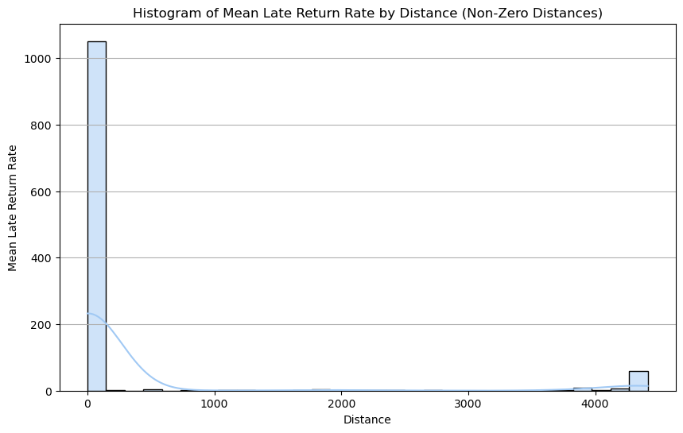
    


```python
valid_checkouts['checkout_year'] = valid_checkouts['date_checkout'].dt.year

```


```python
valid_checkouts['checkout_month'] = valid_checkouts['date_checkout'].dt.month

```


```python
# Adding a function to map month to season
def get_season(month):
    if month in [12, 1, 2]:
        return 'Winter'
    elif month in [3, 4, 5]:
        return 'Spring'
    elif month in [6, 7, 8]:
        return 'Summer'
    else:
        return 'Autumn'

valid_checkouts['season'] = valid_checkouts['checkout_month'].apply(get_season)
```


```python
valid_checkouts_2018 = valid_checkouts[valid_checkouts['checkout_year'] == 2018]

seasonal_counts_2018 = valid_checkouts_2018.groupby('season').size().reindex(['Winter', 'Spring', 'Summer', 'Autumn']).fillna(0)

plt.figure(figsize=(10, 6))
seasonal_counts_2018.plot(kind='bar', color=['#1f77b4', '#ff7f0e', '#2ca02c', '#d62728'])

plt.title('Seasonal Analysis of Rental Book - 2018', fontsize=14, fontweight='bold')
plt.xlabel('Season', fontsize=12)
plt.ylabel('Number of Checkouts', fontsize=12)
plt.xticks(rotation=0, fontsize=10)
plt.yticks(fontsize=10)
plt.grid(axis='y', linestyle='--', linewidth=0.7, alpha=0.7)

plt.gca().spines['top'].set_visible(False)
plt.gca().spines['right'].set_visible(False)

for index, value in enumerate(seasonal_counts_2018):
    plt.text(index, value + 5, str(int(value)), ha='center', va='bottom', fontsize=10)

plt.tight_layout()

plt.show()
```


    
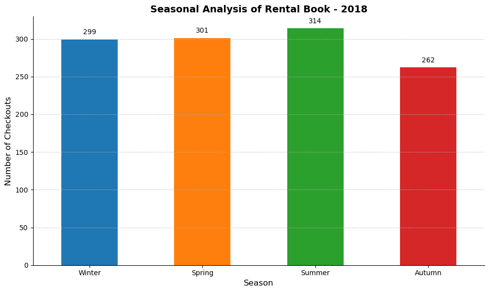
    


```python

valid_checkouts_2018 = valid_checkouts[valid_checkouts['checkout_year'] == 2018]

seasonal_late_rate_2018 = valid_checkouts_2018.groupby('season')['late'].mean().reindex(['Winter', 'Spring', 'Summer', 'Autumn']).fillna(0)

plt.figure(figsize=(10, 6))
seasonal_late_rate_2018.plot(kind='bar', color=['#1f77b4', '#ff7f0e', '#2ca02c', '#d62728'])

plt.title('Seasonal Analysis of Late Return Rate - 2018', fontsize=14, fontweight='bold')
plt.xlabel('Season', fontsize=12)
plt.ylabel('Late Return Rate', fontsize=12)
plt.xticks(rotation=0, fontsize=10)
plt.yticks(fontsize=10)
plt.grid(axis='y', linestyle='--', linewidth=0.7, alpha=0.7)

plt.gca().spines['top'].set_visible(False)
plt.gca().spines['right'].set_visible(False)

for index, value in enumerate(seasonal_late_rate_2018):
    plt.text(index, value, f'{value:.2%}', ha='center', va='bottom', fontsize=10)

plt.tight_layout()

plt.show()

```


    
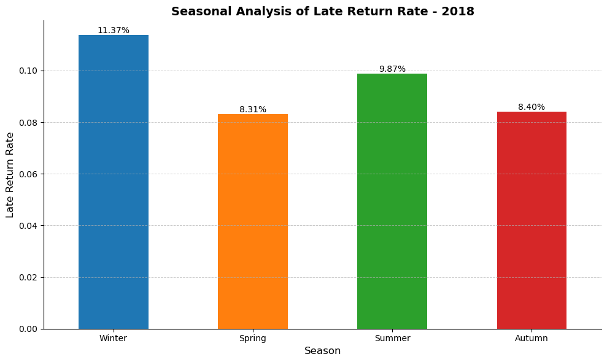
    


```python
late_by_season = valid_checkouts.groupby('season')['late'].mean()

season_order = ['Spring', 'Summer', 'Autumn', 'Winter']
late_by_season = late_by_season.reindex(season_order)

colors = sns.color_palette('pastel')

plt.figure(figsize=(10, 6))
plt.pie(late_by_season.values, labels=None, autopct='%1.1f%%', startangle=140, colors=colors,
        wedgeprops={'edgecolor': 'black', 'linewidth': 1.5}, textprops={'fontsize': 12})
plt.title('Late Return Rate by Season', fontsize=16, fontweight='bold')
plt.axis('equal')  

plt.legend(labels=late_by_season.index, title='Season', title_fontsize='13', fontsize='11', loc='upper left')

plt.show()

```


    
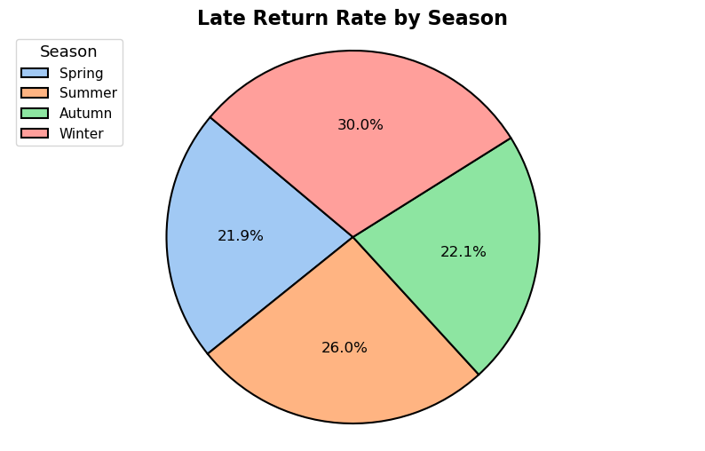
    


```python
valid_checkouts
```


<div>
<style scoped>
    .dataframe tbody tr th:only-of-type {
        vertical-align: middle;
    }

    .dataframe tbody tr th {
        vertical-align: top;
    }

    .dataframe thead th {
        text-align: right;
    }
</style>
<table border="1" class="dataframe">
  <thead>
    <tr style="text-align: right;">
      <th></th>
      <th>id_x</th>
      <th>patron_id</th>
      <th>library_id</th>
      <th>date_checkout</th>
      <th>date_returned</th>
      <th>days_late</th>
      <th>late</th>
      <th>id_y</th>
      <th>name</th>
      <th>street_address_x</th>
      <th>...</th>
      <th>location</th>
      <th>latitude_lib2</th>
      <th>longitude_lib2</th>
      <th>id_customer2</th>
      <th>latitude_customer2</th>
      <th>longitude_customer2</th>
      <th>distance</th>
      <th>checkout_year</th>
      <th>checkout_month</th>
      <th>season</th>
    </tr>
  </thead>
  <tbody>
    <tr>
      <th>0</th>
      <td>HUX-y4oXl04C</td>
      <td>8d3f63e1deed89d7ba1bf6a4eb101373</td>
      <td>223-222@5xc-jxr-tgk</td>
      <td>2018-05-29</td>
      <td>2018-06-12</td>
      <td>-14</td>
      <td>False</td>
      <td>223-222@5xc-jxr-tgk</td>
      <td>MULTNOMAH County Library Woodstock</td>
      <td>6008 se 49TH AVE</td>
      <td>...</td>
      <td>(Woodstock Library, 6008, Southeast 49th Avenu...</td>
      <td>45.479005</td>
      <td>-122.612107</td>
      <td>8d3f63e1deed89d7ba1bf6a4eb101373</td>
      <td>35.184078</td>
      <td>-101.779521</td>
      <td>2097.528182</td>
      <td>2018</td>
      <td>5</td>
      <td>Spring</td>
    </tr>
    <tr>
      <th>1</th>
      <td>TQpFnkku2poC</td>
      <td>4ae202f8de762591734705e0079d76df</td>
      <td>228-222@5xc-jtz-hwk</td>
      <td>2018-11-23</td>
      <td>2019-01-24</td>
      <td>34</td>
      <td>True</td>
      <td>228-222@5xc-jtz-hwk</td>
      <td>Multnomah  County Library</td>
      <td>205 NE   Russell  St</td>
      <td>...</td>
      <td>(205, Northeast Russell Street, Albina, Eliot,...</td>
      <td>45.541181</td>
      <td>-122.663523</td>
      <td>4ae202f8de762591734705e0079d76df</td>
      <td>45.546892</td>
      <td>-122.636607</td>
      <td>2.195835</td>
      <td>2018</td>
      <td>11</td>
      <td>Autumn</td>
    </tr>
    <tr>
      <th>2</th>
      <td>CW-7tHAaVR0C</td>
      <td>dd9f34e9d65126a2b02003d8ac60aaa4</td>
      <td>22c-222@5xc-jwj-pvz</td>
      <td>2018-01-10</td>
      <td>2018-02-04</td>
      <td>-3</td>
      <td>False</td>
      <td>22c-222@5xc-jwj-pvz</td>
      <td>MULTNOMAH County Library KENTON</td>
      <td>8226 N DENVER Ave</td>
      <td>...</td>
      <td>(Kenton Library, 8226, North Denver Avenue, Ke...</td>
      <td>45.582807</td>
      <td>-122.686463</td>
      <td>dd9f34e9d65126a2b02003d8ac60aaa4</td>
      <td>45.570760</td>
      <td>-122.693231</td>
      <td>1.439420</td>
      <td>2018</td>
      <td>1</td>
      <td>Winter</td>
    </tr>
    <tr>
      <th>3</th>
      <td>t1e3BWziAc8C</td>
      <td>3b85b2c7b424618f533329018e9a11d5</td>
      <td>222-222@5xc-jv5-nt9</td>
      <td>2018-06-23</td>
      <td>2018-07-14</td>
      <td>-7</td>
      <td>False</td>
      <td>222-222@5xc-jv5-nt9</td>
      <td>Multnomah  County  Library  North Portland</td>
      <td>512    N Killingsworth St</td>
      <td>...</td>
      <td>(North Portland Library, 512, North Killingswo...</td>
      <td>45.562459</td>
      <td>-122.671537</td>
      <td>3b85b2c7b424618f533329018e9a11d5</td>
      <td>45.541438</td>
      <td>-122.630966</td>
      <td>3.936357</td>
      <td>2018</td>
      <td>6</td>
      <td>Summer</td>
    </tr>
    <tr>
      <th>4</th>
      <td>2mtCAAAAYAAJ</td>
      <td>365ab35282c5d61b319ff9cc3628e624</td>
      <td>228-222@5xc-jtz-hwk</td>
      <td>2018-08-07</td>
      <td>2018-08-25</td>
      <td>-10</td>
      <td>False</td>
      <td>228-222@5xc-jtz-hwk</td>
      <td>Multnomah  County Library</td>
      <td>205 NE   Russell  St</td>
      <td>...</td>
      <td>(205, Northeast Russell Street, Albina, Eliot,...</td>
      <td>45.541181</td>
      <td>-122.663523</td>
      <td>365ab35282c5d61b319ff9cc3628e624</td>
      <td>45.497040</td>
      <td>-122.606563</td>
      <td>6.623709</td>
      <td>2018</td>
      <td>8</td>
      <td>Summer</td>
    </tr>
    <tr>
      <th>...</th>
      <td>...</td>
      <td>...</td>
      <td>...</td>
      <td>...</td>
      <td>...</td>
      <td>...</td>
      <td>...</td>
      <td>...</td>
      <td>...</td>
      <td>...</td>
      <td>...</td>
      <td>...</td>
      <td>...</td>
      <td>...</td>
      <td>...</td>
      <td>...</td>
      <td>...</td>
      <td>...</td>
      <td>...</td>
      <td>...</td>
      <td>...</td>
    </tr>
    <tr>
      <th>1213</th>
      <td>1_1OtAEACAAJ</td>
      <td>250a35a5fcef683b655097c5b8faae0c</td>
      <td>223-222@5xc-jxr-tgk</td>
      <td>2018-12-08</td>
      <td>2018-12-14</td>
      <td>-22</td>
      <td>False</td>
      <td>223-222@5xc-jxr-tgk</td>
      <td>MULTNOMAH County Library Woodstock</td>
      <td>6008 se 49TH AVE</td>
      <td>...</td>
      <td>(Woodstock Library, 6008, Southeast 49th Avenu...</td>
      <td>45.479005</td>
      <td>-122.612107</td>
      <td>250a35a5fcef683b655097c5b8faae0c</td>
      <td>45.380194</td>
      <td>-122.589433</td>
      <td>11.124323</td>
      <td>2018</td>
      <td>12</td>
      <td>Winter</td>
    </tr>
    <tr>
      <th>1214</th>
      <td>TH8SSrWcVQ4C</td>
      <td>6e58a20b8fe97c5f73815046be1c41df</td>
      <td>23v-222@5xc-jv7-v4v</td>
      <td>2018-08-16</td>
      <td>2018-09-05</td>
      <td>-8</td>
      <td>False</td>
      <td>23v-222@5xc-jv7-v4v</td>
      <td>Multnomah County Library Northwest</td>
      <td>2300 NW Thurman  St</td>
      <td>...</td>
      <td>(Northwest Library, 2300, Northwest Thurman St...</td>
      <td>45.535336</td>
      <td>-122.699145</td>
      <td>6e58a20b8fe97c5f73815046be1c41df</td>
      <td>45.513264</td>
      <td>-122.769802</td>
      <td>6.040592</td>
      <td>2018</td>
      <td>8</td>
      <td>Summer</td>
    </tr>
    <tr>
      <th>1215</th>
      <td>rcrCAgAAQBAJ</td>
      <td>ad08956eb20efb746af650f906d439cf</td>
      <td>22d-222@5xc-kcy-8sq</td>
      <td>2018-03-07</td>
      <td>2018-03-13</td>
      <td>-22</td>
      <td>False</td>
      <td>22d-222@5xc-kcy-8sq</td>
      <td>Multnomah County  Library   Sellwood  Moreland</td>
      <td>7860 SE 13th AVE</td>
      <td>...</td>
      <td>(Sellwood Moreland Library, 7860, Southeast 13...</td>
      <td>45.467632</td>
      <td>-122.652746</td>
      <td>ad08956eb20efb746af650f906d439cf</td>
      <td>45.415650</td>
      <td>-122.594283</td>
      <td>7.368748</td>
      <td>2018</td>
      <td>3</td>
      <td>Spring</td>
    </tr>
    <tr>
      <th>1216</th>
      <td>Ci1HAQAAMAAJ</td>
      <td>08b29865e58e9b2aabff9684a703acf0</td>
      <td>223-222@5xc-jxr-tgk</td>
      <td>2018-12-10</td>
      <td>2018-12-29</td>
      <td>-9</td>
      <td>False</td>
      <td>223-222@5xc-jxr-tgk</td>
      <td>MULTNOMAH County Library Woodstock</td>
      <td>6008 se 49TH AVE</td>
      <td>...</td>
      <td>(Woodstock Library, 6008, Southeast 49th Avenu...</td>
      <td>45.479005</td>
      <td>-122.612107</td>
      <td>08b29865e58e9b2aabff9684a703acf0</td>
      <td>45.498634</td>
      <td>-122.547181</td>
      <td>5.524479</td>
      <td>2018</td>
      <td>12</td>
      <td>Winter</td>
    </tr>
    <tr>
      <th>1217</th>
      <td>TUAyAQAAMAAJ</td>
      <td>ac0bb7b22b4df999a0b1216ded727f8e</td>
      <td>228-222@5xc-jtz-hwk</td>
      <td>2018-10-10</td>
      <td>2018-11-01</td>
      <td>-6</td>
      <td>False</td>
      <td>228-222@5xc-jtz-hwk</td>
      <td>Multnomah  County Library</td>
      <td>205 NE   Russell  St</td>
      <td>...</td>
      <td>(205, Northeast Russell Street, Albina, Eliot,...</td>
      <td>45.541181</td>
      <td>-122.663523</td>
      <td>ac0bb7b22b4df999a0b1216ded727f8e</td>
      <td>44.833476</td>
      <td>-122.792309</td>
      <td>79.299627</td>
      <td>2018</td>
      <td>10</td>
      <td>Autumn</td>
    </tr>
  </tbody>
</table>
<p>1176 rows × 47 columns</p>
</div>


```python
# Year extraction from publishedDate column
valid_checkouts['publishedYear'] = valid_checkouts['publishedDate'].apply(lambda x: pd.to_datetime(x, errors='coerce').year)

label_encoders = {}
categorical_columns = ['education', 'gender']

for column in categorical_columns:
    label_encoders[column] = LabelEncoder()
    valid_checkouts[column] = label_encoders[column].fit_transform(valid_checkouts[column].astype(str))

#Removing rows with NaN values
valid_checkouts.dropna(subset=['education', 'gender', 'pages', 'price', 'age', 'publishedYear', 'distance', 'days_late'], inplace=True)

X = valid_checkouts[['education', 'gender', 'pages', 'price', 'age', 'publishedYear', 'distance']]

Y = valid_checkouts['days_late']

# Standardization using Min Max scaler 
scaler = MinMaxScaler()
X_scaled = scaler.fit_transform(X)

# Splitting data into training and testing sets
X_train, X_test, Y_train, Y_test = train_test_split(X_scaled, Y, test_size=0.2, random_state=42)

#PyTorch tensors
X_train_tensor = torch.tensor(X_train, dtype=torch.float32)
X_test_tensor = torch.tensor(X_test, dtype=torch.float32)
Y_train_tensor = torch.tensor(Y_train.values, dtype=torch.float32).view(-1, 1)
Y_test_tensor = torch.tensor(Y_test.values, dtype=torch.float32).view(-1, 1)

#ANN model
class ANN(nn.Module):
    def __init__(self):
        super(ANN, self).__init__()
        self.fc1 = nn.Linear(X_train_tensor.shape[1], 64)
        self.fc2 = nn.Linear(64, 32)
        self.fc3 = nn.Linear(32, 16)
        self.fc4 = nn.Linear(16, 8)
        self.fc5 = nn.Linear(8, 1)
        self.tanh = nn.Tanh()

    def forward(self, x):
        x = self.tanh(self.fc1(x))
        x = self.tanh(self.fc2(x))
        x = self.tanh(self.fc3(x))
        x = self.tanh(self.fc4(x))
        x = self.fc5(x)
        return x

model = ANN()
criterion = nn.MSELoss()
optimizer = optim.Adam(model.parameters(), lr=0.01)  # Learning rate

num_epochs = 128
batch_size = 2
for epoch in range(num_epochs):
    model.train()
    permutation = torch.randperm(X_train_tensor.size()[0])
    for i in range(0, X_train_tensor.size()[0], batch_size):
        optimizer.zero_grad()
        indices = permutation[i:i + batch_size]
        batch_x, batch_y = X_train_tensor[indices], Y_train_tensor[indices]
        outputs = model(batch_x)
        loss = criterion(outputs, batch_y)
        loss.backward()
        optimizer.step()
    
    if (epoch+1) % 10 == 0:
        print(f'Epoch [{epoch+1}/{num_epochs}], Loss: {loss.item():.4f}')

model.eval()
with torch.no_grad():
    Y_pred = model(X_test_tensor)

plt.figure(figsize=(10, 6))
plt.plot(Y_test_tensor.numpy(), label='Actual Late Returns', linestyle='dashed')
plt.plot(Y_pred.numpy(), label='Predicted Late Returns', linestyle='solid')
plt.title('Predicted vs. Actual Late Returns')
plt.xlabel('Samples')
plt.ylabel('Days Late')
plt.legend()
plt.show()

```

    Epoch [10/128], Loss: 11.3560
    Epoch [20/128], Loss: 54.8689
    Epoch [30/128], Loss: 43.9367
    Epoch [40/128], Loss: 50.2664
    Epoch [50/128], Loss: 302.5875
    Epoch [60/128], Loss: 125.4674
    Epoch [70/128], Loss: 11281.9717
    Epoch [80/128], Loss: 318.4840
    Epoch [90/128], Loss: 182.4359
    Epoch [100/128], Loss: 863.1839
    Epoch [110/128], Loss: 51.4557
    Epoch [120/128], Loss: 297.3916
    


    
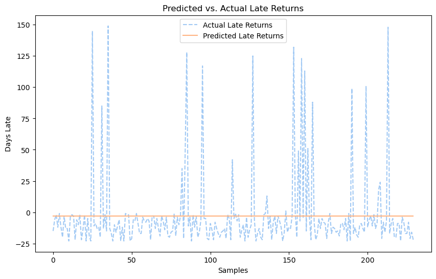
    


```python

valid_checkouts['publishedYear'] = valid_checkouts['publishedDate'].apply(lambda x: pd.to_datetime(x, errors='coerce').year)

# Encode categorical variables
label_encoders = {}
categorical_columns = ['education', 'gender']

for column in categorical_columns:
    label_encoders[column] = LabelEncoder()
    valid_checkouts[column] = label_encoders[column].fit_transform(valid_checkouts[column].astype(str))

valid_checkouts.dropna(subset=['education', 'gender', 'pages', 'price', 'age', 'publishedYear', 'distance', 'late'], inplace=True)

X = valid_checkouts[['education', 'gender', 'pages', 'price', 'age', 'publishedYear', 'distance']]
Y = valid_checkouts['late'].astype(int)

scaler = MinMaxScaler()
X_scaled = scaler.fit_transform(X)

X_train, X_test, Y_train, Y_test = train_test_split(X_scaled, Y, test_size=0.2, random_state=42)

classifiers = {
    'Random Forest': RandomForestClassifier(n_estimators=200, max_features='sqrt', min_samples_split=10, random_state=50),
    'Decision Tree': DecisionTreeClassifier(max_depth=10, criterion='entropy', random_state=50),
    'Gradient Boosting': GradientBoostingClassifier(n_estimators=200, random_state=50),
    'XGBoost': XGBClassifier(eval_metric='logloss', random_state=50)
}


ensemble_clf = VotingClassifier(estimators=list(classifiers.items()), voting='soft')

metrics = {'Classifier': [], 'Accuracy': [], 'Sensitivity': [], 'Precision': [], 'F1 Score': [], 'Specificity': []}

plt.figure(figsize=(12, 12))
for i, (name, clf) in enumerate({**classifiers, 'Ensemble': ensemble_clf}.items(), start=1):
    clf.fit(X_train, Y_train)
    Y_pred = clf.predict(X_test)
    cm = confusion_matrix(Y_test, Y_pred)
    plt.subplot(3, 3, i)
    sns.heatmap(cm, annot=True, fmt='d', cmap='Blues', cbar=False)
    plt.title(f'{name} Confusion Matrix')
    plt.xlabel('Predicted')
    plt.ylabel('Actual')
    
    accuracy = (cm[0, 0] + cm[1, 1]) / np.sum(cm)
    sensitivity = cm[1, 1] / (cm[1, 0] + cm[1, 1])
    precision = cm[1, 1] / (cm[0, 1] + cm[1, 1])
    f1_score = 2 * (precision * sensitivity) / (precision + sensitivity)
    specificity = cm[0, 0] / (cm[0, 0] + cm[0, 1])
    
    metrics['Classifier'].append(name)
    metrics['Accuracy'].append(accuracy)
    metrics['Sensitivity'].append(sensitivity)
    metrics['Precision'].append(precision)
    metrics['F1 Score'].append(f1_score)
    metrics['Specificity'].append(specificity)

plt.tight_layout()
plt.show()

plt.figure(figsize=(10, 7))
for name, clf in {**classifiers, 'Ensemble': ensemble_clf}.items():
    clf.fit(X_train, Y_train)
    Y_pred_proba = clf.predict_proba(X_test)[:, 1]
    fpr, tpr, _ = roc_curve(Y_test, Y_pred_proba)
    roc_auc = auc(fpr, tpr)
    plt.plot(fpr, tpr, label=f'{name} (AUC = {roc_auc:.2f})')

plt.plot([0, 1], [0, 1], 'k--')
plt.xlim([0.0, 1.0])
plt.ylim([0.0, 1.05])
plt.xlabel('False Positive Rate')
plt.ylabel('True Positive Rate')
plt.title('Receiver Operating Characteristic (ROC) Curve')
plt.legend(loc='lower right')
plt.show()

metrics_df = pd.DataFrame(metrics)
print(metrics_df)

```


    
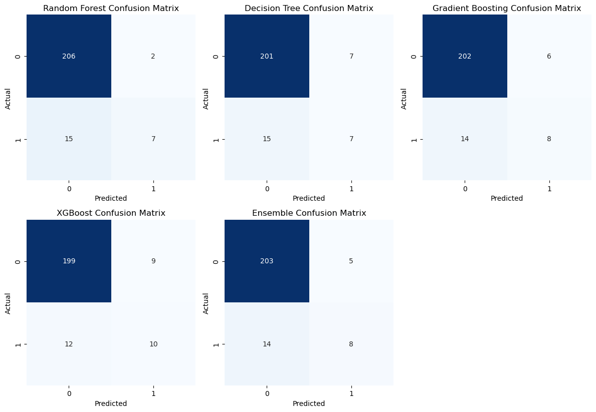
    


    
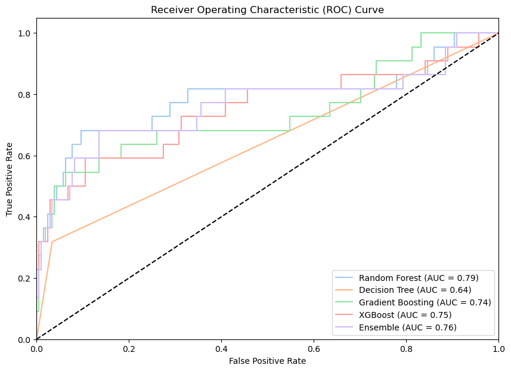
    


              Classifier  Accuracy  Sensitivity  Precision  F1 Score  Specificity
    0      Random Forest  0.926087     0.318182   0.777778  0.451613     0.990385
    1      Decision Tree  0.904348     0.318182   0.500000  0.388889     0.966346
    2  Gradient Boosting  0.913043     0.363636   0.571429  0.444444     0.971154
    3            XGBoost  0.908696     0.454545   0.526316  0.487805     0.956731
    4           Ensemble  0.917391     0.363636   0.615385  0.457143     0.975962
    


```python
data = {
    'Classifier': ['Random Forest', 'Decision Tree', 'Gradient Boosting', 'XGBoost', 'Ensemble'],
    'Accuracy': [0.926087, 0.913043, 0.913043, 0.930435, 0.926087],
    'Sensitivity': [0.478261, 0.565217, 0.434783, 0.521739, 0.434783],
    'Precision': [0.687500, 0.565217, 0.588235, 0.705882, 0.714286],
    'F1 Score': [0.564103, 0.565217, 0.500000, 0.600000, 0.540541],
    'Specificity': [0.975845, 0.951691, 0.966184, 0.975845, 0.980676]
}

df = pd.DataFrame(data)

fig, ax = plt.subplots(figsize=(15, 4.5))  # Set figure size
ax.axis('tight')
ax.axis('off')
table = ax.table(cellText=df.values, colLabels=df.columns, cellLoc='center', loc='center')

table.auto_set_font_size(False)
table.set_fontsize(10)
table.auto_set_column_width(col=list(range(len(df.columns))))

plt.show()

```


    
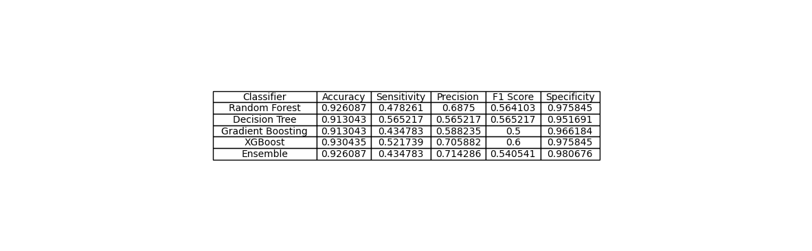
    


```python

```
